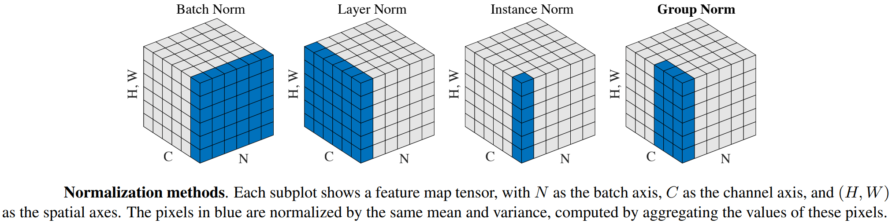

[toc]

# torch.Tensor

本节内容若无特殊说明，均在`torch`模块的命名空间中。

```python
class Tensor(torch._C._TensorBase):
    def __init__(self, *args, device=None)
    def __deepcopy__(self, memo)
    def __repr__(self)
    def storage(self)
    def to(self, device=None, dtype=None, non_blocking=False, copy=False)
    def backward(self, gradient=None, retain_graph=None, create_graph=False, inputs=None)
    def grad(self)
```

tensor.Tensor是包含单一数据类型元素的多维张量。PyTorch定义了10种具有CPU和GPU变体的张量类型。torch.Tensor其实是默认张量类型torch.FloatTensor的别名。

使用torch.Tensor.item()可以从包含单个值的张量中获取Python数值。

改变张量自身的方法用下划线后缀标记。例如，torch.FloatTensor.abs_()就地计算绝对值并返回修改后的张量，而torch.FloatTensor.abs()则创建一个新张量，并在新张量中计算结果。

每个张量都有一个相关的torch.Storage，用于存储数据。torch.Tensor类还提供了storage的多维strided视图，并在其上定义了数值操作。

# Tensor Attributes

本节内容若无特殊说明，均在`torch`模块的命名空间中。

每个torch.Tensor都有torch.dtype、torch.device、torch.layout属性。

## 1. torch.dtype

```python
class dtype(object):
    def __init__(self, *args, **kwargs)
    def __reduce__(self, *args, **kwargs)
    def __repr__(self, *args, **kwargs)
```

torch.dtype是一个对象，表示torch.Tensor的数据类型。PyTorch有12种不同的数据类型，torch.float64、torch.float32、torch.float16、torch.bfloat16、torch.complex128、torch.complex64、torch.int64、torch.int32、torch.int16、torch.int8、torch.uint8、torch.bool。

## 2. torch.device

```python
class device(object):
    def __init__(self, *args, **kwargs)
    def __repr__(self, *args, **kwargs)
    def __str__(self, *args, **kwargs)
```

torch.device是一个对象，表示torch.Tensor被分配或将被分配的所在设备。torch.device包含一个设备类型（如'cpu','cuda','mps'等），和可选的设备序号。如果没有指定设备序号，则表示该设备类型的当前设备。

torch.device对象还可以用作上下文管理器，以更改张量分配的默认设备，如下例子。

```python
with torch.device('cuda:1'):
    r = torch.randn(2, 3)
r.device
"""
device(type='cuda', index=1)
"""
```

## 3. torch.layout

```python
class layout(object):
    def __init__(self, *args, **kwargs)
    def __repr__(self, *args, **kwargs)
```

torch.layout是一个对象，表示torch.Tensor的内存布局。目前，支持torch.strided表示稠密张量（dense Tensors），而对torch.sparse_coo稀疏张量（sparse COO Tensors）的支持尚在beta测试。

可以使用torch.Tensor.storage_offset()方法获得张量的所表示的第一个元素在底层内存存储中的偏移量，如下所示。

```python
def storage_offset(self) -> _int: ...
```

```python
a = torch.tensor([1, 2, 3, 4, 5])
print(a[3:].storage_offset())  # 3
```

可以使用torch.Tensor.stride()方法获得一个张量的跨步属性，一个元组。

```python
def stride(self) -> Tuple[_int, ...]: ...
def stride(self, dim: _int) -> _int: ...
```

首先明确，torch.Tensor多维张量在底层实现中，其底层数据是按照C风格行主序顺序存储的一维数组。torch.Tensor.stride()方法返回一个元组，元组中的元素，表示张量在对应维度轴上的索引增加时，其所对应的底层一维数组的索引应该增加几个元素。如下所示。

```python
x = torch.tensor([i for i in range(3 * 4 * 5 * 6)]).reshape(3, 4, 5, 6)
print(x.stride(), x.stride(dim=0), sep='\n')
"""
(120, 30, 6, 1)
120
"""
```

可以使用在创建Tensor张量时，通过指定memory_format参数，来指定底层数据的存储格式，可选值有torch.contiguous_format连续存储、torch.channels_last按通道维度连续、torch.channels_last_3d按三维通道连续、torch.preserve_format声明仅保留内存（并没有实际分配内存空间）。也可以通过张量的Tensor.contiguous()方法指定张量以某种方式在内存中连续存储。

```python
N, C, H, W = 4, 8, 16, 16
X = torch.randint(0, 10, size=[N, C, H, W])
Y = X.contiguous(memory_format=torch.channels_last)
print(X.is_contiguous(), X.size(), X.stride())
print(Y.is_contiguous(memory_format=torch.channels_last), Y.size(), Y.stride())
"""
True    torch.Size([4, 8, 16, 16])    (2048, 256, 16, 1)
True    torch.Size([4, 8, 16, 16])    (2048, 1, 128, 8)
"""
```

# Tensor Views

本节内容若无特殊说明，均在`torch`模块的命名空间中。

PyTorch允许一个张量是一个现有张量的视图（view），视图张量与其基本张量共享相同的底层数据。视图避免了显式的数据复制，因此允许进行快速和内存高效的reshpae，slicing和element-wise operations。

例如，要获得现有张量t的视图，可以调用t.view()，如下一个例子。

```python
t = torch.tensor([[1, 2, 3], [4, 5, 6]], dtype=torch.float)
b = t.view([3, 2])
print(t.size(), b.size(), t.storage().data_ptr() == b.storage().data_ptr())
b[0][0] = 3.14
print(t[0][0])
"""
torch.Size([2, 3]) torch.Size([3, 2]) True
tensor(3.1400)
"""
```

由于视图与其基本张量共享底层数据，在视图中编辑数据，它也将反映在基本张量中。

需要注意的是，对一个Tensor张量调用view()方法，要求该张量需要按照其维度轴的顺序在内存中是连续的。例如，对于默认的一个多维张量，其底层数据是按C风格在内存中以行主序存储的，此时其维度轴对应数据的顺序默认就是连续的。

通常，大多数torch.Tensor的方法会创建一个新的张量，此时其维度轴对应数据的顺序默认就是连续的。但若是对某个张量调用了torch.transpose()方法或torch.permute()方法，会改变张量的维度轴，Torch为获得快速实现，不会创建新的张量，仅是在逻辑上对张量的元数据（即维度轴、跨度stride、内存格式memory_format等）进行改变，而实际数据在内存的存储顺序并无变化。也即此时维度轴对应的C风格存储顺序，与当前实际数据的存储顺序不对应，若此时调用view()则会出错。

于是，对于维度轴对应数据存储顺序与实际存储顺序不一致的情况，通常是调用torch.transpose()方法或torch.permute()方法之后的张量，需要使用torch.Tensor.contiguous()方法，将该张量数据在内存中的存储顺序变成与维度轴对应顺序一致的，该方法会开辟一块新的内存空间，并按张量当前的维度轴顺序，以C风格将数据在内存中连续存储。可使用torch.Tensor.is_contiguous()方法判断一个张量是否按其维度轴顺序在内存中以C风格行主序连续存储。

另一个选择是使用torch.reshape()对张量进行维度轴变化，该方法总是创建新的张量。例如，如下几个方法是等价的。

```python
tensor = torch.tensor([[1, 2, 3], [4, 5, 6]])
a = torch.transpose(tensor, dim0=-2, dim1=-1).contiguous()
b = torch.permute(tensor, dims=(-1, -2)).contiguous()
c = torch.reshape(tensor, shape=(3, 2))
print(tensor.size(), a.size(), b.size(), c.size())
print(tensor.is_contiguous(), a.is_contiguous(), b.is_contiguous(), c.is_contiguous())
"""
torch.Size([2, 3])      torch.Size([3, 2])      torch.Size([3, 2])      torch.Size([3, 2])
True                    True                    True                    True
"""
```

# torch API

本节内容若无特殊说明，均在`torch`模块的命名空间中。

`torch`包定义了多维张量（Tensors）的数据结构，并定义了其数学运算。此外，它还提供了用于Tensors和任意类型的序列化方法，以及其他实用方法。而且，torch支持CUDA，允许在NVIDIA GPU上运行张量计算，要求GPU计算能力大于等于3.0。

## 1. Tensors

需要注意的是，一般情况下，张量操作方法xxx()不会改变原张量，而是创建一个新张量，或返回原张量的某个视图，与之对应的为后缀下划线的xxx_()方法，表示就地（in-place）操作，会改变原张量。

```python
def is_tensor(obj) -> bool
```

如果obj是PyTorch张量，则返回True。注意，该函数只是执行`isinstance(obj,Tensor)`，建议使用isinstance()而不是is_tensor()。

```python
def is_storage(obj) -> bool
```

如果obj是PyTorch存储对象，则返回True。

```python
def is_complex(input) -> bool
```

如果input的数据类型是复数，即torch.complex64和torch.complex128之一，则返回True。

```python
def is_floating_point(input) -> bool
```

如果input张量的数据类型是浮点数据类型，即torch.float64、torch.float32、torch.float16和torch.bfloat16之一，则返回True。

```python
def set_default_dtype(d)
```

将Tensor默认的浮点dtype设置为某个类型d，支持torch.float32和torch.float64类型。当然也可设置其他类型，但不一定如预期那样起作用。

当PyTorch被初始化时，它的默认浮点dtype是torch.float32，使用set_default_dtype(torch.float64)的目的是提供类似于NumPy的类型推断。

当默认浮点dtype是float32时，默认复数dtype是complex64；当默认浮点dtype是float64时，默认复数dtype是complex128。

```python
def get_default_dtype() -> torch.dtype
```

获取当前默认的浮点数的torch.dtype。

```python
def set_default_device(device)
```

设置torch.Tensor默认要在什么device设备上分配。这不会影响使用显式device参数调用函数。

要临时更改默认的分配device，推荐使用`torch.device(device)`代替，而不是使用全局的set_default_device()。

默认分配的设备为'cpu'，如果将默认设备设置为另一个没有设备索引的设备（例如，'cuda'），则张量会默认分配到该设备类型的当前设备上。如下一个例子所示。

```python
torch.tensor([1.2, 3]).device
torch.set_default_device('cuda')  # current device is 0
torch.tensor([1.2, 3]).device
torch.set_default_device('cuda:1')
torch.tensor([1.2, 3]).device
"""
device(type='cpu')
device(type='cuda', index=0)
device(type='cuda', index=1)
"""
```

```python
def numel(input) -> int
```

返回input张量中元素的总数。

```python
def set_printoptions(precision=None, threshold=None, edgeitems=None, linewidth=None, profile=None, sci_mode=None)
```

打印的一些选项，与NumPy的打印选项一致。

### 1.1 Creation Ops

除了此处列出的一些创建操作，在Random sampling小节，也列出了一些创建随机Tensor的方法。

```python
def tensor(data, *, dtype=None, device=None, requires_grad=False, pin_memory=False) -> Tensor
```

总是通过复制data（而不是共享存储），来构建一个Tensor，它没有autograd历史记录（history），也即Leaf Tensor，可参阅autograd机制。

- data参数(array_like)，张量的初始数据。可以是标量、列表、元组、NumPy.ndarray其他类型。

为了可读性，当使用一个张量创建另一个张量时，推荐使用`torch.Tensor.clone()`、`torch.Tensor.detach()`和`torch.Tensor.requires_grad_()`。若t为一个张量，调用torch.tensor(t)等价于t.clone().detach()，调用tensor(t,requires_grad=True)等价于t.clone().detach().requires_grad_(True)。

```python
def asarray(obj, *, dtype=None, device=None, copy=None, requires_grad=False) -> Tensor
```

将obj对象转换为Tensor。对象obj可以是Tensor、NumPy数组或NumPy标量、DLPack capsule、实现Python buffer协议的对象、标量、标量序列。具体行为由obj对象类别和函数参数控制，详见PyTorch文档。

```python
def as_tensor(data, dtype=None, device=None) -> Tensor
```

将data转换为Tensor，尽可能共享数据（避免复制），并保留autograd历史记录。如果data是一个具有相同dtype和device的NumPy数组（ndarray），则使用torch.from_numpy()构建一个张量。

```python
def from_numpy(ndarray) -> Tensor
```

使用numpy.ndarray创建一个Tensor，返回的Tensor和ndarray共享相同的内存。对Tensor的修改将反映在ndarray中，反之亦然。返回的张量是不可resize的。

不支持将数据写入从只读NumPy数组创建的Tensor，这会导致未定义的行为。

```python
def zeros(*size, *, out=None, dtype=None, layout=torch.strided, device=None, requires_grad=False) -> Tensor
```

创建一个由标量值0填充的Tensor，其形状由参数size决定。

- size参数(int...)，定义输出Tensor形状的整数序列，可以是可变数量的参数，也可以是列表或元组等集合。

```python
def zeros_like(input, *, dtype=None, layout=None, device=None, requires_grad=False, memory_format=torch.preserve_format) -> Tensor
```

创建一个由标量值0填充的Tensor，其size与input张量相同。torch.zeros_like(input)等价于torch.zeros(input.size(),dtype=input.dtype,layout=input.layout,device=input.device)。

```python
def ones(*size, *, out=None, dtype=None, layout=torch.strided, device=None, requires_grad=False) -> Tensor
```

创建一个由标量值1填充的Tensor，其形状由参数size决定。

```python
def ones_like(input, *, dtype=None, layout=None, device=None, requires_grad=False, memory_format=torch.preserve_format) -> Tensor
```

创建一个由标量值1填充的Tensor，其size与input张量相同。


```python
def empty(*size, *, out=None, dtype=None, layout=torch.strided, device=None, requires_grad=False, pin_memory=False, memory_format=torch.contiguous_format) -> Tensor
```

创建一个元素未初始化的Tensor，其形状由参数size决定。

```python
def empty_like(input, *, dtype=None, layout=None, device=None, requires_grad=False, memory_format=torch.preserve_format) -> Tensor
```

创建一个元素为初始化的Tensor，其size与input张量相同。

```python
def full(size, fill_value, *, out=None, dtype=None, layout=torch.strided, device=None, requires_grad=False) -> Tensor
```

创建一个元素值由标量fill_value填充的Tensor，其形状由参数size决定。张量的dtype是由fill_value推断出来的。

```python
def full_like(input, fill_value, *, dtype=None, layout=torch.strided, device=None, requires_grad=False, memory_format=torch.preserve_format) -> Tensor
```

创建一个元素值由标量fill_value填充的Tensor，其size与input张量相同。

```python
def eye(n, m=None, *, out=None, dtype=None, layout=torch.strided, device=None, requires_grad=False) -> Tensor
```

创建一个对角线上为1，其他位置为0的2维张量。

- n参数(int)，行数。

- m参数(int)，列数，默认与n相同。

```python
def complex(real, imag, *, out=None) -> Tensor
```

创建一个元素类型为复数的Tensor，它的实部为real，虚部为imag。

- real参数(Tensor)，复数Tensor的实部值组成的Tensor，dtype必须是float或double类型。

- imag参数(Tensor)，复数Tensor的虚部值组成的Tensor，dtype必须与real相同。

```py
def arange(start=0, end, step=1, *, out=None, dtype=None, layout=torch.strided, device=None, requires_grad=False) -> Tensor
```

创建一个size为$\left\lceil\frac{\text{end}-\text{start}}{\text{step}}\right\rceil$的1维Tensor，它的值为区间[start,end)中的值，从start开始，以step为公差，直到最后一个小于end的值。

注意，在与end进行比较时，非整数step会有浮点数舍入误差，为了避免不一致，建议在这种情况下为end添加一个小的epsilon值。

```python
def linspace(start, end, steps, *, out=None, dtype=None, layout=torch.strided, device=None, requires_grad=False) -> Tensor
```

创建一个size为steps的1维Tensor，其值从start到end均匀间隔（包括两端），其值的公式为
$$
[ \text{start}, \text{start}+\frac{\text{end}-\text{start}}{\text{steps}-1}, \cdots, \text{start}+(\text{steps}-2)*\frac{\text{end}-\text{start}}{\text{steps}-1}, \text{end} ]
$$

```python
def logspace(start, end, steps, base=10.0, *, out=None, dtype=None, layout=torch.strided, device=None, requires_grad=False) -> Tensor
```

创建一个size为steps的1维Tensor，其值的公式为
$$
[ \text{base}^\text{start}, \text{base}^{(\text{start}+\frac{\text{end}-\text{start}}{\text{steps}-1})}, \cdots, \text{base}^{(\text{start}+(\text{steps}-2)*\frac{\text{end}-\text{start}}{\text{steps}-1})}, \text{base}^{\text{end}} ]
$$

### 1.2 Indexing Ops

```python
def argwhere(input) -> Tensor
```

返回一个Tensor，其元素为input张量中所有非零元素索引。结果的每一行为input张量中非零元素的索引。结果按字典序排序，最后一个索引变化最快（C风格）。

如果input张量具有$n$个维度，则结果索引张量的size为$z\times n$，其中$z$是input张量中非零元素的总数。

```python
def where(condition, input, other, *, out=None) -> Tensor
```

返回一个Tensor，它根据条件condition张量，从input或other中选择的元素。需要注意，condition张量、input、other都需要是可广播的。

该操作定义为
$$
\text{out}_i = \begin{cases}
\text{input}_i & \text{if condition}_i \\
\text{other}_i & \text{otherwise}
\end{cases}
$$

- condition参数(BoolTensor)，当为True时，选择input张量的元素，否则选择other张量的元素。

- input参数(Tensor or Scalar)，在condition为True时的索引处，选择input的值。

- other参数(Tensor or Scalar)，在condition为False时的索引处，选择other的值。

```python
x = torch.randn(2, 3)
x = torch.where(x > 0.0, x, torch.zeros_like(x))
"""
tensor([[ 1.5095, -0.1852, -0.7136],
        [ 0.5290, -0.5175,  0.7390]])
tensor([[1.5095, 0.0000, 0.0000],
        [0.5290, 0.0000, 0.7390]])
"""
```

```python
def index_select(input, dim, index, *, out=None) -> Tensor
```

返回一个新Tensor，该张量是沿着维度dim，使用索引index中的元素，对input张量进行索引所得到的。其中index索引张量是一个LongTensor。返回的张量与input张量具有相同的维度，dim维度的维数与index的长度相同，其他维度的维数与原始input张量相同。

返回的张量不使用与原始张量相同的存储。

```python
x = torch.arange(3 * 4).reshape(3, 4)
indices = torch.tensor([0, 2])
x.index_select(0, indices)
x.index_select(1, indices)
"""
tensor([[ 0,  1,  2,  3],
        [ 4,  5,  6,  7],
        [ 8,  9, 10, 11]])
"""
"""
tensor([[ 0,  1,  2,  3],
        [ 8,  9, 10, 11]])
tensor([[ 0,  2],
        [ 4,  6],
        [ 8, 10]])
"""
```

```python
def select(input, dim, index) -> Tensor
```

沿着给定dim维度，按索引index，对input张量进行切片。其中index索引张量是一个LongTensor。该函数返回input张量去掉给定dim维度后的视图（view）。例如，x.select(1,index)等价于x[:,index]。

```python
def take(input, index) -> Tensor
```

返回一个新的Tensor，该张量是使用索引index中的元素，对input张量进行索引所得到的。在这个过程中，input张量被视为1维张量。结果与index索引张量的形状相同。

```python
x = torch.tensor([[4, 3, 5],
                  [6, 7, 8]])
x.take(torch.tensor([0, 2, 5]))
"""
tensor([ 4,  5,  8])
"""
```

```python
def narrow(input, dim, start, length) -> Tensor
```

返回一个新的Tensor，该张量是通过在input张量的dim维度轴上，截取索引为[start, start+length)的元素而得到的。新的张量与原来的input张量共享底层的存储数据。

```python
x = torch.tensor([[1, 2, 3], [4, 5, 6], [7, 8, 9]])
x.narrow(1, 1, 2)
"""
tensor([[ 2,  3],
        [ 5,  6],
        [ 8,  9]])
"""
```

### 1.3 Slicing Ops

```python
def chunk(input, chunks, dim=0) -> List of Tensors
```

尝试将input张量在dim维度上，分割为指定chunks数量的块。每个chunk块都是input张量的视图（view）。注意，这个函数可能返回少于指定数量的块。

沿着给定dim维度，如果可以被chunks整除，则所有返回的块都将具有相同的size；如果不能被chunks整除，则除最后一个块外，所有返回的块将具有相同的size；如果不能这样除法，该函数可能返回少于指定数量的块。

```python
def split(input, split_size_or_sections, dim=0) -> List of Tensors
```

把input张量分成若干块，每个块都是原始张量的一个视图。

如果split_size_or_sections参数是一个整数类型，那么input张量将沿着给定的dim维度，被分割成相等size的块（如果可能的话）；如果沿着给定的dim维度，张量大型不能被split_size整除，最后一个块将更小。

如果split_size_or_sections参数是一个整数列表，那么张量将沿着给定的dim维度，根据split_size_or_sections列表中的各值，被分割成size相应的块，共有len(split_size_or_sections)块。

```python
x = torch.arange(12).reshape(2, 6)
x.split([2, 4], dim=1)
"""
tensor([[ 0,  1,  2,  3,  4,  5],
        [ 6,  7,  8,  9, 10, 11]])
"""
"""
(
tensor([[0, 1],
        [6, 7]]),
tensor([[ 2,  3,  4,  5],
        [ 8,  9, 10, 11]])
)
"""
```

### 1.4 Joining Ops

```python
def cat(tensors, dim=0, *, out=None) -> Tensor
def concat(tensors, dim=0, *, out=None) -> Tensor
def concatenate(tensors, axis=0, out=None) -> Tensor
```

在给定dim维度上连接给定的tensors张量序列。所有张量（除了连接维度外）必须具有相同的形状，或者为空。

- tensors参数(sequence of Tensors)，任何相同类型的Python张量序列，提供的非空张量除了cat维度外，必须具有相同的形状。

- dim参数(int)，tensors被连接的维度。


```python
def vstack(tensors, *, out=None) -> Tensor
```

按垂直顺序（行）堆叠tensors。这等价于，将Tensors沿索引为0的轴进行连接。

```python
def hstack(tensors, *, out=None) -> Tensor
```

按水平顺序（列）堆叠tensors。这等价于，将Tensors沿索引为1的轴进行连接。

```python
def stack(tensors, dim=0, *, out=None) -> Tensor
```

沿着给定的新维度dim连接tensors序列，所有的tensors需要具有相同的size。返回的张量会多出一个dim维度，dim取值可为[0,input.dim()]，或者为[-(input.dim()+1), -1]。

```python
x = torch.arange(0, 6).reshape(2, 3)
y = torch.arange(6, 12).reshape(2, 3)
torch.stack([x, y], dim=0)
torch.stack([x, y], dim=1)
torch.stack([x, y], dim=2)
"""
tensor([[0, 1, 2],
        [3, 4, 5]])
tensor([[ 6,  7,  8],
        [ 9, 10, 11]])
"""
"""
torch.Size([2, 2, 3])
tensor([[[ 0,  1,  2],
         [ 3,  4,  5]],
        [[ 6,  7,  8],
         [ 9, 10, 11]]])

torch.Size([2, 2, 3])
tensor([[[ 0,  1,  2],
         [ 6,  7,  8]],
        [[ 3,  4,  5],
         [ 9, 10, 11]]])

torch.Size([2, 3, 2])
tensor([[[ 0,  6],
         [ 1,  7],
         [ 2,  8]],
        [[ 3,  9],
         [ 4, 10],
         [ 5, 11]]])
"""
```

```python
def tile(input, dims) -> Tensor
```

通过重复input张量的元素构建一个新的Tensor。参数dims指定了每个维度上的重复次数。

如果dims指定的维度比input的维度少，则在dims前面添加1，直到维度相匹配。例如，如果input形状为(8,6,4,2)，且dims为(2,2)，则dims被视为(1,1,2,2)。

类似地，如果input的维度少于dims指定的维度，则在input前面添加1，直到维度相匹配。例如，如果input形状为(4,2)，且dims为(3,3,2,2)，则将input视为形状(1,1,4,2)。

```python
x = torch.tensor([1, 2, 3])
y = torch.tensor([[1, 2], [3, 4]])
torch.tile(x, (2,))
torch.tile(y, (2, 2))
"""
tensor([1, 2, 3, 1, 2, 3])
tensor([[1, 2, 1, 2],
        [3, 4, 3, 4],
        [1, 2, 1, 2],
        [3, 4, 3, 4]])
"""
```


### 1.5 Mutating Ops

```python
def adjoint(input) -> Tensor
```

返回input张量的共轭转置，结果是一个Tensor视图（view）。

对于复数Tensor来说，x.adjoint()等价于x.transpose(-2,-1).conj()，对于实数Tensor来说，x.adjoint()等价于x.transpose(-2,-1)。

```python
def conj(input) -> Tensor
```

返回input张量的共轭，结果是一个Tensor视图（view）。如果input张量的元素类型不是复数，这个函数返回input本身。

```python
def permute(input, dims) -> Tensor
```

返回input张量按dims维度顺序重排列后的结果，是一个Tensor视图（view）。

```python
x = torch.randn(2, 3)
x.size()
torch.permute(x, [1, 0]).size()
"""
torch.Size([2, 3])
torch.Size([3, 2])
"""
```

```python
def reshape(input, shape) -> Tensor
```

返回一个Tensor，其数据和元素数量与input相同，但形状由shape参数指定。如果可能，连续的input和跨度（stride）兼容的input可以在不复制的情况下进行reshape，返回的张量将是input的视图；否则是一个copy副本。

shape可以是单个维度-1，在这种情况下，它根据剩余维度和input元素的数量来推断结果Tensor。

```python
x = torch.randn(2, 3, 4)
x.reshape(8, -1).size()
"""
torch.Size([8, 3])
"""
```

```python
def squeeze(input, dim=None) -> Tensor
```

返回一个Tensor，删除其中维数为1的所有维度，若使用dim指定维度，则只当dim维度的维数为1时将其删除，其他维度轴保持不动。返回的张量与input张量共享存储空间，因此更改其中一个的内容将更改另一个的内容。

例如，x张量形状为$(A\times1\times B)$，则调用squeeze(x)后的形状变为$(A\times B)$，若调用squeeze(x,dim=0)则保持不变。

需要注意，如果张量的batch维数为1，那么squeeze()会删除batch维度，这可能会导致意外的错误。

```python
def unsqueeze(input, dim) -> Tensor
```

返回一个Tensor，它对input张量在指定的dim维度插入了一个维数为1的维度。返回的张量与input张量共享底层数据。返回的张量会多出一个dim维度，dim取值可为[0,input.dim()]，或者为[-(input.dim()+1), -1]。

```python
x = torch.tensor([1, 2, 3, 4])
torch.unsqueeze(x, 0)
torch.unsqueeze(x, 1)
"""
tensor([[ 1,  2,  3,  4]])
tensor([[ 1],
        [ 2],
        [ 3],
        [ 4]])
"""
```

注意，可手动指定索引为[None]来进行某维度轴上的unsqueeze()，如下操作是等价的。该行为在Numpy中也存在。

```python
a = torch.randn(size=(3, 4, 5))
b = a[:, None, :, :, None]
c = a.unsqueeze(dim=1).unsqueeze(dim=3+1)
print(b.size(), c.size(), torch.allclose(b, c), sep='\n')
"""
torch.Size([3, 1, 4, 5, 1])
torch.Size([3, 1, 4, 5, 1])
True
"""
```

```python
def transpose(input, dim0, dim1) -> Tensor
def swapaxes(input, axis0, axis1) -> Tensor
def swapdims(input, axis0, axis1) -> Tensor
```

返回一个Tensor，它是input张量的转置，即将dim0维度和dim1维度进行了互换。

如果input是一个strided tensor，则得到的输出张量与输入张量共享其底层存储，因此更改其中一个的内容将更改另一个的内容。

```python
x = torch.randn(2, 3)
x.transpose(0, 1).size()
"""
torch.Size([3, 2])
"""
```

```python
def t(input) -> Tensor
```

对input张量的维度0和维度1进行转置，期望input是小于等于2维的张量。

例如，对于0维和1维张量，返回其本身；对于2维张量x，t(x)返回等价于transpose(x,0,1)。

## 2. Generators

```python
class Generator:
    def __init__(self, device='cpu') -> None
```

生成器Generator类，用于管理伪随机数（pseudo random）生成算法的行为。Generator对象在许多就地随机抽样（in-place random sampling）函数中用作关键字参数。

```python
# class Generator:
def initial_seed() -> int
```

返回用于生成随机数的初始种子（seed）。

```python
# class Generator:
def manual_seed(seed) -> Generator
```

设置生成随机数的种子，返回一个torch.Generator对象。建议设置一个较大的种子，即按bit位来看，每位应在0和1之间保持良好平衡，避免在种子中有许多0位。

```python
# class Generator:
def seed() -> int
```

从std::random_device或current time获取一个不确定的随机数，并使用它来为生成器填充种子。

## 3. Random sampling

```python
def seed() -> int
```

将用于生成随机数的种子设置为非确定性随机数，返回用于种子化RNG（random number generator）的64位数字。

```python
def manual_seed(seed) -> Generator
```

设置生成随机数的种子，返回一个torch.Generator对象。

```python
def initial_seed() -> int
```

以Python long类型返回生成随机数的初始种子。

```python
def bernoulli(input, *, generator=None, out=None) -> Tensor
def multinomial(input, num_samples, replacement=False, *, generator=None, out=None) -> LongTensor
def normal(mean, std, *, generator=None, out=None) -> Tensor
def poisson(input, generator=None) -> Tensor
```

上述几个函数使用相应分布来采样随机数，如伯努利分布、多项概率分布、独立正态分布、泊松分布等，具体使用方式见PyTorch官方文档。

```python
def rand(*size, *, generator=None, out=None, dtype=None, layout=torch.strided, device=None, requires_grad=False, pin_memory=False) -> Tensor
```

创建一个Tensor，其元素的值由区间$[0,1)$上的均匀分布的随机数填充，其形状由参数size决定。

```python
def rand_like(input, *, dtype=None, layout=None, device=None, requires_grad=False, memory_format=torch.preserve_format) -> Tensor
```

创建一个Tensor，其元素的值由区间$[0,1)$上的均匀分布的随机数填充，其形状由input张量的形状决定。

```python
def randint(low=0, high, size, *, generator=None, out=None, dtype=None, layout=torch.strided, device=None, requires_grad=False) -> Tensor
```

创建一个Tensor，其元素的值由区间$[\text{low},\text{high})$上的均匀分布的随机整数填充，其形状由参数size决定。

```python
def randint_like(input, low=0, high, *, dtype=None, layout=torch.strided, device=None, requires_grad=False, memory_format=torch.preserve_format) -> Tensor
```

创建一个Tensor，其元素的值由区间$[\text{low},\text{high})$上的均匀分布的随机整数填充，其形状由input张量的形状决定。

```python
def randn(*size, *, out=None, dtype=None, layout=torch.strided, device=None, requires_grad=False, pin_memory=False) -> Tensor
```

创建一个Tensor，其元素的值由正态分布$\mathcal N(0,1)$的随机数填充，其形状由参数size决定。

```python
def randn_like(input, *, dtype=None, layout=None, device=None, requires_grad=False, memory_format=torch.preserve_format) -> Tensor
```

创建一个Tensor，其元素的值由正态分布$\mathcal N(0,1)$的随机数填充，其形状由input张量的形状决定。

```python
def randperm(n, *, generator=None, out=None, dtype=torch.int64, layout=torch.strided, device=None, requires_grad=False, pin_memory=False) -> Tensor
```

返回0到n-1之间整数的随机排列。

除了上述方法外，还有一些在torch.Tensor上定义的就地随机采样函数，例如，torch.Tensor.bernoulli\_()、torch.Tensor.cauchy\_()、torch.Tensor.exponential\_()、torch.Tensor.geometric\_()、torch.Tensor.log_normal\_()、torch.Tensor.normal\_()、torch.Tensor.random\_()、torch.Tensor.uniform\_()等。

## 4. Serialization

```python
def save(obj, f, pickle_module=pickle, pickle_protocol=DEFAULT_PROTOCOL, _use_new_zipfile_serialization=True)
```

将对象obj保存到磁盘文件f中。一个常见的PyTorch约定是使用.pt文件扩展名保存Tensor。

- obj参数，要被保存的对象。

- f参数，类似文件的对象（必须实现write和write），或用字符串或os.PathLike对象表示的文件名。

- pickle_module参数(Any)，用于pickle（序列化）元数据和对象的模块。

- pickle_protocol参数(int)，可以指定来覆盖默认协议。

```python
def load(f, map_location=None, pickle_module=pickle, *, weights_only=False, **pickle_load_args)
```

从文件f中加载用torch.save()保存的对象。torch.load()使用了Python的unpickle功能，但对Tensor的存储做了特殊处理。它们首先在CPU上被反序列化，然后再移动到它们被保存时所在的设备上。如果失败将引发异常，例如，因为运行时系统没有某些设备。

- map_location参数，可以将存储动态地重映射到另一组设备。map_location是一个torch.device对象或一个包含设备标签的字符串（如'cpu'或'cuda:0'等），它表示所有张量应该加载到的位置。

用户可以使用torch.serialization.register_package()注册自定义的位置标签（location tag）、标记（tagging）和反序列化方法。

当在包含GPU张量的文件上调用torch.load()时，这些张量将默认加载到GPU，为避免加载模型checkpoint时使GPU RAM占用激增，可以使用torch.load(f,map_location='cpu')，然后调用model.load_state_dict()方法。

值得注意的是，进行编解码时，默认使用的是UTF-8编码形式。

## 5. Parallelism

```python
def get_num_threads() -> int
```

返回在CPU上用于操作内并行（intra-op parallelism）的线程数。

```python
def set_num_threads(num)
```

设置在CPU上用于操作内并行（intra-op parallelism）的线程数。

为确保使用正确的线程数，先调用调用set_num_threads()，才能运行诸如eager,JIT,autograd的代码。

```python
def get_num_interop_threads() -> int
```

返回在CPU上用于操作间并行（inter-op parallelism）的线程数，例如在JIT解释器中。

```python
def set_num_interop_threads(num)
```

设置在CPU上用于操作间并行（inter-op parallelism）的线程数，例如在JIT解释器中。

该函数只能在开始任何操作间并行之前调用一次。

## 6. Locally disabling gradient computation

上下文管理器torch.no_grad()、torch.enable_grad()和torch.set_grad_enabled()，可以方便地在局部作用域内禁用和启用梯度计算。这些上下文管理器是线程局部的，所以如果使用threading模块将work发送给另一个线程，它们将无法正常工作。

```python
class no_grad(_DecoratorContextManager):
    def __init__(self) -> None
    def __enter__(self) -> None
    def __exit__(self, exc_type, exc_value, traceback) -> None
```

用于“禁用梯度计算”的上下文管理器（可用于Python的with语法）。注意，此API不适用于前向模式自动微分（Forward-mode Automatic Differentiation，AD）。

当确定不会调用Tensor.backward()时，禁用梯度计算对于推理是有帮助的，它将减少计算所需的内存消耗。在这种模式下，每次计算结果都是requires_grad=False，不要求梯度计算，即使输入是requires_grad=True。

这个上下文管理器是线程局部的，不会影响其他线程的计算，也可以用作装饰器（decorator），注意要确保使用圆括号实例化。

```python
x = torch.tensor([1.], requires_grad=True)
with torch.no_grad():
    y = x * 2
y.requires_grad
"""
False
"""

@torch.no_grad()
def doubler(x):
    return x * 2
z = doubler(x)
z.requires_grad
"""
False
"""
```

```python
class enable_grad(_DecoratorContextManager):
    def __enter__(self) -> None
    def __exit__(self, exc_type, exc_value, traceback) -> None:
```

用于“启用梯度计算”的上下文管理器。

这个上下文管理器是线程局部的，不会影响其他线程的计算，也可以用作装饰器（decorator），注意要确保使用圆括号实例化。

```python
x = torch.tensor([1.], requires_grad=True)
with torch.no_grad():
    with torch.enable_grad():
        y = x * 2
y.requires_grad
y.backward()
x.grad
"""
tensor([2.])
"""

@torch.enable_grad()
def doubler(x):
    return x * 2
with torch.no_grad():
    z = doubler(x)
z.requires_grad
"""
True
"""
```

从上示例子可以看到，torch.enable_grad()用于装饰器时比用于with语法时的优先级要高。

```python
class set_grad_enabled(_DecoratorContextManager):
    def __init__(self, mode: bool) -> None
    def __enter__(self) -> None
    def __exit__(self, exc_type, exc_value, traceback) -> None
```

用于“启用或禁用梯度计算”的上下文管理器。set_grad_enabled()会根据mode参数启用或禁用梯度。它可以用作上下文管理器，也可以用作函数。

这个上下文管理器是线程局部的，不会影响其他线程的计算。

```python
x = torch.tensor([1.], requires_grad=True)
is_train = False
with torch.set_grad_enabled(is_train):
    y = x * 2
y.requires_grad
"""
False
"""

torch.set_grad_enabled(True)
y = x * 2
y.requires_grad
torch.set_grad_enabled(False)
y = x * 2
y.requires_grad
"""
True
False
"""
```

```python
def is_grad_enabled() -> bool
```

如果当前启用了梯度计算模式，则返回True。

```python
class inference_mode(_DecoratorContextManager):
    def __init__(self, mode=True) -> None
    def __enter__(self) -> None
    def __exit__(self, exc_type, exc_value, traceback) -> None
```

用于“启用或禁用推理模式”的上下文管理器。

inference_mode是一个类似于no_grad的新的上下文管理器，当确定某些操作与autograd没有交互时，可以使用它。在这种模式下运行的代码，会禁用视图跟踪（view tracking）和版本计数器（version counter）来获得更好的性能。

注意，与其他一些局部启用或禁用grad的机制不同，进入inference_mode同时还会禁用前向模式自动微分。

这个上下文管理器是线程局部的，不会影响其他线程的计算，也可以用作装饰器（decorator），注意要确保使用圆括号实例化。

```python
x = torch.ones([2, 3], requires_grad=True)
with torch.inference_mode():
    y = x * x
y.requires_grad
y._version
"""
False
Traceback (most recent call last):
File "<stdin>", line 1, in <module>
RuntimeError: Inference tensors do not track version counter.
"""

@torch.inference_mode()
def func(x):
    return x * x
out = func(x)
out.requires_grad
"""
False
"""
```

```python
def is_inference_mode_enabled() -> bool
```

如果当前启用了推理模式，则返回True。

## 7. Math operations

### 7.1 Pointwise Ops

```python
# 按位操作
def bitwise_not(input, *, out=None) -> Tensor
def bitwise_and(input, other, *, out=None) -> Tensor
def bitwise_or(input, other, *, out=None) -> Tensor
def bitwise_xor(input, other, *, out=None) -> Tensor
def bitwise_left_shift(input, other, *, out=None) -> Tensor
def bitwise_right_shift(input, other, *, out=None) -> Tensor
# 逻辑操作
def logical_not(input, *, out=None) -> Tensor
def logical_and(input, other, *, out=None) -> Tensor
def logical_or(input, other, *, out=None) -> Tensor
def logical_xor(input, other, *, out=None) -> Tensor
```

```python
def rad2deg(input, *, out=None) -> Tensor
def deg2rad(input, *, out=None) -> Tensor
```

```python
# 三角函数，默认采用弧度（radian）
def sin(input, *, out=None) -> Tensor
def cos(input, *, out=None) -> Tensor
def tan(input, *, out=None) -> Tensor
```

```python
def arcsin(input, *, out=None) -> Tensor
def asin(input, *, out=None) -> Tensor
def arccos(input, *, out=None) -> Tensor
def acos(input, *, out=None) -> Tensor
def arctan(input, *, out=None) -> Tensor
def atan(input, *, out=None) -> Tensor
```

```python
def sinh(input, *, out=None) -> Tensor
def cosh(input, *, out=None) -> Tensor
def tanh(input, *, out=None) -> Tensor
```

```python
def arcsinh(input, *, out=None) -> Tensor
def asinh(input, *, out=None) -> Tensor
def arccosh(input, *, out=None) -> Tensor
def acosh(input, *, out=None) -> Tensor
def arctanh(input, *, out=None) -> Tensor
def atanh(input, *, out=None) -> Tensor
```

```python
# 返回复数张量的实部与虚部
def real(input) -> Tensor
def imag(input) -> Tensor
```

```python
def nan_to_num(input, nan=0.0, posinf=None, neginf=None, *, out=None) -> Tensor
```

将input张量中的NaN、正无穷大、负无穷大替换为由参数nan、posinf、neginf指定的值。默认情况下，NaN会被替换为零，正无穷大会被替换为input张量的dtype所能表示的最大有限值，负无穷大会被替换为input张量的dtype所能表示的最小有限值。

```python
# 边界取值
def ceil(input, *, out=None) -> Tensor
def floor(input, *, out=None) -> Tensor
def clamp(input, min_value=None, max_value=None, *, out=None) -> Tensor
def clip(input, min_value=None, max_value=None, *, out=None) -> Tensor
# 四舍五入
def round(input, *, decimals=0, out=None) -> Tensor
```

$$
\begin{align}
\mathtt{ceil}(x_i) &= \lceil x_i \rceil \\
\mathtt{floor}(x_i) &= \lfloor x_i \rfloor \\
\mathtt{clamp}(x_i) &= \min\set{\max\set{x_i,\text{min\_value}},\text{max\_value}} \\
&= \begin{cases}
\text{min\_value} & x_i < \text{min\_value} \\
x_i & \text{min\_value} \le x_i \le \text{max\_value} \\
\text{max\_value} & x_i > \text{max\_value}
\end{cases} \\
&= \mathtt{clip}(x_i)
\end{align}
$$

```python
# sign()取实数的符号，sgn()可用于复数
def sign(input, *, out=None) -> Tensor
def sgn(input, *, out=None) -> Tensor
```

$$
\mathtt{sgn}(x_i) = \begin{cases}
0 & |x_i| == 0 \\
\dfrac{x_i}{|x_i|} & \text{otherwise}
\end{cases}
$$

```python
# 返回截断的整数值
def trunc(input, *, out=None) -> Tensor
def fix(input, *, out=None) -> Tensor
# 返回截断的小数值
def frac(input, *, out=None) -> Tensor
```

$$
\mathtt{frac}(x_i) = x_i - \text{sgn}(x_i)*\lfloor |x_i| \rfloor
$$

```python
def abs(input, *, out=None) -> Tensor
def absolute(input, *, out=None) -> Tensor
def neg(input, *, out=None) -> Tensor
def negative(input, *, out=None) -> Tensor
def positive(input) -> Tensor
def reciprocal(input, *, out=None) -> Tensor
def sqrt(input, *, out=None) -> Tensor
def square(input, *, out=None) -> Tensor
```

```python
def mul(input, other, *, out=None) -> Tensor
def multiply(input, other, *, out=None) -> Tensor
def div(input, other, *, rounding_mode=None, out=None) -> Tensor
def divide(input, other, *, rounding_mode=None, out=None) -> Tensor
def remainder(input, other, *, out=None) -> Tensor
```

```python
def exp(input, *, out=None) -> Tensor
def exp2(input, *, out=None) -> Tensor
def log(input, *, out=None) -> Tensor
def log2(input, *, out=None) -> Tensor
def log10(input, *, out=None) -> Tensor
```

$$
\begin{align}
\mathtt{exp}(x_i) &= e^{x_i} \\
\mathtt{exp2}(x_i) &= 2^{x_i} \\
\mathtt{log}(x_i) &= \log_e(x_i) = \ln(x_i) \\
\mathtt{log2}(x_i) &= \log_2(x_i) \\
\mathtt{log10}(x_i) &= \log_{10}(x_i)
\end{align}
$$

```python
# 幂运算
def pow(input, exponent, *, out=None) -> Tensor
# 幂运算，总是以双精度torch.float64或torch.complex128进行运算
def float_power(input, exponent, *, out=None) -> Tensor
```

$$
\begin{align}
\mathtt{pow}(x_i,y_i) &= x_i^{y_i} \\
\mathtt{float\_power}(x_i,y_i) &= x_i^{y_i}
\end{align}
$$

### 7.2 Reduction Ops

```python
def argmax(input, dim=None, keepdim=False) -> LongTensor
def argmin(input, dim=None, keepdim=False) -> LongTensor
```

返回一个Tensor，为input张量在dim维度上的“最大值/最小值”的索引（indices）；如果不指定维度dim，则在整个input张量范围内寻找最大值/最小值，此时的索引是将input张量展平（flatten）后的索引。

```python
def max(input, dim=None, keepdim=False, *, out=None)
def min(input, dim=None, keepdim=False, *, out=None)
```

返回一个Tensor，为input张量在dim维度上的所有“最大值/最小值”；如果指定了dim参数，还会返回最大值/最小值在input张量dim维度上的索引，即返回两个Tensor的元组(values,indices)。

如果keepdim为True，输出张量与input张量的形状相同，不过dim维度的维数大小为$1$；否则，输出张量在dim维度上将被压缩（使用torch.squeeze()方法）。如果在dim维度中有多个最大值/最小值，则返回第一个值的索引。

```python
x = torch.tensor([[4, 6, 8], [9, 7, 5]])
torch.argmax(x)
torch.max(x)
torch.max(x, dim=1)
"""
tensor(3)
tensor(9)
torch.return_types.max(
    values  = tensor([8, 9]),
    indices = tensor([2, 0])
)
"""
```

```python
def amax(input, dim, keepdim=False, *, out=None) -> Tensor
def amin(input, dim, keepdim=False, *, out=None) -> Tensor
```

返回一个Tensor，为input张量在dim维度上的所有“最大值/最小值”。

它与max()/min()的不同之处在于，amax()/amin()将梯度均匀地分布在相等的最值之间，而max()/min()仅将梯度传播到原input张量中的单个最值自身的索引。如下一个例子所示。

```python
def aminmax(input, *, dim=None, keepdim=False, out=None) -> (Tensor_min, Tensor_max)
```

返回两个Tensor的元组(min\_tensor,max\_tensor)，为input张量在dim维度上的所有“最大值与最小值”组成的元组。

```python
x = torch.rand([2, 3])
torch.aminmax(x, dim=1)
"""
tensor([[0.6121, 0.1667, 0.1386],
        [0.2023, 0.5363, 0.7112]])
torch.return_types.aminmax(
    min = tensor([0.1386, 0.2023]),
    max = tensor([0.6121, 0.7112])
)
"""
```

```python
def all(input) -> Tensor
def any(input) -> Tensor
```

函数all()用于测试input是否所有元素都为True，函数any()用于测试input是否存在任一元素为True。

```python
tensor = torch.tensor([0, 2, 4, 6, 8])
if (tensor % 2 == 0).all():
    print('All elements in tensor are even.')
else:
    print('At least one element in tensor is odd.')
```

```python
def dist(input, other, p=2) -> Tensor
```

返回input张量与other张量之间的欧几里得距离，即input与other之差的$l_2$范数。

```python
def norm(input, p='fro', dim=None, keepdim=False, out=None, dtype=None) -> Tensor
```

返回给定input张量的矩阵范数或向量范数。

```python
# 均值
def mean(input, *, dtype=None) -> Tensor
def nanmean(input, dim=None, keepdim=False, *, dtype=None, out=None) -> Tensor
# 中位数
def median(input, dim=-1, keepdim=False, *, out=None) -> Tensor
def nanmedian(input, dim=-1, keepdim=False, *, out=None) -> Tensor
# 众数
def mode(input, dim=-1, keepdim=False, *, out=None) -> Tensor
# q分位数
def quantile(input, q, dim=None, keepdim=False, *, interpolation='linear', out=None) -> Tensor
def nanquantile(input, q, dim=None, keepdim=False, *, interpolation='linear', out=None) -> Tensor
```

函数nanxxx()用于计算指定维度上所有非NaN元素的统计值，当input张量中没有NaN值时，它与xxx()相同；如果存在NaN，xxx()会将NaN传播到输出，而nanxxx()将忽略NaN值。

```python
# 累加与累积
def sum(input, dim, keepdim=False, *, dtype=None) -> Tensor
def nansum(input, dim, keepdim=False, *, dtype=None) -> Tensor
def prod(input, dim, keepdim=False, *, dtype=None) -> Tensor
```

```python
# 标准差
def std(input, dim=None, *, correction=1, keepdim=False, out=None) -> Tensor
def std_mean(input, dim=None, *, correction=1, keepdim=False, out=None) -> Tensor
# 方差
def var(input, dim=None, *, correction=1, keepdim=False, out=None) -> Tensor
def var_mean(input, dim=None, *, correction=1, keepdim=False, out=None) -> Tensor
```

```python
# 去掉input张量中的重复元素
def unique(input, sorted=True, return_inverse=False, return_counts=False, dim=None) -> Tuple[Tensor, Tensor, Tensor]
```

```python
def count_nonzero(input, dim=None) -> Tensor
```

### 7.3 Comparison Ops

两个向量间的比较，有相应的函数，但通常可直接使用比较运算符直接进行比较。

```python
def allclose(input, other, rtol=1e-05, atol=1e-08, equal_nan=False) -> bool
```

检查input张量和other张量是否满足条件：
$$
|\text{input}-\text{other}| \le \text{atol}+\text{rtol}\times|\text{other}|
$$
该函数是逐元素（element-wise）的，即用于input和other所有元素。

```python
def argsort(input, dim=-1, descending=False, stable=False) -> Tensor
```

返回一个Tensor，为沿给定dim维度按值升序对input张量排序的索引。

```python
def sort(input, dim=-1, descending=False, stable=False, *, out=None)
```

将input张量的元素沿给定dim维度按值升序进行排序。返回两个Tensor的元组(values,indices)，其中values是排序后的值，indices是input张量中元素的索引。

```python
def isinf(input) -> Tensor
def isposinf(input, *, out=None) -> Tensor
def isneginf(input, *, out=None) -> Tensor
def isfinite(input) -> Tensor
def isnan(input) -> Tensor
def isreal(input) -> Tensor
```

```python
def isin(elements, test_elements, *, assume_unique=False, invert=False) -> Tensor
```

测试elements张量中的每个元素，是否在test_elements张量中存在。

```python
def kthvalue(input, k, dim=None, keepdim=False, *, out=None) -> (Tensor, Tensor)
```

返回两个Tensor的元组(values,indices)，其中values是input张量在维度dim上的第k小元素，indices是每个元素的索引。

```python
def topk(input, k, dim=None, largest=True, sorted=True, *, out=None) -> Tensor
```

返回两个Tensor的元组(values,indices)，其中values是input张量在维度dim上的最大的k个元素，indices是每个元素的索引。

```python
def maximum(input, other, *, out=None) -> Tensor
def minimum(input, other, *, out=None) -> Tensor
```

返回一个Tensor，每个元素是input张量和other张量对应位置上最大/最小的元素。

### 7.4 Spectral Ops

```python
def stft(input, n_fft, hop_length=None, win_length=None, window=None, center=True, pad_mode='reflect', normalized=False, onesided=None, return_complex=None) -> Tensor
def istft(input, n_fft, hop_length=None, win_length=None, window=None, center=True, normalized=False, onesided=None, length=None, return_complex=False) -> Tensor
```

短时傅里叶变换（Short-time Fourier transform，STFT）及其逆变换。

### 7.5 Other Operations

```python
def clone(input, *, memory_format=torch.preserve_format) -> Tensor
```

返回input张量的拷贝副本。该clone()函数是可微的，因此梯度会从clone()的结果流回input。

要创建一个与input没有autograd关系的张量，可使用detach()。函数detach()返回一个与当前计算图（graph）分离的新张量，且结果永远不需要梯度。

```python
def diag(input, diagonal=0, *, out=None) -> Tensor
```

如果input是1维向量，返回由input向量作对角线所构成的2维矩阵。如果input是2维矩阵，将其对角线返回为1维向量。diagonal参数用来控制对角线位置。

```python
def flatten(input, start_dim=0, end_dim=-1) -> Tensor
```

将input张量展平为1维张量。

```python
def view_as_real(input) -> Tensor
```

返回复数input张量的一个视图，结果的形状为(input.shape[:],2)，最后一个维度的维数为2，分别表示复数的实数部分和虚数部分。

```python
def view_as_complex(input) -> Tensor
```

返回实数input张量的一个视图，input的形状需要为(...,2)，最后一个维度的维数为2，分别表示复数的实数部分和虚数部分。

```python
x = torch.tensor([1 + 2j, 3 - 4j])
y = torch.tensor([[1, 2], [3, -4]], dtype=torch.float)
torch.view_as_real(x)
torch.view_as_complex(y)
"""
tensor([[ 1.,  2.],
        [ 3., -4.]])
tensor([1.+2.j, 3.-4.j])
"""
```

### 7.6 BLAS and LAPACK Operations

BLAS（Basic Linear Algebra Subprograms）即基础线性代数子程序库，提供大量关于线性代数运算的程序。LAPACK（Linear Algebra PACKage）即线性代数包，用于求解科学与工程计算中最常见的数值线性代数问题，如求解线性方程组、线性最小二乘问题、特征值问题和奇异值问题等。

```python
def mm(input, mat2, *, out=None) -> Tensor
```

计算input矩阵与mat2矩阵的乘法。如果input是$n\times m$维，mat2是$m\times p$维，输出张量是$n\times p$维。

```python
def bmm(input, mat2, *, out=None) -> Tesnor
```

计算input矩阵与mat2矩阵的批量矩阵乘法，input和mat2必须是包含相同数量矩阵的3维张量。如果input是$b\times n\times m$维，mat2是$b\times m\times p$维，输出张量是$b\times n\times p$维。

```python
def mv(input, vec, *, out=None) -> Tesnor
```

计算input矩阵与vec向量的矩阵向量乘法。如果input是$n\times m$维，vec是$m\times1$维，输出张量是$n\times1$维。

```python
def matmul(input, other, *, out=None) -> Tensor
```

计算input张量与other张量的矩阵乘积，其行为取决于张量的维度。

- 如果两个张量都是1维的，则返回dot()点积（标量）。
- 如果两个张量都是2维的，则返回矩阵与矩阵的乘积。
- 如果第一个张量是1维的，第二个张量是2维的，则在第一个张量的维度前加1，用于矩阵相乘。在矩阵相乘之后，前置维度被移除。
- 如果第一个张量是2维的，第二个张量是1维的，则返回矩阵与向量的乘积。
- 如果两个张量都至少是1维的，并且至少有一个张量是N维的（$N>2$），然后返回一个批处理的矩阵乘法。

```python
def dot(input, other, *, out=None) -> Tesnor
```

计算两个1维向量的点积。

```python
def inner(input, other, *, out=None) -> Tesnor
```

计算input张量与other张量在最后一个维度的内积（即在最后一个维度进行点积运算）；对于1维张量，它等同于dot()点积。

```python
def outer(input, vec2, *, out=None) -> Tesnor
```

计算input张量和vec2张量的外积。如果input是$n$维向量，vec2是$m$维向量，输出张量是$n\times m$维。

# torch.nn

本节内容若无特殊说明，均在`torch.nn`模块的命名空间中。这些是计算图的基本构建模块。

```python
class Parameter(torch.Tensor):
    def __new__(cls, data=None, requires_grad=True)
```

Parameter类用来表示模型参数，其本质上是torch.Tensor的子类。

不过，Parameter在与Module一起使用时具有特殊性，即当它们被指定为Module属性时，它们将自动添加到其参数列表（list of parameters）中，并将出现在诸如Module.parameters()之类的迭代器中。而将Tensor指定为Module的属性并没有这样的效果。

```python
class UninitializedParameter(torch.Tensor):
    def __init__(self, data, requires_grad)
    def materialize(self, shape, device=None, dtype=None)
```

未初始化的模型参数UninitializedParameter，这是Parameter的一种特殊情况，其数据及形状是未知的。

未初始化参数没有数据，试图访问某些属性（如形状），则会抛出运行时错误。对未初始化参数可以执行的唯一操作是materialize()，更改其数据类型dtype，将其移动到不同的device，并将其转换为常规的Parameter参数。

```python
class UninitializedBuffer(torch.Tensor):
    def __init__(self, data, requires_grad)
    def materialize(self, shape, device=None, dtype=None)
```

未初始化的缓冲区UninitializedBuffer，这是torch.Tensor的一种特殊情况，其数据及形状是未知的。缓冲区中的是“非模型参数，但与模型参数一样需要由Module保存”的数据，如BatchNorm基于数据集的统计量信息。

未初始化缓冲区没有数据，试图访问某些属性（如形状），则会抛出运行时错误。对未初始化参数可以执行的唯一操作是materialize()，更改其数据类型dtype，将其移动到不同的device，并将其转换为常规的torch.Tensor张量。

## 1. Containers

### 1.1 Module

```python
class Module:
    training: bool
    def __init__(self) -> None
```

所有神经网络模块（neural network modules）的基类，自定义模型也需要继承这个类。属性training为True表示此Module是处于训练模式，否则是处于评估（evaluation）模式。

Module还可以包含其他Module，允许将它们嵌套在树形结构中。可以将子Module赋值为父Module的普通属性。以这种方式分配的子Module将被注册到网络模型中，并在调用父Module的诸如to()之类的方法时，同时会转换子Module的相应属性（如模型参数等）。

```python
class Module:
    def train(self, mode=True)
    def eval(self)
```

train()方法，将Module设置为训练模式。

eval()方法，将Module设置为评估模式，等价于调用train(False)方法。

这只对某些模块有影响，它们在training和evaluation模式下有不同的行为，如Dropout和BatchNorm等，具体请参阅特定文档。

```python
class Module:
    forward: Callable[..., Any] = _forward_unimplemented
def _forward_unimplemented(self, *input: Any) -> None:
    raise NotImplementedError
```

定义每次按Module()形式调用时执行的计算，所有子类都应该实现该方法。

```python
class Module:
    def add_module(self, name, module) -> None
    def register_module(self, name, module) -> None
    def register_parameter(self, name, param) -> None
```

add_module()方法，向当前Module添加一个子Module，当前Module可以使用给定的名称name作为属性访问子Module。

register_module()方法，是add_module()方法的别名。

register_parameter()方法，向当前Module添加一个Parameter参数，当前Module可以使用给定的名称name作为属性访问该Parameter参数。

```python
class Module:
    def modules(self) -> Iterator['Module']
    def named_modules(self, memo=None, prefix='', remove_duplicate=True) -> Iterator[Tuple[str, Module]]
    def get_submodule(self, target) -> "Module"
    def children(self) -> Iterator['Module']
    def named_children(self) -> Iterator[Tuple[str, 'Module']]
```

modules()方法，返回网络模型中所有Module上的迭代器。重复的Module只会返回一次。

named_modules()方法，返回网络模型中所有Module的迭代器，返回Module名称和其本身。重复的Module只会返回一次。

get_submodule()方法，返回target指定的子Module，如果不存在则抛出错误，该方法可以跨代查找（即可以查找非直接子代Module）。

children()方法，返回直接子Module上的迭代器。

named_children()方法，返回直接子Module的迭代器，返回Module名称和其本身。

```python
class Module:
    def parameters(self, recurse=True) -> Iterator[Parameter]
    def named_parameters(self, prefix='', recurse=True) -> Iterator[Tuple[str, Parameter]]
    def get_parameter(self, target) -> "Parameter"
```

parameters()方法，返回模型参数的迭代器。通常会将其传递给优化器（optimizer）。

named_parameters()方法，返回模型参数的迭代器，返回Parameter名称和其本身。

get_paramets()方法，返回target指定的模型参数，如果不存在则抛出错误。

```python
class Module:
    def state_dict(self, destination=None, prefix='', keep_vars=False)
    def load_state_dict(self, state_dict, strict=True)
```

state_dict()方法，返回一个状态字典，其包含Module全部状态的引用。模型参数parameters和缓冲区buffers（如运行平均值，running averages）都包含在状态字典内，字典的键是对应的参数名和缓冲区名。字典不包括设置为None的参数和缓冲区。

load_state_dict()方法，将模型参数parameters和缓冲区buffers从状态字典state_dict复制到这个Module及其子Module中。如果strict为True，则state_dict的键必须与此Module的state_dict()函数返回的键完全匹配。

state_dict()方法和load_state_dict()方法的使用示例如下所示。

```python
# For saving
torch.save(
    obj={'model': model.state_dict(), 'optimizer': optimizer.state_dict(),
         'lr_scheduler': lr_scheduler.state_dict(), 'epoch': epoch, 'config': cfg}, 
    f=checkpoint_path)

# For loading or resuming
model = MyModel()
optimizer = torch.optim.SGD()
lr_scheduler = torch.optim.lr_scheduler.ExponentialLR()

checkpoint = torch.load(checkpoint_path)
model.load_state_dict(checkpoint['model'])
optimizer.load_state_dict(checkpoint['optimizer'])
lr_scheduler.load_state_dict(checkpoint['lr_scheduler'])
start_opoch = checkpoint['epoch'] + 1
```

```python
class Module:
    def requires_grad_(self, requires_grad=True)
    def zero_grad(self, set_to_none=False)
```

requires\_grad\_()方法，设置autograd是否应该记录此Module中对模型参数的操作。该方法会设置模型参数的requires_grad属性。这种方法有助于冻结Module的一部分，以进行微调或单独训练模型的某部分。

zero_grad()方法，将所有模型参数的梯度设置为零。

```python
class Module:
	def to(self, device, dtype, non_blocking)
    def type(self, dst_type)
```

to()方法，移动与强制转换模型参数和缓冲区，就地修改Module。当设置non_blocking=True时，它尝试相对于主机进行异步移动/转换，例如，将具有固定内存的CPU张量移动到CUDA设备。

type()方法，将所有模型参数和缓冲区的数据类型强制转换为dst_type。

### 1.2 Module Containers

```python
class Sequential(Module):
    def __init__(self, *args) -> None
    def append(self, module) -> 'Sequential'
```

持有多个Module的顺序容器。Sequential类的forward()方法接受任何输入，并将其转发给它包含的第一个Module，然后将第一个Module的输出转发给后续Module的输入，依次类推，最后返回最后一个Module的输出。

与手动调用Module序列相比，Sequential允许将整个容器视为单个Module，这样对Sequential执行转换会应用于它存储的每个Module（都是Sequential的注册子Module）。

```python
class ModuleList(Module):
    def __init__(self, modules=None) -> None
    def insert(self, index, module) -> None
    def append(self, module) -> 'ModuleList'
    def extend(self, modules) -> 'ModuleList'
```

持有多个Module的列表。ModuleList可以像普通的Python列表一样被索引，但它包含的Module是被正确注册的。

Sequential和ModuleList的区别在于，Sequential中的Module以级联的方式连接，而ModuleList就是一个用来存储Module的列表。

```python
class ModuleDict(Module):
    def __init__(self, modules=None) -> None
    def clear(self) -> None:
    def pop(self, key) -> Module
    def keys(self) -> Iterable[str]
    def values(self) -> Iterable[Module]
    def items(self) -> Iterable[Tuple[str, Module]]
    def update(self, modules) -> None
```

持有多个Module的字典。ModuleDict可以像普通的Python字典一样被访问，但它包含的Module是被正确注册的。

### 1.3 Parameter Containers

```python
class ParameterList(Module):
    def __init__(self, parameters=None) -> None
    def append(self, parameter) -> 'ParameterList'
    def extend(self, parameters) -> 'ParameterList'
```

持有多个Parameter的列表。ParameterList可以像普通的Python列表一样被索引，但它包含的Parameter是被正确注册的。

```python
class ParameterDict(Module):
    def __init__(self, parameters=None) -> None
    def clear(self) -> None:
    def pop(self, key) -> Parameter
    def keys(self) -> Iterable[str]
    def values(self) -> Iterable[Parameter]
    def items(self) -> Iterable[Tuple[str, Parameter]]
    def update(self, parameters) -> None
```

持有多个Parameter的字典。ParameterDict可以像普通的Python字典一样被访问，但它包含的Parameter是被正确注册的。

## 2. Layers

### 2.1 Linear Layers

```python
class Identity(Module):
    def __init__(self, *args, **kwargs):
        super(Identity, self).__init__()
    def forward(self, input) -> Tensor:
        return input
```

对参数不敏感的，标识操作操作的一个占位符（placeholder），通常用于在分支语句中构建神经网络模型。

```python
if cfg['type'] == 'Linear':
    layer = nn.Linear()
elif cfg['type'] == 'Conv2d':
    layer = nn.Conv2d()
else:
    layer = nn.Identity()
model_list.append(layer)
```

```python
class Linear(Module):
    def __init__(self, in_features, out_features, bias=True, device=None, dtype=None) -> None:
        super(Linear, self).__init__()
        self.in_features = in_features
        self.out_features = out_features
        factory_kwargs = {'device': device, 'dtype': dtype}
        self.weight = Parameter(torch.empty((out_features, in_features), **factory_kwargs))
        if bias:
            self.bias = Parameter(torch.empty(out_features, **factory_kwargs))
        else:
            self.register_parameter('bias', None)
        self.reset_parameters()
    def forward(self, input: Tensor) -> Tensor:
        return F.linear(input, self.weight, self.bias)
    def reset_parameters(self) -> None:
        init.kaiming_uniform_(self.weight, a=math.sqrt(5))
        if self.bias is not None:
            fan_in, _ = init._calculate_fan_in_and_fan_out(self.weight)
            bound = 1 / math.sqrt(fan_in) if fan_in > 0 else 0
            init.uniform_(self.bias, -bound, bound)
```

对传入的数据应用线性变换$y=xA^\top+b$，其中$A\in\R^{\text{out\_feats}\times\text{in\_feats}}$是模型权重，$b\in\R^{\text{out\_feats}}$是偏差。该Module支持TensorFloat32类型。

```python
class Bilinear(Module):
    def __init__(self, in1_features, in2_features, out_features, 
                 bias=True, device=None, dtype=None) -> None
```

对传入的数据应用双线性变换$y=x_1^\top Ax_2+b$

```python
class LazyLinear(LazyModuleMixin, Linear):
    weight: UninitializedParameter
    bias: UninitializedParameter
    def __init__(self, out_features, bias=True, device=None, dtype=None) -> None
```

特殊的Linear，它的in_features延迟初始化，是由输入的input.shape[-1]推断出来的。权重和偏差属于UninitializedParameter类，它们在第一次调用forward()后被初始化，然后Module将成为常规的Linear模块。

### 2.2 Convolution Layers

```python
class _ConvNd(Module):
    def __init__(self, in_channels, out_channels, kernel_size, stride, padding,
                 dilation, transposed, output_padding, groups, bias, padding_mode,
                 device=None, dtype=None) -> None
    def _conv_forward(self, input, weight, bias) -> Tensor
class Conv1d(_ConvNd)
class Conv2d(_ConvNd)
class Conv3d(_ConvNd)
```

```python
class _MaxPoolNd(Module):
    def __init__(self, kernel_size, stride=None, padding=0, dilation=1,
                 return_indices=False, ceil_mode=False) -> None
class MaxPool1d(_MaxPoolNd)
class MaxPool2d(_MaxPoolNd)
class MaxPool3d(_MaxPoolNd)
```

```python
class _AvgPoolNd(Module)
class AvgPool1d(_AvgPoolNd)
class AvgPool2d(_AvgPoolNd)
class AvgPool3d(_AvgPoolNd)
```

```python
class _ConstantPadNd(Module):
    def __init__(self, value) -> None
class ConstantPad1d(_ConstantPadNd)
class ConstantPad2d(_ConstantPadNd)
class ConstantPad3d(_ConstantPadNd)
class ZeroPad2d(ConstantPad2d)
```

### 2.3 Recurrent Layers

```python
class RNNBase(Module):
    def __init__(self, mode, input_size, hidden_size, num_layers=1, bias=True,
                 batch_first=False, dropout=0., bidirectional=False, 
                 proj_size=0, device=None, dtype=None) -> None
class RNN(RNNBase)
class LSTM(RNNBase)
class GRU(RNNBase)
```

```python
class RNNCellBase(Module):
    def __init__(self, input_size, hidden_size, bias, num_chunks, 
                 device=None, dtype=None) -> None
class RNNCell(RNNCellBase)
class LSTMCell(RNNCellBase)
class GRUCell(RNNCellBase)
```

### 2.4 Transformer Layers

```python
class Transformer(Module):
    def __init__(self, d_model=512, nhead=8, num_encoder_layers=6, 
                 num_decoder_layers=6, dim_feedforward=2048, dropout=0.1,
                 activation=F.relu, custom_encoder=None, custom_decoder=None,
                 layer_norm_eps=1e-5, batch_first=False, norm_first=False,
                 device=None, dtype=None) -> None
    def forward(self, src, tgt, src_mask=None, tgt_mask=None, memory_mask=None, 
                src_key_padding_mask=None, tgt_key_padding_mask=None,
                memory_key_padding_mask=None) -> Tensor
```

Transformer模型，可以根据需要修改属性，该模型基于论文“Attention is All You Need”。

```python
class TransformerEncoder(Module)
class TransformerDecoder(Module)
class TransformerEncoderLayer(Module)
class TransformerDecoderLayer(Module)
```

### 2.5 Non-linear Activations

若无特别说明，激活函数是逐元素（element-wise）的，对样本的每个元素（标量）应用激活函数。如此，激活函数不改变输入的形状，即输入是什么形状，激活函数的输出也是什么形状。


```python
class Sigmoid(Module):
    def __init__(self) -> None
```

$$
\text{Sigmoid}(x) = \sigma(x) = \frac{1}{1 + \exp(-x)}
$$

```python
# 整流线性单元（Rectified Linear Unit）
class ReLU(Module):
    def __init__(self, inplace=False) -> None
# 泄露整流线性单元（Leaky Rectified Linear Unit）
class LeakyReLU(Module):
    def __init__(self, negative_slope=1e-2, inplace=False) -> None
# 指数线性单元（Exponential Linear Unit）
class ELU(Module):
    def __init__(self, alpha=1., inplace=False) -> None
# 连续可微指数线性单元（Continuously Differentiable Exponential Linear Unit）
class CELU(Module):
    def __init__(self, alpha=1., inplace=False) -> None
# 高斯误差线性单元（Gaussian Error Linear Unit）
# $\Phi(x)$ is Cumulative Distribution Function for Gaussian Distribution
class GELU(Module):
    def __init__(self, dim=-1, approximate='none') -> None
```

$$
\begin{align}
\text{RELU}(x) &= \max(0,x) \\
\text{LeakyRELU}(x) &= \begin{cases}
x & \text{if } x \ge 0 \\
\text{negative\_slope}\times x & \text{otherwise}
\end{cases} \\
\text{ELU(x)} &= \begin{cases}
x & \text{if } x\ge0 \\
\alpha(\exp(x)-1) & \text{if }x<0
\end{cases} \\
\text{CELU(x)} &= \begin{cases}
x & \text{if } x\ge0 \\
\alpha(\exp(\frac{x}{\alpha})-1) & \text{if }x<0
\end{cases} \\
\text{GELU(x)} &= x\times\Phi(x)
\end{align}
$$


```python
class Softplus(Module):
    def __init__(self, beta=1, threshold=20) -> None
class Mish(Module):
    def __init__(self, inplace=False) -> None
```

$$
\begin{align}
\text{Softplus}(x) &= \frac{1}{\beta} \times \log(1+\exp(\beta x)) \\
\text{Mish}(x) &= x \times \tanh(\text{Softplus}(x))
\end{align}
$$


```python
# 软收缩（Soft shrink）
class Softshrink(Module):
    def __init__(self, lambd=0.5) -> None
# 硬收缩（Hard shrink）
class Hardshrink(Module):
    def __init__(self, lambd=0.5) -> None
class Tanhshrink(Module):
    def __init__(self) -> None
```

$$
\begin{align}
\text{SoftShrinkage}(x) &=
\begin{cases}
\text{sgn}(x)*(|x|-\lambda) & \text{if } |x|>\lambda \\
0, & \text{ otherwise }
\end{cases} \\
\text{HardShrink}(x) &= \begin{cases}
x & \text{if } |x|>\lambda \\
0 & \text{otherwise}
\end{cases} \\
\text{Tanhshrink}(x) &= x-\tanh(x)
\end{align}
$$

```python
class Softmax(Module):
    def __init__(self, dim=None) -> None
```

将Softmax()函数应用于输入张量的第dim维度，对其进行缩放，使其第dim维元素位于$[0,1]$范围内，且第dim维所有元素求和为$1$。

### 2.6 Normalization Layers

归一化方法大致可分为批归一化（Batch Normalization）、层归一化（Layer Normalization）、实例归一化（Instance Normalization）和组归一化（Group Normalization）。



```python
class _NormBase(Module):
    def __init__(self, num_features, eps=1e-5, momentum=0.1, affine=True,
                 track_running_stats=True, device=None, dtype=None) -> None
class _BatchNorm(_NormBase):
    def forward(self, input) -> Tensor
```

```python
class BatchNorm1d(_BatchNorm)
class BatchNorm2d(_BatchNorm)
class BatchNorm3d(_BatchNorm)
```

1维批归一化用于处理2D输入$(N,C)$或3D输入$(N,C,L)$，2维批归一化用于处理4D输入$(N,C,H,W)$，3维批归一化用于处理5D输入$(N,C,D,H,W)$。批归一化是在$C$所在的维度上完成的，即$(:,C,:)$。
$$
y_i = \frac{x_i - \text{E}[x_{:}]}{\sqrt{\text{Var}[x_{:}] + \varepsilon}}\times\gamma_i+\beta_i
$$
在微批量（mini-batches）中，对所有对象一起，计算每个维度的均值/期望（mean）和标准偏差（standard-deviation）。

默认情况下，$\gamma$的元素设置为$1$，$\beta$的元素设置为$0$。若affine参数为True，则$\gamma$和$\beta$是大小（size）为$C$的可学习参数向量，其中$C$是输入的特征（features）或通道（channels）数量。

标准差是通过偏差估计器（biased estimator）计算的，相当于torch.var(input,unbiased=False)函数。

默认情况下（track_running_stats=True），该归一化在训练期间，使用从输入数据计算得来的数学统计量，且维护相应统计量的全局指数平滑值，然后在评估期间使用统计量的全局指数平滑值（不再计算）。其中，momentum参数指定指数平滑值的更新权重。如果track_running_stats设置为False，则训练和评估模式都使用从输入数据计算得来的数学统计量。

```python
class _LazyNormBase(LazyModuleMixin, _NormBase):
    weight: UninitializedParameter
    bias: UninitializedParameter
    def __init__(self, eps=1e-5, momentum=0.1, affine=True, 
                 track_running_stats=True, device=None, dtype=None) -> None
class LazyBatchNorm1d(_LazyNormBase, _BatchNorm)
class LazyBatchNorm2d(_LazyNormBase, _BatchNorm)
class LazyBatchNorm3d(_LazyNormBase, _BatchNorm)
```

特殊的BatchNorm，它的num_features延迟初始化，是由输入的input.size(1)推断出来的。

```python
class _InstanceNorm(_NormBase):
    def __init__(self, num_features, eps=1e-5, momentum=0.1, affine=False,
        track_running_stats=False, device=None, dtype=None) -> None
    def forward(self, input: Tensor) -> Tensor
class InstanceNorm1d(_InstanceNorm)
class InstanceNorm2d(_InstanceNorm)
class InstanceNorm3d(_InstanceNorm)
class LazyInstanceNorm1d(_LazyNormBase, _InstanceNorm)
class LazyInstanceNorm2d(_LazyNormBase, _InstanceNorm)
class LazyInstanceNorm3d(_LazyNormBase, _InstanceNorm)
```

1维实例归一化用于处理2D输入$(N,C)$或3D输入$(N,C,L)$，2维实例归一化用于处理4D输入$(N,C,H,W)$，3维实例归一化用于处理5D输入$(N,C,D,H,W)$。实例归一化是在$N,C$所在的维度上完成的，即$(N,C,:)$。
$$
y_i = \frac{x_i - \text{E}[x_{:}]}{\sqrt{\text{Var}[x_{:}] + \varepsilon}}\times\gamma_i+\beta_i
$$
在微批量（mini-batches）中，对每个对象单独，计算每个维度的均值/期望（mean）和标准偏差（standard-deviation）。

默认情况下，$\gamma$的元素设置为$1$，$\beta$的元素设置为$0$。若affine参数为True，则$\gamma$和$\beta$是大小（size）为$C$的可学习参数向量，其中$C$是输入的特征（features）或通道（channels）数量。

与批归一化不同，实例归一化在默认情况下，track_running_stats=False。

```python
class LayerNorm(Module):
    def __init__(self, normalized_shape, eps=1e-5, elementwise_affine=True,
                 device=None, dtype=None) -> None
    def forward(self, input) -> Tensor
```

对批量输入进行层归一化。层归一化是在$N$所在的维度上完成的，即$(N,:)$，但实际上，是由normalized_shape参数控制的
$$
y_i = \frac{x_i - \text{E}[x_{:}]}{\sqrt{\text{Var}[x_{:}] + \varepsilon}}\times\gamma_i+\beta_i
$$
均值/期望（mean）和标准差（standard-deviation）是在最后D维上计算的，其中D是normalized_shape的维度，也即len(normalized_shape)。若normalized_shape为[224,224]，则在最后2个维度上计算均值和标准差，如torch.mean(input=X,dim=[-2,-1])，而前缀维度都看作是“层”维度。

默认情况下，$\gamma$的元素设置为$1$，$\beta$的元素设置为$0$。若elementwise_affine参数为True，则$\gamma$和$\beta$是可学习的仿射变换参数。

### 2.7 Dropout Layers

```python
class _DropoutNd(Module):
    def __init__(self, p=0.5, inplace=False) -> None
```

```python
class Dropout(_DropoutNd):
    def forward(self, input) -> Tensor
```

在训练期间，按概率p泊松采样，随机地将输入input张量的一些元素置$0$。在每次前向传播过程中，每个通道都独立地对input处理。此外，还将输出output缩放为原输出的$\frac{1}{1-p}$倍。

在评估期间，该Module对input什么也不做。

## 3. Functions

### 3.1 Distance Functions

```python
class PairwiseDistance(Module):
    def __init__(self, p=2., eps=1e-6, keepdim=False) -> None
    def forward(self, x1, x2) -> Tensor
```

计算输入x1与x2之间（向量或矩阵）成对距离，使用p范数计算，默认p=2为欧几里得距离。如果p为负，则添加恒定的eps以避免被零除，即：
$$
\text{dist}(x,y) = \|x-y+\varepsilon\|_p = \|d\|_p = (\sum|d_i|^p)^{\frac{1}{p}}
$$

```python
class CosineSimilarity(Module):
    def __init__(self, dim=1, eps=1e-8) -> None
    def forward(self, x1, x2) -> Tensor
```

计算输入x1与x2之间，在dim维度上的余弦相似度，即
$$
\text{similarity}(x_1,x_2) = \frac{x_1\cdot x_2}{\max( \|x_1\|_2\cdot\|x_2\|_2, \varepsilon )}
$$

### 3.2 Loss Functions

朴素地，损失函数是逐元素（element-wise）的，对样本的每个元素应用激活函数。如此，损失函数不改变输入的形状，即输入是什么形状，损失函数的输出也是什么形状。但在求梯度时，要求损失函数的输出为标量，故实际上，损失函数还需要对原来的输出结果进行reduction归约，默认为mean，表示求均值。

一些符号。用大写字母X,Y表示一个批量，用$N$表示批量batch的大小，即一个批量中有$N$个样本；用小写字母x,y表示一个样本，x表示预测值，y表示真实值；用$C$表示分类或聚类问题中的类别数目。

```python
class _Loss(Module):
    # @Parameter ‘size_average’ and ‘reduce’ are Deprecated, see reduction.
    def __init__(self, size_average=None, reduce=None, reduction='mean') -> None
    def forward(self, input, target) -> Tensor
class _WeightedLoss(_Loss):
    def __init__(self, weight=None, size_average=None, reduce=None, reduction = 'mean') -> None
```

\_Loss创建一个标准（criterion），衡量批量样本input和target中每个样本之间的loss损失值，并由reduction归约操作对所有样本的loss归约。可选的归约操作有mean,sum,none，默认为mean求均值。批量样本input和target可接收实数值和复数值。特别地，\_WeightedLoss是针对类别加权的损失函数，默认所有类别的权重都为$1$。

当reduction='none'时，未归约（unreduced）的loss可以描述为：
$$
\mathscr l(X,Y) = L = (l_1,l_2,\cdots,l_N)^\top ,\quad l_i=\text{loss}(X_i,Y_i)
$$
当reduction不为'none'时，有
$$
\mathscr l(X,Y) = \begin{cases}
\text{mean}(L) & \text{if reduction}=\text{`mean'} \\
\text{sum}(L) & \text{if reduction}=\text{`sum'} \\
\end{cases}
$$
值得注意的是，参数size_average和reduce已被弃用，仅使用reduction参数指定归约行为，若指定了size_average或reduce中的某一个，则会覆盖reduction的行为。

在下述损失函数中，x与y具有相同形状。

```python
# 平均绝对误差（Mean Absolute Error，MAE），又即L1范数
class L1Loss(_Loss)
# 均方误差（Mean Squared Error，MSE），又即L2范数的平方
class MSELoss(_Loss)
```

$$
\begin{align}
\text{L1Loss}(x,y) &= |x-y| = \|x-y\|_1 \\
\text{MSELoss}(x,y) &= (x-y)^2 = \|x-y\|_2^2
\end{align}
$$

在下述损失函数中，样本预测x是$C$维向量，索引i上的值表示x属于i类别的概率，所有概率之和为$1$，y表示样本x所属类别的真实值，且y的值应取区间$[0,C)$之间的整数。

```python
# 交叉熵损失（Cross Entropy Loss）
class CrossEntropyLoss(_WeightedLoss)
# 负对数似然损失（Negative Log Likelihood Loss）
class NLLLoss(_WeightedLoss)
```

$$
\begin{align}
\text{CrossEntropyLoss}(x,y) &= -w_y \log\frac{\exp(x_y)}{\sum\limits_{i=1}^C\exp(x_i)} \\
\text{NLLLoss}(x,y) &= -w_y x_y \\
\end{align}
$$

### 3.3 Quantized Functions

量化（Quantization）是指以低于浮点精度的位宽，对张量执行计算和存储的技术。PyTorch支持每个张量和每个通道的非对称线性量化。具体请查阅官方文档。

# torch.nn.functionals

本节内容若无特殊说明，均在`torch.nn.functional`模块的命名空间中。该模块中的函数实际上就是torch.nn节中许多类的核心方法的实现，故本节内容与torch.nn节内容几乎一一对应，此处不再展开。

# torch.optim

本节内容若无特殊说明，均在`torch.optim`模块的命名空间中。

torch.optim是一个实现各种优化算法的包，支持大多数常用的优化方法，其接口也足够通用，可以很容易地集成更复杂的方法。

## 1. How to use an optimizer

使用torch.optim化时，需要构造一个优化器对象torch.optim.optimizer.Optimizer，它将着保存当前的优化状态（模型参数、学习率、一些优化器设置等），并根据计算到的梯度来更新模型参数。

```python
class Optimizer:
    def __init__(self, params, defaults)
```

### 1.1 Constructing it

要构造一个Optimizer，需要传给它一个可迭代对象（iterable），其中包含要优化的模型参数（torch.nn.Parameter），通常用model.parameters()作为参数。然后，可以指定某优化器特有的选项，如学习率、权重衰减等。如下例子。

```python
optimizer = optim.SGD(params=model.parameters(), lr=0.01, momentum=0.9)
optimizer = optim.Adam(params=[var1, var2], lr=0.0001)
```

### 1.2 Per-parameter options

优化器Optimizer还支持为每个参数Parameter指定选项。为此，不能传递Parameter的可迭代对象，而是传递若干字典的可迭代对象。每个字典都将定义一个单独的参数组（parameter group），并且应该包含一个'params'键，对应值是Parameter的可迭代对象；其他键应与优化器的关键字参数匹配，对应值是要用作该参数组的优化器options选项。

不过仍然可以将options作为优化器的关键字参数传递，它们将在没有覆盖它们的参数组中作为默认值使用。当只想改变一个option选项，同时在参数组之间保持所有其他选项一致时，这很有用。如下例子。

```python
optimizer = torch.optim.SGD(
    params=[{'params': model.base.parameters(), 'momentum': 0.8},
             {'params': model.classifier.parameters(), 'lr': 1e-3}], 
    lr=1e-2, momentum=0.9
)
```

这意味着model.base参数的学习率采用1e-2，momentum采用0.8，而model.classifier参数的学习率采用1e-3，momentum采用0.9。

### 1.3 Taking an optimization step

所有优化器都实现了一个Optimizer.step()方法，用于更新参数，它有两种用法。

调用无参数版的step()方法，这是大多数优化器支持的简化版本。一旦梯度计算完成（如backward()方法），就可以调用该函数。如下例子。

```python
for samples, targets in dataloader:
    outputs = model(samples)
    loss = loss_fn(outputs, targets)
    optimizer.zero_grad()
    loss.backward()
    optimizer.step()
```

调用有参数版的step(closure)方法。一些优化算法，如共轭梯度（Conjugate Gradient）和LBFGS需要多次重新计算（reevaluate）的函数，所以必须传入一个闭包（closure）函数，允许它们重新计算（recompute）网络模型。闭包应该清除梯度，计算损失，并返回该损失。如下例子。

```python
for samples, targets in dataloader:
    def closure():
        outputs = model(samples)
        loss = loss_fn(outputs, targets)      
        optimizer.zero_grad()
        loss.backward()
        return loss
    optimizer.step(closure)
```

## 2. Base class

```python
class Optimizer:
    def __init__(self, params, defaults):
```

这是所有优化器的基类。需要注意的是，模型参数params需要指定为具有确定顺序的collections（非无序的），该顺序与运行时顺序应保持一致。不满足该属性（顺序确定）的python容器是sets和字典值的迭代器。

- params参数(iterable)，torch.Tensor或字典的可迭代对象，指要被优化的Tensors，通常是model.parameters()。

- defaults参数(dict)，包含优化器各种选项默认值的字典，当参数组没有指定特定的选项时使用它们。

```python
class Optimizer:
    def add_param_group(self, param_group)
```

向优化器Optimizer的param_groups属性中添加一个参数组。这在微调预训练的网络模型时很有用。

```python
class Optimizer:
    def state_dict(self)
    def load_state_dict(self, state_dict)
```

state_dict()方法，返回一个Optimizer的状态字典，其包含两个条目：保存当前优化状态的字典state，以及包含所有参数组的列表param_groups，列表种的每个元素都是一个字典，用以表示一个参数组。

load_state_dict()方法，将某状态字典state_dict加载到优化器Optimizer中。其中state_dict是由state_dict()方法导出的。

```python
class Optimizer:
    def zero_grad(self, set_to_none=False)
```

将优化器Optimizer持有的所有模型参数Parameter张量的梯度置为0。如果set_to_none参数为True，则会将梯度值设置为None，而不是设置为0。这通常会降低内存占用，并可以适当地提高性能。然而需要注意的是，对于某些需要访问的情况，全0张量和None还是不同的，这可能会造成某些行为上的差异。

```python
class Optimizer:
    @torch.no_grad()
    def step(self, closure)
```

执行一个优化步骤，对其持有的参数进行更新。closure参数(Callable)，表示一个重新计算模型并返回损失的闭包，除非另有说明，否则此函数不应修改参数的grad属性。

## 3. Algorithms

torch.optim模块支持大多数常用的优化方法，许多优化算法都有针对性能、可读性、通用性的各种实现，如果用户没有指定特定的实现，通常会默认尝试使用当前设备上最快的实现。

PyTorch有三种主要的实现：for循环，foreach(multi-tensor)和融合（fused）。最直接的实现是遍历参数的for循环，其通常比foreach实现要慢，foreach将参数组合到一个多张量（multi-tensor）中，并一次性执行大块计算（big chunks of computation），从而节省了许多的顺序内核（kernel）调用。此外，有些优化器有更快的fused实现，它们将大块计算融合到一个内核中。可以将foreach实现视为水平融合，将fused实现视为在此基础上垂直融合。

下面展示了每种算法，及其默认的和可用的实现。

```python
# Default: foreach, Has foreach, No fused
class SGD(Optimizer):
    def __init__(self, params, lr=required, momentum=0, dampening=0,
                 weight_decay=0, nesterov=False, *, maximize=False)
# Default: foreach, Has foreach, No fused
class ASGD(Optimizer):
    def __init__(self, params, lr=1e-2, lambd=1e-4, alpha=0.75, t0=1e6,
                 weight_decay=0)
```

```python
# Default: foreach, Has foreach, No fused
class Adagrad(Optimizer):
    def __init__(self, params, lr=1e-2, lr_decay=0, weight_decay=0,
                 initial_accumulator_value=0, eps=1e-10)
```

```python
# Default: foreach, Has foreach, No fused
class Rprop(Optimizer):
     def __init__(self, params, lr=1e-2, etas=(0.5, 1.2), step_sizes=(1e-6, 50))
# Default: foreach, Has foreach, No fused
class RMSprop(Optimizer):
    def __init__(self, params, lr=1e-2, alpha=0.99, eps=1e-8, 
                 weight_decay=0, momentum=0, centered=False)
```

```python
# Default: foreach, Has foreach, Has fused
class Adam(Optimizer):
    def __init__(self, params, lr=1e-3, betas=(0.9, 0.999), eps=1e-8,
                 weight_decay=0, amsgrad=False, *, maximize: bool = False)
# Default: foreach, Has foreach, Has fused
class AdamW(Optimizer):
    def __init__(self, params, lr=1e-3, betas=(0.9, 0.999), eps=1e-8,
                 weight_decay=1e-2, amsgrad=False, *, maximize: bool = False)
# Default: foreach, Has foreach, No fused
class Adamax(Optimizer):
    def __init__(self, params, lr=2e-3, betas=(0.9, 0.999), eps=1e-8, weight_decay=0)
# Default: foreach, Has foreach, No fused
class NAdam(Optimizer):
    def __init__(self, params, lr=2e-3, betas=(0.9, 0.999), eps=1e-8,
                 weight_decay=0, momentum_decay=4e-3)
# Default: foreach, Has foreach, No fused
class RAdam(Optimizer):
    def __init__(self, params, lr=1e-3, betas=(0.9, 0.999), eps=1e-8, weight_decay=0)
# Default: for-loop, No foreach, No fused
class SparseAdam(Optimizer):
    def __init__(self, params, lr=1e-3, betas=(0.9, 0.999), eps=1e-8)
```

```python
# Default: for-loop, No foreach, No fused
class LBFGS(Optimizer):
    def __init__(self, params, lr=1, max_iter=20, max_eval=None,tolerance_grad=1e-7,
                 tolerance_change=1e-9, history_size=100, line_search_fn=None)
```

## 4. How to adjust learning rate

本小节内容若无特殊说明，均在`torch.optim.lr_scheduler`模块的命名空间中。

学习率调度器torch.optim.lr_scheduler模块提供了几个方法，可以根据当前epoch来调整学习率。lr_scheduler.ReduceLROnPlateau允许根据一些验证值（validation measurements）来动态降低学习率。

学习率的更新应在优化器对参数更新之后，如下所示例子。

```python
optimizer = torch.optim.SGD(model.parameters(), lr=0.01, momentum=0.9)
scheduler = torch.optim.lr_scheduler.ExponentialLR(optimizer, gamma=0.9)
for epoch in range(20):
    for samples, targets in dataloader:
        outputs = model(samples)
        loss = loss_fn(outputs, targets)
        optimizer.zero_grad()
        loss.backward()
        optimizer.step()
    scheduler.step()
```

大多数学习率调度器可以接连调用（called back-to-back），也成为链式调度器。结果是，每个调度器一个接一个地应用于其之前的调度器得到的学习率。如下例子。

```python
optimizer = optim.SGD(model.parameters(), lr=0.01, momentum=0.9)
scheduler1 = ExponentialLR(optimizer, gamma=0.9)
scheduler2 = MultiStepLR(optimizer, milestones=[30,80], gamma=0.1)
for epoch in range(20):
    for input, target in dataset:
		pass
    scheduler1.step()
    scheduler2.step()
```

多数情况下，模型的训练步骤都如下述模板所示。

```python
for epoch in range(100):
    train_stat = train(model, dataloader, loss_fn, optimizer, epoch)
    val_stat = validate(model, dataloader, loss_fn, epoch)
    log_and_save(tarin_stat, val_stat, model)
    scheduler.step()
```

下面展示了每种学习率调度器。

```python
class _LRScheduler:
    def __init__(self, optimizer, last_epoch=-1, verbose=False)
    def state_dict(self)
    def load_state_dict(self, state_dict)
    def get_last_lr(self)
    def step(self, epoch=None)
```

学习率调度器的基类，对每个参数组的学习率进行设置。当参数last_epoch=-1时，将优化器Optimizer的初始学习率lr设置为学习率调度器的当前lr值。

需要注意的是，在使用state_dict()和load_state_dict()保存或加载学习率调度器的状态时，请确保同样也保存或加载优化器的状态。

```python
class LambdaLR(_LRScheduler):
    def __init__(self, optimizer, lr_lambda, last_epoch=-1, verbose=False)
class MultiplicativeLR(_LRScheduler):
    def __init__(self, optimizer, lr_lambda, last_epoch=-1, verbose=False)
```

- lr_lambda参数(function or list)，一个用于计算乘数因子的函数，该函数接收整数opoch作为参数，返回一个乘数因子，学习率更新为当前学习率乘以该因子。或是一个函数列表，每个函数对应一个参数组，应使得函数的数目与参数组的数目相匹配。

需要注意的是，在对LambdaLR或MultiplicativeLR调度器通过state_dict()和load_state_dict()保存或加载时，只有当lr_lambda函数是可调用对象（实现\_\_call\_\_()方法的类）时才会被保存，如果是lambda函数则不会被保存。

```python
# Assuming optimizer has two groups.
lambda1 = lambda epoch: epoch // 30
lambda2 = lambda epoch: 0.95 ** epoch
scheduler = LambdaLR(optimizer, lr_lambda=[lambda1, lambda2])
for epoch in range(100):
	pass
    scheduler.step()
```

```python
class StepLR(_LRScheduler):
    def __init__(self, optimizer, step_size, gamma=0.1, last_epoch=-1, verbose=False)
```

每经过step_size个epoch，每个参数组的学习率就以gamma衰减，学习率更新为当前学习率乘以gamma。请注意，这种衰减可能与来自此调度器外部的学习率的其他更改同时发生。

```python
class MultiStepLR(_LRScheduler):
    def __init__(self, optimizer, milestones, gamma=0.1, last_epoch=-1, verbose=False)
```

每当epoch的数量达到milestones中的值，每个参数组的学习率就以gamma衰减，学习率更新为当前学习率乘以gamma。请注意，这种衰减可能与来自此调度器外部的学习率的其他更改同时发生。

```python
# Assuming optimizer uses lr = 0.05 for all groups
# lr = 0.05     if       epoch < 30
# lr = 0.005    if 30 <= epoch < 80
# lr = 0.0005   if 80 <= epoch
scheduler = MultiStepLR(optimizer, milestones=[30,80], gamma=0.1)
for epoch in range(100):
	pass
    scheduler.step()
```

```py
class ConstantLR(_LRScheduler):
    def __init__(self, optimizer, factor=1.0 / 3, total_iters=5, 
                 last_epoch=-1, verbose=False)
```

将每个参数组的学习率置为以常数因子factor衰减的值，学习率为优化器初始学习率乘以factor，直到epoch的数量达到一个预定义的total_iters值时，恢复lr为优化器设置的初始值。请注意，这种衰减可能与来自此调度器外部的学习率的其他更改同时发生。

```python
class LinearLR(_LRScheduler):
    def __init__(self, optimizer, start_factor=1.0 / 3, end_factor=1.0, total_iters=5,
                 last_epoch=-1, verbose=False)
```

将每个参数组的学习率置为以某个因子factor衰减的值，学习率为优化器初始学习率乘以factor，其中因子在total_iters个epoch的时间步内，从start_factor线性变化到end_factor，之后停止变化。请注意，这种衰减可能与来自此调度器外部的学习率的其他更改同时发生。

```python
class ExponentialLR(_LRScheduler):
    def __init__(self, optimizer, gamma, last_epoch=-1, verbose=False)
```

每个epoch以gamma衰减每个参数组的学习率，指数衰减，学习率更新为当前学习率乘以gamma。

```python
class CosineAnnealingLR(_LRScheduler):
    def __init__(self, optimizer, T_max, eta_min=0, last_epoch=-1, verbose=False)
```

使用余弦退火（cosine annealing）来设置每个参数组的学习率。

```python
class ChainedScheduler(_LRScheduler):
    def __init__(self, schedulers)
class SequentialLR(_LRScheduler):
    def __init__(self, optimizer, schedulers, milestones,
                 last_epoch=-1, verbose=False)
```

链式学习率调度器ChainedScheduler和顺序学习率调度器SequentialLR。它们的区别在于，ChainedScheduler对每个参数组，依次应用schedulers所指定的所有调度器；而SequentialLR则根据milestones中的值，对于所有参数组，先应用第一个调度器，若干epoch后，再应用第二个调度器，依次类推。

```python
class ReduceLROnPlateau:
    def __init__(self, optimizer, mode='min', factor=0.1, patience=10, threshold=1e-4, 
                 threshold_mode='rel', cooldown=0, min_lr=0, eps=1e-8, verbose=False)
    def step(self, metrics, epoch=None)
```

当指标metrics不再改进时，降低学习率，学习率更新为当前学习率乘以factor。通常来说，一旦学习停滞，降低学习率2-10倍可以使模型能够继续训练。该调度器记录指标metrics的值，如果在patience次数内没有看到改进，则会降低学习率。

- mode参数，指定metrics是如何变化才是改进，即指定最优化目标函数的方向，'min'表示metrics降低为改进，'max'表示metrics增大为改进。

- patience参数，若超过patience个epoch后metrics没有改进，学习率会降低。

- threshold参数，指定metrics的变化超过某个阈值threshold，才称为一次改进，否则认为没有改进。

- threshold_mode参数，指定如何评估metrics的变化是否超过某个阈值，'rel'表示相对变化，'abs'表示绝对变化。

- cooldown参数，指定冷却期，即在某次学习率降低后，cooldown个epoch内不进行“是否改进的”检查。

- min_lr参数，指定所能接收的最小学习率，即学习率降低不会低于min_lr的值。

- eps参数，学习率更新的最小衰减，如果新学习率与旧学习率之差小于eps的值，则忽略这次学习率更新。

## 5. Stochastic Weight Averaging

本小节内容若无特殊说明，均在`torch.optim.swa_utils`模块的命名空间中。

torch.optim.swa_utils实现了随机权重平均（Stochastic Weight Averaging，SWA）。特别地，swa_utils.AveragedModel类实现了SWA的模型，swa_utils.SWALR实现了SWA学习率调度器，swa_utils.update_bn()是一个实用函数，用于在训练结束时更新SWA批量归一化统计量。

### 5.1 Constructing averaged models

```python
class AveragedModel(Module):
    def __init__(self, model, device, avg_fn: Callable[[Tensor, Tensor, int], Tensor])
```

AveragedModel类创建一个SWA的模型，它会创建model的副本，其model可以是任意的torch.nn.Module类型。

```python
swa_model = AveragedModel(model)
```

swa_model将记录模型model参数的运行平均值（但不会自动更新为swa_model的模型参数）。若要将这些平均值更新到swa_model的模型参数，可以使用AveragedModel类的update_parameters()方法。

```python
swa_model.update_parameters(model)
```

### 5.2 SWA learning rate schedules

通常，在SWA中，学习率被设置为一个大的常数值（high constant value）。SWALR是一个学习率调度器，它将学习率退火到一个固定值swa_lr，然后使其保持恒定。

```python
class SWALR(_LRScheduler):
	def __init__(self, optimizer, swa_lr, anneal_epochs=10, anneal_strategy='cos',
                 last_epoch=-1)
```

例如，下例创建了一个调度器，它在5个epoch中将学习率从优化器optimizer的当前值线性变化到0.05，如下所示。需要注意的是，优化器的当前学习率应大于swa_lr的值。

```python
swa_scheduler = torch.optim.swa_utils.SWALR(
    optimizer, anneal_strategy="linear", anneal_epochs=5, swa_lr=0.05)
```

### 5.3 Taking care of batch normalization

```python
@torch.no_grad()
def update_bn(loader, model, device=None)
```

swa_utils.update_bn()是一个实用函数，允许在训练结束时，计算在给定数据加载器DataLoader所提供的数据上的，SWA模型中批归一化层的标准差与方差等数学统计量。

update_bn()假设数据加载器loader中的每个批量要么是一个张量，要么是张量列表，其中第一个元素是模型swa_model应该应用的张量。如果自定义的loader具有不同的结构，可以通过将数据集的每个元素对swa_model进行前向传递，来更新swa_model中批归一化层的数学统计量信息。

### 5.4 Custom averaging strategies

默认情况下，swa_utils.AveragedModel计算所提供的参数的运行时平均值，但也可以使用avg_fn参数来自定义“平均”方法。

指数移动平均（Exponential Moving Average）也叫指数加权平均（Exponential Weighted Moving Average），是一种给予近期数据更高权重的平均方法。例如，要实现EMA模型可如下例所示。

```python
def ema_avg_fn(averaged_params, params, num_averaged):
    decay = 0.9
    return decay * averaged_params + (1 - decay) * params
# Or use a lambda function
# ema_avg_fn = lambda avg, new, num: 0.9 * avg + 0.1 * new
ema_model = torch.optim.swa_utils.AveragedModel(model, avg_fn=ema_avg_fn)
```

### 5.5 Putting it all together

在下面的示例中，总共对模型训练300个epoch，前150轮正常训练模型，后150轮开始用SWA模型累积权重的平均值，最终训练结束后，使用swa_model模型进行预测等。

```python
swa_model = torch.optim.swa_utils.AveragedModel(model)
lr_scheduler = lr_scheduler.CosineAnnealingLR(optimizer, T_max=300)
swa_scheduler = swa_utils.SWALR(optimizer, swa_lr=1e-6, anneal_epochs=120)
for epoch in range(300):
    for samples, targets in dataloader:
        outputs = model(samples)
        loss = loss_fn(outputs, targets)
        optimizer.zero_grad()
        loss.backward()
        optimizer.step()
    if epoch < 150:
        lr_scheduler.step()
    else:
        swa_model.update_parameters(model)
        swa_scheduler.step()
        
# Update bn statistics for the swa_model at the end
torch.optim.swa_utils.update_bn(dataloader, swa_model)
# Use swa_model to make predictions on test data
preds = swa_model(test_inputs)
```