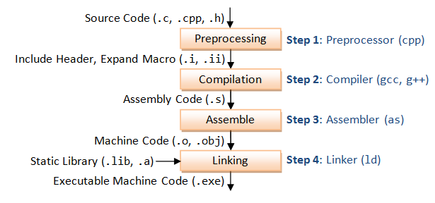
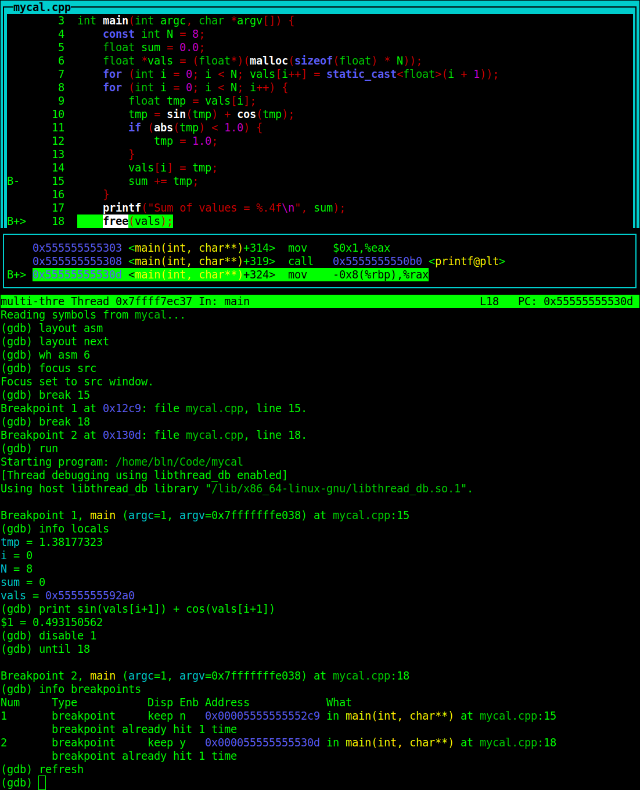
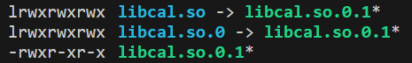

# 编译和链接过程

一般来说，C/C++编程语言在生成可执行文件时，首先要把源文件编译成中间目标文件（Object File），在Windows下也就是.obj文件，UNIX下是.o文件，这个动作叫做编译（compile）。然后再把大量的Object File合成执行文件，这个动作叫作链接（link）。在C与C++中，通常情况下，一个编译单元产生一个目标文件，称为一个模块。

编译时，编译器需要的是语法的正确，函数与变量的声明的正确。对于后者，通常是需要告诉编译器头文件的所在位置（头文件中应该只是声明，而定义应该放在.c实现文件中），只要所有的语法正确，编译器就可以编译出中间目标文件。一般来说，每个源文件都应该对应于一个中间目标文件（.o文件或是.obj文件）。

链接时，主要是链接函数和全局变量，即使用这些中间目标文件来链接所写的应用程序。链接器并不管函数所在的源文件，只管函数的中间目标文件。在大多数时候，由于源文件太多，编译生成的中间目标文件太多，而在链接时需要明显地指出中间目标文件名，这对于编译很不方便。所以，一般要给中间目标文件打个包，在Windows下这种包叫库文件（Library File，也就是.lib文件）；在UNIX下是归档文件（Archive File，也就是.a文件）。

总结一下，源文件首先会生成中间目标文件，再由中间目标文件生成执行文件。在编译时，编译器只检测程序语法，和函数、变量是否被声明。如果函数未被声明，编译器会给出一个警告，但可以生成Object File。而在链接程序时，链接器会在所有的Object File中找寻函数的实现，如果找不到，那到就会报链接错误码（Linker Error）。在VC下，这种错误一般是Link 2001错误，链接器未能找到函数的实现，需要程序员指定函数的Object File。

# GNU Compiler Collection

GCC（GNU Compiler Collection）本质上是由GNU开发的编译器，它可以编译多种语言，典型的如C、C++、Fortran、JAVA、Objective-C、Objective-C++等，且支持多种指令集架构，如MIPS、ARM、x86、x64等。G++是GCC的C++版本，它默认编译的文件是.cpp文件，其用法和GCC一样。

GCC的基本语法如下。需要注意的是，对于一个命令选项如`-D`，它的参数可以紧跟着选项命令如`-DDEBUG`，也可以与命令选项间隔一个空格如`-D DEBUG`，至于不同的命令是否间隔空格，主要是公认的习惯问题。为了可读性，本文在命令选项和参数之间都间隔一个空格。

```shell
gcc [filenames] [options]
```

## 编译阶段

在使用GCC编译源文件时，具体地可分为如下图所示的四个阶段。



预处理（PreProcessing）由.c、.cpp、.h文件生成.i或.ii文件，其中.i为C源文件预处理后的输出，.ii为C++源文件预处理后的输出。所做的操作：包含#include头文件，展开宏定义，替换条件编译，删除注释、空白、空行。使用`-E`选项指示GCC仅对源文件进行预处理。

```shell
gcc -E demo.c -o demo.i
```

编译（Compilation）由.i文件生成.s文件。所作的操作：检查语法规范（完成词法、语法、语义分析），优化后生成相应的汇编语言代码。使用`-S`选项指示GCC仅生成汇编语言代码。

```shell
gcc -S demo.i -o demo.s
```

汇编（Assemble）由.s文件生成.o文件。所作的操作：将汇编代码转变成机器可以执行的机器代码（目标代码），每一个汇编指令对应一条机器指令。使用`-c`选项指示GCC为目标机器生成相应的机器代码（目标代码）。

```shell
gcc -c demo.s -o demo.o
```

链接（Linking）由.o文件生成可以执行的二进制文件（在Linux下通常无后缀名，在Windows下通常以.exe为后缀名）。所作的操作：数据段合并，数据地址回填。无需使用选项指示GCC生成可执行代码。

```shell
gcc demo.o -o demo.exe
```

在实际应用中，我们通常直接由源文件生成可执行文件，如下所示。

```shell
gcc demo.c -o demo.exe
```

## 编译选项

下面介绍一些常用的编译选项。

使用`-o output_filename`指定输出文件名，如下一个例子所示。

```shell
gcc demo.c -o demo.exe
```

使用`-g`指示GCC产生能被GNU调试器GDB使用的调试信息，以调试程序。如下一个例子所示。

```shell
gcc demo.c -o demo.exe -g
```

使用`-D name`指示GCC在编译时定义宏，不是在源文件中定义，如此可以避免频繁的修改源文件。一个常用的例子是定义DEBUG宏，可能文件中有DEBUG宏的相关信息，定义DEBUG宏来选择开启或关闭DEBUG，如下一个例子所示。

```shell
gcc demo.c -o demo.exe -D DEBUG
```

其相当于在demo.c代码中添加如下语句。

```c
#define DEBUG
```

此外，还可使用`-D name=val`指示带有宏体的定义，如下所示。

```shell
gcc demo.c -o demo.exe -D MYINT=1
```

其相当于在demo.c代码中添加如下语句。

```c
#define MYINT 1
```

使用`-w`关闭所有警告信息，使用`-Wall`打印警告信息。如下一个例子所示。

```shell
gcc demo.c -o demo.exe -w
gcc demo.c -o demo.exe -Wall
```

使用`-O#`指示GCC对源代码进行优化，其中`#`可取0,1,2,3或缺失。所谓的优化，如省略掉代码中从未使用过的变量、直接将常量表达式用结果值代替等等，这些操作会缩减目标文件所包含的代码量，提高最终生成的可执行文件的运行效率（但显然会增加编译时间）。`-O`选项指示GCC对源代码进行基本优化，在大多数情况下会同时减小代码的长度和执行时间，其效果等价于-O1。`-O0`表示不做优化。`-O1`为默认优化。`-O2`除了完成-O1的优化之外，还进行一些额外的调整工作，如指令调整等。`-O3`则包括循环展开和其他一些与处理特性相关的优化工作。如下一个例子所示。

```shell
gcc demo.c -o demo.exe -O2
```

使用`-I dirname`为GCC指定头文件搜索目录，将dirname目录加入到程序头文件目录列表中，参数可以用相对路径，也可以使用绝对路径。不同平台GCC有不同的默认头文件搜索目录，如Linux平台下是/usr/include目录，这种默认目录不用指定。但如果头文件不在默认目录，就需用-I参数指定。如下一个例子所示。

```shell
gcc demo.c -o demo.exe -I MPI/Include
```

使用`-L dirname`为链接器ld（linker）指定库文件搜索目录，将dirname目录加入到程序函数库文件的目录列表中，参数可以用相对路径，也可以使用绝对路径。不同平台GCC有不同的默认函数库文件搜索目录，如在Linux平台下是/lib、/usr/lib、/usr/local/lib目录，这种默认目录不用指定，默认库目录中的库文件可以直接用-l参数链接。但如果函数库文件不在默认目录，就需用-L参数指定。如下一个例子所示。

```shell
gcc demo.c -o demo.exe -L MPI/Lib/x64
```

使用`-l name`为链接器ld（linker）指定要链接的库文件，其参数name就是库名。需要注意的是，库名通常和库文件名并不相同（需要加上前缀或后缀），这是约定命名规则的历史原因造成的。对于库名name来说，在Linux平台下，它对应的库文件名是name.a或libname.a；在Windows平台下，它对应的库文件名是name.lib或libname.lib。我们在生成库文件时也尽量使用这种命名规范。如下一个例子所示，它链接的库文件名是msmpi.lib。

```shell
gcc demo.c -o demo.exe -l msmpi
```

使用`-Wl,-rpath`指定程序运行时库搜索目录。通常在makefile中，会同时指定这-L和-Wl,rpath两个选项，保证生成的可执行文件使用的动态库是可控的。如下一个例子所示。

```shell
gcc dome.c -o dome.exe -Wl,-rpath=/path/to
```

对于-Wl选项来说，以下三种写法是等价的。

```shell
-Wl,-rpaht=/path/to
-Wl,-rpath,/path1/to,/path2/to,/path3/to
-Wl,-rpath -Wl,/path/to
```

注意，通常来说，会将-I选项、-L选项、-Wl,rpath选项、-l选项一起使用，用来指示源文件包含的头文件和函数库文件，如下一个例子所示。

```shell
gcc demo.c -o demo.exe -I MPI/Include -L MPI/Lib/x64 -wl,rpath=MPI/Lib/x64 -l msmpi
```

# GNU二进制工具

GNU二进制工具（GNU Binary Utilities）是用于创建和管理二进制程序、目标文件、库、分析数据、汇编源代码的编程工具集。通常与编译器如GCC、构建工具如make、调试工具如gdb一起使用。通过使用libbfd二进制文件描述器库（Binary File Descriptor library），多数GNU二进制工具支持多种目标文件格式。其中libbfd是GNU项目支持各种格式目标文件并进行可移植操作的主要机制，目前已支持约50种文件格式和25种指令集架构。

| Tool Name | Description                                       |
| --------- | ------------------------------------------------- |
| as        | GNU汇编器（assembler），通常称为GAS               |
| ld        | 链接器（linker）                                  |
| gprof     | 分析器（profiler）                                |
| addr2line | 将地址转换为文件（file）和行（line）              |
| ar        | 创建、修改、提取归档文件（archive）               |
| c++filt   | C++符号的逆混淆过滤器（demangling filter）        |
| dlltool   | 创建Windows的动态链接库（dynamic-link libraries） |
| gold      | ELF文件的可选链接器（linker）                     |
| nm        | 列出目标文件所导出的符号，该命令是names的缩写     |
| objdump   | 打印目标文件的信息                                |
| readelf   | 显式ELF文件的内容                                 |
| size      | 列出全部和每段的大小                              |
| strings   | 列出可打印字符串                                  |
| strip     | 从目标文件中移除符号                              |

## nm

nm命令用于显示一个给定文件（目标文件、可执行文件、库文件等）的符号信息，包括三列信息，分别是符号地址或偏移、符号类型、符号名称。

```shell
nm [option] path
```

其中，使用-C选项或--demangle选项对混淆（mangling）代码进行解码，使得C++代码更具可读性，可指定参数选择解码风格，例如none、auto、gun-v3、java、gnat、dlang、rust等值；使用-D选项或--dynamic选项显示动态符号，用于动态库目标；使用-f选项或--format选项指定显示风格，可选bsd、sysv、posix等值；使用-p或--no-sort选项以按照符号在源文件中出现的顺序显示，不按符号名称排序。

在nm命令所显示的信息中，类型缩写所表示的符号类型如下表所示，更多详细类型可查看nm命令的手册。

| 符号类型 | 描述                                                         |
| -------- | ------------------------------------------------------------ |
| A, a     | 全局、局部绝对（absolute）符号；该符号的值是绝对的，在之后的链接过程中不允许改变；常出现在中断向量表中，表示中断向量函数在中断向量表中的位置 |
| B, b     | 全局、局部BSS符号；该符号位于非初始化数据段BSS中，值表示该符号在BSS段中的偏移 |
| D, d     | 全局、局部数据符号；该符号位于初始化数据段中                 |
| f        | 源文件名称符号                                               |
| L, l     | 全局、局部线程本地符号TLS                                    |
| R, r     | 全局、局部只读符号；该符号位于只读数据段中                   |
| T, t     | 全局、局部代码符号；该符号位于代码段中；通常是指函数定义     |
| U        | 未定义符号，该符号在当前编译单元中未定义，而在其他编译单元中定义 |

```c++
int global_var;
static int static_var;
static int static_function() { return 0; }
int global_function(int p) {
    static int local_static_var_init = 15;
    return p + local_static_var_init;
}
#ifdef __cplusplus
extern "C"
#endif
void non_mangled_function() {}
int main(int argc, char *argv[]) {
    global_var = 1;
    static_var = 2;
    return 0;
}
```

```shell
g++ -c a.cpp -o a.o
nm -C -p a.o
```

```
0000000000000004 b static_var
0000000000000000 t static_function()
0000000000000000 d global_function(int)::local_static_var_init
0000000000000000 B global_var
000000000000000f T global_function(int)
0000000000000027 T non_mangled_function
0000000000000032 T main
```

## objdump

objdump命令用于显示目标文件的信息，以可读的形式打印二进制文件的内容，使用--help选项列出帮助文档，使用--info选项列出所支持的处理器架构。

```shell
objdump option path
```

该命令有一些必须选项，用于指定所要显示的目标文件中的信息，如下所示。

| 选项                             | 描述                                                         |
| -------------------------------- | ------------------------------------------------------------ |
| -a, --archive-headers            | 显示归档文件的文件头信息，归档文件由ar命令创建               |
| -f, --file-headers               | 显示文件头信息                                               |
| -h, --headers, --section-headers | 显示节头（section header）的信息                             |
| -r, --reloc                      | 显示重定位条目                                               |
| -R, --dynamic-reloc              | 显示动态重定位条目，仅对于动态目标文件有意义，例如某些动态共享库 |
| -t, --syms                       | 显示符号表条目                                               |
| -T, --dynamic-syms               | 显示动态符号表条目，仅对于动态目标文件有意义，例如某些动态共享库 |
| -x, --all-headers                | 显示所有可用的头信息，等价于-a -f -h -r -t同时指定           |
| -s, --full-contents              | 显示节的完整内容，所有的非空的节（section）都会被显示        |
| -d, --disassemble                | 显示可执行节（executable section）的汇编语句，将机器指令反汇编成汇编代码 |
| -D, --disassemble-all            | 显示所有节的汇编语句，将机器指令反汇编成汇编代码             |
| -S, --source                     | 反汇编时尽可能使用源代码表示，隐含-d选项                     |
| -g, --debugging                  | 显示调试信息                                                 |
| -G, --stabs                      | 显示STABS信息                                                |
| -W, --dwarf                      | 显示DWARF信息                                                |

objdump命令除一些必须选项之外，还有一些可选的参数选项。例如，使用-C选项或--demangle选项对混淆（mangling）代码进行解码，使得C++代码更具可读性，可指定参数选择解码风格，例如none、auto、gun-v3、java、gnat、dlang、rust等值；使用-j选项或--section选项指定仅显示给定节的信息。

```shell
objdump --section=.text -S -C a.o | grep "<main>" -A20
```

```
0000000000000032 <main>:
  32:   f3 0f 1e fa             endbr64 
  36:   55                      push   %rbp
  37:   48 89 e5                mov    %rsp,%rbp
  3a:   89 7d fc                mov    %edi,-0x4(%rbp)
  3d:   48 89 75 f0             mov    %rsi,-0x10(%rbp)
  41:   c7 05 00 00 00 00 01    movl   $0x1,0x0(%rip)        # 4b <main+0x19>
  48:   00 00 00 
  4b:   c7 05 00 00 00 00 02    movl   $0x2,0x0(%rip)        # 55 <main+0x23>
  52:   00 00 00 
  55:   b8 00 00 00 00          mov    $0x0,%eax
  5a:   5d                      pop    %rbp
  5b:   c3                      ret    
```

# Clang/LLVM

LLVM是一组编译器和工具链技术，可用于开发任何编程语言的前端（frontend for any programming language）和任何指令集架构的后端（backend for any instruction set architecture）。LLVM是围绕一种与语言无关的中间表示（Intermediate Representation，IR）设计的，它作为一种可移植的高级汇编语言，可以通过多个阶段的各种转换技术进行优化。LLVM最初名为低级虚拟机（Low Level Virtual Machine），目前该项目已扩展，这个名字已成为LLVM项目的名称。

LLVM是用C++编写的，旨在为编译时（compile-time）优化、链接时（link-time）优化、运行时（runtime）优化、空闲时（idle-time）优化而设计。虽然最初是为C和C++实现的，但LLVM的语言无关设计已经产生了各种各样的前端，使用LLVM的或不直接使用但能生成LLVM IR编译程序的，所产生的带有编译器的语言包括：ActionScript、Ada、C#、CUDA、Fortran、Java bytecode、Kotlin、Lua、Objective-C、OpenCL、SQL、Ruby、Rust、Swift等。

Clang是C、C++、Objective-C、Objective-C++编程语言的编译器前端，支持OpenMP、OpenCL、RenderScript、CUDA、SYCL和HIP框架。它充当GNU编译器集合GCC的临时替代品，支持其大多数编译标志和非官方语言扩展。它包括一个静态分析器和几个代码分析工具。

Clang与LLVM编译器后端协同工作，是LLVM 2.6及更高版本的子项目。Clang前端和LLVM后端的组合被命名为Clang/LLVM或简称为Clang。

# 使用GDB调试

GDB（GNU Debugger）是一个功能强大的调试器，可用于调试C/C++等其他编程语言程序，属于GNU项目的一部分。GDB提供一组丰富的工具，允许开发者跟踪和更改程序的执行，监视和修改程序内部的变量值，独立于程序正常行为调用函数等，从而帮助开发者定位和修复程序中的错误。GDB通常会随GCC编译套件一起安装。

在使用GCC或G++编译源代码以生成可执行程序时，使用-O0选项禁用编译器优化，使用-g选项可以生成操作系统本地格式的调试信息（debugging information），可以是STABS、COFF、XCOFF、DWARF格式，一些调试器如GDB可以利用这些信息调式程序。或者，使用-ggdb选项生成用于GDB的调试信息，这会使用能包含最多信息的格式，包括所有可能的GDB扩展信息。

使用gdb命令进行调试，可以使用可执行文件、核心转储、进程编号作为拟调试对象。使用无参数的gdb命令可进入GDB调试环境，键入help可查看命令手册，键入help后跟命令类别查看该类命令，键入quit或q退出调试环境。

```shell
gdb [option] executable_file
```

使用--args选项，可以在可执行文件之后为程序指定命令行参数；使用--core=COREFILE选项分析核心转储文件；使用--exec=EXECFILE选项指定可执行文件；使用--pid=PID选项指定要附加到的进程；使用--directory=DIR指定源文件搜索目录；使用--tui选项指定使用文本用户界面（text user interface）进行调试。

需要注意的是，GDB在启动时会读取一些配置，其顺序为，用户\$HOME/.gdbinit配置文件、命令行选项参数、当前工作目录下的.gdbinit配置文件。对于.gdbinit配置文件来说，GDB会将文件中的内容当成GDB命令执行，可用于配置一些GDB设置。

## 常用调试命令与示例

在GDB调试模式下，一些常用的命令如下所示，更详细命令可使用help命令查看，或键入apropos命令以查询与给定字符串相匹配的命令。

| 命令                 | 描述                                                         |
| -------------------- | ------------------------------------------------------------ |
| file                 | 指定调试的可执行文件程序，用于无参gdb命令时                  |
| set args             | 为调试程序的提供命令行参数                                   |
| list, l              | 打印给定函数或给定行的源代码，使用#,#形式指定要打印的给定行号，其中#是阿拉伯数字 |
| print, p             | 打印给定变量或表达式的值                                     |
| break, b             | 在指定位置设置一个断点，可指定源文件名、函数名、行号；使用break location if condition指定只有条件满足时才会触发的断点 |
| delete, d            | 删除所有或指定断点，使用断点编号指定；每指定一个新断点（包括临时断点），GDB会为其分配一个编号，编号从1开始依次递增 |
| disable, dis         | 禁用所有或指定断点，使用断点编号指定                         |
| enable, en           | 启用所有或指定断点，使用断点编号指定                         |
| run, r               | 开始执行程序，直到第一个断点，如果无断点则执行到程序结束     |
| start                | 开始执行程序，直到主程序入口处                               |
| step, s              | 执行程序源码中的一行，若该行存在自定义函数调用，则进入函数并执行第一行语句，若该行存在库函数调用，因为无源码则直接将库函数执行完毕 |
| next, n              | 执行程序源码中的一行，若该行存在函数，则直接将函数执行完毕   |
| continue, c          | 继续执行程序，直到下一个断点或程序结束                       |
| finish, fin          | 继续执行程序，直到栈帧返回（函数返回）                       |
| until, u             | 继续执行程序，直到给定的行号处停止                           |
| backtrace, where, bt | 显示所有栈帧的回溯信息，可查看当前函数的堆栈状态             |
| info, i              | 显示调试过程中的信息；使用info args显示当前栈帧函数的参数；使用info breakpoints或info b显示给定断点或所有断点状态；使用info frame显示给定栈帧状态；使用info locals显示当前所有局部变量；使用info registers或info r显示当前栈帧寄存器状态；使用info marco显示给定的宏；使用info inferiors显示当前进程信息；使用info proc显示进程额外信息；使用info threads显示当前已知线程；使用info signals显示进程所接收到的信号 |

在调试程序时，特别推荐使用--tui选项，以文本用户界面的形式进行调试，可以十分清楚的看到程序的执行过程，与TUI相关的一些命令如下所示。值得注意的是，当使用focus命令聚焦到某个窗口时，可直接使用上下左右方向键进行窗口滚动，而无需使用繁琐的命令。

| 命令          | 描述                                                         |
| ------------- | ------------------------------------------------------------ |
| +             | 窗口向前（向下）滚动一行                                     |
| -             | 窗口向后（向上）滚动一行                                     |
| <             | 窗口向左滚动一列                                             |
| >             | 窗口向右滚动一列                                             |
| layout        | 切换当前窗口，可指定src、asm、regs等值，分别为源代码窗口、汇编语句窗口、寄存器窗口；使用layout prev将窗口上移；使用layout netx将窗口下移 |
| focus, fs     | 切换当前聚焦窗口，可指定src、asm、regs等值                   |
| winheight, wh | 设置给定窗口的高度，形如wh src #所示，其中#是整数值，表示窗口所占用行数 |
| refresh       | 刷新窗口显示                                                 |

此处列举一个mycal.cpp示例文件，在编译时使用-g选项包含调试信息，并使用--tui选项启用文本用户界面进行调试，如下所示。

```shell
g++ -O0 -g mycal.cpp -o mycal
gdb --tui mycal
```



## 调试核心转储与附加进程

当进程执行崩溃时，系统可选地将进程的内存信息存储到文件，即是coredump核心转储文件，GDB可使用核心转储调试程序错误。

在Linux中，可使用控制shell资源的ulimit命令启用核心转储文件，该命令只在当前shell终端生效。使用ulimit -a命令显示当前shell资源限制，使用ulimit -c命令指定当前shell能够生成的核心存储文件的限制，指定为0表示禁用核心转储，指定一个数字（以字节为单位）或指定为unlimited表示启用核心转储。

```shell
ulimit -c unlimited
ulimit -a
```

```shell
real-time non-blocking time  (microseconds, -R) unlimited
core file size              (blocks, -c) unlimited
data seg size               (kbytes, -d) unlimited
```

在Linux中，使用/proc/sys/kernel/core_pattern文件指定所生成的核心转储文件的路径位置模式，配置方式如下所示。

```shell
echo "core-%e-%p" > /proc/sys/kernel/core_pattern
```

上述指定的路径模式，会在当前执行路径下生成以core开头的核心转储文件，并使用%e表示程序名称，使用%p表示进程编号、还可以使用%t表示时间戳。

此处列举一个wrong.cpp示例文件，其试图访问nullptr野指针。

```shell
g++ -g wrong.cpp -o wrong
./wrong
```

```shell
Segmentation fault (core dumped)
```

```shell
gdb wrong --core=core-wrong-2908
```

```
Reading symbols from wrong...
[New LWP 2908]
[Thread debugging using libthread_db enabled]
Using host libthread_db library "/lib/x86_64-linux-gnu/libthread_db.so.1".
Core was generated by `./wrong'.
Program terminated with signal SIGSEGV, Segmentation fault.
#0  0x000061d5593041bf in main (argc=1, argv=0x7ffe13916ac8) at wrong.cpp:12
12	    printf("Sum of weight = %.4f\n", p->weight + t->weight);
```

GDB还可以调试正在运行的进程，--pid=PID选项指定要附加到的进程，或使用attach命令附加到指定进程。

值得注意的是，Linux系统使用/proc/sys/kernel/yama/ptrace_scope文件配置跨进程附加调试的允许范围，当指定为1时表示只能调试同用户下的该进程的直接子进程，当指定为0时表示允许调试当前用户下的更多进程，配置方式如下所示。

```shell
echo 0 > /proc/sys/kernel/yama/ptrace_scope
```

此处列举一个hello.cpp示例文件，其从标准输入获取用户输入，如下所示。

```shell
g++ -g hello.cpp -o hello
./hello
```

```shell
ps -ef | grep hello
```

```shell
bln         3515    3381  0 14:28 pts/1    00:00:00 ./hello
```

```shell
gdb hello --pid=3515
```

```
Reading symbols from hello...
Attaching to program: /home/bln/Code/hello, process 3515
Reading symbols from /lib/x86_64-linux-gnu/libc.so.6...
Reading symbols from /usr/lib/debug/.build-id/96/2015aa9d133c6cbcfb31ec300596d7f44d3348.debug...
Reading symbols from /lib64/ld-linux-x86-64.so.2...
Reading symbols from /usr/lib/debug/.build-id/24/6ac0d8deba5a40c63e9a1a87d4d779d8eb589f.debug...
[Thread debugging using libthread_db enabled]
Using host libthread_db library "/lib/x86_64-linux-gnu/libthread_db.so.1".
0x000074ff79d147e2 in __GI___libc_read (fd=0, buf=0x5e614c44a6b0, nbytes=1024) at ../sysdeps/unix/sysv/linux/read.c:26
26	../sysdeps/unix/sysv/linux/read.c: No such file or directory.
(gdb) backtrace
#0  0x000074ff79d147e2 in __GI___libc_read (fd=0, buf=0x5e614c44a6b0, nbytes=1024)
    at ../sysdeps/unix/sysv/linux/read.c:26
#1  0x000074ff79c8cc36 in _IO_new_file_underflow (fp=0x74ff79e1aaa0 <_IO_2_1_stdin_>)
    at ./libio/libioP.h:947
#2  0x000074ff79c8dd96 in __GI__IO_default_uflow (fp=0x74ff79e1aaa0 <_IO_2_1_stdin_>)
    at ./libio/libioP.h:947
#3  0x000074ff79c630d0 in __vfscanf_internal (s=<optimized out>, format=<optimized out>, 
    argptr=argptr@entry=0x7fffb1ae3390, mode_flags=mode_flags@entry=2)
    at ./stdio-common/vfscanf-internal.c:628
#4  0x000074ff79c62142 in __isoc99_scanf (format=<optimized out>)
    at ./stdio-common/isoc99_scanf.c:30
#5  0x00005e614ac361da in main (argc=1, argv=0x7fffb1ae35e8) at hello.cpp:5
(gdb) continue
Continuing.
[Inferior 1 (process 3515) exited normally]
```

## 调试多进程与多线程程序

在GDB调试模式中，使用名词inferior表示与程序相关的进程（process）概念，有关命令如下所示。

| 命令                 | 描述                                                         |
| -------------------- | ------------------------------------------------------------ |
| set follow-fork-mode | 设置在fork()或vfork()之后的GDB的跟踪对象；指定parent跟踪父进程（默认情况）；指定child跟踪子进程 |
| set detach-on-fork   | 设置在fork()或vfork()之后是否分离child子进程；指定on会使子进程继续执行（默认情况）；指定off会使子进程挂起 |
| info inferiors       | 显示当前进程                                                 |
| inferior             | 切换到给定进程，使用编号指定；每创建一个新进程，GDB会为其分配一个编号，编号从1开始依次递增 |

此处列举一个myproc.cpp示例文件，使用--tui选项启用文本用户界面进行调试，如下所示。

```shell
g++ -g myproc.cpp -o myproc
gdb --tui myproc
```


自然地，GDB支持调试多线程程序，有关命令如下所示。

| 命令                   | 描述                                                         |
| ---------------------- | ------------------------------------------------------------ |
| set schedule-multiple  | 设置进程线程调度行为；指定on会调度执行所有进程的所有线程；指定off会调度执行当前进程的线程（默认情况） |
| set scheduler-locking  | 设置线程调度器行为；指定on会使除当前线程之外的其它所有线程等待调度，仅执行当前线程；指定off会使所有线程并发执行（默认情况） |
| info threads           | 显示当前线程                                                 |
| thread                 | 切换到给定线程，使用编号指定；每创建一个新线程，GDB会为其分配一个编号，编号从1开始依次递增 |
| thread apply # command | 在指定线程中执行诸如step、next、continue之类的调试命令，其中#为GDB分配的线程编号，使用all时表示在所有线程中执行命令 |

值得注意的是，单纯地设置断点或者单步追踪可能会干扰多进程或多线程之间的竞争状态，从而看到的是一个假象。在多进程或多线程开发环境中，一旦某个进程或线程被设置断点，则另外的进程可以继续执行，就会破坏并发的场景。实际应用中可以通过输出log日志的方式分析多进程多线程的程序行为。

# Linux平台库文件

## .a静态库

静态库.a其实就是由一组.o目标文件形成的归档文件，在Linux下可以使用ar命令打包而成。

一个示例文件cal.h和cal.c的代码如下所示。

```c
#pragma once
double add(double a, double b);
double sub(double a, double b);
```

```c
#include "cal.h"
double add(double a, double b) { return a + b; }
double sub(double a, double b) { return a - b; }
```

```shell
gcc -c cal.c -o cal.o
```

可以使用`ar`命令生成.a静态库，如下所示。

```shell
ar -q libcal.a cal.o
```

其中，cal是静态库的名字，libcal.a是静态库的文件的名字。在Linux平台下，通常静态库文件名有前缀lib和后缀.a，它们不是必须的，但是约定俗成的历史规定。在编译时使用-l链接静态库时，可以直接指定库名，即如-l cal的形式。

只需要了解函数的调用接口，明确函数的格式（即.h文件中函数原型的声明），主程序就可以很方便的直接使用库中定义的函数功能，而不必重复编写函数实现。

使用cal库函数的主程序文件main.c的代码如下所示。

```c
#include <stdio.h>
#include <cal.h>
int main(int argc, char* argv[]) {
    double a = 1.25, b = 2.50;
    double c = add(a, b);
    double d = sub(a, b);
    printf("add(%f, %f) = %f\n", a, b, c);
    printf("sub(%f, %f) = %f\n", a, b, d);
    return 0;
}
```

使用GCC编译上述代码，并链接静态库的命令如下所示。

```shell
gcc -c main.c -o main.o
gcc main.o -o main.exe -l cal -L .
```

其中，链接选项-l cal就是使用ld链接器将libcal.a库文件中的函数，与main.o目标文件链接到一起，从而生成main.exe可执行文件；而-L .指定库文件的搜索目录为当前目录。

以上生成的main.exe可执行程序不再依赖libcal.a库文件，它已经将用到的函数存放在了可执行程序main.exe中。

## .so动态库

动态库.so也是一组.o目标文件形成的归档文件，在在Linux下可以使用gcc -shared命令打包而成。

通常，若cal是动态库的名字，则libcal.so.0.1是其一个动态库的文件的名字。在Linux平台下，动态库文件名有前缀lib和后缀.so，习惯上，用于运行时的动态库还要加上版本号，即如.so.0.1等。

因此，可以有三种用途的动态库：(1)生成的动态库本身，(2)链接器使用的链接库，(3)其他程序运行时使用的运行库。通常来说它们不应该是同一个文件，因为动态库可能随时更新升级，为了保持其他程序的运行不受影响，运行库应该是动态库的一个软链接，同理链接库也是如此。当然它们也可以是同一个文件。假设，动态库为libcal.so.0.1，链接库为libcal.so.0，运行库为libcal.so，其软链接下图所示。



此处，继续使用上述cal.h和cal.c的代码，将其生成为.so动态链接库的命令如下。

```shell
gcc -fPIC -c cal.c -o cal.o
gcc -fPIC -shared cal.o -o libcal.so.0.1
```

其中，编译选项-fPIC为位置无关代码（Position Independent Code），使得生成的目标代码不使用绝对地址跳转，更加灵活。使用gcc -shared将.o目标文件生成.so动态库文件。

通常来说，之后还需为生成的动态库创建它的软链接，作为链接库和运行库使用，如下所示。

```shell
ln -s libcal.so.0.1 libcal.so.0
ln -s libcal.so.0.1 libcal.so
```

这么做的好处是，对库的源码进行更新后，可以使用刷新软链接的方式应用新的库版本，而不必重新生成应用程序。

此外，也可在生成动态库时，为其指定缩略名soname（short for shared object name），如下所示。

```shell
gcc -fPIC -shared cal.o -o libcal.so.0.1 -Wl,-soname,libcal.so.0
```

其中，编译器选项-Wl,-soname,/path/to/libcal.so.0为链接器指定默认的缩略名，然后可以使用ldconfig -n来更新某动态库的软链接，即自动根据soname创建动态库的软链接，如下所示。

```shell
ldconfig -n ./
readelf -d libcal.so.0.1
```

```shell
Dynamic section at offset 0x2e80 contains 18 entries:
  Tag        Type                         Name/Value
 0x000000000000000e (SONAME)             Library soname: [libcal.so.0]
 0x000000000000000c (INIT)               0x1000
 0x000000000000000d (FINI)               0x114c
 ...
 0x0000000000000008 (RELASZ)             168 (bytes)
 0x0000000000000009 (RELAENT)            24 (bytes)
 0x000000006ffffff9 (RELACOUNT)          3
 0x0000000000000000 (NULL)               0x0
```

## 使用.so动态库

在Linux平台下，有两种使用.so动态库的方式，即隐式调用和显式调用。

隐式调用，在代码中包含动态库的头文件，在编译时为GCC指定所要链接的动态库，或在环境变量LD_LIBRARY_PATH中指定动态库的路径，或在/etc/ld.so.conf等指定动态库路径；此时可直接在代码中使用动态库头文件中声明的函数与符号。程序开始执行，不管是否用到动态库功能，都会将动态库读到内存中。

显式调用，不使用动态库头文件，而使用加载动态库的API，在代码指定位置，手动根据动态库路径，手动加载动态库中的某个函数或符号，无需为GCC和环境变量指定动态库路径；此时必须手动加载后才能使用动态库中的函数和符号。显式调用是一种程序插件的概念，随用随加载，不用不加载。

隐式使用.so文件，需要在代码中包含动态库的头文件，编写的主程序main.c如下所示。

```c
#include <stdio.h>
#include "cal.h"
int main(int argc, char* argv[]) {
    double a = 1.25, b = 2.50;
    double c = add(a, b);
    double d = sub(a, b);
    printf("add(%f, %f) = %f\n", a, b, c);
    printf("sub(%f, %f) = %f\n", a, b, d);
    return 0;
}
```

使用GCC编译上述代码，并链接动态库的命令如下所示。

```shell
gcc -c main.c -o main.o
gcc main.o -o main.exe -l cal -L . -Wl,-rpath=./
```

显式在代码中直接加载.so文件，无需为GCC指定动态库的链接路径，也无需将路径添加到环境变量中，因为是在代码中手动指定动态库的路径。

在Linux平台下，若要显式使用动态库的函数，需要用到`dlfcn.h`头文件，其提供了操作动态库的一些函数，如下所示。

```c
/* 打开一个动态链接库，将其装载到内存 
 * pathname: 指定动态库的路径名称
 * mode:     指定动态库的打开方式，常用的有两种:
 *   (1) RTLD_LAZY: 推迟共享库函数的加载操作，直到调用dlsym()时加载特定函数
 *   (2) RTLD_NOW:  立即将动态库中的所有函数加载到内存
 * return:   返回动态库的句柄，错误时返回NULL
 */
void *dlopen(const char *pathname, int mode);

/* 获取动态库中某个符号symbol的句柄
 * handle: 动态库的句柄
 * symbol: 所要在动态库中获取的某个函数或符号symbol的名称
 * return: 获取到的函数或符号的地址
 */
void *dlsym(void *handle, const char* symbol);

/* 返回一个指向描述最近错误的ACSII字符串指针（并清空错误信息内存），若无错误返回NULL */
char *dlerror(void);

/* 关闭句柄所指向的动态库，只有当此动态库的使用计数为0时，系统才会真正将之卸载 */
int dlclose(void *handle);
```

根据上述方法，仍采用上述libcal.so的示例，编写使用动态库函数的主程序main.c代码如下所示。

```c
#include <stdio.h>
#include <dlfcn.h>
int main(int argc, char* argv[]) {
    void *handle = dlopen("libcal.so", RTLD_LAZY);
    if (handle == NULL) {
        printf("open %s error: %s\n", "libcal.so", dlerror());
        return -1;
    }

    double (*add_func)(double, double) = dlsym(handle, "add");
    double (*sub_func)(double, double) = dlsym(handle, "sub");
    char* error_info = dlerror();
    if (error_info != NULL) {
        printf("dlsym error: %s\n", error_info);
        return -1;
    }

    double a = 1.25, b = 2.50;
    double c = (*add_func)(a, b);
    double d = (*sub_func)(a, b);
    printf("add_func(%f, %f) = %f\n", a, b, c);
    printf("add_func(%f, %f) = %f\n", a, b, d);

    return 0;
}
```

因为是显式加载动态库，故上述程序就是普通程序，直接GCC编译即可运行，如下所示。

```shell
gcc main.c -o main.exe
```

# GNU C++扩展属性

本节将介绍特定于GNU编译环境GCC与G++的针对C语言与C++的扩展。GCC提供两种方式指定属性（attribute），一是使用双方括号`[[]]`的标准C和C++语法，二是使用关键字`__attribute__`的旧式GNU扩展语法，这种旧式扩展早于标准语法且在旧代码中使用广泛。

标准[[]]属性语法可被GCC的C和C++语言所识别。更具体地，标准[[]]属性语法在C++11标准中引入，并在GCC使用-std=c++11或-std=gnu++11或更高版本标准时支持；标准[[]]属性语法在C23标准中引入，并在GCC使用-std=c23或-std=gnu17或更高版本标准时支持。可在标准[[]]属性语法中使用特定于GNU的扩展属性，此时需在名称前加上gun::前缀，例如gnu::section扩展属性。

本节下面的部分描述C和C++语言的GNU扩展\_\_attribute\_\_语法的细节，以及属性说明符的结构。在C++中，属性的语义存在一些问题。例如，虽然属性可能会影响代码生成，但不会对属性进行混淆（mangling），因此当将属性类型与模板或重载一起使用时，可能会出现问题。类似地，typeid不会区分具有不同属性的类型。将来C++中对属性的支持可能仅限于声明中的属性，而不是嵌套声明符。

属性说明符的形式如下所示，属性说明符列表是一个或多个属性说明符的序列，不使用任何其他字符分隔。

```c++
__attribute__((attribute_list))
```

其中，属性列表attribute_list是由逗号分隔的属性序列，每个属性可以是空属性、单独的属性名称标识符、后跟括号参数列表的属性名称。可以选择在属性名之前和之后使用`__`指定属性名，这可以避免存在同名宏，例如，可以使用属性名\_\_noreturn\_\_而不是noreturn。

## Label属性

应用于标签（label）的属性语义，参阅[Label Attributes](https://gcc.gnu.org/onlinedocs/gcc/Label-Attributes.html)。在GNU C中，属性说明符可能出现在标签后面的冒号（colon）之后，而不是标签或case之后。如果属性说明符后面紧跟着一个分号（即标签应用于空语句），则GNU C++只允许标签上的属性。如果缺少分号，则C++标签属性是不明确的，因为允许以属性说明符列表开头的声明在C++作为标签。而在C90或C99中声明不能作为标签，因此不会产生歧义。

```c++
int main(int argc, char *argv[]) {
     asm goto ("nop" :::: NoError);
    
    /* This branch (the fall-through from the asm) is less commonly used */
    ErrorHandling: 
        __attribute__((cold, unused)); /* Semi-colon is required here */
    	std::cout << "Error" << std::endl;
        return 0;
    NoError:
        std::cout << "No Error" << std::endl;
        return 1;
}
```

说明符`unused`用于指示程序生成的代码（program-generated code），这些代码可能包含由-Wall编译的未使用的标签。

说明符`cold`用于指示编译器标签后面的分支路径不太可能被执行。

说明符`hot`用于指示编译器标签后面的分支路径比没有这样注释的路径更有可能被执行。

## Enumerator属性

应用于枚举项（enumerator）的属性语义，参阅[Enumerator Attributes](https://gcc.gnu.org/onlinedocs/gcc/Enumerator-Attributes.html)。在GNU C中，属性说明符可能作为枚举项的一部分出现，位于枚举常量之后与赋值等号`=`之前。

```c++
enum MyEnum {
    oldval __attribute__((deprecated)) = 0,
    newval = 1
};

int main(int argc, char *argv[]) {
    std::cout << MyEnum::oldval << std::endl;  // 产生编译器警告
    return 0;
}
```

说明符`deprecated(msg)`指示枚举项已被弃用，会产生编译器警告，这在识别预计将在程序的未来版本中删除的枚举数时非常有用。

说明符`unavailable`指示枚举项不再可用，会产生编译器错误。

## Statement属性

应用于语句（statement）的属性语义，参阅[Statement Attributes](https://gcc.gnu.org/onlinedocs/gcc/Statement-Attributes.html)。在GNU C中，属性说明符可能作为一条空语句（null statement）出现，后跟分号。

说明符`fallthrough`指示在switch语句中，一个case路径掉入（fall）另一个case路径而没有使用break的行为是故意的，因此不必触发-Wimplicit-fallthrough警告。

```c++
int main(int argc, char *argv[]) {
    int condition = 0;
    switch (condition) {
    case 0:
        std::cout << 0 << std::endl;
        __attribute__((fallthrough));
    case 1:
        std::cout << 1 << std::endl;
        break;
    default:;
    }
    return 0;
}
```

说明符`assume`用于可移植的假设，应有一个条件表达式作为参数，且表达式并没有被实际执行。若表达式值为true则无效果，否则导致未定义行为。这是ISO C++23标准中assume属性的GNU变体，但可用于C语言和C++语言的任何版本中。

```c++
int foo(int x, int y) {
    __attribute__((assume(x == 42)));
    __attribute__((assume(++y == 43)));
    return x + y;
}
```

实际上y的值并没有实际递增，编译器可以（但不必）将函数优化，而只返回42+42即可。

## Type属性

应用于结构体（struct）、类（class）、联合体（union）和枚举类型（enum）的属性语义，参阅[Specifying Attributes of Types](https://gcc.gnu.org/onlinedocs/gcc/Type-Attributes.html)。属性说明符可以作为结构体、类、联合体或枚举说明符的一部分出现，它可以紧接在struct、class、union或enum关键字之后与名称之前（推荐）。也可以紧接在右花括号（closing brace）之后，在右花括号之后的属性说明符，被认为与其所跟的结构体、类、联合体或枚举类型的定义相关，而不是与声明相关，但不推荐这种用法，因为一个类型应该在右花括号处完成定义，右花括号之后的说明符不应再对定义进行补充。

如下所示，\_\_attribute\_\_((aligned(8)))用于修饰MyStruct的定义，而不是obj的声明。

```c++
struct MyStruct {
    char data[3]; 
} __attribute__((aligned(8))) obj;  // Not Recommended
```

此外，有些属性说明符还可使用typedef定义新的派生类型。

```c++
typedef __attribute__((old_attr)) oldtype newtype __attribute__((new_attr));
```

### aligned

说明符`aligned(alignment)`指定所定义类型的变量的最小对齐方式（以字节为单位），应是2的整数次幂，不指定alignment参数指示编译器将对齐方式设置为目标机器上的任何数据类型所使用的最大对齐方式，通常是8或16字节。

```c++
__attribute__((aligned(#))) declarator
```

值得注意的是，对齐属性可能会受到链接器中固有限制的制约，在许多系统中，链接器只能排列变量到某个最大的对齐方式，某些链接器支持的最大对齐可能非常小。如果链接器只能将变量对齐到最大8字节，那么在\_\_attribute\_\_中指定aligned(16)仍然只能提供8字节对齐。

```c++
struct __attribute__((aligned(8))) MyStruct {
    char data[3];
};

typedef char MyChar __attribute__((aligned(8)));
struct S1 { char data; };
struct S2 { MyChar data; };

int main(int argc, char *argv[]) {
    std::cout << sizeof(MyStruct) << ", " << alignof(MyStruct) << std::endl;  // 8, 8
    std::cout << sizeof(S1) << ", " << sizeof(S2) << std::endl;               // 1, 8
    return 0;
}
```

### alloc_size

说明符`alloc_size`用于修饰函数类型定义，该函数返回指针类型，且至少接受一个整数类型的参数，该语义表示该函数返回的指针指向一个对象，该对象的大小由position位置参数给出，或由position_1参数与position_2参数的乘积给出。有意义的值是小于PTRDIFF_MAX的正值，其他大小在检测到时进行诊断，GCC使用这些信息来改进\_\_builtin\_object\_size的结果。

```c++
typedef __attribute__((alloc_size(1, 2))) void* (*calloc_type)(size_t, size_t);
typedef __attribute__((alloc_size(1))) void* (*malloc_type)(size_t);
```

指定calloc_type是一个函数的类型，它像标准C函数calloc一样，返回一个大小由参数1和参数2的乘积给出的对象；指定malloc_type像标准C函数malloc一样，返回一个大小由参数1给出的对象。

### copy

说明符`copy(expression)`用于将expression表达式所属类型的属性集，应用于给当前声明的类型，可用于类型（type）、变量（variable）或函数（function）。该属性是为定义库的别名而设计的，这些别名与原名称具有相同属性。copy属性只复制语法和语义属性，但不复制影响符号链接或可见性的属性，如别名（alias）、可见性（visibility）、弱（weak）属性，也不会复制弃用（deprecated）属性。

```c++
struct __attribute__((aligned(8))) MyStruct {};
struct __attribute__((copy((struct MyStruct*)NULL))) MyStruct2 {};

int main(int argc, char *argv[]) {
    std::cout << alignof(MyStruct) << ", " << alignof(MyStruct2) << std::endl;  // 8, 8
    return 0;
}
```

### deprecated

说明符`deprecated(msg)`指示某个类型以弃用，会产生编译器警告。需要注意的是，警告仅在使用被弃用类型时出现。

```c++
typedef int MyInt1 __attribute__((deprecated));
typedef MyInt1 MyInt2;                              // Warning
typedef MyInt1 MyInt3 __attribute__((deprecated));  // No Warning

int main(int argc, char *argv[]) {
    MyInt1 var1 = 1;  // Warning
    MyInt2 var2 = 2;  // No Warning
    MyInt3 var3 = 3;  // Warning
    return 0;
}
```

### designated_init

说明符`designated_init`只能应用于结构体类型，它表明该类型对象的任何初始化都必须使用指定的初始化器（initializer），而不是默认的位置初始化器（positional initializer）。这个属性的目的是允许程序员指示结构的布局可能会改变，因此依赖于位置初始化可能会产生破坏。

### may_alias

说明符`may_alias`修饰一个类型，通过该类型指针进行访问时，不受基于类型的别名分析（type-based alias analysis）的约束，而是假定能够为任何其他类型的对象设置别名。该扩展的存在是为了支持一些向量API，指向一种向量类型的指针可以别名指向另一种向量类型的指针。

```c++
typedef short __attribute__((may_alias)) MyShort;

int main() {
    int a = 0x12345678;
    MyShort *b = (MyShort*)&a;
    b[1] = 0;
    return 0;
}
```

如果在变量声明中将MyShort替换为short，那么上面的程序在使用-fstrict-aliasing编译时将会中止。

### mode

说明符`mode(m)`指定声明的与模式m所对应的数据类型，这实际上允许根据数据宽度指定整数或浮点类型。使用byte指定单字节整数（one-byte integer）模式，使用word指定单字整数（one-word integer）模式，使用pointer指定指针模式。

机器模式（machine mode）描述了数据对象的大小及其使用的表示形式。在C代码中，机器模式由machmode.def中定义的枚举类型machine_mode表示。每个寄存器转移语言（Register Transfering Language，RTL）表达式都有一个机器模式的空间。在调试转储和机器描述（debugging dumps and machine descriptions）时，RTL表达式的机器模式写在表达式代码之后，用冒号分隔它们，出现在每个机器模式名称末尾的字母mode被省略。例如，(reg:SI 38)是一个机器模式为SImode的reg表达式。

### packed

说明符`packed`用于修饰结构体、类、联合体，指定放置其每个成员时所需的最小内存，这相当于在每个成员上指定packed打包属性。当修饰枚举类型时，packed打包属性指示应该使用的最小整型。

```c++
struct S1 { int a; short b; double c; };
struct __attribute__((packed)) S2 { int a; short b; double c; };

int main() {
    std::cout << offsetof(S1, a) << offsetof(S1, b) << offsetof(S1, c) << std::endl;  // 0 4 8
    std::cout << offsetof(S2, a) << offsetof(S2, b) << offsetof(S2, c) << std::endl;  // 0 4 6
    return 0;
}
```

### scalar_storage_order

说明符`scalar_storage_order("endianness")`指定结构体或联合体中标量字段或标量数组字段的存储顺序（storage order），即端序（endianness），又称字节端序，支持big-endian大端序和little-endian小端序。该属性对本身为结构体、联合体或相应数组的字段没有影响，并且这些字段可能具有与标量字段不同的存储顺序。注意，指针字段和向量字段都不被视为标量字段，因此该属性对这些字段没有影响。

### strub

说明符`strub`指定函数和变量的堆栈清理属性（stack-scrubbing properties），以便访问敏感数据的函数可以在返回或抛出异常时将其堆栈帧归零。这可以通过为特定函数选择strub模式来显式实现，也可以通过strub变量来隐式实现。

### unavailable

说明符`unavailable(msg)`指示类型不再可用，会产生编译器错误。

### unused

说明符`unused`指定结构体或联合体类型的变量可能未被使用，编译器不会对该类型的任何变量产生未使用警告。例如，锁（lock）或线程（thread）类通常就是这种情况，它们通常被定义但不被引用，但其构造函数与析构函数具有重要的簿记（bookkeeping）功能。

### vector_size

说明符`vector_size(bytes)`修饰整数或浮点类型（称为基类型），构造一个矢量类型，其大小以字节为单位，bytes参数必须是基类型的2的整数幂倍。在某些目标平台上，指令集包含SIMD矢量指令，这些指令同时操作一个大寄存器中包含的多个值，例如在x86、MMX、3DNow!、SSE扩展上可以这样使用。

```c++
typedef __attribute__((vector_size(32))) int int_vec32_t;
typedef __attribute__((vector_size(32))) int* int_vec32_ptr_t;
typedef __attribute__((vector_size(32))) int int_vec32_arr4_t[4];
__attribute__((vector_size(16))) float get_flt_vec16(void) {
    __attribute__((vector_size(16))) float var = { 0.f };
    return var;
}

int main() {
    std::cout << sizeof(int_vec32_t) << std::endl;       // 32
    std::cout << sizeof(int_vec32_ptr_t) << std::endl;   // 8
    std::cout << sizeof(int_vec32_arr4_t) << std::endl;  // 128
    return 0;
}
```

如上代码所示，所定义的int_vec32_t矢量类型由int组成，因一个int为4字节，则32字节的矢量类型具有8个int元素，int_vec32_t类型变量的模式为V8SI。

### visibility

说明符`visibility`可以为结构体、类、联合体和枚举类型指定可见性属性，放置于初始关键字和类型名称之间。

类型可见性应用于与类相关的模糊链接实体（vtable、typeinfo节点等）。特别是，如果一个类在一个共享对象中作为异常抛出，而在另一个共享对象中被捕获，则该类必须具有默认可见性，否则两个共享对象将无法使用相同的typeinfo节点，异常处理将中断。

## Variable属性

应用于变量（variable）的属性语义，参见[Specifying Attributes of Variables](https://gcc.gnu.org/onlinedocs/gcc/Variable-Attributes.html)。属性说明符可以作为声明的一部分出现。

部分属性说明符在前述内容已介绍过，此处不再赘述，诸如aligned、alloc_size、copy、deprecated、mode、packed、unavailable、unused、vector_size、visibility等。

### alias

说明符`alias(target_name)`指定当前声明为另一个目标符号的别名，别名必须与目标符号具有相同的类型，且别名应与目标符号在同一个编译单元中。

```c++
int var_target = 10;
int __attribute__((alias("var_target"))) var_alias;

int main() {
    std::cout << var_alias << std::endl;   // 10
    var_alias = 20;
    std::cout << var_target << std::endl;  // 20
    return 0;
}
```

### cleanup

说明符`cleanup(cleanup_function)`指定当变量超出作用域时，所执行清理函数。该属性只能用于函数作用域范围内自动存储（automatic）的变量，不能用于静态存储时间的变量。当同一作用域中的多个变量具有清理属性时，在退出作用域时，它们相关的清理函数将以与定义相反的顺序运行。

```c++
void my_cleanup(int *varptr) { std::cout << *varptr << " "; }

void foo() {
    __attribute__((cleanup(my_cleanup))) int var1 = 10;
    __attribute__((cleanup(my_cleanup))) int var2 = 20;
}

int main() {
    foo();  // 20 10
    return 0;
}
```

### common与nocommon

说明符`common`指示将一个变量放置到common段存储中，相反`nocommon`指示直接为一个变量分配空间。

其中，common段用于存放弱引用的符号，即未初始化的全局变量，在链接时再放入bss段；有些编译器也会直接将未初始化的全局变量放置到bss段。

### noinit

说明符`noinit`指定变量不会被C运行时启动代码（C runtime startup code）或程序加载器（program loader）初始化，不以这种方式初始化数据可以减少程序的启动时间。该属性特定于ELF目标文件，并依赖链接器脚本将noinit段放置在正确的位置。

### nostring

属性`nostring`指定类型为char数组或指针的对象或成员声明，用于存储不一定包含null（'\0'）终止符的字符数组。这对于检测期望以null结尾的字符串函数的使用非常有用，通常用于诸如strncpy、strnlen之类包含长度n的字符串函数，避免编译器警告。

```c++
struct Data {
    char name[32] __attribute__((nonstring));
};

int main(int argc, char *argv[]) {
    struct Data data;
    strncpy(data.name, "Bloonow", sizeof(data.name));
    int len = strlen(data.name);    // unsafe, gets a warning
    std::cout << len << std::endl;  // 7
    return 0;
}
```

### persistent

说明符`persistent`指定变量不会被C运行时启动代码（C runtime startup code）初始化，而是由程序加载器（program loader）初始化，这使得变量的值能够在处理器重置（processor reset）之间持续存在（persist）。该属性特定于ELF目标文件，并依赖链接器脚本将persistent段放置在正确的位置。具体来说，需要某种类型的非易失性、可写存储器。

### section

通常情况下，编译器将它生成的对象放置在data和bss段中。然而有时会需要额外的程序段，例如需要映射到特殊的硬件。

说明符`section`指定变量或函数驻留在特定的程序段中，应用于全局变量而不是局部变量。可以对初始化或未初始化的全局变量指定section段，但链接器要求每个对象定义一次。除了未初始化的变量暂时放置在common段或bss段中并且可以重复定义；而使用section段属性会修改变量所放置的程序段，如果未初始化的变量有多个定义，则可能导致链接器产生错误。

```c++
struct duart a __attribute__((section("DUART_A"))) = { 0 };
struct duart b __attribute__((section("DUART_B"))) = { 0 };
char stack[10000] __attribute__((section("STACK"))) = { 0 };
int init_data __attribute__((section("INITDATA")));

int main(int argc, char *argv) {
    /* Initialize stack pointer */
    init_sp(stack + sizeof(stack));
    /* Initialize initialized data */
    memcpy(&init_data, &data, &edata - &data);
    /* Turn on the serial ports */
    init_duart(&a);
    init_duart(&b);
}
```

### strict_flex_array

说明符`strict_flex_array(level)`属性应用于结构体末尾的数组字段，用于控制何时将结构体末尾的数组字段视为灵活数组（flexible array），以便访问数组元素。其中，级别level是从0到3的整数，为0时最不严格，表示所有结构体末尾数组都被视为灵活数组；为3时最严格，表示只用按C99标准声明的`[]`空数组才被视为灵活数组；为1时支持[]、[0]、[1]形式的灵活数组；为2时支持[]、[0]形式的灵活数组。

要在结构体中存储可变长度的数据，可以使用指针变量，但因指针字段地址和所指向的地址不是同一个，在释放结构体时无法释放数据地址，需要手动释放数据地址段。若使用可变长度的灵活数组，则数组字段地址就是数据的首地址，在释放结构体时可一起释放数据地址段，而无需手动管理。需要注意，使用灵活数组的结构体中必须包含其它字段，且灵活数组字段必须是末尾字段。

```c++
struct MyStruct1 {
    int len;
    int *data;
};
struct MyStruct2 {
    int len;
    int data[] __attribute__((strict_flex_array(0)));
};

int main(int argc, char *argv[]) {
    struct MyStruct1 ms1;
    ms1.len = 4;
    ms1.data = (int*)malloc(sizeof(int) * 4);   // 手动分配
    for (int i = 0; i < 4; ms1.data[i++] = i);
    printf("%p ,%p, %p\n", &ms1.len, &ms1.data, ms1.data);
    // 0x7fff4c114230 ,0x7fff4c114238, 0x55bb3c9a52a0
    free(ms1.data);                             // 手动释放

    struct MyStruct2 ms2;
    ms2.len = 4;
    for (int i = 0; i < 4; ms2.data[i++] = i);  // 无需手动分配与释放
    printf("%p ,%p, %p\n", &ms2.len, &ms2.data, ms2.data);
    // 0x7fff4c114244 ,0x7fff4c114248, 0x7fff4c114248
    return 0;
}
```

### tls_model

说明符`tls_model("mode")`指定由`__thread`修饰的线程本地存储（Thread-Local Storage，TLS）的变量的线程本地存储模式（thread-local storage model），其参数可以是global-dynamic、local-dynamic、initial-exec、local-exec其中之一。线程本地存储是一种分配变量的机制，使每个线程都持有一个变量的实例，它需要链接器（ld）、动态链接器（ld.so）与系统库（libc.so和libpthread.so）的支持。

在用户级别，可以通过扩展的\_\_thread存储类型关键字来修饰变量，该关键字可单独使用或与extern或static一起使用，而不能与其它存储类型关键字一起使用。关键字可用于全局变量、文件作用域的静态变量、函数作用域的静态变量、类的静态数据成员，不能用于自动存储类型的变量或非静态数据成员。

```c++
__thread int i;
extern __thread struct state s;
static __thread char *p;
```

当对线程本地变量取地址时，将在运行时对齐求值，并返回当前线程该变量的地址，由此获得的地址可以被任何线程使用，但任何静态初始化都不能引用线程本地变量的地址当线程终止时，指向该线程中任何线程本地变量的指针都将失效。

### used

说明符`used`用于修饰静态存储的变量，指示即使变量没有被引用，也必须发出（emit）该变量。当应用于C++模板类的静态数据成员时，指示如果模板类本身被实例化，则该成员也被实例化。

### uninitialized

说明符`uninitialized`用于修饰具有自动存储（automatic）的变量，表示采用-ftrivial-auto-var-init编译器选项时，编译器也不会自动初始化该变量。当不采用-ftrivial-auto-var-init编译器选项时，此属性不起作用。使用-ftrivial-auto-var-init选项时，所有没有显式初始化器的自动变量将由编译器初始化，这可能会导致额外的运行时开销。

## Function属性

应用于函数（function）的属性语义，参阅[Declaring Attributes of Functions](https://gcc.gnu.org/onlinedocs/gcc/Function-Attributes.html)。在GNU C和C++中，可以使用函数属性来指定某些函数属性，以帮助编译器优化调用或检查代码正确性，还可以使用属性来控制函数中的内存位置、代码生成选项、调用/返回约定等。

部分属性说明符在前述内容已介绍过，此处不再赘述，诸如alias、aligned、alloc_size、cold、copy、deprecated、hot、section、unavailable、unused、used、visibility等。

### access

说明符`access(access_mode, ref_index, size_index)`用于检测指定函数或其调用者的无效或不安全访问。

该属性指定一个函数，根据access_mode访问所修饰的参数对象，其中access_mode是必须的，可以是read_only、write_only、read_write、none之一。参数ref_index和size_index是位置参数，必须的ref_index用于指定所修饰的函数参数指针或引用的位置，可选的size_index用于指定所修饰的表示数据大小的函数参数的位置。注意，位置参数从1开始。

```c++
__attribute__((access(read_only, 1))) int _puts(const char*);
__attribute__((access(read_only, 2, 3))) void* _memcpy(void*, const void*, size_t);
__attribute__((access(read_write, 1), access(read_only, 2))) char* _strcat(char*, const char*);
__attribute__((access(write_only, 1, 2), access(read_write, 3))) int _fgets(char*, int, FILE*);
```

### alloc_align

说明符`alloc_align(position)`用于修饰返回指针的函数，指定该函数返回的指针地址，由函数position位置上所给出的实参指定对齐方式。

```c++
void* my_memalign(size_t, size_t) __attribute__((alloc_align(1)));
```

如上代码，该函数返回一个指针地址，其对齐方式由函数的第一个参数值指定。

### always_inline

一般来说，除非指定优化，否则函数不会内联。

说明符`always_inline`使得函数独立于任何有关内联的限制，能够进行内联，指定该属性而未能内联的函数会报出错误。值得注意的是，如果这样的函数是间接调用的，编译器可能会也可能不会内联它，这取决于优化级别，间接调用的内联失败可能会也可能不会被诊断出来。

### assume_aligned

说明符`assume_aligned(alignment, offset)`用于修饰返回指针的函数，指定所返回指针的地址按给定值对齐，可选参数offset指定基于对齐的值偏移。

```c++
void* my_alloc(size_t) __attribute__((assume_aligned(32, 8)));
```

上述代码中的函数，表示返回的指针的地址模32余8。

### const

如果函数调用的返回值不受对可观察程序状态的变化的影响，并且函数只返回一个值且不对程序状态产生可观察影响，则可以进行公共子表达式消除（common subexpression elimination）等优化。即重复出现的表达式计算，可以直接使用之前计算的结果值而无需再次计算，因为结果值与相关程序状态都无变化。

说明符`const`指定这样的函数，可以指示编译器在使用相同参数值进行重复调用时，直接重用之前的结果，而避免冗余的函数调用，如下所示。

```c++
int square(int) __attribute__((const));
```

上述代码指示编译器，对函数square的后续的具有相同参数的调用，可以直接使用第一次调用的结果，而不管中间的语句是什么。

### constructor与destructor

说明符`constructor(priority)`指定的函数在进入main()之间被调用，说明符`destructor(priority)`指定的函数在main()完成或exit()调用后被调用，这些函数用于初始化在程序执行期间隐式使用的数据。可选的priority优先级指定构造函数和析构函数的执行顺序，数值越小的构造函数越先执行，数值越小的析构函数越后执行。

如此指定的构造函数和析构函数的优先级与命名空间范围内的C++对象的优先级相同；然而，具有静态存储时间的C++对象的构造函数和这种用属性指定的构造函数的调用顺序尚未指定。

### expected_throw

说明符`expected_throw`指示编译器，所修饰的函数更可能抛出或传播异常，而不是返回、永真循环或终止程序。通常会被编译器忽略。

### fd_arg

说明符`fd_arg(N)`指定所修饰的函数在参数N位置上，所使用的文件描述符是处于打开（open）状态的，表示所传递的文件描述符没有被关闭。

因此，当使用-fanalyzer启用分析器时，如果检测到代码使用已关闭的文件描述符，则会抛出-Wanalyzer-fd-use-after-close异常，如果检测到代码没有对文件描述符进行有效性检查，则会抛出-Wanalyzer-fd-use-without-check异常。

### flatten

一般来说，一个函数体中，可内联的其它函数是有限的。

说明符`flatten`指定所修饰函数内部的每个对其它函数的调用都是内联的，包括通过内联引入该函数的嵌套调用，但不包括对所修饰函数本身的递归调用。值得注意的是，使用noinline及类似属性修饰的函数不会被内联，是否考虑将函数本身内联取决于其大小和当前的内联参数。

### format

说明符`format(archetype, string_index, first_to_check)`用于检测所修饰函数的格式字符串参数及其实际参数，archetype指定格式字符串参数应该符合格式串风格，可选printf、scanf、strftime或strfmon库函数的风格，string_index指定格式字符串参数的位置，first_to_check指定实际参数的位置。注意，位置参数从1开始。

```c++
int __attribute__((format(printf, 2, 3))) my_printf(void *my_object, const char *my_format, ...);
```

上述代码指定函数my_printf的第2个参数是格式字符串，该格式字符串符合printf风格，且实际参数从第3个位置开始。

属性format允许用户识别以格式字符串作为参数的函数，这样编译器就可以检查对这些函数的调用是否有错误。编译器总是检查标准库printf、scanf、strftimed等函数的格式。

### format_arg

说明符`format_arg(string_index)`指定所修饰的函数在string_index位置的参数上，接受一个printf、scanf、strftime或strfmon风格的格式字符串。多个format_arg属性可以应用于同一个函数，每个属性指定一个不同的参数作为格式字符串。注意，位置参数从1开始。

### ifunc

说明符`ifunc("resolver")`使用STT_GNU_IFUNC符号类型扩展ELF标准，将所修饰函数标记为间接（indirect）函数，以允许在动态加载时根据resolver解析函数，确定间接函数所使用的实现，其中实现函数必须与间接函数的API相匹配。如下所示。

```c
/* impl.c */

void my_impl(int len) { printf("%d\n", len); }

typedef void (*my_func_ptr)(int);
static my_func_ptr my_resolver() {
    return my_impl;  // always to my_impl
}

void my_interface(int) __attribute__((ifunc("my_resolver")));
```

```c
/* main.c */

extern void my_interface(int len);

int main(int argc, char *argv[]) {
    my_interface(14);  // 14
    return 0;
}
```

```shell
gcc -c impl.c -o impl.o
gcc main.c impl.o -o run
```

在C++语言中，属性ifunc中应指定resolver解析器的混淆名称，并可用于C++类的非静态成员函数，如下所示。

```c++
class MyClass {
private:
    int debug_impl(int);
    int optimized_impl(int);
    typedef int (*func_ptr)(MyClass*, int);
    static func_ptr resolver();
public:
    int interface(int) __attribute__((ifunc("_ZN7MyClass8resolverEv")));
};

int MyClass::debug_impl(int val) {
    std::cout << "debug_impl: " << val << std::endl;
    return val;
}
int MyClass::optimized_impl(int val) {
    std::cout << "optimized_impl: " << val << std::endl;
    return val;
}
MyClass::func_ptr MyClass::resolver() {
    // return (MyClass::func_ptr)(getenv("DEBUG") ? &MyClass::debug_impl : &MyClass::optimized_impl);
    int (MyClass::*func_impl)(int) = getenv("DEBUG") ? &MyClass::debug_impl : &MyClass::optimized_impl;
    return reinterpret_cast<MyClass::func_ptr>(func_impl);  // -Wno-pmf-conversions
}

int main(int argc, char *argv[]) {
    MyClass mc;
    mc.interface(14);  // optimized_impl: 14
    return 0;
}
```

注意，可以先不使用ifunc属性，编译得到.o文件，通过objdump -t命令查看其中符号，找到MyClass::resolver函数的混淆名称，然后再用于ifunc属性。

### interrupt与interrupt_handler

说明符`interrupt`和`interrupt_handler`指示函数是中断处理程序（interrupt handler），它告诉编译器生成与常规函数不同的函数入口与退出序列。

### leaf

说明符`leaf`用于修饰外部函数（external function），其语义为，从当前编译单元调用的外部叶函数，只能通过返回或异常处理的方式返回当前编译单元，而不能通过其它方式将程序控制权返回到当前编译单元。例如，某外部叶函数接受一个回调函数参数并调用之，将当前编译单元的某函数作为回调传给外部叶函数，让叶函数通过回调函数将程序控制权再返回到当前编译单元，这种行为是不允许的。此外，叶函数也不允许调用当前编译单元导出的函数，也不允许通过长转移longjmp指令跳入当前编译单元。但值得注意的是，叶函数仍可能会调用其它编译单元的函数。

该属性用于库函数以改进数据流分析（dataflow analysis），编译器得到提示，任何没有脱离当前编译单元的数据都不能被叶函数使用或修改。例如，sin函数是叶函数，但qsort不是。

### malloc

说明符`malloc(dealloctor, ptr_index)`指示一个函数是类似于malloc的，及函数返回指针，且返回的指针不是其它任何指针的别名，且返回的指针所指向的地址中不会存储有意义的数据。此外，GCC预测带有该属性的函数在大多数情况下返回非空指针。参数dealloctor关联到修饰函数返回指针的释放（deallocation）函数，ptr_index指示指针在释放函数中的参数位置。注意，位置从1开始。

```c++
void my_free(void *ptr) {
    std::cout << "my_free" << std::endl;
    free(ptr);
}

void* __attribute__((__malloc__(my_free, 1))) my_malloc(size_t sz) {
    std::cout << "my_malloc" << std::endl;
    return malloc(sz);
}
```

### no_reorder

说明符`no_reorder`指示编译器不对所修饰的函数或变量进行重排序（reorder），也不对可执行文件中的顶层（top level）汇编语句进行重排序。此外，该属性所修饰的静态变量也不会被删除。一般情况下，程序中符号名称的实际顺序取决于链接器命令行。

### noinline

说明符`noinline`指示函数不进行内联，但它还禁用了其它一些过程间优化（interprocedural optimization）。即使使用noinline属性声明函数，除内联之外，还有其它优化可能会导致函数调用被优化掉，可在函数中添加asm("")汇编空语句使得调用总是执行。

### noipa

说明符`noipa`所修饰的函数，将禁用其调用方与该函数的过程间优化（interprocedural optimization），就好像在对调用者进行优化时而函数体代码不可用，对函数体进行优化时而调用方代码不可用，即将调用方与被调用方完全隔离，不考虑过程间优化。

### nonnull

说明符`nonnull(arg_index)`指示函数的arg_index位置上的接受指针的参数必须是非空指针（null），若省略arg_index则表示函数的所有指针参数都必须是非空指针，该属性对函数定义和调用都有影响。

```c++
void* my_memcpy(void *dest, const void *src, size_t len) __attribute__((nonnull(1, 2)));
```

### noreturn

说明符`noreturn`指定函数不会返回或永远不会返回，例如一些标准库如abort或exit函数。

```c++
void __attribute__((noreturn)) fatal() {
    // some messages.
    exit(1);
}
```

### nothrow

说明符`nothrow`指示函数不能抛出异常，例如标准C库中的大多数函数都可以保证不会抛出异常。

### null_terminated_string_arg

说明符`null_terminated_string_arg(N)`指定函数的某个参数char\*或const char\*接受C风格的以空（'\0'）结尾的字符串。

```c++
void example(const char *p) __attribute__((null_terminated_string_arg(1), nonnull(1)));
```

### optimize

说明符`optimize(level)`或`optimize(string)`指示在编译所修饰函数时，采用的优化等级，其作用与命令行选项一致。其中，level是0到3的整数，string指定具体的更细节的优化选项，多个优化选项字符串之间使用逗号分隔。

### pure

说明符`pure`指示函数除了返回一个值之外对程序状态没有可观察的影响，有助于进行公共子表达式消除等优化。使用pure属性可以指示编译器在使用相同参数值进行重复调用时，直接重用之前的结果，而避免冗余的函数调用。

```c++
int hash(char*) __attribute__((pure));
```

与const属性相比，pure属性对函数定义的限制更宽松，pure允许函数读取任何非易失性（non-volatile）内存，即使它在函数的连续调用之间发生了变化。

### returns_nonnull

说明符`returns_nonnull`指示函数的返回值为非空指针。

```c++
void *mymalloc (size_t len) __attribute__((returns_nonnull));
```

### returns_twice

说明符`returns_twice`指示编译器所修饰函数可能不止一次返回。编译器在调用这样的函数之前确保所有寄存器都是死的（dead），并发出变量可能会在函数第二次返回后被破坏（clobber）的警告。例如，setjump函数和vfork函数等。

### simd

说明符`simd`允许创建一个或多个函数版本，这些版本的函数使用SIMD指令处理多个参数，该属性指示这些版本的函数在链接时是可用的（在同一个或另一个编译单元中提供）。所生成的版本依赖于目标平台，并在相应的Vector ABI文档中进行描述。

### tainted_args

说明符`tainted_args`指示函数以某种方式被调用，该方式下，需要对函数参数进行清理（sanitization），例如系统内核中的系统调用。

### target

说明符`target(string)`指示编译器针对特定目标平台编译函数，可提供一个或多个字符串参数指定目标机器，以使用与默认值不同的指令集体系结构（instruction set architecture，ISA）编译函数，要确保一个函数只在支持它所编译的特定ISA的机器上调用。例如，在x86上，可以用target("sse4.1,arch=core2")属性声明一个函数，用target("sse4a,arch=amdfam10")声明另一个函数。

GCC支持的每个目标机器都有自己的编译器选项，允许针对目标平台的特定处理器变体或ABI进行编译，或控制特定于目标机器的优化。按照惯例，特定于机器的选项名称以'-m'开头。

### warn_unused_result

说明符`warn_unused_result`修饰函数，如果调用方未使用该函数的返回结果，则会产生警告，这对于期望要执行结果检测的函数很有用，例如realloc函数。

### weak

说明符`weak`将一个外部符号（external symbol）的声明作为弱符号（weak symbol）而不是全局符号发出（emit），尽管该属性也可用于非函数声明，但主要用于定义可在用户代码中重写的库函数，重写符号必须与目标的弱符号具有相同的类型。此外，如果该属性修饰一个变量，也必须具有与弱符号相同的大小和对齐方式。

### weak_ref

说明符`weak_ref("target")`将声明标记为对目标target的弱引用（weak reference），若不指定target参数，则应额外指定一个对目标的alias别名属性。所声明类型必须与目标具有相同类型，此外，如果该属性修饰一个变量，也必须具有与弱引用符号相同的大小和对齐方式。在各种形式的声明中，属性weakref都隐式地将声明符号标记为weak属性；若没有指定target目标或使用alias属性，则weakref属性就等同于weak属性。

```c++
/* main.c */

/* Given the declaration */
extern int target_func();  // printf("target_func\n");

/* the following ... */
static int func1() __attribute__((weakref("target_func")));

/* is equivalent to ... */
static int func2() __attribute__((weakref, alias("target_func")));

int main(int argc, char *argv[]) {
    func1();  // target_func
    func2();  // target_func
    return 0;
}
```

与指定目标相关联的带有弱引用的声明必须是静态的。
