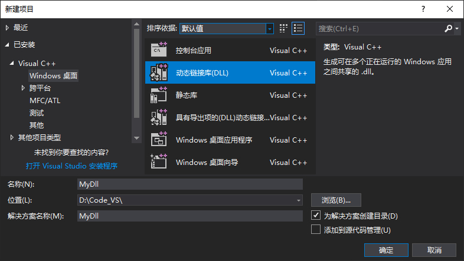
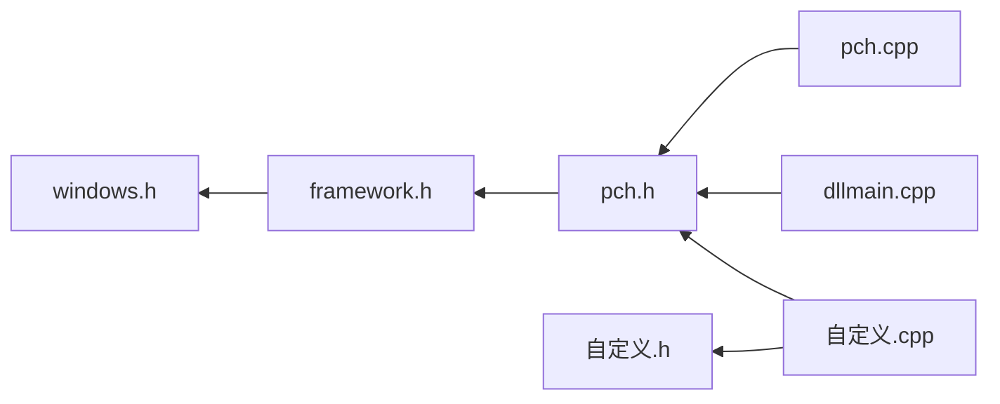
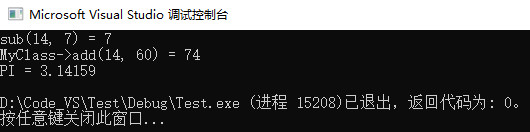
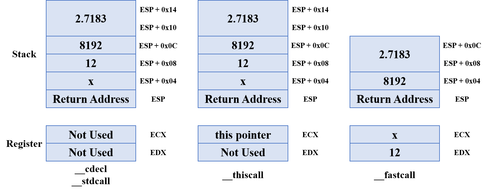

# Microsoft Visual C++

Microsoft Visual C++（简称Visual C++、MSVC、VC++、VC等）是微软公司的C/C++开发工具，具有集成开发环境，提供C/C++语言编译套件，其编译器是微软的CL编译器（即cl.exe）。

在安装Microsoft Visual Studio集成开发环境后，可将其安装目录下的VC\Tools\MSVC\14.29.30133\bin\Hostx64\x64目录添加到PATH环境变量，以启用cl.exe编译器。默认情况下，无需为cl.exe配置INCLUDE与LIB环境变量，其会自动搜寻安装路径与Windows Kits目录下的头文件与库文件。

而如下想为cl.exe指定其他头文件和库文件夹的路径，则其不再自动搜寻安装路径，此时需要先为INCLUDE和LIB环境变量配置默认的搜寻路径，分别如下所示。

```
S:\Microsoft Visual Studio 2019 Community\VC\Tools\MSVC\14.29.30133\include
C:\Program Files (x86)\Windows Kits\10\Include\10.0.19041.0\shared
C:\Program Files (x86)\Windows Kits\10\Include\10.0.19041.0\ucrt
C:\Program Files (x86)\Windows Kits\10\Include\10.0.19041.0\um
C:\Program Files (x86)\Windows Kits\10\Include\10.0.19041.0\winrt
C:\Program Files\Python39\include
C:\Program Files\NVIDIA\CUDA\v11.8\include
```

```
S:\Microsoft Visual Studio 2019 Community\VC\Tools\MSVC\14.29.30133\lib\x64
C:\Program Files (x86)\Windows Kits\10\Lib\10.0.19041.0\ucrt\x64
C:\Program Files (x86)\Windows Kits\10\Lib\10.0.19041.0\ucrt_enclave\x64
C:\Program Files (x86)\Windows Kits\10\Lib\10.0.19041.0\um\x64
C:\Program Files\Python39\libs
C:\Program Files\NVIDIA\CUDA\v11.8\lib\x64
```

将上述默认路径配置完成后，再配置自定义搜寻路径。注意，多个路径使用;分号隔开。修改后，可能需要重启系统以生效。

# Windows平台库文件

## 概述和简单实现

动态链接库（Dynamic Link Library，DLL）的.dll文件是一种特殊应用程序，这种文件被称为应用程序拓展，它是一个包含代码和数据的库，可由多个其他程序进程同时使用。动态链接库提供了一种方法，使进程可以调用不属于其执行代码的函数。函数的可执行代码位于一个.dll文件中，该文件包含一个或多个已被编译、链接并使用它们的进程分开存储的函数。

通过使用DLL，程序可以实现模块化，由相对独立的组件组成。当某个程序或DLL使用其他DLL中的DLL函数时，就会创建依赖项，因此该程序就不再是独立的，并且如果该依赖项被损坏，该程序就可能遇到问题。

在创建DLL时，可以有选择地指定入口点的函数。当进程或线程将它们自身附加到DLL或者将它们自身以DLL分离时，都会调用入口函数。入口函数应该只进行简单的初始化工作（如初始化全局变量），而不应该调用其他DLL函数或者终止函数。

与DLL动态链接库相对应的是静态链接库（Static Link Library）.lib文件。Linux中的静态链接库文件和动态链接库文件的后缀名分别为.a和.so。

### 1. 创建DLL项目

创建自定义的DLL库，可以借助编译器提供的DLL项目框架，如在Visual Studio 2017 Community中：



默认存在的文件有：`framework.h`，它包含`<windows.h>`文件；`dllmain.cpp`，它定义入口函数；`pch.h`、`pch.cpp`，pch头文件通过包含其他头文件来引用并预编译它们，而相关实现文件通过包含pch.h将该项目所要编译的源文件递归包含成一个源文件，形成一个编译单元。



```c++
// dllmain.cpp : 定义 DLL 应用程序的入口点。
#include "pch.h"

BOOL APIENTRY DllMain( HMODULE hModule,				// 模块句柄
                       DWORD  ul_reason_for_call,	 // 调用原因
                       LPVOID lpReserved			// 保留参数
                     )
{
    switch (ul_reason_for_call)
    {
    case DLL_PROCESS_ATTACH:		// DLL被某个进程加载
    case DLL_THREAD_ATTACH:			// DLL被某个线程加载
    case DLL_THREAD_DETACH:			// DLL被某个线程卸载
    case DLL_PROCESS_DETACH:		// DLL被某个进程卸载
        break;
    }
    return TRUE;
}
```

- 在Win32中，`HINSTANCE`在win32下与`HMODULE`是相同的东西，这两种类型可以替换使用；在Win32下还存在HINSTANCE主要是因为要兼容win16。
- 全局变量的初始化工作可以放在该文件中匹配要去的case中。

### 2. 编写DLL和导出函数

- 导出。所有要导出的DLL函数或变量前要添加`__declspec(dllexport)`（MSVC中专用的关键字），该修饰符指示编译器和链接器从DLL导出函数或变量，以便其他应用程序可以使用它。使用该关键字可以省略.def文件。
- 使用。要在其他项目程序中使用DLL函数，必须使用`__declspec(dllimport)`来声明要导入的各个函数。
- 最好使用一个包含#define语句和#ifdef语句的文件，以便分隔导出语句和导入语句。因为库供应者需要将某个头文件提供给使用者，供应商应该使用dllexport，使用者应该使用import。
- 如果使用了Win32 API，则应该在函数名前使用关键字`__stdcall`修饰函数；此外还有`__cdecl`、`__fastcall`等修饰符，它们都是用来指示编译器在编译时，在目标文件中生成的符号的形式是什么样的，主要是为了兼容不同风格的API。如使用?标识函数开始，后紧跟函数名，使用@@YA引出参数表，@Z标识结束等等，详情请另参阅其他资料。VC++对函数的缺省是`__cdecl`，将只能被C/C++调用。
- 如果将C++生成的DLL供标准C语言使用，输出文件用extern "C"来修饰，设置导出函数时采用.def文件形式，而不是__declspec(dllexport) 。

供应商示例代码如下：

```c++
// pch.h
#ifndef PCH_H
#define PCH_H

// 一般在预编译 pch.h 头文件中定义（因为一个项目一般不止一个导出头文件）
// 供应商有该头文件所以有 EXPORTDLL_EXPORTS 的定义，使用的是 __declspec(dllexport)
// 而且由于使用者没该头文件，所以没有 EXPORTDLL_EXPORTS 的定义，使用的是 __declspec(dllimport)
#define EXPORTDLL_EXPORTS

// 添加要在此处预编译的标头
#include "framework.h"

#endif //PCH_H
```

```c++
// MyClass.h
#pragma once

#ifdef EXPORTDLL_EXPORTS
// 供应商在 pch.h 定义了 EXPORTDLL_EXPORTS，故 EXIM_API 定义为 __declspec(dllexport)
#define EXIM_API __declspec(dllexport)
#else
#define EXIM_API __declspec(dllimport)
#endif // EXPORTDLL_EXPORTS

// 导出的类
class EXIM_API MyClass {
public:
	virtual int add(int a, int b) = 0;
	virtual ~MyClass() {};
};

// 导出的函数，使用 extern "C" 向C兼容
#ifdef __cplusplus
extern "C" {
#endif // __cplusplus

	EXIM_API MyClass* createMyClass();
	EXIM_API void destroyMyClass(MyClass* mc);

#ifdef __cplusplus
}
#endif // __cplusplus

// 也可以用下列方法声明导出的函数和变量
extern "C" EXIM_API int sub(int a, int b);
extern "C" EXIM_API float PI;	// 导出的全局变量
```

```c++
// MyClass.cpp
#include "pch.h"
#include "MyClass.h"
#include "MyConcreteClass.h"

EXIM_API MyClass * createMyClass() {
	return new MyConcreteClass();
}

EXIM_API void destroyMyClass(MyClass * mc) {
	delete mc;
}

EXIM_API int sub(int a, int b) {
	return a - b;
}

EXIM_API float PI = 3.1415926f;
```

```c++
// MyConcreteClass.h
#pragma once
#include "MyClass.h"

class MyConcreteClass : public MyClass {
public:
	virtual int add(int a, int b);
	virtual ~MyConcreteClass() {};
};
```

```c++
#include "pch.h"
#include "MyConcreteClass.h"

int MyConcreteClass::add(int a, int b) {
	return a + b;
}
```

代码编写完后，执行项目的生成命令，即可在Debug或Release目录下生成动态库.dll文件和静态库.lib文件。

###  3. 使用DLL库

调用DLL有两种方法，一种是显式链接方式，另一种是隐式链接方式。显式链接的三大函数是`LoadLibrary`、`GetProcAddress`、`FreeLibrary`，分别加载库文件，获得函数的地址（通过函数名），释放库文件；即在程序使用DLL库的时候再动态加载DLL库。隐式链接方式，即在程序一运行就将DLL加载到应用程序中。

值得注意的是，使用显式链接即使用.dll文件时，不需要使用包含.h文件；对于类来说，可以参考要使用的方法声明一个同型类，而不用实现。在使用显式链接时，只需要将从供应商那里获得的相关.dll动态库文件放到当前工程目录下即可；而使用隐式链接时，则需要.h头文件和.lib文件。

这里给出一个显式链接的示例：

```c++
// main.cpp
#include <Windows.h>
#include <iostream>

// 声明，类似前置类，仅仅是为了让编译器知道有这么一个类型；不需要定义，如果定义了则使用新定义的方法
class MyClass {
public:
	virtual int add(int, int) = 0;
};

/*	上述声明甚至可以使用结构体，其实和类一致
struct MyClass {
	virtual int add(int, int) = 0;
};
*/

// 定义函数指针类型
typedef int(*Func_1)(int, int);
typedef MyClass* (*CreateFunc)();
typedef void(*DestroyFunc)(MyClass*);

int main() {
	HMODULE hModule;			// 模块句柄
	hModule = ::LoadLibrary("MyDll.dll");		// 加载库文件
	if (hModule == NULL) {
		MessageBox(NULL, "DLL loads error", "Mark", MB_OK);		// 窗口
	}

	// 获取相应DLL函数的入口地址
	Func_1 sub = (Func_1)::GetProcAddress(hModule, "sub");
	CreateFunc createMyClass = (CreateFunc)::GetProcAddress(hModule, "createMyClass");
	DestroyFunc destroyMyClass = (DestroyFunc)::GetProcAddress(hModule, "destroyMyClass");

	// 调用相应函数
	if (sub != NULL) {
		std::cout << "sub(14, 7) = " << sub(14, 7) << std::endl;
	}
	if (createMyClass != NULL && destroyMyClass != NULL) {
		MyClass* mcc = createMyClass();
		std::cout << "MyClass->add(14, 60) = " << mcc->add(14, 60) << std::endl;
		destroyMyClass(mcc);
		mcc = NULL;
	}

	// 调用相应变量
	float* pi_ptr = (float*)::GetProcAddress(hModule, "PI");
	if (pi_ptr != NULL) {
		std::cout << "PI = " << *pi_ptr << std::endl;
	}

	FreeLibrary(hModule);		// 释放句柄，释放库文件
	return 0;
}
```



## DLL浅析

### 1. 概述

动态链接库dll是从C语言函数库和Pascal库单元的概念发展而来的，所有的C语言标准库函数都存放在某一函数库中。在链接应用程序的过程中，链接器从库文件中拷贝程序调用的函数代码，并把这些函数代码添加到可执行文件中。这种方法相比于“只把函数储存在已编译的OBJ文件中”更有利于代码的重用。

但随着Windows这样的多任务环境的出现，函数库的方法显得过于累赘。如果为了完成屏幕输出、消息处理、内存管理、对话框等操作，每个程序都不得不拥有自己的函数，那么Windows程序将变得非常庞大。Windows的发展要求同时运行的几个程序共享一组函数的单一拷贝。动态链接库就是在这种情况下出现的。

动态链接库不用重复编译或链接，一旦装入内存，DLL函数可以被系统中的任何正在运行的应用程序软件所使用，而不必再将DLL函数的另一拷贝装入内存。

`DllMain`函数是DLL模块的默认入口点，当Windows加载DLL模块时调用这一函数。系统首先调用全局对象的构造函数，然后调用全局函数DLLMain。在将DLL链接加载到进程时或者与进程分离时，DllMain入口函数被调用；在单个线程启动和终止时，DLLMain函数也被调用。如果程序员没有为DLL模块编写一个DLLMain函数，系统会从其它运行库中引入一个不做任何操作的缺省DLLMain函数版本。

### 2. 导出DLL

另一种导出DLL函数和变量的方法是，通过模块定义文件（Module Definition File，DEF）.def 文件（实质是文本文件）来进行声明，它不是Microsoft VC专用的。一个.def文件中有两个必须的部分：LIBRARY、EXPORTS。

```
LIBRARY dll_filename
DESCRIPITION "my sample dll"
EXPORTS
	function_name @1	; the first function exported using @1
	variable_name DATA	; identify the var by using DATA
```

- 一个分号`;`后跟的是注释。
- LIBRARY，必需部分，它告诉链接器linker如何命名这个dll文件。
- DESCRIPITION，非必须部分，该语句将字符串写入.rdata节，它可以用来描述这个dll的功能等信息。
- EXPORTS，必须部分，声明函数和变量，使得函数和变量可以被其他应用程序访问到并且创建它的一个导入库。当生成这个项目的时候，不仅是一个.dll文件被创建，而且一个文件扩展名为.lib的导出库也被创建。
- NAME、STACKSIZE、SECTIONS、VERSION。

对于使用.def导出类，因为C++编译器对符号symbol进行修饰的原因，不能直接使用.def文件声明导出类和显式链接；所以可使用全局函数如MyClass\* createMyClass()作为创建函数，来间接得到一个类的实例。

### 3. 导入库

如果应用程序使用`LoadLibrary`显式链接，那么在这个函数的参数中可以指定.dll文件的完整路径；如果不指定路径，或是进行隐式链接，Windows将按照以下的搜索顺序来定位DLL：

1. 包含.exe文件的目录；
2. 进程当前的工作目录；
3. Windows系统目录；
4. Windows目录；
5. 列在Path环境变量中的一系列目录。

另一种导入DLL的方法是隐式导入（实际上是使用.lib库），首先将.lib文件和.h头文件在复制到要导入的工程目录下，然后使用 #pragma comment 导入到工程中；也可以利用编译器设置项目的属性来导入。

```c
#inluce "SampleDll.h"
#pragma comment(lib, "SampleDll.lib")
// use the function declared in.hand implemented in .lib
```

### 4. 使用DLL在进程间共享数据

在Win16环境中，DLL的全局数据对每个载入它的进程来说都是相同的,因为所有的进程用的都收同一块地址空间；而在Win32环境中，情况却发生了变化，每个进程都有了它自己的地址空间，DLL函数中的代码所创建的任何对象（包括变量）都属于调用它的进程。

在物理内存中，多进程载入DLL时，DLL的代码段实际上是只加载了一次，只是将物理地址映射到了各个调用它的进程的虚拟地址空间中，实际的内存内容并没有复制，不过是把该函数以这个进程的身份执行，使用的是这个进程的堆栈。

而全局数据会在每个进程都分别加载，即复制该DLL的全局数据的一份拷贝到该进程空间。也就是说每个进程所拥有的相同的DLL的全局数据，它们的名称、虚拟地址相同，但其值却并不一定是相同的，而且是互不干涉的；因为它们在不同程序的虚拟内存空间中，虽然地址相同，但不是同一段内存。

因此，在Win32环境下要想在多个进程中共享数据，就必须进行必要的设置。在访问同一个Dll的各进程之间共享存储器可以是通过存储器映射文件技术实现的；也可以把这些需要共享的数据分离出来，放置在一个独立的数据段里，并把该段的属性设置为共享，在共享数据段中的所有变量可以被访问该DLL文件的所有进程看到和共享。

这里举一个使用共享数据段的例子，使用了#pragma data_seg，其中的变量必须在定义时初始化。

```c
#pragma data_seg("Share_Data_Segment")		// 共享数据段开始
int g_count = 0;		// 定义时初始化，否则将被放到 BSS 段
#pragma data_seg()		// 共享数据段结束
#pragma comment(linker, "/SECTION:Share_Data_Segment,RWS")		// 解释见下
```

仅定义一个数据段的描述还不能达到共享数据的目的，还要告诉编译器/链接器该段的属性是共享的，这就是上述中#pragma comment指令的作用，其中RSW表示该段的属性是Read、Write、Shared。要实现这种效果，其实还有两种方法。可以在IDE的项目设置的链接选项中加入`/SECTION:Share_Data_Segment,RWS`（没找到）。也可以在.def文件中对该段进行描述，如下。

```
SECTIONS
	Share_Data_Segment READ WRITE SHARED
```

一些值得注意的内容如下。不要在共享数据段中存放某个进程相关的信息，Win32中大多数的数据结构和值（比如HANDLE）只在特定的进程上下文中才是有效的。每个进程都有它自己的地址空间，因此不要在共享数据段中共享指针，指针指向的地址在不同的地址空间中是不一样的。DLL在每个进程中是被映射在不同的虚拟地址空间中的，因此函数指针也是不安全的。

当然还有其它的方法来进行进程间的数据共享，比如文件内存映射等，这就涉及到通用的进程间通信IPC等内容了，此处不再赘述。

## 生成Java程序使用的dll文件

Java程序可以使用`native`关键字声明方法，使之成为本地方法，要求其他编程语言（常是C/C++）为其实现（通常是一些无法由Java实现的底层操作），而Java不用实现。

首先步骤和上述类似，先用Visual Studio 2017创建一个DLL项目，这里的例子名叫做MyJavaDll，然后创建好所要导出的头文件。

### 1. jni.h概述

需要注意的是：

- 如果我有一个名为mypack.mydll.Calculator的Java类（前面是包名）要使用dll文件，则创建的头文件的名字应该叫做mypack_mydll_Calculator.h，即与要使用dll库的Java类名相关。
- 在所创建的头文件中，首先要在C/C++项目中添加由Java提供的特定头文件jni.h和jni_md.h（通常位于Java的jdk目录中的include和include/win32目录下）；然后把它们包含在要作为Java调用dll导出的头文件中，如包含在上述mypack_mydll_Calculator.h头文件。
- jni.h和jni_md.h头文件中提供了一系列的宏定义和类型定义，它把Java的一系列类型和环境，转换为C/C++的符号，以在用C/C++编写导出文件的时候使用。
  - JNIEXPORT和JNIIMPORT宏定义实际上是\_\_declspec(dllexport)和\_\_declspec(dllimport)，JNICALL宏定义实际上是\_\_stdcall。
  - 还有一些类型的typedef，如typedef long jint;、typedef \_\_int64 jlong;、typedef signed char jbyte;等一系列基本类型、数组类型等。在用C/C++编写源码时，有对应的则要使用这些类型，而不是C/C++中的类型。
  - 还有一些Class（如class \_jobject {};、class \_jclass : public \_jobject {};、class \_jarray : public \_jobject {};、class \_jcharArray : public \_jarray {};等）标识了各种Java中的一些C/C++不支持的类型，如typedef \_jcharArray* jcharArray;、typedef \_jthrowable* jthrowable;等。这些类型的使用方法，可查阅相关资料。
  - 还有JNIInvokeInterface\_和JavaVM\_标识了Java本地调用接口和JVM等。

### 2. 编写dll导出的.h和.cpp文件

作为例子，下面给出mypack_mydll_Calculator.h头文件和mypack_mydll_Calculator.cpp的源码实现。

```c++
// mypack_mydll_Calculator.h
#include "jni.h"

#ifndef _Include_mypack_mydll_Calculator
#define _Include_mypack_mydll_Calculator

#ifdef __cplusplus
extern "C" {
#endif // __cplusplus

JNIEXPORT jint JNICALL Java_mypack_mydll_Calculator_add(JNIEnv *, jclass, jint, jint);
JNIEXPORT jint JNICALL Java_mypack_mydll_Calculator_abs(JNIEnv *, jclass, jint);
		
JNIEXPORT void JNICALL Java_mypack_mydll_Calculator_setNumber(JNIEnv *, jclass, jint);
JNIEXPORT jint JNICALL Java_mypack_mydll_Calculator_getNumber(JNIEnv *, jclass);

#ifdef __cplusplus
}
#endif // __cplusplus

#endif // !_Include_mypack_mydll_Calculator
```

```c++
// mypack_mydll_Calculator.cpp
#include "pch.h"
#include "mypack_mydll_Calculator.h"

static int sNumber = 0;

JNIEXPORT jint JNICALL Java_mypack_mydll_Calculator_add(JNIEnv *, jclass, jint a, jint b) {
	return a + b;
}

JNIEXPORT jint JNICALL Java_mypack_mydll_Calculator_abs(JNIEnv *, jclass, jint a) {
	return a < 0 ? -a : a;
}

JNIEXPORT void JNICALL Java_mypack_mydll_Calculator_setNumber(JNIEnv *, jclass, jint a) {
	sNumber = a;
}

JNIEXPORT jint JNICALL Java_mypack_mydll_Calculator_getNumber(JNIEnv *, jclass) {
	return sNumber;
}
```

至此编码工作已基本完成，接下来就可以考虑导出为dll文件了。

### 3. 自动生成所要导出的头文件

当然，也可以自动生成要导出为dll文件的.h头文件。

可以首先编写一个Java类文件，在其中确定native方法，例子如下。

```java
package mypack.mydll;
// TmpStore.java
public class TmpStore {
    public static native void storeString(String str);
    public static native String getString();
}
```

然后在与该类名（包含包名）同级的目录中，使用cmd控制台运行javah命令，如下。

```shell
javah mypack.mydll.TmpStore
```

然后就会在目录下生成一个名为mypack.mydll.TmpStore.h的C/C++头文件，内容如下。

```c++
/* DO NOT EDIT THIS FILE - it is machine generated */
#include "jni.h"
/* Header for class mypack_mydll_TmpStore */

#ifndef _Included_mypack_mydll_TmpStore
#define _Included_mypack_mydll_TmpStore
#ifdef __cplusplus
extern "C" {
#endif
/*
 * Class:     mypack_mydll_TmpStore
 * Method:    storeString
 * Signature: (Ljava/lang/String;)V
 */
JNIEXPORT void JNICALL Java_mypack_mydll_TmpStore_storeString
  (JNIEnv *, jclass, jstring);

/*
 * Class:     mypack_mydll_TmpStore
 * Method:    getString
 * Signature: ()Ljava/lang/String;
 */
JNIEXPORT jstring JNICALL Java_mypack_mydll_TmpStore_getString
  (JNIEnv *, jclass);

#ifdef __cplusplus
}
#endif
#endif

```

将该文件就是要通过C/C++实现的导出dll的头文件，拷贝并添加到C/C++的Dll项目中，然后用C/C++编写它的实现文件即可，如下。

```c++
#include "pch.h"
#include "mypack_mydll_TmpStore.h"

#pragma warning(disable:4996)

static char* sChars = NULL;

JNIEXPORT void JNICALL Java_mypack_mydll_TmpStore_storeString(JNIEnv* env, jclass, jstring str) {
	if (sChars != NULL) {
		delete sChars;
	}
	// 分配内存空间存储字符串，最后要使用Release函数释放
	const char* srcStr = env->GetStringUTFChars(str, NULL);
	size_t len = strlen(srcStr);
	sChars = new char[len + 1];
	memset(sChars, '\0', (len + 1) * sizeof(char));
	strcpy(sChars, srcStr);
	env->ReleaseStringUTFChars(str, srcStr);	// 释放空间
}

JNIEXPORT jstring JNICALL Java_mypack_mydll_TmpStore_getString(JNIEnv* env, jclass) {
	return env->NewStringUTF(sChars);
}
```

- 注意上述jstring类型在C/C++代码中的使用方式；实际上每一个在C/C++中没有直接对应的Java类型，其使用方式都与以上代码类似，具体可查阅有关资料。

### 4. 在Java项目中使用dll动态库

在上述C/C++代码编写完成后，就可以生成dll文件了。需要注意的是，如果是目标机器上是32位的JRE，则需要用x84（32位）的C/C++编译器生成dll文件；如果目标机器上是64位的JRE，则需要用x64（64位）的C/C++编译器生成dll文件（通常位于x64文件夹中）。

在Java项目中使用dll动态库就显得非常简单了，将生成的dll文件拷贝到Java项目的根目录下即可。

对于要使用dll的类，首先确保类名（包含包名）正确，即与相应的C/C++文件名相对应，然还在Java类中用native声明相应的本地方法，并使用System.loadLibrary()方法加载dll文件即可。

上述所列举的两个例子，它们的Java类如下。

```java
package mypack.mydll;
// Calculator.java
public class Calculator {
    static {
        System.loadLibrary("MyJavaDll");
    }

    public native int add(int a, int b);
    public native int abs(int a);

    public native void setNumber(int a);
    public native int getNumber();
}
```

```java
package mypack.mydll;

public class TmpStore {
    static {
        System.loadLibrary("MyJavaDll");
    }
    
    public static native void storeString(String str);
    public static native String getString();
}
```

使用的例子如下。

```java
public static void main(String[] args) {
    TmpStore.storeString("这是一个加法算式：");
    int ret = new Calculator().add(3, 4);
    String outStr = TmpStore.getString() + "3 + 4 = " + ret;
    System.out.println(outStr);		// 输出：这是一个加法算式：3 + 4 = 7
}
```

### 5. JNI类型签名

上面介绍了如何实现Java的动态库，并在Java代码中通过JNI调用动态库的过程，这里再补充一些知识。可以发现，有javah命生成的.h头文件中，其注释中会有Signature一项，即JNI的类型签名，它能够让C/C++代码调用Java代码。

JNI的类型签名标识了一个特定的Java类型，这个类型既可以是类和方法，也可以是数据类型。

基本数据类型的签名采用一系列大写字母来表示，如下表所示。

| Java类型 | 签名 | Java类型 | 签名 |
| :------: | :--: | :------: | :--: |
| boolean  |  Z   |   long   |  J   |
|   byte   |  B   |  float   |  F   |
|   char   |  C   |  double  |  D   |
|  short   |  S   |   void   |  V   |
|   int    |  I   |          |      |

从上表可以看出，基本数据类型的签名是有规律的，一般为首字母的大写，但boolean用的是Z，因为B已经被short占用了；而long用的也不是L，是因为L表示的是类的签名，如下。

类的签名比较简单，它采用`L+packageName+className+;`的形式，其中包名中的`.`需要替换为`/`，而且`;`也是签名的一部分。如对于java.lang.String类而言，它的签名即为Ljava/lang/String;，其他类的签名与此相似。

对象和数组的签名规则如下，它采用`[+typeSignature`的形式其中`[`的个数表示数组的维度，如n维数组就有n个`[`符号。对于int一维数组来说，它的签名就是[I；对于Object二维数组来说，它的签名就是[[Ljava/lang/Object;。

方法的签名规则为`(paramTypesSignature)+returnTypeSignature`，对于boolean func(int a, String b, int[] c)方法来说，它的签名就是(ILjava/lang/String;[I)Z。

有了JIN类型签名的概念，下面开始介绍JNI调用Java方法的流程。JNI调用Java方法的流程是先通过类名找到类，然后再根据方法名找到方面的id，最后根据id调用这个方法即可。如果调用的Java方法是非静态方法，那么需要根据类的对象后才能调用它。

下面是一个从Java中调用JNI，再由JNI调用Java中的方法的例子，如下所示。

```c++
// mypack_mydll_DoubleCall.h
/* DO NOT EDIT THIS FILE - it is machine generated */
#include "jni.h"
/* Header for class mypack_mydll_DoubleCall */

#ifndef _Included_mypack_mydll_DoubleCall
#define _Included_mypack_mydll_DoubleCall
#ifdef __cplusplus
extern "C" {
#endif
/*
 * Class:     mypack_mydll_DoubleCall
 * Method:    goJNI
 * Signature: ()V
 */
JNIEXPORT void JNICALL Java_mypack_mydll_DoubleCall_goJNI
  (JNIEnv *, jobject);

#ifdef __cplusplus
}
#endif
#endif
```

```c++
// mypack_mydll_DoubleCall.cpp
#include "mypack_mydll_DoubleCall.h"
JNIEXPORT void JNICALL Java_mypack_mydll_DoubleCall_goJNI(JNIEnv * env, jobject thiz) {
	jclass clazz = env->FindClass("mypack/mydll/DoubleCall");
	if (clazz == nullptr) {
		printf("Find class mypack.mydll.DoubleCall error!");
		return;
	}
	// 在这里使用了签名去找到一个方法的ID，以便根据方法的ID去调用方法
	jmethodID aPrintId = env->GetMethodID(clazz, "aPrint", "(Ljava/lang/String;)V");
	if (aPrintId != nullptr) {
		jstring msg = env->NewStringUTF("msg send by JNI to aPrint");
		env->CallVoidMethod(thiz, aPrintId, msg);
	}

	jmethodID aStaticPrintId = env->GetStaticMethodID(clazz, "aStaticPrint", "(Ljava/lang/String;)V");
	if (aStaticPrintId != nullptr) {
		jstring msg = env->NewStringUTF("msg send by JNI to aStaticPrint");
		env->CallVoidMethod(clazz, aStaticPrintId, msg);
	}
}
```

```java
// mypack.mydll.DoubleCall.java
package mypack.mydll;
public class DoubleCall {
    static {
        System.loadLibrary("MyJavaDll");
    }
    public void aPrint(String str) {
        System.out.println("aPrint from JNI, str: " + str);
    }

    public static void aStaticPrint(String str) {
        System.out.println("aStaticPrint from JNI, str: " + str);
    }

    public native void goJNI();
}
```

一个使用的例子及其输出结果如下。

```java
DoubleCall dc = new DoubleCall();
dc.goJNI();
/* 输出：
aPrint from JNI, str: msg send by JNI to aPrint
aStaticPrint from JNI, str: msg send by JNI to aStaticPrint
*/
```


# Microsoft C++扩展

本节将介绍特定于Microsoft Visual C++编译环境的C++扩展，这些扩展由MSVC通过提供专用的关键字来支持，一些关键字可用于修改所声明的符号以构成派生类型（Derived Type），如下所示。

| 关键字         | 含义                                                         | 是否构成派生类型 |
| -------------- | ------------------------------------------------------------ | ---------------- |
| \_\_based      | 定义一个基指针类型，由该类型定义的指针将自动添加基指针的偏移 | 是               |
| \_\_cdecl      | 指定函数在调用时，遵循C标准的命名和调用约定                  | 是               |
| \_\_stdcall    | 指定函数在调用时，遵循Windows标准调用约定（standard calling convention） | 是               |
| \_\_fastcall   | 指定函数在调用时，用寄存器（若可用）传递参数，而不是用堆栈传递参数 | 是               |
| \_\_vectorcall | 指定函数在调用时，用包括SSE在内的寄存器（若可用）传递参数，而不是用堆栈传递参数 | 是               |
| \_\_unaligned  | 指示指向某数据类型的指针是未对齐的                           | 否               |
| \_\_restrict   | 指示符号在当前范围中未使用别名                               | 否               |
| \_\_declspec   | 指定符号存储类型信息的MSVC扩展语法                           | 否               |

## 指针与地址

### \_\_based

关键字`__based`可以使用一个指针作为偏移量，并据此声明一个指针，其中指针可以是void\*类型。

```c++
Type __based(base_ptr) *ptr;
```

在需要精确控制将对象分配到的段（基于静态和动态的数据）时，基寻址很有用。

```c++
int *based_ptr;
typedef int __based(based_ptr) *BasedPtrType;

int main() {
    int arr1[] = { 1,2,3 };
    int arr2[] = { 4,5,6 };
    BasedPtrType ptr = nullptr;
    based_ptr = arr1;
    std::cout << *ptr << ", " << *(ptr+1) << std::endl;  // 1, 2
    based_ptr = arr2;
    std::cout << *ptr << ", " << *(ptr+1) << std::endl;  // 4, 5
    return 0;
}
```

### \_\_unaligned

关键字`__unaligned`修饰指针时，编译器将假定该指针指向未对齐的数据，即指针指向的地址是未对齐的，而指针本身是对齐的。因此，会生成平台适用的代码（platform-appropriate code），以通过指针处理未对齐的读取和写入。

### \_\_restrict

在C99标准中引入`restrict`关键字，并可以在C11及C17标准中使用，关键字`__restrict`或\_\_declspec(restrict)的作用与之等价，用于C++编程。该修饰符指示符号在当前范围中未使用别名，即当前作用域中没有其他指针引用相同的内存位置，这允许编译器生成更优化的代码。

\_\_restrict关键字仅对变量有效，而\_\_declspec(restrict)仅对函数声明和定义有效。使用\_\_restrict时，编译器将不会传播变量的非别名属性，如果向非\_\_restrict变量分配\_\_restrict变量，则编译器仍允许非\_\_restrict变量使用别名。

```c++
void sum(int* __restrict arr1, int* __restrict arr2, int len) {
    for (int i = 0; i < len; ++i) {
        arr1[i] = arr1[i] + arr2[i];
    }
}
union MyUnion {
   int*    __restrict int_val;
   double* __restrict double_val;
};
```

在函数sum中，关键字\_\_restrict指示的参数arr1和arr2是不相连的数组，程序只会通过arr1和arr2访问其中数据，则编译器就可据此优化，将函数的循环展开到多个处理器核上执行。在联合体MyUnion中，告知编译器在给定域中，只会访问int_val和double_val其中的一个。

## 调用约定

MSVC编译器支持内部函数和外部函数的不同的调用约定，有助于调试程序以及将源代码与汇编程序链接。利用MSVC编译器，可以指定调用方（caller）和被调用方（callee）之间的参数传递和返回值约定。并非所有约定都在支持的所有平台上可用，某些约定使用特定于平台的实现，多数情况下，将忽略特定平台不支持的约定，并使用平台的默认约定。

编译器将生成prolog和epilog代码来保存并还原EBX、ESI、EDI、EBP寄存器（如果在函数中使用的话）。

MSVC编译器支持如下调用约定。

| 关键字         | 堆栈清理 | 参数传递                                                     |
| -------------- | -------- | ------------------------------------------------------------ |
| \_\_cdecl      | 调用方   | 以参数声明的相反顺序（从右到左）压入堆栈                     |
| \_\_clrcall    | N/A      | 以参数声明的相同顺序（从左到右）加载到CLR表达式堆栈          |
| \_\_thiscall   | 被调用方 | 以参数声明的相反顺序（从右到左）压入堆栈，同时this指针存储至ECX寄存器 |
| \_\_stdcall    | 被调用方 | 以参数声明的相反顺序（从右到左）压入堆栈                     |
| \_\_fastcall   | 被调用方 | 先存储到寄存器，然后以参数声明的相反顺序（从右到左）压入堆栈 |
| \_\_vectorcall | 被调用方 | 先存储到寄存器，然后以参数声明的相反顺序（从右到左）压入堆栈 |

### \_\_cdecl

`__cdecl`是C和C++程序的默认调用约定，堆栈由调用方清理，因此可执行vararg变长参数函数。\_\_cdecl调用约定创建的可执行文件大于\_\_stdcall调用约定创建的可执行文件，这是因为它要求调用方对每个函数调用都包含堆栈清理代码。

在x86架构上，一个4字节返回值通过EAX寄存器返回，而更大的8字节返回值通过EDX:EAX寄存器对返回，更大的结构通过EAX返回指向隐藏返回结构（hidden return structure）的指针，不是POD结构的数据不会在寄存器中返回。

在x86架构上，默认缺省使用\_\_cdecl修饰符，指定C风格命名和调用约定；在x64架构上，一般会忽略\_\_cdecl修饰符，而是按照x64默认约定，将参数尽可能传入寄存器，后续参数传递到堆栈中。

### \_\_clrcall

指定只能从托管代码（managed code）调用的函数，对所有只能从托管代码调用的虚函数使用`__clrcall`修饰符。

具有\_\_clrcall指定的虚拟函数，其相应的虚拟表（virtual table）将是一个应用程序域（appdomain）。如果在一个应用程序域中创建对象，则只能从该应用程序域中调用虚拟函数。

### \_\_thiscall

`__thiscall`用于指定x86架构上C++类成员函数，是成员函数使用的默认调用约定，堆栈由被调用方清理，因此不能执行vararg变长参数函数。以参数声明的相反顺序（从右到左）压入堆栈，同时this指针存储至ECX寄存器。

在x64架构上，一般会忽略\_\_thiscall修饰符，而是按照x64默认约定，将参数尽可能传入寄存器，后续参数传递到堆栈中。

对于vararg变长参数的类成员函数来说，使用\_\_cdecl调用约定，所有参数压入堆栈，this指针存储至最后一个栈顶。

### \_\_stdcall

`__stdcall`用于指定Windows32 API函数，被调用方将清理堆栈，按值传递参数，除非传递指针或引用类型，被调用的函数从堆栈中弹出自己的参数。使用\_\_stdcall修饰符指定函数的返回值方式与使用\_\_cdecl指定的函数相同。

在x64架构上，一般会忽略\_\_stdcall修饰符，而是按照x64默认约定，将参数尽可能传入寄存器，后续参数传递到堆栈中。

### \_\_fastcall

`__fastcall`用于指定尽可能在寄存器中传递函数参数，仅适用于x86架构；在x64架构上，一般会忽略\_\_fastcall修饰符，而是按照x64默认约定，将参数尽可能传入寄存器，后续参数传递到堆栈中。

由\_\_fastcall修饰符指定的调用约定，在参数列表中按从左到右的顺序找到前两个DWORD或更小的参数，在ECX和EDX寄存器中传递，所有剩余的其他参数在堆栈上按从右向左的顺序传递。

对于类（calss）、结构体（struct）、联合体（union）类型，被视为多字节类型（无论大小）并在堆栈上传递，对于枚举（enum）或枚举类，若其基础类型可通过寄存器传递，则通过寄存器传递。

### \_\_vectorcall

`__vectorcall`用于指定尽可能在寄存器中传递函数的参数，其使用的寄存器的数目多于\_\_fastcall或默认的x64调用约定。使用\_\_vectorcall可加速传递多个浮点数或传递SIMD向量参数的函数，并能充分利用加载到寄存器中的参数。

该\_\_vectorcall调用约定仅在包含第二代流SIMD扩展（Streaming SIMD Extensions 2）或更高版本的x86或x64处理器上支持。

### 调用约定示例

示例函数定义如下所示，其中calltype分别为\_\_cdecl约定、\_\_stdcall约定、\_\_thiscall约定、\_\_fastcall约定。

```c++
int calltype MyFunc(char ch, short sh, int in, double df) { return 0; }
int main(int argc, char *argv[]) {
    MyFunc('A', 12, 8192, 2.7183);
}
```

在调用MyFunc时的堆栈状态和寄存器状态如下所示。



## \_\_declspec

MSVC提供`__declspec`关键字用于指定扩展的存储类型信息，这些扩展的存储类型信息是MSVC编译环境特有的。

对于类型声明，应将\_\_declspec关键字放置在紧跟类型名称之前。对于变量的简单声明，推荐将\_\_declspec关键字放置在声明的最开头，若放置在指针符号`*`或引用符号`&`之后，则编译器会忽略\_\_declspec关键字且不报警告。

```c++
class __declspec(dllimport) MyClass {};       // class
struct MyStruct {};
__declspec(dllimport) struct MyStruct MyObj;  // object
__declspec(thread) int *p1 = 0;  // Recommended, thread and `int` are both part of specifier
int __declspec(thread) *p2 = 0;  // OK, thread and `int` are both part of specifier
int* __declspec(thread) p3 = 0;  // ERROR, thread is not part of a declarator
```

### 内存使用

#### align

说明符`align(#)`可控制自定义类型或声明变量的对齐方式，其中`#`是指定对齐字节数的数字，其可以取1到8192之间的2的整数幂。

```c++
__declspec(align(#)) declarator
```

使用最新处理器指令编写的程序会引入一些新的约束和问题，许多新指令需要16字节对齐的数据；将常用数据与处理器的缓存行（cache line）大小对齐，可以提高缓存性能。

```c++
#define CACHE_LINE 32
struct __declspec(align(CACHE_LINE)) S1 {
   int a, b, c, d;
};
```

#### allocate

说明符`allocate`指定声明数据所存储到的程序段，其中seg_name是一个程序段的名称。

```c++
__declspec(allocate("seg_name")) declarator
```

```c++
#pragma section(".myseg", read, write)
__declspec(allocate(".myseg")) int i = 0;
```

#### allocator

说明符`allocator`可用于自定义内存分配函数，以通过Windows事件跟踪（ETW）使分配行为可见。

#### restrict

说明符`restrict`用于修饰函数参数中的指针类型与返回的指针类型，指示编译器所修饰的指针没有别名，即同一内存地址不会被其他指针指向。这允许编译器执行其他优化。注意，编译器不会执行指针是否存在别名的检查，应有开发人员保证。


### 函数行为

#### code_seg

说明符`code_seg`可指定目标文件中存储函数的段，其作用与#pragma code_seg类似，但会重写其行为。区别在于，#pragma code_seg不控制函数模板实例化后生成代码的放置位置（placement），也不控制编译器隐式生成的代码，例如特殊成员函数。而\_\_declspec(code_seg)则可以控制这些特殊函数的放置位置。

```c++
__declspec(code_seg("seg_name")) declarator
```

#### naked

说明符`naked`可指示编译器，为某个函数生成不带prolog和epilog的汇编代码，利用此功能，可使用内联汇编代码编写自定义的prolog和epilog代码序列。这种不带prolog和epilog的函数称为裸函数（naked function），在编写虚拟设备的驱动程序特别有用。需要注意的是，naked特性仅在x86与ARM架构上有效，不可用于x64架构。

```c++
__declspec(naked) int __fastcall  power(int i, int j) {
    // prolog
    __asm {
        push ebp
        mov ebp, esp
        sub esp, __LOCAL_SIZE
        // store ECX and EDX into stack locations allocated for i and j
        mov i, ecx
        mov j, edx
    }
    {
        int ret = 1;
        while (j-- > 0) ret *= i;
        __asm {	mov eax, ret };
    }
    // epilog
    __asm {
        mov esp, ebp
        pop ebp
        ret
    }
}
```

#### noalias

说明符`noalias`表明函数不会修改可见的全局状态，且只会通过一级间接寻址（first-level indirections）的指针参数来修改内存中的值。如果函数被修饰为noalias，则优化器可假定在函数内部只会引用或修改一级间接寻址的指针参数所指向的内存地址。将函数标记为\_\_declspec(noalias)不会影响函数返回的指针。

```c++
int M = 1024;
int N = 1024;
int K = 1024;
__declspec(noalias) void multiply(float *A, float *B, float *C) {
    for (int i = 0; i < M; i++)
        for (int j = 0; j < N; j++)
            for (int k = 0; k < K; k++) {
                C[i * N + j] = A[i * K + k] * B[k * N + j];
            }
}
```

#### noinline

说明符`noinline`指示编译器永远不要内联类的某个成员函数。如果某个函数很小，对代码性能的影响不大，且不太可能经常调用（如错误处理函数），则不值得内联它。

```c++
class MyClass {
    __declspec(noinline) int mbrfunc() { return 0; }
};
```

#### noreturn

说明符`noreturn`表明函数不会产生返回值。

```c++
__declspec(noreturn) void fatal() {
   std::terminate();
}
```

#### nothrow

说明符`nothrow`表明函数不会引发异常，推荐使用自C++11引入的noexcept运算符。

```c++
void __declspec(nothrow) func1() {};
void func1() noexcept {};
```

### 类行为

#### empty_bases

C++标准要求最底层的派生对象的大小不得为零，并且该对象必须占用一个或多个存储字节，由于此要求只扩展到最底层派生对象，因此基类子对象不受此约束。空基类优化（Empty Base Class Optimization，EBCO）充分利用了这种自由，可以减少内存消耗，提高性能。

只继承一个空类时，会默认执行空基类优化，而连续继承多个空基类时，类布局算法在任意两个连续的空基类之间添加1字节的填充内容，并考虑自然对齐。使用`empty_bases`说明符可执行空基类优化。

```c++
struct Empty1 {};
struct Empty2 {};
struct Derived1 : Empty1, Empty2 { int i; };
struct __declspec(empty_bases) Derived2 : Empty1, Empty2 { int i; };

int main() {
    std::cout << sizeof(Derived1) << std::endl;  // 8
    std::cout << sizeof(Derived2) << std::endl;  // 4
    return 0;
}
```

#### novtable

说明符`novtable`表明类是一个纯接口类，不会实例化对象。这会阻止编译器在构造函数和析构函数初始化虚拟函数指针（virtual function pointer），大多数情况下，这会使得编译器和链接器移除类相关虚拟表（virtual table）的引用，因此可使得生成代码的大小显著减小。

```c++
struct __declspec(novtable) X {
    virtual void mf();
};

struct Y : public X {
    void mf() { printf("struct Y\n"); }
};

int main() {
   // X *pX = new X();
   // pX->mf();  // Error
   Y *pY = new Y();
   pY->mf();  // struct Y
}
```

#### property

说明符`property`可在类或结构中生成非静态的虚拟数据成员，编译器会将对这些虚拟数据成员的引用，转换为对相应Get/Set函数的调用来将其作为数据成员处理。

```c++
struct MyClass {
    int m_age;
    void set_age(int age) { m_age = age; }
    int get_age() { return m_age; }
    __declspec(property(get = get_age, put = set_age)) int age;
};

int main() {
    MyClass mc;
    mc.age = 18;
    std::cout << mc.age << std::endl;  // 18
    return 0;
}
```

此特性还可用于类或结构定义中的空数组的声明，如下所示，语句指示arr\[\]\[\]可用二位索引数组。

```c++
struct MyClass {
    int M = 4, N = 4;
    int data[16] = { 5 };
    int GetArr(int r, int c) { return data[r * M + c]; }
    void SetArr(int r, int c, int val) { data[r * M + c] = val; }
    __declspec(property(get=GetArr, put=SetArr)) int arr[][];
};

int main() {
    MyClass mc;
    std::cout << mc.arr[0][0] << std::endl;  // GetArr(0, 0) = 5
    mc.arr[0][0] = 2 * mc.arr[0][0];         // SetArr(0, 0, 2 * GetArr(0, 0))
    std::cout << mc.arr[0][0] << std::endl;  // GetArr(0, 0) = 10
    return 0;
}
```

### 名称修饰

#### deprecated

说明符`deprecated`指示函数、类型、其他任何标识符不再受将来版本支持或者不应该再使用，如下所示。

```c++
__declspec(deprecated) void func1() {}
__declspec(deprecated("this is a deprecated function")) void func2() {}
struct __declspec(deprecated) S1 {};
struct __declspec(deprecated("this is deprecated")) S2 {};
```

#### selectany

说明符`selectany`用于修饰全局数据项（变量或对象），指示所声明的全局数据项是任意挑选（pick-any）的COMDAT数据。在链接时，链接器若发现一个COMDAT数据的多个定义，则会挑选其中一个使用，而抛弃其它的定义。对于动态初始化的全局对象，selectany也将放弃未引用的对象的初始化代码。

注意，selectany只能用于具有外部链接的全局数据项的实际初始化表达式。

```c++
// Correct, x1 is initialized and externally visible
__declspec(selectany) int x1 = 1;

// Incorrect, const is by default static in C++, so x2 is not visible externally
// But, this is OK in C, since const is not by default static in C
const __declspec(selectany) int x2 = 2;

// Correct, x3 is extern const, so externally visible
extern const __declspec(selectany) int x3=3;

// Correct, x4 is extern const, so it is externally visible
extern const int x4;
const __declspec(selectany) int x4 = 4;

// Incorrect, __declspec(selectany) is applied to the uninitialized declaration of x5
extern __declspec(selectany) int x5;

// OK, dynamic initialization of global object
class MyClass {
public:
    int i;
    MyClass(int i) { i++; };
};
__declspec(selectany) MyClass mc(1);
```

#### appdomain

说明符`appdomain`指定程序的每个应用程序域（application domain）独立持有特定全局变量或静态成员变量的副本。在加载应用程序域时执行appdomain变量的构造函数，并在卸载应用程序域时执行相应的析构函数。

使用\_\_declspec(appdomain)与使用线程本地存储（Thread Local Storage，TLS）类似，线程具有某变量的独立的在自己线程上的存储；使用\_\_declspec(appdomain)可确保全局变量在为此程序创建的每个应用程序域中都具有其自己的存储。

#### process

说明符`process`指定程序的每个进程（process）独立持有特定全局变量、静态成员变量、或在应用程序域之间共享的静态局部变量的副本。只有本地的全局变量、静态成员变量、静态局部变量可以使用\_\_declspec(process)标记。

#### thread

说明符`thread`指定程序的每个线程（thread）独立持有特定全局变量、静态成员变量的副本。thread用于声明线程的本地变量，在C++11及更高版本中推荐使用thread_local标准关键字，它们具有相同作用。

线程本地存储（Thread Local Storage，TLS）是多线程任务中的每个线程为特定数据分配存储空间时所采用的机制。在标准多线程任务中，数据在给定进程的所有线程之间共享，而线程本地存储分配的数据，其作用域范围是仅局限于每个线程内部的，即不同的线程持有数据完全独立的不同副本。

只能在具有静态存储持续时间的数据项上指定thread特性，包括全局数据对象（具有static和extern存储类型）、局部静态对象、类的静态数据成员；不能声明带thread特性的自动存储（automatic）的数据对象。

### dll动态库

#### dllexport与dllimport

说明符`dllexport`和`dllimport`是MSVC编译器针对C和C++语言的扩展，使用它们可以从dll动态库中导出，或向dll动态库中导入函数、数据、对象。说明符dllexport和dllimport属性（attribute）可以显式定义一个dll库对于其客户端（client）来说的接口，客户端可以是可执行文件或另一个dll库。

```c++
__declspec(dllexport) declarator
```

```c++
__declspec(dllimport) declarator
```

如果将函数标记为dllexport属性，则不再需要进行模块定义（module-definition）的.def文件，至少在有关函数导出的规范方面是这样。如果将类标记为dllexport属性，则在类层次结构中的模板类的任何实例化都将隐式地标记为dllexport属性，这意味着模板类将进行显式的实例化，且必须定义类的成员。

使用dllexport修饰的函数，会将函数本身与其修饰名称（decorated name）暴露出来，修饰名称有时又称为混淆名称（mangled name）。对于C++函数，修饰名包括对类型和参数信息进行编码的额外字符，对于C函数或声明为extern "C"的函数，修饰名包括基于调用约定的特定平台的修饰。对于导出的遵循\_\_cdecl调用约定的C函数或extern "C"修饰的C++函数，不应用名称修饰。

若要导出未修饰名称，可以通过使用模块定义.def文件进行链接，该文件在EXPORTS部分定义未修饰名，该部分引入一个由导出定义组成的节，这些定义可指定函数或数据的导出名称或序号。导出未修饰名的另一种方法是，在源代码中使用#pragma comment(linker, "/export:alias_name=decorated_name")预处理编译制导指令。

可以将dllexport和dllimport属性与inline内联函数一起使用。

#### 声明与定义

一个DLL动态库接口指的是系统中的某程序的所有已知导出项（函数和数据），即所有被声明为dllexport和dllimport的项，在DLL接口中包含的所有声明都必须指定dllexport或dllimport属性。

值得注意的是，一个具体的定义只能指定dllexport属性，而一个声明可指定dllexport属性或dllimport属性。使用dllexport意味着定义，使用dllimport则意味着声明，必须使用带extern的dllexport关键字来强制进行声明，否则会进行隐式定义。

```c++
__declspec(dllimport) void func() {}    // Error, dllimport prohibited on definition
__declspec(dllimport) int zero = 0;     // Error, this is a definition

__declspec(dllimport) int var1;         // These are both correct and imply a declaration
extern __declspec(dllexport) int var2;  // These are both correct and imply a declaration
__declspec(dllexport) int var3 = 10;    // Okay, export definition
```

#### 一般规则与限制

不使用dllexport或dllimport属性声明函数或对象，则函数或对象不会被视为DLL接口的一部分，因此，这种普通函数或对象的定义必须存在于同一模块或同一程序的另一个模块中。若要使函数或对象成为DLL接口的一部分，必须将其他模块中函数或对象的定义声明为dllexport；否则，将产生链接器错误。对于动态库提供商来说，使用dllexport属性声明函数或对象，其定义必须出现在同一程序的某个模块中，否则，将产生链接器错误。

如果程序中的单个模块包含对同一函数或对象的dllexport和dllimport声明，则dllexport属性优先于dllimport属性，但是会生成编译器警告。

在C和C++语言中，可以初始化全局指针或局部静态指针；此外在C++语言中，可使用dllimport属性的对象或函数对全局指针进行初始化；而在C语言中，无法使用dllimport数据对数据指针进行初始化，但可使用dllimport函数对函数指针进行初始化。应注意的是，在C++语言中，此类初始化赋值会将指针设置为指向函数地址；而在C语言中，此类初始化赋值会将指针设置为指向DLL导入形实转换程序（import thunk）的地址，而不是函数本身的地址，其中thunk形实转换程序指的是用于将控制权转换给函数的代码桩（code stub that transfers control to the function）。

```c++
__declspec(dllimport) void in_func(void);
__declspec(dllimport) int in_var;

int *pi = &in_var;            // Error in C
void (*pf)(void) = &in_func;  // Address of thunk in C, of function in C++

void foo() {
    static int *pi = &in_var;            // Error in C
    static void (*pf)(void) = &in_func;  // Address of thunk in C, of function in C++
}
```

但是，由于使用dllexport属性的对象或函数，其定义必须出现在同一程序的某个模块中，因此可以利用dllexport对象或函数初始化全局指针或局部静态指针。

```c++
__declspec(dllexport) void out_func(void);
__declspec(dllexport) int out_var;

int *pi = &out_var;            // Okay
void (*pf)(void) = &out_func;  // Okay

void foo() {
    static int *pi = &out_var;            // Okay
    static void (*pf)(void) = &out_func;  // Okay
}
```

如果某派生类所继承的某个基类没有指定dllexport属性，则对该派生类使用dllexport属性会产生编译器警告；若要解决此问题，可将基类标记dllexport属性。如果基类是一个模板类的某个实例化，则不允许使用dllexport属性标记模板类，而应该显式实例化模板类并标记dllexport属性。

```c++
class __declspec(dllexport) Base {};
class __declspec(dllexport) Derived : public Base {};

template<typename Ty> class Temp {};
template<> class __declspec(dllexport) Temp<int> {};
class __declspec(dllexport) DerivedInt : public Temp<int> {};
```

而如果模板类的实例化参数即是所派生的类本身，则由于无法在定义派生类之前，使用派生类实例化模板类，则可以直接使用dllexport属性的派生类，编译器会将dllexport属性隐式应用于模板类的实例化，如下所示。

```c++
class __declspec(dllexport) DerivedRe : public Temp<DerivedRe> {};
```

#### 导出C++类

可以使用dllexport或dllimport属性来声明C++类，表示导出或导入整个C++类，以这种方式导出的类称为可导出类（exportable classe）。当声明dllimport类时，它的所有成员函数和静态数据成员都会导入。值得注意的是，若一个类已经使用dllexport属性作为可导出类，则禁止再对其成员显式使用dllexport和dllimport属性。

```c++
class __declspec(dllexport) MyClass {
    int m_age;
    virtual int func() { return m_age; }
};
```

当声明dllexport类时，会导出整个C++类，将导出类的所有成员函数和静态数据，必须在同一程序中提供所有的此类成员的定义，否则将生成链接器错误。此规则有一个例外情况，即对于纯虚函数，无需为其提供显式定义；但是，由于某个类的析构函数始终是由基类的析构函数调用，因此纯虚析构函数必须始终提供定义。注意，这些规则对不可导出的类是相同的。

若某个导出函数的参数或返回值是一个类，则该类应该是可导出类。可导出类的所有基类都必须是可导出的，否则会生成编译器警告；此外，可导出类的所有可访问成员必须是可导出的。这允许dllexport类从dllimport类继承，或dllimport类从dllexport类继承（不推荐）。通常来说，对DLL客户端可访问的所有内容（根据C++访问规则）都应该是可导出接口的一部分，这包括在内联函数中引用的私有数据成员。

若不使用dllexport或dllimport导出或导入完整的C++类，可选择性地对其中的（具有外部链接的）成员函数或静态数据成员声明dllexport或dllimport属性。如果导出类的一个虚函数，则必须同时导出该类的所有虚函数，或者至少必须提供客户端可直接使用的版本。
