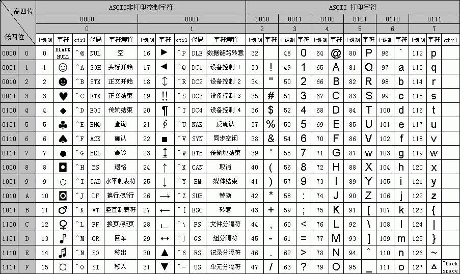

# universal

单位GB通常表示十进制，即10^3^B，而单位GiB通常表示二进制，即2^30^B。

删除列表元素应倒序遍历，防止发生越界错误。

注意`&&`的短路特性，cond1 && cond2完全等价于if (cond1) { if (cond2) { ... }}，它有时会造成难以预料的错误，如下所示。

```c++
if (ptr != nullptr && ptr->data < x) { /* ... */ }  // Anytimes ok
if (ptr->data < x && ptr != nullptr) { /* ... */ }  // When ptr is nullptr, will cause error
```

现代计算机的一组性能参数，如下所示。

|            资源名            | 反应延时级别（ns） |  ms  |
| :--------------------------: | :----------------: | :--: |
|          L1缓存读取          |        0.5         |  -   |
|          L2缓存读取          |         7          |  -   |
|        Mutex上锁/解锁        |         25         |  -   |
|          主内存读取          |        100         |  -   |
| 以1Gb/s的速率高速传输1KB数据 |    10000（1e4）    | 0.01 |
|   从主内存线性读取1MB数据    |   2500（2.5e4）    | 0.25 |
|   同一个数据中心的通信速度   |   500000（5e5）    | 0.5  |
|     从SSD线性读取1MB数据     |   1000000（1e6）   | 1ms  |
|   从硬盘线性读取1MB的数据    |  20000000（2e7）   | 20ms |

大端模式，是指数据的高字节保存在内存的低地址中，而数据的低字节保存在内存的高地址中。这样的存储模式有点类似于把数据当作字符串顺序处理，地址由小向大增加，数据从高位往低位放，这和我们的阅读习惯一致。

小端模式，是指数据的高字节保存在内存的高地址中，而数据的低字节保存在内存的低地址中。这种存储模式将地址的高低和数据位权有效地结合起来，高地址部分权值高，低地址部分权值低。

# 编码与区域设置

代码页（code page）是字符集编码（character set）的别名，也称为内码表（code page）。

## （一）不同编码介绍

### 1. ASCII

ASCII（American Standard Code for Information Interchange，美国信息交换标准代码）是基于拉丁字母的一套电脑编码，主要用于显示现代英语和其他西欧语言。

它占用一个8位的字节，实际使用了从`0000 0000 ~ 0111 1111`的128个数，如下所示。

- 0\~31的共32个控制字符或通信专用字符，如控制符：第0位是NULL（空值，汇编中相当于C数组的'\0'）、LF（换行）、CR（回车）、FF（换页）、BS（退格）、BEL（响铃）等；127的为DEL（删除）字符。它们没有特定的图形显示，但会根据不同的应用程序，对文本的显示有不同的影响。
- 32~126的共95个显示字符：
  - 32，空格；
  - 48\~57，数字0\~9；
  - 65\~90，大写字母A\~Z；
  - 97\~122，小写字母a\~z；
  - 其余为一些标点符号、运算符号等。

标准的ASCII将每个字节的最高位作为校验位，用于在传输时进行奇偶校验。

后128个`1000 0000 ~ 1111 1111`称为扩展ASCII码，扩展ASCII码允许将每个字符的最高位用于确定附加的128个特殊符号字符、外来字母和圆形符号。



### 2. 汉字的表示和编码

汉字的编码包括汉字的输入编码、汉字内码、汉字字形码三种，它们是计算机中用于输入、内部处理和输出三种用途的编码。

1. **GB2312**

在1981年实施的国家标准GB 2312-1980（即GB2312编码）中，每个汉字编码用两字节表示，收录了一级汉字3755个、二级汉字3008个、各种符号682个，共计7445个。整个字符集分成94个区，每区有94个位，每个区位上只有一个字符，因此可用所在的区和位来对汉字进行编码，称为区位码，它用4位十进制数表示，前两位是区码，后两位是位码。其中，01-09区为特殊符号；16-55区为一级汉字，按拼音排序；56-87区为二级汉字，按部首/笔画排序；10-15区及88-94区则未有编码。如“啊”字是GB2312之中的第一个汉字，它的区位码就是1601。

为了用计算机表示汉字，汉字国标码（每个汉字用两个字节表示）将十进制的区位码转换为十六进制数后，再在每个字节上加上20H。因国标码两字节最高位都是0，且ASCII码的最高位也是0，为方便计算机区分中文字符和英文字符，将国标码的两个字节的最高位都改成“1”，这就是汉字内码。

区位码和国标码都是输入码，它们和汉字内码的关系（十六进制）如下。
$$
国标码=(区位码)_{16}+2020H \\
汉字内码=(国标码)_{16}+8080H
$$

2. **GBK**

在1995年制定的GBK标准（即GBK编码）向下与GB 2312-80兼容，向上支持ISO 10646.1，是前者向后者过渡过程中的一个承上启下的产物。它是在GB 2312-80标准基础上的内码扩展规范，使用了双字节编码方案，其编码范围从8140H至FEFEH（剔除XX7FH），共23940个码位，共收录了21003个汉字，完全兼容GB 2312-80标准，并包含了Big5编码中的所有汉字。

3. **GB18030**

在2000年公布的国家标准GB 18030（目前最新的汉字编码），共收录汉字70244个，编码标准采用1B、2B、4B，是变长多字节字符集。它对GB 2312-1980完全向后兼容，与GBK基本向后兼容，并支持Unicode（GB 13000）的所有码位。GB 18030的当前版本为GB 18030-2005。

## （二）字符集在编程中的使用

ANSI（American National Standards Institute，美国国家标准学会），它不是某一种字符编码，而是一个标准，在不同的环境中实际上是不同的编码。不同的国家和地区制定了不同的标准，由此产生了GB2312、GBK、GB18030、Big5、Shift_JIS等各自的编码标准，这些使用多个字节来代表一个字符的各种汉字延伸编码方式，称为ANSI编码。在简体中文Windows操作系统中，ANSI编码代表GBK编码；在繁体中文Windows操作系统中，ANSI编码代表Big5；在日文Windows操作系统中，ANSI编码代表Shift_JIS编码。

区域设置，即国家或地区设置（locale），反映特定地理区域的当地约定和语言。有可能多个区域用同一种设置，也有可能一个区域有多个设置，如“zh_CN”表示“中文_大陆”。不同的编程语言一般都提供了与locale相关的设置。

一个区域设置包含（即指定）了如下内容，但可能不限于：日期格式、货币值显示格式、数字、电话号码格式、衡量尺度方式、代码页（即字符集编码）等等。

# 正则表达式介绍

## （一）串和语言

字母表（alphabet）是一个有限的符号集合，常用Σ表示，ASCII是字母表的一个重要的例子。某个字母表上的一个串（string）是该字母表中符号的一个有穷序列，串s的长度记为|s|，是指s中符号出现的次数。空串（empty string）是指长度为0的串，用ε表示。语言（language）是某个给定字母表上一个任意的可数的串的集合。

跟串有关的术语有：前缀（prefix）、后缀（suffix）、子串（substring）、真前缀、真后缀、真子串、子序列。其中子序列是从s中删除0个或多个符号后得到的串，这些被删除的符号可能不相邻。

如果x和y是串，那么x和y的连接（connection）是把y附加到x后面形成的串，即xy。空串是连接运算的单位元，也就是说，对于任何串ε都有，sε=εs=s。

如果把两个串的连接看成是这两个串的“乘积”，那么可以定义串的幂运算如下，定义s^0^=ε，并且对于i>0，s^i^=s^i-1^s。因为εs=s，由此可知s^1^=s，s^2^=ss，s^3^=sss，依此类推。

## （二）语言上的运算

语言上的运算可分为并、连接和闭包运算；并就是常见的集合运算，连接就是两个集合做笛卡尔积。

一个语言L的Kleene闭包（closure），记为L^*^，就是将L连接0次或多次后得到的串的集合。注意L^0^，即“将L连接0次得到的集合”，被定义为{ε}，并且L^i^被归纳地定义为L^i-1^L，即L^*^={ε}∪L^1^∪L^2^∪...。最后，L的正闭包（记为L^+^）和Kleene闭包基本相同，但不包含L^0^。也就是说，除非ε属于L，否则ε不属于L^+^。

上面介绍的这些运算如下表所示。

|     运算      |         定义和表示          |
| :-----------: | :-------------------------: |
|   L和M的并    |   L∪M={s\|s属于L或s属于M}   |
|  L和M的连接   |   LM={st\|s属于L且t属于M}   |
| L的Kleene闭包 | $L^*=\cup_{i=0}^\infty L^i$ |
|   L的正闭包   | $L^+=\cup_{i=1}^\infty L^i$ |

## （三）正则表达式

正则表达式可以由较小的正则表达式按照如下规则递归的构建。每个正则表达式r表示一个语言L(r)，这个语言也是根据r的子表达式所表示的语言递归地定义的。下面的规则定义了某个字母表Σ上的正则表达式以及这些表达式所表示的语言。

归纳基础，下面的两个规则构成了归纳基础：

1. ε是一个正则表达式，L(ε)={ε}，即该语言只包含空串。
2. 如果符号*a*是Σ上的一个符号，那么a是一个正则表达式，并且L(a)={*a*}。也就是说，这个语言仅包含一个长度为1的符号串*a*。

归纳步骤，由小的正则表达式构造较大的正则表达式的步骤有四个部分。假定r和s都是正则表达式，分别表示语言L(r)和L(s)，那么：

1. (r)|(s)是一个正则表达式，表示语言L(r)∪L(s)。
2. (r)(s)是一个正则表达式，表示语言L(r)L(s)。
3. (r)^*^是一个正则表达式，表示语言(L(r))^*^。
4. (r)是一个正则表达式，表示语言L(r)。最后这个规则是说在表达式的两边加上括号并不影响表达式所表示的语言。

按照上面的定义，正则表达式经常会包含一些不必要的括号，可以采用以下的约定，就可以丢掉一些不必要的括号：

1. 一元运算符*具有最高的优先级，并且是左结合的。
2. 连接具有次高的优先级，它也是左结合的。
3. |的优先级最低，并且也是左结合的。

可以用一个正则表达式定义的语言叫做正则集合（regular set），如果两个正则表达式r和s表示同样的语言，则称r和s等价（equivalent），记作r=s。

下面给出了一些对于任意正则表达式r、s、t都成立的代数定律。

|               定律                |        描述        |
| :-------------------------------: | :----------------: |
|             r\|s=s\|r             |   \|是可以交换的   |
|        r\|(s\|t)=(r\|s)\|t        |   \|是可以结合的   |
|            r(st)=(rs)t            |   连接是可结合的   |
|  r(s\|t)=rs\|rt  (s\|t)r=sr\|tr   | 连接对\|是可分配的 |
|              εr=rε=r              |  ε是连接的单位元   |
| r^*^=(r\|ε)^*^=ε\|r\|rr\|rrr\|... |  闭包中一定含有ε   |
|            r^**^=r^*^             |    *具有幂等性     |

## （四）正则定义

为方便表示，我们希望给某些常用的正则表达式命名，并在之后的正则表达式中像使用符号一样使用这些名字。如果Σ是基本符号的集合，那么一个正则定义（regular definition）是具有如下形式的定义序列：
$$
d_1\to r_1\\
d_2\to r_2\\
\dots\\
d_n\to r_n
$$
其中，每个d~i~都是一个新符号，它们都不再Σ中，并且各不相同；每个r~i~是字母表Σ∪{d~1~,d~2~,...,d~i-1~}上的正则表达式。显然，我们限制了每个r~i~中只含有Σ中的符号和在它之前定义的各个d~j~，因此避免了递归定义的问题，并且我们可以为每个r~i~构造出只包含Σ中符号的正则表达式。

从上面可知，正则定义避免了递归定义，因为它最终要展开为由基本符号组成的表达式，如果其中包含递归，则无法展开。同时也正因如此，正则表达式不能用来描述递归结构，如算数表的式、if语句等，因为它们都是典型的递归结构。

## （五）正则表达式的扩展

自从Kleene在20世纪50年代提出了带有基本运算符并、连接和Kleene闭包的正则表达式之后，已经出现过很多种针对正则表达式的扩展，这里介绍一些最早出现在像Lex这样的Unix实用程序中的扩展表示法。

1. 一个或多个实例。单目后缀运算符`+`表示一个正则表达式及其语言的正闭包。也就是说，如果r是一个正则表达式，那么(r)^+^就表示语言(L(r))^+^。运算符+和\*具有同样的优先级和结合性。两个有用的代数定律r^*^=r^+^|ε和r^+^=rr^*^=r^*^r说明了Kleene闭包和正闭包之间的关系。
2. 零个或一个实例。单目运算符`?`的意思是“零个或一个出现”，也就是说r?等价于r|ε，换句话说，L(r?)=L(r)∪{ε}。运算符?与运算符+和运算符*具有同样的优先级和结合性。
3. 字符类。一个正则表达式a~1~|a~2~|...|a~n~（其中a~i~是字母表中各个符号）可以缩写为[a~1~a~2~...a~n~]。更重要的是，当a~1~,a~2~,...,a~n~形成一个连续的序列时，比如连续的大写字母、小写字母或数字时，可以把它们表示成[a~1~-a~n~]，也就是说只写出第一个和最后一个字符，中间用连词符连接。

可以看到，上面所述的3种扩展，已经和当前所使用的正则表达式语法非常相近了。更为详细的ECMAScript正则表达式语法，可以参看《C++高级编程》，这里就不再赘述了。