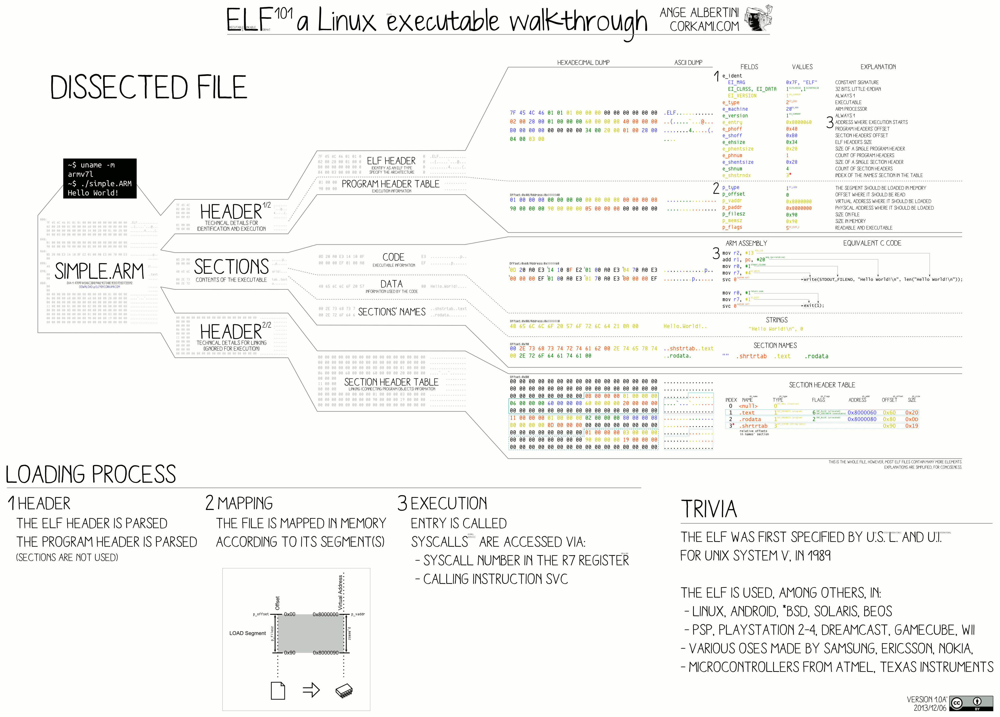

# Note

在本文中应注意。**段（segment）**是指操作系统内存管理中的运行时的内存分段（memory segmentation），**节（section）**是指二进制文件中存储数据的节（虽然它也通常称为段）。为了区分二者的概念，在本文描述中，使用“段”特指内存分段，使用“节”特指文件存储数据的节。

# Program

计算机程序（computer program）是用编程语言编写的供计算机执行的一系列指令或一组指令。它是软件的组件之一，软件还包括文档和其他无形组件。

人可读（human-readable）形式的计算机程序称为源代码（source code），它需要另一个计算机程序来执行，因为计算机只能执行本地机器指令（native machine instruction）。因此，可以使用为该语言编写的编译器将源代码翻译成机器指令，生成的文件称为可执行文件。或者，源代码可以在为该语言编写的解释器内执行。汇编语言程序是使用汇编器翻译的。

如果请求执行可执行文件，则操作系统将其加载到内存中并启动一个进程（process）。中央处理单元会切换到这个进程，以获取（fetch）、解码（decode）、执行（execute）每条机器指令。如果请求执行源代码，则操作系统将相应的解释器加载到内存中并启动进程，然后解释器将源代码加载到内存中以翻译并执行每个语句。运行源代码比运行可执行文件慢，而且计算机上必须安装解释器。

程序生命周期阶段（program lifecycle phases）是计算机程序经历的阶段，从初始创建到部署和执行。生命周期阶段不一定按线性顺序发生，它们可以以各种方式交织在一起。

- 编辑时间（edit time）是指编辑程序源代码的时间，涵盖初始创建到错误修复、重构或添加新功能。编辑通常由程序员执行，但也可以使用自动化设计工具和元编程系统（metaprogramming system）。

- 编译时间（compile time）是指编译器将源代码翻译成机器代码的时间，成功编译的结果是可执行文件。
- 链接时间（link time）是指链接器将程序的所有必要的机器代码组件（包括外部组件）链接在一起的时间。程序使用外部库实现的函数是很常见的，所有这些函数都必须正确链接在一起，包括编译期间的静态链接和运行期间的动态链接。
- 分发时间（distribution time）是指将程序的副本传送给用户的过程。分发格式通常是可执行文件，但也可以是源代码，特别是对于用解释性语言编写的程序。
- 安装时间（installation time）是指使发布程序准备好在用户计算机上执行，通常包括存储可执行文件以供操作系统将来加载。
- 加载时间（load time）是指操作系统从存储（如硬盘驱动器）获取程序的可执行文件并将其放入活动内存中以开始执行的时间。
- 运行时间（run time）是指执行阶段中央处理单元执行程序的机器代码指令。程序可能会无限期地运行，如果执行终止，则可能是正常的预期行为，也可能是异常（例如崩溃）。

在计算机中，固件（firmware）是一类特殊的计算机软件，它为特定设备硬件提供低级别控制（low-level control）。基本输入/输出系统（Basic Input/Output System，BIOS）固件是用于执行硬件初始化并为上层操作系统和程序提供运行时服务的特殊软件。现代PC中的BIOS会初始化硬件并测试系统硬件组件（开机自检），并从存储器中加载引导加载（boot loader）程序，然后初始化内核。最初，BIOS固件存储在PC主板上的ROM芯片中，后来的计算机系统中，BIOS存储在闪存中，因此无需从主板上拆下芯片即可对其进行重写，这使得最终用户可以更新BIOS固件，以便添加新功能或修复错误。

统一可扩展固件接口（Unified Extensible Firmware Interface，UEFI）是传统BIOS的继承者，旨在解决其技术限制。UEFI定义了用于启动计算机硬件的平台固件（platform firmware）的体系结构，以及其与操作系统交互的接口。UEFI规范规定PE格式是EFI环境中的标准可执行格式。UEFI独立于平台和编程语言，但其参考实现使用C语言。

## Compiler

翻译器（translator）或编程语言处理器（programming language processor）是一种计算机程序，它将以人可读形式编写的编程指令，转换为计算机理解和处理的机器语言代码。它是一个通用术语，可以指编译器、汇编器或解释器，即任何将代码从一种计算机语言转换为另一种计算机语言的东西。其中包括高级和人可读计算机语言（如C++和Java）、中级语言（如Java字节码）、低级语言（如汇编语言和机器代码）之间的翻译，以及不同计算平台（computing platform）上相似级别语言之间的翻译。该术语还用于转换器（translator），它负责同一程序软件实现和硬件/ASIC（Application-Specific Integrated Circuit）微芯片实现之间的转换，以及从微芯片的软件描述到构建它所需的逻辑门之间的转换。

广泛使用的计算机语言翻译器包括解释器（interpreter）、编译器（compiler）和反编译器（decompiler）、汇编器（assembler）和反汇编器（disassembler）。

编译器（compiler）是一种计算机程序，它将用一种编程语言（源语言）编写的计算机代码翻译成另一种语言（目标语言），主要用于将源代码从高级编程语言翻译为低级编程语言（如汇编语言、目标代码或机器代码）以创建可执行程序的程序。

有许多不同类型的编译器。交叉编译器（cross-compiler）可以为不同的CPU或操作系统生成代码。自引导编译器（bootstrap compiler）通常是临时编译器，用于为某种语言编译更完整的编译器。

在计算机科学中，自引导（bootstrapping）是一种生成自编译编译器（self-compiling compiler）的技术，即编译器（汇编器）是用它要编译的编程语言编写的。编译器的初始核心版本（引导编译器）是用不同的语言（可以是汇编语言）生成的，编译器的后续扩展版本是使用该语言的最小子集（minimal subset）开发的。自编译编译器的编译问题在编译器设计中被称为“先有鸡还是先有蛋”的问题，而自引导就是解决这个问题的方法。在创建编程语言时，引导是一种相当常见的做法，许多编程语言的编译器都是引导的，包括BASIC、C、C#、Pascal、Go、Java、Rust、Python等。

编译器可能会执行以下部分或全部操作阶段（phase），预处理（preprocessing）、词法分析（lexical analysis）、解析（parsing）、语义分析（semantic analysis）即语法定向翻译（syntax-directed translation）、输入程序到中间表示（intermediate representation）的转换、代码优化（code optimization）和特定机器代码生成（machine specific code generation）。编译器通常将这些阶段实现为模块化组件，从而实现源输入到目标输出转换的高效设计和正确性。

优化编译器（optimizing compiler）是尝试最小化或最大化可执行计算机程序的某些属性的编译器，常见的要求是最小化程序的执行时间、内存占用、存储大小和功耗。编译器优化通常使用一系列优化转换和算法来实现，这些算法接收输入程序并将其转换以生成语义上等效的输出程序，该程序使用更少的资源或执行速度更快。

链接时优化（Link-Time Optimization，LTO）是一类更通用的过程间（interprocedural）优化，在LTO期间，编译器/优化器具有跨翻译单元的可见性，这使其能够执行更积极的优化，例如跨模块内联（cross-module inline）、去虚拟化（devirtualization）等。

## Intermediate Representation

中间表示（Intermediate Representation，IR）是编译器或虚拟机内部用来表示源代码的数据结构或代码。设计IR有利于进一步处理，例如优化和翻译。优秀的IR必须准确，即能够在不丢失信息的情况下表示源代码，并且独立于任何特定的源语言或目标语言。IR可以采用内存中数据结构表示，也可采用程序可读的基于特殊元组或堆栈的代码表示，后一种也称为中间语言（intermediate language）。

在大多数现代编译器中都存在IR的经典实例。例如，CPython解释器将人可读的线性代码文本转换成中间的图结构，允许在执行之前进行流程分析和重新排列。使用中间表示使得许多不同的源语言可以使用GNU编译器集合和LLVM等编译器系统来为许多不同的目标体系结构生成代码。

## Execution (Computing)

计算机和软件工程中的执行（execution）是计算机或虚拟机读取计算机程序指令并对其进行操作的过程。程序的每条指令都是对必须执行的特定操作的描述，以便解决特定问题。控制单元完成的每条指令都遵循获取（fetch）、解码（decode）、执行（execute）的重复周期。术语运行（run）几乎用作执行同义词。

在执行之前，编写的程序源代码将编译并进行静态链接（static linking），以生成可执行文件。然后，最常见的是由操作系统调用该可执行文件，该操作系统将程序加载到内存中，可能执行动态链接（dynamic linking），然后通过将控制权移动到程序的入口点（entry point）来开始执行；所有这些步骤都取决于操作系统的应用程序二进制接口（Application Binary Interface，ABI）。此时开始执行，程序进入运行时状态，然后程序运行直到结束（正常终止或崩溃）。

任务执行的上下文环境（context）至关重要，很少有程序在裸机上执行，程序通常包含有关执行时可用资源的隐式和显式假设。大多数程序在多任务操作系统和特定于源语言的运行时库（runtime library）中执行，这些库提供计算机本身不直接提供的关键服务。例如，这种支持环境通常将程序与计算机外围设备的直接操作分离，而是提供更通用、抽象的服务。为使程序和中断处理程序能够不受干扰地工作并共享相同的硬件内存和对IO系统的访问，在具有单个CPU/MCU的系统上运行的多任务操作系统中，需要具有某种类型的软件和硬件设施，用于跟踪正在执行的进程数据（内存页地址、寄存器等），并将它们保存并恢复到挂起之前的状态。这是通过上下文切换（context switch）来实现的。

运行时（runtime）是计算机程序生命周期的最后阶段，其中代码作为机器码在计算机的中央处理单元CPU上执行。当要执行程序时，加载程序（loader）首先执行必要的内存设置并将程序与其所需的任何动态链接库链接起来，然后从程序的入口点开始执行。

在计算机系统中，加载程序（loader）是操作系统的一部分，负责加载程序和库，它是启动程序过程中的重要阶段之一，因为它将程序放入内存并准备执行。加载程序涉及内存映射，将包含程序指令的可执行文件的内容复制到内存中，然后执行其他所需的准备任务以准备可执行文件的运行。加载完成后，操作系统将控制权传递给加载的程序代码来启动程序。某些操作系统需要重定位加载程序（relocating loader），它调整可执行文件中的地址（指针）以补偿加载开始的地址的变化。需要重定位加载器的操作系统是那些程序并不总是加载到（虚拟）地址空间中的同一位置并且指针是绝对地址而不是距程序基地址的偏移量的操作系统。

除仅具有一组固定的专用程序的高度专业化的计算机系统之外，所有支持程序加载的操作系统都有加载器。嵌入式系统通常没有加载程序，而是直接从ROM或类似设备执行代码。为加载操作系统本身，作为引导的一部分，使用了专门的引导加载程序。在许多操作系统中，加载程序永久驻留在内存中，尽管一些支持虚拟内存的操作系统可能允许加载程序位于可分页的内存区域中。

大多数编程语言都有某种形式的运行时系统（runtime system），提供程序的运行环境（runtime environment）。该环境可以解决许多问题，包括应用程序内存的管理、程序如何访问变量、在例程之间传递参数的机制、与操作系统的接口等。编译器根据特定的运行时系统做出假设以生成正确的代码。通常，运行时系统将负责设置和管理堆栈和堆，并且可能包括垃圾收集、线程或语言内置的其他动态功能等功能。

# File Format

文件格式（file format）是对信息进行编码以存储在计算机文件中的标准方式，它指定如何使用位（bits）对信息进行编码并存储到数据存储媒介当中。

某些文件格式是为特殊的数据类型而设计的，例如PNG文件使用无损数据压缩来存储位图图像（bitmapped image）。某些文件格式设计用于存储几种不同类型的数据，例如Ogg格式可以存储多媒体信息，包括带或不带文本（如字幕）的音频和视频的任意组合以及元数据。文本文件（text file）可以包含任何字符流，包括可能的控制字符（control character），并以某种字符编码方案进行编码。某些文件格式，例如HTML文件，可缩放矢量图形（Scalable Vector Graphics，SVG）和程序源代码，是具有某种语法的文本文件，允许它们用于特定目的。

## Identifying file type

传统上，不同的操作系统采用不同的方法来确定特定文件的格式，每种方法都有其自身的优点和缺点。大多数现代操作系统和应用程序使用下述方法来识别文件格式。

### Filename extension

许多操作系统（如Windows、macOS、DOS等）根据文件名称的结尾（更具体地说是`.`后面的字母）来确定文件的格式。例如，HTML文档由以.html结尾，GIF图像由.gif结尾。这种方法的一个缺陷是，系统可以很容易地通过重命名文件来将其视为不同的格式，这可能会导致混乱。

### Internal metadata

可以在文件本身内部特定位置存储格式信息，以标识文件的格式。由于最容易定位它们的位置是在文件开头，因此当该区域大于几个字节时，该区域通常称为文件头（file header）；如果只有几个字节长，则称为幻数（magic number）。

#### File header

文件头（file header）中包含的元数据通常存储在文件的开头，但也可能存在于其他区域，通常包括结尾，具体取决于文件格式或包含的数据类型。基于字符（文本）的文件通常具有基于字符的标头，而二进制格式通常具有二进制标头，尽管这不是规则。基于文本的文件头通常占用更多空间，但由于人类可读，可以使用文本编辑器或十六进制编辑器等方便地检查它们。

除标识文件格式之外，文件头还可能包含有关文件及其内容的元数据。例如，大多数图像文件存储有关图像格式、大小、分辨率和色彩空间的信息，以及可选的创作信息，例如图像的制作者、制作时间和地点、使用的相机型号和摄影设置（Exif）等。此类元数据可被处理文件的软件使用。

操作系统可以使用文件头来快速收集有关文件的信息，而无需将其全部加载到内存中，但这样做比直接从目录信息中读取会使用更多的计算机资源。例如，当图形文件管理器必须显示文件夹的内容时，它必须读取许多文件的标题才能显示相应的图标，但这些图标将位于存储介质上的不同位置，因此需要更长的时间来访问。包含许多具有复杂元数据文件（例如缩略图信息）的文件夹可能需要相当长的时间才能显示。

如果标头是二进制硬编码的，使得标头本身需要复杂的解释才能被识别，特别在需要保护元数据内容的情况下，这可能会导致无法识别文件类型。甚至其源代码实现很糟糕，这可能会导致元数据损坏，在极其糟糕的情况下，甚至可能导致文件无法读取。

文件头的一个更复杂的示例是用于包装器或容器（wrapper or container）文件格式的文件头。

#### Magic number

合并文件类型元数据（incorporate file type metadata）的一种方法是在文件本身内存储一个幻数（magic number），通常用于Unix及其衍生版本。最初，该术语用于文件开头的一组特定的2字节标识符，但由于任何二进制序列都可以被视为数字，因此文件格式的任何唯一的特征都可以用于识别。例如，GIF图像始终以GIF87a或GIF89a的ASCII表示形式开头，具体取决于它们遵循的标准。许多文件类型，尤其是纯文本文件，很难通过此方法识别。例如，HTML文件可能以字符串\<html\>开头，或者以适合文档类型定义的\<!DOCTYPE HTML\>开头，这些文件还可以以注释、随机文本或几个空行开头，但仍然是可用的HTML文件。

幻数方法可以更好地保证正确识别格式，并且通常可以确定有关文件的更精确的信息。由于相当可靠的幻数测试可能相当复杂，并且必须针对幻数数据库中的每种可能性有效地测试每个文件，因此这种方法相对低效，特别是对于显示大型文件列表的情况。相比之下，基于文件名和元数据的方法只需要检查一条数据，并将其与排序索引进行匹配即可。

此外，数据必须从文件本身读取，与存储在目录中的元数据相比，这会增加延迟。如果文件类型不适合以这种方式识别，系统必须退回到元数据。然而，这是程序检查被告知要处理的文件格式是否正确的最佳方法，虽然文件的名称或元数据可能会独立于其内容而更改，但无法通过精心设计的幻数测试是一个非常明确的迹象，表明该文件已损坏或类型错误。另一方面，有效的幻数并不能保证文件没有损坏或类型正确。

### External metadata

可以在文件系统中显式存储有关格式的信息，而不是在文件本身中存储。这种方法将元数据与主数据和名称分开，但也比文件扩展名或幻数更难移植，因为格式必须在文件系统之间转换。

#### MacOS type-codes

MacOS的分层文件系统将创建者和类型的代码存储为每个文件的目录条目（directory entry）的一部分，这些代码称为OSType，可以是任何4字节序列，但通常会进行选择，以便ASCII表示形式形成有意义的字符序列，例如应用程序名称的缩写或开发人员的首字母缩写。

类型代码指定文件的格式，而创建者代码指定用户双击时打开文件的默认程序。例如，用户可能拥有多个类型代码均为TEXT的文本文件，但由于创建者代码不同，每个文件都在不同的程序中打开。此功能的目的是，例如，可以在通用文本编辑器中打开人类可读的纯文本文件，而可以在专用编辑器或IDE中打开编程或HTML代码文件。然而，此功能常常是用户困惑的根源，因为双击文件时将启动哪个程序通常是不可预测的。

macOS统一类型标识符（Uniform Type Identifiers，UTIs）是macOS中使用的一种方法，用于唯一标识实体的类型类别（type class of entry），例如标识文件的格式，它由Apple开发，作为OSType（类型和创建者代码）的替代品。

UTI是一个Core Foundation字符串，一些常见和标准类型使用名为public的域（如用于便携式网络图形图像的public.png），而其他域可用于第三方类型（如用于便携式文档格式的com.adobe.pdf）。UTI可以存在层次定义，称为一致性层次结构，这提供了很大的灵活性。

#### POSIX extended attributes

在Unix和类Unix系统上，ext2、ext3、ext4、XFS、HFS+等文件系统允许使用文件存储扩展属性，其中包括"name=value"字符串的任意序列，其中名称是唯一的，并且可以通过其相关名称访问值。

#### MIME types

MIME类型广泛用于许多与Internet相关的应用程序中，并且在其他地方也越来越多地使用，尽管它们很少用于磁盘上类型信息。它们由一个标准化的标识符系统（由IANA管理）组成，由一个类型和一个子类型组成，并用斜杠分隔，例如text/html或image/gif。这些最初的目的是作为一种识别电子邮件中附加的文件类型的方法，独立于源操作系统和目标操作系统。

## File Structure

有多种类型的方法可以在文件中构建数据，最常见的如下所述。

### Unstructured formats (raw memory dumps)

早期的文件格式使用原始数据格式，包括将一个或多个结构的内存映像直接转储（dump）到文件中。扩展和改进这种类型的结构化文件是非常困难的，其创建的文件可能特定于一种平台或编程语言（如Pascal字符串结构在C中无法识别）。

### Chunk-based formats

在这种文件结构中，每条数据都嵌入（embed）在一个以某种方式标识数据的容器（container）中，容器的范围可以通过某种开始和结束标记以及显式的长度字段来指定，或通过文件格式定义的固定要求来指定。容器有时被称为块（chunk），标识特定块的信息可以被称为许多不同的事物，通常术语包括字段名称（field name）、标识符（identifier）、标签（label）或标记（tag）。

该格式已被IFF（Interchange File Format）、PNG、JPEG和SDXF（Structured Data Exchange Format）文件反复使用。许多程序使用这种通用类型，如文字处理器（如Script）和数据库导出文件（如CSV）。

使用这种类型的文件结构，处理工具可以简单地跳过无法识别的块标识符。事实上，任何数据格式都必须以某种方式识别其组成部分的重要性，而嵌入式边界标记是一种明显的方法。

MIME标头通过在每个逻辑行的开头使用冒号分隔的标签来实现此目的。CSV和类似文件通常使用带有字段名称的标题记录来实现此目的，并使用逗号来标记字段边界。XML和类似文件可以宽松地视为一种基于块的格式，因为数据元素是通过类似于块标识符的标记来标识的。JSON与XML类似，没有模式、交叉引用或重复字段名称含义的定义，并且通常对程序员来说很方便。YAML与JSON类似，但使用缩进来分隔数据块，并且旨在比JSON或XML更易于人类阅读。

### Directory-based formats

这是另一种可扩展格式，非常类似于文件系统，其中文件由目录条目（directory entry）组成，包含数据在文件中的位置及签名（或类型）。该文件结构的典型示例包括磁盘映像（ISO image）、TIFF（Tag Image File Format）、可执行文件、库文件。

某些文件格式（如ODT和DOCX）基于PKZIP，即分块存储又带有目录。基于目录的文件格式的结构比非结构化或基于块的格式更容易修改。

# Binary File

## Object File

目标文件（object file）是包含机器代码（machine code）或字节码（bytecode）以及其他数据和元数据（metadata）的文件，由编译器或汇编器在编译或汇编过程中从源代码生成，所生成的机器代码称为目标代码（object code）。目标代码通常是可重定位的（relocatable），并且通常不能直接执行。目标文件可能包含的元数据可用于链接或调试，其包括如下信息，解决不同模块之间符号交叉引用的信息、重定位信息、堆栈展开信息、注解、程序符号、调试或分析信息，其他元数据可能包括编译的日期和时间、编译器名称和版本以及其他标识信息。

目标文件有多种格式，相同的机器代码可以打包成不同的目标文件格式。最初每种类型的计算机都有自己独特的格式，但是随着Unix和其他便携式操作系统的出现，一些格式，例如COFF和ELF已经被定义并在不同类型的系统上使用。目标文件格式的设计和选择是整个系统设计的关键部分，它会影响链接器的性能，从而影响程序开发过程；如果该格式还用于可执行文件，则还会影响程序开始运行所需的时间，从而程序响应能力。

某些系统对可执行文件（直接由操作系统加载执行）和目标文件（需要由链接器处理）采用不同的格式，例如Dos和Windows系统使用Portable Executable作为可执行文件格式，使用COFF作为目标文件格式。而Unix和类Unix系统对可执行文件和目标文件使用相同的格式，例如原始的a.out文件格式。某些格式可以包含适用于不同处理器的机器代码，加载程序时操作系统会选择正确的代码。

大多数目标文件格式被构造为独立的数据节（section or segment），每个节包含某种类型的数据。当程序被加载器加载到内存中时，加载器会为程序分配不同的内存区域，其中一些区域对应于目标文件的节，因此通常具有相同的名称，其他区域（如堆栈）仅在运行时存在。在某些情况下，重定位由加载器（或链接器）完成以指定实际的内存地址，然而，对于许多程序或体系结构来说，由于由内存管理单元（memory management unit）或与位置无关的代码处理，因此重定位是不必要的。

典型目标文件格式支持的数据类型如下。

- 标头（header），描述信息和控制信息；
- 代码节（code segment），可执行可执行代码，text节；
- 数据节（data segment），已初始化的静态变量，data节；
- 只读数据节（read-only data），已初始化的静态常量，rodata节；
- BSS节，未初始化的静态数据，包括变量和常量；
- 用于链接的外部定义和引用（external definition and reference）；
- 重定位（relocation）信息；
- 动态链接（dynamic linking）信息；
- 调试（debugging）信息。

链接器可以根据定义节时指定的规则来组合不同目标文件中的节，目标文件之间共享的节存在约定，例如在DOS中，有不同的内存模型指定特殊节的名称以及它们是否可以组合。

调试信息的调试数据格式可以是目标文件格式的组成部分（如COFF），也可以是可与多种目标格式一起使用的半独立格式，例如STABS（Symbol TABle Strings）或DWARF（Debugging With Attributed Record Formats）。

## Executable File

可执行文件（executable file）或二进制文件（binary file）能够使计算机根据所编码的指令（encoded instruction）执行特定任务，与此相对的是只有被程序解析（parsing）才有意义的数据文件。具体解释取决于用途，传统意义上的指令是指物理CPU的机器码指令，某些情况下，脚本指令（如字节码）也可被视为可执行的。

可直接使用机器语言手工编写可执行文件，或使用等效的汇编语言编写源代码并通过汇编生成可执行文件。高级语言可被编译成可执行机器代码文件或不可执行机器代码（目标文件），通过链接器将多个目标文件链接以创建可执行文件。目标文件通常以容器格式（container format）存储，例如Portable Executable（PE）格式或Executable and Linkable Format（ELF）格式。这为生成的机器代码提供了结构，例如将其分为.text节、.data节等。

可执行文件通常还包括运行时系统（runtime system），它实现运行时语言功能（例如任务调度、异常处理、调用静态构造函数和析构函数等），以及与操作系统的交互，特别是传递参数、环境和返回退出状态，以及其他启动和关闭功能，例如释放文件句柄等资源。因此，可执行文件通常包含除从特定源代码直接生成的机器代码之外的重要附加机器代码；某些情况下，在嵌入式开发中可通过显式指定链接器脚本来忽略这部分。

> 对于C语言，其运行时系统是通过链接crt0对象（也称为c0）来完成的，该对象包含实际的入口点，并通过调用运行时库来进行设置和关闭。crt0是一组链接到C程序的执行启动例程（execution startup routine），用于在调用程序的main函数之前执行所需的任何初始化工作。crt0通常是名为crt0.o的目标文件，通常用汇编语言编写，链接器会自动将其包含到它构建的每个可执行文件中。
>
> crt0包含运行时库最基本的部分。因此，它执行的具体工作取决于程序的编译器、操作系统和C标准库实现。除环境和工具链所需的初始化工作外，crt0还可以执行程序员定义的其他操作，例如执行C++全局构造函数和携带GCC的constructor属性的C函数。

为了被系统（例如操作系统、固件或引导加载程序）执行，可执行文件必须符合系统的ABI应用程序二进制接口。在简单的接口中，执行文件的方式是将文件加载到内存中，跳到地址空间的开头，然后从那里开始执行。在更复杂的接口中，可执行文件具有指定单独入口点的附加元数据。例如，在ELF文件格式中，入口点是在文件头的e_entry字段中定义的，它指定了开始执行的（虚拟）内存地址，在GNU编译器集合中，这个字段是由链接器根据_start符号设置的。

# Binary File Comparison

下表列出了对二进制格式的比较，一些能够作为可执行文件，一旦被合适的可执行加载器加载，就可以直接由CPU执行，而不用由解释器解释。在列出的这些格式中，最常用的是Microsoft Windows平台的PE格式，Linux和大多数类Unix平台的ELF格式，macOS和iOS平台的Mach-O格式，DOS平台的MZ格式。

| Format Name | Operating System                                | Filename Extension                    | Format Type                                             | Explicit Processor Declarations | Arbitrary Sections                  | Metadata  | Digital Signature | String Table | Symbol Table | 64-bit    | Fat Binaries                        | Can Contain icon |
| ----------- | ----------------------------------------------- | ------------------------------------- | ------------------------------------------------------- | ------------------------------- | ----------------------------------- | --------- | ----------------- | ------------ | ------------ | --------- | ----------------------------------- | ---------------- |
| a.out       | Unixlike                                        | none; .o; .so; .out                   | binary, executable, object, shared libraries            | No                              | No                                  | No        | No                | Yes          | Yes          | Extension | No                                  | No               |
| COFF        | Unixlike                                        | none; .o; .obj; .lib                  | binary, executable, object, shared libraries            | Yes by file                     | Yes                                 | No        | No                | Yes          | Yes          | Extension | No                                  | No               |
| ELF         | Unixlike, OpenVMS                               | none; .bin; .elf; .o; .out; .mod; .so | binary, executable, object, shared libraries, core dump | Yes by file                     | Yes                                 | Yes       | Extension         | Yes          | Yes          | Yes       | Extension                           | Extension        |
| Mach-O      | macOS, iOS, watchOS, tvOS                       | none; .o; .dylib; .bundle             | binary, executable, object, shared libraries, core dump | Yes by section                  | Some (limited to max. 256 sections) | Yes       | Yes               | Yes          | Yes          | Yes       | Yes                                 | No               |
| MZ          | DOS, Windows (except for 64-bit), Multiuser DOS | .exe; .com; .dll                      | binary, executable                                      | No (x86 only)                   | Yes                                 | Extension | No                | Extension    | Extension    | Extension | No                                  | No               |
| PE          | Windows                                         | .exe; .dll; .drv; .efi; .sys;         | binary, executable, object, shared libraries            | Yes by file                     | Yes                                 | Yes       | Yes               | Yes          | Yes          | No        | Only MZ(Dos)                        | Yes              |
| PE32+       | Windows (64-bit only)                           | .exe; .dll; .drv; .efi; .sys;         | binary, executable, object, shared libraries            | Yes by file                     | Yes                                 | Yes       | Yes               | Yes          | Yes          | Yes       | Compiled Hybrid Portable Executable | Yes              |

## a.out

a.out是一种文件格式，用于旧版的类Unix系统中的可执行文件、目标文件，以及后来系统中的共享库。这是汇编器输出（assembler output）的缩写形式，是Ken Thompson开发的PDP-7微计算机编译器的输出文件名，该术语随后应用于生成文件的格式，与目标文件的其它格式进行对比。a.out文件由八进制代码0407、0410或0413的幻数标识。a.out对调试信息的支持是通过使用符号表中称为stabs特殊条目来完成的，stabs格式也被用于许多COFF和ELF变体中。

PDP-7的a.out格式与PDP-11上使用的a.out格式类似，出现在UNIX第一版中，它被AT&T Unix System V中的COFF格式取代，而后者又被System V Release 4中的ELF格式取代。在Linux内核5.18版本中删除了对a.out格式的支持。

> Unix System V（SysV）是Unix操作系统的第一个商业版本之一，它最初由AT&T开发，并于1983年首次发布。System V发布了四个主要版本，编号为1、2、3、4，其中System V Release 4（SVR4）是商业上最成功的版本。

当未指定输出名称时，a.out仍然是某些编译器和链接器创建的可执行文件的默认输出文件名，即使创建的文件实际上不是a.ou文件格式。

## COFF

通用目标文件格式（Common Object File Format，COFF）是一种文件格式，用于Unix系统中的可执行文件、目标文件、共享库。

COFF于1983年在AT&T的UNIX System V中引入，对现有a.out格式的改进包括任意节（arbitrary section）、显式处理器声明（explicit processor declaration）、显式地址链接（explicit address linkage）。然而，COFF在节数目（number of section）、节名长度（length of section name）、包含源文件（included source file）等方面都存在限制，且符号调试（symbolic debugging）信息无法支持现实世界的编程语言如C或C++等，也无法支持新的处理器。因此，实际COFF实现都必然违反该标准，产生了许多COFF扩展，如XCOFF格式、ECOFF格式等。随着SVR4的发布，ELF格式取代COFF格式。

虽然COFF的扩展版本继续用于某些类Unix平台，主要是在嵌入式系统中，但当今COFF格式最广泛使用的是Microsoft的可移植可执行文件（Portable Executable，PE）格式，它是为Windows NT开发的，在目标文件中使用COFF标头，并作为可执行文件的PE标头的组成部分。

## ELF

可执行和可链接格式（Executable and Linkable Format，ELF），以前称为可扩展链接格式（Extensible Linking Format，ELF）是一种文件格式，用于可执行文件、目标文件、共享库、核心转储。

ELF格式首先在名为System V Release 4的Unix操作系统的ABI应用程序二进制接口规范中发布，后来在工具接口标准（Tool Interface Standard）中发布，并很快被不同Unix系统供应商所接受。1999年，它被86open项目选为x86处理器上的类Unix系统的标准二进制文件格式。

根据设计，ELF格式是灵活的、可扩展的和跨平台的。例如，它支持不同的字节端序和地址大小，因此它不排除任何特定的CPU或指令集架构。这使得它能够被许多不同硬件平台上的许多不同操作系统所采用。

### File Layout

一个ELF文件包含一个ELF文件头，后面跟着文件数据，文件数据可以包括，(1)程序头表（program header table），表中的一个条目为一个程序头，一个程序头描述一个运行时的内存分段（memory segmentation），(2)节头表（section header table），表中的一个条目为一个节头，一个节头描述一个存储数据的节（section），(3)由程序头表或节头表中的条目所指向的数据。

段包含文执行时所需的信息，而节包含用于链接和重定位的重要数据。整个文件中，任意字节有且仅有一个所属于的节，不存在不属于任意节的孤立字节数据。

一个ELF文件数据中存在两个试图（view），程序头描述了运行时使用的分段（segment），节头描述了节（section）的集合。

### File Header

ELF文件头中定义是使用32位地址还是64位地址，并会影响ELF头中的三个字段，对之后的字段产生偏移，对于32位和64位二进制文件，ELF头分别为0x34或0x40字节长。注意，下述表示ELF文件头的表格中，Offset和Size字段以字节为单位，且使用32-bit(64-bit)分别标识32位与64位的情况。

| Offset     | Size | Field                  | Purpose                                                      |
| ---------- | ---- | ---------------------- | ------------------------------------------------------------ |
| 0x00       | 4    | e_ident[EI_MAG[0:3]]   | 0x7F后跟ASCII编码的标识ELF的0x454C46，构成幻数               |
| 0x04       | 1    | e_ident[EI_CLASS]      | 文件的地址位数，1为32位，2为64位                             |
| 0x05       | 1    | e_ident[EI_DATA]       | 文件的字节端序，1为小端模式，2为大端模式，这会影响从0x10开始的多字节字段的解释 |
| 0x06       | 1    | e_ident[EI_VERSION]    | 文件的ELF版本，1为原始当前版本                               |
| 0x07       | 1    | e_ident[EI_OSABI]      | 目标操作系统的ABI                                            |
| 0x08       | 1    | e_ident[EI_ABIVERSION] | ABI版本，如何解释取决于目标ABI                               |
| 0x09       | 7    | e_ident[EI_PAD]        | 保留的未使用字段，填充为0                                    |
| 0x10       | 2    | e_type                 | 文件的类型，0x01为ET_REL可重定向文件，0x02为ET_EXEC可执行文件，0x03为ET_DYN共享目标文件，0x04为ET_CORE核心文件 |
| 0x12       | 2    | e_machine              | 目标机器的指令集架构（ISA）                                  |
| 0x14       | 2    | e_version              | 文件的ELF版本，1为原始版本                                   |
| 0x18       | 4(8) | e_entry                | 进程开始执行时的入口点的内存地址，若文件没有关联的入口点，则该值为0 |
| 0x1C(0x20) | 4(8) | e_phoff                | 指向程序头表的开始偏移，它通常紧跟该ELF文件头，故32位时为0x34，64位时为0x40 |
| 0x20(0x28) | 4(8) | e_shoff                | 指向节头表的开始偏移                                         |
| 0x24(0x30) | 4    | e_flags                | 该字段的解释取决于目标机器的体系结构                         |
| 0x28(0x34) | 2    | e_ehsize               | 该ELF文件头的大小                                            |
| 0x2A(0x36) | 2    | e_phentsize            | 程序头表中一个条目的大小                                     |
| 0x2C(0x38) | 2    | e_phnum                | 程序头表中的条目数                                           |
| 0x2E(0x3A) | 2    | e_shentsize            | 节头表中一个条目的大小                                       |
| 0x30(0x3C) | 2    | e_shnum                | 节头表中的条目数                                             |
| 0x32(0x3E) | 2    | e_shstrndx             | 节头表中的节名称的索引                                       |
| 0x34(0x40) |      |                        | End of ELF Header                                            |

### Program Header

程序头表告诉系统如何创建进程映像（process image），它位于文件的e_phoff偏移处，由e_phnum个项组成，每项的大小为e_phentsize字节。

| Offset     | Size    | Field    | Purpose                                                      |
| ---------- | ------- | -------- | ------------------------------------------------------------ |
| 0x00       | 4       | p_type   | 段的类型，0x01为PT_LOAD可加载段，0x02为PT_DYNAMIC动态链接信息，0x03为PT_INTERP解析器信息，0x04为PT_NOTE附属信息，0x06为PT_PHDR包含程序头表本身的段，0x07为PT_TLS线程本地存储模板 |
| null(0x04) | null(4) | p_flags  | 段的相关标志，仅64位时可用，0x01为PF_X可执行的，0x02为PF_W可写的，0x04为PF_R可读的 |
| 0x04(0x08) | 4(8)    | p_offset | 段在文件映像中的偏移量                                       |
| 0x08(0x10) | 4(8)    | p_vaddr  | 段在内存中的虚拟地址                                         |
| 0x0C(0x18) | 4(8)    | p_paddr  | 在物理地址是相对地址的系统上，段在内存中的物理地址           |
| 0x10(0x20) | 4(8)    | p_filesz | 文件映像中段的字节大小                                       |
| 0x14(0x28) | 4(8)    | p_memsz  | 内存中段的字节大小                                           |
| 0x18(null) | 4(null) | p_flags  | 段的相关标志，仅32位时可用，含义同上述p_flags字段            |
| 0x1C(0x30) | 4(8)    | p_align  | 对齐方式，为0和1表示不对齐，否则应该是2的正整数次幂，其中p_vaddr应等于p_offset模p_align |
| 0x20(0x38) |         |          | End of Program Header                                        |

### Section Header

| Offset     | Size | Field        | Purpose                                                      |
| ---------- | ---- | ------------ | ------------------------------------------------------------ |
| 0x00       | 4    | sh_name      | 节的名称，实际为在.shstrtab节中的字符串偏移量，其值表示该节的名称 |
| 0x04       | 4    | sh_type      | 节的类型，0x01为SHT_PROGBITS程序数据，0x02为SHT_SYMTAB符号表，0x03为SHT_STRTAB字符串表，0x04为SHT_RELA带加数的重定位条目，0x05为SHT_HASH符号哈希表，0x06为SHT_DYNAMIC动态链接信息，0x07为SHT_NOTE注释，0x08为SHT_NOBITS未初始化数据bss程序空间，0x09为SHT_REL不带加数的重定位条目，0x0B为SHT_DYNSYM动态链接符号表，0x0E为SHT_INIT_ARRAY构造函数数组，0x0F为SHT_FINI_ARRAY析构函数数组，0x10为SHT_PREINIT_ARRAY预构造函数数组，0x11为SHT_GROUP节组，0x12为SHT_SYMTAB_SHNDX扩展节索引，0x13为SHT_NUM定义类型数目 |
| 0x08       | 4(8) | sh_flags     | 节的相关标志，0x01为SHF_WRITE可写的，0x02为SHF_ALLOC在运行时分配内存，0x04为SHF_EXECINSTR可执行的，0x10为SHF_MERGE可合并的，0x20为SHF_STRINGS包含'\0'结尾字符串，0x40为SHF_INFO_LINK表示sh_info包含SHT索引，0x80为SHF_LINK_ORDER表示合并后保持顺序，0x400为SHF_TLS持有线程本地数据 |
| 0x0C(0x10) | 4(8) | sh_addr      | 该节在内存中的虚拟地址（假设该节已被加载）                   |
| 0x10(0x18) | 4(8) | sh_offset    | 节在文件映像中的偏移量                                       |
| 0x14(0x20) | 4(8) | sh_size      | 文件映像中节的字节大小                                       |
| 0x18(0x28) | 4    | sh_link      | 与该节相关联的节的索引，根据节的类型，此字段有多种用途       |
| 0x1C(0x2C) | 4    | sh_info      | 节的额外信息，根据节的类型，此字段有多种用途                 |
| 0x20(0x30) | 4(8) | sh_addralign | 节的对齐方式，应该是2的正整数次幂                            |
| 0x24(0x38) | 4(8) | sh_entsize   | 若该节包含固定大小的项，则表示每一项的大小，否则为0          |
| 0x28(0x40) |      |              | End of Section Header                                        |

## Mach-O

Mach目标文件格式（Mach Object File Format，Mach-O）是一种文件格式，用于基于Mach内核的系统中的可执行文件、目标文件、共享库、动态加载库、内核转储文件。Mach-O文件结构中的所有多字节值，均按照生成该值的主机的字节顺序写入文件。该格式基于a.out格式开发，NeXTSTEP、macOS、iOS都是基于mach的系统。

每个Mach-O文件由一个Mach-O头组成，后跟一系列加载命令（load command），最后是一个或多个段（segment），每个段包含0到255个节（section）。Mach-O使用REL重定位格式来处理对符号的引用，当查找符号时，Mach-O使用两级命名空间，将每个符号编码为"object/symbol"的名称对，然后按照先object后symbol的顺序执行线性搜索。

Mach-O的文件头格式如下表所示。

| Offset | Bytes | Description                                                  |
| ------ | ----- | ------------------------------------------------------------ |
| 0      | 4     | 幻数，32位时为0xfeedface，64位时为0xfeedfacf                 |
| 4      | 4     | CPU类型                                                      |
| 8      | 4     | CPU子类型                                                    |
| 12     | 4     | 文件类型，0x01为可重定位目标文件，0x02为需求页的可执行文件，0x03为固定的VM共享库文件，0x04为核心文件，0x05为预加载的可执行文件，0x06为动态绑定的共享库文件，0x07为动态链接编辑器，0x08为动态绑定的bundle包文件，0x09为仅用于静态链接的共享库stub存根，0x0A为只有调试节的配套文件，0x0B为x86_64核扩展文件 |
| 16     | 4     | 加载命令的数目                                               |
| 20     | 4     | 加载命令的大小                                               |
| 24     | 4     | 标志（flag）                                                 |
| 28     | 4     | 保留                                                         |

在Mach-O文件头之后紧跟加载命令（load command），包括段加载命令（segment load command）、链接库（link libraries）、应用主入口点（application main entry point）等，所有命令都由命令类型（command type）字段和命令大小（command size）字段开始。

当命令类型是0x00000001或0x00000019时，表示段加载命令，如下所示。

| Offset | Bytes | Description                                           |
| ------ | ----- | ----------------------------------------------------- |
| 0      | 4     | 命令类型，0x01为32位命令，0x19为64位命令              |
| 4      | 4     | 命令大小                                              |
| 8      | 16    | 所加载的段名称（segment name）                        |
| 24     | 4(8)  | 地址（address）                                       |
| 28(32) | 4(8)  | 地址大小（address size）                              |
| 32(40) | 4(8)  | 文件偏移（file offset）                               |
| 36(48) | 4(8)  | 从文件偏移处开始的大小（size from file offset）       |
| 40(56) | 4     | 最大虚拟内存保护（maximum virtual memory protection） |
| 44(60) | 4     | 初始虚拟内存保护（initial virtual memory protection） |
| 48(64) | 4     | 段的数目（number of section）                         |
| 52(68) | 4     | 标志                                                  |

当命令类型是0x0000000C或0x0000000D或0x00000018时，表示链接库命令，如下所示。

| Offset | Bytes | Description                                                  |
| ------ | ----- | ------------------------------------------------------------ |
| 0      | 4     | 命令类型，0x0C为动态链接库的完整文件路径，0x0D为从当前应用路径定位动态链接库，0x18允许动态链接库丢失 |
| 4      | 4     | 命令大小                                                     |
| 8      | 4     | 字符串偏移（string offset），总是取值为24                    |
| 12     | 4     | 时间日期戳（time date stamp）                                |
| 16     | 4     | 当前版本（current version）                                  |
| 20     | 4     | 兼容版本（compatible version）                               |
| 24     | 4     | 文件路径字符串（file path string）                           |

当命令类型是0x00000028时，用于指定应用程序开始的地址位置，如下所示。

| Offset | Bytes | Description                     |
| ------ | ----- | ------------------------------- |
| 0      | 4     | 命令类型，0x28表示程序入口      |
| 4      | 4     | 命令大小，总是取值为24          |
| 8      | 8     | 地址位置（address location）    |
| 16     | 8     | 栈内存大小（stack memory size） |

如果程序的段/节不需要重新定位即可运行，则主入口点是确切的地址位置。Mach-O加载器的主入口点是程序的基址在加上地址位置（address location）。

## PE

可移植可执行文件（Portable Executable，PE）是一种文件格式，用于32位和64位Windows系统以及UEFI环境中的可执行文件、目标文件、共享库、动态链接库（dll）等。PE格式是一种数据结构，封装了Windows加载器（loader）用于管理包装的可执行代码（wrapped executable code）所需的信息，包括用于链接的动态库引用、API导出和导入表、资源管理数据、线程本地存储数据。Microsoft官网给出了[PE Format](https://docs.microsoft.com/en-us/windows/desktop/Debug/pe-format)格式地址。

随着Windows NT 3.1操作系统的推出，微软从16位的NE格式迁移到PE格式，所有更高版本的Windows系统，包括Windows 95/98/ME和Windows 3.1x都支持该文件结构。该格式保留了有限的遗留支持，以弥合基于DOS和NT系统之间的差别。例如，PE的文件头仍然包含DOS可执行程序，默认情况下它是一个DOS stub存根，显示类似“此程序无法在DOS模式下运行”的消息，尽管它可以是完整的DOS程序。这构成了胖二进制（fat binary）的一种形式。PE还继续服务于不断变化的Windows平台，一些扩展包括.NET PE格式、支持64位地址空间的PE32+版本等。

### File Layout

一个PE文件由许多头（header）和节（section）组成，这些头和节告诉动态链接器如何将文件映射到内存中。一个可执行映像（executable image）由几个不同的区域组成，每个区域需要不同的内存保护（memory protection）策略，例如通常情况下，.text节被映射为可执行和只读属性，.data节被映射为不可执行和可读写属性。

动态链接器的工作之一是将每个节单独映射到内存中，并根据头中的指令为生成的区域分配正确的权限，因此在执行时，每个节的开头必须与页边界（page boundary）对齐，但是为了避免浪费存储空间，不同的节在磁盘上存储时无需按页对齐。

### Import Table

DLL导出的每个函数都由数字序数和可选的名称标识，同样地，可以按顺序或按名称从DLL导入函数。导入地址表（import address table，IAT）可以是按序数导入（import by ordinal）的格式和按名称导入（import by name）的形式。

当应用程序调用不同模块（different module）中的函数时，导入地址表被用作查找表。由于编译后的程序无法知道它所依赖的库的内存位置，因此每当进行API调用时都需要进行间接跳转。当动态链接器（dynamic linker）加载模块并将它们链接在一起时，它将实际地址写入IAT插槽，以便使它们指向相应库函数的内存位置。虽然这增加了额外的模块内调用成本，从而导致性能损失，但它提供了一个关键的好处，需要由加载器程序（loader）进行改写复制（copy-on-write changing）的内存页面的数量被最小化，从而降低内存和磁盘IO时间。

如果编译器提前知道调用是模块间的（通过dllimport属性），它可以生成更优化的代码，只生成间接调用的操作码。

### Relocation

PE文件通常不包含位置无关代码（position-independent code），相反编译PE文件更偏向于带有基地址（base address），并且编译器/链接器发出（emit）的所有地址都是提前固定的。但如果因为地址已经被其它东西占用，导致一个PE文件不能被加载到它的首选地址（preferred address），操作系统将对它进行重定位（rebase），这包括重新计算每个绝对地址并修改代码以使用新值。加载程序（loader）通过比较首选地址和实际加载地址，并计算增量值（delta value）来实现这一点，然后将增量添加到首选地址中，从而得到内存位置的新地址。

基重定位（base relocation）存储在一个列表中，并根据需要加到现有的内存位置上。生成的代码现在对进程来说是私有的，不再是可共享的，因此在这种情况下，dll的许多内存节省优势都会丧失。它还显著降低了模块的加载速度。因此，在没有重定位的情况下，PE具有非常高效的代码的优势，但是在重新定位的情况下，内存使用可能会很昂贵。这与ELF形成了对比，在ELF中，完全位置无关的代码通常比加载时重定位更受欢迎，从而在执行时间上获得了更低的内存使用量。

由于这个原因，在任何可能的情况下都要避免重定位，微软提供的dll都有预先计算好的基址，以避免重叠。

### .NET and metadata

在.NET可执行文件中，PE代码节包含一个stub存根，它调用公共语言运行库（Common Language Runtime，CLR）虚拟机启动入口（entry），即mscoree.dll中的\_CorExeMain或\_CorDllMain入口。

然后CLR虚拟机使用现有的.NET元数据，它的root根IMAGE_COR20_HEADER（也称为CLR头）由PE头数据目录中的IMAGE_DIRECTORY_ENTRY_COMHEADER条目指向。IMAGE_COR20_HEADER与PE的可选头非常相似，本质上是扮演CLR加载器的角色。

与CLR相关的数据，包括根结构本身，通常包含在公共代码节.text中，它由几个目录组成，元数据、嵌入式资源、强名称和一些用于本地代码互操作性的目录。元数据目录是一组表，列出程序集中所有不同的.NET实体，包括类型、方法、字段、常量、事件、它们之间的引用以及对其它程序集的引用。
