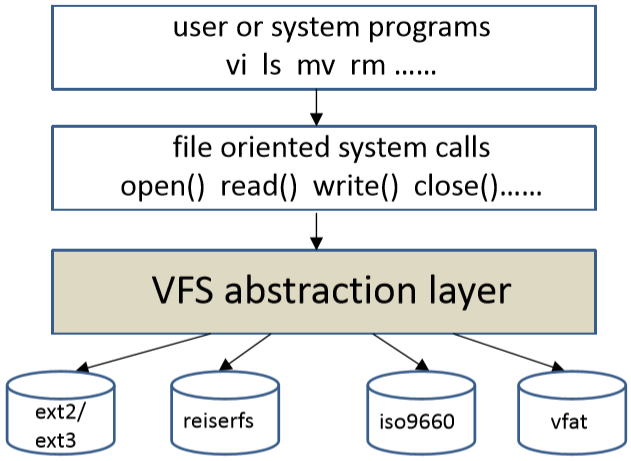

# Linux进程概述和补充

进程控制块（Process Control Block，PCB），在Linux中是一个 task_struct 结构体。创建进程原语、撤销进程原语。

在命令行的所输入命令的最后加上`&`，表明当前命令进程是在后台进行的。

## （一）Shell命令

在命令行的所输入命令的最后加上`&`，表明当前命令进程是在后台进行的。

### 1. ps 显示进程

```shell
ps [-options]
pstree                # 查看进程树
```

显示先行终端机下的程序。它有一系列可选参数。主要打印内容包括：PID进程号、TTY终端、STAT状态、TIME时间、COMMAND命令。

其中状态STAT可以为以下一种或几种：

- R，可运行，在运行队列中，处在正在执行或即将运行状态。
- S，睡眠，等待某个事件发生。
- D，不可中断的睡眠，通常是等待输入或输出完成。
- T，停止（Terminate）。
- Z，死（Defunct）进程或僵尸（zombie）进程。
- s，进程是会话期首进程Session leader。
- \+，进程属于前台进程组。
- l，进程是多线程的。
- <，高优先级任务。
- N，低优先级任务。

### 2. pmap 查看进程内存映像

``` shell
pmap -x pid [> filename]
```

- 查看指定pid进程的内存映像，将结果打印到控制台。
- 可以通过重定向，将结果写入到一个文件。

## （二）基本操作函数

在代码中使用`volatile`修饰变量，直接存取原始内存地址（防止编译器对代码进行优化）。系统有内核空间和用户空间，一些操作可能需要在两个空间中切换。

### 1. 头文件介绍

一般头文件在/usr/include下面，这里是标准C程序头文件，如果头文件前加了 <sys/*>，那说明这是系统调用函数头文件，其在/usr/include/sys下面。

- `<unistd.h>`，它是 C 和 C++ 程序设计语言中提供对 POSIX（Portable Operating System Interface，可移植操作系统接口）操作系统 API 的访问功能的头文件的名称，所有遵循该标准的操作系统和编译器均应提供该头文件（如 Unix 的所有官方版本，包括 Mac OS X、Linux 等）。它所定义的接口通常都是大量针对系统调用的封装，如`fork`、`pipe`、各种IO原语（`read`、`write`、`close`等等）。
- `<fcntl.h>`，它是UNIX标准中通用的头文件，包含文件控制系列的函数，如`open`、`fcntl`、`shutdown`、`unlink`、`fclose`等。
- `<limits.h>`、`<climits>`，专门用来检测整型数据数据类型的表达值范围。
- `<sys/types.h>`，包含基本系统数据类型，是Unix/Linux系统的基本系统数据类型的头文件，含有`size_t`、`time_t`、`pid_t`等类型。
- `<sys/stat.h>`，它是unix/linux系统定义文件状态所在的伪标准头文件。使用stat函数最多的可能是 ls -l 命令，用其可以获得有关一个文件的所有信息。
- `<sys/wait.h>`，包含`wait`、`waitpid`函数的头文件。
- `<sys/ipc.h>`、`<sys/msg.h>`头文件。

### 2. 进程的生命周期

- 创建进程。系统在创建进程时，必须为之分配其所必需的、除 CPU 以外的所有资源。如内存空间、I/O 设备以及建立相应的 PCB。
- 撤消进程。系统在撤消进程时，又必须先对这些资源进行回收操作，然后再撤消 PCB。
- 进程切换。在对进程进行切换时，由于要保留当前进程的 CPU 环境和设置新选中进程的 CPU 环境，为此须花费许多 CPU 时间。

一个进程有：就绪（Runnable）、运行（Running）、阻塞（Blocked）三种基本状态。

### 3. 进程相关系统调用

它们都在`<unistd.h>`头文件下，还有`<signal.h>`、`<sys/wait.h>`等头文件。

#### (1) 创建一个子进程

子进程会复制父进程的地址空间的内容，子进程有自己独立的地址空间，但它们的地址的值是相同的，因为这个值是虚拟地址，实际物理地址不同。程序分成两个分枝，子进程和父进程执行的是相同的代码。若希望在子进程中执行新代码，请查阅下述。

随着系统的执行，会得到一颗进程树，其中init进程的PID为1，是所有用户态进程的祖先。

```c
pid_t fork(void);
```

- 创建（复制）一个新进程，子进程会复制父进程的资源。如果程序使在子进程中，该方法返回0；在父进程中，则返回子进程的PID；否则子进程创建失败，返回-1。
- 子进程的用户空间将复制父进程的用户空间所有信息：数据段、BSS段、代码段、堆空间、栈空间、文件流缓冲区。子进程有自己独立的地址空间。
- 子进程继承（复制）父进程打开文件的文件指针。

```c
pid_t vfork(void);
```

- 子进程共享父进程的地址空间：代码段、数据段、堆区、栈区。

#### (2) 创建指定个数的子进程

```c
for (int i = 0; i < N; ++i) {
    if (fork()) {
        // 父进程
    } else {
        // 子进程
        break;
    }
}
```

#### (3) 获得进程相关信息

1. **获得进程号PID**

```c
pid_t getpid(void);
```

- 当前进程在当前系统下惟一的编号PID。

2. **获得父进程号PPID**

```c
pid_t getppid(void);
```

- 创建当前进程的进程PID，即父进程号PPID。

3. **获得进程组号PGID**

```c
pid_t getpgid(pid_t pid);    // 参数为0时，表示获得当前进程的进程组号
pid_t getgrp(void);        // 获取当前进程的进程组号
```

4. **会话session**

会话是一个或多个进程组的集合。在某个终端下执行的程序所创建的进程/进程组, 它们的SID就是这个终端进程的编号。

```c
pid_t getsid(pid_t pid);
```

5. **控制终端**

一个进程可以与某个终端关联，建立与控制终端关联的这个会话首进程为控制进程。

```c
pid_t tcgetpgrp(int fd);    // 返回打开终端相关联前台进程组的进程组号
int tcsetpgrp(int fd, pid_t pgrp);    //设置某个进程组是前台进程组还是后台进程组
```

6. **进程真实用户号RUID**

该进程的创建者的用户ID，即进程的执行者。该ID仅root用户可以修改。

```c
uid_t getuid(void);
```

7. **进程有效用户好EUID**

标识用户进程执行操作的权限，如果EUID是0即（root），此时进程拥有root用户权限。

```c
uid_t geteuid(void);
```

#### (4) 在进程中运行新代码

在进程中执行命令。

```c
int execl(const char* path, const char* arg, ...);    // 最后一个用 (char*)0 结束
int execlp(const char* file, const char* arg, ...);    // 从$PATH环境变量所指的目录中查找文件名为file所指示的字符串
int execle(const char* path, const char* arg, ..., char* const envp[]);    // 最后一个参数是环境变量的数组
int execv(const char* path, char* const argv[]);    // 第二个参数是数组
int execvp(const char* file, char* const argv[]);
int execvpe(const char* file, char* const argv[], char* const envp[]);
```

- exec()所执行的进程映像就会替换掉原来的进程映像。在程序中exec()后面的程序不再执行。

例如，执行 ls -l /home 命令：

```c
execl("bin/ls", "ls", "-l", "/home", (char*)0);
execlp("ls", "ls", "-l", "/home", (char*)0);
char* argv[] = { "ls", "-l", "/home", (char*)0 };
execv("bin/ls", argv);
```

也可以使用system()函数。

```c
int system(const char* command);
```

- 创建一个新的进程，在新进程中运行指定程序（父进程转入睡眠），新进程结束后返回父进程，继续执行父进程的代码。
- 不会替换掉原来的进程映像。
- 执行一个新命令，开销比较大。
- 可以让一个命令在后台运行，如`system("pa ax &");`，加上`&`符号即可。

#### (5) 回收进程资源

① 资源类型

- 内核空间资源
  - PCB
  - 打开的文件表项、当前目录、当前终端信息
  - PID、PPID、UID、EUID...
  - 通过系统调用访问
  - 需要父进程调用wait()或waitpid()
- 用户空间资源
  - 代码段、数据段、堆、栈...
  - 可以直接访问
  - 子进程退出被自动回收

② 退出进程的方式

- return
  - 退出当前函数
  - 在main函数里，return 0和exit(0)完成一样的功能
- exit
  - 退出当前进程
  - 刷新流缓冲区，输出缓冲区的内容会被输出到数据汇；输入缓冲区的内容会被丢弃
  - 执行退出处理函数
- _exit
  - 退出当前进程
  - 不处理标准I/O缓冲区
  - 不调用任何注册函数而直接退出

```c
// #include <stdlib.h>
void exit(int status);
void _exit(int status);
```

③ 退出处理函数

```c
int atexit(void (*function)(void));
```

- 向系统注册一个退出处理函数。
- 它们调用的方式是逆序的，先注册的后执行。

④ 回收内核空间资源

```c
pid_t wait(int* status);    // status是子进程退出时的状态，返回当前结束进程的pid
```

- 等待子进程的结束，回收该子进程的内核进程资源。
- 当一个子进程的状态已经改变（结束)，函数立即返回；否则会阻塞到某一个子进程退出为止，或得到一个信号。
- 参数status是用来收集子进程退出时的状态的。但如果对这个子进程是如何死掉毫不在意，只想把这个进程消灭掉（事实上绝大多数情况下），就可以设定这个参数为`NULL`或`0`，如wait(0)。

```c
pid_t waitpid(pid_t pid, int* status, int options);    // 等待指定进程结束
```

- pid如果 < -1，PGID为pid的绝对值的进程；-1表示任意子进程；0表示与当前进程的进程组PGID一致的进程；> 0表示PID为pid的进程。
- options，0；WNOHANG表示不阻塞等待；WUNTRACED报告状态信息。

`WIFEXITED(status)`这个宏用来指出子进程是否为正常退出的，如果是，它会返回一个非零值。

`WEXITSTATUS(status)`是一个检验子进程退出的正常还是非正常和返回值的宏，当WIFEXITED返回非零值时，可以用这个宏来提取子进程的返回值，如果子进程调用exit(5)退出，WEXITSTATUS(status)就会返回5；如果进程不是正常退出的，也就是说，WIFEXITED返回0，这个值就毫无意义。

#### (6) 孤儿进程与僵死进程、守候进程

- 孤儿进程，因父进程退出二导致子进程被init进程收养的进程。init进程定期调用wait，收集任何孤儿进程的退出状态，回收其内核资源，所以孤儿进程不会对当前系统造成什么影响。
  - 有的操作系统采用的机制不同，比如父进程终止后，会结束它所有子进程，cascading termination，连锁终止、级联终止。
- 僵死进程，进程已经退出，但它的父进程没有回收内核资源（PID、内核堆栈、内核数据表项等）。
  - 关于进程队列，还有一个僵尸队列。所有进程在终止时都会过渡到僵尸状态，一般而言，僵尸只是短暂存在，然后由init进程回收内核资源。

- 守候进程，又称为守护进程、Daemon、服务等。后台运行，脱离于终端。

```c
signal(SIGTTOU, SIG_IGN);    // 屏蔽来自终端的信号
// ...
if (pid = fork()) {
    exit(EXIT_SUCCESS);    // 父进程退出
} else if (pid < 0) {
    perror("fork");
    exit(EXIT_FAILURE);
}
// ...
setsid();    // 脱离控制终端和进程组，设置新会话组长、新进程组组长
// ...
// 禁止进程重新打开控制终端
if (pid = fork()) {
    exit(EXIT_SUCCESS);    // 父进程（组长）退出，子进程不是组长，没有权限打开终端
} else if (pid < 0) {
    perror("fork");
    exit(EXIT_FAILURE);
}
// ...
#define NOFILE 256    // 关闭父进程打开的文件描述符
for (i = 0; i < NOFILE; ++i) close(i);
// ...
chdir("/tmp");    // 改变当前工作目录
umask(0);    // 重设文件创建掩码，是的守护进程在创建文件时，权限不受影响
// ...
signal(SIGCHLD, SIG_IGN);    // 处理SIGHILD（子进程退出）信号（忽略），由系统回收守护进程创建的子进程
```

#### (7) 文件相关补充

Linux下一切皆文件。

```c
int lockf(int fd, int cmd, off_t len);
```

获得文件的锁，如果获得失败（被其他进程占用）则等待锁释放。

- fd，打开的文件描述符，必须使用只写O_WRONLY或只读O_RDONLY模式打开，在有多个文件操控管道文件的某一端时，需要同步上锁。每个进程启动时都打开3个文件：
  - 标准输入文件，fd为`0`，定义的宏为`STDIN_FILENO`。
  - 标准输出文件，fd为`1`，定义的宏为`STDOUT_FILENO`。
  - 标准出错文件，fd为`2`，定义的宏为`STDERR_FILENO`。
- cmd，要采取操作的控制值，1表示获得互斥锁，0表示解锁。
- len，要上锁或解锁区域的字节数，从当前偏移量开始。len为负表示向前上锁len个字节，为正表示向后上锁len个字节，为0表示从文件开头到结束的全部内容。

调用文件控制函数`fcntl(p[1], F_SETFL, O_NONBLOCK)`，设置管道以非阻塞的方式写入，已满就直接返回-1。

# System V IPC

## （一）概述

```shell
ipcs [-options]
```

- 在Linux终端下使用ipcs命令查看当前系统下已经创建的IPC通信进制，如消息队列（Message Queues）、共享内存（Shared Memory Segments）、信号量（Semaphore Arrays，以数组为单位创建）。
- 可以指定可选参数，如`-q`消息队列、`-m`共享内存、`-s`信号量；它们显示的都比较详细，如key、id（msqid、shmid、semid）等，key值是操作系统标识一个机制是否存在的值，通信双方约定好key值，操作系统把使用相同key的进程建立联系。可以指定IPC_PRIVATE常量作为key值，表示该资源只能本进程使用。

```c
key_t ftok(const char* pathname, int proj_id);
```

- 可以通过指定一个路径名，和一个正数来让系统自己组合出一个key值，通信双方就不用约定一串没有意义的数字来当作key值了，而是可以相对约定一些有意义的名字。如用`ftok(".", 'A')`。

```shell
ipcrm [-options id]
```

- 可以删除已创建的IPC机制，rm即删除。

一般创建时都需要指定flg，它是一串标志位，包含了权限信息（低位）和其他属性（高位）。权限信息类似于（就是）文件的权限，可用4位8进制数表示。其他属性由宏来定义，有`IPC_CREAT`如果key不存在则创建，如果存在则返回ID；`IPC_EXCL`如果key存在，返回失败；`IPC_NOWAIT`如果需要等待，直接返回错误。如`msgget(key, 0600|IPC_CREAT)`。

在使用完上述机制后，需要手动删除他们，通过调用他们的xxxctl()控制函数来完成。

### 1. 相关头文件补充

```c
#include <fcntl.h>        // 文件控制
#include <unistd.h>        // 进程
#include <sys/types.h>    // 类型
#include <sys/ipc.h>    // IPC通信机制
#include <sys/wait.h>    // waitpid()等
#include <sys/sem.h>    // 信号量
#include <sys/shm.h>    // 共享内存
#include <sys/msg.h>    // 消息队列
#include <wait.h>        // 管道、等待信号
#include <signal.h>        // 管道、唤醒信号
#include <sys/stat.h>    // （信号）状态
```

## （二）信号量

System V进程间通信（IPC）的一种。这里说的是进程间通信所用到的信号量，Linux还有线程间通信用的信号量。

### 1. 信号量系统调用

1. **创建信号量集合**

```c
int semget(key_t key, int nsems, int semflg);
```

- 创建一个信号量集合，可以理解为数组，返回一个整数id；错误则返回-1。
- key值，多个进程通过相同的key值，获得同一个信号量集合。可以指定IPC_PRIVATE常量作为key值，表示该资源只能本进程使用。
- nsems，表示信号量的个数。
- semflg标志，一串标志位，包含了权限信息（低位）和其他属性（高位）。权限信息类似于（就是）文件的权限，可用4位8进制数表示。其他属性由宏来定义，有`IPC_CREAT`如果key不存在则创建，如果存在则返回ID；`IPC_EXCL`如果key存在，返回失败；`IPC_NOWAIT`如果需要等待，直接返回错误。如`semget(key, 3, 0770|IPC_CREAT)`。

2. **控制信号量集合**

```c
int semctl(int semid, int semnum, int cmd, ...);
```

- 如果操作失败，返回-1。
- semid，信号量集合标识符。
- semnum，集合中信号量的编号，指定集合中哪一个信号量。
- cmd，指定哪一个操作，它会影响第4参数。第四参数如下：

```c
union semun {
    int val;                    /* Value for SETVAL */              
    struct semid_ds* buf;        /* Buffer for IPC_STAT, IPC_SET */ 
    unsigned short* array;        /* Array for GETALL, SETALL */  
    struct seminfo* __buf;        /* Buffer for IPC_INFO */  
};
```

- cmd的定义的一些常量及其表示的意义：
  - IPC_STAT，获取信号量集合的属性，复制到buf。
  - IPC_SET，设置属性，用buf中的属性为内核中的属性赋值。
  - IPC_INFO，获取信号量集合的信息复制到__buf指定的指针中。
  - IPC_RMID，删除信号量集合。在每次使用完后要手动删除，如`semctl(semid,0,IPC_RMID)`。
  - GETPID，获取执行最后一次信号量操作的进程pid值。
  - GETVAL，获取信号量的值，作为结果返回。
  - GETALL，获取所有信号量的值，写到array指定的地址。
  - GETNCNT，获取等待信号量的值递增的进程数semncnt。
  - GETZCNT，获取等待信号量的值递减的进程数semzcnt。
  - SETALL，设置所有信号量的值，从array中取得。
  - SETVAL，设置信号量的值，从val中取得。

3. **信号量操作**

```c
int semop(int semid, struct sembuf* sops, unsigned nsops);
```

- semid，标识唯一的信号量集合的id。
- sops，在信号量集合上执行操作的一个操作结构体的数组；一个操作结构体的为`struct sembuf`类型，有成员：
  - 无符号短整型sem_num，为该信号量在集合中的index。
  - 短整型sem_op，为要对信号量加的增量；可为整数，加上一个数总是会成功，增加semval；可为负数，减去一个数，如果结果小于0，先不修改semval的值，而是增加semncnt的值，则会阻塞这个进程，直到条件满足；可为0，表示等待信号量为0，如果当前不为0，semzcnt增加并阻塞。
  - 短整型sem_flg，可以指定IPC_NOWAIT表示如果操作不能执行时，不阻塞而是直接返回；可以为SEM_UNDO表示进程退出后，该进程对sem的操作将被撤销。
- nsops，操作的个数，即第二参数指定的数组中元素的个数。

### 2. 数据结构

信号量集合的结构是`strcut semid_ds`，它有成员如sem_perm表示权限，指针sem_base指向一个信号量队列，sem_nsems表示信号量个数。

信号量的结构是`struct sem`，它有成员semval表示当前信号量的值，sempid表示上一次操作该信号量的进程pid。每一个信号量都有一个等待队列，当进程申请信号量不成功时会挂在等待队列上，有Bolok()、Wakeup()函数。

在使用时，用`semncnt`表示等待信号量的值递增的进程数（即执行P操作后信号量小于0）；`semzcnt`表示等待信号量的值递减的进程数（即sem_op为0，表示等待信号量为0）。

## （三）共享内存

### 1. 共享存储区

Linux系统中共享存储区概述如下。

- 建立：先利用系统调用`shmget()`建立一 块共享存储区，并提供该共享存储区的名字 key 和共享存储区以字节为单位的长度 size 等参数。若系统中已经建立了指定名字的共享存储区，则该系统调用将返回该共享存储区的描述符`shmid`。
- 操纵：用`hmctl()`系统调用对共享存储区的状态信息进行查询，如其长度、所连接的进程 数、创建者标识符等；也可设置或修改其属性，如共享存储区的许可权、当前连接的进程计数等；还可用来对共享存储区加锁或解锁，以及修改共享存储区标识符等。 
- 附接：创建或获得描述符后，还须利用系统调用`shmat()`将该共享存储区附接到用户给定的某个进程的虚地址`shmaddr`上，并指定该存储区的访问属性，即指明该区是只读，还是可读可写。此后，此共享存储区便成为该进程虚地址空间的一部分，进程可采取与对其它虚地址空间一样的存取方法来访问。
- 断开：当进程不再需要该共享存储区时， 再利用系统调用`shmdt()`把该区与进程断开。

### 2. 系统调用

1. **创建共享内存块**

```c
int shmget(key_t key, size_t size, int shmflg);
```

- 返回一个共享内存块的id值。
- key，通信的各方约定一个相同key值，使用同一个消息队列通信。可以指定IPC_PRIVATE常量作为key值，表示该资源只能本进程使用。
- size，需要共享的内存大小，以字节为单位。
- shmflg，一串标志位，包含了权限信息（低位）和其他属性（高位）。权限信息类似于（就是）文件的权限，可用4位8进制数表示。其他属性由宏来定义，有`IPC_CREAT`如果key不存在则创建，如果存在则返回ID；`IPC_EXCL`如果key存在，返回失败；`IPC_NOWAIT`如果需要等待，直接返回错误。如`shmget(key, 1024, 0600|IPC_CREAT)`。

2. **共享内存属性控制**

```c
int shmctl(int shmid, int cmd, struct shmid_ds* buf);
```

- shmid，指定一个共享内存块。
- cmd指定要进行的操作。
  - IPC_STAT，获取共享内存的属性，复制到buf。
  - IPC_SET，设置共享内存属性，用buf中的属性为内核中的shmid属性赋值。
  - IPC_RMID，在使用完后删除共享内存，让系统回收相关资源。注意在使用完后要手动删除。
  - IPC_INFO，读取共享内存基本情况，如系统设置的上限等；有一个专门的struct shminfo结构。
  - SHM_LOCK，锁定共享内存段，防止当前共享内存的内容被交换到外存。
  - SHM_UNLOCK，解锁共享内存段，允许该共享内存段被交换的外存。

2. **映射到进程**

要访问一个共享内存的每一个进程都必须将这个共享内存attach（映射、挂接、挂载、绑定）到自己的地址空间。

```c
void* shmat(int shmid, const void* shmaddr, int shmflg);
```

- 将共享内存映射（挂接）到当前进程。成功返回映射到的地址，失败返回(void*)-1。
- shmaddr，如果该值为NULL，则系统会自动选择一块不用的空间用来映射。
- shmflg，标志位指定不同的映射方式，通常为0。
  - SHM_RDONLY，采用只读的方式映射。
  - SHM_RND，取整对齐，影响映射的地址。
  - SHM_REMAP，替换掉从shmaddr开始的size个内存单元，用来映射。
  - SHM_EXEC。

3. **从进程分离**

当完成通信之后，所有进程都将detach（分离）共享内存，并且由一个进程删除（释放）该共享内存块。

```c
int shmdt(const void* shmaddr);
```

- shmaddr是该段共享内存在当前进程中映射得到的起始地址。

## （四）消息队列

在Linux中用一个`msg`结构来标识一条消息，其主要成员有：消息类型、消息大小、消息位置（指向消息）、队列中下一条消息指针。用`msqid_ds`结构来标识一个消息队列，其主要成员有：`msg_perm`权限、`msg_first`指向队首消息的指针、`msg_last`指向队尾消息的指针，还有一些其他信息如时间、消息的字节数、消息最大字节数、消息数、上一次发送消息的pid、上一次接受消息的pid等。

1. **创建消息队列**

```c
int msgget(key_t key, int msgfla);
```

- key，通信的各方约定一个相同key值，使用同一个消息队列通信。可以指定IPC_PRIVATE常量作为key值，表示该资源只能本进程使用。
- msgfla，一串标志位，包含了权限信息（低位）和其他属性（高位）。权限信息类似于（就是）文件的权限，可用4位8进制数表示。其他属性由宏来定义，有`IPC_CREAT`如果key不存在则创建，如果存在则返回ID；`IPC_EXCL`如果key存在，返回失败；`IPC_NOWAIT`如果需要等待，直接返回错误。如`msgget(key, 0600|IPC_CREAT)`。
- 返回的int值就是，消息队列的id值，之后操作消息队列时用到的就是这个id。

2. **发送消息到消息队列**

```c
int msgsnd(int msqid, const void* msgp, size_t msgsz, int msgflg);
```

- msqid，消息队列的id，指定向哪一个消息队列发送消息。

- msgp，指针所指向的缓冲区buffer中的内容就是要发送的消息。它所指的类型是用户半自定义的结构类型，即：

```c
struct msgbuf {        // 用户自定义类型必须按照这个格式，所以叫做用户半自定义类型
    long mytype;    // 自定义消息类型，用一个长整型表示，必须大于零 > 0
    char mtext[1];    // 消息数据（message data）
}
```

- msgze，消息的长度，即字节数。

- msgflg，标志主要指定当前消息发送采用阻塞（消息队列满或达到系统所设界限）或非阻塞的方式。默认为`0`，表示阻塞方式，若满则阻塞等待队列中有空间再发送消息，可解除（如队列又有空间）。可指定为`IPC_NOWAIT`，函数立即返回-1，不发送消息。

函数msgsnd()消息发送成功后，函数返回0；操作系统内核对消息队列msqid的数据结构的成员更新：msg_qnum递增一、msg_lspid置为当前调用进程的pid、msg_stime设置为当前时间。

3. **从消息队列接收消息**

```c
ssize_t msgrcv(int msqid, void* msgp, size_t msgsz, long msgtyp, int msgflg);
```

- msqid，消息队列的id，指定从哪一个消息队列接收消息。
- msgp，指针指向要存放消息的缓冲区buffer。
- msgze，消息的长度，即字节数。
- msgtyp，指定所要接收的消息类型。如果`=0`，则表示接收队列中第一条任意类型（因为在定义mstype时要去必须大于0）的消息；如果`>0`，则表示接收第一条类型mytype为msgtyp的消息；如果`<0`，则表示接收第一条mytype小于或等于|msgtyp|的消息（最低类型）。
- msgflg，指定阻塞（队列为空或所需类型的消息不在消息队列中时）还是非阻塞。默认为`0`，阻塞，可解除（如所需消息出现或队列被删除）。可指定为`IPC_NOWAIT`，函数立即返回-1，不接收消息。
- 返回类型为`ssize_t`它是有符号的size_t。

函数msgrcv()消息接收成功后，函数返回接收到的消息的大小；将该消息从消息队列中删除；操作系统内核对消息队列msqid的数据结构的成员更新：msg_qnum递减一、msg_lrpid设置为当前调用进程的pid、msg_rtime设置为当前时间。

4. **消息队列属性控制**

```c
int msgctl(int msqid, int cmd, struct msqid_ds* buf);
```

- msqid，指定一个消息队列。
- cmd指定要进行的操作，这些操作主要是msqid指定的消息队列和buf指定的一个消息队列之间的操作，到底哪个是源哪个是目标要看具体的操作类型。
  - IPC_STAT，获取消息队列的属性，复制到buf。
  - IPC_SET，设置队列属性，用buf中的属性为内核中的msqid属性赋值。
  - IPC_RMID，在使用完后删除消息队列，让系统回收相关资源。注意在使用完后要手动删除。
  - IPC_INFO，读取消息队列基本情况，如系统设置的上限等；有一个专门的struct msginfo结构。

## （五）管道（共享文件）  

使用`<signal.h>`头文件。

共享文件（shared file）通信机制，通常也叫管道通信机制。进程对通信机构的使用应该互斥，一个进程正在使用某个管道写入或读出数据时，另一个进程就必须等待。发送者和接收者双方必须能够知道对方是否存在，如果对方已经不存在，就没有必要再发送信息。管道长度有限，发送信息和接收信息之间要实现正确的同步关系，当写进程把一定数量的数据写入pipe，就去睡眠等待，直到读进程取走数据后，把它唤醒。发送进程以字符流形式把大量数据送入管道，接收进程从管道中接收数据，所以叫管道通信。 

管道（pipeline）实际上是内核中的一段特殊的内存空间（临时的，命令执行完后自动消失），它是一个先进先出的循环队列，允许进程按先进先出方式传送数据，也能使进程同步执行操作。管道是一段内存空间，但管道提供给用户空间的接口是两个文件描述符（file description）fd0（读）、fd1（写），所以在操作管道的时候是以操作文件使用的，包括（管道）文件的创建、打开、关闭和读写。

无名管道和普通文件的差异 ：

- 无名管道的内核资源在通信两进程退出后会自动释放。
- 大小有限制，不能像普通文件那样存储大量常规信息。
- 不能使用lseek函数来修改当前的读写位置，不能定位读写指针。
- 管道是单向的，要实现双向读写，需要两个管道。
- 无名管道一般只用于亲缘关系进程间通信，而有名管道增加了一个磁盘路径，可以实现本机任意进程间通信。

### 1. 无名管道

引例。在shell下使用`ls | more`命令，竖线把ls和more连接起来，可以用分页的方式（即more）来看ls的结果。它的执行过程如下：

1. shell 创建管道
2. 为 ls 创建一个进程，设置它的 stdout 为管道的写端
3. 为 more 创建一个进程，设置 stdin 为管道的读端

- ls 和 more 都是由shell创建的，即都是shell的子进程，这样它们对应的进程在执行的时候，它们会从父进程那里继承资源，即管道两端对应的文件描述符，所以它们才能使用无名管道来进行通信。
- 没有父子继承关系的，可以在子进程中使用exec传递文件描述符。

无名管道文件操作：

```c
int pipe(int pipefd[2]);
```

- 创建错误，返回-1。
- pipefd是结果参数，执行后`pipefd[1]`是写端、`pipefd[0]`是读端。
- 读口和写口都是单向的，在读端进程最好调用`close(pipefd[1])`关闭写端；在写端进程最好调用`close(pipefd[0])`关闭读端。
- `read(fd[0], buffer, size)`，用文件方式，从读口读数据。如果现有数据小于size，读出现有数据返回，如果数据大于等于size，读取size个数据。
- `write(fd[1], buffer, size)`，用文件方式，从写口写数据。

无名管道（或者说文件）的读写可分为阻塞和非阻塞的方式：

- 读端，当管道处于：写端关闭有数据、写端关闭无数据、写端开启有数据，三种情况时，都不会阻塞，有数据则读取数据，没有数据则读到的是空。

  - 当管道处于：写端开启无数据，管道会阻塞，等待写端写入数据唤醒。
  - 在管道创建之后，调用文件控制函数`fcntl(p[0], F_SETFL, O_NONBLOCK)`，设置管道以非阻塞的方式读取，无数据就直接返回-1。
- 写端，当管道处于：读端开启且未满，能够直接写入；管道读端关闭时，无论是否有空余空间，直接返回-1，同时写进程会收到一个`SIGPIPE`信号，可用注册函数`signal(SIGPIPE, handler)`来注册一个信号处理函数`void handler(int sig)`，当收到信号SIGPIPE时会调用handler。

  - 当管道处于：读端开启且已满，管道会阻塞，等待读端读出数据唤醒。特别的，若管道有剩余空间，但一次写的数据会超过剩余空间，那么写口会写满剩余空间，并阻塞；读口可以读取数据唤醒写口，随着读口一点点读出数据，写口可以一点点写入数据，当写口剩下的数据不超过管道空闲空间时，写口就可以把数据一次性写入。
  - 在管道创建后，调用文件控制函数`fcntl(p[1], F_SETFL, O_NONBLOCK)`，设置管道以非阻塞的方式写入，已满就直接返回-1。特别的，当要写的数据大于管道剩余空间时，写口会先把剩余空间写满，然后返回-1。

### 2. 有名管道 FIFO

有名管道又叫做命名管道。它在无名管道的基础上增加了文件系统的文件节点，具有存放路径、文件权限和其他属性，但它的通讯信息仍然是存在内存中的。有名管道更像一个文件，或者说是一个管道类型的特殊类型文件。有名管道也要求两端都有进程操作，如果只有一端，该端进程是会阻塞的。有名管道不要求两端进程有亲缘关系。

命令行方式。`mknod 管道文件名 p`，创建一个管道类型的特殊文件。用`cat text.txt > 管道文件名&`，把text文件中写入管道，这时候有名管道只有一端存在，它是阻塞的，也可以使用`echo`直接写一个字符串；使用`cat < 管道文件名`，把管道中的数据再读出来；其中的`>`和`<`是两个重定向符。此外用`mkfifo 管道文件名`，也可创建一个有名管道。

在程序中创建有名管道，所用的系统调用如下，它创建的有名管道在命令行下就可以使用 ls 命令等观察到了。

```c
int mkfifo(const char* pathname, mode_t mode);
```

- pathname，管道文件名，要求一定是不存在的，如果存在返回错误。可以使用`unlink("pathname")`让文件的硬链接数减一。也可以使用`access("pathname", F_OK)`，判断一个文件是否存在，不存在返回-1。
- mode，指定文件权限，实际是一个整数，0644、0777。4位8进制无符号数，每一位8进制数分别表示：特殊位、拥有者权限、同组用户权限、其他用户权限；权限由表示r、w、x的3个二进制位表示。

读写有名管道。首先要调用`int open("pathname", mode)`，来打开管道，返回一个文件描述符fd（int），且必须要求有两个进程分别以写`O_RDONLY`和读`O_WRONLY`的方式（mode）打开，当只存在一端时，它的进程是阻塞的。如果只有一个进程，且想要以可读可写的方式打开，则要指定mode为`O_RDWR`，这是该进程持有两端，不会阻塞。

在读写操作（read、write）的过程中，它的处理方式和阻塞情况是类似的。一种特殊的情况是，一个管道已经有读写关联的两端进程，在中途有一段进程退出了：

- 读进程退出，写进程未退出，那么写进程会收到 SIGPIPE 信号，写操作失败无意义。
- 写进程退出，读进程未退出，那么读进程就会读完管道中尚存的数据，然后直接返回了，不再阻塞。

使用`close(int fp)`关闭文件描述符，有名管道需要显式调用关闭。

## （六）异步信号

### 1. 概述

在Linux中的异步信号又简称为信号，实现方式和中断类似，因此又被称为软中断。例如管道中的SIGPIPE信号。

sig可为预定义常量，也可以为常量对应的整数。使用`kill -l`命令查看系统下的信号常量，如下：1-SIGHUP；2-SIGINT；3-SIGQUIT；4-SIGILL；5-SIGTRAP；6-SIGABRT；7-SIGBUS；8-SIGFPE；9-SIGKILL；10-SIGUSR1。

可以在命令行向进程发送一个信号，使用的命令为：`kill [-sig] pid`，它向进程号为pid的进程发送一个sig信号；如果不指定sig，则默认杀死进程。

- 发送信号，从一个进程（内核）向另一个进程发送一个异步事件标志，标志值为信号，一个整数值。
- 安装信号，预先设置某个信号来到时执行的操作（不再执行默认操作），即注册信号处理函数。
- 递送信号，信号被OS发送到目标进程。
- 捕获信号，被递送的信号在目标进程引起某段处理程序的执行。
- 屏蔽信号，预先设置如果收到某个信号时暂时不处理，它不会消失，而是存储在PCB中；当屏蔽消失后，这个信号仍然会获得处理。
- 忽略信号，某个信号到来，接收，但是不做任何事情，消失。
- 未决信号，信号已经地送给目标进程，但目标进程暂时还没有处理。有可能这个信号暂时被屏蔽，或者目标进程要处理多个信号，还没有轮到当前信号。进程的PCB中有一个 pending 成员它的指针指向一个队列，未决信号会存放在这个队列当中。
- 不可靠信号，编号小于32的信号。如果向某个进程连续发送同一个不可靠信号，如果之前的信号没有处理，则会被覆盖。即在任何时间，某个不可靠信号在接收进程中只有一个未决成员。如果原来被屏蔽，当接触屏蔽后，该信号只被捕获一次。
- 可靠信号，OS会记录所有的发送。如果原来被屏蔽，当接触屏蔽后，OS会捕获对等的次数。

信号的来源主要有：

- 终端按键（Terminal driver），比如SIGHUP、SIGQUIT、SIGINT为Ctrl+C，它会被发往当前终端的所有前台进程。
- Shell 命令，如 kill 命令，SIGKILL。
- 用户进程，SIGUSR1、SIGUSR2。
- 内核（Kernel），比如SIGPIPE、SIGALARM；软件异常。

### 2. 信号的生命周期

1. 在某个目标进程中安装信号（槽函数），使用`signal()`、`sigaction()`函数可以，注册一个信号处理函数。
2. 发送一个信号，可以使用：`kill()`系统调用，可命令行一样；`raise()`自己发送给自己；`alarm()`会产生一个时钟定时信号。
3. 信号在目标进程被注册，即OS将信号添加到目标进程的PCB中。
4. 信号在进程中注销。进程在执行信号处理程序前，删除和卸掉PCB中与信号相关的结构和成员。
5. 信号生命终止。暂停当前代码执行，保存上下文，执行信号处理程序，此时认为信号的生命周期终止。

### 3. 异步信号系统调用

```c
int kill(pid_t pid, int sig);        // 成功返回0，否则返回-1。
```

- 一个进程发送给另一个进程。
- 有效信号的sig都是大于0的；如果一个sig为0，可以理解为去检测当前进程是否存在，是不是一个合法进程。
- 如果pid > 0，指定目标进程的pid；= 0，和当前进程在同一组内的所有进程；= -1，系统内调用者可以发送信号的所有进程；< 0，进程组号PGID为pid的绝对值的所有进程。

```c
int raise(int sig);            // 自举信号
```

- 一个进程发送个给自己一个信号，也称自举信号，等价于 kill(getpid(), sig)。

```c
unsigned int alarm(unsigned int seconds);        // 定时信号
```

- 设置多少时间（秒）产生一个SIGALARM信号；在时间之后，当前进程会接收到信号，可以针对该信号注册响应的信号处理函数。
- 如果seconds为0，代表的意义是取消之前发出的报警请求，即撤销当前设置的定时器。

```c
useconds_t ualarm(useconds_t usecs, useconds_t interval);        // 周期信号
```

- 在指定时间usecs（微秒）产生一个SIGALARM信号，并每隔interval时间（微秒），重复产生SIGALARM信号。

```c
sighandler_t signal(int signum, sighandler_t handler);        // 安装信号处理
```

- signum为代表信号的常量，如之前所述。
- handler，为函数地址，即信号到达时所调用的信号处理函数。另外，它还可以指定预设：`SIG_ERR`，返回错误；`SIG_DFL`，执行信号默认操作（对SIGINT的默认操作即退出程序）；`SIG_IGN`，忽略信号。
- 返回的是之前信号处理函数的指针，可以用来恢复信号处理函数。

```c
int pause();
```

- 暂停当前进程的执行，直到有一个信号将它唤醒为止。可以看作为等待一个信号。

### 4. Linux常用信号


# Linux线程概述

在Linux中，内核不区分进程和线程，一概处理；即线程在内存中也有一个tid（唯一标识）；当一个Linux进程没有创建线程之前，该进程下默认有一个执行线程，即主线程。Linux将用户级线程映射至内核级进程上；一个用户级进程中的多个用户级线程，映射到共享同一个组ID（gid）的多个内核级进程上，可以共享内存和文件，同一组中的进程切换时不需要切换上下文。

进程和它创建的线程是共享堆区的，进程的某个线程申请了一段堆区空间，其他线程或者进程也是可以访问的，并且这段空间的释放也不一定要必须在创建的线程中释放。

在使用GCC编译时，要加上`-lpthread`选项。

# 线程库基本调用

头文件`<pthread.h>`。

## （一）控制线程生命周期

### 1. 创建线程

```c
int pthread_create(pthread_t* thread,
                   const pthread_attr_t* attr,
                   void* (*start_routine)(void*),
                   void* arg);
```

- 在调用进程中开始一个新的线程，返回非0表示失败。
- `thread`，出口常数，存储新创建线程的tid，由线程库维护，不同进程中线程的ID可能重复。pthread_t实际是unsigned long int的typedef。
- `attr`，线程属性，为`NULL`时表示按默认属性创建。
- `start_routine`，传入一个函数，作为线程的入口，它可以有参数，其中void\*可以是其他指针类型，在传参时强制转化为void\*。
- `arg`，作为所传入函数的参数。

### 2. 线程退出

```c
void pthread_exit(void* retval);
```

- 结束线程运行。如果没有返回值，可以传入0（即`NULL`）作参数。
- 如果有返回值的话，可以通过retval来设置返回值，它对同一个进程中的其他线程都是有效的，其他线程可以通过pthread_join()方法获得这个返回值。它是通过地址将结果返回的。

一些其他的线程退出方式，如下：

- 当前线程的代码执行完毕，如在线程中调用return。
- 其他线程可以调用`pthread_cancel(phtread_t thread)`函数取消某个线程。

- 创建线程的进程退出，那么它的所有线程都会退出。
- 其中的一个线程用exec函数执行新的代码，会替换掉当前进程的所有地址空间。
- 其中一个线程调用`exit()`是整个进程退出，导致该进程的所有线程退出。

## （二）获得线程信息

```c
unsigned long int pthread_self();    // %lu
```

- 获得线程的tid，即pthread_t类型。

```c
long long syscall(SYS_gettid);    // %ld    头文件 <sys/syscall.h>
```

- 获得该线程在内核中的一个id，它就是这个用户级线程映射到内核级进程上的那个进程id。值得注意的是这个被映射到的进程的pid，与创建这个线程的线程所在进程的pid是不同的，但它们也仅仅是pid不同，其他部分完全相同，这也说明了线程是共享父进程资源的。

## （三）线程控制

### 1. 等待线程

```c
int pthread_join(pthread_t thread, void** retval)
```

- 阻塞当前线程，等待参数thread线程运行结束。即将thread合并到当前线程中来。
- 如果传入参数的thread线程已经结束，则该方法立即返回。
- `retval`，如果同一个进程中的线程thread通过pthread_exit()结束时设置了返回值，则该线程可用retval来接收。采用二级指针是为了能让传入参数正确的取到返回结果的地址。

### 2. 线程取消

一个线程能够被取消并终止执行需要满足一定条件，线程设置的属性是可以被其他线程取消的，并且线程处于可取消点才能取消。

```c
int pthread_cancel(pthread_t thread);
```

- 向thread线程发起取消操作，但线程thread不一定会立即取消。

### 3. 设置可取消状态

```c
int pthread_setcancelstate(int state, int* oldstate);
```

- 用state设置当前线程的可取消状态，并用出口参数返回之前的状态。定义的state常量值有：
- `PTHREAD_CANCEL_ENABLE`，取消请求能被接收（默认），但不一定立即取消。
- `PTHREAD_CANCEL_ENABLE`，取消请求处于未决状态，在该状态下来了取消请求不会被处理，但也不会被丢弃，而是被保存起来；当线程被设为可取消时，再处理取消请求。

# 线程同步

## （一）互斥锁通信机制

互斥锁又称互斥量，它可以保护一段临界区，可以保证某时间段内只有一个线程在执行某一段代码或者访问某个资源。在头文件`<pthread.h>`中。

### 1. 初始化和销毁互斥锁

```c
int pthread_mutex_init(pthread_mutex_t* restrict mutex, const pthread_mutexattr_t* restrict attr);
```

- 初始化互斥锁，返回非0表示失败。
- 其中`restrict`关键字用于指示编译器，所有修改该指针所指向内容的操作全部是基于该指针的，即不存在其它进行修改操作的途径，以便编译器进行优化。

```c
int pthread_mutex_destroy(pthread_mutex_t* mutex);
```

- 销毁互斥锁。

### 2. 申请和释放互斥锁

```c
int pthread_mutex_lock(pthread_mutex_t* mutex);
```

- 以阻塞的方式申请互斥锁。如果该互斥量已被上锁，则申请的线程被阻塞，直到该互斥量再次可用。

```c
int pthread_mutex_trylock(pthread_mutex_t* mutex);
```

- 以非阻塞的方式申请互斥锁。如果互斥量被其他线程（包括当前线程）上锁，则申请互斥量的线程不会阻塞，而是立即返回，申请失败。

```c
int pthread_mutex_unlock(pthread_mutex_t* mutex);
```

- 释放互斥锁。当释放互斥锁时，它的等待队列上有其他线程，那么线程调度算法会选择其中一个线程，让它获得互斥锁。

### 3. 可递归锁和非递归锁

可递归锁（recursive mutex）也称为可重入锁（reentrant mutex），非递归锁（non-recursive mutex）也称为不可重入锁（non-reentrant mutex）。

二者唯一的区别是，同一个线程可以多次获取同一个递归锁而不会产生死锁；如果同一个线程多次获取同一个非递归锁，则会产生死锁。

Windows下的Mutex和Critical Section默认是可递归的；Linux下的pthread_mutex_t锁默认是非递归的。可以通过线程库提供的函数将锁设置为可递归的，如下。

```c
pthread_mutexattr_t attr;
pthread_mutexattr_init(&attr);
pthread_mutexattr_settype(&attr, PTHREAD_MUTEX_RECURSIVE);    // 设置可递归锁的属性
pthread_mutex_t mutex;
pthread_mutex_init(&mutex, &attr);    // 初始化可递归锁
```

### 4. 自旋锁

自旋锁与互斥锁功能一样，唯一一点不同的就是互斥锁阻塞后休眠并让出CPU，而自旋锁阻塞后不会让出CPU，会一直忙等待，直到得到锁。不让出CPU意味着不需要进行上下文的切换，所以自旋锁的开销是要小一些的。

自旋锁在用户态使用的比较少，而在内核使用的比较多。自旋锁的使用场景一般是：锁的持有时间比较短，或者说小于2次上下文切换的时间。

自旋锁在用户态的函数接口和互斥锁一样，只需把mutex部分替换为spin即可，如`pthread_spin_init()`等。

## （二）线程信号量

在头文件`<semaphore.h>`中。

### 1. 初始化和销毁信号量

```c
int sem_init(sem_t* sem, int pshared, unsigned int value);
```

- 初始化信号量，value是这个信号量的初始值，直观上可以看成是某类资源的个数。
- pshared，如果是0则表示在当前进程的多个线程间共享；如果是非0，则可以在多个进程间共享。

```c
int sem_destroy(sem_t* sem);
```

- 销毁信号量。

### 2. PV操作

```c
int sem_wait(sem_t* sem);
```

- 使信号量的值减少1，相当于P操作（上锁）。
- 如果当前信号量的值为0，执行减一失败，则线程会一直阻塞到信号量的值大于0。

```c
int sem_trywait(sem_t* sem);
```

- 操作同sem_wait()，不同的是如果减一不成功，立即返回一个`error`（errno），不阻塞。

```c
int sem_post(sem_t* sem);
```

- 增加信号量的值，每次加1，相当于V操作（解锁）。
- 当有线程等待这个信号量时（并且信号量大于0），由sem_wait()等待的线程将被唤醒。

### 3. 获得信号量值

```c
int sem_getvalue(sem_t* sem, int* val);
```

- 获得当前信号量的值，存储到val所指向的内存单元中。

## （三）条件变量

使用条件变量都要搭配互斥锁mutex一起使用的。

### 1. 初始化和销毁条件变量

```c
int pthread_cond_init(pthread_cond_t* restrict cond, const pthread_condattr_t* restrict attr);
```

- 初始化条件变量cond，使用属性attr。

```c
int pthread_cond_destroy(pthread_cond_t* cond);
```

- 销毁条件变量。

### 2. 等待条件变量

```c
int pthread_cond_wait(pthread_cond_t* restrict cond, pthread_mutex_t* restrict mutex);
```

- 等待条件变量，被signal或broadcast唤醒。
- 条件变量在临界区中操作，而进入临界区前需要加锁；在等待条件变量是需要释放锁，以让其他线程访问临界资源；这里在wait函数中直接提供了mutex参数，此函数会自动释放mutex的锁，因而不用手动释放互斥锁。

### 3. 通知等待条件变量的线程

```c
int pthread_cond_signal(pthread_cond_t* cond);
```

- 唤醒等待条件变量的一个线程，如果有多个线程在等待条件变量，则按它们阻塞的顺序来唤醒其中一个。

```c
int pthread_cond_broadcast(pthread_cond_t* cond);
```

- 以广播的形式唤醒所有等待条件变量的线程。

# Linux虚拟文件系统概述

## （一）概述

Linux操作系统支持不同的文件系统，并且不同文件系统也可以存放在不同的物理介质上，Linux提供了一个抽象层，即虚拟文件系统（Virtual File System，VFS），来屏蔽不同文件系统和不同物理介质的差异，向上提供一个统一的系统调用的接口。如下图所示。



VFS的主要对象有以下几个：

- superblock，超级块，表示一个具体的文件系统。
- inode，表示一个具体的文件，它存放的是文件的元数据（meta），文件的类型、权限、其他属性信息、存放的地址等等。
- dentry，表示一个目录的条目，因Linux下文件是按照目录形式来组织，每一个目录都有一个dentry对象。
- file，文件对象，用来表示一个与进程相关联的已打开的文件的信息。

```shell
ls -li 文件名
```

- 在终端可以命令来查看一个文件的inode节点和其他信息。

```shell
ln -s test.txt test.txt_lnk
ln -d test.txt test.txt_lnk_hard
```

- 分别创建符号链接文件和硬链接文件。

## （二）ext2文件系统结构


- S（超级块），存放文件系统的信息，如：块的数量、大小、空闲块数量；Inode数量、空闲Inode数量；第一个Inode号、第一个数据块位置；安装时间、最后一次写时间等。
- I（Inode块，文件索引块），存放文件的元数据，如：文件属性，类型、大小、权限、访问时间；数据存放的位置。
- D（数据块），真正存放的是文件数据。

## （三）文件系统布局


- 磁盘可以划成不同的磁盘分区，在磁盘最前端就是主引导记录MBR，之后跟的就是分区表。
- 不同的操作系统可以安装到不同的磁盘分区上，安装了操作系统的磁盘分区是可引导（Boot）的，计算机需要从这个分区启动，那么在这个分区最前面就有一个引导块。如果是ext2文件系统，那么在引导块后面就是超级块、空闲空间位图或列表、inode节点、根目录、其他文件和目录等。
- 计算机在启动的时候，先会查找主引导记录MBR，根据主引导记录查找到某一个具体的磁盘分区，找到其中的引导块，然后再加载操作系统。

## （四）目录文件及常规文件存储方法


- type，Linux系统下一切皆文件，但可以使用type指定文件的类型。如d就代表目录文件，它存储的是目录中的其他文件或目录的名称和inode节点的位置等信息。
- data，指定一个文件的存储位置。

## （五）数据块（Data Block）

数据块是真正存储文件内容的单位，但是不同类型的文件，其数据块存储的内容也不相同。

- 常规文件，存储的是文件的数据。
- 目录文件，存储的是该目录下所有文件名和目录名。
- 符号链接文件（会指向一个目标文件），存储的是指向目标文件的路径。如果目标路径名较短，可以直接保存在inode中以便更快查找；如果目标路径名较长，则分配一个数据块来保存。

- 设备文件、FIFO文件、socket文件等特殊文件，没有数据块，即文件大小为0；设备文件的主设备号和次设备号保存在inode中。

# Linux系统下文件类型及权限

文件的元数据存放在inode节点当中，对应的一部分结构如下。

```c
struct inode {
    unsigned long     i_ino;        // 索引结点值
    umode_t            i_mode;        // 文件的类型以及访问权限，它是两个字节的结构，如下
}
```


在使用`ls`命令查看文件的时候，可以看到文件的类型权限信息，如`-rwxrw-r--`。

## （一）文件类型修饰位

使用ls命令所看到的文件类型和权限信息，第一个`-`位置表示的就是文件类型，Linux支持的文件类型有普通文件、目录、链接、设备、socket、管道等。可以根据第一个位置来判断文件的类型，如下。

- `-`，常规文件（或硬链接文件，具有相同的inode节点，指向同一个文件）。
- `d`，目录文件。
- `c`，字符设备文件。
- `d`，块设备文件。
- `l`，符号链接文件（最终也是指向被链接的文件，但是符号连接文件有自己独立的inode节点）。
- `s`，套接字文件。
- `p`，管道文件。

可以使用系统调用来判断一个文件的类型，如下。

```c
int isfdtype(int fd, int fdtype);
```

- 判断有文件描述符fd指定的文件是否是fdtype类型的文件，如果是则返回1，否则返回0。
- 系统提用了一系列的fdtype的define，如`S_IFIFO`为0010000，`S_IFCHR`为0020000，`S_IFDIR`为0040000，`S_IFBLK`为0060000，`S_IFREG`为0100000，`S_IFLNK`为0120000，`S_IFSOCK`为0140000。

## （二）文件的权限修饰位

i_mode的第9,10,11三个bit即文件权限的修饰位，它有：

- setuid，使文件权限临时上升到当前文件所有者的权限。
- setgid，使文件权限临时上升到当前所有者所在组的权限。
- sticky，让系统尽可能使该文件常驻内存，现已不常用。

如要修改密码则需要修改`/etc/passwd`文件，但它的权限是`-rw-r--r--`，所有者是`root`用户，即只有所有者root用户可以修改；那么普通用户想要修改密码，可以使用`/usr/bin/passwd`命令，它的权限是`-rwsr-xr-x`，所有者是root用户，但由于它指定了`setuid`位，即普通用户执行时它的权限被提升到所有者即root用户的权限，从而实现修改密码。

# Linux系统下的文件访问

## （一）文件打开

首先对文件所在的路径做一个解析，找到这个文件的目录项，通过这个目录项就可以找到这个inode节点，inode节点存储了文件所有的元数据，包括这个文件数据块存放的位置。为了提高访问效率，需要把磁盘上的inode节点复制到内存里的inode表中，之后在查看inode节点信息时就无需反复读写磁盘了，这个表即`struct m_inode`数组，每个表项即`m_inode`元素，存储了文件的类型、属性、大小、权限等信息。

之后在系统打开文件表当中，为当前打开的文件创建表项，这个表即`struct file`数组，每个表项即`file`元素，存储了文件的打开方式（如只读、只写、读写、追加等）、当前文件读写的位置、若干指针的信息、一个指向刚才拷贝到内存中的inode的节点的指针。

接下来在进程控制块当中为当前打开的文件分配一个文件描述符，即`fd_array`数组的索引，通过文件描述符就可以找到当前打开文件的信息，即系统打开文件表中对应的表项。


# Linux操作外设

在Linux系统中，不同的外设对应的就是不同的设备文件`/dev/xxx`，故访问设备和访问文件用的是相同的接口。

Linux操作系统提供的统一的文件视图，即向上的一系列系统调用，而不必管底层是哪一种文件；由操作系统根据设备属性来进行解释，然后把上层的文件请求，封装成一个设备的请求，派发给设备驱动程序；驱动程序将相应的请求转换为命令，发给相应的设备控制器。统一的文件视图，如下。


显示器通常被称作控制台中断（Console），终端是字符设备，除此还有键盘也是字符设备；而磁盘、光驱之类的是块设备。下面给出一个printf()函数整个执行过程的图示，如下。

