[toc]

# 一、进程与线程管理

## （一）进程互斥与同步

系统中同时存在有许多进程，它们共享各种资源，然而有许多资源在某一时刻只能允许一个进程使用。避免两个或多个进程同时访问这类资源。我们把某段时间内只能允许一个进程使用的资源称为临界资源。把访问临界资源的代码段称为临界区。

进程的生命周期如下：

- 创建进程。系统在创建进程时，必须为之分配其所必需的、除CPU以外的所有资源。如内存空间、I/O设备以及建立相应的PCB。
- 撤消进程。系统在撤消进程时，又必须先对这些资源进行回收操作，然后再撤消PCB。
- 进程切换。在对进程进行切换时，由于要保留当前进程的CPU环境和设置新选中进程的CPU环境，为此须花费许多CPU时间。

一个进程有：就绪（Runnable）、运行（Running）、阻塞（Blocked）三种基本状态。

### 1. 互斥工具

#### (1) 硬件解决方案

1、**中断禁用**

```c
while (1) {
    禁止中断;
    临界区;
    启用中断;
    其他部分;
}
```

- 启用中断后，进程无法被终止
- 影响系统效率，尤其是多处理器架构，禁用中断影响与外设的交互等
- 只对临界区很短，且不出错的情况，且不得不用的情况下才用

2、**专用的机器指令**

要求原子性，不允许被打断。可以保证互斥、空闲让进、无法满足有限等待。

```c
// testset指令，在while条件中使用
bool testset(int i) {
    if (i == 0) {
        i = 1;
        return true;
    }
    return false;
}
// exchange指令，交换寄存器和内存单元的内容
void exchange(int reg, int memory) {
    int temp;
    temp = reg, reg = memory, memory = temp;
}
```

#### (2) 软件解决方案

- 需要进程间共享数据，实现和验证复杂
- 需要忙等待，开销大

1、**Dekker算法**

```c
int main() {
    int turn = 0;					// trun标示轮到哪个进程可以进入临界区
    flag[0] = flag[1] = false;		// 进程是否想进入临界区
    parBegin(P0(), P1());
}

// 进程P0
void P0() {
    while (true) {
        flag[0] = true;				// 标示自己（进程0）想进入临界区
        while (flag[1]) {			// 查看进程1是否想进入临界区
            if (turn == 1) {		// 如果该由进程1进入临界区
                flag[0] = false;	// 标示自己不进入临界区
                while (turn == 1) ; // 什么也不做
                flag[0] = true;		// 等进程1执行完，标示自己想进入临界区
            }
        }
        临界区;
        turn = 1;
        flag[0] = false;
        其余部分;
    }
}
// 进程P1
void P1() {
    while (true) {
        flag[1] = true;				// 标示自己（进程1）想进入临界区
        while (flag[0]) {			// 查看进程0是否想进入临界区
            if (turn == 0) {		// 如果该由进程1进入临界区
                flag[1] = false;	// 标示自己不进入临界区
                while (turn == 0) ; // 什么也不做
                flag[1] = true;		// 等进程0执行完，标示自己想进入临界区
            }
        }
        临界区;
        turn = 0;
        flag[1] = false;
        其余部分;
    }
}
```

2、**Peterson算法**

```c
int main() {
    int turn = 0;					// trun标示轮到哪个进程可以进入临界区
    flag[0] = flag[1] = false;		// 进程是否想进入临界区
    parBegin(P0(), P1());
}

// 进程0
void P0() {
    flag[0] = true;					// 标示自己（进程0）想进入临界区
    turn = 1;						// 先让给其他（进程1）
    while (flag[1] && turn == 1) ;	// 什么也不做
    临界区;
    flag[0] = false;				// 自己不想进
    其余部分;
}
// 进程1
void P1() {
    flag[1] = true;					// 标示自己（进程0）想进入临界区
    turn = 0;						// 先让给其他（进程1）
    while (flag[0] && turn == 0) ;	// 什么也不做
    临界区;
    flag[1] = false;				// 自己不想进
    其余部分;
}
```

3、**N进程**

Eisengerg和McGuire算法：处理循环队列。

Bakery算法，针对n线程的临界区问题解决方案。

#### (3) 更高级的抽象方法

包括使用锁、P/V原语、管程等，见下一节。

### 2. 同步机制

#### (1) 锁

锁是操作系统提供的高层抽象的一个方法。用公共变量x代表某个临界资源的状态。关锁原语lock(x)、开锁原语unlock(x)。

- 一般且大多数使用的是硬件的支持，testest、exchange指令。
- 可以忙等待但开销大；可以非忙等（让权等待），如等待队列、阻塞唤醒等。
- 可能出现饥饿、死锁等情况。

#### (2) 信号量S与P/V原子操作

信号量（semaphore）可以表示临界资源的数目等意义，P/V操作是用来操作信号量的原子操作。使用如下：

```c
P(S);
临界区;
V(S);
```

P操作原语定义如下：

```c
P(S) {
    S--;
    if (S < 0)
        block();
}
```

- 当执行P操作时，将信号灯变量S的值减1，如果S≥0，表示申请的临界区资源可用，则该进程占用资源，继续执行；如果S<0，则执行此原语的进程被置成阻塞状态，并使其在S信号量的队列中等待，由调度程序重新调度其它进程执行。

V操作原语定义如下：

```c
V(S) {
	S++;
    if (S <= 0)
        weakup();
}
```

- 当执行V操作时，表示进程释放资源，将信号灯变量S的值加1，如果S≤0，则唤醒S信号量队列队首的阻塞进程，将其状态从阻塞状态转变到就绪状态，执行V(S)者继续执行。如果S>0，则该进程也继续执行。

#### (3) 管程Monitors

基本思想是：把分散在各进程中的控制和管理临界资源的临界区集中起来统一管理。这样既便于系统管理共享资源，又能保证互斥访问。一个管程定义了一个数据结构和在此数据结构上能为并发程序所执行的一组操作，这组操作能同步进程和改变管程中的数据。

一个管程主要由三部分组成：

- 局部于该管程的**共享数据**，这些数据表示了相应资源的状态。
- 局部于该管程的**一组操作**过程，每个过程完成对上述数据的某种规定操作。
- 对局部于该管程的数据的**初始化**。

管程实际上是一个封装：

- 局部于管程的数据结构，只能被局部于管程的过程（一组操作）所访问。
- 局部于管程的过程（一组操作）也只能访问管程内的数据结构。

用管程实现互斥、同步：

- 系统内的各种硬件资源和软件资源可以用数据结构加以抽象的描述。
- 将临界区全部放入到管程的局部操作过程中。
- 进程要访问临界资源，必须经过管程（调用管程中的过程）。
- 管程每次仅允许一个进程进入（由编译系统（高级语言层面）保证、锁）。
- 如果有多个进程要进入管程（需要获得管程的锁），就要排在一个进入队列里面。
- 进入的进程在运行中需要等待某资源，可以定义条件变量condition，将进程加入它的等待队列。条件变量的`wait`、`signal`操作。
- 管程内某一个时刻只允许一个进程是活跃的，等待的进程要先释放（管程的）锁。

条件变量的内部实现（原子性）：

```c++
class Condition {
    int numwaitting = 0;
    WaitQueue q;
}
/* wait */
Condition::wait(lock) {
    ++numwaitting;
    Add this thread t to q;
    release(lock);	// 释放管程的锁
    schedule();
    require(lock);	// 被唤醒
}
/* signal */
Condition::signal() {
	if (numwaitting > 0) {
        Remove a thread t from q;
        wakeup(t);	// 唤醒
        --numwaitting;
    }
}
```

一个进程执行条件变量的通知操作后又两种选择：等待被唤醒的进程执行、或继续执行。如，进程P调用cond.signal()唤醒进程Q：

- 唤醒并等待signal and wait，进程P等待，直到Q离开管程或者等待另一个条件。Hoare管程。条件变量signal时表示放弃管程（CPU）的访问，释放后条件变量的状态可用，可用`if`。
- 唤醒并继续signal and continue，进程Q等待（就绪队列），直到P离开管程或者等待另一个条件。Hansen管程。它主要实际上用于OS和Java中。条件变量signal*相当于*仅是一个提示，需要重新检查条件，需用`while`。

一般而言，当一个条件变量可用的时候，调用条件变量的signal()条件为`if (cond.queue)`，即条件变量的等待队列上有进程正在等待时，就signal。

### 3. 经典同步问题

#### (1) 生产者消费者问题

每个生产者可不断地每次往缓冲池中送一个生产的产品，而每个消费者则可不断地每次从缓冲池中取出一个产品。

1、**使用P/V操作解决**

```c
semaphore mutex = 1, empty = n, full = 0;
/* 生产者进程 void producer() */
while (1) {
	P(empty);
	P(mutex);
	将产品放入缓冲池;
	V(mutex);
	V(full);
}
/* 消费者进程 void consumer() */
while (1)
    P(full);
    P(mutex);
    从缓冲池取出产品;
    V(mutex);
    V(empty);
}
```

- mutex，公用信号量，初值为1，用于实现临界区互斥。
- empty，生产者私用信号量，值为n，指示空缓冲块数目。
- full，消费者私用信号量，值为0，指示满缓冲块数。
- 缓冲池一般是个环形队列，有i、j指针分别指向空和满的第一个元素。

2、**管程解决**

默认在语言的层面上，调用管程Monitor类型的方法时，编译器会执行获取锁和释放锁的操作，保证互斥访问。对于以下if条件，实际上是Hoare管程风格，如果是Hansen管程，需要用while条件。

```c++
Monitor {	// Monitor类型，默认在编译器层面上，语言自动维护锁
    int in = 0 = out = count = 0;
    item buffer[n];
    condition notfull, notempty;	// 条件变量
    /* put方法 */
    void put(item) {
        if (count >= n) notfull.wait();	// 已满，等待非满notfull的条件成立，阻塞
        buffer[in] = nextp;
        in = (in + 1) % n;
        ++count;
        if (notempyt.queue) notempty.signal();	// 如果非空notempyt条件等待队列上有进程，唤醒
    }
    /* get方法 */
    void get(item) {
        if (count <= 0) notempty.wait();	// 已空，等待非空notempty的条件成立，阻塞
        nextc = buffer[out];
        out = (out + 1) % n;
        --count;
        if (notfull.queue) notfull.signal();	// 如果非满notfull条件等待队列上有进程，唤醒
    }
} PC;	// 一个管程

/* 生产者进程 void producer() */
while (1) {
	produce an item in nextp;	// 生产产品
    PC.put(item);
}
/* 消费者进程 void consumer() */
while (1) {
    PC.get(item);
	consume the item in nextc;	// 消费产品
}
int main() {
    parbegin(producer(), consumer());
}
```

如果在语言层面上，编译器不提供管程类型，就需要自己维护一个锁。

```c++
class BoundedBuffer {
    Lock lock;
    int count = 0;
    Condition notFull, notEmpty;
    void put(item) {
        lock->Acquire();	// 获得锁
        同上;
        lock->Release();	// 释放锁
    }
    void get(item) {
        lock->Acquire();	// 获得锁
        同上;
        lock->Release();	// 释放锁
    }
}
```

#### (2) 读者写者问题

一个数据对象（比如一个文件或记录）若被多个并发进程所共享，且其中一些进程只要求读该数据对象的内容（即读者），而另一些进程则要求修改它（即写者）。解决的基本基本思想是：任一写者必须与其它写者或读者互斥访问可共享的数据对象，而若干读者可同时访问共享的数据对象。

1、**读者优先方式**

```c
int readcount = 0;	    // 记录当前正在访问该对象的读者个数
semaphore mutex = 1;	// 互斥信号量，用来互斥对readcount的修改
semaphore wsem = 1;	    // 写者互斥
/* 读者进程 void reader() */
while (1) {
    P(mutex);
    readcount++;
    if (readcount == 1) P(wsem);	// 是第一个进入的读者
    V(mutex);
    读取临界资源;
    P(mutex);
    readcount--;
    if (readcount == 0) V(wsem);	// 最后一个退出的读者
    V(mutex);
}
/* 写者进程 void writer() */
while (1) {
    P(wsem);
    写入临界资源;
    V(wsem);
}
```

- wsem，互斥信号量，它也可由当前第一个要求访问该对象的读者和最后一个退出访问的读者使用，但它不被中间的那些读者使用。通过wsem真正的用来保证读者优先。
- 注意：如果一个写者已进入临界区且有n个读者要求访问该数据对象，则只有一个读者进入wsem等待队列，其余n-1个读者则进入mutex等待队列。
- 只要有一个读者活跃，随后而来的读者都被允许访问数据，而写者将一直被挂起直到没有一个读者为止，容易导致写者发生饥饿现象。这种算法适合于查询较多修改较少的情况。对于修改频繁的问题，应采用写者优先算法。

2、**写者优先方式**

```c
int readcount = 0, writecount = 0;	// 分别记录当前正在访问对象的读者个数和写者个数
semaphore mrc = 1, mwc = 1;	        // 互斥信号量，分别用来互斥对readcount和writecount的修改
semaphore wr = 1;	                // 互斥信号量，当一个进程正在写或想写时，只让最多一个读进程在rsem上排队，其他读进程都只能在wr上排队
semaphore wsem = 1, rsem = 1;	    // 互斥信号量分别用于写者互斥和读者互斥
/* 读者进程 void reader() */
while (1) {
    P(wr);
    P(rsem);
    P(mrc);
    readcount++;
    if (readcount == 1)	P(wsem);	// 第一个进入的读者
    V(mrc);
    V(rsem);
    V(wr);
    读取临界资源;
    P(mrc);
    readcount--;
    if (readcount == 0)	V(wsem);	// 最后一个退出的读者
    V(mrc);
}
/* 写者进程 void writer() */
while (1) {
    P(mwc);
    writecount++;
    if (writecount == 1) P(rsem);	// 第一个进入的写者，占用读者进入临界区的机会
    V(mwc);
    P(wsem);
    写入临界资源;
    V(wsem);
    P(mwc);
    writecount--;
    if (wirtecount == 0) V(rsem);	// 最后一个退出的写者，才释放读者进入临界区的机会
    V(mwc);
}
```

- rsem可由读者进程和第一个及最后一个写者进程修改；它实际上是读者和写者竞争的最根本信号量。通过rsem真正的实现写者优先。
- wr是另一个信号量，当有一个读者在竞争rsem时，其他读者都被挂在wr的队列上，从而减少与写者竞争rsem的读者数量。
- wsem可由写者进程和第一个及最后一个读者进程修改。两者均不能被中间的其它读者、写者进程修改。

3、**写者优先的管程解决方案**

```c++
class Database {
	AR = AW = 0;	// 活跃的读者、写者（active readers / wirters），即正处在临界区中的
	WR = WW = 0;	// 正在等待的读者、写者（waitint readers / writers）
	Lock lock;	 // 锁，假定在语言的层面上没有保证互斥，需要自己维护锁
	Condition okToRead;
	Condition okToWirte;
	/* read方法 */
    public void read() {
        startRead();	// Wait unitl no writers，进入区
        read database;
        doneRead();		// check out - weak up waiting writers，退出区
    }
    private void startRead() {
        lock.Acquire();
        while ((AW + WW) > 0) {	// 有写者
            WR++;	// 当前正在等待的写者数目加一，即自己
            okToRead.wait(&lock);	// 等待，在这阻塞
            WR--;	// 被唤醒
        }
        AR++;	// 活跃的读者加一，可以进入临界区
        lock.Release();
    }
    private void doneRead() {
        lock.Acquire();
        AR--;	// 读完成，活跃读者减一
        if (AR == 0 && WW > 0) {	// 活跃读者为0，有写者在等待
            okToWrite.signal();	// 唤醒一个写进程
        }
        lock.Release();
    }
    
    /* write方法 */
    public void write() {
		startWrite();	// Wait until no readers / writers，进入区
        write database;
        doneWrite();	// check out - weak up waiting readers / writers，退出区
    }
    private void startWrite() {
        lock.Acquire();
		while ((AR + AW) > 0) {	// 等待既没有读者又没有写者的情况
            WW++;
            okToWrite.wait(&lock);
            WW--;
        }
        AW++;
        lock.Release();
    }
    private void doneWrite() {
        lock.Acquire();
        AW--;
        if (WW > 0) {
            okToWrite.signal();	// 先唤醒写进程，即写者优先
        } else if (WR > 0) {
            okToRead.broadcast();	// 如果没有等待的写者，才唤醒读进程
        }
        lock.Release();
    }
}
```

#### (3) 哲学家就餐问题

有五个哲学家围坐在一圆桌旁，桌中央有一盘通心粉，每人面前有一只空盘子，每两人之间放一只筷子。每个哲学家的行为是思考，感到饥饿，然后吃通心粉。为了吃通心粉，每个哲学家必须拿到两只筷子，并且每个人只能直接从自己的左边和右边去取筷子。

有一个临界区，N个访问者互斥访问，若第 i 个访问者要访问，则必须满足获得 i 和 i+1 资源。

为了防止死锁，可采用的措施：

1、**解法一**

最多允许 N-1 个哲学家同时坐在桌子周围，仅当一个哲学家左右两边的筷子都可用时，才允许他拿筷子。

```c
semaphore fork[N] = { 1 };
semaphore room = N-1;
/* 哲学家进程 philosopher(i) */
while (1) {
    think();
    P(room);
    P(fork[i]);
    P(fork[(i+l) % N]);
    eat();
    V(fork[(i+l) % N]);
    V(fork[i]);
    V(room);
}
int main() {
    for(int i=0; i<N; i++)
        parbegin(philosopher(i));
}
```

2、**解法二**

给所有哲学家编号，奇数号的哲学家必须首先拿左边的筷子，偶数号的哲学家必须首先拿右边的筷子。

```c
semaphore fork[N] = { 1 };
/* 哲学家进程 philosopher(i) */
while (1) {
	think();
    if (i % 2 == 0) {
        P(fork[i]);
    	P(fork[(i+l) % N]);
    } else {
        P(fork[(i+l) % N]);
        P(fork[i]);
    }
    eat();
    V(fork[(i+l) % N]);
    V(fork[i]);
}
int main() {
    for(int i=0; i<N; i++)
        parbegin(philosopher(i));
}
```

3、**解法三 管程解法**

为了避免死锁，把哲学家分为三种状态：思考、饥饿、进食。并且如果取筷子，每次要么拿到两只筷子，要么一只不拿。

```c++
const int THINKING = 0;
const int HUNGRY = 1;
const int EATING = 2;
Monitor PhilosopherMeal {	// 管程类型，假定在语言层次，编译器自动维护锁（state数组的锁，在拿、放叉子中）
    int state[N] = { 0 };	// 表示某个哲学家的状态
    condition self[N] = { 0 };	// 条件变量，表示某个哲学家自己是否满足进食的条件
	/* 测试某个哲学家i是否满足同时拿起两把叉子的条件 test(i) */
    private void test(int i) {
		if (state[i] == HUNGRY /* 自己处于饥饿状态，且左右哲学家都不在进食 */
            && state[(i + N - 1) % N] != EATING && state[(i + 1) % N] != EATING) {
            state[i] = EATING;
            self[i].signal();
        }
    }
    /* 哲学家i拿起叉子（筷子） take_forks(i) */
    public void take_forks(int i) {
        state[i] = HUNGRY;
        test(i);	// 测试自己是否能同时拿起两把叉子，如果可以则变成进食状态
        if (state[i] != EATING) self[i].wait();	// 没有变成进食状态，说明条件不满足，等待
    }
    /* 哲学家i放下叉子（筷子） put_forks(i) */
    public void put_forks(int i) {
        state[i] = THINKING;
        test((i + N-1) % N);	// 自己放下了叉子，测试两边的哲学家，如果它们在等待，就会被唤醒
        test((i + 1) % N);
    }
}
/* 哲学家进程 philosopher(i) */
while (1) {
	think();	// 思考
    PhilosopherMeal.take_forks(i);
    eat();		// 进食
    PhilosopherMeal.put_forks(i);
}
```

## （二）进程通信

进程之间的信息交换，就是进程通信。同步与互斥就是一种，但交换的信息量少，可以看作是低级通信，还可采用其它的通信方式。

进程间通信分为同一主机间进程通信和网络主机间进程通信。对于一个Linux主机，它可以使用UNIX进程通信方式（无名管道、有名管道、异步信号）和System V进程通信方式（信号量、消息队列、共享内存）。网络主机可以使用RPC、Socket方式。

### 1. 消息传递

System V进程间通信（IPC）的一种。

消息是通过消息缓冲区在进程之间互相传递的，消息缓冲区包含指向发送进程的指针、指向消息接收进程的指针、指向下一个消息缓冲区的指针、消息长度、消息内容等。这个缓冲区构成了进程通信的一个基本单位，当进程需要发送消息时，需形成这样一个缓冲区，并发送给指定的接收进程。

每个进程都设置有一个消息队列，当来自其它一些进程的消息传递给它时，就需要将这些消息链入消息队列。通常，进程按先来先服务的原则处理这一队列。当处理完一个消息之后，接收进程（即收到消息的那个进程）在同一缓冲区中向发送进程回送一个“回答”信号。

进程的消息队列头由接收进程的PCB中的消息队列指针指出。队列中的消息数量可由 PCB 中设置的信号量 sm 登记。为了在两组彼此独立的进程之间进行通信，要求它们在一次传送数据的过程中互相同步，每当发送进程发来一个消息，并将它挂在接收进程的消息队列上时，便在 sm 上执行 V 操作，而当接收进程需从消息队列中读取一个消息时，先对 sm 执行 P 操作，再从队列中移出已读过的消息。

在操作系统中，为了能高效率地实现进程通信，设计了多种高级通信原语。这种原语具有简化程序设计和减少错误的优点。以下介绍的诸原语称为高级通信原语。

#### (1) send(B, a) 发送消息原语

进程使用发送消息原语把消息发送到存放消息的缓冲区。B是接收消息的进程名，a表示（该进程的）发送区的地址。其工作原理是：

1. 调用“寻找目标进程的PCB”的程序，查找接收进程的PCB，如果接收进程存在，申请一个存放消息的缓冲区（如果接收此消息的进程曾因等待此消息的到来而处于阻塞状态，此时则唤醒此进程）。并把消息的内容、调用发送原语的进程名、消息等，复制到预先申请的存放消息的缓冲区，然后将存放消息的缓冲区连接到接收进程的消息队列上；
2. 如果接收进程不存在，则系统给出一个反馈信息，最后控制返回到发送消息的进程继续执行，或转入进程调度程序重新分配CPU；
3. 如果消息缓冲区已满，则返回到非同步错误处理程序入口，进行特殊处理。

```c
void send(B, a) {
    getbuf(a, size, i);
    i.sender = a.sender;
    i.size = a.size;
    i.text = a.text;
    i.next = 0;
    getid(PCB.T, j);
    P(j.mutex);
    insert(j.mq, i);
    V(j.mutex);
    V(j.sm);
}
```

- i，代表缓冲区号。
- j，代表接收进程的PCB地址。
- getbuf()，是申请缓冲区函数。

#### (2) receive(b) 读取消息原语

当接收进程想要读取消息时，用receive(b)原语，b是接收进程提供的接收区起始地址。

1. 接收进程读取消息之前，在自己的进程空间中确定一个接收区；
2. 把消息缓冲区中的消息内容、消息长度以及发送进程的名字都读取到接收区，然后把消息缓冲区从链表中去掉，并释放消息缓冲区；
3. 如果没有消息可读取，则阻塞接收进程，直至有消息发送来为止。至此，接收消息的工作完毕，返回到接收进程继续执行。

```c
void receive(b) {
    P(j.sm);
    P(j.mutex);
    remove(j.mq, i);
    V(j.mutex);
    b.sender = i.sender;
    b.size = i.size;
    b.text = i.text;
    putbuf(i);
}
```

- putbuf()，是释放缓冲区函数。

### 2. 共享存储

可进一步分为：基于共享数据结构的通信方式和基于共享存储区的通信方式。前一种通信方式比较低效，只适于传递少量数据。而所谓共享存储区，是指为了传送大量数据，在存储区中划出一块共享存储区，多个进程可通过对共享存储区进行读写数据实现通信。共享内存并未提供同步机制，需要其他的机制（如信号量、或在共享内存中设置标志）来同步对共享内存的访问。

某一个进程在自己的虚拟地址空间内，有一段内存（数据和栈之间的空间）与内存空间中的共享存储区相对应。

使用fork函数创建的子进程，会继承父进程挂载的共享内存。如果调用exec来执行一个新程序，则所有挂载的共享内存将自动被卸载（因为原来的地址空间被替换掉了）。如果某个进程调用了exit()函数，则所有挂载的共享内存与该进程脱离关系（该进程在用户空间的资源被回收）。

共享存储区通信的实现过程如下：

1. 向系统申请共享存储区中的一个分区；
2. 指定该分区的关键字；
3. 如果已经给其它进程分配了这样的存储区，将该分区的描述符返回给申请者；
4. 申请者将申请到的共享分区挂到本进程上。

## （三）进程调度

### 1. 基本概念

进程调度的功能就是按一定策略、动态地把 CPU 分配给处于就绪队列中的某一进程，并使之执行。所以进程调度亦可称为处理器调度或低级调度，相应的进程调度程序可称为分配程序或低级调度程序。高级调度是作业调度，作业调度负责对 CPU 之外的系统资源，其中包含有不可抢占资源（如打印机）的分配。进程调度仅负责对 CPU 进行分配，CPU 属于可抢占的资源。

有两种基本的进程调度方式，即抢占方式，就绪队列中一旦有优先级高于现行进程优先级的进程出现时，系统便立即把 CPU 分配给高优先级的进程，并保存被抢占进程的现场；非抢占方式，一旦 CPU 分给了某进程，即使就绪队列中出现了优先级比它高的进程，系统也不能抢占现行进程的 CPU。调度的时机可以有：

- 不可抢占（Non-Preemptive），当前进程主动放弃CPU，如从运行态转到等待状态或进程终止。
- 可抢占（Preemptive），如调度程序在中断响应执行后、进程时间片用完、进程从等待切换到就绪（新进程到达）。

评价调度算法的好坏，可以从周转时间、评价周转时间、带权周转时间、响应时间等。进程调度算法有许多种，在具体实施中，不是孤立地采用某一种方法，而是将几种算法结合起来使用，这样效率更高。如下：

- CPU利用率（CPU utilization），cpu忙的时间/总时间。
- 吞吐率（Throughput），单位时间内完成执行的进程总数。又叫计算带宽。
- 周转时间（Turnaround time），进程从初始化（出现）到结束（包括等待）的总时间。
- 等待时间（Waiting time），某一进程等待在**就绪**队列里面的**累积**时间，它是周转时间 - 执行时间。
- 响应时间（Response time），某一进程从发出调度请求，到其得到 CPU 调度器第一次响应，其间所经历的时间。又叫计算延迟。

调度延迟（dispatch latency）指的是调度程序（dispatcher）停止一个进程而启动另一个所需的时间，这个主要用在上下文切换中。切换CPU到另一个进程，需要保护当前进程状态，和恢复另一个进程的状态，这个任务称为上下文切换（Context Switch）。首先暂停当前运行进程，从运行状态变成其他状态；然后调度另一个进程从就绪状态变成运行状态

在这期间需要保存和恢复进程的上下文，寄存器（PC、SP...）、CPU状态、进程的状态、内存管理等。要求开销应尽可能小，通常实现时由汇编代码完成，且和平台相关。

进程调度的原则如下：

- 空闲让进，Progress
- 忙则等待，Mutual Exclusion
- 有限等待，Bounded Waiting
- 让权等待，No Busy waiting

### 2. 常见调度算法

#### (1) 先来先服务 FCFS

FCFS（First Come First Service）这种调度算法按照进程就绪的先后顺序来调度进程，到达得越早，就越先执行。获得 CPU 的进程，未遇到其它情况时，一直运行下去，系统只需设置一个先进先出的队列。在管理优先级的就绪队列时，这种方法是一种最常见策略，并且在没有其它信息时，也是一种最合理的策略。

- IO资源和CPU资源的利用率较低，CPU密集型进程占用CPU时，IO设备闲置，此时IO密集型进程等待CPU；这种现象称为护航效果（convey effect），所有其他进程都等待一个大进程（通常时CPU密集型）释放CPU，应避免。

- 平均等待时间波动较大，跟进程到达的顺序有很大关系。如果短进程先到长进程后到，则平均等待时间就很短，反之很大；由此可以引发短进程优先算法的思想。

#### (2) 时间片轮转调度 RR

RR（Round Robin）时间片轮转，关于命名，时间片（time slice）或时间量（time quantum），通常是10ms ~ 100ms。

系统把所有就绪进程按先后次序排队，CPU 总是优先分配给就绪队列中的第一个就绪进程，并分配它一个固定的时间片，当该运行进程用完规定的时间片时，被迫释放 CPU 给处于就绪队列中的下一个进程，它自己则回到就绪队列的尾部。注，当持有时间片的进程因IO操作阻塞时，它会被放入阻塞队列。

假设有 n 个就绪进程，时间片为q，每个就绪进程得到 1/n 的CPU时间，任何就绪进程最多等待 (n-1)q 单位时间。时间片q必须远远大于上下文切换的时间。

- 额外的上下文切换开销，平均等待时间较差。
- 时间片q较大，等待时间会过长，极限情况下退化为FCFS；q较小，反应迅速，上下文切换开销太大，影响吞吐量。

#### (3) 短进程优先法

把当前就绪队列中要求 CPU 服务时间最短的进程调度执行，此种方法对长进程来说，有可能长时间等待而得不到运行的机会。

- SPN，Shortest Process Next，短进程优先
- SJF，Shortest Job First，短作业优先
- SRT，Shortest Remaining Time，短剩余时间优先，短进程优先的抢占式实现。

最短作业优先调度算法（Shortest Job First，SJF）要求，进入就绪队列的进程预告需要多长CPU时间才能完成本次执行，在就绪队列排队时按照预期的时间来排序。算法实现的时候也分为抢占式和非抢占式，抢占式的在一个新进程到达时都会引发新一轮的调度，再调度时如原来的进程没有执行完，则用它的预估剩余执行时间排队。

- 可能导致饥饿，连续的短进程流会使长进程无法获得CPU资源。可以为进程增加优先级，等待时间越长优先级越高。
- 进入就绪队列的进程很难预估要执行的时间，比如需要等待用户输入的进程。可以使用历史的执行时间来预估未来的执行时间，指数平均。

#### (4) 优先级法

把 CPU 分配给就绪队列中具有最高优先级的就绪进程。根据已占有 CPU 的进程是否可被抢占这一原则分为抢占式优先级调度算法和非抢占式优先级调度算法两种。静态优先级算法是在进程允许中优先级不变的，它的优先级可由进程类型、运行时间、作业的优先级决定的。

动态优先级是指进程的优先级在该进程的运行周期内可以改变，随着进程的推进，确定优先级的条件相应发生变化，进程的优先级也相应发生变化，这就更能精确地控制 CPU 的响应时间，在分时系统中，其意义尤为重要。大多数动态优先级方案设计成：把交互式和 I/O 频繁的进程移到优先级队列的顶端，而让计算量大的进程移到较低的优先级队列上；在每个优先级队列内，按先来先服务或轮转法分配 CPU。对于一给定时间周期，一个正在运行的进程，每执行一次 I/O 操作后其优先级就自动加 1，显然此进程的优先级直接反映出 I/O 操作的频率，从而使 I/O 设备具有很高的利用率。

- 进程饥饿（Starvation）、无穷阻塞（indefinite blocking）。解决思想是老化（aging），逐渐增加再系统中等待时间很长时间的进程的优先级。
- 当优先权定义为进程“所需要的CPU时间”时，SJF算法就是优先权法。

基于优先级的可抢占调度算法存在优先级反置（Priority Inversion）的现象，即高优先级进程长时间等待低优先级进程所占用的资源，高优先级阻塞，本该低优先级调度执行释放资源，又出现了一个中优先级进程抢占执行，导致低优先级无法释放资源，高优先级阻塞，而中优先级正常执行，相当于高优先级被中优先级抢先了。解决思想如下：

- 优先级继承（Priority Inheritance），占有资源的低优先级进程继承申请资源的高优先级进程的优先级；只在占有资源的低优先级进程被阻塞时，才提高占有资源进程的优先级。
- 优先级天花板协议（Priority ceiling protocol），事先了解有哪些进程申请资源，给资源定一个优先级，它为申请该资源的优先级最高的进程的优先级；占用资源的进程的优先级被自动提升为该资源的优先级。

#### (5) 高响应比优先算法

HRRN，Highest Response Ratio Next，最高响应比优先算法，响应比 = 等待时间 + 预估执行时间 / 预估运行时间 正比于 等待时间 / 预估时间；用公式即 R = ( W + T ) / T。也分为抢占式和非抢占式的。

- 当T较小，即为短进程时，响应比R较高，短进程优先。
- 当W较大，即等待时间很长的进程，随着它等待时间的增加，它的响应比R也增加，长进程不至于饥饿。

#### (6) 多级反馈队列轮转法

把就绪进程按优先级排成多个队列，并赋给每个队列不同的时间片，高优先级进程的时间片比低优先级进程的时间片小。调度时先选择高优先级队列的第一个进程，使其投入运行，当该进程时间片用完后，若高优先级队列中还有其它进程，则按照轮转法依次调度执行，否则转入低一级的就绪队列。此种方法既照顾了时间紧迫的进程又兼顾了短进程同时考虑了长进程，是一种比较理想的进程调度方法。

- MFQ，Multilevel Feedback Queues，多级反馈队列算法。

#### (7) 公平共享调度算法 FSS

FSS（Fair Share Scheduling），在用户的级别上实现公平机制。

## （四）死锁

### 1. 概述

死锁是多个进程竞争资源而产生的一种僵持局面，这种僵持必须通过外力才能解除。

产生死锁现象的主要原因是：系统提供的资源不能满足每个进程的使用需求；在多道程序运行时，进程的推进顺序不合法。产生死锁的四个必要条件：

- 互斥条件。对于独占资源，每个资源每次只能给一个进程使用，进程一旦申请到了资源后占为己有，则排斥其他进程共享该资源。
- 不剥夺条件。正在使用的资源不可剥夺，进程获得的资源尚未使用完毕之前，只能由占有者自己释放，不能被其它进程强行占用。
- 请求和保持条件。进程因未分配到新的资源而受阻，但又不放弃已占有的资源。
- 环路等待条件。存在进程的循环等待链，前一进程占有的资源正是后一进程所需求的资源，结果就形成了循环等待的僵持局面。

死锁不仅会发生在两个进程之间，也可能发生在多个进程之间，甚至发生在全部进程之间。此外，死锁不仅会在动态使用外部设备时发生，而且也可能在动态使用存储区、文件、缓冲区、数据库时发生，甚至在进程通信过程中发生。

死锁的预防是一种静态的解决死锁问题的方法。由于产生死锁的四个必要条件必须同时存在时，系统才可能产生死锁，所以，只要使四个必要条件中至少有一个不能成立，就可以达到预防死锁的目的。确保系统永远不会进入死锁状态，采用某种策略，使系统再任何时刻都不满足死锁的必要条件。

### 2. 避免死锁

在动态分配资源的过程中采用某种方法防止系统进入不安全状态，称为死锁避免。银行家算法是一个避免死锁的经典算法。

银行家算法所需的数据结构，对于系统来说，用向量 Available 表示可用资源的总量；对于进程来说，用矩阵 Max、Allocation、Need、Request 分别表示一个进程**向系统申报的**最多共需要多少、已分配到多少、尚缺多少、本次请求申请多少资源。

- Available[m] = k，表示系统内的 m 类别的资源还有 k 个可用于分配。
- Max[n, m] = k，表示进程 n 所需的 m 类资源一共有 k 个。
- Allocation[n, m] = k，表示进程 n 已经分配到的 m 类资源有 k 个。
- Need[n, m] = k，表示进程 n 尚缺的 m 类资源有 k 个。
- Request[n, m] = k，表示进程 n 在本次请求分配中申请 m 类资源 k 个。

显然 Max[n, m] = Allocation[n, m] + Need[n ,m]。随着时间的推移，资源的分配情况不断变化，数据结构的内容也随之更改。

系统在安全状态是指存在这样一个序列（P~1~, P~2~, P~3~, ..., P~n~），系统按照这个顺序为每个进程P分配其所需的资源，可以直到满足每个进程对资源的最大需求，使每个进程顺序完成。如果不存在这样的安全序列，则称系统处于不安全状态。不安全状态不一定导致死锁，但安全状态一定不死锁。

银行家算法会事先判断当前试探分配资源是否会导致系统进入不安全状态，如果不会则分配资源，如果会则拒绝分配。对于一个进程 i，算法的一般步骤如下：

1. 如果 Request[i] > Need[i]，则出错（请求量超过申报的所需量），否则转 2；
2. 如果 Request[i] > Available，则 P~i~ 等待，否则转 3；
3. 系统对 P~i~ 进程所请求的资源进行试探分配，更改数据结构中的数值：
   - Available = Available - Request[i]
   - Allocation[i] = Allocation[i] + Request[i]
   - Need[i] = Need[i] - Request[i]
4. 执行安全性检查算法，如果系统是安全的，则承认试探分配并实际分配；否则废除试分配，恢复数据结构中的值，让进程 P~i~ 等待。

安全性检查算法，用来检查本次试分配后系统是否处于安全状态。值得注意的是，系统处于不安全状态也不一定产生死锁。

用 Work[] 向量表示可用资源，初始为 Available；Finish[] 向量表示完成运行的进程，初始为 false。

1. 初始化 Work = Available，Finish[i] = { false }（i = 1, 2, 3, ..., n）；
2. 从进程集合中寻找进程 P~i~ ，它满足：Finish[i] == false && Need[i] <= Work ，说明该进程 P~i~ 可以在当前已有的资源下完成运行。如果找到则转 3，否则转 4；
3. 进程 P~i~ 可以运行完成，释放全部资源并置标记，即：Work = Work + Allocation[i]，Finish[i] = true，转 2；
4. 检查 Finish 向量，如果全部进程 i 都标记为 true，说明该状态下所有进程都可执行完毕，系统处于安全状态；否则返回不安全标记。

### 3. 死锁的检测和解除

对于死锁的检查，可以定期单独运行类似安全性检查的算法（在该检查中没有使用每个进程的最大预估需求Need，而且只需要当前时刻的Request），检查系统当前是否存在死锁（最后Finish[i]为false的进程参与了死锁）；该检测只需要当前时刻进程的请求request信息，而且就算此刻检查不存在死锁，也**无法保证**之后未来没有死锁。也可以当系统中处理机利用率下降的时候进行检测、或当一个很大的资源请求提出后。

一旦发现有死锁发生，采取专门的措施加以克服，并以最小的代价使系统恢复正常，这就是检测死锁的方法。当发现系统中存在死锁时，就必须设法消除它，一般说来，只要让某个进程释放一个或多个资源就可以解除死锁。解除死锁通常采用以下方法：

1. 资源剥夺法。由于死锁是由进程竞争资源而引起的，所以可从一些进程那里强行剥夺足够数量的资源分配给死锁进程，以解除死锁状态。
2. 撤销进程法。按照某种顺序逐渐地撤销已死锁的进程，直到获得为解除死锁所需要的足够可用的资源为止，在极端情况下，这种方法可能造成除一个死锁进程不被撤销外，其余的死锁进程全部被撤销。
3. 进程回退法。让一个或多个进程会退到足以解除死锁的位置。这种方法要求保存更多的有关进程运行的历史信息。

由上述的内容可知，解决死锁问题的各种算法要么是太复杂，要么严重降低资源利用率。因此在很多系统（如UNIX）中采用鸵鸟算法处理死锁问题，即什么也不做。

### 4. 进程资源图

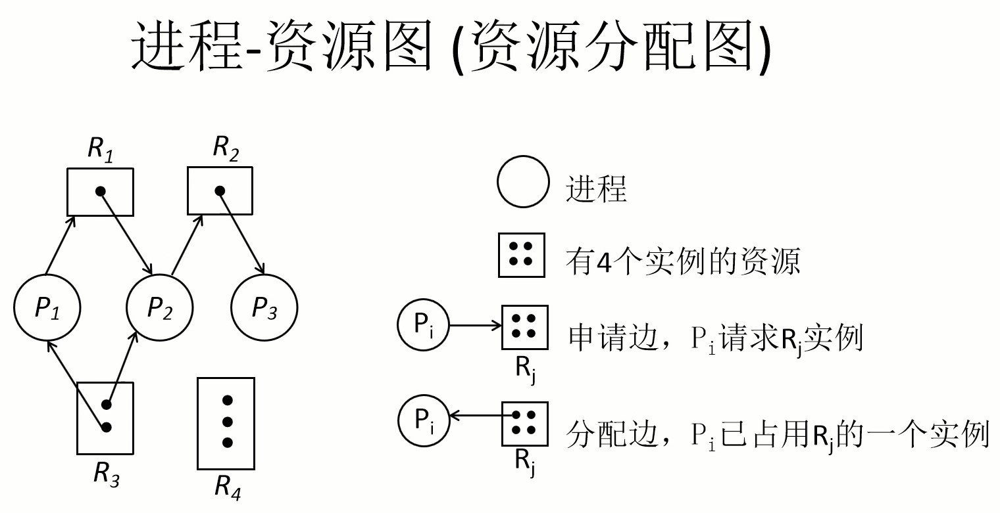

- 无环，即没有资源的循环等待，一定无死锁。
- 有环，可能会，也可能不会产生死锁。
- 如果所有进程资源都是单实例的，则有环一定产生死锁。

如果每种资源只有单个实例，则资源分配图可以化简为进程等待图，需要某资源的进程等待占用该资源的进程；有环即有死锁。

如果每种资源有多个实例，则对资源分配图进行简化，如果最后能消去图中所有的边，使所有的进程结点成为孤立结点，则称该图是可完全化简的，不存在死锁。化简的一般步骤如下：

1. 找出一个既不阻塞（该进程已获得运行的所有条件）又非孤立的结点P~i~；
2. P~i~获得资源继续运行，直到运行完毕；
3. P~i~释放其所占有的全部资源，消去P~i~的请求边和分配边，使之成为孤立结点；
4. 重复上述步骤继续判断，直到进程全部执行完毕；或没有满足条件的进程而阻塞。

## （五）线程

### 1. 基本概述

进程是一个拥有除CPU外所有资源（如内存空间、IO设备、PCB）的独立单位；进程同时又是一个独立调度和分配的基本单位。由于进程是一个资源拥有者，因而在进程的创建、撤消和（上下文）切换中，系统必须为之付出较大的时空开销，即需要分配、回收、保存、恢复资源如内存空间、IO设备等。

为使多个程序高并发又降低系统开销，很容易想到将资源分配和CPU调度这两个活动分开，让它们针对不同的活动实体进行，由此产生了线程的概念。

线程是进程中的一个实体，是被系统独立调度和分配的基本单位；但它自己基本上不拥有系统资源，只有一些运行中不可缺的资源（程序计数器PC、一组寄存器、栈）。一个进程的所拥有的全部资源（代码段、数据段、系统资源如文件描述符、IO设备等）都被它的所有线程共享。线程也有一个唯一描述符叫做TCB（Thread Control Block），它之中主要是成员有PS、SP、其他寄存器等。

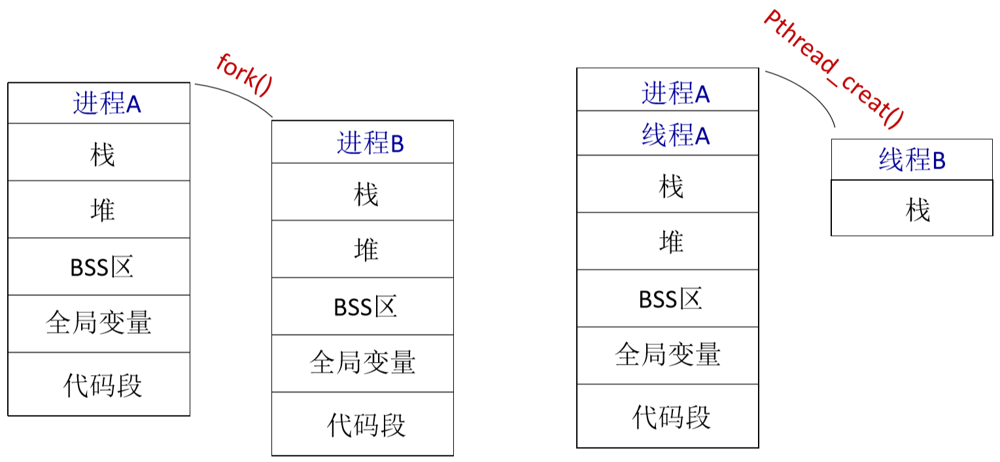


线程在创建后，通过调用进程中一个程序的入口点，开始在进程中执行。

线程没有系统资源分配不同于进程，它的并发属性类似于进程。一个线程可以创建和撤销另一个线程，同一个进程中的多个线程也可以并发执行；线程也有就绪、执行、阻塞三种基本状态；也有线程同步机制如互斥锁（mutex）、条件变量（condition variable）、信号量机制（private / public semaphore）。私用信号量是进程自己维护的，仅进程内的线程可见；公用信号量是整个操作系统维护的，所有进程可见。

每一个条件变量通常都与一个互斥锁一起使用，亦即，在创建一个互斥锁时便联系着一个条件变量。单纯的互斥锁用于短期锁定，主要是用来保证对临界区的互斥进入；而条件变量则用于线程的长期等待，直至所等待的资源成为可用的。

```c
lock(mutex);
check data structures;
while (resource busy)	wait(condition variable);
mark resource as busy;
unlock(mutex);
/*
*/
lock(mutex);
mark resource as free;
unlock(mutex);
wakeup(condition variable);
```

### 2. 实现

线程的三种实现方式，描述如下：

- 用户线程（User Thread）：在用户空间实现，操作系统看不到，由用户线程库来管理。如：POSIX Pthreads、Mach C-threads、Solaris threads。
- 内核线程（Kernel Thread）：在内核中实现，由操作系统管理。现代OS如Windows、Solaris、Linux都支持内核线程。
- 轻量级进程（Light Weight Process，PWS，又称轻权进程）：在内核中实现，支持用户线程。现代操作系统（如Solaris）提供了支持。

#### (1) 用户线程

由一组用户级的线程库函数来完成线程的管理，包括线程的创建、终止、同步和调度等。

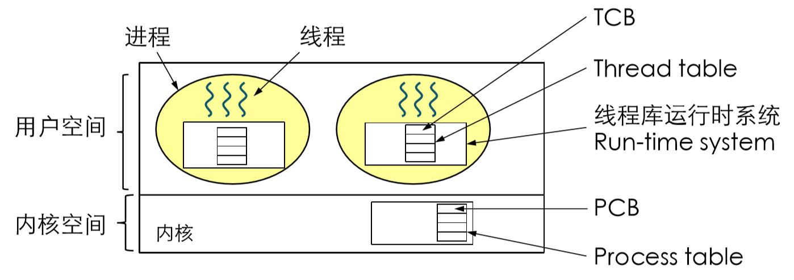

- 用户线程不依赖于操作系统的内核，而且内核也不了解用户线程的存在。可用于不支持线程的多进程操作系统。
- 用户线程的线程机制在用户空间实现，每个进程有私有的线程控制块（TCB）列表，TCB由线程库函数维护。
- 同一进程内的用户线程切换速度块，无需用户态和内核态的切换。允许每个进程拥有自己的线程调度算法。
- 线程发起系统调用（如IO操作）而阻塞时，则整个进程进入等待。即内核依然以进程为单位进行调度。
- 不支持基于线程的处理机抢占，除非当前运行线程主动放弃，否则它所在进程的其他线程无法抢占CPU。
- 只能按进程分配CPU时间，多个线程进程中，每个线程的时间片较少。
- 不能利用多处理机技术，即当硬件由多个CPU时，无法充分利用多CPU技术。

#### (2) 内核线程

由内核通过系统调用实现的线程机制，由内核完成线程的创建、终止和管理。由内核维护PCB和TCB。

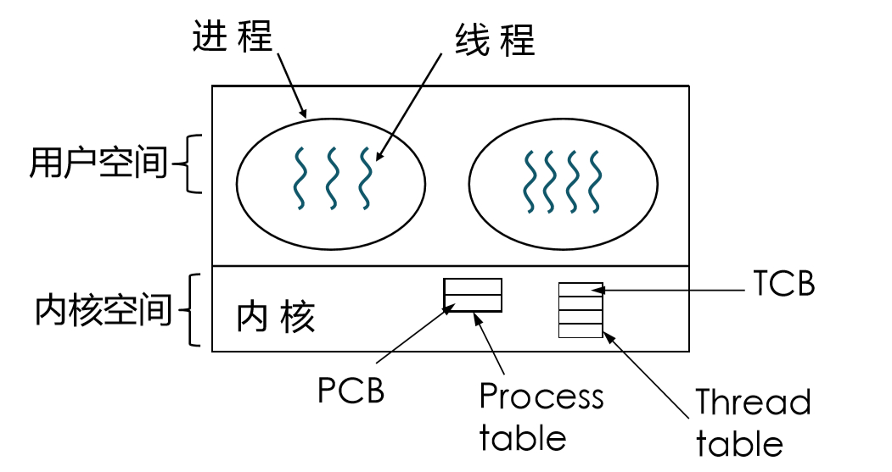

- 线程执行系统调用而被阻塞时，不会影响其他线程。
- 以线程为单位进行CPU时间分配，多线程的进程可获得更多CPU时间。
- 线程的创建、终止和切换开销相对较大，通过系统调用函数/内核函数，在内核实现。

#### (3) 轻量级进程

由内核支持的用户线程。

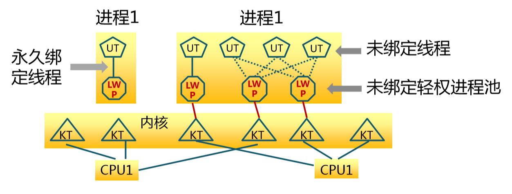

- 一个进程可有一或多个LWP；每个LWP支持一个或多个用户级线程（UT）。
- 每个LWP由一个单独的内核线程（KT）来支持。

用户线程（User Thread）与内核线程（Kernels Thread）之间的对应关系模型有多种：

- 多对一（Many to One）。一个线程阻塞，整个进程都会阻塞；无法并行。早期Java版本采用这种模型，现在的操作系统不再使用此模型。
- 一对一（One to One）。创建内核线程的开销会影响性能，系统会限制内核线程的数量。Linux、Windows等操作系统支持。
- 多对多（Many to Many）。多个用户级线程会被映射到一些内核级线程上，内核线程的数目要不超过用户线程的数目。
- Two Level。即有多对多，又可一对一。Solaris操作系统提供了支持。

#### (4) Linux线程

在Linux中，内核不区分进程和线程，一概处理，即线程在内存中也有一个tid（唯一标识）；当一个Linux进程没有创建线程之前，该进程下默认有一个执行线程，即主线程。Linux将用户级线程映射至内核级进程上；一个用户级进程中的多个用户级线程，映射到共享同一个组ID的多个内核级进程上，可以共享内存和文件，同一组中的进程切换时不需要切换上下文。

在Linux中，轻量级进程由`clone()`函数创建。

```c
int clone(int (*fn)(void *), void *child_stack, int flags, void *arg);
```

- `fn`，函数指针，指定一个让新进程执行的函数，当这个函数返回时，子进程终止。函数clone返回一个整数，表示子进程的退出代码。
- `arg`，传递给子进程的fn函数的数据。
- `child_stack`，为子进程分配的堆栈空间，应该总是要为子进程分配一个新的堆栈。
- 通过参数flags控制子进程与父进程之间共享的内容，常用的如下：
  - `CLONE_FS`，共享文件系统信息。
  - `CLNOE_FILES`，共享文件描述符表。
  - `CLNOE_SIGHAND`，共享信号处理函数。
  - `CLONE_VM`，运行在同一个虚拟地址空间，即共享内存空间。

# 二、进程对内存的使用

## （一）用户空间和内核空间

用户模式就是执行应用程度代码，访问用户空间，操作系统的用户接口部分（例如 Windows API）以及所有的用户程序都运行在该级别；内核模式就是执行内核代码，访问内核空间，操作系统的核心部分和设备驱动都运行在该模式下。

不同的操作系统的实现结构有所不同：简单结构（如MS-DOS）、层次化方法（如UNIX）、Android的系统架构、微内核结构、多层结构、模块（Loadable Kernel Modules）（如Solaris）。但它们基本上可以区分用户模式和内核模式着两种模式。


内核空间存放的是操作系统内核代码和数据，是被所有程序**共享**的。而为保护内核，计算机要求在内核模式和用户模式之间切换，模式切换仅仅需要寄存器进栈出栈，不会导致缓存失效。

计算机的设计并没有让内核单独拥有独立的地址空间（如单独4G给内核），这是因为：让内核拥有完全独立的地址空间，就是让内核处于一个独立的进程中，这样每次进行系统调用都需要切换进程。切换进程的消耗是巨大的，不仅需要寄存器进栈出栈，还会使CPU中的数据缓存失效、MMU中的页表缓存失效，这将导致内存的访问在一段时间内相当低效。

## （二）虚拟（逻辑）地址空间

逻辑虚拟地址空间是对一个进程来说的，是在CPU运行的进程看到的地址，或者说是当前执行的指令所访问的地址。物理地址空间是硬件支持的地址空间，即物理总线上看到的地址。那么逻辑虚拟空间到物理地址空间就需要一个转换映射，这个工作是由操作系统（负责建立逻辑地址和物理地址之间的关系）和MMU来完成的。

MMU是Memory Management Unit的缩写，即内存管理单元，又称分页内存管理单元（Paged Memory Management Unit，PMMU）。它是一种负责处理CPU的内存访问请求的计算机硬件，功能包括：虚拟地址到物理地址的转换（即虚拟内存管理）、内存保护、CPU高数缓存的控制。

一般而言，可以采用虚拟存储管理系统，即把内存、外存、显存等物理器件统一编址管理，使得它们的每个存储单元具有唯一的物理地址编号，它是一维线性空间。

32位机的虚拟地址空间，即4GB，即寻址大小。Linux内核将这4G的空间分为两个部分：将最高的1G空间（从虚拟地址的 0x C000 0000 到 0x FFFF FFFF）供内核使用，称为内核空间；而将较低的3G空间（从虚拟地址的 0x 0000 0000 到 0x BFFF FFFF）供各个进程使用，称为用户空间。因为每个进程可以通过系统调用进入内核，因此可以说，Linux内核由系统内的所有进程共享。

Linux使用两级保护机制：0级供内核使用，3级供用户程序使用（标准规定了ring0~ring3共四个级别）。Linux系统对自身进行了划分，一部分核心软件独立于普通应用程序，运行在较高的特权级别上，它们驻留在被保护的内存空间上，拥有访问硬件设备的所有权限，Linux将此称为内核空间。相对地，用户应用程序则是在用户空间中运行，它们只能看到允许它们使用的部分系统资源，并且不能使用某些特定的系统功能，也不能直接访问内核空间和硬件设备，以及其他一些具体的使用限制。内核空间在页表中拥有较高的特权级（ring2或以下），因此只要用户态的程序试图访问这些页，就会导致一个页错误（page fault）。

不管是内核空间还是用户空间，它们都处于虚拟空间中。使用虚拟地址可以很好的保护内核空间不被用户空间破坏，虚拟地址到物理地址转换过程有操作系统和CPU共同完成，操作系统为CPU设置好页表，CPU通过MMU单元进行地址转换。

多任务操作系统中的每一个进程都运行在一个属于它自己的内存沙盒中，这个沙盒就是虚拟地址空间（virtual address space），在32位机中，它总是一个4GB的内存地址块。这些虚拟地址通过页表（page table）映射到物理内存，页表由操作系统维护并被处理器CPU引用。每个进程都拥有一套属于它自己的页表。

虽然具体到某个进程的物理地址可能都不相同，但它们映射到虚拟内存空间却总是从最低地址 0x 0000 0000 开始的；每个进程有各自的私有用户空间（0～3G），这个空间对系统中的其他进程是不可见的，其中存放的是用户程序的代码和数据。而内核空间占据了每个虚拟空间中的最高1GB字节。

内核空间是持续存在的，并且在所有进程中都映射到同样的物理内存，内核代码和数据总是可寻址的，随时准备处理中断和系统调用。与之相反，用户模式地址空间的映射随着进程切换的发生而不断的变化，如下图所示（蓝色部分表示映射到物理地址的虚拟地址，白色表示未映射）：


## （三）进程的内核数据结构

一个进程在被执行时，系统会为进程分配内存空间。在32位机上，Linux进程标准的内存段布局，如下图所示，地址空间中的各个条带对应于不同的内存段。这些段只是简单的虚拟内存地址空间范围，与Intel处理器的段没有任何关系。


- **栈**（Stack）。

进程地址空间中最顶部的段是栈，大多数编程语言将之用于存储函数参数和局部变量。调用一个方法或函数会将一个新的栈帧（stack frame）压入到栈中，存储函数的返回指针（用于控制函数的调用和返回）、参数等信息，这个栈帧会在函数返回时被清理掉。进程中的每一个线程都有属于自己的栈。

通过不断向栈中压入数据，超出其容量就会耗尽栈所对应的内存区域，这将触发一个页故障（page fault），而被Linux的expand_stack()处理，它会调用acct_stack_growth()来检查是否还有合适的地方用于栈的增长。如果栈的大小低于RLIMIT_STACK（通常为8MB），那么一般情况下栈会被加长，程序继续执行，感觉不到发生了什么事情。这是一种将栈扩展到所需大小的常规机制。然而，如果达到了最大栈空间的大小，就会栈溢出（stack overflow），程序收到一个段错误（segmentation fault）。

需要注意的是，动态栈增长是唯一一种访问未映射内存区域而被允许的情形，其他任何对未映射内存区域的访问都会触发页错误，从而导致段错误。一些被映射的区域是只读的（如Text），因此企图写这些区域也会导致段错误。

- **内存映射段**（Memory Mapping Segment）。

内核将文件的内容直接映射到内存。任何应用程序都可以通过Linux的`mmap()`系统调用或者Windows的`CreateFileMapping()`、`MapViewOfFile()`请求这种映射。

内存映射是一种方便高效的文件IO方式，所以它可被用来加载动态库。创建一个不对应于任何文件的匿名内存映射也是可能的，此方法用于存放程序的数据。

在Linux中，如果你通过malloc()请求一大块内存，C运行库将会创建这样一个匿名映射而不是使用堆内存。“大块”意味着比MMAP_THRESHOLD还大（缺省128KB），可以通过`mallocp()`调整。

- **堆**（Heap）。

堆用于运行时内存分配，存储那些生存期与函数调用无关的数据。该堆不同于数据结构中的堆，该堆的分配方式类似于链表。

大部分语言都提供了堆管理功能。在C语言中，堆分配的接口是malloc()函数。如果堆中有足够的空间来满足内存请求，它就可以被语言运行时库处理而不需要内核参与。否则需要内核参与，堆会被扩大，通过`brk()`、`sbrk()`系统调用来分配请求所需的内存块。堆一般由程序员分配释放， 若程序员不释放，程序结束时可能由OS回收 。

堆管理是很复杂的，需要精细的算法来应付我们程序中杂乱的分配模式，优化速度和内存使用效率。处理一个堆请求所需的时间会大幅度的变动。实时系统通过特殊目的分配器来解决这个问题。堆在分配过程中可能会变得零零碎碎，即产生内存碎片。

- **未初始区**和**已初始数据段**（BSS和Data）。

在C语言中，BSS和数据段保存的都是静态（全局）变量的内容。区别在于：

BSS保存的是未被初始化的静态变量，即没有直接在程序源码中初始化的变量。BSS内存区域是匿名的，它不映射到任何文件。

Data数据段保存的是在源代码中已被初始化的变量，Data数据段不是匿名的，它映射了一部分的程序二进制镜像，也就是源代码中指定了初始值的静态变量。尽管Data数据段映射了一个文件，但它是一个私有内存映射，这意味着更改此处的内存不会影响被映射的文件。

- **代码区**（Text）。

程序代码在内存中的映射，存放函数体的二进制代码。

- 值得**注意**的一些事项。

一个段可能包含许多区域。比如，每个内存映射文件在mmap段中都有属于自己的区域，动态库拥有类似BSS和数据段的额外区域。有时人们提到数据段，指的是全部的数据段+BSS+堆。可以通过nm和objdump命令来察看二进制镜像，打印其中的符号，它们的地址，段等信息。

Text、BSS、Data在编译时就已经决定了进程占用多少内存。堆和栈的起始地址默认是随机产生的， 其目的是避免安全漏洞。

题外话。几乎每个进程的虚拟地址空间中各段的分布都与上图完全一致，这就给远程发掘程序漏洞的人打开了方便之门。一个发掘过程往往需要引用绝对内存地址：栈地址，库函数地址等。远程攻击者必须依赖地址空间分布的一致性，来探索出这些地址。如果让他们猜个正着，那么有人就会被整了。因此，地址空间的随机排布方式便逐渐流行起来，Linux通过对栈、内存映射段、堆的起始地址加上随机的偏移量来打乱布局。但不幸的是，32位地址空间相当紧凑，这给随机化所留下的空间不大，削弱了这种技巧的效果。

## （四）地址生成和程序装入内存

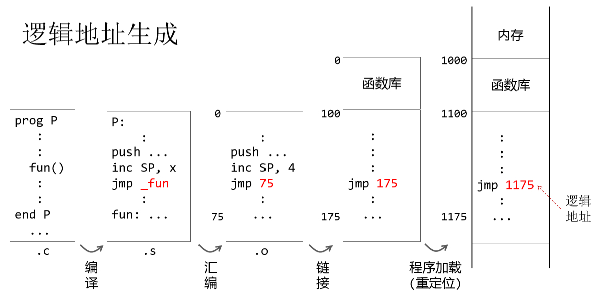

程序装入内存的方式可分为三种，上图采用的是可重定位装入方式。

- 绝装入方式，程序明确要装入的内存地址，在程序编码中可直接使用物理地址。在现代计算机中不再使用，但有时可以在嵌入式系统中见到。
- 可重定位装入方式，程序不知道要装入的内存地址，在程序编码中使用的是相对地址，程序装入时用内存地址作为基址，更新相对地址位为在内存中的逻辑地址。
- 动态运行时的装入方式，程序不知道要装入的内存地址在，程序编码中使用的是相对地址，程序装入时用内存地址作为基址，但是装入时不更新相对地址。因为在现代操作系统，进程在内存中的位置是可以改变的，所以该方式等待程序被访问执行到指令时，在将相对地址结合此时进程在内存中的基址得出在内存中的逻辑地址。

# 三、存储管理

当有作业进入计算机系统时，存储管理模块应能根据当时的内存分配状况，按作业要求分配给它适当的内存。作业完成后，应回收其占用的内存空间。内存分配可分为两种方式。

- 静态存储分配。各目标模块连接后，在作业运行之前，把整个作业一次性全部装入内存，并在作业的整个运行过程中，不允许作业再申请其它内存，或在内存中移动位置。
- 动态存储分配。作业要求的基本内存空间是在作业装入内存时分配的，但在作业运行过程中，允许作业申请附加的内存空间，或是在内存中移动位置。

为了实现静态或动态存储分配策略，必须考虑地址的重定位问题。它是逻辑地址和物理地址之间的映射。

- 物理地址空间。内存是由若干个存储单元组成的，每个存储单元有一个编号，这种编号可惟一标识一个存储单元，称为内存地址（或物理地址）。内存地址的集合称为内存地址空间（或物理地址空间），简称内存空间（或物理空间）。一般而言，采用虚拟存储管理系统，即CPU把内存、外存、显存等物理器件统一编址管理，使得它们的每个存储单元具有唯一的物理地址编号，它是一维线性空间。

- 逻辑地址空间。用汇编语言或高级语言编写程序时，常常用符号名来访问某一单元，程序中由符号名组成的程序空间称为符号名空间，简称名空间。源程序经过汇编或编译后，形成目标程序，每个目标程序都是以0为基址顺序进行编址的，原来的符号名被替换为该符号访问的单元地址编号。这样生成的目标程序占据一定的地址空间，称为作业的逻辑地址空间，简称逻辑空间。在逻辑空间中每条指令的地址和指令中要访问的操作数地址统称为逻辑地址。

一个编译好的程序存在于它自己的逻辑地址空间中，运行时，要把它装入内存空间，需对指令和指令中相应的逻辑地址部分进行修改，将其改为装载到内存中的物理空间，才能使指令按照原有的逻辑顺序正确运行。即地址重定向，根据重定向的时机不同又分为静态地址重定位和动态地址重定位。

- 静态地址重定位。在程序执行之前由操作系统的重定位装入程序来完成，根据要装入的内存地址，直接修改所有涉及到的逻辑地址，即将程序的内存起始地址加上程序的逻辑地址得到正确的内存地址。一旦装入内存后，就不便再移动，不利于内存空间的利用，所以静态地址重定位只适用于静态的内存分配方式。
- 动态地址重定位。在程序指令执行期间进行，一般说来由专门的硬件机构来完成。通常采用一个重定位寄存器，在每次进行存储访问时，对取出程序的逻辑地址加上重定位寄存器的内容（该作业在内存中的起始地址，即偏移量），形成正确的物理地址。现代计算机系统广泛采用动态地址重定位技术。

要保证各个作业只能在自己的存储区中活动，不能干扰和破坏其他程序尤其是操作系统的内存区。因此，必须保证进程不能不能越界访问，否则，就会产生越界中断，通知系统进行越界处理。这里给出使用硬件方法界限寄存器保护的两种具体实施技术。

-  上、下界存储保护。系统可为每道作业设置一对上、下界寄存器，分别用来存放当前运行作业在内存空间的上、下边界地址。每当作业要访问内存某单元时，就检查经过重定位后产生的内存地址是否在上、下界寄存器所规定的范围之内。
-  基址-限长存储保护。系统可为每个作业设一个基址寄存器和一个限长寄存器，基址寄存器存放该作业在内存的首址，限长寄存器存放该作业的长度。每当作业要访问内存单元时，就检查指令中的逻辑地址是否超过限长寄存器的值。基址-限长存储保护通常可结合动态地址重定位实现，基址寄存器相当于重定位寄存器。

对于存储保护除了防止越界外，还可对某一区域指定专门的保护方式。常见的对某一区域的保护方式有四种：禁止做任何操作、只能执行、只能读、能读写。如对许多用户可共享的程序，一般设定为只能执行；而对许多用户可共享的数据，则设定为只能读；一般的用户数据则是可读写的。

虚拟存储技术的基本思想是把有限的内存空间与大容量的外存统一编址管理起来，构成一个远大于实际内存的、虚拟的存储器。一个作业运行时，其全部信息装入虚存，实际上可能只有当前运行所必需的一部分信息存入内存，其它则存于外存，当所访问的信息不在内存时，系统自动将其从外存调入内存。当然，内存中暂时不用的信息也可调至外存，以腾出内存空间供其它作业使用。

## （一）连续存储管理

### 1. 固定分区存储管理

在作业未进入内存之前，就由操作员或操作系统把内存可用空间划分成若干个固定大小的存储区，除操作系统占用一个区域外，其余区域为系统中多个用户共享，因为在系统运行期间，分区大小、数目都不变，所以固定分区也称为静态分区。由于分区大小一般不可能刚好等于作业大小，所以分区中常有已分配给某作业，但未被使用的空闲部分，我们把它们称之为分区的内部碎片，即分配单元内的未使用内存。

当某个作业要求装入内存运行时，系统首先查询分区说明表，从中找到一个满足作业要求的空闲分区，将相应表项的状态位置为1，然后向用户返回分区号或分区起始地址，完成内存的分配工作；如没有能满足作业要求的空闲区，则无法分配。

*分区说明表*包含分区号、起始地址（KB）、分区大小（KB）、状态等信息。

当一个用户作业完成后，释放其占用的内存分区，系统根据分区号或起始地址找到分区说明表相应表项，将其状态置为0，表示该分区已空闲，可供其它作业使用。

固定分区的地址重定位一般可由重定位装入程序来完成，即采取静态地址重定位方法，存储保护可采用上、下界寄存器保护方式。

固定分区存储管理的最大优点是简单，要求的硬件支持少，软件算法也简单，缺点是容易产生内部碎片。

### 2. 可变分区存储管理

可变式分区是指在作业装入内存时，依据它对内存空间实际的需求量来划分内存的分区，每个分区的尺寸与进入它的作业大小相同。但会产生外部碎片，即分配单元之间的未使用内存。载入一个作业时有多种可选方案，这应该考虑空闲分区的组织形式和采用的内存分配算法。

#### (1) 空闲分区的组织形式

空闲分区可组织为空闲分区表或空闲分区链表的形式。

空闲分区表包含空闲分区的起始位置和大小，因分区数目不定，空闲分区表长度不定。采用空闲分区表要占用一定数量的存储单元存放表，增加了系统的开销。所以使用比较广泛的是空闲分区的链表组织形式。

链表组织形式如下，在每个空闲分区的起始部分开辟出一个单元，存放一个指向下一个空闲分区的链表指针，和该分区的大小信息。系统中用一个固定单元作为空闲分区链表的链表头指针，指向第一块空闲分区首地址，最后一块空闲分区的链表指针存放链尾标志（如NULL）。链表按空闲分区在内存的位置顺序由小到大链接起来，因空闲分区链表组织时，空闲区的信息放在空闲区内，因此不会额外增加系统的开销。

#### (2) 内存的分配与回收

在可变式分区存储管理中，当作业要求一个X~k~大小的存储空间时，系统从链表头指针开始依次检索空闲区，直到找到第一个大于等于X~k~的空闲区。若有空闲区等于X~k~大小，则修改链表指针，取消该空闲区，并向用户返回该空闲区首地址；若该空闲区大于X~k~，则将空闲区一分为二，一个为X~k~分给用户，另一个为余下部分，仍留在空闲区链表中，修改相应链表指针所指向的地址和空闲区大小。若系统中所有空闲区都小于X~k~，则无法分配。

当某一个用户作业完成释放所占分区时，系统应进行回收。在可变式分区中，应该检查回收区与内存中前后空闲区是否相邻，若相邻，则应进行合并，形成一个较大的空闲区，并对相应的链表指针进行修改；若不相邻，应将空闲区插入到空闲区链表的适当位置。

#### (3) 常用的分区适应算法

对空闲区链表采用不同的组织形式，就对应不同的分配和回收算法。实际应用时，应综合考虑不同情况，如用户要求、内存大小、作业平均大小等因素，选择合适的分配算法。如果对于某一作业序列来说，某种算法能将该作业序列中的所有作业安置完毕，那么我们就认为该算法对这一作业序列而言是合适的。

常用的分配算法有以下三种，首次适应算法、最佳适应算法、最差适应算法。

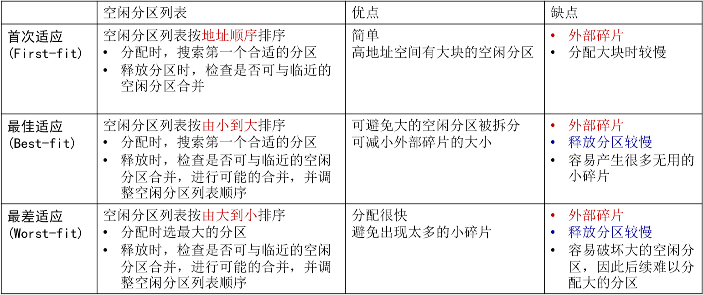

#### (4) 地址重定向与存储保护

可变式分区的地址重定位可采用静态重定位，也可采用动态重定位。

静态重定位会使内存中不能再分配的外部小碎片会越来越多，采用紧凑技术把小碎片集中起来使之成为一个大分区。即移动各用户分区中的程序，使他们集中于内存的一端，而使碎片集中于另一端，从而将空闲的碎片连成一个较大的分区，供需求的作业使用，这就要求采用动态重定位技术。

可变式分区的存储保护可采用基址-限长存储保护方式。

#### (5) 覆盖技术和交换技术

在早期的单用户操作系统中内存的容量一般少于64KB，可用的存储空间受到相当限制，大作业不能一次全部装入内存。引入覆盖管理技术把大的程序划分为一系列的覆盖，每个覆盖是一个相对独立的程序单位，把程序执行时不需要同时装入内存的覆盖构成一组，称之为覆盖段。为每个覆盖段分配同一个中存储区域即覆盖区，其大小应由覆盖段中最大的覆盖来确定。

覆盖技术要求程序员必须把一个程序划分成不同的程序段，并规定好它们的执行和覆盖顺序，操作系统根据程序员提供的覆盖结构来完成程序段之间的覆盖。因此，要求用户明确地描述作业中各个程序模块间的调用关系，这将加重用户负担。

交换技术就是把程序或数据在内存、外存之间换入换出。即通过不断地换出/换迸作业或进程，以便在较小的存储空间中，执行较大的程序。早期的一些小型分时系统多数都是采用这种交换技术。交换主要是在进程或作业之间进行的，而覆盖则主要在同一个作业或进程中进行。交换技术通常可用于解决如下问题：

- 作业要求增加存储空间，而分配请求受到阻塞。
- CPU时间片用完。
- 作业等待某一IO事件发生，如等待打印机资源等。
- 紧凑存储空间时，需把作业移动到存储空间的新位置上。

### 3. 伙伴系统

前两中分区缺点总结：固定分区，限制了活动进程的数量，存在内碎片，内存利用率低；可变分区，开销大，维护空闲分区列表、分配、释放，存在外碎片，碎片整理开销。一个折中的方案是伙伴系统（Buddy System）。

1. 设整个可分配的内存分区大小2^U^，需要的分区大小为s，如果2^U-1^<s≤2^U^时，把整个块分配给该进程；
2. 一般情况查找空闲分区大小为2^i^ ，满足2^i-1^<s≤2^i^，将当前空闲分区分配给该进程；如果s<2^i-1^，则将该分区一分为二，直到满足2^i-1^<s≤2^i^为止；如果找不到这样的分区，则分配失败。

这种分配算法能保证内碎片空间小于2^i-1^-1。实现该算法需要的数据结构可以为一个二维数组，存放空闲块的大小和起始地址并按空闲块大小递增排序；分配时从小到大找第一个满足大于等于请求的空闲块，如果过大需要先一分为二。

释放时把释放的块放入空闲块数组，合并满足合并条件的空闲块：地址相邻，大小相同2^i^，合并后低地址空闲块起始地址为2^i+1^。

## （二）分页式存储管理

把内存空间分成大小相等、位置固定的若干个小分区，称为一个存储块；把用户的逻辑地址空间分成与存储块大小相等的若干页。当作业提出存储分配请求时，系统先作业分成若干页，每一页可存储在内存的任意一个空白块内。建立起程序的逻辑页和内存的存储块之间的对应关系，原本连续的用户作业在分散的不连续存储块中，借助动态地址重定位技术，作业就能够正常投入运行。

如果把作业的所有页面一次全部装入到内存块中，就把这种分页称之为分页式存储管理。如果作业的所有页面并不是一次全部装入，而是根据作业运行时的实际要求装入，则把这种分页管理称为请求页式存储管理。

### 1. 存储块的分配与回收

记录空闲存储块的方法通常有两种，位图法和链表法。

位图法是用存储单元中的二进制位与存储块相对应，某位的值为0，表示对应的存储块是空闲的；其值为1，表示已分配。把这些二进制位组合在一起，就构成一张位图。查找空闲块比较费时，但回收时比较简单，只需将该块对应的位图中二进制位置0即可。

链表方式同样适于页式存储管理，而且由于块的大小相同，在每个空闲块中只需包含指向下一个空闲块的指针信息即可。系统设定一个空闲块链表头指针指向链表的第一个空闲块，当用户申请内存时，根据链表头指针顺序分配即可；回收时，只需将该块插入表头就可以。

### 2. 地址重定位

通常可在内存中为每个作业开辟一块特定区域，建立作业的逻辑页与存储块之间的对应表格关系，这种表常称为页面映象表，简称页表，通常包含页号（可作为索引）、块号（页帧号）、标志位等信息。页表的起始地址、长度，放在该作业的进程控制块PCB中。当前运行作业的页表地址由一个专用的页表始址寄存器（PTBR）来指定。每当运行一个新作业就将该作业的页表始址、长度从进程控制块中取出。

在作业执行过程中，由硬件地址分页结构自动将每条程序指令中的逻辑地址解释成两部分，页号p和页内地址w。通过页号查页表得到存储块号b，与页内地址w合成，形成物理地址，访问内存，得到操作数据。页内地址的长度由页大小决定，逻辑地址中除去页内地址所占的低位部分外，其余高位部分为页号。

多级页表可用来减少页表存储的开销，通过间接引用将页号分成k级，如p~1~、p~2~、p~3~，内存访问次数k+1。建立页表树，减少每级页表的长度。根据各级页表的存在位，把不存在的页表省掉。

详细请参考《计算机组成原理》。

### 3. 联想存储器

为了提高查表的速度，在分页地址变换机构中，加入一组高速缓冲存储器，用来存放当前作业的最常用的页号和与之相应的物理块号，它和页表具有并行查找能力。一般称这样的寄存器组为快表（TLB）或联想存储器。

当处理机给出逻辑地址p,w时，分页机构一方面取出页号p，并根据p从页表中查找相应的内存块号b；另一方面自动把页号p送入联想存储器，如果命中，则输出对应块号b，并与页内地址w形成物理地址进行访问，同时停止前面查找页表的工作。由于联想存储器采用的是高速缓存，其访问速度比访问页表要快得多。

如果在联想存储器中查不到，仍继续在页表中查找，并把查找到的页号p和块号b放到联想存储器的空闲单元中，以备下次使用。如无空闲单元，则通常把最先装入的那个页号淘汰，以腾出位置。应用联想存储器和页表相结合的方式，可有效地提高系统动态地址转换的速度，是一种行之有效的方法。

### 4. 反向页表

不让页表与逻辑地址空间的大小相对应，而是让页表与物理地址空间的大小相对应，以物理页帧号作为索引index，容量可以很小，整个系统只需1个反向页表（只有一块物理内存）。反向也表的组成如下：

用物理内存的大小除以每页的大小（所用w个二进制表示所有情况），得到所需页的个数，将这个页号作为索引，将表示所有页号所需要的的位数，即使存储页号p所需的二进制位数。从最右侧分别取w和p个二进制位表示页内偏移和页号，左侧的二进制位作为页帧号f，用来标识是哪个进程的页表项。

通常采用哈希函数的方式来获得反向页表的页帧号，利用逻辑地址中的高位存储的页号，和进程的pid号，生成页帧号，然后就可以读取该页表项，定位到物理内存。

## （三）分段式存储管理

分页式存储虽然解决了内存利用率和碎片的问题，但有时一个逻辑上独立的程序段有可能被分为多个页面，装入内存中并不连续的块中，这就使得程序的上下逻辑关联性遭到了破坏。通常一个作业是由多个程序段和数据段组成的，从用户角度来说，希望按逻辑关系对作业分段，并能根据名字来访问程序段和数据段。分段式存储管理较好地解决了程序和数据的共享以及程序动态链接等问题。 

### 1. 分配的基本思想

作业的地址空间由若干个逻辑分段组成，每一分段是一组逻辑意义完整的信息集合，并有自己的名字（段名）。以段为基本单位分配内存，且每一段必须分配连续的内存空间，但各段之间不要求连续，由于各段的长度不一样，所以分配的内存空间大小也不一样。每一段都是以0开始的连续的一维地址空间，整个作业则构成了二维地址空间。

### 2. 地址重定位

为了实现段的逻辑地址到物理地址的转换，系统为每个作业设置了一张段表SMT，每个表项至少有4个数据项：段号、段长、内存始址、存取控制。系统还设置了段表控制寄存器，用来存放段表的起始地址和段表长度。

先将逻辑地址中的段号与段表控制寄存器中的段表长度进行比较，若段号超过段表长度则产生越界中断。不越界则根据段表起始地址和段号在段表中找到该段，从中获得该段在内存中的起始地址。检查段内偏移是否超过段长，若超过则产生越界中断。不越界则用该段在内存中的起始地址加上段内偏移即得物理地址。

### 3. 分页与分段的区别

分页与分段存储管理有很多相似之处，如在内存中都是离散的，都要通过地址映射机构将逻辑地址映射到物理内存中。但从概念上讲，它们是完全不同的，之间的区别如下：

- 页是信息的物理单位，分页的目的是实现离散分配，减少外部碎片，提高内存利用率。段是信息的逻辑单位，每一段在逻辑上是一组相对完整的信息集合。
- 分页式存储管理的作业地址空间是一维的。而分段式存储管理的作业地址空间是二维的。
- 页的大小固定且由系统确定，是等长的。而段的长度不定。
- 分页的优点体现在内存空间的管理上。而分段的优点体现在地址空间的管理上。

## （四）段页式存储管理

分页存储管理能有效地提高内存的利用率，而分段存储管理能够反映程序的逻辑结构以满足用户的需要，并还可以实现段的共享。段页式存储管理则是分页和分段两种存储管理方式的结合，它同时具备两者的优点。 

段页式存储管理是目前使用较多的一种存储管理方式。

- 作业地址空间进行段式管理，将作业地址空间分成若干个逻辑分段，每段都有自己的段名。每段内再分成若干大小固定的页，每段都从零开始为自己的各页依次编写连续的页号。
- 作业的逻辑地址包括3个部分：段号s、段内页号p、页内位移d。用户可见仍是段号s和段内位移w，由地址变换机构将段内位移的高几位划分为段内页号p，低几位划分为页内位移d。
- 对内存空间的管理仍然和分页存储管理一样，将其分成若干个与页面大小相同的物理块，对内存空间的分配是以物理块为单位的。
- 系统有一个段表控制寄存器，用来存放段表的起始地址和段表长度。为每个作业建立一张段表（段号、页表起址、页表长度），并为每个段建立一张页表（页号、块号）

若段表、页表存放在内存中，则为了访问内存的某一条指令或数据，将需要访问3次内存：

1. 查找段表获得该段所对应页表的起始地址；
2. 查找页表获得该页所对应的物理块号，从而形成所需的物理地址；
3. 根据所得到的物理地址到内存中去访问该地址中的指令或数据。

三次访问内存极大降低了内存的存取速度，因此可同样采用联想存储器技术提高内存的存取速度。

## （五）虚拟内存管理

分区存储管理和分页、分段式存储管理技术，都要求作业在执行之前必须全部装入内存，并且作业的逻辑地址空间不能比内存空间大，否则该作业就无法装入内存运行，这就存在大作业与小内存的矛盾问题。为解决这一问题，人们提出了虚拟存储管理技术。

### 1. 虚拟存储的概念

基本思想，就是把内存与外存统一起来形成一个存储器。作业运行时，只把必需的一部分信息调入内存，其余部分仍放在外存，当需要时，由系统自动将其从外存调入内存。这一思想的理论依据是程序的局部性原理。

没有必要把一个作业一次性全部装入内存再开始运行，可以把程序当前执行所涉及的程序和数据放入内存中，其余部分可根据需要临时调入，由操作系统和硬件相配合来完成内存和外存之间信息的动态调度。这样的计算机系统好像为用户提供了一个存储容量比实际内存大得多的存储器，就称为虚拟存储器。用做虚存的外存称为辅存。

引入虚拟存储器概念相当于系统为每个程序建立了一个虚存，这个虚存就是程序的逻辑地址空间。每个程序可以在自己的逻辑地址空间中编程，在各自的虚拟存储器上运行。一个虚拟存储器的最大容量取决于计算机的地址结构。比如，32位的地址总线，虚存的最大容量为4GB，即程序编程的逻辑地址空间可高达4GB，远比其内存容量大得多。

必须常驻内存的OS的关键部分，可以在页表中添加标志位lock bit，称为页面锁定（frame locking）。

存储管理技术趋向于复杂，下面介绍两种常见的虚存管理方案。

### 2. 请求页式存储管理

请求页式存储管理基本结构和页式存储管理相同（如内存块分配与回收、存储保护等）；不同的是在一个作业运行时（地址重定向），不要求把作业的全部信息装入内存，而只装入目前运行所要用到的几页，其余的仍保存在外存，等到需要时再请求系统调入，即请求调页和页面置换。

请求页式存储管理中的地址重定位和缺页中断处理过程如下：

1. 取一条指令，由硬件把逻辑地址分为页号p和业内地址w。
2. 判断该页是否在主存中，如果在主存中，就可以完成访问，取下一条指令；否则引起缺页中断，由中断例程（软件层面）进程处理。
3. 保留现场。检查预先分配给当前作业的空白存储块是否还有剩余，如果当前作业没有空白页，则要选择一页置换掉。根据置换算法（引用位）判断置换掉哪一页，根据该页是否修改过（修改位）判断是否将其写回外存。
4. 然后由辅存地址读入所需页面，并调整页表（修改状态位、填入实际内存块号）及其链表，恢复现场。
5. 中断结束，程序继续执行。

一般来说，一个页表的表项通常可包括如下的数据内容：


- 页号p和其对应的内存块号，用来跟逻辑地址形成物理内存地址。如果该页不在主存，内存块号无意义。
- 状态位，用于标识该页是否在主存中，例如在主存为1，不在主存为0。
- 修改位，用于在将该页替换出内存时，标识该页是否被修改过，以判断是否将该页写回外存。
- 引用位，当需要对内存中现有页置换时，置换算法根据引用位判断置换哪一页。

设缺页率p（Page Fault Rate）是一个在[0, 1.0]区间中的值，为0表示没有缺页（全部页都在内存），为1表示页面每次引用总是缺页。有效访问时间（Effective Access Time，EAT）可以用来估算页面置换算法是否适合，它的计算公式如下，EAT=(1-p)×内存访问时间+p×(处理缺页中断时间+页面换出时间+页面换入时间+重新执行指令的时间)。

### 3. 页面置换算法

如果置换算法不当，可能某些页刚被置换出去又要马上访问，因而又要将其调回，而调回后不久又要被置换出去，这样不断反复，以致使处理机的大部分时间都消耗在频繁的页面置换上，结果使系统性能急剧下降。这种现象称为系统抖动。应该尽量减少和排除抖动现象的发生。

进行页面置换时，是从整个内存中，还是从本作业的内存块中选取进行置换。实际系统中，两种方法都是可行的，这里只讨论局部范围内的置换算法。即系统为每个作业规定最大的内存占有块数，当已占满规定的内存块数而又有新页要调入时，就从自身空间中置换出一个页面，不允许置换别的作业的页面。

可以使用存储分块表管理内存块，记录内存中各存储块当前的使用状态。它的表项通常包含普通页表的全部或部分表项，此外还可以拥有一个指针项和其他表项，用于置换算法的实现。

下面介绍几种常见的页面置换算法。

#### (1) 最优算法（OPT）

最理想的页面置换算法是，从内存中移出以后不再使用的页面；如无这样的页面，则选择以后最长时间内不需要访问的页面。这就是最优算法的思想。该算法不是一种实际的方法，只具有理论上的意义，因为页面访问的顺序是很难预知的。通常把它作为一种评价标准，比较其它实用方法的优劣。

#### (2) 先进先出算法（FIFO）

基本思想是，总是先淘汰那些驻留在内存时间最长的页面，即先进入内存的页面先被置换掉。理由是，最先进入内存的页面不再被访问的可能性最大。

实现比较简单。作业只要把进入内存的各页面按进入的时间次序用链表链接起来，设定一个链表首指针（称为替换指针）指向进入内存最早的一个页面，新进入的页面放在链表尾部，需要淘汰某一页面时，总是淘汰替换指计所指向的页面即可。实际实现时，该链表可建立在管理内存块的存储分块表中。

先进先出算法在程序按线性顺序访问逻辑地址空间时，比较理想；否则，效率不高。特别是遇到循环执行的程序段时，往往会把频繁访问的页面，因其在内存驻留时间长，而周期性的淘汰。所以，先进先出算法往往不单独使用，而是作为其它算法的一种辅助策略使用。

Belady异常（Anomaly）指的是，给一个进程分配的物理块越多，缺页次数反而增加的异常现象。原因是被FIFO算法置换出去的页面并不一定是进程近期不会访问的，FIFO算法的置换特征与进程访问内存的动态特征矛盾，即按算法淘汰的页面，恰好是下一次要访问的页面。

#### (3) 最近最久未使用算法（LRU）

基本思想是，当需要置换一页时，选择最近一段时间最久未使用的页面予以淘汰。理由是，如果某一页被访问了，那么它很可能马上又被访问；反之，如果某一页很长时间没有被访问，那么最近也不太可能会被访问。这种算法考虑了程序设计的局部性原理。

实现时通过周期性地对引用位进行检查，利用它来记录一页面自上次被访问以来所经历的时间t，淘汰时选择t最大的页面。或者让每一个页表项维护一个计数器来记录最后一次访问的时间，每次引用该页时，将其值更新为当前时间，置换时需要扫描整张表（可对于所有进程的所有页表项来说），找一个计数值最小的页换出。

另外两种开销小些的差不多的实现思路，它们在缺页时都很理想，但访问页面时开销较大。系统维护一个页面链表，链首是最近刚访问过的页面，链尾是最久未访问的页面，访问内存时从链表中找到相应的页面将其移到链首，如果缺页则淘汰链尾的页面，并将新页作为链首。后者维护一个活动页面栈（设计双向链表维护一个栈），栈顶是最近刚访问过的页面，栈顶是最久未访问的页面，访问内存是，将此页号压入栈顶，并将占内相同的页号抽出（如果有），缺页时则淘汰栈底页面，并将新页压入栈顶。

这种算法能够比较普遍地适用于各种类型的程序，但是实现起来比较困难。因为要对以前的访问历史时时加以记录和更新，如果这种连续的修改完全由软件来做，则系统开销较大。如果由硬件完成会增加计算机成本。因此，在实际应用中得到推广的是一种简单而有效的LRU近似算法。

#### (4) LRU近似算法

只要在页表中设一个引用位，当存储分块表中的某一页被访问时，该位由硬件自动置1，并由页表管理软件周期性把所有引用位置0。这样，在一个时间周期T内，某些被访问过的页面其引用位为1，而未被访问过的页面其引用位为0。

根据引用位的状态来判别各页面最近的使用情况。当需要置换一页面时，选择其引用位为0的页进行替换，如果为1则置0并继续查找。

LRU近似算法比较简单，易于实现，其缺点是，周期T的大小不易确定，T太大会使得所有的引用位都为1，无法确定哪一页是最近未用的页；T太小引用位为0的块可能相当多，因而所选择的页面未必是最久未用的页。另外，如果缺页中断刚好发生在系统对所有引用位重置0后，所有块的引用位为0，因而也有可能把常用的页淘汰出去。

#### (5) 时钟算法（Clock）

时钟置换算法是LRU近似算法的一个例子。

在页表中设置一个访问位（引用位），当访问时，就把所访问内存块的访问位置1。把所有的页面都保存在一个类似钟面的环形链表中，一个表针指向最老的页面。可以看出时钟算法时LRU算法和FIFO算法的折中。

当发生缺页中断时，先检查表针指向的页面，如果它的R位是0就淘汰该页面，并把新的页面插入这个位置，然后把表针前移一个位置；如果R位是1就清除R位并把表针前移一个位置，重复这个过程直到找到了一个R位为0的页面为止。

#### (6) 改进的Clock算法

改进的Clock算法又称为二次机会算法，它减少了修改页的缺页处理开销。即在执行页面操作的时候，检查页面之前进行了读操作还是写操作，优先选择没有执行写操作的页面淘汰，因为这样的页面不需要写回磁盘。在实现算法时还需要考虑修改位，要淘汰的是访问位和修改位都为0的页面。

用二元组表示（访问位，修改位），当访问一个页面时，所执行的操作要分读操作和写操作，读操作将它们置为(1, 0)，而写操作将它们置为(1, 1)。

对于访问修改的四种组合，在算法扫描的时候：(0, 0)被置换出去；(0, 1)被置为(0, 0)；(1, 0)被置为(0, 0)；(1, 1)被置为(0, 1)。可以看出即被访问又被修改的页面有更多的驻留内存的机会，因此又称为二次机会算法。

#### (7) 工作集

解决抖动问题最根本的方法是控制多道程序的道数，使得每个用户作业都有足够的内存空间可供使用。但作业的个数又不能太少，否则会影响处理机的利用率。

工作集（working set）是一个进程当前正在使用的页面的集合。不少分页系统都会设法跟踪进程的工作集，以确保在让进程运行以前，它的工作集就已在内存中了。该方法称为工作集模型（working set model），其目的在于大大减少缺页中断率。在让进程运行前预先装入其工作集页面也称为预先调页（pre-paging），工作集是随着时间变化的。

程序执行时访问往往是集中于一小部分页面。在任一时刻t，都存在一个集合，它包含所有最近k次内存访问所访问过的页面，这个集合w(k,t)就是工作集。因为最近k＝1次访问肯定会访问最近k>1次访问所访问过的页面，所以w(k,t)是k的单调非递减函数。但随着k的变大，w(k,t)是不会无限变大的，因为程序不可能访问比它的地址空间所能容纳的页面数目上限还多的页面，并且几乎没有程序会使用每个页面。

由于程序的局部性，k的值有一个很大的范围，它处在这个范围中时工作集不会变。因为工作集随时间变化很慢，那么当程序重新开始时，就有可能根据它上次结束时的工作集对要用到的页面做一个合理的推测，预先调页就是在程序继续运行之前预先装入推测出的工作集的页面。

为了实现工作集模型，操作系统必须跟踪哪些页面在工作集中。通过这些信息可以直接推导出一个合理的页面置换算法，当发生缺页中断时，淘汰一个不在工作集中的页面。为了实现该算法，就需要一种精确的方法来确定哪些页面在工作集中。根据定义，工作集就是最近k次内存访问所使用过的页面的集合。为了实现工作集算法，必须预先选定k的值。一旦选定某个值，每次内存访问之后，最近k次内存访问所使用过的页面的集合就是惟一确定的了。

# 四、文件管理

## （一）文件及文件系统

### 1. 文件及其分类

在计算机系统中，文件定义为：存储在**外部存储介质**上的、具有**符号名**的一组相关信息的集合。

#### (1) 文件命名

每个文件都有一个名称，即文件名。文件名是文件的标识，操作系统根据文件名来对其进行控制和管理，用户通过文件名来使用文件，而不必关心文件存储方法、物理位置以及访问方式等。文件系统的基本功能就是实现文件的按名存取。

不同的操作系统对文件命名的规则略有不同，文件名的格式和长度也因系统而异。文件扩展名可以用来区分文件的类型，不过有的系统中并不感知文件扩展名。

#### (2) 文件属性

文件包括文件内容和文件属性，文件属性是对文件进行说明的信息，主要是文件创建日期、文件长度、文件权限、文件存放位置等，这些信息主要被文件系统用来管理文件。不同的文件系统通常有不同种类和数量的文件属性。一些常用的文件属性有：

- 文件名称：文件名称是供用户使用的外部标识，这是文件最基本的属性。文件名称通常由一串ASCII码或者汉字构成，现在常常由Unicode字符串组成。
- 文件内部标识：有的文件系统不但为每个文件规定了一个外部标识，而且规定了一个内部标识。文件内部标识只是一个编号，可以方便管理和查找文件。在UNIX文件系统及类UNIX系统中，inode就是内部标识。
- 文件物理位置：具体标明文件在存储介质上所存放的物理位置。
- 文件拥有者：操作系统通常是多用户的，不同的用户拥有各自不同的文件，对这些文件的操作权限也不同。通常文件创建者对自己所建的文件拥有一切权限，而对其它用户所建的文件则拥有有限的权限。
- 文件权限：通过文件权限，文件拥有者可以为自己的文件赋予各种权限，如可允许自己读写和执行，允许同组的用户读写，而只允许其它用户读。
- 文件类型：可以从不同的角度来对文件进行分类，如普通文件或是设备文件，可执行文件或是文本文件，等。
- 文件长度：文件长度通常是其数据的长度，长度单位通常是字节。
- 文件时间：文件时间有很多，如最初创建时间，最后一次的修改时间，最后一次的执行时间，最后一次的读时间等。

#### (3) 文件分类

为了有效、方便地组织和管理文件，常按照不同的观点对文件进行分类。文件分类方法有很多，这里介绍几种常用的分类方法。

按用途将文件分为：

- 系统文件：由系统软件构成的文件，包括操作系统内核、编译程序文件等。这些通常都是可执行的二进制文件，只允许用户使用，不允许用户修改。

- 库文件：由标准的和非标准的子程序库构成的文件。标准的子程序库通常称为系统库，提供对系统内核的直接访问，而非标准的子程序库则是提供满足特定应用的库。库文件又分为两大类：一类是动态链接库，另一类是静态链接库。
- 用户文件：用户自己定义的文件，如用户的源程序、可执行程序和文档等。

按性质将文件分为：

- 普通文件：系统所规定的普通格式的文件，例如字符流组成的文件，它包括用户文件、库函数文件、应用程序文件等等。
- 目录文件：包含普通文件与目录的属性信息的特殊文件，主要是为了更好地管理普通文件与目录。
- 特殊文件：在Unix/Linux系统中，所有的输入/输出设备都被看作是特殊的文件，甚至在使用形式上也和普通文件相同。通过对特殊文件的操作可完成相应设备的操作。

按保护级别将文件分为：

- 只读文件：允许授权用户读，但不能写。
- 读写文件：允许授权用户读写。
- 可执行文件：允许授权用户执行，但不能读写。
- 不保护文件：用户具有一切权限。

按文件数据的形式将文件分为：

- 源文件：源代码和数据构成的文件。
- 目标文件：源程序经过编译，但尚未链接成可执行代码的目标代码文件。
- 可执行文件：编译后的目标代码由链接程序连接后形成的可以运行的文件。

除了以上的分类方法外，还可以按照文件的其它属性进行分类。由于各种系统对文件的管理方式不同，因而对文件的分类方法也有很大的差异，但是其根本目的都是为了提高文件的处理速度以及更好地实现文件的保护和共享。

#### (4) 文件的操作

文件系统通常向用户提供各种调用接口，用户通过这些接口来对文件进行各种操作。对文件的操作可以分为两大类：对文件自身的操作，如建立文件，打开文件，关闭文件，读写文件等；对记录的操作，如查找文件中的字符串，插入和删除等。以下是一些常用的文件操作。

- 文件创建：创建文件时，系统首先为新文件分配所需的外存空间，并且在文件系统的相应目录中，建立一个目录项，该目录项记录了新文件的文件名及其在外存中的地址等属性。
- 文件删除：系统先从目录中找到要删除的文件项，使之成为空项，紧接着回收该文件的存储空间，用于下次分配。
- 文件截断：如果文件名及其属性并没有发生变化时，可截断文件。即将原有文件的长度设为0，也可以说是放弃文件的内容。
- 文件读：通过读指针，将位于外部存储介质上的数据读入到内存缓冲区。
- 文件写：通过写指针，将内存缓冲区中的数据写入到位于外部存储介质上的文件中。
- 文件的读写定位：文件的读写进行定位操作，也即改变读写指针的位置，则可以从文件的任意位置开始读写，为文件提供随机存取的能力。
- 文件打开：在开始使用文件时，首先必须打开文件。这可以将文件属性信息装入内存，以便以后快速查用。
- 文件关闭：在完成文件使用后，应该关闭文件。这不仅是为了释放内存空间，而且也因为许多系统常常限制可以同时打开的文件数。

### 2. 文件系统及其功能

操作系统中负责管理和存储文件信息的软件机构称为文件管理系统，简称文件系统。文件系统由三部分组成：与文件管理有关的软件、被管理的文件、实施文件管理所需的数据结构。

从系统角度来看，文件系统是对文件存储器空间进行组织和分配，负责文件的存储并对存入的文件进行保护和检索的系统。具体地说，它负责为用户建立文件，存入、读出文件，控制文件的存取，当用户不再使用时撤销文件等。

随着操作系统的不断发展，越来越多的功能强大的文件系统不断涌现。这里列出一些具有代表性的文件系统。

- FAT（File Allocation Table），早期DOS和Windows 9x所采用的文件系统，常见的有FAT16和FAT32，支持的磁盘最大分区由4GB增至32GB，FAT32支持的磁盘总容量则为2TB（2047GB）。FAT16的分区的簇大小为32KB，而FAT32分区的簇只有4KB的大小。这样FAT32就比FAT16的存储效率要高很多，通常情况下可以提高15%。
- ExFAT（Extended File Allocation Table），又称FAT64，主要用在闪存（Flash Memory）设备上，如U盘。

- NTFS（New Technology File System），NTFS是微软为了配合WindowsNT的推出而设计的文件系统，它是建立在保护文件和目录数据基础上，同时照顾节省存储资源、减少磁盘占用量的一种先进的文件系统，它为系统提供了极大的安全性和可靠性。为现在Windows系统标配的文件系统，WindowsNT、Win2000、WinXP、Win7、Win8、Win10。
  - NTFS可以支持的分区大小可以达到2TB。
  - NTFS是一个可恢复的文件系统。
  - NTFS支持对分区、文件夹和文件的压缩。
  - NTFS采用了更小的簇，可以更有效率地管理磁盘空间。当分区的大小在2GB以下时，簇的大小都比相应的FAT32簇小；当分区的大小在2GB以上时（2GB～2TB），簇的大小都为4KB。
  - 在NTFS分区上，可以为共享资源、文件夹以及文件设置访问许可权限。
  - NTFS文件系统下可以进行磁盘配额管理。管理员可以方便合理地为用户分配存储资源，避免由于磁盘空间使用的失控可能造成的系统崩溃，提高了系统的安全性。
  - NTFS使用一个变更日志来跟踪记录文件所发生的变更。
- Ext2（Second Extended file system），Linux系统中标准的文件系统，其特点为存取文件的性能极好，对于中小型的文件更显示出优势。
- Ext3，是一种日志式文件系统，是对Ext2系统的扩展。
- Ext4，Linux系统内核自2.6.28版本后开始正式支持的新文件系统，它是Ext3的改进版，可以提供更佳的性能和可靠性以及更丰富的功能。
- NFS，网络文件系统，允许多台计算机之间共享文件系统，易于从网络中的计算机上存取文件。由SUN公司设计发表的，现已成为各UNIX系统的标准配置之一。
- HFS（Hierarchical File System），分层文件系统是一种由苹果电脑开发，并使用在MacOS上的文件系统。
- HPFS（High Performance File System），IBM OS/2平台的文件系统。

## （二）文件的结构及其存储方式

文件结构分为文件的逻辑结构（File Logical Structure）和文件的物理结构（File Physical Structure）。前者是从用户的观点出发，所看到的是独立于文件物理特性的文件组织形式，是用户可以直接处理的数据及其结构，而后者则是文件在外存上具体的存储结构。

### 1. 文件的逻辑结构

记录式文件，在逻辑上总是被看成一组顺序的记录集合，是一种有结构的文件组织，它又分成定长记录文件和变长记录文件。

流式文件，又称无结构文件，是指文件内部不再划分记录，它是由一组相关信息组合成的有序字符流。这种文件的长度直接按字节计算。如Linux及类Unix操作系统都只有流式文件而没有记录式文件。

### 2. 文件的物理结构

文件的物理结构则是指文件在外部存储介质上的存放形式，也叫文件的存储结构，它对文件的存取方法有较大的影响。文件在逻辑上看都是连续的，但在物理介质上存放时却不一定连续。下面是几种基本的文件物理存储组织形式。

#### (1) 顺序文件

顺序文件是基于磁带设备的最简单的物理文件结构，它是把一个逻辑上连续的文件信息存放在连续编号的物理块中。

优点：在顺序存取时速度较快，常用于存放系统文件，如操作系统文件、编译程序文件和其它由系统提供的实用程序文件，这类文件往往被从头至尾依次存取。

缺点：要求建立文件时就确定它的长度，依此来分配相应的存储空间，这往往很难实现。它不便于文件的动态扩充。可能出现外部碎片，就是在存储介质上存在很多空闲块，但它们都不连续，无法被顺序文件使用，造成浪费。

#### (2) 链接文件

可把一个逻辑上连续的文件分散地存放在不同的物理块中，在各物理块中设立一个指针（称为连接字），它指示该文件的下一个物理块。

链接文件克服了顺序文件的缺点，但又带来了新的问题：一般仅适于对信息的顺序访问，而不利于对文件的随机存取。每个物理块上增加了一个连接字，为信息管理添加了一些麻烦。

#### (3) 索引文件

系统为每个文件建立一个索引表，其表项指出存放该文件的各个物理块号，而整个索引表由文件说明项指出。

优点：具备串连文件的优点并克服了它的缺点，它可以方便地进行随机存取。

缺点：需要增加索引表，增加了空间开销。如果索引表仅放在磁盘上，那么在存取文件时首先得取出索引表，然后才能查表、得到物理块号，这样就至少增加了一次访盘操作，从而降低了存取文件的速度，加重了IO负担。一种改进办法是把索引表部分或全部放入内存，这是以内存空间为代价来换取存取速度的改善。

#### (4) 多级索引文件

当文件很大时，相应的索引表也必然很大。单—索引表结构已无法满足灵活性和节省内存的需要，为此提出多重索引结构（又称多级索引结构）。在这种结构中采用了间接索引方式，即由最初索引项中得到某一盘块号，该块中存放的信息是另一组盘块号，而后者每一块中又可存放下一组盘块号（或者是文件本身信息）。这样间接几级（通常为1~3级），最末尾的盘块中存放的信息一定是文件内容。

这种方法具有一般索引文件的优点，但也存在着间接索引需要多次访问磁盘而影响速度的缺点。

### 3. 文件的存取方式

#### (1) 顺序存取方式

从文件开始处顺序读取文件中所有字节或者记录，不能够跳过某些内容，也不能够非顺序读取，即按照逻辑顺序依次存取文件中的内容。

这种存取方式最为简单，在早期主要以纸带、磁带为存储介质的计算机系统中，用这种顺序存取方法是非常方便的。但这种方法缺点也很明显，不能随意造访任意地方。

#### (2) 随机存取方式

随机存取也称为直接存取，它是基于当前最常用的存储介质，即磁盘的存取模式。随机存取是根据需要任意存取文件中的任何块或记录，先对文件进行选点（seek），到达指定位置再开始读写。

这种方式是把文件视为带有编号的块或记录，每块的大小通常是一样的，它们被操作系统作为最小的定位单位。每块大小可以是1个字节、512字节、1024字节或其它数值，这取决于系统。对许多应用程序来说，随机存取文件是必不可少的，如数据库系统。

### 4. 文件的存储设备

#### (1) 顺序存取设备

磁带是一种典型的顺序存储设备，数据以块的形式存放，只有在前面物理块被存取访问之后，才能存取后续的物理块，块与块之间用间隙分开，这个间隙用于控制磁带机，以正常速度读取数据，在读完一块数据后自动停滞。

#### (2) 随机存取设备

磁盘是一种可直接存取（按地址存取）的存储设备，它把信息记录在盘片上，每个盘片有正反两面。硬盘是将若干张盘片固定在一根轴上组成一个盘组，沿一个方向高速旋转。磁盘每个盘面有一个读写磁头，所有的读写磁头都被固定在惟一的移动臂上同时移动。

把所有的读写磁头按从上到下顺序编号，此号称为磁头号。

每个盘面上有多个磁道，各个盘面对应磁头位置的磁道在同一个圆柱面上，这些磁道组成了一个柱面。每个盘面上的许多磁道，形成不同的柱面。由外向里把盘面上磁道的编号作为柱面号。移动臂通过移动读写磁头，当磁头移动到某一位置时，所有的读写磁头都在同一柱面上访问所有磁道。

每个盘面又被划分成相等的扇区，每个扇区将各个磁道分成相等的小段，叫磁盘块，每个块上存放相等字节数的信息（如每个盘块放512B或1024B）。

由磁头号、磁道号、扇区号即可唯一确定一个磁盘块。

决定磁盘性能的因素很多，包括容量、转速、缓存、磁头数（磁密度）、平均访问时间和传输速率。而磁盘访问速度主要受寻道时间、旋转延迟时间和读写时间的影响，其中寻道时间影响最大。因此提高磁盘读写效率关键在于如何缩短寻道时间。

文件的物理结构，必须适应文件的存储设备，而不同的存储设备的特性，又决定了其上文件的存储方式。对于存储在顺序存取介质上的文件，只能采用顺序存取，如磁带文件；而存储在直接存取介质上的文件即可顺序存取也可随机存取，根据文件的组织形式及用户需求而定，如磁盘文件。

## （三）文件目录管理

### 1. 文件目录概念

为实现按名存取，必须建立文件名与外存空间中的物理地址的对应关系，体现这种对应关系的数据结构称为文件目录。把若干文件目录组织在一起，以文件的形式保存在外存上，以备后用，这就形成了目录文件。

#### (1) 文件控制块

每一个文件在文件目录中登记一项，作为文件系统建立和维护文件的清单。每个文件的文件目录项又称文件控制块FCB（File Control Block），FCB一般应该包括以下内容：

- 有关文件存取控制的信息。如文件名、用户名、文件主存取权限、授权者存取权限、文件类型和文件属性，即读写文件、执行文件、只读文件等。
- 有关文件结构的信息。文件的逻辑结构，如记录类型、记录个数、记录长度、成组因子数等。文件的物理结构，如结构类型，文件所在设备名，记录存放在外存的相对位置或文件第一块的物理块号，也可指出文件索引的所在位置等。
- 有关文件使用的信息。已打开该文件的进程数，文件被修改的情况，文件最大和当前大小等。
- 有关文件管理的信息。如文件建立日期、文件最近修改日期、文件访问日期、文件保留期限、记帐信息等。

每当建立一个新文件时，系统就要为它设立一个FCB，其中记录了这个文件的所有属性信息。多个文件的FCB便组成了文件目录，文件目录也用文件形式保存起来，这个文件就是目录文件，即文件夹。当用户要求存取某个文件时，系统查找目录文件，先找到相对应的文件目录，然后，比较文件名就可找到所寻文件的文件控制块FCB（文件目录项），再通过FCB指出的文件的文件信息相对位置或文件信息首块物理位置等就能依次存取文件信息。

但这样组织的文件控制块，在每个盘块上所能存放的FCB个数太少，当查找文件时，主要用的是文件名，文件的其它属性要到对文件实施具体操作时才能用到，所以，为了找到一个文件，往往要读几个盘块。如每个FCB占32个字节，一个512字节的盘块，只能放16个FCB，若系统中有7个盘块存放FCB，则查找一个文件平均要读3.5个盘块。

#### (2) 索引节点

为了减少检索文件访问的物理块数，UNIX文件系统把文件目录项中的文件名和其它管理信息分开，后者单独组成定长的一个数据结构，称为索引节点（i-node或inode，也称i节点），该索引节点的编号称索引号。在文件目录项中仅留14个字节的文件名和2个字节的i节点指针。系统把由文件目录项组成的目录文件与普通文件一样对待，存储在文件存储器中。

文件存储器上的每一个文件，都有一个外存文件控制块（又称外存索引节点）i节点与之对应，这些i节点被集中放在文件存储器上的i节点区。外存i节点集中了这个文件的属性及有关信息，找到了i节点，就获得了它所对应的文件的一切必要信息。

外存i节点记录了一个文件的属性和有关信息。在对某一文件的访问过程中，会频繁地涉及到它，不断在内、外存之间引用它，系统消耗很大。因此，在系统占用的内存区里开辟一张表，即内存i节点表（又称活动文件控制块表或活动i节点表），该表共有100个表目，每个表目称为一个内存i节点。

当需要使用某文件的信息，而在内存i节点表中找不到其相应的i节点时，就申请一个内存i节点，把外存i节点的内容拷贝到这个内存i节点中，随之就使用这个内存i节点来控制文件的读写。通常，在最后一个用户关闭此文件后，内存i节点的内容被写到外存i节点中，然后，释放内存i节点以供其它文件使用。

把文件控制块的内容与索引节点分开，不仅加快了目录检索速度，而且，便于实现文件共享，有利于系统的控制和管理。

### 2. 文件目录结构

主要从逻辑角度即用户角度来讨论目录结构。根据目录的结构，可以将目录分为单级目录、二级目录、多级层次目录、无环图结构目录、图状结构目录等。

#### (1) 单级目录

单级目录最为简单，在整个文件系统中仅建立和维护一张总的目录表，系统上的所有文件都在该表中占有一项。

当存取文件时，用户只要给出文件名，系统通过查找这个目录表，找到文件名相对应的项就可获得该文件的属性信息。在通过访问权限验证后，就可以根据目录项中提供的文件物理地址对文件实施存取操作。在建立文件时，只要在目录表中申请一个空闲项，并填入文件名及其相关属性信息即可。同样，在删除文件时，只要把相应的目录项标记为空闲项，并回收空间即可。

主要优点是实现简单，缺点是不允许文件重名、文件查找速度慢。

#### (2) 二级目录

二级目录可以解决文件重名，即把系统中的目录分为一个主目录表（Master File Directory，MFD）和多个次目录表（User File Directory，UFD）。在多用户系统中，一般每个用户都拥有一个属于自己的次目录表UFD，而主目录表MFD则存储着各个UFD的信息，标明各个UFD的名称、物理位置等。

当使用文件时，用户必须给出用户名和文件名。系统根据用户名在主目录中找到该用户目录，再根据文件名在用户目录中找到文件的物理地址。因此，即使不同的用户给文件取了相同的名字，也不会造成混乱。当增加新用户时，系统为其建立一个用户目录。当删除用户时，则可撤消其目录。

基本上克服了单级目录的缺点，并具有以下优点：提高了文件检索速度、部分地允许文件名重名。

#### (3) 树形目录

树形目录（也叫多级目录）是二级目录的推广，有一个根目录和许多分目录，分目录不但可以包含文件，而且还可以包含下一级的分目录。这样依次推广下去就形成了多级层次目录。

优点：既可方便用户查找文件，又可以把不同类型和不同用途的文件分类。允许文件重名。利用树形结构关系，可以更方便地制定保护文件的存取权限，有利于文件的保护。缺点，如不能直接支持文件或目录的共享。

#### (4) 无环结构目录

为了使文件或目录可以被不同的目录所共享，把多级目录的层次关系加以推广，形成无环结构目录。在无环结构目录中，不同的目录可以共享一个文件或目录，而不是各自拥有文件或目录的拷贝。

无环结构目录可以实现不同用户共享同一个文件，但实现比较复杂。例如，一个文件可以有多个绝对路径名，也就是不同的文件名可以指向同一个文件。只有当指向同一文件的所有链接都被删除时文件才会被真正从磁盘上清除。当需要遍历整个文件系统而不希望多次访问共享文件时，问题也比较复杂。

#### (5) 图状结构目录

无环结构目录扩展，如果有环，就会形成图状结构。在图状结构目录中通过link文件实现文件共享。

### 3. 相对路径和绝对路径

绝对路径是从根目录的视角看，一个文件的访问路径。相对路径，即从某个工作目录的角度看某一文件的访问路径。使用相对路径的优点是没有必要遍历整个目录，可以节省磁盘的访问次数，从而提高文件访问效率。

值得注意的是，相对路径不一定总是比绝对路径节省磁盘访问次数。如果要访问的文件是当前这个目录的“直系后代”，则将节省磁盘访问次数；否则，就有可能多费时间。

## （四）文件存储空间管理

文件管理的主要功能是如何在外部存储介质上为创建文件而分配空间，为删除文件而回收空间以及对空闲空间的管理。这里主要讨论两个问题：一是磁盘空闲空间的分配，二是磁盘空闲空间的有效管理。

### 1. 磁盘空闲空间分配策略

在大多数情况下，许多文件是存放在同一个磁盘上的。常用的磁盘空间分配策略主要包括连续空间分配、链接空间分配、索引空间分配等。一般情况下，一个文件系统只采用一种策略。

#### (1) 连续空间分配

一个文件都占据一个完整且连续的磁盘区域，只要该文件是连续存放的，第一个块号和块数就可以确定该文件在外部存储介质上的位置。对于这类文件，目录通常只需包括文件名、文件块的起始地址、文件长度。

优点是实现简单，存取速度快，当访问下一个磁盘块时，通常无需移动磁头，而只有当磁头从一个磁道的最后一个块移向下一个磁道的第一个块时，才需要移动磁头。缺点是文件长度不易动态增加，且反复增删以后，存储设备中便会产生类似与内存分配中出现的碎片问题，因而只适用于长度固定的文件。

#### (2) 链接空间分配

每一个文件都有一张相应的磁盘块的链表，这些磁盘块可以分散在磁盘的任何地方，除了最后一个磁盘块外，每一个磁盘块都有一个指针指向下一个磁盘块。这些指针对用户是透明的。对于采用链接空间分配的文件，目录项通常只需包括文件名、文件的开始块、结束块。

优点是没有外部碎片，每一个空闲块都可以用来分配，一个文件就可以任意地增长而没有其它的限制。缺点是只有在顺序访问时，链接空间分配策略才是高效的。

#### (3) 索引空间分配

每一个文件都有一个索引块，这个索引块就是一个表，每一个表项存放文件所占有的单个磁盘块的地址，表的第i项就是指向文件第i个磁盘块的地址。对于这类文件，目录的每一项可包括文件名和文件索引块的地址。

优点是避免了连续空间分配存在的外部碎片问题和文件长度受限制的问题，还支持对任何一个文件块的直接访问。其缺点是由于索引块的分配增加了系统存储空间的开销，且存取文件需要两次访问外存，即首先要读取索引块的内容，然后再访问具体的磁盘块，因而降低了文件的存取速度。为了克服这个缺点，通常在读取文件之前，先将磁盘上的索引块读入并保存在内存缓冲区中，以便加快文件访问速度。

#### (4) 组合空间分配

这是多种分配策略的结合，应用于UNIX/Linux中。每个文件都有一个对应的i节点（inode），其中可以有13个指针用于空间分配，前10个指针指向可以直接访问的磁盘块，剩下的3个指针指向间接块，分别是一级间接块、二级间接块、三级间接块。对于这类文件，目录项只需包括文件名和i节点号。

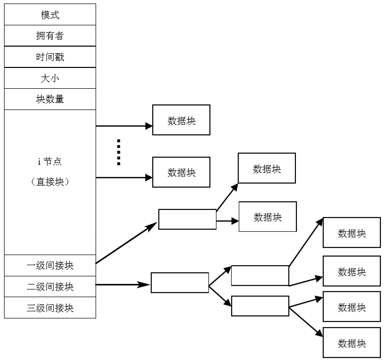

- 上图左部是文件控制块（又称i节点），其中含有文件的各种属性信息，一个打开文件的i节点放在系统内存区。与文件物理位置有关的索引信息是i节点的一个组成部分，它是有13项整数构成的数组。

对于一般文件来说，其大小多数在10块之内，可以利用直接项立即得到存放数据的盘块号，因而存取文件的速度较快；对于大于10块的较大型的文件来说，可以对10块以上的部分采用一次间接（它至多可以放256个盘块号）；如仍旧放不下，则接着采用二次间接（它至多可以放256^2^个盘块号）；对巨型文件来说，可能用到三次间接（它至多可以放256^3^个盘块号）。

这种分配策略的优点是不但具有以上多种分配策略的所有优点，而且非常灵活。但也存在着间接索引需要多次访问磁盘而影响速度的缺点。

### 2. 空闲空间管理

要合理组织磁盘空间的分配和回收，就要求文件系统掌握磁盘空间的分配情况，系统通常维持一个空闲空间表，记录所有的空闲块，即尚未分配给文件或目录的块。空闲空间表的实现方法有很多种，下面讨论几种常用的实现方法。

#### (1) 空闲表法

空闲表法属于连续分配方式，它与内存的动态分配方式相似，它为每个文件分配一块连续的存储空间。系统为外存上的所有空闲区建立一张空闲表，每个空闲区对应于一个空闲表项，其中包括表项序号、该空闲区的第一个盘块号、该区的空闲盘块数等信息，再将所有的空闲区按其起始盘块号递增的次序排列。

空闲盘区的分配与内存的动态分配类似，同样可采用首次适应算法、循环首次适应算法等。

应该说明，在内存分配上，虽然很少采用连续分配方式，然而在外存的管理中，由于它具有较高的分配速度，可减少访问磁盘的IO频率，故它在诸多分配方式中仍然占有一席之地。

#### (2) 空闲链表法

将所有空闲盘区拉成一条空闲链表，根据构成链的基本元素，可把链表分成空闲盘块链和空闲盘区链。

空闲盘块链。将磁盘上的所有空闲空间，以盘块为单位拉成一条链。当用户因创建文件而请求分配存储空间时，系统从链首开始，依次摘下适当数目的空闲盘块分配给用户；当用户因删除文件而释放存储空间时，系统将回收的盘块依次插入空闲盘块链的末尾。优点是分配和回收一个盘块的过程非常简单，缺点是为一个文件分配盘块时，可能要多次重复操作。

空闲盘区链。将磁盘上的所有空闲盘区（每个盘区可包含若干个盘块）拉成一条链。在每个盘区上除含有用于指示下一个空闲盘区的指针外，还应有能指明本盘区大小（盘块数）的信息。分配盘区的方法与内存的动态分区分配类似，通常采用首次适应算法；在回收盘区时，同样也要将回收区与相邻接的空闲盘区相合并。在采用首次适应算法时，为了提高对空闲盘区的检索速度，可以采用显式链接方法，即在内存中为空闲盘区建立一张链表。

#### (3) 位示图法

空闲空间表可由位图或位矢量的方法来实现，每一个磁盘块由1位（bit）来表示。如果该磁盘块是空闲的，这个位就置0；否则，就置1。

优点是简单，寻找空闲块或寻找n个连续的空闲块很有效，很多处理器支持一些位操作指令，可实现高速物理块的分配与回收。缺点是要把整个位图都装入内存，而对大磁盘来说，这是很耗费内存的。

#### (4) 成组链接法

空闲表法和空闲链表法都不适用于大型文件系统，因为这会使空闲表或空闲链表太长。成组链接法是将上述两种方法相结合而形成的一种空闲盘块管理方法，它兼备了上述两种方法的优点而克服了它们表太长的缺点。

设置空闲盘块号栈，用来存放当前可用的一组空闲盘块的盘块号（最多含100个号），以及栈中尚有的空闲盘块号数N，且N还兼作栈顶指针用。栈是临界资源，每次只允许一个进程去访问，故系统为栈设置了一把锁。如当N=100即栈满时，栈顶指向S.free(99)，栈底是S.free(0)。

文件区中的所有空闲盘块，被分成若干个组，例如将每100个盘块作为一组，在第一个盘块中记录该组的盘块总数N，和下一组所有的盘块号。这样由各组的第一个盘块可链成一条链。将结束端一组的S.free(0)中存放0，作为空闲盘块链的结束标志；将开始端一组的盘块总数和所有的盘块号，载入空闲盘块号栈中，作为当前可供分配的空闲盘块号。

当系统要为用户分配文件所需的盘块时，须调用盘块分配程序来完成。

1. 该程序首先检查空闲盘块号栈是否上锁，如未上锁，便从栈顶取出一空闲盘块号，将与之对应的盘块分配给用户，然后将栈顶指针下移一格。
2. 若该盘块号已是栈底，即S.free(0)，这是当前栈中最后一个可分配的盘块号，如果S.free(0)=0，则说明系统中已无可供分配的盘块。
3. 否则，在该S.free(0)中的盘块号中记有下一组可用的盘块号，须调用磁盘读过程，将栈底盘块号所对应盘块的内容读入栈中，作为新的盘块号栈的内容，并把原栈底S.free(0)对应的盘块分配出去（其中的有用数据已读入栈中）。
4. 然后，再分配一相应的缓冲区（作为该盘块的缓冲区）。最后，把栈中的空闲盘块数减1并返回。

在系统回收空闲盘块时，须调用盘块回收过程进行回收。它是将回收盘块的盘块号记入空闲盘块号栈的顶部，并执行空闲盘块数加1的操作。当栈中空闲盘块号数已达100时，表示栈已满，便将现有栈中的100个盘块号，记入新回收的盘块中，再将其盘块号作为新栈底。

## （五）文件保护

指导安全系统设计的一般原则：公开系统设计，几乎所有入侵者都知道系统的工作方式；把不可访问的属性定为缺省；检查当前文件的使用权限；每个进程赋予一个最下的可能权限；保护机制要力求简单一致、嵌入到系统的底层；保护方案简单易用。

### 1. 文件访问保护

防止系统中的文件被他人窃取、破坏，以及在共享过程中对文件进行未授权的操作。

#### (1) 口令

用户建立一个文件时即提供一个口令，系统为其建立文件控制块时附上相应口令。用户请求访问文件时必须提供相应口令，仅当口令正确才能打开文件进行访问。

这种方法简单易行，且开销不多。缺点是口令直接存在系统内，系统程序员可能得到全部口令。另外，得知文件口令的用户均具有与文件主相同的存取权限。因此要和其他方法配合使用，即系统用口令识别访问文件的用户，而用其他方法实现对文件存取权限的控制。当前多数操作系统没有提供此功能，而改由访问文件的应用程序提供口令保护。

#### (2) 加密

在文件写入时进行保密编码，读出时进行译码。这一编译工作可由系统替用户完成，但用户请求读写文件时需提供密钥，以供系统进行加密和解密。由于密钥不直接存入系统，只在用户请求读写文件时动态提供，故可防止程序员窃取或破坏他人的文件。

密码保密性很强，实现也很节省存储空间，但需要花费较长的编译时间。目前，也有直接由应用程序提供加密保护的实现方式。

#### (3) 访问控制

文件系统必须保证任意文件不能被随意访问，解决这个问题的方法就是访问控制（AccessControl），可以从文件的角度（将访问控制附在每个个体文件上）和从用户的角度（将访问控制附在用户身上）出发。

1. **访问控制表**

从文件的角度出发，每个文件上被赋予一张排序的列表，其中列出了可以访问该对象的所有域，以及如何进行访问。

在Linux操作系统中，这张表称为访问控制表ACL（access controllist）,可以把每个文件的ACL放在一个单独的磁盘块中，并在文件的i节点中包含这个磁盘块的块号。因为只存储了非空项，全部ACL所需的存储空间相对较少。利用ACL，可以禁止特定的用户或用户组访问某个对象。

访问控制表的优点是容易理解和实现，对个体用户的权限赋予与取消也容易。但缺点是每次访问一个文件都需要检索访问控制表，效率不高。

2. **访问权限表**

当今大部分高级文件系统都对文件和目录设置权限，对用户进行权限审核，以阻止非法用户的访问。文件拥有者在创建文件的时候就可以设定本人及其它用户对该文件的访问权限。这些权限信息可存放在文件目录中，拥有者可以通过操作系统提供的命令随时进行修改。

通过对文件和目录的权限设置，用户可以共享相应权限的文件数据，不仅为不同用户完成共同任务提供了基础，而且还节省了大量的磁盘空间。

在Linux中，所有的文件及目录都拥有自己的访问权限，来限制用户的访问。每个文件及目录都有三个级别的权限：所有者级别（u），组访问级别（g），其它用户访问级别（o）。每个级别都有三个权限：读（r），写（w），执行（x）。

### 2. 文件备份

为了增强系统存储文件的可靠性，保证文件数据可用，一般简单的方法是给重要文件以多个副本。两种形成文件副本：批量复制，即定时的进行文件备份；另一种是同步备份，就是在生成或写文件的同时备份该文件。

#### (1) 批量备份

批量备份又叫做批量转储，是将一批文件复制到后备存储器中。

全量转储。把文件存储器中的全部文件定期复制到后备存储器中。当系统出现故障或文件遭到破坏时，便可把最后一次转储内容从后备存储器复制回系统以恢复正常运行。这种方法浪费时机，在转储过程中要求停止使用任何文件。

增量转储。每隔一段时间便把上次转储以来改变过的文件和新文件用后备存储器转储。关键性的文件也可以再次转储。这能克服全量转储开销大的缺点，如果文件都是独立的，这种方法很实用，但如果文件之间有关联，用增量转储的方法对确保文件系统中各相关文件一致性有一定难度，使用转储文件恢复到系统某一点的文件系统状态有一定困难。如何较快的保证快速转储并且实现转储的原子性都是值得研究的课题。

文件转储方法不但可以保护文件，而且当系统出现病毒或人为数据破坏时，可用该办法恢复系统。全量和增量转储都可以由专门的实用程序来实现，不一定要操作系统内核程序支持。

#### (2) 同步备份

上述两种文件转储方法在上一备份时刻后生成或写过的文件不可能被恢复，为了防止因磁盘介质的损坏而引起文件破坏，可以采用同步备份的方法。

镜像盘支持。系统拥有一份完全相同的镜像盘，在对磁盘写操作的同时，对称地写其镜像盘，确保一个存储介质损坏时，另一个介质数据能用。

双机动态文件备份。镜像盘只能解决存储介质损坏问题，对计算机死机引起的文件系统破坏，它无能为力。双机动态文件备份是指有两台计算机进行文件写操作时完全对称地工作，保证一台机器出错时，另一台机器还可以接着往下工作。双机动态备份，加上双份盘就可以防止来自处理机和存储介质两方面损坏对文件系统引起的破坏。

当今的大型文件系统，例如NTFS，主要采用两个措施来进行安全性保护：一是对文件和目录的权限设置，二是对文件和目录进行加密。

## （六）文件系统性能改善

访问磁盘要比访问内存慢得多，在内存中读取一个字往往只需要几十ns，而从硬盘上读取一个块则需要50多ms，此外还需要加上10到20ms的寻道时间，然后再等待要读取的扇区移到读写头下面。磁盘由于自身结构的限制，其访问速度的提升是有限的。因此，许多文件系统在设计时都尽量减少磁盘的访问次数，采用合适的缓存、调度和提前读取的方法。

### 1. 文件缓存

减少磁盘访问次数最常用的技术是块高速缓存（block cache或者buffer cache）。在这里，文件缓存是一些盘块，它们逻辑上属于磁盘，但基于性能的考虑而保存在内存中。

管理文件缓存的一个常用算法是：检查所有的读请求，看看所需的块是否在文件缓存中。如果在，无须访问磁盘便可进行读操作。如果块不在文件缓存中，首先要把它读到文件缓存，再拷贝到所需的地方。之后，对该块的读写请求都通过文件缓存完成。

如果文件缓存已满，此时要调入新的块，需要把原来的某一块调出文件缓存。如果要调出的块自上次调入以后作过修改，则需要把它写回磁盘。这种情况与分页非常相似，因此，所有的分页算法，例如FIFO算法、LRU算法等等都适用于文件缓存。

分页和文件缓存的不同之处在于，文件缓存引用相对要少，因此我们可以把所有块按精确的LRU顺序用链表链接起来。这种方式需要由文件系统自己负责管理，即文件系统需要决定什么数据需要缓存，什么数据需要更换等。这样自然导致文件系统将变得复杂，但可以确保需要的数据总是存放在缓存里。

### 2. 提前读取

提前读取就是在每次访问磁盘时，多读出一些数据来。因为按照局部性原理，用户刚刚访问过不久的数据可能会再次访问。由于磁盘访问的瓶颈是寻道和旋转延迟，而数据传输对其来说所占消耗量很小，所以提前读取的代价几乎为零。

当然，提前读只在用户对数据是顺序访问或者准顺序访问时效果才好，对于完全随机的访问效果不太显著。

### 3. 减少磁臂移动

在使用i节点或者与i节点等价结构的系统中，另一个性能瓶颈在于，即使读取一个很短的文件也要访问两次磁盘：一次是读取i节点，另次是读取文件块。通常情况下，所有i节点都放置靠近磁盘开始位置，因此i节点和相应块之间的平均距离是柱面总数的一半，这需要很长的寻道延迟。一个简单的改进方法是把i节点放在磁盘中部。

另一种想法是：把磁盘分成多个柱面组，每个柱面组有自己的i节点、数据块和空闲表。在创建文件时，可以选取任一个i节点，分配块时，在该i节点所在的柱面组上进行查找。如果该柱面组中没有空闲的数据块，就查找与之相邻的柱面组。这样i节点和数据块就放在一起，读取数据时不需要寻道，大大提高读取数据的速度。

# 五、文件操作

### 1. 文件IO概述

在Linux编程如果要访问文件进行IO操作，可以有两种方式。一种是操作系统提供的系统调用的IO接口，它遵循了POSIX（Portable Operating System Interface）标准，它也是所有类Unix系统都遵循的标准，他为操作系统提供了源代码级别的C语言API。另一种方式是标准C（ANSI C，America National Standards Institute C）的库函数，它提供了一系列对文件操作的函数，这些库都是跨平台的，不仅可以在Linux上使用，还可以在Windows等其他操作系统上使用。

### 2. Linux文件及操作

Linux操作系统支持的文件类型有：普通文件、目录、链接（符号链接、硬连接），字符设备（键盘）、块设备（硬盘）、socket（套接字）、管道（无名管道、有名管道）等。Linux中一切皆文件。

Linux系统在访问文件时，可以使用非缓冲文件操作，也可以使用缓冲文件操作。

- 非缓冲文件操作，如使用系统调用IO函数，它是一种低级文件操作，直接将磁盘文件读入到用户程序的缓冲区或者从用户程序的缓冲区直接写入到磁盘文件。值得注意的是，每次系统调用需要进行用户态到内核态的转换，应考虑效率问题。
- 缓冲文件操作，如使用ANSI标准C的库函数，它是一种高级文件操作，在用户程序和磁盘文件之间增加了输入输出缓冲区。 这种方式可以将多次的系统调用合并成一次系统调用，效率更高，而且可移植性也更好。

## （一）ANSI C文件IO管理

### 1. 相关知识

#### (1) 文件流

文件流是在文件描述符的基础上做的一个封装，它在用户空间，即结构体`FILE`。示例结构如下。

```c
typedef struct _IO_FILE FILE;
struct _IO_FILE {
    int flags;
    char* _IO_read_ptr;		/* Current read pointer. */
    char* _IO_read_end;		/* End of get area. */
    char* _IO_read_base;	/* Start of putback + get area. */
    char* _IO_write_ptr;	/* Current put pointer. */
    char* _IO_write_base;	/* Start of put area. */
    // elses...
    int _fileno;	// 关联的文件描述符
}
```

当运行一个程序的时候，系统默认的为每个进程打开三个文件：标准输入流`stdin`（默认键盘）、标准输出流`stdout`（默认显示器）、标准错误输出流`stderr`（默认显示器），它们是文件流的指针，即`FILE*`。

#### (2) 缓冲区

文件流的主要功能就是缓冲（提供缓冲区）和格式化（按照指定的格式去读写文件）。

缓冲区的类型有三种：全缓冲区（block buffered），通常所有文件（如用`fopen`打开的）采用全缓冲；行缓冲区（line buffered），指向终端的文件流如stdout采用行缓冲；不带缓冲区（unbuffered），如标准错误输出stderr采用不带缓冲的方式。

全缓冲区执行一次系统调用（进行磁盘读写）的时机为：当缓冲区数据量达到某个限制`BUFSIZ`时（不同平台有不同差异，通常为4KB或8KB）；主动要求刷新缓冲区时（如调用`fclose`或`fflush`）。

行缓冲区执行一次系统调用（如向终端写）的时机为：当数据量达到某个限制（128B或1024B）时；遇到换行（如`\n`）时；主动要求刷新缓冲区时（如调用`fclose`或`fflush`）。

不带缓冲区便实时显示信息，例如标准的错误输出`fprintf(stderr,...)`。

### 2. IO操作

#### (1) 操作文件流

```c
FILE* fopen(const char* path, const char* mode);
```

- 打开文件，返回一个文件流指针。

```c
int fclose(FILE* fp);
```

- 关闭文件流。

```c
int fflush(FILE* stream);
```

- 刷新文件流，更新缓冲区内容。

```c
int feof(FILE* stream);
```

- 如果流的读写位置已经在文件尾部，返回非0值。

```c
int ferror(FILE* stream);
```

- 如果读写出错，返回非0值。

```c
void clearerr(FILE* stream);
```

- 清除之前出现的错误。

#### (2) 文件流定位

```c
long ftell(FILE* stream);
```

- 返回当前读写位置距离文件开头的字节数。

```c
int fseek(FILE* stream, long offset, int whence);
```

- 将当前读写位置修改为，从whence基准加上偏移量offset的位置。
- 基准有三个宏：`SEEK_SET`表示文件头，`SEEK_END`表示文件尾，`SEEK_CURRETN`表示当前位置。

```c
void rewind(FILE* stream);
```

- 重置当前读写位置到文件开始位置。

#### (3) 字符读写

```c
/* 读 */
int fgetc(FILE* stream);	// 从流中读取下个字符，作为一个unsigned char返回，或返回EOF
int getc(FILE* stream);		// macro
int getchar(void);			// 从标准输入流中读取一个字符，等同于 getc(stdin)
/* 写 */
int fputc(int c, FILE* stream);
int putc(int c, FILE* stream);
int putchar(int c);			// 将c字符写入到标准的输出流，等同于 putc(c, stdout)
```

#### (4) 按行读写文件

```c
char* fgets(char* s, int size, FILE* stream);
```

- 从stream流中读取最多size个字符，存储到用s指定的地址中。
- 在读到`EOF`后或newline（新行）后时停止读。
- 在所读的字符串最后会自动加上一个表示null的字节（`\0`）。

```c
char* gets(char* c);
```

- 从标准输入流读取一行，直至读到newline或EOF，将它们替换null字节（`\0`）。

```c
int fputs(const char* s, FILE* stream);
```

- 写一个字符串到输出流，没有最后的空字节（`\0`），不追加换行符。

```c
int puts(const char* s);
```

- 将一行字符串写入到标准输出流中，追加换行符（newline）。

#### (5) 按块读写文件

```c
size_t fread(void* ptr, size_t size, size_t nmemb, FILE* stream);
size_t fwrite(void* ptr, size_t size, size_t nmemb, FILE* stream);
```

- ptr，所要写出到流的内存空间，或要从流写入的内存空间。
- size，要读写的每块的数据大小，以字节为单位，通常为结构体，用`sizeof()`来获取。
- nmemb，所要读取的固定大小的内存块的个数。
- stream，指定要进行读写操作的流。
- 返回值是真正读写块的个数（对象个数，而不是字节数）。

## （二）POSIX文件及目录管理

### 1. 文件描述符

#### (1) 是什么

每个进程有过一个进程控制块PCB，它是`task_struct`结构，其成员中有一个`files`指针；files指针指向当前进程打开的所有文件的信息，它是一个结构体`struct files_struct* files`，在这个结构当中有一个`struct file* fd_array`数组，它的每一个元素存放的是一个地址；这个地址指向一个对应的具体打开的文件信息，它是一个`struct file`结构，其中包含文件读写位置、打开方式mode、操作指针、文件所在目录项等信息。

而文件描述法就是fd_array数组的索引，操作系统根据文件描述符（即索引）找到数组中的元素，这个元素就是一个地址指针，然后再根据这个指针就可以找到要访问文件的信息。

之前所说的，系统默认为每个进程打开的三个文件，对应的文件描述符及其宏分别是：`STDIN_FILENO`值为`0`表示标准输入，`STDOUT_FILENO`值为`1`表示标准输出，`STDERR_FILENO`值为`2`表示标准错误输出。它们是顺序地存放在fd_array数组中的前三个元素的索引。

#### (2) 文件描述符与文件流的转换

```c
int fileno(FILE* stream);
```

- 从文件流中取出文件描述符，即返回FILE结构的_fileno成员。

```c
FILE* fdopen(int fd, const char* mode);
```

- 实现某个流与一个存在文件描述符相接，指定的模式mode（如`r`、`w+`等）必须兼容文件描述符所对应的文件。

### 2. 文件IO管理

POSIX标准下的系统调用，所有的Unix及类Unix操作系统都遵循这个标准。

#### (1) 文件操作

```c
int open(const char* pathname, int flags, mode_t mode);
```

- 返回一个文件描述符。
- flags，打开文件的方式，常见的有：`O_READONLY`只读方式，`O_WRITEONLY`只写方式，`O_RDWR`读写方式，`O_APPEND`追加方式，`O_CREAT`如果文件不存在则创建。
- mode，文件权限，新创建一个文件的真正权限是`mode&~umask`。

```c
int close(int _fd);
```

- 关闭一个文件。

```c
int create(const char* pathname, mode_t mode);
```

- 创建一个文件。

- 默认新创建的文件的权限为`mode & ~umask & 0666`。

#### (2) 读写文件内容

```c
ssize_t read(int fd, void* buf, size_t count);
```

- 尝试从文件描述符`fd`对应的文件中读取`count`字节数据到`buf`所指的内存空间中。
- 返回的是读取的字节数。

```c
ssize_t write(int fd, const void* buf, size_t count);
```

- 将`buf`所指内存空间中的`count`个字节的数据写入到文件描述符`fd`所对应的文件中。
- 返回的是写入的字节数。

### 2. 目录文件管理

在Linux平台（及其他类Unix平台）下，目录也是一种特殊类型的文件，即目录文件，它的结构不是FILE，而是DIR，如下。

```c
struct dirent {
    long d_ino;		// inode number
    off_t d_off;	// the distance from the start of the directory to this dirent
    unsigned short d_reclen;	// length of this d_name
    char d_name[NAME_MAX + 1];	// filename (null-terminated)
}
```

操作系统提供了一组专门的库函数来进行目录操作。

#### (1) 目录操作

```c
DIR* opendir(const char* name);
```

- 打开一个目录文件，返回的是目录流指针。

```c
int closedir(DIR* dirp);
```

- 关闭目录流。

```c
struct dirent* readdir(DIR* dirp);
```

- 读取一个目录实体的信息，返回指向struct dirent的指针。
- 这个结构是静态分配的，不要尝试释放free它的内存。

```c
int mkdir(const char* pathname, mode_t mode);
```

- 尝试创建一个名为`pathname`的目录。
- 默认新创建的目录的权限为`mode & ~umask &0777`。

```c
int rmdir(const char* pathname);
```

- 删除一个目录，改目录必须为空。

#### (2) 定位目录位置

```c
long telldir(DIR* dirp);
```

- 返回目录流dirp中的当前位置。

```c
void seekdir(DIR* dirp, long loc);
```

- 在目录流drip中设置当前目录的位置，下一次readdir()函数调用会返回该位置。

```c
void rewinddir(DIR* drip);
```

- 重置目录流drip的当前位置为目录的开始位置。

#### (3) 操作当前工作路径

```c
char* getcwd(char* buf, size_t size);
```

- 将当前工作路径的绝对路径拷贝到`buf`中，size指定缓冲区buf的长度（字节数）。

- 如果传入的buf是`NULL`，系统会自动分配一个空间，并作为返回值返回，这时需要程序手动释放free这块内存空间。

```c
int chdir(const char* path);
int fchdir(int fd);
```

- 修改当前进程的当前工作路径，两个函数功能相同，区别在于一个传入字符串，一个传入文件描述符。

# 六、设备管理

## （一）设备管理概述

### 1. 设备管理的目标

1、**实现数据传输与交换**

根据一定的算法选择和分配输入输出设备，以便进行数据传输，并且能够控制I/O设备和CPU（或内存）之间进行数据交换。

2、**提高效率**

尽量提高CPU和外设之间以及外设与外设之间的并行度，均衡系统中各设备的负载，最大限度地发挥所有设备的潜力，以使操作系统获得最佳效率。为此多采用通道与缓冲技术。

3、**提供接口**

把用户程序和设备的硬件特性分开，编写程序时不必涉及具体使用的物理设备，使用逻辑设备名，具体的转换由操作系统通过相应的逻辑设备表实现虚实对应，且用户应用程序的运行也不依赖于特定的物理设备，而由系统进行合理地分配。

4、**统一管理**

不同设备有着不同的特性和操作方法，必须将设备的具体特性和处理它们的程序分开，这样就可以使某一类或几类设备共用一个设备处理程序，实现对复杂外设的统一管理。

### 2. IO管理功能

1、**实现设备并行性和缓冲区的有效管理**

这除了需要控制状态寄存器、数据缓冲寄存器等寄存器之外，对应不同的IO控制方式，还需要有存储器、直接存储器存取控制器（Directed Memory Access，简称DMA）、通道等硬件设备。

当进程得到由设备分配程序分配的设备、控制器和通道（或DMA）等硬件之后，通道（或DMA）将自动完成设备和内存之间的数据传送工作，从而完成并行操作的任务。若没有通道（或DMA），则由中断技术来完成并行操作。

此外还可以通过虚拟技术将一台独占设备变换为若干台逻辑设备，供若干用户（进程）同时使用。

对于缓冲区的管理是为了解决低速的外设和高速的CPU或内存之间的速度不匹配问题，另一方面它也提高了并行性。系统中一般设有缓冲区（器）来暂存数据，由设备管理程序负责进行缓冲区的分配、释放等有关工作。

2、**提供与进程管理系统的接口**

当进程申请设备时，该接口将进程的请求转送给设备管理程序。

3、**进行设备分配**

按照设备的类型和系统中所采用的分配算法，把设备和其它有关控制器、通道等硬件分配给请求该设备的进程。如果一个进程没有分配到它所需要的有关设备，那么它就进入相应设备的等待队列。在多用户进程中，系统必须决定进程何时取得，使用多长时间，使用完后如何回收这些资源等问题。

4、**监视设备状态**

外设、控制器以及通道等，在运行期间处于不同状态。设备状态信息保留在设备控制表（Device Control Table，DCT）中，DCT能动态地记录设备状态的变化及有关信息。这样在进行设备统一管理时，可根据DCT等其它数据结构进行有效合理地调度和使用众多设备。

5、**实现设备独立性**

维护逻辑设备和物理设备之间的转换，用户基于逻辑设备编写的应用程序独立于具体使用的物理设备，以此实现设备独立性，即当使用的物理设备更换时，应用程序不必改变，从而提高系统的扩展性。

### 3. 应用接口

所谓IO应用接口，是指操作系统提供的一种接口与技术，使用户程序能够以标准的、一致的方式对待各种不同类型的I/O设备。

可以将各种IO设备抽象成一些通用的类型，每种类型的IO设备通过一组通用的接口进行访问。同一类型的不同IO设备间的差异被封装在设备驱动程序中，设备驱动程序负责隐藏设备间的差异，从而向上提供通用接口。

使IO子系统独立于硬件的方式可以简化操作系统的设计，同时也给硬件生产厂商带来便利。但是不同操作系统的驱动程序接口标准并不相同，所以同一硬件产品在不同平台上的发布，往往需要提供相应的驱动程序。

IO设备的特性可以被抽象为以下方面：

- 字符设备或块设备
- 顺序存取或随机存取
- 同步或异步
- 共享或独占
- 可读写、只读或只写

## （二）IO系统硬件组成

### 1. IO设备分类

#### (1) 按传输速率

例如键盘、鼠标等属低速设备（以字节Byte为单位），针式打印机、激光打印机等属中速设备（以千字节KB为单位），磁盘、磁带等属高速设备（以兆字节MB为单位）。当然随着技术的进步，各种设备的分类范畴越来越大，但总体上按速度都能分为三类。

#### (2) 按设备的共享属性

- 独占设备。指不能共享的设备，即在一段时间内只允许一个用户（进程）访问的设备。这样对并发进程而言，就应该互斥地访问这类设备。系统一旦把这类设备分配给某个进程后，便由该进程独占，直至用完释放。如打印机、纸带、读入机就属于独占设备。
- 共享设备。指在一段时间内允许若干个进程同时使用的设备。当然这种同时使用是宏观上的，对于每一时刻而言，该类设备仍然是只允许一个进程访问。由此可知，共享设备必须是可寻址和可随机访问的设备，磁盘就是典型的共享设备。设备共享可获得较高的设备利用率。
- 虚拟设备。通过虚拟技术把一台独占设备变换为可由多个用户（进程）共享的若干台逻辑设备。这种通过虚拟技术改造后的设备就是虚拟设备。这种设备并非物理地变成了共享设备，而是用户使用它们时“感觉”是共享设备，不再像独占设备了。因此虚拟设备属于可共享设备。

当然对设备分类不只上述两种，还可以从其它角度出发对设备进行分类。例如，按设备的所属关系可分为系统设备和用户设备等等。

在Linux中将IO设备分为块设备、字符设备、网络设备三种，主要是为了控制不同的IO设备的驱动程序和其它软件成分，便于将抽象的控制部分留给文件系统处理，而设备直接相关的部分由设备驱动程序解决。

### 2. 设备控制器

通常，设备并不是直接与CPU进行通信，而是与设备控制器通信。设备控制器是CPU与IO设备之间的接口，它接收从CPU发来的命令，并去控制IO设备工作，使处理机CPU不必进行繁杂的设备控制事务。设备控制器是一个可编址设备，当它仅控制一个设备时，只有一个惟一的设备地址；若连接多个设备时，则就具有多个设备地址，使每一个地址对应一个设备。操作系统一般不直接与设备打交道，而是把指令直接发到设备控制器中。

设备控制器是IO设备中的电子部件，在个人计算机中它常常是一块可以插入主板扩展槽的印刷电路板，也称接口卡，或者集成到主板上。

为了实现设备的通用性和互换性，控制器和设备之间应采用标准接口，如SCSI（小型计算机系统接口）或IDE（集成设备电子器件）接口。设备控制器上一般都有一个接线器，可以通过电缆和标准接口相联接，它可以控制2个、4个或8个同类设备。对于个人计算机PC和小型计算机系统来说，由于它们的IO系统比较简单，所以CPU与控制器之间的通信采用单总线模型，而大型主机则采用通道模型。

#### (1) 控制器的功能

- 接收和识别命令。接收并识别从CPU发送来的多种命令。为此，在控制器中应设置相应的*控制寄存器*，用来存放接收的命令和参数，并对所接收的命令进行译码。
- 实现CPU与控制器、控制器与设备间的数据交换。为此，在控制器中需要设置*数据寄存器*。
- 随时让CPU了解设备的状态，例如发送就绪状态等。为此，在控制器中应设置一个*状态寄存器*，用其中的每一位来反映设备的某一种状态。
- 识别设备地址。系统中的每一个设备都有一个地址，为使CPU能向（或从）寄存器中写入（或读出）数据，这些寄存器应具有惟一地址。设备控制器必须能够识别它所控制的每个设备的地址，为此，在设备控制器中应设置*地址译码器*。

#### (2) 控制器的组成

设备控制器处于CPU和设备之间，它既要与CPU通信，又要与设备通信，应具有按照CPU所发来的命令去控制设备操作的功能。因此大多数的设备控制器由以下三部分组成：

- 设备控制器与CPU的接口。该接口用于实现设备控制器与CPU之间的通信，其中有三类信号线：数据线、地址线、控制线。数据线通常与两类寄存器相连接：
  - 数据寄存器。设备控制器中可以有一个或多个数据寄存器，用于存放从设备送来的数据（输入）或从CPU送来的数据（输出）。
  - 控制、状态寄存器。在控制器中同样可以有一个或多个控制、状态寄存器，用于存放从CPU送来的控制信息或由设备产生的状态信息。
- 设备控制器与设备的接口。在一个设备控制器上可以连接一台或多台设备。相应地，在控制器中就有一个或多个设备接口，一个接口连接一台设备，在每个接口中都有数据、控制、状态三种类型的信号：
  - 数据信号。这些数据信号通常是一些比特（bit）流，控制器的任务是把CPU送来的字节流转换成相应的比特流传递给设备，或者把从设备来的比特流转换成字节流送给CPU。
  - 控制信号。它通常是输出信号，是控制器发给设备的，用于指示设备执行读、写或者其它操作（移动磁头）的信号。
  - 状态信号。它通常是输入信号，用于指示设备的当前状态。如指示设备正在进行读、写操作，或者指示设备已经完成读、写操作，并准备好接受下一次的数据传输。
- IO逻辑。它用于对IO的控制，通过一组控制线与CPU交互。每当CPU要启动一个设备时，要将命令（通过控制线）和地址（通过地址线）送给设控制器（的IO逻辑），由控制器的IO逻辑对收到的地址进行译码，再根据译出的命令对所选的设备进行控制。

关于设备控制器的组成如下图。

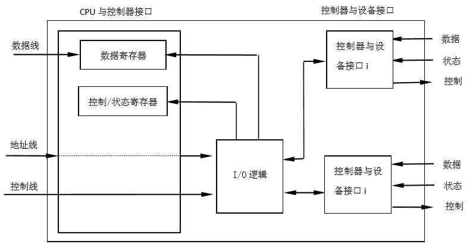

### 3. IO通道

当主机配置的外设很多时，仅有设备控制器是远远不够的，CPU的负担依然很重，于是在CPU和设备控制器之间又增设了通道，这样可使一些原来由CPU处理的IO任务转由通道来承担，从而把CPU从繁杂的IO任务中解脱出来。

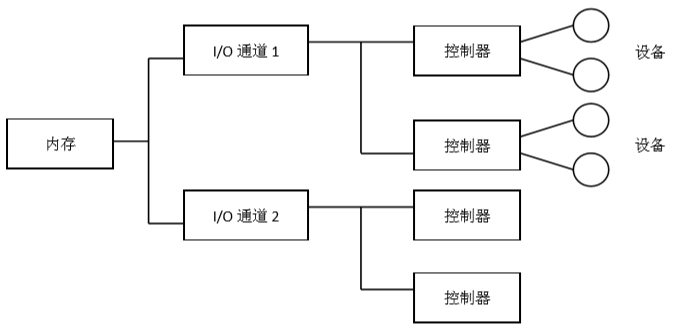

#### (1) 通道及通道与CPU间的通信

通道又称IO处理机，是一个独立于CPU的专管输入输出控制的处理机（协处理器），它控制设备与内存直接进行数据交换。通道具有执行IO指令的能力，并通过执行通道（IO）程序来控制IO操作。

IO通道与一般的处理机不同之处在于：其指令类型单一，由于通道硬件较简单，执行的指令只是与IO操作有关的指令；通道没有自己的内存，它所执行的通道程序存放在主机中的内存中，即通道与CPU共享内存。

CPU与通道之间的关系是主从关系，采用通道方式实现数据传输的过程如下：

当运行的程序要求传输数据时，CPU向通道发IO指令，命令通道开始工作，CPU就可以进行其它数据处理；通道接收到CPU的IO指令后，从内存中取出相应的通道程序，通过执行通道程序完成IO操作；当IO操作完成（或出错）时，通道以中断方式中断CPU正在执行的程序，请求CPU的处理。

由上可知，引入通道技术后，可以实现CPU与通道的并行操作。另外，通道之间以及通道上的外设也都能实现并行操作，从而提高系统效率。

#### (2) 通道类型

通道是用于控制外围设备的，但由于外设种类繁多，各自的速率相差很大，因而使得通道也有各种类型，按信息交换方式可分为以下三种类型：

1、**字节多路通道**

它含有多个非分配型子通道，每个子通道连接一台IO设备，这些子通道以**字节**为单位按时间片轮转方式共享主通道。

每次子通道控制外设交换完一个字节后，便立即让出字节多路通道，以便让另一个子通道使用，当所有子通道轮转一周后，就又返回来由第一个子通道去使用字节多路通道。

由于它的传送是以字节为单位进行的，要频繁进行通道的切换，因此输入输出效率不高。它多用来连接低速或中速设备，如打印机等。

2、**数组选择通道**

它按成组方式进行数据传送，每次以**块**为单位传送一批数据，所以传输速度很快，主要用于连接高速外围设备，如磁盘等。

但由于它只含一个分配型子通道，在一段时间内只能执行一个通道程序，控制一台设备进行数据传送，致使当某台设备占用了该通道后，便一直独占，直至它传送完毕释放该通道，其它设备才可使用。可见，这种通道利用率低。

3、**数组多路通道**

数组多路通道含有多个非分配型子通道，可连接多种高速外围设备，以成组方式进行数据传送，多个通道程序、多种高速外围设备并行操作。这种通道主要用来连接中、高速设备，如磁带等。

数组多路通道先为某一台设备执行一条通道命令，传送一批数据，然后自动地转换为另一台设备执行一条通道命令。由于它在任何一个时刻只能为一台设备服务，这类似于选择通道，但它不等整个通道程序执行结束就为另一台设备的通道程序执行指令，这又类似于字节多路通道的分时功能。

在本质上，数组多路通道相当于通道程序的多道程序设计技术的硬件实现。如果所有的通道程序都只有一条命令，那么数组多路通道就相当于数组选择通道。

### 4. 总线系统

计算机系统中的各部件，如CPU、存储器以及各种IO设备之间的联系，都是通过总线来实现的。总线的性能是用总线的时钟频率、带宽、相应的总线传输速率等指标来衡量的。

随着总线技术的不断发展，由早期的ISA总线发展为EISA总线、VESA总线，进而演变成当前广为流行的PCI总线。

## （三）IO系统软件组成

### 1. IO软件的设计目标和原则

设计目标是将软件组织成一种层次结构，底层的软件用来屏蔽I/O硬件的细节，从而实现上层的设备无关性；高层软件则主要为用户提供一个统一、规范、方便的接口。

为此，操作系统把IO软件组织分成以下层次：中断处理程序、设备驱动程序、与设备无关的IO软件、用户层的IO软件。


当用户程序从文件中读一个数据块时，需要通过操作系统来执行此操作。设备无关软件首先在数据块缓冲区中查找此数据块。若未找到，则调用设备驱动程序向硬件提出相应的请求。用户进程随即阻塞，直至数据块读出。当磁盘操作结束时，硬件发出一个中断，它将激活中断处理程序。中断处理程序则从设备获得返回状态值，并唤醒被阻塞的用户进程来结束此次I/O请求，随后用户进程将继续进行。

下面对这四个层次自底向上进行分别讨论。

### 2. 中断处理程序

在**设备控制器**的控制下，IO设备完成了IO操作后，控制器便向CPU发出一个中断请求，CPU响应后便转向中断处理程序。无论是哪种IO设备，其中断处理程序的处理过程大体相同，详见《计算机组成原理》，这里只做简单说明。

1. 如果有来自于中断源的中断请求，并且CPU允许中断，则CPU响应中断的条件满足；否则中断处理无法进行。
2. CPU响应中断后立即关中断，使其不能再次响应其它中断。
3. 保存被中断进程的CPU环境，即将当前处理的状态字PSW、程序计数器PC等的内容保存在中断保留区（栈）中，对被中断进程的CPU现场（包含所有的CPU寄存器，如段寄存器，通用寄存器等）进行保留，也将它们压入中断栈中。
4. 分析中断原因，由处理器对各个中断源进行测试，识别中断类型（磁盘中断，还是时钟中断）和中断的设备号（如哪个磁盘引起的中断），处理优先级最高的中断源发出的中断请求，并发送一个应答信号给发中断请求信号的进程，使之消除该中断请求信号，然后将该中断处理程序的入口地址装入到程序计数器中，使处理机转向中断处理程序。
5. 执行中断处理程序，不同的设备处理程序不同。中断处理程序首先从设备控制器中读出设备状态看是否正常完成。如果正常完成，则驱动程序便可做结束处理；如果是还有数据要传送，则继续进行传送；如果是异常结束，则根据发生异常的原因进行相应的处理。
6. 中断处理完成后，恢复被中断进程的CPU现场，将保存在中断栈中的被中断进程的现场信息取出，并装入到相应的寄存器中。
7. 开中断，CPU继续执行。IO操作完成后，驱动程序必须检查本次IO操作中是否发生了错误，以便向上层软件报告，最终是向调用者报告本次执行情况。

### 3. 设备驱动程序

设备驱动程序是指驱动物理设备和DMA控制器或IO控制等直接进行IO操作的子程序集合，它是针对**设备控制器**编程的，不同类型的设备应有不同的设备驱动程序。

设备驱动程序主要负责：在启动指定设备之前，检验设备是否处于忙的状态等。之后发送启动命令，来启动指定设备，即负责设置与相关设备有关的寄存器的值，启动设备进行IO操作，指定操作的类型和数据流向等。

系统到底完成用户的IO请求的具体处理过程是：用户进程发出IO请求、系统接受这个IO请求、设备驱动程序具体完成IO操作、IO完成后用户进程重新开始执行。

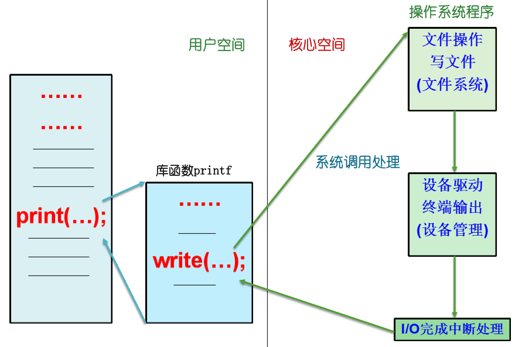

下面简要概述一下此过程，其中重点叙述设备驱动程序的处理过程。

1. 用户进程发出IO请求。例如，C程序标准的IO库函数scanf、printf等，用户程序和相应的库函数连在一起，装入内存进行运行。这些库函数的源代码中要使用系统调用（包括IO系统调用），通过系统调用进入操作系统。由操作系统接受用户IO请求，提供相应的服务。

2. 执行到与IO请求相对应的系统调用后，转去执行操作系统的核心程序，此时进程的状态由用户态转到核心态。

   - Linux系统把设备作为特殊的文件，对设备的访问变成对文件的访问，包括打开文件、关闭文件、读文件、写文件等，核心程序执行有关文件操作代码。系统分配相应的缓冲区，将输出数据送入缓冲区，同时系统根据内部预先设置的表格，将对文件的操作转为对相应设备驱动程序的调用，实现符号设备名映像到相应的驱动程序。

3. 设备驱动程序是控制设备动作（如设备的打开、关闭、读、写等）的核心模块，用来控制设备上数据的传输。

   - 一般来说，设备驱动程序接受来自上层与设备无关软件的抽象请求，并执行该请求。如果请求到来时驱动程序是空闲的，那么它就立即执行该请求；否则，若它正忙于处理前面的请求，就把新请求放入未完成请求队列中，并尽快予以处理。它的处理过程如下：

   1. 将抽象要求转换为具体要求。例如将盘块号转换为磁盘的盘面号、扇区号、磁道号。
      - 这一转换工作只能由相应的磁盘驱动程序来完成，因为在操作系统中只有驱动程序才能同时了解抽象要求和设备寄存器中的情况；才能知道命令、数据、参数应分别送往哪个寄存器。
   2. 检查IO请求的合法性。如果某设备不支持这次IO请求，则认为它是非法的。如输入输出设备在某一时刻只能进行某一IO操作。
   3. 检查设备状态，发送启动命令，同时传送必要的参数。
      - 只有当所有设备处于空闲状态时，才能启动相应的设备控制器，否则应等待，因此必须先从设备控制器的状态寄存器中读出该设备的状态，进行判断。
      - 然后传送必要的参数，如磁盘进行读写要将本次传送的字节数、数据应到达的内存始址送入控制器的相应寄存器中；向控制器发出启动命令，并把它写入相应的设备寄存器中。
   4. 启动IO设备。完成上述各项准备工作，驱动程序便向控制器中的命令寄存器传送相应的控制命令，启动IO设备。
      - 多数情况下，控制命令发出后，驱动程序需要等待控制器完成一些操作，从而使驱动程序阻塞，直至中断时方可被唤醒，也可能速度很快的操作不需要等待，没有延迟就可以完成，不必进入阻塞。
      - 操作必须进行错误检查，如果一切正常，则驱动程序就把数据传给上层与设备无关的软件，最后向它的调用者返回一些关于错误报告的状态信息。
      - 如果在等待队列中还有其它请求，就从中选出一个，启动它执行；否则该驱动程序被封锁，等待下一请求的到来。

4. IO完成后，由通道（或设备）产生中断信号。CPU接到中断请求后，如果条件符合（中断优先级高于运行程序的优先级），则响应中断，然后转去执行相应的中断处理程序，唤醒因等待IO完成而睡眠的进程，调度用户进程继续运行。

综上所述，设备驱动程序有如下功能：

- 可将接收到的抽象要求转换为具体要求。
- 接受用户的IO请求。设备驱动程序将用户的IO请求排在请求队列的队尾，检查IO请求的合法性，了解IO设备的状态，传递有关参数等。
- 取出请求队列中队首请求，将相应设备分配给它。然后启动该设备工作，完成指定的IO操作。
- 处理来自设备的中断，及时响应由控制器或通道发来的中断请求，并根据其中断类型调用相应的中断程序进行处理。

### 4. 设备无关性软件

设备无关性软件又称设备独立性软件。

#### (1) 设备无关性的概念

系统按照某种原则为每台设备分配一个惟一的号码，用作控制器识别设备的代号，称作设备的绝对号（物理设备名），就如同内存中每一个单元都有一个地址一样。设备无关性的含义是：用户编写的应用程序独立于具体使用的物理设备，即使设备更换了，应用程序也不用改变。

为此，操作系统为每类设备规定了一个编号，即设备的类型号（逻辑设备名）。逻辑设备是实际物理设备属性的抽象，并不局限于某个具体设备，它跟哪一个具体的物理设备相对应，这要由系统根据当时的设备情况来决定或由用户指定。

在应用程序中使用逻辑设备名来请求使用某类设备，而系统在实际执行时，使用物理设备名。系统必须具有将逻辑设备名转换成物理设备名的功能，这类似于存储器管理中所介绍的逻辑地址和物理地址的概念，在应用程序中，所使用的是逻辑地址，而系统在分配和使用内存时，必须使用物理地址。

引入设备无关性这一概念，使得用户程序可使用逻辑设备名，而不必使用物理设备名，这有以下优点：

- 使得设备分配更加灵活。当多用户多进程请求分配设备时，系统可根据设备当时的忙闲情况合理调整逻辑设备名与物理设备名之间的对应情况，以保证设备的独立性。
- 可以实现IO重定向。即可以更换IO操作的设备而不必改变应用程序。

#### (2) 与设备无关的软件

设备驱动程序是一个与硬件（或设备）紧密相关的软件，为了实现设备独立性，就必须在驱动程序之上设置一层与设备无关的软件。它提供适用于所有设备的常用IO功能，并向用户层软件提供一个一致的接口，其主要功能如下：

- 向用户层软件提供统一接口。无论哪种设备，它们向用户所提供的接口相同。例如对各种设备的读写操作，在应用程序中都用read/write。
- 设备命名。设备无关程序负责将设备名映射到相应的设备驱动程序，一个设备名对应一个i节点，其中包括主设备号和次设备号，由主设备号可以找到设备驱动程序，由次设备号提供参数给驱动程序，并指定具体的物理设备。
- 设备维护。操作系统应向各个用户赋予不同的设备访问权限，以实现对设备的保护。在Linux系统中，对设备提供的保护机制同文件系统一样，采用了rwx权限机制，由系统管理员为每台设备设置合理的访问权限。
- 提供一个独立于设备的块。设备无关软件屏蔽了不同设备使用的数据块大小可能不同的特点，向用户软件提供了统一的逻辑块大小。例如把若干个扇区作为一个逻辑块，这样用户软件就是和逻辑块大小相同的抽象设备交互，而不管磁盘物理扇区的大小。
- 对独占设备的分配与回收。有些设备在某一时刻只能由一个进程使用，这就需要操作系统根据对设备的使用要求和忙闲情况来决定是接受还是拒绝请求。对独占设备的分配和回收实际上属于对临界资源的管理。
- 缓冲管理。字符设备和块设备都用到缓冲技术，操作系统将在内部利用缓冲管理技术保留数据。在Linux中缓冲管理也由文件系统来完成。
- 差错控制。由于在IO操作中的绝大多数错误都与设备关，所以主要由设备驱动程序来处理，设备无关软件只处理那些设备驱动程序无法处理的错误。例如一种典型的错误是磁盘块受损导致不能读写，驱动程序在尝试若干次读写操作失败后，就向设备无关软件报错。

### 5. 用户层的IO软件

用户层的IO软件是IO系统软件的最上层软件，负责用户和设备无关的IO软件通信，即它面向程序员。当接收到用户的IO指令后，把具体的请求发送到设备无关的IO软件，进行进一步的处理。

它主要包含用于IO操作的库例程和SPOOLing系统（Simultaneous Peripheral Operations On-Line，即在联机情况下实现的同时外围操作）。

大部分的IO软件属于操作系统，但也有一小部分是和用户程序链接在一起的库例程，甚至是核心外运行的完整程序。如write(fd,buffer,nbytes)是写文件的系统调用，由它调用的库函数write()将和用户程序连接在一起，放在可执行程序中。

## （四）IO控制方式

早期的计算机系统采用程序IO方式；当引入中断机制后，IO方式便发展为中断驱动方式；此后DMA控制器的出现，又使IO方式在传输单位上从字节为单位的传输扩大到以数据块为单位的传输；而通道的引入，使得在无需CPU干预的情况下，能独立地进行对I/O操作的组织和数据的传送。

在IO控制方式的整个发展过程中，始终贯穿着这样一条宗旨，即尽量减少主机对IO控制的干预，把主机从繁杂的IO控制事务中解脱出来，以便更多地去完成数据处理任务。

### 1. 程序IO方式

早期的计算机系统采用程序IO（Programming IO）方式，或称为忙等待（Busy waiting）方式，即轮询。

1. 处理机（CPU）向控制器发出一条IO指令启动输入设备输入数据时，需要同时把状态寄存器中的忙-闲标志busy置为1，然后便不断地循环测试busy。
2. 当busy=1时，表示输入机尚未输完一个字（节），处理机仍继续对该标志进行测试，直至busy=0，表明输入机已将输入数据送入控制器的数据寄存器中。
3. 于是处理机将数据寄存器中的数据取出，送入内存指定单元中，这样便完成了一个字（节）的IO。接着再启动读下一个数据，并置busy=1。

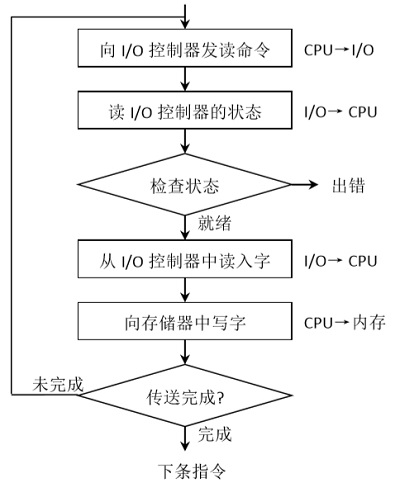

在程序IO方式中，由于CPU的高速性和IO设备的低速性，使CPU的绝大部分时间都处于等待IO设备完成数据IO的循环测试中，造成对CPU的极大浪费。

### 2. 中断驱动IO控制方式

现代计算机系统广泛采用中断驱动（Interrupt Driven）方式。

1. 当某进程要启动某个IO设备工作时，便由CPU向相应的设备控制器发出一条IO命令，然后立即返回执行原来的任务。
2. 设备控制器于是按照命令要求控制指定IO设备。此时，CPU与IO设备并行操作。
3. 当IO操作完成后（读写完数据寄存器），设备控制器向CPU发送一中断信号，CPU转而进入中断处理过程。

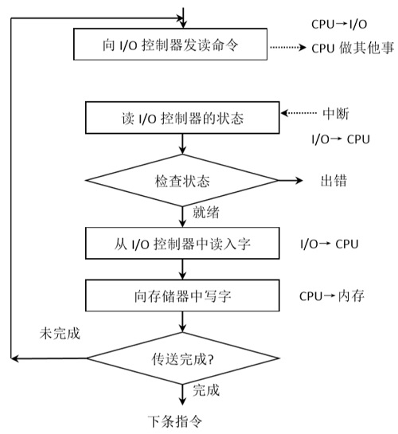

在IO设备输入每个数据的过程中，都无需CPU干预，因而使CPU和IO设备并行工作。仅当输完一个数据时，才需CPU花极短的时间去做些中断处理。这样可使CPU和IO设备都处于忙碌状态，从而提高整个系统的资源利用率和吞吐量。

虽然中断驱动IO比程序IO方式更有效，但它仍是以字（节）为单位进行IO的，每当完成一个字（节）的IO时，控制器便向CPU请求一次中断；响应中断CPU便有一个保护现场、切换进程、恢复现场的开销。

有时会采用中断和轮询相结合的方式，比如高带宽的网络设备，因不知道数据何时到达，故第一个传入的数据包到达前采用中断的方式，后面的数据包则采用轮询的方式，直到硬件缓存为空。

### 3. 直接存储器（DMA）访问IO控制方式

DMA（Direct Memory Access）方式的引入正是为了进一步减少CPU对IO的干预，其特点如下：

- 数据传输的基本单位是数据块。
- 所传送的数据从设备直接送入内存，或者相反，要求设备控制器可以直接访问系统总线。
- 仅在传送一个或多个数据块的开始和结束时，才需CPU干预，整块数据的传送是在控制器的控制下完成的。

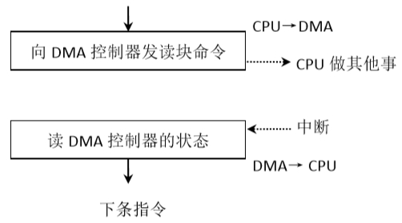

DMA方式较之中断驱动方式，进一步提高了CPU与I/O设备的并行操作程度。

虽然DMA方式比起中断方式，已经显著减少了CPU的干预，即已经由字（节）为单位的干预减少到以数据块为单位的干预，但CPU每次发一条IO指令，也只能去读（或写）一个连续的数据块。但当需要一次读多个数据块且将它们分别传送至不同的内存区域，或者相反时，则须由CPU分别发出多条IO指令及进行多次中断处理，才能完成。

### 4. IO通道控制方式

IO通道方式是DMA方式的发展，它可以进一步减少CPU的干预，即把对一个数据块的读写为单位的干预，减少为对一组数据块的读写及有关的控制和管理为单位的干预。同时实现CPU、通道、和IO设备三者的并行操作，从而更有效地提高整个系统的资源利用率。

例如，当CPU要完成一组相关的写操作及有关控制时，只需向IO通道发送一条IO指令，以及给出其所要执行的通道程序的首地址和要访问的IO设备，通道接到该指令后，通过执行通道程序便可完成CPU指定的IO任务。

## （五）缓冲管理

### 1. 缓冲的引入

CPU处理数据的速度与外设IO速度不匹配，引入缓冲可以改善CPU和IO设备之间速度不匹配的情况。事实上凡是数据输入速率和输出速率不相同的地方都可以设置缓冲区，以改善速度不匹配的情况。缓冲技术的引入还可以缓和由于通道数量不足而产生“瓶颈”现象，减少占用通道的时间。另外，缓冲技术的引入还可以减少对CPU的中断次数，放宽CPU对中断响应时间的限制。

总之，引入缓冲技术的优点有：

- 缓和CPU与IO设备之间速度不匹配的矛盾。
- 提高CPU、通道与IO设备间的并行性。
- 减少对CPU的中断次数，放宽CPU对中断响应时间的要求。

缓冲技术的实现主要是设置合适的缓冲区。

缓冲区可以用硬件寄存器来实现硬缓冲，如打印机等都有这样的缓冲区，它的速度虽然快，但成本很高，容量也不会很大，而且具有专用性，故不多采用。

另一种较经济的办法就是设置软缓冲，即在内存中开辟一片区域充当缓冲区，缓冲区的大小一般与盘块的大小一样。缓冲区的个数可根据数据IO的速率和加工处理的速率之间的差异情况来确定。

### 2. 单缓冲和双缓冲

#### (1) 单缓冲

单缓冲指当一个进程发出一IO请求时，操作系统便在主存中为之分配一个缓冲区，用来临时存放输入或输出数据。它是操作系统提供的一种最简单的缓冲形式。

单缓冲的输出情况是：当需要输出的信息很多时，这时可用一个缓冲区存放部分信息，启动输出设备输出，而CPU转去执行其它程序，当输出设备取空此缓冲区后，便产生中断，CPU处理中断，然后很快又装满缓冲区，如此循环直到输出完成。输入设备与CPU并行工作的道理也是如此。

单缓冲区同时只能存放输入数据或输出数据，当数据输入到缓冲区时，输入设备忙着输入，而输出设备空闲；而当数据从缓冲区中输出时，输出设备忙着输出，而输入设备空闲。对缓冲区来说，信息的输入和输出是串行工作的。

单缓冲只能缓解输入设备、输出设备速度差异造成的矛盾，不能解决外设之间的并行问题的，为此引入双缓冲。

#### (2) 双缓冲

双缓冲指在操作系统中为某一设备设置两个缓冲区，当一个缓冲区中的数据尚未被处理时可使用另一个缓冲区存放数据，以此来进一步提高CPU和外设的并行程度。


要求输入时，输入设备先将数据送往缓冲区A，用户进程从A取出数据，此时如果输入设备又输入数据，操作系统将会把数据暂存到B，待用户进程处理完A中的数据，就从B中取数据；与此同时，输入设备又可将数据送往A，如此交替使用缓冲区A和B。当数据输出时与输入情况类似。

双缓冲还实现了外设间的并行工作，以读卡机和打印机为例。

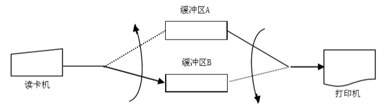

读卡机将第一张卡片读入A，装满后就启动打印机打印A的内容，同时启动读卡机向B读入下一张卡片。如果数据的输入和输出速率相同（或相差不大）时，那么正好A的内容打印完时，B也被装满；然后交换动作，打印B的数据息，读数据到A中，如此反复进行，使得读卡机和打印机能够完全并行工作。

双缓冲与单缓冲相比，能进一步提高CPU和外设的并行程度，并且能使外设并行工作，但是在实际中仍然少用，因为计算机外设越来越多，输入输出工作频繁，使得双缓冲难以匹配CPU与设备的速度差异。所以，现代计算机多采用多缓冲机制。

### 3. 循环缓冲

可将多个缓冲区组织成循环缓冲形式。指针Nexti指向下个输入的空缓冲区，指针Nextg指向下个可用满缓冲区G（已从输入设备输入数据，可被用户进程读取）；指针current指向进程正在使用的缓冲区C。

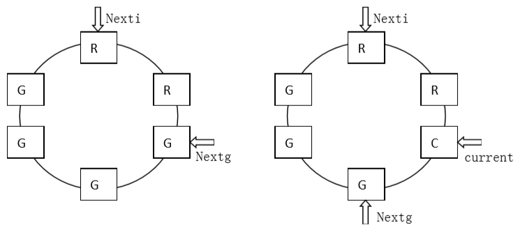

计算进程（用户进程使用数据完成计算）和输入进程（从输入设备输入数据）可用下述两个过程来使用循环缓冲区。

- **GetBuf**

当计算进程要使用缓冲区中的数据时，可调用Getbuf过程。该过程将由指针Nextg所指示的缓冲区提供给进程使用，并相应地将之改为现行工作缓冲区，并令current指针指向该缓冲区的第一个单元，同时将Nextg移向下一个G缓冲区。

类似地，每当输入进程要使用空缓冲区来装入数据时，也调用Getbuf过程，由该过程将指针Nexti所指示的缓冲区提供给输入进程使用，同时将Nexti指针移向下一个R缓冲区。

- **ReleaseBuf**

当计算进程把C缓冲区中的数据提取完毕时，便调用Releasebuf过程，将缓冲区G释放。此时，把该缓冲区由当前工作缓冲区C改为空缓冲区R。

类似地，当输入进程把缓冲区装满时，也调用Releasebuf过程，将该缓冲区释放，并改为G缓冲区。

### 4. 缓冲池

缓冲池由内存中的一组缓冲区构成，操作系统与用户进程将轮流地使用各个缓冲区，以改善系统性能。缓冲池中多个缓冲区可供多个进程使用，既可用于输出又可用于输入，是一种现代操作系统经常采用的一种公用缓冲技术。

#### (1) 缓冲池的组成

缓冲池中的缓冲区一般有三类：空闲缓冲区、装满输入数据的缓冲区、装满输出数据的缓冲区。为管理方便，系统将同一类型的缓冲区连成一个队列，形成以下三个队列：

- 空闲缓冲区队列**emq**，由空闲缓冲区所连成的队列。其队首指针F（emq）和队尾指针L（emq）分别指向该队列的首、尾缓冲区。
- 输入队列**inq**，由装满输入数据的缓冲区所连成的队列。其队首指针F（inq）和队尾指针L（inq）分别指向该队列的首、尾缓冲区。
- 输出队列**outq**，由装满输出数据的缓冲区所连成的队列。其队首指针F（outq）和队尾指针L（outq）分别指向该队列的首、尾缓冲区。

除了上述三个队列外，还应具有四种工作缓冲区：

- 用于**收容输入**数据的工作缓冲区，hin。
- 用于**提取输入**数据的工作缓冲区，sin。
- 用于**收容输出**数据的工作缓冲区，hout。
- 用于**提取输出**数据的工作缓冲区，sout。

#### (2) 管理缓冲池的基本操作GetBuf和PutBuf

`GetBuf(type)`，用于从type所指定的队列的队首摘下一个缓冲区。

`PutBuf(type, number)`，用于将由参数number所指示的缓冲区挂在type队列上。

#### (3) 缓冲池的工作方式

缓冲池工作在收容输入、提取输入、收容输出、提取输出四种方式下。

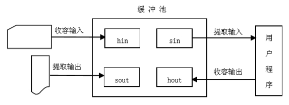

- 收容输入，输入进程需要输入数据时，调用GetBuf(emq)，从空缓冲区队列emq的队首摘下一个空缓冲区，作为收容输入工作缓冲区hin。然后把数据输入其中，装满后再调用PutBuf(inq,hin)，将该缓冲区挂在输入队列inq的队尾。
- 提取输入，计算进程需要输入数据时，调用GetBuf(inq)，从输入队列队首取得一个装满输入数据的缓冲区，作为提取输入工作缓冲区sin，计算进程从中提取数据。计算进程用完该数据后，再调用PutBuf(emq,sin)，将该缓冲区挂到空缓冲队列emq的队尾。
- 收容输出，当计算进程需要输出数据时，调用GetBuf(emq)，从空缓冲队列emq的队首取得一个空缓冲，作为收容输出工作缓冲区hout。然后把数据输出其中，装满后调用PutBuf(outq,hout)，将该缓冲区挂在输出队列outq的队尾。
- 提取输出，当输出进程要输出数据时，调用GetBuf(outq)，从输出队列的队首取一个装满输出数据的缓冲区，作为提取输出工作缓冲区sout，输出进程从中提取数据。在数据提取完后，再调用PutBuf(emq,sout)，将它挂在空缓冲队列emq的队尾。

## （六）设备分配

一个准备传送数据的进程需要申请所需要的外设、控制器和通道，这些资源是有限的。

进程必须首先向设备管理程序提出资源申请，由设备分配程序为进程分配资源。如果得不到，将进程放入相应资源等待队列中；如果得到就使用，用完后系统会及时回收资源。

### 1. 设备分配中的数据结构

为及时掌握设备情况，设备管理系统须建立了相应的数据结构，记录相应设备或控制器等的状态，以及控制它们所需要的信息。设备分配时所需的数据结构主要有**设备控制表**（Device Control Table，DCT）、**控制器控制表**（Controller Control Table，COCT）、**通道控制表**（Channel Control Table，CHCT）、**系统设备表**（System Device Table，SDT）。这些表的是通过链的形式组织起来的，即前一个表有一个指向后一个表的指针，它们的主要组成部分如下。

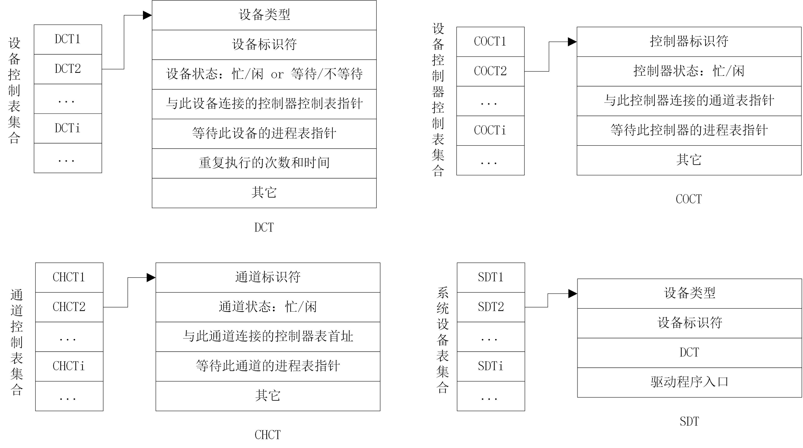

#### (1) 设备控制表DCT

系统为每个设备配置一张设备控制表项DCT，它在系统生成时或在该设备和系统连接时创建，用来记录设备的特性、设备和IO控制器的连接情况以及设备的分配和使用情况，表中的内容则可根据系统执行情况动态修改。如上图所示，它主要包括以下内容：

- 设备标识符。该设备的设备名或设备号，用来标识设备。
- 设备类型。用来表示设备的特性，例如是块设备还是字符设备等。
- 设备地址。每个设备都有相应的地址，这个地址既可以与内存统一编址，也可以单独编址。
- 设备状态。指设备处于等待还是不等待，忙还是闲的状态。当设备自身正处于使用状态时，应将设备的忙标志置1；若与该设备相连接的控制器或通道正忙，不能启动该设备，则此时将设备的等待标志置1。
- 与设备连接的控制器控制表指针。该指针指向该设备所连接的控制器控制表，在有多条通路的情况下，一个设备将与多个控制器相连，在该项内置入与此设备相连的控制器控制表首址。
- 等待该设备的进程队列。凡因请求本设备而未得到满足的进程，其PCB都按照一定的策略排成一个设备请求队列，其队首指针指向队首PCB。
- 重复执行次数或时间。外设在传送数据时，较易发生信息传送错误，因而在许多系统中，如果发生传送错误，并不立即认为传送失败，而是令它重新传送，并由系统规定设备在工作中发生错误时应重复执行的次数。在重复执行时，若能恢复正常传送，则仍认为传送成功，仅当屡次失败致使重复执行次数达到规定值而传送仍不成功时，才认为传送失败。
- 其它信息，如一些释放信息等。

#### (2) 控制器控制表COCT

系统为每个设备控制器都设置了一个COCT，用它来反映IO控制器的使用情况以及所连接的通道情况，如上图图所示，COCT中各相应项意义与DCT类似。

#### (3) 通道控制表CHCT

此表存在于设置有通道的系统中，也是每个通道都配有一张通道控制表，如上图所示，CHCT中各相应项的意义与DCT类似。

#### (4) 系统设备表SDT

在整个系统中设置惟一的系统设备表SDT，是系统范围数据结构，记录了系统中全部设备情况（每个设备作为一个表项），如系统中有多少设备，其中有多少是空闲的，而又有多少已分配给了哪些进程。SDT的每个表项主要包括：

- 设备类型和设备标识符，含义同DCT。

- 正在使用设备的进程标识。
- 指向有关设备的设备控制表的指针，即DCT指针。

#### (5) 设备数据块、分配块、请求包

以上四种是主要数据结构，此外还有**设备数据块**（Device Data Block，DDB）、**设备分配块**（Device Allocation Block，DAB）、**IO请求包**（IO Request Package，IRP）等。

- 设备数据块DDB，用以描述同类设备的公共属性以及与该类设备有关的处理程序等信息（如分配程序的地址、设备中断处理程序的地址、启动IO例程的地址等），系统为每一类外设建立了一个DDB。
- 设备分配块DAB，描述进程分配到的设备、控制器、通道的有关信息（DCT、COCT、CHCT的地址信息等）。
- IO请求包IRP，存放当进程发出IO请求时的有关IO信息（请求IO的进程标识符、IO操作的输入/输出功能码、请求IO时进程的优先级、缓冲区始址等）。IRP是动态建立的，并且它将被连接到DCT中。

### 2. 设备分配及考虑因素

DCT、COCT、CHCT三个表之间的连接关系示例如下。

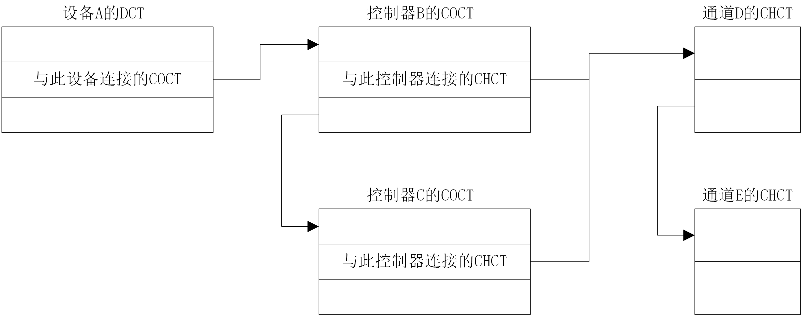

DCT和进程PCB之间的连接关系示例如下。

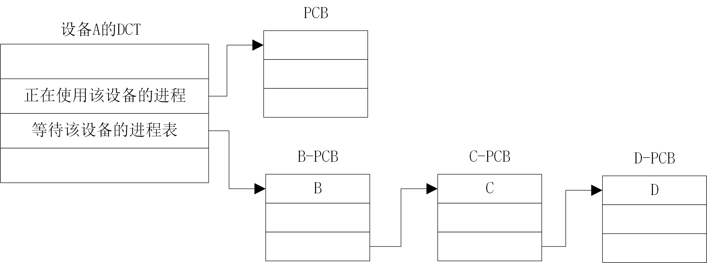

#### (1) 一般分配步骤

有上述数据结构，这里以有通道的计算机系统为例，讨论设备分配的一般步骤。

设备分配程序随时记录设备、控制器、通道的状态信息，并根据这些信息构成设备到内存的通路。

1. 根据所请求的IO设备，由系统设备表SDT找到该设备的设备控制表DCT，然后检查DCT。
2. 检查设备的DCT，从中找到与此设备相连的COCT，找到控制器。如果控制器不忙，则从控制器的COCT中找出与此控制器相连的通道CHCT。
3. 如果通道空闲，那么便可构成一条IO通路，通道-控制器-设备。需要注意的是有的设备不止一个控制器，有的控制器也不止一个通道，因此找到的IO通路不是唯一的。

对于所请求的IO设备，可能出现三种情况：仅有一条通路可用，可以找出一条以上的可用通路，或没有一条可用的通路。在IO繁忙的情况下，完全可能暂时没有可用通路。但当IO完成后就会有一个或多个部件（设备、控制器、通道）被释放，于是此时IO设备分配程序又会构成IO通路。

为此，当有进程提出IO请求后，如果有可用通路，则在DCT、COCT、CHCT中将进程名（或进程PCB的首址）登记在状态表项内；如果没有一个可用的通路，则进行排队等候。

#### (2) 设备的固有属性

在分配设备时，首先应考虑与设备分配有关的设备属性。设备的固有属性可分成三种：

- 独占性，是指这种设备在一段时间内，只允许一个进程独占。
- 共享性，是指这种设备允许多个进程同时共享，此时须注意对这些进程访问该设备的先后次序进行合理调度。
- 可虚拟设备，指设备本身虽是独占设备，但经过某种技术处理，可以把它改造成多台逻辑上的虚拟设备，因而虚拟设备是可共享的设备，可以将它同时分配给多个进程使用。

#### (3) 设备分配算法

先来先服务。当有多个进程对同一设备提出IO请求时，该算法是根据各进程对某设备提出请求的先后次序，将这些进程排成一个设备请求队列，设备分配程序总是把设备首先分配给队首进程。

优先级高者优先。在这种分配策略中，优先权高的进程所提出的IO请求也赋予高优先权，有助于优先权高的进程尽快完成。形成设备队列时，将优先权高的进程排在设备队列前面，而对于优先级相同的IO请求，则按先来先服务原则排队。

#### (4) 设备分配中的安全性

安全分配方式。每当进程发出IO请求后，便进入阻塞状态，直到其IO操作完成时才被唤醒。这样使得进程阻塞后不可能再请求任何资源，从而防止发生死锁。

不安全分配方式。进程在发出IO请求后仍继续运行，需要时又可以发出第二个IO请求、第三个IO请求等。仅当进程所请求的设备已经被另一进程占用时，请求进程才进入阻塞状态。这种分配方式的优点是，一个进程可同时操作多个设备，使进程推进迅速。缺点是可能造成死锁。

#### (5) 独占设备的分配程序

独占设备应采用独享分配策略，即将一个设备分配给某进程后，便由该进程独占，直至该进程完成或释放该设备，然后系统才能将该设备分配给其他进程使用。

通过一个具有IO通道系统的例子，来介绍设备分配过程。当某进程提出IO请求后，系统的设备分配程序按下述步骤进行设备分配：

1、**分配设备**

首先根据IO请求中的物理设备名，查找系统设备表SDT，从中找出该设备的DCT，再根据DCT中的设备状态字段，可知该设备是否正忙。若忙，便将请求IO的进程的PCB挂在设备队列上；否则，便按照一定的算法来计算本次设备分配的安全性。如果不会导致系统进入不安全状态，便将设备分配给请求进程；否则仍将其PCB插入设备等待队列。

2、**分配控制器**

在系统把设备分配给请求IO的进程后，在到其DCT中找出与该设备连接的控制器的COCT，从COCT的状态字段中可知该控制器是否忙碌。若忙，便将请求IO的进程的PCB挂在该控制器的等待队列上；否则，将该控制器分配给进程。

3、**分配通道**

在该COCT中又可以找到与该控制器相连接的通道的CHCT，再根据CHCT内的状态信息，可知该通道是否忙碌。若忙，便将请求IO的进程挂在该通道的等待队列上；否则，将该通道分配给进程。

只有在设备、控制器、通道三者都分配成功时，这次的设备分配才算成功。然后，便可启动该IO设备进行数据传送。

### 3. SPOOLing技术

该技术是在多道程序设计中将一台独占设备改造为共享设备的一种技术，可以将一台物理IO设备虚拟为多台逻辑IO设备，从而允许多个用户共享一台物理IO设备。

早期计算机系统，为缓和CPU高速性和IO设备低速性的矛盾，引入了脱机输入/输出技术。该技术利用专门的外围控制机，将低速IO设备上的数据传送到高速磁盘上，或者从高速磁盘传送到低速IO设备。

当系统引入多道技术后，完全可以利用其中的两道程序，来分别模拟脱机输入时、输出时的外围控制机功能，这样便可在主机的直接控制下，实现脱机输入、输出功能。此时的外围操作与CPU对数据的处理同时进行，把这种联机情况下实现的同时外围操作称为SPOOLing（Simultaneous Peripheral Operation On Line），或称为假脱机技术。

例如，打印机是一种独占设备，每次只能有一个进程使用它，创建一个特殊的守护进程（daemon）以及一个特殊的SPOOLing目录。在打印一个文件之前，进程首先产生完整的待打印文件并将其放在SPOOLing目录下，之后就可以认为打印过程已经完成，虽然还没打印，因此SPOOLing也称为打印的“假脱机”过程。而整个的打印作业由该守护进程进行处理，只有该守护进程能够真正使用打印机设备文件，通过禁止用户直接使用打印机设备文件，就解决了打印机的独占问题。

SPOOLing技术除用于打印机外，还可以用于在网络上进行文件传输。SPOOLing系统的特点如下：提高了IO速度。将独占设备改造为共享设备。实现了虚拟设备功能。

## （七）磁盘存储器的管理

### 1. 磁盘性能简述

#### (1) 数据的组织和格式

磁盘设备可包括一个或多个盘片，每片分两面，每面可分成若干条磁道，各磁道之间留有必要的间隙。为处理简单起见，每条磁道上可存储相同数目的二进制位。每条磁道又分成若干个扇区，每个扇区的大小相当于一个盘块。各扇区间保留一定的间隙。

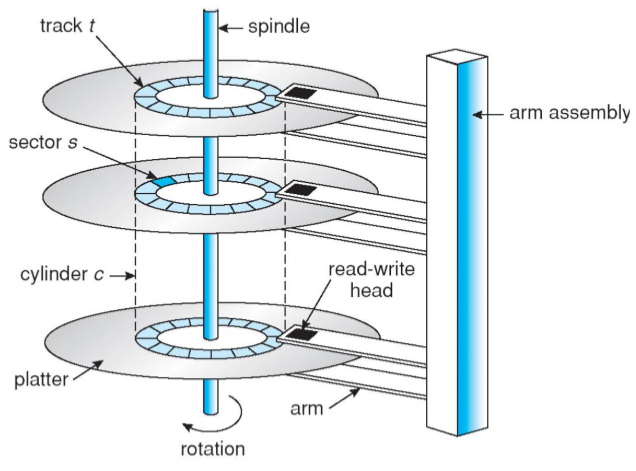

#### (2) 磁盘的类型

可从不同角度对磁盘进行分类，最常见的有：硬盘和软盘、单片盘和多片盘、固定头磁盘和活动头磁盘等。下面仅对固定头磁盘和移动头磁盘做些介绍。

固定头磁盘在每条磁道上都有一读写头，所有的磁头都被装在一个刚性磁臂中。通过这些磁头可访问所有磁道，可进行并行读写。这种结构的磁盘主要用于大容量磁盘上。

活动头磁盘每个盘面仅配有一个磁头，也被装入磁臂中。为访问该盘面上的所有磁道，该磁头必须能移动以进行寻道。移动磁头仅能以串行方式读写，致使IO速度较慢。但由于结构简单，仍广泛应用于中小型磁盘设备中。这里主要针对这类磁盘的IO进行讨论。

#### (3) 磁盘访问时间

磁盘设备在工作时，以恒定速度旋转。为了读或写，磁头必须能移动到所要求的磁道上，并等待所要求的扇区的开始位置旋转到磁头下，然后再开始读或写数据。故可把对磁盘的访问时间分成三部分。

1. **寻道时间**Ts，把磁臂（磁头）移动到指定磁道上所经历的时间，该时间是启动磁臂的时间s与磁头移动n条磁道所花费的时间之和。
2. **旋转延迟时间**Tτ，指定扇区移动到磁头下面所经历的时间。对于硬盘，典型的旋转速度大多为5400r/min，每转需时11.1ms，平均旋转延迟时间Tτ为5.55ms。
3. **传输时间**Tt，把数据从磁盘读出或向磁盘写入数据所经历的时间，Tt的大小与每次读/写的字节数b和旋转速度有关。

在访问时间中，寻道时间和旋转延迟时间基本上都与读/写数据的多少无关，并且通常占据了访问时间中的大部分。例如，我们假定寻道时间和旋转延迟时间平均为20ms，而磁道的传输速率为10MB/s，如果要传输10KB，此时总的访问时间为21ms，可见传输时间所占比例非常小，只有当要传送的数据量特别大时，才能值得启动一次读写访问。

### 2. 磁盘调度

磁盘是共享设备，多个进程请求访问磁盘时，应用一种最佳的调度算法，以使各进程对磁盘的平均访问时间最小。由于在访问磁盘的时间中，主要是寻道时间，因此磁盘调度的目标，是使磁盘的平均寻道时间最少。目前常用的磁盘调度算法有：先来先服务、最短寻道时间优先及扫描算法等。

1. **先来先服务**（First Come First Served，FCFS）算法根据进程请求访问磁盘的先后次序进行调度。优点是简单，且不会出现某一进程的请求长期得不到满足的情况。但此算法未对寻道进行优化，使平均寻道时间可能较长。
2. **最短寻道时间优先**（Shortest Seek Time First，SSFT）算法选择所请求访问的磁道，与当前磁头所在的磁道距离最近的进程，以使每次的寻道时间最短，但不能保证平均寻道时间最短。缺点是可能会出现距离较远的磁道长时间得不到访问的情况，即饿死现象，又称为磁头粘着。
3. **扫描算法**（SCAN）算法又称电梯算法。优先考虑磁头当前的移动方向（向外或向内），其次考虑在当前移动方向上要访问的最近磁道。每次移动到最外侧或最内侧，再向相反的方向移动。但是对于刚扫过去又出现了的请求，则需要磁头到达一侧后再折返才能访问。
4. **循环扫描算法**（Circular SCAN，C-SCAN）算法规定磁头只能单向移动，当磁头移到一侧的磁道并访问后，磁头立即返回到另一侧欲访问的磁道。它能提供更均匀的等待时间。
5. **C-LOOK**，改进的C-SCAN算法，它与S-SCAN算法移动的方式一样，只是在移动时，不需要移动到磁盘的一侧，而是移动的最后一个请求即可；磁头返回时也是返回到另一侧的第一个请求处，而不是直接返回到另一侧边缘。

### 3. 提高磁盘IO速度的方法

#### (1) 磁盘高速缓存

磁盘的IO速度远低于对内存的访问速度，提高磁盘IO速度的最主要技术是采用磁盘高速缓存（Disk Cache）。

这里所说的磁盘高速缓存，指利用内存中的存储空间，来暂存从磁盘中读出的一系列盘块中的信息。因此，这里的高速缓存指一组在逻辑上属于磁盘，而物理上驻留在内存中的盘块。

如同请求调页一样，在将磁盘中的盘块数据读入高速缓存时，同样会出现因高速缓存中已经装满盘块数据而需要将高速缓存中的数据先换出的问题，相应地，也必然存在采用哪种置换算法的问题。较常用的置换算法也是最近最久未使用算法LRU、最近未使用算法NRU、最少使用算法LFU等。

#### (2) 提前读

采用顺序方式（即顺序访问文件所在各盘块的数据）对文件进行访问时，可以在读当前块时可以将下一盘块中的数据也预读入缓冲区。这样，读下一盘块数据时，可直接从缓冲区中取得，不必再去启动磁盘IO。

#### (3) 延迟写

将缓冲区中的数据，挂在空闲缓冲区队列的末尾。随着空闲缓冲区的使用，该缓冲区也逐渐往前移动，直至移到空闲缓冲区队列之首。当再有进程申请到该缓冲区时，才将该缓冲区中的数据写入磁盘，而把该缓冲区作为空闲缓冲区分配出去。

#### (4) 优化物理块的分布

优化文件物理块分布，使磁头的移动距离最小。如将同一个文件的盘块安排在同一条磁道或相邻的磁道上，显然会减少磁头在磁道间的移动。对文件盘块位置的优化，应在为文件分配盘块时进行。

#### (5) 虚拟盘

虚拟盘指利用内存空间去仿真磁盘，又称RAM盘。该盘的设备驱动程序可以接受所有标准的磁盘操作，但这些操作的执行，是在内存中进行而不是不是在磁盘上，这些对用户都是透明的。

主要问题为内存是易失性存储器，一旦系统或电源发生故障，或系统再次启动时，原来保存在虚拟盘中的数据将会丢失。因此虚拟盘通常用于存放临时文件，如编译程序产生的目标程序等。

### 4. 磁盘冗余阵列

（独立）磁盘冗余阵列（Redundant Array of Independent Disk，RAID）是一组物理磁盘驱动器，操作系统把它视为单个逻辑磁盘驱动器；具体的操作是由磁盘阵列的驱动程序来完成的，对操作系统是不可见的。

磁盘条带化（Striping），将数据分割成许多小块，分布地存储在磁盘阵列中，实现对多个磁盘的并行读写，提高IO读写性能。一个条带可以是一个物理块、一个扇区或者其他单元（具体划分有驱动程序完成，操作系统不可见）。

使用冗余磁盘容量保存校验信息，保证一个磁盘失效时，数据可恢复，提高磁盘的可靠性。

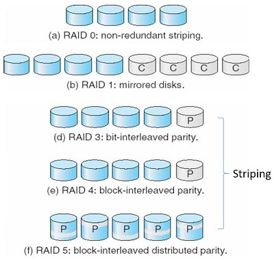

