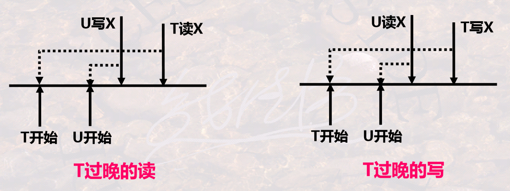
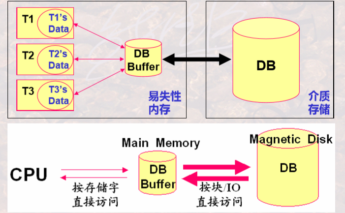
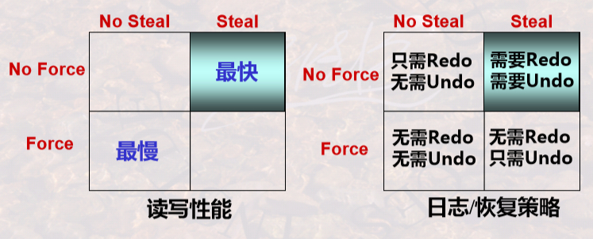

# 数据库并发控制

## （一）并发事务调度的正确性及如何产生

一些基本操作。表达事务调度的一种模型，r~i~(A)表示事务T~i~读A，w~i~(A)表示事务T~i~写A。则一个T~1~事务可表示为：r~1~(A); w~1~(A); r~1~(B); w~1~(B)。

事务是并发控制的基本单位，并发控制应保证事务的ACID四个性质。并发操作带来的数据不一致的三种典型现象：丢失修改（lost update）、不可重复读（non-repeatable read）、读脏数据（dirty read）。并发控制的两大类基本思想为加锁和撤回。

多个事务并发执行时，DBMS一般有一个事务调度器来管理调度事务的执行。事务调度器引用一个锁表Locks，它记录了哪个事务对哪个元素加了什么样的锁。

**事务调度**（schedule）：一组事务的基本步（原子操作，如读、写、加锁、解锁等）的一种执行顺序称为对这组事务的一个调度。可以串行调度也可以并发调度；当且仅当并发调度下所得到的结果和串行调度的结果完全一致，则称该并发调度是正确的。

**可串行性**（Serializability）：不管数据库初始状态如何，一个调度对数据库状态的影响都和某个串行调度（不唯一）相同，则称这个调度具有可串行性，或是可串行化的（Serializable）。它是用来衡量并发调度正确性的一个概念，可串行化调度都是正确的并发调度，但正确的不一定可串行化。

**冲突**：一个调度中多个事务的一系列基本动作，如果两个或多个基本操作交换顺序，导致涉及这些基本操作的事务中至少有一个事务的行为会改变，则称这些基本操作是冲突的。有冲突的两个操作不能交换次序，没有冲突的两个操作是可交换的。常见的有冲突的几种情况：

- 同一个事务中的任何两个操作都是冲突的；
- 不同事务对同一个元素的两个写操作是冲突的；
- 不同事务对同一个元素的一读一写操作是冲突的。
- 一般而言，不同的事务读写不同的元素是无冲突的。

**冲突可串行性**：一个调度，如果通过交换相邻两个无冲突的操作能够转换到某一个串行的调度，则称此调度为冲突可串行化的调度。满足冲突可串行性一定满足可串行性，反之不一定。

$并发调度的正确性 \supseteq 可串行性 \supseteq 冲突可串行性$，无法直接判断前两项，但可以判断一个调度是否是冲突可串行化的，只要一个调度是冲突可串行化的，它一定是正确的；如果不是，也不一定是错误的。这里给出一个判断一个调度是否是冲突可串行化的算法。

1. 构造一个前驱图（有向图），结点是每一个事务T~i~；
2. 寻找所有任意有冲突的两个操作，它们所在的事务是T~i~和T~j~，根据它们基本操作的执行顺序，绘制一条有向边，在前的事务指向在后的事务；
3. 测试检查，如果此图没有环，则说明这个调度是冲突可串行化的，是正确的。再次指出，不是冲突可串行化的调度也不一定是错误的。

无法直接产生一个正确的事务调度，但是可以产生一个冲突可串行化的事务调度，它一定是正确的，总体上来说就两大类思想，即：基于锁的方法（基于封锁的并发控制），基于撤回的方法（基于时间戳的并发控制、基于有效性确认的并发控制）。

## （二）基于封锁的并发控制

对事务上锁解锁的操作，L~i~(A)表示事务T~i~对数据元素A加锁，U~i~(A)表示事务T~i~对数据元素A解锁。

锁是控制并发的一种手段，要求：每一数据元素都有唯一的锁；每一事务读写数据元素前都要获得锁，处理完成后都要释放锁；如果锁被其他事务获取，本事务则要等待。

锁主要分为两种类型：排他锁X（exclusive locks），只有获得锁的事务能读写、其他事务都不能读写；共享锁S（Shared locks），所有事务都可以读，但任何事务都不能写。此外还有更新锁U（Update locks），初始读，以后可升级为写；增量锁I（Incremental locks），用于增量更新，区分增量更新和其他类型的更新。

在加锁运用时，还需要规定一些规则，如何时申请X锁、S锁，锁的持续时间、何时释放等，这些规则称为加锁协议（lock protocol）。注意事务结束时可以正常结束（COMMIT），也可以非正常结束（ROLLBACK）。

**相容性矩阵**：当某一事务对一个数据对象持有一种锁时，是否允许另一事务再申请对该事务加某一类型的锁。


- 一级协议是指，事务T在修改数据R之前必须先对其加X锁，直到事务结束才释放。
- 二级协议是指，在一级协议基础上增加事务T在读取数据R之前必须先对其加S锁，读完后即可释放S锁。
- 三级协议是指，在一级协议基础上增加事务T在读取数据R之前必须先对其加S锁，直到事务结束才释放。

**封锁粒度**：指的是封锁数据对象的大小。可以是一个属性值、元组、元组结合、整个关系、整个DB；某索引项、整个索引。

多粒度封锁，首先定义多粒度树，根节点是整个数据库，表示最大的封锁粒度，叶节点表示最小的封锁粒度。显式封锁是应事务要求直接加到数据库对象上的锁；隐式封锁是该数据对象没独立加锁但有其上级节点被加锁而使该对数据象加上了锁。

多粒度加锁时要根据上级和下级判断是否封锁，在进行下级判断时类似树的搜索，效率很低。于是引入了意向锁（Intention Lock），対任一结点加锁时，必须先对它的上层结点加意向锁。分为意向共享锁（IS）、意向排它锁（IX）、共享意向排它锁（SIX）。

**两段封锁协议**（2PL，two-Phase Locking protocol）指的是，读写数据之前要获得锁；每个事务中所有封锁请求先于任何一个解锁请求，把加锁解锁严格划分为两个阶段：加锁段（又称扩展阶段）和解锁段（又称收缩阶段），加锁段中不能有解锁操作，解锁段中不能有加锁操作。

两端封锁协议可以保证一个调度是冲突可串行化的；事务遵循两段封锁协议是可串行化的充分条件，而不是必要条件。需要注意的是，两端封锁协议可能产生死锁。

## （三）基于时间戳的并发控制

用TS(T)表示一个事务T的时间戳。对DB中的每个数据元素x，系统保留其上最大的时间戳：RT(x)，读过该数据的事务中最大的时间戳，即最后读x的事务的时间戳；WT(x)，写过该数据的事务中最大的时间戳，即最后写x的事务的时间戳。C(x)，x的提交位，当且仅当最近写x的事务已经提交，C(x)的目的是避免出现事务读另一事务U所写数据然后U终止这样的情况。

时间戳（Timestamp）是一种基于时间的标志，将某一个时刻转换成一个数值（如UNIX的时间戳是从1970年元时到现在所经过的秒数）；时间戳具有唯一性和递增性。当一个事务T启动时，系统将该时刻赋给T，称为T的时间戳。时间戳可以表征一系列事务执行的先后次序，时间戳小的事务先执行，时间戳大的事务后执行。利用时间戳，可以不用锁来进行并发控制。

借助时间戳，强制使一组并发事务的交叉执行，等价于一个特定顺序（时间戳由小到大）的串行执行。如何强制需要在执行时判断冲突，对于并发调度的一个基本操作的序列：如无冲突，予以执行；如有冲突（事实上不可实现的行为），则撤销事务，并重启该事务，此时该事务获得了一个更大是时间戳，表明是后执行的事务。冲突可以有：读-读无冲突；读-写、写-读、写-写，先执行的事务后操作或后执行的事务先操作时，会发生冲突。

一种简单的调度规则，可以避免“两种事实上不可能实现的”冲突。

读-写并发（读-写、写-读）

- 若事务T读x，则将T的时间戳TS与WT(x)比较：若TS大（T后执行），则允许T操作，并且更改RT(x)为max{RT(x), TS}；否则有冲突，撤回T并重启。
- 若事务T写x，则将T的时间戳TS与RT(x)比较：若TS大（T后执行），则允许T操作，并且更改WT(x)为max{WT(x), TS}；否则有冲突，撤回T并重启。

写-写并发

- 若事务T写x，则将T的时间戳TS与WT(x)比较：若TS大（T后执行），则允许T写，并且更改WT(x)为TS；否则有冲突，撤回T并重启。



简单的调度无法解决读脏数据、托马斯写规则等问题，还有另一种调度规则，此处不再记录。注意判断哪些读写操作是合理的，哪些是不合理的，可以手动画出上图中的形式来判断。

假设调度器收到提交T的请求，它必须找到所有T所写的所有数据库元素x，并置C(x)为true，如果有任何等待x被提交的事务，这些事务就允许被继续执行。假设调度器收到终止T的请求，像前述步骤一样确定回滚T，那么任何等待T所写元素x的事务必须重新尝试读或写，看这一动作现在T的写被终止后是否合法。

## （四）基于有效性确认的并发控制

 事务在启动时刻被赋予唯一的时间戳，以示其启动顺序。为每一活跃保存其读写数据的集合：RS(T)，事务T读数据的集合；WS(T)，事务T写数据的集合。通过对多个事务的读写集合，判断是否有冲突（存在事实上不可实现的行为），即有效性确认，来完成事务的提交与回滚，强制事务以可串行化的方式执行。

调度器维护三个集合：START(T)，表示事务开始的时间；VAL(T)，表示事务T有效性确认的时间；FIN(T)，表示事务T写完数据的时间。

如果一个较早的事务U现在正在写入T应该读过的某些对象，则T的有效性不能确认。如果T在有效性确认后可能比一个较早的事务先写某个对象，则T的有效性不能确认。

# SQL Server并发控制

使用`WAITFOR DELAY '00:00:05'`等待5秒钟。

## （一）事务与锁

SQL Server 2005默认锁级别为表级锁，且系统默认只能设置100个锁。通过SQL Server的封锁操作是在相关语句的`WITH (table_hint)`子句中完成的，可用在SELECT、INSERT、UPDATE、DELETE等语句中指定表级锁定的方式和范围。常用关键词如下。

- `TABLOCK`，对表施加共享锁，在读完数据后立即释放封锁，可以避免读“脏”数据，但可能引起不可重复读问题。
- `HOLDLOCK`，与TABLOCK —起使用，可将共享锁保留到事务完成，而不是在读完数据后立即释放，可以保证数据的可重复读。
- `NOLOCK`，不施加任何封锁，仅用于SELECT语句，会引起读“脏”数据。
- `TABLOCKX`，对表施加排他锁。
- `UPDLOCK`，对表中指定元组施加更新锁，这时其他事务可对同表中的其他元组也施加更新锁，但不能对表施加任何锁。 

如`SELECT * FROM CHOICES WITH (TABLOCK HOLDLOCK)`。

并发控制采用封锁技术实现，当一个事务欲对某个数据对象操作时，可申请对该对象加锁，取得对数据对象的一定控制，以限制其他事务对该对象的操作。其语句格式为：

```assembly
LOCK TABLE 表名[, ...] INSHARE(EXCLUSVE, SHARE UPDATE) MODE [NOWAIT];
```

- NOWAIT表示多个用户要求封锁相同的关系时，后来提出的要求会被立即退回去，否则会等待该资源释放。

## （二）事务与隔离级别

通过设置锁的生命周期，来对并发执行加以适当的控制，实现不同程度的并发控制，即隔离级别。SQL Server提供的6种隔离级别如下：

- READ UNCOMMITTED，未提交读，事务隔离的最低级别，仅可保证不读物理损坏的数据。
- READ COMMITED，提交读，SQL Server的默认级别，可以保证不读脏数据。
- READ_COMMITED_SNAPSHOT，提交快照读，又称语句级快照，基于快照的一种，以乐观控制方式保证不读脏数据。
- REPEATABLE READ，可重复读，保证读一致性。
- ALLOW_SNAPSHOT_ISOLATION，快照隔离，又称事务级快照，基于行版本快照的一种，以乐观控制方式确保读一致性。
- SERIALIZABLE，可串行化，事务隔离的最高级别，事务之间完全隔离，在该级别上可以保证并发事务均是可串行的。 

事务必须运行在可重复读或更髙隔离级别上才可防止丢失更新。设置的各种命令如下：

```sql
SET TRANSACTION ISOLATION LEVEL {READ UNCOMMITTED | READ COMMITED | REPEATABLE READ SERIALIZABLE};
```

- 设置非行版本快照隔离级别。

```sql
ALTER DATABASE database_name SET READ_COMMITED_SNAPSHOT | ALLOW_SNAPSHOT_ISOLATION ON;
```

- 设置行版本快照隔离级别。

```sql
SET TRANSACTION ISOLATION LEVEL READ COMMITED | SNAPSHOT;
```

- 同时在启动事务前执行。

## （三）锁的竞争

```sql
SET LOCK_TIMEOUT 2000	-- 2秒
```

- 当设置好时间后，锁定管理器将自动解除锁的争夺。

# 数据库恢复技术

## （一）事务局部存储、数据库缓冲区、磁盘

DBMS利用易失性内存和外存（介质存储）来管理存储数据。在外存如硬盘上存储数据库，在内存上存储数据库缓冲区和事务内部的数据，这三者之间是否一致就显得尤为重要。故障、故障恢复的基本思路就从这一点出发来研究。故障恢复就是把DB由当前的不正确状态恢复到已知为正确的某一状态，它涉及到如何保证事务的原子性和持久性。持久性要求已提交事务的缓冲区内容保证写回磁盘；未提交事务的缓冲区内容不能影响磁盘。



根据上一段所讨论的DBMS用到的数据库存储、数据库缓冲区存储、事务内部数据的存储，数据库的故障种类主要有事务故障、系统故障、介质故障。

数据库通常由元素构成，通常，1元素=1磁盘块=1内存页/块；可以更小，1元素=1记录；或者更大，1元素=1关系。

每个事务都会读/写某些元素，READ和WRITE由事务发出，INPUT和OUTPUT由缓冲区管理器发出。

- READ(X, t)，将数据库缓冲区Buffer中的元素X读到事务的局部变量t中。
- WRITE(X, t)，将事务局部变量t写回数据库缓冲区中的元素X。
- INPUT(X)，将元素X从磁盘读入到内存缓冲区中。
- OUTPUT(X)，强制将数据库缓冲区中的元素X写回到磁盘中。

每个事务都以提交（COMMIT）结束或者撤销（ABORT）结束。

缓冲区和磁盘中的内容不是时刻都保持一致的。缓冲区处理策略，既要考虑数据读写的速度，又要考虑怎样保证数据正确，当前最常用Steal+No force。

- Force，内存中的数据晚在commit的时候写入磁盘。
- No steal，不允许在事务commit之前把内存中的数据写入磁盘。
- No force，内存中的数据可以一直保留，在commit之后过一段时间再写入磁盘。此时在系统崩溃的时候可能还没写入到磁盘，需要Redo。
- Steal，允许在事务commit之前把内存中的数据写入磁盘。此时若系统在commit之前崩溃时，已经有数据写入到磁盘了，要恢复到崩溃前的状态，需要Undo。

## （二）事务故障

事物故障，某一个程序（事务）自身运行错误所引起的故障。影响较小仅影响程序（事务）本身。

恢复手段可以是通过重做事务（Redo），保证已提交事务的持久性；撤销事务（Undo），消除未提交事务的影响。

## （三）系统故障

系统故障，由于掉电、非正常关机等所造成的内存内容丢失，所引起的故障。影响正在运行的事务以及数据库缓冲区，数据库缓冲区将涉及正在运行和已运行的事务；造成数据库缓冲区和磁盘数据库的不一致性。

通过运行日志（System Log）恢复。运行日志是DBMS维护的一个文件，该文件以流水的方式记录了每一个事务对数据库的每一次操作及操作顺序。运行日志直接写到介质存储上，会保证正确性。当事务对数据库进行操作时，先写运行日志，写成功后，再与数据库缓冲区进行信息交换，再将数据库缓冲区更新的内容写道存储介质DB上。

按照运行日志记录的事务操作顺序。当事务在发生故障时已正确结束，重做事务Redo；当事务在发生故障时未结束，撤消事务Undo。

运行日志保留了若干天的记录，当发生系统故障时需要从某一个点处开始恢复事务，将该点称为**检查点**（checkpoint）。在检查点时刻，DBMS强制使内存DB Buffer中的内容与介质DB中的内容保持一致，即将DB Buffer更新的所有内容写回DB中；从而保证了在检查点之前内存中数据与介质中数据是保持一致的。

那么在利用检查点进行系统故障恢复时，就可以：检查点之前结束的事务不需要恢复（已经写回DB）；检查点之后结束或发生的事务需要依据运行日志进行恢复（不能确定是否写回DB），故障点前结束的重做，故障点时刻未结束的撤消。

### 1. 日志概述

对于以记录为单位的日志文件，日志会保存每一个条被修改（插入、修改、删除）的记录（元组）到日志文件。

日志记录的信息主要有以下几种。

- `<Start T>`，表示事务T已经开始，即每个事务的开始标志。
- `<Commit T>`，表示事务T成功完成。`<Abort T>`，事务T未成功，被中止。即每个事务的结束标志。
- `<T, X, v1>`或者`<T, X, v2>`或者`<T, X, v1,v2>`，表示事务T改变了数据库元素X，X原来的值为v1(X的旧值)，X新的值为v2。即每个事物的所有更新操作。

三种日志：Undo型日志，Redo型日志，Undo/Redo型日志。根据记录内容和记录次序不同，恢复策略也不同。



### 2. Undo型日志

对于任一事务T，按下列顺序向磁盘输出T的日志信息：

1. \<start T>在事务开始时首先被写入。
2. <T, X, v1>被写到日志中，保存的是仅是元素X的旧值。
3. OUTPUT(X)。将事务改变的所有数据写到磁盘前不能提交该事务，存在问题，频繁的写磁盘可能性能下降。
4. \<COMMIT T>或\<ABORT T>被写到日志中，根据事务是否提交还是终止。

检查点的设置有静态和动态两种：

- 静止检查点，周期性地对日志设置检查点。需要停止接受新的事务, 等到所有当前活跃事务提交或终止，并在日志中写入了COMMIT或ABORT记录后，将日志刷新到磁盘，写入日志记录`<CKPT>`，并再次刷新日志。
- 非静止检查点，在设置检查点时不必关闭系统，允许新事务进入。该检查点是一个范围，设置检查点时将正在运行的事务记录下来，写入一条`<START CKPT(T1,…,Tk)>`，其中T1,…,Tk 是所有活跃的未结束的事务，继续正常的操作，直到T1,…,Tk都提交时，写入`<END CKPT>`。

故障恢复时，对于一个事务，要判断是否恢复它，要先确定一个事务是否提交，判断方法如下：

- <STARTT> ... <COMMITT>，事务已结束并提交，无需恢复，跳过。
- <STARTT> ... <ABORTT>，事务已结束但未提交，需要恢复。
- <STARTT> ... ，事务未提交，需要恢复。

然后，从日志的**最后位置**开始，**倒序**向前直到遇到第一个检查点\<CKPT>，处理每一条记录，**撤销未提交**事务的所有修改：

- <COMMITT>，标记T已提交。
- <ABORTT>，标记T已结束但未提交。
- <T, X, v>，如果T**未提交**，则将X=v写回磁盘，否则跳过。
- <STARTT>，跳过。

### 3. Redo型日志

对于任一事务T，按下列顺序向磁盘输出T的日志信息：

1. \<start T>在事务开始时首先被写入。
2. <T, X, v2>被写到日志中，保存的是仅是元素X的新值。
3. \<COMMIT T>或\<ABORT T>被写到日志中，根据事务是否提交还是终止。
4. OUTPUT(X)。Redo型日志先提交再输出，灵活性差，数据必须在Commit后才可见（写到磁盘）。

检查点的设置同Undo中所述，需要注意的是，在设置动态检查点时可能会又设置新的检查点，那么在恢复时使用的是最后一个完整的（即有Start和End）检查点。

故障恢复时，对于一个事务，判断它是否提交的方法同Undo所述。

然后，从日志的**起始位置**开始，这个开始位置有检查点确定，即找最后一个END CRPT所对应的START CRPT中包含事务的最早的START T处作为开始位置，**正序**处理每一条记录，**重做已提交**事务的所有修改：

- <COMMITT>，标记T已提交。
- <ABORTT>，标记T已结束但未提交。
- <T, X, v>，如果T**已提交**，则将X=v写回磁盘，否则跳过。
- <STARTT>，跳过。

### 4. Undo/Redo结合型日志

对于任一事务T，按下列顺序向磁盘输出T的日志信息：

1. \<start T>在事务开始时首先被写入。
2. <T, X, v1, v2>被写到日志中，保存的是元素X的旧值v1和新值v2。
3. \<COMMIT T>或\<ABORT T>被写到日志中，根据事务是否提交还是终止。或者OUTPUT(X)。它们的顺序没有要求，只要保证<T, X, v1, v2>先于OUTPUT写完即可。

检查点的设置同之前所述。

对于一个事务，判断它是否提交。然后，自后向前，按日志记录的反序，撤销所有未提交事务的所有修改；自前向后地，按日志记录的正序，重做所有已提交的事务：

- <COMMITT>，标记T已提交。
- <ABORTT>，标记T已结束但未提交。
- <T, X, u, v>，如果T未提交，则将X=u写回磁盘，否则将X=v写回磁盘。
- <STARTT>，跳过。

## （四）介质故障

介质故障，由于介质损坏等所引起的故障。影响是全面的，既影响内存中的数据，又影响介质中存储的数据。

通过副本（Copy）即另一个存储介质恢复。在某一时刻，对数据库在其他介质存储上产生的另一份等同记录，副本备份的时间称为**转储点**；当故障发生时，用副本替换被损坏的数据库，由于介质故障影响全面，在用副本恢复后还需要依据运行日志进行恢复。这就要求运行日志必须能够涵盖转储点之前的一段时间，不能出现间断。

这就要求正确的确定备份的时间即转储点。过频，影响系统工作效率；过疏，会造成运行日志过大，也影响系统运行性能。 备份转储周期与运行日志的大小密切相关，应注意防止衔接不畅而引起的漏洞。

转储可分为静态转储和动态转储。静态转储期间不允许对数据库的任何存取、修改活动；动态转储期间允许对数据库进行存取或修改。转储还分为海里转储（即每次转储全部数据库）和增量转储（即每次转储上一次转储后更新过的数据）。

数据库镜像数据是将数据库从一个硬盘复制到另个一个磁盘。

# SQL Server数据库备份与还原、导入与导出

数据库的备份与还原是物理层面的；而导入与导出是逻辑层面的。既可以通过Microsoft SQL Server Management Studio图形化界面进行操作。

1、**备份**

在`数据库服务器`下，找到`服务器对象`下的`备份设备`选项，可以添加备份设备。在具体数据库上右键选择`属性`，可以设置数据库的恢复模式。在具体数据库上右键，选择`任务`下的`备份`可以选择备份方式并开始备份。

也可以使用Transact-SQL语句进行操作。

```sql
ALTER DATABASE School SET RECOVERY FULL;
```

- 将School数据库设置为完全恢复模式。

```sql
BACKUP DATABASE database_name TO {DISK|TAPE}='name' [WITH DIFFERENTIAL];
BACKUP DATABASE School TO SchoolBackup;		-- e.g.
BACKUP DATABASE School TO SchoolBackup WITH DIFFERENTIAL;
```

- 也可以使用`BACKUP`指令备份数据库，`WITH DIFFERENTIAL`指定备份模式为差异备份。

```sql
BACKUP LOG database name TO {DISK,TAPE)='name';
BACKUP LOG School TO SchoolBackup;		-- e.g.
```

- 对数据库进行事务日志备份。注意：简单恢复模式不允许备份事务日志文件。

2、**还原**

选择具体的数据库右击，选择`任务`下的`还原`选项，可以选择还原的来源、是否覆盖原来的数据库等。

也可以使用Transact-SQL语句进行操作。

```sql
RESTORE DATABASE database_name FROM {DISK|TAPE}='name' [WITH [NORECOVERY|][REPLACE]];
RESTORE DATABASE School FROM SchoolBackup WITH NORECOVERY;		-- e.g.
```

- 对数据库进行恢复。
- NORECOVERY指示还原操作不撤销备份中任何未提交的事务，RECOVERY 指示还原操作撤销备份中任何未提交的事务，REPLACE指示即使存在另一个具有相同名称的数据库，也创建指定的数据库及相关文件，即覆盖现有数据库。 

```sql
RESTORE LOG database_name FROM {DISK|TAPE}='name' [WITH [NORECOVERY|RECOVERY] [STOPAT = date_time | STOPATMARK='mark_name' [AFTER date_time] | STOPBEFOREMARK = 'mark_name' [AFTER date_time] ];
```

- 根据事务日志备份进行恢复。

3、**导入与导出**

“导出”是将数据从数据库中复制到数据文件中，“导入”是将数据从数据文件 中加载到SQL Server数据库中。通过导入与导出操作可以实现SQL Server和其他不同类型数据源（如Oracle、Access等数据库）之间自由地移动和使用多种不同格式的数据。

利用SQL Server Management Studio中的“导人和导出向导”对数据库进行导入和导出操作，即右击具体数据库的`任务`下选择导入操作或导出操作。

# 关系查询处理和查询优化

## （一）概述

### 1. 查询处理步骤

1. 查询分析，对查询语句进行扫描、词法分析和语法分析。从查询语句中识别出语言符号，进行语法检查和语法分析，即判断查询语句是否符合SQL语法规则。
2. 查询检查，对合法的查询语句进行语义检查，即根据数据字典中有关的模式定义检查语句中的数据库对象，是否存在和有效；如果是对视图的操作，则要用视图消解方法把对视图的操作转换成对基本表的操作；还要根据数据字典中的用户权限和完整性约束定义对用户的存取权限进行检查。当然，这时的完整性检查是初步的、静态的检查。检查通过后便把SQL查询语句转换成内部表示，即等价的**关系代数表达式**。这个过程中要把数据库对象的外部名称转换为内部表示。关系数据库管理系统一般都用查询树（query tree），也称为语法分析树（syntax tree）来表示扩展的关系代数表达式。
3. 查询优化，每个查询都会有许多可供选择的执行策略和操作算法，查询优化就是选择一个高效执行的查询处理策略。按照优化的层次一般可将查询优化分为代数优化和物理优化。代数优化是指关系代数表达式的优化，即按照一定的规则，通过对关系代数表达式进行等价变换，改变代数表达式中操作的次序和组合，使查询执行更高效；物理优化则是指存取路径和底层操作算法的选择。
4. 查询执行，依据优化器得到的执行策略生成查询执行计划，由代码生成器（code generator）生成执行这个查询计划的代码，然后加以执行，回送查询结果。

### 2. 数据库的三大类操作

- 一次单一元组的一元操作，如选择（SELECTION）、投影（PROJECTION）。迭代器算法（也可用于某些二元操作）。
- 整个关系的一元操作，如去重复（DISTINCT）、分组（GROUP BY）、排序（SORTING）。一趟扫描算法（一张关系从头扫到尾）、二趟扫描算法（一趟扫描的结果存在内存上不够用，把它存在磁盘上，再读出来进行二趟处理）、多趟扫描算法；它们都有基于排序的算法、基于散列的算法、基于索引的算法。
- 整个关系的二元操作，如集合上的并交差、包上的并交差、积（PRODUCT）、连接（JOIN）。

### 3. 三个层面进行优化

- 语义优化，利用模型的语义及完整性规则，优化查询。
- 语法优化（逻辑层优化），利用语法结构，优化操作执行顺序。
- 执行优化（物理层优化），存取路径和执行算法的选择与执行次序优化。

## （二）逻辑层的查询优化

### 1. 关系代数表达式等价变换规则

关系代数的基本操作，并、差、积、选择、投影。哪些关系代数操作能够交换次序，根据两两组合交换是否等价，判断是否可以交换。用相同的关系代数代替两个表达式中相应的关系所得到的结果是相同的，则称两个关系表达式是等价的，记为$E_1\equiv E_2$。

需要注意的是，下面的这些定律都不是独立使用的，而是需要和其他定律一起考虑。

#### (1) 交换律

1、**连接、笛卡尔积的交换律**

设E~1~、E~2~是关系代数表达式，F是连接运算的条件，则有
$$
\begin{align}
& E_1\times E_2\equiv E_2\times E_1 \\
& E_1\Join E_2\equiv E_2\Join E_1 \\
& E_1\mathop{\Join}\limits_{F} E_2\equiv E_2\mathop{\Join}\limits_{F} E_1
\end{align}
$$
考虑哪一个关系最先装到内存中，通常选择结果关系小的表达式先计算。

2、**选择、投影的交换律**

设条件F只涉及属性$\{A_1,A_2,\dots,A_n\}$，E是关系表达式，则有
$$
\Pi_{A_1,A_2,\dots,A_n}(\sigma_{F}(E))\equiv \sigma_{F}(\Pi_{A_1,A_2,\dots,A_n}(E))
$$
若F中有不属于$\{A_1,A_2,\dots,A_n\}$的属性$\{B_1,B_2,\dots,B_m\}$，则更一般的规则
$$
\Pi_{A_1,A_2,\dots,A_n}(\sigma_{F}(E))\equiv \Pi_{A_1,A_2,\dots,A_n}(\sigma_{F}(\Pi_{A_1,A_2,\dots,A_n,_1,B_2,\dots,B_m}(E)))
$$
尽可能的。

3、**选择、笛卡尔积的交换律**

如果F中涉及的属性都是E~1~中的属性，则
$$
\sigma_{F}(E_1\times E_2)\equiv \sigma_{F}(E_1)\times E_2
$$
如果$F=F_1\and F_2$，并且F~1~只涉及E~1~中的属性，F~2~只涉及E~2~中的属性，则由其他的等价变换规则可推出
$$
\sigma_{F}(E_1\times E_2)\equiv \sigma_{F_1}(E_1)\times \sigma_{F_2}(E_2)
$$
若F~1~只涉及E~1~的属性，F~2~涉及E~1~、E~2~中的属性，则仍有
$$
\sigma_{F}(E_1\times E_2)\equiv \sigma_{F_2}(\sigma_{F_1}(E_1)\times E_2)
$$
它使部分选择在笛卡尔积前先做，尽可能的把选择操作移动到乘积操作前面。

#### (2) 结合律

1、**连接、笛卡尔积的结合律**

设E~1~、E~2~、E~3~是关系代数表达式，F~1~、F~2~是连接运算的条件，则有
$$
\begin{align}
& (E_1\times E_2)\times E_3\equiv E_1\times (E_2\times E_3) \\
& (E_1\Join E_2)\Join E_3\equiv E_1\Join (E_2\Join E_3) \\
& (E_1\mathop{\Join}\limits_{F_1} E_2)\mathop{\Join}\limits_{F_2} E_3\equiv E_1\mathop{\Join}\limits_{F_1} (E_2\mathop{\Join}\limits_{F_2} E_3) \\
\end{align}
$$
考虑哪一个关系最先装到内存中，通常选择结果关系小的表达式先计算。

#### (3) 串接定律

1、**投影的串接定律**

设$\{A_1,A_2,\dots,A_n\}\subseteq\{B_1,B_2,\dots,B_m\}$，E是表达式，则
$$
\Pi_{A_1,A_2,\dots,A_n}(\Pi_{B_1,B_2,\dots,B_m}(E))\equiv \Pi_{A_1,A_2,\dots,A_n}(E)
$$
此定律可双向使用。从左向右去掉一些无意义属性，把两边扫描数据库变成一遍扫描数据库；从右向左扩展一些属性，便于投影操作向下（叶子节点）移动。

2、**选择的串接定律**

设E是关系代数表达式，F~1~、F~2~是连接运算的条件，则有
$$
\sigma_{F_1}(\sigma_{F_2}(E))\equiv \sigma_{F_1\and F_2}(E)
$$
此定律可双向使用。从左向右把选择条件结合起来，把两边扫描数据库变成一遍扫描数据库；从右向左分解复杂选择条件，便于选择操作向下（叶子节点）移动。

#### (4) 分配律

1、**选择、并的分配律**

设E=E~1~∪E~2~，且E~1~、E~2~有相同的属性名（并相容），则
$$
\sigma_{F}(E_1\cup E_2)\equiv \sigma_{F_1}(E_1)\cup \sigma_{F_2}(E_2)
$$

由左到右，降低中间运算结果。

2、**选择、差的分配律**

设E~1~、E~2~有相同的属性名（并相容），则
$$
\sigma_{F}(E_1-E_2)\equiv \sigma_{F_1}(E_1)-\sigma_{F_2}(E_2)
$$

由左到右，降低中间运算结果。

3、**选择、自然连接的分配律**

如果F只涉及E~1~、E~2~中的公共属性，则
$$
\sigma_{F}(E_1\Join E_2)\equiv \sigma_{F}(E_1)\Join \sigma_{F}(E_2)
$$

4、**投影、并的分配律**

设E~1~、E~2~有相同的属性名（并相容），则
$$
\Pi_{A_1,A_2,\dots,A_n}(E_1\cup E_2)\equiv \Pi_{A_1,A_2,\dots,A_n}(E_1)\cup \Pi_{A_1,A_2,\dots,A_n}(E_2)
$$

投影、差是的分配是不成立的。

5、**投影、笛卡尔积的分配律**

设E~1~、E~2~是关系代数表达式，$A_1,A_2,\dots,A_n$是E~1~的属性，$B_1,B_2,\dots,B_m$是E~2~的属性，则
$$
\Pi_{A_1,A_2,\dots,A_n,B_1,B_2,\dots,B_m}(E_1\times E_2)\equiv \Pi_{A_1,A_2,\dots,A_n}(E_1)\times \Pi_{B_1,B_2,\dots,B_m}(E_2)
$$
做了乘积再做投影，等价于先做投影再做乘积。它能够减少每条记录的长度，从而一个内存块可以存放更多的记录。

### 2. 查询树的启发式优化

结点代表操作，边代表操作之间的组合关系和先后顺序。查询树的启发式优化，典型启发式规则有：

- 选择、投影运算尽可能先做。
- 投影运算和选择运算同时进行。
- 把投影和其前或其后的双目运算符结合起来。
- 把某些选择同在它前面要执行的笛卡尔积结合起来成为一个连接运算。
- 执行连接操作前，对关系做适当的处理（如排序、索引等）。
- 找出公共子表达式，一次计算完成，多次使用。

### 3. 基于关系代数的查询优化算法

输入：一个关系代数表达式的语法树。输出：计算该表达式的程序。算法：

1. 依据*选择的串接定律*，把复杂的选择表达式分解成串接形式。
2. 对每个选择，依据一系列选择有关的定律，将它尽可能的移到查询树的底部。
3. 对每个投影，依据*投影的串接定律*和一系列投影有关的定律，将它尽可能的移到查询树的底部。如果一个投影是对某表达式所有属性进行的，则去掉之。
4. 利用*选择的串接定律*、*投影的串接定律*、*选择、投影的交换律*，把串接的选择和投影组合为单个选择、单个投影，或者一个选择后跟一个投影。使多个选择或投影能同时执行，或在一次扫描中完成。
5. 对修改后的语法树，将其内的结点按以下方式分组：
   - 每个二元运算结点（积、并、差、连接等）和其所有一元运算直接祖先结点放在一组。
   - 对于其后代结点，若后代结点是一串一元运算且以树叶为终点，则将这些一元运算结点放在该组中。
   - 若该二元运算结点是笛卡儿积，且其后代结点不能和它组合成等连接，则不能将后代结点归入该组。
6. 产生一个程序，它以每组结点为一步，从后代组开始执行。

## （三）物理层的查询优化

利用模式信息和统计信息。

对于选择。全表扫描法（table scan）；索引扫描法（index scan），可以使用散列索引、或B+树索引。使用索引时还应考虑数据量，如果满足条件的数量占表的一大半，则使用索引不见得更好，因为一大半数据几乎接近全部扫描了，使用索引还要查索引跳来跳去。

对于连接。嵌套循环法（nested loop join）、排序合并算法（sort-merge join）、索引连接。

### 1. 查询操作的实现

#### (1) 选择操作的实现

SELECT语句功能强大，且有很多选项，因此实现的算法和优化策略也很复杂，不失一般性，这里选择简单的选择操作作为典例介绍。

简单的全表扫描算法（tables can)，全表扫描算法只需要很少的内存（最少为1块）就可以运行，而且控制简单。对于规模小的表，这种算法简单有效。对于规模大的表进行顺序扫描，当选择率（即满足条件的元组数占全表的比例）较低时，这个算法效率很低。假设可以使用的内存为M块，全表扫描的算法思想如下：

1. 按照物理次序读表的M块到内存。
2. 检查内存的每个元组t，如果t满足选择条件，则输出t。
3. 如果表还有其他块未被处理，重复上述步骤。

索引扫描算法（index scan），如果选择条件中的属性上有索引（如B+树索引或hash索引），可以用索引扫描方法，通过索引先找到满足条件的元组指针，再通过元组指针在查询的基本表中找到元组。

1. 选择条件是`主码=值`查询，可以选择主码索引。
2. 选择条件是`非等值或范围`查询，并且选择列上有索引，可以使用索引扫描方法。
3. 选择条件是`AND`连接的合取，如果都有索引，可以先分别找到两者的一组索引指针，然后求交集；或找到其中一者的一组索引指针，再检查对另一者的条件是否满足，把满足条件的元组输出。

一般情况下，当选择率较低时，基于索引的选择算法要优于全表扫描算法。但在某些情况下，例如选择率较高，或者要查找的元组均匀地分布在查找的表中，这时基于索引的选择算法的性能不如全表扫描算法。因为除了对表的扫描操作，还要加上对B+树索引的扫描操作，对每一个检索码，从树根结点到叶子结点路径上的每个结点都要执行一次IO操作。

#### (2) 连接操作的实现

连接操作是查询处理中最常用也是最耗时的操作之一，不失一般性，这里简单介绍等值连接（或自然连接）最常
用的几种算法思想。

嵌套循环算法（nested loop join）最简单可行的算法。对外层循环表的每一个元组，检索内层循环表中的每一个元组，并检查这两个元组在连接属性上是否相等。如果满足连接条件，则串接后作为结果输出，直到外层循环表中的元组处理完为止。在实际实现中数据存取是按照数据块读入内存，而不是按照元组进行IO的。

排序-合并算法（sort-merge join，merge join）是等值连接常用的算法，尤其适合参与连接的诸表己经排好序的情况。用排序-合并连接算法的步骤是：

1. 如果参与连接的表没有排好序，首先对外表和内表按连接属性排序。
2. 取外表中第一个连接属性值，依次扫描内表表中具有相同连接属性值的元组，把它们连接起来。
3. 当扫描到连接属性值不相同的第一个内表元组时，返回外表表扫描它的下一个元组，再扫描内表表中具有相同连接属性值的元组，把它们连接起来。
4. 重复上述步骤直到外表扫描完。这样外表和内表都只要扫描一遍即可。
5. 当然，如果两个表原来无序，执行时间要加上对两个表的排序时间。一般来说，对于大表，先排序后使用排序-合并连接算法执行连接，总的时间一般仍会减少。

索引连接（index join）算法的步骤是：

1. 在内表上己经建立了连接属性的索引。
2. 对外表中每一个元组，由连接属性值通过内表的索引查找相应的内表元组。
3. 把这些内表元组和外表元组连接起来。
4. 循环执行2、3，直到外表表中的元组处理完为止。

hash join算法也是处理等值连接的算法。它把连接属性作为hash码，用同一个hash函数把外表和内表中的元组散列到hash表中。分为两个阶段：

1. 划分阶段（building phase），也称为创建阶段，即创建hash表。对包含较少元组的表进行一遍处理，把它的元组按hash函数（hash码是连接属性）分散到hash表的桶中。
2. 试探阶段（probing phase），也称为连接阶段（join phase），对另一个表进行一遍处理，把表的元组也按同一个hash函数（hash码是连接属性）进行散列，找到适当的hash桶，并把该表元组与桶中来自构建时的表与之相匹配的元组连接起来。

上面的hash join算法假设两个表中较小的表在第一阶段后可以完全放入内存的hash桶中。以上的算法思想可以推广到更加一般的多个表的连接算法上。

### 2. 基于启发式规则的优化

这里列出了一些主要的启发式规则，在实际的关系数据库管理系统中启发式规则要多得多。

#### (1) 选择操作的启发式规则

对于小关系，使用全表顺序扫描，即使选择列上有索引。

对于大关系，启发式规则有：

1. 选择条件是`主码=值`查询，查询结果最多是一个元组，可以选择主码索引。一般的关系数据库管理系统会自动建立主码索引。
2. 选择条件是`非主属性=值`查询，并且选择列上有索引，则要估算查询结果的元组数目，如果比例较小（＜10%）可以使用索引扫描方法，否则还是使用全表顺序扫描。
3. 选择条件是`非等值或范围`查询，并且选择列上有索引，同样要估算查询结果的元组数目，如果选择率＜10%可以使用索引扫描方法，否则还是使用全表顺序扫描。
4. 选择条件是`AND`连接的合取，如果有涉及这些属性的组合索引，则优先采用组合索引扫描方法；如果某些属性上有一般索引，则可采用先索引一个找到满足部分的元组，或都索引求交集等方法，否则使用全表顺序扫描。
5. 选择条件是`OR`连接的析取，一般使用全表顺序扫描。

#### (2) 连接操作的启发式规则

1. 如果2个表都已经按照连接属性排序，则选用排序-合并算法。
2. 如果一个表在连接属性上有索引，则可以选用索引连接算法。
3. 如果上面2个规则都不适用，其中一个表较小，则可以选用hash-join算法。
4. 最后可以选用嵌套循环算法，并选择其中较小的表，确切地讲是占用的块数（B）较少的表，作为外表（外循环的表）。

### 3. 基于代价估算的优化

这里仅仅列出了少数操作算法的代价估算示例。在实际的关系数据库管理系统中代价估算公式要多得多，也复杂得多。

#### (1) 统计信息

基于代价的优化方法要计算各种操作算法的执行代价，它与数据库的状态密切相关。为此在数据字典中存储了优化器需要的统计信息（database statistics），主要包括如下几个方面：

1. 对每个基本表，该表的元组总数（N）、元组长度（l）、占用的块数（B）、占用的溢出块数（BO）。
2. 对基本表的每个列，该列不同值的个数（m）、该列最大值、最小值，该列上是否已经建立了索引，是哪种索引（B+树索引、hash索引、聚集索引）。根据这些统计信息，可以计算出谓词条件的选择率（f），如果不同值的分布是均匀的，则f=1/m；如果不同值的分布不均匀，则要计算每个值的选择率，则f=具有该值的元组数/N。
3. 对索引，例如B+树索引，该索引的层数（L）、不同索引值的个数、索引的选择基数S（有S个元组具有某个索引值）、索引的叶结点数（Y）。
4. 等等。

#### (2) 代价估算示例

下面给出若干操作算法的执行代价估算。

全表扫描算法的代价估算公式：

- 如果基本表大小为B块，全表扫描算法的代价cost=B。
- 如果选择条件是“码=值”，那么平均搜索代价cost=B/2。

索引扫描算法的代价估算公式：

- 如果选择条件是“码=值”，若为B+树索引，层数为L，需要存取B+树中从根结点到叶结点L块，再加上基本表中该元组所在的那一块，所以cost=L+1。
- 如果选择条件涉及非码属性，若为B+树索引，选择条件是相等比较，S是索引的选择基数（有S个元组满足条件），因为满足条件的元组可能会保存在不同的块上，所以最坏的情况cost=L+S。如果比较条件是比较操作，假设有一半的元组满足条件，那么就要存取一半的叶结点，并通过索引访问一半的表存储块。所以cost=L+Y/2+B/2。如果可以获得更准确的选择基数，可以进一步修正Y/2与B/2。

嵌套循环连接算法的代价估算公式：

- 嵌套循环连接算法的代价cost=B~r~+B~r~B~s~/(K-1)。如果需要把连接结果写回磁盘，则cost=B~r~+B~r~B~s~/(K-1)+(F~rs~×N~r~×N~s~)/M~rs~。
- 其中F~rs~为连接选择率（join selectivity），表示连接结果元组数的比例，M~rs~是存放连接结果的块因子，表示每块中可以存放的结果元组数目。

排序-合并连接算法的代价估算公式：

- 如果连接表己经按照连接属性排好序，则cost=B~r~+B~s~+(F~rs~×N~r~×N~s~)/M~rs~。
- 如果必须对文件排序，那么还需要在代价函数中加上排序的代价。对于包含B个块的文件排序的代价大约是(2×B)+(2×B×log~2~B)。