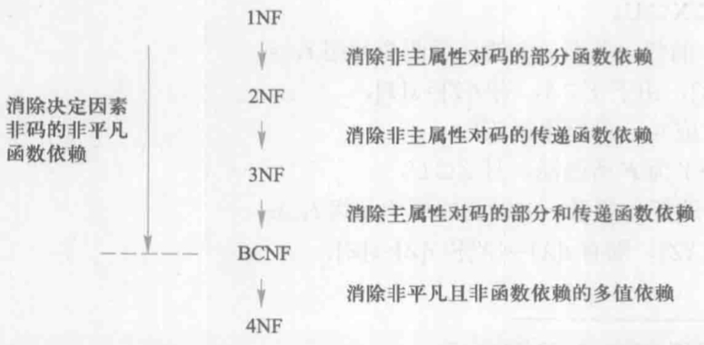
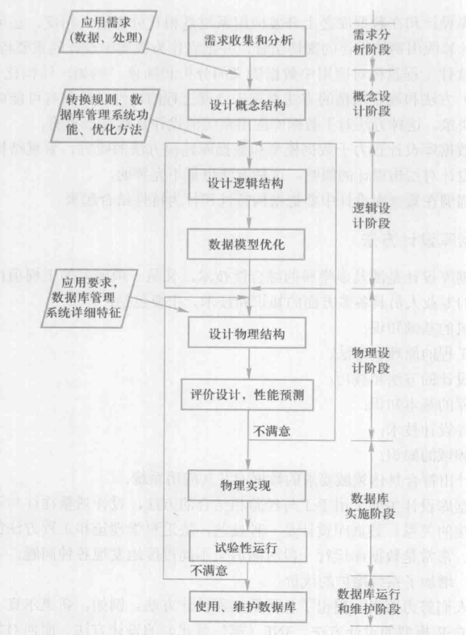
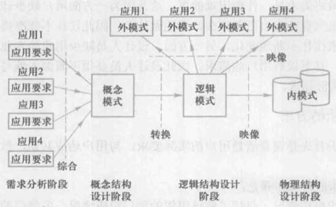
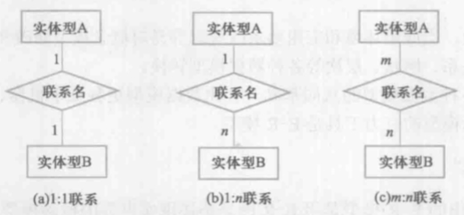

[toc]

# 一、概述

针对一个具体问题，应该如何构造一个适合于它的数据库模式，即应该构造几个关系模式，每个关系由哪些属性组成等。这是数据库设计的问题，确切地讲是关系数据库逻辑设计问题。关系数据库的规范化理论是以关系模型为背景的，数据库逻辑设计的一个有力工具，且对于一般的数据库逻辑设计同样具有理论上的意义。

一个关系模式应当是一个五元组，`R(U,D,DOM,F)`，这里：

- R，关系名是符号化的元组语义。
- U，为一组属性。
- D，为属性组U中的属性所来自的域。
- DOM，为属性到域的映射。
- F，为属性组上的一组数据依赖。

由于D、DOM与模式设计关系不大，因此在此处把关系模式看作一个三元组`R<U,F>`，当且仅当U上的一个关系r满足F时，r称为关系模式R<U,F>的一个关系。

**数据依赖**是一个关系内部属性与属性之间的一种约束关系，这种约束关系是通过属性间值的相等与否体现出来的数据间相关联系。它是现实世界属性间相互联系的抽象，是数据内在的性质，是语义的体现。己经提出了许多种类型的数据依赖，其中最重要的是函数依赖（Functional Dependency，FD）和多值依赖（Multi-Valued Dependency，MVD）。

一个好的模式应当不会发生插入异常、删除异常、更新异常、数据冗余应尽可能少。

# 二、规范化

本节首先讨论一个关系属性间不同的依赖情况，讨论如何根据属性间依赖情况来判定关系是否具有某些不合适的性质，通常按属性间依赖情况来区分关系规范化程度为第一范式、第二范式、第三范式和第四范式等；然后直观地描述如何将具有不合适性质的关系转换为更合适的形式。

## （一）函数依赖

**定义**：设R(U)是属性集U上的关系模式，X，Y是U的子集。若对于R(U)的任意一个可能的关系r，r中不可能存在两个元组在X上的属性值相等，而在Y上的属性值不等，即一个自变量X有且仅有一个函数值Y，则称X函数确定Y，或Y函数依赖于X，记作X→Y。

函数依赖和别的数据依赖一样是语义范畴的概念，只能根据语义来确定一个函数依赖。

- $X\rightarrow Y$，$Y\not \subseteq X$，则称X→Y是**非平凡的函数依赖**。
- $X\rightarrow Y$，$Y\subseteq X$，则称X→Y是**平凡的函数依赖**。对于任一关系模式，平凡函数依赖都是必然成立的，它不反映新的语义。若不特别声明，总是讨论非平凡的函数依赖。
- 若$X\rightarrow Y$，则X称为这个函数依赖的决定属性组，也称为**决定因素**（determinant）。
- 若$X\rightarrow Y$，$Y\rightarrow X$，则记作$X\leftarrow \rightarrow Y$。
- 若Y不函数依赖于X，则记作$X\not \rightarrow Y$。

**定义**：在R(U)中，如果X→Y，并且对于X的任何一个真子集X'，都有$X'\not \rightarrow Y$，即若X是x维的，Y是X的x维函数，若X'维度减少，则X'无法唯一确定Y。称Y对X**完全函数依赖**，记作$X\stackrel{F}{\longrightarrow} Y$。

如果X→Y，但Y不完全函数依赖于X，即更低维度的X'可以唯一确定Y，则称Y对X**部分函数依赖**（patrial functional dependency），记作$X\stackrel{P}{\longrightarrow} Y$。

**定义**：在R(U)中，如果$X\rightarrow Y（Y\not \subseteq X）$，$Y\not \rightarrow X$，$Y\rightarrow Z（Z\not \subseteq Y）$，则称Z对X**传递函数依赖**（transitive functional dependency），记为$X\stackrel{传递}{\longrightarrow} Y$。

这里加上条件$Y\not \rightarrow X$，是因为如果$Y\rightarrow X$，则$X\leftarrow \rightarrow Y$，实际上是$X\stackrel{直接}{\longrightarrow} Y$，是直接函数依赖，而不是传递函数依赖。

## （二）码

若关系中的某一属性组的值能唯一标识一个元组，而其子集不能，则称该属性组为**候选码**（candidate key），如果一个关系有多个候选码，则选中其中一个作为**主码**（primary key）。在最简单的情况下，候选码中只包含一个属性；在最极端的情况下，关系模式中所有属性整体是这个关系模式的候选码，称为**全码**（all，key）。

候选码中的属性称为**主属性**（prime attribute），不包含在候选码中的属性称为**非主属性**（non-prime  attribute）或**非码属性**（non-key attribute）。

这里用函数依赖的概念来定义码。

**定义**：设K为R<U,F>中的属性或属性组合，若$K\stackrel{F}{\longrightarrow} U$，即整个元组U对K完全函数依赖，则称K为R的**候选码**。如果U部分函数依赖于K，即$K\stackrel{P}{\longrightarrow} U$，则称K为**超码**（Surpkey）。候选码是最小的超码，即候选码的任意一个真子集都不是候选码。若候选码多于一个，则选定其中的一个为**主码**。

在这里主码或候选码都简称为码，请注意根据上下文加以识别。在一些资料中，码也称为键或键码。

关系模式R中属性或属性组X并非R的码，但X是另一个关系模式的码，则称X是R的**外部码**（foreign key），也称**外码**。主码与外码提供了一个表示关系间联系的手段。

## （三）范式（函数依赖范畴）

关系数据库中的关系是要满足一定要求的，满足不同程度要求的为不同范式。满足最低要求的叫第一范式，简称1NF；在第一范式中满足进一步要求的为第二范式，其余以此类推。

关系R为第几范式就可以写成R∈xNF，各种范式之间的关系有$5NF\sub4NF\sub BCNF\sub3NF\sub2NF\sub1NF$成立。

一个低一级范式的关系模式通过模式分解（schema decomposition）可以转换为若干个高一级范式的关系模式的集合，这种过程就叫规范化（normalization）。

**第一范式**（1NF）：每一个分量必须是不可分的数据项。它是作为一个二维表，关系要符合一个最基本的条件，满足了这个条件的关系模式就属于第一范式。

**第二范式**（2NF）：若R∈1NF，且每一个非主属性完全函数依赖于任何一个候选码，则R∈2NF。**消除非主属性对码的部分函数依赖**。

一个关系模式R不属于2NF，就会产生插入异常、删除异常、修改复杂的问题。解决的办法是用投影分解把关系模式分解为多个满足2NF的关系。

**第三范式**（3NF）：设关系模式R<U,F>∈1NF，若R中不存在这样的码X、属性组Y、非主属性Z（$Y\not \subseteq Z$），使得$X\rightarrow Y$，$Y\not \rightarrow X$，$Y\rightarrow Z$成立，即不存在一个非主属性对码X部份依赖或传递依赖，则称R<U,F>属于3NF。**消除主属性对码的部分和传递函数依赖**。

可以证明如果R属于3NF，则必有R属于2NF。一个关系模式若不是3NF，就会产生与2NF相类似的问题，解决的办法同样是分解。

3NF的不彻底性表现在可能存在主属性对码的部份依赖和传递依赖。

**BCNF**（又称修正的第三范式或扩充的第三范式）：关系模式R<U,F>∈1NF，若$X\rightarrow Y$，$Y\not \subseteq X$时X必含有码，也就是说关系模式R中，**每一个决定因素都包含码**，则R<U,F>∈BCNF。一个满足BCNF的关系模式有：

- 所有非主属性对每一个码都是完全函数依赖。
- 所有主属性对每一个不包含它的码也是完全函数依赖。
- 没有任何属性完全函数依赖于非码的任何一组属性。

不是BCNF的关系模式，仍然存在不合适的地方，非BCNF关系模式可以通过分解成为BCNF。

若R∈BCNF，则R∈3NF；但若R∈3NF，未必R∈BCNF。

3NF和BCNF是在函数依赖的条件下对模式分解所能达到的分离程度的测度。一个模式中的关系模式如果都属于BCNF，那么在函数依赖范畴内它己实现了彻底的分离，己消除了插入和删除的异常。

## （四）多值依赖

**定义**：设R(U)是属性集U上的一个关系模式，X、Y、Z是U的子集，且其余属性组Z=U-X-Y，当且仅当对R(U)的任一关系r，给定一对(x,z)值，有一组Y值仅仅取决于x值而与z值无关，则称Y**多值依赖**于X，记为X→→Y。（一个X对应一组Y和一组Z，但Y和Z没关系）

若X→→Y，而Z=Φ（为空），即对于R(X,Y)如果有X→→Y成立，则称X→→Y为**平凡的多值依赖**。

多值依赖具有以下性质：

1. 对称性，即若X→→Y，则X→→Z，其中Z=U-X-Y。
2. 传递性，即若X→→Y，Y→→Z，则X→→Z-Y。
3. 函数依赖可以看作是多值依赖的特殊情况，即若X→Y，则X→→Y。这是因为当X→Y时，对X的每一个值x，Y有一个确定的值y与之对应，所以X→→Y。
4. 若X→→Y，X→→Z，则X→→YZ。
5. 若X→→Y，X→→Z，则X→→Y∩Z。
6. 若X→→Y，X→→Z，则X→→Y-Z，X→→Z-Y。

多值依赖与函数依赖相比，具有下面两个基本的区别：

1. 多值依赖的有效性与属性集的范围有关。若X→→Y在U上成立，则在$W(XY\sube W\sube U)$上一定成立；反之则不然，即X→→Y在$W(W\sub U)$上成立，在U上并不一定成立。这是因为多值依赖的定义中不仅涉及属性组X和Y，而且涉及U中其余属性Z。

一般地，在R(U)上若有X→→Y在$W(W\sub U)$上成立，则称X→→Y为R(U)的嵌入型多值依赖。

但是在关系模式R(U)中，函数依赖X→Y的有效性仅决定于X、Y这两个属性集的值。只要在R(U)的任何一个关系r中，元组在X和Y上的值满足定义，则函数依赖X→→Y在任何属性集$W(XY\sube W\sube U)$上成立。

若函数依赖X→→Y在R(U)上成立，则对于任何$Y'\sub Y$均有X→Y'成立。而多值依赖X→→Y若在R(U)上成立，却不能断言对于任何$Y'\sub Y$有X→→Y'成立。

## （五）范式（多值依赖）

**第四范式**（4NF）：设关系模式R<U,F>∈1NF，如果对于R的每个非平凡的多值依赖$X\rightarrow\rightarrow Y(Y\not \sube X)$，X都含有码，则称R<U,F>∈4NF。**消除非平凡且非函数依赖的多值依赖**。

4NF就是限制关系模式的属性之间不允许有非平凡且非函数依赖的多值依赖。因为根据定义，对于每一个非平凡的多值依赖X→→Y，X都含有候选码，于是就有X→Y，所以4NF所允许的非平凡的多值依赖实际上是函数依赖。显然，如果一个关系模式是4NF，则必为BCNF。

一个关系模式如果己达到了BCNF但不是4NF，这样的关系模式仍然具有不好的性质，如数据的冗余度太大。可以用投影分解的方法消去非平凡且非函数依赖的多值依赖。

事实上，数据依赖中除函数依赖和多值依赖之外，还有其他数据依赖，例如有一种连接依赖。函数依赖是多值依赖的一种特殊情况，而多值依赖实际上又是连接依赖的一种特殊情况。但连接依赖不像函数依赖和多值依赖可由语义直接导出，而是在关系的连接运算时才反映出来。存在连接依赖的关系模式仍可能遇到数据冗余及插入、修改、删除异常等问题。如果消除了属于4NF的关系模式中存在的连接依赖，则可以进一步达到5NF的关系模式。

## （六）规范化小结

规范化的基本思想是逐步消除数据依赖中不合适的部分，使模式中的各关系模式达到某种程度的分离，它实质上是概念的单一化，类似于设计模式中的单一职责原则。人们认识这个原则是经历了一个过程的，各范式相继提出是这个认识过程逐步深化的标志。

关系模式的规范化过程是通过对关系模式的分解来实现的，即把低一级的关系模式分解为若干个高一级的关系模式，这种分解不是唯一的。

# 三、数据依赖公理系统

数据依赖的公理系统是模式分解算法的理论基础。函数依赖的一个有效而完备的公理系统是Armstrong公理系统。

**定义**：对于满足一组函数依赖F的关系模式R<U,F>，其任何一个关系r，若不存在于F中的函数依赖X→Y都成立（即r中任意两元组t、s，若t[X]=s[X]，则t[Y]=s[Y]），则称F**逻辑蕴涵**X→Y。

Armstrong公理系统（Armstrong’s axiom）设U为属性集总体，F是U上的一组函数依赖，对关系模式R<U,F>来说有以下的推理规则：

- A1 自反律（reflexivity rule），若$Y\subseteq X\subseteq U$，则X→Y为F所蕴涵。由自反律所得到的函数依赖均是平凡的函数依赖，自反律的使用并不依赖于F。
- A2 增广律（augmentation rule），若X→Y为F所蕴涵，且$Z\subseteq U$，则XZ→YZ为F所蕴涵。（XZ表示X∪Z）。
- A3 传递律（transitivity rule），若X→Y及Y→Z为F所蕴涵，则X→Z为F所蕴涵。

根据A1、A2、A3这三条推理规则可以得到下面三条很有用的推理规则。

- 合并规则（union rule），由X→Y，X→Z，有X→YZ。
- 伪传递规则（pseudo transitivity rule），由X→Y，WY→Z，有XW→Z。
- 分解规则（decomposition rule），由X→Y，$Z\subseteq Y$，有X→Z。

根据合并规则和分解规则，得到**引理**：X→A~1~A~2~...A~k~成立的充分必要条件是X→A~i~成立（i=1,2,...k）。

**定义**：在关系模式R<U,F>中为F所逻辑蕴涵的函数依赖的全体，叫作F的**闭包**（closure），记为F^+^。

自反律、传递律和增广律称为Armstrong公理系统，它是有效的、完备的。**有效性**指，由F出发根据Armstrong公理推导出来的每一个函数依赖一定在F^+^中。**完备性**指，F^+^中的每一个函数依赖，必定可以由F出发根据Armstrong公理推导出来。

要证明完备性，就首先要解决如何判定一个函数依赖是否属于由F根据Armstrong公理推导出来的函数依赖的集合。但不幸的是，求这个集合是一个NP完全问题。为此引入了下面的概念：

**定义**：设F为属性集U上的一组函数依赖，$X,Y\subseteq U$，属性集X~F~^+^={A|X→A能由F根据Armstrong公理导出}，X~F~^+^称为属性集X关于函数依赖集F的闭包。如果一个属性的闭包是U，则这个属性是码。

**引理**：设F为属性集U上的一组函数依赖，$X,Y\subseteq U$，X→Y能由F根据Armstrong公理导出的充分必要条件是$Y\subseteq X_F^+$。

于是，判定X→Y是否能由F根据Armstrong公理导出的问题就转化为，求出X~F~^+^，判定Y是否为X~F~^+^的子集的问题。这个问题由下面算法解决，求属性集X（$X\subseteq U$）关于U上的函数依赖集F的闭包X~F~^+^。输入：X、F，输出：X~F~^+^。

1. 令X^(0)^=X，i=0
2. 求$B=\{A|(\exist V)(\exist W)(V\to W\in F\and V\subseteq X^{(i)}\and A\in W)\}$
3. X^(i+1)^=B∪X^(i)^
4. 若X^(i+1)^与X^(i)^相等或者X^(i)^=U，则X^(i)^就是X~F~^+^，算法终止。
5. 否则，i=i+1，返回第2步。

对于上述算法，令a~i~=|X^(i)^|，{a~i~}形成一个步长大于1的严格递增的序列，序列的上界是|U|，因此该算法最多|U|-|X|次循环就会终止。

Armstrong公理系统是有效的、完备的，这两性说明了“导出”和“蕴含”是两个完全等价的概念，于是F^+^也可以说成是由F借助Armstrong公理推导出来的函数依赖集合。

**定义**：如果两个函数依赖集G^+^=F^+^，就说函数依赖集F**覆盖**G（F是G的覆盖，或G是F的覆盖），或F与G等价。

**引理**：等价G^+^=F^+^的充分必要条件是$F^+\subseteq G^+$和$G^+\subseteq F^+$。

**定义**：如果函数依赖集F满足下列条件，则称F为一个极小函数依赖，亦称为**最小依赖集**或**最小覆盖**（minimal cover）。

- F中任一函数依赖的右部仅含有一个属性。
- F中不存在这样的函数依赖X→A，使得F与F - {X→A}等价。
- F中不存在这样的函数依赖X→A，X有真子集Z使得F - {X→A}∪{Z→A}与F等价。该条含义是对于F中的每个函数依赖，它的左部要尽可能简。

**定理**：每一个函数依赖集F均等价于一个极小函数依赖F~m~，此F~m~称为最小依赖集。

# 四、模式的分解

**定义**：关系模式R<U,F>的一个分解是指ρ={R~1~<U~1~,F~1~>,R~2~<U~2~,F~2~>,...,R~k~<U~k~,F~k~>}，其中$U=\stackrel{n}{\bigcup\limits_{i=1}}U_i$，并且没有$U_i\subseteq U_j$，1≤i,j≤n，F~i~是F在U~i~上的投影。

函数依赖集合$\{X\to Y|X\to Y\in F^+\and XY\subseteq U_i\}$的一个覆盖F~i~叫做F在属性U~i~上的投影。

## （一）模式分解的三个定义

要求分解后产生的模式应与原模式等价（起码一个关系被分解后不能丢失原来的信息），从不同的角度，对“等价”的概念形成了三种不同的定义：

1. 分解具有**无损连接**性（lossless join）。
2. 分解要**保持函数依赖**（preserve functional dependency）。
3. 分解既要保持函数依赖，又要具有无损连接性。

这三个定义是实行分解的三条不同准则，按照不同的分解准则，模式所能达到的分离程度各不相同，各种范式就是对分离程度的测度。

## （二）分解的无损连接性和保持函数依赖性

设ρ={R~1~<U~1~,F~1~>,R~2~<U~2~,F~2~>,...,R~k~<U~k~,F~k~>}是R<U,F>的一个分解，r是R<U,F>的一个关系。定义$m_\rho(r)=\stackrel{k}{\mathop{\Join}\limits_{i=1}}\pi_{R_i}(r)$，即$m_\rho(r)$是r在ρ中各关系模式上投影的连接；这里$\pi_{R_i}(r)=\{t.U_i|t\in r\}$

**引理**：设R<U,F>是一个关系模式，ρ={R~1~<U~1~,F~1~>,R~2~<U~2~,F~2~>,...,R~k~<U~k~,F~k~>}是R的一个分解，r是R的一个关系，$r_i=\pi_{R_i}(r)$，则$r\subseteq m_p(r)$；$\pi_{R_i}(m_p(r))=r_i=\pi_{R_i}(r)$；$m_p(m_p(r))=m_p(r)$。

**定义**：设ρ={R~1~<U~1~,F~1~>,R~2~<U~2~,F~2~>,...,R~k~<U~k~,F~k~>}是R<U,F>的一个分解，若对R<U,F>的任何一个关系r均有$r=m_\rho(r)$成立，则称分解ρ具有无损连接性，简称ρ为无损分解。

直接根据定义是不太可能判断一个分解是不是无损分解，这里给出一个判断分解ρ的无损连接性的算法。ρ={R~1~<U~1~,F~1~>,R~2~<U~2~,F~2~>,...,R~k~<U~k~,F~k~>}是R<U,F>的一个分解，U={A~1~,A~2~,...,A~n~}，F={FD~1~,FD~2~,...,FD~k~}，则：

1. 构造一张k行n列的表（可称为R~ρ~表），其中第i行对应R~i~，第j列对应A~j~，若A~J~∈R~i~，则将表中第i行第j列位置填写符号a~j~，否则填写b~ij~。
2. 根据F中所有函数依赖，对R~ρ~表进行修改。对每一个FD~i~: X→Y，在表中寻找对应于X中所有属性分量之列上符号全相同的行。若能找到，则在这些行的对应于Y中的属性的那些列上置相同的符号：
   - 若其中有一个行之相应列（Y的属性列）上为a~j~，则使其它行同一列上置a~j~；
   - 若相应列上均为b，则使其它行同一列上置某一个b~ij~（可任意，只要相同，一般选择i最小的）。
   - 应该注意的是，如果某个b~ij~被修改，那么该j列中凡是b~ij~的符号都要做相应修改（不论它是否是刚开始找到的那些行）。
   - 如果在某次更改后，有一行称为a~1~,a~2~,...,a~n~，则算法终止，ρ具有无损连接性，否则ρ不具有无损连接性。
3. 在对一个FD进行扫描后，比较扫描前后R~ρ~是否有变化，如果有变化则返回第2步；否则算法终止，分解ρ不具有无损连接性。

**定理**：对于分解为两个模式的ρ={R~1~<U~1~,F~1~>,R~2~<U~2~,F~2~>}，如果U~1~∩U~2~→U~1~ - U~2~∈F^+^或U~1~∩U~2~→U~2~ - U~1~∈F^+^，则ρ具有无损连接性。

**定义**：已知ρ={R~1~<U~1~,F~1~>,R~2~<U~2~,F~2~>,...,R~k~<U~k~,F~k~>}是R<U,F>的一个分解，若$F^+=\left(\bigcup\limits_{i=1}^kF_i\right)^+$，则称分解ρ保持函数依赖。

## （三）模式分解的算法

关于模式分解的几个重要事实如下，它们由之后的几个算法实现。

- 若仅要分解保持函数依赖，那么模式分解总可以达到3NF，但不一定达到BCNF。
- 若要求分解既保持函数依赖，又具有无损连接性，那么它可以达到，但不一定达到BCNF。
- 若仅要求分解具有无损连接性，那么一定可以达到4NF。

### 1. 转换为3NF的保持函数依赖的分解

1. 对R<U,F>中的函数依赖集F进行极小化处理，去掉之中多余的函数依赖F~0~，处理后得到的依赖集仍记为F。
2. 找出所有不在F中出现的属性（记做U~0~），把这样的属性构成一个关系模式R~0~<U~0~,F~0~>，把这些属性从U中去掉，剩余的属性仍记为U。
3. 若有X→A∈F，且XA=U，则算法终止，ρ={R}。
4. 否则，对F按具有相同左部的原则分组（假定分为k组），每一组函数依赖所涉及的全部属性形成一个属性即U~i~（若$U_i\subseteq U_j\ (i\ne j)$就去掉U~i~，即去掉被其他属性集所包含的）。
5. 由于经历了步骤2，故$U=\bigcup\limits_{i=1}^kU_i$，于是ρ={R~1~<U~1~,F~1~>,R~2~<U~2~,F~2~>,...,R~k~<U~k~,F~k~>}∪R~0~<U~0~,F~0~>构成R的一个保持函数依赖的分解，并且每个R~i~<U~i~,F~i~>均属于3NF，这里F~i~是F在U~i~上的投影，并且F~i~不一定与F~i~'相等，但F~i~'一定被F~i~所包含，因此分解ρ保持函数依赖是显然的。

### 2. 转换为3NF既具有无损连接性又保持函数依赖的分解

1. 设X是R<U,F>的码，R<U,F>已有算法(1)分解为ρ={R~1~<U~1~,F~1~>,R~2~<U~2~,F~2~>,...,R~k~<U~k~,F~k~>}∪R~0~<U~0~,F~0~>，令τ=ρ∪{R^*^<X,F~x~>}。
2. 若有某个U~i~，$X\subseteq U_i$，将R^*^<X,F~x~>从τ中去掉，或$U_i\subseteq X$，将R<U~1~,F~x~>从τ中去掉。
3. τ就是所求的分解。

### 3. 转换为BCNF的无损连接分解

1. 令ρ={R<U,F>}。
2. 检查ρ中各关系是否均属于BCNF，如果是则算法终止。
3. 设ρ中的R~i~<U~i~,F~i~>不属于BCNF，那么必有X→A∈F~i~^+^（$A\notin X$），且X非R~i~的码，因此XA是U~i~的真子集。对R~i~进行分解为σ={S~1~,S~2~}，U~s1~=XA，U~s2~=U~i~ - {A}，以σ代替R~i~<U~i~,F~i~>，返回第2步。

### 4. 达到4NF的具有无损连接性

首先使用算法(3)得到R的一个达到了BCNF的无损连接分解ρ，然后对某一R~i~<U~i~,F~i~>，若不属于4NF，则按下述定理进行分解，直到每一个关系模式均属于4NF为止（平凡的多值依赖）。

**定理**：关系模式R<U,D>中，D为R中函数依赖FD和多值依赖MVD的集合，则X→→Y成立的充要条件是R的分解ρ={R~1~(X,Y),R~2~(X,Z)}具有无损连接性，其中Z=U-X-Y。

# 五、完备的公理系统

关系模式R<U,D>，U是属性总体集，D是U上的一组数据依赖（函数依赖和多值依赖），对于包含函数依赖和多值依赖的数据依赖有一个有效且完备的公理系统。

- A1，若$Y\subseteq X\subseteq U$，则X→Y
- A2，若X→Y且$Z\subseteq U$，则XZ→YZ
- A3，若X→Y，Y→Z，则X→Z
- A4，若X→→Y，$V\subseteq W\subseteq U$，则XW→→YV
- A5，若X→→Y，则X→→U-X-Y
- A6，若X→→Y，Y→→Z，则X→→Z-Y
- A7，若X→Y，则X→→Y
- A8，若X→→Y，W→Z，$W\cap Y=\varnothing,Z\subseteq Y$，则X→Z

公理系统的有效性是从D出发根据8条公理推导出的函数依赖或多值依赖一定为D蕴涵；完备性是指凡D所蕴涵的函数依赖或多值依赖均可以从D根据8条公理系统推导出来。也就是说，在函数依赖和多值依赖的条件下，“蕴涵”与“导出”仍是等价的。

由8条公理可得如下4条有用的推理规则：

- 合并规则，X→→Y，X→→Z，则X→→YZ
- 伪传递规则，X→→Y，WY→Z，则WX→→Z-WY
- 混合伪传递规则，X→→Y，XY→Z，则X→Z-Y
- 分解规则，X→→Y，X→Z，则X→→Y∩Z，X→→Y-Z，X→→Z-Y

# 六、数据库设计的基本步骤

“三分技术，七分管理，十二分基础数据”是数据库设计的特点之一。数据库设计应该和应用系统设计相结合，整个设计过程中要把数据库结构设计和对数据的处理设计密切结合起来，这是数据库设计的特点之二。在早期的结构化设计（Structure Design）中只可能就尽可能推迟数据结构设计的决策，这种方法对于数据库应用系统的设计显然是不妥的。我们强调在数据库设计中要把结构特性和行为特性结合起来。

按照结构化系统设计的方法，考虑数据库及其应用系统开发全过程，将数据库设计分为以下6个阶段。

需求分析和概念结构设计可以独立于任何数据库管理系统进行，逻辑结构设计和物理结构设计与选用的数据库管理系统密切相关。

参加数据库设计的人员，包括系统分析人员、数据库设计人员、应用开发人员、数据库管理员和用户代表，系统分析和数据库设计人员是核心，将自始至终参与。如果所设计的数据库应用系统比较复杂，还应该考虑是否需要使用数据库设计工具以及选用何种工具，以提高数据库设计质量并减少设计工作量。

1. 需求分析阶段进行数据库设计首先必须准确了解与分析用户需求（包括数据与处理）。
2. 概念结构设计通过对用户需求进行综合、归纳与抽象，形成一个独立于具体数据库管理系统的概念模型。
3. 逻辑结构设计是将概念结构转换为某个数据库管理系统所支持的数据模型，并对其进行优化。
4. 物理结构设计是为逻辑数据模型选取一个最适合应用环境的物理结构（包括存储结构和存取方法）。
5. 在数据库实施阶段，设计人员运用DBMS提供的数据库语言及其宿主语言，根据逻辑设计和物理设计的结果建立数据库，编写与调试应用程序，组织数据入库，并进行试运行。
6. 在数据库运行和维护阶段，数据库应用系统经过试运行后即可投入正式运行，在数据库系统运行过程中必须不断地对其进行评估、调整与修改。

设计一个完善的数据库应用系统是不可能一蹴而就的，它往往是上述6个阶段的不断反复迭代。

再次强调，这个设计步骤既是数据库设计的过程，也包括了数据库应用系统的设计过程。在设计过程中把数据库的设计和对数据库中数据处理的设计紧密结合起来，将这两个方面的需求分析、抽象、设计、实现在各个阶段同时进行，相互参照，相互补充，以完善两方面的设计。

数据库设计的不同阶段形成数据库的各级模式，如图。

# 七、需求分析

## （一）需求分析的任务

是通过详细调查现实世界要处理的对象（组织、部门、企业等），充分了解原系统（手工系统或计算机系统）的工作概况，明确用户的各种需求，然后在此基础上确定新系统的功能。新系统必须充分考虑今后可能的扩充和改变，不能仅仅按当前应用需求来设计数据库。

调查的重点是“数据”和“处理”，获得用户对数据库的如下要求：

- 信息要求。指用户需要从数据库中获得信息的内容与性质。由信息要求可以导出数据要求，即在数据库中需要存储哪些数据。
- 处理要求。指用户要完成的数据处理功能，对处理性能的要求。
- 安全性与完整性要求。

## （二）需求分析的方法

调查用户需求的具体步骤是：

1. 调查组织机构情况。包括了解该组织的部门组成情况、各部门的职责等，为分析信息流程做准备。
2. 调查各部门的业务活动情况。包括了解各部门输入和使用什么数据，如何加工处理这些数据，输出什么信息，输出到什么部门，输出结果的格式是什么等，这是调查的重点。
3. 在熟悉业务活动的基础上，协助用户明确对新系统的各种要求，包括信息要求、处理要求、安全性与完整性要求，这是调查的又一个重点。
4. 确定新系统的边界。对前面调查的结果进行初步分析，确定哪些功能由计算机完成或将来准备让计算机完成，哪些活动由人工完成。由计算机完成的功能就是新系统应该实现的功能。

调查了解用户需求以后，还需要进一步分析和表达用户的需求。对用户需求进行分析与表达后，需求分析报告必须提交给用户，征得用户的认可。

## （三）数据字典

数据字典是在需求分析阶段建立，在数据库设计过程中不断修改、充实、完善的。它是关于数据库中数据的描述，即元数据。通常包括数据项、数据结构、数据流、数据存储、处理过程几部分。其中数据项是数据的最小组成单位，若干个数据项可以组成一个数据结构。数据字典通过对数据项和数据结构的定义来描述数据流、数据存储的逻辑内容。

1. **数据项**

数据项是不可再分的数据单位。通常，数据项描述={数据项名，数据项含义说明，别名，数据类型，长度，取值范围，取值含义，与其他数据项的逻辑关系，数据项之间的联系}

其中，“取值范围”、“与其他数据项的逻辑关系”（如该数据项等于其他几个数据项的和、该数据项值等于另一数据项的值等）定义了数据的完整性约束条件，是设计数据检验功能的依据。

可以用关系规范化理论为指导，用数据依赖的概念分析和表示数据项之间的联系。即按实际语义写出每个数据项之间的数据依赖，它们是数据库逻辑设计阶段数据模型优化的依据。

2. **数据结构**

数据结构反映了数据之间的组合关系，一个数据结构可以由若干个数据项、或数据结构、或数据项和数据结构混合组成。通常，数据结构描述={数据结构名，含义说明，组成:{数据项或数据结构}}

3. **数据流**

数据流是数据结构在系统内传输的路径。通常,数据流描述={数据流名，说明，数据流来源，数据流去向，组成:{数据结构}，平均流量，高峰期流量}

其中，“数据流来源”是说明该数据流来自哪个过程；“数据流去向”是说明该数据流将到哪个过程去；“平均流量”是指在单位时间（每天、每周、每月等）里的传输次数；“高峰期流量”则是指在高峰时期的数据流量。

4. **数据存储**

数据存储是数据结构停留或保存的地方，也是数据流的来源和去向之一，它可以是手工文档或手工凭单，也可以是计算机文档。通常，数据存储描述={数据存储名，说明，编号，输入的数据流，输出的数据流，组成:{数据结构}，数据量，存取频度，存取方式}

其中，“存取频度”指每小时、每天或每周存取次数及每次存取的数据量等信息；“存取方式”指是批处理还是联机处理、是检索还是更新、是顺序检索还是随机检索等；另外，“输入的数据流”要指出其来源；“输出的数据流”要指出其去向。

5. **处理过程**

处理过程的具体处理逻辑一般用判定表或判定树来描述，数据字典中只需要描述处理过程的说明性信息即可。通常，处理过程描述={处理过程名，说明，输入:{数据流}，输出:{数据流}，处理:{简要说明}}

其中，“简要说明”主要说明该处理过程的功能及处理要求。功能是指该处理过程用来做什么（而不是怎么做），处理要求指处理频度要求，如单位时间里处理多少事务、多少数据量、响应时间要求等。这些处理要求是后面物理设计的输入及性能评价的标准。

# 八、概念结构设计

将需求分析得到的用户需求抽象为信息结构（即概念模型）的过程就是概念结构设计。描述概念模型的有力工具是E-R模型或UML模型等。

需要注意的是，由于E-R图的图形元素并没有标准化，不同的教材和不同的构建E-R图的工具软件都会有一些差异。

## （一）E-R模型

### 1. 定义概念

概念模型实际上是现实世界到机器世界的一个中间层次，是现实世界到机器世界的第一层抽象，信息世界主要涉及以下一些概念：

- 实体（entity），客观存在并可相互区别的事物称为实体，可以是具体的人事物或抽象的概念和联系。
- 属性（attribute），实体所具有的某一特性称为属性，一个实体可以由若干属性来刻画。
- 码（key），唯一标识实体的属性集称为码。
- 实体型（entity type），具有相同属性的实体必然具有共同的特征和性质，用实体名及其属性名集合来抽象和刻画同类实体，称为实体型。
- 实体集（entity set），同一类型实体的集合称为实体集。
- 联系（relationship），现实世界中事物内部和事物之间是有联系的，即实体内部的联系（通常值组成实体的各属性之间的联系），和实体之间的联系（通常指不同实体集之间的联系）。

### 2. 实体之间的联系

两个实体型之间的联系可以分为以下三种：

- 一对一联系（1:1），如果对于实体集A中的每一个实体，实体集B中至多有一个（也可以没有）实体与之联系，反之亦然，则称实体集A与实体集B具有一对一联系，记为1:1。
- 一对多联系（1:n），如果对于实体集A中的每一个实体，实体集B中有n个实体（n≥0）与之联系，反之，对于实体集B中的每一个实体，实体集A中至多只有一个实体与之联系，则称实体集A与实体集B有一对多联系，记为1:n。
- 多对多联系（m:n），如果对于实体集A中的每一个实体，实体集B中有n个实体（n≥0）与之联系，反之，对于实体集B中的每一个实体，实体集A中也有m个实体（m≥0）与之联系，则称实体集A与实体集B具有多对多联系，记为m:n。

一般地，两个以上的实体型之间也存在着一对一、一对多和多对多的联系。同一个实体集内的各实体之间也可以存在一对一、一对多和多对多的联系。

一般地，把参与联系的实体型的数目称为联系的度。两个实体型之间的联系度为2，也称为二元联系；三个实体型之间的联系度为3，称为三元联系；N个实体型之间的联系度为N，也称为N元联系。

### 3. E-R图

E-R图提供了表示实体型、属性和联系的方法：

- 实体型用矩形表示，矩形框内写明实体名。
- 属性用椭圆形表示，并用无向边将其与相应的实体型连接起来。
- 联系用菱形表示，菱形框内写明联系名，并用无向边分别与有关实体型连接起来，同时在无向边旁标上联系的类型（1:1、1:n或m:n）。需要注意的是，如果一个联系具有属性，则这些属性也要用无向边与该联系连接起来。

## （二）扩展的E-R模型

在基本E-R模型的基础上进行了某些方面的扩展，使其表达能力更强。

### 1. ISA联系

某些实体型是某个实体型的子类型，这种父类-子类联系称为ISA联系，表示“is a”的语义，它描述了对一个实体型中实体的一种分类方法。ISA联系一个重要的性质是子类继承了父类的所有属性，当然子类也可以有自己的属性。ISA联系用三角形来表示。

根据**分类属性**的值把父实体型中的实体分派到子实体型中。

**不相交约束**描述父类中的一个实体不能同时属于多个子类中的实体集，即一个父类中的实体最多属于一个子类实体集，用ISA联系三角形符号内加一个叉号“X”来表示。如果父类中的一个实体能同时属于多个子类中的实体集，则称为**可重叠约束**，子类符号中没有叉号表示是可重叠的。

完备性约束描述父类中的一个实体是否必须是某一个子类中的实体，如果是，则叫做**完全特化**（total specialization），否则叫做**部分特化**（partial specialization），完全特化用父类到子类的双线连接来表示，单线连接则表示部分特化。

### 2. 基数约束

参与联系的每个实体型用基数约束来说明实体型中的任何一个实体可以在联系中出现的最少次数和最多次数。约束用一个数对`min..max`表示，0≤min≤max（*代表无穷大）。

min=1的约束叫做强制参与约束，即被施加基数约束的实体型中的每个实体都要参与联系；min=0的约束叫做非强制参与约束，被施加基数约束的实体型中的实体可以出现在联系中，也可以不出现在联系中。

### 3. Part-of联系

即部分联系，它表明某个实体型是另外一个实体型的一部分，可分为两种情况，一种是整体实体如果被破坏，部分实体仍然可以独立存在，称为非独占的Part-of联系，可以通过基数约束来表达，因此在E-R图中用非强制参与联系表示非独占Part-of联系。

还有一种Part-of联系是独占联系，即整体实体如果被破坏，部分实体不能存在，在E-R图中用弱实体类型和识别联系来表示独占联系。如果一个实体型的存在必须依赖于其他实体型的存在，则这个实体型叫做**弱实体型**，否则叫做**强实体型**。

一般地讲，如果不能从一个实体型的属性中找出可以作为码的属性，则这个实体型是弱实体型。在E-R图中用双矩形表示弱实体型，用双菱形表示识别联系。

## （三）UML

表示E-R图的方法有若干种，使用统一建模语言UML是其中之一。UML中的类（class）大致对应E-R图中的实体，考虑到E-R模型和关系模型都不提供方法，因此这里用UML表示E-R图时省略了对象方法的说明。

UML表示实体和联系的方式与E-R图相对应，如实体型、码、联系、基数约束、子类等。

需要注意的是，如果应用的设计开发的全过程是使用UML规范，则一般采用UML对数据建模；如果应用设计开发不是使用UML，则建议数据库设计采用E-R模型来表示概念模型。总之，应保证在一个数据库应用系统的分析设计开发阶段所使用工具的一致性。

# 九、概念结构设计

这里介绍在设计E-R图的过程中如何确定实体与属性，以及在集成E-R图时如何解决冲突等关键技术。

## （一）实体与属性的划分原则

在数据字典中，数据结构、数据流和数据存储都是若干属性有意义的聚合，可以先从这些内容出发定义E-R图，然后再进行必要的调整。在调整中遵循的一条原则是，为了简化E-R图的处置，现实世界的事物能作为属性对待的尽量作为属性对待。可以给出作为属性对待的两条准则：

- 作为属性，不能再具有需要描述的性质，即属性必须是不可分的数据项，不能包含其他属性。
- 属性不能与其他实体具有联系，即E-R图中所表示的联系是实体之间的联系。

凡满足上述两条准则的事物，一般均可作为属性对待。

## （二）E-R图的集成

在开发一个大型信息系统时，最经常采用的策略是自顶向下地进行需求分析，然后再自底向上地设计概念结构。即首先设计各子系统的分E-R图，然后将它们集成起来，得到全局E-R图。

E-R图的集成一般需两步。合并，解决各分E-R图之间的冲突，将分E-R图合并起来生成初步E-R图。修改和重构，消除不必要的冗余，生成基本E-R图。

### 1. 合并E-R图

各个局部应用所面向的问题不同，且通常是由不同的设计人员进行局部视图设计，这就导致各个子系统的E-R图之间必定会存在许多不一致的地方，称之为冲突，各子系统的E-R图之间的冲突主要有三类。

- **属性冲突**主要包含以下两类冲突：
  - 属性域冲突，即属性值的类型、取值范围或取值集合不同。
  - 属性取值单位冲突。
- **命名冲突**主要包含以下两类冲突：
  - 同名异义，即不同意义的对象在不同的局部应用中具有相同的名字。
  - 异名同义（一义多名），即同一意义的对象在不同的局部应用中具有不同的名字。
- **结构冲突**主要包含以下三类冲突：
  - 同一对象在不同应用中具有不同的抽象，在有的局部应用中当做实体，而在另一局部中当做属性。
  - 同一实体在不同子系统的E-R图中所包含的属性个数和属性排列次序不完全相同。这是很常见的一类冲突，原因是不同的局部应用关心的是该实体的不同侧面。解决方法是使该实体的属性取各子系统的E-R图中属性的并集，再适当调整属性的次序。
  - 实体间的联系在不同的E-R图中为不同的类型。

### 2. 消除不必要的冗余

冗余数据是指可由基本数据导出的数据，冗余联系是指可由其他联系导出的联系。消除冗余主要采用分析方法，即以数据字典和数据流图为依据，根据数据字典中关于数据项之间逻辑关系的说明来消除冗余。

但并不是所有的冗余数据与冗余联系都必须加以消除，有时为了提高效率，不得不以冗余信息作为代价。因此在设计数据库概念结构时，哪些冗余信息必须消除，哪些冗余信息允许存在，需要根据用户的整体需求来确定。如果人为地保留了一些冗余数据，则应把数据字典中数据关联的说明作为完整性约束条件。

除分析方法外，还可以用规范化理论来消除冗余。在规范化理论中，函数依赖的概念提供了消除冗余联系的形式化工具。具体方法如下：

1. 确定分E-R图实体之间的数据依赖。实体之间一对一、一对多、多对多的联系可以用实体码之间的函数依赖来表示。
2. 求F的最小覆盖G，差集为D=F-G，逐一考察D中的函数依赖，确定是否是冗余的联系，若是就把它去掉。

由于规范化理论受到泛化关系假设的限制，应注意下面两个问题：

- 冗余的联系一定在D中，而D中的联系不一定是冗余的。
- 当实体之间存在多种联系时，要将实体之间的联系在形式上加以区分。

# 十、逻辑结构设计

逻辑结构设计要把基本E-R图转换为与选用数据库管理系统产品所支持的数据模型相符合的逻辑结构。目前的数据库应用系统都采用支持关系数据模型的关系数据库管理系统，所以这里只介绍E-R图向关系数据模型的转换原则与方法。

## （一）E-R图向关系模型的转换

如何将实体型和实体间的联系转换为关系模式，并确定这些关系模式的属性和码。转换的一般原则就是，一个实体型转换为一个关系模式，关系的属性就是实体的属性，关系的码就是实体的码。

对于实体型间的联系（二元关系）有以下不同的情况：

- 一个1:1联系可以转换为一个独立的关系模式，也可以与任意一端对应的关系模式合并。
  - 如果转换为一个独立的关系模式，则与该联系相连的各实体的码以及联系本身的属性均转换为关系的属性，每个实体的码均是该关系的候选码。
  - 如果与某一端实体对应的关系模式合并，则需要在该关系模式的属性中加入另一个关系模式的码和联系本身的属性。
- 一个1:n联系可以转换为一个独立的关系模式，也可以与n端对应的关系模式合并。
  - 如果转换为一个独立的关系模式，则与该联系相连的各实体的码以及联系本身的属性均转换为关系的属性，而关系的码为n端实体的码。
- 一个m:n联系转换为一个关系模式，与该联系相连的各实体的码以及联系本身的属性均转换为关系的属性，各实体的码组成关系的码或关系码的一部分。
- 三个或三个以上实体间的一个多元联系可以转换为一个关系模式。与该多元联系相连的各实体的码以及联系本身的属性均转换为关系的属性，各实体的码组成关系的码或关系码的一部分。
- 具有相同码的关系模式可合并。

## （二）数据模型的优化

数据库逻辑设计的结果不是唯一的。为进一步提高数据库应用系统的性能，还应该根据应用需要适当地修改、调整数据模型的结构，这就是数据模型的优化。优化通常以规范化理论为指导，方法为：

1. 确定数据依赖。按需求分析阶段所得到的语义，分别写出每个关系模式内部各属性之间的数据依赖以及不同关系模式属性之间的数据依赖。
2. 对于各个关系模式之间的数据依赖进行极小化处理，消除冗余的联系，具体方法参考上述。
3. 按照数据依赖的理论对关系模式逐一进行分析，考察是否存在部分函数依赖、传递函数依赖、多值依赖等，确定各关系模式分别属于第几范式。
4. 根据需求分析阶段得到的处理要求分析对于这样的应用环境这些模式是否合适，确定是否要对某些模式进行合并或分解。必须注意的是，并不是规范化程度越高的关系就越优。
   - 例如，当查询经常涉及两个或多个关系模式的属性时，系统经常进行连接运算。连接运算的代价是相当高的，可以说关系模型低效的主要原因就是由连接运算引起的。这时可以考虑将这几个关系合并为一个关系，因此在这种情况下，第二范式甚至第一范式也许是合适的。
   - 又如，非BCNF的关系模式虽然从理论上分析会存在不同程度的更新异常或冗余，但如果在实际应用中对此关系模式只是查询，并不执行更新操作，则不会产生实际影响。
   - 所以对于一个具体应用来说，到底规范化到什么程度需要权衡响应时间和潜在问题两者的利弊决定。
5. 对关系模式进行必要分解，提高数据操作效率和存储空间利用率。常用的两种分解方法是水平分解和垂直分解。
   - 水平分解是把（基本）关系的元组分为若干子集合，定义每个子集合为一个子关系，以提高系统的效率。根据八二原则，一个大关系中，经常被使用的数据只是关系的一部分，把经常使用的数据分解出来，形成一个子关系。如果关系上具有n个事务，而且多数事务存取的数据不相交，则可分解为少于或等于n个子关系，使每个事务存取的数据对应一个关系。
   - 垂直分解是把关系模式R的属性分解为若干子集合，形成若干子关系模式。垂直分解的原则是，将经常在一起使用的属性从中分解出来形成一个子关系模式。垂直分解可以提高某些事务的效率，但也可能使另一些事务不得不执行连接操作，从而降低了效率。因此是否进行垂直分解取决于分解后R上的所有事务的总效率是否得到了提高。垂直分解需要确保无损连接性和保持函数依赖，可参考《关系数据库理论》的分解算法。

## （三）设计用户子模式

将概念模型转换为全局逻辑模型后，还应该根据局部应用需求，结合具体关系数据库管理系统的特点（如视图概念）设计用户的外模式。

定义数据库全局模式主要是从系统的时间效率、空间效率、易维护等角度出发。由于用户外模式与模式是相对独立的，因此在定义用户外模式时可以注重考虑用户的习惯与方便。具体包括以下几方面：

- 使用更符合用户习惯的别名。用视图机制可以在设计用户视图时重新定义某些属性名，使其与用户习惯一致，以方便使用。
- 可以对不同级别的用户定义不同的视图，以保证系统的安全性。
- 简化用户对系统的使用。如果某些局部应用中经常要使用某些很复杂的查询，为方便用户，可以将这些复杂查询定义为视图，用户每次只需要对定义好的视图进行查询。

# 十一、物理结构设计

数据库在物理设备上的存储结构与存取方法称为数裾库的物理结构，它依赖于选定的数据库管理系统。为一个给定的逻辑数据模型选取一个最适合应用要求的物理结构的过程，就是数据库的物理设计。

## （一）数据库物理设计的内容和方法

不同的数据库产品所提供的物理环境、存取方法和存储结构有很大差别，能供设计人员使用的设计变量、参数范围也很不相同，因此没有通用的物理设计方法可遵循，只能给出一般的设计内容和原则。

希望设计优化的物理数据库结构，使得在数据库上运行的各种事务响应时间小、存储空间利用率高、事务吞吐率大。为此，首先对要运行的事务进行详细分析，获得选择物理数据库设计所需要的参数；其次，要充分了解所用关系数据库管理系统的内部特征，特别是系统提供的存取方法和存储结构。

对于数据库查询事务，需要得到的信息有：查询的关系、查询条件所涉及的属性、连接条件所涉及的属性、查询的投影属性。

对于数据更新事务，需要得到的信息有：被更新的关系、每个关系上的更新操作条件所涉及的属性、修改操作要改变的属性值。

除此之外，还需要知道每个事务在各关系上运行的频率和性能要求。上述这些信息是确定关系的存取方法的依裾。

应注意的是，数据库上运行的事务会不断变化、增加或减少，以后需要根据上述设计信息的变化调整数据库的物理结构。

通常关系数据库物理设计的内容主要包括：为关系模式选择存取方法，设计关系、索引等数据库文件的物理存储结构。下面就介绍这些设计内容和方法。

## （二）关系模式存取方法选择

数据库系统是多用户共享的系统，对同一个关系要建立多条存取路径才能满足多用户的多种应用要求。

数据库管理系统一般提供多种存取方法，常用的存取方法为索引方法和聚簇（clustering）方法，其中B+树索引和hash索引是数据库中经典的存取方法，使用最普遍。

### 1. B+树索引存取方法的选择

所谓选择索引存取方法，实际上就是根据应用要求确定对关系的哪些属性列建立索引、哪些属性列建立组合索引、哪些索引要设计为唯一索引等。一般来说：

- 如果一个（或一组）属性经常在查询条件中出现，则考虑在这个（或这组）属性上建立索引（或组合索引）。

- 如果一个属性经常作为最大值和最小值等聚集函数的参数，则考虑在这个属性上建立索引。

- 如果一个（或一组）属性经常在连接操作的连接条件中出现，则考虑在这个（或这组）属性上建立索引。

关系上定义的索引数并不是越多越好，系统为维护索引要付出代价，查找索引也要付出代价。例如，若一个关系的更新频率很高，这个关系上定义的索引数不能太多。因为更新一个关系时，必须对这个关系上有关的索引做相应的修改。

### 2. hash索引存取方法的选择

选择hash存取方法的规则如下：如果一个关系的属性主要出现在等值连接条件中或主要出现在等值比较选择条件中，而且满足下列两个条件之一，则此关系可以选择hash存取方法。

- 一个关系的大小可预知，而且不变。

- 关系的大小动态改变，但数据库管理系统提供了动态hash存取方法。

### 3. 聚簇存取方法的选择

为了提高某个属性（或属性组）的查询速度，把这个或这些属性上具有相同值的元组集中存放在连续的物理块中，称为聚簇。该属性（或属性组）称为**聚簇码**（cluster key）。

聚簇功能可以大大提高按聚簇码进行查询的效率。聚簇功能不但适用于单个关系，也适用于经常进行连接操作的多个关系。即把多个连接关系的元组按连接属性值聚集存放，这就相当于把多个关系按“预连接”的形式存放，从而大大提高连接操作的效率。

一个数据库可以建立多个聚簇，一个关系只能加入一个聚簇。选择聚簇存取方法，即确定需要建立多少个聚簇，每个聚簇中包括哪些关系。

首先设计候选聚簇，一般来说：

- 对经常在一起进行连接操作的关系可以建立聚簇。
- 如果一个关系的一组属性经常出现在相等比较条件中，则该单个关系可建立聚簇。
- 如果一个关系的一个（或一组）属性上的值重复率很高，则此单个关系可建立聚簇。即对应每个聚簇码值的平均元组数不能太少，太少则聚簇的效果不明显。

然后检查候选聚簇中的关系，取消其中不必要的关系：

- 从聚簇中删除经常进行全表扫描的关系。
- 从聚簇中删除更新操作远多于连接操作的关系。
- 不同的聚簇中可能包含相同的关系，一个关系可以在某一个聚簇中，但不能同时加入多个聚簇。要从这多个聚簇方案（包括不建立聚簇）中选择一个较优的，即在这个聚簇上运行各种事务的总代价最小。

必须强调的是，聚簇只能提高某些应用的性能，而且建立与维护聚簇的开销是相当大的。对已有关系建立聚簇将导致关系中元组移动其物理存储位置，并使此关系上原来建立的所有索引无效，必须重建。当一个元组的聚簇码值改变时，该元组的存储位置也要做相应移动，聚簇码值要相对稳定，以减少修改聚簇码值所引起的维护开销。

因此，当通过聚簇码进行访问或连接是该关系的主要应用，与聚簇码无关的其他访问很少或者是次要的，这时可以使用聚簇。尤其当SQL语句中包含有与聚簇码有关的ORDER BY、GROUP BY、UNION、DISTINCT等子句或短语时，使用聚簇特别有利，可以省去对结果集的排序操作；否则很可能会适得其反。

## （三）确定数据库的存储结构

主要确定数据的存放位置和存储结构，包括确定关系、索引、聚簇、日志、备份等的存储安排和存储结构，确定系统配置等。

确定数据的存放位置和存储结构要综合考虑存取时间、存储空间利用率和维护代价三方面的因素。这三个方面常常是相互矛盾的，因此需要进行权衡，选择一个折中方案。

### 1. 确定数据的存放位置

为了提高系统性能，应该根据应用情况将数据的易变部分与稳定部分、经常存取部分和存取频率较低部分分开存放。

由于各个系统所能提供的对数据进行物理安排的手段、方法差异很大，因此设计人员应仔细了解给定的关系数据库管理系统提供的方法和参数，针对应用环境的要求对数据进行适当的物理安排。

### 2. 确定系统配置

关系数据库管理系统产品一般都提供了一些系统配置变量和存储分配参数，初始情况下，系统都为这些变量赋予了合理的默认值。但不一定适合每一种应用环境，在进行物理设计时需要重新对这些变量赋值，以改善系统的性能。

系统配置变量很多，例如，同时使用数据库的用户数，同时打开的数据库对象数，内存分配参数，缓冲区分配参数（使用的缓冲区长度、个数），存储分配参数，物理块的大小，物理块装填因子，时间片大小，数据库大小，锁的数目等。

这些参数值影响存取时间和存储空间的分配，在物理设计时就要根据应用环境确定这些参数值，以使系统性能最佳。在物理设计时对系统配置变量的调整只是初步的，在系统运行时还要根据系统实际运行情况做进一步的调整，以期切实改进系统性能。

## （四）评价物理结构

数据库物理设计过程中需要对时间效率、空间效率、维护代价和各种用户要求进行权衡，其结果可以产生多种方案。数据库设计人员必须对这些方案进行细致的评价，从中选择一个较优的方案作为数据库的物理结构。

评价物理数据库的方法完全依赖于所选用的关系数据库管理系统，主要是从定量估算各种方案的存储空间、存取时间和维护代价入手，对估算结果进行权衡、比较，选择出一个较优的、合理的物理结构。如果该结构不符合用户需求，则需要修改设计。

# 十二、数据库的实施和维护

完成物理设计之后，设计人员就要用关系数据库管理系统提供的数据定义语言和其他实用程序将数据库逻辑设计和物理设计结果严格描述出来，成为关系数据库管理系统可以接受的源代码，再经过调试产生目标模式，然后就可以组织数据入库了，这就是数据库实施阶段。

## （一）数据的载入和应用程序的调试

数据库实施阶段包括两项重要的工作，一项是数据的载入，另一项是应用程序的编码和调试。

组织数据载入就要将各类源数据从各个局部应用中抽取出来，输入计算机，再分类转换，最后综合成符合新设计的数据库结构的形式，输入数据库。

这样的数据转换、组织入库的工作是相当费力、费时的，特别是原系统是手工数据处理系统时。可以且应该针对具体的应用环境设计一个数据录入子系统，由计算机来完成数据入库的任务。在源数据入库之前要采用多种方法对其进行检验，以防止不正确的数据入库，这部分的工作在整个数据输入子系统中是非常重要的。

现有的关系数据库管理系统一般都提供不同关系数据库管理系统之间数据转换的工具，若原来是数据库系统，就要充分利用新系统的数据转换工具。

数据库应用程序的设计应该与数据库设计同时进行，因此在组织数据入库的同时还要调试应用程序。

## （二）数据库的试运行

在原有系统的数据有一小部分已输入数据库后，就可以幵始对数据库系统进行联合调试了，这又称为数据库的试运行。

这一阶段要实际运行数据库应用程序，执行对数据库的各种操作，测试应用程序的功能是否满足设计要求。如果不满足，对应用程序部分则要修改、调整，直到达到设计要求为止。在数据库试运行时，还要测试系统的性能指标，分析其是否达到设计目标。

应分期分批地组织数据入库，先输入小批量数据做调试用，待试运行基本合格后再大批量输入数据，逐步增加数据量，逐步完成运行评价。

在数据库试运行阶段，由于系统还不稳定，硬、软件故障随时都可能发生；而系统的操作人员对新系统还不熟悉，误操作也不可避免，因此要做好数据库的转储和恢复工作。一旦故障发生，能使数据库尽快恢复，尽量减少对数据库的破坏。

## （三）数据库的运行和维护

数据库试运行合格后，数据库开发工作就基本完成，可以投入正式运行了。但是由于应用环境在不断变化，数据库运行过程中物理存储也章不断变化，对数据库设计进行评价、调整、修改等维护工作是一个长期的任务，也是设计工作的继续和提高。

在数据库运行阶段，对数据库经常性的维护工作主要是由数据库管理员完成的。数据库的维护工作主要包括以下几方面。

数据库的转储和恢复。这是系统正式运行后最重要的维护工作之一，数据库管理员要针对不同的应用要求制定不同的转储计划，以保证一旦发生故障能尽快将数据库恢复到某种一致的状态，并尽可能减少对数据库的破坏。

数据库的安全性、完整性控制。在数据库运行过程中，由于应用环境的变化，对安全性的要求也会发生变化，比如有的数据原来是机密的，现在则可以公开查询，而新加入的数据又可能是机密的。系统中用
户的密级也会改变。这些都需要数据库管理员根据实际情况修改原有的安全性控制。同样，数据库的完整性约束条件也会变化，也需要数据库管理员不断修正，以满足用户要求。

数据库性能的监督、分析和改造。在数据库运行过程中，监督系统运行，对监测数裾进行分析，找出改进系统性能的方法是数据库管理员的又一重要任务。有些关系数据库管理系统提供了监测系统性能参数的工具，数据库管理员应仔细分析这些数据，判断当前系统运行状况是否为最佳，应当做哪些改进。

数据库的重组织与重构造。数据库运行一段时间后，由于记录不断增、删、改，将会使数据库的物理存储情况变坏，降低数据的存取效率，使数据库性能下降，这时数据库管理员就要对数据库进行重组织或部分重组织（只对频繁增、删的表进行重组织）。关系数据库管理系统一般都提供数据重组织用的实用程序。在重组织的过程中，按原设计要求重新安排存储位置、回收垃圾、减少指针链等，提高系统性能。

数据库的重组织并不修改原设计的逻辑和物理结构，而数据库的重构造则不同，它是指部分修改数据库的模式和内模式。

由于数据库应用环境发生变化，增加了新的应用或新的实体，取消了某些应用，有的实体与实体间的联系也发生了变化等，使原有的数据库设计不能满足新的需求，需要调整数据库的模式和内模式。当然重构也是有限的，只能做部分修改，如果应用变化太大，重构也无济于事，说明此数据库应用系统的生命周期已经结束，应该设计新的数据库应用系统了。