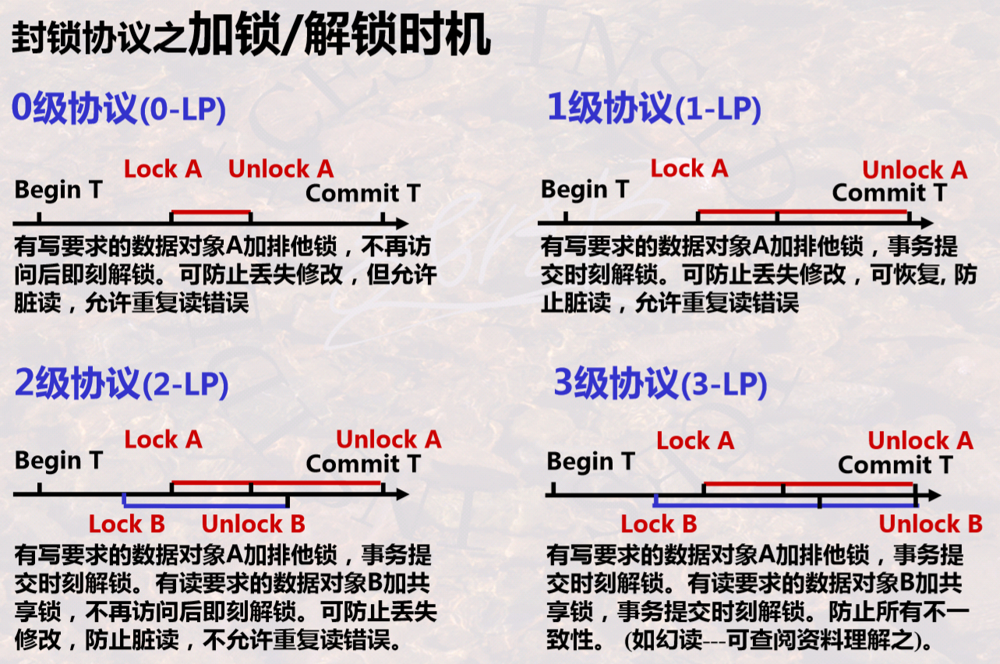
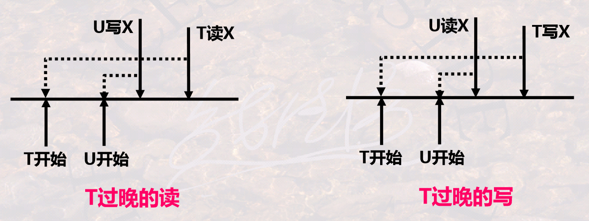

**Typist : Akame Qixisi / Excel Bloonow**

[toc]

------

# 数据库并发控制

## （一）并发事务调度的正确性及如何产生

一些基本操作。表达事务调度的一种模型，r~i~(A)表示事务T~i~读A，w~i~(A)表示事务T~i~写A。则一个T~1~事务可表示为：r~1~(A); w~1~(A); r~1~(B); w~1~(B)。

事务是并发控制的基本单位，并发控制应保证事务的ACID四个性质。并发操作带来的数据不一致的三种典型现象：丢失修改（lost update）、不可重复读（non-repeatable read）、读脏数据（dirty read）。并发控制的两大类基本思想为加锁和撤回。

多个事务并发执行时，DBMS一般有一个事务调度器来管理调度事务的执行。事务调度器引用一个锁表Locks，它记录了哪个事务对哪个元素加了什么样的锁。

**事务调度**（schedule）：一组事务的基本步（原子操作，如读、写、加锁、解锁等）的一种执行顺序称为对这组事务的一个调度。可以串行调度也可以并发调度；当且仅当并发调度下所得到的结果和串行调度的结果完全一致，则称该并发调度是正确的。

**可串行性**（Serializability）：不管数据库初始状态如何，一个调度对数据库状态的影响都和某个串行调度（不唯一）相同，则称这个调度具有可串行性，或是可串行化的（Serializable）。它是用来衡量并发调度正确性的一个概念，可串行化调度都是正确的并发调度，但正确的不一定可串行化。

**冲突**：一个调度中多个事务的一系列基本动作，如果两个或多个基本操作交换顺序，导致涉及这些基本操作的事务中至少有一个事务的行为会改变，则称这些基本操作是冲突的。有冲突的两个操作不能交换次序，没有冲突的两个操作是可交换的。常见的有冲突的几种情况：

- 同一个事务中的任何两个操作都是冲突的；
- 不同事务对同一个元素的两个写操作是冲突的；
- 不同事务对同一个元素的一读一写操作是冲突的。
- 一般而言，不同的事务读写不同的元素是无冲突的。

**冲突可串行性**：一个调度，如果通过交换相邻两个无冲突的操作能够转换到某一个串行的调度，则称此调度为冲突可串行化的调度。满足冲突可串行性一定满足可串行性，反之不一定。

$并发调度的正确性 \supseteq 可串行性 \supseteq 冲突可串行性$，无法直接判断前两项，但可以判断一个调度是否是冲突可串行化的，只要一个调度是冲突可串行化的，它一定是正确的；如果不是，也不一定是错误的。这里给出一个判断一个调度是否是冲突可串行化的算法。

1. 构造一个前驱图（有向图），结点是每一个事务T~i~；
2. 寻找所有任意有冲突的两个操作，它们所在的事务是T~i~和T~j~，根据它们基本操作的执行顺序，绘制一条有向边，在前的事务指向在后的事务；
3. 测试检查，如果此图没有环，则说明这个调度是冲突可串行化的，是正确的。再次指出，不是冲突可串行化的调度也不一定是错误的。

无法直接产生一个正确的事务调度，但是可以产生一个冲突可串行化的事务调度，它一定是正确的，总体上来说就两大类思想，即：基于锁的方法（基于封锁的并发控制），基于撤回的方法（基于时间戳的并发控制、基于有效性确认的并发控制）。

## （二）基于封锁的并发控制

对事务上锁解锁的操作，L~i~(A)表示事务T~i~对数据元素A加锁，U~i~(A)表示事务T~i~对数据元素A解锁。

锁是控制并发的一种手段，要求：每一数据元素都有唯一的锁；每一事务读写数据元素前都要获得锁，处理完成后都要释放锁；如果锁被其他事务获取，本事务则要等待。

锁主要分为两种类型：排他锁X（exclusive locks），只有获得锁的事务能读写、其他事务都不能读写；共享锁S（Shared locks），所有事务都可以读，但任何事务都不能写。此外还有更新锁U（Update locks），初始读，以后可升级为写；增量锁I（Incremental locks），用于增量更新，区分增量更新和其他类型的更新。

在加锁运用时，还需要规定一些规则，如何时申请X锁、S锁，锁的持续时间、何时释放等，这些规则称为加锁协议（lock protocol）。注意事务结束时可以正常结束（COMMIT），也可以非正常结束（ROLLBACK）。

**相容性矩阵**：当某一事务对一个数据对象持有一种锁时，是否允许另一事务再申请对该事务加某一类型的锁。



- 一级协议是指，事务T在修改数据R之前必须先对其加X锁，直到事务结束才释放。
- 二级协议是指，在一级协议基础上增加事务T在读取数据R之前必须先对其加S锁，读完后即可释放S锁。
- 三级协议是指，在一级协议基础上增加事务T在读取数据R之前必须先对其加S锁，直到事务结束才释放。

**封锁粒度**：指的是封锁数据对象的大小。可以是一个属性值、元组、元组结合、整个关系、整个DB；某索引项、整个索引。

多粒度封锁，首先定义多粒度树，根节点是整个数据库，表示最大的封锁粒度，叶节点表示最小的封锁粒度。显式封锁是应事务要求直接加到数据库对象上的锁；隐式封锁是该数据对象没独立加锁但有其上级节点被加锁而使该对数据象加上了锁。

多粒度加锁时要根据上级和下级判断是否封锁，在进行下级判断时类似树的搜索，效率很低。于是引入了意向锁（Intention Lock），対任一结点加锁时，必须先对它的上层结点加意向锁。分为意向共享锁（IS）、意向排它锁（IX）、共享意向排它锁（SIX）。

**两段封锁协议**（2PL，two-Phase Locking protocol）指的是，读写数据之前要获得锁；每个事务中所有封锁请求先于任何一个解锁请求，把加锁解锁严格划分为两个阶段：加锁段（又称扩展阶段）和解锁段（又称收缩阶段），加锁段中不能有解锁操作，解锁段中不能有加锁操作。

两端封锁协议可以保证一个调度是冲突可串行化的；事务遵循两段封锁协议是可串行化的充分条件，而不是必要条件。需要注意的是，两端封锁协议可能产生死锁。

## （三）基于时间戳的并发控制

用TS(T)表示一个事务T的时间戳。对DB中的每个数据元素x，系统保留其上最大的时间戳：RT(x)，读过该数据的事务中最大的时间戳，即最后读x的事务的时间戳；WT(x)，写过该数据的事务中最大的时间戳，即最后写x的事务的时间戳。C(x)，x的提交位，当且仅当最近写x的事务已经提交，C(x)的目的是避免出现事务读另一事务U所写数据然后U终止这样的情况。

时间戳（Timestamp）是一种基于时间的标志，将某一个时刻转换成一个数值（如UNIX的时间戳是从1970年元时到现在所经过的秒数）；时间戳具有唯一性和递增性。当一个事务T启动时，系统将该时刻赋给T，称为T的时间戳。时间戳可以表征一系列事务执行的先后次序，时间戳小的事务先执行，时间戳大的事务后执行。利用时间戳，可以不用锁来进行并发控制。

借助时间戳，强制使一组并发事务的交叉执行，等价于一个特定顺序（时间戳由小到大）的串行执行。如何强制需要在执行时判断冲突，对于并发调度的一个基本操作的序列：如无冲突，予以执行；如有冲突（事实上不可实现的行为），则撤销事务，并重启该事务，此时该事务获得了一个更大是时间戳，表明是后执行的事务。冲突可以有：读-读无冲突；读-写、写-读、写-写，先执行的事务后操作或后执行的事务先操作时，会发生冲突。

一种简单的调度规则，可以避免“两种事实上不可能实现的”冲突。

读-写并发（读-写、写-读）

- 若事务T读x，则将T的时间戳TS与WT(x)比较：若TS大（T后执行），则允许T操作，并且更改RT(x)为max{RT(x), TS}；否则有冲突，撤回T并重启。
- 若事务T写x，则将T的时间戳TS与RT(x)比较：若TS大（T后执行），则允许T操作，并且更改WT(x)为max{WT(x), TS}；否则有冲突，撤回T并重启。

写-写并发

- 若事务T写x，则将T的时间戳TS与WT(x)比较：若TS大（T后执行），则允许T写，并且更改WT(x)为TS；否则有冲突，撤回T并重启。



简单的调度无法解决读脏数据、托马斯写规则等问题，还有另一种调度规则，此处不再记录。注意判断哪些读写操作是合理的，哪些是不合理的，可以手动画出上图中的形式来判断。

假设调度器收到提交T的请求，它必须找到所有T所写的所有数据库元素x，并置C(x)为true，如果有任何等待x被提交的事务，这些事务就允许被继续执行。假设调度器收到终止T的请求，像前述步骤一样确定回滚T，那么任何等待T所写元素x的事务必须重新尝试读或写，看这一动作现在T的写被终止后是否合法。

## （四）基于有效性确认的并发控制

 事务在启动时刻被赋予唯一的时间戳，以示其启动顺序。为每一活跃保存其读写数据的集合：RS(T)，事务T读数据的集合；WS(T)，事务T写数据的集合。通过对多个事务的读写集合，判断是否有冲突（存在事实上不可实现的行为），即有效性确认，来完成事务的提交与回滚，强制事务以可串行化的方式执行。

调度器维护三个集合：START(T)，表示事务开始的时间；VAL(T)，表示事务T有效性确认的时间；FIN(T)，表示事务T写完数据的时间。

如果一个较早的事务U现在正在写入T应该读过的某些对象，则T的有效性不能确认。如果T在有效性确认后可能比一个较早的事务先写某个对象，则T的有效性不能确认。

# SQL Server并发控制

使用`WAITFOR DELAY '00:00:05'`等待5秒钟。

## （一）事务与锁

SQL Server 2005默认锁级别为表级锁，且系统默认只能设置100个锁。通过SQL Server的封锁操作是在相关语句的`WITH (table_hint)`子句中完成的，可用在SELECT、INSERT、UPDATE、DELETE等语句中指定表级锁定的方式和范围。常用关键词如下。

- `TABLOCK`，对表施加共享锁，在读完数据后立即释放封锁，可以避免读“脏”数据，但可能引起不可重复读问题。
-  `HOLDLOCK`，与TABLOCK —起使用，可将共享锁保留到事务完成，而不是在读完数据后立即释放，可以保证数据的可重复读。
- `NOLOCK`，不施加任何封锁，仅用于SELECT语句，会引起读“脏”数据。
- `TABLOCKX`，对表施加排他锁。
- `UPDLOCK`，对表中指定元组施加更新锁，这时其他事务可对同表中的其他元组也施加更新锁，但不能对表施加任何锁。 

如`SELECT * FROM CHOICES WITH (TABLOCK HOLDLOCK)`。

并发控制采用封锁技术实现，当一个事务欲对某个数据对象操作时，可申请对该对象加锁，取得对数据对象的一定控制，以限制其他事务对该对象的操作。其语句格式为：

```assembly
LOCK TABLE 表名[, ...] INSHARE(EXCLUSVE, SHARE UPDATE) MODE [NOWAIT];
```

- NOWAIT表示多个用户要求封锁相同的关系时，后来提出的要求会被立即退回去，否则会等待该资源释放。

## （二）事务与隔离级别

通过设置锁的生命周期，来对并发执行加以适当的控制，实现不同程度的并发控制，即隔离级别。SQL Server提供的6种隔离级别如下：

- READ UNCOMMITTED，未提交读，事务隔离的最低级别，仅可保证不读物理损坏的数据。
- READ COMMITED，提交读，SQL Server的默认级别，可以保证不读脏数据。
- READ_COMMITED_SNAPSHOT，提交快照读，又称语句级快照，基于快照的一种，以乐观控制方式保证不读脏数据。
- REPEATABLE READ，可重复读，保证读一致性。
- ALLOW_SNAPSHOT_ISOLATION，快照隔离，又称事务级快照，基于行版本快照的一种，以乐观控制方式确保读一致性。
- SERIALIZABLE，可串行化，事务隔离的最高级别，事务之间完全隔离，在该级别上可以保证并发事务均是可串行的。 

事务必须运行在可重复读或更髙隔离级别上才可防止丢失更新。设置的各种命令如下：

```sql
SET TRANSACTION ISOLATION LEVEL {READ UNCOMMITTED | READ COMMITED | REPEATABLE READ SERIALIZABLE};
```

- 设置非行版本快照隔离级别。

```sql
ALTER DATABASE database_name SET READ_COMMITED_SNAPSHOT | ALLOW_SNAPSHOT_ISOLATION ON;
```

- 设置行版本快照隔离级别。

```sql
SET TRANSACTION ISOLATION LEVEL READ COMMITED | SNAPSHOT;
```

- 同时在启动事务前执行。

## （三）锁的竞争

```sql
SET LOCK_TIMEOUT 2000	-- 2秒
```

- 当设置好时间后，锁定管理器将自动解除锁的争夺。