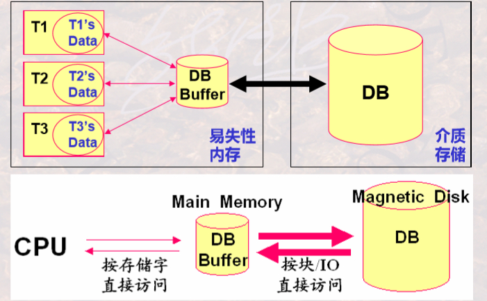
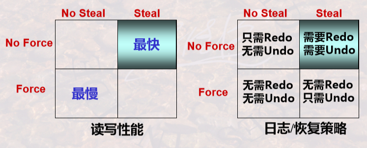

[toc]

# 数据库恢复技术

## （一）事务局部存储、数据库缓冲区、磁盘

DBMS利用易失性内存和外存（介质存储）来管理存储数据。在外存如硬盘上存储数据库，在内存上存储数据库缓冲区和事务内部的数据，这三者之间是否一致就显得尤为重要。故障、故障恢复的基本思路就从这一点出发来研究。故障恢复就是把DB由当前的不正确状态恢复到已知为正确的某一状态，它涉及到如何保证事务的原子性和持久性。持久性要求已提交事务的缓冲区内容保证写回磁盘；未提交事务的缓冲区内容不能影响磁盘。



根据上一段所讨论的DBMS用到的数据库存储、数据库缓冲区存储、事务内部数据的存储，数据库的故障种类主要有事务故障、系统故障、介质故障。

数据库通常由元素构成，通常，1元素=1磁盘块=1内存页/块；可以更小，1元素=1记录；或者更大，1元素=1关系。

每个事务都会读/写某些元素，READ和WRITE由事务发出，INPUT和OUTPUT由缓冲区管理器发出。

- READ(X, t)，将数据库缓冲区Buffer中的元素X读到事务的局部变量t中。
- WRITE(X, t)，将事务局部变量t写回数据库缓冲区中的元素X。
- INPUT(X)，将元素X从磁盘读入到内存缓冲区中。
- OUTPUT(X)，强制将数据库缓冲区中的元素X写回到磁盘中。

每个事务都以提交（COMMIT）结束或者撤销（ABORT）结束。

缓冲区和磁盘中的内容不是时刻都保持一致的。缓冲区处理策略，既要考虑数据读写的速度，又要考虑怎样保证数据正确，当前最常用Steal+No force。

- Force，内存中的数据晚在commit的时候写入磁盘。
- No steal，不允许在事务commit之前把内存中的数据写入磁盘。
- No force，内存中的数据可以一直保留，在commit之后过一段时间再写入磁盘。此时在系统崩溃的时候可能还没写入到磁盘，需要Redo。
- Steal，允许在事务commit之前把内存中的数据写入磁盘。此时若系统在commit之前崩溃时，已经有数据写入到磁盘了，要恢复到崩溃前的状态，需要Undo。

## （二）事务故障

事物故障，某一个程序（事务）自身运行错误所引起的故障。影响较小仅影响程序（事务）本身。

恢复手段可以是通过重做事务（Redo），保证已提交事务的持久性；撤销事务（Undo），消除未提交事务的影响。

## （三）系统故障

系统故障，由于掉电、非正常关机等所造成的内存内容丢失，所引起的故障。影响正在运行的事务以及数据库缓冲区，数据库缓冲区将涉及正在运行和已运行的事务；造成数据库缓冲区和磁盘数据库的不一致性。

通过运行日志（System Log）恢复。运行日志是DBMS维护的一个文件，该文件以流水的方式记录了每一个事务对数据库的每一次操作及操作顺序。运行日志直接写到介质存储上，会保证正确性。当事务对数据库进行操作时，先写运行日志，写成功后，再与数据库缓冲区进行信息交换，再将数据库缓冲区更新的内容写道存储介质DB上。

按照运行日志记录的事务操作顺序。当事务在发生故障时已正确结束，重做事务Redo；当事务在发生故障时未结束，撤消事务Undo。

运行日志保留了若干天的记录，当发生系统故障时需要从某一个点处开始恢复事务，将该点称为**检查点**（checkpoint）。在检查点时刻，DBMS强制使内存DB Buffer中的内容与介质DB中的内容保持一致，即将DB Buffer更新的所有内容写回DB中；从而保证了在检查点之前内存中数据与介质中数据是保持一致的。

那么在利用检查点进行系统故障恢复时，就可以：检查点之前结束的事务不需要恢复（已经写回DB）；检查点之后结束或发生的事务需要依据运行日志进行恢复（不能确定是否写回DB），故障点前结束的重做，故障点时刻未结束的撤消。

### 1. 日志概述

对于以记录为单位的日志文件，日志会保存每一个条被修改（插入、修改、删除）的记录（元组）到日志文件。

日志记录的信息主要有以下几种。

- `<Start T>`，表示事务T已经开始，即每个事务的开始标志。
- `<Commit T>`，表示事务T成功完成。`<Abort T>`，事务T未成功，被中止。即每个事务的结束标志。
- `<T, X, v1>`或者`<T, X, v2>`或者`<T, X, v1,v2>`，表示事务T改变了数据库元素X，X原来的值为v1(X的旧值)，X新的值为v2。即每个事物的所有更新操作。

三种日志：Undo型日志，Redo型日志，Undo/Redo型日志。根据记录内容和记录次序不同，恢复策略也不同。



### 2. Undo型日志

对于任一事务T，按下列顺序向磁盘输出T的日志信息：

1. \<start T>在事务开始时首先被写入。
2. <T, X, v1>被写到日志中，保存的是仅是元素X的旧值。
3. OUTPUT(X)。将事务改变的所有数据写到磁盘前不能提交该事务，存在问题，频繁的写磁盘可能性能下降。
4. \<COMMIT T>或\<ABORT T>被写到日志中，根据事务是否提交还是终止。

检查点的设置有静态和动态两种：

- 静止检查点，周期性地对日志设置检查点。需要停止接受新的事务, 等到所有当前活跃事务提交或终止，并在日志中写入了COMMIT或ABORT记录后，将日志刷新到磁盘，写入日志记录`<CKPT>`，并再次刷新日志。
- 非静止检查点，在设置检查点时不必关闭系统，允许新事务进入。该检查点是一个范围，设置检查点时将正在运行的事务记录下来，写入一条`<START CKPT(T1,…,Tk)>`，其中T1,…,Tk 是所有活跃的未结束的事务，继续正常的操作，直到T1,…,Tk都提交时，写入`<END CKPT>`。

故障恢复时，对于一个事务，要判断是否恢复它，要先确定一个事务是否提交，判断方法如下：

- <STARTT> ... <COMMITT>，事务已结束并提交，无需恢复，跳过。
- <STARTT> ... <ABORTT>，事务已结束但未提交，需要恢复。
- <STARTT> ... ，事务未提交，需要恢复。

然后，从日志的**最后位置**开始，**倒序**向前直到遇到第一个检查点\<CKPT>，处理每一条记录，**撤销未提交**事务的所有修改：

- <COMMITT>，标记T已提交。
- <ABORTT>，标记T已结束但未提交。
- <T, X, v>，如果T**未提交**，则将X=v写回磁盘，否则跳过。
- <STARTT>，跳过。

### 3. Redo型日志

对于任一事务T，按下列顺序向磁盘输出T的日志信息：

1. \<start T>在事务开始时首先被写入。
2. <T, X, v2>被写到日志中，保存的是仅是元素X的新值。
3. \<COMMIT T>或\<ABORT T>被写到日志中，根据事务是否提交还是终止。
4. OUTPUT(X)。Redo型日志先提交再输出，灵活性差，数据必须在Commit后才可见（写到磁盘）。

检查点的设置同Undo中所述，需要注意的是，在设置动态检查点时可能会又设置新的检查点，那么在恢复时使用的是最后一个完整的（即有Start和End）检查点。

故障恢复时，对于一个事务，判断它是否提交的方法同Undo所述。

然后，从日志的**起始位置**开始，这个开始位置有检查点确定，即找最后一个END CRPT所对应的START CRPT中包含事务的最早的START T处作为开始位置，**正序**处理每一条记录，**重做已提交**事务的所有修改：

- <COMMITT>，标记T已提交。
- <ABORTT>，标记T已结束但未提交。
- <T, X, v>，如果T**已提交**，则将X=v写回磁盘，否则跳过。
- <STARTT>，跳过。

### 4. Undo/Redo结合型日志

对于任一事务T，按下列顺序向磁盘输出T的日志信息：

1. \<start T>在事务开始时首先被写入。
2. <T, X, v1, v2>被写到日志中，保存的是元素X的旧值v1和新值v2。
3. \<COMMIT T>或\<ABORT T>被写到日志中，根据事务是否提交还是终止。或者OUTPUT(X)。它们的顺序没有要求，只要保证<T, X, v1, v2>先于OUTPUT写完即可。

检查点的设置同之前所述。

对于一个事务，判断它是否提交。然后，自后向前，按日志记录的反序，撤销所有未提交事务的所有修改；自前向后地，按日志记录的正序，重做所有已提交的事务：

- <COMMITT>，标记T已提交。
- <ABORTT>，标记T已结束但未提交。
- <T, X, u, v>，如果T未提交，则将X=u写回磁盘，否则将X=v写回磁盘。
- <STARTT>，跳过。

## （四）介质故障

介质故障，由于介质损坏等所引起的故障。影响是全面的，既影响内存中的数据，又影响介质中存储的数据。

通过副本（Copy）即另一个存储介质恢复。在某一时刻，对数据库在其他介质存储上产生的另一份等同记录，副本备份的时间称为**转储点**；当故障发生时，用副本替换被损坏的数据库，由于介质故障影响全面，在用副本恢复后还需要依据运行日志进行恢复。这就要求运行日志必须能够涵盖转储点之前的一段时间，不能出现间断。

这就要求正确的确定备份的时间即转储点。过频，影响系统工作效率；过疏，会造成运行日志过大，也影响系统运行性能。 备份转储周期与运行日志的大小密切相关，应注意防止衔接不畅而引起的漏洞。

转储可分为静态转储和动态转储。静态转储期间不允许对数据库的任何存取、修改活动；动态转储期间允许对数据库进行存取或修改。转储还分为海里转储（即每次转储全部数据库）和增量转储（即每次转储上一次转储后更新过的数据）。

数据库镜像数据是将数据库从一个硬盘复制到另个一个磁盘。

# SQL Server数据库备份与还原、导入与导出

数据库的备份与还原是物理层面的；而导入与导出是逻辑层面的。既可以通过Microsoft SQL Server Management Studio图形化界面进行操作。

1. **备份**

在`数据库服务器`下，找到`服务器对象`下的`备份设备`选项，可以添加备份设备。在具体数据库上右键选择`属性`，可以设置数据库的恢复模式。在具体数据库上右键，选择`任务`下的`备份`可以选择备份方式并开始备份。

也可以使用Transact-SQL语句进行操作。

```sql
ALTER DATABASE School SET RECOVERY FULL;
```

- 将School数据库设置为完全恢复模式。

```sql
BACKUP DATABASE database_name TO {DISK|TAPE}='name' [WITH DIFFERENTIAL];
BACKUP DATABASE School TO SchoolBackup;		-- e.g.
BACKUP DATABASE School TO SchoolBackup WITH DIFFERENTIAL;
```

- 也可以使用`BACKUP`指令备份数据库，`WITH DIFFERENTIAL`指定备份模式为差异备份。

```sql
BACKUP LOG database name TO {DISK,TAPE)='name';
BACKUP LOG School TO SchoolBackup;		-- e.g.
```

- 对数据库进行事务日志备份。注意：简单恢复模式不允许备份事务日志文件。

2. **还原**

选择具体的数据库右击，选择`任务`下的`还原`选项，可以选择还原的来源、是否覆盖原来的数据库等。

也可以使用Transact-SQL语句进行操作。

```sql
RESTORE DATABASE database_name FROM {DISK|TAPE}='name' [WITH [NORECOVERY|][REPLACE]];
RESTORE DATABASE School FROM SchoolBackup WITH NORECOVERY;		-- e.g.
```

- 对数据库进行恢复。
- NORECOVERY指示还原操作不撤销备份中任何未提交的事务，RECOVERY 指示还原操作撤销备份中任何未提交的事务，REPLACE指示即使存在另一个具有相同名称的数据库，也创建指定的数据库及相关文件，即覆盖现有数据库。 

```sql
RESTORE LOG database_name FROM {DISK|TAPE}='name' [WITH [NORECOVERY|RECOVERY] [STOPAT = date_time | STOPATMARK='mark_name' [AFTER date_time] | STOPBEFOREMARK = 'mark_name' [AFTER date_time] ];
```

- 根据事务日志备份进行恢复。

3. **导入与导出**

“导出”是将数据从数据库中复制到数据文件中，“导入”是将数据从数据文件 中加载到SQL Server数据库中。通过导入与导出操作可以实现SQL Server和其他不同类型数据源（如Oracle、Access等数据库）之间自由地移动和使用多种不同格式的数据。

利用SQL Server Management Studio中的“导人和导出向导”对数据库进行导入和导出操作，即右击具体数据库的`任务`下选择导入操作或导出操作。