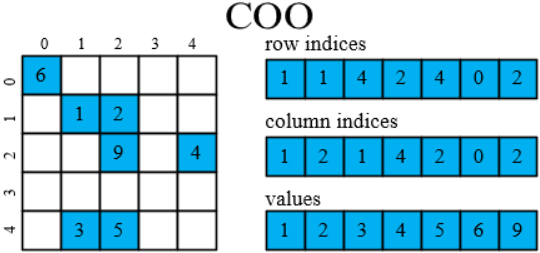
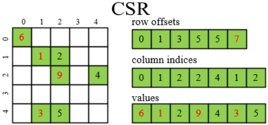
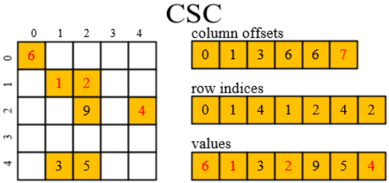

# 特殊矩阵的数据结构

## 稀疏矩阵存储格式

稀疏矩阵常用的存储格式有COO（coordinate，坐标格式）、CSR（compressed sparse row，压缩稀疏行）、（compressed sparse column，压缩稀疏列）三种。

COO格式是将矩阵中的非零元素以坐标的方式存储，这种存储格式比较简单，每一个非零元素用一个三元组（行号,列号,数值）来表示，即(row_idx,col_idx,val)，如下图所示。



- row_indices：values数组中对应元素的行索引。
- column_indices：values数组中对应元素的列索引。
- values：矩阵中的非零元素的数值。

CSR格式是将矩阵元素按行顺序存储，如下图所示。



- row_offsets：行偏移量。若矩阵有m行，则数组有m+1个元素。数组的idx索引上的元素代表的是矩阵行索引为idx的行的信息，它表示矩阵idx行之前（不含）所有非零元素的个数，最后一个值就可表示矩阵所有非零元素的个数。显然idx+1行的值减去idx行的值，得到的即是idx行非零元素的个数。如果idx行的非零元素个数不为0（即该行有非零元素），则row_offsets[idx]的值就是，该idx行的其他信息在column_indices数组和values数组中的索引（偏移）。如果计算得到idx行的非零元素个数为0（全是零元素），则跳过该行。

- column_indices：对于某一行来说，非零元素的列索引（从左到右）。
- values：矩阵中的非零元素的数值。

CSC格式是将矩阵元素按列顺序存储，如下图所示。



- column_offsets：列偏移量。若矩阵有n列，则数组有n+1个元素。数组的idx索引上的元素代表的是矩阵列索引为idx的列的信息，它表示矩阵idx列之前（不含）所有非零元素的个数，最后一个值就可表示矩阵所有非零元素的个数。显然idx+1列的值减去idx列的值，得到的即是idx列非零元素的个数。如果idx列的非零元素个数不为0（即该列有非零元素），则column_offsets[idx]的值就是，该idx列的其他信息在row_indices数组和values数组中的索引（偏移）。如果计算得到idx列的非零元素个数为0（全是零元素），则跳过该列。
- row_indices：对于某一列来说，非零元素的行索引（从上到下）。
- values：矩阵中的非零元素的数值。

CSC与CSR类似，只不过其存储遍历方向正好一个按行一个按列。

## 带状矩阵及其存储

当稀疏矩阵的非零元素都集中在以主对角线为中心的带状区域时，称为带状矩阵（Band Matrix）。假设一个M行N列的带状矩阵，其上带宽的对角线条数为U，下带宽的对角线条数为L，则其示意图如下所示。


带状矩阵在计算机中的存储时，将一条对角线组织为一行元素，两端不足的位置使用无意义的值进行补齐，如上图所示。可以看到，带状矩阵实际上存储(U+L+1)\*N个元素，并存在一些无效的占位元素，可以按行主序存储或列主序存储。元素的逻辑位置为A[i,j]时，则该元素在内存中的存储到Storage[i-j+U+1,j]位置。

# 二叉树的非递归遍历

## 判断节点是第几次遍历

在二叉树遍历的非递归实现中，关键之处在于，判断一个节点是被第几次遍历，从而执行相应的访问操作。从原理上分析，一个BTNode节点同时具有value数据、left左孩子、right右孩子，而在递归过程中，总是首先要遍历到一个BTNode节点，于是根据前序遍历（this>left>right）、中序遍历（left>this>right）、后序遍历（left>right>this）的不同顺序要求，可以知道需要在第几次遍历到某个节点时执行访问操作。前序遍历，在第一次遍历到某个节点时，即需要执行访问操作；中序遍历，在第二次遍历到某个节点时，即需要执行访问操作；后续遍历，在第三次遍历到某个节点时，即需要执行访问操作。

为追求极致化的时间复杂度和空间复杂度，前序遍历、中序遍历、后序遍历的非递归实现，往往会巧妙设计各种变量的重复使用、入栈出栈的不同时机，来判断是第几次遍历到某个节点。这种算法的设计较难理解，而直接明确存储某个节点是第几次访问，更容易理解和编程实现。对每个节点而言，需要额外的一个整数的空间，额外的两次入栈出栈操作。

```c++
void Traversal(BTNode *bt) {
    const int FIRST = 1, SECOND = 2, THIRD = 3;
    stack<pair<BTNode*, int>> stack;
    stack.push({ bt, FIRST });
    while (!stack.empty()) {
        auto frame = stack.top(); stack.pop();
        BTNode *node = frame.first;
        int count = frame.second;
        if (node == nullptr) continue;  // do nothing
        switch (count) {
        case FIRST:
            // 第一次遍历到该节点，刚从父节点指过来；若是前序遍历，则在此处执行访问操作
            stack.push({ node, SECOND });       // 第一次遍历结束，入栈以被第二次遍历
            stack.push({ node->left, FIRST });  // 左孩子入栈，以确保下个节点遍历其左孩子
            break;
        case SECOND:
            // 第二次遍历到该节点，刚从左孩子返回来；若是中序遍历，则在此处执行访问操作
            stack.push({ node, THIRD });         // 第二次遍历结束，入栈以被第三次遍历
            stack.push({ node->right, FIRST });  // 右孩子入栈，以确保下个节点遍历其右孩子
            break;
        case THIRD:
        default:
            // 第三次遍历到该节点，刚从右孩子返回来；若是后序遍历，则在此处执行访问操作
            // 第三次遍历结束，左右孩子、当前节点均被遍历完成，无需任何操作
            break;
        }
    }
}
```

针对上述过程，若精心设计入栈出栈的不同时机、变量的复用，即可避免使用额外的内存空间与额外的入栈出栈操作，从而得到极致化的非递归实现。

## 根据栈帧的先后顺序

在二叉树遍历的非递归实现中，关键之处在于，栈帧的先后顺序，决定前序遍历（this>left>right）、中序遍历（left>this>right）、后序遍历（left>right>this）的不同顺序。从原理上分析，从原理上分析，一个BTNode节点同时具有value数据、left左孩子、right右孩子，而在递归过程中，总是首先要遍历到一个BTNode节点，于是，总在栈的迭代循环的一开始，就从栈顶弹出一个栈帧，表示首先遍历到一个BTNode节点，此时不执行访问操作，而是为其设置一个已遍历到的标识，用于在下次遍历到的时候执行访问操作。

根据栈帧的先后顺序，并根据前序遍历（this>left>right）、中序遍历（left>this>right）、后序遍历（left>right>this）的不同顺序要求，再次将当前节点、左孩子、有孩子入栈，并在出栈时完成对具有标识节点的访问操作。前序遍历，当前节点应处于栈顶，故按照right>left>this的顺序入栈；中序遍历，当前节点的栈帧应处于左孩子和右孩子之间，故按照right>this>left的顺序入栈；后续遍历，当前节点的栈帧应该处于左孩子和右孩子之后，故按照this>right>left的顺序入栈。

```c++
void Traversal(BTNode *bt) {
    const int FIRST = 1, SECOND = 2;
    stack<pair<BTNode*, int>> stack;
    stack.push({ bt, FIRST });
    while (!stack.empty()) {
        auto frame = stack.top(); stack.pop();
        BTNode *node = frame.first;
        int count = frame.second;
        if (node == nullptr) continue;  // do nothing
        if (count == FIRST) {
            // 按照前序遍历、中序遍历、后序遍历的顺序要求，以相反的顺序入栈
            // 此处以中序遍历为示例
            stack.push({ node->right, FIRST });
            stack.push({ node, SECOND });
            stack.push({ node->left, FIRST });
        } else {
            // count == SECOND
            // 在此处执行访问操作
        }
    }
}
```

针对上述过程，若精心设计入栈出栈的不同时机、变量的复用，即可避免使用额外的内存空间与额外的入栈出栈操作，从而得到极致化的非递归实现。
