[toc]

# 八、运算器设计

## （一）二进制与逻辑电路

### 1. 计算机中数的表示

注：该部分内容整合了其他书籍的知识，并不全部来自该书。

人们使用计算机处理信息。无论被处理信息的实质形态如何千差万别，计算机内部只能处理离散化的编码后的数据。目前，计算机系统内部的所有数据均采用二进制编码。这样做的原因主要有两点。(1)二进制只有0和1两个数，其编码、计数和运算规则都很简单，特别是其中的符号0和1恰好可以与逻辑命题的“假”和“真”两个值相对应，因而能通过逻辑电路方便地实现算术运算。(2)二进制只有两种基本状态，使用有两个稳定状态的物理器件就能表示二进制数的每一位，而制造有两个稳定状态的物理器件要比制造有多个稳定状态的物理器件容易得多。例如电压的高低、磁极的南北极、脉冲的正负、磁通量的有无。半导体工艺无论是TTL、ECL还是CMOS，都是用电压的高低来表示二进制的两个基本状态。

所有数据在计算机内部最终都交由机器指令处理，被处理的数据分为数值数据和非数值数据两类。数值数据用于表示数量的多少；非数值数据就是一个二进制比特串，不表示数量多少。对于给定的一个二进制比特串，要确定其表达的数值，需要明确三个要素：进位制、定/浮点表示、编码规则。

#### (1) 二进制

二进制与日常使用的十进制原理是相同的，区别仅在于两者的基数不同。一般地，任意一个R进制数（R是正整数）$X=x_nx_{n-1}\cdots x_1x_0.x_{-1}x_{-2}\cdots x_{1-m}x_{-m}$（m，n为整数），其（十进制）值可以通过如下方式求得$\text{Value}(X)=x_n\times R^n+\cdots+x_0\times R^0+x_{-1}\times R^{-1}+\cdots + x_{-m}\times R^{-m}$，其中R称为基数，代表每个数位上可以使用的不同数字符号的个数，$R^i$称为第i位上的权，即采用“逢R进一”。而十进制数转化为任意进制数，常用基数乘除法，这种方法对十进制数的整数部分和小数部分分别处理，最后拼接起来。整数部分转换采用除基取余法，即除基取余，先余为低，后余为高，商为零时结束；小数部分采用乘基取整法，即乘基取整，先整为高，后整为低，乘积为1.0（或满足精度要求）时结束。

二进制即是上述一般性定义中$R=2$的具体情况。计算机内部的所有数据都采用二进制编码表示，但是在表示绝对值较大的数据时需要很多位，不利于书写和阅读，因此经常采用十六进制编码来记录数据。具体做法是，将一个数由二进制编码转换为十六进制编码时，从小数点开始，向左、向右两个方向，每4个二进制位一组（不足时小数点左侧的左补0，小数点右侧的右补0），直接替换为一个十六进制位。十六进制编码转换为二进制编码的方法类似，只是每个十六进制位替换为4个二进制位。

在日常生活中，通常用正号、负号来分别表示正数（正号可省略）和负数，这种带有“+”或“-”符号的数称为真值。真值是机器数所代表的实际值。在计算机中，通常将数的符号和数值部分一起编码，将数据的符号数字化，通常用0表示正，用1表示负，这种把符号数字化的数称为机器数。常用的有原码、补码、反码和移码。

根据小数点的位置是否固定，在计算机中有两种数据格式：定点表示和浮点表示。在现代计算机中，通常用定点补码整数表示整数，用定点原码小数表示浮点数的尾数部分，用移码表示浮点数的阶码部分。

#### (2) 定点数的编码表示

定点表示法用来表示定点小数和定点整数。定点小数是纯小数，约定小数点位置在符号位之后、有效数值部分最高位之前，其数据的形式为$X=x_0.x_1x_2\cdots x_n$，其中$x_0$为符号位，$x_1\cdots x_n$是数值的有效部分，也称尾数，$x_1$为最高有效位。定点整数是纯整数，约定小数点位置在有效数值部分最低位之后，其数据的形式为$X=x_0x_1x_2\cdots x_n$，其中$x_0$为符号位，$x_1\cdots x_n$是数值的有效部分，$x_n$为最低有效位。定点数编码表示法主要有以下四种：原码、补码、反码和移码。

注意：下面的内容中，假定有n位数值位，1位符号位，整个数据完整的字长为n+1位。

(1) 原码表示法

用机器数的最高位表示数的符号，其余各位表示数的绝对值。原码的定义如下。

纯小数的原码定义：
$$
[X]_{原}=\begin{cases}
X & 0\le X<1 \\
1-X=1+|X| & -1<X\le 0
\end{cases} \qquad (X是真值,[X]_{原}是原码机器数)
$$
例如，若$X_1=+0.1101,X_2=-0.1101$，字长为8位，则其原码表示为$[X_1]_{原}=0.1101000,[X_2]_{原}=1-(-0.1101)=1.0000+0.1101=1.1101000$，其中最高位是符号位。

纯整数的原码定义：
$$
[X]_{原}=\begin{cases}
0,X & 0\le X<2^n \\
2^n-X=2^n+|X| & -2^n<X\le 0
\end{cases} \qquad (X是真值,n是数值部分的位数,不含1位符号位)
$$
例如，若$X_1=+1110,X_2=-1110$，字长为8位，则其原码表示为$[X_1]_{原}=0,0001110,[X_2]_{原}=2^7-(-1110)=10000000+1110=1,0001110$，其中最高位是符号位。

若字长为n+1位，则原码整数的表示范围为$[-(2^n-1),2^n-1]$，关于原点对称。

需要注意的是，真值零的原码表示有正零和负零两种形式，即$[+0]_{原}=0,0000,[-0]_{原}=1,0000$。

原码表示的优点是与真值的对应关系简单、直观，与真值的转换简单，并且用原码实现乘除运算比较简便。缺点是0定表示不唯一，更重要的是原码加减运算比较复杂。

(2) 补码表示法

原码加减运算规则比较复杂，对于两个不同符号数的加法（或同符号数的剑法），先要比较两个数的绝对值大小，然后用绝对值大的数减去绝对值小的数，最后还要选择合适的符号。而补码表示法中的加减运算则可以统一采用加法操作实现。将$[X]_{补}$的符号位与数值位一起右移并保持符号位的值不变，可实现除法功能。

纯小数的补码定义：
$$
[X]_{补}=\begin{cases}
X & 0\le X<1 \\
2+X=2-|X| & -1\le X<0
\end{cases} \qquad (\text{mod }2)
$$
例如，若$X_1=+0.1001,X_2=-0.0110$，字长为8位，则其补码表示为$[X_1]_{补}=0.1001000,[X_2]_{补}=2+(-0.0110)=10.0000-0.0110=1.1101000$，其中最高位是符号位。

若字长为n+1位，则补码小数的表示范围为$[-1\le X\le1-2^{-n}]$，比原码多表示$-1$，$[-1]_{补}=10.0000-1.0000=1.0000$。

纯整数的补码定义：
$$
[X]_{补}=\begin{cases}
0,X & 0\le X<2^n \\
2^{n+1}+X=2^{n+1}-|X| & -2^n\le X\le0
\end{cases} \qquad (\text{mod }2^{n+1})
$$
例如，若$X_1=+1010,X_2=-1101$，字长为8位，则其补码表示为$[X_1]_{补}=0,0001010,[X_2]_{补}=2^8+(-1101)=100000000-1101=1,1110011$，其中最高位是符号位。

若字长为n+1位，则补码整数的表示范围为$[-2^n,2^n-1]$，比原码多表示$-2^n$，$[-2^n]_{补}=2^{n+1}-2^n=2^n=1,0000\ (n=4)$。

需要注意的是，真值零的补码表示是唯一的，即$[+0]_{补}=[-0]_{补}=0,0000$。

补码的加减法运算有如下性质：

1. $[X+Y]_{补}=[X]_{补}+[Y]_{补}\ (\text{mod }2)$
2. $[X-Y]_{补}=[X]_{补}+[-Y]_{补}=[X]_{补}-[Y]_{补}\ (\text{mod }2)$

变形补码（又称模4补码），其补码小数的定义为：
$$
[X]_{补}=\begin{cases}
X & 0\le X<1 \\
4+X=4-|X| & -1\le X<0
\end{cases} \qquad (\text{mod }4)
$$
模4补码采用双符号位00表示正，11表示负，用在完成算术运算的ALU部件中。

真值转换为补码：对于正数，与原码的方式一样；对于负数，符号位取1，其余各位由真值“各位取反，末位加1”得到。补码转换为真值：若符号位为0，则与原码的方式一样；若符号位为1，则真值的符号为负，其余数值部分的各位由补码“各位取反，末位加1”得到。值得注意的是，“各位取反，末位加1”是转换的逻辑，在实际操作中有更简便的方法，它实际上就相当于“从右端向左直到第一个1（含）保持不变，再向左各位取反，符号位不变”。

(3) 反码表示法

正数时，反码与原码一样；负数时，反码就是原码除符号位外，其他位按位取反。

反码表示存在以下几个方面的不足：0的表示不唯一（存在正负0）；表示范围比补码少一个最小负数。反码在计算机中很少使用，通常是用来由原码求补码或者由补码求原码的过渡码，即中间表示形式。

(4) 移码表示法

移码只能表示定点整数。移码通常用来表示浮点数的阶码。

移码就是在真值X上加上一个常数（偏置量），通常这个常数取$2^n$（n为数值部分的位数，不含1位符号位），相当于X在数轴上向正方向偏移了若干单位。

（纯整数）移码定义：
$$
[X]_{移}=2^n+X \qquad (-2^n\le X<2^n,其中n为数值部分的位数,字长为n+1)
$$
例如，若整数$X_1=+10101,X_2=-10101$，字长为8位，则其移码表示为$[X_1]_{移}=2^7+10101=10000000+10101=1,0010101,[X_2]_{移}=2^7+(-10101)=10000000-10101=0,1101011$，其中最高位是符号位。可以看到，与其他编码方式正好相反的是，移码的符号位用1表示正，0表示负。

移码具有以下特点：

1. 移码中零的表示唯一，$[+0]_{移}=2^n+0=[-0]_{移}=2^n-0=2^n=1,0000\ (n=4)$。
2. 一个真值的移码和补码仅差一位符号位，$[X]_{移}$的符号位取反即得$[X]_{补}$，反之亦然。
3. 移码的表示范围是$[-2^n,2^n-1]$，移码全是0时，对应真值的最小值$-2^n$，移码全是1时，对应真值的最大值$2^n-1$。
4. 移码保持了数据原有的大小顺序，移码大真值就大，移码小真值就小。

**原码、补码、反码、移码这四种编码表示的总结如下**：

1. 原码、补码、反码的符号位相同，正数的机器码相同。
2. 原码、反码的表示在数轴上对称，二者都存在$+0,-0$两个零。
3. 补码、移码的表示在数轴上不对称，0的表示唯一，它们比原码、反码多表示一个数。
4. 整数的补码、移码符号位相反，数值位相同。
5. 负数的反码、补码末位差1。反码就是对原码“各位取反，末位加1”得到补码过程中的过渡数。
6. 原码很容易判断大小；而负数的反码、补码难以直接判断大小，其有如下规律：对于负数，数值部分越大，则其真值越大（越靠近0），绝对值越小。

对于定点整数来说，当一个编码的全部二进制位均为数值位而没有符号位时，该编码表示就是无符号整数，也直接称为无符号数。此时，默认数的符号为正。由于无符号整数省略了一位符号位，所以在字长相同的情况下，它能表示的最大数比带符号整数能表示的大。例如，n位无符号整数，对应的表示范围为$[0,2^n-1]$。一般在全部是正数运算且不出现负值结果的场合下，使用无符号整数表示。例如，用无符号整数进行地址运算，或用它来表示指针。

带符号整数的表示将符号数值化，并将符号位放在有效数字的前面，就组成了带符号整数。虽然原码、补码、反码和移码都可以用来表示带符号整数，但补码表示有其明显的优势：(1)与原码和反码相比，0的补码表示唯一；(2)与原码和移码相比，补码运算规则比较简单，且符号位可以和数值位一起参加运算；(3)与原码和反码相比，补码比原码和反码多表示一个最小负数。计算机中的带符号整数都用补码表示，故n位带符号整数的表示范围是$[-2^{n-1},2^{n-1}-1]$。

#### (3) 浮点数的表示

浮点数表示法是指以适当的形式将比例因子表示在数据中，让小数点的位置根据需要而浮动。这样，在位数有限的情况下，既扩大了数的表示范围，又保持了数的有效精度。

(1) 浮点数的表示格式

通常，浮点数表示为$N=(-1)^s\times M\times R^e$，式中S取值0或1用来决定浮点数的符号；M是一个二进制定点小数，称为尾数，一般用定点原码小数表示；e是一个二进制定点整数，称为阶码或指数，用移码表示；R是基数（隐含），可以约定为2、4、16等。

可见浮点数由数符、尾数和阶码三部分组成。尾数的位数反应浮点数的精度，阶码的位数反应浮点数的表示范围，阶码的值反应浮点数的小数点的实际位置。

(2) IEEE 754标准浮点数格式

IEEE 754标准中定义了两种基本的浮点数格式：32位的单精度格式和64位的双精度格式，如下图8.1所示。

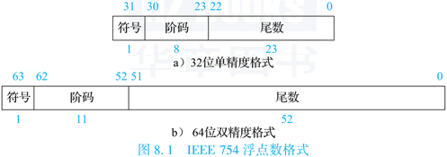

32位单精度格式中包含1位符号、8位阶码和23位尾数；64位双精度格式中包含1位符号、11位阶码和52位尾数。两种格式下基数均隐含为2。

IEEE 754标准中，尾数用原码表示。由于表示同一个数的时候尾数可以有多种表示（尾数大阶码小或尾数小阶码大等），因此需要一个规格化的表示来使得表示唯一。IEEE 754标准中规格化尾数的表示统一为“1.xx”的形式。尾数规格化后第一位总为1，因而可以在尾数中缺省这一位1，隐藏该位后尾数可以多一位表示，精度提高一位。

IEEE 754标准中，阶码用加偏置常量的移码表示，但是所用的偏置常量并不是通常n+1位移码所用的$2^n$，而是$2^n-1$，因此，单精度和双精度浮点数的偏置常量分别为$2^7-1=127$和$2^{10}-1=1023$。

IEEE 754标准对浮点数的一些情况做了特殊的规定，总的来说可以分为5种情况，主要用阶码进行区分，下表8.1给出了IEEE 754标准中单精度和双精度不同浮点数的表示。

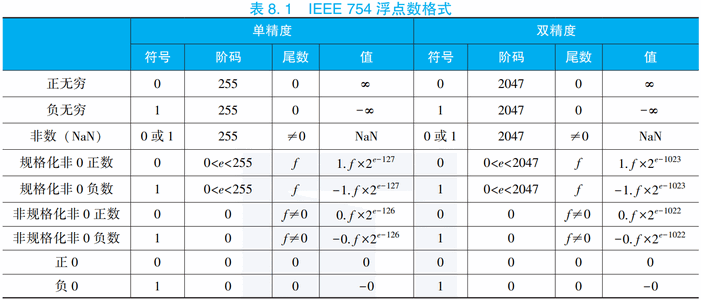

1. 无穷大（阶码全1尾数全0）。引入无穷大是为了在出现浮点计算异常时保证程序能够继续执行下去，同时也为程序提供一种检测错误的途径。$+\infty$在数值上大于所有有限浮点数，$-\infty$在数值上小于所有有限浮点数。无穷大不仅可以是运算的结果，也可以作为运算的源操作数。当无穷大作为源操作数时，根据IEEE 754标准规定，可以得到无穷大或非数的结果。
2. 非数（阶码全1尾数非0）。非数（NaN，Not a Number）表示一个没有定义的数。引入非数的目的是检测非初始化值的使用，而且在计算出现异常时保证程序能够继续执行下去。非数根据尾数的内容又可以分为发信号非数（Signaling NaN）和不发信号非数（Quiet NaN）两种。如果源操作数是Quiet NaN，则运算结果还是Quiet NaN；如果源操作数是Signaling NaN，则会触发浮点异常。
3. 规格化非0数（阶码非全0非全1）。阶码e的值落在$[1,254]$（单精度）和$[1,2047]$（双精度）范围内且尾数f是非0值的浮点数是规格化的非0数。其尾数经过规格化处理，最高位的1被省略。因此如果符号位是0，则表示数值为$1.f×2^{e-127}$（单精度）和$1.f×2^{e-1023}$（双精度）；如果符号位是1，则表示数值为$-1.f×2^{e-127}$（单精度）和$-1.f×2^{e-1023}$（双精度）。
4. 非规格化非0数（阶码全0尾数非0）。在规格化非0数中，能表示的浮点数的最小阶值是$1-127=-126$（单精度）和$1-1023=-1022$（双精度），如果浮点数的绝对值小于$1.0×2^{-126}$（单精度）和$1.0×2^{-1022}$（双精度），实际上是下溢，则IEEE 754允许用特别小的非规格化数表示，此时阶码e为0，尾数的小数点前面的那个1就不再添加了。因此如果符号位是0，则表示数值为$0.f×2^{e-126}=0.f×2^{-126}$（单精度）和$0.f×2^{e-1022}=0.f×2^{-1022}$（双精度）；如果符号位是1，则表示数值为$-0.f×2^{e-126}=-0.f×2^{-126}$（单精度）和$-0.f×2^{e-1022}=-0.f×2^{-1022}$（双精度）。非规格化数填补了最小的规格化数和0之间的一段空隙，使得浮点数值可表示的精度进一步提升了很多。
5. 零（阶码全0尾数全0）。根据符号位的取值，分为$+0$和$-0$。

### 2. MOS晶体管工作原理

从原理上看，只要有一个二值系统，并且系统中能够进行与、或、非这样的基本操作，就能够搭建出一台计算机。最早期的电子计算机使用继电器或电子管实现二值系统，而现代计算机中则采用晶体管来实现二值系统。晶体管可以根据控制端电压或电流的变化来实现“开启”和“关闭”的功能，从而表达二进制。

晶体管主要分为**双极型晶体管（Bipolar Junction Transistor）**和**金属-氧化物半导体场效应晶体管（Metal Oxide Semiconductor Field Effect Transistor，MOSFET，MOS）**。当前绝大多数CPU都采用MOS晶体管实现，其中又以**互补金属氧化物半导体（Complementary Metal Oxide Semiconductor，CMOS）**晶体管电路设计最为常见。

#### (1) 半导体

MOS晶体管使用硅作为基本材料。在元素周期表中，硅是IV族元素，它的原子最外层有4个电子，可以与相邻的4个硅原子的最外层电子配对形成共价键。图8.2(a)给出了纯净硅中原子连接关系的一个简单二维平面示意，实际上纯净硅中原子构成的是一个正四面体立体网格。通过与相邻原子形成的共价键，纯净硅中所有原子的最外层都具有8个电子，达到相对稳定，所以纯净硅的导电性很弱。


但是，如果在纯净硅中掺杂少量5价的原子（如磷P原子），这些原子将挤占原有硅原子的位置，而由于这些原子的最外层有5个电子，除了与原有硅原子形成共价键用掉4个电子外，还多余一个处于游离状态的电子，如图8.2(b)所示。在电场的作用下，处于游离状态的电子就会逆着电场方向流动，形成负电流。这类材料被称为N型（Negative）材料。同样，如果在纯净的硅中掺杂少量3价的原子（如硼B原子），那么这些原子挤占原有硅原子的位置后，其最外层还缺少一个电子和相邻的硅原子形成共价键，形成空穴，如图8.2(c)所示。在电场的作用下，周围的电子就会跑过来填补这个空穴，从而留下一个新的空穴，相当于空穴也在顺着电场方向流动，形成正电流。这类材料被称为P型（Positive）材料。

当非4价元素掺杂的含量较小时，产生的电子和空穴也就比较少，用“-”号表示；当非4价元素掺杂的含量较大时，产生的电子和空穴也就比较多，用“+”号表示。因此，P^-^表示掺杂浓度低的P型材料，里面只有少量的空穴；N^+^表示掺杂浓度高的N型材料，里面有大量电子。

#### (2) NMOS和PMOS晶体管

如下图8.3所示，MOS晶体管是由多层摞放在一起的导电和绝缘材料构建起来的。

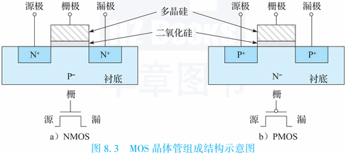

每个晶体管的底部叫作衬底，是低浓度掺杂的半导体硅。晶体管的上部接出来3个信号端口，分别称为源极（Source）、漏极（Drain）、栅极（Gate）。源极和漏极叫作有源区，该区域内采用与衬底相反极性的高浓度掺杂。衬底是低浓度P型掺杂，有源区是高浓度N型掺杂的MOS晶体管叫作NMOS晶体管；衬底是低浓度N型掺杂，有源区是高浓度P型掺杂的MOS晶体管叫作PMOS晶体管。无论是NMOS管还是PMOS管，其栅极与衬底之间都存在一层绝缘体，叫作栅氧层，其成分通常是二氧化硅（$\text{SiO}_2$）。最早期的MOS晶体管栅极由金属制成，后来的栅极采用掺杂后的多晶硅制成。掺杂后的多晶硅尽管其电阻比金属大，但却比半导体硅的电阻小很多，可以作为电极。并且同普通金属相比，多晶硅更耐受高温，不至于在MOS晶体管生产过程中融化。不过最新的工艺又有重新采用金属栅极的。

上面简述了MOS晶体管的基本构成，下面以NMOS晶体管为例介绍MOS晶体管的工作原理。如果单纯在源极、漏极之间加上电压，两极之间是不会有电流流过的，因为源极和漏极之间相当于有一对正反相对的PN结，如下图8.4(a)所示。

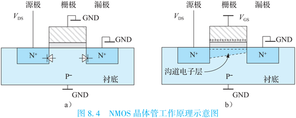

如果先在栅极上加上电压（栅极接正，衬底接负或接地），因为栅氧层是绝缘的，就会在P衬底里形成一个电场。栅极上的正电压会把P衬底里面的电子吸引到栅氧层的底部，形成一个很薄的沟道电子层，相当于在源极和漏极之间架起了一座导电的桥梁。此时如果再在源极、漏极之间加上电压，那么两极之间的电流就能流过来了，如图8.4(b)所示。NMOS的基本工作原理就是这样，但是其实际的物理现象却很复杂。

当屏蔽掉底层的物理现象细节，对MOS晶体管的工作行为进行适度抽象后，NMOS晶体管的工作行为就是：在栅极上加上电就通，不加电就断。PMOS晶体管的工作行为与NMOS晶体管的恰好相反，加上电就断，不加电就通。这样我们可以简单地把MOS晶体管当作开关。NMOS晶体管是栅极电压高时打开，栅极电压低时关闭；PMOS晶体管反过来，栅极电压低时打开，栅极电压高时关闭。如下图8.5所示，**注意PMOS图示中的空心圆圈表示低导通（有效）**。

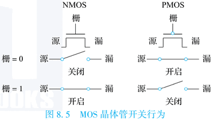

随着工艺的发展，MOS晶体管中栅氧层的厚度越来越薄，使得开启所需的栅极电压不断降低。晶体管的工作电压从早期工艺的5.0V，降到后来的2.5V、1.8V，现在都是1V左右或更低。

尽管MOS晶体管可以表现出开关的行为，但是单纯的PMOS晶体管或者NMOS晶体管都不是理想的开关。例如，NMOS晶体管适合传输0而不适合传输1；PMOS晶体管恰好相反，适合传输1而不适合传输0。在后面讲述常见CMOS电路时，将会论及如何解决这一问题。

### 3. CMOS逻辑电路

在了解了MOS晶体管的组成和基本原理后，接下来了解如何用MOS晶体管构建逻辑电路。

#### (1) 数字逻辑电路

(1) 布尔代数

数字逻辑基于的数学运算体系是布尔代数。布尔代数是在二元集合$\{0,1\}$基础上定义的，最基本的逻辑运算有三种：与、或、非。这三种逻辑关系定义如下所示。

|  A   |  B   | A&B  | A\|B |  ~A  |
| :--: | :--: | :--: | :--: | :--: |
|  0   |  0   |  0   |  0   |  1   |
|  0   |  1   |  0   |  1   |  1   |
|  1   |  0   |  0   |  1   |  0   |
|  1   |  1   |  1   |  1   |  0   |

常用的布尔代数运算定律有：

- 恒等律，$A\&1=A,A|0=A$；
- 0/1律，$A\&0=0,A|1=1$；
- 互补律，$A\&(\sim A)=0,A|(\sim A)=1$；
- 交换律，$A\&B=B\&A,A|B=B|A$；
- 结合律，$A\&(B\&C)=(A\&B)\&C,A|(B|C)=(A|B)|C$；
- 分配律，$A\&(B|C)=(A\&B)|(A\&C),A|(B\&C)=(A|B)\&(A|C)$；
- 德摩根（DeMorgan）定律，$\sim(A\&B)=(\sim A)|(\sim B),\sim(A|B)=(\sim A)\&(\sim B)$。

上述定律虽然很简单，但使用起来变化无穷。根据电路是否具有数据存储功能，可将数字逻辑电路分为组合逻辑电路和时序逻辑电路两类。

(2) 组合逻辑

组合逻辑电路中没有数据存储单元，电路的输出完全由当前的输入决定。在组合逻辑的各种表达方式中，最简单的就是真值表，即对每一种可能的输入组合给出输出值。显然一个N输入的电路就有$2^N$种不同的输入组合。常见的门级组合逻辑有：与门（AND）、与非门（NAND）、或门（OR）、或非门（NOR）、非门（NOT），异或门（XOR）、异或非门（XNOR）、非门（NOT）。下图8.6给出了一些常见的门逻辑符号及其真值表。

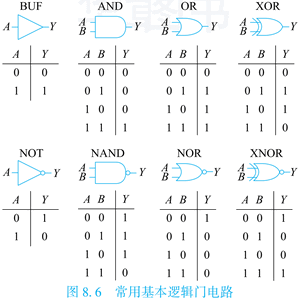

利用基本逻辑门电路可以构成具有特定功能的更大规模的组合逻辑部件，如译码器、编码器、多路选择器、加法器等。下表8.2所示是3-8译码器真值表，把3位信号译码成8位输出。

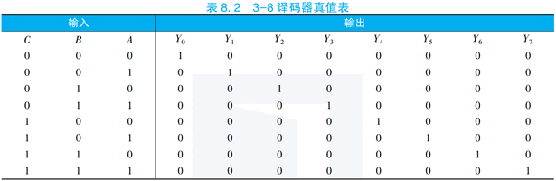

下表8.3所示是一个8选1选择器的真值表。可以看出选择器可以用译码器加上与门来实现。

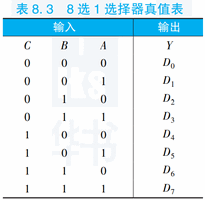

(3) 时序逻辑

**时序逻辑电路包含时钟信号和数据存储单元两个要素。时序逻辑电路的特点在于，其输出不但与当前输入的逻辑值有关，而且与在此之前曾经输入过的逻辑值有关。**

时钟信号是时序逻辑电路的基础，它用于确定时序逻辑元件中的状态在何时发生变化。如下图8.7所示，时钟信号是具有固定周期的标准脉冲信号。每个时钟周期分为高、低电平两部分，其中低电平向高电平变化的边沿称为上升沿，高电平向低电平变化的边沿称为下降沿。

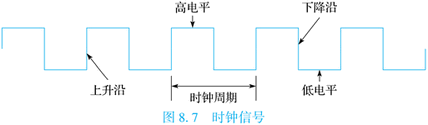

在CPU设计中，通常使用边沿触发方式来确定时序逻辑状态变化的时间点。所谓边沿触发就是将时钟信号的上升沿或下降沿作为采样的同步点，在每个采样同步点，对时序逻辑电路的状态进行采样，并存储到数据存储单元中。

数据存储单元是时序逻辑电路中的核心。数据存储单元多由锁存器构成。首先介绍RS锁存器，RS锁存器包含置位端S（Set）和复位端R（Reset）两个输入端口，下图8.8是RS锁存器的逻辑图和真值表。

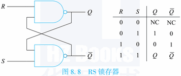

在图8.8中，下面与非门的输出接到上面与非门的一个输入，同样上面与非门的输出接到下面与非门的一个输入，通过两个成蝶形连接的与非门构成RS锁存器。RS锁存器与组合逻辑的不同在于，当(R,S)的值从(0,1)或(1,0)变成(1,1)时能够保持输出值的状态不变，从而实现数据的存储。组合的输出只跟输入相关；但是RS锁存器的输出在输入改变时还能保持原来的值。

在RS锁存器前面连接上两个与非门，再用时钟C（Clock）控制D输入就构成了如下图8.9(a)所示的电路。

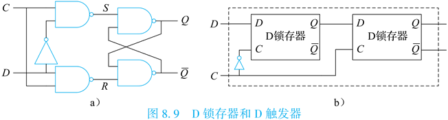

当C=0时，R和S都为1，RS锁存器处于保持状态，也就是说当时钟处于低电平时，无论输入D怎样变化，输出都保持原来的值。当C=1时，输出Q与输入D值相同，相当于直通。这就是D锁存器（D Latch）的原理，通过时钟C的电平进行控制，高电平输入直通，低电平保持不变。

两个D锁存器以图8.9(b)所示的方式串接起来就构成了一个**D触发器（D Flip-Flop）**。当C=0时，第一个D锁存器直通，第二个D锁存器保持；当C=1时，第一个D锁存器保持，第二个D锁存器直通；当C从0变为1时，D的值被锁存到第一个锁存器中，并通过第二个锁存器输出；当C从1变为0时，第一个锁存器接受这次输入，第二个锁存器会保持上次的旧值。这就是D触发器的基本原理，它是通过时钟的边沿进行数据的锁存。

实际情况下，由于器件中电流的速度是有限的，并且电容充放电需要时间，所以电路存在延迟。为了保证D触发器正常工作，需要满足一定的延迟要求。如为了把D的值通过时钟边沿锁存起来，要求在时钟变化之前的某一段时间内D的值不能改变，这个时间叫作建立时间（Setup Time）。另外，在时钟跳变后的一段时间内，D的值也不能变，这个时间就是保持时间（Hold Time）。建立时间和保持时间可以是负数。此外D触发器还有一个重要的时间参数叫作Clock-to-Q时间，也就是时钟边沿到来后Q端数据更新为新值的时间。D触发器整个的访问延迟是建立时间加上Clock-to-Q时间。下图8.10给出了上升沿触发的D触发器的建立时间、保持时间以及Clock-to-Q时间的示意。

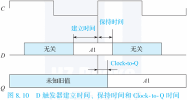

#### (2) 常见CMOS电路

下面通过若干具体示例，讲述如何用MOS晶体管实现逻辑电路，且所列举的电路都是CMOS电路。

(1) 非门

下图8.11(a)是非门（也称作反相器）的CMOS电路，它由一个PMOS晶体管和一个NMOS晶体管组成，其中PMOS晶体管（以下简称“P管”）的源极接电源，NMOS晶体管（以下简称“N管”）的源极接地，两管的漏极连在一起作为输出，栅极连在一起作为输入。

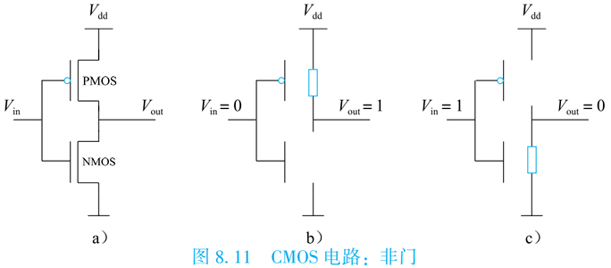

如果输入为0（接地），则P管导通，N管关闭，P管的电阻为0（实际电路中P管其实有一定的电阻，大约在几千欧姆），N管的电阻无穷大，输出端的电压就是电源电压$V_{dd}$，如图8.11(b)所示。反之，当输入为1的时候，N管导通，P管关闭，N管的电阻为0（实际电路中N管其实有一定的电阻，大约在几千欧姆），P管的电阻无穷大，输出端与电源断开，与地导通，输出端电压为0，如图8.11(c)所示。这就是反相器CMOS电路的工作原理。

从反相器的工作原理可以看出CMOS电路的基本特征，其关键就在“C”（Complementary，互补）上，即由上下两个互补的部分组成电路，上半部分由P管构成，下半部分由N管构成。上半部分打开的时候下半部分一定关上，下半部分打开的时候上半部分一定关闭。这种电路设计的好处是：在稳定状态，电路中总有一端是关死的，几乎没有直流电流，可以大幅度降低功耗。

(2) 与非门

下图8.12所示的是一个两输入与非门的CMOS电路，电路上面两个P管并联，下面两个N管串联。两个P管并联后，一头接电源，另一头与两个串联的N管连接。两个N管串联后，一头与并联的P管连接，另一头接地。与非门的两个输入A和B分别连接到一个N管和一个P管，输出端是Y。

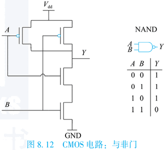

当A和B中只要有一个为0，则上面的P管网络导通，下面的N管网络断开，输出端被连接到电源上，即输出Y为1；当A和B全1时，则上面的两个P管都断开，下面的N管网络导通，输出端接地，输出Y为0。

(3) 或非门

下图8.13所示的是一个两输入或非门的CMOS电路，电路上面两个P管串联，下面两个N管并联。两个P管串联后，一头接电源，另一头与两个并联的N管连接。两个N管并联后，一头与串联的P管连接，另一头接地。或非门的两个输入A和B分别连接到一个N管和一个P管，输出端是Y。

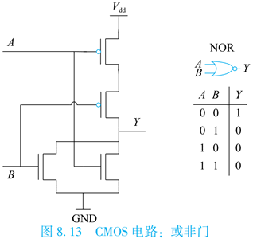

当A和B中只要有一个为1，则上面的P管网络断开，下面的N管网络导通，输出端与电源断开，连通到地上，即输出Y为0；当A和B全0时，上面的两个P管导通，下面的N管网络断开，输出端被连接到电源上，输出Y为1。

(4) 传输门

前面提到过单纯的PMOS晶体管或NMOS晶体管都不是理想的开关，但是在设计电路时有时需要一个接近理想状态的开关，该开关无论对于0还是1都可以传递得很好。解决的方式也很直观，如下图8.14所示，一个P管和一个N管彼此源极连在一起，漏极连在一起，两者的栅极上接上一对极性相反的使能信号。

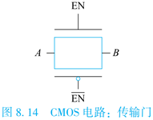

当$\text{EN}=0,\overline{\text{EN}}=1$时，P管和N管都关闭；当$\text{EN}=1,\overline{\text{EN}}=0$时，P管和N管都开启。当P管和N管都开启时，无论信号是0还是1，都可以通过最适合传递该信号的MOS晶体管从A端传递到B端。

(5) D触发器

在前面讲述逻辑电路时介绍过如何用逻辑门搭建D触发器，在用CMOS电路实现D触发器时，也可以利用CMOS的逻辑门搭建出RS锁存器，进而搭建出D锁存器，并最终得到D触发器。但是考虑到构建D触发器时，我们其实真正需要的是开关电路和互锁电路，所以上述这种构建D触发器的方式消耗的资源过多。

下图8.15中是现代计算机中常用的一种D触发器电路结构。

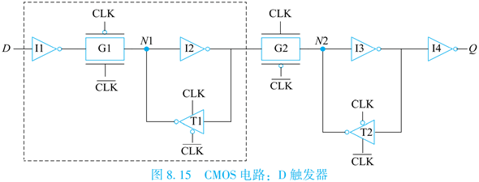

该电路的左边（虚线框内部）可以视作一个去除了输出缓冲器的D锁存器，该锁存器存储的值体现在其内部N1点的状态。当$\text{CLK}=0,\overline{\text{CLK}}=1$时，传输门G1开启、G2关闭，D点的值经由反相器I1和传输门G1传递进来，并通过反相器I2和三态反相器T1反馈至N1点，使该点到达一个稳定状态。当$\text{CLK}=1,\overline{\text{CLK}}=0$时，传输门G1关闭、G2开启，D点值的变化不再影响到内部N1点，同时N1点的状态经由传输门G2，并通过反相器I3和三态反相器T2反馈至N2点，使N2点处于稳定状态，并将该值传递至输出端Q。

当CLK从0变为1时，D锁存到N1中的值通过G2输出为Q；当C从1变为0时，N1接受新的D锁存，N2保持上次的旧值D输出为Q。

#### (3) CMOS电路延迟

前面在介绍MOS晶体管原理时曾经提到过，真实世界中，PMOS晶体管和NMOS晶体管即便是在导通状态下源极和漏极之间也是有电阻的，栅极和接地之间也存在寄生电容。因此CMOS电路工作时输入和输出之间存在延迟，该延迟主要由电路中晶体管的RC参数来决定。

下图8.16(a)是一个CMOS反相器的示意图。其输出端有一个对地电容，主要由本身P管和N管漏极的寄生电容、下一级电路的栅电容以及连线电容组成。


反相器输出端从0到1变化时，需要通过P管的电阻对该电容充电；从1到0变化时，该电容的电荷需要通过N管的电阻放电到地端。图8.16(b)示意了输出电容的充放电过程，其中左图代表充电过程，右图代表放电过程。因此，该反相器输出从0到1变化时的延迟由P管打开时的电阻和输出电容决定；从1到0变化时的延迟由N管打开时的电阻和输出电容决定。图8.16(c)示意了在该反相器输入端从1变到0的过程中（图中虚线表示），输出端值变化的过程。从中可以看出，反相器从输入到输出的变化是有延迟的，而且反相器的输出不是理想的矩形，而是存在一定的斜率。

在芯片设计的时候，需要根据单元的电路结构建立每个单元的延迟模型。一般来说，一个单元的延迟由其本身延迟和负载延迟所构成，而负载延迟又与该单元的负载相关。需要指出的是，用早期工艺生成的晶体管，其负载延迟与负载呈线性关系，但对于深亚微米及纳米工艺，晶体管的负载延迟不再与负载呈线性关系。在工艺厂家给出的单元延迟模型中，通常通过一个二维表来描述每个单元的延迟，其中一维是输入信号的斜率，另外一维是输出负载。即一个单元的延迟是由输入信号的斜率和输出负载两个值通过查表得到的。

## （二）简单运算器设计

在计算机发展的早期阶段，运算部件指的就是算术逻辑单元（Arithmetic Logic Unit，ALU）。ALU可以做算术运算、逻辑运算、比较运算和移位运算。后来功能部件不断发展扩充，可以执行乘法、除法、开方等运算。本节主要介绍定点补码加法器的设计。

加法是许多运算的基础。根据不同的性能和面积需求，加法器有很多种实现方式。进位处理是加法器的核心。根据进位处理方法的不同，常见的加法器包括：行波进位加法器（Ripple Carry Adder，RCA），先行进位加法器（Carry Look-ahead Adder，CLA），跳跃进位加法器（Carry Skip Adder，CSKA），进位选择加法器（Carry Select Adder，CSLA），进位递增加法器（Carry Increment Adder，CIA）等等。其中行波进位加法器最为简单直接，而先行进位加法器使用较为广泛。

### 1. 定点补码加法器

#### (1) 一位全加器

一位全加器是构成加法器的基本单元。一位全加器实现两个本地二进制数以及低位的进位相加，求得本地和以及向高位的进位。它有三个1位二进制数输入$A,B,C_{in}$，其中$A,B$分别为本地的加数和被加数，$C_{in}$为低位来的进位。它有两个1位二进制数输出$S,C_{out}$，其中$S$是本地和，$C_{out}$是向高位的进位。一位全加器的真值表如下表8.4所示。

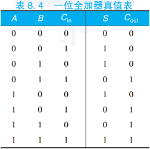

根据表8.4，可以写出全加器的逻辑表达式如下：
$$
\begin{align}
S &= \overline{A}\&\overline{B}\&C_{in}|\overline{A}\&B\&\overline{C_{in}}|A\&\overline{B}\&\overline{C_{in}}|A\&B\&C_{in} \\
C_{out} &= A\&B|A\&C_{in}|B\&C_{in}
\end{align}
$$
上述表达式中，$\overline{A}$表示取反操作，优先级最高，$\&$表示与操作，优先级次之，$|$表示或操作，优先级最低。对于上面的逻辑表达式，根据布尔代数可以将其等价转化为“非门”和“与非门”的表达形式，下图8.17给出了用非门和与非门搭建的一位全加器的逻辑电路图及其示意图。如果不严格区分非门和与非门，以及不同数目输入与非门之间的延迟差异，则可近似认为每个一位全加器需要2或3级的门延迟。

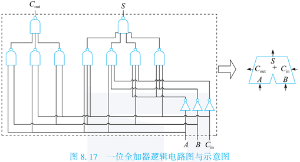

接下来将介绍如何用一位全加器构建一个N位的带进位加法器。

#### (2) 行波进位加法

器构建N位带进位加法器的最简单的方法是将N个一位全加器逐个串接起来。下图8.18给出了32位行波进位加法器的示意图。其中输入$A=a_{31}\cdots a_0$和$B=b_{31}\cdots b_0$分别是加数和被加数，$C_{in}$是最低位的进位；输出为和$S=s_{31}\cdots s_0$以及最高位向上的进位$C_{out}$。

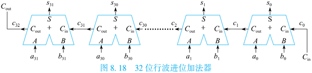

所谓“行波”，是指每一级的一位全加器将来自低位的一位全加器的进位输出$C_{out}$作为本级的进位输入$C_{in}$，如波浪一般层层递进下去。这种串行的进位传递方式与人们日常演算十进制加法时采用的进位方式原理一样，非常直观。但是，这种加法器的电路中每一位的数据相加都必须等待低位的进位产生之后才能完成，即进位在各级之间是顺序传递的。

一位全加器输入到输出S的最长延迟是3级门、输入到进位$C_{out}$的最长延迟是2级门。因此，32位行波进位加法器中，从最低位的输入$a_0,b_0,C_{in}$到最高位的进位输入$C_{in}$的延迟为$2\times31=62$级门，所以从最低位的输入$a_0,b_0,C_{in}$到最高位的加和$S_{31}$的总延迟为$62+3=65$级门；从最低位的输入$a_0,b_0,C_{in}$到最高位的进位输出$C_{out}$存在一条进位链，其总延迟为$2\times32=64$级门。

从这个例子可以看出，虽然行波进位加法器直观简单，但是其延迟随着加法位数N的增加而线性增长，N越大时，行波进位加法器的延迟将越发显著。在CPU设计中，加法器的延迟是决定其主频的一个重要参数指标，如果加法器的延迟太长，则CPU的主频就会降低。例如，对于一个64位的高性能通用CPU来说，在良好的流水线切分下，每级流水的延迟应控制在20级门以内，所以64位行波进位加法器高达$2\times63+3=129$级门的延迟太长了。

#### (3) 先行进位加法器

为了改进行波进位加法器延迟随位数增加增长过快的缺点，人们提出了先行进位加法器的电路结构。其主要思想是先并行地计算每一位的进位，由于每一位的进位已经提前算出，这样计算每一个的结果只需要将本地和与进位相加即可。下面详细介绍先行进位（或称为并行进位）加法器的设计原理。

(1) 并行进位逻辑

假设两个N位数$A=a_{N-1}a_{N-2}\cdots a_i\cdots a_1a_0,B=b_{N-1}b_{N-2}\cdots b_i\cdots b_1b_0$相加，定义第i位的进位输入为$c_i$，进位输出为$c_{i+1}$，且将加法器的输入$C_{in}$记作$c_0$以方便后面描述的统一。每一位进位输出$c_{i+1}$的计算为：
$$
c_{i+1}=a_i\&b_i|a_i\&c_i|b_i\&c_i=a_i\&b_i|(a_i|b_i)\&c_i
$$
设$g_i=a_i\&b_i,p_i=a_i|b_i$，则$c_{i+1}$的计算可以表达为：
$$
c_{i+1}=g_i|p_i\&c_i
$$
从上式可以看出，当$g_i=1$时，在$c_{i+1}$必定产生一个进位，与$c_i$无关；当$p_i=1$时，如果$c_i$有一个进位输入，则该进位可以被传播至$c_{i+1}$。我们称$g_i$为第i位的进位生成因子，$p_i$为第i位的进位传递因子。

下面以4位加法器的进位传递为例，根据公式$c_{i+1}=g_i|p_i\&c_i$逐级展开可得到：
$$
\begin{align}
c_1 &= g_0|p_0\&c_0 \\
c_2 &= g_1|p_1\&c_1 = g_1|p_1\&(g_0|p_0\&c_0) = g_1|p_1\&g_0|p_1\&p_0\&c_0 \\
c_3 &= g_2|p_2\&c_2 = g_2|p_2\&g_1|p_2\&p_1\&g_0|p_2\&p_1\&p_0\&c_0 \\
c_4 &= g_3|p_3\&c_3 = g_3|p_3\&g_2|p_3\&p_2\&g_1|p_3\&p_2\&p_1\&g_0|p_3\&p_2\&p_1\&p_0\&c_0
\end{align}
$$
更进一步，可以得到统一的表达：
$$
c_{n+1}=g_n|p_n\&c_n=g_n | (\mathop{|}_{i=0}^{n-1}(\mathop{\&}\limits_{j=i+1}^np_j)\&g_i) | (\mathop\&\limits_{i=0}^{n}p_i)\&c_0 \\
\mathop{|}\limits_{i=0}^{n}x_i=x_n|x_{n-1}|\cdots|x_1|x_0 \\
\mathop\&\limits_{i=0}^{n}p_i=p_n\&p_{n-1}\&\cdots\&p_1\&p_0
$$
扩展之后，每一位的进位输出$c_{i+1}$可以由仅使用本地信号生成的$g,p$直接得到，不用依赖前一位的进位输入$c_i$。下图8.19给出了4位先行进位的逻辑电路图及其示意图。

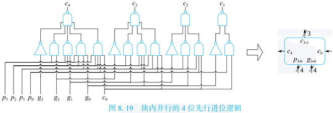

从图8.19中可以看出，采用先行进位逻辑，产生第4位的进位输出只需要2级门延迟，而之前介绍的行波进位逻辑则需要8级门延迟，先行进位逻辑的延迟显著地优于行波进位逻辑。当然，这里为了电路逻辑的简洁以及计算的简便，使用了四输入、五输入的与非门，这些与非门的延迟比行波进位逻辑中采用的二输入、三输入的与非门的延迟要长，但这里不再做进一步细致的区分，均视作相同延迟。而且实际实现时也很少采用五输入的与非门，因为其N管网络上串接五个NMOS管，电阻值较大，电路速度慢。

(2) 块内并行、块间串行逻辑

理论上可以把上述并行进位方法扩展成更多位的情况，但那需要很多输入的逻辑门，在实现上是不现实的。实现更多位的加法器时通常采用分块的进位方法，将加法器分为若干个相同位数的块，块内通过先行进位的方法计算进位，块间通过行波进位的方法传递进位。下图8.20给出了16位加法器中采用该方式构建的进位逻辑。


由于块内并行产生进位只需要2级门延迟，因此从$g_i,p_i$产生$c_{16}$最多只需要8级门延迟，而非行波进位逻辑的32级门延迟。

(3) 块内并行、块间并行逻辑

为了进一步提升加法器的速度，可以在块间也采用先行进位的方法，即块内并行、块间也并行的进位实现方式。与前面类似，对于块内进位，定义其进位生成因子为$g_i=a_i\&b_i$和进位传递因子为$p_i=a_i|b_i$；对于块间的进位传递，也可以定义其进位生成因子为G和进位传递因子为P，其表达式如下：
$$
\begin{align}
G &= g_3|p_3\&g_2|p_3\&p_2\&g_1|p_3\&p_2\&p_1\&g_0 \\
P &= p_3\&p_2\&p_1\&p_0
\end{align}
$$
上面的表达式可以解释为，当G为1时表示本块有进位输出生成，当P为1时表示当本块有进位输入时该进位可以传播至该块的进位输出。下图8.21给出了包含块间进位生成因子和进位传递因子的4位先行进位的逻辑电路及其示意图。

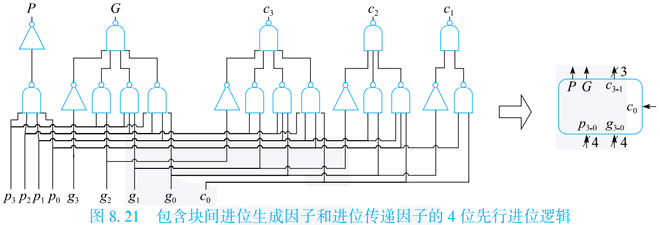

定义上述的块间进位生成因子和进位传递因子，是因为这种逻辑设计具有很好的层次扩展性，即以层次化的方式构建进位传递逻辑，把下一级的P和G输出作为上一级的$g_i,p_i$输入。下图8.22给出了一个采用两层并行进位结构的16位先行进位逻辑，采用了五块4位先行进位逻辑。


其计算步骤是：

1. 下层的四块4位先行进位逻辑根据各块所对应的$g_i,p_i$生成各自的块间进位生成因子G和块间进位传递因子P；
2. 上层的4位先行进位逻辑把下层的先行进位逻辑生成的$G,P$作为本层的$g_i,p_i$输入，生成块间的进位$c_4,c_8,c_{12}$；
3. 下层的每块4位先行进位逻辑分别把$c_0$以及上层计算出的$c_4,c_8,c_{12}$作为各自块的进位输入$c_0$，再结合本地的$g_i,p_i$分别计算出本块内部所需要的每一位进位。

可以看出，从$g_i,p_i$生成下层各块的$G,P$需要2级门延迟，上层根据自身$g_i,p_i$输入生成其进位输出$c_1\sim c_3$需要2级门延迟，下层各块从$c_0$输入至生成其进位输出$c_1\sim c_3$也需要2级门延迟。所以整体来看，从$g_i,p_i$生成进位$c_1\sim c_{16}$最长的路径也只需要6级门延迟，这比前面介绍的块内并行块间串行的电路结构更快。而且进一步分析可知，块间并行的电路结构中，最大的与非门的扇入为4，而前面分析的块间串行电路结构中最大的与非门的扇入为5。

这种块间并行的电路结构在设计更多位的加法器时，只需要进一步进行层次化级联就可以。例如，仍采用4位先行进位逻辑作为基本块，通过3层的树状级联就可以得到64位加法器的进位生成逻辑，其从$g_i,p_i$输入到所有进位输出的最长路径的延迟为10级门。

采用块内并行且块间并行的先行进位逻辑所构建的加法器，其延迟随着加法位数的增加以对数的方式增长，因而在高性能通用CPU设计中被广泛采用。

### 2. 减法运算实现

前述提到，现代通用计算机中定点数都是用补码表示的，补码表示的一个显著优点就是补码的减法可以通过补码加法来实现，即补码运算具有如下性质：
$$
[A]_{补}-[B]_{补}=[A-B]_{补}=[A]_{补}+[-B]_{补}
$$
而$[-B]_{补}$可以通过将$[B]_{补}$“按位取反，末位加1”的法则进行计算。所以，只需要将被减数直接接到加法器的A输入，减数按位取反后接到加法器的B输入，同时将加法器的进位输入$C_{in}$置为1，就可以用加法器完成$[A]_{补}-[B]_{补}$的计算了，如下图8.23(a)所示。

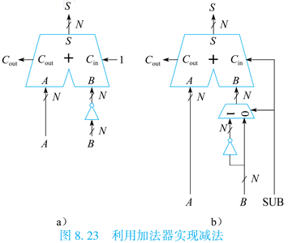

在此基础之上，可以将加法和减法统一到一套电路中予以实现，如图8.23(b)所示，其中SUB作为加、减法的控制信号。当SUB信号为0时，表示进行加法运算；当SUB信号为1时，表示进行减法运算。

### 3. 比较运算实现

常见基本运算中除了加减法外还有比较运算。比较运算主要包含两种类型：一是判断两个数的相等情况，二是判断两个数的大小情况。

判断两个数相等所需要的逻辑电路比较简单，下图8.24给出了一个4位相等比较的逻辑电路及其示意图。电路首先采用异或逻辑逐位比较输入A和B的对应位是否相同，所得到的结果中只要出现一个1则表示两者不相等，输出结果为0；否则异或的结果全为0，或非门结果为1表示相等。

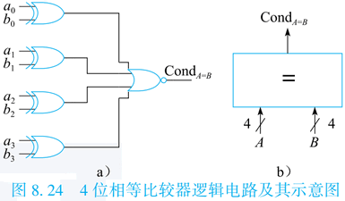

更多位数的相等比较的电路原理与所举的例子基本一致，只是在实现时判断异或结果中是否有1需要多级逻辑完成以降低逻辑门的扇入数目。

我们通过分析$A-B$的结果来比较A和B的大小。这里需要注意的是结果溢出的情况。如果减法操作没有发生溢出，则减法结果的符号位为1时表示$A<B$，符号位为0时表示$A>B$；如果发生溢出，则结果符号位为0（A负B正）时才表示$A<B$，符号位为1（A正B负）时表示$A>B$。即$A<B$成立的条件仅包括三种情况：(1)A是负数且B是非负数；(2)A是负数（且B也是负数）且结果是负数；(3)A是非负数（且B是非负数）且结果是负数。

由于能够通过减法来做大小的比较，且相等比较的逻辑资源并不多，所以在设计ALU时，比较操作的实现并不会新增很多逻辑资源消耗。

### 4. 移位器

常见基本运算中除了加减、比较运算外，还有移位运算。移位运算不仅在进行位串处理时十分有用，而且常用于计算乘以或除以2的幂次方。移位运算通常有四种：逻辑左移、逻辑右移、算术右移、循环右移。无论是逻辑左移还是算术左移，都是在最低位移入0，因而不区分算术左移。逻辑右移从高位移入的是0；算术右移从高位移入的是源操作数的符号位，当用移位操作计算有符号数（补码表示）除以2的幂次方时，只有从高位移入符号位才能保证结果的正确。循环右移时从最低位移出去的比特位并不被丢弃，而是重新填入到结果的最高位。也正是因为这种循环移位的特点，循环左移操作其实可以用循环右移操作来实现，故不单独定义循环左移操作。

N位数的移位器实现，实质上是N个N选1的多路选择器。下图8.25中依次给出了4位数的逻辑左移、逻辑右移、算术右移、循环右移的逻辑电路示意图。其中$A=a_3a_2a_1a_0$是被移位数，$\text{shamt}_{1:0}$是移位量，$Y=y_3y_2y_1y_0$是移位结果。


更多位数的移位器的实现原理与示例一致，只是选择器的规模更大。由于位数多时多路选择器消耗的电路资源较多，所以在实现时，可以将逻辑右移、算术右移和循环右移的电路糅合到一起，以尽可能复用多路选择器的资源。

## （三）定点补码乘法器

本节介绍定点补码乘法器的设计。乘法指令在科学计算程序中很常见，矩阵运算、快速傅里叶变换操作中都有大量的定点或浮点乘法操作。在计算机发展的早期，由于硬件集成度较低，只通过ALU实现了加减法、移位等操作，乘法这样的复杂操作需要由软件通过迭代的移位-累加操作来实现。随着处理器运算部件的升级，现代处理器已经使用硬件方式来实现定点和浮点乘法操作。

### 1. 补码乘法器

对于定点乘法器而言，最简单的实现方式就是通过硬件来模拟软件的迭代操作，这种乘法实现方式被称为“移位加”。其逻辑结构如下图8.26所示。

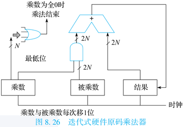

以两个8位*无符号数*的乘法为例，乘法器的输入包括一个8位的乘数和一个8位的被乘数，输出则是16位的乘法结果。通过触发器将这3个数存储下来，并执行以下步骤：

1. 最初时，将乘法结果初始化为0。
2. 在每个时钟周期，判断乘数的最低位。如果值为1，则将被乘数加到乘法结果；如果值为0，则不进行加法操作。
3. 将乘数右移1位（高位入0），将被乘数左移1位（低位入0），将参与运算的3个数锁存，进入下一个时钟周期。
4. 执行8次操作，得到正确的乘法结果。

实现上述移位加算法需要的硬件很简单，组合逻辑延迟也较小，缺点是完成一条乘法需要很多个时钟周期，对于64位的乘法而言就需要64拍。此外，上述算法是将操作数视为一个无符号二进制数来设计的，如果计算的输入是补码形式，那么就需要先根据输入的正负情况判断出结果的符号位，随后将输入转换为其绝对值后，再进行上述迭代运算，最后再根据结果符号位转换回补码形式。很显然这样操作略显复杂，接下来推导直接根据补码形式进行运算的方法。

如前述，现代处理器中的定点数都是按照补码形式来存储的，同时有$[X+Y]_{补}=[X]_{补}+[Y]_{补}$的特性，我们要推导出$[X\times Y]_{补}$的表达式。

还是以8位乘法为例。假定有8位定点数$Y$，其补码的二进制格式写作$[Y]_{补}=y_7y_6y_5y_4y_3y_2y_1y_0$，根据补码定义可得：
$$
Y=(-y_7)\times2^7+y_6\times2^6+y_5\times2^5+\cdots+y_1\times2^1+y_0\times2^0
$$
由此推出：
$$
\begin{align}
[X\times Y]_{补} &= [X\times((-y_7)\times2^7+y_6\times2^6+y_5\times2^5+\cdots+y_1\times2^1+y_0\times2^0)]_{补} \\
&= [X\times(-y_7)\times2^7+X\times y_6\times2^6+\cdots+X\times y_1\times2^1+X\times y_0\times2^0]_{补}
\end{align}
$$
根据补码加法具有的特性，有：
$$
[X\times Y]_{补} = [X\times(-y_7)\times2^7]_{补}+[X\times y_6\times2^6]_{补}+\cdots+[X\times y_0\times2^0]_{补}
$$
需要注意，这个公式中位于方括号外的加法操作为补码加法，而之前两个公式中位于方括内部的加法为算术加法。由于$y_i$只能取值为0或者1，再根据补码减法的规则$[X-Y]_{补}=[X]_{补}+[-Y]_{补}=[X]_{补}-[Y]_{补}$，继续推导公式，有：
$$
[X\times Y]_{补} = (-y_7)\times[X\times2^7]_{补}+y_6\times[X\times2^6]_{补}+\cdots+y_0\times[X\times2^0]_{补}
$$
公式中最开头的减号是表示补码减法操作，而不是负号（实际上补码本就有一位符号位表示正负，再加上负号的行为未定义）。为了继续运算，需要引入一个定理：
$$
[X\times2^n]_{补}=[X]_{补}\times2^n
$$
该定理由补码的定义易证，据此，补码乘法的公式可以继续推导如下：
$$
\begin{align}
[X\times Y]_{补} &= (-y_7\times2^7)\times[X]_{补}+(y_6\times2^6)\times[X]_{补}+\cdots+(y_0\times2^0)\times[X]_{补} \\
&= [X]_{补}\times((-y_7)\times2^7+y_6\times2^6+\cdots+y_0\times2^0)
\end{align}
$$
最后得到的公式与“移位加”算法的原理很类似，但是存在两个重要区别：第一，本公式中的加法、减法均为补码运算；第二，最后一次被累加的部分积需要使用补码减法来操作。这就意味着$[X\times Y]_{补}\ne[X]_{补}\times[Y]_{补}$。

下图8.27给出两个4位补码相乘的例子。注意在补码加法运算中，需要进行8位的符号位扩展，并仅保留8位结果。

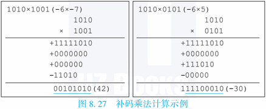

简单地修改之前的迭代式硬件原码乘法器，就可以实现补码乘法，如下图8.28所示。

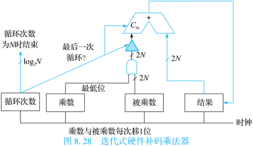

依此方法，也可以计算32位数、64位数的补码乘法。运算数据更宽的乘法需要更多的时钟周期来完成。

### 2. Booth乘法器

Booth乘法器由英国的Booth夫妇提出。按照上一节中的补码乘法算法，需要特地挑出第N个部分积，并使用补码减法操作，这就需要实现一个额外的状态机来控制，增加了硬件设计复杂度。因此他们对补码乘法公式进行变换，试图找到更适合于硬件实现的算法。值得注意的是，为了简便表示，该小节中的$X$实际是指$[X]_{补}$。

Booth一位乘变换的公式推导如下：
$$
\begin{align}
& (-y_7)\times2^7 + y_6\times2^6 +\cdots+ y_1\times2^1 + y_0\times2^0 \\
={} & (-y_7)\times2^7 + (y_6\times2^7-y_6\times2^6) + (y_5\times2^6-y_5\times2^5) +\cdots+ (y_1\times2^2-y_1\times2^1) + (y_0\times2^1-y_0\times2^0) + (0\times2^0) \\
={} & (y_6-y_7)\times2^7 + (y_5-y_6)\times2^6 +\cdots+ (y_0-y_1)\times2^1 + (y_{-1}-y_0)\times2^0
\end{align}
$$
其中$y_{-1}=0$。经过变换，公式变得更加规整，不再需要专门对最后一次部分积采用补码减法，更适合硬件实现。这个新公式被称为Booth一位乘算法。

为了实现Booth一位乘算法，在每轮运算中，需要根据当前乘数的最末两位来确定如何将被乘数累加到结果中，再将乘数和被乘数移一位。根据算法公式，很容易得出它的规则，如下表8.5所示。

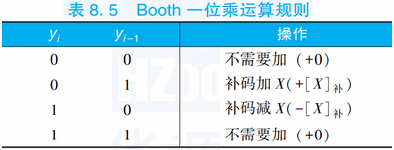

注意算法开始时，要隐含地在乘数最右侧补一个$y_{-1}$的值。下图8.29给出了两个4位数使用Booth一位乘算法的示例，需要进行8位的符号位扩展，并仅保留8位结果。

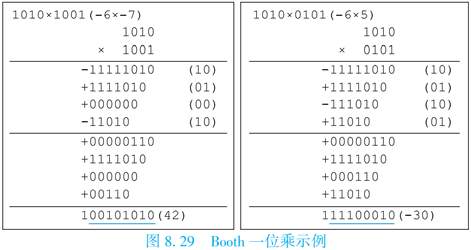

在Booth一位乘算法中，为了计算N位的补码乘法，依然需要N-1次加法。而数据宽度较大的补码加法器面积大、电路延迟长，限制了硬件乘法器的计算速度，因此重新对补码乘法公式进行变换，得到Booth两位乘算法：
$$
\begin{align}
& (-y_7)\times2^7 + y_6\times2^6 +\cdots+ y_1\times2^1 + y_0\times2^0 \\
={} & 2(-y_7)\times2^6 + y_6\times2^6 + y_5\times2^6 + 2(-y_5)\times2^4 + y_4\times2^4 + y_3\times2^4 +\cdots+ 2(-y_1)\times2^0 + y_0\times2^0 + y_{-1}\times2^0 \\
={} & (y_5+y_6-2y_7)\times2^6 + (y_3+y_4-2y_5)\times2^4 +\cdots+ (y_{-1}+y_0-2y_1)\times2^0
\end{align}
$$
根据Booth两位乘算法，需要每次扫描3位的乘数，并在每次累加完成后，将被乘数和乘数移2位。根据算法公式，可以推导出操作的方式，参见下表8.6。注意被扫描的3位是当前操作阶数i加上其左右各1位。因此操作开始时，需要在乘数最右侧隐含地补一个0。


还是以4位补码乘法为例，进行8位的符号位扩展，并仅保留8位结果，如下图8.30所示。

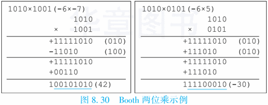

如果使用Booth两位乘算法，计算N位的补码乘法时，只需要$\lceil N/2 \rceil-1$次加法，如果使用移位加策略，则需要$N/2$个时钟周期来完成计算。**龙芯处理器就采用了Booth两位乘算法来实现硬件补码乘法器，大多数现代处理器也均采用该算法。**

同理，可以推导Booth三位乘算法、Booth四位乘算法。其中Booth三位乘算法的核心部分为：
$$
(y_{i-1}+y_i+2y_{i+1}-4y_{i+2})\times2^i \quad (i=0,每次循环i=i+3)
$$
对于Booth三位乘而言，在扫描乘数低位时，有可能出现补码加3倍$[X]_{补}$的操作。不同第2倍$[X]_{补}$可以直接通过将$[X]_{补}$左移1位来实现，3倍$[X]_{补}$的值很难直接获得，需要在主循环开始之前进行预处理，算出3倍$[X]_{补}$的值并使用额外的触发器记录下来。对于越复杂的Booth算法，需要的预处理过程也越复杂。所以，相比之下Booth两位乘算法更适合硬件实现，更为实用。本节接下来将介绍这个算法的电路实现方式。

Booth二位乘的核心是部分积的生成，共需要生成$N/2$个部分积。每个部分积与$[X]_{补}$相关，总共有$0,+X,-X,+2X,-2X$五种可能，而其中减去$[X]_{补}$的操作，可以视作加上按位取反的$[X]_{补}$再末位加1。为了硬件实现方便，将这个末位加1的操作提取出来，假设$[X]_{补}$的二进制格式写作$x_7x_6x_5x_4x_3x_2x_1x_0$，再假设部分积为$P=p_7p_6p_5p_4p_3p_2p_1p_0+c$，那么有：
$$
\begin{align}
p_i &= \begin{cases}
\overline{x_i} & 选择-X \\
\overline{x_{i-1}} & 选择-2X \\
x_i & 选择+X \\
x_{i+1} & 选择+2X \\
0 & 选择0
\end{cases} \\
c &= \begin{cases}
1 & 选择-X或-2X \\
0 & 选择+X或+2X或0
\end{cases}
\end{align}
$$
当部分积的选择为$2X$时，可以视作$X$输入左移1位，此时$p_i$就等于$x_{i-1}$；如果部分积的选择是$-X$或者$-2X$，则此处对$x_i$或者$x_{i-1}$取反，并设置最后的末位进位c为1。

根据上述规则，经过卡诺图分析，可以得出每一位$p_i$的逻辑表达式：
$$
\begin{align}
p_i &= ({S_{-X}\&\overline{x_i}})|(S_{-2X}\&\overline{x_{i-1}})|(S_{+X}\&x_i)|(S_{+2x}\&x_{i-1}) \\
&= \overline{\overline{({S_{-X}\&\overline{x_i}})}\&\overline{(S_{-2X}\&\overline{x_{i-1}})}\&\overline{(S_{+X}\&x_i)}\&\overline{(S_{+2x}\&x_{i-1})}}
\end{align}
$$
其中$S_{+X}$信号在部分积选择为$+X$时为1，其他情况为0；另外三个$S$信号含义类似。画出$p_i$的逻辑图，如下图8.31所示。

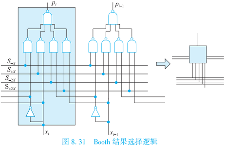

下文将使用图8.31中箭头右侧的小示意图来代表$p_i$的生成逻辑。生成逻辑中需要使用部分积选择信号，因此还需要考虑如何根据$y_{i-1},y_i,y_{i+1}$三个信号生成图8.31用到的4个选择信号。根据表8.6中的规则，很容易通过卡诺图化简得到：
$$
\begin{align}
S_{-X} &= \overline{ \overline{( y_{i+1}\&y_i\&\overline{y_{i-1}} )} \& \overline{( y_{i+1}\overline{y_i}\&y_{i-1} )} } \\
S_{+X} &= \overline{ \overline{( \overline{y_{i+1}}\&y_i\&\overline{y_{i-1}} )} \& \overline{( \overline{y_{i+1}}\&\overline{y_i}\&y_{i-1} )} } \\
S_{-2X} &= \overline{\overline{ y_{i+1}\&\overline{y_i}\&\overline{y_{i-1}} }} \\
S_{+2X} &= \overline{\overline{ \overline{y_{i+1}}\&y_i\&y_{i-1} }}
\end{align}
$$
画出选择信号生成部分的逻辑图，并得到如下图8.32所示的示意图。

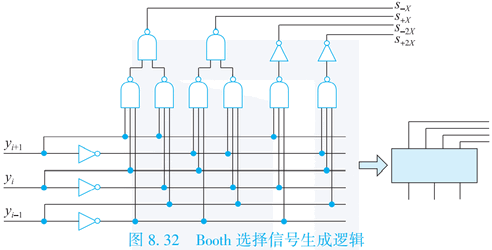

将两部分组合起来，形成每个Booth部分积的逻辑图，并得到如下图8.33所示的示意图。

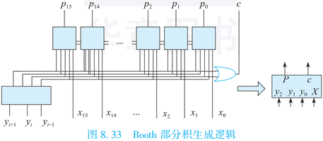

这个逻辑就是两位Booth乘法的核心逻辑。调用该逻辑，并通过“移位加”策略实现两位Booth补码乘的结构，如下图8.34所示。

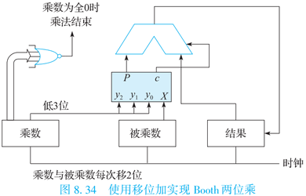

乘法操作开始时，乘数右侧需要补1位的0，而结果需要预置为全0。在每个时钟周期的计算结束后，乘数算术右移2位，而被乘数左移2位，直到乘数为全0时，乘法结束。对于N位数的补码乘法，操作可以在$N/2$个时钟周期内完成，并有可能提前结束。在这个结构中，被乘数、结果、加法器和Booth核心的宽度都为$2N$位。

### 3. 华莱士树

即使采用了Booth两位乘算法，使用移位加策略来完成一个64位的乘法操作也需要32个时钟周期，并且不支持流水操作，即第一条乘法全部完成之后才能开始计算下一条。现代处理器通常可以实现全流水、4个时钟周期延迟的定点乘法指令，其核心思想就是将各个部分积并行地加在一起，而非串行迭代累加。

以64位数据的乘法为例，共有32个部分积，如果按照二叉树方式来搭建加法结构，第一拍执行16个加法，第二拍执行8个加法，以此类推，就可以在5个时钟周期内结束运算。这个设计还支持流水式操作：当上一条乘法指令到达第二级，此时第一级的16个加法器已经空闲，可以用来服务下一条乘法指令了。

这种设计的硬件开销非常大，其中128位宽度的加法器就需要31个，而用于锁存中间结果的触发器更是接近4000个。本节将要介绍的华莱士树（Wallace Tree）结构可以大幅降低多个数相加的硬件开销和延迟。华莱士树由全加器搭建而成。根据8.2.1节的介绍，全加器的示例如下图8.35所示。

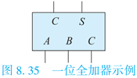

其逻辑表达式如下：
$$
\begin{align}
S &= \overline{A}\&\overline{B}\&C_{in}|\overline{A}\&B\&\overline{C_{in}}|A\&\overline{B}\&\overline{C_{in}}|A\&B\&C_{in} \\
C_{out} &= A\&B|A\&C_{in}|B\&C_{in}
\end{align}
$$
全加器可以将3个1位数$A,B,C_{in}$的加法转换为两个1位数$S,C_{out}$的错位加法：
$$
A+B+C_{in}=S+(C_{out}<<1)
$$
如果参与加法的数据较宽，可以通过调用多个全加器将3个数的加法转换为2个数的加法。下图8.36给出了3个4位数A、B、D相加的例子。

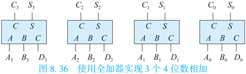

其中4位数A的二进制表示为$A_3A_2A_1A_0$，可以很容易得知：

$A_3A_2A_1A_0+B_3B_2B_1B_0+D_3D_2D_1D_0=S_3S_2S_1S_0+C_3C_2C_1C_0$

公式中所有加法都为补码加法，操作宽度为4位，结果也仅保留4位的宽度，这也导致$C_3$位没有被使用，而是在$C_0$右侧再补一个0参与补码加法运算。

再进一步，如果需要相加的数有4个，则可以先将其中3个数使用上述结构相加转为2位数加法，与剩下的1个数又凑成3个数，再调用一层上述全加器结构即可。不过要注意，全加器的$C_{out}$输出需要左移1位才能继续参与运算。如下图8.37所示。

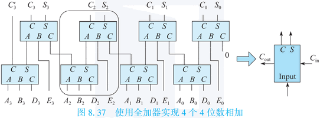

最后结果中，最高位进位$C_3$和$C_3'$都不会被使用。第二级的最右侧全加器需要在其中一个输入位置补0参与运算。从图8.37中可以看出，整个结构呈现重复特征，提取出圆角矩形框选中的部分，这部分称为一位华莱士树。准确地说，图中灰色部分呈现的是4个数相加的一位华莱士树结构，它输入4个被加数、输出的C与S，能将4个数相加转化为2个数相加（每次将相加数的个数减半），此外还有级联的进位信号。通过N个这样的一位华莱士树，就可以实现4个N位数的相加。

可以简单地计算一下使用华莱士树进行相加的优势。根据图8.37的结构，4个数相加的华莱士树需要两层全加器，当前位的进位信号在第一层产生，并接到了下一位的第二层，这意味着$C_{out}$与$C_{in}$无关。全加器的S输出需要3级门延迟，而C输出需要2级门延迟，因此不论参与加法的数据宽度是多少位，将4个数相加转换为2个数相加最多只需要6级门延迟，最后把这两个数加起来还需要一个加法器。整套逻辑需要一个加法器的面积，再加上两倍数据宽度个全加器的面积。如果不使用华莱士树，而是先将四个数逐对相加，再把结果相加，计算的延迟就是两倍的加法器延迟，面积则是3倍的加法器面积。对于64位或者更宽的加法器，它的延迟肯定是远远超过6级门的，面积也比64个全加器要大得多。

因此使用华莱士树进行多个数相加可以明显地降低计算延迟，数据宽度越宽，其效果越明显。使用华莱士树进行M个N位数相加，可以大致降低延迟$\log N$倍，而每一层华莱士树包含的全加器个数为$\lfloor M'/3\rfloor$（$M'$是当前层次要相加的数字个数）。

回到本节最开始的问题，Booth乘法需要实现$N/2$个$2N$宽度的部分积相加，其每一位可以使用M个一位华莱士树结构来完成，$2N$位则要使用$2N$个这种结构。为了描述的简洁，下面具体分析N=16即8个数相加情况下的一位华莱士树结构，如下图8.38所示。

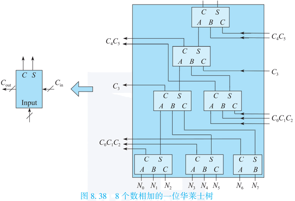

从图8.38中可以看出，通过华莱士树可以用4级全加器即12级门的延迟把8个数转换成两个数相加。华莱士树的精髓在于：通过连线实现进位传递，从而避免了复杂的进位传递逻辑。不过需要指出的是，在华莱士树中，每一级全加器生成本地和以及向高位的进位，因此在每一级华莱士树生成的结果中，凡是由全加器的进位生成的部分连接到下一级时，要连接到高位华莱士树的下一级上。下图8.39所示的搭建方法就是没有保证这一点，所以是错误的。

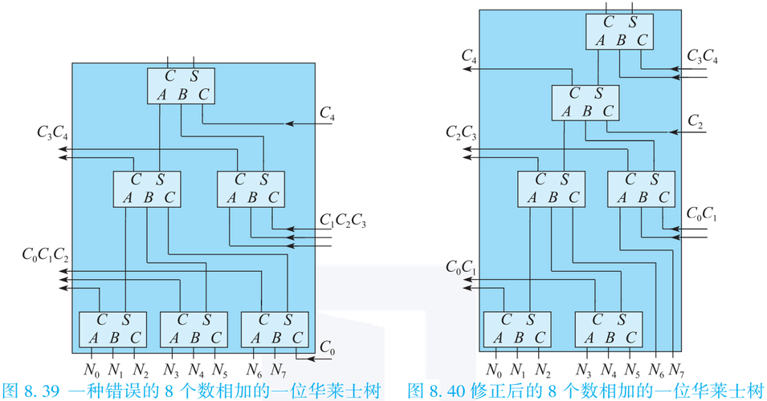

图8.40的搭建方式修正了图8.39中级间进位传递逻辑的错误，但是它的搭建方式依然存在问题。为了理解问题出在哪里，我们需要从整个乘法器的设计入手。

为了构成一个16位定点补码乘法器，需要使用8个Booth编码器，外加32个（32位）8个数相加的一位华莱士树，再加上一个32位加法器。值得注意的是，根据上一节提出的Booth乘法核心逻辑，除了有8个部分积需要相加之外，还有8个“末位加1”的信号。在华莱士树中，最低位对应的华莱士树上有空闲的进位输入信号，根据图8.38的结构，共有6个进位输入，可以接上6个“末位加1”的信号。还剩下两个“末位加1”的信号，只能去最后的加法器上想办法，即最后的加法器负责将华莱士树产生的2N位的C和S信号错位相加，其中C信号左移一位低位补0。据此设计，这两个“末位加1”的信号可以有一个接到加法器的进位输入上，另一个接到C左移后的补位上。分析到这里，应该能够理解为什么说图8.38中的华莱士树才是合适的，因为这种搭建方法才能出现6个进位输入。

最终的乘法器示意图如图8.41所示。

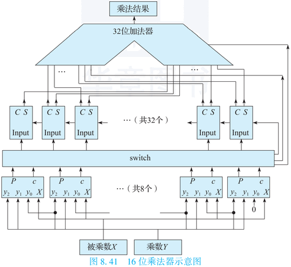

图中间标注为switch的部分，负责收集8个Booth核心生成的8个32位数（部分积），进行类似矩阵转置的操作，重新组织为32组8个一位数相加的格式，输出给华莱士树，并将Booth核心生成的8个“末位加1”信号从switch部分右侧接出，提供给华莱士树最右侧的一位树及最后的加法器。此外图中没有画出的是，被乘数$X$送到8个Booth编码器时需要先扩展到32位，并按照Booth编码器所处的位置进行不同偏移量的左移操作（移位加运算）。

# 九、指令流水线

本章介绍如何使用流水线来设计处理器。冯诺依曼架构的计算机由控制器、运算器、存储器、输入设备和输出设备组成，其中控制器和运算器合起来称为中央处理器，俗称处理器或CPU。前一章重点介绍了ALU和乘法器的设计，它们都属于运算器。本章介绍控制器，并应用流水线技术，搭建出高性能的处理器。

在接下来的介绍中，将由简至繁地搭建出一个可以正常执行各种指令的流水线处理器，其中的设计要点有两个：第一是通过加入大量触发器，实现了流水线功能；第二是通过加入大量控制逻辑，解决了指令相关问题。

## （一）单周期处理器

本节先引入一个简单的CPU模型，它的指令系统按照功能可以分为运算指令、访存指令、转移指令和特殊指令四类。根据指令集的定义，可以得知CPU的数据通路包括以下组成要素：

- 程序计数器（PC），指示当前指令的地址；
- 指令存储器，按照指令地址存储指令码，接收PC，读出指令；
- 译码部件，用于分析指令，判定指令类别；
- 通用寄存器堆，用于承载寄存器的值，绝大多数指令都需要读取及修改寄存器；
- 运算器，用于执行指令所指示的运算操作；
- 数据存储器，按照地址存储数据，主要用于访存指令。

将这些组成要素通过一定规则连接起来，就形成了CPU的数据通路，下图9.1展示了这个简单CPU的数据通路。

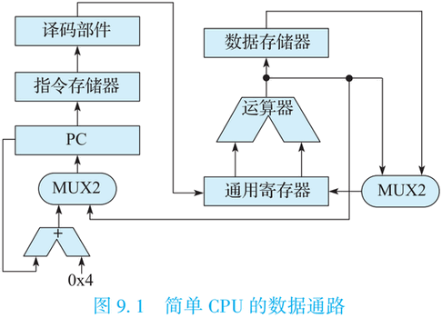

数据通路上各组成要素间的具体连接规则如下：根据PC从指令存储器中取出指令，然后是译码部件解析出相关控制信号，并读取通用寄存器堆；运算器对通用寄存器堆读出的操作数进行计算，得到计算指令的结果写回通用寄存器堆，或者得到访存指令的地址，或者得到转移指令的跳转目标；load指令访问数据存储器后，需要将结果写回通用寄存器堆。通用寄存器堆写入数据在计算结果和访存结果之间二选一。由于有控制流指令的存在，因此新指令的PC既可能等于顺序下一条指令的PC，也可能来自转移指令计算出的跳转目标。

译码部件在这个数据通路中有非常重要的作用。译码部件要识别不同的指令，并根据指令要求，控制读取哪些通用寄存器、执行何种运算、是否要读写数据存储器、写哪个通用寄存器，以及根据控制流指令来决定PC的更新。这些信息从指令码中获得，传递到整个处理器中，控制了处理器的运行。根据LoongArch指令的编码格式，可以将指令译码为op、src1、src2、src3、dest、imm几个部分，如下图9.2所示。

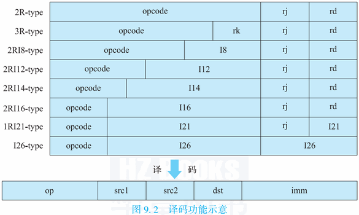

而下图9.3展示了带控制逻辑的数据通路，图中虚线是新加入的控制逻辑。此外，还加入了时钟和复位信号。引入时钟是因为更新PC触发器、写通用寄存器以及store类访存指令写数据存储器时都需要时钟。而引入复位信号是为了确保处理器每次上电后都是从相同位置取回第一条指令。数据通路再加上这些逻辑，就构成了处理器。

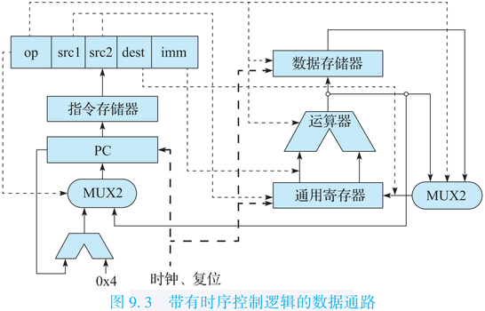

简要描述一下这个处理器的执行过程：

1. 复位信号将复位的PC装载到PC触发器内，之后的第一个时钟周期内，使用PC取指、译码、执行、读数据存储器、生成结果；
2. 当第二个时钟周期上升沿到来时，根据时序逻辑的特性，将新的PC锁存，将上一个时钟周期的结果写入寄存器堆，执行可能的数据存储器写操作；
3. 在第二个时钟周期内执行第二条指令，同样按照上面两步来执行。

依此类推，由一系列指令构成的程序就在处理器中执行了。由于每条指令的执行基本在一拍内完成，因此这个模型被称为单周期处理器。

## （二）流水线处理器

在真实世界种，CMOS电路工作时输入和输出之间存在延迟，该延迟主要由电路中晶体管的RC参数来决定。当电路中组合逻辑部分延迟增大时，整个电路的频率就会变低。在上一节的单周期处理器模型中，每个时钟周期必须完成取指、译码、读寄存器、执行、访存等很多组合逻辑工作，为了保证在下一个时钟上升沿到来之前准备好寄存器堆的写数据，需要将每个时钟周期的间隔拉长，导致处理器的主频无法提高。使用流水线技术可以提高处理器的主频。

在引入流水线技术之前，先介绍一下多周期处理器的概念。在单周期处理器中，每个时钟周期内执行的功能可以比较明显地进行划分。举例而言，按照取指、译码并读寄存器、执行、访存和准备写回划分为五个阶段。如果我们在每段操作前后加上触发器，看起来就能减少每个时钟周期的工作量，提高处理器频率，如下图9.4所示，其中加粗框线的是触发器。

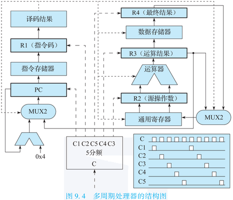

为了清晰，图中省略了控制逻辑的部分连线，没有画出通用寄存器和数据存储器的写入时钟。先将原始时钟接到所有的触发器，按照时序逻辑特性，每个时钟上升沿，触发器的值就会变成其驱动端D端口的新值，因此可以推算：

1. 在第1个时钟周期，通过PC取出指令，在第2个时钟上升沿锁存到指令码触发器R1；
2. 在第2个时钟周期，将R1译码并生成控制逻辑，读取通用寄存器，读出结果在第3个时钟上升沿锁存到触发器R2；
3. 在第3个时钟周期，使用控制逻辑和R2在ALU进行运算。

推算到这里就会发现，此时（第3个时钟周期）离控制逻辑的生成（第2个时钟周期）已经隔了一个时钟周期了，因该要保证这时控制逻辑不会发生发生变化。使用分频时钟或门控时钟可以做到这一点。如上图右下方所示，将原始的时钟通过分频的方式产生出5个时钟，分别控制图中PC、R1~R4这五组触发器。这样，在进行ALU运算时，可以保证触发器R1没有接收到下一个时钟上升沿，故不可能变化，因此可以进行正确的ALU运算。同理，包括写寄存器、执行访存等，都受到正确的控制。

经过推算，可以将这种处理器执行指令时的“指令‑时钟周期”的对照图画出来，如下图9.5所示。这种图可以被称为处理器执行的时空图，也被称为流水线图。画出流水线图是分析处理器行为的直观、有效的方法。

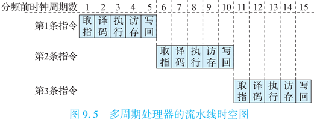

这种增加触发器并采用分频时钟的处理器模型称为多周期处理器。多周期处理器设计可以提高运行频率，但是每条指令的执行时间并不能降低（考虑到触发器的Setup时间和Clk-to-Q延迟则执行时间会增加）。我们可以将各个执行阶段以流水方式组织起来，同一时刻不同指令的不同执行阶段重叠在一起，进一步提高CPU执行效率。流水线中的“阶段”也称为“级”。

从多周期处理器演进到流水线处理器，核心在于控制逻辑和数据通路对应关系维护机制的变化。多周期处理器通过使用分频时钟，可以确保在同一条指令的后面几个时钟周期执行时，控制逻辑因没有接收到下一个时钟上升沿所以不会发生变化。流水线处理器则通过另一个方法来保证这一点，就是在每级流水的触发器旁边，再添加一批用于存储控制逻辑的触发器。指令的控制逻辑藉由这些触发器沿着流水线逐级传递下去，从而保证了各阶段执行时使用的控制逻辑都是属于该指令的，如下图9.6所示。

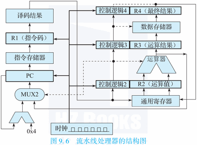

从上图中的虚线可以看出，控制运算器进行计算的信息来自“控制逻辑2”，即锁存过一次的控制逻辑，刚好与R2中存储的运算值同属一条指令。图中取消了R3阶段写通用寄存器的通路，而是将R3的内容锁存一个时钟周期，统一使用“控制逻辑4”和R4来写。

可以先设计几条简单指令，画出时空图，看看这个新的处理器是如何运行的，示例如下图9.7所示。

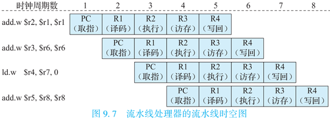

要记得图中R2、R3和R4实际上还包括各自对应的控制逻辑触发器，所以到下一个时钟周期后，当前部件及对应触发器已经不再需要给上一条指令服务，新的指令才可以在下一个时钟周期立即占据当前的触发器。

如果从每个处理器部件的角度，也可以画出另一个时空图，见下图9.8所示。图中不同下标的I代表不同的指令。

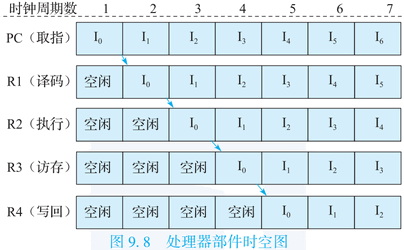

从这个角度看过去，处理器的工作方式就像五人分工合作的加工厂，每个工人做完自己的部分，将自己手头的工作交给下一个工人，并取得一个新的工作，这样可以让每个工人都一直处于工作状态。这种工作方式被称为流水线，采用这种模型的处理器被称为流水线处理器。

## （三）指令相关和流水线冲突

程序中的指令序列并不总是简单的，通常会存在指令间的相关，这就有可能导致流水线处理器执行出错。举例来说，对于下面的指令序列，第1条指令将结果写入r2寄存器，第2条指令再用r2寄存器的值进行计算。

```assembly
add.w $r2, $r1, $r1
add.w $r3, $r2, $r2
```

在前面设计的5级静态流水线处理器中，第1条指令在第5级写回阶段才把结果写回到寄存器，但是第2条指令在第2级译码阶段（此时第1条指令尚在第3级执行阶段）就已经在读寄存器的值了，所以第2条指令读取的是r2寄存器的旧值，从而造成了运算结果错误。因此本节将重点探讨如何在流水线处理器结构设计中处理好指令相关，从而保证程序的正确执行。

指令间的相关可以分为三类：数据相关、控制相关、结构相关。在程序中，如果两条指令访问同一个寄存器或内存单元，而且这两条指令中至少有一条是写该寄存器或内存单元的指令，那么这两条指令之间就存在数据相关。如果两条指令中一条是转移指令且另一条指令是否被执行取决于该转移指令的执行结果，则这两条指令之间存在控制相关。如果两条指令使用同一份硬件资源，则这两条指令之间存在结构相关。

在程序中，指令间的相关是普遍存在的。这些相关给指令增加了一个序关系，要求指令的执行必须满足这些序关系，否则执行的结果就会出错。为了保证程序的正确执行，处理器结构设计必须满足这些序关系。指令间的序关系有些是很容易满足的，例如两条相关的指令之间隔得足够远，后面的指令开始取指执行时前面的指令早就执行完了，那么处理器结构设计就不用做特殊处理。但是如果两条相关的指令挨得很近，尤其是都在指令流水线的不同阶段时，就需要用结构设计来保证这两条指令在执行时满足它们的相关关系。

相关的指令在一个具体的处理器结构中执行时可能会导致冲突（hazard）。例如本节开头所举例子中，数据相关指令序列在5级静态流水线处理器中执行时碰到的读数时机早于写数的情况就是一个冲突。下面将具体分析5级静态流水线处理器中存在的冲突及其解决办法。

### 1. 数据相关引发的冲突及解决办法

数据相关根据冲突访问读和写的次序可以分为三种。第一种是**写后读（Read After Write，RAW）**相关，即后面指令要用到前面指令所写的数据，也称为真相关。第二种是**写后写（Write After Write，WAW）**相关，即两条指令写同一个单元，也称为输出相关。第三种是**读后写（Write After Read，WAR）**相关，即后面的指令覆盖前面指令所读的单元，也称为反相关。在第二节所介绍的5级简单流水线中，只有RAW相关会引起流水线冲突，WAW相关和WAR相关不会引起流水线冲突；但是在乱序执行流水线中，WAR相关和WAW相关也有可能引起流水线冲突。

下面重点分析RAW相关所引起的流水线冲突并讨论其解决方法。对于如下指令序列

```assembly
add.w $r2, $r1, $r1
add.w $r3, $r2, $r2
ld.w  $r4, $r3, 0
add.w $r5, $r4, $r4
```

这些指令之间存在RAW相关，它们在第二节所介绍的5级简单流水线处理器中执行的流水线时空图如下图9.9所示。

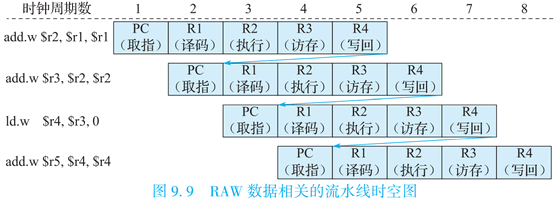

从图中可以看出，第1条指令的写回阶段指向第2条指令的译码阶段的箭头，以及从第2条指令的写回阶段指向第3条指令的译码阶段的箭头，都表示RAW相关会引起冲突。这是因为如果第2条指令要使用第1条指令写回到寄存器的结果，就必须保证第2条指令读取寄存器的时候第1条指令的结果已经写回到寄存器中了，而现有的5级流水线结构如果不加控制，第2条指令就会在第1条指令写回寄存器之前读取寄存器，从而引发数据错误。

#### (1) 阻塞后序指令

为了保证执行的正确，一种最直接的解决方式是让第2条指令在译码阶段等待（阻塞）3拍，直到第1条指令将结果写入寄存器后才能读取寄存器，进入后续的执行阶段。同样的方式亦适用于第2、3条指令之间。采用阻塞解决数据相关的流水线时空图如下图9.10所示。

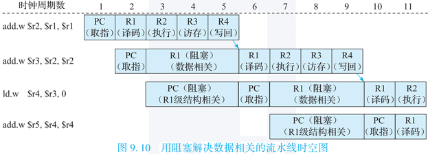

阻塞功能在处理器流水线中的具体电路实现是：将被阻塞流水级所在的寄存器保持原值不变，同时向被阻塞流水级的下一级流水级输入指令无效信号，用流水线空泡（Bubble）填充。对于上图所示的流水线阻塞，从每个处理器部件的角度所看到的时空图如下图9.11所示。


#### (2) 流水线前递技术

采用阻塞的方式虽然能够解决RAW相关所引发的流水线冲突，但是阻塞势必引起流水线执行效率的降低，为此需要更为高效的解决方式。

继续分析前面所举的例子，可以发现第2条指令位于译码阶段的时候，虽然它所需要的第1条指令的结果还不在寄存器中，但是这个值已经在流水线的执行阶段计算出来了，“等着这个值沿着流水线一级一级送下去写入寄存器后再从寄存器中读出”是非必要的，我们可以直接把这个值取过来使用，顺着这个思路就产生了**流水线前递（Forwarding）**技术。其具体实现是在流水线中读取指令源操作数的地方通过多路选择器直接把前面指令的运算结果作为后面指令的输入。考虑到加法指令在执行级就完成了运算，因此能够设计一条通路，将这个结果前递至读寄存器的地方，即有一条从执行级到译码级的前递通路。除此之外，还可以依次添加从访存级、写回级到译码级的前递通路。新的流水线时空图如下图9.12所示。


可以看出，加入前递技术之后，执行这4条指令的性能有大幅提高。

通过前面对于指令相关的分析，我们需要在处理器中加入阻塞流水线的控制逻辑以及前递通路，演进后的处理器结构如下图9.13所示。为了表达清晰，图中省略了时钟信号到每组触发器的连接线。


图中虚线框中是新加入的逻辑。为了解决数据相关，加入了寄存器相关判断逻辑，收集当前流水线中处于执行、访存及写回级的，最多3条指令的目的寄存器信息，与译码级的源寄存器比较，并根据比较结果决定是否阻塞译码级R1；为了解决控制相关，加入了译码级和执行级能够修改PC级有效位的通路；为了解决结构相关，加入了译码级到PC级的阻塞控制逻辑；为了支持前递，加入了从执行级、访存级到译码级的数据通路，并使用寄存器相关判断逻辑来控制如何前递。可以看出，大多数机制都加在了前两级流水线上。

### 2. 控制相关引发冲突及解决方法

如果两条指令中一条是转移指令且另一条指令是否被执行取决于该转移指令的执行结果，则这两条指令之间存在控制相关。控制相关引发的冲突本质上是对程序计数器PC的冲突访问引起的。下图9.14中的箭头即表示控制相关所引发的冲突。


按照图9.6所给出的处理器设计，执行阶段R2触发器所存储的值经过计算之后才能给出转移指令的正确目标并在下一个时钟上升沿更新PC，但是上图9.14中转移指令尚未执行结束时，PC已经更新完毕并取指了，从而可能导致取回了错误的指令。为了解决这个问题，可以通过在取指阶段引入2拍的流水线阻塞来解决，如下图9.15所示。


在单发射5级静态流水线中，如果增加专用的运算资源将转移指令条件判断和计算下一条指令PC的处理调整到译码阶段，那么转移指令后面的指令只需要在取指阶段等1拍。调整后的前述代码序列的执行流水线的时空图如下图9.16所示。


采用这种解决控制相关的方式，继续改进流水线处理器结构，得到如下图9.17所示的结构设计。


为更进一步减少由控制相关引起的阻塞，可以采用转移指令的延迟槽技术，在定义指令系统的时候就明确“转移指令延迟槽指令的执行不依赖于转移指令的结果，即无论是否跳转都要执行”，这样转移指令后面的指令在取指阶段1拍也不用等；不过在实际实现时，一些CPU对延迟槽指令是否一定执行有不同的规定。总之，在单发射5级静态流水线处理器中，通过在译码阶段对转移指令进行处理和利用转移指令延迟槽技术，就可以避免控制相关引起的流水线阻塞。但是这两项技术并不一定适用于其他结构，在后面9.5.3节中讨论转移预测技术时将做进一步分析。

### 3. 结构相关引发冲突及解决办法

结构相关引起冲突的原因是两条指令要同时访问流水线中的同一个功能部件。由于流水线中只有一个译码部件，所以后序指令因为结构相关在前一个指令完成之前不能进入译码阶段，否则就将覆盖前一指令的信息，导致其无法正确执行。如前面图9.10所示，可以看到不存在任何数据相关的第4条指令，由于存在结构相关也被多次阻塞，甚至被堵得还无法进入取指阶段。

## （四）流水线与异常处理

这里简要介绍一下如何在流水线处理器中支持异常处理。异常产生的来源包括：外部事件、指令执行中的错误、数据完整性问题、地址转换异常、系统调用和陷入，以及需要软件修正的运算等。在流水线处理器中，这些不同类型的异常可能在流水线的不同阶段产生。例如访存地址错异常可以在取指阶段和访存阶段产生，保留指令异常和系统调用异常在译码阶段产生，整数溢出异常在执行阶段产生，而中断则可以在任何时候发生。

异常可以分为可恢复异常和不可恢复异常。不可恢复的异常通常发生在系统硬件出现了严重故障的时候，此时异常处理后系统通常面临重启，所以处理器响应不可恢复异常的机制很简单，只要立即终止当前的执行，记录软件所需的信息然后跳转到异常处理入口即可。但是，可恢复异常的处理就比较难，要求做得非常精确，这也就是精确异常概念。精确异常要求处理完异常之后，回到产生异常的地方接着执。要达成这个效果，要求在处理异常时，发生异常的指令前面的所有指令都执行完（修改了机器状态），而发生异常的指令及其后面的指令都没有执行（没有修改机器状态）。

在流水线处理器中，同时会有多条指令处于不同阶段，不同阶段都有发生异常的可能，这里给出一种可行的设计方案。

1. 任何一级流水发生异常时，在流水线中记录下发生异常的事件，直到写回阶段再处理。
2. 如果在执行阶段要修改机器状态（如状态寄存器），保存下来直到写回阶段再修改。
3. 指令的PC值随指令流水前进到写回阶段为异常处理专用。
4. 将外部中断作为取指的异常处理。
5. 指定一个通用寄存器（或一个专用寄存器）为异常处理时保存PC值专用。
6. 当发生异常的指令处在写回阶段时，保存该指令的PC及必需的其他状态，置取指的PC值为异常处理程序入口地址。

## （五）提高流水线效率的技术

通常以应用的执行时间来衡量一款处理器的性能，应用的执行时间等于指令数乘以**CPI（Cycles Per Instruction，每指令执行周期数）**，再乘以时钟周期。当算法、程序、指令系统、编译器都确定之后，一个应用的指令数就确定下来了。时钟周期与结构设计、电路设计、生产工艺以及工作环境都有关系，不作为这里讨论的重点。这里主要关注CPI的降低，即如何通过结构设计提高流水线效率。

上一节中提到指令相关容易引起流水线的阻塞。因此，流水线处理器实际的CPI等于指令的理想执行周期数加上由于指令相关引起的阻塞周期数：
$$
\text{流水线CPI}=\text{理想CPI}+\text{RAW阻塞周期数}+\text{WAW阻塞周期数}+\text{WAR阻塞周期数}+\text{结构相关阻塞周期数}+\text{控制相关阻塞周期数}
$$
从上面的公式可知，要想提高流水线效率，即降低Pipeline CPI，可以从降低理想CPI和降低各类流水线阻塞这些方面入手。

### 1. 多发射数据通路（超标量技术）

关于如何降低理想CPI的问题，最直观的方法就是让处理器中每级流水线都可以同时处理更多的指令，这被称为多发射数据通路技术。例如双发射流水线意味着每一拍用PC从指令存储器中取两条指令，在译码级同时进行两条指令的译码、读源寄存器操作，还能同时执行两条指令的运算操作和访存操作，并同时写回两条指令的结果。那么双发射流水线的理想CPI就从单发射流水线的1降至0.5。

要在处理器中支持多发射，**首先就要将处理器中的各种资源翻倍**，包括采用支持双端口的存储器。其次还要增加额外的阻塞判断逻辑，当同一个时钟周期执行的两条指令存在指令相关时，也需要进行阻塞。包括数据相关、控制相关和结构相关在内的阻塞机制都需要改动。这里是一个例子，展示了几条简单指令在双发射流水线中的时空图，如下图9.18所示。


图中，为了流水线控制的简化，只有同一级流水线的两条指令都不被更早的指令阻塞时，才能让这两条指令一起继续执行，所以有的指令触发了陪同阻塞。

多发射数据通路技术虽然从理论上而言可以大幅度降低处理器的CPI，但是由于各类相关所引起的阻塞影响，其实际执行效率是要大打折扣的。所以还要进一步从减少各类相关引起的阻塞这个方面入手来提高流水线的执行效率。

### 2. 动态调度（乱序执行）

如果用道路交通来类比的话，多发射数据通路就类似于把马路从单车道改造为多车道，但是这个多车道的马路有个奇怪的景象，速度快的车不能超过前面速度慢的车，即使慢车前面的车道是空闲的。显然这样做效率低，只要车道有空闲，就应该允许后面速度快的车超过前面速度慢的车。这就是动态调度的基本出发点。动态调度的基本思想就是：把相关的解决尽量往后拖延，同时前面指令的等待不影响后面指令继续前进。

这里有一个例子来加深理解，假定现在有一个双发射流水线，所有的运算单元都有两份，执行下列指令序列。

```ass
div.w $r3, $r2, $r1
add.w $r5, $r4, $r3
sub.w $r8, $r7, $r6
```

由于除法单元采用迭代算法实现，所以div.w指令需要多个执行周期，与它有RAW相关的add.w指令最早也只能等到div.w指令执行完毕后才能开始执行。但是sub.w指令与前两条指令没有任何相关，采用动态调度的流水线就允许sub.w指令越过前面尚未执行完毕的div.w指令和add.w指令，提前开始执行。因为sub.w是在流水线由于指令间的相关引起阻塞而空闲的情况下“见缝插针”地提前执行了，所以这段程序整体的执行延迟就减少了。

要完成上述功能，需要对原有的流水线做一些改动。首先，要将原有的译码阶段拆分成“译码”和“读操作数”两个阶段。译码阶段进行指令译码并检查结构相关，随后在读操作数阶段则一直等待直至操作数可以读取。处在等待状态的指令不能一直停留在原有的译码流水级上，因为这样它后面的指令就没法前进甚至是进入流水线，更不用说提前执行了。所以我们会利用一个结构存放这些等待的指令，这个结构被称为保留站，有的文献中也称之为发射队列，这是动态调度中必需的核心部件。除了存储指令的功能，保留站还要负责控制其中的指令何时去执行，因此保留站中还会记录下描述指令间相关关系的信息，同时监测各条指令的执行状态。如果指令是在进入保留站前读取寄存器，那么保留站还需要监听每条结果总线，获得源操作数的最新值。

保留站在处理器中的大致位置如下图9.19所示。保留站通常组织为一个无序的队列结构，其中每一项对应一条指令，包含多个域，存放这个指令的监听结果和后续执行所需各类信息，包括有效位、指令执行控制信息（如操作码）、源操作数的就绪状态、源操作的监听对象以及源操作数的数据。此外，如果采用了后面将要提到的寄存器重命名技术，那么保留站通常还要存放该指令目的寄存器重命名后的信息。译码并读寄存器的指令进入保留站，保留站会每个时钟周期选择一条没有被阻塞的指令，送往执行逻辑，并退出保留站，这个动作称为“发射”。


保留站调度算法的核心在于“挑选没有被阻塞的指令”。从保留站在流水线所处的位置来看，保留站中的指令不可能因为控制相关而被阻塞。结构相关所引起的阻塞的判定条件也是直观的，即检查有没有空闲的执行部件和空闲的发射端口。但是在数据相关所引起的阻塞的处理上，存在着不同的设计思路。为了讨论清楚保留站如何处理数据相关所引起的阻塞，先回顾一下第三节中关于RAW、WAW、WAR三种数据相关的介绍，在5级简单流水线上WAW和WAR两种数据相关不会产生冲突，但是在动态调度的情况下就可能会产生。这里使用两个例子来讨论。

例如下面的指令序列：

```assembly
div.w $r3, $r2, $r1
add.w $r5, $r4, $r3
sub.w $r4, $r7, $r6
```

add.w指令和sub.w指令之间存在WAR相关，在乱序调度的情况下，sub.w指令自身的源操作数不依赖于div.w和add.w指令，可以读取操作数执行得到正确的结果。然而这个结果并不能在执行结束后就立即写入寄存器。假设sub.w执行完毕的时候，add.w指令因为等待div.w指令的结果还没有开始执行，那么sub.w指令如果在这个时候就修改了r4寄存器的值，那么等到add.w开始执行读取r4时，就会产生错误的结果。

WAW相关的例子与上面WAR相关的例子很相似，如下面的指令序列：

```assembly
div.w $r3, $r2, $r1
add.w $r5, $r4, $r3
sub.w $r5, $r7, $r6
```

add.w指令和sub.w指令之间存在WAW相关，在乱序调度的情况下，sub.w指令可以先于add.w指令执行，如果sub.w执行完毕的时候，add.w指令因为等待div.w指令的结果还没有开始执行，那么sub.w指令若是在这个时候就修改了r5寄存器的值，那就会被add.w指令执行完写回的结果覆盖掉，从程序的角度看，sub.w后面的指令读取r5寄存器会得到错误的结果。

关于如何解决WAR和WAW相关在动态调度流水线中所产生的冲突，阻塞作为解决一切冲突的普适方法肯定是可行的。方法就是如果保留站判断出未发射的指令与前面尚未执行完毕的指令存在WAR和WAW相关，就阻塞其发射直至冲突解决。历史上第一台采用动态调度流水线的CDC6000就是采用了这种解决思路，称为记分板办法。

事实上，WAR和WAW同RAW是有本质区别的，它们并不是由程序中真正的数据依赖关系所引起的相关关系，而仅仅是由于恰好使用具有同一个名字的寄存器所引起的名字相关。打个比方来说，32项的寄存器文件就好比一个有32个储物格的储物柜，每条指令把自己的结果数据放到一个储物格中，然后后面的指令依照储物格的号（寄存器名字）从相应的格子中取出数据，储物柜只是一个中转站，问题的核心是要把数据从生产者传递到指定的消费者，至于说这个数据通过哪个格子做中转并不是绝对的。WAR和WAW相关产生冲突意味着两对“生产者‑消费者”之间恰好准备用同一个格子做中转，而且双方在“存放‑取出”这个动作的操作时间上产生了重叠，所以就引发了混乱。如果双方谁都不愿意等（记分板的策略），那么再找一个不受干扰的空闲格子，后来的一方换用这个新格子做中转，就不用等待了。这就是寄存器重命名技术。通过寄存器重命名技术，可以消除WAR和WAW相关。

例如，存在WAR和WAW相关指令序列：

```assembly
div.w $r3, $r2, $r1
add.w $r5, $r4, $r3
sub.w $r3, $r7, $r6
mul.w $r9, $r8, $r3
```

可以通过寄存器重命名变为：

```assembly
div.w $r3,$r2,$r1
add.w $r5,$r4,$r3
sub.w $r10,$r7,$r6
mul.w $r9,$r8,$r10
```

重命名之后就没有WAR和WAW相关了。

在流水线中实现动态调度，还有最后一个需要考虑的问题，即精确异常。精确异常要求在处理异常时，发生异常的指令前面的所有指令都执行完（修改了机器状态），而发生异常的指令及其后面的指令都没有执行（没有修改机器状态）。那么在乱序调度的情况下，指令已经打破了原有的先后顺序在流水线中执行了，“前面”“后面”这样的顺序关系已经不确定了，且有可能原来的后序指令在乱序执行时先于前序指令执行了。

解决方案是，在流水线中添加一个**重排序缓冲（Re-Order Buffer，ROB）**来维护指令的有序结束，同时在流水线中增加一个“提交”阶段。指令对机器状态的修改只有在到达提交阶段时才能生效（软件可见），处于写回阶段的指令不能真正地修改机器状态，但可以更新并维护一个临时的软件不可见的机器状态。ROB是一个先进先出的有序队列，所有指令在译码之后按程序顺序进入队列尾部，所有执行完毕的执行从队列头部按序提交。提交时一旦发现有指令发生异常，则ROB中该指令及其后面的指令都被清空。发生异常的指令出现在ROB头部时，这条指令前面的指令都已经从ROB头部退出并提交了，这些指令对于机器状态的修改都生效了；异常指令和它后面的指令都因为清空而没有提交，也就不会修改机器状态。这就满足了精确异常的要求。

总结一下实现动态调度后流水线各阶段的调整：

- 取指，不变。
- 译码，译码拆分为译码和读操作数两个阶段。在读操作数阶段，把操作队列的指令根据操作类型派送（dispatch）到保留站（如果保留站以及ROB有空），并在ROB中指定一项作为临时保存该指令结果之用；保留站中的操作等待其所有源操作数就绪后即可以被挑选出来发射（issue）到功能部件执行，发射过程中读寄存器的值和结果状态域，如果结果状态域指出结果寄存器已被重命名到ROB，则读ROB。
- 执行，不变。
- 写回，把结果送到结果总线，释放保留站；ROB根据结果总线修改相应项。
- 提交，如果队列中第一条指令的结果已经写回且没有发生异常，把该指令的结果从ROB写回到寄存器或存储器，释放ROB的相应项；如果队列头的指令发生了异常或者转移指令猜测错误，清除操作队列以及ROB等。

### 3. 转移预测

因转移指令而引起的控制相关也会造成流水线的阻塞，在该章3.2节中，通过将转移指令处理放到译码阶段和转移指令延迟槽两项技术，可以在单发射5级静态流水线中无阻塞地解决控制相关所引起的冲突。但是这种解决控制相关所引起的冲突的方式并不是普适的。比如当为了提高处理器的主频而将取指阶段的流水级做进一步切分后，或者是采用多发射数据通路设计后，仅有一条延迟槽指令是无法消除流水线阻塞的。

正常的应用程序中转移指令出现十分频繁，通常平均每5~10条指令中就有1条是转移指令，而且多发射结构进一步提高了流水线遇到转移指令的频率。例如假设一个程序平均8条指令中有1条转移指令，那么在单发射情况下平均8拍才遇到1条转移指令，而4发射情况下平均2拍就会遇到1条转移指令。而且随着流水线越来越深，处理转移指令所需要的时钟周期数也越来越多。面对这些情况，如果还是只能通过阻塞流水线的方式来避免控制相关引起的冲突，将会极大地降低流水线处理器的性能。

现代处理器普遍采用硬件转移预测机制来解决转移指令引起的控制相关阻塞，其基本思路是在转移指令的取指或译码阶段预测出转移指令的方向和目标地址，并从预测的目标地址继续取指令执行，这样在猜对的情况下就不用阻塞流水线。既然是猜测，就有错误的可能。硬件转移预测的实现分为两个步骤：第一步是预测，即在取指或译码阶段预测转移指令是否跳转以及转移的目标地址，并根据预测结果进行后续指令的取指；第二步是确认，即在转移指令执行完毕后，比较最终确定的转移条件和转移目标与之前预测的结果是否相同，如果不同则需要取消预测后的指令执行，并从正确的目标重新取指执行。

下面通过一个简单的例子来说明转移预测对性能的影响。

假设平均8条指令中有1条转移指令，某处理器采用4发射结构，在第10级流水计算出转移方向和目标，这意味着转移预测失败将产生$(10-1)\times 4=36$个空泡；如果不进行转移预测而采用阻塞的方式，那么取指带宽浪费$36/(36+8)=82\%$。如果进行简单的转移预测，转移预测错误率为$50\%$，那么平均每$8/50\%=16$条指令预测错误一次，指令带宽浪费$36/(36+16)=75\%$；如果使用误预测率为$10\%$的转移预测器，那么平均每$8/10\%=80$条指令预测错误一次，指令带宽浪费降至$36/(36+80)=31\%$；如果使用误预测率为$4\%$的转移预测器，则平均每$8/4\%=200$条指令预测错误一次，取指令带宽浪费进一步降至$36/(36+200)=15\%$。

从上面的例子可以看出，在转移预测错误开销固定的情况下，提高转移预测的准确率有助于大幅度提升处理器性能。通过对大量应用程序中转移指令的行为进行分析后，人们发现它具有两个非常好的特性。首先，转移指令有较好的局部性，即少数转移指令的执行次数占所有转移指令执行次数中的绝大部分，这意味着只要对少量高频次执行的转移指令做出准确的预测就能获得绝大多数的性能提升。其次，绝大多数转移指令具有可预测性，即能够通过对转移指令的行为进行分析学习得出其规律性。

转移指令的可预测性主要包括单条转移指令的重复性以及不同转移指令之间存在的方向相关（即是否跳转）、路径相关（跳转目标地址），如下图9.20所示。单条转移指令的重复性主要与程序中的循环有关；不同转移指令之间的相关性主要出现在if-else结构中。图9.20(a)是转移指令之间存在方向相关的例子。两个分支的条件（完全或部分）基于相同或相关的信息，后面分支的结果基于前面分支的结果，则称为存在方向相关。如果一个分支是通向当前分支的前n条分支之一，则称该分支处在当前分支的路径上，处在当前分支的路径上的分支与当前分支结果之间的相关性称为路径相关。图9.20(b)是转移指令之间存在路径相关的例子。


流水线中最早可以在取指阶段进行转移预测，此时只有PC信息可以用来进行预测，且预测出的信息需要同时包括转移的方向和目标地址。这里介绍此类预测器中一种最基本的结构，**分支目标缓冲（Branch Target Buffer，BTB）**，其逻辑上通常组织为一个基于内容寻址的查找表，结构如下图9.21所示。每个表项包含PC、跳转目标（Target）和饱和计数器（Counter）三个部分。BTB的预测过程是：用取指PC与表中各项的PC进行比较，如果某项值相等且该项的饱和计数器值指示预测跳转，则取出该项所存的跳转目标并跳转过去。


对于那些采用PC相对跳转的指令，其在译码阶段就可以根据PC和指令码明确计算得到，因此只需要对转移方向（即是否跳转）进行预测。下面介绍此类预测器中一种最基本的结构，即根据单条转移指令的转移历史来预测转移指令的跳转方向。这种转移预测主要依据转移指令重复性的规律，对于重复性特征明显的转移指令（如循环）可以取得很好的预测效果。例如，对于循环语句`for(i=0;i<10;i++){...}`，可以假设其对应的汇编代码中是由一条回跳的条件转移指令来控制循环的执行。该转移指令前9次跳转，第10次不跳转，如果用1表示跳转，0表示不跳转，那么这个转移指令的转移模式就记为1111111110。这个转移模式的特点是，如果上一次是跳转，那么这一次也是跳转的概率比较大。这个特点启发我们将该转移指令的执行历史记录下来用于猜测该转移指令是否跳转。

这种用于记录转移指令执行历史信息的表称为**转移历史表（Branch History Table，BHT）**。最简单的BHT利用PC的低位进行索引，每项只有1位，记录索引到该项的转移指令上一次执行时的跳转情况，1表示跳转，0表示不跳转。由于存储的信息表征了转移的模式，所以这种BHT又被称为**转移模式历史表（Pattern History Table，PHT）**。利用这种1位PHT进行预测时，首先根据转移指令的PC低位去索引PHT，如果表项值为1，则预测跳转，否则预测不跳转；其次要根据该转移指令实际的跳转情况来更新对应PHT的表项中的值。通常来说PHT在进入和退出循环都要猜错一次，这种PHT在应对不会多次执行的单层循环时，或者循环次数特别多的循环时还比较有效。但是对于两重循环，使用上述1位PHT，则内外循环每次执行都会猜错2次，这样总的转移预测正确率就会下降。为了提高上述情况下的转移预测正确率，可以采用每项2位的PHT。这种PHT中每一项都是一个2位饱和计数器，相应的转移指令每次执行跳转就加1（加到0b11为止），不跳转就减1（减到0b00为止）。预测时，如果相应的PHT表项的高位为1（计数器的值为0b1X）就预测跳转，高位为0（计数器的值为0b0X）就预测不跳转。也就是说，只有连续两次猜错，才会改变预测的方向。

还有很多技术可以提高分支预测的准确率。可以使用分支历史信息与PC进行哈希操作后再查预测表，让分支历史影响预测结果；可以使用多个预测器同时进行预测，并预测哪个预测器的结果更准确，这被称为锦标赛预测器。具体的实现方法，以及更高级的分支预测技术可以参见本套系列教材中的硕士课程教材。

### 4. 高速缓存

由于物理实现上存在差异，自20世纪80年代以来CPU和内存的速度提升幅度一直存在差距，而且这种差距随着时间的推移越来越大。例如DDR3内存的访问延迟约为50ns，而高端处理器的时钟周期都在1ns以下，相当于每访问一次DDR3都需要花费至少50个处理器的时钟周期，如果程序有较多依赖访存结果的数据相关，就会严重影响处理器的性能。处理器和内存的速度差距造就了存储层次：离处理器流水线距离越近的地方，使用存储密度小的电路结构，牺牲存储容量来换取更快的访问速度；离处理器流水线距离越远的地方，使用存储密度大的电路结构，牺牲访问速度来换取存储容量。目前计算机中常见的存储层次包括寄存器、高速缓存（Cache）、内存、IO这四个层次。本节主要讨论Cache的相关概念。

Cache为了追求访问速度，容量通常较小，其中存放的内容只是主存储器内容的一个子集。Cache是微体系结构的概念，它没有程序上的意义，没有独立的编址空间，处理器访问Cache和访问存储器使用的是相同的地址，因而Cache对于编程功能正确性而言是透明的。Cache在流水线中的位置大致如下图9.23所示，这里为了避免共享Cache引入的结构相关采用了独立的指令Cache和数据Cache，前者仅供取指，后者仅供访存。


由于Cache没有独立的编址空间，且只能存放一部分内存的内容，所以一个Cache单元可能在不同时刻存储不同的内存单元的内容。这就需要一种机制来标明某个Cache单元当前存储的是哪个内存单元的内容。因此Cache的每一个单元不仅要存储数据，还要存储该数据对应的内存地址，称为Cache标签（Tag），以及在Cache中的状态，如是否有效，是否被改写等。

处理器访问Cache时，除了用其中的某些位进行索引外，还要将访问地址与Cache中的Tag相比较。如果命中，则直接对Cache中的内容进行访问；如果不命中，则该指令阻塞在取指或者访存阶段，同时由Cache失效处理逻辑完成后续处理后才能继续执行，如果是读访问那么就需要从下一层存储中取回所需读取的数据，并放置在Cache中。

设计Cache结构主要考虑3方面问题：

1. Cache块索引的方式。Cache的容量远小于内存，会涉及多个内存单元映射到同一个Cache单元的情况，具体怎么映射需要考虑。通常分为3种索引方式：直接相连、全相连和组相连。
2. Cache与下一层存储的数据关系，即写策略，分为写穿透和写回两种。存数指令需要修改下一层存储的值，如果将修改后的值暂时放在Cache中，当Cache替换回下一层存储时再写回，则称为写回Cache；如果每条存数指令都要立即更新下一层存储的值，则称为写穿透Cache。
3. Cache的替换策略，分为随机替换、LRU替换和FIFO替换。当发生Cache失效而需要取回想要的Cache行，此时如果Cache满了，则需要进行替换。进行Cache替换时，如果有多个Cache行可供替换，可以选择随机进行替换，也可以替换掉最先进入Cache的行（FIFO替换），或者替换掉最近最少使用的Cache行（LRU替换）。

直接相联、全相联和组相联中内存和Cache的映射关系原理如下图9.24所示。将内存和Cache都分为大小一样的块，假设内存有32项，Cache有8项。


在直接相联方式中，每个内存块只能放到Cache的一个位置上，假设要把内存的第12号块放到Cache中，因为Cache只有8项，所以只能放在第$12\%8=4$项上，其他地方都不能放；由此可知第4、12、20、28号内存块都对应到Cache的第4项上，如果冲突了就只能替换。这就是直接相联，硬件简单但效率低。在全相联方式中，每个内存块都可以放到Cache的任一位置上，这样第4、12、20、28号内存块可以同时放入Cache中。这就是全相联，硬件复杂但效率高。组相联是直接相联和全相联的折中。以两路组相联为例，Cache中第0、2、4、6号位置为一路（这里称为第0路），第1、3、5、7为另一路（这里称为第1路），每路4个Cache块。对于内存的第12号块，因为12除以4余数为0，所以既可以把第12号块放到Cache第0路的第0号位置（即Cache的第0号位置），也可以放到第1路的第0号位置（即Cache的第1号位置）。

直接相联、全相联和组相联Cache的结构如下图9.25所示。从中可以看出，访问Cache时地址可分为3个部分：偏移（Offset）、索引（Index）和标签（Tag）。


Offset是块内地址，在地址的低位，因为Cache块一般比较大，通常包含32字节或64字节，而指令或数据访问往往没有这么宽，需要通过Offset来指定访问对象在块内的具体位置。Index是用来索引Cache块的，将其作为地址来访问Cache。地址的高位是访问Cache的Tag，用于和Cache中保存的Tag进行比较，如果相等就给出命中信号Hit。在直接相联结构中，访问地址的Tag仅需要和Index索引的那个Cache块的Tag比较；在全相联结构中，Index位数为0，访问地址的Tag需要和每个Cache块的Tag比较，如果相等就给出命中信号Hit，同时将命中项的Cache块的数据通过Mux（多路选择器）选出；在组相联结构中，访问地址的Tag需要和每一组中Index索引的那个Cache块的Tag比较，生成Hit信号并选出命中项的数据。注意Offset位数只和Cache块大小相关，但Tag和Index位数则和相联度相关。例如在32位处理器中，如果Cache大小为16KB，块大小为32字节，则Offset为5位，共有512个Cache块。采用直接相联结构Index为9位，Tag为18位；采用全相联结构Index为0位，Tag为27位；采用两路组相联结构Index为8位，Tag为19位。

在基本Cache结构的基础之上，有着一系列围绕性能的优化技术，具体可以参见本套系列教材中的硕士课程教材。

## （六）龙芯3A2000处理器的流水线

如下图9.26所示。


可以看出，现代处理器依然没有脱离教材中讲述的基础原理。图中左侧为PC级和译码级，并加入了分支预测、指令Cache和指令TLB；图的中间部分为重命名和提交单元，重命名后指令进入保留站，也称发射队列，并在就绪后发射并执行；图的右侧为访存执行单元，需要访问数据Cache和数据TLB，并有可能访问图下方的二级Cache。提交单元要负责将指令提交，提交后指令就可以退出流水线了。
