[toc]

# 十、并行编程基础

## （一）程序的并行行为

并行处理系统可以协同多个处理单元来解决同一个问题，从而大幅度提升性能。评价一个并行处理系统，主要看其执行程序的性能（即程序在其上的执行时间）。可以通过一些公认的并行测试程序集（如SPLASH、NAS）来进行评测。因此，在讨论并行处理结构之前，先来看一下程序的并行行为。程序的并行行为主要包括指令级并行性、数据级并行性、任务级并行性。

栅障同步（barrier synchronization），多处理机或多计算机系统中的一种同步机制，在所有并行任务到达称为栅障的同步点之前，任何一个任务都不能越过它继续执行下去。

### 1. 指令级并行性

指令级并行性（Instruction Level Parallelism，ILP）主要指指令之间的并行执行，当指令之间不存在相关时，这些指令可以在处理器流水线上重叠起来并行执行。在程序运行中，如果必须等前一条指令执行完成后，才能执行后一条指令，那么这两条指令是相关的。指令相关主要包括数据相关、控制相关和结构相关。数据相关包括写后读（Read After Write，RAW）相关、读后写（Write After Read，WAR）相关和写后写（Write After Write，WAW）相关。其中RAW相关是真正的数据相关，因为存在真正的数据传递关系；WAR相关和WAW相关又称为假相关或者名字相关，指令之间实际不存在数据传递。控制相关主要是由于存在分支指令，一条指令的执行取决于该分支指令的执行结果，则这两条指令之间存在控制相关。结构相关是指两条指令同时需要流水线中的同一个功能部件。在这些相关中，RAW数据相关和控制相关是真正制约指令级并行执行的相关。指令相关容易引起流水线阻塞，从而降低流水线效率。

现代处理器采用多种微结构设计技术挖掘指令级并行性，包括指令流水线、多发射、动态调度、寄存器重命名、转移猜测等技术。指令流水线重叠执行多条不相关的指令；多发射技术允许一个时钟周期执行多条指令，类似于“多车道”；动态调度允许后续指令越过前面被阻塞的指令继续被调度执行，相当于允许“超车”；寄存器重命名可以消除WAR和WAW的假相关并支持猜测执行；转移猜测技术可以猜测分支指令的方向和目标，在分支指令还未执行完之前获取更多可执行指令，以减少控制相关造成的指令流水线阻塞。这方面的技术已经比较成熟。

### 2. 数据级并行性

数据级并行性（Data Level Parallelism，DLP）是指对集合或者数组中的元素同时执行相同的操作。这种并行性通常来源于程序中的循环语句。如下图10.1所示的代码就是一个数据并行的例子。对于数组local中的元素local\[i\]，执行相同的操作“(i+0.5)\*w”。可以采用将不同的数据分布到不同的处理单元的方式来实现数据级并行。

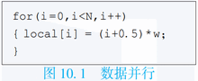

数据级并行性是比较易于处理的，可以在计算机体系结构的多个层次来利用数据级并行性。例如，可以在处理器中设计向量功能部件，采用**SIMD（Single Instruction Multiple Data）**设计方法，如一个256位向量部件一次可以执行4个64位的操作；设计专门的向量处理器，如CRAY公司的CRAY-1、CRAY-2、X-MP、Y-MP等；在多处理器中，可以采用**SPMD（Single Program Multiple Data）**的编程方式，将数据分布到不同的处理器上执行同一个程序控制流。

数据级并行性常见于科学和工程计算领域中，例如大规模线性方程组的求解等。正是由于这个原因，向量处理器在科学计算领域还是比较成功的。

### 3. 任务级并行性

任务级并行性（Task Level Parallelism，TLP）是将不同的任务（进程或者线程）分布到不同的处理单元上执行。针对任务表现为进程或者线程，任务级并行性可分为进程级并行性或者线程级并行性。下图10.2是一个任务并行的代码示意图。对于一个双处理器系统，当处理器ID（processor ID）为a时，则执行任务A；当处理器ID为b时则执行任务B。

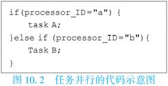

在并行处理系统中，挖掘任务并行性就是让每个处理器执行不同的线程或进程。这些线程或者进程可以执行相同或者不同的代码。通常情况下，不同线程或者进程之间还需要相互通信来协作完成整个程序的执行。任务级并行性常见于商业应用领域，如大规模数据库的事务处理等。另外，多道程序工作负载（Multiprogramming Workload），即在计算机系统上运行多道独立的程序，也是任务级并行的重要来源。

## （二）并行编程模型

并行处理系统上如何编程是个难题，目前并没有很好地解决。并行编程模型的目标是方便编程人员开发出能在并行处理系统上高效运行的并行程序。**并行编程模型（Parallel Programming Model）**是一种程序抽象的集合，它给程序员提供了一幅计算机硬件/软件系统的抽象简图，程序员利用这些模型就可以为多核处理器、多处理器、机群等并行计算系统设计并行程序

### 1. 单任务数据并行模型

数据并行（Data Parallel）模型是指对集合或者数组中的元素同时（即并行）执行相同操作。数据并行编程模型可以在SIMD计算机上实现，为单任务数据并行；也可以在SPMD计算机上实现，为多任务数据并行。SIMD着重开发指令级细粒度的并行性，SPMD着重开发子程序级中粒度的并行性。

单任务数据并行编程模型具有以下特点：

1. 单线程（Single Threading）。从程序员的角度，一个数据并行程序只由一个线程执行，具有单一控制线；就控制流而言，一个数据并行程序就像一个顺序程序一样。
2. 同构并行（Identical Parallel）。数据并行程序的一条语句，同时作用在不同数组元素或者其他聚合数据结构，在数据并行程序的每条语句之后，均有一个隐式同步。
3. 全局命名空间（Global Naming Space）。数据并行程序中的所有变量均在单一地址空间内，所有语句可访问任何变量而只要满足通常的变量作用域规则即可。
4. 隐式相互作用（Implicit Interaction）。因为数据并行程序的每条语句结束时存在一个隐含的栅障（Barrier），所以不需要显式同步；通信可以由变量指派而隐含地完成。
5. 隐式数据分配（Implicit Data Allocation）。程序员没必要明确指定如何分配数据，可将改进数据局部性和减少通信的数据分配方法提示给编译器。

### 2. 多任务共享存储编程模型

在共享存储编程模型中，运行在各处理器上的进程（或者线程）可以通过读/写共享存储器中的共享变量来相互通信。它与单任务数据并行模型的相似之处在于有一个单一的全局名字空间。由于数据是在一个单一的共享地址空间中，因此不需要显式地分配数据，而工作负载则可以显式地分配也可以隐式地分配。通信通过共享的读/写变量隐式地完成，而同步必须显式地完成，以保持进程执行的正确顺序。常见共享存储编程模型如Pthreads和**OpenMP（Open Multi-Processing）**等。

### 3. 多任务消息传递编程模型

在消息传递并行编程模型中，在不同处理器节点上运行的进程均有独立的地址空间，可以通过网络传递消息而相互通信。在消息传递并行程序中，用户必须明确为进程分配数据和负载，消息传递并行编程模型比较适合开发大粒度的并行性，这些程序是多进程的和异步的，要求显式同步（如栅障等）以确保正确的执行顺序。

消息传递编程模型具有以下特点：

1. 多进程（Multiple Process）。消息传递并行程序由多个进程组成，每个进程都有自己的控制流且可执行不同代码；多程序多数据（Multiple Program Multiple Data，MPMD）并行和单程序多数据（SPMD）并行均可支持。
2. 异步并行性（Asynchronous Parallelism）。消息传递并行程序的各进程彼此异步执行，使用诸如栅障和阻塞通信等方式来同步各个进程。
3. 独立的地址空间（Separate Address Space）。消息传递并行程序的进程具有各自独立的地址空间，一个进程的数据变量对其他进程是不可见的，进程的相互作用通过执行特殊的消息传递操作来实现。
4. 显式相互作用（Explicit Interaction）。程序员必须解决包括数据映射、通信、同步和聚合等相互作用问题；计算任务分配通过“拥有者-计算”（Owner-Compute）规则来完成，即进程只能在其拥有的数据上进行计算。
5. 显式分配（Explicit Allocation）。计算任务和数据均由用户显式地分配给进程，为了减少设计和编程的复杂性，用户通常采用单一代码方法来编写SPMD程序。

典型的消息传递编程模型包括MPI和PVM。

### 4. 共享存储与消息传递编程模型的编程复杂度

采用共享存储与消息传递编程模型编写的并行程序是在多处理器并行处理系统上运行的。先了解一下多处理器的结构特点，可以更好地理解并行编程模型。

从结构的角度看，多处理器系统可分为共享存储系统和消息传递系统两类。在共享存储系统中，所有处理器共享主存储器，每个处理器都可以把信息存入主存储器，或从中取出信息，处理器之间的通信通过访问共享存储器来实现。而在消息传递系统中，每个处理器都有一个只有它自己才能访问的局部存储器，处理器之间的通信必须通过显式的消息传递来进行。消息传递和共享存储系统的结构如下图10.3所示。从图中可以看出，在消息传递系统中，每个处理器的存储器是单独编址的；而在共享存储系统中，所有存储器统一编址。

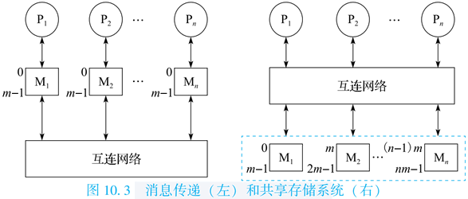

在消息传递编程模型中，程序员需要对计算任务和数据进行划分，并安排并行程序执行过程中进程间的所有通信。在共享存储编程模型中，由于程序的多进程（或者线程）之间存在一个统一编址的共享存储空间，程序员只需进行计算任务划分，不必进行数据划分，也不用确切地知道并行程序执行过程中进程间的通信。消息传递系统的可伸缩性通常比共享存储系统要好，可支持更多处理器。MPP系统（Massive Parallel Processing）和机群系统是消息传递系统。典型的共享存储多处理器结构包括对称多处理器机（Symmetric Multi-Processor，SMP）结构、高速缓存一致非均匀存储器访问（Cache Coherent Non Uniform Memory Access，CC-NUMA）结构等。

从进程（或者线程）间通信的角度看，消息传递并行程序比共享存储并行程序复杂一些，体现在时间管理和空间管理两方面。在空间管理方面，发送数据的进程需要关心自己产生的数据被谁用到，而接收数据的进程需要关心它用到了谁产生的数据；在时间管理方面，发送数据的进程通常需要在数据被接收后才能继续，而接收数据的进程通常需要等到接收数据后才能继续。在共享存储并行程序中，各进程间的通信通过访问共享存储器完成，程序员只需考虑进程间同步，不用考虑进程间通信。尤其是比较复杂的数据结构的通信，消息传递并行程序比共享存储并行程序复杂得多。此外，对于一些在编程时难以确切知道进程间通信的程序，用消息传递的方法很难进行并行化。

从数据划分的角度看，消息传递并行程序必须考虑诸如数组名称以及下标变换等因素，在将一个串行程序改写成并行程序的过程中，需要修改大量的程序代码。而在共享存储编程模型中进行串行程序的并行化改写时，不用进行数组名称以及下标变换，对代码的修改量少。虽说共享存储程序无须考虑数据划分，但是在实际应用中，为了获得更高的系统性能，有时也需要考虑数据分布，使得数据尽量分布在对其进行计算的处理器上，例如OpenMP中就有进行数据分布的扩展制导。不过，相对于消息传递程序中的数据划分，考虑数据分布还是要简单得多。

下面举两个共享存储和消息传递程序的例子。

第一个例子是通过积分求圆周率。积分求圆周率的公式如下：
$$
\pi=4\int_0^1\dfrac{1}{1+x^2}dx=\sum_{i=1}^N=\dfrac{4}{1+(\dfrac{i-0.5}{N})^2}\times\dfrac{1}{N}
$$
在上式中，N值越大，误差越小。如果N值很大，计算时间就很长。可以通过并行处理，让每个进程计算其中的一部分，最后把每个进程计算的值加在一起来减少运算时间。下图10.4给出了计算圆周率的共享存储（基于中科院计算所开发的JIAJIA虚拟共享存储系统）和消息传递并行程序核心片段的算法示意。该并行程序采用SPMD（Single Program Multiple Data）的模式，即每个进程都运行同一个程序，但处理不同的数据。在该程序中，numprocs是参与运算的进程个数，所有参与运算的进程都有相同的numprocs值；myid是参与运算的进程的编号，每个进程都有自己的编号（一般并行编程系统都会提供接口函数让进程知道自己的编号）。

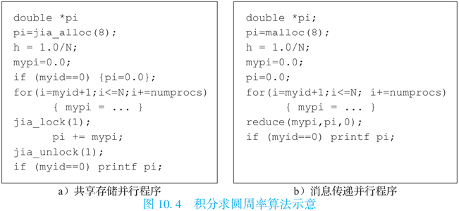

在共享存储并行程序中，由jia\_alloc()分配空间的变量pi是所有参与运算的进程共享的，所有进程只有一份，其他变量都是每个进程局部的，每个进程都有一份，每个进程根据numprocs和myid号分别计算部分圆周率值，最后通过一个临界区的机制把所有进程的计算结果加在一起。jia\_lock()和jia_unlock()是一种临界区的锁机制，保证每次只有一个进程进入这个临界区，这样才能把所有进程的结果依次加在一起，不会互相冲掉。在消息传递并行程序中，由malloc()分配空间的变量每个进程都有独立的一份，互相看不见。每个进程算完部分结果后，通过归约操作reduce()把所有进程的mypi加到0号进程的pi中。

第二个例子是矩阵乘法。下图10.5给出了共享存储和消息传递并行程序。同样，由jia\_alloc()分配的变量所有进程共享一份，而由malloc()分配的变量每个进程单独一份，因此在这个程序中消息传递并行程序需要更多的内存。

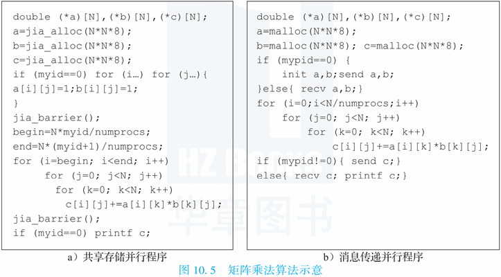

在共享存储并行程序中，先由0号进程对A、B、C三个矩阵进行初始化，而其他进程通过jia\_barrier()语句等待。barrier是并行程序中常用的同步方式，它要求所有进程都等齐后再前进。然后每个进程分别完成部分运算，再通过jia\_barrier()等齐后由0号进程统一打印结果。消息传递并行程序与共享存储并行程序的最大区别是需要通过显式的发送语句send和接收语句recv进行多个进程之间的通信。先由0号进程进行初始化后发送给其他进程，每个进程分别算完后再发送给0号进程进行打印。在消息传递并行程序中要详细列出每次发送的数据大小和起始地址等信息，0号进程接收的时候还要把从其他进程收到的数据拼接在一个矩阵中，比共享存储并行程序麻烦不少。

## （三）典型并行编程环境

本节主要介绍数据并行SIMD编程，共享存储编程模型Pthreads和OpenMP，以及消息传递编程模型MPI等。

### 1. 数据并行SIMD编程

工业界广泛应用的单指令流多数据流（Single Instruction Multiple Data，SIMD）并行就是典型的数据并行技术。相比于传统的标量处理器上的单指令流单数据流（Single Instruction Single Data，SISD）指令，一条SIMD指令可以同时对一组数据进行相同的计算。

例如，将两个数组SRC0[8]和SRC1[8]中的每个对应元素求和，将结果放入数组RESULT中，对于传统的标量处理器平台，C语言实现如下：

```c
for (i = 0; i < 8; i++)
    RESULT[i] = SRC0[i] + SRC1[i];
```

也就是通过循环遍历需要求和的8组对应数据，对SRC0和SRC1的各对应项求和，将结果存入RESULT数组的对应项中。在龙芯处理器平台上，用机器指令（汇编代码）实现该运算的代码如下（这里假设\$src0、\$src1、\$result分别为存储了SRC0、SRC1和RESULT数组起始地址的通用寄存器）：

```assembly
	li     $r4, 0x0
	li     $r5, 0x8
label:
	addi.d $src0, $src0, $r4
	addi.d $src1, $src1, $r4
	addi.d $result, $result, $r4
	ld.b   $r6, $src0, 0x0
	ld.b   $r7, $src1, 0x0
	add.d  $r6, $r6, $r7
	st.b   $r6, $result, 0x0
	addi.d $r4, $r4, 0x1
	blt    $r4, $r5, label
```

而如果采用龙芯处理器的SIMD指令编写程序的话，上述两个数组的求和只需要将上述两个源操作数数组SRC0[8]和SRC1[8]一次性加载到龙芯处理器的向量寄存器（龙芯向量寄存器复用了浮点寄存器）中，然后只需要一条vadd.b指令就可以完成上述8个对应数组项的求和，最后只需要一条store指令就可以将结果存回RESULT[8]数组所在的内存空间中。该实现的机器指令序列如下：

```assembly
vld    $vr0, $src0,0
vld    $vr1, $src1,0
vadd.b $vr0, $vr0, $ vr1
vst    $vr0, $result,0
```

下图10.6简要示意了采用传统SISD指令和SIMD指令实现上述8个对应数组项求和的执行控制流程。

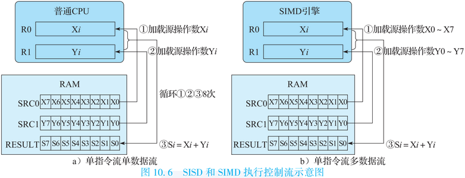

### 2. POSIX编程标准

POSIX（Portable Operating System Interface）属于早期的操作系统接口标准。Pthreads代表官方IEEE POSIX1003.1C\_1995线程标准，是由IEEE标准委员会所建立的，主要包含线程管理、线程调度、同步等原语定义，体现为C语言的一套函数库。下面只简介其公共性质。

(1) 线程管理

线程库用于管理线程，Pthreads中基本线程管理原语如下表10.1所示。

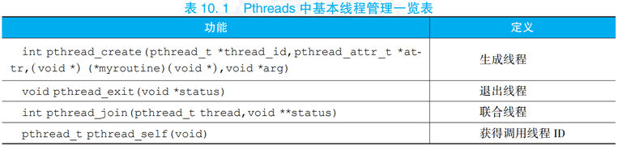

其中，pthread\_create()在进程内生成新线程，新线程执行带有变元arg的myroutine函数，如果pthread\_create()生成，则返回0并将新线程之ID置入thread\_id，否则返回指明错误类型的错误代码；pthread\_exit()结束调用线程并执行清场处理；pthread\_self()返回调用线程的ID；pthread\_join()等待其他线程结束。

(2) 线程调度

pthread\_yield()的功能是使调用者将处理器让位于其他线程；pthread\_cancel()的功能是中止指定的线程。

(3) 线程同步

Pthreads中的同步原语见下表10.2。下面讨论互斥变量mutex（Mutual Exclusion）和条件变量cond（Conditional），前者类似于信号灯结构，后者类似于事件结构。注意，使用同步变量之前需被初始化（生成），用后应销毁。

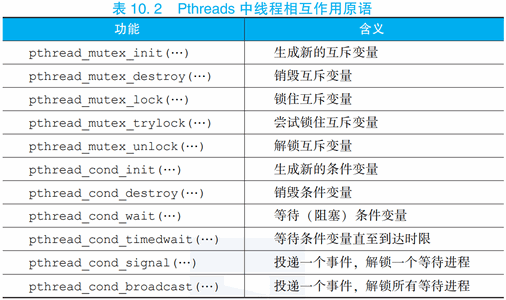

如果mutex未被上锁，pthread\_mutex\_lock()将锁住mutex；如果mutex已被上锁，调用线程一直被阻塞到mutex变成有效。pthead\_mutex\_trylock()的功能是尝试对mutex上锁。pthread\_mutex\_lock()和pthead\_mutex\_trylock()的区别是，前者会阻塞等待mutex被解锁；后者尝试去加锁，如果不成功就返回非0，如果成功返回0，不会产生阻塞。pthead\_mutex\_unlock()解锁先前上锁的mutex，当mutex被解锁，它就能由别的线程获取。

pthread\_cond\_wait()会等待条件满足，若条件不满足会阻塞并开锁mutex。pthread\_condt\_imedwait()与pthread\_cond\_wait()类似，不过当等待时间达到时限后它将解除阻塞。pthread\_cond\_signal()解除一个等待条件满足的已被阻塞的线程的阻塞。pthread\_cond\_broadcast()将所有等待条件满足的已被阻塞的线程解除阻塞。

### 3. OpenMP标准

OpenMP是由OpenMP Architecture Review Board（ARB，结构审议委员会）牵头提出的，是一种用于共享存储并行系统的编程标准。实际上，OpenMP不是一种新语言，是对基本编程语言进行编译制导（Compiler Directive）扩展，支持C/C++和Fortran。由于OpenMP制导嵌入到C/C++、Fortran语言中，所以具体语言不同会有所区别，本书介绍主要参考支持C/C++的OpenMP 4.0标准。

OpenMP标准中定义了制导指令、运行库和环境变量，使得用户可以按照标准逐步将已有串行程序并行化。制导语句是对程序设计语言的扩展，提供了对并行区域、工作共享、同步构造的支持；运行库和环境变量使用户可以调整并行程序的执行环境。

程序员通过在程序源代码中加入专用pragma制导语句（以`#pragma omp`字符串开头）来指明意图，支持OpenMP标准的编译器可以自动将程序进行并行化，并在必要之处加入同步互斥以及通信。当选择忽略这些pragma，或者编译器不支持OpenMP时，程序又可退化为普通程序（一般为串行），代码仍然可以正常运行，只是不能利用多线程来加速程序执行。

由于OpenMP标准具有简单、移植性好和可扩展等优点，目前已被广泛接受，主流处理器平台均支持OpenMP编译器，如Intel、AMD、IBM、龙芯等。开源编译器GCC也支持OpenMP标准。

#### (1) OpenMP的并行执行模型

OpenMP是一个基于线程的并行编程模型，一个OpenMP进程由多个线程组成，使用fork-join并行执行模型。OpenMP程序开始于一个单独的主线程（Master Thread），主线程串行执行，遇到一个并行域（Parallel Region）开始并行执行。接下来的过程如下：

1. fork（分叉）。主线程派生出一队并行的线程，并行域的代码在主线程和派生出的线程间并行执行。
2. join（合并）。当派生线程在并行域中执行完后，它们或被阻塞或被中断，所计算的结果会被主线程收集，最后只有主线程在执行。

实际上，OpenMP的并行化都是使用嵌入到C/C++或者Fortran语言的制导语句来实现的。下图10.10为OpenMP程序的并行结构。

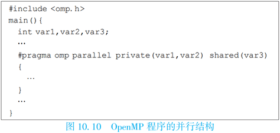

#### (2) 编译制导语句

下面介绍编译制导语句的格式。下表10.3是编译制导语句的格式及解释。


#### (3) 并行域结构

一个并行域就是一个能被多个线程执行的程序块，它是最基本的OpenMP并行结构。并行域的具体格式为：

```c
#pragma omp parallel [clause, clause, ...] newline
```

其中clause是子句，可以是多个子句的组合，它们使用`,`间隔。每个子句clause可以是如下内容的一个或者其组合形式：if(scalar-expression)、num\_threads(integer-expression)、default(shared|none)、private(list)、firstprivate(list)、shared(list)、copyin(list)、reduction(operator:list)、proc\_bind(master|close|spread)。具体子句的含义见下面的小节(7)数据环境。

当一个线程执行到parallel这个指令时，线程就会生成一列线程，线程号依次从1到n-1，而它自己会成为主线程（线程号为0）。当并行域开始时，程序代码就会被复制，每个线程都会执行该代码。这就意味着，到了并行域结束就会有一个栅障，且只有主线程能够通过这个栅障。

#### (4) 共享任务结构

共享任务结构将其内封闭的代码段划分给线程队列中的各线程执行。它不产生新的线程，在进入共享任务结构时不存在栅障，但是在共享任务结构结束时存在一个隐含的栅障。下图10.11显示了3种典型的共享任务结构。

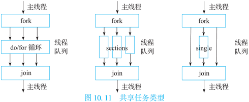

其中，do/for将循环分布到线程列中执行，可看作是一种表达数据并行的类型；sections把任务分割成多个各个部分（section），每个线程执行一个section，可很好地表达任务并行；single由线程队列中的一个线程串行执行。它们分别对应for、sections、single三种编译制导语句，下面分别介绍。

for编译制导语句。for语句（即C/C++中的for语句），表明若并行域已经初始化了，后面的循环就在线程队列中并行执行，否则就会顺序执行。语句格式如下：

```c
#pragma omp for [clause, clause, ...] newline
```

每个子句clause可以是如下内容的一个或者其组合形式：private(list)、firstprivate(list)、lastprivate(list)、reduction(reduction-identifier:list)、schedule(kind[,chunk\_size])、collapse(n)、ordered、nowait。

其中，schedule子句描述如何在线程队列中划分循环。kind为static时，将循环划分为chunk\_size大小的循环块，静态分配给线程执行，若chunk\_size没有声明，则尽量将循环在线程队列中平分；kind为dynamic时，线程会动态请求循环块来执行，执行完一个循环块后就申请下一个循环块，直到所有循环都执行完，循环块的大小为chunk\_size，若chunk\_size没有声明，则默认的块长度为1；kind为guide时，线程会动态请求循环块来执行，循环块的大小为未调度的循环数除以线程数，但循环块大小不能小于chunk\_size（除了最后一块），若chunk\_size没有声明，则默认为1。

sections编译制导语句。该语句是非循环的共享任务结构，它表明内部的代码是被线程队列分割的。语句格式如下：

```c
#pragma omp sections [clause, clause, ...] newline
{
    [#pragma omp section newline]
    	Structured_block
    [#pragma omp section newline]
        Structured_block
}
```

每个子句clause可以是如下内容的一个或者其组合形式：private(list)、firstprivate(list)、lastprivate(list)、reduction(reduction-identifier:list)、nowait。值得注意的是，在没有nowait子句时，sections后面有隐含的栅障。

single编译制导语句。该语句表明内部的代码只由一个线程执行。语句格式如下：

```c
#pragma omp single [clause, clause, ...] newline
Structured_block
```

每个子句clause可以是如下内容的一个或者其组合形式：private(list)、firstprivate(list)、copyprivate(list)、nowait。若没有nowait子句，线程列中没有执行single语句的线程，会一直等到代码栅障同步才会继续往下执行。

#### (5) 组合的并行共享任务结构

下面介绍两种将并行域制导和共享任务制导组合在一起的编译制导语句。

parallel for编译制导语句。该语句表明一个并行域包含一个单独的for语句。语句格式如下：

```c
#pragma omp parallel for [clause, clause, ...] newline
	for_loop
```

该语句的子句clause可以是parallel和for语句的任意子句组合，除了nowait子句。

parallel sections编译制导语句。该语句表明一个并行域包含单独的一个sections语句。语句格式如下：

```c
#pragma omp parallel sections [clause, clause, ...] newline
{
    [#pragma omp section newline]
    	Structured_block
    [#pragma omp section newline]
        Structured_block
}
```

同样，该语句的子句可以是parallel和for语句的任意子句组合，除了nowait子句。

#### (6) 同步结构

OpenMP提供了多种同步结构来控制与其他线程相关的线程的执行。下面列出几种常用的同步编译制导语句。

master编译制导语句。该语句表明一个只能被主线程执行的域。线程队列中所有其他线程必须跳过这部分代码的执行，语句中没有栅障。语句格式如下：

```c
#pragma omp master newline
```

critical编译制导语句。该语句表明域中的代码一次只能由一个线程执行。语句格式如下：

```c
#pragma omp critical [name] newline
```

barrier编译指导语句。该语句同步线程队列中的所有线程。当有一个barrier语句时，线程必须要等到所有的其他线程也到达这个栅障时才能继续执行。然后所有线程并行执行栅障之后的代码。语句格式如下：

```c
#pragma omp barrier newline
```

atomic编译制导语句。该语句表明一个特别的存储单元只能原子地更新，而不允许让多个线程同时去写。语句格式如下：

```c
#pragma omp atomic newline
```

另外，还有flush、order等语句。

#### (7) 数据环境

OpenMP中提供了用来控制并行域在多线程队列中执行时的数据环境的制导语句和子句。下面选择主要的进行简介。

threadprivate编译制导语句。该语句表明变量是复制的，每个线程都有自己私有的备份。这条语句必须出现在变量序列定义之后。每个线程都复制这个变量块，所以一个线程的写数据对其他线程是不可见的。语句格式如下：

```c
#pragma omp threadprivate(list)
```

数据域属性子句。OpenMP的**数据域属性子句用来定义变量的范围**，它包括private、firstprivate、lastprivate、shared、default、reduction和copyin等。数据域变量与编译制导语句parallel、for、sections等配合使用，可控制变量的范围。它们在并行结构执行过程中控制数据环境。例如，哪些串行部分的数据变量被传到程序的并行部分以及如何传送，哪些变量对所有的并行部分是可见的，哪些变量是线程私有的，等等。具体说明如下。

- private子句，表示它列出的变量对于每个线程是局部的，即线程私有的。其格式为：private(list)。
- shared子句，表示它列出的变量被线程队列中的所有线程共享，程序员可以使多线程对其进行读写（例如通过critical语句）。其格式为：shared(list)。
- default子句，该子句让用户可以规定在并行域的词法范围内所有变量的一个默认属性，如可以是private、shared、none。其格式为：default(shared|none)。
- firstprivate子句，该子句包含private子句的操作，并将其列出的变量的值初始化为并行域外同名变量的值。其格式为：firstprivate(list)。
- lastprivate子句，该子句包含private子句的操作，并将值复制给并行域外的同名变量。其格式为：lastprivate(list)。
- copyin子句，该子句赋予线程中变量与主线程中threadprivate同名变量的值。其格式为：copyin(list)。
- reduction子句，该子句用来归约其列表中出现的变量。归约操作可以是加（+）、减（-）、乘（\*）、与（and）、或（or）、相等（eqv）、不相等（neqv）、最大（max）、最小（min）等。其格式为：reduction(reduction-identifier:list)。

下图10.12给出了一个计算$\pi$的采用OpenMP并行的C语言代码示例。

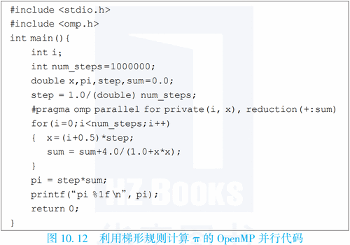

下图10.13给出了矩阵乘的OpenMP并行代码例子，将两个n阶的方阵A和B相乘，结果存放在方阵C中。

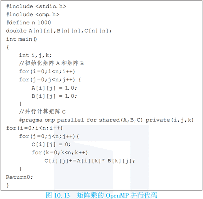

### 4. MPI消息传递编程接口

MPI（Message Passing Interface）定义了一组消息传递函数库的编程接口标准。有多种支持MPI标准的函数库实现，开源实现有MPICH（由Argonne National Laboratory和Mississippi State University开发）、OpenMPI和LAM/MPI（由Ohio超算中心开发）等；商业实现来自Intel、Microsoft、HP公司等。

MPI编译器用于编译和链接MPI程序，支持C、C++、Fortran语言，如mpicc支持C语言、mpic++支持C++语言、mpif90支持Fortran90。MPI具有高可移植性和易用性，对运行的硬件要求简单，是目前国际上最流行的并行编程环境之一。

在MPI编程模型中，计算由一个或多个通过调用库函数进行消息收/发通信的进程所组成。在绝大部分MPI实现中，一组固定的进程在程序初始化时生成，在一个处理器核上通常只生成一个进程。这些进程可以执行相同或不同的程序，相应地称为单程序多数据（SPMD）或多程序多数据（MPMD）模式。进程间的通信可以是点到点的或者集合（Collective）的。MPI只是为程序员提供了一个并行环境库，程序员用标准串行语言编写代码，并在其中调用MPI的库函数来实现消息通信，进行并行处理。

#### (1) 最基本的MPI

MPI是个复杂的系统，包括129个函数（根据1994年发布的MPI标准）。事实上，1997年修订的MPI-2标准中函数已超过200个，其中最常用的有约30个，但只需要6个最基本的函数就能编写MPI程序求解许多问题，如下表10.4所示。

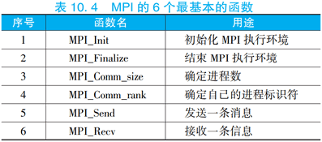

下面展示了这6个基本函数的功能及参数情况。其中，标号IN表明函数使用但是不能修改参数；OUT表明函数不使用但是可以修改参数；INOUT表明函数既可以使用也可以修改参数。

```c
/* 初始化计算，其中argc、argv只在C语言中需要，它们是main函数的参数 */
MPI_Init(int *argc, char ***argv);
/* 结束计算 */
MPI_Finalize();
/* 确定通信域的进程数 
IN  comm: communicator (handle)
OUT size: number of processes in the group of comm (integer)
*/
MPI_Comm_size(comm, size); 
/* 确定当前进程在通信域中的进程号 
IN  comm: communicator (handle)
OUT pid:  rank of the calling process in group of comm (integer)
*/
MPI_Comm_rank(comm, pid);
/* 发送消息
IN buf:      initial address of send buffer (choice)
IN count:    number of elements to send (integer≥0)
IN datatype: datatype of each send buffer elements (handle)
IN dest:     rank of destination (integer)
IN tag:      message tag (integer)
IN comm:     communicator (handle)
*/
MPI_Send(buf, count, datatype, dest, tag, comm);
/* 接收消息
OUT buf:      initial address of receive buffer (choice)
IN  count:    number of elements in receive buffer (integer≥0)
IN  datatype: datatype of each receive buffer elements (handle)
IN  source:   rank of source or MPI_ANY_SOURCE (integer)
IN  tag:      message tag or MPI_ANY_TAG (integer)
IN  comm:     communicator (handle)
OUT status:   status object (Status)
*/
MPI_Recv(buf, count, datatype, source, tag, comm, status);
```

下图10.15是一个简单C语言的MPI程序的例子，其中MPI\_COMM\_WORLD是一个缺省的进程组，它指明所有的进程都参与计算。


#### (2) 集体通信

并行程序中经常需要一些进程组间的集体通信（Collective Communication），包括：(1)栅障（MPI\_Barrier），同步所有进程；(2)广播（MPI\_Bcast），从一个进程发送一条数据给所有进程；(3)收集（MPI\_Gather），从所有进程收集数据到一个进程；(4)散播（MPI\_Scatter），从一个进程散发多条数据给所有进程；(5)归约（MPI\_Reduce、MPI\_Allreduce），包括求和、求积等。这些函数的功能及参数描述参见MPI3.0标准。

不同于点对点通信，所有的进程都必须执行集体通信函数。集体通信函数不需要同步操作就能使所有进程同步，因此可能造成死锁。这意味着集体通信函数必须在所有进程上以相同的顺序执行。

#### (3) 通信域

通信域（Communicator）提供了MPI中独立的安全的消息传递。MPI通信域包含进程组（Process Group）和通信上下文（Context）。其中进程组是参加通信的一个有限并有序的进程集合，如果一共有N个进程参加通信，则进程的编号从0到N-1。通信上下文提供一个相对独立的通信区域，消息总是在其被发送的上下文内被接收，不同上下文的消息互不干涉。通信上下文可以将不同的通信区别开来。

MPI提供了一个预定义的通信域MPI\_COMM\_WORLD，MPI初始化后就会产生，它包含了初始化时可得的全部进程，进程由它们在MPI\_COMM\_WORLD组中的进程号所标识。

用户可以在原有通信域的基础上定义新的通信域。MPI提供的通信域函数概括：(1)MPI\_Comm\_dup，它生成一个新的通信域，具有相同的进程组和新的上下文，这可确保不同目的通信不会混淆；(2)MPI\_Comm\_split，它生成一个新的通信域，但只是给定进程组的子集，这些进程可相互通信而不必担心与其他并发计算相冲突；(3)MPI\_Intercomm\_create，它构造一个进程组之间的通信域，该通信域链接两组内的进程；(5)MPI\_Comm\_free，它用来释放上述三个函数所生成的通信域。

#### (4) MPI点对点通信

点到点通信（Point-to-Point Communication）是MPI中较复杂的部分，其数据传送有阻塞（Blocking）和非阻塞（Non Blocking）两种机制。在阻塞方式中，它必须等到消息从本地送出之后才可以执行后续的语句，保证了缓冲区等资源可再用；对于非阻塞方式，它无须等到消息从本地送出就可执行后续的语句，从而允许通信和计算的重叠，但非阻塞调用的返回并不保证资源的可再用性。

阻塞和非阻塞有四种通信模式：(1)标准模式，包括阻塞发送MPI\_Send、阻塞接收MPI\_Recv、非阻塞发送MPI\_Isend和非阻塞接收MPI\_Irecv；(2)缓冲模式，包括阻塞缓冲发送MPI\_Bsend和非阻塞缓冲发送MPI\_Ibsend；(3)同步模式，包括阻塞同步发送MPI\_Ssend非阻塞同步发送MPI\_Issend；(4)就绪模式，包括阻塞就绪发送MPI\_Rsend和非阻塞就绪发送MPI\_Irsend。

在标准通信模式中，MPI根据当前的状况选取其他三种模式或用户定义的其他模式；缓冲模式在相匹配的接收未开始的情况下，将送出的消息放在缓冲区内，这样发送者可以很快地继续计算，然后由系统处理放在缓冲区中的消息，但这占用内存且多了一次内存拷贝；在同步模式中，只有相匹配的接收操作开始后，发送才能返回；在就绪模式下，只有相匹配的接收操作启动后，发送操作才能开始。

在点到点通信中，发送和接收语句必须是匹配的。为了区分不同进程或同一进程发送来的不同消息，在这些语句中采用了通信域Comm和标志位tag来实现成对语句的匹配。上述函数中，关于MPI\_Send和MPI\_Recv的功能和定义可以参考前述的基本MPI函数说明，其他函数的描述可参考MPI 3.0标准。

# 十一、多核处理结构

多核处理器（Multicore Processor）在单芯片上集成多个处理器核，也称为单片多处理器（Chip Multi-Processor，CMP），广泛应用于个人移动设备（Personal Mobile Device，PMD）、个人电脑（PC）、服务器、高性能计算机等领域。本章从结构角度对多核处理器进行分析。

## （一）多核处理器的发展演化

多核处理器在单芯片上集成多个处理器核，通过聚合芯片上的多个处理器核的计算能力来提高应用程序执行性能。多核处理器大致可从以下方面进行分类：从核的数量角度可分为多核处理器和众核处理器，一般大于64核为众核处理器；从处理器核的结构角度可分为同构和异构，同构是指核结构是相同的，而异构是指核结构是不同的；从适用应用角度可分为面向桌面电脑、服务器等应用的通用多核处理器，以及面向特定应用的多核/众核处理器，如GPU可看作是一种特定的众核处理器，具有很高的浮点峰值性能。

多核处理器主要在多处理器系统的研究基础上发展而来。多处理器系统的研究已经有几十年的历史。20世纪七八十年代，由于单个处理器的性能满足不了应用的需求，开始出现多处理器系统。20世纪八九十年代，很多高档工作站都有2\~4个处理器，用于科学计算的高性能计算机处理器个数更多。国际上对计算机性能有一个TOP500排名，每6个月列出当时世界上最快的前500台计算机，这些计算机都有成千上万个处理器。从20世纪90年代后期开始，随着半导体工艺的发展，单芯片上晶体管数目大幅增多，多核处理器得到了很好的发展。学术界最早的多核处理器项目Hydra是由美国斯坦福大学于1994年研究的。在工业界，IBM公司于2001年推出IBM Power4双核处理器；AMD于2005年推出第一款X86架构双核处理器；Intel于2006年推出第一款酷睿双核处理器；国内于2009年推出了第一款四核龙芯3A处理器。

很明显可以看出，多核处理器是在多处理器系统基础上发展的，其发展的主要驱动力包括以下三个方面。

(1) 半导体工艺发展

摩尔定律是过去40多年间描述半导体工艺发展的经验法则。1965年Gordon Moore（Intel公司联合创始人）提出：半导体芯片上集成的晶体管和电阻数量将每年增加一倍。1975年对摩尔定律进行了修正，把“每年增加一倍”改为“每两年增加一倍”。现在摩尔定律流行的表述为：集成电路芯片上所集成的晶体管数目每隔18个月就翻一倍。目前，主流处理器工艺已经达到14nm\~7nm工艺，在单芯片上集成数十亿甚至上百亿个晶体管。不过摩尔定律不可能永远延续，2015年ITRS（International Technology Roadmap for Semiconductors）预测晶体管尺寸可能在2021年后停止缩小。目前工艺升级的速度已经从12年升级一代放慢到35年升级一代，而且工艺升级带来的性能、成本、功耗方面的好处已经不大。

(2) 功耗墙问题

功耗墙问题也是处理器从单核转到多核设计的一个非常重要的因素。面对单芯片上的大量晶体管，如何设计处理器有两种思路，一种是单芯片设计复杂的单处理器核，另一种是单芯片设计多个处理器核。从理论上来说，采用后一种思路的性能功耗比收益较大。芯片功耗主要由静态功耗和动态功耗组成，而动态功耗则由开关功耗和短路功耗组成。其中开关功耗是由芯片中电路信号翻转造成的，是芯片功耗的主体。下面给出了开关功耗的计算公式，其中$C_{load}$为电路的负载电容，$V$为电路的工作电压，$f$为电路的时钟频率。
$$
P_{switch}=\dfrac{1}{2}C_{load}V^2f
$$
单芯片设计复杂单处理器核以提高性能的主要方法包括通过微结构优化提高每个时钟周期发射执行的指令数，以及通过提高主频来提高性能。微结构优化的方法由于受到程序固有指令级并行性以及微结构复杂性等因素的限制，在达到每个时钟周期发射执行4条指令后就很难有明显的性能收益。提高电压和主频的方法导致功耗随着主频的提高超线性增长。例如，通过电压提升10%可以使主频提升10%，根据开关功耗计算公式，开关功耗与主频成正比，与电压的平方成正比，即在一定范围内功耗与主频的三次方成正比，主频提高10%导致功耗提高30%。

单芯片设计多个处理器核以提高性能的方法是通过增加处理器核的个数来提升处理器并行处理的性能。当处理器核数目增加N倍时，功耗也大致增加N倍，性能也增加N倍（此处性能主要指运行多个程序的吞吐率），也就是说功耗随着性能的提高线性增长。

2005年以前，单芯片设计复杂单处理器核以提高性能是微处理器发展的主流，以Intel公司由于功耗墙问题放弃4GHz的Pentium IV处理器研发为标志，2005年之后单芯片设计多处理器核成为主流。

(3) 并行结构的发展

多处理器系统经过长期发展，为研制多核处理器打下了很好的技术基础。例如，多处理器系统的并行处理结构、编程模型等可以直接应用于多核处理器上。因此有一种观点认为：将传统多处理器结构实现在单芯片上就是多核处理器。

**在处理器内部、多个处理器之间，以及多个计算机节点之间有多种不同的并行结构。**

(1) SIMD结构。指采用单指令同时处理一组数据的并行处理结构。采用SIMD结构的Cray系列向量机包含向量寄存器和向量功能部件，单条向量指令可以处理一组数据。例如，Cray-1的向量寄存器存储64个64位的数据，Cray C-90的向量寄存器存储128个64位的数据。以Cray系列向量机为代表的向量机在20世纪70年代和80年代前期曾经是高性能计算机发展的主流，在商业、金融、科学计算等领域发挥了重要作用，其缺点是难以达到很高的并行度。如今，虽然向量机不再是计算机发展的主流，但目前的高性能处理器普遍通过SIMD结构的短向量部件来提高性能。例如，Intel处理器的SIMD指令扩展实现不同宽度数据的处理，如SSE（Streaming SIMD Extensions）扩展一条指令可实现128位数据计算（可分为16个8位数据或者4个32位数据或者2个64位数据），AVX（Advanced Vector Extensions）扩展可实现256位或者512位数据计算。

(2) 对称多处理器（Symmetric Multi-Processor，SMP）结构。指若干处理器通过共享总线或交叉开关等统一访问共享存储器的结构，各个处理器具有相同的访问存储器性能。20世纪八九十年代，DEC、SUN、SGI等公司的高档工作站多采用SMP结构。这种系统的可伸缩性也是有限的。SMP系统常被作为一个节点来构成更大的并行系统。多核处理器也常采用SMP结构，往往支持数个到十多个处理器核。

(3) 高速缓存一致非均匀存储器访问（Cache Coherent Non-Uniform Memory Access，CC-NUMA）结构。CC-NUMA结构是一种分布式共享存储体系结构，其共享存储器按模块分散在各处理器附近，处理器访问本地存储器和远程存储器的延迟不同，共享数据可进入处理器私有高速缓存，并由系统保证同一数据的多个副本的一致性。CC-NUMA的可扩展性比SMP结构要好，支持更多核共享存储，但由于其硬件维护数据一致性导致复杂性高，可扩展性也是有限的。典型的例子有斯坦福大学的DASH和FLASH，以及20世纪90年代风靡全球的SGI的Origin 2000。IBM、HP的高端服务也采用CC-NUMA结构。Origin 2000可支持上千个处理器组成CC-NUMA系统。有些多核处理器也支持CC-NUMA扩展，例如，4片16核龙芯3C5000处理器通过系统总线互连直接形成64核的CC-NUMA系统。

(4) MPP（Massive Parallel Processing）系统。指在同一地点由大量处理单元构成的并行计算机系统。每个处理单元可以是单机，也可以是SMP系统。处理单元之间通常由可伸缩的互连网络（如Mesh、交叉开关网络等）相连。MPP系统主要用于高性能计算。

(5) 机群（Cluster）系统。指将大量服务器或工作站通过高速网络互连来构成廉价的高性能计算机系统。机群计算可以充分利用现有的计算、内存、文件等资源，用较少的投资实现高性能计算，也适用于云计算。随着互连网络的快速发展，机群系统和MPP系统的界限越来越模糊。

从结构的角度看，多处理器系统可分为共享存储系统和消息传递系统两类。在共享存储系统中，所有处理器共享主存储器，每个处理器都可以把信息存入主存储器，或从中取出信息，处理器之间的通信通过访问共享存储器来实现。SMP和CC-NUMA结构是典型的共享存储系统。在消息传递系统中，每个处理器都有一个只有它自己才能访问的局部存储器，处理器之间的通信必须通过显式的消息传递来进行。MPP和机群系统往往是消息传递系统。

尽管消息传递的多处理器系统对发展多核处理器也很有帮助（如GPU），但是通用多核处理器主要是从共享存储的多处理器系统演化而来。多核处理器与早期SMP多路服务器系统在结构上并没有本质的区别。例如，多路服务器共享内存，通过总线或者交叉开关实现处理器间通信；多核处理器共享最后一级Cache和内存，通过片上总线、交叉开关或者Mesh网络等实现处理器核间通信。

通用多核处理器用于手持终端、桌面电脑和服务器，是最常见、最典型的多核处理器，通常采用共享存储结构，它的每个处理器核都能够读取和执行指令，可以很好地加速多线程程序的执行。本章主要以通用多核处理器为例来分析多核处理器结构。通用多核处理器结构设计与共享存储多处理器设计的主要内容相似，包括多核处理器的访存结构、多核处理器的互连结构、多核处理器的同步机制等。

## （二）多核处理器的访存结构

通用多核处理器采用共享存储结构，其设计存在如下关键问题：

1. 片上Cache如何组织？与单核处理器类似，多核处理器需要在片上设置大容量的Cache来缓解芯片计算能力与访存性能之间日益扩大的差距。片上Cache如何组织，Cache结构采用私有还是共享，集中式还是分布式。这些是需要设计者考虑的问题。
2. 多个处理器核发出的访存指令次序如何约定？各处理器核并行执行线程（或者进程）发出读/写（load/store）访存指令，这些访问指令的执行次序如何约定，使得应用程序员可以利用这些约定来推理程序的执行结果。存储一致性模型就是用来解决这方面问题的。
3. 如何维护Cache数据一致性？一个数据可能同时在多个处理器核的私有Cache中和内存中存在备份，如何保证数据一致性。Cache一致性协议将解决Cache一致性问题。

### 1. 通用多核处理器的片上Cache结构

片上Cache结构是通用多核处理器设计的重要内容。片上Cache的种类主要有：私有Cache、片上共享Cache、片间共享Cache。下图11.1(a)是私有Cache结构示意图，图11.1(b)是片上共享Cache结构示意图（由于一级Cache的访问速度对性能影响大，通用多核处理器的一级Cache几乎都是私有的）。

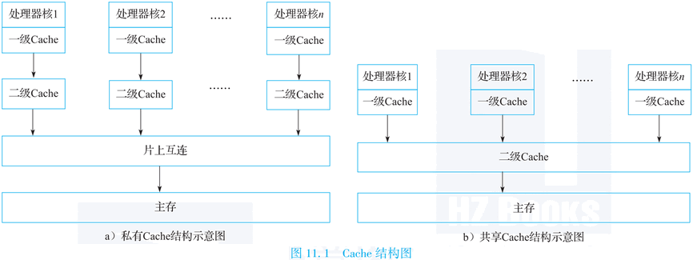

私有Cache结构具有较快的访问速度，但是具有较高的失效率。片上共享Cache结构的访问速度稍慢，但具有失效率低的优点。多处理器芯片间共享Cache结构的访问速度慢，且失效率高，因此并不常用。

目前，主流多核处理器的典型Cache结构是：片内共享最后一级Cache（Last Level Cache，LLC），片间共享内存。下表11.1列出了典型商用多核处理器的Cache结构参数。处理器核的一级Cache和二级Cache私有，三级Cache（LLC）共享。有些处理器甚至有片外的四级Cache，例如Intel i7处理器。

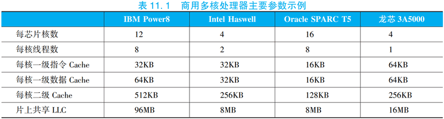

在共享LLC结构中，主要有UCA（Uniform Cache Access）和NUCA（Non-Uniform Cache Access）两种。下图11.2为共享LLC结构示意图（假设二级Cache为LLC）。

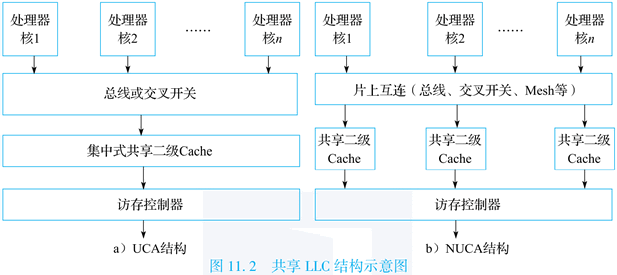

UCA是一种集中式共享结构，多个处理器核通过总线或者交叉开关连接LLC，所有处理器核对LLC的访问延迟相同。这种集中式的共享LLC，很容易随着处理器核数目的增加成为瓶颈。另外，UCA结构由于使用总线或者交叉开关互连，可扩展性受限。因此，通常在处理器核数较少的多核处理器中采用UCA结构，例如四核龙芯3号处理器。

NUCA是一种分布式共享结构，每个处理器核拥有本地的LLC，并通过片上互连访问其他处理器核的LLC。在NUCA结构中，处理器核可以访问所有的LLC，但是不同位置的LLC具有不同的访问延迟。当工作集较小时，处理器核的本地Cache足够容纳工作集，处理器核只使用本地Cache；当工作集较大时，本地Cache中放不下的数据可以放到远地Cache中。NUCA结构需要高效Cache查找和替换算法，使得在使用远地Cache时不影响性能。NUCA结构中通常采用可扩展的片上互连（如Mesh片上网络等），采用基于目录的Cache一致性协议，具有良好的可扩展性，可以有效支持较多数目的处理器核。因此，在具有较多核数的多核/众核处理器中通常采用NUCA结构，如SPARC M7和龙芯3C5000等。

### 2. 存储一致性模型

本节简要介绍常见的存储一致性模型。存储一致性模型最初是针对共享存储的多处理器设计提出来的，同样也可以适用于多核处理器设计。本节在介绍存储一致性模型时，处理器（处理机）和处理器核在概念上是可以互用的。

下面举一个存储一致性问题的例子。如下图11.3所示，寄存器R1为进程P2的内部寄存器，R2和R3为进程P3的内部寄存器，初始值均为0；变量a、b为P1、P2和P3的共享变量，初始值均为0。

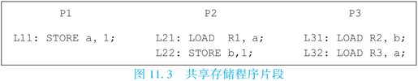

在图11.3所示的程序片段中，如果仅要求P1、P2及P3根据指令在程序中出现的次序来执行指令，那么这个程序的访存事件可能按如下次序发生：

1. P1发出存数操作L11；
2. L11到达P2，但由于网络堵塞等原因，L11未到达P3；
3. P2发出取数操作L21取回a的新值；
4. P2发出存数操作L22，且其所存的b新值到达P3；
5. P3发出取数操作L31取回b的新值；
6. P3发出取数操作L32，但由于L11未到达P3，故L32取回a的旧值；
7. L11到达P3。

这是一个程序员难以接受的执行结果。因为从程序员的观点来看，如果L21和L31分别取回a和b的新值，则说明存数操作L11和L22都已完成，L32必然取回a的新值。在此例中，即使每个处理器都根据指令在程序中出现的次序来执行指令，仍然会导致错误的结果。从这个例子可以看出，在共享存储系统中，需要对多处理器的访存操作的次序做出限制，才能保证程序执行的正确。

存储一致性模型是多处理器系统设计者与应用程序员之间的一种约定，它给出了正确编写程序的标准，使得程序员无须考虑具体访存次序就能编写正确程序，而系统设计者则可以根据这个约定来优化设计提高性能。系统设计者通过对各处理器的访存操作完成次序加以必要的约束，来满足存储一致性模型的要求。

文献中常见的存储一致性模型包括：顺序一致性模型、处理器一致性模型、弱一致性模型、释放一致性模型等。这些存储一致性模型对访存事件次序的限制不同，因而对程序员的要求以及所能得到的性能也不一样。存储一致性模型对访存事件次序施加的限制越弱，越有利于提高性能，但编程越难。下面介绍具体的存储一致性模型。

(1) 顺序一致性（Sequential Consistency，SC）模型。这种模型是程序员最乐于接受的存储一致性模型，最符合程序员的直觉。对于满足顺序一致性的多处理机中的任一执行，总可以找到同一程序在单机多进程环境下的一个执行与之对应，使得二者结果相等。

为了放松对访存事件次序的限制，人们提出了一系列弱存储一致性模型。这些弱存储一致性模型的基本思想是：在顺序一致性模型中，虽然为了保证正确执行而对访存事件次序施加了严格的限制，但在大多数不会引起访存冲突的情况下，这些限制是多余的，极大地限制了系统优化空间进而影响了系统性能。因此可以让程序员承担部分执行正确性的责任，即在程序中指出需要维护一致性的访存操作，系统只保证在用户指出的需要保持一致性的地方维护数据一致性，而对用户未加说明的部分，可以不考虑处理器之间的数据相关。

(2) 处理器一致性（Processor Consistency，PC）模型。

这种模型比顺序一致性模型弱，故对于某些在顺序一致条件下能正确执行的程序，在处理器一致条件下执行时可能会导致错误结果。处理器一致性模型对访存事件发生次序施加的限制是：在任一取数操作load被允许执行之前，所有在同一处理器中先于这一load的取数操作都已完成；在任一存数操作store被允许执行之前，所有在同一处理器中先于这一store的访存操作（包括load和store）都已完成。

上述条件允许store之后的load越过store而执行，在实现上很有意义：在Cache命中的load指令写回之后但没有提交之前，如果收到其他处理器对load所访问Cache行的无效请求，load指令可以不用取消，较大地简化了流水线的设计。多核龙芯3号处理器设计中就采用了处理器一致性。

(3) 弱一致性（Weak Consistency，WC）模型。这种模型的主要思想是把同步操作和普通访存操作区分开来，程序员必须用硬件可识别的同步操作，把对可写共享单元的访问保护起来，以保证多个处理器对可写共享单元的访问是互斥的。弱一致性模型对访存事件发生次序做如下限制：同步操作的执行满足顺序一致性条件；在任一普通访存操作被允许执行之前，所有在同一处理器中先于这一访存操作的同步操作都已完成；在任一同步操作被允许执行之前，所有在同一处理器中先于这一同步操作的普通访存操作都已完成。

上述条件允许在同步操作之间的普通访存操作执行时不用考虑进程之间的相关。虽然弱一致性模型增加了程序员的负担，但它能有效地提高性能。值得指出的是，即使是在顺序一致的共享存储并行程序中，同步操作也是难以避免的，否则程序的行为难以确定。因此，在弱一致性模型的程序中，专门为数据一致性而增加的同步操作不多。

(4) 释放一致性（Release Consistency，RC）模型。这种模型是对弱一致性模型的改进，它把同步操作进一步分成获取操作acquire和释放操作release。acquire用于获取对某些共享存储单元的独占性访问权，而release则用于释放这种访问权。释放一致性模型对访存事件发生次序做如下限制：同步操作的执行满足顺序一致性条件；在任一普通访存操作被允许执行之前，所有在同一处理器中先于这一访存操作的acquire操作都已完成；在任一release操作被允许执行之前，所有在同一处理器中先于这一release的普通访存操作都已完成。

### 3. Cache一致性协议

在共享存储的多核处理器中，存在Cache一致性问题，即如何使同一数据块在不同Cache以及主存中的多个备份保持数据一致的问题。具体来说，一个数据块可能在主存和Cache之中保存多份，而不同的处理器核有可能同时读取或者修改这个数据，导致不同的处理器核观察到的数据的值是不同的。Cache一致性协议（Cache Coherence Protocol）是指在共享存储的多处理器或者多核处理器系统中，一种用来保持多个Cache之间以及Cache与主存之间数据一致的机制。

人们已经提出了若干Cache一致性协议来解决这个问题。

#### (1) Cache一致性协议的分类

Cache一致性协议的具体作用就是把某个处理器核新写的值传播给其他处理器核，以确保所有处理器核看到一致的共享存储内容。从如何传播新值的角度看，Cache一致性协议可分为写无效（Write-Invalidate）（也可称为写使无效）协议与写更新（Write-Update）协议；从新值将会传播给谁的角度看，它可以分为侦听协议与目录协议。Cache一致性协议决定系统为维护一致性所做的具体动作，因而直接影响系统性能。

(1) 写无效协议与写更新协议

在写无效协议中，当根据一致性要求要把一个处理器核对某一单元所写的值传播给其他处理器核时，就使其他处理器核中该单元的备份无效；其他处理器核随后要用到该单元时，再获得该单元的新值。在写更新协议中，当根据一致性要求要把一个处理器核对某一单元所写的值传播给其他处理器核时，就把该单元的新值传播给所有拥有该单元备份的处理器核，对相应的备份进行更新。

写无效协议的优点是：一旦某处理器核使某一变量在所有其他Cache中的备份无效后，它就取得了对此变量的独占权，随后它可以随意地更新此变量而不必告知其他处理器核，直到其他处理器核请求访问此变量而导致独占权被剥夺。其缺点是：当某变量在一处理器核中的备份变无效后，此处理器核再读此变量时会引起Cache不命中，在一个共享块被多个处理器核频繁访问的情况下会引起所谓的“乒乓”效应，即处理器核之间频繁地互相剥夺对一个共享块的访问权而导致性能严重下降。

写更新协议的优点是：一旦某Cache缓存了某一变量，它就一直持有此变量的最新备份，除非此变量被替换掉。其缺点是：写数的处理器核每次都得把所写的值传播给其他处理器核，即使其他处理器核不再使用所写的共享块。

写无效协议适用于顺序共享（Sequential Sharing）的程序，即在较长时间内只有一个处理器核访问一个变量；而写更新协议适用于紧密共享（Tight Sharing）的程序，即多个处理器核在一段时间内频繁地访问同一变量。

(2) 侦听协议与目录协议

侦听协议的基本思想是，当处理器核对共享变量的访问不在Cache命中或可能引起数据不一致时，它就把这一事件广播到所有处理器核。系统中所有处理器核的Cache都侦听广播，当拥有广播中涉及的共享变量的Cache侦听到广播后，就采取相应的维持一致性的行动（例如使本Cache的备份无效、向总线提供数据等）。侦听协议实现较简单，每个处理器核Cache只需要维护状态信息就可以了。

侦听协议适合于通过总线互连的多核处理器，因为总线是一种方便而快捷的广播媒介。在写使无效侦听协议中，当一个Cache侦听到其他处理器核欲写某一单元且自己持有此单元的备份时，就使这一备份无效以保持数据一致性；在写更新侦听协议中，当一个Cache侦听到自己持有备份的某一共享单元的内容被其他处理器核所更新时，就根据侦听到的内容更新此备份的值。由于侦听协议需要广播，因此只适用于共享总线结构。总线是一种独占式资源，且总线延迟随所连接的处理器核数目的增加而增加，存在可伸缩性差的问题。

在采用片上网络互连的多核处理器中通常使用基于目录的Cache一致性协议。目录协议的主要思想是，**为每一存储器（内存）行维持一目录项**，该目录项记录所有当前持有此行备份的处理器核号以及此行是否已被改写等信息。当一个处理器核欲往某一存储行写数且可能引起数据不一致时，它就根据目录的内容只向持有此行的备份的那些处理器核发出写使无效/写更新信号，从而避免了广播。

典型的目录组织方式为位向量目录。位向量目录中的每一目录项有一个n位的向量，其中n是系统中处理器核的个数。位向量中第i位为1表示此存储行在第i个处理器核中有备份。每一目录项还有一改写位，当改写位为1时表示某处理器核独占并已改写此行。

位向量目录的缺点是，所需的目录存储器容量随处理器核数n以及共享存储容量m的增加以O(mn)的速度增加，有较大存储开销。

#### (2) Cache状态

Cache一致性协议的实现方式为：在Cache中每一个Cache行设置一致性状态来记录该Cache行的读写状态，确保Cache行不会被多个处理器核同时修改。Cache行的一致性状态的实现有多种具体形式，如最简单的三状态ESI，较为常见的MESI及其变种MOESI等。

ESI是指Cache行的三种一致性状态：E（Exclusive，独占），S（Shared，共享），I（Invalid，无效）。Invalid状态表示当前Cache行是无效的，对其进行任何读写操作都会引发缓存缺失（Cache Miss）。Shared状态表明当前Cache行可能被多个处理器核共享，只能读取，不能写入，对其写入也会引发缓存缺失。Exclusive状态表明对应Cache行被当前处理器核独占，该处理器核可以任意读写这个Cache行，而其他处理器核如果想读写这个Cache行，需要请求占有这个Cache行的处理器核释放该Cache行。下图11.4给出了三个状态之间的转换关系。


MESI在ESI的基础上增加了M（Modified，修改）状态。其中Shared状态和Invalid状态和ESI的完全一样，而Exclusive状态表示当前Cache块虽然被当前处理器核独占，但是还没有被修改，与内存中的数据保持一致，如果处理器核想将其替换出去，并不需要将该Cache行写回内存。Modified状态表示当前Cache行被当前处理器核独占并且已经被修改过了，如果处理器核想替换该Cache行，需要将该Cache行写回内存。与ESI协议相比，增加一个Modified状态的优点是减少了Cache到内存的数据传输次数，Cache只需要将Modified状态的Cache行写回内存。

通常，一个Cache一致性协议应包括以下三方面的内容：Cache行状态、存储行状态以及为保持Cache一致性的状态转化规则。下面通过一个写无效的位向量目录协议例子简单说明Cache一致性协议的工作原理。

该协议采用ESI实现，Cache的每一行都有三种状态：无效状态（INV）、共享状态（SHD）以及独占状态（EXC）。在存储器中，每一行都有一相应的目录项。每一目录项有一n位的向量，其中n是系统中处理器核的个数。位向量中第i位为1表示此存储行在第i个处理器核Pi中有备份。此外，每一目录项有一改写位，当改写位为1时，表示某处理器核独占并已改写此行，相应的存储行处于DIRTY状态；否则相应的存储行处于CLEAN状态。

当处理器核Pi发出一取数操作“LOAD x”时，根据x在Cache和存储器中的不同状态采取如下不同的操作：

- 若x在Pi的Cache中处于共享或独占状态，则取数操作“LOAD x”在Cache命中。
- 若x在Pi的Cache中处于无效状态，那么这个处理器核向存储器发出一个读数请求read(x)，存储器在收到这个read(x)后查找与单元x相对应的目录项。
  - 如果目录项的内容显示出x所在的存储行处于CLEAN状态（改写位为0），即x在存储器的内容是有效的，那么存储器向发出请求的处理器核Pi发出读数应答rdack(x)提供x所在行的一个有效备份，并把目录项中位向量的第i位置为1。
  - 如果目录项的内容显示出x所在的存储行已被某个处理器核Pk改写（改写位为1），那么存储器向Pk发出一个写回请求wtbk(x)，Pk在收到wtbk(x)后，把x在Cache的备份从独占状态（EXC）改为共享状态（SHD），并向存储器发出写回应答wback(x)提供x所在行的一个有效备份，存储器收到来自Pk的wback(x)后向发出请求的处理器核Pi发出读数应答rdack(x)提供x所在行的一个有效备份，把目录项中的改写位置为0并把位向量的第i位置为1。
- 如果x不在Pi的Cache中，那么Pi先从Cache中替换掉一行再向存储器发出一个读数请求read(x)。

当处理器核Pi发出一存数操作“STORE x”时，根据x在Cache和存储器中的不同状态采取如下不同的操作：

- 若x在Pi的Cache中处于独占状态，则存数操作“STORE x”在Cache命中。
- 若x在Pi的Cache中处于共享状态，那么这个处理器核向存储器发出一个写数请求write(x)，存储器在收到这个write(x)后查找与单元x相对应的目录项。
  - 如果目录的内容显示出x所在的存储行处于CLEAN状态（改写位为0），并没有被其他处理器核所共享（位向量中所有位都为0），那么存储器向发出请求的处理器核Pi发出写数应答wtack(x)表示允许Pi独占x所在行，把目录项中的改写位置为1并把位向量的第i位置为1。
  - 如果目录项的内容显示出x所在的存储行处于CLEAN状态（改写位为0），并且在其他处理器核中有共享备份（位向量中有些位为1），那么存储器根据位向量的内容向所有持有x的共享备份的处理器核发出一个使无效信号invld(x)，持有x的有效备份的处理器核在收到invld(x)后把x在Cache的备份从共享状态（SHD）改为无效状态（INV），并向存储器发出使无效应答invack(x)，存储器收到所有invack(x)后向发出请求的处理器核Pi发出写数应答wtack(x)，把目录项中的改写位置为1并把位向量的第i位置为1，其他位清0。
- 若x在Pi的Cache中处于无效状态，那么这个处理器核向存储器发出一个写数请求write(x)，存储器在收到这个write(x)后查找与单元x相对应的目录项。
  - 如果目录项的内容显示出x所在的存储行处于CLEAN状态（改写位为0），并没有被其他处理器核所共享（位向量中所有位都为0），那么存储器向发出请求的处理器核Pi发出写数应答wtack(x)提供x所在行的一个有效备份，把目录项中的改写位置为1，并把位向量的第i位置为1。
  - 如果目录项的内容显示出x所在的存储行处于CLEAN状态（改写位为0），并且在其他处理器核中有共享备份（位向量中有些位为1），那么存储器根据位向量的内容向所有持有x的共享备份的处理器核发出一个使无效信号invld(x)，持有x的有效备份的处理器核在收到invld(x)后，把x在Cache的备份从共享状态（SHD）改为无效状态（INV），并向存储器发出使无效应答invack(x)，存储器收到所有invack(x)后向发出请求的处理器核Pi发出写数应答wtack(x)提供x所在行的一个有效备份，把目录项中的改写位置为1并把位向量的第i位置为1，其他位清0。
  - 如果目录项的内容显示出x所在的存储行已被某个处理器核Pk改写（改写位为1，位向量第k位为1），那么存储器向Pk发出一个使无效并写回请求invwb(x)，Pk在收到invwb(x)后把x在Cache的备份从独占状态（EXC）改为无效状态（INV），并向存储器发出使无效并写回应答invwback(x)提供x所在行的有效备份，存储器收到来自Pk的invwback(x)后向发出请求的处理器核Pi发出写数应答wtack(x)提供x所在行的一个有效备份，把目录项中的改写位置为1，并把位向量的第i位置为1，其他位清0。
- 如果x不在Pi的Cache中，那么Pi先从Cache中替换掉一行再向存储器发出一个写数请求write(x)。如果某处理器核要替换一Cache行且被替换行处在EXC状态，那么这个处理器核需要向存储器发出一个替换请求rep(x)把被替换掉的行写回存储器。

假设单元x初始时在存储器中处于CLEAN状态（改写位为0），并被处理器核Pj和Pk所共享（在Pj和Pk的Cache中处于SHD状态），如图11.5(a)所示。

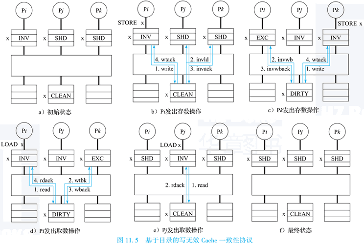

接着x被多个处理器核按如下次序访问：处理器核Pi发出存数操作“STORE x”，处理器核Pk发出存数操作“STORE x”，处理器核Pi发出取数操作“LOAD x”，处理器Pj发出取数操作“LOAD x”。图11.5(b)\~(f)显示出上述访问序列引起的一系列消息传递，以及x在Cache及在存储器中的状态的转化过程。

## （三）多核处理器的互连结构

多核处理器通过片上互连将处理器核、Cache、内存控制器、IO接口等模块连接起来。下图11.6为一个NUCA结构的多核处理器的片上互连示意图。

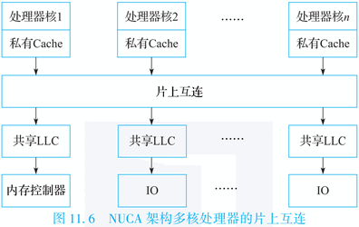

常见的片上互连结构包括片上总线、交叉开关和片上网络。下图11.7为三种结构的对比示意图。

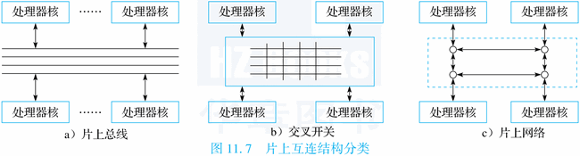

其中共享片上总线结构和交叉开关结构因可伸缩性差的原因，主要用于小规模的多核处理器；片上网络（Network on Chip，NOC）具有可伸缩性好的优势，适合于核数较多的多核/众核处理器。

### 1. 片上总线

传统的计算机系统的总线通常由一组信号线把多功能模块连接在一起。通过信号线上的信号表示信息，通过约定不同信号的先后次序约定操作如何实现。根据传输信息的种类不同，可以划分为数据总线、地址总线和控制总线，分别用来传输数据、数据地址和控制信号。标准化的总线可以方便各部件间互连，因此出现了许多总线标准，例如ISA、PCI、USB总线标准等。

片上总线主要用于多核处理器设计，它是片上各个部件间通信的公共通路，由一组导线组成。片上总线标准通常包括总线位宽、总线时序、总线仲裁等。常见的片上总线标准包括：IBM公司的CoreConnect、ARM公司的AMBA总线标准、Silicore公司的Wishbone片上总线协议等。

片上总线的优点是实现简单，在其上易于实现广播通信，其缺点主要是可伸缩性不好。片上总线是一种独占式资源，其总线延迟随所连接节点数的增加而增加，每个节点分得的总线带宽随连接节点数的增加而较少，导致可伸缩性不好。片上总线适合用在连接节点不多的场合，常用于处理器核不多的多核处理器中。

### 2. 交叉开关

交叉开关可以看作一个以矩阵形式组织的开关集合。在一个M个输入、N个输出的交叉开关中，每个输出端口都可以接任意输入端口。交叉开关有多个输入线和输出线，这些线交叉连接在一起，交叉点可以看作单个开关。当一个输入线与输出线的连接点处开关导通时，则在输入线与输出线之间建立一个连接。交叉开关具有非阻塞（Non-Blocking）特性，可以建立多个输入与输出之间的连接（在不存在冲突的情况下），这些连接上的通信不会互相干扰。采用交叉开关通信的两个节点独享该连接的带宽，当有多对节点之间建立连接进行通信时，总带宽就会变大。

交叉开关的优点是高带宽，多对输入与输出端口间可以并行通信，且总带宽随所连接节点数的增加而增加。但缺点是随着连接节点数的增加，交叉开关需要的交叉点数目增加较快，物理实现代价较高，复杂度为$O(M\times N)$，因此可伸缩性有限，也不适合连接节点数多的情况。例如，对于一个有M个输入端口和N个输出端口的交叉开关，要增加成M+1输入端口和N+1个输出端口的交叉开关，则需要增加M+N+1个交叉点。

四核龙芯3号处理器的设计即采用交叉开关来互连处理器核和共享二级Cache体。

### 3. 片上网络

针对传统互连结构的局限，C.Seitz和W.Dally在21世纪初首先提出了片上网络的概念。下图11.8中有6个处理器核（P0\~P5）节点连接到网络中，当节点P2与P5进行数据通信时，它首先发送一个带有数据包的消息到网络中，然后网络将这个消息传输给P5。

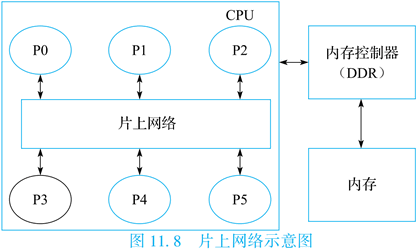

片上网络借鉴了分布式网络的TCP/IP协议传输数据的方式，将数据封装成数据包，通过路由器之间的分组交换和对应的存储-转发机制来实现处理器核间的通信。在片上网络中，片上多核处理器被抽象成节点、互连网络、网络接口（Network Interface）等元素。片上网络的研究内容主要包括：拓扑结构、路由算法、流量控制（Flow Control）、服务质量等。

(1) 拓扑结构。片上网络是由节点和传输信道的集合构成的。片上网络的拓扑是指网络中节点和信道的排列方式。网格（Mesh）、环（Ring）拓扑结构为最常见的两种。如下图11.9所示，Mesh拓扑结构中包含16个节点，编号为0到15，每个节点与4条边相连，但因为图中所示的边是双向的，每一条边可以看作两条方向相反的有向边，所以图中每个节点实际上是与8条信道线路相连。

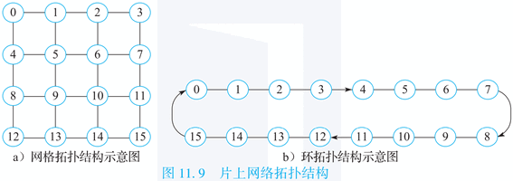

Tilera公司的Tile64处理器采用Mesh互连，IBM CELL处理器和Intel SandyBridge处理器采用环连接。

(2) 路由算法。片上网络所采用的路由方法决定了数据包从源节点到目的节点的传输路径。路径是传输信道的集合，即$P=\{c_1,c_2,\cdots,c_k\}$，其中当前信道$c_i$的输出节点与下一跳信道$c_{i+1}$的输入节点相同。在某些片上网络拓扑结构中（如环），从某个源节点出发到目的节点的路径只有唯一的一条；对于某些片上网络拓扑结构来说（如Mesh），可能有多条路径。

路径的选择可以遵循很多原则，针对如Mesh这样的网络拓扑结构，最常见的最短路径选择有两种：

- 维序路由（Dimension-Order Routing，DOR）。这是最简单、最直接的最短路径路由，它的策略是首先选择一个维度方向传输，当此维度走到目的地址相同维度方向后，再改变到其他维度。比如对于网格结构的拓扑，路径的选择可以是先沿X方向（水平方向）走到与目的地址一致的列，再选择Y方向（竖直方向）。
- 全局自适应路由（Adaptive Routing）。这是为了解决局部负载不均衡的情况而产生的路由方法，简单来说就是在每个节点有多种方向选择时，优先选择负载较轻的那一个节点方向作为路径。

(3) 路由器结构。路由器由寄存器、交叉开关、功能单元和控制逻辑组成。下图11.10所示为一个适用于Mesh结构的路由器结构。

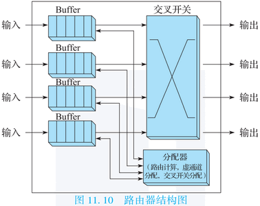

节点的每一个输入端口都有一个独立的缓冲区（Buffer），在数据包可以获得下一跳资源离开之前，缓冲区将它们存储下来。交叉开关连接输入端的缓冲区和输出端口，数据包通过交叉开关控制传输到它指定的输出端口。分配器包括路由计算、虚通道分配和交叉开关分配三种功能，路由计算用来计算head flit的下一跳输出方向，虚通道分配用来分配flit在缓冲队列的位置，交叉开关分配用来仲裁竞争的flit中哪个可以获得资源传输到输出端口。

(4) 流量控制。流量控制用来组织每个处理器核节点中有限的共享资源，片上网络的主要资源就是信道（Channel）和缓冲区（Buffer）。信道主要用来传输节点之间的数据包。缓冲区是节点上的存储装置，比如寄存器、内存等，它用来临时存储经过节点的数据包。当网络拥塞时，数据包需要临时存在缓冲区中等待传输。为了充分实现拓扑结构和路由方法的性能，当有空闲的信道可以使用时，流量控制必须尽量避免资源冲突。好的流量控制策略要求它保持公平性和无死锁，不公平的流量控制极端情况会导致某些数据包陷入无限等待状态，死锁是当一些数据包互相等待彼此释放资源而造成的无限阻塞的情况。片上网络为了可以有效执行，一定要是无死锁的。

下面以经典的基于信用的流量控制为例介绍片上网络中的流量控制方法。如下图11.11(a)所示，每一个处理器核节点的输入端口有自己的缓冲区队列，分别用来存取来自对应的上一跳节点的数据，比如i+1号节点最左侧的Buffer用来存储来自i号节点的数据包。同时，每个节点上对应其相邻的节点都有一个计数器，分别是S[0]\~S[3]，用来记录相邻节点内缓冲区Buffer的使用情况。

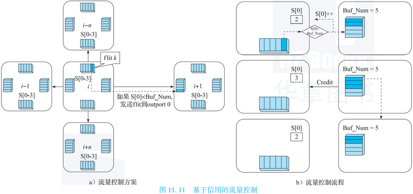

举例来说，对于处理器核节点i的每一个计数器的初始状态S[0]\~[3]都设为0，当它向相邻节点如i+1号节点发送flit时，首先判断S[0]的值是否已达到Buffer的最大值，如果没有，则将S[0]的值加1，然后将flit发送过去，如果S[0]已经达到最大值，则数据会被扣留在Buffer中直到右侧节点有足够的空间收留来自它的数据。同时，对于i+1号节点，每当它左侧的Buffer送走一个flit时，它就向其左侧的节点发送一个Credit信号，通知左侧节点，此Buffer已多出一个空余位置，当左侧节点收到此Credit信号后，则会更新对应的S[0]减1。整个流程如图11.11(b)所示。

## （四）多核处理器的同步机制

在介绍多核处理器的同步机制之前，先来看一个同步问题的例子。有两个处理器核P0和P1分别对同一共享地址的变量A进行加1的操作。于是，处理器P0先读取A的值，然后加1，并将A写回内存。同样，处理器核P1也进行一样的操作。

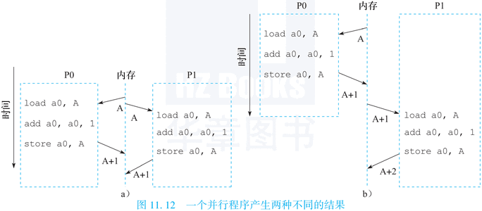

然而，如图11.12所示，实际的运算过程却有可能产生两种不一样的结果，注意整个运算过程是完全符合Cache一致性协议规定的。所以A的值可能增加了1，如图11.12(a)所示；也可能增加了2，如图11.12(b)所示。这样的结果对于软件设计人员来说是完全无法接受的。因此，需要同步机制来协调多个处理器核对共享变量的访问。

为了解决同步问题，需要采用同步机制。常见的同步机制包括锁操作、栅障操作和事务内存。锁操作和事务内存主要用于保护临界区，栅障操作用于实现全局同步。锁操作和栅障操作属于传统同步方法，广泛用于并行系统中，事务内存则是适应多核处理器设计需求的一种新同步机制。同步机制一般建立在用户级软件例程（Routine）上，而这些软件例程主要基于硬件提供的同步指令来实现。

### 1. 原子操作

硬件设计人员在处理器中增加了一种特殊的机制，支持多个操作之间的原子性（Atomicity），也就是不可分割性。在硬件上实现满足不可分割性的原子操作有许多种方法，既可以在寄存器或者存储单元中增加专门的硬件维护机制，也可以在处理器的指令集中添加特定的原子指令。早期的处理器大多选择在存储单元中增加特殊的原子硬件维护机制，而现代处理器大多使用原子指令方式。原子指令的实现方式可以分为两种，其中一种是直接使用一条“读-改-写”（Read-Modify-Write，RMW）原子指令来完成，另一种是使用一组原子指令对LL/SC（Load-Linked/Store-Conditional）来完成指定的原子操作。

常见的“读-改-写”原子指令包括Test\_and\_Set、Compare\_and\_Swap、Fetch\_and\_Op等。Test\_and\_Set指令取出内存中对应地址的值，同时对该内存地址赋予一个新的值，这个值通常是1。Compare\_and\_Swap指令取出内存中对应地址的值和另一个给定值A进行比较，如果相等，则将另一个给定值B写入这个内存地址，否则不进行写操作；指令应返回状态（例如X86的cmpxchg指令设置eflags的zf位）来指示是否进行了写操作。Fetch\_and\_Op指令在读取内存对应地址值的同时将该地址的值进行一定的运算再存回。根据运算操作（Op）的不同，Fetch\_and\_Op指令又有许多种不同的实现形式。例如，Fetch\_and\_Increment指令就是读取指定地址的值，同时将该值加1并写回内存。可以看出“读-改-写”原子指令和内存的交互过程至少有两次，一次读内存，另一次写内存，而两次交互过程之间往往还有一些比较、加减之类的运算操作（改）。

使用原子指令对LL/SC实现原子操作方式的过程如下：首先LL指令将对应地址的内存数据读入寄存器，然后可以对该寄存器中的值进行任意的运算，最后使用SC指令尝试将运算后的数据存回内存对应的地址。当且仅当LL指令完成之后没有其他对该地址内存数据的修改操作，则SC指令执行成功并返回一个非零值，运算后的数据顺利写回内存，否则SC指令执行失败并返回值0，修改后的数据不会被写回内存，也不会产生任何对内存的改动。SC指令失败后一般需要重新执行上述过程，直到SC指令成功为止。SC指令的成功说明了LL/SC指令之间没有其他对同一地址的写入操作，也就保证了LL/SC指令之间的不可分割性。

下图11.13的例子采用LL/SC指令实现了寄存器R1的内容与R3对应的内存位置的内容的原子交换。

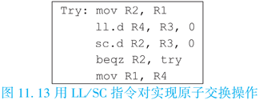

LL/SC原子指令对的优点在于设计简单，每条指令只需和内存交互一次，且在LL指令和SC指令之间可以加入任意的运算指令，可以灵活地实现类似于“读-改-写”的复杂原子操作。其缺点在于密集共享时，SC不容易成功，一种优化措施是LL访问时把相应Cache行置为EXC状态，而不是SHD状态，这样可以提高SC成功的概率。相对于Test\_and\_Set指令和Fetch\_and\_Op指令等实现复杂的单条原子指令，LL/SC指令对成为目前最常见的原子指令，被多种现代RISC指令系统所采用，如ARM、MIPS、IBM Power、DEC Alpha和LoongArch等。

### 2. 锁的软件实现方法

锁（Lock）是并行程序中常用的对多个线程共享的临界区（Critical Section）进行保护的同步操作。自旋锁（Spin Lock）是锁操作的一种最基本的实现形式。Test\_and\_Set自旋锁是最简单的自旋锁，通过使用Test\_and\_Set原子指令来完成锁的获取、等待和查询。Test\_and\_Set锁的基本步骤如下图11.14所示，假设1表示锁被占用，0表示锁空闲。

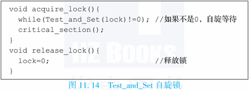

处理器使用Test\_and\_Set原子指令读取锁变量的值，同时将锁变量的值改为1。如果读取到锁的值为0，说明锁空闲，该处理器成功获得锁。由于Test\_and\_Set指令已经将锁的值同时改为了1，所以其他处理器不可能同时获得这把锁。如果锁的值为1，说明已经有其他处理器占用了这把锁，则该处理器循环执行Test\_and\_Set指令自旋等待，直到成功获得锁。由于当时锁的值已经是1了，Test\_and\_Set指令再次将锁的值设为1，实际上锁的值并没有发生变化，所以不会影响到锁操作的正确性。

当获得锁的处理器打算释放锁时，只需要简单地执行一条普通的store指令，将锁的值设置为0即可。由于一次只能有一个处理器核获得锁，所以不用担心多个处理器核同时释放锁而引发访存冲突，也就不需要使用原子指令来释放锁了。

Test\_and\_Set自旋锁最主要的一个缺点就是对锁变量的访存冲突。当一个处理器核获得锁以后，其他等待的处理器核会不断循环执行Test\_and\_Set指令访问锁变量，试图获取锁权限，从而在片上互连上产生大量的访存通信。一种简单的优化方法就是在Test\_and\_Set指令之间加入一定的延迟，减少等待阶段Test\_and\_Set原子指令自旋执行的次数以减轻访存的压力。此外，研究人员还提出了排队锁（Ticket Lock）、基于数组的队列锁（Array-Based Queuing Lock）、基于链表的队列锁（List-Based Queuing Lock）等优化机制。

### 3. 栅障软件实现方法

栅障（Barrier）是并行程序中常用的同步操作。栅障要求处理器核等待，一直到所有处理器核都到达栅障后，才能释放所有处理器核继续执行。栅障有多种实现方式，下面主要介绍比较简单的集中式栅障。集中式栅障就是在共享存储中设置一个共享的栅障变量。每当一个处理器核到达栅障以后，就使用原子指令修改栅障值表示自己已经到达（如将栅障的值加1），然后对该栅障值进行自旋等待，如下图11.15的伪代码所示。

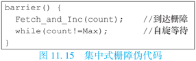

当栅障的值表明所有处理器核都已经到达（即栅障的值等于预计到达的总的处理器核的数量）时，栅障操作顺利完成，所有自旋等待的处理器核就可以继续往下执行了。集中式栅障的实现简单、灵活，可以支持各种类型的栅障，包括全局栅障和部分栅障，适用于可变处理器核数量的栅障操作。

在集中式栅障中，每一个到达的处理器核都需要对同一个共享的栅障值进行一次修改以通告该处理器核到达栅障，已到达栅障的处理器核会不断访问栅障值以判断栅障是否完成。由于Cache一致性协议的作用，这个过程会在片上互连上产生许多无用的访存通信，并且随着处理核数的增加，栅障的时间和无用的访存数量都会快速增长，所以集中式栅障的可扩展性不好。

为了减少上述查询和无效的访存开销，集中式栅障也可以采用类似于Test\_and\_Set锁的方式，在查询操作之中增加一些延迟。加入延迟虽然可以减少一些网络带宽的浪费，但是也可能降低栅障的性能。针对集中式栅障的弱点，研究人员提出了软件合并树栅障等优化方法。

### 4. 事务内存

1993年，Herlihy和Moss以事务概念为基础，针对多核处理器中并行编程的同步效率问题提出了事务内存的概念。

在事务内存中，访问共享变量的代码区域声明为一个事务（Transaction）。事务一般具有以下性质：原子性（Atomicity），即事务中的所有指令要么执行要么不执行；一致性（Consistency），即任何时刻内存处于一致的状态；隔离性（Isolation），即事务不能看见其他未提交事务涉及的内部对象状态。事务执行并原子地提交所有结果到内存（如果事务成功），或中止并取消所有的结果（如果事务失败）。

事务内存实现的关键部分包括：冲突检测、冲突解决，以及事务的提交和放弃。冲突检测就是确定事务并发执行过程中是否存在数据的冲突访问。冲突解决是指在发生冲突时决定继续或者放弃事务的执行。如果支持事务的暂停操作，可以暂停引起冲突的事务，直到被冲突的事务执行结束；如果不支持事务的暂停操作，就必须在引起冲突的事务中选择一个提交，同时放弃其他事务的执行。事务的提交或放弃是解决事务冲突的核心步骤，事务提交需要将结果数据更新到内存系统中，事务放弃需要将事务的结果数据全部丢弃。

事务内存实现方式主要有软件事务内存和硬件事务内存两种。软件事务内存通过软件实现，不需要底层硬件提供特殊的支持，主要以库函数或者编程语言形式实现。例如，RSTM、DSTM、Transactional Locking等以库函数实现，线程访问共享对象时通过对应的库函数来更新事务执行的状态、检测冲突和处理等；HSTM语言中扩展了事务原语；AtomCaml在ObjectCaml语言中增加了对事务内存同步模型的支持等。硬件事务内存主要对多核处理器的Cache结构进行改造，主要包括：增加特定指令来标示事务的起止位置，使用额外的事务Cache来跟踪事务中的所有读操作和写操作；扩展Cache一致性协议来检测数据冲突。

软件事务内存实现灵活，更容易集成到现有系统中，但性能开销大；硬件事务内存需要修改硬件，但是性能开销小，程序整体执行性能高。Intel Haswell处理器和IBM Power8处理器中实现了对硬件事务内存的支持。

下面来看一个具体的实现例子。Intel TSX（Transactional Synchronization Extensions）是Intel公司针对事务内存的扩展实现，提出了一个针对事务内存的指令集扩展，主要包括3条新指令：XBEGIN、XEND、XABORT。其中XBEGIN指令启动一个事务，并提供了如果事务不能成功执行的回退地址信息；XEND指令表示事务的结束；XABORT指令立刻触发一个中止，类似于事务提交不成功。硬件实现以Cache行为单位，跟踪事务的读集（Read-Set）和写集（Write-Set）。如果事务读集中的一个Cache行被另一个线程写入，或者事务的写集中的一个Cache行被另一个线程读取或写入，则事务就遇到冲突（Conflict），通常导致事务中止。Intel Haswell处理器中实现了Intel TSX。

## （五）典型多核处理器

### 1. 龙芯3A5000处理器

龙芯3A5000于2020年研制成功，是龙芯中科技术股份有限公司研发的首款支持龙芯自主指令集（LoongArch）的通用多核处理器，主要面向桌面计算机和服务器应用。

龙芯3A5000片内集成4个64位LA464高性能处理器核、16MB的分体共享三级Cache、2个DDR4内存控制器（支持DDR4-3200）、2个16位HT（HyperTransport）控制器、2个I2C、1个UART、1个SPI、16路GPIO接口等。龙芯3A5000中的多个LA464核及共享三级Cache模块，通过AXI互连网络形成一个分布式共享片上末级Cache的多核结构。采用基于目录的Cache一致性协议来维护Cache一致性。另外，龙芯3A5000还支持多片扩展，将多个芯片的HT总线直接互连便可形成更大规模的共享存储系统（最多可支持16片互连）。

LA464是支持LoongArch指令集的四发射64位高性能处理器核，具有256位向量部件。LA464的结构如下图11.16所示。


LA464主要特点如下：四发射超标量结构，具有4个定点、2个向量、2个访存部件；支持寄存器重命名、动态调度、转移预测等乱序执行技术；每个向量部件宽度为256位，可支持8个双32位浮点乘加运算或4个64位浮点运算；一级指令Cache和数据Cache大小各为64KB，4路组相联；牺牲者Cache（Victim Cache）作为私有二级Cache，大小为256KB，16路组相连；支持非阻塞（Non-blocking）访问及装入猜测（Load Speculation）等访存优化技术；支持标准的JTAG调试接口，方便软硬件调试。

龙芯3A5000芯片整体架构基于多级互连实现，结构如下图11.17所示（图11.18为芯片版图）。第一级互连采用5×5的交叉开关，用于连接4个LA464核（作为主设备）、4个共享Cache模块（作为从设备）以及1个IO端口连接IO-RING。IO端口使用1个Master和1个Slave。第二级互连采用5×3的交叉开关，连接4个共享Cache模块（作为主设备）、2个DDR3/4内存控制器以及1个IO端口连接IO-RING。IO-RING连接包括4个HT控制器、MISC模块、SE模块与两级交叉开关。两个HT控制器（Lo/Hi）共用16位HT总线，作为两个8位的HT总线使用，也可以由Lo独占16位HT总线。HT控制器内集成一个DMA控制器，负责IO的DMA控制并负责片间一致性的维护。


上述互连结构都采用读写分离的数据通道，数据通道宽度为128位，与处理器核同频，用以提供高速的片上数据传输。此外，一级交叉开关连接4个处理器核与Scache的读数据通道为256位，以提高片内处理器核访问Scache的读带宽。龙芯3A5000主频可达2.5GHz，峰值浮点运算能力达到160 GFLOPS。

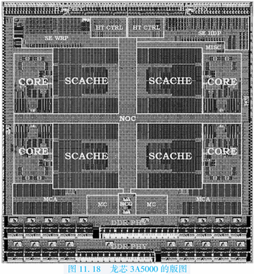

### 2. Intel SandyBridge架构

Intel SandyBridge架构于2011年推出，是Intel面向32nm工艺的新架构，它是Core处理器架构的第二代架构。根据面向移动、桌面还是服务器应用，有支持2\~8核的不同处理器产品。

SandyBridge处理器主要包括五个组成部分：处理器核、环连接（Ring Interconnect）、共享的三级Cache、系统代理（System Agent）和图形核心（GPU）。下图11.19为SandyBridge处理器的结构示意图。

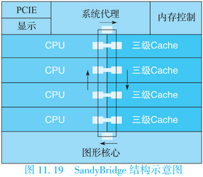

它的处理器核心采用乱序执行技术，支持双线程，支持AVX向量指令集扩展。系统代理包括内存控制器、功耗控制单元（Power Control Unit）、PCIE接口、显示引擎和DMI等。存储层次包括每个核私有的一级Cache和二级Cache、多核共享的LLC（三级Cache）。LLC分体实现，在处理器核和图形核心、系统代理之间共享。

SandyBridge采用环连接来互连处理器核、图形核心、LLC和系统代理。环连接由请求（Request）、响应（Acknowledge）、侦听（Snoop）、数据（Data）四条独立的环组成。这四条环采用一个分布式的通信协议维护数据一致性和序（Ordering），实现了基于侦听的Cache一致性协议。环连接采用完全流水线设计，以核心频率运行，随着连接的节点数目增加，带宽也随之增加，在处理器核总数不太大的情况下，有较好的伸缩性。另外，由于环连接传递的消息具有天然的序，使得Cache一致性协议的设计和验证比较简单。如图11.19所示，SandyBridge的环有6个接口，包括4个处理器核和三级Cache共享的接口，一个图形核心的接口和1个系统代理的接口。

4核SandyBridge处理器的主频达到3GHz，支持128位向量处理，峰值性能达到96 GFLOPS，理论访存带宽达到25.6 GB/s，采用Stream测试程序集实测的访存带宽为14\~16 GB/s。

### 3. IBM Cell处理器

Cell处理器由IBM、索尼和东芝联合研发，并在2005年国际固态电路会议（ISSCC）上首次公开，主要面向游戏、超级计算等领域。下图11.20为Cell处理器的结构示意图。

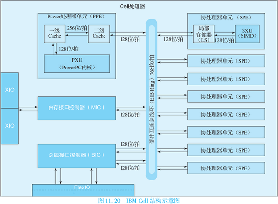

Cell采用异构多核架构，它由1个相对比较简单的支持同时双线程并行的双发射64位PowerPC内核（称为PPE）和8个SIMD型向量协处理器（称为SPE）构成。由一个高带宽的片上环状高速总线将PPE、SPE、内存接口控制器（MIC）、总线接口控制器（BIC）、FlexIO外部总线接口控制器连接起来。

PPE主要负责控制并运行操作系统，SPE完成主要的计算任务。SPE的SIMD执行部件是128位宽的，从而可在一个时钟周期里完成4个32位的定点或浮点乘加运算。SPE里内置了256KB的SRAM作为局部存储器（Local Storage，LS），LS与内存间的通信必须通过DMA进行。SPE配置了较大的寄存器堆（128个128位的寄存器）来尽量减少对内存的访问。由于SPE不采用自动调配数据的Cache机制，需要显式地将内存中的数据先搬到LS中供SPE计算，为了减少数据搬运，需要依赖高水平程序员或编译器的作用来获得高性能，编程较为复杂。

Cell处理器可在4GHz频率下工作，峰值浮点运算速度为256 GFLOPS，理论访存带宽为25.6 GB/s。由于存在编程及推广困难等原因，目前Cell处理器已经停止研发。

### 4. NVIDIA GPU

GPU（Graphics Processing Unit）是进行快速图形处理的硬件单元，现代GPU包括数百个并行浮点运算单元，是典型的众核处理器架构。本节主要介绍NVIDIA公司的Fermi GPU体系结构。

第一个基于Fermi体系结构的GPU芯片有30亿个晶体管，支持512个CUDA核心（Compute Unified Device Architecture），组织成16个流多处理器（Stream Multiprocessor，SM）。SM结构如下图11.21所示。

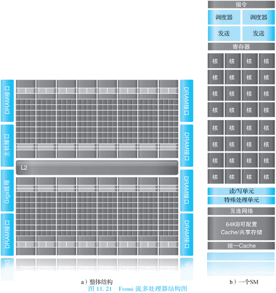

每个SM包含32个CUDA核心（Core）、16个load/store读写单元（LD/ST）、4个特殊处理单元（Special Function Unit，SFU）、64KB的片上高速存储。16个load/store读写单元可以每个时钟周期为16个线程计算源地址和目标地址，实现对这些地址数据的读写。SFU支持超越函数的指令，如sin、cos、平方根等。64KB片上高速存储是可配置的，可配成48KB的共享存储和16KB一级Cache或者16KB共享存储和48KB一级Cache。片上共享存储使得同一个线程块的线程之间能进行高效通信，可以减少片外通信以提高性能。

每个CUDA核心支持一个全流水的定点算术逻辑单元（ALU）和浮点单元（FPU），如下图11.22所示，每个时钟周期可以执行一条定点或者浮点指令。

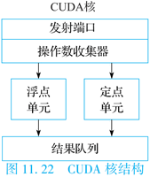

ALU支持所有指令的32位精度运算；FPU实现了IEEE 754-2008浮点标准，支持单精度和双精度浮点的融合乘加指令（Fused Multiply-Add，FMA）。

(1) Fermi的线程调度

注意：这里的线程并不是程序线程，而是CUDA线程，详见下面该小节的总结部分。

Fermi体系结构使用两层分布式线程调度器。块调度器将线程块（Thread Block）调度到SM上，SM以线程组Warp为单位调度执行，每个Warp包含32个并行线程，这些线程以单指令多线程（Single Instruction Multi Thread，SIMT）的方式执行。SIMT类似于SIMD，表示指令相同但处理的数据不同。

每个SM有两个Warp调度器和两个指令分派单元，允许两个Warp被同时发射和并发执行。双Warp调度器（DualWarpScheduler）选择两个Warp，从每个Warp中发射一条指令到一个16核构成的组、16个load/store单元，或者4个特殊处理单元。大多数指令是能够双发射的，例如两条定点指令、两条浮点指令，或者是定点、浮点、load、store、SPU指令的混合。双精度浮点指令不支持与其他指令的双发射。

(2) Fermi存储层次

Fermi体系结构的存储层次由每个SM的寄存器堆、每个SM的一级Cache、统一的二级Cache和全局存储组成。下图11.23为Fermi存储层次示意图。

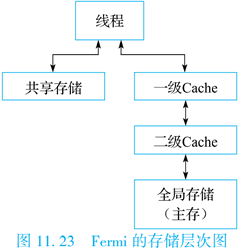

具体如下：

1. 寄存器。每个SM有32K个32位寄存器，每个线程可以访问自己的私有寄存器，随线程数目的不同，每个线程可访问的私有寄存器数目在21\~63间变化。
2. 一级Cache和共享存储。每个SM有片上高速存储，主要用来缓存单线程的数据或者用于多线程间的共享数据，可以在一级Cache和共享存储之间进行配置。
3. 二级Cache。768KB统一的二级Cache在16个SM间共享，服务于所有到全局内存中的load/store操作。
4. 全局存储。所有线程共享的片外存储。

Fermi体系结构采用CUDA编程环境，可以采用类C语言开发应用程序。**NVIDIA将所有形式的并行都定义为CUDA线程**，将这种最底层的并行作为编程原语，编译器和硬件可以在GPU上将上千个CUDA线程聚集起来并行执行。这些线程被组织成线程块，以32个为一组（Warp）来执行。

Fermi体系结构可以看作GPU与CPU融合的架构，具有强大的浮点计算能力，除了用于图像处理外，也可作为加速器用于高性能计算领域。采用Fermi体系结构的GeForce GTX 480包含480核，主频700MHz，单精度浮点峰值性能为1.536 TFLOPS，访存带宽为177.4 GB/s。

### 5. Tile64处理器

Tile64是美国Tilera公司于2007年推出的64核处理器，主要面向网络和视频处理等领域。下图11.24为Tile64处理器的结构图。

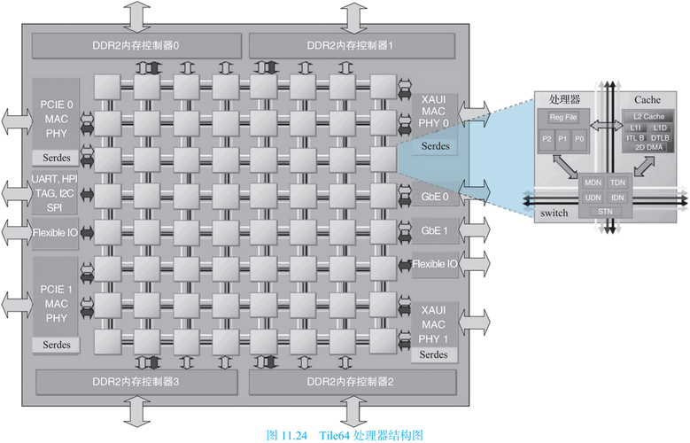

Tile64具有64个Tile（瓦片），组成8×8的Mesh结构，每个Tile包含通用CPU核、Cache和路由器。

Tile64的处理器核支持MIPS类VLIW指令集，采用三发射按序短流水线结构，支持2个定点功能部件和1个load/store访存部件。在互连结构方面，Tile64采用Mesh互连结构，通过路由器实现了5套低延迟的、不同用途的Mesh互连网络，提供了足够的通信带宽。在访存结构方面，每个Tile拥有私有一级Cache（16KB）和私有二级Cache（64KB），以及虚拟的三级Cache（所有Tile的二级Cache聚合）。Tile64采用邻居（Neighborhood）缓存机制实现片上分布式共享Cache，每个虚拟地址对应一个Home Tile，先访问该Home Tile的私有Cache，如果不命中则访问内存；数据只在它的Home Tile的私有Cache中缓存，由Home Tile负责维护数据一致性。

Tile64支持4个DDR2内存控制器，2个10Gbit的以太网接口，2个PCIE接口及其他一些接口。

Tile64的运行主频为1GHz，峰值性能为每秒192G个32位运算，理论访存带宽为25 GB/s。