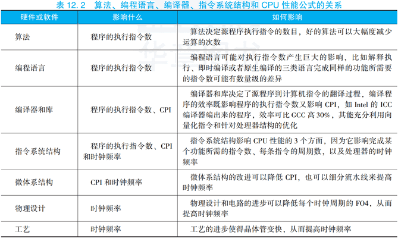
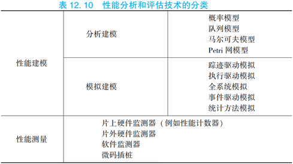

[toc]

# 十二、计算机系统评价和性能分析

当前高性能微处理器包含数十亿个晶体管，主频达到近5GHz。处理器的结构也变得越来越复杂，通常采用深度流水、乱序执行、多发射、推测执行、片上集成大容量Cache等超标量技术。处理器的设计和性能分析是一个非常大的挑战，因为其1秒钟内能执行数十亿条指令，分析处理器1秒钟的执行，涉及上百亿的信息片段。巨大的设计空间和工作负载特性的多样性，导致性能分析和评价成为一个非常艰巨的任务。性能分析在计算机系统的设计、选择和系统调优的每一个环节都是很有必要的。在系统设计和开发的时候需要预测性能指标能否达到设计目标。在系统选择时，需要对现有相互竞争的系统进行性能测试。在系统使用时，需要对现有系统进行性能调优。计算机性能分析的主要技术包括性能建模和评测，性能建模又包括采用队列理论等进行分析建模和采用定制模拟器的方法进行性能模拟，评测主要是基于现有和合成的基准测试程序对计算机系统或性能模型进行评价和测试。

计算机系统评价和性能分析就是采用测量、模拟、分析等方法和工具，获得计算机系统运行预定任务时的性能特性，找出已有系统的性能瓶颈，然后进行改进和提高。性能分析还可以对未来设计的系统进行性能预测。

本章主要介绍计算机系统评价和性能分析方法。首先，介绍计算机的性能指标。性能的最本质定义是“完成一个任务所需要的时间”，完成一个任务所需要的时间可以由完成该任务需要的指令数、完成每条指令需要的拍数以及每拍需要的时间三个量相乘得到。然后，介绍测试程序集。由于应用的多样性，不同的计算机对不同的应用有不同的适应性，很难建立一个统一的标准来比较不同计算机的性能。因此人们通过一系列基准程序集来评价计算机性能，包括SPEC CPU、SPECweb、SPECjbb、STREAM、LMbench、Linpack、SPLASH、EEMBC等。接下来，介绍计算机性能分析方法。性能分析可以分为性能建模和性能测量两类。性能建模主要用于设计的早期还没有实际系统阶段，又可以细分为基于模拟的建模和基于分析的建模。在原型系统出来之后，实际机器的测量提供了一个附加的反馈，可以帮助验证设计阶段的分析模型。最后，对一些具体计算机系统进行性能比较和分析。通过测试Intel、AMD、龙芯等CPU的性能以及分析其微结构的特点，帮助读者理解本章介绍的部分方法和工具的应用。

## （一）计算机系统性能评价指标

我们经常说一台机器速度很快，这个“快”怎么衡量？对于普通用户而言，速度快就是执行一个程序的运行时间短。例如一台Core i7的机器和一台Core2的机器相比，对于一个大文件进行压缩，前者完成的时间短，采用软解码视频播放器播放H.264格式文件，前者播放更为流畅。对于Web服务器而言，性能高表示每秒所完成应答的Web请求数量大，对于像京东和淘宝这样的电子商务网站，衡量指标通常是每秒完成的交易事务（Transaction），即吞吐率。对于高性能计算机而言，衡量指标是其完成一个大的并行任务的速度，如Top500中一个重要的衡量指标是高性能Linpack的实测双精度浮点峰值。

### 1. 计算机系统常用性能评价指标

计算机系统的性能有许多衡量指标，如执行时间或者响应时间、吞吐率、加速比、每条指令的时钟周期数（CPI）、每秒执行百万条指令数（MIPS）、每秒执行百万浮点运算数（MFLOPS）、每秒执行的事务数（TPS）和归一化的执行时间等。

归根到底，计算机的性能最本质的定义是“完成一个任务所需要的时间”。计算机系统完成某个任务所花费的时间，称为执行时间。时间最直接的定义是墙上时钟时间、响应时间或者持续时间。计算机中完成一个任务的时间包括CPU计算、磁盘的访问、内存的访问、输入输出的活动和操作系统的开销等所有的时间。我们常说的CPU时间表示CPU计算的时间，而不包括等待IO的时间或者执行其他程序的时间。CPU时间能进一步被分为花在程序执行上的CPU时间（用户CPU时间）和花在操作系统上的执行时间（系统CPU时间）。在比较两台机器（X和Y）的性能时，X的速度是Y的n倍是指：Y的执行时间/X的执行时间=n。执行时间和性能成反比，X的性能=1/X的执行时间。所以下述关系成立：n=Y的执行时间/X的执行时间=X的性能/Y的性能。

历史上很长一段时间，测量计算机的速度通过时钟频率（MHz或GHz）来描述，这表示CPU时钟的每秒时钟周期数。每台计算机都有一个时钟，运行在一定的频率上，这些离散的时间事件称为时钟滴答和**时钟周期**，计算机的设计者把时钟周期时间表示为一个持续时间，如1ns对应的时钟频率为$1\text{s}/1\text{ns}=10^9\text{Hz}=1\text{GHz}$，通常**称一个时钟周期为一拍（Cycle）**。2000年时主频基本就是速度的标志，主频越高的芯片价格也越高。然而这种方法会有一定的误导，因为一个有很高时钟频率的机器，不一定有很高的性能，其他影响速度的因素还包括功能单元的数量、总线的速度、内存的容量、程序动态执行时指令的类型和重排序特性等。因此，厂商已经不再把时钟频率当作测量性能的唯一指标。

对于处理器的性能评价，有相应的处理器性能公式。一个程序的CPU时间可以描述为：
$$
CPU时间=程序的CPU时钟周期数\times时钟周期=程序的CPU时钟周期数/时钟频率
$$
CPU时间是由程序执行时钟周期数和处理器频率所决定的。

除了可以统计程序的时钟周期数，还可以统计程序所执行的动态指令数目。执行的动态指令数目（Instruction Count）也称为指令路径长度。得到时钟周期数和指令数后，就可以计算出**每条指令的时钟周期数（Clock cycles Per Instruction，CPI）**，即平均每条指令执行需要花费多少个时钟周期。在衡量相同指令集处理器的设计时，CPI是一个非常有效的比较方法。有时设计者也使用CPI的倒数，即**每个时钟周期内所执行的指令数（Instructions Per Clock，IPC）**。

现代处理器微体系结构的性能特性通常采用IPC或CPI来描述，这种测量方法和处理器的时钟频率没有关系。历史上处理器的IPC只有零点几，而现代主流处理器的IPC通常为一点几，高性能超标量处理器每个时钟周期能发射和提交多条指令，部分程序的IPC能达到2\~3，多核和多线程CPU能通过并行执行来进一步增加IPC。当然对于不同的指令集系统进行IPC指标的比较是不公平的，因为指令集不同，每条指令所做的工作复杂程度也不同。比较RISC处理器和CISC处理器的微结构性能时，更为公平的方式是将CISC处理器每个时钟周期完成的微码操作（μop）和RISC的IPC进行比较。

程序的CPI可以通过下面公式计算：
$$
CPI=程序的CPU时钟周期数/程序的执行指令数
$$
有时，我们可以统计每一类指令的数目和该类指令的CPI，其中$IC_i$表示指令类型i在一个程序中的执行次数，$CPI_i$表示指令类型i的平均时钟周期数。这样，总的CPI可以表示为：
$$
CPI=\dfrac{\sum\limits_{i=1}^n IC_i\times CPI_i}{程序的执行指令数}=\sum_{i=1}^n\dfrac{IC_i}{程序的执行指令数}\times CPI_i
$$
这个求CPI的公式是每类指令的CPI乘以该类指令在程序的执行指令数中所占的比例。$CPI_i$需要通过测量得到，因为必须考虑流水线效率、Cache失效和TLB失效、保留站阻塞等情况。

由上述CPI公式知，程序的CPU时钟周期数=CPI×程序的执行指令数，所以CPU性能公式，即CPU时间的计算可以表示为：
$$
CPU时间=程序的执行指令数\times CPI\times 时钟周期=程序的执行指令数\times CPI/时钟频率
$$
通过CPU性能公式可以看出CPU的性能和三个因素有关：时钟周期或时钟频率、每条指令的时钟周期数（CPI）以及程序的执行指令数，也就是说CPU时间直接依赖于这三个参数。但是，对于这个公式的三个参数，很难只改变一个参数而不会影响其他两个参数，因为这些参数会相互依赖。时钟周期和硬件技术及计算机组织相关，CPI和计算机组织及指令集结构相关，程序的执行指令数和指令集结构及编译技术相关。幸运的是，许多潜在的性能提高技术会提高CPU性能的一个方面，而对其他方面影响较小或仅有可预测的影响。

CPU性能公式中这些参数的值可以通过不同的方法获取。通过运行程序可以来测量CPU的执行时间，例如通过Linux系统中运行“time ./app”可以获得程序app的执行时间。时钟周期就是频率的倒数，在不开启睿频和变频技术的情况下，CPU的频率是固定的。程序的执行指令数和CPI的测量可以通过体系结构模拟器来获得，或者通过处理器中硬件计数器来获得，例如通过Linux系统中的perf工具就可以获得程序的执行指令数和CPI。

程序的执行指令数、CPI和时钟频率实际上和实现的算法、编程语言、编译器、指令系统结构等相关，下表12.2列出了它们之间的关系以及它们影响了CPU性能公式中的哪些参数。

时钟周期基本由微体系结构设计、物理设计电路和工艺决定，CPI由微体系结构特性和指令系统结构决定，程序的执行指令数由指令系统结构和编译器技术决定。

当前，也有研究工作进一步比较了RISC和CISC处理器，认为指令系统结构的影响越来越小，一是当前X86处理器在处理器内部把X86指令翻译为类RISC指令，二是现代的编译器更倾向于选择X86中简单的类RISC指令进行汇编，三是Cache技术的采用和流水线内部指令融合技术等使得指令系统结构的影响越来越小，处理器的最终性能还是决定于微体系结构的设计和电路的设计。

上述介绍了计算机系统的性能评价指标，也说明了CPU性能公式与CPI、频率以及指令数三个要素相关。可以使用这些性能指标来衡量机器的性能，或者指导计算机系统的优化。

### 2. 并行系统的性能评价指标

上一节给出了计算机系统的性能评价指标，而对于并行的计算机系统，包括多核和众核的系统、多处理器的系统和集群的系统等，有专门的并行性能评价指标。

可扩展性是并行系统的一个重要的性能评价指标。**并行系统可扩展性**是指随着并行系统中机器规模的扩大，并行系统的性能随之增长的特性。可扩展性好，意味着当并行系统机器规模扩大时，并行系统的性能也能得到相当幅度的增长；可扩展性不好，意味着当机器规模扩大时，并行系统的性能增长幅度很小，甚至出现负增长。并行系统可扩展性是并行系统的设计和使用人员所追求的一个重要目标，体系结构设计人员希望并行系统有好的可扩展性，从而使得自己设计的并行机器规模越大性能越好。

并行系统的可扩展性可以用加速比来衡量。**加速比（Speedup）**是同一个任务在单处理器系统和并行处理器系统中运行所耗费时间的比率，用来衡量并行系统或程序并行化的性能和效果。加速比的计算公式为：
$$
S_P=\dfrac{T_1}{T_P}
$$
SP是加速比，$T_1$是单处理器下的运行时间，$T_P$是在有P个处理器的并行系统中的运行时间。如果$T_1$是在单处理器环境中效率最高的算法下的运行时间（即最适合单处理器的算法），则此加速比称为绝对加速比。如果$T_1$是在单处理器环境中采用和并行系统中一样的算法下的运行时间，则此加速比称为**相对加速比**。当$S_P=P$时，此加速比称为**线性加速比**。加速比超过处理器数$S_P>P$的情况称为**超线性加速比**，超线性加速比很少出现。超线性加速比有几种可能的成因，如现代计算机的存储层次不同所带来的“高速缓存效应”。较之串行计算，在并行计算中，不仅参与计算的处理器数量更多，不同处理器的高速缓存也可集合使用，如果集合的缓存便足以提供计算所需的存储量，算法执行时便不必使用速度较慢的内存，因而存储器读写时间便能大幅降低，这便对实际计算产生了额外的加速效果。另一个用于衡量并行系统的相关指标是**并行效率**$E_P=S_P/P$，P为并行计算机中处理器的个数。

影响并行系统加速比的主要因素是计算时间和通信时间的占比，它与算法中的计算复杂度和通信复杂度有关，也与并行系统的计算性能和通信性能有关。例如，某种并行矩阵乘法的计算复杂度为$O(N^3)$，通信复杂度为$O(N^2)$，可以达到较高加速比；而某种并行FFT算法的计算复杂度为$O(N/P\log P)$，通信复杂度为$O(N\log(N/P))$，它的加速比就低一些（这里N和P分别为样本数和处理器数）。通常来说，用万兆以太网相连的并行系统一般来说比用千兆以太网相连的并行系统加速比高，片内多处理器比片间多处理器加速比高。

在并行系统中，我们经常提到**Amdahl（阿姆达尔）定律**，Amdahl定律实际上是一种固定负载加速性能模型。Amdahl定律的定义是，系统中对某一部件采用更快执行方式所能获得的系统性能改进程度，取决于这种执行方式被使用的频率，或所占总执行时间的比例。Amdahl定律实际上定义了采取增强某部分功能处理的措施后可获得的性能改进或执行时间的加速比。对于固定负载情况下描述并行处理效果的加速比s，Amdahl给出了公式：
$$
s=\dfrac{1}{(1-a)+a/n}
$$
其中，a为并行计算部分所占比例，n为并行处理节点数。这样，当$1-a=0$时（即没有串行，只有并行），最大加速比$s=n$；当$a=0$时（即只有串行，没有并行），最小加速比$s=1$；当$n\to\infty$时，极限加速比$s\to\dfrac{1}{1-a}$，这也是加速比的上限。例如，若串行代码占整个代码的25%，则并行处理的总体性能不可能超过4。当然，Amdahl定律只在给定问题规模的前提下成立，如果串行的部分并不随着问题规模的增加而增加，那么扩大问题规模时，加速比仍有可能继续增加。

## （二）测试程序集

衡量计算机性能最好的办法是在计算机上运行实际程序。但计算机的性能依赖于它的应用领域，这些应用可以是CPU计算密集型（如科学计算）、IO密集型（如Web服务器）或者访存密集型（如视频编辑）的。我们需要一些公共和通用的测试程序，这些测试程序需要考虑公平性、可量化、可移植等因素。为了相对公平地比较不同计算机系统的性能，逐步形成了许多专门用于性能评价的基准测试程序集。本节将介绍一些比较常见的基准测试程序集。

用于性能评价的测试程序一直以来是有争议的，因为很难定义和识别具有代表性的测试程序。早期人们曾使用MIPS、MFLOPS或者平均指令延迟等简单的指标来评价系统的性能。后来，性能评价主要是通过执行小的测试程序，例如从应用中抽取出来的kernels（如Lawrence Livermore Loops）、Dhrystone和Whetstone测试程序、Linpack、排序算法、埃拉托斯特尼筛法（Sieve of Eratosthenes）、八皇后问题、汉诺塔（Tower of Hanoi）等。再后来，出现了类似SPEC和TPC这样的组织，它们致力于为各种重要的工作负载（包括通用工作负载、Java工作负载、数据库工作负载、服务器工作负载、多媒体工作负载和嵌入式工作负载等）建立合理的基准测试程序集。除了尽可能准确地反映实际工作负载的行为，基准测试程序集还应该努力给出易于理解、容易比较的数值来体现测试结果。如已经获得了一组测试程序中每个程序的分值，可以通过算术平均、几何平均或者调和平均三种求平均的方法，找到一组数字的中心趋势，获得该程序集的数值。

采用基准测试程序对计算机和处理器进行性能分析，发现系统的瓶颈并对系统进行改进，是计算机系统设计中的重要工作。

### 1. 微基准测试程序

在处理器的设计过程中，尤其是在微体系结构的设计空间探索的过程中，我们希望有一类小的测试程序，能在很短的时间内跑完，可在模拟器、RTL仿真模型或者FPGA平台上执行，覆盖微体系结构的特性，如分支预测器的精度、Cache的行为、流水线的效率、各项队列大小、重命名寄存器数目和功能部件数量的影响等，这就导致了**微基准测试程序（简称微测试程序）**的出现。在处理器性能测试和分析中，常用的微基准测试程序包括Sim-alpha的microbench、bp\_microbench、LMbench、STREAM、Coremark、Coremark-pro和Unixbench等。

微测试程序（microbench）是一系列很小的测试程序或者代码片段。这些测试程序对处理器核的某个模块进行了测试，同时排除了处理器其他模块的影响，所以特别适合处理器设计时对某个模块的选择和优化，例如分支预测器模块、执行单元模块和访存流水线模块，这几个模块可以较准确地反映流水线的效率。

阿拉巴马大学亨茨维尔分校的A.Milenkovic给出了一系列和分支预测器相关的微基准测试程序集，用于测试微体系结构中和分支预测器相关的参数，例如跳转目标缓存（Branch Target Buffer，BTB）的组织、全局历史寄存器的位数和局部预测器每一项的位数等。这些微测试程序可以用于编译器的代码优化，也可以用于处理器设计中对于各种分支预测器组织的性能评估。

LMbench是由HP以色列海法实验室开发的一套微测试程序集，可以测量许多和系统性能相关的因素。LMbench采用ANSIC编码、POSIX接口，是个多平台开源基准测试程序，能够测试包括文件读写、内存操作、进程创建和销毁开销、网络等性能。一般来说，LMbench衡量两个关键特征：延迟和带宽。带宽就是系统中搬运数据的能力，如各级Cache的带宽、内存的带宽、缓存的IO带宽等，测量的方式包括bcopy库、手工循环展开bcopy、直接从内存中读、非拷贝的写、管道、进程间通信和TCP套接字等，可以采用read和mmap的API接口。延迟是系统的反馈时间或者开销，如各级Cache的访问延迟、内存访问的延迟和操作系统中某一项功能的开销，包括信号处理的开销、进程创建的时间、上下文切换的时间、进程间通信的开销、文件系统的延迟和磁盘的延迟等。

STREAM基准测试程序测量计算机的可持续内存带宽。STREAM是一个简单的合成测试程序，主要是测量内存的带宽（MB/s）和简单向量核心代码的计算速率，其有Fortran和C的代码，也有单处理器和多线程的版本，多线程版本包括OpenMP和MPI的并行。

CoreMark是一个综合性的基准测试程序，主要用于测量嵌入式系统中CPU的性能，2009年由嵌入式微处理器基准测试协会（EEMBC）开发，用于取代过时的Dhrystone测试程序。其代码使用C语言编写，主要执行：列表操作（列表的插入和删除、反转列表和排序等），矩阵运算（矩阵加、矩阵常量乘、矩阵向量乘、矩阵和矩阵的乘），简单状态机（扫描字符串进行状态转换，主要测试switch-case和if语句的行为），CRC运算（测试循环冗余校验运算和用于测试过程的自检）。

CoreMark-Pro是EEMBC组织推出的并行基准测试程序，用于处理器流水线、存储子系统和多核等综合性能测试，其包含5类定点应用和4类浮点应用，如JPEG压缩、ZIP压缩、XML解析、SHA-256算法和FFT、求解线性代数和神经网络算法等。

UnixBench是一款测试类UNIX系统基本性能的工具，它其中的Dhrystone测试的核心为字符串处理，Whetstone用于测试浮点运算效率和速度。这些测试规模比较小，容易受编译器、代码优化、系统库以及操作系统的影响而产生波动。

### 2. SPEC CPU基准测试程序

基准测试程序中最重要的一类就是SPEC组织推出的SPEC CPU系列测试程序集。SPEC是由计算机厂商、系统集成商、大学、研究机构、咨询公司等多家单位组成的非营利组织，这个组织的目标是建立、维护一套用于评估计算机系统的标准。SPEC组织创建了SPEC CPU系列测试程序集，主要关注CPU的性能，如SPEC CPU89、SPEC CPU92、SPEC CPU95、SPEC CPU2000、SPEC CPU2006和SPEC CPU2017。

SPEC基准测试程序来自真实的程序，做了适当的修改，主要是为了可移植性和减少IO影响。SPEC测试代表了绝大多CPU密集型的运算，包括编程语言、压缩、人工智能、基因序列搜索、视频压缩及各种力学的计算等，包含了多种科学计算，可以用来衡量系统执行这些任务的快慢。SPEC CPU测试中，测试系统的处理器和编译器都会影响最终的测试性能，而磁盘、网络等IO和图形子系统对于SPEC CPU的影响比较小。SPEC CPU基准测试程序特别适用于桌面系统和单CPU服务器系统的CPU性能测试。

SPEC CPU2000包括12个定点测试程序（CINT2000）和14个浮点测试程序（CFP2000）。定点测试程序包括C编译器、VLSI布局和布线工具、图形应用等。浮点测试程序包括量子色动力学、有限元建模和流体动力学等。测试机的内存应不小于256MB，以确保满足所有程序运行时的内存需求。

SPEC CPU2006对SPECCPU2000中的一些测试程序进行了升级，并抛弃和加入了一些测试程序，以更好地反映当时主流应用的特性。SPEC CPU2006包括12项整数运算和17项浮点运算。SPEC CPU2006的工作集变大了一些，对测试机的最小内存需求是1GB。

SPEC CPU2017是SPEC组织于2017年再次更新的CPU基准测试程序集，包含43个基准测试程序，分为4个测试程序集，两个定点程序集SPECrate 2017 Integer和SPECspeed 2017 Integer，以及两个浮点程序集SPECrate 2017 Floating Point和SPECspeed 2017 Floating Point。CPU2017的工作集变得更大了，如SPECspeed需要最小16GB内存，SPECrate在64位系统中的每份拷贝最小需要2GB内存。

为了便于比较，SPEC CPU产生一个分值来归纳基准程序的测试结果。具体方法是将被测计算机的执行时间标准化，即将被测计算机的执行时间除以一台参考计算机的执行时间，结果称为SPECratio，SPECratio值越大，表示性能越好。综合测试结果是取所有程序SPECratio的几何平均值，所有定点程序的平均值称为SPECint，所有浮点程序的平均值称为SPECfp。

为了测试多核系统的吞吐能力，SPEC CPU还可以测试多个CPU核同时执行多份程序拷贝时的性能，并且把CPU的时间转换为SPECrate分数。SPEC CPU2017略有不同，SPECspeed 2017允许通过OpenMP或者自动并行化对单个程序进行多线程并行化的执行，测试的是系统多线程的性能，而不仅仅是单核单线程的性能，它的程序集也和SPECrate不完全相同。

### 3. 并行系统基准测试程序

并行计算机系统（多核、多线程和多处理器系统等）和单计算机系统不同的是，其存在并行性的瓶颈，包括多个线程之间共享资源的竞争和算法中数据的相互依赖等。面向并行系统的基准测试程序就是测试和评价并行系统的性能，在并行计算机体系结构的研究中起着重要的作用。这里主要介绍SPLASH-2、PARSEC和Linpack三种并行基准测试程序集。

1992年，斯坦福大学推出了并行测试程序SPLASH（Stanford ParalleL Applications for SHared memory），1995年推出了SPLASH-2。SPLASH-2使用C语言编写，由12个程序组成，使用Pthreads API并行编程模式。SPLASH-2包含4个核心程序：Cholesky将一个稀疏矩阵拆分成一个下三角矩阵和它的转置的积；FFT用于计算快速傅里叶变换；Radix是分配存储地址的算法；LU用于将一个稀疏矩阵拆分成一个下三角矩阵和一个上三角矩阵的积。另外还包含8个应用程序：Ocean用于通过海洋边缘的海流模拟整个海洋的运动；Radiosity用于模拟光线在不同场景下的光影现象；Barnes用于模拟一个三维多体系统（例如星系）；Raytrace使用光线追踪渲染了三维的场景；FMM采用了自适应快速多极子方法模拟了两维体系统的相互作用；Volrend使用光线投射算法渲染三维体；Water-Nsquared采用预测校正法评价了水分子系统的力和势能；Water-Spatial采用了三维格点算法评价了水分子系统的力和势能。

2008年，普林斯顿大学推出了PARSEC（The Princeton Application Repository for Shared Memory Computers）。它最早来自Intel公司和普林斯顿大学的合作项目，目标是提供一个开源的并行测试程序集，主要面向新兴的应用，能评价多核处理器和多处理器系统，应用包括金融计算、计算机视觉、物理建模、未来媒体、基于内容的搜索和重复数据删除等。2009年推出PARSEC 2.1版本，PARSEC 2.1包括13个应用。2011年推出PARSEC 3.0，PARSEC 3.0支持网络的应用，以及更便利地增加新的工作负载。PARSEC能支持多种输入集，包括test、simdev、simsmall、simmedium、simlarge和native，sim输入集主要用于输入到模拟器的程序测试，native输入用于在多核和多处理器的真实的机器中进行测试。PARSEC通常采用Ptherads、OpenMP和Intel TBB三种并行编程模式。

Linpack是线性系统软件包（Linear system package）的缩写，开始于1974年，由美国阿贡国家实验室应用数学所主任JimPool提出并设计，是一套专门解线性系统问题的数学软件。Linpack用于用高斯消元法求解一元N次稠密线性代数方程组的测试，当前在国际上已经成为最流行的用于测试高性能计算机系统浮点性能的基准测试程序。Linpack测试包括三类，Linpack100、Linpack1000和HPL。Linpack100求解规模为100阶的稠密线性代数方程组，它只允许采用编译优化选项进行优化，不得更改代码，甚至代码中的注释也不得修改。Linpack1000求解规模为1000阶的线性代数方程组，达到指定的精度要求，可以在不改变计算量的前提下做算法和代码的优化。HPL即High Performance Linpack，也叫高度并行计算基准测试。前两种测试运行规模较小，已不适合现代计算机的发展，因此现在使用较多的测试标准为HPL。HPL是针对现代并行计算机提出的测试方式，用户在不修改任意测试程序的基础上，可以调节问题规模的大小N（矩阵大小）、使用的CPU数目和使用各种优化方法等来执行该测试程序，以获取最佳的性能。

衡量计算机性能的一个重要指标就是计算峰值，浮点计算峰值是指计算机每秒能完成的浮点计算最大次数。理论浮点峰值是该计算机理论上能达到的每秒能完成的浮点计算最大次数，它主要是由CPU的主频决定的。$理论浮点峰值=CPU主频\times CPU每个时钟周期执行浮点运算的次数\times 系统中CPU核数$。实测浮点峰值是指Linpack测试值，也就是在这台机器上运行Linpack测试程序，通过各种调优方法得到的最优的测试结果。用高斯消元法求解线性方程组，当求解问题规模为N时，浮点运算次数为$2/3\times N^3+2\times N^2$。因此，只要给出问题规模N，测得系统计算时间T，$系统峰值=计算量/计算时间=(2/3\times N^3+2\times N^2)/T$，测试结果以浮点运算每秒（FLOPS）给出。一般程序的运行几乎不可能达到Linpack的实测浮点峰值，更不用说达到理论浮点峰值了。这两个值只是作为衡量机器性能的一个指标，用来表明机器的处理能力和潜能。

### 4. 其他常见的基准测试程序集

SPECjvm2008是一种通用的多线程Java基准测试工具，它能够反映Java运行时环境（Java Runtime Environment，JRE）的性能表现，其中JRE包含Java虚拟机（JVM）标准实现及Java核函数库。SPECjvm2008测试程序集包含编译、压缩、加解密、数据库、音频解码、FFT和LU等科学计算、sunflow和XML等22个测试程序，给出的测量结果是每分钟执行了多少个操作。该套测试工具主要体现处理器和内存子系统的性能，与IO关系不大。

SPECjbb2005是SPEC组织推出的服务器端Java基准测试程序，用于测试服务器端的Java运行时环境的性能。SPECjbb2005基于IBM内部的测试程序pBoB，模拟了当前最典型的三层架构中服务器端的Java应用，其中客户端（或称为驱动）用于产生负载，中间层实现了商业逻辑和更新数据库，数据库层使得这些更新永久保存，主要测试基于Java中间层商业逻辑引擎的性能。该基准测试程序在软件层面对Java虚拟机（JVM）、即时编译器（JIT）、垃圾收集器（GC）、用户线程以及操作系统的某些方面施加了压力，在硬件层面测试了CPU、存储层次的性能，对磁盘和网络IO没有施加压力，测试给出的结果表示为每秒完成多少笔业务操作，即BOPS（Business Operation Per Second）值。

SPECSFS是文件服务器测试程序，其使用一个文件服务器请求的脚本来测试NFS的性能，测试了IO系统（包括磁盘和网络IO）和CPU的性能。SPECWeb是一个Web服务器测试程序，模拟了多个客户端请求，包括静态的和动态的服务器的页面请求，以及客户端把页面数据传输到服务器。

TPC事务处理测试程序。事务处理性能委员会（Transaction Processing Performance Council，TPC）组织建立了一系列真实的事务处理测试程序。TPC事务处理测试程序测量了系统处理事务的能力，其中TPC-C于1992年创建，模拟了一个复杂的查询环境；TPC-H模拟了即席查询和决策支持系统；TPC-R模拟了商业决策支持系统；TPC-W是基于Web的事务测试程序，模拟了面向商业的事务Web服务器。所有的TPC测试程序测量性能的标准是每秒执行了多少个事务（TPS）。

SPECviewperf是SPEC组织推出的图形测试程序，用于测试3D渲染的性能。SPECviewperf使用真实应用中提取的OpenGL图形记录，并使用一个3D建模和系列OpenGL调用来转换这个模型以获得原始的帧数，用于测量运行在OpenGL应用程序接口之下的系统3D的图形性能。

Octane基准测试套件是Google推出的用于评估浏览器中JavaScript性能的基准测试工具。Octane 1.0包含13个测试程序，Octane 2.0包含17个测试程序。例如Richards程序为模拟操作系统内核行为的测试程序，pdf.js程序采用JavaScript实现了Mozilla的PDFReader程序，它测量了pdf文件的解码和解释的时间等。

在计算机系统性能分析中，基准测试程序起着非常重要的作用，我们不仅仅只是用它们来跑个分值，更需要深入分析测试程序的行为特性，包括与体系结构无关的特性、与体系结构相关的特性，以及对计算机系统哪一部分施加压力等。

## （三）性能分析方法

现代处理器的设计者们需要采用高度系统化的流程来保证其设计能充分利用技术的进步并尽可能地适应目标工作负载的特性。计算机系统的设计涉及几个步骤。首先，理解和分析机器中要执行的应用或工作负载的特性，然后提出创新性的可选设计方案，接着对所提出的方案进行性能评估，最后选择最好的设计。但实际问题不像步骤流程所描述的那么简单，因为存在大量的可选设计方案，这些方案又和海量的各种工作负载交织在一起，这就导致设计和选择阶段变得非常棘手。

下表12.10列出了性能分析和评估技术的分类，主要可以分为两类：性能建模和性能测量。

性能建模主要用于设计过程的早期阶段，那个阶段还没有实际系统或者实际系统还不能用于性能评估，这时一些设计的决策都是基于性能模型。分析建模根据对处理器结构以及程序特性的分析，用一定的方法建立处理器的性能公式，然后将体系结构参数及程序特性参数作为输入，用数学公式计算出处理器的性能信息，通常使用数学的方法来创建概率模型、队列模型、马尔可夫模型或者Petri网模型。模拟建模是处理器设计中用得最为广泛的方法，采用模拟器进行性能建模，用于预测现有的或者一个新的系统的性能。模拟器的优点是灵活和开销小，通常用高级语言编写，其缺点是需要大量的时间或大量的计算资源来精准地建模一个相对较大和复杂的系统。通常，模拟器比真实硬件的速度慢几个数量级，模拟的结果也会受到人为因素的干扰，因为模拟器会带来一些非真实的假设。

相对于模拟器而言，基于实际机器或者原型系统的性能测量方法会更为精准一些。性能测量是最可信的方法，可以精准地评估系统的性能。实际系统出来之后，性能分析和测量也是非常有价值的：一是需要理解在各种真实工作负载下的实际系统的性能，二是要验证实际机器硬件是否和设计规范要求的性能相吻合，三是发现可能的性能瓶颈以及识别出未来设计中需要做出的修改。实际机器的测量还可以帮助验证设计阶段采用的性能模型，提供了一个附加的反馈用于未来的设计。性能测量的主要缺点是只能测量现有配置的性能，而系统的现有配置通常不能改变，或者只能有限地重新配置。性能测量可以进一步分为片上硬件监测、片外硬件监测、软件监测和微码插桩。

好的性能建模和性能测量的技术和工具需要具备以下特性：

1. 性能模型和测量结果要比较精确，因为这些性能结果会直接影响到设计的权衡和选择。
2. 性能模型的速度要比较快。如果一个性能模型很慢，在这个模型上执行工作负载需要花费数小时或者数天，那么做性能分析工作则需要花费数星期或者数月。性能模型的速度越慢，设计空间的探索范围就越有限。
3. 性能模型和测量工具的开销不能太大，搭建性能评价和测量的平台不应该耗费大量的时间以及金钱。
4. 性能模型上所执行的测试程序应该是目标代码，不需要应用程序的源代码，否则就不能对一些商业的应用程序进行性能评价。
5. 性能模型要能捕获用户态和内核态的行为特性，能测量机器中所有的活动部分。有些工具只能测量或者捕获用户程序的行为，这对于传统的科学计算程序和工程程序是可以接受的。然而数据库的应用、Web服务器和Java的工作负载涉及大量的操作系统代码的执行，这就需要性能模拟和测量工具也能捕获操作系统的活动。
6. 性能模型和测量工具需要能很好地利用多处理器系统资源，并且能应对多线程的应用，因为当前的应用越来越多是多线程的应用。
7. 性能模型和测量工具应该是非侵入式的，因为侵入式的方法会在测量过程中改变系统的行为和大幅度地降低系统的性能。
8. 性能模型和测量工具应该很容易修改和扩展，能对新的设计进行建模和测量。

当然，这些需求通常是相互冲突的。例如，不可能建模一个又快又精准的模型，数学分析建模是最快的方法也是最不精准的方法。又如，图形化（GUI）的显示方式增加了用户的友好性，但图形化的模拟器也会变得很慢。