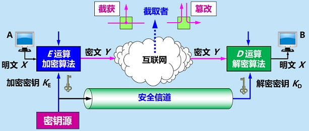
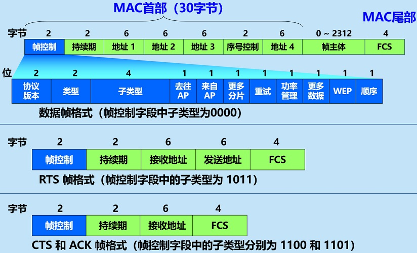

> **《计算机网络（第七版）》**
>
> ***谢希仁 编著***

[toc]

# 一、概述

目前，世界的三大网络是电信网络（电话网）、有限电视网络、计算机网络（互联网Internet）；三网融合完全有技术能力和必要，但是牵扯到太多经济利益和政权管辖的问题，至今未能统一。

计算机网络的精确定义并未统一。关于计算机网络的较好的定义是这样的[PETE11]：计算机网络主要是由一些通用的、可编程的硬件互连而成的，而这些硬件并非专门用来实现某一特定目的（例如，传送数据或视频信号）。这些可编程的硬件能够用来传送多种不同类型的数据，并能支持广泛的和日益增长的应用。*需注意的是*，上述的“可编程的硬件”表明这种硬件一定包含有中央处理机CPU。

根据这个定义，计算机网络所连接的硬件，并不限于一般的计算机，而是包括了智能手机、路由器等设备；计算机网络并非专门用来传送数据，而是能够支持很多种的应用（包括今后可能出现的各种应用）。

按照网络的作用范围进行分类：广域网WAN（Wide Area Network）、城域网MAN（Metropolitan Area Network）、局域网LAN（Local Area Network）、个人区域网PAN（Personal Area Network）。顺便指出，若中央处理机之间的距离非常近（如仅1米的数量级或甚至更小些），则一般就称之为多处理机系统而不称它为计算机网络。

## （一）互联网的组成

计算机网络（简称为网络）由若干结点（node）和连接这些结点的链路（link）组成，网络中的结点可以是计算机、集线器、交换机或路由器等，与网络相连的计算机常称为主机。网络把许多计算机连接在一起，而*互连网*（internet）则把许多网络通过路由器连接在一起，它泛指由多个计算机网络互连而成的计算机网络。而*互联网*（Internet）或因特网则是一个专用名词，它指当前全球最大的、开放的、由众多网络相互连接而成的特定互连网，它采用TCP/IP协议族作为通信的规则，且其前身是美国的ARPANET。

互联网的拓扑结构虽然非常复杂，并且在地理上覆盖了全球，但从其工作方式上看，可以划分为以下两大块：

1. 边缘部分，由所有连接在互联网上的主机组成。这部分是用户直接使用的，用来进行通信（传送数据、音频或视频）和资源共享。
2. 核心部分，由大量网络和连接这些网络的路由器组成。这部分是为边缘部分提供服务的（提供连通性和交换）。

下图给出了这两部分的示意图。


### 1. 互联网的边缘部分

处在互联网边缘的部分就是连接在互联网上的所有的主机，这些主机又称为端系统（end system）。主机A和主机B进行通信，实际上是指，主机A的某个进程和主机B上的另一个进程进行通信，简称为计算机之间通信。

在网络边缘的端系统之间的通信方式通常可划分为两大类：客户-服务器方式（C/S方式，Client/Server）和对等方式（P2P方式，Peer-to-Peer）；实际上，对等连接方式P2P从本质上看仍然是使用客户-服务器方式，只是对等连接中的每一台主机既是客户又同时是服务器。有时还可看到另外一种叫做浏览器-服务器方式（B/S方式，Browser/Server），但这仍然是C/S方式的一种特例。

### 2. 互联网的核心部分

在网络核心部分起特殊作用的是路由器（router），它是一种专用计算机（但不叫做主机），路由器是实现分组交换（packet switching）的关键构件，其任务是转发收到的分组，这是网络核心部分最重要的功能。

### 3. 电路交换与分组交换

为了弄清分组交换，下面先介绍电路交换的基本概念。从通信资源的分配角度来看，交换（switching）就是按照某种方式动态地分配传输线路的资源；这种必须经过“建立连接（占用通信资源）、通话（一直占用通信资源）、释放连接（归还通信资源）”三个步骤的交换方式称为电路交换。电路交换的一个重要特点就是在通话的全部时间内，通话的两个用户始终占用端到端的通信资源；当使用电路交换来传送计算机数据时，其线路的传输效率往往很低。

分组交换则采用存储转发技术。把要发送的整块数据称为一个报文（message），在发送报文之前，先把较长的报文划分成为一个个更小的等长数据段（如每个数据段为1024 bit），在每一个数据段前面，加上一些由必要的控制信息组成的首部（header）后，就构成了一个分组（packet）。分组又称为包，而分组的首部也可称为包头。分组是在互联网中传送的数据单元，分组中的首部包含了诸如目的地址和源地址等重要控制信息，因而每一个分组才能在互联网中独立地选择传输路径，并被正确地交付到分组传输的终点。


路由器是用来转发分组的，即进行分组交换的：路由器收到一个分组，先暂时存储一下，检查其首部，查找转发表，按照首部中的目的地址，找到合适的接口转发出去，把分组交给下一个路由器。就这样一步一步地以存储转发的方式，把分组交付最终的目的主机。


- 需要注意的是，上面的可靠并不是指的网络通信质量的可靠，而是指网络体系拥有较好的残存性，即当一些结点被干掉之后，剩余的结点仍能完成网络的基本功能。

这里归纳了三种交换方式在数据传送阶段的主要特点：

- 电路交换，整个报文的比特流连续地从源点直达终点，好像在一个管道中传送。
- 报文交换，整个报文先传送到相邻结点，全部存储下来后查找转发表，转发到下一个结点。
- 分组交换，单个分组（这只是整个报文的一部分）传送到相邻结点，存储下来后查找转发表，转发到下一个结点。


可以看出，当分组交换的每一个分组就是报文本身，即整个报文就分一个组是，分组交换退化成报文交换。

## （二）计算机网络的性能

### 1. 速率

计算机发送出的信号都是数字形式的，网络技术中的速率指的是主机（的网卡，或某个点或某个接口上）在数字信道上传送（发送和接收）数据的速率，即每秒传送多少个比特，它也称为数据率（data rate）或比特率（bit rate），单位是bit/s（或b/s，有时也写为bps，即bit per second）。

当数据率较高时，就常常在bit/s的前面加上一个字母。如，k(kilo)=10^3^=千，M(Mega)=10^6^ =兆，G(Giga)=10^9^=吉，T(Tera)=10^12^=太，P(Peta)=10^15^=拍，E(Exa)=10^18^=艾，Z(Zetta)=10^21^=泽，Y(Yotta)=10^24^=尧。

需要注意的是，当提到网络的速率时，往往指的是额定速率或标称速率，而并非网络实际上运行的速率。

另外要注意的是，在计算机领域中，数的计算使用二进制。因此，千=K=2^10^=1024，兆=M=2^20^，吉=G=2^30^，太=T=2^40^，拍=P=2^50^，艾=E=2^60^，泽=Z=2^70^，尧=Y=2^80^。此外，计算机中的数据量往往用字节B作为度量的单位，通常一个字节代表8个比特。在计算机领域中，所有的这些单位都使用大写字母，但在通信领域中，只有1000使用小写k，其余的也都用大写；请注意，也有的书不这样严格区分，大写K既可表示1000，又可表示1024，因此这时要特别小心，不要弄错。

### 2. 带宽

带宽本来是指某个信号具有的频带宽度，即该信号所包含的各种不同频率成分所占据的频率范围，这种意义的带宽的单位是赫，它表示某信道允许通过的信号频带范围。而在计算机网络中，带宽（bandwidth）表示在单位时间内网络中的某信道所能通过的“最高数据率”，它表示网络中某通道传送数据的能力，单位就是数据率的单位bit/s。

在“带宽”的上述两种表述中，前者为频域称谓，而后者为时域称谓，其本质是相同的。也就是说，一条通信链路的“带宽”越宽，其所能传输的“最高数据率”也越高。

### 3. 吞吐量

吞吐量（throughput）表示在单位时间内通过某个网络（或信道、接口）的实际的数据量；有时吞吐量还可用每秒传送的字节数或帧数来表示。显然，吞吐量受网络的带宽或网络的额定速率的限制，除此之外，还收如网络拥塞、流量控制等因素的影响。

### 4. 时延

时延（delay或latency）是指数据（一个报文或分组，甚至比特）从网络（或链路）的一端传送到另一端所需的时间，有时也称为延迟或迟延。需要注意的是，网络中的时延是由以下几个不同的部分组成的。

**发送时延**（transmission delay）是主机或路由器发送数据帧所需要的时间，也就是从发送数据帧的第一个比特算起，到该帧的最后一个比特发送完毕所需的时间，因此发送时延也叫做传输时延（尽量不采用传输时延这个名词，因为它很容易和传播时延弄混）。发送时延的计算公式是：
$$
发送时延=\cfrac{数据帧长度(bits)}{发送速率(bit/s)}
$$
由此可见，对于一定的网络，发送时延并非固定不变，而是与发送的帧长（单位是比特）成正比，与发送速率成反比。

**传播时延**（propagation delay）是电磁波在信道中传播一定的距离需要花费的时间。传播时延的计算公式是：
$$
传播时延=\cfrac{信道长度(m)}{电磁波在信道上的传播速率(m/s)}
$$
电磁波在自由空间的传播速率是光速，即3.0x10^5^km/s，电磁波在网络传输媒体中，如在铜线电缆中的传播速率约为2.3x10^5^km/s，在光纤中的传播速率约为2.0x10^5^km/s。

发送时延发生在机器内部的发送器中（一般就是发生在网络适配器中），与传输信道的长度（或信号传送的距离）没有任何关系；但传播时延则发生在机器外部的传输信道媒体上，而与信号的发送速率无关。

**处理时延**。主机或路由器在收到分组时要花费一定的时间进行处理，例如分析分组的首部、从分组中提取数据部分、进行差错检验或查找适当的路由等，这就产生了处理时延。

**排队时延**。分组在经过网络传输时，要经过许多路由器；但分组在进入路由器后要先在输入队列中排队等待处理，在路由器确定了转发接口后，还要在输出队列中排队等待转发，这就产生了排队时延。排队时延的长短往往取决于网络当时的通信量，当网络的通信量很大时会发生队列溢出，使分组丢失，这相当于排队时延为无穷大。

这样，数据在网络中经历的总时延就是以上四种时延之和，即总时延=发送时延+传播时延+处理时延+排队时延。不能笼统地认为“数据的发送速率越高，其传送的总时延就越小”。

对于高速网络链路，提高的仅仅是数据的发送速率而不是比特在链路上的传播速率，提高数据的发送速率只是减小了数据的发送时延。

### 5. 时延带宽积

把传播时延和带宽相乘，就得传播时延带宽积，即时延带宽积=传播时延×带宽。

若用一个管道来表示，管道的长度是链路的传播时延（现在以时间作为单位来表示链路长度），而管道的截面积是链路的带宽，时延带宽积就表示这个管道的体积，表示这样的链路可容纳多少个比特。

若发送端连续发送数据，则在发送的第一个比特即将达到终点时，发送端就已经发送了A个比特，而这A个比特都正在链路上向前移动。因此，链路的时延带宽积又称为以比特为单位的链路长度。

对于一条正在传送数据的链路，只有在代表链路的管道都充满比特时，链路才得到充分的利用。

### 6. 往返时间RTT

往返时间RTT（Round-Trip Time）指双向交互一次所需的时间；在许多情况下，互联网上的信息传输是双向交互的。在互联网中，往返时间除传播时延外还包括各中间结点的处理时延、排队时延以及转发数据时的发送时延。

### 7. 利用率

利用率有信道利用率和网络利用率两种。信道利用率指出某信道有百分之几的时间是被利用的（有数据通过），完全空闲的信道的利用率是零；网络利用率则是全网络的信道利用率的加权平均值。

信道利用率并非越高越好，因为排队论的理论，当某信道的利用率增大时，该信道引起的时延也就迅速增加。特别值得注意的就是，当网络的利用率接近最大值1时，网络的时延就趋于无穷大。信道或网络的利用率过高会产生非常大的时延。

## （三）计算机网络体系结构

### 1. 协议与划分层次

为进行网络中的数据交换而建立的规则、标准或约定称为网络协议（network protocol），网络协议也可简称为协议。更进一步讲，网络协议主要由以下三个要素组成：

- 语法，即数据与控制信息的结构或格式。
- 语义，即需要发出何种控制信息，完成何种动作以及做出何种响应。每种数据与控制信息的格式代表什么含义。
- 同步，即事件实现顺序的详细说明。这里的同步是广义的，即在一定条件下应当发生什么事件，因而同步含有时序的意思。

对于非常复杂的计算机网络协议，其结构应该是层次式的。通常各层所要完成的功能主要有以下一些（可以只包括一种，也可以包括多种）：

- 差错控制，使相应层次对等方的通信更加可靠。
- 流量控制，发送端的发送速率必须使接收端来得及接收，不要太快。
- 分段和重装，发送端将要发送的数据块划分为更小的单位，在接收端将其还原。
- 复用和分用，发送端几个高层会话复用一条低层的连接，在接收端再进行分用。
- 连接建立和释放，交换数据前先建立一条逻辑连接，数据传送结束后释放连接。

计算机网络的各层及其协议的集合就是网络的体系结构（architecture）。换种说法，计算机网络的体系结构就是这个计算机网络及其构件所应完成的功能的精确定义[GREE82]。

### 2. 具有五层协议的体系结构

OSI的七层协议体系结构的概念清楚，理论也较完整，但它既复杂又不实用。TCP/IP体系结构得到了非常广泛的应用，是一个四层的体系结构，但因为最下面的网络接口层并没有什么具体内容。因此在学习计算机网络的原理时往往采取折中的办法，即综合OSI和TCP/IP的优点，采用一种只有五层协议的体系结构，这样既简洁又能将概念阐述清楚。


应用层（application layer）的任务是通过应用进程间的交互来完成特定网络应用，应用层协议定义的是应用进程间通信和交互的规则。把应用层交互的数据单元称为报文（message）。

运输层（transport layer）的任务就是负责向两台主机中进程之间的通信提供通用的数据传输服务。运输层主要使用以下两种协议：

- 传输控制协议TCP（Transmission Control Protocol），提供面向连接的、可靠的数据传输服务，其数据传输的单位是报文段（segment）。
- 用户数据报协议UDP（User Datagram Protocol），提供无连接的、尽最大努力（best-effort）的数据传输服务（不保证数据传输的可靠性），其数据传输的单位是用户数据报。

网络层（network layer）把运输层产生的报文段或用户数据报封装成分组或包进行传送（选择合适的路由）；在TCP/IP体系中，由于网络层使用IP协议，因此分组也叫做IP数据报，或简称为数据报。

数据链路层（data link layer）常简称为链路层，它将网络层交下来的IP数据报组装成帧（framing），在两个相邻结点间的链路上传送帧（frame），每一帧包括数据和必要的控制信息（如同步信息、地址信息、差错控制等）。

物理层（physical layer）在物理层上所传数据的单位是比特，它考虑用多大的电压代表1或0，以及接收方如何识别出发送方所发送的比特。还要确定连接电缆的插头应当有多少根引脚以及各引脚应如何连接。


OSI参考模型把对等层次之间传送的数据单位称为该层的协议数据单元PDU（Protocol Data Unit）。任何两个同样的层次之间，也好像如同上图中的水平虚线所示的那样，把数据（即数据单元加上控制信息）通过水平虚线直接传递给对方，这就是所谓的对等层（peer layers）之间的通信。所要讨论的各层协议，实际上就是在各个对等层之间传递数据时的各项规定。

在文献中也还可以见到术语协议栈（protocol stack），这是因为几个层次画在一起很像一个栈（stack）的结构。

### 3. 实体、协议、服务和服务访问点

当研究开放系统中的信息交换时，往往使用实体（entity）这一较为抽象的名词表示任何可发送或接收信息的硬件或软件进程。

协议是控制两个对等实体（或多个实体）进行通信的规则的集合。在协议的控制下，两个对等实体间的通信使得本层能够向上一层提供服务；要实现本层协议，还需要使用下面一层所提供的服务。协议的实现保证了能够向上一层提供服务；使用本层服务的实体只能看见服务而无法看见下面的协议，即下面的协议对上面的实体是透明的。

协议是水平的，服务是垂直的，上层使用下层所提供的服务必须通过与下层交换一些命令，这些命令在OSI中称为服务原语。在同一系统中相邻两层的实体进行交互（即交换信息）的地方，通常称为服务访问点SAP（Service Access Point）。

OSI把层与层之间交换的数据的单位称为服务数据单元SDU（Service Data Unit），它可以与PDU不一样。例如，可以是多个SDU合成为一个PDU，也可以是一个SDU划分为几个PDU。

这样，在任何相邻两层之间的关系可概括为下图所示的那样。


计算机网络的协议还有一个很重要的特点，就是协议必须把所有不利的条件事先都估计到，而不能假定一切都是正常的和非常理想的。

### 4. TCP/IP的体系结构

应用层和网络接口层都有多种协议，而中间的IP层很小，上层的各种协议都向下汇聚到一个IP协议中。这种很像沙漏计时器形状的TCP/IP协议族表明：TCP/IP协议可以为各式各样的应用提供服务（所谓的everything over IP），同时TCP/IP协议也允许IP协议在各式各样的网络构成的互联网上运行（所谓的IP over everything）。这也是目前使用的协议。


# 二、物理层

物理层考虑的是怎样才能在连接各种计算机的传输媒体上传输数据比特流，而不是指具体的传输媒体。用于物理层的协议也常称为物理层规程（procedure）。物理层下面的传输媒体可分为两大类，即导引型传输媒体（有线）如双绞线、同轴电缆、光纤；非导引型传输媒体（无线）如地面微波、卫星。

可以将物理层的主要任务描述为确定与传输媒体的接口有关的一些特性，即：

- 机械特性，指明接口所用接线器的形状和尺寸、引脚数目和排列、固定和锁定装置等。
- 电气特性，指明在接口电缆的各条线上出现的电压的范围。
- 功能特性，指明某条线上出现的某一电平的电压的意义。
- 过程特性，指明对于不同功能的各种可能事件的出现顺序。

数据在通信线路（传输媒体）上的传输方式一般都是串行传输（出于经济上的考虑），即逐个比特按照时间顺序传输，因此物理层还要完成传输方式的转换。另外需要注意的是，在发送数据时，是按照字节的顺序发送，且在每个字节中的发送顺序都是从低位到高位，即先发送该字节的最低位，最后发送该字节的最高位。

## （一）数据通信的基础知识

### 1. 数据通信系统的模型

一个数据通信系统可划分为三大部分，即源系统（或发送端、发送方），传输系统（或传输网络）和目的系统（或接收端、接收方）。


数字信号，在使用时间域（或简称为时域）的波形表示数字信号时，代表不同离散数值的基本波形就称为码元，一个码元所携带的信息量是不固定的，而是由调制方式和编码方式决定的。在使用二进制编码时，只有两种不同的码元，一种代表0状态而另一种代表1状态。

### 2. 有关信道的几个基本概念

信道（channel）一般都是用来表示向某一个方向传送信息的媒体，一条通信电路往往包含一条发送信道和一条接收信道。从通信的双方信息交互的方式来看，可以有以下三种基本方式：

- 单向通信，又称为单工通信，即只能有一个方向的通信而没有反方向的交互。
- 双向交替通信，又称为半双工通信（或单工），即通信的双方都可以发送信息，但不能双方同时发送和同时接收。这种通信方式是一方发送另一方接收，过一段时间后可以再反过来。
- 双向同时通信，又称为全双工通信，即通信的双方可以同时发送和接收信息。

单向通信只需要一条信道，而双向交替通信或双向同时通信则都需要两条信道（每个方向各一条）。显然，双向同时通信的传输效率最高。

来自信源的信号常称为基带信号（即基本频带信号），它往往包含有较多的低频成分，甚至有直流成分，而许多信道并不能传输这种低频分量或直流分量。为了解决这一问题，就必须对基带信号进行调制（modulation），调制可分为两大类。

一类是仅仅对基带信号的波形进行变换，使它能够与信道特性相适应，变换后的信号仍然是基带信号。这类调制称为基带调制，它是把数字信号转换为另一种形式的数字信号，这种过程也称为编码（coding）。常用编码方式如下图所示。


- 不归零制，正电平代表1，负电平代表0。
- 归零制，正脉冲代表1，负脉冲代表0。
- 曼彻斯特编码，位周期中心的向上跳变代表0，位周期中心的向下跳变代表1，但也可反过来定义。
- 差分曼彻斯特编码，在每一位的中心处始终都有跳变，位开始边界有跳变代表0，而位开始边界没有跳变代表1。

从信号波形中可以看出，曼彻斯特（Manchester）编码产生的信号频率比不归零制高；从自同步能力来看，不归零制不能从信号波形本身中提取信号时钟频率（这叫做没有自同步能力），而曼彻斯特编码具有自同步能力。

另一类调制使用载波（carrier）进行调制，把基带信号的频率范围搬移到较高的频段，并转换为模拟信号，这样就能够更好地在模拟信道中传输。载波调制后的信号称为带通信号（即仅在一段频率范围内能够通过信道），而使用载波的调制称为带通调制。基本的带通调制方法如下图所示。


- 调幅（AM），即载波的振幅随基带数字信号而变化。
- 调频（FM），即载波的频率随基带数字信号而变化。
- 调相（PM），即载波的初始相位随基带数字信号而变化。

为了达到更高的信息传输速率，必须采用技术上更为复杂的多元制的振幅相位混合调制方法。例如正交振幅调制QAM（Quadrature Amplitude Modulation）。

### 3. 信道的极限容量

信号在信道上传输时会不可避免地产生失真。从概念上讲，限制码元在信道上的传输速率的因素有以下两个。

信道能够通过的频率范围。在任何信道中，码元传输的速率是有上限的，传输速率超过此上限，就会出现严重的码间串扰的问题，使接收端对码元的判决（即识别）成为不可能。如果信道的频带越宽，也就是能够通过的信号高频分量越多，那么就可以用更高的速率传送码元而不出现码间串扰。

信噪比。就是信号的平均功率和噪声的平均功率之比，常记为S/N，并用分贝（dB）作为度量单位。信噪比(dB)=10 log~10~(S/N)(dB)。香农公式指出，信道的极限信息传输速率是C=W log~2~(1+S/N) (bit/s)。上式中，W为信道的带宽（以Hz为单位），S为信道内所传信号的平均功率，N为信道内部的高斯噪声功率。香农公式表明，信道的带宽或信道中的信噪比越大，信息的极限传输速率就越高。

## （二）信道复用技术

共享信道技术包括静态划分信道、动态媒体接入控制两种技术方法。静态划分信道即频分复用、时分复用、波分复用、码分复用等技术；动态媒体接入控制分为两种，随机接入如局域网中的以太网，它需要CSMA/CD协议，来进行碰撞检测；而受控接入如局域网中的令牌环网，它同一时刻只有一个站使用信道，故不需要考虑碰撞问题。

### 1. 频分复用、时分复用和统计时分复用

复用（multiplexing）是通信技术中的基本概念，在计算机网络中的信道广泛地使用各种复用技术。


频分复用FDM（Frequency Division Multiplexing）最简单，用户在分配到一定的频带后，在通信过程中自始至终都占用这个频带。可见频分复用的所有用户在同样的时间占用不同的带宽资源（请注意，这里的“带宽”是频率带宽而不是数据的发送速率）。


而时分复用TDM（Time Division Multiplexing）则是将时间划分为一段段等长的时分复用帧（TDM帧），每一个用户所占用的时隙周期性地出现（其周期就是TDM帧的长度）。可以看出，时分复用的所有用户是在不同的时间占用同样的频带宽度。


这两种复用方法的优点是技术比较成熟，但缺点是不够灵活，时分复用则更有利于数字信号的传输。

统计时分复用STDM（Statistic TDM）是一种改进的时分复用，集中器（concentrator）常使用这种统计时分复用。统计时分复用使用STDM帧来传送复用的数据，每一个STDM帧中的时隙数小于连接在集中器上的用户数，各用户有了数据就随时发往集中器的输入缓存，然后集中器按顺序依次扫描输入缓存，把缓存中的输入数据放入STDM帧中；对没有数据的缓存就跳过去。当一个帧的数据放满了，就发送出去。


因此，STDM帧不是固定分配时隙，而是按需动态地分配时隙；因此统计复用又称为异步时分复用，而普通的时分复用称为同步时分复用。

### 2. 波分复用

波分复用WDM（Wavelength Division Multiplexing）就是光的频分复用，用波长而不用频率来表示所使用的光载波。

### 3. 码分复用

码分复用CDM（Code Division Multiplexing）是另一种共享信道的方法。实际上，更常用的名词是码分多址CDMA（Code Division Multiple Access）。

在CDMA中，每一个比特时间再划分为m个短的间隔，称为码片（chip），通常m的值是64或128，使用CDMA的每一个站被指派一个唯一的m bit码片序列（chipsequence），在实用的系统中是使用伪随机码序列。

一个站如果要发送比特1，则发送它自己的m bit码片序列；如果要发送比特0，则发送该码片序列的二进制反码。若S站要发送信息的数据率为b bit/s，由于每一个比特要转换成m个比特的码片，因此S站实际上发送的数据率提高到mb bit/s，同时S站所占用的频带宽度也提高到原来数值的m倍；这种通信方式是扩频（spreadspectrum）通信中的一种。

CDMA系统的给每一个站分配的码片序列还必须互相正交（orthogonal），用数学公式可以很清楚地表示码片序列的这种正交关系，令向量S表示站S的码片向量，再令T表示其他任何站的码片向量，两个不同站的码片序列正交，就是向量S和T的规格化内积（inner product）都是0：

$$
\bold{B}\cdot\bold{T}\equiv\cfrac{1}{m}\sum_{i=1}^mS_iT_i=0
$$

现假定有一个X站要接收S站发送的数据，X站就必须知道S站所特有的码片序列。X站使用它得到的码片向量S与接收到的未知信号进行求内积的运算，X站接收到的信号是各个站发送的码片序列之和，求内积得到的结果是，所有其他站的信号都被过滤掉（其内积的相关项都是0），而只剩下S站发送的信号。也就是说，这样每个站都能同时发送数据，而信道上即使所有站的数据都混在一起，在接收方还是会有方法将要接收的数据正确的识别出来。

## （三）有线宽带接入技术

由于无线宽带接入技术比较复杂，将在之后第九章介绍，下面讨论的都是有线宽带接入技术。

非对称数字用户线ADSL（Asymmetric Digital Subscriber Line）技术是用数字技术对现有的模拟电话用户线进行改造，使它能够承载宽带数字业务。

光纤同轴混合网（Hybrid Fiber Coax，HFC网）是在目前覆盖范围面很广的有线电视网的基础上开发的一种居民宽带接入网，除可传送电视节目外，还能提供电话、数据和其他宽带交互型业务。

多种宽带光纤接入方式（Fiber To The x，FTTx），包括光纤到户FTTH（Home）、光纤到路边FTTC（Curb）、光纤到小区FTTZ（Zone）、光纤到楼FTTB（Building）、光纤到楼层FTTF（Floor）、光纤到办公室FTTO（Office）、光纤到桌面FTTD（Desktop）等。

# 三、数据链路层

数据链路层使用的信道主要有点对点信道、广播信道两种。这里研究的是在同一个局域网中，分组怎样从一台主机传送到另一台主机，但并不经过路由器转发；从整个互联网来看，局域网仍属于数据链路层的范围。

数据链路层的三个基本问题是：封装成帧、透明传输、差错检测。

## （一）使用点对点信道的数据链路层

### 1. 数据链路和帧

链路（link）是从一个结点到相邻结点的一段物理线路（有线或无线），而中间没有任何其他的交换结点（不包括集线器，而且严格的说，集线器并不是“交换”结点）。

数据链路（data link），除物理线路外，还需要一些必要的通信协议来控制数据的传输，把实现这些协议的硬件和软件加到链路上，就构成了数据链路。现在最常用的方法是使用网络适配器（即网卡，它既有硬件，也包括软件）来实现这些协议；一般的适配器都包括了数据链路层和物理层这两层的功能。

点对点信道的数据链路层的协议数据单元是帧（frame），数据链路层把网络层交下来的数据构成帧发送到链路上，以及把接收到的帧中的数据取出并上交给网络层。在互联网中，网络层协议数据单元就是IP数据报（或简称为数据报、分组或包）。

### 2. 三个基本问题

这三个基本问题是：封装成帧、透明传输、差错检测。

#### (1) 封装成帧

封装成帧（framing）就是在一段数据的前后分别添加首部和尾部，这样就构成了一个帧；首部和尾部的一个重要作用就是进行帧定界（即确定帧的界限）。

需要注意的是，每一种链路层协议都规定了所能传送的帧的数据部分长度上限——最大传送单元MTU（Maximum Transfer Unit）。目前MTU的默认值是1500字节。


当数据是由可打印的ASCII码组成的文本文件时，帧定界可以使用特殊的帧定界符（ASCII编码）。控制字符SOH（Start Of Header，编码为0x01）放在一帧的最前面，表示帧的首部开始；另一个控制字符EOT（End Of Transmission，编码为0x04）表示帧的结束。

#### (2) 透明传输

显然，所传输的数据中的任何8比特的组合一定不允许和用作帧定界的控制字符的比特编码一样，否则就会出现帧定界的错误。数据链路层的透明传输表示无论什么样的比特组合的数据，都能够按照原样没有差错地通过这个数据链路层。

具体的方法是，发送端的数据链路层在数据中出现控制字符SOH或EOT的前面插入一个转义字符ESC（编码是0x1B），若转义字符也出现在数据当中，则在转义字符的前面也插入一个转义字符；而在接收端的数据链路层在把数据送往网络层之前删除这个插入的转义字符。这种方法称为字节填充（byte stuffing）或字符填充（character stuffing）。

除此之外还有零比特填充的方式，见下面的3.2.1.3。

#### (3) 差错检测

实际中比特在传输过程中可能会产生差错，1可能会变成0，而0也可能变成1，这就叫做比特差错。在一段时间内，传输错误的比特占所传输比特总数的比率称为误码率BER（Bit Error Rate）。

目前在数据链路层广泛使用了循环冗余检验CRC（Cyclic Redundancy Check）的检错技术。

在发送端，假定每组k个比特，待传送的数据为M。CRC运算就是在数据M的后面添加供差错检测用的n位冗余码，这n位冗余码可用以下方法得出：用二进制的模2运算进行2^n^乘M的运算，这相当于先在M后面添加n个0，得到的k+n位的数除以收发双方事先商定的长度为n+1位的除数P，得出商是Q而余数是R（n位，比P少一位）；这个余数R就作为冗余码拼接在数据M的后面发送出去。

这种为了进行检错而添加的冗余码常称为帧检验序列FCS（Frame Check Sequence）。

在接收端把接收到的数据以帧为单位进行CRC检验：把收到的每一个帧都除以同样的除数P（模2运算），然后检查得到的余数R，如果在传输过程中无差错，那么经过CRC检验后得出的余数R肯定是0。

在数据链路层若仅仅使用循环冗余检验CRC差错检测技术，则只能做到对帧的无差错接受；接收端丢弃的帧虽然曾收到了，但最终还是因为有差错被丢弃，即没有被接受。即凡是接收端数据链路层接受的帧均无差错。

## （二）点对点协议PPP

对于点对点的链路，点对点协议PPP（Point-to-Point Protocol）则是目前使用得最广泛的数据链路层协议。PPP协议有三个组成部分：一个将IP数据报封装到串行链路的方法、一个用来建立、配置和测试数据链路连接的链路控制协议LCP（Link Control Protocol）、一套网络控制协议NCP（Network Control Protocol）。

### 1. PPP协议的帧格式

#### (1) 各字段的意义

PPP的帧格式如下图所示，PPP帧的首部和尾部分别为四个字段和两个字段。


首部的第一个字段和尾部的第二个字段都是标志字段F（Flag），规定为0x7E，它表示一个帧的开始或结束，因此标志字段就是PPP帧的定界符。连续两帧之间只需要用一个标志字段，如果出现连续两个标志字段，就表示这是一个空帧，应当丢弃。

首部中的地址字段A规定为OxFF，控制字段C规定为0x03，作为保留位至今没有定义。

首部的第四个字段是2字节的协议字段。当协议字段为0x0021时，PPP帧的信息字段就是IP数据报；若为0xC021，则信息字段是PPP链路控制协议LCP的数据；若是0x8021表示这是网络层的控制数据。

信息字段的长度是可变的，不超过1500字节。

尾部中的第一个字段（2字节）是使用CRC的帧检验序列FCS。

#### (2) 字节填充

当信息字段中出现和标志字段（0x7E）一样的比特组合时，就必须采取一些措施使这种形式上和标志字段一样的比特组合不出现在信息字段中。当PPP使用异步传输时，它把转义符定义为0x7D（即01111101），并使用字节填充，规定如下所述的填充方法：

- 把信息字段中出现的每一个0x7E字节转变成为2字节序列(0x7D,0x5E)。
- 若信息字段中出现一个0x7D的字节（即出现了和转义字符一样的比特组合），则把0x7D转变成为2字节序列(0x7D,0x5D)。
- 若信息字段中出现ASCII码的控制字符（即数值小于0x20的字符），则在该字符前面要加入一个0x7D字节，同时将该字符的编码加以改变。例如出现0x03，就把它转变为2字节序列(0x7D,0x23)。

#### (3) 零比特填充

PPP协议用在SONET/SDH链路时，使用同步传输（一连串的比特连续传送）而不是异步传输（逐个字符地传送），此时采用零比特填充方法来实现透明传输。

具体做法是：在发送端，先扫描整个信息字段，只要发现有5个连续1，则立即填入一个0，这可以保证在信息字段中不会出现6个连续1（不会出现0x7E）；接收端在收到一个帧时，先找到标志字段F以确定一个帧的边界，接着再用硬件对其中的比特流进行扫描，每当发现5个连续1时，就把这5个连续1后的一个0删除，以还原成原来的信息比特流。

### 2. PPP协议的工作状态

当用户拨号接入ISP后，就建立了一条从用户个人电脑到ISP的物理连接。这时，用户个人电脑向ISP发送一系列的链路控制协议LCP分组（封装成多个PPP帧），以便建立LCP连接。接着还要进行网络层配置，网络控制协议NCP给新接入的用户个人电脑分配一个临时的IP地址；这样，用户个人电脑就成为互联网上的一个有IP地址的主机了。当用户通信完毕时，NCP释放网络层连接，收回原来分配出去的IP地址。接着，LCP释放数据链路层连接。最后释放的是物理层的连接。


PPP链路的起始和终止状态永远是图中的“链路静止”（Link Dead）状态，这时在用户个人电脑和ISP的路由器之间并不存在物理层的连接。当用户个人电脑通过调制解调器呼叫路由器时，路由器就能够检测到调制解调器发出的载波信号。

在双方建立了物理层连接后，PPP就进入“链路建立”（Link Establish）状态，其目的是建立链路层的LCP连接，开始发送LCP的配置请求帧（Configure-Request），这是个PPP帧，其协议字段置为LCP对应的代码，而信息字段包含特定的配置请求。链路的另一端可以发送以下几种响应中的一种：配置确认帧（Configure-Ack）、配置否认帧（Configure-Nak）、配置拒绝帧（Configure-Reject）。LCP配置选项包括链路上的最大帧长、所使用的鉴别协议（authentication protocol）的规约；而且不使用PPP帧中的地址和控制字段，因为这两个字段的值是固定的，没有任何信息量，可以在PPP帧的首部中省略这两个字节。

协商结束后双方就建立了LCP链路，接着就进入“鉴别”（Authenticate）状态。在这一状态，只允许传送LCP协议的分组、鉴别协议的分组以及监测链路质量的分组。若鉴别成功，则进入“网络层协议”（Network-Layer Protocol）状态。

在“网络层协议”状态，PPP链路的两端的网络控制协议NCP根据网络层的不同协议互相交换网络层特定的网络控制分组。

当网络层配置完毕后，链路就进入可进行数据通信的“链路打开”（Link Open）状态。链路的两个PPP端点可以彼此向对方发送分组。

数据传输结束后，可以由链路的一端发出终止请求LCP分组（Terminate-Request）请求终止链路连接，在收到对方发来的终止确认LCP分组（Terminate-Ack）后，转到“链路终止”状态。

由此可见，PPP协议已不是纯粹的数据链路层的协议，它还包含了物理层和网络层的内容。

## （三）使用广播信道的数据链路层

广播信道可以进行一对多的通信。

### 1. 局域网的数据链路层

局域网可按网络拓扑进行分类，如星形网、环形网（如令牌环网）、总线网（如以太网）等。

必须指出，局域网工作的层次跨越了数据链路层和物理层。共享信道着重考虑如何使众多用户能够共享通信资源，即信道资源分配问题，这在技术上有两种方法：

- 静态划分信道，如已经介绍过的频分复用、时分复用、波分复用和码分复用等。这种划分信道的方法代价较高，不适局域网。
- 动态媒体接入控制，又称为多点接入（multiple access），信道并非在用户通信时固定分配给用户，其又分为两类：
  - 随机接入，所有的用户可随机地发送信息，但若恰巧两个或更多的用户在同一时刻发送信息，那么在共享媒体上就要产生碰撞（即发生了冲突），使得这些用户的发送都失败。因此，必须有解决碰撞的网络协议。
  - 受控接入，用户不能随机地发送信息而必须服从一定的控制。典型代表有分散控制的令牌环局域网和集中控制的多点线路探询（polling，或称为轮询）。

这里重点讨论随机接入的以太网，现在以太网几乎成为了局域网的同义词。

#### (1) 以太网的标准

为了使数据链路层能更好地适应多种局域网标准，IEEE 802委员会就把局域网的数据链路层拆成两个子层，即逻辑链路控制LLC（Logical Link Control）子层和媒体接入控制MAC（Medium Access Control）子层。与接入到传输媒体有关的内容都放在MAC子层，而LLC子层则与传输媒体无关，不管采用何种传输媒体和MAC子层的局域网对LLC子层来说都是透明的，如下图所示。


由于互联网发展很快，而TCP/IP体系经常使用的局域网只剩下DIX Ethernet V2（由DEC、英特尔、施乐公司提出）而不是IEEE 802.3标准中的局域网，因此现在IEEE 802委员会制定的逻辑链路控制子层LLC的作用已经消失了，很多厂商生产的适配器上就仅装有MAC协议而没有LLC协议。

除此之外，IEEE 802委员会还制定了几个不同的局域网标准，如802.4令牌总线网、802.5令牌环网等。

#### (2) 通信适配器的作用

计算机与外界局域网的连接是通过通信适配器（adapter）进行的。适配器本来是在主机箱内插入的一块网络接口板，又称为网络接口卡NIC（Network Interface Card）或简称为网卡，现在计算机主板上都已经嵌入了这种适配器。

这种通信适配器上面装有处理器和存储器（包括RAM和ROM），适配器和局域网之间的通信是通过电缆或双绞线以串行传输方式进行的，而适配器和计算机之间的通信则是通过计算机主板上的I/O总线以并行传输方式进行的；因此，适配器的一个重要功能就是要进行数据串行传输和并行传输的转换。由于网络上的数据率和计算机总线上的数据率并不相同，因此在适配器中必须装有对数据进行缓存的存储芯片。在主板上插入适配器时，还必须把管理该适配器的设备驱动程序安装在计算机的操作系统中。适配器还要能够实现以太网协议。

显然，适配器所实现的功能包含了数据链路层及物理层这两个层次的功能；现在的芯片的集成度都很高，以致很难把一个适配器的功能严格按照层次的关系精确划分开。

特别注意，计算机的硬件地址就在适配器的ROM中，而计算机的软件地址，即IP地址，则在计算机的存储器中。


### 2. CSMA/CD协议

最早的以太网是将许多计算机都连接到一根总线上，当一台计算机发送数据时，总线上的所有计算机都能检测到这个数据，这种就是广播通信方式。

但为了在总线上实现一对一的通信，可以使每一台计算机的适配器拥有一个与其他适配器都不同的地址，在发送数据帧时，在帧的首部写明接收站的地址。接收端仅当数据帧中的目的地址与适配器ROM中存放的硬件地址一致时，该适配器才能接收这个数据帧；不是发送给自己的数据帧就丢弃。

常把局域网上的计算机称为“主机”、“工作站”、“站点”、“站”，这里将这几个名词都当成是同义词。

为了通信的简便，以太网采取了两种措施：

第一，采用无连接的工作方式，即不必先建立连接就可以直接发送数据。适配器对发送的数据帧不进行编号，也不要求对方发回确认。当目的站收到有差错的数据帧时，就把帧丢弃，其他什么也不做；对有差错帧是否需要重传则由高层来决定。

我们知道，总线上只要有一台计算机在发送数据，总线的传输资源就被占用，在同一时间只能允许一台计算机发送数据，否则各计算机之间就会互相干扰，使得所发送数据被破坏。以太网采用CSMA/CD协议，即载波监听多点接入/碰撞检测（Carrier Sense Multiple Access with Collision Detection）：即如果你听见有人在发言，那么你就必须等别人讲完了才能发言（否则就干扰了别人的发言）；但有时碰巧两个或更多的人同时发言了，那么一旦发现冲突，大家都必须立即停止发言，等听到没有人发言了你再发言。

第二，以太网发送的数据都使用曼彻斯特（Manchester）编码的信号，它能携带同步信号；缺点是它所占的频带宽度比原始的基带信号增加了一倍，因为每秒传送的码元数加倍了。

在使用CSMA/CD协议时，一个站不可能同时进行发送和接收（但必须边发送边监听信道），因此使用CSMA/CD协议的以太网不可能进行全双工通信而只能进行双向交替通信（半双工通信）。

下面介绍CSMA/CD协议的要点。

#### (1) 载波监听和碰撞检测

“多点接入”就是说明这是总线型网络。协议的实质是“载波监听”和“碰撞检测”。

“载波监听”就是用电子技术检测总线上有没有其他计算机也在发送，不管在发送前，还是在发送中，每个站都必须不停地检测信道，必须要等到信道为空闲时才能发送。只有在以太网的媒体完全进入空闲状态后，才能允许上面的站发送数据。

在发送中检测信道，是为了及时发现有没有其他站的发送和本站发送的碰撞，这就称为“碰撞检测”，也就是“边发送边监听”，即适配器边发送数据边检测信道上的信号电压的变化情况，以便判断自己在发送数据时其他站是否也在发送数据。当几个站同时在总线上发送数据时，总线上的信号电压变化幅度将会增大（互相叠加），当变化幅度超过一定的门限值时，就认为总线上至少有两个站同时在发送数据，表明产生了碰撞。所谓“碰撞”就是发生了冲突，因此“碰撞检测”也称为“冲突检测”。

任何一个正在发送数据的站，一旦发现总线上出现了碰撞（信号失真），其适配器就要立即停止发送，免得继续进行无效的发送，白白浪费网络资源，然后等待一段随机时间后再次发送。

以太网还规定了最小帧间间隔（Inter Frame Space）为9.6μs，这样做是为了使刚刚收到数据帧的站的接收缓存来得及清理，做好接收下一帧的准备；对于10Mbit/s的网络来说，这个相当于96比特时间。1比特时间就是发送1比特所需的时间，这种时间单位与数据率密切相关。

#### (2) 传播时延与争用期

一个站在发送数据之前已经监听到信道为“空闲”，但因为电磁波在总线上总是以有限的速率传播的，所以会出现碰撞。电磁波在1km电缆的传播时延约为5μs（这个数字应当记住）。

在局域网的分析中，常把总线上的单程端到端传播时延记为τ。若有两个站A和B相距1km，A发送数据后，检测到发生碰撞的时间，最迟是两倍的总线端到端的传播时延（2τ），或总线的端到端往返传播时延。如下图所示。


每一个站在自己发送数据之后的一小段时间内，存在着遭遇碰撞的可能性，这一小段时间取决于另一个发送数据的站到本站的距离。从上图可看出，最先发送数据帧的站，在发送数据帧后至多经过时间2τ就可知道所发送的数据帧是否遭受了碰撞，即δ趋于0的情况。

因此以太网的端到端往返时间2τ称为争用期（contention period），又叫碰撞窗口（collision window），这是因为一个站在发送完数据后，只有通过争用期的“考验”，即经过争用期这段时间还没有检测到碰撞，才能肯定这次发送不会发生碰撞，这时就可以放心把这一帧数据顺利发送完毕。

前面提到过，信号在以太网上传播1km大约需要5μs，若取单程端到端传播时τ=25.6μs，这相当于以太网的最大端到端长度约为5km，实际上的以太网覆盖范围远远没有这样大。故由此决定的争用期2τ=**51.2μs**。

#### (3) 强化碰撞

通常来说，当发送数据的站一旦发现发生了碰撞时，除了立即停止发送数据外，还要再继续发送32比特或48比特的人为干扰信号（jamming signal），以便让所有用户都知道现在已经发生了碰撞。对于10Mbit/s以太网，发送32（或48）比特只需要3.2（或4.8）μs。


从上图可以看出，A站从发送数据开始到发现碰撞并停止发送的时间间隔是T~B~，A站得知碰撞已经发生时所发送的强化碰撞的干扰信号的持续时间是T~J~，且B站在得知发生碰撞后，也要发送人为干扰信号（为简单起见，图中没有画出，这对A站没影响）。发生碰撞使A浪费时间T~B~+T~J~，除此之外整个信道被占用的时间还要增加一个单程端到端的传播时延τ（即等待信道空闲下来的时间），因此总线被占用的时间是T~B~+T~J~+τ。

另外，以太网每发送完一帧，一定要把已发送的帧暂时保留一下，如果在争用期内检测出发生了碰撞，那么还要在推迟一段时间后再把这个暂时保留的帧重传一次。

#### (4) 重传

以太网使用截断二进制指数退避（truncated binary exponential backoff）算法来确定碰撞后重传的时机。发生碰撞的站在停止发送数据后，不是等待信道变为空闲后就立即再发送数据，而是推迟（这叫做退避）一个随机的时间。具体的退避算法如下。

基本退避时间为争用期2τ，具体的争用期时间是51.2μs，对于10Mbit/s以太网，在争用期内可发送512 bit（64字节），也可以说争用期是512比特时间。为了方便，也可以直接使用比特作为争用期的单位，即发送多少比特所需的时间。

从离散的整数集合[0,1,...,(2^k^-1)]中随机取出一个数，记为r，重传应推后的时间就是r倍的争用期；上面的参数k=min{重传次数,10}。可见当重传次数不超过10时，参数等于重传次数；但当重传次数超过10时，k就不再增大而一直等于10；当重传达16次仍不能成功时（这表明同时打算发送数据的站太多，以致连续发生冲突），则丢弃该帧，并向高层报告。

还应注意到，适配器每发送一个新的帧，就要执行一次CSMA/CD算法。

现在考虑一种情况，某个站发送了一个很短的帧，但在发送完毕之前并没有检测出碰撞，假定这个帧在继续向前传播到达目的站之前和别的站发送的帧发生了碰撞，因而目的站将收到有差错的帧（当然会把它丢弃），可是发送站却不知道这个帧发生了碰撞，因而不会重传这个帧。

为了避免发生这种情况，以太网规定了一个最短帧长64字节，即512 bit，如果要发送的数据非常少，那么必须加入一些填充字节，使帧长不小于64字节。因为对于10Mbit/s以太网，发送512bit的时间需要51.2μs，也就是上面提到的争用期。

由此可见，以太网在发送数据时，如果在争用期（共发送了64字节）没有发生碰撞，那么后续发送的数据就一定不会发生冲突。换句话说，如果发生碰撞，就一定是在发送的前64字节之内；而且由于一检测到冲突就立即中止发送，这时已经发送出去的数据一定小于64字节，因此凡长度小于64字节的帧都是由于冲突而异常中止的无效帧，只要收到了这种无效帧，就应当立即将其丢弃。

至此，整个CSMA/CD协议已经讨论完毕，上面所讨论的过程如下。


### 3. 使用集线器的星形拓扑

星形的中心增加了一种设备，叫做集线器（hub），集线器的一些特点如下：

集线器使用电子器件来模拟实际电缆线的工作（只是在物理层用电路替换电线），使用集线器的以太网仍是一个总线网，使用的还是CSMA/CD协议（更具体些说，是各站中的适配器执行CSMA/CD协议）。

一个集线器有许多接口，一个集线器很像一个多接口的转发器。集线器工作在物理层，它的每个接口仅仅简单地转发比特，即收到1就转发1，收到0就转发0，不进行碰撞检测。

集线器采用了专门的芯片，进行自适应串音回波抵消，这样就可使接口转发出去的较强信号不致对该接口接收到的较弱信号产生干扰（这种干扰即近端串音）。每个比特在转发之前还要进行再生整形并重新定时。

### 4. 以太网的信道利用率

假定发送帧需要的时间是T~0~，它等于帧长L（bit）除以发送速率c（10 Mbit/s）。成功发送一个帧需要占用信道的时间是T~0~+τ。


从上图可看出，要提高以太网的信道利用率，就必须减小τ与T~0~之比，定义为$a=\cfrac{\tau}{T_0}$。当a→0时（τ→0，T~0~→∞），表示只要一发生碰撞，就立即可以检测出来，并立即停止发送，因而信道资源被浪费的时间非常非常少；反之，参数a越大，表明争用期所占的比例越大，这就使得每发生一次碰撞就浪费了不少的信道资源，使得信道利用率明显降低。

因此，以太网的参数a的值应当尽可能小些，这就要求τ要小些，而T~0~的数值要大些。

这就是说，当数据率（T~0~）一定时，以太网的连线的长度受到限制（否则τ的数值会太大），同时以太网的帧长不能太短（否则T~0~的值会太小，使a值太大）。

现考虑一种理想情况，各站数据都不会产生碰撞（没有若干个2τ），可计算出极限信道利用率为
$$
S_{max}=\cfrac{T_0}{T_0+\tau}=\cfrac{1}{1+a}=\cfrac{L/c}{L/c+l/s}
$$

- 其中L是帧长，c是数据率即发送速率，l是物理介质如总线的长度，s是传播速度如电磁波的速度。

S~max~的意义是，虽然实际的以太网不可能有这样高的极限信道利用率，但显然只有当参数a远小于1才能得到尽可能高的极限信道利用率。对于实际的S，还要在上式的分母上加上k倍的2τ。

### 5. 以太网的MAC层

#### (1) MAC层的硬件地址

在局域网中，硬件地址又称为物理地址或MAC地址，因为这种地址用在MAC帧中。

IEEE 802标准为局域网规定了一种48位的全球地址，是指局域网上的每一台计算机中固化在适配器的ROM中的地址，更准确些说，这种48位地址应当是某个接口的标识符；显然若主机换了适配器，则其物理地址也会变化。严格的讲，这个地址没有层次性，它更像一个名字或者标识符。

现在的局域网适配器上使用的是6字节MAC地址，有专门的组织负责管理。生产局域网适配器的厂家向IEEE购买由前三个字节（高24位）的地址块，这三字节称为组织唯一标识符（Organizationally Unique Identifier）；后三个字节（低24位）则由厂家自行指派。只要保证生产出的适配器没有重复地址即可。在生产适配器时，这种6字节的MAC地址已被固化在适配器的ROM中，因此MAC地址也叫做硬件地址（hardware address）或物理地址，MAC地址实际上就是适配器地址或适配器标识符。

IEEE规定地址字段的第一字节的最低位为I/G位（Individual/Group），当I/G位为0时，地址字段表示一个单个站地址；当I/G位为1时表示组地址，用来进行多播（也叫组播），48位全为1表示广播。因此，IEEE只分配地址字段前三个字节中的23位。

IEEE把地址字段第1字节的最低第二位规定为G/L位（Global/Local），当G/L位为0时是全球管理（保证在全球没有相同的地址），厂商向IEEE购买的OUI都属于全球管理；当地址字段的G/L位为1时是本地管理，这时用户可任意分配网络上的地址。

适配器从网络上每收到一个MAC帧就先用硬件检查MAC帧中的目的地址，如果是发往本站的帧则收下，否则就将此帧丢弃。这里“发往本站的帧”包括以下三种帧：

- 单播帧（unicast），一对一，即收到的帧的MAC地址与本站的硬件地址相同。
- 广播帧（broadcast），一对全体，即发送给本局域网上所有站点的帧（全1地址）。
- 多播帧（multicast），一对多，即发送给本局域网上一部分站点的帧。

以太网适配器还可设置为一种特殊的工作方式，即混杂方式（promiscuous mode），这时适配器只要“听到”有帧在以太网上传输就都悄悄地接收下来，而不管这些帧是发往哪个站。这样做实际上是“窃听”其他站点的通信而并不中断其他站点的通信。

#### (2) MAC帧的格式

这里介绍使用得最多的以太网DIX Ethernet V2标准的MAC帧格式，图中假定网络层使用的是IP协议。


前两个字段分别为6字节长的目的地址和源地址字段。第三个字段是2字节的类型字段，用来标志上一层使用的是什么协议，以便把收到的MAC帧的数据上交给上一层的这个协议，如值是0x0800时表示上层使用的是IP数据报。第四个字段是数据字段，其长度在46到1500字节之间；46字节=最小长度64字节-18字节的首部和尾部。最后一个字段是4字节的帧检验序列FCS（使用CRC检验）。

实际上，在传输媒体上传送的要比MAC帧还多8个字节，即7个字节的前同步码（1和0交替码）和1个字节的帧开始定界符（10101011）；前同步码的作用是使接收端的适配器在接收MAC帧时能够迅速调整其时钟频率，使它和发送端的时钟同步，也就是实现位同步，就是比特同步。MAC帧的FCS字段的检验范围不包括前同步码和帧开始定界符。

还需注意，在以太网上传送数据时是以帧为单位传送的，以太网在传送帧时，各帧之间还必须有一定的间隙（9.6μs，96 bit时间）。因此，接收端只要找到帧开始定界符，其后面的连续到达的比特流就都属于同一个MAC帧；可见以太网不需要使用帧结束定界符，也不需要使用字节插入来保证透明传输。

IEEE 802.3标准规定凡出现下列情况之一的即为无效的MAC帧：

- 帧的长度不是整数个字节。
- 用收到的帧检验序列FCS查出有差错。
- 收到的帧的MAC客户数据字段的长度不在46\~1500字节之间。考虑到MAC帧首部和尾部的长度共有18字节，可以得出有效的MAC帧长度为64\~1518字节之间。

IEEE 802.3标准规定的MAC帧格式与上面所讲的以太网V2 MAC帧格式的区别就是MAC帧的第三个字段是“长度/类型”。

1. 当这个字段值大于0x0600时（相当于十进制的1536），就表示类型，这样的帧和以太网V2 MAC帧完全一样。
2. 当这个字段值小于0x0600时才表示长度，即MAC帧的数据部分长度，这种情况下，数据字段必须装入上面的逻辑链路控制LLC子层的LLC帧；若数据字段的长度与长度字段的值不一致，则该帧为无效的MAC帧。实际上，前面讲过，由于以太网采用了曼彻斯特编码，长度字段并无实际意义。

## （四）扩展的以太网

这种扩展的以太网在网络层看来仍然是一个网络。

### 1. 在物理层扩展以太网

以太网上的主机之间的距离不能太远，否则主机发送的信号经过铜线的传输就会衰减到使CSMA/CD协议无法正常工作。扩展主机和集线器之间的距离的一种简单方法就是使用光纤（通常是一对光纤）和一对光纤调制解调器。

如果使用多个集线器，就可以连接成覆盖更大范围的多级星形结构的以太网，这只是在物理层进行扩展，没有改变其运行机制。每一个以太网是一个独立的碰撞域（collision domain，又称为冲突域），在任一时刻，在每一个碰撞域中只能有一个站在发送数据。使用集线器扩展扩大了碰撞域。

若使用不同的以太网技术（如数据率不同），就不能用集线器将它们互连起来，即使连接起来也会导致整体速度下降。

### 2. 在数据链路层扩展以太网

最初使用网桥（bridge）在数据链路层进行扩展以太网，网桥对收到的帧根据其MAC帧的目的地址进行转发和过滤。当网桥收到一个帧时，并不是向所有的接口转发此帧，而是根据此帧的目的MAC地址，查找网桥中的地址表，然后确定将该帧转发到哪一个接口，或者是把它丢弃（即过滤）。

交换式集线器（switching hub），常称为以太网交换机（switch）或第二层交换机（L2 switch），强调这种交换机工作在数据链路层，它实际上就是一个多接口的网桥。

#### (1) 以太网交换机的特点

以太网交换机实质上就是一个多接口的网桥，每个接口都直接与一个单台主机或另一个以太网交换机相连，并且一般都工作在全双工方式；且每个接口都处于独立的碰撞域，所有接口都属于同一个广播域。以太网交换机还具有并行性，即能同时连通多对接口，使多对主机能同时通信（而网桥只能一次分析和转发一个帧），相互通信的主机都是独占传输媒体，无碰撞地传输数据，没有扩大碰撞域。

以太网交换机的接口还有存储器，能在输出端口繁忙时把到来的帧进行缓存。以太网交换机是一种即插即用设备，其内部的帧交换表（又称为地址表、转发表）是通过自学习算法自动地逐渐建立起来的。

#### (2) 以太网交换机的自学习功能

交换表一共有两个字段，即<MAC地址, 接口>，用来表示某个MAC地址是连接在交换机的那个接口上。在一开始，以太网交换机里面的交换表是空的。

一个帧源MAC地址是A，目的MAC地址是B，该帧从接口a进入到交换机（即A主机连接到a接口上）；交换机收到帧后，把<地址A, 接口a>写入到或更新到交换表中（通常是接口不变而更新MAC地址）；并且交换机会查找交换表，若没有查到MAC地址B，即不知道应从哪个接口转发这个帧，则向除了接口a之外的所有接口都广播这个帧，被广播到的其他非目的站，将丢弃这个帧。

经过反复的上面过程，交换表就会被逐渐建立起来；再次收到一个帧时，若能从表中查到目的地址的接口，则就会只转发到这个接口，而不会广播。

实际上，考虑到有时可能要在交换机的接口更换主机，或者主机要更换其网络适配器，这就需要更改交换表中的项目。为此，在交换表中每个项目都设有一定的有效时间，过期的项目就自动被删除。用这样的方法保证交换表中的数据都符合当前网络的实际状况。

有时为了增加网络的可靠性，在使用以太网交换机组网时，往往会增加一些冗余的链路。在这种情况下，自学习的过程就可能导致以太网帧在网络的某个环路中无限制地兜圈子，白白消耗了网络资源，如两个交换机SA和SB各通过两个接口a和b和对方连接起来。为了解决这种兜圈子问题，IEEE的802.1D标准制定了一个生成树协议STP（Spanning Tree Protocol），要点就是不改变网络的实际拓扑，但在逻辑上则切断某些链路，使得从一台主机到所有其他主机的路径是无环路的树状结构，从而消除了兜圈子现象。

#### (3) 从总线以太网到星形以太网

总线以太网使用CSMA/CD协议，以半双工方式工作；但以太网交换机不使用共享总线，没有碰撞问题，因此不使用CSMA/CD协议，而是以全双工方式工作。那么为什么还叫做以太网的原因是它的帧结构未改变，仍然采用以太网的帧结构。

### 3. 虚拟局域网

利用以太网交换机可以很方便地实现虚拟局域网VLAN（Virtual LAN）。虚拟局域网VLAN是由一些局域网网段构成的与物理位置无关的逻辑组，而这些网段具有某些共同的需求；每一个VLAN的帧都有一个明确的标识符，指明发送这个帧的计算机属于哪一个VLAN。也可以最简单的一种实现，即配置交换机，将不同交换机上的一些接口所连接的网络标志为同一个虚拟局域网；除此之外还有多种方法实现虚拟局域网。

虚拟局域网其实只是局域网给用户提供的一种服务，而并不是一种新型局域网，使得网络不会因传播过多的广播信息而引起性能恶化。

IEEE 802.3ac标准定义了以太网的帧格式的扩展，以便支持虚拟局域网。即在以太网的帧格式中插入一个4字节的标识符，称为VLAN标记（tag），用来指明发送该帧的计算机属于哪一个虚拟局域网。插入VLAN标记得出的帧称为802.1Q帧，需要注意的是，在几个粗线链路（交换机之间的链路）上传输的帧是802.1Q帧，在其他普通链路上传输的仍然是普通的以太网帧。


VLAN标记字段的长度是4字节，插入在以太网MAC帧的源地址字段和类型字段之间。VLAN标记的前两个字节总是设置为0x8100，称为IEEE 802.1Q标记类型；当数据链路层检测到MAC帧的源地址字段后面的两个字节的值是0x8100时，就知道现在插入了4字节的VLAN标记，于是就接着检查后面两个字节的内容。

在后面的两个字节中，前3位是用户优先级字段，接着的一位是规范格式指示符CFI（Canonical Format Indicator），最后的12位是该虚拟局域网VLAN标识符VID（VLAN ID），它唯一地标志了这个以太网帧属于哪一个VLAN。

由于用于VLAN的以太网帧的首部增加了4个字节，因此以太网的最大帧长从原来的1518字节变为1522字节。

# 四、网络层

网络层负责将不同的局域网连接起来，即网络互连的问题。网络层向上只提供简单灵活的、无连接的、尽最大努力交付的数据报服务。这里的“数据报”（datagram）是互联网的设计者最初使用的名词，其实数据报（或IP数据报）就是平时经常使用的“分组”。

网络在发送分组时不需要先建立连接，每一个分组（也就是IP数据报）独立发送，与其前后的分组无关（不进行编号）。网络层不提供服务质量的承诺，也就是说，所传送的分组可能出错、丢失、重复和失序（即不按序到达终点），当然也不保证分组交付的时限。

下表归纳了虚电路服务与数据报服务的主要区别。


## （一）网际协议IP

这里所介绍的IP其实是IP的第4个版本，记为IPv4，与IP协议配套使用的还有三个协议：地址解析协议ARP（Address Resolution Protocol）、网际控制报文协议ICMP（Internet Control Message Protocol）、网际组管理协议IGMP（Internet Group Management Protocol）。下图画出了这三个协议和网际协议IP的关系。


在这一层中，ARP画在最下面，因为IP经常要使用这个协议；ICMP和IGMP画在这一层的上部，因为它们要使用IP协议。由于网际协议IP是用来使互连起来的许多计算机网络能够进行通信的，因此TCP/IP体系中的网络层常常被称为网际层（internet layer），或IP层。

### 1. 虚拟互连网络

从一般的概念来讲，将网络互相连接起来要使用一些中间设备，根据中间设备所在的层次，可以有以下四种不同的中间设备：

1. 物理层使用的中间设备叫做转发器（repeater），集线器是其中之一。
2. 数据链路层使用的中间设备叫做网桥或桥接器（bridge），交换机。
3. 网络层使用的中间设备叫做路由器（router）。
4. 在网络层以上使用的中间设备叫做网关（gateway），用网关连接两个不兼容的系统需要在高层进行协议的转换，网关由于比较复杂，目前使用得较少。还有三层路由器。

当中间设备是转发器或网桥时，这仅仅是把一个网络扩大了，而从网络层的角度看，这仍然是一个网络，一般并不称之为网络互连；因此现在讨论网络互连时，都是指用路由器进行网络互连和路由选择。路由器其实就是一台专用计算机，用来在互联网中进行路由选择；主机的协议栈共有五层，但路由器的协议栈只有下三层。

许多计算机网络通过一些路由器进行互连，参加互连的计算机网络都使用相同的网际协议IP（Internet Protocol），因此可以把互连以后的计算机网络看成一个虚拟互连网络。它的意思就是互连起来的各种物理网络的异构性本来是客观存在的，但是利用IP协议就可以使这些性能各异的网络在网络层上看起来好像是一个统一的网络。如果在这种覆盖全球的IP网的上层使用TCP协议，那么就是现在的互联网（Internet），互联网可以由多种异构网络互连组成。

### 2. 分类的IP地址

IP地址不经仅指明一台主机，还指明了该主机所连接到的网络。

IP地址就是给互联网上的每一台主机或路由器的每一个接口分配一个在全世界范围内是唯一的32位的标识符，一个路由器可以有多个接口。IP地址的编址方法共经过了三个历史阶段，分类的IP地址、子网的划分、构成超网。

所谓“分类的IP地址”就是将IP地址划分为若干个固定类，每一类地址都由两个固定长度的字段组成，其中第一个字段是网络号（net-id），它标志主机或路由器所连接到的网络，一个网络号在整个互联网范围内必须是唯一的；第二个字段是主机号（host-id），它标志某网络中该主机或路由器（的接口），一台主机号在它前面的网络号所指明的网络范围内必须是唯一的。由此可见，一个IP地址在整个互联网范围内是唯一的。

这种两级的IP地址可以记为，IP地址::=\{<网络号>,<主机号>\}，下图给出了各种IP地址的网络号字段和主机号字段，这里A类、B类和C类地址都是单播地址（一对一通信），是最常用的；D类地址（前4位是1110）用于多播；E类地址（前4位是1111）保留为以后使用。


- A类地址的网络号字段占1个字节，只有7位可供使用（该字段的第一位己固定为0），但可指派的网络号是126个（即2^7^-2），减2的原因是：一是IP地址中的全0表示“这个(this)”，网络号字段为全0的IP地址是个保留地址，意思是“本网络”；而是网络号为127（即01111111）保留作为本地软件环回测试（loopback test）本主机的进程之间的通信之用。若主机发送一个目的地址为环回地址（如127.0.0.1）的IP数据报，则本主机中的协议软件就处理数据报中的数据，而不会把数据报发送到任何网络。
  - A类地址的主机号占3个字节，因此每一个A类网络中的最大主机数是2^24^-2，减2的原因是：全0的主机号字段表示该IP地址是本主机所连接到的单个网络的地址；而全1的主机号字段表示该网络上的所有主机。
- B类地址的网络号字段有2个字节，但前两位已固定了（10），只剩下14位可以进行分配，因为网络号后14位无论怎样取值也不可能使整个2字节的网络号全0或全1，因此这里不存在网络总数减2的问题，因此B类地址可指派的网络数为2^14^。
  - B类地址的每一个网络上的最大主机数是2^16^-2，减2是因为要扣除全0和全1的主机号。
- C类地址有3个字节的网络号字段，最前面的3位是（110），还有21位可以进行分配，因此C类地址可指派的网络总数是2^21^。
  - 每一个C类地址的最大主机数是2^8^-2，即254。

下表给出了一般不使用的特殊IP地址，这些地址只能在特定的情况下使用。


每一个IP地址都由网络号和主机号两部分组成，路由器仅根据目的主机所连接的网络号来转发分组（而不考虑目的主机号），这样可以使路由表中的项目数大幅度减少，从而减小存储空间以及查找路由表的时间。

实际上IP地址是标志一台主机或路由器和一条链路的接口；由于一个路由器至少应当连接到两个网络，因此一个路由器至少应当有两个不同的IP地址，即路由器的每一个接口都有一个不同网络号的IP地址。

一个网络是指具有相同网络号net-id的主机的集合，用转发器或网桥（只在链路层工作）连接起来的若干个局域网仍为一个网络（局域网），同一个局域网上的主机或路由器的IP地址中的网络号必须是一样的，只能有一个网络号。

当两个路由器直接相连时，在连线两端的接口处，可以分配也可以不分配IP地址。如分配了IP地址，则这一段连线就构成了一种只包含一段线路的特殊“网络”，之所以叫做“网络”是因为它有IP地址；但为了节省IP地址资源，对于这种仅由一段连线构成的特殊“网络”，现在也常常不分配IP地址；通常把这样的特殊网络叫做无编号网络（unnumbered network）或无名网络（anonymous network）。

### 3. IP地址与硬件地址

从层次的角度看，物理地址（局域网中）是数据链路层和物理层使用的地址，而IP地址（互联网中）是网络层和以上各层使用的地址，是一种逻辑地址（因为是用软件实现的）。


IP数据报每经过一个局域网，硬件地址（即MAC地址）就会发生变化，但IP地址不变，如下图所示。


要强调的是，在IP层抽象的互联网上只能看到IP数据报而看不到硬件地址；在局域网的链路层只能看见MAC帧。虽然在IP数据报首部有源站IP地址，但路由器只根据目的站的IP地址的网络号进行路由选择。

### 4. 地址解析协议ARP

在实际应用中，当已经知道了一个主机或路由器的IP地址，需要找出其相应的硬件地址，就需要地址解析协议ARP，它是为了从网络层使用的IP地址，解析出在数据链路层使用的硬件地址。我们知道，网络层使用的是IP地址，但在实际局域网络的链路上传送数据帧时，最终还是必须使用该网络的硬件地址，但IP地址和下面的网络的硬件地址之间由于格式不同而不存在简单的映射关系，且更换网络适配器也会使主机的硬件地址改变。

ARP解决方法是在主机ARP高速缓存中存放一个本局域网中从IP地址到硬件地址的映射表，并动态更新（新增或超时删除），表中的都是该主机目前知道的一些地址，这些地址的获得方式如下面描述。

当主机A要向本局域网上的某台主机B发送IP数据报时，就先在其ARP高速缓存中查看有无主机B的IP地址。如有，就在ARP高速缓存中查出其对应的硬件地址，再把这个硬件地址写入MAC帧，然后通过局域网把该MAC帧发往此硬件地址。

若查不到，A就自动运行ARP，使用ARP进程在本局域网上广播发送一个ARP请求分组（表示要查找某个IP地址的MAC地址），本局域网上所有运行ARP的主机的ARP进程都收到此ARP请求分组；若主机B的IP地址与ARP请求分组中要查询的IP地址一致，就收下这个ARP请求分组，并单播向主机A发送ARP响应分组（因为A发的请求分组帧里包含了A的硬件地址，因而B可以直接发给A，并且B可以在高速缓存中写入A的IP地址和MAC地址），同时在这个ARP响应分组中写入自己的硬件地址。其余与ARP请求分组中要查询的IP地址不一致的主机，则不理睬这个ARP请求分组。

主机A收到主机B的ARP响应分组后，就在其ARP高速缓存中写入主机B的IP地址到硬件地址的映射，这样A就得到了B的硬件地址。

并且，ARP对保存在高速缓存中的每一个映射地址项目都设置了生存时间，凡超过生存时间的项目就从高速缓存中删除掉。这样因网络适配器更换导致的硬件地址改变，不会长时间影响网络通信（旧的地址超时被删除后重新运行ARP获得新的硬件地址）。

需要注意的是，ARP是解决同一个局域网上的主机或路由器的IP地址和硬件地址的映射问题；如果所要找的主机B和源主机A不在同一个局域网上，就无法解析出另一个局域网上主机的硬件地址。

实际上源主机A也不需要知道远程主机B的硬件地址，若A没有在该局域网中找到目标主机B，则A就把要发送给远程主机B的IP数据报通过与主机A连接在同一个局域网上的路由器R来转发。即主机A这时只需要把路由器R的IP地址解析为路由器R的硬件地址，然后把IP数据报传送到路由器R，然后R再从转发表找出了下一跳路由器R2，同时使用ARP解析出R2的硬件地址，把IP数据报按照R2的硬件地址转发到路由器R2，依次类推直到最终交付主机B。

至于路由器怎么查找路由表进行交付的，将在之后介绍。

### 5. IP数据报的格式

IP数据报的格式能够说明IP协议都具有什么功能，在TCP/IP的标准中，各种数据格式常常以32位（4字节对齐）为单位来描述。


一个IP数据报由首部和数据两部分组成，首部的前一部分是固定长度，共20字节，是所有IP数据报必须具有的，固定部分的后面是一些可选字段，其长度是可变的。下面介绍首部各字段的意义。

- 版本（4位），指IP协议的版本，通信双方使用的IP协议的版本必须一致。目前广泛使用的IP协议版本号为4（即IPv4）。

- 首部长度（4位），每个值的单位是4字节（32位），4位字段可以表示15种值，故可表示最大长度为15×4=60字节；因IP首部固定长度是20字节（最常使用，无可选字段），因此首部长度字段的最小值是5。当IP分组的首部长度不是4字节的整数倍时，必须利用最后的填充字段加以填充；因此IP数据报的数据部分永远在4字节的整数倍时开始，这样在实现IP协议时较为方便。
- 区分服务（8位），用来获得更好的服务；这个字段在旧标准中叫做服务类型，但实际上一直没有被使用过。只有在使用区分服务时，这个字段才起作用，在一般的情况下都不使用这个字段。
- 总长度（16位），指首部和数据之和的长度，单位为1字节，因此数据报的最大长度为2^16^-1=65535字节；然而实际上传送这样长的数据报在现实中是极少遇到的。
  - 在IP层下面的每一种数据链路层协议都规定了一个数据帧中的数据字段的最大长度，这称为最大传送单元MTU（Maximum Transfer Unit）。当一个IP数据报封装成链路层的帧时，此数据报的总长度（即首部加上数据部分）一定不能超过下面的MTU值；若所传送的数据报长度超过数据链路层的MTU值，就必须把过长的数据报进行分片处理。
  - 尽可能长的IP数据报会使传输效率得到提高（因为每一个IP数据报中首部长度占数据报总长度的比例就会小些），但数据报短些也有好处，每一个IP数据报越短，路由器转发的速度就越快。为此，IP协议规定，在互联网中所有的主机和路由器，必须能够接受长度不超过576字节的数据报；这是假定上层交下来的数据长度有512字节（合理的长度），加上最长的IP首部60字节，再加上4字节的富余量，就得到576字节。当主机需要发送长度超过576字节的数据报时，应当先了解一下，目的主机能否接受所要发送的数据报长度；否则，就要进行分片。
- 标识（16位），IP软件在存储器中维持一个计数器，每产生一个数据报，计数器就加1，并将此值赋给标识字段。该字段的作用是，当数据报由于长度超过网络的MTU而必须分片时，这个标识字段的值就被复制到所有数据报分片的标识字段中，相同的标识字段标识它们原来属于同一个数据报，它使分片后的各数据报片最后能正确地重装成为原来的数据报。
  - 需要注意这个标识并不是序号，因为IP是无连接服务，数据报不存在按序接收的问题。
- 标志（3位），目前只有两位有意义。
  - 标志字段中的最低位记为MF（More Fragment）。MF=1表示该片后面还有分片的数据报；MF=0表示这已是若干数据报片中的最后一个。
  - 标志字段中间的一位记为DF（Don’t Fragment），意思是“不能分片”。当DF=0时允许分片；DF=1是不允许分片，MF无效。
- 片偏移（13位），以8个字节为偏移单位，它指出较长的分组在分片后，某片在原分组中的相对位置。也就是说，相对于用户数据字段的起点，该片从何处开始；由于单位是8字节，故每个分片的长度一定是8字节（64位）的整数倍。
- 生存时间（8位），该字段常用的英文缩写是TTL（Time To Live），表明这是数据报在网络中的寿命，由发出数据报的源点设置这个字段。其目的是防止无法交付的数据报无限制地在互联网中兜圈子，白白消耗网络资源。
  - 最初的设计是以秒作为TTL值的单位，每经过一个路由器时，就把TTL减去数据报在路由器所消耗掉的一段时间；若数据报在路由器消耗的时间小于1秒，就把TTL值减1；当TTL值减为零时，就丢弃这个数据报。然而随着技术的进步，路由器处理数据报所需的时间不断在缩短，一般都远远小于1秒；后来就把TTL字段的功能改为“跳数限制”（但名称不变）。路由器在每次转发数据报之前就把TTL值减1，若TTL值减小到零，就丢弃这个数据报，不再转发。
  - 因此，现在TTL的单位是跳数，意义是指明数据报在互联网中至多可经过多少个路由器。显然，数据报能在互联网中经过的路由器的最大数值是255（8位全1）。若把TTL的初始值设置为1，就表示这个数据报只能在本局域网中传送，因为这个数据报一传送到局域网上的某个路由器，在被转发之前TTL值就减小到零，因而就会被这个路由器丢弃。
- 协议（8位），指出此数据报携带的数据是使用何种协议，以便使目的主机的IP层知道应将数据部分上交给哪个协议进行处理。常用的一些协议和相应的协议字段值如：ICMP-1、IGMP-2、IP-4、TCP-6、EGP-8、IGP-9、UDP-17、IPv6-41、ESP-50、OSPF-89。
- 首部检验和（16位），该字段只校验数据报的首部，不包含数据部分。数据报每经过一个路由器，路由器都要重新计算一下首部检验和（一些字段如生存时间、标志、片偏移等都可能发生变化）。检验方式如下，每16位划分一个序列，发送方将首部检验和字段置0，然后将首部所有的16位序列用反码算数运算相加后写入首部检验和字段；接收方也将首部所有16位序列做同样反码求和运算，将和取反得到值，若首部未发生变化，则该值必为0，于是就保留这个数据报，否则就丢掉。
- 源地址、目的地址（各32位），是数据报的发送端和接收端的IP地址。

IP数据报首部的可变部分就是一个选项字段，此字段的长度可变，从1个字节到40个字节不等，取决于所选择的项目。可以用来支持排错、测量以及安全等措施，内容很丰富；这些选项一个个拼接起来，中间不需要有分隔符，最后用全0的填充字段补齐成为4字节的整数倍。

实际上这些选项很少被使用，很多路由器都不考虑IP首部的选项字段，因此新的IP版本IPv6就把IP数据报的首部长度做成固定的。

### 6. IP层转发分组的流程

这里说明路由器是怎样转发分组的。路由器有一个路由表，指出到目的地址如何转发，这里的目的地址通常是一个网络的地址（如将每一个主机的地址都保存下来，路由表将过于庞大）。

在互联网上转发分组时，是从一个路由器转发到下一个路由器，在路由表中，对每一条路由最主要的是两个信息，即<目的网络地址，下一跳地址>（这两项都是IP地址），根据目的网络地址来确定下一跳路由器。假设路由器R连接了某个网络N（网络上有若干主机和路由器），若目的地址在R连接的网络N中，则下一跳的地址就是该它连接的网络N的地址；若目的地址在其他网络N2上，N2通过R2和网络N连接，则R对目的地址的下一跳的地址，就是路由器R2连接在网络N上的接口的地址，即路由器R通过路由器R2间接转发交付。

可以看出，IP数据报最终一定可以找到目的主机所在目的网络上的路由器（可能要通过多次的间接交付），只有到达最后一个路由器时，才试图向目的主机进行直接交付。有特例可以对特定的目的主机指明一个路由，这种路由叫做特定主机路由，一般由于特定用途，如管理网络或考虑某种安全问题。

路由器还采用默认路由（default route），以减小路由表所占用的空间和搜索路由表所用的时间。在搜索了所有路由表项后，只要没有找到目的网络，就一律选择默认路由，把数据报直接发给指定的默认路由器的下一跳地址，让它再转发。在实际上的路由器中，“直接”和“其他”的路由的目的地址用0.0.0.0表示。

当路由器收到一个待转发的数据报，在从路由表得出下一跳路由器的IP地址后，不是把这个地址填入IP数据报，而是送交数据链路层的网络接口软件；网络接口软件负责把下一跳路由器的IP地址转换成硬件地址（必须使用ARP），并将此硬件地址放在链路层的MAC帧的首部，然后根据这个硬件地址找到下一跳路由器。

根据以上所述，可归纳出路由器分组转发算法如下：

1. 从数据报的首部提取目的主机的IP地址D，得出目的网络地址为N。
2. 先判断是否为直接交付。若N就是与此路由器直接相连的某个网络地址，即路由表中有\<N，0.0.0.0\>，则进行直接交付，不需要再经过其他的路由器，直接把数据报交付目的主机（这里包括把目的主机地址D转换为具体的硬件地址，把数据报封装为MAC帧，再发送此帧等过程）。若N与此路由器没有直接连接，进行间接交付（下面3）。
3. 若路由表中有目的地址D为的特定主机路由，则把数据报传送给路由表中所指明的下一跳路由器；否则，执行下面的4。
4. 若路由表中有到达网络N的路由，则把数据报传送给路由表中所指明的下一跳路由器；否则，执行下面的5。
5. 若路由表中有一个默认路由\<0.0.0.0，默认路由的下一跳IP地址\>，则把数据报传送给路由表中所指明的默认路由器；否则，报告转发分组出错。

## （二）划分子网和构造超网

划分子网和构造超网都是在逻辑上进行的。

### 1. 划分子网

#### (1) 从两级IP地址到三级IP地址

在ARPANET的早期，IP地址的设计不够合理。在IP地址中增加一个“子网号字段”，使两级IP地址变成为三级IP地址，这种做法叫做划分子网（subnetting），或子网寻址或子网路由选择。划分子网的基本思路如下：

- 划分子网纯属一个单位内部的事情，外部的网络看不见这个网络是由多少个子网组成，这个单位对外仍然表现为一个网络。
- 方法是从网络的主机号借用若干位作为子网号（subnet-id），当然主机号也随之减少相应的位数，于是两级IP地址在某单位内部就变为三级IP地址={<网络号>,<子网号>,<主机号>}
- 凡是从其他网络发送给本单位某台主机的IP数据报，仍然是根据IP数据报的目的网络号找到连接在本单位网络上的路由器；此路由器在收到IP数据报后，再按目的网络号和子网号找到目的子网，把IP数据报交付目的主机。

#### (2) 子网掩码

32位的IP地址本身以及数据报的首部都没有包含任何有关子网划分的信息，故从IP数据报的首部无法看出源主机或目的主机所连接的网络是否进行了子网的划分。

使用子网掩码（subnet mask），即32位的二进制数，它从左到右1的个数确定三级IP地址的网络号的位数（二级IP地址网络号位数+子网号位数），其中二级IP地址网络号的位数可由A、B、C类网络的类型确定。显然，对于一个32位的二级IP地址，将它与它的子网掩码做AND与运算，所得的32位数即是它的三级IP地址。同样的IP地址和不同的子网掩码可以得出相同的网络地址，但是不同的掩码的效果是不同的。

所有的网络都必须使用子网掩码，同时在路由器的路由表中也必须有子网掩码这一栏；如果一个网络不划分子网，那么该网络的子网掩码就使用默认子网掩码。默认子网掩码中1的位置和二级IP地址中的网络号字段net-id正好相对应，即A类地址的默认子网掩码是255.0.0.0，B类地址的默认子网掩码是255.255.0.0，C类地址的默认子网掩码是255.255.255.0。

若子网号subnet-id有n位，除去子网号全0和全1这两种情况，就得出子网的个数为2^n^-2。例如对于B类网络号的地址来说，子网号的位数中没有0、1、15、16这四种情况，因为这没有意义；如1位子网号只有0和1两种情况，去掉全0和全1就没有了；同理子网号为15位，则主机号最多就只有1位，而主机号不能为全0和全1，去掉这两种情况，则主机号也没有了。显然，划分子网增加了灵活性，但却减少了能够连接在网络上的主机总数。

*值得注意的是，虽然根据已成为互联网标准协议的RFC 950文档，子网号不能为全0或全1，但随着无分类域间路由选择CIDR的广泛使用，现在全0和全1的子网号也可以使用了，但一定要谨慎使用，要弄清使用的路由器所用的路由选择软件是否支持全0或全1的子网号这种较新的用法。*

#### (3) 使用子网时分组的转发

使用子网划分后，路由表必须包含以下三项内容：目的网络地址、子网掩码、下一跳地址。在划分子网的情况下，路由器转发分组的算法如下：

1. 从收到的数据报的首部提取目的IP地址D。
2. 先判断是否为直接交付，即路由表中有\<直接相连网络地址，子网掩码，0.0.0.0\>。对路由器直接相连的网络逐个进行检查，用各网络的子网掩码和D执行AND与操作，看结果是否和相应的网络地址匹配；若匹配，则把分组进行直接交付（当然还需要把D转换成物理地址，把数据报封装成帧发送出去）；否则就是间接交付，执行下面的3。
3. 若路由表中有目的地址为D的特定主机路由，则把数据报传送给路由表中所指明的下一跳路由器；否则，执行4。
4. 对路由表中的每一行\<目的网络地址，子网掩码，下一跳地址\>，用其中的子网掩码和D逐位相与AND操作，其结果为N；若N与该行的目的网络地址匹配，则把数据报传送给该行指明的下一跳路由器；否则，执行5。
5. 若路由表中有一个默认路由<0.0.0.0，*，默认路由的下一跳IP地址>，则把数据报传送给路由表中所指明的默认路由器；否则，报告转发分组出错。

### 2. 构造超网（无分类编址CIDR）

使用变长子网掩码VLSM（Variable Length Subnet Mask）可进一步提高IP地址资源的利用率，在VLSM的基础上又进一步研究出无分类编址方法，它的正式名字是无分类域间路由选择CIDR（Classless Inter-Domain Routing，CIDR）。

CIDR消除了传统的A类、B类和C类地址以及划分子网的概念，它把32位的IP地址划分为前后两个部分，前面部分是网络前缀（network-prefix），用来指明网络，后面部分则用来指明主机。

因此CIDR使IP地址从三级编址（使用子网掩码）又回到了两级编址，但这已是无分类的两级编址，其记法是：IP地址::={<网络前缀>,<主机号>}；CIDR还使用“斜线记法”（slash notation）或称为CIDR记法，即在IP地址后面加上斜线`/`，然后写上网络前缀所占的位数。为了更方便地进行路由选择，CIDR使用32位的地址掩码（address mask），它和子网掩码格式形同；在斜线记法中，斜线后面的数字就是地址掩码中1的个数，用来指定网络前缀的位数长度；如192.168.0.1/16。

CIDR把网络前缀都相同的连续的IP地址组成一个“CIDR地址块”。由于一个CIDR地址块中有很多地址，所以在路由表中就利用CIDR地址块来查找目的网络，这种地址的聚合常称为路由聚合（route aggregation），它使得路由表中的一个项目可以表示原来传统分类地址的很多个路由。路由聚合也称为构成超网（supernetting）。

若一个CIDR地址的前缀不大于23（含），即其网络前缀小于3个字节，而C类地址的网络号有3个字节，则这种CIDR地址块都包含了多个C类地址（是一个C类地址的2^n^倍，n是整数），这就是“构成超网”这一名词的来源。显然，网络前缀越短，其地址块所包含的地址数就越多。

在使用CIDR时，IP地址由网络前缀和主机号这两个部分组成，这时在路由表中的每个项目由“网络前缀”和“下一跳地址”组成。但是使用网络前缀时，在查找路由表时可能会得到不止一个匹配结果，这时应当从匹配结果中选择具有最长网络前缀的路由，这叫做最长前缀匹配（longest-prefix matching）；这是因为网络前缀越长，其地址块就越小，因而路由就越具体（more specific）。最长前缀匹配又称为最长匹配或最佳匹配。

使用CIDR后，由于要寻找最长前缀匹配，使路由表的查找过程变得更加复杂了，为了进行更加有效的查找，通常是把无分类编址的路由表存放在一种层次的数据结构中，然后自上而下地按层次进行查找，最常用的就是二叉线索（binary trie），它是一种特殊结构的树。为了简化二叉线索的结构，可以先找出对应于每一个IP地址的唯一前缀（unique prefix），唯一前缀就是在表中所有的IP地址中，该前缀是唯一的；这样就可以用这些唯一前缀来构造二叉线索，在进行查找时，只要能够和唯一前缀相匹配就行了。

## （三）网际控制报文协议ICMP

为了更有效地转发IP数据报和提高交付成功的机会，在网际层使用了网际控制报文协议ICMP（Internet Control Message Protocol），ICMP允许主机或路由器报告差错情况和提供有关异常情况的报告。

ICMP报文是装在IP数据报中，作为其中的数据部分，是IP层的上层辅助协议。ICMP报文作为IP层数据报的数据，加上数据报的首部，组成IP数据报发送出去。ICMP报文格式如下图所示。


ICMP报文的前4个字节是统一的格式，共有三个字段：类型、代码（为了区分某种类型中的几种不同的情况）、检验和，接着的4个字节的内容与ICMP的类型有关，最后面是数据字段，其长度取决于ICMP的类型。下表给出了几种常用的ICMP报文类型。


可以看出，ICMP报文的种类有两种，即ICMP差错报告报文和ICMP询问报文。

### 1. ICMP差错报告报文

上表给出的ICMP差错报告报文共有四种，即：

- 终点不可达。当路由器或主机不能交付数据报时就向源点发送终点不可达报文。
- 时间超过。当路由器收到生存时间为零的数据报时，除丢弃该数据报外，还要向源点发送时间超过报文。当终点在预先规定的时间内不能收到一个数据报的全部数据报片时，就把己收到的数据报片都丢弃，并向源点发送时间超过报文。
- 参数问题。当路由器或目的主机收到的数据报的首部中有的字段的值不正确时，就丢弃该数据报，并向源点发送参数问题报文。
- 改变路由（重定向）。路由器把改变路由报文发送给主机，让主机知道下次应将数据报发送给另外的路由器（可通过更好的路由）。

对于改变路由报文稍微解释一下。在互联网的主机中也要有一个路由表，当主机要发送数据报时，首先是查找主机自己的路由表，看应当从哪一个接口把数据报发送出去。主机刚开始工作时，其路由表中只设置一个默认路由器的IP地址，一律先把数据报传送给这个默认路由器。这个默认路由器知道到每一个目的网络的最佳路由（通过和其他路由器交换路由信息），默认路由器发现主机发往某个目的地址的数据报的最佳路由应当经过网络上的另一个路由器R时，就用改变路由报文把这情况告诉主机。于是，该主机就在其路由表中增加一个项目，即到某某目的地址应经过路由器R（而不是默认路由器）。

所有的ICMP差错报告报文中的数据字段都具有同样的格式，如下图。


把收到的需要进行差错报告的IP数据报的首部和数据字段的前8个字节提取出来，作为ICMP报文的数据字段；再加上相应的ICMP差错报告报文的前8个字节，就构成了ICMP差错报告报文。提取收到的数据报的数据字段前8个字节是为了得到运输层的端口号（对于TCP和UDP）以及运输层报文的发送序号（对于TCP），这些信息对源点通知高层协议是有用的。

下面是不应发送ICMP差错报告报文的几种情况：

- 对ICMP差错报告报文，不再发送ICMP差错报告报文。
- 对第一个分片的数据报片的所有后续数据报片，都不发送ICMP差错报告报文。
- 对具有多播地址的数据报，都不发送ICMP差错报告报文。
- 对具有特殊地址（如127.0.0.0或0.0.0.0）的数据报，不发送ICMP差错报告报文。

### 2. ICMP询问报文

常用的ICMP询问报文有两种，即：

- 回送请求和回答。ICMP回送请求报文是由主机或路由器向一个特定的目的主机发出的询问，收到此报文的主机必须给源主机或路由器发送ICMP回送回答报文。这种询问报文用来测试目的站是否可达以及了解其有关状态。
- 时间戳请求和回答。ICMP时间戳请求报文是请某台主机或路由器回答当前的日期和时间。在ICMP时间戳回答报文中有一个32位的字段，其中写入的整数代表从1900年1月1日起到当前时刻一共有多少秒。时间戳请求与回答可用于时钟同步和时间测量。

ICMP的一个重要应用就是分组网间探测PING（Packet Inter Net Groper），用来测试两台主机之间的连通性。测试主机的连通性另一个非常有用的应用是traceroute，它用来跟踪一个分组从源点到终点的路径。

## （四）互联网的路由选择协议

本节将讨论几种常用的路由选择协议，也就是要讨论路由表中的路由是怎样得出的。一个理想的路由算法应是最佳的。

倘若从路由算法能否随网络的通信量或拓扑自适应地进行调整变化来划分，则只有两大类，即静态路由选择策略（非自适应路由选择）与动态路由选择策略（自适应路由选择）。

互联网采用的路由选择协议主要是自适应的（即动态的）、分布式、分层次的路由选择协议。

可以把整个互联网划分为许多较小的自治系统（autonomous system，AS），自治系统AS是在单一技术管理下的一组路由器，而这些路由器使用一种自治系统内部的路由选择协议和共同的度量；一个AS对其他AS表现出的是一个单一的和一致的路由选择策略。在目前的互联网中，一个大的ISP就是一个自治系统。

这样，互联网就把路由选择协议划分为两大类，即：

- 内部网关协议IGP（Interior Gateway Protocol），即在一个自治系统内部使用的路由选择协议，而这与在互联网中的其他自治系统选用什么路由选择协议无关。目前这类路由选择协议使用得最多，如RIP和OSPF协议。
- 外部网关协议EGP（External Gateway Protocol），若源主机和目的主机处在不同的自治系统中（这两个自治系统可能使用不同的IGP），当数据报传到一个自治系统的边界时，就需要使用一种协议将路由选择信息传递到另一个自治系统中，这样的协议就是外部网关协议EGP。目前使用最多的外部网关协议是BGP的版本4（BGP-4）。

自治系统之间的路由选择也叫做域间路由选择（interdomain routing），而在自治系统内部的路由选择叫做域内路由选择（intradomain routing）。这里的网关和路由器同义，因为在早期文档中使用的是网关，而现在又使用的路由器。

对于比较大的自治系统，还可将所有的网络再进行一次划分，如可以构筑一个链路速率较高的主干网和许多速率较低的区域网。

### 1. 内部网关协议RIP

RIP（Routing Information Protocol）路由信息协议。

#### (1) 工作原理

RIP是一种分布式的基于距离向量的路由选择协议，协议要求网络中的每一个路由器都要维护从它自己到其他所有目的网络的距离记录，这是一组距离，即“距离向量”。RIP协议将“距离”定义为：从一路由器到直接连接的网络的距离定义为1；每经过一个路由器，距离增加1。当然直接连接的网络的距离也可定义为0，这对实现RIP协议并无影响，因为重要的是要找出最短距离。

RIP协议的“（最短）距离”也称为“跳数”（hop count），因为每经过一个路由器，跳数就加1。RIP认为好的路由就是它通过的路由器的数目少，即“距离短”，RIP允许一条路径最多只能包含15个路由器，因此“距离”等于16时即相当于不可达。可见RIP只适用于小型互联网。

RIP协议的特点是：

- 仅和相邻路由器交换信息。如果两个路由器之间的通信不需要经过另一个路由器，那么这两个路由器就是相邻的。RIP协议规定，不相邻的路由器不交换信息。
- 路由器交换的信息是当前本路由器所知道的全部信息，即自己现在的路由表。
- 按固定的时间间隔交换路由信息（如每隔30秒），然后路由器根据收到的路由信息更新路由表；当网络拓扑发生变化时，路由器也及时向相邻路由器通告拓扑变化后的路由信息。

路由表中最主要的信息就是：到某个网络的距离（即最短距离），以及应经过的下一跳地址，形式如下，\<目的网络，距离，下一跳路由\>。

路由器在刚刚开始工作时，它的路由表是空的，然后路由器就得出到直接相连的几个网络的距离（这些距离定义为1）；接着，每一个路由器也只和数目非常有限的相邻路由器交换并更新路由信息；经过若干次的更新后，所有的路由器最终都会知道到达本自治系统中任何一个网络的最短距离和下一跳路由器的地址。在一般情况下，RIP协议可以收敛，并且过程也较快，“收敛”就是在自治系统中所有的结点都得到正确的路由选择信息的过程。

路由表更新的原则是找出到每个目的网络的最短距离，这种更新算法又称为距离向量算法。这种算法中路由器之间的信息交换是用RIP报文进行的，这里首先介绍一下RIP报文的格式。

#### (2) RIP协议的报文格式

下图是RIP2的报文格式，它和RIP1的首部相同，但后面的路由部分不一样。RIP协议使用运输层的用户数据报UDP进行传送（使用UDP的端口520）。


RIP的首部占4个字节，其中的命令字段指出报文的意义。例如，1表示请求路由信息，2表示对请求路由信息的响应或未被请求而发出的路由更新报文。首部后面的“必为0”是为了4字节字的对齐。

RIP2报文中的路由部分由若干个路由信息组成，每个路由信息需要用20个字节。在每个路由信息中，地址族标识符（又称为地址类别）字段用来标志所使用的地址协议，如采用IP地址就令这个字段的值为2；路由标记填入自治系统号ASN（Autonomous System Number），这是考虑使RIP有可能收到本自治系统以外的路由选择信息；再后面指出某个网络地址、该网络的子网掩码、下一跳路由器地址以及到此网络的距离。

一个RIP报文最多可包括25个路由，因而RIP报文的最大长度是4+20×25=504字节。如超过，必须再用一个RIP报文来传送。

#### (3) 距离向量算法

下面就是RIP协议使用的距离向量算法。这里的“距离”实际上指的是“最短距离”，但为方便起见往往省略“最短”二字。

路由器R对每一个相邻路由器X发送过来的RIP报文，进行以下步骤：

1. 对地址为X的相邻路由器发来的RIP报文，先修改*此报文*中的所有项目。把“下一跳”字段中的地址都改为X，并把所有的“距离”字段的值加1（每经过一个路由器距离就增加1），得到修改后的每一个项目都有三个关键数据：到目的网络N，距离是d，下一跳路由器是X。
2. 对修改后的RIP报文中的每一个项目，进行以下步骤：
3. 若R原来的路由表中没有目的网络N，表明这是新的目的网络，则把该项目添加到路由表中。否则，即在路由表中有目的网络N，这时就再查看下一跳路由器地址，如下。
4. 若R下一跳路由器地址是X，表示这个RIP报文中的来自X的是最新消息，要以最新的消息为准，把收到的项目替换掉原路由表中的项目。否则，即这个项目是：R到目的网络N，但下一跳路由器不是X，如下。
5. 若收到的项目中的距离d小于路由表中的距离，则进行更新，否则什么也不做。
6. 若3分钟还没有收到相邻路由器的更新路由表，则把此相邻路由器记为不可达的路由器，即把距离置为16（距离为16表示不可达）。
7. 返回。

RIP存在的一个问题是当网络出现故障时，要经过比较长的时间才能将此信息传送到所有的路由器，算法中可能发生兜圈子的现象，即“坏消息传播得慢”。一个典型的例子如下。


如图，现假定R~1~上的网络N~1~故障了，R~1~将到N~1~的路由设置为不通即\<N~1~，16，*\>，并将其发给相邻的路由器R~2~；但R~2~在收到R~1~新的路由表通知前，向R~1~发送了自己原来<N~1~，2，R~1~>，R~1~收到后误以为通过R~2~可以连接到N~1~，并用它更新自己的路由表，这样路由器R~1~和R~2~之间就会来回使用错误的路由更新，直到16遍之后距离d增加为16，它们才会发现网络N~1~其实已经故障了。

由上面的描述可以看出，出现“坏消息传播得慢”的根本原因是旧的错误的路由项抢先传送，对新的正确的路由项进行了“更新”。

### 2. 内部网关协议OSPF

#### (1) 基本特点

开放最短路径优先OSPF（Open Shortest Path First）是为了克服RIP的缺点，它使用了Dijkstra的最短路径算法。OSPF最主要的特征就是使用分布式的链路状态协议（link state protocol），而不是像RIP那样的距离向量协议；和RIP协议相比，OSPF的三个要点和RIP的都不一样：

1. 向本自治系统中所有路由器发送信息。使用洪泛法（flooding），即路由器通过所有输出端口向所有相邻的路由器发送信息，每一个相邻路由器又再将此信息发往其所有的相邻路由器（不再发送给刚刚发来信息的那个路由器）。而RIP协议是仅仅向自己相邻的几个路由器发送信息。
2. 发送的信息是与本路由器相邻的所有路由器的链路状态，即本路由器和哪些路由器相邻，以及该链路的“度量”（metric），这个度量可用来表示费用、距离、时延、带宽等等任一，又可以统称为代价。而对于RIP协议，信息是“到所有网络的距离和下一跳路由器”。
3. 只有当链路状态发生变化时，路由器才向所有路由器用洪泛法发送此信息。而RIP要定期交换路由表的信息。

各路由器之间频繁地交换链路状态信息，所有的路由器最终都能建立一个链路状态数据库（link-state database），这个数据库实际上就是全网的拓扑结构图，该图在全网范围内是一致的（这称为链路状态数据库的同步）。

为使OSPF能够用于规模很大的网络，OSPF将一个自治系统再划分为若干个更小的范围，叫做区域（area），每个区域使用4位点十表示法来表示；把利用洪泛法交换链路状态信息的范围局限于每一个区域而不是整个的自治系统，来减少整个网络上的通信量。一个区域内部的路由器只知道本区域的完整网络拓扑，而不知道其他区域的网络拓扑的情况。

为了使每一个区域能够和其他区域进行通信，OSPF使用层次结构的区域划分。上层的区域叫做主干区域（backbone area），区域标识符规定为0.0.0.0，主干区域的作用是用来连通其他在下层的区域；从其他区域来的信息都由区域边界路由器（area border router）进行概括，每一个区域至少应当有一个区域边界路由器；在主干区域内的路由器叫做主干路由器（backbone router）。

#### (2) OSPF协议的报文格式

OSPF直接用IP数据报传送，其IP数据报首部的协议字段值为89。OSPF分组使用24字节的固定长度首部，下面简单介绍OSPF首部各字段的意义。分组的数据部分有五种类型分组。


- 版本，当前的版本号是2。
- 类型，可以是五种类型分组中的一种。
- 分组长度，包括OSPF首部在内的分组长度，以字节为单位。
- 路由器标识符，标志发送该分组的路由器的接口的IP地址。
- 区域标识符，分组属于的区域的标识符。
- 检验和，用来检测分组中的差错。
- 鉴别类型，目前只有两种，0（不用）和1（使用口令）。
- 鉴别，鉴别类型为0时就填入0，鉴别类型为1则填入8个字符的口令。

OSPF还具有下列的一些特点：

- 允许管理员给每条路由指派不同的代价。
- 可以将通信量分配给相同代价的路径，这叫做多路径间的负载平衡（load balancing）。
- OSPF支持可变长度的子网划分和无分类的编址CIDR。
- 由于网络中的链路状态可能经常发生变化，因此OSPF让每一个链路状态都带上一个32位的序号，序号越大状态就越新；OSPF规定，链路状态序号增长的速率不得超过每5秒钟1次，这样，全部序号空间在600年内不会产生重复号。

#### (3) OSPF的五种分组类型

OSPF共有以下五种分组类型：

- 类型1，问候（Hello）分组，用来发现和维持邻站的可达性。
- 类型2，数据库描述（Database Description）分组，向邻站给出自己的链路状态数据库中的所有链路状态项目的摘要信息。
- 类型3，链路状态请求（Link State Request）分组，向对方请求发送某些链路状态项目的详细信息。
- 类型4，链路状态更新（Link State Update）分组，用洪泛法对全网更新链路状态，这种分组是最复杂的，也是OSPF协议最核心的部分。路由器使用这种分组将其链路状态通知给邻站。链路状态更新分组共有五种不同的链路状态，这里从略。
- 类型5，链路状态确认（Link State Acknowledgment）分组，对链路更新分组的确认。

OSPF采用下面的办法建立链路数据库。OSPF让每一个路由器用数据库描述分组和相邻路由器交换本数据库中已有的链路状态摘要信息，摘要信息主要就是指出有哪些路由器的链路状态信息（及其序号）已经写入了数据库。经过与相邻路由器交换数据库描述分组后，路由器就使用链路状态请求分组，向对方请求发送自己所缺少的某些链路状态项目的详细信息。通过一系列的这种分组交换，全网同步的链路数据库就建立了，如下图。


在网络运行的过程中，只要一个路由器的链路状态发生变化，该路由器就要使用链路状态更新分组，用可靠的洪泛法向全网更新链路状态；可靠的洪泛法是在收到更新分组后要发送确认，收到重复的更新分组只需要发送一次确认。

由于一个路由器的链路状态只涉及到与相邻路由器的连通状态，因而与整个互联网的规模并无直接关系，因此当互联网规模很大时，OSPF协议要比距离向量协议RIP好得多。由于OSPF没有“坏消息传播得慢”的问题，据统计，其响应网络变化的时间小于100ms。

若N个路由器连接在一个以太网上，则每个路由器要向其他N-1个路由器发送链路状态信息，因而共有N(N-1)个链路状态要在这个以太网上传送。OSPF协议对这种多点接入的局域网采用了“指定的路由器”（designated router）的方法，使广播的信息量大大减少。指定的路由器代表该局域网上所有的链路向连接到该网络上的各路由器发送状态信息。

### 3. 外部网关协议BGP

#### (1) 工作原理

BGP的使用环境主要是因为：互联网的规模太大，使得自治系统AS之间路由选择非常困难、自治系统AS之间的路由选择必须考虑有关策略。

边界网关协议BGP只能是力求寻找一条能够到达目的网络且比较好的路由（不兜圈子），而并非要寻找一条最佳路由。BGP采用了路径向量（path vector）路由选择协议，它与距离向量协议（如RIP）和链路状态协议（如OSPF）都有很大的区别。

在配置BGP时，每一个自治系统的管理员要选择至少一个路由器作为该自治系统的“BGP发言人”，一般说来，两个BGP发言人都是通过一个共享网络连接在一起的，而BGP发言人往往就是BGP边界路由器，但也可以不是BGP边界路由器。BGP协议交换路由信息的结点数量级是自治系统个数的量级，因为对发言人而言，一个AS系统就是一个整体。

一个BGP发言人与其他AS的BGP发言人要交换路由信息，就要先建立TCP连接，然后在此连接上交换BGP报文以建立BGP会话（session），利用BGP会话交换路由信息，如增加了新的路由，或撤销过时的路由，以及报告出差错的情况等等。使用TCP连接交换路由信息的两个BGP发言人，彼此成为对方的邻站（neighbor）或对等站（peer）。

#### (2) BGP报文的格式

下图给出了BGP报文的格式。


通用首部，其长度为19字节，通用首部分为三个字段。

- 标记（marker）字段，16字节长，用来鉴别收到的BGP报文（这是假定将来有人会发明出合理的鉴别方案）；当不使用鉴别时，标记字段要置为全0。
- 长度字段，指出包括通用首部在内的整个BGP报文以字节为单位的长度，最小值是19，最大值是4096。
- 类型字段，值为1到4，分别对应于四种BGP报文中的一种（BGP报文的主体部分），下面详细介绍它们。

在RFC 4271中规定了BGP-4的四种报文：

- OPEN（打开）报文，用来与相邻的另一个BGP发言人建立关系，使通信初始化。共有6个字段，即版本（1字节，现在的值是4）、本自治系统号（2字节，使用全球唯一的16位自治系统号，由ICANN地区登记机构分配）、保持时间（2字节，以秒计算的保持为邻站关系的时间）、BGP标识符（4字节，通常就是该路由器的IP地址）、可选参数长度（1字节）、可选参数。
- UPDATE（更新）报文，用来通告某一路由的信息，以及列出要撤销的多条路由。共有5个字段，即不可行路由长度（2字节，指明下一个字段的长度）、撤销的路由（列出所有要撤销的路由）、路径属性总长度（2字节，指明下一个字段的长度）、路径属性（定义在这个报文中增加的路径的属性）、网络层可达性信息NLRI（Network Layer Reachability Information）字段定义发出此报文的网络，包括网络前缀的位数、IP地址前缀。
- KEEPALIVE（保活）报文，用来周期性地证实邻站的连通性。只有BGP的19字节长的通用首部。
- NOTIFICATION（通知）报文，用来发送检测到的差错。有3个字段，即差错代码（1字节）、差错子代码（1字节）、差错数据（给出有关差错的诊断信息）。

### 4. 路由器的构成

路由器是一种具有多个输入端口和多个输出端口的专用计算机，其任务是转发分组。下图给出了一种典型的路由器的构成框图。


- 图中的数字分别表示相应层次的构件，1为物理层、2为数据链路层、3为网络层。

从图可以看出，整个的路由器结构可划分为两大部分：路由选择部分和分组转发部分。路由选择核心构件是路由选择处理机，它根据路由选择协议构造出路由表，同时和相邻路由器交换路由信息来更新和维护路由表。交换结构（switching fabric）根据转发表（forwarding table）对分组进行处理，将某个输入端口进入的分组从一个合适的输出端口转发出去。

转发表和路由表用不同的数据结构来实现。路由表一般仅包含从目的网络到下一跳（用IP地址表示）的映射，而转发表是从路由表得出的。转发表必须包含完成转发功能所必需的信息，如从要到达的目的网络到输出端口和某些MAC地址信息（如下一跳的以太网地址）的映射。

当一个分组正在查找转发表时，后面又紧跟着从这个输入端口收到另一个分组，这个后到的分组就必须在队列中排队等待，因而产生了一定的时延；同理在输出端口处也设置了一个缓存队列，当交换结构传送过来的分组的速率超过输出链路的发送速率时，来不及发送的分组就必须暂存在这个队列中。如下图。


若分组处理的速率赶不上分组进入队列的速率，则队列的存储空间最终必定减少到零，这就使后面再进入队列的分组由于没有存储空间而只能被丢弃。分组丢失重要原因之一就是路由器中的输入或输出队列产生溢出而导致的。

交换结构是路由器的关键构件，它把分组从一个输入端口转移到某个合适的输出端口，实现这样的交换有多种方法，如下图。


- 从a到c，性能越来越高，价格越来越贵。

## （五）IPv6

IPv4的地址已经耗尽，ISP已经申请不到新的IP地址块了。

IPv6仍支持无连接的传送，但将协议数据单元PDU称为分组，而不是IPv4的数据报。IPv6把地址从IPv4的32位增大到4倍，即增大到128位；IPv6首部改为8字节对齐（即首部长度必须是8字节的整数倍），原来的IPv4首部是4字节对齐。

IPv6数据报由两大部分组成，即基本首部（base header）和后面的有效载荷（pay load），有效载荷也称为净负荷，有效载荷允许有零个或多个扩展首部（extension header），再后面是数据部分，如下图。


需要注意的是，所有的扩展首部并不属于IPv6数据报的首部。

### 1. IPv6的基本首部

下面解释IPv6基本首部中各字段的作用。


- 版本（4位），它指明了协议的版本，对IPv6该字段是6。
- 通信量类（8位），为了区分不同的IPv6数据报的类别或优先级。
- 流标号（20位），所有属于同一个流的数据报都具有同样的流标号，流标号对实时音频/视频数据的传送特别有用；对于传统的电子邮件或非实时数据，流标号则没有用处，把它置为0即可。
  - IPv6的一个新的机制是支持资源预分配，并且允许路由器把每一个数据报与一个给定的资源分配相联系。IPv6提出流（flow）的抽象概念，就是互联网络上从特定源点到特定终点（单播或多播）的一系列数据报（如实时音频或视频传输），在这个流所经过的路径上的路由器都保证指明的服务质量。
- 有效载荷长度（16位），它指明IPv6数据报除基本首部以外的字节数（所有扩展首部都算在有效载荷之内）。该字段的最大值是64KB（65535字节）。
- 下一首部（8位），相当于IPv4的协议字段或可选字段。当IPv6数据报没有扩展首部时，下一个首部字段的作用和IPv4的协议字段一样，它的值指出了基本首部后面的数据应交付IP层上面的哪一个高层协议；当出现扩展首部时，下一个首部字段的值就标识后面第一个扩展首部的类型。
- 跳数限制（8位），用来防止数据报在网络中无限期地存在。源点在每个数据报发出时即设定某个跳数限制（最大为255跳），每个路由器在转发数据报时，要先把跳数限制字段中的值减1，当跳数限制的值为零时，就要把这个数据报丢弃。
- 源地址、目的地址（各128位），是数据报的发送端和接收端的IP地址。

### 2. IPv6地址

一般来讲，一个IPv6数据报的目的地址可以是以下三种基本类型地址之一：

- 单播（unicast），就是传统的点对点通信。
- 多播（multicast），一点对多点的通信，数据报发送到一组计算机中的每一个。IPv6没有采用广播的术语，而是将广播看作多播的一个特例。
- 任播（anycast），是IPv6增加的一种类型。任播的终点是一组计算机，但数据报只交付其中的一个，通常是距离最近的一个。

IPv6把实现IPv6的主机和路由器均称为结点。由于一个结点可能会使用多条链路与其他的一些结点相连，因此一个结点可能有多个与链路相连的接口；IPv6给结点的每一个接口指派一个IP地址，故一个结点可以有多个单播地址，而其中任何一个地址都可以当作到达该结点的目的地址。

用点分十进制记法来表示IPv6的128位地址太过于冗长，IPv6使用冒号十六进制记法，把每个16位的值用十六进制值表示，各值之间用冒号分隔，如68E6:8C64:FFFF:960A:0:0:0:FFFF。它允许零压缩，即一连串连续的零可以为一对冒号所取代，如FF05:0:0:0:0:0:0:B3可压缩为FF05::B3。为了保证零压缩有一个不含混的解释，规定在任一地址中只能使用一次零压缩。并且CIDR的斜线表示法仍然可用。

下表给出了IPv6地址的分类。


- 未指明地址，这是128位全0地址，不能用作目的地址，而只能为某台主机当作源地址使用，条件是这台主机还没有配置到一个标准的IP地址。这类地址仅此一个。
- 环回地址，IPv6的环回地址是0:0:0:0:0:0:0:1，它的作用和IPv4的环回地址一样。这类地址仅此一个。
- 多播地址，功能和IPv4的一样。这类地址占IPv6地址总数的1/256。
- 本地链路单播地址（Link-Local Unicast Address），有些单位的网络使用TCP/IP协议，但并没有连接到互联网上；连接在这样的网络上的主机都可以使用这种本地地址进行通信，但不能和互联网上的其他主机通信。这类地址占IPv6地址总数的l/1024。
- 全球单播地址，IPv6的这一类单播地址是使用得最多的一类。IPv6单播地址的划分方法非常灵活，可如下图所示的任何一种。


### 3. IPv4向IPv6过渡

在从IPv4向IPv6过渡的时期，为使新安装的IPv6系统能够向后兼容，可以使用双协议栈和使用隧道技术。

双协议栈（dual stack）是指在完全过渡到IPv6之前，使一部分主机（或路由器）装有双协议栈，即一个IPv4和一个IPv6。双协议栈主机（或路由器）既能够和IPv6的系统通信，又能够和IPv4的系统通信，它同时具有两种IP地址，即一个IPv6地址和一个IPv4地址。

双协议栈主机在和IPv6主机通信时采用IPv6地址，而和IPv4主机通信时则采用IPv4地址。双协议栈主机使用域名系统DNS来查询，以知道目的主机是采用哪一种地址。若DNS返回的是IPv4地址，双协议栈的源主机就使用IPv4地址，但当DNS返回的是IPv6地址，源主机就使用IPv6地址。

隧道技术的工作原理，就是在IPv6数据报要进入IPv4网络时，把IPv6数据报封装成为IPv4数据报，将整个的IPv6数据报变成IPv4数据报的数据部分，从而使IPv6的分组在IPv4的网络中传输。说白了，隧道技术就是协议栈的同层封装。

和IPv4一样，IPv6也不保证数据报的可靠交付，因为互联网中的路由器可能会丢弃数据报。因此IPv6也需要使用ICMP来反馈一些差错信息。新的版本称为ICMPv6，它比ICMPv4要复杂得多。地址解析协议ARP和网际组管理协议IGMP的功能都已被合并到ICMPv6中。

## （六）IP多播

IP多播（multicast）与单播相比，在一对多的通信中，多播可大大节约网络资源，如下例子。


如一个视频服务器只需把视频分组当作多播数据报来发送，并且只需发送一次；路由器在转发分组时，把收到的分组复制成多个副本，分别向下级路由器各转发1个副本；当分组到达目的局域网时，由于局域网具有硬件多播功能，因此不需要复制分组，在局域网上的多播组成员都能收到这个视频分组。

在互联网范围的多播要靠路由器来实现，这些路由器必须增加一些能够识别多播数据报的软件，能够运行多播协议的路由器称为多播路由器（multicast router），多播路由器当然也可以转发普通的单播IP数据报。

多播数据报通过多播路由器传送给多播组的成员，路由器需要知道多播组的成员信息，这需要网际组管理协议IGMP（Internet Group Management Protocol）。仅有IGMP协议是不能完成多播任务的；连接在局域网上的多播路由器还必须和互联网上的其他多播路由器协同工作，以便把多播数据报用最小代价传送给所有的组成员，这就需要使用多播路由选择协议。

多播数据报和一般的IP数据报的区别就是它使用D类IP地址作为目的地址，并且首部中的协议字段值是2，表明使用网际组管理协议IGMP。显然，多播地址只能用于目的地址，而不能用于源地址。此外，对多播数据报不产生ICMP差错报文。

一种是只在本局域网上进行硬件多播，另一种则是在互联网的范围进行多播。在互联网上进行多播的最后阶段，要把多播数据报在局域网上用硬件多播交付多播组的所有成员。

### 1. 在局域网上进行硬件多播

上面说到，互联网上的多播最后要转化到局域网中的硬件多播，因此可以将多播的IP地址与硬件地址联系起来。

互联网号码指派管理局IANA拥有的以太网硬件地址块的高24位为00-00-5E，因此TCP/IP协议使用的以太网地址块的范围是从00-00-5E-00-00-00到00-00-5E-FF-FF-FF。且根据前面所述的以太网硬件地址字段中的第一字节的最低位为1时即为多播地址，而这种多播地址数占IANA分配到的地址数的一半。因此IANA拥有的以太网多播地址的范围是从01-00-5E-00-00-00到01-00-5E-7F-FF-FF。

不难看出，在每一个地址中，只有23位可用作多播，这只能和D类IP地址中的23位有一一对应的关系，而D类IP地址可供分配的有28位，可见在这28位中的前5位不能用来构成以太网硬件地址，如下图所示。


因为D类IP地址中有5位无法被使用，所以多播IP地址与以太网硬件地址的映射关系不是唯一的（多个D类IP地址可能映射到同一个MAC地址），因此收到多播数据报的主机，还要在IP层利用软件进行过滤，把不是本主机要接收的数据报丢弃。

### 2. 网际组管理协议IGMP

IGMP并非在互联网范围内对所有多播组成员进行管理的协议；而是让连接在本地局域网上的多播路由器知道本局域网上是否有主机（严格讲，是主机上的某个进程）参加或退出了某个多播组。IGMP不知道IP多播组包含的成员数，也不知道这些成员都分布在哪些网络上，等等。

IGMP使用IP数据报传递其报文（即IGMP报文加上IP首部构成IP数据报），但它也向IP提供服务；因此不把IGMP看成是一个单独的协议，而是属于整个网际协议IP的一个组成部分。从概念上讲，IGMP的工作可分为两个阶段：

1. 当某台主机加入新的多播组时，该主机应向多播组的多播地址发送一个IGMP报文，声明自己要成为该组的成员。本地的多播路由器收到IGMP报文后，还要利用多播路由选择协议把这种组成员关系转发给互联网上的其他多播路由器。
2. 组成员关系是动态的，本地多播路由器要周期性地探询本地局域网上的主机，以便知道这些主机是否还继续是组的成员。只要有一台主机对某个组响应，那么多播路由器就认为这个组是活跃的；但一个组在经过几次的探询后仍然没有一台主机响应，多播路由器就认为本网络上的主机己经都离开了这个组，因此也就不再把这个组的成员关系转发给其他的多播路由器。

为了避免了多播控制信息给网络增加大量的开销，IGMP采用了一系列具体措施。

多播路由器并不需要保留组成员关系的准确记录，因为向局域网上的组成员转发数据报是使用硬件多播。多播路由器只需要知道网络上是否至少还有一台主机是本组成员即可。实际上，对询问报文每一个组只需有一台主机发送响应。

如果一台主机上有多个进程都加入了某个多播组，那么这台主机对发给这个多播组的每个多播数据报只接收一个副本，然后给主机中的每一个进程发送一个本地复制的副本。

最后强调指出，多播数据报的发送者和接收者都不知道（也无法找出）一个多播组的成员有多少，以及这些成员是哪些主机。互联网中的路由器和主机都不知道哪个应用进程将要向哪个多播组发送多播数据报，因为任何应用进程都可以在任何时候向任何一个多播组发送多播数据报，而这个应用进程并不需要加入这个多播组。IGMP的报文格式可参阅有关文档RFC 3376，这里从略。

### 3. 多播路由选择协议

多播路由选择协议要比单播路由选择协议复杂得多。

- 多播转发必须动态地适应多播组成员的变化（这时网络拓扑并未发生变化）；而单播路由选择通常是在网络拓扑发生变化时才需要更新路由。
- 多播路由器在转发多播数据报时，不能仅仅根据多播数据报中的目的地址，还要考虑这个多播数据报从什么地方来和要到什么地方去。
- 多播数据报可以由没有加入多播组的主机发出，也可以通过没有组成员接入的网络。

虽然在TCP/IP中IP多播协议己成为建议标准，但多播路由选择协议（用来在多播路由器之间传播路由信息）则尚未标准化。

在多播过程中一个多播组中的成员是动态变化的。多播路由选择实际上就是要找出以源主机为根节点的多播转发树（不存在兜圈子）。对不同的多播组对应于不同的多播转发树；同一个多播组，对不同的源点也会有不同的多播转发树。

已有了多种实用的多播路由选择协议，它们在转发多播数据报时使用了以下的三种方法：

**洪泛与剪除**。这种方法适合于较小的多播组，而所有的组成员接入的局域网也是相邻接的。一开始，路由器转发多播数据报使用洪泛的方法（就是广播）。为了避免兜圈子，采用了叫做反向路径广播RPB（Reverse Path Broadcasting）的策略，每一个路由器在收到一个多播数据报时，先检查数据报是否是从源点经最短路径传送来的：只要判断从本路由器寻找到源点的最短路径上的第一个路由器是否就是刚才把多播数据报送来的路由器（反将源点当终点）。若是，就向所有其他方向转发刚才收到的多播数据报（但进入的方向除外）；否则就丢弃而不转发。如果本路由器有好几个相邻路由器都处在到源点的最短路径上（也就是说，存在几条同样长度的最短路径），那么只能选择一条最短路径，选择的准则就是看这几条最短路径中的相邻路由器谁的IP地址最小。

最后可得出用来转发多播数据报的多播转发树，以后就按这个多播转发树来转发多播数据报。这样就避免了多播数据报兜圈子，同时每一个路由器也不会接收重复的多播数据报。

如果在多播转发树上的某个路由器发现它的下游树枝（即叶节点方向）已没有该多播组的成员，就应把它和下游的树枝一起剪除。

**隧道技术**。适用于多播组的位置在地理上很分散的情况。假定网1和网2都支持多播，但它们之间（路由器分别为R1和R2）的网络不支持。现在网1中的主机向网2中的一些主机进行多播，路由器R1就可以对多播数据报进行再次封装，即再加上普通数据报首部，使之成为向单一目的站发送的单播数据报，然后通过“隧道”从R1发送到R2；单播数据报到达路由器R2后，再由路由器R2剥去其首部，使它又恢复成原来的多播数据报，继续向多个目的站转发。

**基于核心的发现技术**。这种方法对于多播组的大小在较大范围内变化时都适合。这种方法是对每一个多播组G指定一个核心路由器CR，给出它的IP单播地址，CR按照前面讲过的方法创建出对应于多播组G的多播转发树。如果有一个路由器R，向CR发送数据报，那么它在途中经过的每一个路由器都要检查其内容，当数据报到达参加了多播组G的路由器R2时，R2就处理这个数据报。如果是一个多播数据报，且目的地址是G的组地址，R2就向多播组G的成员转发这个多播数据报；数据报是一个请求加入多播组G的数据报，R2就把这个信息加到它的路由中，并用隧道技术向R1转发每一个多播数据报的一个副本，这样，参加到多播组G的路由器就从核心向外增多了，扩大了多播转发树的覆盖范围。

目前还没有在整个互联网范围使用的多播路由选择协议。有一些建议使用的多播路由选择协议，如：距离向量多播路由选择协议DVMRP（Distance Vector Multicast Routing Protocol）、基于核心的转发树CBT（Core Based Tree）、开放最短通路优先的多播扩展MOSPF（Multicast extensions to OSPF）、协议无关多播-稀疏方式PIM-SM（Protocol Independent Multicast-Sparse Mode）、协议无关多播-密集方式PIM-DM（Protocol Independent Multicast-Dense Mode）。

## （七）虚拟专用网VPN和网络地址转换NAT

### 1. 虚拟专用网VPN

IP地址紧缺，互联网并不安全。仅在一个机构内部通信的计算机，也采用TCP/IP协议，那么从原则上讲，对于这些仅在机构内部使用的计算机就可以由本机构自行分配其IP地址。即，让这些计算机使用仅在本机构有效的IP地址（这种地址称为本地地址），而不需要向互联网的管理机构申请全球唯一的IP地址（这种地址称为全球地址）。

仅在内部使用的本地地址可能和互联网中某个IP地址重合，出现地址的二义性问题，RFC 1918指明了一些专用地址（private address），这些地址只能用于一个机构（本地地址）的内部通信，而不能用于和互联网上（全球地址）的主机通信。在互联网中的所有路由器，对目的地址是专用地址的数据报一律不进行转发。三个专用地址块如下：

- A类网中，10.0.0.0到10.255.255.255，或记为10.0.0.0/8，它又称为24位块。
- B类网中，172.16.0.0到172.31.255.255，或记为172.16.0.0/12，它又称为20位块。
- C类网中，192.168.0.0到192.168.255.255，或记为192.168.0.0/16，它又称为16位块。

采用专用IP地址的互连网络称为专用互联网或本地互联网，简称专用网（内网、私网）；与之对应的使用全球IP的互联网则可以称为外网、公网。

有时一个机构的多个部门分布很广，在不同的专用网中，它们之间若要通信可以使用特殊的方法，即“多个专用网通信”的问题。很显然可以直接建立物理连接，但代价太大。一个可行的解决方案是，利用公用的互联网作为本机构各专用网之间的通信载体，这样的专用网又称为虚拟专用网VPN（Virtual Private Network）。若有保密的要求，那么所有通过互联网传送的数据都必须加密。

一个机构要构建自己的VPN就必须为它的每一个场所购买专门的硬件和软件，并进行配置，使每一个场所的VPN系统都知道其他场所的地址。两个场所需要通过公用的互联网构成一个VPN，显然每一个场所至少要有一个路由器具有合法的全球IP地址，而在专用网内部网络的接口地址则是专用网的本地地址。

### 2. 网络地址转换NAT

若专用网内部的主机（使用专用地址），想和互联网上的主机（使用全球地址）通信，则需要一个解决方案，因为对于目的地址是专用地址的数据报，路由器是不会转发的。

网络地址转换NAT（Network Address Translation）方法需要在专用网连接到互联网的路由器上安装NAT软件，NAT路由器至少有一个有效的外部全球IP地址。所有使用本地地址的主机在和外界通信时，在NAT路由器上将其本地地址转换成全球IP地址，从而和互联网连接。显然NAT路由器有一个NAT地址转换表。这里网络层的IP数据报发生了IP地址的变化。

如果一个专用地址和一个全球地址一一转换的话，若NAT路由器具有n个全球IP地址时，专用网内最多可以同时有n台主机接入到互联网，这样就可以使专用网内较多数量的主机，轮流使用NAT路由器有限数量的全球IP地址。为更有效利用NAT路由器的全球IP地址，现在常用的NAT转换表把运输层的端口号也利用上，这样多个拥有本地地址的主机，可以共用一个NAT路由器上的全球IP地址，因而可以同时访问互联网。NAT地址转换表的格式可以参看下面的举例。


使用端口号的NAT也叫做网络地址与端口号转换NAPT（Network Addressand Port Translation），而不使用端口号的NAT就叫做传统的NAT（traditional NAT）。

## （八）多协议标记交换MPLS

多协议标记交换MPLS（MultiProtocol Label Switching）利用面向连接技术，使每个分组携带一个叫做标记（label）的小整数（这叫做打上标记）；当分组到达交换机（即标记交换路由器）时，交换机读取分组的标记，并用标记值来检索分组转发表；这样比查找路由表来转发分组要快得多，原因将在下面介绍。

### 1. MPLS的工作原理

在MPLS域的入口处，给每一个IP数据报打上固定长度“标记”，然后对打上标记的IP数据报用硬件进行转发，这就使得IP数据报转发的过程大大地加快了。采用硬件技术对打上标记的IP数据报进行转发就称为标记交换。“交换”也表示在转发时不再上升到第三层查找转发表，而是根据标记在第二层（链路层）用硬件进行转发。

MPLS域（MPLS domain）是指该域中有许多彼此相邻的路由器，并且所有的路由器都是支持MPLS技术的标记交换路由器LSR（Label Switching Router）。LSR同时具有标记交换和路由选择两种功能，标记交换功能是为了快速转发，但在这之前LSR需要使用路由选择功能构造转发表，这里的转发表是根据标记索引的转发表，不是IP数据报的转发表。

MPLS的基本工作过程如下图所示。


1. MPLS域中的各LSR使用专门的标记分配协议LDP（Label Distribution Protocol）交换报文，并找出和特定标记相对应的路径，即标记交换路径LSP（Label Switched Path），各LSR根据这些路径构造出LDP转发表。应注意的是，MPLS是面向连接的，因为在LSP上的第一个LSR就已经根据IP数据报的初始标记确定了整个的标记交换路径，就像一条虚连接一样。
2. 当一个IP数据报进入到MPLS域时，MPLS入口结点（ingress node）就给它打上标记（实际上是插入一个MPLS首部），并按照转发表把它转发给下一个LSR，以后的所有LSR都按照标记进行转发。
3. 一个标记仅仅在两个标记交换路由器LSR之间才有意义。分组每经过一个LSR，LSR除了转发之外，还要更换新的标记，类似于局域网中硬件地址。
4. 当IP数据报离开MPLS域时，MPLS出口结点（egress node）就把MPLS的标记去除，把IP数据报交付非MPLS的主机或路由器，以后就按照普通的转发方法进行转发。

这种“由入口LSR确定进入MPLS域以后的转发路径”称为显式路由选择（explicit routing），它和互联网中通常使用的“每一个路由器逐跳进行路由选择”有着很大的区别。

### 2. MPLS首部的位置与格式

MPLS并不要求下层的网络都使用面向连接的技术，它可以使用像以太网这样的网络，但是这些网络并不提供打标记的手段，而IPv4数据报首部也没有多余的位置存放MPLS标记。这就需要使用一种封装技术，在把IP数据报封装成以太网帧之前，先要插入一个4字节的MPLS首部，如下。


- 标记值（20位），从理论上讲，在设置MPLS时可以使用标记的所有20位，因而可以同时容纳高达2^20^个流，实际上几乎没有哪个MPLS实例会使用很大数目的流，因为通常需要管理员人工管理和设置每条交换路径。
- 试验（3位），目前保留用于试验。
- 栈S（1位），在有“标记栈”时使用。
- 生存时间TTL（8位），用来防止MPLS分组在MPLS域中兜圈子。

### 3. 转发等价类FEC

转发等价类FEC（Forwarding Equivalence Class）就是路由器按照同样方式对待的IP数据报的集合，“同样方式对待”即从同样接口转发到同样的下一跳地址，并且具有同样服务类别和同样丢弃优先级等。

FEC的例子是：目的IP地址与某一个特定IP地址的前缀匹配的IP数据报（这就相当于普通的IP路由器）；所有源地址与目的地址都相同的IP数据报；具有某种服务质量需求的IP数据报。

总之，划分FEC的方法不受什么限制，这都由网络管理员来控制，因此非常灵活。入口结点并不是给每一个IP数据报指派一个不同的标记，而是将属于同样FEC的IP数据报都指派同样的标记，FEC和标记是一一对应的关系。

# 五、运输层

## （一）运输层协议概述

网络的边缘部分中的主机的协议栈才有运输层。两台主机之间的通信实际上是这台主机中的一个进程和另一台主机中的一个进程在交换数据（通信）。

运输层很重要的功能是复用（multiplexing）和分用（demultiplexing）。这里的“复用”是指在发送方不同的应用进程都可以使用同一个运输层协议传送数据（当然需要加上适当的首部）；而“分用”是指接收方的运输层在剥去报文的首部后能够把这些数据正确交付目的应用进程。

运输层还要对收到的报文进行差错检测；在网络层，IP数据报首部中的检验和字段，只检验首部是否出现差错而不检查数据部分。

根据应用程序的不同需求，运输层需要有两种不同的运输协议，即面向连接的TCP和无连接的UDP。两个对等运输实体在通信时传送的数据单位叫做运输协议数据单元TPDU（Transport Protocol Data Unit），在TCP/IP体系中，根据所使用的协议是TCP或UDP，分别称之为TCP报文段（segment）或UDP用户数据报。


- 用户数据报协议UDP（User Datagram Protocol）。UDP在传送数据之前不需要先建立连接；远地主机的运输层在收到UDP报文后，不需要给出任何确认。虽然UDP不提供可靠交付，但在某些情况下UDP却是一种最有效的工作方式。
- 传输控制协议TCP（Transmission Control Protocol）。TCP则提供面向连接的服务，在传送数据之前必须先建立连接，数据传送结束后要释放连接；TCP不提供广播或多播服务。由于TCP要提供可靠的、面向连接的运输服务，因此不可避免地增加了许多的开销，如确认、流量控制、计时器以及连接管理等，这不仅使协议数据单元的首部增大很多，还要占用许多的处理机资源。

运输层向高层用户屏蔽了下面网络核心的细节（如网络拓扑、所采用的路由选择协议等），它使应用进程看见的就是好像在两个运输层实体之间有一条端到端的逻辑通信信道，但这条逻辑通信信道对上层的表现却因运输层使用的不同协议而有很大的差别。当运输层采用面向连接的TCP协议时，尽管下面的网络是不可靠的（只提供尽最大努力服务），但这种逻辑通信信道就相当于一条全双工的可靠信道；当运输层采用无连接的UDP协议时，这种逻辑通信信道仍然是一条不可靠信道。


计算机中的进程是PID来标志的，但不同OS使用不同格式的PID，因而这种进程标识符在网络环境下是不能使用的；进程的创建和撤销都是动态的，也无法使用特定的进程来作为网络通信的最终结点。

在运输层使用协议端口号（protocol port number），通常简称为端口（port），它是一个16位的二进制数，为每个活着的进程都指定一个端口。端口号只具有本地意义，它只是为了标志本计算机应用层中的各个进程在和运输层交互时的层间接口。UDP和TCP的首部格式中，都会有源端口和目的端口这两个字段；当运输层收到IP层交上来的运输层报文时，就能够根据其首部中的目的端口号把数据交付应用层的目的应用进程。

客户在发起通信请求时，必须先知道对方服务器的IP地址和端口号，因此运输层的端口号分为下面的两大类：

服务器端使用的端口号，这里又分为两类，最重要的一类叫做熟知端口号（well-known port number）或系统端口号，数值为0~1023，这些数值可在网址www.iana.org查到。IANA把这些端口号指派给了TCP/IP最重要的一些应用程序，让所有的用户都知道。当一种新的应用程序出现后，IANA必须为它指派一个熟知端口，否则互联网上的其他应用进程就无法和它进行通信。下表给出了一些常用的熟知端口号。


另一类叫做登记端口号，数值为1024~49151，这类端口号是为没有熟知端口号的应用程序使用的，使用这类端口号必须在IANA按照规定的手续登记，以防止重复。

客户端使用的端口号数值为49152~65535。由于这类端口号仅在客户进程运行时才动态选择，因此又叫做短暂端口号。这类端口号留给客户进程选择暂时使用，当服务器进程收到客户进程的报文时，就知道了客户进程所使用的端口号，因而可以把数据发送给客户进程。通信结束后，刚才已使用过的客户端口号就不复存在，这个端口号就可以供其他客户进程使用。

## （二）用户数据报协议UDP

UDP只在IP的数据报服务之上增加了很少一点的功能，这就是复用和分用的功能以及差错检测的功能。

### 1. UDP主要的特点

它的主要特点是：UDP是无连接的，即发送数据之前不需要建立连接；UDP使用尽最大努力交付，即不保证可靠交付；UDP没有拥塞控制；UDP支持一对一、一对多、多对一和多对多的交互通信；UDP的首部开销小，只有8个字节；UDP是面向报文的。面向报文是指：

- 发送方的UDP对应用程序交下来的报文，在添加首部后就直接向下交付IP层，既不合并，也不拆分，而是保留这些报文的边界，也就是说，应用层交给UDP多长的报文，UDP就照样发送，即一次发送一个报文。在接收方的UDP对IP层交上来的UDP用户数据报，在去除首部后就原封不动地交付上层的应用进程，也就是说，UDP一次交付一个完整的报文。
- 因此，应用程序必须选择合适大小的报文。若报文太长，UDP把它交给IP层后，IP层在传送时可能要进行分片，这会降低IP层的效率；反之，若报文太短，UDP把它交给IP层后，会使IP数据报的首部的相对长度太大，这也降低了IP层的效率。

### 2. UDP数据报的格式

用户数据报UDP的首部字段很简单，由四个字段组成，每个字段的长度都是两个字节，共8个字节，如下图。


- 源端口（16位），源端口号，在需要对方回信时选用，不需要时可用全0。
- 目的端口（16位），目的端口号，这在终点交付报文时必须使用。
- 长度（16位），以1字节为单位，表示UDP用户数据报的长度，其最小值是8（仅有首部）。
- 检验和（16位），检测UDP用户数据报在传输中是否有错，有错就丢弃。
- 伪首部（12字节），为了计算检验和，仅仅是用来凑数的，既不向下传送也不向上递交。伪首部的第3字段是全零；第4字段是IP首部中的协议字段的值，如前述，对于UDP，此协议字段值为17；第5字段是UDP用户数据报的长度。

当运输层从IP层收到UDP数据报时，就根据首部中的目的端口，把UDP数据报通过相应的端口，上交最后的终点，即应用进程。值得注意的是，虽然在UDP之间的通信要用到其端口号，但由于UDP的通信是无连接的，因此不需要使用套接字；而TCP之间的通信必须要在两个套接字之间建立连接。

## （三）传输控制协议TCP

### 1. 主要特点与socket

- TCP是面向连接的，应用程序在使用TCP协议之前，必须先建立TCP连接；在传送数据完毕后，必须释放已经建立的TCP连接。

- 每一条TCP连接有且只能有两个端点（endpoint），每一条TCP连接只能是点对点的（一对一）。

- TCP提供可靠交付的服务，通过TCP连接传送的数据，无差错、不丢失、不重复，并且按序到达。
- TCP提供全双工通信，两端都设有发送缓存和接收缓存，用来临时存放双向通信的数据。
- 面向字节流。

TCP中的流（stream）指的是流入到进程或从进程流出的字节序列。“面向字节流”的含义是，虽然应用程序和TCP的交互是一次一个数据块（大小不等），但TCP把应用程序交下来的数据仅仅看成是一连串的无结构的字节流，TCP并不知道所传送的字节流的含义。

TCP不保证接收方应用程序所收到的数据块和发送方应用程序所发出的数据块具有对应大小的关系，但接收方应用程序收到的字节流必须和发送方应用程序发出的字节流完全一样。例如，发送方应用程序交给发送方的TCP共10个数据块，但接收方的TCP可能只用了4个数据块就把收到的字节流交付上层的应用程序，当然，接收方的应用程序必须有能力识别收到的字节流，把它还原成有意义的应用层数据。

对于一个TCP报文的长度，TCP并不关心应用进程一次把多长的报文发送到TCP的缓存中，而是根据对方给出的窗口值和当前网络拥塞的程度来决定一个报文段应包含多少个字节；而UDP发送的报文长度是应用进程给出的。如果应用进程传送到TCP缓存的数据块太长，TCP就可以把它划分短一些再传送；如果应用进程一次只发来一个字节，TCP也可以等待积累有足够多的字节后再构成报文段发送出去。

每一条TCP连接有两个端点，这个端点不是主机，不是主机的IP地址，不是应用进程，也不是运输层的协议端口。TCP连接的端点叫做套接字（socket）或插口，它是端口号拼接到（concatenated with）IP地址后，即套接字socket={IP地址:端口号}。每一条TCP连接唯一地被通信两端的两个端点（两个套接字）所确定，即TCP连接::={socket1,socket2}={(IP1:port1),(IP2:port2)}。

同一个IP地址可以有多个不同的TCP连接，而同一个端口号也可以出现在多个不同的TCP连接中。

### 2. 可靠传输的工作原理

TCP发送的报文段是交给IP层传送的，但IP层只能提供尽最大努力服务（不可靠的传输）；因此要实现TCP的可靠传输，需要一些可靠传输协议，让不可靠的传输信道就能够实现可靠传输。如当出现差错时让发送方重传出现差错的数据，同时在接收方来不及处理收到的数据时，及时告诉发送方适当降低发送数据的速度。

#### (1) 停止等待协议与自动重传请求ARQ

全双工通信的双方既是发送方也是接收方。简化模型，仅考虑A发送数据（发送方）而B接收数据（接收方）并发送确认；传送的数据单元都称为分组，不考虑数据是在哪一个层次上（不影响）。“停止等待”就是每发送完一个分组就停止发送，等待对方的确认，在收到确认后再发送下一个分组。下面依次考虑几种情况。

A发送分组M~1~，发完就暂停发送，等待B发回的确认；B收到了M~1~，就向A发送确认ACK~1~；A在收到了M~1~的确认ACK~1~后，就再发送下一个分组M~2~；依次交替，这是正常的情况，没有错误，下面讨论出错的情况。

A发送M~1~给B出了问题：

- M~1~在传输中出错，B收到M~1~时检测到出了错误，就丢弃M~1~，其他什么也不做（不通知A收到有差错的分组）。
- M~1~在传输中丢失了，B什么也没收到，自然什么也不知道。

在上面两种情况下，B都不会给A发送任何信息。可靠传输协议是这样设计的：A只要超过了一段时间仍没有收到确认，就认为刚才发送的分组出了问题（出错或丢失），因而重传前面发送过的分组（超时重传）。实现超时重传，要在每发送完一个分组时设置一个超时计时器，若在到时之前收到了对方的确认，就撤销已设置的超时计时器；否则就要重传。需要注意的是，这个超时计时器的对象是一个TCP报文，即为每一个TCP报文段设置一个超时计时器，而不是为字节流中的每一个字节设置一个超时计时器。

经过上面的过程，B成功收到了M~1~，对A发送确认ACK~1~，这个ACK~1~对A来说也有可能出问题，即：

- B所发送的对M~1~的确认ACK~1~丢失了。A在计时内没有收到确认，且无法知道是自己发送的分组出错、丢失，或者是B发送的确认丢失了，因此A在超时计时器到期后就要重传M~1~。现在应注意B的动作，假定B又收到了重传的分组M~1~，这时B应采取两个行动：
  1. 丢弃这个重复的分组不向上层交付。
  2. 向A发送确认，不要因为已经发送过确认就不再发送，因为A之所以重传M~1~就是因为没有收到对M~1~的确认。
- B对分组M~1~的确认ACK~1~迟到了（传输过程中没有出现差错），A会重传M~1~，并收到重复的确认，重复确认的处理很简单，即收下后就丢弃。B仍然会收到重复的M~1~并且同样要丢弃重复的M~1~，并重传确认分组。

上面讨论的几种情况，都是有可能遇到的实际情况，它们的过程图如下。


通常A最终总是可以收到对所有发出的分组的确认，如果A不断重传分组但总是收不到确认，就说明通信线路太差（网络故障），不能进行通信，向上层报告错误。

使用上述的确认和重传机制，就可以在不可靠的传输网络上实现可靠的通信，像上述的这种可靠传输协议常称为自动重传请求ARQ（Automatic Repeat reQuest），意思是重传的请求是自动进行的，接收方不需要请求发送方重传某个出错的分组。

需要注意的是：

- A在发送完一个分组后，须暂时保留已发送分组的副本（在超时重传时使用），只有在收到相应的确认后才能清除暂时保留的分组副本。
- 分组和确认分组都必须进行编号，用来明确是哪一个发送出去的分组收到了确认，而哪一个分组还没有收到确认。编号使用的位数总是有限的，同一个号码会重复使用（模法运算），在所发送的分组中，必须能够区分开哪些是新发送的，哪些是重传的。
- 超时计时器设置的重传时间应当比数据在分组传输的平均往返时间（RTT）更长一些。然而在运输层重传时间的准确设定是非常复杂的，因为已发送出的分组到底会经过哪些网络，以及这些网络将会产生多大的时延（这取决于这些网络当时的拥塞情况）等都是不确定因素。

停止等待协议的优点是简单，但缺点是信道利用率太低。现假定在A和B之间有一条直通的信道来传送分组；A发送分组需要的时间是T~D~，它等于分组长度除以数据率；同时假定分组正确到达B后，B处理分组的时间可以忽略不计，同时立即发回确认；B发送确认分组需要时间T~A~；并如果A处理确认分组的时间也可以忽略不计。


显然，A在经过(T~D~+RTT+T~A~)时间后就可以再发送下一个分组，这里的RTT是往返时间。因为仅仅是在时间T~D~内才用来传送有用的数据（包括分组的首部），因此信道的利用率U可用下式计算：
$$
U=\cfrac{T_D}{T_D+RTT+T_A}
$$

- 更细致的计算还可以在上式分子的时间T~D~内扣除传送控制信息（如首部）所花费的时间。

显然，当往返时间RTT远大于分组发送时间T~D~时，信道的利用率就会非常低，而且若出现重传，则对传送有用的数据信息来说，信道的利用率就还要更低。

为提高传输效率，发送方可以采用流水线传输，即连续发送多个分组，不必每发完一个分组就停顿下来等待对方的确认，这样可使信道上一直有数据不间断地在传送。当使用流水线传输时，就要使用连续ARQ协议和滑动窗口协议。

#### (2) 连续ARQ协议概述

滑动窗口协议比较复杂，是TCP协议的精髓所在，这里先给出连续ARQ协议最基本的概念，详细的滑动窗口协议将在后面讨论。

由于采用的是全双工的通信，因此通信的双方既是发送方又是接收方，每一方都维持两个窗口，即发送窗口和接收窗口。窗口的每一个项都有单位，以字节为单位或以分组为单位等。

如下图，对于发送方维持的发送窗口，它的意义是，位于发送窗口内的5个分组都可连一次性地续发送出去，而不需要等待对方的确认（分组发送是按照分组序号从小到大发送的）。这样就可以提高信道利用率。


连续ARQ协议规定，发送方每收到一个确认，就把发送窗口向前滑动相应个分组的位置。接收方一般都是采用累积确认的方式，即不对收到的分组逐个发送确认，而是在收到几个分组后，对按序到达的连续的最后一个分组发送确认。这表示，到这个分组为止之前的所有分组和该分组都已正确收到了。

累积确认优点是容易实现，即使（之前的）确认丢失也不必重传；缺点是不能向发送方反映出接收方已经正确收到的所有分组的信息。例如，如果发送方发送了前5个分组，而中间的第3个分组丢失了（接收方收到了第1、2、4、5个分组），这时接收方只能对前两个分组发出确认，发送方无法知道后面三个分组的下落，而只好把后面的三个分组都再重传一次。这就叫做Go-back-N（回退N），表示需要再退回来重传已发送过的N个分组。

可见当通信线路质量不好时，连续ARQ协议会带来负面的影响。

#### (3) TCP报文段的首部格式

TCP虽然是面向字节流的，但TCP传送的数据单元却是报文段。TCP报文段前20个字节是固定首部，后面有4n字节（4字节对齐）是根据需要而增加的选项，因此TCP首部的最小长度是20字节。


- 源端口、目的端口（各16位），分别写入源端口号和目的端口号。同UDP一样，TCP的分用功能也是通过端口实现的。
- 序号（32位），范围0~2^32^-1，共2^32^个序号，序号增加到2^32^-1后，下一个序号就又回到0，即序号使用mod 2^32^的加法运算。
  - TCP是面向字节流的，在一个TCP连接中传送的字节流中的每一个字节都按顺序编号，整个要传送的字节流的起始序号必须在连接建立时设置。
  - 该序号字段值，指的是本报文段所发送的数据的第一个字节（在整个字节流中）的序号。这个字段的名称也叫做“报文段序号”。
- 确认号（32位），是期望收到对方下一个报文段的第一个数据字节的序号。如B已经收到A的TCP报文段M，其序号字段为S，数据长度是L，则B期望收到A的下一个数据序号是S+L+1，它作为B这次TCP报文段的确认号，这个确认号实际上表示的就是B对A发的数据M做出的确认ACK。
  - 确认号为N则表明：到序号N-1为止的所有数据都已正确收到。
  - 由于序号字段有32位长，可对4GB的数据进行编号，在一般情况下可保证当序号重复使用时，旧序号的数据早已通过网络到达终点了。
- 数据偏移（4位），它指出TCP报文段数据部分的起始处距离TCP报文段的起始处有多远（以4字节为单位），它实际上就是TCP报文段的首部长度。由于首部中还有长度不确定的选项字段，因此数据偏移字段是必要的，该字段为4位，因此数据偏移的最大值是60字节，即TCP首部的最大长度（选项长度不能超过40字节）为60字节。
- 保留（6位），保留为今后使用，但目前应置为0。
- 紧急URG（1位，URGent），当URG=1时，表明紧急指针字段有效。该字段告诉系统此报文段中有紧急数据，应尽快传送（相当于高优先级的数据），而不要按原来的排队顺序来传送。
  - 当URG置1时，发送应用进程就告诉发送方的TCP有紧急数据要传送，于是发送方TCP就把紧急数据插入到本报文段数据部分的最前面，而在紧急数据后面的数据仍是普通数据。这时要与首部中紧急指针（Urgent Pointer）字段配合使用。

- 确认ACK（1位，ACKnowledgment），仅当ACK=1时，确认号字段才有效。TCP规定，在连接建立后所有传送的报文段都必须把ACK置1。
- 推送PSH（1位，PuSH），接收方TCP收到PSH=1的报文段，就尽快地交付给接收应用进程（即“推送”向前），而不再等到整个缓存都填满了后再向上交付。
  - 当两个应用进程进行交互式的通信时，有时在一端的应用进程希望在键入一个命令后立即就能够收到对方的响应，在这种情况下，TCP就可以使用推送（push）操作。这时，发送方TCP把PSH置1，并立即创建一个报文段发送出去。
  - 虽然应用程序可以选择推送操作，但推送操作很少使用。
- 复位RST（1位，ReSeT），当RST=1时，表明TCP连接中出现严重差错（如由于主机崩溃或其他原因），必须释放连接，然后再重新建立运输连接。RST置1还用来拒绝一个非法的报文段或拒绝打开一个连接。RST也可称为重建位或重置位。
- 同步SYN（1位，SYNchronization），在连接建立时用来同步序号。当SYN=1且ACK=0时，表明这是一个连接请求报文段，对方若同意建立连接，则应在响应的报文段中使SYN=1和ACK=1。因此，SYN置为1就表示这是一个连接请求或连接接受报文。
- 终止FIN（1位，FINis），意思是“完”、“终”，用来释放一个连接。当FIN=1时，表明此报文段的发送方的数据已发送完毕，并要求释放运输连接。
- 窗口（16位），范围0~2^16^-1。窗口指的是发送本报文段的一方的接收窗口（而不是自己的发送窗口），窗口值告诉对方：从本报文段的确认号算起，接收方目前允许对方发送的数据量（以字节为单位）。
  - 使用这个限制，是因为接收方的数据缓存空间是有限的，窗口值作为接收方让发送方设置其发送窗口的依据。
  - 例如，发送了一个报文段，其确认号是A，窗口字段是W，这是告诉对方，自己的接收缓存空间还可接收W个字节（字节序号是A~A+W-1），让对方在给自己发送数据时，必须考虑到这一点。
  - 窗口值明确指出了现在允许对方发送的数据量，窗口值经常在动态变化着。
- 检验和（16位），检验的范围包括首部和数据这两部分，计算时要在TCP报文段的前面加上12字节的伪首部（TCP的协议号是6）；接收方收到此报文段后，仍要加上相同的伪首部来计算检验和；若使用IPv6，则相应的伪首部也要改变。
- 紧急指针（16位），仅在URG=1时有意义，它指出本报文段中的紧急数据的字节数。紧急数据在数据部分的最前面，结束后就是普通数据，因此紧急指针指出了紧急数据的末尾在报文段中的位置。当所有紧急数据都处理完时，TCP就告诉应用程序恢复到正常操作。值得注意的是，即使窗口为零时也可发送紧急数据。
- 选项（长度可变，最长40字节）。当没有使用“选项”时，TCP的首部长度是20字节。
- 填充，仅是为了4字节对齐。

TCP最初只规定了一种选项，即最大报文段长度MSS（Maximum Segment Size），表示每一个TCP报文段中的数据字段的最大长度。TCP报文段的数据部分，至少要加上40字节的首部（TCP首部20字节和IP首部20字节，这里都还没有考虑首部中的选项部分），才能组装成一个IP数据报。若选择较小的MSS长度，网络的利用率就降低；而若TCP报文段非常长，那么在IP层传输时就有可能要分解成多个短数据报片；因此，MSS应尽可能大些，只要在IP层传输时不需要再分片就行。

由于IP数据报所经历的路径是动态变化的，不同路径的IP数据报的负载可能不同，因此最佳的MSS是很难确定的。在连接建立的过程中，双方都把自己能够支持的MSS写入这一字段，以后就按照这个数值传送数据，两个传送方向可以有不同的MSS值。若主机未填写这一项，则MSS的默认值是536字节长，因此所有在互联网上的主机都应能接受的TCP报文段长度是536+20=556字节。

随着互联网的发展，又陆续增加了几个选项，如窗口扩大选项、时间戳选项、选择确认SACK选项（见下述）等，这些选项的位置都在选项字段中。

窗口扩大选项是为了扩大窗口。我们知道，TCP首部中窗口字段长度是16位，因此最大的窗口大小为64K字节，这对早期的网络是足够用的，但对于包含卫星信道的网络，传播时延和带宽都很大，需要获得高吞吐率需要更大的窗口大小。

窗口扩大选项占3字节，其中有一个字节表示移位值S，新的窗口值等于TCP首部中的窗口位数从16增大到(16+S)，移位值允许使用的最大值是14，相当于窗口最大值增大到2^(16+14)^-1=2^30^-1。窗口扩大选项可以在双方初始建立TCP连接时进行协商，如果连接的某一端实现了窗口扩大，当它不再需要扩大其窗口时，可发送S=0的选项，使窗口大小回到16。

时间戳选项占10字节，其中最主要的字段是时间戳值字段（4字节）和时间戳回送回答字段（4字节）。时间戳选项有以下两个功能：

1. 用来计算往返时间RTT。发送方在发送报文段时把当前时钟的时间值放入时间戳字段，接收方在确认该报文段时把时间戳字段值复制到时间戳回送回答字段；因此，发送方在收到确认报文后，可以准确地计算出RTT来。
2. 用于处理TCP序号超过2^32^的情况，这又称为防止序号绕回PAWS（Protect Against Wrapped Sequence numbers）。TCP报文段的序号只有32位，每增加2^32^个序号就会重复使用原来用过的序号。当使用高速网络时，在一次TCP连接的数据传送中序号很可能会被重复使用，如使用2.5 Gbit/s的速率发送报文段，不到14秒钟序号就会重复。为了使接收方能够把新的报文段和迟到很久的报文段区分开，可以在报文段中加上这种时间戳。

## （四）TCP可靠传输的实现

为方便讨论原理，这里假定数据传输只在一个方向进行，即A发送数据，B接受数据，故只需讨论A的发送窗口和B的接收窗口。

### 1. 以字节为单位的滑动窗口

TCP的滑动窗口是以字节为单位的。接收方B会把自己的接收窗口数值放在窗口字段中发送给对方，发送方A的发送窗口一定不能超过B的接收窗口数值，而且发送窗口大小还要受到当时网络拥塞程度的制约，目前暂不考虑网络拥塞的影响。


发送窗口后沿的后面部分表示已发送且已收到了确认，这些数据不需要再保留；发送窗口前沿的前面部分表示不允许发送的，接收方没有分配足够的缓存空间给这部分数据。

发送窗口的位置由窗口前沿和后沿的位置共同确定，而前沿和后沿的位置是动态变化的。

- 后沿可能不动（没有收到新的确认）和前移（收到了新的确认）。后沿不可能向后移动，因为不能撤销掉已收到的确认。
- 前沿通常是不断向前移动，也可能不动。不动可能是因为没有收到新的确认，窗口自然不变，也可能收到了新的确认但对方通知的窗口缩小了，使得发送窗口前沿正好不动。
  - 发送窗口前沿也有可能向后收缩（对方通知的窗口缩小），但TCP的标准强烈不赞成这样做。因为很可能发送方在收到这个通知以前己经发送了窗口中的许多数据，现在又要收缩窗口，不允许发送这些数据，这样就会产生一些错误。

现假定A发送窗口位置并未改变，但靠后的一部分数据已发送但未收到确认，前面的一部分是允许发送但尚未发送的。可以看出，要描述一个发送窗口的状态需要三个指针：P~1~、P~2~、P~3~，指针都指向字节的序号。


- 小于P~1~的是已发送并已收到确认的部分，而大于P~3~的是不允许发送的部分。
- P~3~-P~1~，是A的发送窗口。
- P~2~-P~1~，是已发送但尚未收到确认的字节数。
- P~3~-P~3~，是允许发送但当前尚未发送的字节数。这部分又称为可用窗口或有效窗口。

若A的发送窗口中的数据已全部发送完毕，且都没有收到确认，即P~2~和P~3~指针重合，这时可用窗口已减小到0，必须停止发送。

对于B的接收窗口。


接收窗口后沿之后部分的数据是已发送过确认，且已经交付给主机，因此B不再保留这些数据。接收窗口内的序号是允许接收的，对于没有按序到达的数据，可以先暂存在接收窗口中，等待它们之前的数据到达，形成有序数据。

实际上，TCP通信的双方都维护着一块缓存，发送方的应用进程把字节流写入TCP的发送缓存，接收方的应用进程从TCP的接收缓存中读取字节流，滑动窗口与缓存的关系可由下面的图片描述。


- 缓存空间和序号空间都是有限的，并且都是循环使用的。
- 发送窗口通常只是发送缓存的一部分，发送缓存用来暂时存放：发送应用程序传送给发送方TCP准备发送的数据、TCP已发送出但尚未收到确认的数据。已被确认的数据应当从发送缓存中删除，因此发送缓存和发送窗口的后沿是重合的。
- 接收窗口通常只是接收缓存的一部分，接收缓存用来暂时存放：按序到达但尚未被接收应用程序读取的数据、未按序到达的数据。如果收到的分组被检测出有差错，则要丢弃；接收应用程序及时从接收缓存中读取收到的数据，接收窗口和接收缓存的前沿通常是重合的。

需要强调的是：

- 虽然A的发送窗口是根据B的接收窗口设置的，但在同一时刻，A的发送窗口并不总是和B的接收窗口一样大。
- TCP标准没有规定不按序到达的数据应如何处理。如果接收方把不按序到达的数据一律丢弃，那么接收窗口的管理将会比较简单，但这样做对网络资源的利用不利（因为发送方会重复传送较多的数据）；因此TCP通常对不按序到达的数据是先临时存放在接收窗口中，等到字节流中所缺少的字节收到后，再按序交付上层的应用进程。
- TCP要求接收方必须有累积确认的功能（以减小传输开销）。接收方可以在合适的时候发送确认，也可以在自己有数据要发送时把确认信息顺便捎带上，捎带确认实际上并不经常发生，因为大多数应用程序很少同时在两个方向上发送数据。不过需要注意的是，接收方不应过分推迟发送确认，否则会导致发送方不必要的重传，这反而浪费了网络的资源。TCP标准规定，确认推迟的时间不应超过0.5秒；若收到一连串具有最大长度的报文段，则必须每隔一个报文段就发送一个确认。
- 最后再强调一下，TCP的通信是全双工通信，通信中的每一方都在发送和接收报文段；因此，每一方都有自己的发送窗口和接收窗口，在谈到这些窗口时，一定要弄清是哪一方的窗口。

### 2. 超时重传时间的选择

如前述，TCP的发送方在规定的时间内没有收到确认就要重传已发送的报文段。对于如何设置运输层的超时计时器的超时重传时间，TCP采用了一种自适应算法。记录一个报文段发出的时间，以及收到相应的确认的时间，差就是报文段的往返时间RTT，TCP保留了RTT的一个加权平均往返时间RTT~S~（又称平滑的往返时间），第一次测量到RTT样本时，RTT~S~值就取测量到的RTT样本值，以后每测量到一个新的RTT样本，就按下式重新计算一次RTT~S~：
$$
新RTT_S=(1-\alpha)\times旧RTT_S+\alpha\times新RTT样本
$$
上式中，建议标准RFC 6298推荐的α（0到1）值为0.125，表现为“以历史经验为主，以新样本为辅”。显然，超时计时器设置的超时重传时间RTO（Retransmission Time-Out）应略大于加权平均往返时间RTT~S~，RFC 6298建议使用下式计算RTO：
$$
RTO=RTT_S+4\times RTT_D
$$
其中，RTT~D~是RTT的偏差的加权平均值，它与RTT~S~和新的RTT样本之差有关。当第一次测量时，RTT~D~值取为测量到的RTT样本值的一半，在以后的测量中，则使用下式计算加权平均的RTT~D~：
$$
新RTT_D=(1-\beta)\times旧RTT_D+\beta\times|RTT_S-新RTT样本|
$$
上式中，β（0到1）的推荐值是0.25。

上面所说的往返时间的测量，实现起来相当复杂，现设想一种情况：发送出一个报文段，超时没有收到确认，于是重传，一段时间后，收到了确认报文段，此时发送方没有办法判定这个确认报文段是对哪一次发送的报文段的确认。若实际上是第一次的确认但被当成第二次的，会导致RTT变小；相反若实际上是第二次的确认但被当成是第一次的，会导致RTT变大。

针对上述问题，Karn提出，在计算加权平均RTT~S~时，只要报文段重传了，就不采用该报文段的往返时间样本。但这有新的问题：若时延突然增大很多（物理线路等原因），在原来的RTO内，无法收到确认报文段，就会重传报文段，根据Karn算法，不考虑重传报文段的RTT样本，这样RTO就一直无法更新。

因此要对Karn算法进行修正：报文段每重传一次，就把超时重传时间RTO增大一些，典型的做法是取新RTO为旧RTO的2倍；当不再发生报文段重传时，才根据上面给出的平滑公式计算RTO。实践证明，这种策略较为合理。

### 3. 选择确认SACK

若收到的报文段无差错，只是未按序号，中间还缺少一些序号的数据，极端情况下可能只缺少最开始的一字节，为了这一字节而重传整个序列是很不划算的，因为想要设法只传送缺少的数据而不重传已经正确到达接收方的数据。

选择确认（Selective ACK）就是一种可行的处理方法，先简述它的原理，TCP接收方在接收对方发送过来的数据字节流的序号不连续，结果就形成了一些不连续的字节块，例如下面的一个例子所示。


可以看出，和前后字节不连续的每一个字节块（该字节块被成功接收）都有两个边界，即左边界和右边界，可用两个指针（实际上就是字节的序号）来指示（每个指针4字节，因一个序号用32位编号）。

RFC 2018规定，若使用选择确认SACK，那么在建立TCP连接时，就要在TCP首部的选项中加上“允许SACK”的选项（1字节指明SACK选项，1字节指明该选项的占用的字节数），且双方必须都事先商定好。由于首部选项的长度最多只有40字节，故留给边界指针的最多只有38字节，最多只能装下四对边界指针（占32字节）。

然而，SACK文档并没有指明发送方应当怎样响应SACK，因此大多数的实现还是重传所有未被确认的数据块。

## （五）TCP流量控制

### 1. 利用滑动窗口实现流量控制

若发送方把数据发送得过快，接收方就可能来不及接收，这就会造成数据的丢失，所谓流量控制（flow control）就是让发送方的发送速率不要太快，要让接收方来得及接收。

利用滑动窗口机制可以很方便地在TCP连接上实现对发送方的流量控制，在连接建立时，接收方告诉发送方自己的rwnd（receiver window），发送方的发送窗口不能超过接收方给出的接收窗口的数值。

若接收方B的接收缓存占满之后，其接收窗口为零，B向发送方报告零窗口，这时发送方A就不会再向B发送数据了。先设想B发送零窗口的报文段后不久，B的接收缓存又有了一些存储空，于是B向A发送了rwnd>0的报文段，然而这个报文段在传送过程中丢失了。那么A会一直等待收到B发送的非零窗口的通知，而B也一直等待A发送的数据，这种互相等待的死锁局面将一直延续下去。

为解决这个问题，TCP为每一个连接设有一个持续计时器（persistence timer），只要TCP连接的一方A收到对方B的零窗口通知，就启动持续计时器，若持续计时器设置的时间到期，A就发送一个零窗口探测报文段（仅携带1字节的数据），而对方B就在确认这个探测报文段时就要给出现在的窗口值；如果窗口仍然是零，那么收到这个报文段的一方A就重新设置持续计时器，如果窗口不是零，那么死锁的僵局就可以打破。

需要注意的是：

- TCP规定，即使设置为零窗口，也必须接收以下几种报文段：零窗口探测报文段、确认报文段和携带紧急数据的报文段。
- 收到零窗口通知的一方，在发送零窗口探测报文段后，也要考虑零窗口探测报文段出错或丢失的情况，故也要对这个零窗口探测报文段设置一个重传计时器，实现上可以复用普通报文的超时计时器。

### 2. TCP的传输效率

应用进程把数据传送到TCP的发送缓存后，剩下的发送任务就由TCP来控制了，它可以用不同的机制来控制TCP报文段的发送时机，例如：

- TCP维持一个变量，它等于最大报文段长度MSS，只要缓存中存放的数据达到MSS字节时，就组装成一个TCP报文段发送出去。
- 由发送方的应用进程指明要求发送报文段，即TCP支持的推送（push）操作。
- 发送方的一个计时器期限到了，这时就把当前已有的缓存数据装入报文段（但长度不能超过MSS）发送出去。

即使如此，如何控制TCP发送报文段的时机仍然是一个较为复杂的问题。

发送方应用进程每次一个字节地写入TCP发送缓存，若TCP也每次都将这一个字节封装成TCP报文段（要加上各种首部）发送，显然效率是非常低的。在TCP的实现中广泛使用Nagle算法，即若发送应用进程把要发送的数据逐个字节地送到TCP的发送缓存，则发送方就把第一个数据字节先发送出去，把后面到达的数据字节都缓存起来；当发送方收到对第一个数据字符的确认后，再把发送缓存中的所有数据组装成一个报文段发送出去，同时继续对随后到达的数据进行缓存，只有在收到对前一个报文段的确认后才继续发送下一个报文段；同时若到达的数据已达到发送窗口大小的一半或已达到报文段的最大长度时，就立即发送一个报文段。

接受方的应用进程每次一个字节地从TCP接受缓存中读取，若TCP也每次只收到一个字节就上交给应用进程，这样使接收缓存空间仅腾出1个字节，然后向发送方发送确认（要加上各种首部），并把窗口设置为1个字节，接着发送方又发来1个字节的数据导致接受缓存空间占满，然后如此往复，使网络的效率很低。解决方案是，让接收方等待一段时间，使接收缓存已有足够空间容纳一个最长的报文段，或者等到接收缓存已有一半空闲的空间时，接收方就发出确认报文，并向发送方通知当前的窗口大小；此外，发送方也不要发送太小的报文段，而是把数据积累成足够大的报文段，或达到接收方缓存的空间的一半大小。

## （六）TCP拥塞控制

### 1. 拥塞控制的一般原理

在计算机网络中的链路容量（即带宽）、交换结点中的缓存和处理机等，都是网络的资源。在某段时间，若对网络中某一资源的需求超过了该资源所能提供的可用部分，网络的性能就要变坏，这种情况就叫做拥塞（congestion）。

拥塞控制就是防止过多的数据注入到网络中，这样可以使网络中的路由器或链路不致过载，拥塞控制是一个全局性的过程，涉及到所有的主机、所有的路由器，以及与降低网络传输性能有关的所有因素。而流量控制往往是指点对点通信量的控制，是个端到端的问题（接收端控制发送端），流量控制所要做的就是抑制发送端发送数据的速率，以便使接收端来得及接收。

提供的负载（offered load）代表单位时间内输入给网络的分组数目，吞吐量（throughput）代表单位时间内从网络输出的分组数目，理想状态中，它们是y=x的关系。实际情况下，随着提供的负载的增大，网络吞吐量的增长速率逐渐减小，即网络吞吐量还未达到饱和时，一部分的输入分组就已经被丢弃了。当网络的吞吐量明显地小于理想的吞吐量时，网络就进入了轻度拥塞的状态；当提供的负载达到某一数值时，网络的吞吐量随则提供的负载的增大而下降，这时网络就进入了拥塞状态；当提供的负载继续增大到某一数值时，网络的吞吐量就下降到零，网络已无法工作。

拥塞控制是一个动态的问题，分组的丢失是网络发生拥塞的征兆而不是原因。

### 2. TCP的拥塞控制方法

TCP进行拥塞控制的算法有四种，即慢开始（slow-start）、拥塞避免（congestion avoidance）、快重传（fast retransmit）和快恢复（fast recovery），下面就介绍这些算法的原理。

这里讨论的拥塞控制也叫做基于窗口的拥塞控制，发送方维持一个叫做拥塞窗口cwnd（congestion window）的状态变量，拥塞窗口的大小取决于网络的拥塞程度，并且动态地在变化。为简化拥塞控制模型，假定接收方总是有足够大的缓存空间，因而发送窗口的大小就是拥塞窗口的大小，实际上发送方真正的发送窗口大小，是由接收方的接收窗口和拥塞控制共同决定的，发送窗口=MIN{对方接收窗口，发送方拥塞窗口}。

发送方控制拥塞窗口的原则是：只要网络没有出现拥塞，拥塞窗口就可以再增大一些，以便把更多的分组发送出去，这样就可以提高网络的利用率；但只要网络出现拥塞或有可能出现拥塞，就必须把拥塞窗口减小一些，以减少注入到网络中的分组数，以便缓解网络出现的拥塞。

发送方是通过下面的方法知道网络发生了拥塞。当网络发生拥塞时，路由器就要丢弃分组，因此只要发送方没有按时收到应当到达的确认报文，即只要出现了超时（或收到三个重复的确认），就可以猜想网络可能出现了拥塞；现在通信线路的传输质量一般都很好，因传输出差错而丢弃分组的概率是很小的（远小于1%）。因此，判断网络拥塞的依据就是出现了超时。

#### (1) 慢开始算法

慢开始算法的思路是这样的：

1. 当主机开始发送数据时，先探测一下，由小到大逐渐增大拥塞窗口数值。已知发送方的最大报文段SMSS（Sender Maximum Segment Size）的数值，初始拥塞窗口cwnd设置为不超过2\~4个SMSS的数值。
2. 在每收到一个对新的报文段的确认后，可以把拥塞窗口增加最多一个SMSS的数值。更具体些，拥塞窗口cwnd每次的增加量=MIN{N, SMSS}。其中N是原先未被确认的、但现在被刚收到的确认报文段所确认的字节数。

下面讲述慢开始算法的原理，值得注意的是，实际上的TCP是用字节数作为窗口大小的单位，这里为方便叙述，用报文段的个数作为窗口大小的单位，以便用较小的数字来阐明拥塞控制的原理。

发送方每收到一个对新报文段的确认（重传的不算在内），就使发送方的cwnd加1。例如初始cwnd=1，发送方发1个报文段，收到1个确认后使cwnd加1，变成cwnd=2；发送方发送2个报文段，收到2个确认后使cwnd加2，变成cwnd=4；下一次就可以一次发送4个报文段，以此类推。显然使用慢开始算法，每经过一个传输轮次（transmission round），拥塞窗口cwnd就加倍。

这里的传输轮次强调的是，把拥塞窗口cwnd所允许发送的报文段都连续发送出去，并收到了对已发送的所有报文段的确认，所共经历的时间。不过在TCP的实际运行中，发送方只要收到一个对新报文段的确认，其拥塞窗口cwnd就立即加1，并可以立即发送新的报文段，而不需要等这个轮次中所有的确认都收到后再发送新的报文段。

为防止拥塞窗口cwnd增长过大引起网络拥塞，还需要设置一个慢开始门限ssthresh状态变量，其用法如下：

- 当cwnd<ssthresh时，使用上述的慢开始算法。
- 当cwnd>ssthresh时，停止使用慢开始算法而改用拥塞避免算法。
- 当cwnd=ssthresh时，既可使用慢开始算法，也可使用拥塞避免算法。

#### (2) 拥塞避免算法

拥塞避免算法的思路是：让拥塞窗口cwnd缓慢地增大，即每经过一个往返时间RTT就把发送方的拥塞窗口cwnd加1，按线性规律缓慢增长，而不是像慢开始阶段那样加倍增长。

需要注意的是，这里为了方便讨论原理，窗口单位使用的是报文段的个数，而实际上单位应该是字节。那么拥塞避免算法就是让拥塞窗口增加一个MSS的大小，单位是字节。可以这么实现：只要收到一个新的确认，就让拥塞窗口cwnd增加MSS×MSS/cwnd=MSS×MSS/(n×MSS)=MSS/n个字节，其中n表示cwnd的大小是一个MSS的n倍，也表示当前这一轮次中发送方可发送n个TCP报文段。假定接收方每收到一个报文段就发回一个确认，发送方每收到一个新的确认，就把cwnd增大MSS/n，经过一个传输轮次后，发送方共收到n个新的确认，拥塞窗口就正好增大了一个MSS的大小。

“拥塞避免”并非完全能够避免了拥塞，而是说把拥塞窗口控制为按线性规律增长，使网络比较不容易出现拥塞，但实际上最终还是要出现超时（发生了重传）。下面给出一个例子。


可以看到，慢开始门限ssthrsh的初始值设置为16个报文段。在执行慢开始算法时，拥塞窗口cwnd随着传输轮次按指数规律增长，当cwnd增到ssthresh时，就改为执行拥塞避免算法，cwnd按线性规律增长；当cwnd=24时，网络出现了超时，发送方判断为网络拥塞，于是调整ssthresh=cwnd/2=12，同时设置cwnd=1，进入下一次慢开始阶段，依次执行。

从图中可以看出，当拥塞窗口cwnd=16时（图中的点❹），出现了一种新情况：发送方一连收到3个对同一个报文段的重复确认（图中记为3-ACK），关于这个问题解释就是快重传。

#### (3) 快重传算法

有时，个别报文段会在网络中丢失，实际上网络并未发生拥塞，但发送方迟迟收不到确认，就会产生超时，误认为网络发生了拥塞；这就导致发送方错误地启动慢开始，把cwnd又设为1，降低了传输效率。快重传算法可以让发送方尽早知道发生了个别报文段的丢失。

快重传算法首先要求接收方不要等待自己发送数据时才进行捎带确认，而是要立即发送确认，并且即使收到了失序的报文段也要立即发出对已收到的报文段的重复确认。如发送方A给接收方B依次发送了M~1~到M~n~报文段，接收方B要依次收到它们，但现在B发现M~4~收到了却没有收到M~3~，于是在收到M~4~时就立即发送对M~2~的确认，并且在之后接收后面几个报文段M~5~、M~6~时，也立即重复发送对M~2~的确认，表示M~3~没有收到。

这样，发送方共收到了接收方的4个对M~2~的确认，其中后3个都是重复确认；快重传算法规定，发送方只要一连收到3个重复确认，就知道接收方确实没有收到报文段M~3~，因而应当立即进行重传（即“快重传”），这样就不会出现超时，发送方也不就会误认为出现了网络拥塞。

在上图中的点❹，发送方知道现在只是丢失了个别的报文段，于是不启动慢开始，而是执行快恢复算法。

#### (4) 快恢复算法

这时，发送方调整门限值ssthresh=cwnd/2=8，同时设置拥塞窗口cwnd=ssthresh=8，并开始执行拥塞避免算法。

虽然RFC 5681给出了根据已发送出但还未被确认的数据的字节数来设置ssthresh的新的计算公式，即ssthresh=MAX{FlightSize/2，2×SMSS}，其中FlightSize是正在网络中传送的数据量；但在讨论拥塞控制原理时，采用这种把问题简化的方法（即把慢开始门限减半）来表述。

值得注意的是，也有的快恢复实现是把快恢复开始时的拥塞窗口cwnd值再增大一些（增大3个报文段的长度），即等于新ssthresh+3×MSS。理由是：既然发送方收到3个重复的确认，就表明接收方已收到3个分组，即有3个分组已经离开了网络，这3个分组不再消耗网络的资源而是停留在接收方的缓存中，可见现在网络中并不是堆积了分组而是减少了3个分组，因此可以适当把拥塞窗口扩大些。

从上图可以看出，在拥塞避免阶段，拥塞窗口是按照线性规律增大的，这常称为加法増大AI（Additive Increase），而一旦出现超时或3个重复的确认，就要把门限值设置为当前拥塞窗口值的一半，并大大减小拥塞窗口的数值，这常称为乘法减小MD（Multiplicative Decrease），二者合在一起就是所谓的AIMD算法。


### 3. 主动队列管理AQM

TCP拥塞控制和网络层采取的策略之间有着密切的关系，网络层的策略对TCP拥塞控制影响最大的就是路由器的分组丢弃策略。

路由器的队列长度总是有限的，当队列已满是时，以后再到达的所有分组（如果能够继续排队，这些分组都将排在队列的尾部）将都被丢弃，这就叫做尾部丢弃策略（tail-drop policy）。路由器的尾部丢弃往往会导致一连串分组的丢失，这就使发送方出现超时重传，使TCP进入拥塞控制的慢开始状态，结果使TCP连接的发送方突然把数据的发送速率降低到很小的数值。

更严重的是，在网络中通常有很多的TCP连接（它们有不同的源点和终点），这些连接中的报文段通常是复用在网络层的IP数据报中传送；在这种情况下，若发生了路由器中的尾部丢弃，就可能会同时影响到很多条TCP连接，使这许多TCP连接在同一时间突然都进入到慢开始状态。这在TCP的术语中被称为全局同步（global synchronization），全局同步使得全网的通信量突然下降了很多，而在网络恢复正常后，其通信量又突然增大很多。

为避免发生网络中的全局同步现象，1998年提出了主动队列管理AQM（Active Queue Management），所谓“主动”就是不要等到路由器的队列长度已经达到最大值时才不得不丢弃后面到达的分组，而是在队列长度达到某个值得警惕的数值时（即当网络拥塞有了某些拥塞征兆时），就主动丢弃到达的分组，这样就提醒了发送方放慢发送的速率，因而有可能使网络拥塞的程度减轻，甚至不出现网络拥塞。

AQM可以有不同实现方法，其中曾流行多年的就是随机早期检测RED（Random Early Detection）。实现RED时需要使路由器维持两个参数，即队列长度最小门限和最大门限；当每一个分组到达时，RED就按照规定的算法先计算当前的平均队列长度。

- 若平均队列长度小于最小门限，则把新到达的分组放入队列进行排队。
- 若平均队列长度超过最大门限，则把新到达的分组丢弃。
- 若平均队列长度在最小门限和最大门限之间，则按照某一丢弃概率p把新到达的分组丢弃（这体现了丢弃分组的随机性）。

多年的实践证明，RED的使用效果并不太理想。但对路由器进行主动队列管理AQM仍是必要的，现在已经有几种不同的算法来代替旧的RED，但都还在实验阶段，没有一种算法能够成为IETF的标准。

## （七）TCP的运输连接管理

TCP运输连接有三个阶段：连接建立、数据传送、连接释放；连接的建立和释放是通信中必不可少的过程。

### 1. TCP的连接建立

在TCP连接建立过程中，要使每一方能够确知对方的存在；要允许双方协商一些参数（如最大窗口值、是否使用窗口扩大选项和时间戳选项以及服务质量等）；能够对运输实体资源（如缓存大小、连接表中的项目等）进行分配。

TCP连接的建立采用客户服务器方式，主动发起连接建立的应用进程叫做客户（client），而被动等待连接建立的应用进程叫做服务器（server）。TCP的客户端和服务端都要先创建传输控制模块TCB（Transmission Control Block），它存储了每一个连接中的一些重要信息，如：TCP连接表，指向发送和接收缓存的指针，指向重传队列的指针，当前的发送和接收序号，等等。

TCP建立连接的过程叫做握手（handshake），握手需要在客户和服务器之间交换三个TCP报文段，下图演示了三报文握手建立TCP连接的过程。


- TCP规定，SYN报文段（凡是SYN=1的报文段）不能携带数据，但要消耗掉一个序号。
- TCP规定，ACK报文段（即ACK=1的报文段）可以携带数据，但如果不携带数据则不消耗序号。

三报文握手之后，A进入ESTABLISHED（已建立连接）状态，当B收到A的确认后，也进入ESTABLISHED状态。值得注意的是，上图中B发送给A的报文段，也可拆成两个报文段，即可以先发送一个确认报文段（ACK=1，ack=x+1），然后再发送一个同步报文段（SYN=l，seq=y），这样的过程就变成了四报文握手，但效果是一样的。

### 2. TCP的连接释放

数据传输结束后，通信的双方都可释放连接。现假定A要求释放连接，其过程如下图所示。


- TCP规定，FIN报文段（即FIN=1的报文段）即使不携带数据，它也消耗掉一个序号。
- 应用进程A先向其TCP发出释放连接报文段，并停止发送数据，主动关闭（从A到B这个方向的）TCP连接；B收到释放连接报文段后即发出确认，TCP服务器进程这时还应通知高层应用进程；这时的TCP连接处于半关闭的状态，即A已经没有数据要发送了，但B若发送数据，A仍要接收，也就是说，从B到A这个方向的TCP连接还没有关闭，这个状态可能会持续一段时间。
- 若B已经没有要向A发送的数据，其应用进程就通知TCP释放连接，这时B必须重复使用上次已发送过的确认号ack=u+1。
- A收到B的释放连接报文，并发送确认后，进入到TIME-WAIT的状态（现在TCP连接还没有释放掉）。必须经过时间等待计时器（TIME-WAIT timer）设置的时间2MSL后，A才进入到CLOSED状态。
  - 时间MSL叫做最长报文段寿命（Maximum Segment Lifetime），从工程上来考虑，RFC 793建议MSL设为2分钟。对于现在的网络，MSL为2分钟可能太长了一些，因此TCP允许不同的实现可根据具体情况使用更小的MSL值。
- 连接的释放实质上就是撤销该连接的传输控制块TCB，回收为其分配的内存等。

释放连接过程的最后，A在TIME-WAIT状态等待2MSL时间，主要是为了：

- 保证A发送的最后一个ACK报文段能够到达B。这个ACK报文段有可能丢失，使处在LAST-ACK状态的B收不到对已发送的FIN+ACK报文段的确认，B会超时重传这个FIN+ACK报文段，而A就能在2MSL时间内收到这个重传的FIN+ACK报文段，接着A重传一次确认，重新启动2MSL计时器。最后，A和B都正常进入到CLOSED状态。
  - 如果A在TIME-WAIT状态不等待一段时间，而是在发送完ACK报文段后立即释放连接，那么就无法收到B重传的FIN+ACK报文段，因而也不会再发送一次确认报文段，这样B就无法按照正常步骤进入CLOSED状态。
- 防止“已失效（过时）的连接请求报文段”出现在本连接中。A在发送完最后一个ACK报文段后，再经过时间2MSL，就可以使本连接持续的时间内所产生的所有报文段都从网络中消失，这样就可以使下一个新的连接中不会出现这种旧的连接请求报文段。

上述的TCP连接释放过程是四报文握手。

除时间等待计时器外，TCP还设有一个保活计时器（keep alive timer），服务器每收到一次客户的数据，就重新设置保活计时器，时间的设置通常是两小时，若两小时没有收到客户的数据，服务器就发送一个探测报文段，以后则每隔75秒钟发送一次，若一连发送10个探测报文段后仍无客户的响应，服务器就认为客户端出了故障，接着就关闭这个连接。


# 六、应用层

不同的网络应用的应用进程之间，需要有不同的通信规则，称为应用层协议（application layer protocol），它应当定义：应用进程交换的报文类型，如请求报文和响应报文；各种报文类型的语法，如报文中的各个字段及其详细描述；字段的语义，即包含在字段中的信息的含义；同步，即进程何时、如何发送报文，以及对报文进行响应的规则。

互联网公共领域的标准应用的应用层协议是由RFC文档定义的，大家都可以使用；在互联网中还有很多其他应用的应用层协议不是公开的，而是专用的，例如很多现有的P2P文件共享系统使用的就是专用应用层协议。

应用层的许多协议都是基于客户服务器方式，客户（client）和服务器（server）都是指通信中所涉及的两个应用进程。

## （一）域名系统DNS

### 1. 域名系统概述

域名系统DNS（Domain Name System）是互联网使用的命名系统，用来把便于人使用的机器名字转换为IP地址，域名系统DNS能够把互联网上的主机名字转换为IP地址。许多应用层软件经常直接使用域名系统DNS，它为互联网的各种网络应用提供了核心服务。

因互联网规模很大，整个互联网可以只使用一个域名服务器在应用上并不可取，因而互联网采用层次树状结构的命名方法，并使用分布式的域名系统DNS，互联网的域名系统DNS被设计成为一个联机分布式数据库系统，并采用客户端/服务器方式。

DNS使大多数名字都在本地进行解析（resolve），仅少量解析需要在互联网上通信，因此DNS系统的效率很高。解析即地址解析，就是地址转换，地址解析可能会包含多次的查询请求和回答过程。

域名到IP地址的解析是由分布在互联网上的许多域名服务器程序（可简称为域名服务器）共同完成的，域名服务器程序在专设的结点上运行，也常把运行域名服务器程序的机器称为域名服务器。需要注意的是，域名服务器也可以拥有自己的名字（即域名）。

域名到IP地址的解析过程的要点如下：当某一个应用进程需要把主机名解析为IP地址时，该应用进程就调用解析程序（resolver），并成为DNS的一个客户，把待解析的域名放在DNS请求报文中，以UDP用户数据报方式发给本地域名服务器（使用UDP是为了减少开销）；本地域名服务器在查找域名后，把对应的IP地址放在回答报文中返回；应用进程获得目的主机的IP地址后即可进行通信。若本地域名服务器不能回答该请求，则此域名服务器就暂时成为DNS中的另一个客户，并向其他域名服务器发出查询请求，这种过程直至找到能够回答该请求的域名服务器为止。

动态域名服务（Dynamic Domain Name Server，DDNS）是把互联网域名指向可变IP地址的系统。DNS只是提供了域名和IP地址之间的静态对应关系，当IP地址发生变化时，DNS无法动态的更新域名和IP地址之间的对应关系，从而导致访问失败。但是DDNS系统是将用户的动态IP地址映射到一个固定的域名解析服务上，用户每次连接网络时，客户端程序通过信息传递把该主机的动态IP地址传送给位于服务商主机上的服务器程序，服务器程序负责提供DNS服务并实现动态域名解析。DDNS用来动态更新DNS服务器上域名和IP地址之间的对应关系，从而保证通过域名访问到正确的IP地址。很多机构都提供了DDNS服务，在后台运行并且每隔数分钟来检查电脑的IP地址，如果IP发生变更，就会向DNS服务器发送更新IP地址的请求。

### 2. 互联网的域名结构

互联网采用层次树状结构的命名方法，任何一个连接在互联网上的主机或路由器，都有一个唯一的层次结构的名字，即域名（domain name），“域”是名字空间中一个可被管理的划分，域还可以划分为子域，子域还可继续划分，这样就形成了顶级域、二级域、三级域等。

从语法上讲，每一个域名都由标号（label）序列组成，而各标号之间用点`.`隔开。DNS规定：域名中的标号都由英文字母和数字组成，不区分大小写字母；每一个标号不超过63个字符，由多个标号组成的完整域名总共不超过255个字符；标号中除连字符`-`外不能使用其他的标点符号；级别最低的域名写在最左边，而级别最高的顶级域名则写在最右边。

各级域名由其上一级的域名管理机构管理，而最高的顶级域名则由ICANN进行管理。需要注意的是，域名只是个逻辑概念，并不代表计算机所在的物理地点。

顶级域名TLD（Top Level Domain）共分为三大类：

- 国家顶级域名（nTLD），如cn表示中国、us表示美国、uk表示英国等。
- 通用顶级域名（gTLD），如com（公司企业）、net（网络服务机构）、org（非营利性组织）、int（国际组织）、edu（美国专用的教育机构）、gov（美国的政府部门）、mil（美国的军事部门）等
- 基础结构域名（infrastructure domain），这种顶级域名只有一个，即arpa，用于反向域名解析，因此又称为反向域名。

在国家顶级域名下注册的二级域名均由该国家自行确定。我国把二级域名划分为类别域名和行政区域名两大类。类别域名共7个，分别为：ac（科研机构），com（工、商、金融等企业），edu（中国的教育机构），gov（中国的政府机构），mil（中国的国防机构），net（提供互联网络服务的机构），org（非营利性的组织）。行政区域名共34个，适用于我国的各省、自治区、直辖市，例如：bj（北京市），js（江苏省）等等。

### 3. 域名服务器

具体实现域名系统是使用分布在各地的域名服务器。一个服务器所负责管辖的（或有权限的）范围叫做区（zone），各单位根据具体情况来划分自己管辖范围的区，但在一个区中的所有节点必须是能够连通的，DNS服务器的管辖范围不是以域为单位，而是以区为单位，区是域的子集；每一个域名服务器都只对域名体系中的一部分进行管辖。

每一个区设置相应的权限域名服务器（authoritative name server），用来保存该区中的所有主机的域名到IP地址的映射。权限域名服务器的作用是面对外部互联网的，即互联网上有DNS请求最终到达该网络的权限域名服务器，则该权限域名服务器就在自己管理网络中的主机中查找请求的域名，并将找到的IP地址返回给请求方。

一个权限域名服务器的域名，通常是自己所管理的区的名字加上dns前缀，如dns.ytu.edu.cn，当然也可是其他前缀或者不加前缀。一个树状结构的DNS域名服务器系统如下图所示。


根据域名服务器所起的作用，可以把域名服务器划分为四种不同的类型。

**根域名服务器**（root name server），它是最高层次的域名服务器，所有的根域名服务器都知道所有的顶级域名服务器的域名和IP地址。互联网的根域名服务器总共只有13个域名，在互联网中是由13套装置（13 installations）构成这13组根域名服务器，每一套装置在很多地点安装根域名服务器（也可称为镜像根服务器），但都使用同一个域名。

根域名服务器采用了任播（any-cast）技术，因此当DNS客户向某个根域名服务器的IP地址发出查询报文时，互联网上的路由器就能找到离这个DNS客户最近的一个根域名服务器。任播的IP数据报终点是一组在不同地点的主机，但具有相同的IP地址，IP数据报交付离源点最近的一台主机。

需要注意的是，在许多情况下，根域名服务器并不直接把待查询的域名直接转换成IP地址（根域名服务器也没有存放这种信息），而是告诉本地域名服务器下一步应当找哪一个顶级域名服务器进行查询。

**顶级域名服务器**（TLD服务器），这些域名服务器负责管理在该顶级域名服务器注册的所有二级域名。当收到DNS查询请求时，就给出相应的回答（可能是最后的结果，也可能是下一步应当找的域名服务器的IP地址）。

**权限域名服务器**，这就是负责一个区的域名服务器。当一个权限域名服务器还不能给出最后的查询回答时，就会告诉发出查询请求的DNS客户，下一步应当找哪一个权限域名服务器。

**本地域名服务器**（local name server），它并不属于上图所示的域名服务器层次结构。当一台主机发出DNS查询请求时，这个查询请求报文就发送给本地域名服务器，每一个互联网服务提供者ISP或一个大学等，都可以拥有一个本地域名服务器，这种域名服务器有时也称为默认域名服务器。操作系统通常支持用户设置自己的本地域名服务器。

本地域名服务器离用户较近，一般不超过几个路由器的距离。当所要查询的主机也属于同一个本地ISP时，该本地域名服务器立即就能将所查询的主机名转换为它的IP地址，而不需要再去询问其他的域名服务器。

为提高域名服务器的可靠性，DNS域名服务器都把数据复制到几个域名服务器来保存，其中的一个是主域名服务器（master name server），其他的是辅助域名服务器（secondary name server），当主域名服务器出故障时，辅助域名服务器可以保证DNS的查询工作不会中断。主域名服务器定期把数据复制到辅助域名服务器中，而更改数据只能在主域名服务器中进行，这样就保证了数据的一致性。

下面简单讨论一下域名的解析过程：

1. 主机向本地域名服务器的查询一般都是采用递归查询（recursive query）。如果主机所询问的本地域名服务器不知道被查询域名的IP地址，那么本地域名服务器就以DNS客户的身份，向根域名服务器继续发出查询请求报文（即替该主机继续查询），而不是让该主机自己进行下一步的查询。递归查询返回的结果是所要查询的IP地址，或者是报错，表示无法查询到所需的IP地址。
2. 本地域名服务器向根域名服务器的查询通常是采用迭代查询（iterative query）。当根域名服务器收到本地域名服务器发出的迭代查询请求报文时，要么给出所要查询的IP地址，要么告诉本地域名服务器下一步应当向哪一个域名服务器进行查询，然后让本地域名服务器进行后续的查询（而不是替本地域名服务器进行后续的查询）；根域名服务器通常是把自己知道的顶级域名服务器的IP地址告诉本地域名服务器，让本地域名服务器再向顶级域名服务器查询。顶级域名服务器在收到本地域名服务器的查询请求后，要么给出所要查询的IP地址，要么告诉本地域名服务器下一步应当向哪一个权限域名服务器进行查询。本地域名服务器就这样进行迭代查询，最后，知道了所要解析的域名的IP地址，然后把这个结果返回给发起查询的主机。

当然，本地域名服务器也可以采用递归查询，这取决于最初的查询请求报文的设置是要求使用哪一种查询方式。

为提高DNS查询效率，域名服务器广泛地使用了高速缓存（有时也称为高速缓存域名服务器），缓存用来存放最近查询过的域名以及从何处获得域名映射信息的记录。为保持高速缓存中的内容正确，域名服务器应为每项内容设置计时器，由于名字到地址的绑定并不经常改变，例如每个项目只存放两天。对于超过合理时间的项，就要从缓存中删去该项信息，当又被请求查询该项信息，就必须重新到授权管理该项的域名服务器获取绑定信息。

在主机中也需要高速缓存，许多主机在启动时从本地域名服务器下载名字和地址的全部数据库，维护存放自己最近使用的域名的高速缓存，并且只在从缓存中找不到名字时才使用域名服务器。维护本地域名服务器数据库的主机应该定期地检查域名服务器以获取新的映射信息，而且主机必须从缓存中删掉无效的项。

由于域名改动并不频繁，大多数网点不需花太多精力就能维护数据库的一致性。

## （二）文件传送协议

### 1. FTP概述

文件传送协议FTP（File Transfer Protocol）提供交互式的访问，允许客户指明文件的类型与格式（如指明是否使用ASCII码），并允许文件具有存取权限（如访问文件的用户必须经过授权，并输入有效的口令）。FTP屏蔽了各计算机（文件）系统的细节，因而适合于在异构网络中任意计算机之间传送文件。

基于TCP的FTP和基于UDP的简单文件传送协议TFTP，它们都是文件共享协议中的一大类，即复制整个文件。其特点是：若要存取一个文件，就必须先获得一个本地的文件副本；如果要修改文件，只能对文件的副本进行修改，然后再将修改后的文件副本传回到原节点。

文件共享协议中的另一大类是联机访问（on-line access），允许多个程序同时对一个文件进行存取，由操作系统提供对远地共享文件进行访问的服务，就如同对本地文件的访问一样，即透明存取。优点是：将原来用于处理本地文件的应用程序用来处理远地文件时，不需要对该应用程序作明显的改动。属于文件共享协议的有网络文件系统NFS（Network File System），限于篇幅，这里不讨论NFS的详细工作过程。

### 2. FTP的基本工作原理

在两台主机之间传送文件经常遇到的问题是：计算机存储数据的格式不同；文件的目录结构和文件命名的规定不同；对于相同的文件存取功能，操作系统使用的命令不同；访问控制方法不同。

文件传送协议FTP使用TCP可靠的运输服务，FTP的主要功能是减少或消除在不同操作系统下处理文件的不兼容性。FTP使用客户服务器方式，一个FTP服务器进程可同时为多个客户进程提供服务，FTP的服务器进程由两大部分组成：一个主进程，负责接受新的请求；另外有若干个从属进程，负责处理单个请求。主进程的工作步骤如下：

1. 打开熟知端口（端口号为21），使客户进程能够连接上。
2. 等待客户进程发出连接请求。
3. 启动从属进程处理客户进程发来的请求。从属进程对客户进程的请求处理完毕后即终止，但从属进程在运行期间根据需要还可能创建其他一些子进程。
4. 回到等待状态，继续接受其他客户进程发来的请求。主进程与从属进程的处理是并发进行的。

通常服务器端有两个从属进程，即控制进程和数据传送进程，在进行文件传输时，FTP的客户和服务器之间要建立两个并行的TCP连接，即“控制连接”和“数据连接”。控制连接在整个会话期间一直保持打开，FTP客户所发出的传送请求，通过控制连接发送给服务器端的控制进程；数据连接实际用于传输文件。

*现在FTP服务器已经现存无几了。*

网络文件系统NFS允许应用进程打开一个远地文件，并能在该文件的某一个特定的位置上开始读写数据，这样，NFS可使用户只复制一个大文件中的一个很小的片段，而不需要复制整个大文件。

### 3. 简单文件传送协议TFTP

简单文件传送协议TFTP（Trivial File Transfer Protocol）也使用客户服务器方式，但它使用UDP数据报，只支持文件传输而不支持交互。TFTP需要有自己的差错改正措施，它没有一个庞大的命令集，没有列目录的功能，也不能对用户进行身份鉴别。

TFTP可用于UDP环境，当需要将程序或文件同时向许多机器下载时就往往需要使用TFTP。而且TFTP代码所占的内存较小。这对较小的计算机或某些特殊用途的设备是很重要的，这些设备不需要硬盘，只需要固化了TFTP、UDP和IP的小容量只读存储器即可；当接通电源后，设备执行只读存储器中的代码，在网络上广播一个TFTP请求，网络上的TFTP服务器就发送响应，其中包括可执行二进制程序；设备收到此文件后将其放入内存，然后开始运行程序，这种方式增加了灵活性，也减少了开销。

TFTP的主要特点是：每次传送的数据报文中有512字节的数据，但最后一次可不足512字节；数据报文按序编号，从1开始；支持ASCII码或二进制传送；可对文件进行读或写；使用很简单的首部。

TFTP的工作很像停止等待协议，发送完一个文件块后就等待对方的确认，确认时应指明所确认的块编号。发完数据后在规定时间内收不到确认就要重发数据PDU；发送确认PDU的一方若在规定时间内收不到下一个文件块，也要重发确认PDU。这样就可保证文件的传送不致因某一个数据报的丢失而告失败。

若文件长度恰好为512字节的整数倍，则在文件传送完毕后，还必须在最后发送一个只含首部而无数据的数据报文；若文件长度不是512字节的整数倍，则最后传送数据报文中的数据字段一定不满512字节，这正好可作为文件结束的标志。

在一开始工作时，TFTP客户进程发送一个读请求报文或写请求报文给TFTP服务器进程，其熟知端口号码为69；TFTP服务器进程要选择一个新的端口和TFTP客户进程进行通信。

## （三）远程终端协议TELNET

TELNET是一个简单的远程终端协议。用户使用TELNET就可在本地通过TCP连接注册（即登录）到远程的另一台主机上（使用主机名或IP地址），TELNET能将用户的击键传到远地主机，同时也能将远地主机的输出通过TCP连接返回到用户屏幕。TELNET以前应用得很多，现在由于计算机的功能越来越强，用户已较少使用TELNET了。

TELNET使用客户服务器方式。在本地系统运行TELNET客户进程，而在远地主机则运行TELNET服务器进程，服务器中的主进程等待新的请求，并产生从属进程来处理每一个连接。

TELNET能够适应许多计算机和操作系统的差异。例如，对于文本中一行的结束，有的系统使用ASCII码的回车（CR），有的系统使用换行（LF），还有的系统使用两个字符，回车-换行（CR-LF）；又如，在中断一个程序时，许多系统使用Control-C（^C），也有系统使用ESC键。

为适应这种差异，TELNET定义了数据和命令应怎样通过互联网，即网络虚拟终端NVT（Network Virtual Terminal）。客户软件把用户的击键和命令转换成NVT格式，并送交服务器；服务器软件把收到的数据和命令从NVT格式转换成远地系统所需的格式；向用户返回数据时，服务器把远地系统的格式转换为NVT格式；本地客户再从NVT格式转换到本地系统所需的格式。

## （四）万维网WWW

### 1. 万维网概述

万维网WWW（World Wide Web）并非某种特殊的计算机网络，它是一个大规模的、联机式的信息储藏所。万维网使用链接的方法从互联网上的一个站点访问另一个站点，从而主动地按需获取丰富的信息；这种链接有时也称为超链接（hyperlink）。

超文本（hypertext）是指包含指向其他文档的链接的文本（text），一个超文本由多个信息源链接成，这些信息源可以分布在世界各地，数目也不受限制；利用一个链接可使用户找到远在异地的另一个文档，而这又可链接到其他的文档（依此类推），这些文档可以位于世界上任何一个接在互联网上的超文本系统中。超文本是万维网的基础。

万维网是一个分布式的超媒体（hypermedia）系统，它是超文本系统的扩充。超文本文档仅包含文本信息，而超媒体文档是它的超集，还包含其他表示方式的信息，如图形、图像、声音、动画以及视频图像等。

分布式的和非分布式的超媒体系统有很大区别。在非分布式系统中，各种信息都驻留在单个计算机的磁盘中，各种文档都可从本地获得，故这些文档之间的链接可进行一致性检查；所以，一个非分布式超媒体系统能够保证所有的链接都是有效的和一致的。而万维网把大量信息分布在整个互联网上。每台主机上的文档都独立进行管理，对这些文档的增加、修改、删除或重新命名都不需要（也不可能）通知到互联网上成千上万的节点；这样，万维网文档之间的链接就经常会不一致。

万维网以客户服务器方式工作。浏览器就是在用户主机上的万维网客户程序，在一个客户程序主窗口上显示出的万维网文档称为页面（page），客户程序向服务器程序发出请求；万维网文档所驻留的主机则运行服务器程序，因此这台主机也称为万维网服务器，服务器程序向客户程序送回客户所要的万维网文档。在之后的讨论中，客户有时是指客户端主机的浏览器进程，有时是指用户，可根据语境区别。

万维网使用统一资源定位符URL（Uniform Resource Locator）来唯一标识万维网上的各种文档。万维网客户程序与万维网服务器程序之间的交互遵守严格的协议，即超文本传送协议HTTP（Hyper Text Transfer Protocol），它是一个应用层协议，使用TCP连接进行可靠的传送。万维网使用超文本标记语言HTML（Hyper Text Markup Language），使得页面的设计者可以描述一个页面的内容。用户可使用搜索工具在万维网上方便地查找所需的信息。

### 2. 统一资源定位符URL

URL实际上就是在互联网上的资源的地址，互联网上的所有资源，都有一个唯一确定的URL。这里的“资源”是指在互联网上可以被访问的任何对象，包括文件目录、文件、文档、图像、声音等，以及与互联网相连的任何形式的数据；还包括电子邮件的地址和USENET新闻组，或USENET新闻组中的报文。USENET新闻组实际上是一个世界范围的电子公告牌系统BBS（Bulletin Board System），用于发布公告、新闻和各种文章供大家使用。

用户使用URL不仅能够访问万维网的页面，还能够通过URL使用其他的互联网应用程序，如FTP或USENET新闻组等；更重要的是，用户在使用这些应用程序时，只使用一个程序，即浏览器，这显然是非常方便的。

URL相当于一个文件名在网络范围的扩展，因此URL是与互联网相连的机器上的任何可访问对象的一个指针，由于访问不同对象所使用的协议不同，所以URL还指出读取某个对象时所使用的协议。URL的一般形式如`<协议>://<主机>:<端口>/<路径>`。

- 协议，是指出使用什么协议来获取该万维网文档，现最常用的协议就是http（超文本传送协议HTTP），其次是ftp（文件传送协议FTP）。字母不区分大小写。
- 主机，指出这个万维网文档是在哪一台主机上，这里就是该主机在互联网上的域名或IP地址。字母不区分大小写。
- 端口，用来指定通过主机上的哪个端口来访问资源。
- 路径，指定资源在主机上的路径。路径中的字母有时要区分大小写。

有些浏览器为方便用户，在输入URL时，用户可以省略最前面的协议，而由浏览器加上缺省的"http://"；甚至主机名最左边一级的部分也可以省略，由浏览器加上缺省的"www"；用户输入时也通常省略端口值，而由浏览器根据协议添加上其熟知端口，如http的是80端口。

对于万维网的网点的访问要使用HTTP协议，它的URL一般形式是`http://<主机>:<端口>/<路径>`，默认端口号是80，通常可以省略；若再省略文件的“路径”项，则URL就指到互联网上的某个主页（homepage），主页可以由站点的开发者自行指定，通常文件名是index.html等。

### 3. 超文本传送协议HTTP

#### (1) HTTP的操作过程

HTTP协议定义了浏览器（即万维网客户进程）怎样向万维网服务器请求万维网文档，以及服务器怎样把文档传送给浏览器。

它是面向事务的应用层协议，要么所有的信息交换都完成，要么一次交换都不进行，因而能够可靠地交换文件（包括文本、声音、图像等各种多媒体文件）。HTTP不仅传送完成超文本跳转所必需的信息，而且也传送任何可从互联网上得到的信息，如文本、超文本、声音和图像等。

HTTP报文通常都使用TCP连接传送，保证了数据的可靠传输；但是HTTP协议本身是无连接的。HTTP协议是无状态的（stateless），同一个客户第二次访问同一个服务器上的页面时，服务器的响应与第一次被访问时的相同，因为服务器并不记得曾经访问过的这个客户，也不记得为该客户曾经服务过多少次。HTTP的无状态特性简化了服务器的设计，但却无法保持用户信息如登录状态。

在浏览器和服务器之间的请求和响应的交互，必须按照规定的格式和遵循一定的规则，这些格式和规则就是超文本传送协议HTTP，它规定在HTTP客户与HTTP服务器之间的每次交互，都由一个ASCII码串构成的请求和一个类似的通用互联网扩充，即“类MIME（MIME-like）”的响应组成。

每个万维网网点都有一个服务器进程，它不断地监听TCP的端口80，以便发现是否有浏览器（即客户端）向它发出连接建立请求；一旦监听到连接建立请求并建立了TCP连接之后，浏览器就向万维网服务器发出浏览某个页面的请求；服务器接着就返回所请求的页面作为响应；最后交互完，TCP连接就被释放掉。

用户在点击鼠标链接某个万维网文档时，HTTP协议首先要和服务器建立TCP连接；这需要使用三报文握手，当建立TCP连接的三报文握手的前两部分完成后（经过了一个RTT时间后），万维网客户就把HTTP请求报文，作为建立TCP连接的三报文握手中的第三个报文的数据，发送给万维网服务器；服务器收到HTTP请求报文后，就把所请求的文档作为响应报文返回给客户。如下图所示。


从图可看出，请求一个万维网文档所需的时间是该文档的传输时间（与文档大小成正比）加上两倍往返时间RTT：一个RTT用于连接TCP连接，另一个RTT用于请求和接收万维网文档。TCP建立连接的三报文握手的第三个报文段中的数据，就是客户对万维网文档的请求报文。

HTTP/1.0的主要缺点，就是每请求一个文档就要有两倍RTT的开销，且万维网客户和服务器每一次建立新的TCP连接都要分配缓存和变量。HTTP/1.1协议用了持续连接（persistent connection），万维网服务器在发送响应后仍然在一段时间内保持这条连接，使同一个客户（浏览器）和该服务器可以继续在这条连接上传送后续的HTTP请求报文和响应报文，这并不局限于传送同一个页面上链接的文档，而是只要这些文档都在同一个服务器上就行。

HTTP/1.1协议的持续连接有两种工作方式，即非流水线方式（without pipelining）和流水线方式（with pipelining）。非流水线方式，客户在收到前一个响应后才能发出下一个请求，在TCP连接已建立后，客户每访问一次对象都要用去一个往返时间RTT；这比非持续连接要用去两倍RTT的开销，节省了建立TCP连接所需的一个RTT时间。流水线方式，客户在收到HTTP的响应报文之前就能够接着发送新的请求报文，连续到达的请求报文到达服务器后，服务器就可连续发回响应报文；因此使用流水线方式时，客户访问所有的对象只需花费一个RTT时间。

#### (2) 代理服务器

代理服务器（proxy server）是一种网络实体，它又称为万维网高速缓存（Web cache）。代理服务器把最近的一些请求和响应暂存在本地磁盘中，当新请求到达时，若代理服务器发现这个请求与暂时存放的请求相同，就返回暂存的响应，而不需要按URL的地址再次去互联网访问该资源。

代理服务器可在客户端或服务器端工作，也可在中间系统上工作。值得注意的是，代理服务器有时是作为服务器（当接受浏览器的HTTP请求时），但有时是作为客户（当向互联网上的源点服务器发送HTTP请求时）。

现在由于网络设施的完善，代理服务器的缓存功能已经不常使用，目前使用代理服务器的常见场景是用来访问一些原本无法访问的站点。

#### (3) HTTP的报文结构

HTTP有两类报文，从客户向服务器发送的请求报文，从服务器到客户的响应报文，两种报文格式的区别就是开始行不同。HTTP是面向文本的（text-oriented），在报文中的每一个字段都是一些ASCII码串，因而各个字段的长度都是不确定的。


- 开始行，用于区分是请求报文还是响应报文，在请求报文中的开始行叫做请求行（Request-Line），在响应报文中的开始行叫做状态行（Status-Line）。在开始行的三个字段之间都以空格分隔开，最后CRLF分别代表回车换行，表示改行结束。
- 首部行，用来说明浏览器、服务器或报文主体的一些信息。首部可以有好几行，但也可以不使用。在每一个首部行中都有首部字段名和它的值，每一行在结束的地方都要有CRLF；整个首部行结束时，还有一空行将首部行和后面的实体主体分开。
- 实体主体（entity body），在请求报文中一般都不用这个字段，而在响应报文中也可能没有这个字段。

请求报文的第一行“请求行”只有三个内容，即方法，请求资源的URL，以及HTTP的版本。方法是对所请求的对象进行的操作，实际上也就是一些命令，因而请求报文的类型是由它所采用的方法决定的。下表给出了请求报文中常用的几种方法。


下面是一个完整的HTTP请求报文的例子。


响应报文的第一行“状态行”包括三项内容，即HTTP的版本，状态码，以及解释状态码的简单短语。状态码（Status-Code）都是三位数字的，分为5大类，以不同的数字开头，如下：

- 1xx，表示通知信息，如请求收到了或正在进行处理。
- 2xx，表示成功，如接受或知道了。
- 3xx，表示重定向，如要完成请求还必须采取进一步的行动。
- 4xx，表示客户的差错，如请求中有错误的语法或不能完成。
- 5xx，表示服务器的差错，如服务器失效无法完成请求。

下面三种状态行在响应报文中是经常见到的。


#### (4) 在服务器上存放用户的信息

HTTP是无状态的，但在实际工作中，一些万维网站点却常常希望能够识别用户，如网上购物、论坛等需要用户登录的网站；有时某些万维网站点也可能想限制某些用户的访问。在RFC 6265中对Cookie进行了定义，规定万维网站点可以使用Cookie来跟踪用户，Cookie表示在HTTP服务器和客户之间传递的状态信息。Cookie是这样工作的：

当用户A浏览某个使用Cookie的网站时，该网站的服务器就为A产生一个唯一的识别码，并以此作为索引在服务器的后端数据库中产生一个项目；接着在给A的HTTP响应报文中添加一个叫做Set-cookie的首部行，这里的首部字段名就是"Set-cookie"，而后面的值就是赋予该用户的识别码。如这个首部行是，Set-cookie: 31d4d96e407aad42。

当A收到这个响应时，其浏览器就在它管理的特定Cookie文件中添加一行，其中包括这个服务器的主机名和Set-cookie后面给出的识别码；当A继续浏览这个网站时，每发送一个HTTP请求报文，其浏览器就会从其Cookie文件中取出这个网站的识别码，并放到HTTP请求报文的Cookie首部行中。如这个首部行是，Cookie: 31d4d96e407aad42。

于是，这个网站就能够跟踪用户31d4d96e407aad42（用户A）在该网站的活动。需要注意的是，服务器并不需要知道这个用户的真实姓名以及其他的信息，但服务器能够知道用户31d4d96e407aad42在什么时间访问了哪些页面，以及访问这些页面的顺序。

### 4. 万维网的文档

#### (1) 超文本标记语言HTML

超文本标记语言HTML（Hyper Text Markup Language）是一种制作万维网页面的标准语言，它消除了不同计算机之间信息交流的障碍，它让任何一台计算机（浏览器）都能显示出任何一个万维网服务器上的页面。HTML并不是应用层的协议，它只是万维网浏览器使用的一种语言。详细见笔记《HTML学习笔记》。

可扩展标记语言XML（Extensible Markup Language）是用来传输数据的，而不是显示数据（HTML是为了在浏览器上显示数据），它是HTML的超集。具体地说，XML用于标记电子文件，使其具有结构性的标记语言，可用来标记数据、定义数据类型，是一种允许用户对自己的标记语言进行定义的源语言。

可扩展超文本标记语言XHTML（Extensible HTML）是更严格的HTML版本，作为一种XML应用被重新定义的HTML，并将逐渐取代HTML。

层叠样式表CSS(Cascading Style Sheets)是一种样式表语言，用于为HTML文档定义布局。HTML用于结构化内容，而CSS则用于格式化结构化的内容。

#### (2) 动态万维网文档

上面所讨论的万维网文档都是静态文档（static document），静态文档在文档创作完毕后就存放在万维网服务器中，在被用户浏览的过程中，内容不会改变，用户对静态文档的每次读取所得到的返回结果都是相同的。显然，变化频繁的文档不适于做成静态文档。

动态文档（dynamic document）是指文档的内容是在浏览器访问万维网服务器时才由应用程序动态创建的。当浏览器请求到达时，万维网服务器要运行另一个应用程序，并把控制转移到此应用程序；接着，该应用程序对浏览器发来的数据进行处理，并输出HTTP格式的文档，万维网服务器把应用程序的输出作为对浏览器的响应。由于对浏览器每次请求的响应都是临时生成的，因此用户通过动态文档所看到的内容是不断变化的。

动态文档的创建难度比静态文档的高，动态文档的开发不是直接编写文档本身，而是编写用于生成文档的应用程序。要实现动态文档就必须在以下两个方面对万维网服务器的功能进行扩充：应增加另一个应用程序，用来处理浏览器发来的数据，并创建动态文档；应增加一个机制，用来使万维网服务器将浏览器发来的数据传送给这个应用程序，然后万维网服务器能够解释这个应用程序的输出，并向浏览器返回HTML文档。

这里增加的机制，叫做通用网关接口CGI（Common Gateway Interface），它是一种标准，定义了动态文档应如何创建，输入数据应如何提供给应用程序，以及输出结果应如何使用。在万维网服务器中新增加的应用程序叫做CGI程序，万维网服务器与CGI程序的通信遵循CGI标准，这个标准所定义的规则对其他任何语言都是通用的；CGI程序还可能访问其他的服务器资源，如数据库或图形软件包；有一些已定义好的变量和调用等可供其他CGI程序使用。

CGI程序的正式名字是CGI脚本（script）。按计算机科学的一般概念，脚本指的是一个程序，它被另一个程序（解释程序）而不是计算机的处理机来解释或执行，有一些语言专门作为脚本语言，如JavaScript等。一个脚本运行起来比一般的编译程序要慢，因为它的每一条指令先要被另一个程序来处理（这就要一些附加的指令），而不是直接被指令处理器来处理。

脚本不一定是一个独立的程序，它可以是一个动态装入的库，甚至是服务器的一个子程序。CGI程序又称为cgi-bin脚本，这是因为在许多万维网服务器上，为便于找到CGI程序，就将CGI程序放在/cgi-bin的目录下。

#### (3) 活动万维网文档

随着HTTP和万维网浏览器的发展，动态文档已明显地不能满足发展的需要，因为动态文档一旦建立，它所包含的信息内容也就固定下来而无法及时刷新屏幕，而且像动画之类的显示效果，动态文档也无法提供。

有两种技术可用于浏览器屏幕显示的连续更新。

一种技术是服务器推（server push），它将所有的工作都交给服务器，服务器不断地运行与动态文档相关联的应用程序，定期更新信息，并发送更新过的文档。这将造成过多的服务器开销，且服务器推送技术要求服务器为每一个浏览器客户维持一个不释放的TCP连接，随着TCP连接的数目增加，每一个连接所能分配到的网络带宽就下降，这就导致网络传输时延的增大。

另一种技术是活动文档（active document），它把所有的工作都转移给浏览器端，每当浏览器请求一个活动文档时，服务器就返回一段活动文档程序副本，使该程序副本在浏览器端运行；这时，活动文档程序可与用户直接交互，并可连续地改变屏幕的显示。只要用户运行活动文档程序，活动文档的内容就可以连续地改变。

从传送的角度看，浏览器和服务器都把活动文档看成是静态文档，在服务器上的活动文档的内容是不变的，这点和动态文档是不同的。另一点要注意的是，活动文档本身并不包括其运行所需的全部软件，大部分的支持软件是事先存放在浏览器中的。

### 5. 万维网的信息检索系统

万维网是一个大规模的、联机式的信息储藏所，若不知道要找的信息在何网点，那就要使用万维网的搜索工具，在万维网中用来进行搜索的工具叫做搜索引擎（search engine）。搜索引擎的种类很多。

全文检索搜索引擎是一种纯技术型的检索工具。它的工作原理是通过搜索软件（如爬虫Spider程序）到互联网上的各网站收集信息，找到一个网站后可以从这个网站再链接到另一个网站，像蜘蛛爬行一样；然后按照一定的规则建立一个很大的在线索引数据库供用户查询；用户在查询时只要输入关键词，就从已经建立的索引数据库里进行查询（并不是实时地在互联网上检索到的信息）。

分类目录搜索引擎并不采集网站的任何信息，而是利用各网站向搜索引擎提交网站信息时填写的关键词和网站描述等信息，经过人工审核编辑后，如果认为符合网站登录的条件，则输入到分类目录的数据库中，供网上用户查询。

垂直搜索引擎（Vertical Search Engine）针对某一特定领域、特定人群或某一特定需求提供搜索服务，它也是提供关键字来进行搜索的，但被放到了一个行业知识的上下文中，返回的结果更倾向于信息、消息、条目等。

元搜索引擎（Meta Search Engine）把用户提交的检索请求发送到多个独立的搜索引擎上去搜索，并把检索结果集中统一处理，以统一的格式提供给用户，因此是搜索引擎之上的搜索引擎。它的主要精力放在提高搜索速度、智能化处理搜索结果、个性化搜索功能的设置和用户检索界面的友好性上。元搜索引擎的查全率和查准率都比较高。

需要强调的是，不管哪种搜索引擎，就是告诉用户只要链接到什么地方就可以检索到所需的信息，搜索引擎网站本身并没有直接存储这些信息。

## （五）电子邮件

### 1. 电子邮件概述

电子邮件（e-mail）把邮件发送到收件人使用的邮件服务器，并放在其中的收件人邮箱（mail box）中，收件人可上网到自己使用的邮件服务器进行读取，这相当于互联网为用户设立了存放邮件的信箱。

一个电子邮件系统应具有下图所示的三个主要组成构件：用户代理、邮件服务器，以及邮件发送协议（如SMTP）和邮件读取协议（如POP3）。SMTP（Simple Mail Transfer Protocol）是简单邮件传送协议，它规定了在两个相互通信的SMTP进程之间应如何交换信息；POP3（Post Office Protocol）是邮局协议的版本3，它是现在常用的邮件读取协议之一。


- 用户代理UA（User Agent）大多数情况下是一个程序，称为电子邮件客户端软件。
  - 用户代理把邮件用SMTP协议发给发送方邮件服务器，用户代理充当SMTP客户，而发送方邮件服务器充当SMTP服务器。
- 邮件服务器按照客户服务器方式工作，且邮件服务器必须能够同时充当客户和服务器。邮件服务器需要使用两种不同的协议，一种协议用于用户代理向邮件服务器发送邮件或在邮件服务器之间发送邮件（如SMTP），另一种协议用于用户代理从邮件服务器读取邮件（如POP3）。
  - SMTP服务器收到用户代理发来的邮件后，就把邮件临时存放在邮件缓存队列中，等待发送到接收方的邮件服务器，等待时间的长短取决于邮件服务器的处理能力和队列中待发送的信件的数量，这种等待时间一般都远远大于分组在路由器中等待转发的排队时间。
  - 发送方邮件服务器的SMTP客户与接收方邮件服务器的SMTP服务器建立TCP连接，然后就把邮件缓存队列中的邮件依次发送出去，如果SMTP客户还有一些邮件要发送到同一个邮件服务器，那么可以在原来已建立的TCP连接上重复发送。
  - 如果SMTP客户无法和SMTP服务器建立TCP连接（如接收方服务器过负荷或出了故障），那么要发送的邮件就会继续保存在发送方的邮件服务器中，并在稍后一段时间再进行新的尝试；如果SMTP客户超过了规定的时间还不能把邮件发送出去，那么发送邮件服务器就把这种情况通知用户代理。
  - 需要注意的是，邮件不会在互联网中的某个中间邮件服务器落地。
- 接收方的邮件服务器中的SMTP服务器进程收到邮件后，把邮件放入收件人的用户邮箱中，等待收件人进行读取。收件人在打算收信时，就运行用户代理程序，使用POP3或IMAP协议读取发送给自己的邮件。
  - 在上图中，POP3服务器和POP3客户之间的箭头表示的是邮件传送的方向，但它们之间的通信是由POP3客户发起的。
- 这里有两种不同的通信方式，一种是推（push），即SMTP客户把邮件推给SMTP服务器；另一种是拉（pull），POP3客户把邮件从POP3服务器拉过来。

电子邮件由信封（envelope）和内容（content）两部分组成，电子邮件的传输程序根据邮件信封上的信息来传送邮件。在邮件的信封上指出了收件人的地址，TCP/IP体系的电子邮件系统规定电子邮件地址（e-mail address）的格式为：`用户名@邮件服务器域名`。显然，用户名在邮件服务器中必须是唯一的，电子邮件地址的解析需要DNS域名系统提供支持。

### 2. 简单邮件传送协议SMTP

SMTP规定了在两个相互通信的SMTP进程之间应如何交换信息，它规定了14条命令和21种应答信息。至于邮件内部的格式，邮件如何存储，以及邮件系统应以多快的速度来发送邮件，SMTP都未做出规定。需要注意的是，SMTP只能传送可打印的7位ASCII码邮件。

SMTP使用客户服务器方式，负责发送邮件的SMTP进程是SMTP客户，负责接收邮件的SMTP进程是SMTP服务器。下面通过发送方和接收方的邮件服务器之间的SMTP通信的三个阶段（连接建立、邮件发送、连接释放）介绍几个最主要的命令和响应信息。


- 发件人的邮件送到发送方邮件服务器的邮件缓存后，SMTP客户就每隔一定时间（如30分钟）对邮件缓存扫描一次，如发现有邮件，就使用SMTP的熟知端口号码25与接收方邮件服务器的SMTP服务器建立TCP连接。在连接建立后，接收方SMTP服务器要发出“220 Service ready”（服务就绪）。
- 然后SMTP客户向SMTP服务器发送HELO命令，附上发送方的主机名。SMTP服务器若有能力接收邮件，则回答“250 OK”，表示已准备好接收；若SMTP服务器不可用，则回答“421 Service not available”（服务不可用）。
- 如在一定时间内（例如三天）发送不了邮件，邮件服务器会把这个情况通知发件人。

SMTP不使用中间的邮件服务器，不管发送方和接收方的邮件服务器相隔有多远，不管在邮件传送过程中要经过多少个路由器，TCP连接总是在发送方和接收方这两个邮件服务器之间直接建立。当接收方邮件服务器出故障而不能工作时，发送方邮件服务器只能等待一段时间后再尝试和该邮件服务器建立TCP连接，而不能先找一个中间的邮件服务器建立TCP连接。


- 邮件的传送从MAIL命令开始，MAIL命令后面有发件人的地址。若SMTP服务器己准备好接收邮件，则回答“250 OK”；否则，返回一个代码指出原因，如：451（处理时出错），452（存储空间不够），500（命令无法识别）等。
- 下面跟着一个或多个RCPT命令，后跟收件人的地址，取决于把同一个邮件发送给一个或多个收件人。每发送一个RCPT命令，都应当有相应的信息从SMTP服务器返回，如“250 OK”表示指明的邮箱在接收方的系统中，或“550 No such user here”（无此用户）表示不存在此邮箱。
  - RCPT命令的作用就是先弄清接收方系统是否己做好接收邮件的准备，然后才发送邮件，这样做是为了避免浪费通信资源，不至于发送了很长的邮件以后才知道地址错误。
- 再下面就是DATA命令，表示要开始传送邮件的内容，SMTP服务器返回相应的信息（上图中的\<CRLF\>表示回车换行）；若不能接收邮件，则返回421（服务器不可用），500（命令无法识别）等。接着SMTP客户就发送邮件的内容，发送完毕后，再发送\<CRLF\>.\<CRLF\>（两个回车换行中间用一个点隔开）表示邮件内容结束，实际上在服务器端看到的可打印字符只是一个英文的句点。
- 若邮件收到了，则SMTP服务器返回信息“250 OK”，否则返回差错代码。

值得注意的是，这里的“发送成功”并不等于“收件人读取了这个邮件”，只是接收方的邮件服务器收下了这个邮件。


- 邮件发送完毕后，SMTP客户应发送QUIT命令。SMTP服务器返回的信息是“221 Service closed”（服务关闭），表示SMTP同意释放TCP连接。邮件传送的全部过程即结束。

需要强调的是，使用电子邮件的用户看不见以上这些过程，所有这些复杂过程都被电子邮件的用户代理屏蔽了。

SMTP存在着一些缺点：

- 发送电子邮件不需要经过鉴别，在FROM命令后面的地址可以任意填写，这就方便了垃圾邮件的作者，给收信人添加了麻烦。
- SMTP本来就是为传送ASCII码而不是传送二进制数据设计的，虽然后来有了MIME可以传送二进制数据，但在传送非ASCII码的长报文时，在网络上的传输效率是不高的。
- SMTP传送的邮件是明文，不利于保密。

为了解决上述问题，RFC 5321对SMTP进行了扩充，成为扩充的ESMTP（Extended SMTP），它在许多命令中增加了扩展的参数；新增加的功能有：客户端的鉴别、服务器接受二进制报文、服务器接受分块传送的大报文、发送前先检查报文的大小、使用安全传输TLS、以及使用国际化地址等。

考虑到现在的许多SMTP邮件服务器可能还没有升级到ESMTP，因此特规定使用ESMTP的客户端在准备传送报文时，不是发送HELO而是发送EHLO报文。如果EHLO报文被对方服务器端拒绝，就表明对方仍然是一个标准的SMTP邮件服务器（不使用扩展的参数），因而就要按照原来使用的SMTP参数进行邮件的传送；如果EHLO报文被接受了，那么客户端就可以使用ESMTP扩展的参数传送报文了。

### 3. 电子邮件的信息格式

一个电子邮件分为信封和内容两大部分，邮件内容部分由RFC 5322文档规定，它只规定了邮件内容中的首部（header）格式，而对邮件的主体（body）部分则让用户自由撰写。用户写好首部后，邮件系统自动地将信封所需的信息提取出来并写在信封上，所以用户不需要填写电子邮件信封上的信息。

邮件内容首部包括一些关键字，后面加上冒号，跟出所要指定的值。


- 首部关键字的“From”和“Date”，表示发件人的电子邮件地址和发信日期，这两项一般都由邮件系统自动填入。
- 首部关键字“Cc”（Carbon copy）抄送，表示应给某某人发送一个邮件副本；有些邮件系统允许用户使用关键字“Bcc:”（Blind carbon copy）来实现盲复写副本，这使发件人能将邮件的副本送给某人，但不希望此事被收件人知道。
- 首部关键字“Reply-To”，是对方回信所用的地址，这个地址可以与发件人发信时所用的地址不同，如有时到外地借用他人的邮箱给自己的朋友发送邮件，但仍希望对方将回信发送到自己的邮箱。这一项可以事先设置好，不需要在每次写信时进行设置。

### 4. 邮件读取协议POP3和IMAP

现常用的邮件读取协议有邮局协议第3个版本POP3和网际报文存取协议IMAP（Internet Message Access Protocol）。

邮局协议POP是一个非常简单、但功能有限的邮件读取协议，它使用客户服务器的工作方式。大多数的ISP都支持POP3。在接收邮件的用户计算机中的用户代理必须运行POP3客户程序，而在收件人所连接的ISP的邮件服务器中则运行POP3服务器程序；POP3服务器只有在用户输入鉴别信息（用户名和口令）后，才允许对邮箱进行读取。POP3协议的一个特点就是只要用户从POP3服务器读取了邮件，POP3服务器就把该邮件删除。

网际报文存取协议IMAP（现较新的版本是IMAP4）也按客户服务器方式工作。在使用IMAP时，在用户的计算机上用户代理UA运行IMAP客户程序，然后与接收方的邮件服务器上的IMAP服务器程序建立TCP连接；用户在自己的计算机上就可以操纵邮件服务器的邮箱，就像在本地操纵一样，因此IMAP是一个联机协议；当用户计算机上的IMAP客户程序打开IMAP服务器的邮箱时，用户就可看到邮件的首部；若用户需要打开某个邮件，则该邮件才传到用户的计算机上；在用户未发出删除邮件的命令之前，IMAP服务器邮箱中的邮件一直保存着。

下表给出了IMAP和POP3的主要功能的比较。


从上面的的讨论中可以看出，用户要使用电子邮件，必须在自己使用的计算机中安装用户代理软件UA；而今天的基于万维网的电子邮件（Webmail），任何一种浏览器都可以非常方便地收发电子邮件。用户在浏览器中浏览各种信息时需要使用HTTP协议，因此在浏览器和互联网上的邮件服务器之间传送邮件时，仍然使用HTTP协议；但是在各邮件服务器之间传送邮件时，则仍然使用SMTP协议。

### 5. 通用互联网邮件扩充MIME

简单邮件传送协议SMTP有一些缺点：不能传送可执行文件或其他的二进制对象；仅限于传送7位的ASCII码；SMTP服务器会拒绝超过一定长度的邮件；某些SMTP的实现并没有完全按照SMTP的互联网标准等。

在这种情况下提出了通用互联网邮件扩充MIME（Multipurpose Internet Mail Extension），它并没有改动或取代SMTP，而是继续使用原来的邮件格式，但增加了邮件主体的结构，并定义了传送非ASCII码的编码规则。也就是说，MIME邮件可在现有的电子邮件程序和协议下传送，如下图所示。


MIME定义了5个新的邮件首部字段（有的是可选项），它们可包含在原来的邮件首部中，这些字段提供了有关邮件主体的信息，如下图所示。


除了新的邮件首部，MIME还定义了许多邮件内容的格式，对多媒体电子邮件的表示方法进行了标准化；定义了传送编码，可对任何内容格式进行转换，而不会被邮件系统改变。为适应于任意数据类型和表示，每个MIME报文包含告知收件人数据类型和使用编码的信息，并且MIME把增加的信息加入到原来的邮件首部中。

这里介绍三种常用的内容传送编码（Content-Transfer-Encoding）。最简单的编码就是（低）7位ASCII码，每行不能超过1000个字符，MIME对这种由ASCII码构成的邮件主体不进行任何转换。

另一种编码称为quoted-printable，这种编码方法适用于所传送的数据中只有少量的非ASCII码，例如汉字。它对于所有可打印的ASCII码，除特殊字符等号`=`之外，都不改变；等号和不可打印的ASCII码以及非ASCII码的数据的编码方法是，先将每个字节的二进制代码用两个十六进制数字表示，然后在前面再加上一个等号=，这些只包含=和0到F的字符都是可打印的ASCII字符，将这些字符写入邮件主体。等号=的二进制代码为00111101，十六进制为3D，因此等号的quoted-printable编码为“=3D”。

对于任意的二进制文件，可用base64编码，主要用于图片的编码。它先把二进制代码划分为一个个24位长的单元，然后把每一个24位单元划分为4个6位组；6位的二进制代码共有64种不同的值（0到63），用A表示0，用B表示1等，先排26个大写字母，再排26个小写字母，再从0到9排10个数字，最后用+表示62，用/表示63；将每一个6位组表示的可打印字符转换成ASCII码，再用两个连在一起的等号`==`和一个等号`=`分别表示最后一组的代码只有8位或16位；回车和换行都忽略，它们可在任何地方插入。

这里介绍以下邮件的内容类型（Content-Type）。MIME标准规定Content-Type说明必须含有两个标识符，即内容类型（type）和子类型（subtype），中间用`/`分开。

MIME标准最初定义了7个基本内容类型和15种子类型，还允许发件人和收件人自己定义专用的内容类型，不过为避免名字冲突，要求为专用的内容类型选择的名字要以字符串“X-”开始。可以在网站上查出现有的MIME类型和子类型的名称，以及申请新的子类型的具体步骤。下表列出了MIME的内容类型、子类型举例及其说明。


内容类型中的multipart使邮件增加了相当大的灵活性，其四种可能的子类型都提供重要功能。

- mixed，该子类型允许单个报文含有多个相互独立的子报文，每个子报文可有自己的类型和编码，子报文使用户能够在单个报文中附上文本、图形和声音，或者用额外数据段发送一个备忘录。
  - 在mixed后面还要用到一个关键字Boundary=SomeBoundary，它定义了分隔报文各部分所用的字符串（由邮件系统定义），只要在邮件的内容中不会出现这样的字符串即可。
  - 当某一行以两个连字符`--`开始，后面紧跟上述的字符串，即--SomeBoundary，就表示下面开始了另一个子报文。当字符串后面还有两个连字符--时，即--SomeBoundary--，表示整个multipart的结束时。
- alternative，该子类型允许单个报文含有同一数据的多种表示。当给多个使用不同硬件和软件系统的收件人发送备忘录时，这种类型的multipart报文很有用。
- parallel，该子类型允许单个报文含有可同时显示的各个子部分（例如，图像和声音子部分必须一起播放）。
- digest，该子类型允许单个报文含有一组其他报文（如从讨论中收集电子邮件报文）。

下面显示了一个MIME邮件，它包含有一个简单解释的文本和含有非文本信息的照片，邮件中第一部分的注解说明第二部分含有一张照片。

```
From: lionking@abc.edu
To: tigerwang@xyz.com
Subject: picture of my new home
MIME-Version: 1.0
Content-Type: multipart/mixed; boundary=MyBoundary

--MyBoundary
Dear Bloonow:
        哦，我的老伙计，近来可好啊。不要忘记我们之间的约定哟。
        那么，祝你有个美丽的下午。
					艾克赛尔
--MyBoundary
Content-Type: image/gif
Content-Transfer-Encoding: base64

......base64 encoded data......
--MyBoundary--
```

## （六）动态主机配置协议DHCP

为把协议软件做成通用的和便于移植的，通常会把协议软件参数化，而不会把所有的细节都固定在源代码中。不同的计算机不同的环境，都可以通过一些不同的参数来体现，这就使得在很多台计算机上有可能使用同一个经过编译的二进制代码。

在协议软件运行之前，必须给每一个参数赋值，在协议软件中给这些参数赋值的动作叫做协议配置；具体的配置信息有哪些则取决于协议栈，例如连接到互联网的计算机的协议软件需要配置的项目包括：IP地址、子网掩码、默认路由器的IP地址、域名服务器的IP地址。

用人工进行协议配置很不方便，而且容易出错，因此应当采用自动协议配置的方法。互联网现在广泛使用的是动态主机配置协议DHCP（Dynamic Host Configuration Protocol），它提供了一种机制，称为即插即用连网（plug-and-play networking），这种机制允许一台计算机加入新的网络和获取IP地址而不用手工参与。

DHCP使用客户服务器方式，DHCP对运行客户软件和服务器软件的计算机都适用，DHCP客户使用的UDP端口是68，DHCP服务器使用的UDP端口是67。当运行客户软件的计算机移至一个新的网络时，就可使用DHCP获取其配置信息；DHCP给运行服务器软件而位置固定的计算机指派一个永久地址，而当这计算机重新启动时其地址不改变。

1. 需要IP地址的主机在启动时就向DHCP服务器广播（目的IP地址全1）发送发现报文（DHCPDISCOVER），这时该主机就成为DHCP客户；发送广播报文是因为现在还不知道DHCP服务器在什么地方，因此要发现（DISCOVER）DHCP服务器的IP地址。
   - 这台主机目前还没有自己的IP地址（但有MAC地址），因此它将IP数据报的源IP地址设为全0，这样在本地网络上的所有主机都能够收到这个广播报文，但只有DHCP服务器才对此广播报文进行回答。
2. DHCP服务器先在其数据库中查找该计算机的配置信息，若找到，则返回找到的信息；若找不到，则从服务器的IP地址池（address pool）中取一个地址分配给该计算机。
   - DHCP服务器的回答报文叫做提供报文（DHCPOFFER），表示提供了IP地址等配置信息。

实际应用中，我们并不愿意在每一个网络上都设置一个DHCP服务器，因为这样会使DHCP服务器的数量太多，因此现在是使每一个网络至少有一个DHCP中继代理（relay agent），这通常是一台路由器，它配置了DHCP服务器的IP地址信息。当DHCP中继代理收到主机A以广播形式发送的发现报文后，就以单播方式向DHCP服务器转发此报文，并等待其回答；收到DHCP服务器回答的提供报文后，DHCP中继代理再把此提供报文发回给主机A。

实际上，DHCP报文是UDP用户数据报的数据，它还要加上UDP首部、IP数据报首部，以及以太网的MAC帧的首部和尾部后，才能在链路上传送。

DHCP服务器分配给DHCP客户的IP地址是临时的，因此DHCP客户只能在一段有限的时间内使用这个分配到的IP地址。DHCP协议称这段时间为租用期（lease period），但并没有具体规定租用期的取值，这个数值应由DHCP服务器自己决定；DHCP服务器在给DHCP发送的提供报文的选项中给出租用期的数值，租用期用4字节的二进制数字表示，单位是秒，因此可供选择的租用期范围从1秒到136年。DHCP客户也可在自己发送的报文中（如发现报文）提出对租用期的要求。

DHCP的详细工作过程如下图所示。


1. DHCP服务器被动打开UDP端口67，等待客户端发来的报文。
2. DHCP客户从UDP端口68发送DHCP发现报文。
3. 凡收到DHCP发现报文的DHCP服务器都发出DHCP提供报文，因此DHCP客户可能收到多个DHCP提供报文。
4. DHCP客户从几个DHCP服务器中选择其中的一个，并向所选择的DHCP服务器发送DHCP请求报文。
5. 被选择的DHCP服务器发送确认报文DHCPACK。从这时起，DHCP客户就可以使用这个IP地址了，这种状态叫做已绑定状态，因为在DHCP客户端的IP地址和硬件地址己经完成绑定，并且可以开始使用得到的临时IP地址了；DHCP客户现在要根据服务器提供的租用期T设置两个计时器T~1~=0.5T和T~2~=0.875T，当超时时间到了就要请求更新租用期。
6. 租用期过了0.5时（T~1~时间到），DHCP发送请求报文DHCPREQUEST要求更新租用期。
   - 若DHCP服务器不响应步骤6的请求报文DHCPREQUEST，则在租用期过了0.875时（T2时间到），DHCP客户必须重新发送请求报文DHCPREQUEST（重复步骤6），然后又继续后面的步骤。
7. DHCP服务器若不同意，则发回否认报文DHCPNACK。这时DHCP客户必须立即停止使用原来的IP地址，而必须重新申请IP地址（回到步骤2）。
8. DHCP服务器若同意，则发回确认报文DHCPACK。DHCP客户得到了新的租用期，重新设置计时器。
9. DHCP客户可以随时提前终止服务器所提供的租用期，这时只需向DHCP服务器发送释放报文DHCPRELEASE即可。

DHCP很适合于经常移动位置的计算机。当计算机使用Windows操作系统时，在某个连接中的网络的TCP/IP协议的属性中，若选择“自动获得IP地址”和“自动获得DNS服务器地址”，就表示是使用DHCP协议。

## （七）简单网络管理协议SNMP

## （八）应用进程跨越网络的通信

在编写应用程序时，许多应用需要互联网的支持（联网），但这些应用又不能直接使用已经标准化的互联网应用协议，这就需要使用系统调用和应用编程接口。

### 1. 系统调用和应用编程接口

大多数操作系统使用系统调用（system call）的机制在应用程序和操作系统之间传递控制权。当某个应用进程启动系统调用时，控制权就从应用进程传递给了系统调用接口；此接口再把控制权传递给计算机的操作系统，操作系统把这个调用转给某个内部过程，并执行所请求的操作；内部过程一旦执行完毕，控制权就又通过系统调用接口返回给应用进程。


应用程序在使用系统调用之前要编写一些程序，特别是需要设置系统调用中的许多参数，因此这种系统调用接口又称为应用编程接口API（Application Programming Interface），API从程序设计的角度定义了许多标准的系统调用函数。

现在TCP/IP协议栈软件已驻留在操作系统中。由于TCP/IP协议族被设计成能运行在多种操作系统的环境中，因此TCP/IP标准没有规定应用程序与TCP/IP协议软件如何接口的细节，而是允许系统设计者能够选择有关API的具体实现细节。目前，只有几种可供应用程序使用TCP/IP的应用编程接口API：

- 加利福尼亚大学伯克利分校为Berkeley UNIX操作系统定义了一种API，它又称为套接字接口（socket interface）或插口接口。
- 微软公司在其操作系统中采用了套接字接口API，形成了一个稍有不同的API，称之为Windows Socket，简称为WinSock。
- AT&T为其UNIX系统V定义了一种API，简写为TLI（Transport Layer Interface）。

在讨论网络编程时常常把套接字作为应用进程和运输层协议之间的接口，下图表示这一概念，图中假定了运输层使用TCP协议；若使用UDP协议，情况也是类似的，只是UDP是无连接的，通信的两端仍然可用两个套接字来标志。


现在套接字已成为计算机操作系统内核的一部分。

当应用进程（客户或服务器）需要使用网络进行通信时，必须首先发出socket系统调用，请求操作系统为其创建一个“套接字”，该调用的实际效果是请求操作系统把网络通信所需要的一些系统资源（如存储器空间、CPU时间、网络带宽等）分配给该应用进程；操作系统把这些资源的总和表示为一个叫做套接字描述符（socket descriptor）的号码（小的整数），然后把这个套接字描述符返回给应用进程；应用进程所进行的网络操作（建立连接、收发数据、调整网络通信参数等）都必须使用这个套接字描述符；通信完毕后，应用进程通过一个关闭套接字的close系统调用通知操作系统回收与该套接字描述符相关的所有资源。

所以，几乎所有的网络系统调用都把这个套接字描述符作为套接字的许多参数中的第一个参数，在处理系统调用的时候，通过套接字描述符，操作系统就可以识别出是哪一个应用进程的请求，判断出应该使用哪些资源来完成应用进程所请求的服务。

下图给出了当应用进程发出socket系统调用时，操作系统所创建的套接字描述符与套接字数据结构的关系。


### 2. 几种常用的系统调用

下面以使用TCP的服务为例介绍几种常用的系统调用。

**连接建立阶段**。当套接字被创建后，它的端口号和IP地址都是空的，因此应用进程要调用bind绑定来指明套接字的本地地址，即本地端口号和本地IP地址。

在客户端也可以不调用bind，这时由操作系统内核自动分配一个动态端口号（通信结束后由系统收回）；当使用TCP协议的客户已经调用socket创建了套接字后，客户进程就调用connect，以便和远地服务器建立连接（这就是主动打开，相当于客户发出的连接请求），在connect系统调用中，客户必须指明远地端点（即远地服务器的IP地址和端口号）。

而对于服务器端来说，它还需要做以下几样工作：

1. 在服务器端调用bind时就是把熟知端口号和本地IP地址填写到已创建的套接字中。
2. 服务器在调用bind后，还必须调用listen（监听）把套接字设置为被动方式，以便随时接受客户的服务请求。
3. 服务器紧接着就调用accept（接受），以便把远地客户进程发来的连接请求提取出来。
   - 并发式（concurrent）服务器的主服务器进程一调用accept，就为每一个新的连接请求创建一个新的套接字，并把这个新创建的套接字的标识符返回给发起连接的客户方；
   - 同时，主服务器进程还要创建一个从属服务器进程用来处理新创建的套接字，从属服务器进程用这个新创建的套接字和客户进程建立连接；在已建立的连接上，从属服务器进程就使用这个新创建的套接字传送和接收数据；数据通信结束后，从属服务器进程就关闭这个新创建的套接字，同时这个从属服务器也被撤销。
   - 而主服务器进程用原来的套接字重新调用accept，继续接受下一个连接请求。

**数据传送阶段**。客户和服务器都在TCP连接上使用send系统调用传送数据或发送请求/回答，使用recv系统调用接收数据/请求。

调用send需要三个变量，即数据要发往的套接字的描述符、要发送的数据的地址、以及数据的长度；通常send调用把数据复制到操作系统内核的缓存中，若系统的缓存已满，send就暂时阻塞，直到缓存有空间存放新的数据。

调用recv也需要三个变量，要使用的套接字的描述符、缓存的地址、以及缓存空间的长度。

**连接释放阶段**。一旦客户或服务器结束使用套接字，就把套接字撤销，这时就调用close释放连接和撤销套接字。

需要注意的是，UDP服务器由于只提供无连接服务，不使用listen和accept系统调用。

## （九）P2P应用

具有P2P体系结构的网络应用，没有（或只有极少数的）固定的服务器，而绝大多数的交互都是使用对等方式（P2P方式）进行的。P2P应用的范围很广，如文件分发、实时音频或视频会议、数据库系统、网络服务支持等，这里只介绍最常用的P2P文件分发的工作原理。

P2P文件分发不需要使用集中式的媒体服务器，而所有的文件都是在普通的互联网用户之间传输的，这其实是相当于有很多分散在各地的媒体服务器（由普通用户的计算机充当这种媒体服务器）向其他用户提供所要下载的文件。这种P2P文件分发方式解决了集中式媒体服务器可能出现的瓶颈问题。

### 1. 具有集中目录服务器的P2P工作方式

最早使用P2P工作方式的是Napster。

所有文件的索引信息都集中存放在目录服务器中，它提供检索功能。

运行相应P2P软件的所有用户，都必须及时向目录服务器报告自己已经存有哪些文件；目录服务器就用这些用户信息建立起一个动态数据库，集中存储了所有用户的文件信息（即对象名和相应的IP地址）；当某个用户想下载某个文件时，就向目录服务器发出查询（这个过程仍是传统的客户端服务器方式）；目录服务器检索出结果后向用户返回存放这一文件的计算机IP地址，于是这个用户就可以从中选取一个地址下载想要得到的文件（这个下载过程就是P2P方式）。

可以看出，这种文件传输是分散的（P2P方式），但文件的定位则是集中的（客户端服务器方式）。这种集中式目录服务器的最大缺点就是可靠性差，而且会成为其性能的瓶颈，尤其是在用户数非常多的情况下。

### 2. 具有全分布式结构的P2P文件共享

第二代P2P文件共享程序以Gnutella为代表。

不使用集中式的目录服务器进行查询，而是使用洪泛法在大量P2P用户之间进行查询，为不使查询的通信量过大，Gnutella设计了一种有限范围的洪泛查询。这样减少了倾注到互联网的查询流量，但也由于查询的范围受限，影响到查询定位的准确性。

为更有效地在大量用户之间使用P2P技术下载共享文件，很多第三代P2P共享文件程序使用分散定位和分散传输技术，如比特洪流BT（Bit Torrent），这里对比特洪流BT的主要特点进行简单的介绍。

Bit Torrent把参与某个文件分发的所有对等方的集合称为一个洪流（torrent），对等方下载文件的数据单元称为文件块（chunk），一个文件块的长度是固定不变的，（典型的数值是256KB）。每一个洪流都有一个基础设施结点，叫做追踪器（tracker）。当一个对等方加入洪流时，必须向追踪器登记（或称为注册），并周期性地通知追踪器它仍在洪流中；追踪器也就跟踪了洪流中的对等方，一个洪流中可以拥有少到几个多到几百或几千个对等方。

当一个新的对等方A加入洪流时，追踪器就随机地从参与的对等方集合中选择若干个（如30个），并把这些对等方的IP地址告诉A；于是A就和这些对等方建立了TCP连接，称所有与A建立了TCP连接的对等方为“相邻对等方”（neighboring peers），这些相邻对等方的数目是动态变化的。

当一个新的对等方加入某个洪流时，一开始它并没有文件块。但新的对等方逐渐地能够下载到一些文件块；与此同时，它也为别的对等方上传一些文件块。某个对等方获得了整个的文件后，可以立即退出这个洪流（相当于自私的用户）；也可继续留在这个洪流中，为其他的对等方上传文件块（相当于无私的用户）。加入或退出某个洪流可在任何时间完成（即使在某个文件还没有下载完毕时），也是完全自由的。

在任何时刻，每一个对等方可能只拥有某文件的一个文件块子集，而不同的对等方所拥有的文件块子集也不会完全相同。对等方A将通过TCP连接周期性地向其相邻对等方索取它们拥有的文件块列表。根据收到的文件块列表，A就知道了应当请求哪一个相邻对等方把哪些自己缺少的文件块发送过来。

对于A来说，它需要确定哪些文件块要首先向其相邻对等方请求，它使用最稀有的优先（rarest first）技术。对于A缺少的某些文件块，很多相邻对等方都有（即文件块的副本很多），这就是“不稀有的”文件块，以后可慢慢请求；如果A所缺少的文件块在相邻对等方中的副本很少，那就是“很稀有的”，A应当首先请求副本最少的文件块（即最稀有的）。

A还需要决定向哪些相邻对等方发送所请求的文件块，BT的基本思想是，凡当前有以最高数据率向A传送文件块的某相邻对等方，A就优先把所请求的文件块传送给该相邻对等方。具体来说，A持续地测量从其相邻对等方接收数据的速率，并确定速率最高的4个相邻对等方；接着，A就把文件块发送给这4个相邻对等方；每隔10秒钟，A还要重新计算数据率，然后可能修改这4个对等方。BT的术语把这4个对等方叫做已疏通的或无障碍的（unchoked）对等方。更重要的是，每隔30秒，A要随机地找一个另外的相邻对等方B，并向其发送文件块；这样，A有可能成为B的前4位上传文件块的提供者；在此情况下，B也有可能向A发送文件块，如果B发送文件块的速率足够快，那么B也有可能进入A的前4位上传文件块的提供者。这样做的结果是，这些对等方相互之间都能够以令人满意的速率交换文件块。

### 3. 在P2P对等方中搜索对象

P2P文件系统中的对等方用户的数量非常多，并且处于一种无序的状态，任何一个对等方可以随时加入进来或随时退出。在这种情况下，怎样有效地找到所需的文件，有效地定位对等方及其资源，是P2P系统中的一个十分重要的问题。在这里只简单介绍一下怎样利用散列函数来定位对等方。

前面介绍的采用洪泛法的查找效率比较低。现在比较好的查找方法是设法构建一种分布式数据库，以进行对等方及其资源的定位。存储在数据库中的信息只有两个部分，即`<K,N>`，其中K是要查找的资源名（如电影或文件名字），资源名也可称为关键字，N是存放该对象的结点的IP地址，有的IP地址还附带有端口号。

存放在数据库中的信息就是大量成对出现的\<K,N\>，在查找某资源名K时，只要在数据库中查找到匹配的资源名K，数据库就能够返回对应的结点的IP地址N。P2P系统的资源名是非结构化的，因此不能套用DNS的那种结构化的查找方法。现在广泛使用的索引和查找技术叫做分布式散列表DHT（Distributed Hash Table），它是由大量对等方共同维护的哈希表。基于DHT的具体算法已有不少，如Chord等，下面简单介绍广泛使用的Chord算法。

分布式散列表DHT利用散列函数，把资源名K及其存放的结点IP地址N都分别映射为资源名标识符KID和结点标识符NID。如果所有的对等方都使用散列函数SHA-1，那么通过散列得出的标识符KID和NID都是160位二进制数字，且其数值范围在0\~2^160^-1之间；虽然从理论上讲，散列函数SHA-1是多对一的函数，但实际上不同输入得到相同的输出的概率是极小的。

此外，通过SHA-1映射得到的标识符能够比较均匀而稀疏地分布在Chord环上。为便于讨论，这里假定现在标识符只有5位二进制数字，即所有经散列函数得出的标识符的数值范围都在0\~31之间；Chord把结点按标识符数值从小到大沿顺时针排列成一个环形覆盖网络。Chord环的映射规则是：

- 结点标识符NID按照其标识符值映射到Chord环上对应的点。
- 资源名标识符KID则按照其标识符值映射到与其值最接近的下一个NID，即从KID值开始，按顺时针方向沿Chord环遇到的下一个NID；若KID和NID相同（概率很小），KID就映射在该NID上。

需要注意的是，KID映射在NID上，这表示要查找存放资源KID的结点的IP地址时，就应当到结点NID去查找，资源KID并非存放在结点NID上。这就是说，每个资源由Chord环上与其标识符值最接近的下一个结点提供服务，如下图所示。


Chord环上的每一个结点都要维护两个指针变量，一个指向其后继结点，而另一个指向其前任结点，它们随着结点的加入和退出是动态变化的。在这样的Chord环上查找资源，从理论上讲，任何一个结点，只要从其后继结点一个个地遍历查找下去，一定可以找到所查询的资源。可见要定位一个资源，平均需要沿环发送查找报文N/2个，或遍历O(N)个结点，显然这种顺序查找的方法效率很低。

为加速查找，在Chord环上可以增加一些指针表（finger table），又称为路由表或查找器表，若Chord环上的标识符有m位（这里讨论的m=5），则在结点上的指针表中可以设置不超过m个表项。第i列为NID+2^i-1^（i从1开始），它匹配ID落在(NID+2^i-2^,NID+2^i-1^]区间中的请求，让它去查询相对应的第二列中的后继结点；第二列是指向其后继结点的指针（这时可以指向多个后继结点）。

需要注意的是，第一列的第一个匹配区间是(NID,NID+1]，即就匹配一个NID+1；在指针表中，若NID+2^i-1^>2^m-1^，则需要进行模2^m-1^运算。

可以看到，这种查找方法类似于二分查找，定位一个资源仅需O(log~2~N)步。

# 七、网络安全

## （一）网络安全问题概述

### 1. 计算机网络面临的安全性威胁

计算机网络的通信面临两大类威胁，即被动攻击和主动攻击。


被动攻击是指攻击者从网络上窃听他人的通信内容，通常把这类攻击称为截获。在被动攻击中，攻击者只是观察和分析某一个协议数据单元PDU（考虑到所涉及的可能是不同的层次），而不干扰信息流。攻击者可通过观察PDU的协议控制信息部分，了解正在通信的协议实体的地址和身份，研究PDU的长度和传输的频度，了解所交换的数据的某种性质。这种被动攻击又称为流量分析（traffic analysis）。

主动攻击有如下几种最常见的方式：

- 篡改。攻击者故意篡改网络上传送的报文，这里也包括彻底中断传送的报文，甚至是把完全伪造的报文传送给接收方。这种攻击方式有时也称为更改报文流。
- 恶意程序（rogue program）。其种类繁多，对网络安全威胁较大的主要有以下几种：
  - 计算机病毒（computer virus），一种会“传染”其他程序的程序，“传染”是通过修改其他程序来把自身或自己的变种复制进去而完成的。
  - 计算机蠕虫（computer worm），一种通过网络的通信功能将自身从一个结点发送到另一个结点并自动启动运行的程序。
  - 特洛伊木马（Trojan horse），一种程序，它执行的功能并非所声称的功能，而是某种恶意功能。计算机病毒有时也以特洛伊木马的形式出现。
  - 逻辑炸弹（logic bomb），一种当运行环境满足某种特定条件时执行其他特殊功能的程序，如删去系统中所有的文件。
  - 后门入侵（backdoor knocking），指利用系统实现中的漏洞通过网络入侵系统。
  - 流氓软件，未经用户允许就在用户计算机上安装运行并损害用户利益的软件，其典型特征是强制安装、难以卸载、浏览器劫持、广告弹出、恶意收集用户信息、恶意卸载、恶意捆绑等等。
  - 上面所说的计算机病毒是狭义的，也有人把所有的恶意程序泛指为计算机病毒。
- 拒绝服务DoS（Denial of Service）。指攻击者向互联网上的某个服务器不停地发送大量分组，使该服务器无法提供正常服务，甚至完全瘫痪。若从互联网上的成百上千个网站集中攻击一个网站，则称为分布式拒绝服务DDoS（Distributed Denial of Service），有时也把这种攻击称为网络带宽攻击或连通性攻击。

还有其他类似的网络安全问题。例如，在使用以太网交换机的网络中，攻击者向某个以太网交换机发送大量的伪造源MAC地址的帧；以太网交换机收到这样的帧，就把这个假的源MAC地址写入交换表中（因为表中没有这个地址）；由于这种伪造的地址数量太大，因此很快就把交换表填满了，导致以太网交换机无法正常工作（称为交换机中毒）。

对付被动攻击可采用各种数据加密技术；对付主动攻击则需将加密技术与适当的鉴别技术相结合。

### 2. 安全的计算机网络

一个安全的计算机网络应设法达到以下四个目标。其中保密性防护被动攻击，端点鉴别、信息完整性防护主动攻击。

1. 保密性。保证只有信息的发送方和接收方才能懂得所发送信息的内容，而信息的截获者则看不懂所截获的信息。保密性是网络安全通信最基本的要求，也是对付被动攻击所必须具备的功能。为了使网络具有保密性，需要使用各种密码技术。

2. 端点鉴别。能够鉴别信息的发送方和接收方的真实身份。端点鉴别在对付主动攻击时是非常重要的。

3. 信息完整性。必须能够确认所收到的信息都是完整的（信息内容没被人篡改过）。

4. 运行安全性。必须对访问网络的权限加以控制，网络的访问控制（access control）机制是建立在操作系统的访问控制机制之上的。

### 3. 数据加密模型

一般的数据加密模型如下图所示。



发送端A向B发送明文X，但通过加密算法E和加密密钥K~E~运算后，就得出密文Y；接收端将密文Y，利用解密算法D运算和解密密钥K~D~，解出明文X。解密算法是加密算法的逆运算，如下所示。
$$
Y=E_K(X) \\
D_K(Y)=D_K(E_K(X))=X
$$
加密和解密用的密钥K（key）是一串秘密的字符串（即比特串），它们通常是不一样的，但这两个密钥必然有某种相关性。密钥通常由密钥源提供，当密钥需要向远地传送时，一定要通过另一个安全信道。

密码编码学（cryptography）是密码体制的设计学，而密码分析学（cryptanalysis）则是在未知密钥的情况下从密文推演出明文或密钥的技术。密码编码学与密码分析学合起来即为密码学（cryptology）。

如果不论截取者获得了多少密文，但在密文中都没有足够的信息来唯一地确定出对应的明文，则这一密码体制称为无条件安全的，或称为理论上是不可破的。在无任何限制的条件下，目前几乎所有实用的密码体制均是可破的。因此人们关心的是要研制出在计算上（而不是在理论上）是不可破的密码体制，即不能在一定时间内被可以使用的计算资源破译，称这一密码体制是在计算上是安全的。

## （二）两类密码体制

再复杂的密码体制，也是通过最基本的移位和替换的有限次组合来实现的。

### 1. 对称密钥密码体制

即加密密钥与解密密钥是使用相同的密码体制。

如IBM公司研制的数据加密标准DES（Data Encryption Standard）。它是一种分组密码，在加密前先对整个的明文进行分组，每一个组为64位长的二进制数据；然后对每一个64位二进制数据进行加密处理，产生一组64位密文数据；最后将各组密文串接起来，即得出整个的密文。DES使用的密钥占有64位（实际密钥长度为56位，外加8位用于奇偶校验）。

DES的保密性仅取决于对密钥的保密，而算法是公开的。DES的问题是它的密钥长度，现在已经设计出来搜索DES密钥的专用芯片；现在对于56位DES密钥的搜索已成常态，56位DES已不再被认为是安全的。为此提出了三重DES（Triple DES，3DES）的方案（目的是为了增加破解所需时间），把一个64位明文用一个密钥加密，再用另一个密钥解密，然后再使用第一个密钥加密，即
$$
Y=DES_{K1}(DES^{-1}_{K2}(DES_{K1}(X)))
$$
三重DES广泛用于网络、金融、信用卡等系统。

### 2. 公钥密码体制

公钥密码体制使用不同的加密密钥与解密密钥。它解决了对称密钥密码体制的密钥分配问题，并解决了对数字签名的需求。

目前最著名的公钥体制是RSA体制（用三位科学家的名字命名），它是一种基于数论中的大数分解问题的体制。在公钥密码体制中，加密密钥PK（公钥，public key）是向公众公开的，而解密密钥SK（私钥或秘钥，secret key）则是需要保密的；加密算法E和解密算法D也都是公开的。公钥密码体制的加密和解密过程有如下特点：

- 密钥对产生器产生出接收者B的一对密钥，加密密钥PK~B~和解密密钥SK~B~。发送者A所用的加密密钥K~E~就是接收者B的公钥PK~B~，它向公众公开；而B所用的解密密钥K~D~心就是接收者B的私钥SK~B~，对其他人都保密。
- 发送者A用B的公钥PK~B~通过E运算对明文X加密，得出密文Y，发送给B；接受者B用自己的私钥SK~B~通过D运算进行解密，恢复出明文；虽然公钥可用来加密，但却不能用来解密；对X按顺序进行E、D运算和进行D、E运算结果都是得到X。

$$
Y=E_{PK_{B}}(X) \\
D_{SK_{B}}(Y)=D_{SK_{B}}(E_{PK_{B}}(X))=X \\
D_{PK_{B}}(E_{PK_{B}}(X))\ne X \\
D_{SK_{B}}(E_{PK_{B}}(X))=E_{PK_{B}}(D_{SK_{B}}(X))=X
$$

值得注意的是，虽然在计算机上可以容易地产生成对的PK和SK，但从已知的PK实际上是不可能推导出SK的，从PK到SK是“计算上不可能”。通常都是先加密然后再解密，但仅从运算的角度看，D运算和E运算的先后顺序则可以是任意的，对某个报文进行D运算，并不表明是要对其解密。

公钥密码体制公开密钥与对称密钥在使用通信信道方面有很大的不同。

- 在使用对称密钥时，在通信信道上可以进行一对一的双向保密通信。每一方既可用此密钥加密明文，并发送给对方，也可接收密文，用同一密钥对密文解密。这种保密通信仅限于持有此密钥的双方，如再有第三方就不保密了。
- 在使用公开密钥时，在通信信道上可以是多对一的单向保密通信。可以有很多人同时持有B的公钥，并各自用此公钥对自己的报文加密后发送给B；但只有B才能够用其私钥对收到的多个密文进行解密。但使用这对密钥进行反方向的保密通信则是不行的。

需要注意的是，任何加密方法的安全性取决于密钥的长度，以及攻破密文所需的计算量，而不是简单地取决于加密的体制（如公钥密码体制或传统加密体制）。还要指出，公钥密码体制并没有使传统密码体制被弃用，因为目前公钥加密算法的开销较大，在可见的将来还不会放弃传统加密方法。

## （三）数字签名

数字签名有以下功能和特点。

- 证明来源，接收者能够核实发送者对报文的签名，确信该报文的确是发送者发送的。
- 防伪造，其他人无法伪造对报文的签名。
- 报文的完整性，接收者确信所收到的数据和发送者发送的完全一样而没有被篡改过。
- 不可否认，发送者事后不能抵赖对报文的签名。

现在已有多种实现数字签名的方法，但采用公钥算法要比采用对称密钥算法更容易实现。

为了进行签名，A用其私钥SK~A~对报文X进行D运算（这里D运算只是得到了某种不可读的密文），A把经过D运算得到的密文传送给B；B为了核实签名，用A的公钥PK~A~进行E运算，还原出明文X。

显然只要报文是A用自己的私钥进行运算并发送的，一定可以用其公钥解出有意义的原报文。需要注意的是，任何人用A的公钥进行E运算后都可以得出A发送的明文，这种通信方式并非为了保密，而是为了进行签名和核实签名，即确认此明文的确是A发送的。

上述过程仅对报文进行了签名，对报文X本身却未保密，因为截获到密文D~SKA~(X)并知道发送者身份的任何人，都可通过发送者的公钥进行E运算从而知道报文的内容。若采用下图所示的方法，则可同时实现秘密通信和数字签名。


## （四）鉴别

鉴别（authentication）不同于加密，鉴别是要验证通信的对方的确是自己所要通信的对象，而不是其他的冒充者，并且所传送的报文是完整的，没有被他人篡改过。有时可再把鉴别细分为两种：

- 报文鉴别，即鉴别所收到的报文的确是报文的发送者所发送的，而不是其他人伪造的或篡改。这就包含了端点鉴别和报文完整性的鉴别。
- 实体鉴别，即仅仅鉴别发送报文的实体，实体可以是一个人，也可以是一个进程(客户或服务器)。这就是端点鉴别。

### 1. 报文鉴别

理论上讲，上面的数字签名就能够实现对报文的鉴别，但对于较长的报文进行数字签名会使计算机增加非常大的负担，这需要进行较多的时间来进行运算，如D运算和E运算都需要花费非常多的计算机CPU时间；因此，要找出一种相对简单的方法对报文进行鉴别，这种方法就是使用密码散列函数（cryptographic hash function）。前述的检验和（check sum）实际上就是散列函数的一种应用，用于发现数据在传输过程中的比特差错。

散列函数具有以下两个特点：输入长度任意，但其输出长度固定且较短；散列函数的输入和输出是多对一的。在密码学中使用的散列函数称为密码散列函数，其最重要的特点就是，要找到两个不同的报文，使它们具有同样的密码散列函数输出，在计算上是不可行的，也就是说，密码散列函数实际上是一种单向函数（one-way function）。

现已有一些实用的密码散列函数（或称为散列算法），其中最出名的就是MD5（Message Digest，报文摘要）和SHA-1（Secure Hash Algorithm）。MD5算法的大致过程如下：

1. 先把任意长的报文按模2^64^计算其余数（64位），追加在报文的后面（作为长度项）。
2. 在报文和余数之间填充1~512位，使得填充后的总长度是512的整数倍，填充的首位是1，后面都是0。
3. 把追加和填充后的报文分割为一个个512位的数据块，每个512位的报文数据再分成4个128位的数据块，它们依次送到不同的散列函数进行4轮计算，每一轮又都按32位的小数据块进行复杂的运算，一直到最后计算出MD5报文摘要代码（128位）。

这样得出的MD5报文摘要代码中的每一位都与原来报文中的每一位有关。SHA和MD5相似，但输出码长为160位（比MD5的128位多了25%），SHA也是用512位长的数据块经过复杂运算得出的，它比MD5更安全，但计算起来却比MD5要慢些，如下：

1. 要求输入码长小于2^64^位，输出码长为160位。
2. 将明文分成若干512位的定长块，每一块与当前的报文摘要值结合，产生报文摘要的下一个中间结果，直到处理完毕。
3. 共扫描5遍，效率略低于MD5，抗穷举性更高。

发送者根据明文X计算出其散列H(X)，并把散列H拼接在明文X后面形成扩展的报文(X,H(X))，然后发送出去。因为散列的长度H是早已知道的固定值，因此接收方可以把收到的散列H和明文分X离开，再对X进行散列运算验证H(X)是否一致。

现设想一种情况，入侵者创建了一个伪造的报文M，然后也同样地计算出其散列H(M)，并且冒充A把拼接有散列的扩展报文发送给B；B收到扩展的报文(H,H(M))后，对其进行验证，发现一切都是正常的，就会误认为所收到的伪造报文就是A发送的。

要防范上述问题可以对散列进行一次加密，如下图所示。


从图可以看出，在A从报文导出散列H后，就对散列H用密钥K加密，这样得出的结果叫做报文鉴别码MAC（Message Authentication Code），使用鉴别码MAC就能够很方便地保护报文的完整性。

A把已加密的报文鉴别码MAC拼接在报文X的后面，得到扩展的报文，发送给B；在B收到扩展的报文后，先把报文鉴别码MAC与报文X分离出来，然后用同样的密钥K对收到的报文鉴别码MAC进行解密运算，得出加密前的散列H，再把报文X进行散列函数运算，得出散列H(X)与H进行比较，如一致就可以相信所收到的报文X的确是A发送的。由于入侵者不掌握密钥K，所以入侵者无法伪造A的报文鉴别码MAC，因而无法伪造A发送的报文。这里的密钥K可以是采用公钥密钥体制，A使用自己的密钥对H进行D运算，B使用A的公钥对H进行E运算。

值得注意的是，现在整个的报文是不需要加密的，虽然从散列H导出报文鉴别码MAC需要加密算法，但由于散列H的长度通常都远远小于报文X的长度，因此这种加密不会消耗很多的计算资源。现在已有了好几个不同的MAC标准，而使用最广泛的就是HMAC，它可以和MD5或SHA-1一起使用。

采用这种方法得到的扩展报文，不仅是不可伪造的，也是不可否认的。

### 2. 实体鉴别

实体鉴别不同于报文鉴别，报文鉴别是对每一个收到的报文都要鉴别报文的发送者，而实体鉴别是在系统接入的全部持续时间内对和自己通信的对方实体只需验证一次。

最简单的实体鉴别，A向远端的B发送带有自己身份A和口令的报文，并且使用双方约定好的共享对称密钥P~AB~进行加密；B收到此报文后，用共享对称密钥P~AB~进行解密，从而鉴别了实体A的身份。

这有明显的漏洞，入侵者C可以从网络上截获A发给B的报文，C并不需要破译这个报文（因为这可能得花很长时间），而是直接把这个由A加密的报文发送给B，使B误认为C就是A；然后B就向伪装成A的C发送许多本来应当发给A的报文。这就叫做重放攻击（replay attack）。C甚至还可以截获A的IP地址，然后把A的IP地址冒充为自己的IP地址，使B更加容易受骗，这叫做IP欺骗。

防御重放攻击可以使用不重数（nonce），不重数就是一个不重复使用的大随机数，每一次使用一个，在鉴别过程中不重数可以使接受者能够把重复的鉴别请求和新的鉴别请求区分开。下图给出了这个过程。


从图中看出，A首先用明文发送其身份A和一个不重数R~A~给接着；B响应A的查问，用共享的密钥K~AB~（或用自己的私钥SK~B~）对及R~A~加密后发回给A，同时也给出了自己的不重数R~B~；最后，A再响应B的查问，用共享的密钥K~AB~（或自己的私钥SK~A~）对加R~B~密后发回给B。这里B若使用其私钥SK~B~对R~A~签名，则A可以用PK~B~对密文进行签名核实，如能得出自己原来发送的不重数R~A~，就核实了和自己通信的对方的确是B。

这里很重要的一点是，A和B对不同的会话必须使用不同的不重数集，由于不重数不能重复使用，所以C在进行重放攻击时无法重复使用所截获的不重数。

公钥密码体制虽然不必在互相通信的用户之间秘密地分配共享密钥，但仍有受到攻击的可能，即中间人攻击（man-in-the-middle attack），如下图示意。


- A想和B通信，向B发送“我是A”的报文，并给出了自己的身份；这个报文被中间人C截获，C把这个报文原封不动地转发给B；B选择一个不重数R~B~发送给人，但同样被C截获后也照样转发给A。
- 中间人C用自己的私钥SK~C~对R~B~加密后发回给B，使B误以为是A发来的；A收到R~B~后也用自己的私钥SK~A~对R~B~加密后发回给B，但中途被C截获并丢弃。
- B向A索取其公钥用以核实签名，这个报文被C截获后转发给A，C也截获到A发送给B的公钥PK~A~；C把自己的公钥PK~C~冒充是A的公钥发送给B。
- B用收到的公钥PK~C~（以为是A的）对数据DATA进行加密，并发送给A；C截获后用自己的私钥解密，复制一份留下，然后再用A的公钥对数据DATA加密后发送给A；A收到数据后，用自己的私钥SK~A~解密，以为和B进行了保密通信。其实，B发送给A的加密数据已被中间人C截获并解密了一份，但A和B却都不知道。

由此可见，公钥的分配以及认证公钥的真实性也是一个非常重要的问题，这就需要一个名为认证中心的机构，见后面所述。

## （五）密钥分配

由于密码算法是公开的，网络的安全性就完全基于密钥的安全保护上。密钥管理包括密钥的产生、分配、注入、验证和使用，这里只讨论密钥的分配。密钥分配（或密钥分发）通过网外分配方式已不再适用，而应采用网内分配方式，即对密钥自动分配。

### 1. 对称密钥的分配

目前常用的密钥分配方式是设立密钥分配中心KDC（Key Distribution Center），它是所有人都信任的机构，其任务就是给需要进行秘密通信的用户临时分配一个会话密钥（仅使用一次）。

假定这里有A和B进行通信，它们在KDC登记时就已经在KDC的服务器上安装了各自和KDC进行通信的主密钥（master key）K~A~和K~B~；密钥分配如下图所示的三个步骤。


1. 用户A向密钥分配中心KDC发送时用明文，说明想和用户B通信，在明文中给出A和B在KDC登记的身份。
2. KDC用随机数产生一次一密的会话密钥K~AB~供A和B的这次会话使用，然后向A发送回答报文。
   - 这个回答报文用A的主密钥K~A~加密，这个报文中包含这次会话使用的密钥K~AB~和请A转给B的一个票据（ticket），该票据包括A和B在KDC登记的身份，以及这次会话将要使用的密钥K~AB~；票据用B的主密钥K~B~加密，A无法也不需要知道此票据的内容。
3. 当B收到A转来的票据并用自己的主密钥K~B~解密后，就知道A要和自己通信，同时也知道KDC为这次和A通信所分配的会话密钥K~AB~。

此后，A和B就可使用会话密钥K~AB~进行这次通信，会话密钥K~AB~是一次性的，因此保密性较高；而KDC分配给用户的密钥K~A~和K~B~，都应定期更换，以减少攻击者破译密钥的机会。值得注意的是，在网络上传送密钥时，都是经过加密的，解密用的密钥都不在网上传送。

KDC还可在报文中加入时间戳，以防止报文的截取者利用以前已记录下的报文进行重放攻击。

目前最出名的密钥分配协议是Kerberos V5，Kerberos使用比DES更加安全的高级加密标准AES（先进的加密标准）进行加密。Kerberos既是鉴别协议也是KDC，它使用鉴别服务器AS（Authentication Server）和票据授予服务器TGS（Ticket-Granting Server）实现功能。

Kerberos只用于客户与服务器之间的鉴别，而不用于人对人的鉴别。这里假定A是请求服务的客户，而B是被请求的服务器，A通过Kerberos向B请求服务；Kerberos需要通过以下六个步骤鉴别的确是A（而不是其他人冒充A）向B请求服务后，才向A和B分配会话使用的密钥，如下所示各步骤。


1. A用明文（包括登记的身份）向鉴别服务器AS表明自己的身份；AS对A的身份进行验证，只有验证结果正确，才允许A和票据授予服务器TGS进行联系。AS就是KDC，它掌握各实体登记的身份和相应的口令。
2. 鉴别服务器AS向A发送用A的对称密钥K~A~加密的报文，这个报文包含A和TGS通信的会话密钥K~S~以及AS要发送给TGS的票据，这个票据是用TGS的对称密钥K~TG~加密的。
   - A并不保存密钥K~A~，但当这个报文到达A时，A就键入其口令，若口令正确，则该口令和适当的算法一起就能生成密钥K~A~，这个口令随即被销毁。密钥K~A~用来对AS发送过来的报文进行解密，这样就提取出会话密钥K~S~以及要转发给TGS的票据。
3. A向TGS发送三项内容：用K~S~加密的时间戳T（用来防止入侵者的重放攻击）、服务器B的标识（表明A要请求B的服务）、转发鉴别服务器AS发来的票据。
   - 现在A向TGS证明自己的身份并非通过键入口令，而是通过转发AS发出的票据（只有A才能提取出），票据是加密的，入侵者无法伪造。
4. TGS向A发送两个票据，每一个都包含A和B通信的会话密钥K~AB~，给A的票据用K~S~加密，给B的票据用B的密钥K~B~加密。
   - 现在入侵者因为不知道K~S~和K~B~，不能提取K~AB~，也不能更换新的时间戳T从而重放步骤3。
5. A向B转发TGS发来的票据，同时发送用K~AB~加密的时间戳T。
6. B把时间戳T加1来证实收到了票据并发回给A，该报文用密钥K~AB~加密。

以后，A和B就使用TGS给出的会话密钥K~AB~进行通信。

顺便指出，Kerberos要求所有使用Kerberos的主机必须在时钟上进行松散的同步，即要求所有主机的时钟误差不能太大，如不能超过5分钟的数量级，这个要求是为了防止重放攻击。且TGS发出的票据都设置较短的有效期，超时作废，因此入侵者即使截获了某个票据，也不能长期保留用来进行以后的重放攻击。

### 2. 公钥的分配

公钥密码体制需要有一个值得信赖的机构，即认证中心CA（Certification Authority），来将公钥与其对应的实体（人或机器）进行绑定（binding），以防某实体的公钥被他人冒用。CA一般由政府出资建设，有的大公司（如Netscape）也提供认证中心服务。

CA会对颁发给某实体的证书（certificate）进行数字签名，使得证书不可伪造是可信任的，任何用户都可从可信的地方获得认证中心CA的公钥，从而查看证书的内容。证书里有某实体的公钥及其拥有者的标识信息（人名或IP地址），可用来验证某个公钥是否为某个实体所拥有。

X.509公钥基础结构（Public Key Infrastructure）协议标准描述了CA证书统一的格式结构，如下图。


## （六）互联网使用的安全协议

前面所讨论的网络安全原理都可用在互联网中，目前在网络层、运输层、和应用层都有相应的网络安全协议，下面分别介绍其要点。

### 1. 网络层安全协议

#### (1) IPsec协议族概述

如前述，在虚拟专用网VPN中传送的信息都是经过加密的，提供这种加密服务的是IPsec，它是能够在IP层提供互联网通信安全的协议族。IPsec并没有限定用户必须使用何种特定的加密和鉴别算法，而是个框架，它允许通信双方选择合适的算法和参数（如密钥长度）；为保证互操作性，IPsec还包含了一套加密算法，所有IPsec的实现都必须使用。

IPsec协议族中的协议可划分为以下三个部分：

- IP安全数据报格式的两个协议，鉴别首部AH协议（Authentication Header）提供源点鉴别和数据完整性，但不能保密；封装安全有效载荷ESP协议（Encapsulation Security Payload），提供源点鉴别、数据完整性和保密，比AH协议复杂的多。AH协议的功能都已包含在ESP协议中，因此使用ESP协议就可以不使用AH协议。
  - IPsec支持IPv4和IPv6，在IPv6中，AH和ESP都是扩展首部的一部分。
- 有关加密算法的三个协议（在此不讨论）。
- 互联网密钥交换IKE协议（Internet Key Exchange）。

使用ESP或AH协议的IP数据报称为IP安全数据报（或IPsec数据报），它可以在两台主机之间、两个路由器之间、或一台主机和一个路由器之间发送。IP安全数据报有两种不同的工作方式：

- 运输方式（transport mode），在整个运输层报文段的前后分别添加若干控制信息，再加上IP首部，构成IP安全数据报。
- 隧道方式（tunnel mode），同层协议封装，即原始的IP数据报的前后分别添加若干控制信息，再加上新的IP首部，构成一个IP安全数据报。


无论使用哪种方式，最后得出的IP安全数据报的IP首部都是不加密的，这样互联网中的路由器才能识别IP首部中的有关信息；所谓“安全数据报”是指数据报的数据部分是经过加密的，并能够被鉴别的。目前使用最多的就是隧道方式。

#### (2) 安全关联SA

在发送IP安全数据报之前，在源实体和目的实体之间必须创建一条网络层的逻辑连接，即安全关联SA（Security Association），它能够提供安全服务。安全关联是从源点到终点的单向连接，如要进行双向安全通信，则两个方向都需要建立安全关联，这样，传统的互联网中无连接的网络层就变为了具有逻辑连接的一个层。

安全连接实际上就是一条转发IPsec安全数据报的逻辑线路，它可以在需要安全保证的两个路由器之间、路由器和主机之间建立，这时路由器和主机必须安装IPsec支持。发送端的路由器或主机将普通IP数据报用IPsec进行加密处理，变成IP安全数据报，之后在互联网上传输，最后接收端收到IP安全数据报后，用IPsec进行解密，还原出原来的IP数据报。

若两个主机想进行安全通信，它们通常都配有一个负责收发IP安全数据报的路由器，这通常是部门或内部网防火墙中的路由器，安全关联SA就是在两端这两个路由器之间建立的。

建立安全关联SA的路由器或主机，必须维护这条SA的状态信息，其应包括如下项目：

- 一个32位的连接标识符，称为安全参数索引SPI（Security Parameter Index）。
- 安全关联SA的源点和终点的IP地址。
- 所使用的加密算法（如DES或AES）；加密的密钥。
- 完整性检查的算法（如使用报文摘要MD5或SHA-1的报文鉴别码MAC）；鉴别使用的密钥。

当路由器或主机要通过SA发送IP安全数据报时，就必须读取SA的这些状态信息，以便知道如何把IP数据报进行加密和鉴别。

#### (3) IP安全数据报的格式

以隧道方式为例，下图是IP安全数据报的格式，这里结合各字段的作用，讨论一下IP安全数据报是怎样构成的。图中的数字1至6表示IP安全数据报构成的先后顺序。


1. 先在原始IP数据报后添加ESP尾部，ESP尾部有三个字段：
   - 填充字段，用全0填充。在进行数据加密时，通常都要求数据块长度是若干字节（如4字节）的整数倍。每个0为一个字节长。
   - 填充长度（8位），指出填充字段的字节数。它8位最大可表示255，不过实际上填充很少会用到这个最大值。
   - 下一个首部（8位），现在的值为4。这个字段指的就是ESP有效载荷中的上层（或内层）部分的首部，对于在接收端，它实际就是表示ESP的有效载荷应交给什么样的协议来处理。
     - 在上图中，现在ESP尾部中的“下一个首部”显然就是指ESP的有效载荷中的原始的IP首部。如果不是隧道方式而是运输方式，则“ESP的有效载荷”就应当是TCP或UDP报文段，“下一个首部”的值也要改为另外的数值。
2. 按照安全关联SA指明的加密算法和密钥，对“ESP的有效载荷+ESP尾部”的部分进行加密，即上图中“加密的部分”。
3. 添加ESP首部，ESP首部有两个32位字段：
   - 安全参数索引SPI，通过同一个SA的所有IP安全数据报都使用同样的SPI值。
   - 序号，鉴别要用到这个序号，它用来防止重放攻击；当分组重传时序号并不重复。
4. 按照SA指明的算法和密钥，对“ESP首部+加密的部分”生成报文鉴别码MAC，即上图中的“鉴别的部分”。
5. 把所生成的报文鉴别码MAC添加在ESP尾部的后面，和ESP首部、ESP的有效载荷、ESP尾部一起，构成IP安全数据报的有效载荷。
6. 生成新的IP首部，通常为20字节长，和普通的IP数据报的首部的格式是一样的，不过该首部中的协议字段的值是50，表明在接收端，首部后面的有效载荷应交给ESP协议来处理。

当SA关联上的接收方的路由器R收到IP安全数据报后，先检查首部中的目的地址，若发现目的地址是自己，就继续处理这个IP安全数据报：

1. R它先找到IP首部的协议字段值（现在是50），就把IP首部后面的所有字段（即IP安全数据报的有效载荷）都用ESP协议进行处理。先检查ESP首部中的安全参数索引SPI，以确定收到的数据报属于哪一个安全关联SA（因为路由器可能有多个安全关联）。
2. 路由器R接着计算报文鉴别码MAC，看是否和ESP尾部后面添加的报文鉴别码MAC相符，如是，即知收到的数据报的确是来自源路由器或主机。
3. 再检验ESP首部中的序号，以证实有无被入侵者重放。
4. 接着要用和这个安全关联SA对应的加密算法和密钥，对已加密的部分进行解密。
5. 再根据ESP尾部中的填充长度，去除发送端填充的所有0，还原出加密前的ESP有效载荷，也就是源端发送的原始IP数据报。
6. 根据解密后得到的ESP尾部中“下一个首部”的值（现在是4），把ESP的有效载荷交给IP协议来处理。

需要注意的是，在原始IP首部中，是用两端通信的主机的IP地址分别作为源地址和目的地址，而在IP安全数据报的新IP首部中，是使用分别是源端以及目的端的路由器或主机的IP地址分别作为源地址和目的地址。

#### (4) IPsec的其他构件

发送IP安全数据报的实体可能要用到很多条安全关联SA，这些SA存放在安全关联数据库SAD（Security Association Database）。当主机要发送IP安全数据报时，就要在SAD中查找相应的SA，以便获得必要的信息，来对该IP安全数据报实施安全保护；当主机要接收IP安全数据报时，也要在SAD中查找相应的SA，以便获得信息来检查该分组的安全性。

而且，主机所发送的数据报并非都必须进行加密，很多信息使用普通的数据报用明文发送即可，就需要安全策略数据库SPD（Security Policy Database）指明什么样的数据报需要进行IPsec处理，这取决于源地址、源端口、目的地址、目的端口，以及协议的类型等。因此，当一个IP数据报到达时，SPD指出应当做什么（使用IP安全数据报还是不使用），而SAD则指出，如果需要使用IP安全数据报，应当怎样做（使用哪一个SA）。

安全关联数据库SAD中存放的许多安全关联SA的建立，对于大型的、地理位置分散的系统，需要使用自动生成的机制，即使用互联网密钥交换IKE协议（Internet Key Exchange），它的用途就是为IP安全数据报创建安全关联SA。

IKE是个非常复杂的协议，IKEv2以另外三个协议为基础：密钥生成协议Oakley；安全密钥交换机制SKEME（Secure Key Exchange Mechanism）用于密钥交换，它利用公钥加密来实现密钥交换协议中的实体鉴别；互联网安全关联和密钥管理协议ISAKMP（Internet Secure Association and Key Management Protocol）用于实现IKE中定义的密钥交换，使IKE的交换能够以标准化、格式化的报文创建安全关联SA。

关于IKE的深入介绍可参阅有关文档，如RFC 4945和RFC 7427。

### 2. 运输层安全协议

现在广泛使用运输层的安全协议有两个：

- 安全套接字层SSL（Secure Socket Layer）作用在端系统应用层的HTTP和运输层之间，在TCP之上建立起一个安全通道，为通过TCP传输的应用层数据提供安全保障。
- 运输层安全TLS（Transport Layer Security）基于SSL 3.0，它为所有基于TCP的网络应用提供安全数据传输服务。

在下面讨论中，为简单起见，用SSL表示SSL/TLS。

在未使用SSL时，应用层的应用程序的数据是通过TCP套接字与运输层进行交互的，如下图(a)所示；而SSL虽然增强的是TCP的服务（更加安全），但需要使用安全运输的应用程序（如HTTP）却把SSL驻留在应用层，如下图(b)的SSL套接字，其作用和TCP套接字相似，是应用程序和SSL子层的应用编程接口API。


使用SSL最多的就是HTTP，但SSL并非仅用于HTTP，而是可用于任何应用层的协议，如SSL也可用于IMAP邮件存取的鉴别和数据加密。当使用普通不加密的浏览器查看网页时，HTTP就直接使用TCP连接，这时SSL不起作用；但如果使用信用卡进行网上支付，要键入信用卡密码时，应用程序HTTP就调用SSL对整个网页进行加密，这时使用的是提供安全服务的HTTPS协议（TCP的HTTPS端口号是443，而不是HTTP的端口号80）。使用SSL时，发送方的SSL从SSL套接字接收应用层的数据（如HTTP或IMAP报文），对数据进行加密，然后把加密的数据送往TCP套接字；在接收方，SSL从TCP套接字读取数据，解密后，通过SSL套接字把数据交给应用层。

SSL提供的安全服务可归纳为以下三种：

- SSL服务器鉴别，允许用户证实服务器的身份，支持SSL的客户端通过验证来自服务器的证书，来鉴别服务器的真实身份并获得服务器的公钥。
- SSL客户鉴别，SSL的可选安全服务，允许服务器证实客户的身份。
- 加密的SSL会话，对客户和服务器间发送的所有报文进行加密，并检测报文是否被篡改。

### 3. 应用层安全协议

限于篇幅，这里仅讨论应用层中有关电子邮件的安全协议。电子邮件在传送过程中可能要经过许多路由器，其中的任何一个路由器都有可能对转发的邮件进行阅读，从这个意义上讲，电子邮件是没有什么隐私可言的。发送电子邮件是即时行为，双方并不会为此而建立任何会话，这是单向报文的安全问题。

因为双方之间不存在会话，不存在协商加密/解密所使用的算法，所以电子邮件的安全协议就应当为每种加密操作定义相应的算法，以便用户在其系统中使用。发送方A必须要把使用的算法的名称（或标识）包含在电子邮件中（如用AES进行加密/解密，用SHA-1计算报文摘要）；接收方B在接收到该邮件后，首先要提取这些标识，以得知在解密和报文摘要运算时应当使用何种算法。

因为双方之间不存在协商，故也不会告知彼此之间所使用的的密钥，目前的电子邮件安全协议要求使用对称密钥算法进行加密和解密，并且这个一次性的密钥要跟随报文一起发送，同时发送方要使用接收方的公钥进行加密；同样接收方为了验证被发送方签名的报文，接收方也需要发送方的公钥。

因此，为了发送一个具有鉴别和保密的报文，就需要用到两个公钥，这又有了“发送方如何确认接收方的公钥，接收方又如何确认发送方的公钥”的问题。对该问题，不同的电子邮件安全协议有不同的方法来验证密钥。

在应用层为电子邮件提供安全服务的协议PGP（Pretty Good Privacy）是一个完整的电子邮件安全软件包，包括加密、鉴别、电子签名和压缩等技术，它并没有使用什么新的概念，而只是把现有的一些加密算法（如RSA公钥加密算法或MD5报文摘要算法）综合在一起。PGP的工作原理并不复杂，它提供电子邮件的安全性、发送方鉴别和报文完整性。

现假定发送方A向接收方B发送电子邮件明文X，现在用PGP进行加密。A有三个密钥，A自己的私钥、B的公钥、A自己生成的一次性密钥；B有两个密钥，B自己的私钥、A的公钥。

发送方A需要做下图所示的事情。


1. 对明文邮件义进行MD5运算，得出MD5报文摘要H；用A的私钥对H进行加密（即数字签名），得出报文鉴别码MAC，把它拼接在明文X后面，得到扩展的邮件(X,MAC)。
2. 使用A自己生成的一次性密钥对扩展的邮件(X,MAC)进行加密。
3. 用B的公钥对A生成的一次性密钥进行加密。
4. 把加密的一次性密钥和加密的扩展的邮件发送给B。

接收方B收到加密的扩展的报文后要做下图所示的事情。


1. 把被加密的一次性密钥和被加密的扩展的报文(X,MAC)分离开。
2. 用B自己的私钥解出A的一次性密钥。
3. 用解出的一次性密钥对报文进行解密，然后分离出明文X和MAC。
4. 用A的公钥对MAC进行解密（即签名核实），得出报文摘要H。
5. 对分离出的明文邮件X进行MD5报文摘要运算，得出另一个报文摘要H(X)，和传送过来的H进行比较，如一样，则对邮件的发送方的鉴别就通过了，报文的完整性也得到肯定。

在PGP中，发件方和收件方可以通过认证中心CA签发的证书来验证公钥持有者的合法身份。但在PGP中不要求使用CA，而允许用一种第三方签署的方式来解决该问题。例如，如果用户A和用户B分别和第三方C已经确认对方拥有的公钥属实，则C可以用其私钥分别对A和B的公钥进行签名，为这两个公钥进行担保；当A得到一个经C签名的B的公钥时，可以用已确认的C的公钥对B的公钥进行鉴别。不过，用户发布其公钥的最常见的方式还是把公钥发布在他们的个人网页上，或仅仅通过电子邮件进行分发。

PGP很难被攻破，因此在目前可以认为PGP是足够安全的。

## （七）系统安全：防火墙与入侵检测

恶意用户或软件通过网络对计算机系统的入侵或攻击己成为当今计算机安全最严重的威胁之一。用户入侵包括利用系统漏洞进行未授权登录，或者授权用户非法获取更高级别权限；软件入侵方式包括通过网络传播病毒、蠕虫和特洛伊木马；此外还包括阻止合法用户正常使用服务的拒绝服务攻击等等。而前面讨论的所有安全机制都不能有效解决以上安全问题，例如，加密技术并不能阻止植入了“特洛伊木马”的计算机系统通过网络向攻击者泄漏秘密信息。

防火墙（firewall）作为一种访问控制技术，通过严格控制进出网络边界的分组，禁止任何不必要的通信，从而减少潜在入侵的发生，尽可能降低这类安全威胁所带来的安全风险。由于防火墙不可能阻止所有入侵行为，入侵检测系统IDS（Intrusion Detection System）作为系统防御的第二道防线，通过对进入网络的分组进行深度分析与检测发现疑似入侵行为的网络活动，并进行报警以便进一步采取相应措施。

### 1. 防火墙

防火墙是一种特殊编程的路由器，安装在一个网点和网络的其余部分之间（如下图），目的是实施访问控制策略（制定外入内和内出外的双向规则），这个策略是由使用防火墙的单位自行制定的，一般把防火墙里面的网络称为可信网络（trusted network），而防火墙外面的网络称为不可信网络（untrusted network）。


防火墙技术一般分为分组过滤器和应用网关两类。

分组过滤路由器是一种具有分组过滤功能的路由器，它根据过滤规则对进出内部网络的分组执行转发或者丢弃（即过滤），过滤规则是基于分组的网络层或运输层首部的信息，如源/目的IP地址、源/目的端口（TCP的端口号指出了上面的应用层服务）、协议类型（TCP或UDP）等。

分组过滤可以是无状态的，即独立地处理每一个分组，也可以是有状态的，即要跟踪每个连接或会话的通信状态，并根据这些状态信息来决定是否转发分组。例如，一个目的地是某个客户动态分配端口（该端口无法事先包含在规则中）的进入分组，它被允许通过的唯一条件是，该分组是该端口发出合法请求的一个响应，这样的规则只能通过有状态的检查来实现。

分组过滤路由器的优点是简单高效，且对于用户是透明的，但不能对高层数据进行过滤，例如，不能禁止某个用户对某个特定应用进行某个特定的操作，不能支持应用层用户鉴别等，这些功能需要使用应用网关技术来实现。

应用网关也称为代理服务器（proxy server），它在应用层通信中扮演报文中继者的角色，一种网络应用需要一个应用网关，如之前所述的“代理服务器”的万维网缓存就是一种万维网应用的代理服务器。在应用网关中，可以实现基于应用层数据的过滤和高层用户鉴别，所有进出网络的应用程序报文都必须通过应用网关。

当某应用客户进程向服务器发送一份请求报文时，先发送给应用网关，应用网关在应用层打开该报文，查看该请求是否合法（可根据应用层用户标识ID或其他应用层信息来确定）；如果请求合法，应用网关以客户进程的身份将请求报文转发给原始服务器，如果不合法，报文则被丢弃。

应用网关也有一些缺点，如每种应用都需要一个不同的应用网关（可以运行在同一台主机上）；应用网关在应用层转发和处理报文，处理负担较重；另外，对应用程序不透明，需要在应用程序客户端配置应用网关地址。

通常可将这两种技术结合使用，上图所画的防火墙就同时具有这两种技术，它包括两个分组过滤路由器和一个应用网关，它们通过两个局域网连接在一起。

### 2. 入侵检测系统

防火墙不可能阻止所有的入侵行为，入侵检测系统IDS企图在入侵已经开始，但还没有造成危害或在造成更大危害前，及时检测到入侵，以便尽快阻止入侵，把危害降低到最小。IDS对进入网络的分组执行深度分组检查，当观察到可疑分组时，向网络管理员发出告警或执行阻断操作，由于IDS的误报率通常较高，多数情况不执行自动阻断。IDS能用于检测多种网络攻击，包括网络映射、端口扫描、DoS攻击、蠕虫和病毒、系统漏洞攻击等。

基于特征的IDS维护一个所有已知攻击标志性特征的数据库。每个特征是一个与某种入侵活动相关联的规则集，这些规则可能基于单个分组的首部字段值或数据中特定比特串，或者与一系列分组有关，当发现有与某种攻击特征匹配的分组或分组序列时，则认为可能检测到某种入侵行为。这些特征和规则通常由网络安全专家生成，机构的网络管理员定制并将其加入到数据库中。基于特征的IDS只能检测已知攻击，对于未知攻击则束手无策。

基于异常的IDS通过观察正常运行的网络流量，学习正常流量的统计特性和规律，当检测到网络中流量的某种统计规律不符合正常情况时，则认为可能发生了入侵行为。但区分正常流和统计异常流是一个非常困难的事情，至今为止，大多数部署的IDS主要是基于特征的，尽管某些IDS包括了某些基于异常的特性。

不论采用什么检测技术都存在“漏报”和“误报”情况。

## （八）一些未来的发展方向

网络安全是一个很大的领域，无法在这进行深入的探讨，这里给出几个方向，可用作进一步的研究。

- 椭圆曲线密码（Elliptic Curve Cryptography，ECC），与AES这一系统现在已广泛用于电子护照中，也是下一代金融系统使用的加密系统。
- 移动安全（Mobile Security），移动通信带来的广泛应用（如移动支付，Mobile Payment）向网络安全提出了更高的要求。
- 量子密码（Quantum Cryptography），量子计算机的到来将使得目前许多使用中的密码技术无效，后量子密码学（Post-Quantum Cryptography）的研究方兴未艾。

# 八、互联网上的音频/视频服务

## （一）概述

计算机网络最初是为传送数据设计的，互联网IP层提供的“尽最大努力交付”服务以及每一个分组独立交付的策略，对传送数据信息十分合适，而且配合TCP协议可以很好地解决IP层不能提供可靠交付这一问题。

目前，技术的进步使许多用户开始利用互联网传送音频/视频信息，又称多媒体信息，它与传统数据信息不同，多媒体信息是指内容上相互关联的文本、图形、图像、声音、动画和活动图像等所形成的复合数据信息；多媒体业务则应有集成性（指对多媒体信息进行存储、传输、处理、显示的能力）、交互性（人与多媒体业务系统之间的相互控制能力）、和同步性（在多媒体业务终端上显示的图像、声音和文字是以同步方式工作的）的特点。

本来电路交换的公用电话网传送话音和多媒体信息早已是成熟的技术，而且是建立连接的，能保证各种信号在电话线路上的传输质量；但是公用电话网的价格太高，因此要想办法改用互联网。

传输包括声音和图像信息的多媒体信息，与不包括声音和图像的数据信息有很大的区别：

- 多媒体信息的信息量往往很大，而且通常讨论在互联网上传输多媒体数据时，都含有“边传输边播放”的特点。
- 在传输多媒体数据时，对时延和时延抖动均有较高的要求。

对模拟信号经过采样和模数转换变为数字信号，然后将一定数量的比特组装成分组进行传送，这些分组在发送时的时间间隔都是恒定的，通常称这样的分组为等时的（isochronous），这种等时分组进入互联网的速率也是恒定的；但传统的互联网本身是非等时的，因为在使用IP协议的互联网中，每一个分组是独立地传送，因而这些分组在到达接收端时就变成为非等时的。如果在接收端对这些以非恒定速率到达的分组边接收边还原，那么就一定会产生很大的失真；可以在接收端设置适当大小的缓存（先进先出的队列），当缓存中的分组数达到一定的数量后再以恒定速率按顺序将这些分组读出进行还原播放。


从缓存中取出分组是按照固定的时钟节拍进行的，因此到达的非等时的分组，经过缓存后再以恒定速率读出，就变成了等时的分组，这就在很大程度上消除了时延的抖动，代价是增加了传播时延T（需要注意的是，时延太大的分组就丢弃了）。


T越大，可以消除更大的时延抖动，不过所有的分组的平均时延也会增大，这对某些实时应用（如视频会议）是很不利的，对单向传输的视频却没太大问题；T越小，所有分组的时延会减小，不过消除时延抖动的效果就较差；因而播放时延T的选择必须折中考虑。在传送时延敏感（delay sensitive）的实时数据时，不仅传输时延不能太大，而且时延抖动也必须受到限制。

在互联网上传输实时数据的分组有时可能会出现差错或甚至丢失，若用TCP协议重传，时延就会大大增加，因此实时数据的传输通常使用UDP而不使用TCP协议。这就是说，对于传送实时数据，宁可丢失少量分组（当然不能丢失太多），也不要太晚到达的分组，在连续的音频或视频数据流中，很少量分组的丢失对播放效果的影响并不大（因为这是由人来进行主观评价的），因而是可以容忍的。

由于分组的到达可能不按序，但将分组还原和播放时又应当是按序的，因此在发送多媒体分组时还应当给每一个分组加上序号（这要有相应的协议支持）。另外，对于节目中本来就存在的正常的短时间停顿（如话音中的静默期或音乐中出现的几拍停顿），接收端要能够将它和因分组迟延造成的停顿区分开来，这需要在每一个分组增加一个时间戳（time stamp），让接收端知道所收到的每一个分组是在什么时间产生的。有了序号和时间戳，再采用适当的算法，接收端就知道应在什么时间开始播放缓存中收到的分组。

目前互联网提供的音频/视频服务大体上可分为三种类型：

- 流式（streaming）存储音频/视频（流媒体）。先把已压缩的录制好的音频/视频文件存储在服务器上，用户通过互联网下载（缓存而不是真的下载）这些文件，并且边下载边播放。
- 流式实况音频/视频（直播）。通过互联网广播来传送，它是一对多的通信，目前实际上使用的是多个独立的单播。音频/视频节目不是事先录制好和存储在服务器中的，而是在发送方边录制边发送（不是录制完毕后再发送），接收方也要求能够连续播放。
- 交互式音频/视频。用户使用互联网和其他人进行实时交互式通信，现在的互联网电话或互联网电视会议就属于这种类型。

请注意，对于流式音频/视频的“下载”，实际上并没有把“下载”的内容存储在硬盘上。因此当“边下载边播放”结束后，在用户的硬盘上没有留下有关播放内容的任何痕迹。播放流式音频/视频的用户，仅仅能够在屏幕上观看播放的内容。用户既不能修改节目内容，也不能把播放的内容存储下来，因此也无法进行转发。

## （二）流式存储音频/视频

流式存储音频/视频文件不是实时产生的，而是已经录制好的，通常存储在光盘或硬盘中，不过有时为了简便，往往省略“存储”二字。

传统的浏览器用HTTP协议向服务器请求下载某个音频/视频文件，传送给本机的媒体播放器进行解压缩，然后播放；这里没有涉及到“流式”（边下载边播放）的概念。传统的下载方法最大缺点就是历时太长，这往往使下载者不愿继续等待；为此有几种改进方案，将在下面讨论。

### 1. 具有元文件的万维网服务器

在万维网服务器中，额外增加一个非常小的元文件（metafile），它描述或指明其他文件的一些重要信息，这里的元文件保存了有关这个音频/视频文件的信息（如URL）。下图说明了使用元文件下载音频/视频文件的几个步骤。


1. 浏览器用户点击所要看的音频/视频文件的超链，使用HTTP的GET报文接入到万维网服务器。实际上，这个超链并没有直接指向所请求的音频/视频文件，而是指向一个元文件，这个元文件有实际的音频/视频文件的统一资源定位符URL。
2. 万维网服务器把该元文件装入HTTP响应报文的主体，发回给浏览器。在响应报文中还有指明该音频/视频文件类型的首部。
3. 客户机浏览器收到万维网服务器的响应，分析其内容类型首部行，调用相关的媒体播放器（客户机中可能装有多个媒体播放器），把提取出的元文件传送给媒体播放器。
4. 媒体播放器使用元文件中的URL直接和万维网服务器建立TCP连接，并向万维网服务器发送HTTP请求报文，要求下载浏览器想要的音频/视频文件。
5. 万维网服务器发送HTTP响应报文，把该音频/视频文件发送给媒体播放器。媒体播放器在存储了若干秒的音频/视频文件后（为消除抖动），就以音频/视频流的形式边下载、边解压缩、边播放。

### 2. 媒体服务器

为更好地提供播放流式音频/视频文件的服务，现在最为流行的做法就是使用两个分开的服务器，一个普通的万维网服务器，和另一个媒体播放器（media server）；万维网服务器和媒体服务器可以运行在一个端系统内，也可以运行在两个不同的端系统中。媒体服务器是专门为播放流式音频/视频文件而设计的，能够更加有效地为用户提供播放流式多媒体文件的服务，因而又称为流式服务器（streaming server）。


媒体播放器直接向媒体服务器请求音频/视频文件，并且不使用HTTP而是采用另外的协议进行交互，下载文件可使用HTTP/TCP，也可以借助于使用UDP的任何协议，例如实时运输协议RTP。

起初人们选用UDP来传送，不采用TCP主要是担心TCP的重传会使播放不流畅，但实践经验发现，采用UDP会有以下几个缺点：

- 发送端按正常播放的速率发送流媒体数据帧，但由于网络的情况多变，在接收端的播放器很难做到始终按规定的速率播放。
- 很多单位的防火墙往往阻拦外部UDP分组的进入，因而使用UDP传送多媒体文件时会被防火墙阻拦掉。
- 使用UDP传送流式多媒体文件时，如果在用户端希望能够控制媒体的播放（如暂停、快进等），那么还需要使用另外的协议RTP和RTSP，这增加了成本和复杂性。

现在对流式存储音频/视频的播放（如YouTube和Netflix）都采用TCP来传送。下图说明了使用TCP传送流式视频的几个主要步骤。


万维网服务器把视频数据传送到TCP发送缓存中，若发送缓存已填满，就暂时停止传送；接收方从TCP接收缓存把视频数据再传送到应用程序缓存（即媒体播放器的缓存），当这个缓存中的视频数据存储到一定程度时，就开始播放。这里只有应用程序缓存的读出速率是严格按照源视频文件的规定速率来播放的，而前面三个步骤中的数据传送速率则可以是任意的；实践证明，只要在步骤2的TCP平均传送速率达到视频节目规定的播放速率的两倍，媒体播放器一般就能流畅地播放网上的视频节目。

需要注意的是，如果是观看实况转播（直播），最好首先考虑使用UDP来传送。使用TCP当出现网络拥塞而导致播放的暂停时，会使人难于接受；使用UDP传送即使因网络拥塞丢失了一些分组，对观看的感觉也会比突然出现暂停要好些。

而且，宽带上网并不能保证媒体播放器一定能够流畅地回放任何视频节目，这是因为网络营运商只能保证从媒体播放器到网络运营商这一段网络的数据速率，但从网络运营商到互联网上的某个媒体服务器的这段网络状况则是未知的，很可能在某些时段会出现一些网络拥塞。

### 3. 实时流式协议RTSP

RTSP（Real-Time Streaming Protocol）是为了给流式过程增加更多的功能而设计的协议，它本身并不传送数据，而仅仅是使媒体播放器能够控制多媒体流的传送（类似文件传送协议FTP有一个控制信道），因而RTSP又称为带外协议（out-of-band protocol）。RTSP协议以客户服务器方式工作，它是一个应用层的多媒体播放控制协议，以使用户在播放从互联网下载的实时数据时能够进行控制（如暂停、继续、快退、快进等），RTSP控制分组既可在TCP上传送，也可在UDP上传送。

RTSP的语法和操作与HTTP协议的相似（所有的请求和响应报文都是ASCII文本），不同的地方是RTSP是有状态的协议，它记录客户机所处于的状态（初始化状态、播放状态或暂停状态），而HTTP是无状态的。RTSP没有定义音频/视频的压缩方案，也没有规定音频/视频在网络中传送时应如何封装在分组中，也没有规定音频/视频流在媒体播放器中应如何缓存。

下图表示使用RTSP的媒体服务器的工作过程。


1. 浏览器使用HTTP协议的GET报文向万维网服务器请求音频/视频文件。
2. 万维网服务器使用HTTP协议，向浏览器发送携带有元文件的响应。
3. 浏览器把收到的元文件传送给媒体播放器。
4. 媒体播放器的RTSP客户，发送RTSP协议的SETUP报文与媒体服务器的RTSP服务器建立连接。
5. 服务器发送RTSP协议的RESPONSE响应报文。
6. 客户发送RTSP协议的PLAY报文开始下载音频/视频文件（即开始播放）。
7. 服务器发送RTSP协议的RESPONSE响应报文。
8. 用户在不想继续观看时，RTSP客户使用RTSP协议，发送TEARDOWN报文断开连接。
9. 媒体服务器的RTSP服务器使用RTSP协议，发送响应RESPONSE报文。

在上面客户发送RTSP协议的PLAY报文、服务器发送RTSP协议的RESPONSE响应报文后，后面没有编号的“音频/视频流”使用另外的传送音频/视频数据的协议（如RTP）；在音频/视频流播放的过程中，媒体播放器可以随时暂停（利用RTSP协议的PAUSE报文）和继续播放（利用RTSP协议的PLAY报文），也可以快进或快退。

## （三）交互式音频/视频

限于篇幅，这里只介绍交互式音频，IP电话。

### 1. IP电话概述

狭义的IP电话指的是在IP网络（使用IP协议的分组交换网）上打电话，这里的网络可以是互联网，也可以是包含有传统的电路交换网的互联网，不过在互联网中至少要有一个IP网络。广义的IP电话不仅是电话通信，还可以是在IP网络上进行交互式多媒体实时通信（包括话音、视像等），甚至还包括即时传信IM（Instant Messaging）。

IP电话网关（IP Telephony Gateway）是公用电话网（公用电路交换电话网，又称为传统电话网或电信网）与IP网络的接口设备，即将公用电话网和IP互联网打通，让互联网数据走电话网或让电话数据走互联网。IP电话网关能够，在电话呼叫阶段和呼叫释放阶段进行电话信令的转换、在通话期间进行话音编码的转换。


在电路交换电话网中，任何两端之间的通话质量都是有保证的，但IP电话则不然。

IP电话的通话质量主要由两个因素决定，一个是通话双方端到端的时延和时延抖动，另一个是话音分组的丢失率，这两个因素都是不确定的，而且是取决于当时网络上的通信量；若网络上的通信量非常大以致发生了网络拥塞，那么端到端时延和时延抖动以及分组丢失率都会很高，这就导致IP电话的通话质量下降，因此一个用户使用IP电话的通话质量取决于当时其他许多用户的行为。而电路交换电话网的情况则完全不是这样，当电路交换电话网的通信量太大时，往往无法拨通电话（听到的是忙音），即电话网拒绝对正在拨号的用户提供接通服务；但是只要拨通了电话，那么电信公司就能保证让用户满意的通话质量。

为能够在世界范围提供IP电话服务，话音编码就必须采用统一的国际标准，目前适合IP电话使用的ITU-T标准主要有两种：

- G.729，话音速率为8kbit/s的共轭结构代数码激励线性预测CS-ACELP（Conjugate-Structure Algebraic-Code-Excited Linear Prediction）声码器。
- G.723.1，话音速率为5.3/6.3kbit/s的线性预测编码LPC（Linear Prediction Coding）声码器。

这两种标准的比较见下表。


表中的比特率是输入为64kbit/s标准PCM信号时在编码器输出的数据率；帧大小是压缩到每一个分组中的话音信号时间长度；处理时间是对一个帧运行编码算法所需的时间；帧长是一个已编码的帧的字节数（不包括首部）；数字信号处理MIPS（每秒百万指令）是用数字信号处理芯片实现编码所需的最小处理机速率（以每秒百万指令为单位），如使用PC的通用处理机，则所需的处理机MIPS还要高些。

不难看出，G.723.1标准虽然可得到更低的数据率，但其时延也更大些。 

接收端缓存空间和播放时延的大小对话音分组丢失率和端到端时延也有很大的影响，如下图。


提高路由器的转发分组的速率对提高IP电话的质量也很重要。

### 2. IP电话所需要的几种应用协议

IP电话至少要两种应用协议：信令协议，用来在互联网上找到被叫用户；话音分组传送协议，使电话通信的话音数据能够以时延敏感属性在互联网中传送。

在公用电话网中，电话交换机根据用户所拨打的号码就能够通过合适的路由找到被叫用户，并在主叫和被叫之间建立起一条电路连接，这些都依靠电话信令（signaling）完成；打电话时所听到的振铃声、忙音或一些录音提示，以及打完电话挂机释放连接，也都是由电话信令来处理的。现在电话网使用的信令就是7号信令SS7。利用IP网络打电话同样也需要IP网络能够识别的某种信令，但由于IP电话往往要经过已有的公用电话网，因此IP电话的信令必须在所有的功能上与原有的7号信令相兼容，这样才能使IP网络和公用电话网上的两种信令能够互相转换，因而能够做到互操作。

这样，为了在互联网中提供实时交互式的音频/视频服务，需要新的多媒体体系结构，下图给出了该结构的三种应用层协议。


如图中，第一种协议是与信令有关的，如H.323和SIP；第二种协议是直接传送音频/视频数据的，如RTP；第三种协议是为了提高服务质量，如RSVP和RTCP。

下面先介绍实时运输协议RTP，及其配套的实时运输控制协议RTCP，然后再介绍IP电话的信令协议H.323和会话发起协议SIP。值得注意的是，RTP和RTCP协议不仅可以用于IP电话，还可以用于其他交互式音频/视频服务中，这里只是用IP电话讲述其原理。

### 3. 实时运输协议RTP

RTP（Real-time Transport Protocol）为实时应用提供端到端的运输，但不提供任何服务质量的保证。需要发送的多媒体数据块（音频/视频）经过压缩编码处理后，先送给RTP封装成为RTP分组（也可称为RTP报文）；RTP分组装入运输层的UDP用户数据报后，再向下递交给IP层。实际上，RTP是一个协议框架，它并不对多媒体数据块做任何处理，而只是向应用层提供一些附加的信息，让应用层知道应当如何进行处理。

上图中将RTP协议放在应用层，是因为从应用开发者的角度看，RTP应当是应用层的一部分。在应用程序的发送端，开发者必须编写用RTP封装分组的程序代码，然后把RTP分组交给UDP套接字接口；在接收端，RTP分组通过UDP套接字接口进入应用层后，还要利用开发者编写的程序代码从RTP分组中把应用数据块提取出来。然而RTP的名称又隐含地表示它是一个运输层协议，这样划分也是可以的，因为RTP封装了多媒体应用的数据块，并且由于RTP向多媒体应用程序提供了服务（如时间戳和序号），因此也可以把RTP看成是在UDP之上的一个运输层子层的协议，如下图所示。


另外需要注意的是，RTP分组只包含RTP数据，而控制是由另一个配套使用的RTCP协议提供的，RTP在端口号1025到65535之间选择一个未使用的偶数UDP端口号，而在同一次会话中的RTCP则使用下一个奇数的UDP端口号。其中5004和5005分别用作RTP和RTCP的默认端口号。

下图给出了RTP分组的首部格式，前12个字节是必需的，以后的部分则是可选的。


- 版本（2位），当前使用的是版本2。
- 填充P（1位），当需要对应用数据块加密时，往往要求数据块有确定的长度，如不满足这种长度要求，就需要进行填充，这时就将P位置1，表示这个RTP分组的数据有若干填充字节，在数据部分的最后一个字节用来表示所填充的字节数。
- 扩展X（1位），置1表示在此RTP首部后面还有扩展首部，扩展首部很少使用，这里不再讨论。
- 参与源数（4位），该字段给出后面的参与源标识符的数目。
- 标记M（1位），置1表示这个RTP分组具有特殊意义，如在传送视频流时用来表示每一帧的开始。
- 有效载荷类型（pay load type）（7位），该字段指出后面的RTP数据属于何种格式的应用，收到RTP分组的应用层会根据此字段指出的类型进行处理。
  - 例如。对于音频有效载荷，μ律PCM为0，GSM为3，LPC为7；A律PCM为8，G.722为9，G.728为15等。对于视频有效载荷，活动JPEG为26，H.261为31，MPEG1为32，MPEG2为33等。
- 序号（16位），每发送出一个RTP分组，其序号加1，在一次RTP会话开始时的初始序号是随机选择的。序号使接收端能够发现丢失的分组，同时也能将失序的RTP分组重新按序排列好。
- 时间戳（32位），反映了RTP分组中数据的第一个字节的采样时刻，在一次会话开始时，时间戳的初始值是随机选择的；即使在没有信号发送时，时间戳的数值也要随时间而不断地增加。接收端使用时间戳可准确知道应当在什么时间还原哪一个数据块，从而消除时延的抖动；时间戳还可以用来使视频应用中声音和图像同步。
  - 在RTP协议中并没有规定时间戳的粒度，这取决于有效载荷的类型，因此RTP的时间戳又称为媒体时间戳，以强调这种时间戳的粒度取决于信号的类型。例如，对于8kHz采样的话音信号，若每隔20ms构成一个数据块，则一个数据块中包含有0.02x8000=160个样本，因此发送端每发送一个RTP分组，其时间戳的值就会增加160。
- 同步源标识符（Synchronous SouRCe identifier，SSRC）（32位），该字段用来标志RTP流的来源，SSRC与IP地址无关，在新的RTP流开始时随机地产生。RTP要求每一种媒体（如图像和声音）使用一个流。
  - 由于RTP使用UDP传送，因此可以有多个RTP流（例如，使用几个摄像机从不同角度拍摄同一个节目所产生的多个RTP流）复用到一个UDP用户数据报中，SSRC可使接收端的UDP能够将收到的RTP流送到各自的终点；两个RTP流恰好都选择同一个SSRC的概率是极小的，若发生这种情况，这两个源就都重新选择另一个SSRC。
- 参与源标识符（Contributing SouRCe identifier，CSRC）（32位，可选项，最多15个），该字段用来标志来源于不同地点的RTP流。在多播环境中，可以用中间的一个站（叫做混合站mixer）把发往同一个地点的多个RTP流混合成一个流（可节省通信资源)，在目的站再根据CSRC的数值把不同的RTP流分开。

### 4. 实时运输控制协议RTCP

RTCP（RTP Control Protocol）是与RTP配合使用的协议，主要功能是，服务质量的监视与反馈、媒体间的同步（如某一个RTP发送的声音和图像的配合），以及多播组中成员的标志。

RTCP分组（也可称为RTCP报文）也使用UDP来传送，但RTCP并不对音频/视频分组进行封装；由于RTCP分组很短，因此可把多个RTCP分组封装在一个UDP用户数据报中。RTCP分组周期性地在网上传送，它带有发送端和接收端对服务质量的统计信息报告，例如，已发送的分组数和字节数、分组丢失率、分组到达时间间隔的抖动等。

下表是RTCP使用的五种分组类型，它们都使用同样的格式。


- 接收端报告分组RR，用来使接收端周期性地向所有的点用多播方式进行报告，接收端每收到一个RTP流（一次会话包含有许多的RTP流）就产生一个接收端报告分组RR。
  - RR分组的内容有：所收到的RTP流的SSRC；该RTP流的分组丢失率（若分组丢失率太高，发送端就应当适当降低发送分组的速率）；在该RTP流中的最后一个RTP分组的序号；分组到达时间间隔的抖动等。
  - 发送RR分组有两个目的：可以使所有的接收端和发送端了解当前网络的状态；可以使所有发送RTCP分组的站点自适应地调整自己发送RTCP分组的速率，使得起控制作用的RTCP分组不要过多地影响传送应用数据的RTP分组在网络中的传输，通常是使RTCP分组的通信量不超过网络中数据分组的通信量的5%，而接收端报告分组RR的通信量又应小于所有RTCP分组的通信量的75%。
- 发送端报告分组SR，用来使发送端周期性地向所有接收端用多播方式进行报告，发送端每发送一个RTP流，就要发送一个发送端报告分组SR。
  - SR分组的主要内容有：该RTP流的同步源标识符SSRC；该RTP流中最新产生的RTP分组的时间戳和绝对时钟时间（或墙上时钟时间wall clock time）；该RTP流包含的分组数；该RTP流包含的字节数。
  - 绝对时钟时间是必要的，因为RTP要求每一种媒体使用一个流，要传送视频图像和相应的声音就需要传送两个流，而使用绝对时钟时间以便进行图像和声音的同步。
- 源点描述分组SDES，用来给出会话中参加者的描述，它包含参加者的规范名CNAME（Canonical NAME），规范名是参加者的电子邮件地址的字符串。
- 结束分组BYE，表示关闭一个数据流。
- 特定应用分组APP，使应用程序能够定义新的分组类型。

### 5. H.323

现在IP电话有两套信令标准，一套是ITU-T定义的H.323协议，另一套是IETF提出的会话发起协议SIP（Session Initiation Protocol）。H.323是互联网的端系统之间进行实时声音和视频会议的标准，它不是一个单独的协议而是一组协议，其包括系统和构件的描述、呼叫模型的描述、呼叫信令过程、控制报文、复用、话音编解码器、视像编解码器，以及数据协议等。

H.323标准指明了四种构件，使用这些构件连网就可以进行点对点或一对多的多媒体通信，如下所述。

- H.323终端，可以是一个PC，也可以是运行H.323程序的单个设备。
- 网关，用来连接到两种不同的网络，使得H.323网络（如互联网）可以和非H.323网络（如公用电话网）进行通信；仅在一个H.323网络上通信的两个终端不需要使用网关。
- 网闸（gate keeper），它相当于整个H.323网络的大脑，所有的呼叫都要通过网闸。网闸提供地址转换、授权、带宽管理和计费功能，它还可以帮助H.323终端找到距离公用电话网上的被叫用户最近的一个网关。
- 多点控制单元MCU（Multipoint Control Unit），支持三个或更多的H.323终端的音频或视频会议，MCU管理会议资源、确定使用的音频或视频编解码器。

网关、网闸、MCU在逻辑上是分开的构件，但它们可实现在一个物理设备中；在H.323标准中，将H.323终端、网关和MCU都称为H.323端点（end point）。下图展示的是利用H.323网关使互联网能够和公用电话网进行连接。


可以看出，H.323是一个协议族，它可以使用不同的运输协议，H.323包括以下一些组成部分。


- 音频编解码器，H.323要求至少要支持G.711（64kbit/s的PCM），建议支持如G.722（16kbit/s的ADPCM），G.723.1（5.3/6.3的LPC)，G.728（16kbit/s的低时延CELP）和G.729（8kbit/s的CS-ACELP）等。
- 视频编解码器，H.323要求必须支持H.261标准（176×144像素）。
- H.255.0登记信令，即登记/接纳/状态RAS（Registration/Admission/Status）。H.323终端和网闸使用RAS来完成登记、接纳控制和带宽转换等功能。
- H.225.0呼叫信令，用来在两个H.323端点之间建立连接。
- H.245控制信令，用来交换端到端的控制报文，以便管理H.323端点的运行。
- T.120数据传送协议，是与呼叫相关联的数据交换协议，用户在参加音频/视频会议时，可以和其他与会用户共享屏幕上的白板。由于使用TCP协议，因此能够保证数据传送的正确（在传送音频/视频文件时使用的是UDP，因此不能保证服务质量）。
- 实时运输协议RTP和实时运输控制协议RTCP，这两个协议前面已讨论。

H.323的出发点是以已有的电路交换电话网为基础，增加了IP电话的功能（即远距离传输采用IP网络）；H.323的信令也沿用原有电话网的信令模式，因此与原有电话网的连接比较容易。

### 6. 会话发起协议SIP

H.323系列现在已被大部分生产IP电话的厂商采用，但H.323过于复杂，不便于发展基于IP的新业务。会话发起协议SIP（Session Initiation Protocol）是另一套较为简单且实用的标准。

SIP协议的出发点是以互联网为基础，而把IP电话视为互联网上的新应用，因此SIP协议只涉及到IP电话所需的信令和有关服务质量的问题，而没有提供像H.323那样多的功能；SIP没有强制使用特定的编解码器，也不强制使用RTP协议，不过实际上都还是选用RTP和RTCP作为配合使用的协议。

SIP使用文本方式的客户服务器协议，SIP系统只有两种构件：

- 用户代理（user agent），包括两个程序，用户代理客户UAC（User Agent Client）用来发起呼叫；用户代理服务器UAS（User Agent Server）用来接受呼叫。
- 网络服务器（network server），分为两种，代理服务器（proxy server），它接受来自主叫用户（实际上是UAC）的呼叫请求，并将其转发给被叫用户或下一跳代理服务器，然后下一跳代理服务器再把呼叫请求转发给被叫用户（实际上是UAS）；重定向服务器（redirect server）不接受呼叫，它通过响应告诉客户下一跳代理服务器的地址，由客户按此地址向下一跳代理服务器重新发送呼叫请求。

SIP的地址十分灵活，它可以是电话号码、电子邮件地址、IP地址或其他类型的SIP格式的地址。

SIP是基于报文的协议，SIP使用了HTTP的许多首部、编码规则、差错码以及一些鉴别机制，它比H.323具有更好的可扩缩性。

SIP的会话共有三个阶段，即建立会话、通信和终止会话，建立会话阶段和终止会话阶段，都是使用SIP协议，而中间的通信阶段，则使用如RTP这样的传送实时话音分组的协议。下图给出了一个简单的SIP会话的例子。


- 主叫方先向被叫方发出INVITE报文，这个报文中含有双方的地址信息以及其他一些信息（如通话时话音编码方式等）；被叫方如接受呼叫，则发回OK响应；而主叫方再发送ACK报文作为确认。然后双方就可以通话了。当通话完毕时，双方中的任何一方都可以发送BYE报文以终止这次的会话。

SIP有一种跟踪用户的机制，可以找出被叫方使用的PC的IP地址（例如被叫方使用DHCP，因而没有固定的IP地址）；为实现跟踪，SIP使用登记的概念。SIP定义一些服务器作为SIP登记器（registrar），每一个SIP用户都有一个相关联的SIP登记器，用户在任何时候发起SIP应用时，都应当给SIP登记器发送一个SIP REGISTER报文，向登记器报告现在使用的IP地址。SIP登记器和SIP代理服务器通常运行在同一台主机上。

下图说明了SIP登记器的用途。


- 主叫方把INVITE报文发送给SIP代理服务器，这个INVITE报文中只有被叫方的电子邮件地址而没有其IP地址；SIP代理服务器就向SIP登记器发送域名系统DNS查询（这个查找报文不是SIP的报文），然后从回答报文得到了被叫方的IP地址；代理服务器把得到的被叫方的IP地址插入到主叫方发送的INVITE报文中，转发给被叫方。
- 如果被叫方没有在这个SIP登记器进行过登记，那么这个SIP登记器就发回重定向报文，指示SIP代理服务器向另一个SIP登记器重新进行DNS查询，直到找到被叫为止。

SIP还有一个配套协议是会话描述协议SDP（Session Description Protocol），它详细地指明了媒体编码、协议的端口号以及多播地址，这在电话会议的情况下特别重要，因为电话会议的参加者是动态地加入和退出的。

## （四）改进“尽最大努力交付”的服务

使互联网更好地传送多媒体信息的另一种方法，是改变互联网平等对待所有分组的思想，使得对时延有较严格要求的实时音频/视频分组，能够从网络得到更好的服务质量QoS。

### 1. 使互联网提供服务质量

服务质量QoS是服务性能的总效果，此效果决定了一个用户对服务的满意程度。在涉及到一些具体问题时，服务质量可用若干基本的性能指标来描述，包括可用性、差错率、响应时间、吞吐量、分组丢失率、连接建立时间、故障检测和改正时间等。

互联网的网络本身只能提供“尽最大努力交付”的服务，而要传送多媒体信息，网络又必须具有一定的服务质量，可以从下列的一些方面入手使互联网具有一定的服务质量：

- 分类（classification），路由器根据某些准则对输入分组进行分类，然后对不同类别的通信量给予不同的优先级。使音视频分组以高优先级进入路由器的输出队列，而仅在队列有多余空间时才准许低优先级数据分组进入（如空间不足则丢弃）。
- 管制（policing），路由器应当能够对某个数据流进行通信量的管制，使得这个数据流不要影响其他正常的数据流在网络中通过。限速通过丢弃超过速率的分组来实现。
- 调度（scheduling），路由器应拥有调度机制，以更合理地利用网络资源。
- 呼叫接纳（call admission）机制，一个数据流要预先声明它所需的服务质量，然后或者被准许进入网络（能得到所需的服务质量），或者被拒绝进入网络（当所需的服务质量不能得到满足时）。

### 2. 调度和管制机制

这里所说的“调度”就是指排队的规则。

路由器的队列采用的默认排队规则就是先进先出FIFO，当队列已满时，后到达的分组就被丢弃；其最大缺点就是不能区分时间敏感分组和一般数据分组。若按优先级排队，就能使优先级高的分组优先得到服务；使用分类器对分组进行优先级分类，按类别进入不同的优先级队列，调度器按优先级从不同的队列中取出分组。而公平排队FQ（Fair Queuing）可解决低优先级饿死的问题，它是对每种类别的分组流设置一个队列，然后轮流使每一个队列一次只能发送一个分组。对不同的队列指定不同的权重，就是加权公平排队WFQ（Weighted Fair Queuing），根据各类别优先级队列的权重不同，每种队列分配到的服务时间也不同。

关于调度的详细思想可以参看《操作系统》。

对一个数据流，可根据以下三个方面进行管制：

- 网络需要控制一个数据流的平均速率，即在一定的时间间隔内通过的分组数。
- 峰值速率限制了数据流在非常短的时间间隔内的流量，数学上的“瞬时值”在实际网络中无法测定，因此这里所说的“非常短的时间间隔”需要指明时间间隔是多少。峰值速率也同时受到链路带宽的限制。
- 突发长度。网络也限制在非常短的时间间隔内连续注入到网络中的分组数。

要在网络中对进入网络的分组流按以上三个指标进行管制，可使用漏桶管制器（leaky bucket policer）。漏桶是一种抽象的机制，在漏桶中可装入最多b个权标（token），只要漏桶中的权标数小于b个，新的权标就以每秒r个的恒定速率加入到漏桶中，若漏桶已装满了b个权标，则新的权标就不再装入。其工作原理如图所示。


分组进入网络前，先要进入一个队列中等候漏桶中的权标，只要漏桶中有权标，就可从漏桶取走一个权标，然后就准许一个分组从队列进入到网络；若漏桶已无权标，就要等新的权标注入到漏桶，再把这个权标拿走后才能准许下一个分组进入网络。“准许进入网络”并不等于“已经进入了网络”，因为分组进入网络还需要时间，这取决于输出链路的带宽和分组在输出端的排队情况。

假定在时间间隔t中把漏桶中的全部b个权标都取走，但在这个时间间隔t内漏桶又装入了rt个新的权标，因此在任何时间间隔t内准许进入网络的分组数的最大值为rt+b。控制权标进入漏桶的速率r，就可对分组进入网络的速率进行管制。

把漏桶机制与加权公平排队结合起来，可以控制队列中的最大时延。

### 3. 综合服务IntServ与资源预留协议RSVP

IntServ可对单个的应用会话提供服务质量的保证，其有两个主要特点：

- 资源预留。一个路由器需要知道给不断出现的会话己经预留了多少资源（即链路带宽和缓存空间）。
- 呼叫建立。一个需要服务质量保证的会话，必须首先在源点到终点路径上的每一个路由器上预留足够的资源，以保证其端到端的服务质量的要求。因此，在一个会话开始之前必须先有一个呼叫建立（又称呼叫接纳）过程，它需要在其分组传输路径上的每一个路由器都参加，每一个路由器都要确定该会话所需的本地资源是否够用，同时还不能影响到已经建立的会话的服务质量。

IntServ定义了两类服务：

- 有保证的服务（guaranteed service），可保证一个分组在通过路由器时的排队时延有一个严格的上限。
- 受控负载的服务（controlled-load service），可以使应用程序得到比通常的“尽最大努力”更加可靠的服务。

IntServ共有以下四个组成部分：

- 资源预留协议RSVP，它是IntServ的信令协议。RSVP协议不是运输层协议而是网络层的控制协议，它不携带应用数据。
- 接纳控制（admission control），用来决定是否同意对某一资源的请求。
- 分类器（classifier），用来把进入路由器的分组进行分类，并根据分类的结果把不同类别的分组放入特定的队列。
- 调度器（scheduler），根据服务质量要求决定分组发送的前后顺序。

一个会话必须首先声明它所需的服务质量，以便使路由器能够确定是否有足够的资源来满足该会话的需求。资源预留协议RSVP在进行资源预留时采用了多播树的方式，并且是面向终点的协议，其过程可概述为如下。

1. 源发送端使用多播（向多播组下游）发送PATH报文（即存储路径状态报文），给所有的接收端指明通信量的特性。
2. 每个中间的路由器都要转发PATH报文，PATH报文到达接收端时，接收端用RESV报文（即资源预留请求报文）进行响应（发给多播树的上游结点）。
3. 路径上的每个路由器对RESV报文的请求都可以拒绝或接受。
   - 路由器若无法预留RESV报文所请求的资源，就拒绝该请求，对接收端返回差错报文，从而终止这一信令过程。
   - 若能预留则接受，把下游传来的RESV报文合并构成新的RESV报文，传送给自己的上游路由器，最后传送到源点主机。当请求被接受时，链路带宽和缓存空间就被分配给这个分组流，而相关的流（flow）状态信息就保留在路由器中；流一般指具有同样的源IP地址、源端口号、目的IP地址、目的端口号、协议标识符及服务质量需求的一连串分组。
4. 当源发送端收到返回的RESV报文后，就开始发送音频/视频数据报文了。

需要注意的是，路由器合并下游的RESV报文并不是把下游提出的预留数据率简单地相加，而是取其中较大的数值，因为向下游方向发送数据是采用可以节省带宽的多播技术。

IntServ/RSVP使得互联网的体系结构发生了根本的变化，因为IntServ/RSVP使得互联网不再是提供“尽最大努力交付”的服务，在有关服务质量的协议中，RSVP是最复杂的。IntServ/RSVP所基于的概念是端系统中与分组流有关的状态信息，各路由器中的预留信息只存储有限的时间（这称为软状态soft-state），因而各终点对这些预留信息必须定期进行更新。

下图给出了在路由器中实现的IntServ体系结构。


IntServ体系结构分为前台和后台两个部分。前台部分在图中的下面，包括分类器与分组转发、分组的调度器两个功能模块；后台部分在图中的上面，包括四个功能块和两个数据库。这四个功能块如下：

- 路由选择协议，负责维持路由选择数据库，由此可查找出对应于每一个目的地址和每一个流的下一跳地址。
- RSVP协议，为每一个流预留必要的资源，并不断地更新通信量控制数据库。
- 接纳控制，当一个新的流产生时，RSVP就调用接纳控制功能块，以便确定是否有足够的资源可供这个流使用。
- 管理代理，用来修改通信量控制数据库和管理接纳控制功能块，包括设置接纳控制策略。

综合服务IntServ体系结构存在的主要问题有：

- 状态信息的数量与流的数目成正比，在大型网络中，按每个流进行资源预留会产生很大的开销。
- IntServ体系结构复杂，若要得到有保证的服务，所有的路由器都必须装有RSVP、接纳控制、分类器和调度器，这种路由器称为RSVP路由器。在应用数据传送的路径中只要有一个路由器是非RSVP路由器，整个的服务就又变为“尽最大努力交付”了。
- 综合服务IntServ所定义的服务质量等级数量太少，不够灵活。

### 4. 区分服务DiffServ

综合服务IntServ和资源预留协议RSVP都较复杂，很难在大规模的网络中实现，为此提出了区分服务DiffServ（Differentiated Services），它不需要使用RSVP信令。

DiffServ力图不改变网络的基础结构，但在路由器中増加区分服务的功能；DiffServ将IP协议中原有8位的IPv4的服务类型字段和IPv6的通信量类字段重新定义为区分服务DS字段，路由器根据DS字段的值来处理分组的转发，利用DS字段的不同数值就可提供不同等级的服务质量。如下图。


DS字段现在只使用其中的前6位，即区分服务码点DSCP（Differentiated Services Code Point），再后面的两位目前不使用，记为CU（Currently Unused），因此由DS字段的值所确定的服务质量实际上就是由DS字段中DSCP的值来确定。

在使用DS字段之前，互联网的ISP要和用户商定一个服务等级协定SLA（Service Level Agreement），在SLA中指明了被支持的服务类别（可包括吞吐量、分组丢失率、时延和时延抖动、网络的可用性等）和每一类别所容许的通信量。

网络被划分为许多个DS域（DS Domain），一个DS域在一个管理实体的控制下实现同样的区分服务策略。DiffServ将所有的复杂性放在DS域的边界结点（boundary node）中，而使DS域内部路由器工作得尽可能简单；边界结点可以是主机、路由器或防火墙等。


边界路由器中的功能较多，可分为两大部分：

- 分类器（classifier），根据分组首部中的一些字段（如源地址、目的地址、源端口、目的端口或分组的标识等）对分组进行分类，然后将分组交给标记器（见下面）。
- 通信量调节器（conditioner），由标记器（marker）、整形器（shaper）和测定器（meter）三个部分组成。
  - 标记器根据分组的类别设置DS字段的值，以后在分组的转发过程中，就根据DS字段的值使分组得到相应的服务。
  - 测定器根据事先商定的SLA不断地测定分组流的速率（与事前商定的数值相比较），然后确定应采取的行动，如重新打标记或交给整形器进行处理。
  - 整形器中设有缓存队列，可以将突发的分组峰值速率平滑为较均匀的速率，或丢弃一些分组。

在分组进入内部路由器后，路由器就根据分组的DS值进行转发。

下图给出了边界路由器中各功能块的关系。


DiffServ提供了一种聚合（aggregation）功能，它不是为网络中的每一个流维持供转发时使用的状态信息，而是把若干个流根据其DS值聚合成少量的流；路由器对相同DS值的流都按相同的优先级进行转发，这就大大简化了网络内部的路由器的转发机制。

DiffServ定义了在转发分组时体现服务水平的每跳行为PHB（Per-Hop Behavior），“行为”是指在转发分组时路由器对分组是怎样处理的，如“首先转发这个分组”或“最后丢弃这个分组”。IETF的DiffServ工作组已经定义了两种PHB：

- 迅速转发PBH（Expedited Forwarding PHB，EFPHB或EF），DSCP的值是101110。EF指明离开一个路由器的通信量的数据率必须等于或大于某一数值，因此EFPHB用来构造通过DS域的一个低丢失率、低时延、低时延抖动、确保带宽的端到端服务（即不排队或很少排队），这种服务对端点来说像点对点连接或“虚拟租用线”，又称为Premium（优质）服务。
- 确保转发PHB（Assured Forwarding PHB，AFPHB或AF），DSCP的第0\~2位把通信量划分为四个等级（001、010、011、100），并给每一种等级提供最低数量的带宽和缓存空间；对于其中的每一个等级再用DSCP的第3\~5位划分出三个丢弃优先级（010、100、110）为从最低丢弃优先级到最高丢弃优先级，当发生网络拥塞时，对于每一个等级的AF，路由器就首先把“丢弃优先级”较高的分组丢弃。

可以看出，区分服务DiffServ比较灵活，因为它并没有定义特定的服务或服务类别，当新的服务类别出现而旧的服务类别不再使用时，DiffServ仍然可以工作。

# 九、无线网络和移动网络

通常，无线移动网络的物理层和数据链路层与传统的有线网络不同，不过它们上层的网络层、运输层和应用层是一样的。

## （一）无线局域网WLAN

两个概念，便携站（portable station）是便于移动的，但在工作时其位置是固定不变的；移动站（mobile station）不仅能够移动，而且还可以在移动的过程中进行通信（正在进行的应用程序感觉不到计算机位置的变化，也不因计算机位置的移动而中断运行），移动站一般都是使用电池供电。

### 1. 无线局域网的组成

无线局域网WLAN（Wireless Local Area Network）可分为两大类：有固定基础设施的，无固定基础设施的。所谓“固定基础设施”是指预先建立起来的、能够覆盖一定地理范围的一批固定基站。

#### (1) IEEE 802.11

IEEE 802.11是无线以太网（有固定基础设施的无线局域网）的一个系列标准，它使用星形拓扑，其中心叫做接入点AP（Access Point）即无线路由器，在MAC层使用CSMA/CA协议。凡使用802.11系列协议的局域网又称为Wi-Fi（Wireless-Fidelity，无线保真度）；现在Wi-Fi实际上已经成为了无线局域网WLAN的代名词，下面所讨论的无线局域网都是IEEE 802.11标准。

无线局域网的最小构件是基本服务集BSS（Basic Service Set），包括一个基站（即接入点AP）和若干个移动站；移动站的通信必须要经过AP中转。网络管理员在安装AP时，须为AP分配一个不超过32字节的服务集标识符SSID（Service Set IDentifier）和一个通信信道，SSID其实就是使用该AP的无线局域网的名字。

一个基本服务集BSS所覆盖的地理范围叫做一个基本服务区BSA（Basic Service Area），其范围直径一般不超过100米。BSA可以是孤立的，也可通过接入点AP连接到一个分配系统DS（Distribution System），然后再连接到另一个基本服务集，构成一个扩展的服务集ESS（Extended Service Set），如下图所示。


- 分配系统DS使ESS对上层的表现就像一个BSS一样；分配系统可以使用以太网（最常用）、点对点链路或其他无线网络；AP之间使用DS通信。
- ESS可以为无线用户提供到802.x局域网（非802.11无线局域网）的接入，通过门户（Portal）设备来实现，门户的作用相当于网桥。
- 在一个ESS内几个不同的BSS也可能有相交的部分。

为使一个BSS能为更多移动站提供服务，通常一个BSS内会安装多个AP，有时一个移动站也可以收到本基本服务集以外的AP信号。移动站若要加入到一个基本服务集BSS，就必须先选择一个接入点AP，并与此接入点建立关联（association），建立关联就表示移动站加入了选定的AP所属的子网，并和这个接入点AP之间创建了一个虚拟线路（它们之间使用的是物理硬件地址）。

移动站只能在多个AP中选择一个建立关联，通常可以选择信号最强的一个AP；但有时若某AP提供的信道都已被其他移动站使用了，这时，移动站也只能与信号强度稍差些的AP建立关联。只有关联的AP才向这个移动站发送数据帧，且这个移动站也只有通过关联的AP才能向其他站点发送数据帧；但命令帧却是可以和其他AP一直在交互。

关联建立后，移动站就和选定的AP互相使用802.11关联协议进行对话，移动站点还要向该AP鉴别自身；移动站点通常要通过关联的AP向该子网发送DHCP发现报文以获取IP地址，以遍在互联网上进行通信；这时，互联网中的其他部分就把这个移动站当作该AP子网中的一台主机。若移动站使用重建关联（reassociation）服务，就可把关联转移到另一个接入点，当使用分离（dissociation）服务时，就可终止关联。

移动站与接入点AP建立关联的方法有被动扫描与主动扫描两种。被动扫描，移动站等待接收接入点AP周期性（如每秒10次）发出的信标帧（beacon frame），其中包含有若干系统参数，如服务集标识符SSID以及支持的速率等。主动扫描，移动站主动发出探测请求帧（probe request frame），然后等待从接入点发回的探测响应帧（probe response frame）。

现在许多地方都能够提供接入Wi-Fi的服务，这样的地点叫做热点（hot spot），由许多热点和接入点AP连接起来的区域叫做热区（hot zone）。现在通常设备的主板上都内置了的无线局域网适配器，它实现了802.11的物理层和MAC层的功能，只要在无线局域网信号覆盖的地方，就能够通过接入点AP连接到互联网。

无线局域网用户在和附近的接入点AP建立关联时，一般还要键入密码。无线局域网发展初期的加密方案为WEP（Wired Equivalent Privacy，有线等效的保密），它相对比较容易被破译；现在的无线局域网普遍采用WPA（WiFi Protected Access，无线局域网受保护的接入）或其第二个版本WPA2。

#### (2) 移动自组网络

自组网络（ad hoc network）是无固定基础设施的无线局域网。自组网络没有基本服务集中的接入点AP，而是由一些处于平等状态的移动站相互通信组成的临时网络，它没有基站（移动站作为转发结点，具有路由器的功能，有自己的路由选择协议），服务范围通常受限，且一般不和外界其他网络连接，如下图所示。


移动自组网络就是移动分组无线网络。移动自组网络中的一个子集是无线传感器网络WSN（Wireless Sensor Network），它是由大量传感器结点通过无线通信技术构成的自组网络，用来进行各种数据的采集、处理和传输。WSN主要应用领域是组成各种物联网IoT（Internet of Things）。

### 2. 802.11局域网的物理层

802.11标准中物理层相当复杂，限于篇幅，这里对无线局域网的物理层不能展开讨论。根据物理层的不同（如工作频段、数据率、调制方法等），对应的标准也不同，最早流行的无线局域网是802.11b、802.11a和802.11g，2009年颁布了标准802.11n。为使无线局域网的适配器能够适应多种标准，很多适配器都做成双模（802.11a/g）或三模（如802.11a/b/g或802.11b/g/n）。


- OFDM（Orthogonal Frequency Division Multiplexing）是正交频分复用。
- MIMO（Multiple Input Multiple Output）是多入多出，即空间分集，使用多空间通道，即利用物理上完全分离的最多4个发射天线和4个接收天线，对不同数据进行不同的调制/解调，从而提高数据的传输速率。

近年又有一些无线局域网的新标准，如2012年的802.11ad，工作频段在60GHz，最高数据率可达7Gbit/s，适用于单个房间（不能穿墙壁）内的高速数据传输，如4K高清电视节目。2013年的802.11ac，是802.11n的升级版本，工作频段为5GHz，最高数据率为1Gbit/s。2016年的802.11ah，工作频段在900MHz，最高数据率为18Mbit/s，其功耗低、传输距离长（最长达1km），适合于物联网设备之间的通信。以上几种标准都使用共同的媒体接入控制协议，都可以用于有固定基础设施的或无固定基础设施的无线局域网。

对于最常用的802.11b无线局域网，所工作的2.4GHz~2.485GHz频率范围中有85MHz的带宽可用；802.11b定义了11个部分重叠的信道集，但仅当两个信道由四个或更多信道隔开时它们才无重叠，其中信道1、6、11的集合是唯一的三个非重叠信道的集合；因此在同一个位置上可以设置三个AP，并分别给它们分配信道1、6、11，然后用一个交换机把这三个AP连接起来，这样就可以构成一个最大传输速率为33Mbit/s的无线局域网。

除IEEE的802.11委员会外，欧洲电信标准协会ETSI（European Telecommunications Standards Institute）的RES10工作组也为欧洲制定无线局域网的标准，他们把这种局域网取名为HiperLAN。ETSI和IEEE的标准是可以互操作的。

### 3. 802.11局域网的MAC层协议

#### (1) 无线局域网不能使用CSMA/CD协议

CSMA/CD协议的前一部分的CSMA（Carrier Sense Multiple Access with，载波监听多点接入）是能够使用的，在无线局域网中，在发送数据之前先对媒体进行载波监听，如发现有其他站在发送数据，就推迟发送以免发生碰撞，这样做是合理的；但是CD（Collision Detection，碰撞检测）在无线环境下却不能使用，有如下理由：

- 由于无线信道的传输条件特殊，其信号强度的动态范围非常大（即衰减的非常厉害），因此在802.11适配器上接收到的信号强度往往会远远小于发送信号的强度（信号强度可能相差百万倍），因而要在无线局域网的适配器上实现碰撞检测，在硬件上的花费就会过大。
- 更重要的是，即使能够在硬件上实现无线局域网的碰撞检测功能，也仍然无法避免碰撞的发生（隐蔽站和暴露站问题）。

无线电波能够向所有的方向传播，且其传播距离受限，当电磁波在传播过程中遇到障碍物时，其传播距离就会受到限制；这里假定无线电信号传播的范围是以发送站为圆心的一个球体区域。下图的例子表示了无线局域网的特殊问题。


- (a)表示站点A和C都想和B通信，但A和C相距较远，彼此都听不见对方。当A和C检测到信道空闲时，就都向B发送数据，结果发生了碰撞，这种未能检测出信道上其他站点信号的问题叫做隐蔽站问题（hidden station problem），当移动站之间有障碍物时也有可能出现上述问题。
- (b)表示站点B向A发送数据，而C又想和D通信，但C检测到信道忙，于是就不敢向D发送数据；但其实B向A发送数据并不影响C向D发送数据，这就是暴露站问题（exposed station problem）。值得注意的是，如果是A向B发送数据，同时C也向D发送数据，这时就会干扰B接收A发来的数据。

在无线局域网中，在不发生干扰的情况下，可允许同时有多个移动站进行通信，这与有线局域网有很大的差别，由此可见，无线局域网可能出现检测错误的情况，即检测到信道空闲，其实信道并不空闲、有时检测到信道忙，其实信道并不忙。

上面的理由和讨论表明，无线局域网不需要进行碰撞检测，这是由无线信道本身的特点决定的；因此，无线局域网应当尽量减少碰撞的发生。为此，802.11局域网使用CSMA/CA协议。另外要说的是，如果不想让通信发生碰撞，那么就不能使用信道共享机制中的动态谋体接入控制，可以使用静态划分信道如采用时分复用、码分复用等机制。

#### (2) CSMA/CA协议

无线局域网使用CSMA/CA（Carrier Sense Multiple Access with Collision Avoidance）协议，其中的CA是碰撞避免，协议的设计是要尽量减少碰撞发生的概率。也有资料称这种协议为具有碰撞避免的多点接入MACA（Multiple Access with Collision Avoidance）。

802.11局域网使用CSMA/CA的同时，还使用停止等待协议，因为无线信道的通信质量远不如有线信道的，因此无线站点每通过无线局域网发送完一帧后，要等到收到对方的确认帧后才能继续发送下一帧，这就是链路层确认。

在进一步讨论CSMA/CA协议之前，先介绍802.11的MAC层设计，如下图所示。802.11标准设计了独特的MAC层，它通过协调功能（Coordination Function）来确定在基本服务集BSS中的移动站何时能发送数据或接收数据，它包括DCF和PCF两个子层。


- 分布协调功能DCF（Distributed Coordination Function）不采用任何中心控制，而是在每一个结点使用CSMA机制的分布式接入算法，让各个站通过争用信道来获取发送权，因此DCF向上提供争用服务。802.11协议规定，所有的实现都必须有DCF功能。
- 点协调功能PCF（Point Coordination Function）是可选项，是 用接入点AP集中控制整个BSS内的活动，使用集中控制的接入算法，用类似于探询的方法把发送数据权轮流交给各个站，从而避免了碰撞的产生。对于时间敏感的业务，如分组话音，就应使用提供无争用服务的点协调功能PCF；而如自组网络没有集中AP的，就没有PCF子层。

为尽量避免碰撞，802.11规定，所有的站在完成发送后，必须等待一段很短的时间（继续载波监听）才能发送下一帧，这段时间通称为帧间间隔IFS（Inter Frame Space），其长短取决于该站要发送的帧的类型；高优先级帧等待时间短，有优先发送权，而低优先级帧须等待较长时间；若低优先级帧还没来得及发送而其他站的高优先级帧已发送到媒体，则媒体变为忙态，低优先级帧只能再推迟发送，这样就减少了发生碰撞的机会。至于各种帧间间隔的具体长度，则取决于所使用的物理层特性。下面是常用的帧间间隔。

- SIFS，短（Short）帧间间隔，时长28μs，它是最短的帧间间隔，用来分隔开属于一次对话的各帧；在这段时间内，一个站应当能够从发送方式切换到接收方式（即切换天线的物理状态）。
  - 使用SIFS的帧类型有：ACK帧、CTS帧、在PCF方式中接入点AP发送出的任何帧、所有回答AP探询的帧、由过长的MAC帧分片后的数据帧。因为无线信道的误码率比有线信道的高得多，所以无线局域网的MAC帧长应当短些，以便在出错重传时减小开销，这样就必须将太长的MAC帧进行分片。
- DIFS，分布协调功能帧间间隔，时长128μs。在DCF方式中，DIFS用来发送数据帧和管理帧。

下图展示了CSMA/CA协议使用IFS的工作原理。


1. 当源站A要发送数据时，应先检测信道是否空闲，802.11标准规定在*物理层*的空中接口进行载波监听，根据收到的相对信号的强度判断是否有其他站在信道上发送数据。若检测到信道空闲，源站A在发送第一个MAC帧前，还需等待一个DIFS时间，这是考虑到其他站可能有高优先级的帧要发送，如果有，其他站的高优先级帧就会先发送。
   - 因为高优先级帧等待的IFS短，它就会先发送，这时源站A还处于等待DIFS的状态中，一会儿（小于A应等待的DIFS）A收到其他站的高优先级帧的信号，这时A就会重新判断为信道不空闲，于是就会重新等待信道变成空闲。
2. 现假定其他站无高优先级帧发送，故源站A发送了自己的数据帧；若目的站正确收到此帧，则经过SIFS后（切换天线的物理状态），目的站向源站发送确认帧ACK。
3. 若源站在规定时间内没有收到确认帧ACK（由重传计时器控制这段时间），就必须重传此帧，直到收到确认为止，或者经过若干次的重传失败后放弃发送。由此可见，802.11无线局域网采用的停止等待协议与自动重传请求，是一种可靠传输协议。

从图中可以看出，信道空闲时，任何一个站要发送数据帧，只要不是发送第一个帧，都必须等待一个DIFS的间隔，而且还要进入争用窗口，并计算随机退避时间（下面介绍），以便再次重新试图接入到信道。

802.11标准还采用虚拟载波监听（Virtual Carrier Sense）的机制（工作在*MAC层*），即让源站把它要占用信道的总时间及时通知给所有其他站，以便使其他所有站在这一段时间都停止发送数据，来减少碰撞的机会。“虚拟载波监听”表示其他站并没有监听信道，而是由于其他站收到了“源站的通知”才不发送数据，这种效果好像是其他站都监听了信道。所谓“源站的通知”就是源站在其MAC帧首部中的第二个字段“持续时间”中，填入了在本帧结束后还要占用信道多少时间（以微秒为单位），它包括目的站发回确认帧所需的时间。

当一个站检测到正在信道中传送的MAC帧首部的“持续时间”字段时，就调整自己的网络分配向量NAV（Network Allocation Vector），它指出了必须经过多少时间才能完成数据帧的这次传输，才能使信道转入到空闲状态。因此，某个站认为信道处于忙态就有两种可能，一种可能是由于其物理层的载波监听检测到信道忙，另一种可能是由于MAC层的虚拟载波监听机制指出了信道忙。

在这里为了讨论方便，仍使用“检测到信道忙”，它实际上有两种情况，即物理层的载波监听，和MAC层的虚拟载波监听。

在无线局域网中，为避免几个站同时发送数据（因为没有碰撞检测，发生碰撞无法得知，所有站都会整个发送完自己的数据，网络资源浪费严重），故所有想发送数据的站就都要执行退避算法。802.11标准也使用二进制指数退避算法，但具体做法稍有不同，即无线局域网是第i次退避就在[0,2^i+2^-1]个时隙中随机地选择一个作为推迟发送时间，当达到时隙编号到达最大255时就不再增加，对应的i=6（即第六次退避）。

当某个站要发送数据并等到信道空闲时，先等DIFS时间，执行退避算法选择一个时隙作为争用窗口，根据该时隙的位置设置一个退避计时器（backoff timer），并同时检测信道：

- 若信道仍然空闲，退避计时器就继续倒计时，当退避计时器的时间减小到0时，就立即发送数据。
- 若信道又变成了忙（被其他站争用了），退避计时器还未减至0，这时就冻结退避计时器的数值，重新等待信道变为空闲，再经过时间DIFS后，继续启动退避计时器（从剩下的时间开始）。


冻结退避计时器剩余时间的做法是为了使协议对所有站点更加公平，它有利于继续启动退避计时器的站更早地接入到信道中。特别指出，仅当“一个站要发送数据并检测到信道是空闲的，且发送的是数据的第一个帧”时，则该站不使用退避算法（仍要等DIFS）；其他情况具体来说，在发送第一个帧前检测到信道忙、每一次重传、每一次成功发送后再要发送下一帧，必须执行退避算法。

根据以上讨论的情况，可把CSMA/CA算法归纳如下：

1. 若站点**最初**（即第一个帧，i=0）有数据要发送（不是重传），且检测到信道空闲，在等待时间DIFS后，就发送整个数据帧。
2. 否则（非第一个帧或检测到信道忙），站点要等待检测到信道变为空闲并经过DIFS时间后，执行退避算法，启动退避计时器。在退避计时器减至0之前，每个时隙检测一次信道，一旦检测忙，就冻结退避计时器，而若空闲，就继续倒计时。
3. 当退避计时器时间减少到0，这时信道只可能是空闲的，站点就立即发送整个的帧并等待确认。
4. 若发送站收到确认，就知道发送的帧已被目的站正确收到。这时若有第二帧要发送，就从步骤2开始。
5. 若发送站在规定时间（重传计时器）内没有收到确认帧ACK，就重传此帧，即再次使用CSMA/CA协议争用接入信道（此时i++），直到收到确认为止，或经过若干次的重传失败后放弃发送。

#### (3) 对信道进行预约

为更好地解决隐蔽站带来的碰撞问题，802.11允许要发送数据的站对信道进行预约，如下所述。

源站A在发送数据前，先给目的站B发送请求发送RTS（Request To Send）控制帧，它包括源地址、目的地址、这次通信所需的持续时间（包括相应的确认帧）；若B正确收到A发来的RTS帧，且媒体空闲，则等待一个SIFS后，就向A发送允许发送CTS（Clear To Send）控制帧，它也包括这次通信所需的持续时间；A收到CTS帧后，再等待一个SIFS后，就可发送数据帧；若B正确收到A发来的数据帧，在等待一个SIFS后，就向A发送确认帧ACK。


- 上述的RTS和CTS的持续时间，实际上分别是A和B的网络分配向量NAV。

对于其他站来说，在收到CTS后，就会设置自己的网络分配向量NAV，不会在这段时间发送数据，这样就保证了源站和目的站的通信不受其他站的干扰。

使用RTS帧和CTS帧会使整个网络的通信效率有所下降，但由于这两种控制帧都很短（RTS为20字节、CTS为14字节），与数据帧（最长2346字节）相比开销不算大；相反，若不使用这种控制帧，那么一旦发生碰撞而导致数据帧重发，时间的浪费就更严重。

而且，802.11标准的CSMA/CA协议设有三种情况供用户选择：

- 使用RTS帧和CTS帧。
- 只有当数据帧的长度超过某一数值时才使用RTS帧和CTS帧。显然，当数据帧本身就很短时，再使用RTS帧和CTS帧只能增加开销。
- 不使用RTS帧和CTS帧。

虽然CSMA/CA协议精心设计，但碰撞仍然会发生。例如，两个站同时向同一个目的站发送RTS帧，这两个RTS帧发生碰撞后，使得目的站收不到正确的RTS帧，因而目的站就不会发送后续的CTS帧；这时，原先发送RTS帧的两个站就各自随机地推迟一段时间后再重新发送其RTS帧，推迟时间的算法也是使用二进制指数退避。

下图给出了使用了RTS和CTS帧的CSMA/CA协议的基本流程图，图中没有考虑许多较为复杂的情况，如冻结剩余的退避时间等问题。


- 上图中将退避算法的执行，放在了重传流程一开始的位置上，考虑到第一个帧不用退避，这与将退避算法放到“等待DIFS”后，判断是否是第一帧来确定是否执行退避算法，是等价的。

### 4. 802.11局域网的MAC帧

802.11无线局域网的帧共有三种类型，即控制帧、数据帧、管理帧，如下图所示。其中，帧主体是帧的数据部分，不超过2312字节，这个值比以太网的最大长度1500要大，不过802.11帧的长度通常都小于1500字节，以免无线局域网的帧传送到以太网时还要被分片；MAC尾部，是4字节的帧检验序列FCS。



- 持续期（16位），CSMA/CA协议允许发送数据的站点预约信道一段时间，并把这个时间写入到持续期字段中；该字段有多种用途（这里不再展开介绍)，只有最高位为0时才表示持续期，故持续期不能超过2^15^-1=32767μs。
- 序号控制（16位），其有序号和分配两个子字段。
  - 序号（12位），从0开始，每发送一个新帧就加1，到4095后再回到0。
  - 分片（4位），不分片则置0；如分片，则帧的序号子字段保持不变，而分片子字段从0开始，每个分片加1，最多到15。
  - 重传的帧的序号和分片子字段的值都不变。序号控制的作用是使接收方能够区分开是新传送的帧还是因出现差错而重传的帧，这和运输层讨论的序号的概念是相似的。
- 帧控制（16位，有11个子字段），下面介绍常用的一些子字段。
  - 协议版本（2位），现在是0。
  - 类型（2位），用来区分帧的功能，802.11帧有控制帧、数据帧、管理帧三种类型。
  - 子类型（4位），每一种类型的帧又可分为若干种子类型，如控制帧有RTS、CTS、ACK等几种不同的子类型。
  - 去往AP（1位）、来自AP（1位），不同的组合表示不同的地址类型，见下面论述。这里AP实际上是分配系统DS（多个AP的基本服务集BSS组成的扩展服务集ESS），即去往DS和来自DS。
  - WEP（1位），有线等效保密（Wired Equivalent Privacy）字段若WEP=1，表明采用了WEP加密算法，WEP表明使用在无线信道的这种加密算法在效果上可以和有线信道上通信一样保密；WEP加密算法相当复杂，限于篇幅，这里从略。
  - 更多分片（1位），为1时表明这个帧属于一个帧的多个分片之一，因为无线信道的通信质量较差，因此无线局域网的数据帧不宜太长。在信道质量较差时，可以在一次使用RTS和CTS帧预约信道后连续发送这些分片，当然这仍然要使用停止等待协议，即发送一个分片，等到收到确认后再发送下一个分片，不过后面的分片都不需要用RTS和CTS帧重新预约信道，如下图。


802.11数据帧有四个地址字段，在有基础设施（基站）的网络中只使用前三种地址，而地址4用于自组网络（这里不再讨论），这些帧的地址字段表示的都是硬件MAC地址，因为在数据链路层不可能使用IP地址。前三个地址的语义取决于帧控制字段中的“去往AP”（发送到接入点）和“来自AP”（从接入点发出）两个子字段的值，它们各占1位，共4种组合，下表给出802.11帧的地址字段最常用的两种情况。


- AP的MAC地址在802.11标准中叫做基本服务集标识符BSSID，也是6字节（48位），和以太网地址相似。对于单一全球管理的地址，其第一字节的最低位是0，而次低位是1（G/L位为1表示本地管理），其余46位则按照指定算法随机产生，这就能以很高的概率保证所选择的BSSID是唯一的。
- 源地址与发送地址不同，目的地址与接收地址也不同；源地址和目的地址是（该类型局域网中的）通信线路上两端（不一定直接相邻）的端地址，而发送地址和接收地址是在某次转发时（直接相邻的）发送/接收双方的地址。这里的端系统可以是移动站或**路由器**。
- 需要注意的是，一个有线局域网的帧经过某路由器R的一个接口传给一个无线局域网的接入点AP后，AP会将以太网帧转换成802.11帧，该帧的源地址是路由器R的相应接口的硬件MAC地址，而非一开始的源站的MAC地址。同理，移动站经过某AP给某路由器发送数据时，AP会将802.11帧转换为以太网帧，该帧的目的地址是路由器上的某个接口的硬件MAC地址。

## （二）无线个人区域网WPAN

无线个人区域网WPAN（Wireless Personal Area Network）就是在个人工作地方把属于个人使用的电子设备（如便携式电脑、平板电脑、便携式打印机以及蜂窝电话等）用无线技术连接起来自组网络，不需要使用接入点AP，整个网络的范围约为10米；WPAN可以是一个人使用，也可以是若干人共同使用。无线个人区域网WPAN和个人区域网PAN（Personal Area Network）并不完全等同，因为PAN不一定都是使用无线连接的。

WPAN和无线局域网WLAN并不一样，WPAN都工作在2.4GHz的ISM频段。WPAN是以个人为中心来使用的无线个人区域网，它实际上就是一个低功率、小范围、低速率和低价格的电缆替代技术；但WLAN却是同时为许多用户服务的无线局域网，它是一个大功率、中等范围、高速率的局域网。

WPAN的IEEE标准都由IEEE的802.15工作组制定，包括MAC层和物理层这两层的标准；欧洲的ETSI标准则把无线个人区域网取名为HiperPAN。

### 1. 蓝牙系统

最早使用的WPAN是蓝牙（Bluetooth）系统，通信范围在10米左右，数据率为720kbit/s，其标准是IEEE 802.15.1。蓝牙使用TDM方式和跳频扩频FHSS技术组成不用基站的皮可网（piconet），一个皮可网有一个主设备（Master）、最多7个工作的从设备（Slave）、最多255不工作的搁置设备（Parked）；通过共享主设备或从设备，可以把多个皮可网链接起来，形成一个范围更大的扩散网（scatter net），如下图。这种主从工作方式的个人区域网实现起来价格就会比较便宜。


为适应不同用户的需求，WPAN还定义了另外两种低速WPAN和高速WPAN，将在下面介绍。

### 2. 低速WPAN

低速WPAN主要用于工业监控组网、办公自动化与控制等领域，其速率是2~250kbit/s，标准是IEEE 802.15.4，定义了物理层和MAC层的协议栈，其物理层定义了下表所示的三个频段（都是免费开放的），在MAC层主要沿用802.11无线局域网的CSMA/CA协议。


在低速WPAN中最重要的就是ZigBee技术，它主要用于各种电子设备（固定的、便携的、移动的）之间的无线通信，其主要特点是通信距离短（10~80米）、传输数据速率低，并且成本低廉、功耗非常低。ZigBee网络容量大，一个ZigBee的网络最多包括有255个结点，其中一个是主设备（Master），其余则是从设备（Slave）；若是通过网络协调器（Network Coordinator），整个网络最多可以支持超过64000个结点。

ZigBee标准是在IEEE802.15.4标准基础上发展而来的，所有ZigBee产品也是802.15.4产品，通常把ZigBee和802.15.4作为同义词，但它们之间是有区别的，ZigBee的协议栈包括802.15.4的协议栈，并定义了网络层和应用层，如下所示。


在网络层，ZigBee可采用星形和网状拓扑，或两者的组合。ZigBee的结点按功能的强弱可划分为FFD和RFD两大类，如下图。


- 全功能设备FFD（Full-Function Device）具备控制器（controller）的功能，能够提供数据交换，是ZigBee网络中的路由器；一个ZigBee网络中有一个FFD充当该网络的协调器（coordinator），协调器负责维护整个ZigBee网络的结点信息，同时还可以与其他ZigBee网络的协调器交换数据；通过各网络协调器的相互通信，可以得到覆盖更大范围、超过65000个结点的ZigBee网络。
- 精简功能设备RFD（Reduced-Function Device）电路简单、存储容量较小、成本较低，是ZigBee网络中数量最多的端设备；RFD结点只能与处在该星形网中心的FFD结点交换数据。

### 3. 高速WPAN

高速WPAN的标准是IEEE 802.15.3，是专为在便携式多媒体装置之间传送数据而制定的，该标准支持11~55Mbit/s的数据率，这在个人使用的数码设备日益增多的情况下特别方便。

IEEE 802.15.3a工作组还提出了更高数据率的物理层标准的超高速WPAN，这种网络使用超宽带UWB（Ultra-Wide Band）技术，由香农公式知道信道的极限传输速率与信道的带宽成正比，因此，超宽带技术工作在3.1\~10.6GHz的微波频段，目的就是为了得到非常高的信道带宽。超宽带技术使用了瞬间高速脉冲，因此信号的频带就很宽，就是指可支持100\~400Mbit/s的数据率，可用于小范围内高速传送图像或DVD质量的多媒体视频文件。

## （三）无线城域网WMAN

无线城域网WMAN（Wireless Metropolitan Area Network）即在城市范围内组件无线网。现已有多种有线宽带接入互联网的网络（如ADLC、HFC、FTTx等），不过在许多情况下，使用无线宽带接入可以带来很多好处。

如本地多点分配系统LMDS（Local Multipoint Distribution System）就是一种宽带无线城域网接入技术，然而由于缺乏统一的技术标准，LMDS一直未能普及起来。后来IEEE 802.16委员会，专门制定无线城域网的标准，于是近年来无线城域网WMAN又成为无线网络中的一个热点。全球微波接入的互操作性WiMAX（Worldwide Interoperability for Microwave Access）常用来表示无线城域网WMAN，这与Wi-Fi常用来表示无线局域网WLAN相似。

现在无线城域网共有两个正式标准，802.16d是固定宽带无线接入空中接口标准（2\~66GHz频段）；802.16e是支持移动性的宽带无线接入空中接口标准（2\~6GHz频段），它向下兼容802.16d。

## （四）蜂窝移动通信网

### 1. 蜂窝无线通信技术简介

由于一个热点的覆盖直径只有10~100m，且目前在很多地方还没有开通Wi-Fi热点，因此仅使用Wi-Fi无线局域网无法实现全覆盖。近年来，蜂窝无线通信网发展非常迅速，信号的覆盖面已经相当广阔，比Wi-Fi无线局域网的覆盖面大得多。蜂窝无线通信技术相当复杂，这里只能选择与计算机网络关系最密切的一些问题进行简要的论述。

移动通信的种类很多，如蜂窝移动通信、卫星移动通信、集群移动通信、无绳电话通信等，但目前使用最多的是蜂窝移动通信，它又称为小区制移动通信，其特点是把整个的网络服务区划分成许多小区（cell，又即蜂窝），每个小区设置一个基站，负责本小区各个移动站的联络与控制。移动站的发送或接收都必须经过基站完成。

第一代蜂窝移动通信（1G，First Generation）是为话音通信设计的模拟频分复用FDM系统，早已淘汰。

第二代蜂窝移动通信（2G）的代表性体制就是全球移动通信系统（Global System for Mobile Communications，GSM），这个系统使用的带宽只有200kHz，只能提供基本话音通信和低速数字通信（短信服务）；为提供接入到互联网的服务，2G蜂窝移动通信系统增加了如GPRS和EDGE等技术，也称GPRS为2.5G，而EDGE为2.75G。

- GPRS（General Packet Radio Service，通用分组无线服务）利用GSM网络中未使用的TDMA信道，并通过在核心网中增设分组数据处理实体，使用分组交换接入互联网，提供中速的数据传递服务（10倍于GSM）。
- EDGE（Enhanced Data rate for GSM Evolution，增强型数据速率GSM演进）主要是在GSM系统中采用了一种新的调制方法8PSK，其最高速率可达384kbit/s。

第三代蜂窝移动通信（3G）使用的带宽增大到5MHz，并使用IP体系结构和混合的交换机制（电路交换和分组交换），能够提供移动宽带多媒体业务（话音、数据、视频等，可收发电子邮件，浏览网页，进行视频会议等）。从3G开始以后的各代蜂窝移动通信都是以传输数据业务为主的通信系统，而且必须兼容2G的功能（即能够通电话和发送短信）。

- 3G现有三个无线接口国际标准，即美国提出的CDMA2000（中国电信使用）、欧洲提出的WCDMA（中国联通使用）、中国提出的TD-SCDMA（中国移动使用），并且都已在我国开通运营。WCDMA（Wideband CDMA）是“宽带码分多址”的简称；TD-SCDMA（Time Division-Synchronous CDMA）是“时分同步码分多址”，它同时使用了FDMA、TDMA、CDMA技术。
- 多种移动通信标准的出现是由于不同厂商为各自利益竞争的结果，每一种制式的调制与编码方法都不相同。

第四代蜂窝移动通信（4G）正式名称是IMT-Advanced（International Mobile Telecommunications-Advanced，高级国际移动通信），其目标峰值数据率是，固定和低速移动通信时应达到1Gbit/s，高速移动通信时应达到100Mbit/s，由此可见，目前全世界所有声称是4G的蜂窝无线网络，其实都远未达到真正的4G标准，这是为了商业营销的考虑。4G现有两个国际标准，即：

- LTE（Long-Term Evolution，长期演进）采用了高阶调制64QAM和MIMO技术，带宽增加到20MHz。LTE又分为时分双工TD-LTE和频分双工FDD-LTE两种。
- LTE-A（LTE-Advanced）是LTE的升级版，俗称为3.9G，其带宽高达100MHz。

现在国际电联ITU尚未制定出5G的标准，但不少国家已经开始研究5G了。

为使一般电脑也能够像手机一样利用3G/4G蜂窝移动网络连接到互联网，就产生了3G/4G上网卡（类似U盘一样使用USB接口），其内部有一张USIM（Universal Subscriber Identity Module）卡，其大小有两种，一种跟手机使用的SIM卡一样大，另一种是微型USIM卡，其尺寸仅为一般USIM卡的一半左右。只要把这样的3G/4G上网卡插入到笔记本电脑或台式计算机中的USB接口，就可以通过3G/4G蜂窝移动网络接入到互联网。

下面简单介绍3G蜂窝通信系统的重要组成构件，如下图。


- 相互拼接的六角形小区组成更大蜂窝状的无线通信系统，小区大小视该区内的移动用户数而定，从半径20m（移动用户很密集处）到1\~25km不等；实际的小区因受地形的限制，并非严格的六角形。
- 每个基站的发射功率既要能够覆盖本小区，也不能太大以致干扰了邻近小区的通信，那么蜂窝形状结构就可以最大限度地进行频率复用，这里指在相隔一定距离的不同小区可以采用相同的频率而不会相互干扰。每个基站都有一个基站收发信机，它转接移动站和无线网络控制器RNC（Radio Network Controller）之间的通信。
- 无线网络控制器RNC控制一组基站，负责管理无线小区及其无线信道。RNC处在无线接入网的边缘，它进行无线通信和有线通信的转换；在有线通信这边，RNC把电路交换的话音通信传送到MSC，而把分组交换的数据传送到SGSN。在2G蜂窝移动通信网中，处于这个位置的叫做基站控制器BSC（Base Station Controller），其作用和这里的无线网络控制器相似。
- 如果移动站要进行电话通信，就必须和小区中的基站相关联，和基站建立起双向的无线通信信道，基站通过RNC连接（现都使用光缆）到移动交换中心MSC（Mobile Switching Center），MSC控制所有RNC的话音业务、提供电路交换功能、处理所控制区域内移动站的信令、以及负责移动站的位置更新。移动通信运营商可以建立很多的MSC，然后通过网关移动交换中心连接到公用电话网或其他移动通信网。
- 如果移动站要接入到互联网，RNC就把移动站发来的IP数据报转发到GPRS核心网络，它包括两部分：
  - 服务GPRS支持结点SGSN（Serving GPRS Support Node），它主要完成IP数据报的转发、移动性管理、会话管理、逻辑链路管理、鉴别和加密、话单产生和输出等功能；SGSN还和移动交换中心MSC进行通信，以便完成用户的鉴别、通信的切换等功能。
  - 网关GPRS支持结点GGSN（Gateway GPRS Support Node），它具有网络接入控制功能，因此又称为GPRS路由器，它选择哪些分组可以进入GPRS网络，以保证GPRS网络的安全。

处在移动状态的移动站如何进行通信，其过程相当复杂，如下面所示。

### 2. 移动IP

移动IP协议（Mobile IP）是由IETF开发的一种技术，它允许计算机移动到外地时，仍然保留其原来的IP地址。

当一个移动站在异地接入到当地的网络时，其IP地址必然要改变，用户可通过DHCP方便的自动获取所需的IP地址；不过只要移动站的IP地址改变，TCP连接就必须先中断再重新建立（这样上网就会断断续续的）；故在移动中上网希望移动站所建立的TCP连接在移动站漫游时一直保持连接，故要求移动站不改变IP地址。

但对于路由器来说，其寻址是先找到目的网络，目的主机就连接在这个目的网络上，如果有个移动站连接到外地的某个网络但并不改变其IP地址，那么按常规的寻址方法，互联网中的路由器就无法找到这个移动站。

移动IP要解决的问题，就是要使用户的移动性对上层的网络应用是透明的，具体来说就是：若一个移动站在漫游时仍保持其IP地址不变，就要想办法使已建立的TCP连接与移动用户的漫游无关；此外，还要想办法让互联网中的其他主机能够找到这个移动站。

移动IP提出了如下基本概念。

一个移动站A必须有一个原始地址，即永久地址或归属地址（home address），移动站原始连接到的网络叫做归属网络（home network），永久地址和归属网络的关联是不会改变的。

为了让地址的改变对互联网的其余部分是透明的，移动IP使用了归属代理（home agent），它通常就是连接在归属网络上的路由器，其作为代理的特定功能则是在应用层完成的，因此归属代理既是路由器也是主机。

当移动站A移动到另一个地点，它所接入的网络称为被访网络（visited network）或外地网络（foreign network），被访网络中有外地代理（foreign agent），它通常就是连接在被访网络上的路由器（当然也充当主机）。

当移动站首次和外地代理通信时，外地代理就记录下这个移动站的MAC地址，并为其分配一个临时的转交地址，当移动站离开时（可能由归属代理告知）就注销掉这个转交地址；并且外地代理要把为归属于其他网络移动站A创建一个临时的转交地址（care-of address）及时通知给A的归属代理，显然转交地址的网络号必须和被访网络一致。归属代理保存的转交地址不需要注销，当移动站又到一个新的网络时，归属代理之前保存的转交地址会被新的转交地址替换掉。

转交地址在互联网中并不具有唯一性，外地代理可以给好几个移动站指派同样的转交地址，甚至把自己的IP地址指派为移动站的转交地址，这样做并不会引起混乱。这是因为当外地代理要向连接在被访网络上的移动站发送数据报时，并不会像通常那样使用地址解析协议ARP，而是直接使用这个移动站的MAC地址。

有时，移动站本身也可以充当外地代理，这时转交地址叫做同址转交地址（co-located care-of address），这时要求移动站必须要有额外的软件，使自己能够接收发送到转交地址的数据报。

现假定通信者B要和移动站A通信，使用A的永久地址作为发送的IP数据报中的目的地址，通信过程如下图。


1. A的归属代理截获了B发送的数据报（只有当A离开归属网络时，归属代理才能截获发给A的数据报）。
2. 归属代理把B发来的数据报进行再封装（隧道技术），用A现在的转交地址作为新的数据报的目的地址，将新数据报发送到被访网络的外地代理。
3. 被访网络中的外地代理把收到的封装数据报进行拆封，取出B发送的原始数据报，然后转发给移动站A，这个数据报的目的地址就是A的永久地址，物理地址就是所记录的A的MAC地址。
4. A收到B发送的原始数据报后，也得到了B的IP地址。若现在A要向B发送数据报，就用B的IP地址作为数据报的目的地址，用自己的永久地址作为数据报的源地址。这个数据报就没必要再通过代理转发了。

可以看出，为了支持移动性，在网络层应增加新功能：移动站到外地代理的协议、外地代理到归属代理的登记协议、归属代理数据报封装协议、外地代理拆封协议。

上面的数据报转发过程称为间接路由选择，又称三角形路由选择问题（triangle routing problem）。意即，本来在B和A之间可能有一条更有效的路由，但现在要先从B到A的归属代理，再转发到漫游被访网络的A，这样数据报的转发可能很低效。一个极端的例子是，B所在的网络就是A到达的被访网络，此时B发送数据报给A就是在同一个网络上非常简便的直接交付，根本不需要使用路由器；但由于B并不知道A的位置，因此只好让发送给A的数据报两次穿越广域网，既浪费了时间，也增加了网上不必要的通信量。

解决该问题的一种方法是使用直接路由选择，让通信者B创建一个通信者代理（correspondent agent），让这个通信者代理向归属代理询问到移动站在被访网络的转交地址，然后由通信者代理（而不是由归属代理）把数据报用隧道技术再封装后直接发送到被访网络的外地代理，最后再由这个外地代理拆封，把数据报转发给移动站。显然这是以增加复杂性为代价的，它需要增加一个移动用户定位协议（mobile-user location protocol），用来使通信者代理向移动站的归属代理查询移动站的转交地址。

再考虑一种情况，若在归属代理向外地代理发送数据（间接路由选择）、或通信者代理向外地代理发送数据（直接路由选择）时，移动站又移动到新的被访网络，原来的外地代理根据原来的转交地址在原来的被访网络已经找不到移动站了；把移动站首次漫游到的被访网络中的外地代理称为锚外地代理（anchor foreign agent）。

在移动站A移动到新的被访网络时，新外地代理会向锚外地代理发送新的转交地址（可能还会向归属代理发送新的转交地址）；这样当锚外地代理再收到封装的发给移动站的数据报时，就可以根据这个新的转交地址再封装，将其再次转发给现在新的外地代理，这样就能由新的外地代理联系到移动站。如下图所示。


上面所讨论的许多问题，都是由移动站在移动时仍然要保持原来的IP地址（永久地址）引起的，移动性管理（mobility management）指的就是上述的新增加的措施和协议，它还涉及到其他许多问题如网络安全等，限于篇幅这里就不再介绍了。

### 3. 电话呼叫对移动用户的路由选择

蜂窝移动通信网中对移动用户的路由选择.

如前述，移动交换中心MSC控制所有RNC的话音业务、提供电路交换功能、处理所控制区域内移动站的信令、以及负责移动站的位置更新。MSC要维护两个非常重要的数据库：

- 归属位置寄存器HLR（Home Location Register），它存放签约用户的所有数据信息。
- 来访用户位置寄存器VLR（Visitor Location Register），它临时存放着当前漫游到这个MSC控制区的用户位置信息。

当移动用户漫游到新的MSC控制区时，只要手机开机，就自动发送信令报文向该地区的VLR进行登记。VLR要给该移动用户临时指派一个漫游号码MSRN（Mobile Station Roaming Number），这个MSRN就是移动用户现在的位置信息；同时VLR要及时把这个MSRN告知该移动用户归属网络的HLR，并向HLR查询有关的参数；显然这个MSRN和移动IP中的转交地址类似。

如果移动用户从一个VLR服务区移动到另一个VLR服务区，归属网络的HLR在修改该用户的位置信息后（从新的VLR得知），还要通知原来的VLR，注销此移动用户旧的位置信息。而在呼叫移动用户首次访问过的MSC称为锚MSC，它在整个呼叫持续过程中是保持不变的。

假定有一个通信者（固定电话用户）对一个手机移动通信用户进行呼叫，显然这是一种间接路由选择，下图给出了这个呼叫过程所涉及到的一些重要网络构件。


1. 通信者（固定电话用户）首先拨移动用户的电话号码，根据这个电话号码找到移动用户电话的归属网络。在GSM术语中，移动电话的归属网络全称叫做归属公共陆地移动网络（Home Public Land Mobile Network，Home PLMN）。
   - 例如，我国移动电话号码11位，前3位是网络运营商代码，第4~7位是运营商管辖范围内的归属网络号码；所以通信者拨出某个移动用户的号码后，公用电话网的交换机就能够把呼叫传送到被叫的归属网络交换中心（Home MSC），简称为归属MSC。
2. 归属MSC向其HLR查询现在被叫移动用户的位置，HLR向归属MSC返回被叫移动用户的移动站漫游号MSRN。
3. 归属MSC按照所得到的漫游号码MSRN进行呼叫的第二段，把通信者发起的呼叫从归属MSC传送到被访网络的MSC，再传送到该移动用户所漫游到的小区的基站，就完成了整个的呼叫过程。

### 4. GSM中的切换

移动用户在进行通信时总是与某一个服务小区的个基站关联；切换（handover）指的是移动用户相关联的基站发生了改变，切换发生的原因主要有两点，一是当前的基站和移动用户之间的信号减弱，有使呼叫中断的可能；或者一个蜂窝小区内的呼叫太多，基站不堪重负，这时可以把移动用户切换到与相邻的不太拥塞的蜂窝小区的基站相关联，以减轻原来基站的负荷。

移动用户在和一个基站相关联期间，会周期性地测量来自其当前基站及其邻近基站的信标信号强度，并将测量结果以每秒1~2次频率报告给当前基站，根据这些测量数据以及邻近蜂窝的当前负载情况，当前基站决定是否发起切换。

移动站的切换可能仍处在同一个MSC的控制下，只是相关联的基站发生了变化；但许多情况下，移动站的切换是相关联的MSC都改变了，在时，向移动站的呼叫路由会有很大的变化。不过在呼叫中移动用户首次访问过的锚MSC在整个呼叫持续过程中保持不变，即不管到移动用户相关联的基站怎样变化，整个呼叫路由的前面一段，即从归属MSC到锚MSC这一段，是始终不改变的。如下图所示。


### 5. 无线网络对高层协议的影响

无线网络在移动站漫游时，会经常更换移动用户到无线网络的连接点（即到移动站相关联的基站），这样网络的连接就会发生很短时间的中断。

对于TCP连接，只要发生报文段的丢失或出错，TCP就要重传。在移动用户的情况下，TCP报文段的丢失可能是由于移动用户切换引起的，由于移动用户更新相关联的基站需要一定的时间（不可能在数学上的瞬间完成），这就可能造成TCP报文段的丢失；也可能是由于网络发生了拥塞。

但TCP并不知道现在出现的分组丢失的确切原因，并且只要出现TCP报文段频繁丢失，TCP的拥塞控制就会采取措施，减小其拥塞窗口，从而使TCP发送方的报文段发送速率降低；这种措施显然是默认了报文段丢失是由网络拥塞造成的。可见，当无线信道出现严重的比特差错，或由于切换产生了报文段丢失，减小TCP发送方的拥塞窗口对改善网络性能并不会有任何好处。

可以使用三种方法来处理这个问题：

- 本地恢复。即差错在什么地方出现，就在什么地方改正。如在无线局域网中使用的自动请求重传ARQ协议就属于本地恢复措施。
- 让TCP发送方知道何处使用的无线链路，只有当TCP能够确知，是有线网络部分发生了拥塞时，TCP才采用拥塞控制的策略；然而要能够区分是在有线网段还是无线网段出现报文段丢失，则还需要一些特殊的技术。
- 把含有移动用户的端到端TCP连接拆成两个互相串接的TCP连接，即从移动用户到无线接入点是一个TCP连接（使用无线信道），使用有线网段连接的部分是另一个TCP连接；这里假定TCP连接的另一端是有线主机。
  - 采用拆分TCP连接的方法，在使用无线信道的TCP连接上，既可以使用标准的TCP协议，也可以使用有选择确认的TCP协议，甚至还可以使用专用的、有差错恢复的UDP协议。
  - 在蜂窝无线通信网中实验的结果表明，采用拆分TCP连接的方法可以使整个性能得到明显的改进。

## （五）几种无线网络的比较


