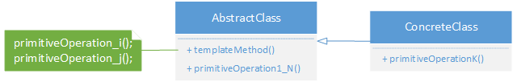

> **设计模式（第2版)**
>
> ***刘伟 主编，清华大学出版社***

[TOC]

# 一、统一建模语言

## （一）概述

统一建模语言（Unified Modeling Language，UML）是一种可视化的标准建模语言，它是一种分析和设计语言，通过它可以构造软件的系统的蓝图，其结构主要包括以下几个部分：

### 1. 视图（View）

在UML建模过程中，使用不同的视图从不同的角度来描述软件系统。UML包括五种视图：

1. 用户视图，以用户的观点表示系统的目标，它是所有视图的核心，来描述系统的需求。
2. 结构视图，表示系统的静态行为，描述系统的静态元素，如包、类与对象，以及它们之间的关系。
3. 行为视图，表示系统的动态行为，描述系统的组成元素（如对象）在系统运行时的交互关系。
4. 实现视图，表示系统中逻辑元素的分布，描述系统中物理文件以它们之间的关系。
5. 环境视图，表示系统中物理元素的分布，描述系统中硬件设备的部署以及它们之间的关系。

### 2. 图（Diagram）

在UML2.0中提供了13种视图，与上述5种视图相对应：

1. 用户视图：用例图（Use Case Diagram）。
2. 结构视图：类图（Class Diagram）、对象图（Object Diagram）、包图（Package Diagram）、组合结构图（Composite Structure Diagram）。
3. 行为视图：状态图（State Diagram）、活动图（Activity Diagram）、顺房图（Sequence Diagram）、通信图（Communication Diagram）、定时图（Timing Diagram）、交互概览图（Interaction Overview Diagram），统称交互图（Interaction Diagram）。
4. 实现视图：组件图（Component Diagram）。
5. 环境视图：部署图（Deployment Diagram）。

### 3. 模型元素（Model Element）

在UML中，模型元素包括事物以及事物之间的联系。事物是UML中的重要组成部分，它代表任何可以定义的东西，事物之间的关系把事物联系在一起，组成有意义的结构模型。每一个模型元素都有一个与之相对应的图形元素（如类、对象、消息组件、节点等事物）和它们之间的关系（如类联关系、泛化关系、依赖关系等）组成。

### 4. 通用机制（General Mechanism）

UML提供的通用机制为模型元素提供额外的注释、修饰和语义等，主要包括规格说明、修饰、公共分类和扩展机制四种，扩展机制允许用户对UML进行扩展，以便一个特定的方法，过程、组织或用户来使用。

UML已成为用于描绘软件蓝图的标准语言，它可用于对软件密集型系统进行建模，其主要特点如下：工程化、规范化、可视化、系统化、文档化、智能化：建模工具提供正向逆向工程，用UML生成代码或逆操作。

## （二）类图、类间关系

在UML中，类图用具有类名、属性、方法的长方型来表示。其中可见性分别用`+`表示public、`-`表示private、`#`表示protected和`*`表示package可见性属性名。内部类可能用第四部分或更多来表示。

在软件系统中，类与类之间存在相互关系，类之间具有如下几种关系：

### 1. 关联关系（Association）

关联关系是一种结构化关系，用于表示一类对象与另一类对象之间有联系，在UML中，用实线连接有关联的对象所对应的类，可以在关联线上标注角色名（动词或名词）。几种类型:

1. 双向关联，如图。
2. 单向关联，如图。
3. 自关联，如图。
4. 多重性关联，又称重数关联关系（Multiplicity），表示一个类的的对象与另一个类的对象连接的个数，`m..n`表示另一个类的一个对象与 [m, n] 个该类的对象有关系，用`*`示多个，如图。
5. 聚合关系（Aggregation），表示一个整体与部分的关系（整体类与成员类）。在聚合关系中，成员类是整体类的一部分，但是成员对象可以脱离整体对象独立存在。如图，Car中定义了一个Engine类型的成员变量，从语义上来说Engine是Car的一部分，但是Engine对象可以脱离Car单独存在，因此在类Car中并不直接实例化Engine，而是通过构造方法传参或设值Setter方法将在类外部实例化好的Engine对象，然后以参数形式传入到Car中，这种传入方式称为注入（Injection）。正因为Car与Engine的实例化时刻不相同，因此它们之间不存在生命周期的制约关系，而仅仅只是整体与部分之间的关系而已。
6. 复合关系（Composition），又称组合关系，表示整体和部分之间的关系，而且它们具有同一的生存期，一旦整体对象不存在，部分对象也将不存在。如图，在Head的构造方法中实例化Mouth对象，而不是通过注入。

### 2. 依赖关系（Dependency）

依赖关系是一种使用关系，特定事物的改变有可能会影响到使用该事物的其他事物，在需要表示一个事物使用另一个事物时使用依赖关系。

大多数情况下，依赖关系体现在某个类的方法使用另一个类的对象作为参数或在一个类的方法中调用了另一个类的静态方法，或在一个类的方法中定义了另一个类的对象作为局部变量，也是依赖关系的一种表现形式，这些关系可能在实现阶段慢慢浮现出来，在分析设计阶段可以暂时不于考虑。

### 3. 泛化关系（Generalization）

泛化关系也就是继承关系，也称"is-a-kind-of"关系，用于描述父类与子类之间的关系。

### 4. 实现关系（Realization）

在很多面向对象语言中都引入了接口的概念。

在接口中一般没有属性，而且所有操作都是抽象的，只有操作的声明，没有操作的实现。接口之间也存在相似的继承关系和依赖关系，在接口和类之间还存在着一种实现关系，在这种关系中，类实现了接口，类中的操作实现了接口中所声明的操作。

## （三）顺序图

顺序图（Sequence Diagram）是一种强调对象间消息传递次序的交互图，又称为时序图或序列图，它描述了在一个用例或操作的执行过程中对象如何通过消息相互交互，展示了消息如何在对象之间发送和接收以及发送的顺序。顺序图允许直观地表示出对象的生存期，在生存期内，对象可以对输入消息做出响应，还可以发送消息。

在软件系统建模中，顺序图的使用很灵活，通常包括如下两种顺序图：

1. 需求分析阶段的顺序图，主要用于描述用例中对象之间的交互，可以使用自然语言来绘制，用于细化需求，它从业务角度进行建模，用描述性的文字叙述消息内容。这类顺序图在绘制时一般使用用户熟悉的业务语言来命名元素，如ATM用户、界面对象、数据库对象等。
2. 系统设计阶段的顺序图，确切表示系统设计中对象之间的交互，考虑到具体的系统实现，对象之间通过方法调用传递消息。这类顺序图在绘制时一般使用较为专业的技术语言来命名元素，如LoginForm（登录界面）、UserDTO（用户信息数据传输对象）、UserDAO（用户信息数据访问对象）等。

在UML中，顺序图将交互元素表示为一个二维图，纵向是时间纵向下延伸，横向轴表示了在交互过程中的独立对象，对象的活动用生命线表示。UML顺序图的组成元素说明如下：

1. 执行者（Actor），是交互的发起人，有些交互过程无需使用执行者。
2. 生命线（Lifeline），用一条虚线表示。
3. 对象（Object），表示为一个矩形，对象名称下面有下划线。
4. 激活（Activation），是过程的的执行，用长条矩形表示，代替生命线。
5. 消息（Message），是对象之间的通信，是从发出者到接收者的控制信息流。
6. 一个复杂的顺序图可以划分为几个小块，每一个小块称为一个交互片段（Interaction Fragment），每个交互片段由一个大方框包围，在方框左上角的间隔区内标注该交互片段的操作类型，用操作符表示，常用的有：alt多条路径，条件为真时执行；opt任选，仅当条件为真时执行；par并行，每一段都并发执行；loop循环，片段可多次执行。

在顺序图中，有的消息对应于活动（激话），表示它将会激话一个对象，这种消息称为调用消息（Call Message）；如果消息没有对应激活框，表示它不是调用消息，不会引发其他对象的活动，这种消息称为发送消息（Send Message）；如果对象的一个方法调用了自己的另一个方法时，消息是由对象发给自身，这种消息称为自身消息（Self Call Message）。顺序图中还包括创建消息，用关键字new创建另一个对象；锁毁消息，调用对象的锁毁方法将其从内存中销毁。

## （四）状态图

状态图（Statechart Diagram）用来描述一个特定对象的所有可能状态及引起其状态转移的事件，它确定了由事件序列引出的状态序列以及在不同状态下对象的不同行为。在UML状态图中包含以下元素：

1. 状态（State），又称中间状态，用圆角矩形框表示，上格放置状态名称，下格说明处于该状态时对象可以进行的活动。

2. 初始状态（Initial State），又称为初态，用一个实心圈表示，在一个状态图中只能够有一个初始状态。

3. 结束状态（Final State），又称为终止状态或终态，用一个实心圆外加一个圆圈表示，在一个状态图中可能有多个结束状态。

4. 转移（Transition），用箭头说明情况转移情况，并用文字说明引发这个状态变化的相应事件。状态之间的转移可带有标注，由三部分组成（每一部分都可省略），其语法为：事件名[条件]/动作名。

在一个状态图中，一个状态也可以被细分为多个子状态，包含多个子状态的状态称为复合状态。

# 二、面向对象设计原则

面向对象设计原则是学习设计模式的基础，每一种设计模式都符合一种或多种面对象设计原则。对于面向对象的软件系统设计来说，在支持可维护性的同时提高系统的可复用性是一个核心问题，可维护性复用都是以面向对象设计原则为基础的，这些设计原则首先都是复用原则，遵循这些设计原则可以有效地提高系统的复用性，同时提高系统的可维护性。

重构（Refactoring）是在不改变软件现有功能的基础上，通过调整程序代码改善软件的质量、性能，使其程序的设计模式和架构更趋合理，提高软件的扩展性和维护性。

常用的面向对象设计原则包括七个，这些原则并不是孤立存在的，它们相互依赖、相互补充，如下：

## （一）单一职责原则

单一职责原则（Single Responsibility Principle，SRP）是最简单的面向对象设计原则，它用于控制类的粒度大小。

定义：一个对象应该只包含单一的职责，并且该职责被完整地封装在一个类中（Every object should have a single responsibility, and that responsibility should be entirely encapsulated by the class.）。另一种定义：就一个类而言，应该仅有一个引起它变化的原因（There should never be more than one reason for a class to change.）。

一个类（或者大到模块，小到方法）承担的职责（数据职责和行为职责，分别由属性和方法来体现）越多，它被复用的可能性越小，而且如果一个类承担的责职过多，就相当于将这些职责耦合在一起，将导致系统非常脆弱，当其中一个职责变化时，可能会影响其他职责的运作。因此要将这些职责进行分离，将不同的职责封装在不同的类中，即将不同的变化原因的职责封装在不同的类中；如果多个职责总是同时因同一原因发生改变，则可将它们封装在同一类中。

单一职责原则是实现高内聚，低耦合的指导方针，在很多代码重构的手法中都能找到它的存在。

## （二）开闭原则

开闭原则（Open-Closed Principle，OCP）是面向对象的可复用设计的第一块基石，它是最重要的面向对象设计原则。

定义：一个软件实体应当对扩展开放，对修改关闭（Software entities should be open for extension, but closed for modification.）。

也就是说在设计一个模块的时候，应当使这个模块可以在不被修改的前提下被扩展，即实现在不修改源代码的情况下改变这个模块的行为。

开闭原则还可以通过一个更加具体的对可变性封装原则（Principle of Encapsulation of Variation，EVP）来描述，它要求找到系统的可变因素并将其封装起来。例如，将抽象层的不同实现封装到不同的具体类中，而且EVP要求尽量不要将一种可变性和另一种变性混合在一起，这将导致系统中类的个数急剧增长，增加系统的复杂度。百分之百的开闭原则很难达到，但是要尽可能使系统设计符合开闭原则，后面所学的里氏代换原则，依赖倒转原则等都是开闭原则的实现方法。

注意：因为xml和properties等格式配置文件是纯文本文件，可以直接通过VI编辑器或记事本进行编辑，且无须编译，因此在软件开发中，一般不把对配置文件的修改认为是对系统源代码的修改。如果一个系统在扩展时只涉及修改配置文件，而原有的Java代码或C#代码没有做任何修改，该系统即可认为是一个符合开闭原则的系统。

## （三）里氏代换原则

里氏代换原则（Liskov Substitution Principle，LSP）。开闭原则的核心是对系统进行抽象化，并且从抽象化导出具体化，这个过程需要使用继承关系和里氏代换原则。

定义一：如果对每个S类型的对象o1，都有T类型的对象o2，使得以T类型定义的所有程序P，在用o1代替o2时程序P的行为没有变化，那么S类型是T类型的子类型（If for each object o1 of type S there is an object o2 of type T such that for all programs P defined in terms of T, the behavior of P is unchanged when o1 is substituted for o2 then S is a subtype of T.）。或更容易理解的定义二：所有引用基类的地方必须能透明地使用其子类的对象（Functions that use pointers or references to base classes must be able to use object of derived classes without knowing it.）。

在使用里氏代换原则时需要注意以下几个问题：子类的所有方法必须在父类中声明，或子类必须实现父类中声明的所有方法；尽量把父类设计为抽象类或者接口，让子类继承父类或实现父接口，并实现在父类中声明的方法。

## （四）依赖倒转原则

依赖倒转原则（Dependence Inversion Principle，DIP）。如果说了开闭原则是面向对象设计目标的话，那么依赖倒转原则就是实现面向对象设计的主要机制，它是系统抽象化的具体实现。

定义：高层模块不应该依赖低层模块，它们都应该依赖抽象。抽象不应该依赖于细节，细节应该依赖于抽象（High level modules should not depend upon low level modules, both should depend upon abstractions. Abstractions should not depend upon details, details should depend upon abstractions.）。另一种表述：要针对接口编程，不要针对实现编程（Program to an interface, not an implementation.）。

简单来说，依赖倒转原则就是指在代码中使用抽象类和接口，而将具体类放在配置文件中。也就是说，在程序代码中传递参数时或在组合聚合关系中，尽量引用层次高的抽象层类，即使用接口或抽象类进行变量类型声明、参数类型声明、方法返回类型声明，以及数据类型转换等，而不要用具体类来做这些事情。为了确保该原则的应用，一个具体类应当只实现接口和抽象类中声明过的方法，而不要给出多余的方法，否则将无法调用到在子类中增加的新方法。

依赖倒转原则的关键是要求客户端以抽象的方式进行耦合，即在依赖关系中至少有一端是抽象的，这可以通过具体的不同实现类来扩展。对象与对象之间的依赖关系是可以传递的，通过传递依赖，在一个对象中可以调用另一个对象的方法，在传递时要做好抽象依赖，针对抽象层编程。

依赖注入（Dependence Injection，DI）就是将一个类的对象传入另一个类，注入时应该尽量注入父类对象，而在程序运行时再通过子类对象来覆盖父类对象，主要有以下三种方式：构造注入（Constructor Injection）；设值注入（Setter Injection）、接口注入（Interface Injection），即在接口中声明的方法中使用抽象类作为参数类型。

## （五）接口隔离原则

接口隔离原则（Interface Segregation Principle，ISP）要求我们将一些臃肿的接口进行细化，使用多个专门的接口来替换单一的总接口。

定义：客户端不应该依赖那些完全不需要的接口（方法）（Clients should not be forced to depend upon interfaces that they do not use.）。另一种定义：一旦一个接口太臃肿，则需要将充分割成一些更细小的接口，使用该接口的客户端仅需要知道与之相关的方法即可（Once an interface has gotten too 'fat' it needs to be split into smaller and more specific interfaces so that any clients of the interface will only know about the methods that pertain to them.）。

在使用接口隔离原则时要注意接口的粒度，接口不能太小，如果太小会导致系统中接口泛滥，不利于维护；接口也不能太大，太大的接口将违背接口隔离原则，灵活性较差，使用起来很不方便。一般而言，接口中仅包含为某一类用户定制的方法即可。

## （六）合成复用原则

合成复用原则（Composite Reuse Principle，CRP）是面向对象设计中非常重要的一条原则，为了降低系统中类之间的耦合度，该原则提倡在复用功能时多用关联关系，少用继承关系。该原则又称为组合/聚合复用原则（Composition / Aggregate Reuse Principle，CARP)。

定义：尽量使用对象组合，而不是继承来达到复用的目的（Favor composition of objects over inheritance as a reuse mechanism.）。

由于基类的某些内部细节对子类来说是可见的，所以这种继承复用又叫白箱复用；将已有的对象合成入新对象中作为成员对象，使得成员对象的内部实现对于新对象是不可见的，所以这种合成复用对称为黑箱复用。

## （七）迪米特法则

迪米特法则（Law of Demeter，LoD）用于降低系统的耦合度，使类与类之间保持松散的耦合关系，它又称为最少认知原则（Least knowledge Principle）。

它有多种定义方法，其中几种典型定义如下：不要与陌生人"说话"（Don't talk to strangers.）。只与你的直接朋友通信（Talk only to your immediate friends.）。每个软件单位对其他的单位都只有最少的认知，而且局限于那些与本单位密切相关的软件单位（Each unit should have only limited knowledge about others: only units closely 'related' to the current unit.）。

简单地说，迪米特法则就是指一个软件实体应当尽可能少地与其他实体发生相互作用。这样，当一个模块修改时，就会尽量少地影响其他的模块，扩展会相对容易。这是对软件实体之间通信的限制，它要求限制软件实体之间通信的宽度和深度。

迪米特法则的主要用途在于控制信息过载，在使用时应注意：

1. 在类的划分上，应当尽量创建松耦合的类，类之间的耦合度越低，就越有利于复用，一个处在松耦合中的类一旦被修改，
   不会对关联的类造成太大波及；
2. 在类的结构设计上，每一个类都应当尽量降低其成员变量和成员函数的访问权限；
3. 在类的设计上，只要有可能，一个类型应当设计成不可变类；
4. 在对其他类的引用上，一个对象对其他对象的引用应当降到最低。

## （八）设计模式

模式是在特定环境中解决问题的一种方案（A pattern is a solution to a problem in a context.）。软件模式是将模式的一般概念应用于软件开发领域，即软件开发的总体指导思路或参照样板。软件模式并非仅限于设计模式，还包括架构模式、分析模式和过程模式等，实际上，在软件生存期的每一个阶段都存在着一些被认同的模式（大三律，Rule of Three）。设计模式（Design Pattern）是一套被反复使用、经过分类编目的、代码设计经验的总结。

根据目的（模式是用来做什么的）可分为：创建型（Creational），主要用于创建对象，GoF提供了5种；结构型（Structural），主要用于处理类或对象的组合，GoF提供了7种；行为型（Behavioral），主要用于描述类或对象怎样交互和怎样分配职责，GoF提供了11种。

根据范围可分为：类模式，处理类和子类之间的关系，这些交系通过继承建立，在编译时刻就被确定下来，是属于静态的；对象模式，处理对象间的关系，这些关系在运行时时变化，更具动态性。

|            |          类模式          |                           对象模式                           |
| :--------: | :----------------------: | :----------------------------------------------------------: |
| 创建型模式 |       工厂方法模式       |         抽象工厂模式、建造者模式、原型模式、单例模式         |
| 结构型模式 |     （类）适配器模式     | （对象）适配器模式、桥接模式、组合模式、装饰模式、外观模式、享元模式、代理模式 |
| 行为型模式 | 解释器模式、模板方法模式 | 职责链模式、命令模式、迭代器模式、中介者模式、备忘录模式、观察者模式、状态模式、策略模式、访问者模式 |

需要注意的是，这23种设计模式并不是孤立存在的，很多模式彼此之间存在联系。此外，还可以通过组合两个或多个模式来设计同一系统，在充分发挥每一个模式的优势的同时使它们可以协同工作，完成一些更复杂的设计工作。

# 三、创建型模式

创建型模式（Creational Pattern）对类的实例化过程进行了抽象，隐藏了对象的创建细节，通过隐藏对象如何被创建和组合在一起而达到使整个系统独立的目的，它能够将软件模块中对象的创建和对象的使用分离。使得相同的创建过程可以多次重用，且修改两部分中的一个对另一个几乎不造成任何影响或很小影响。

## （一）简单工厂模式

简单工厂模式（Simple Factory Pattern）又称为静态工厂方法（Static Factory Method）模式。定义：在简单工厂模式中，可以根据参数的不同实参返回不同类的突例，专门定义一个工厂类来负责创建其他类的实例，被创建的实例通常具有共同的父类。

简单工厂模式包含如下角色：

1. `Factory`，工厂角色，即工厂类，它是简单工厂模式的核心，负责实现创建所有实例的内部逻辑；工厂类可以被外界直接调用，创建所需的产品对象；在工厂类中提供了静态的工厂方法factoryMethad()，它返回一个抽象产品类Product，所有的具体产品都是抽象产品的子类。
2. `Product`，抽象产品角色，是简单工厂模式所创建的所有对象的父类，负责描述所有实例所共有的公共接口，它的引入将提高系统的灵活性，使得在工厂类中只需定义一个工厂方法，因为所有创建的具体产品对象都是其子类对象。
3. `ConcreteProduct`，具体产品象角色，是简单工厂模式的创建目标，所有创建的对象都充当这个角色的某个具体类的实例。每一个具体产品角色都继承了抽象产品角色，需实现定义在抽象产品中的抽象方法。

简单工厂模式的优点：

1. 工厂类含有必要的判断逻辑，可以决定在什么时候创建哪一个产品类的实例，客户端可以免除直接创建产品对象的责任，而仅仅消费产品；简单工厂模式通过这种做法实现了对责任的分割，它提供了专门的工厂类用于创建对象。
2. 客户端无须知道所创建的具体产品类的类名，只需知道具体产品类所对应的参数即可，对于一些复杂的类名，通过简单工厂模式可以减少使用者的记忆量。
3. 通过引入配置文件，可以在不修改任何客户端代码的情况下更换和增加新的具体参品类（参数放入XML配置文件等）。

缺点：

1. 由于工厂类集中了所有产品创建的逻辑，一旦不能正常工作，整个系统都要受到影响。
2. 使用简单工厂模式将会增加系统中类的个数，在一定程度上增加了系统的复杂度和理解难度。
3. 系统扩展困难，一旦添加新产品就不得不修改工厂逻辑，在产品类型较多时，有可能造成工厂逻辑过于复杂，不利于系统的扩展和维护。
4. 简单工厂模式由于使用了静态工厂方法，造成工厂角色无法形成基于继承的等级结构（静态方法属于类，无法被子类覆盖，无法使用多态）。

适用环境：工厂类负责创建的对象比较少；客户端只知道传入工厂类的参数，对于如何创建对象不关心。

简单工厂模式扩展，有些情况下工厂类可以由抽象产品角色来扮演，一个抽象产品类同时也是子类的工厂，也就是说把静态工厂方法写到抽象产品类中。

## （二）工厂方法模式

工厂方法模式（Factory Method Patten）又称工厂模式，也叫虚拟构造器（Virtual Constructor）模式或多态工厂（Polymorphic Factory）模式。定义：在工厂方法模式中，工厂抽象类负责定义创建产品对象的公共接口，而具体工厂类则负责生成具体的产品对象，这样做的目的是将产品类的实例化操作延迟到工厂具体类中完成，即通过工厂具体类来确定究竟应该实例化哪一个具体产品类（Define an interface for creating an object, but let subclasses decide which class to instantiate. Factory Method lets a instantiation to subclasses.）。

工厂方法模式引入了`Factory`抽象的工厂类，而将具体产品的创建过程封装在抽象工厂类的子类，也就是`ConcreteFactory`具体工厂类中。客户端代码针对抽象层进行编程，增加新的具体产品类时只需增加一个相应的具体工厂类即可，使得系统具有更好的灵活性和可扩展性。在实际的应用开发中，一般将具体的工厂类的实例化过程进行改变，不直接使用new关键字来创建对象，而是将具体类的类名写入XML形式的配置文件中，再通过Java的反射机制，读取XML格式的配置文件，根据存储在XML文件中的类名字符来生成对象。它的缺点在于增加新产品的同时需要增加新的工厂，导致系统类的个数成对的增加，在一定程度上增加了系统的复杂性。

适用环境：

1. 一个类不知道它所需要的对象的类，客户端不需要知道具体产品类的类名，只需要知道所对应的工厂即可。
2. 一个类通过其子类来指定创建哪个对象，抽象工厂类只需要提供一个创建产品的接口，利用面向对象的多态性和里氏代换原则，在程序运行时用子类对象替换父类对象，从而使得系统更容易扩展。
3. 将创建对象的任务委托给多个工厂子类中的某一个，客户端在使用时可以无须关心是哪一个工厂类创建产品子类，依赖动态绑定可将具体工厂类的类名存储在配置文件或数据库中。

工厂方法模式扩展：

1. 在抽象工厂角色中可以定义多个工厂方法，让具体工厂角色实现这些不同的工厂方法，这些方法可以包含不同的业务逻辑，以满足对不同的产品对象的需求。
2. 产品对象的重复使用，工厂持有一个所创建产品的集合，客户请求时先查找集合。
3. 一般来说，工厂对象应当有一个抽象的父类型，如果工厂等级结构中只有一个具体工厂类的话，抽象工厂就可以省略，此时退化成简单工厂模式。

## （三）抽象工厂模式

抽象工厂模式（Abstract Factory Patten）又称为Kit模式。定义：提供一个创建一系列相关或相互依赖对象的接口，而无须指定它们具体的类（Provide an interface for creating families of related or dependent objects without specifying their Concrete classes.）。

产品结构：产品等级结构即产品的继承结构，同一个继承树上的产品构成了一个产品等级结构。产品族：是指由同一个工厂生产的，位于不同产品等级结构中的一组产品。在抽象工厂模式中每个具体工厂生产一组产品，即一个产品族。

1. `AbstractFactory`，抽象工厂，用于声明生成抽象产品的方法，在一个抽象工厂中可以定义一组方法用来生成一个产品族，每个产品属于一个产品等级结构。
2. `ConcreteFactory`，具体工厂，实现了抽象工厂声明的方法，生成一组具体产品，这些产品构成一个产品族，每一个产品都位于某个产品等级结构中
3. `AbstractProduct`，抽象产品，为每种产品声明接口，在抽象产品中定义了产品的抽象业务方法。
4. `ConcreteProduct`，具体产品，实现抽象产品接口中定义的业务方法，为具体工厂生产的具体产品对象。

对于属于同一个产品族的产品对象可以创建一个工厂，而这些工厂同时也构成了一个工厂等级结构，它与产品族相对应，与产品等级结构相类似，通过抽象工厂模式可从在运行时动态判断产品族，选择对应的具体工厂来创建具体的产品等级结构，即客户实际上只能消费属于同一个产品族的产品。这对一些需要根据当前环境来决定其行为的软件系统来说，是一种非常实用的设计模式。

主要缺点：在添加新的产品对象时，难以对扩展抽象工厂来生产新种类的产品，这是因为在抽象工厂角色中规定了所有可能被创建的产品的集合，要支持新种类的产品就要对该接口进行扩展，这会导致对抽象工厂及所有具体工厂的修改，显然会带来较大的不便。

适用环境：

1. 系统中有多于一个的产品族，而每次只使用其中的某一产品族。可以通过配置文件等方式来使得用户可以动态改变产品族，也可以很方便地增加新的产品族。
2. 属于同一个产品族的产品将在一起使用，这一约束必须在系统的设计中体现出来。同一个产品族的产品可以是没有任何关系的对象，但是它们必须有一些共同的约束。如：同一操作系统下的按钮和文本框，它们没有直接关系，但具有一个共同的约束条件：操作系统的类型。

抽象工厂模式扩展：

1. 开闭原则的倾斜性，抽象工厂模式以一种倾斜的方式支持增加新产品，它为新产品族的增加提供方供，但不能为新的产品等级结构的增加提供这样的方便。
2. 退化，当抽象工厂中每一个具体工厂类只创建一个产品对象，也就是只存在一个产品等级结构时，退化成工厂方法模式。

## （四）建造者模式

建造者模式（Builder Pattern）又称生成器模式。定义：将一个复杂对象的构建与它的表示分离，使得同样的构建过程可以创建不同的表示（Separate the construction of a complex object from its representation so that the same construction process can create different representations.）。

建造者模式是一步一步创建一个复杂的对象，它允许用户只通过指定复杂对象的类型和内容就可以构建它们，用户不需要知道内部的具体构建细节。

对于复杂对象，它们拥有一系列成员属性，可能存在各种限制，如某个属性没被赋值则无法作为完整对象使用，有些属性的赋值必须按顺序等。建造对象的过程很复杂，因此建造过程常被“外部化”到一个称为建造者的对象里，它返回给客户端一个已经建造完毕的对象，而用户无须关心该对象所含属性及组装方式。

1. `Builder`，抽象建造者，为创建一个产品Product对象的各个部件指定抽象接口，在该接口中一般声明两类方法：用于创建复杂对象各部分的buildPart()和返回复杂对象的getResult()方法，可是抽象类或接口。
2. `ConcreteBuilder`，具体建造者，实现了Builder接口，实现各个部份的构造和装配方法，定义并明确它所创建的复杂对象，并提供方法这回之。
3. `Product`，产品角色，是被构建的复杂对象，包含多个组成部件，具体建创者会建该产品的内部表示并定义它的装配过程。
4. `Director`，指挥者，又称为导演类，它负责安排复杂对象的建造次序，可在construct()方法中实现。客户端一般只需要与指挥者进行交互。在客户端确定具体建造者的类型，并实例化具体建造者对象（也可通过配置文件和反射机制），然后通过指挥者类的构造函数或Setter方法将具体建造者传入指挥者类中。

优点有：

1. 每一个具体建造者都相对独立，与其他的具体建适者无关，因此可以很方便地更换具体建适者或增加新的具体建造者，用户使用不同的具体建造者即可得到不同的产品对象。
2. 可以更加精细地控制产品的创建过程。

缺点有：

1. 建造者模式所创建的产品一般具有较多共同点，其组成部分相似，如果产品之间的差异性很大，则不适合使用建造者模式，因此其使用范围受到一定限制。
2. 如果产品内部变化复杂，可能会导致需要定义很多具体建造类来实现这种变化，导致系统变得很宏大。

适用环境：

1. 需要生成的产品对象有复杂的内部结构，这些产品对象通常包含多个成员属性。
2. 需要生成的产品对象的属性相互依赖需要指定生成顺序。
3. 对象的创建过程独立于创建该对象的类，将创建过程封装在指挥类中，而不在建造者类中。

建造者模式扩展，在实际使用过程中通常可以进行简化，如果系统只需要一个具体建造者的话，可以省略掉抽象建造者，更甚可以省略指挥者角色，让Builder角色扮演建造者与指挥者双重角色。

## （五）原型模式

原型模式（Prototype Patter）定义：用原型实列指定创建对象的种类，并且通过复制这些原型创建新的对象（Specify the kind of objects to create using a typical instance, and create new objects by copying this prototype.）。

在软件系统中，有些对象的创建过程较为复杂，而且有时候需要频繁创建。当需要创建大量相同或相似对象时，可以通过给出一个原型对象来指明要创建的对象的类型，然后用复制这个原型对象的办法创建出更多同类型的对象。Java、C#等语言都提供了对原型模式的完美支持。

若Java类实现了标识接口`Cloneable`便可直接使用Object提供的`clone()`方法来获得一个对象克隆的Object。一般而言clone()方法满足：`x.clone() != x && x.clone().getClass() == x.getClass() && x.clone().equals(x)`。在Java中通过票盖Object类的clone()方法可以实现浅克隆；而一个实现了Serializable接口的类可以通过将对象序列化写到一个流中，而后从流中读出来从而实现深克隆。

优点：当创建新的对象实例较为复杂时，使用原型模式可以提高新实例的创建效率，某些不同的属性值也可以在创建后再更改。主要缺点是：在对已有类进行改造时，必须修改其源代码，违背了“开闭原则”，在实现深克隆时需要编写较为复杂的代码。

适用环境：创建新对象开销较大；避免使用分层次的工厂来创建分层次的对象，并且类的实例对象只有一个或很少的几个组合状态时。

原型模型扩展，原型管理器（Prototype Manager）角色负责创建具体原型类的对象，并记录每一个被创建的对象。其作用与工厂类似，其中定义了一个用于存储原型的对象的集合，如果需要某个对象的一个克隆，可以通过复制集合中对应的原型对象来获得。

## （六）单例模式

单例模式（Singleton Pattern）又称为单件模式或单态模式。定义：确保某一个类只有一个实例，而且自行实倒化并向整个系统提供这个实例，这个类称为单例类，它提供全局访问的方法（Ensure a class has only one instance provide a global point of access to it.）。

一个单例类持有一个自身类型的静态私有成员数据，构造函数为私有，提供一个公共的静态公共方法getInstance()工厂方法。

优点：

1. 由于在系统内存中只存在一个对象，因此可以节约系统资源，对于一些需要频繁创建和销毁的对象，单例模式可以提高系统性能。
2. 可以扩展，允许可变数目的实例。

缺点：

1. 没有抽象层，扩展困难。
2. 职责过重，在一定程度上违背了“单一职责原则”。
3. 滥用会带来一些负面问题。

注意的是：不要使用单例模式存取全局变量；不要将数据库连接做成单例。

单例模式扩展：

1. 饿汉式单例类，在定义静态态变量的同时，实例化单例类，`private static final EagerSingleton instance = newEagerSingleton();`。因此在类加载时就已创建了单例对象，在getInstance()中不需判断逻辑。
2. 懒汉式单例类，`private static LazySingleton instance = null;`，需要在getInstance()中判断实例是否为空。注：懒汉式单例类在实例化时，必须处理多个线程同时首次引用时的并发问题，最好用synchronized修饰getInstance()。

# 四、结构型模式

结构型模式（Structural Pattern）描述如何将类或者对象结合在一起形成更大的结构。类结构型模式关心类的组合，一般只存在继承和实现关系；而对象结构型模式关心类与对象的组合，通过关联关系使得在一个类中定义另一个类的实例对象，然后通过该对象调用其方法。根据“合成复用原则”，在系统中应当尽量使用关联关系来代替继承关系，因此大部分结构型模式都是对象结构型模式。

## （一）适配器模式

适配器模式（Adapter Pattern）别名为包装器（Wrapper）。定义：将一个接口转换成客户希望的另一个接口，适配器模式使接口不兼容的那些类可以一起工作（Convert the interface of a class into another interface clients expect. Adapter lets classes work together that couldn't otherwise because of incompatible interfaces.）。

1. `Target`，目标抽象类，定义客户要用的特定领域的接口，可以是个抽象类或接口，也可以是具体类。在类适配器中，由于Java不支持多继承，故只能是接口。
2. `Adapter`，适配器类，作为一个转换器，对Adaptee和Target进行适配。在类模式中，它实现Target接口，并继承Adaptee；在对象模式中，它继承Target类并关联一个Adaptee对象。
3. `Adaptee`，适配者类，即被适配的角色，它定义了一个已经存在的接口，这个接口需要适配。适配者类一般是一个具体类，包含了客户希望使用的业务方法，在某些情况下甚至没有适配者类的源代码。

共通的优点有：

1. 将目标类和适配者类解耦，通过引入一个适配器类来重用现有的适配者类，而无须修改原有代码。
2. 增加了类的透明性和复用性，将具体的实现封装在适配者类中，对于客户端来说是透明的，而且提高了适用者的复用性。
3. 可以通过使用配置文件，很方便地更换适配器，也可以在不修改原有代码的基础上增加新的适配器类，完全符合“开闭原则”。值得注意的是：客户端程序一定要针对抽象目标类进行编程，否则适配器模式的使用将导致系统发生一定的改动。

类适配器模式，优点还有：由于Adapter是Adaptee的子类，因此可以在Adapter类中置换一些Adaptee的方法，使得Adapter的灵活性更强。缺点：对于Java、C#等不支持多继承的语言，一次最多只能适配一个Adaptee，且目标抽象类Target只能为接口，不能为类，其使用有一定的局限性。

对象适配器模式，优点：能把多个不同的适配者适配到同一个目标，如一个Adapter能把Adaptee、SubAdaptee等都适配到Target。缺点：不易置换适配者类的方法，须先用SubAdaptee继承Adaptee来是置换方法，然后在Adapter中真正适配的是SubAdaptee类。

适用环境：系统需要使用现有的类，而这些类的接口不符合系统的需要；想要建立一个可以重度使用的类，用于与一些彼此之间没有太大关系的一些类，包括一些在将来引进的类一起工作。

适配器模式扩展：

1. 缺省适配器模式（Default Adapter）定义：当不需要全部实现接口的方法时，可以先设计一个默认实现（空方法）的抽象类，那么该抽象类的子类就可以有选择地覆盖父类的某些方法来实现需求。它适用于不想使用一个接口所有方法的情况，因此也称为单接口适配器模式（空方法也称钩子方法Hook Method）。

   

2. 双向适配器，在对象适配器模式中，如果在Adapter中同时包含对目标类和适配者类的引用，Adaptee可以通过它调用Target中的方法，Target也可以通过它调用Adaptee中的方法，那么该适配器就是一个双向适配器（类似适配多个Adaptee的对象活配器模式）。注意：Target和Adaptee都可为接口等抽象，然后有具体类，在Adapter中面向抽象。

## （二）桥接模式

桥接模式（Bridge Pattern）又称为柄体（Handle and Body）模式或接口（Interface）模式。定义：将抽象部分与它的实现部分分离，使它们都可以独立地变化（Decouple an abstraction from its implementation so that the two can vary independently.）。

在软件系统中，有些类由于本身的固有特性，使得它同时具有两个或多个变化维度，桥接模式可以将这两个维度分离出来，使两者可以独立扩展。它用抽象关联取代了传统的多层继承，将类之间的静态继承关系转换为动态的对象组合关系。使得系统更加灵活并易于扩展，同时有效控制了系统中类的个数。

1. `Abstraction`，抽象类，为站在一个维度上，抽象出业务接口定义成抽象类，它维护了一个Implementor对象。 
2. `RefinedAbstraction`，扩充抽象类，扩充由Abstraction定义的接口，通常情况下它不再是抽象类而是具体类，它实现了在Abstraction中定义的抽象业务方法，还可以调用在Implementor中定义的业务方法。
3. Implementor，实现类接口，站在另一维度上，建立一个抽象层，一般来讲该接口仅提供基本操作，而Abstraction定义的接口可能会做更多更复杂的操作。
4. `ConcreteImplementor`，具体实现类，提供Implementor基本操作的不同实现，在程序运行时根据里氏代换原则，提供给客户具体业务操作方法。

优点：

1. 分离抽象接口及其实现部分，解耦了抽象角色和实现角色之间固有的绑定关系，使得它们不再在同一个继承层次结构中，可以沿着各自维度来变化。

2. 桥接模式是比多继承方案更好的解决方法。

3. 桥接模式提高了系统的可扩展性，在两个变化维度中任意扩展一个维度，都不需要修改原有系统。

4. 实现细节对客户透明，用户在抽象层通过聚合关系完成封装与对象的组合。

主要缺点是：要求正确识别出系统中两个独立变化的维度，因此使用范围有一定的局限性。

适用环境：

1. 如果一个系统需要在构件的抽象化角色和具体化角色之间增加更多的灵活性，避免在两个层次之间建立静态的继承联系，通过桥接模式可以使它们在抽象层建立一个关联关系。
2. 抽象化角色和实现化角色可以以继承的方式独立扩展而互不影响，在程序运行时可以动态将一个抽象化的子类的对象和实现的子类的对象进行组合，即系统需要对抽象化角色和实现化角色进行动态耦合。
3. 一个类存在两个独立变化的维度，且这两个维变都需要进行广展。
4. 对于那些不希望使用继承或多层次继承导致系统类的个数急剧增加的系统，桥接模式为适用。

桥接模式扩展，在软件开发中，适配器模式（将第三方类集成到系统）可以与桥接模式（用于系统的初步设计）联合使用。

## （三）组合模式

组合模式（composite Pattern）又称“部分-整体”（Part-Whole）模式。定义：组合多个对象形成树结构以表示“部分-整体”的层次结构，组合模式对单个对象（即叶子对象）和组合对象（即容器对象）的使用具有一致性（Compose objects into tree structures to represent part-whole hierarchies. Composite lets clients treat individual objects and compositions of objects uniformly.）。

叶子构件中不能包含成员对象；而容器构件中可以包含成员对象，可以是叶子构件对象，也可以是容器构件对象。它们构成一个树形结构，组合模式用面向对象的方式来处理树形结构，它为叶子构件和容器构件提供了一个公共的抽象构件类，客户端可以针对该抽象结构进行处理，而无须区分对象类型，可以一致地对待容器对象和叶子对象，这就是组合模式的动机。

1. `Component`，抽象构件，可以是接口或抽象类，为叶子构件和容器构件对象声明接口，在该角色中可以包含所有子类共有行为的声明和实现。在抽象构件中定义了访问及管理它的子构件的方法，如增、删、取等。
2. `Leaf`，叶子构件，在组合结构中表示叶子结点对象，叶子节点无子节点，它实现了在抽象构件中定义的行为。对于那些访问及管理子构件的方法，可以通过异常等方式进行处理。
3. `Composite`，容器构件，在组合结构中表示容器节点对象，它提供一个集合用于存储子节点，实现了在抽象构件中定义的行为，包括那些访问及管理子构件的方法，在其业务方法中可以递归调用其子节点的业务方法。

优点：

1. 让客户忽略了层次的差异，而它的结构又是动态的，可以方便地对层次结构进行控制，调用简单。
2. 更容易在组合体内加入对象构件，客户端不必因为加入了新对象构件而改变原有代码。

缺点：

1. 使设计变得更加抽象，对象的业务规则如果很复杂，则实现组合模式具有很大挑战性，而且不是所有的方法都与叶子对象子类都有关联。
2. 很难对容器中的构件类型进行限制，须要在运行时进行类型检查。

适用环境：

1. 需要表示一个对象的整体或部分层次，希望通过一种方式忽略整体与部分的差异，可以一致对待它们。
2. 对象的结构是动态的并且复杂程度不一样，但客户需要一致地处理它们。

组合模式扩展：

1. 更复杂的组合模式，对叶子结点和容器结点进行抽象，得到抽象叶子构件和抽象容器构件，可以提供多种具体实现以扩展。
2. 透明组合模式，即在抽象构件Component中声明所有用于管理成员对象的方法，好处是确保所有构件都有相同接口，对客户端透明且编程方便；缺点是不够安全，因为叶子对象在本质上是有运别的，在运行时调用叶子节点相关方法可能会出错。
3. 安全组合模式，即在抽象构件Component中没有声明任何与子成员相关方法，只有业务方法，而在Composite角色中声明用于管理子成员的方法，这种做法是安全的，缺点是不够透明，因为叶子构件和容器构件具有不同的方法，客户端不能完全针对抽象编程，并一致使用叶子构件和容器构件，必须分开。（在实际使用中，安全组合模式使用频率相对更高。）

## （四）装饰模式

装饰模式（Decorator Pattern）别名也可以称包装器，又称“油漆工”模式。定义：动态地给一个对象增加一些额外的职责Responsibility，就增加对象功能来说，装饰模式比生成子类实现更为灵活（Attach additional responsibility to an object dynamically. Decorators provide a flexible alternative to subclassing for extending functionality.）。

给一个类或对象增加行为：继承机制，由子类扩充，但这种方法是静态的，用户不能控制增加行为的方式和时机。装饰器使用关联机制，将一个对象嵌入到另一个新对象中（即装饰），它实现与被装饰器相同的接口，可以增加更复杂的功能，而且由于接口相同故可以嵌套多层装饰，从而添加任意多的功能。装饰器模式在不需要创建更多类的情况下，将对象的功能加以扩展，就是装饰器模式的动机。

1. `Component`，抽象构件，是具体构件和抽象装饰器的共同父类，声明了在具体构件中实现的业务方法，可以给这些对象动态增加职责（方法）。它的引入可以使客户端以一致的方式处理未被装饰及装饰后的对象，实现客户端的透明操作。
2. `ConcreteComponent` ，具体构件，实现在抽象构件中声明的方法，装饰器可以给它增加额外的职责（方法）。
3. `Decorator`，抽象装饰类，维护了一个抽象构件的引用，以调用装饰之前构件对象的方法。它用于给具体构件增加责职，但具体职责实现是在其子类中实现。
4. `ConcreteDecorator`，具体装饰类，负责向构件添加新的职责。若接口和Component一致则为透明装饰模式；若增加了新的接口，则客户端不能统一用抽象构件定义装饰器，也不能进行多重装饰，称为半透明模式。注：comp可经Decorator构造函数注入。

优点：

1. 装饰模式与继承关系目的都是扩展对象的功能，但是装饰模式可以提供比继承更多的灵活性，以一种动态的方式来扩展一个对象的功能，通过配置文件可以在运行时选择不同的装饰器，从而实现不同的行为。
2. 通过使用不同的具体装饰类及这些装饰类的排列组合，可以创造出很多不同行为的组合。
3. 具体构件类与具体装饰类可以独立变化，用户可以根据需要增加新的具体构件类和具体装饰类，在使用时再对其进行组合，原有代码无须改变，符合开闭原则。

缺点：

1. 使用装饰模式进行系统设计时将产生很多小对象，它们区别在于它们之间相互连接的方式不同，而不是类型或属性不同，这会增加系统复杂性。
2. 这种比继承更加灵活机动的特性，也意味着更易出错，排错也很困难，对于多次装饰的对象，调试时寻找错误可能需要逐级排查，较为烦琐。

适用环境：

1. 在不影响其他对象的情况下，以透明、动态的方式给单个对象添加职责。
2. 需要动态地给一个对象增加功能，这些功能也可以被动态地撤销。
3. 当不能采用继承的方式或采用继承不利于系统扩展和维护时。如：系统中存在大量独立的扩展，为支持每一组合将产生大量子类；因为类定义的原因不能继承（如final类）。

装饰模式扩展，大多数情况下，装饰模式的实现比标准的结构图要简单，可以对装饰模式进行简化，需要注意的是：

1. 一个装饰类的接口必须与被装饰类的接口保持相同，对于客户端来说，无论是装饰之前的对象还是装饰之后的对象都可以同等对待。
2. 尽量保持具体构件类ConcreteComponent是一个轻类，也就是说不要把大多的逻辑和状态放在具体类中，可以通过装饰类对其进行扩展。
3. 如果只有一个具体构件类而无抽象构件类，那么抽象装饰类可作为具体构件类的直接子类。如果只有一个具体装饰类，就可以不设计抽象装饰类，把抽象装饰类和具体装饰类的职责合并在一个类中。

另外，关于透明性，在实际上，大多数装饰模式都是半透明（semi-transparent）的，而不是完全透明的（transparent），即允许用户在客户端声明具体装饰者类型的对象，调用在具体装饰者中新增的方法。

## （五）外观模式

外观模式（Facade Pattern）又称门面模式。定义：为子系统的一组接口提供一个统一的入口。外观模式定义了一个高层接口，这个接口使得这一子系统更力口容易使用（Provide a unified interface to set of interfaces in a subsystem. Facade defines a higher-level interface that makes the subsystem easier to use.）。

在外观模式中，外部客户端与一个子系统的通信可以通过一个统一的外观对象进行，使子系统与客户端的耦合度降低，且客户端调用非常方便。

1. `Facade`，外观角色，在客户端可以调用这个角色的方法，在外观角色中可以知道相关的一个或多个子系的功能和责任；在正常情况下，它将所有从客户端发来的请求委派到相应的子系统去，传递给相应的子系统对象处理。
2. `SubSystem`，子系统角色，在软件系统中可以同时有一个或多个子系统角色，每一个系统可以不是一个单独的类，而是一个类的集合，它实现子系统的功能。

优点：

1. 实现了子系统与客户之间的松耦合关系，这使得子系统的组件变化不会影响到调用它的客户类，只需要调整外观类即可。
2. 降低了大型软件系统中的编译依赖性，并简化了系统在不同平台之间的移植过程。
3. 只是提供了一个访问子系统的统一入口，并不影响用户直接使用子系统类。

缺点：

1. 不能很好地很制客户使用子系统类，如果对客户访问子系统类做太多的限制则减少了可变性和灵活性。
2. 在不引入抽象外观类的情况下，增加新的子系统可能需要修改外观类或客户端的源代码，违背了开闭原则。

适用环境：

1. 当要为一个复杂的子系统提供一个简单接口时可以使用外观模式。
2. 客产程序与多个子系统之间存在很大的依赖性，引入外观类将子系统与客户以及其他子系统解耦，可以提高子系统的独立性和可移植性。
3. 在层次化结构中，可以使用外观模式定义系统中每一层的入口，层与层不直接产生联系，而通过外观建立联系，降低了层之间的耦合度。

外观模式扩展：

1. 在外观模式中，通常只需要一个外观类，并且此外观类只有一个实例（换言之这是一个单例类）。当然也可以在一个系统中设计多个外观类。
2. 不要试图通过外观类为子系统增加新行为。
3. 外观模式就是实现代码重构以便达到迪米特法则的要求，但它违背了开闲原则，可以通过引入抽象外观类在一定程度上解决该问题，客户端针对抽象外观类进行编程。

## （六）享元模式

享元模式（Flyweight Pattern）又称为轻量级模式。定义：运用共享技术有效地支持大量细粒度对象的复用（Use sharing to support large numbers of fine-grained objects efficiently.）。

当系统中存在大量相同或相似的对象时，找出它们的共同点，在享元类中封装这些共同的内容，对于不同的内容可以通过外部程序来设置，而不进行共享。在享元模式中，这些可以共享的相同内容称为内部状态（Intrinsic State）；而那些要外部环境来设置的不能共享的内容称为外部状态（Extrinsic State）。相同的内部状态是可以共享的，可以设置不同的外部状态使得相同的对象具有一些不同的特征。

在实际使用中，能够共享的内部状态是有限的，因此享元对象一般都设计为较小的对象，所包含的内部状态较少，这种对象也称为细粒度对象。享元模式的目的就是使用共享技术来实现大量细粒度对象的复用。

1. `Flyweight`，抽象享元类，声明接口，可通过接口接收并作用外部状态。在抽象享元类中定义了具体享元类公共的方法，这些方法可以向外界提供享元对象的内部状态，同时也可以通过这些方法来设置外部状态。
2. `ConcreteFlyweight`，具体享元类，实现了抽象享元接口，其实例称为享元对象；在具体享元类中为内部状态提供了存储空间，由于具体享元类对象必须是可共享的，因此它所有的成员数据必须是内部的，即独立在于自己的环境中，可以结合单例模式来设计具体享元类，为每个具体享元类提供唯一的享元对象。
3. `UnsharedConcreteFlyweight`，非共享具体享元类，对象不能被共享，需要时可以直接通过实例化创建；在某些享元模式的层次结构中，非享元具体享元对象还可以将具体享元对象作为子节点。
4. `FlyweightFactory`，享元工厂类，用于创建并管享元对象；它针对抽象享元类编程，维护一个享元池。可结合工厂模式进行设计，当用户请求一个具体享元对象时，从池中获取或不存在时创建一个新的实例返回并将新对象存储在享元池中。

优点：

1. 享元模式可以极大减少内存中对象的数量，使得相同或相似对象在内存中只保存一份。
2. 享元模式的外部状态相对独立，而且不会影响其内部状态，从而使得对象可以在不同的环境中被共享。

缺点：

1. 享元模式使得系统更加复杂，需要分离出内部状态和外部状态，这使得程序的逻辑复杂化。
2. 享元模式需要将对象的部分状态外部化，而读取外部状态使得运行时间变长。

适用环境：

1. 一个系统有大量相同或相似的对象，由于这类对象的大量使用，造成内存的大量耗费。
2. 对象的大部分状态都可以外部化，可以将这些外部状态传入对象中。
3. 享元模式需要维护一个享元池，消耗资源，因此在多次重复使用享元对象时才值得使用享元模式。

享元模式扩展：

1. 单纯享元模式，所有的享元对象都是可以共享的，即所有抽象就的子类都可以共享，不存在UnsharedConereteFlyweight非共享具体享元类。

2. 复合享元模式，将一些单纯享元使用组合模式加以组合，可以形成复合对象，这样的复合对象本身不能共享，但是它们可以分解成单纯享元对象，而后者可以共享。

   

   通过复合享元模式，可以确保复合享元类CompositeConcreteFlyweight中所包合的每个享元类ConcreteFlyweight都有相同的外部状态，而这些单纯享元的内部状态往往可以不同。

3. 享元模式与其他模式的联用：

   1. 通常在享元工厂类中提供一个静态工厂方法用于返回享元对象，使用简单工厂模式来生成享元对象。
   2. 在一个系统中通常只有唯一的享元工厂，因此享元工厂类可以使用单例模式进行设计。
   3. 享元模式可以结合组合模式形成复合享元模式，统一对享元对象设置外部状态。

## （七）代理模式

代理模式（Proxy Pattern）英文名叫做Proxy或Surrogate。定义：给某一个对象提供一个代理，并由代理对象控制对该原对象的引用（Provide a surrogate or placeholder for another to control access to it.）。

一个客户端不想或不能直接引用一个对象时，可以通过一个称之为代理的对象来间接引用访问。为保证客户端使用的透明性，所访问的真实对象与代理对象需要实现相同的接口，或者可以通过代理对象去掉客户不能访问的内容或添加客户需要的客额外服务，根据代理模式的使用目的不同，代理模式又可以分为多种类型，如：远程代理、虚拟代理、保护代理、动态代理等。

1. `Subject`，抽象主题角色，声明了真实主题和代理主题的共同接口，这样一来根据里氏代换原则和依赖倒转原则，客户端需要针对抽象主题角色进行编程。
2. `Proxy`，代理主题角色，持有对真实主题的引用，并有与之相同的接口。它还在需要时负责创建和删除真实主题对象，并对真实主题对象的使用加以约束，通常在使用前后还会增加其他操作，而不是单纯的传递调用。
3. `RealSubject`，真实主题角色，定义了代理角色所持有的真实对象，实现了真实的业务操作，客户端可通过代理主题角色间接调用真实主题角色中定义的方法。

优点：

1. 代理模式能够协调调用者和被调用者，在一定程度上降低了系统的耦合度。
2. 远程代理使得客户端可以访问在远程机器上的对象，而远程机器可能具有更好的计算性能与处理速度，可以快速响应并处理客户端的请求。
3. 虚拟代理通过使用一个小对象来代表一个大对象，可以减少系统资源的消耗，对系统进行优化并提高运行速度。
4. 保护代理可以控制对真实对象的使用权限，给不同的用户提供不同级别的使用权限。

缺点：

1. 由于在客户端和真实主题间增加了代理对象，因此有些类型的代理可能会造成请求的处理速度变慢。
2. 实现代理需要额外的工作，有些代理模式的实现非常复杂。

适用环境，根据代理模式的使用目的，常见的代理模式有以下几种类型：

1. 远程（Remote）代理，为一个位于不同的地址空间的对象提供一个本地代理对象，这个不同的地址空间可以是在同一台主机中，也可是在另一台主机中，远程代理又叫做大使（Ambassador）。
2. 虚拟（Virtual）代理，如果需要创建一个资源消耗较大的对象，先创建一个资源消耗相对较小的对象来表示，真实对象只在需要时才会被真正创建。
3. Copy-on-Write是虚拟代理的一种，对象的深克隆是一个开销较大的操作，Copy-on-Write代理把复制（克隆）操作延迟到只有在客户端真正需要时（只有对象被调用到时）才会执行。
4. 保护（Protect or Access）代理。
5. 缓冲（Cache）代理，为一个目标操作的结果提供临时的存储空间，以便多个客户端可以共享这些结果。
6. 防火墙（Firewall）代理，保护目标不让恶意用户接近。
7. 同步化（Synchronization）代理，使几个用户能够同时使用一个象而没有冲突。
8. 智能引用（Smart Reference）代理，当一个对象被引用时，提供一些额外的操作，如将此对象被调用的次数记录下来。

代理模式扩展，动态代理，引入：如果一个真实主题角色必须对应一个代理主题角色，这将导致系统中类的个数急剧增加，因此需要想方法减少系统中类的个数。此外，如何在事先不知道真实主题角色的情况下使用主题角色，这些都是动态代理需要解决的问题。在动态代理模式，对于多个真实主题的角色，只需要提供一个动态代理类，在客户端可以通过配置文件设置真实主题角色的类名，在动态代理类中无须维护一个与真实主题角色的引用，用户可以根据需要自定义新的真实主题角色，在系统设计和客户端编程实现时也无须关心真实主题角色，系统灵活性和可扩展性更好。Java动态代理实现相类关位于java.lang.reflect包，主要涉及`InvocationHandler`接口和`Proxy`类。

# 五、行为型模式

行为型模式（Behavioral Pattern）是对在不同的对象之间划分责任和算法的抽象化，它不仅关注类和对象的结构，而且重点关注它们之间的相互作用，即在系统运行时对象之间的相互通信与协作，进一步划分类和对象的职责。类行为模式使用继承关系在几个类之间分配行为，主要通过多态等方式来分配父类与子类的职责。对象行为模式主要通过对象关联（聚合）等方式来分配行为和职责。根据“合成复用原则”大部分行为模式是对象行为模式。此处将两个类行为模式放在了开头。

## （一）解释器模式

解释器模式（Interpreter Pattern）。定义：定义语言的文法，并且建立一个解释器来解释该语言中的句子（Given a language, define a representation for its grammar along with an interpreter that uses the representation to interpret sentences in the language.）。

这里的“语言”是使用规定格式和语法的代码，它是一种类行为模式。解释器模式是一种不常使用的设计模式，它用于描述如何构成一个简单的语言解释器，主要应用于使用面向对象语言开发的编译器和解释器设计。解释器模式描述了如何为简单的语言定义一个文法，如何在语言中表示一个句子，以及如何去解释这些句子。如加减法的文法规则可定义为：`expression ::= value | symbol    symbol ::= expression '+' expression | expression '-' expression   value ::= an integer`。此口外还可以通过一种抽象语法树（Abstract Syntax Tree，AST）的图形方式来直观地表示语言的构成，每一棵抽象语法树对应一个语言的实例。在解释器模式中，每种终结符和非终结符都有一个具体类与之对应，正因使用类来表示每一个语法规则，使得系统具有较好的扩展性和灵活性。

1. `AbstractExpression`，抽象表达式，声明了抽象的解释操作，它是所有的终结表达式和非终结表达式的公共父类。
2. `TerminalExpression`，终结符表达式，是抽象表达式的子类，它实现了与文法中的终结符相关的解释操作，在句子中的每一个终结符都是该类的一个实例。通常在一个解释器模式中只有少数的几个终结符表达类，它们的实例可以通过非终结符表达式组合成较复杂的句子。
3. `NonterminalExpression`，非终结符表达式，也是抽象表达式的子类，它实现了文法中非终结符的解释操作，由于在非终结符表达式中可以包含终结符表达式，也可以继续包含非终结符表达式，因此其解释操作一般通过递归的方式来完成。
4. `Context`，环境类又称为上下文类，它用于存储解释器之外的一些全局信息，通常它临时存储了需要解释的语句。一般在Context中包含一个HashMap或ArrayList存储一系列公共信息，用于在进行具体的解释操作时从中获取相关信息，不过当系统无须提供全局公共信息时可以省略环境类，可根据实际情况决定是否需要环境类。
5. 可作一个封装类，用根据给定的句子生成抽象语法树并解释。

优点：易于改变和扩展文法；易于实现文法；增加了新的解式表达式的方法式。缺点：对于复杂的文法难以维护；执行效率较低；应用场景很有限。

适用环境：

1. 可以将一个需要解释执行的语言中的句子表示为一个抽象语法树。
2. 一些重复出现的问题可以用一种简单的语言来进行表达。
3. 文法较为简单，对于复杂的文法，解释器模式中的文法类层次结构将变得很庞大而无法管理，此时最好使用语法分析程序生成器。
4. 效率不是关键问题。最高效的解释器通常不是通过直接解释语法分析树实现的，而是需要将它们转换成另一种形式；使用解释器模式执行效率并不高。

解释器模式扩展，有一些第三方解析工具包，提供解析数学公式的功能，统称数学表达式解析器（Math Expression Parser)，如：Expression4J、Jep、JbcParser、Symja、Math Expression String Parser（MESP）等。

## （二）模板方法模式

模板方法模式（Template Method Pattern）。定义：定义一个操作中算法的骨架，而将一些步骤延迟到子类中，模板方法使得子类可以不改变一个算法的结构即可重定义该算法的某些特定步骤（Define the skeleton of an algorithm in an operation, deferring some steps to subclasses. Template Method lets subclasses redefine certain steps of an algorithm without changing the algorithm's structure.）。

通过使用模板方法模式，可以将一些复杂流程的实现步骤封装在一系列基本方法中，在抽象父类中提供一个称之为模板方法的方法来定义这些基本方法的执行次序，而通过其子类来覆盖某些步骤，从而使相同的算法构架可以有不同的执行结果。

1. `AbstractClass`，抽象类，定义了一系列基本操作（primitive operation），可以是具体的，也可以是抽象的，每一个基本操作对应算法的一个步骤，在其子类中可以重定义并实现一个算法的各个步骤。同时在抽象类中实现了一个模板方法，用于定义一个算法的骨架，此模板方法不仅可以调用基本操作，还可以调用在抽象类中声明而在其子类中实现的抽象方法，当然也可以调用其他对象中的方法。
2. `ConcreteClass`，具体子类是抽象类的子类，用于实现在父类中定义的抽象基本操作，以完成子类特定算法的步骤，也可以覆盖在父类中实现的具体操作。

附注：模板方法一般会在抽象类中定义，并由子类不加以修改的完全继承下来。基本方法又可以分为抽象方法、具体方法、钩子方法。其中钩子方法有两类，一是空方法，子类可以根据需要需着或继承这些空方法；二是与一些具体步骤挂钩，以确定在不同条件下执行模板方法的不同步骤，如`booleanisxxx()`之类，子类可以覆盖它并修改返回值，从而控制父类方法的执行，实现子类对父类行为的反向约束。

优点：

1. 在子类定义详细的处理算法时不会改变算法的结构。
2. 模板方法模式是一种代码复用的基本技术，它在类库的设计中尤为重要，它提取了类库中的公共行为，将公共行为放在父类中，而通过其子类来实现不同的行为。
3. 模板方法模式提供了一种反向控制机制结构，通过一个父集类调用其子类的操作，通过对子类的扩展来增加新的行为，符合开闭原则。

缺点：每一个不同的实现都需要定义一个子类，这会导致子类的个数增加，系统更加庞大，设计也更加抽象，但是更加符合单一职责原则，使得类的内聚性得以提高。

适用环境：

1. 一次性实现一个算法中的不变部分，并将可将变行为留给子类来实现。
2. 各子类中公共的行为被提取出来并集中到一个公共父类中，以避免代码重复。首先需要识别现有代码中的不同之处，并将不同之处分离为新的操作；然后，用一个调用这些新操作的模板方法来替换这些不同的代码。
3. 控制子类的扩展，模板方法只在特定点调用钩子方法，即只允许在这些点进行扩展，而对子类不能进行扩展的方法可以将其定义为final方法，对算法的扩展进行有效的控制和约束。

模板方法模式扩展：关于继承的讨论；好莱坞原则；钩子方法的使用。

## （三）职责链模式

职责链模式（Chain of Responsibility Pattern）又称责任链模式。定义：避免请求发送者与接收者耦合在一起，让多个对象都有可能接收请求。将这些对象连接成一条链，并且沿着这条链传递请求，直到有对象处理它为止（Avoid coupling the sender of a request to its receiver by giving more than one object a chance to handle the request. Chain the receiving objects and pass the  request along the chain until an object handles it.）。

1. Handler，抽象处理者，一般设计为抽象类，定义了抽象的请求处理的方法。因为每一个处理者的下家还是一个处理者，因而持有一个自类型Handler的引用，作为对下家的引用，通过该引用，处理者可以连成一条链。需要注意的是，职责链模式并不创建职责链，它的创建工作必须由系统的其他部分来完成，一般是在使用该职责链的客户端中创建职责链。
2. `ConcreteHandler`，具体处理者类，实现了请求处理方法，通常在处理请求之前需要进行判断，看是否有相应的处理权限，如果可以就处理它，否则就将请求转发给后继的下家。

优点：

1. 降低耦合度，事件请求者和处理者无须认识。
2. 可简化对象的相互连接，请求处理对象仅仅维护一个下家的引用，而无须维护所有下家候选者的所有引用。
3. 增强给对象指派职责的灵活性。
4. 增加新的处理类很方便，无须修改原系统类库，只需要在客户端重新链即可，从这一点符合开闭原则。

缺点：

1. 请求不一定被接收，一直到链的未端得不到处理或因职责链没有正确配置而得不到处理。
2. 对于较长的职责链，由于涉及对象很多，系统性能会受到影响，且可能建链不当，形成循环调用陷入死循环。

适用环境：

1. 有多个对象可以处理同一个请求，具体哪个对象处理该请求由运行时刻决定。
2. 在不明确指定接收者的情况下，向多个对象中的一个提交一个请求。
3. 可动态指定一组对象处理请求，还可以动态改变链中处理者之向的先后次序。

职责链模式扩展，一个纯的职责链模式要求处理者只能在承担责任或转发之向选一个，不允许出现某个具体处理者对象，在承担了一部分责任后又将责任向下家转发的情况。一个不纯的职责链模式里面，一个请求可以最终不被任何接收端所接收，也可以随时处理、转发、中断传递对事件的处理，这是典型的不纯的责任链模式。在实际中大多都是不纯的职责链模式。

## （四）命令模式

命令模式（Command Pattern）别名为动作（Action）模式或事务（Transaction）模式。定义：将一个请求封装成一个对象，从而使我们可用不同的请求对客户进行参数化；对请求排队或者记录请求日志，以及支持可撤消的操作（Encapsulate a request as an object, thereby letting you parameterize clients with different requests, queue or log requests, and support undoable operations.）。

命令模式将请求的发送者与接收者解耦，在发送者和接收者之间引入命令对象，将发送者的请求封装在命令对象中，再通过命令对象来调用接收者的方法。命令模式用于处理对象之间的调用关系，使得这种调用关系更加灵活，可以在不修改现有系统源代码的情况下将相同的发送者对应不同的接收者，也可以将多个命令对象组合成宏命令，还可以在命令类中提供用来撤销请求的方法。命令模式可以对发送者和接收者完全解耦，发送者与接收者之间没有直接引用关系，发送者只需要知道如何发送请求，而不必知道如何完成请求，就是命令模式的模式动机。

1. `Command`，抽象命令类，一般是一个接口，在其中声明了用于执行请求的execute()等方法，用来调用接收者的相关操作。
2. `ConcreteCommand`，具体命令类，持有对应的具体接收者对象，绑定接收者的动作，在实现execute()方法时将调用接收者对象的相关操作（Action）。
3. `Invoker`，调用者，即请求的发送者，又称请求者，它通过命令对象来执行请求。一个调用者并不需要在设计时确定其接收者，因此它只与抽象命令类之间存在关联关系，在程序运行时有一个具体命令类，调用其execute()方法，间接调用接收者的相关操作。
4. `Receiver`，接收者，执行与请求相关的操作，它具体实现对请求的业务处理。
5. 在客户类中需要创建发送者和具体命令对象，在创建具体命令对象时指定其对应的接收者，发送者和接收者之间无直接关系，通过具体命令对象实现间接调用。

优点：

1. 降低系统的耦合度。
2. 新的命令可以很容易地加入到系统中。
3. 可以性较容易地设计一个命令队列和宏命令（组合命令）。可以将多个命令组合在一起批量执行，实现批处理操作，在实现时可以结合组合模式。
4. 可以方便地实现对请求的Undo和Redo，对于有些命令可以提供一个对应的逆操作，并将命令对象存储在集合中，从而实现对请求操作的Undo和Redo操作。

缺点：可能会导致某些系统有过多的具体命令类，因为针对每一个命令都需要没计一个具体命令类。

适用环境：

1. 系统需要将请求的发送者和接收者解耦。
2. 系统需要在不同的时间指定请求、将请求排队和执行请求。一个命令对象和请求对象的初始调用者可以有不同的生命期。换言之，最初的请求发出者可能已被销除，而命令对象本身仍然是话动的，可以通过该命令对象去调用请求接收者，而无须关心调用者的存在性。
3. 系统需要支持命令的撤销（Undo）操作和恢复操作（Redo）。
4. 系统需要将一组操作组合在一起，即支持宏命令。

命令模式扩展：

1. 在抽象命令类AbstractCommand类中声明Undo()、Redo()方法来实现相应的撤销和恢复操作的业务逻辑，可以通过引入一个命令集合或其他方式来存储中间状态，从而实现多次撤销操作。
2. 宏命令又称为组合命令，它是命令模式和组合模式的产物。宏命令也是一个具体命令，不过它包含了对其他命令对象的引用。在调用宏命的execute()方法时，将递归依次调用它所包含的每个成员命令的execute()方法。一个宏命令的成员对象可以是简单命令，还可是继承是宏命令。

## （五）迭代器模式

选代器模式（Iterator Pattern）别名为游标（Cursor）。定义：提供一种方法来访问聚合对象，而不用暴露这个对象的内部表示（Provide a way to access the elements of an aggregate object sequentially without exposing its underlying representation.）。

选代器用于对一个聚合对象进行遍历，通过引入选代器可以将数据的遍历功能从聚合对象中分离出来，聚合对象只负责存储数据，而遍历数据由造代器来完成，简化了聚合对象的设计，更符合单一职责原则。

1. `Iterator`，抽象迭代器，声明了一系列访问和遍历的方法，一般是一个接口。
2. `ConcreteIterator`，具体迭代器，实现了抽象迭代器接口，完成对聚合对象的遍历，同时在进行遍历时跟踪其当前位置。为了实现方便，一般将具体迭代器类作为具体聚合类的内部类，从而使迭代器可以实现直接访问聚合类中的数据，当然也可以使用常规的方式来实现。
3. `Aggregate`，抽象聚合类，用于存储对象，并声明创建相应迭代器的接口。
4. `ConcreteAggregate`，具体抽象类，实现了createlterator()方法，返回一个与该具体聚合类相对应的具体迭代器ConcreteIterator类。

优点：

1. 迭代器模式支持以不同的方式遍历一个聚合对象，且可以同时对一个聚合对象进行多个遍历操作。
2. 迭代器简化了聚合类，增加新的聚合类和迭代器类都很方便，无须修改原有代码，满足开闭原则的要求。

缺点：新增的聚合类要对应增加新的迭代器类，类的个数成对增加，这在一定程度上增加了系统的复杂性。

适用环境：

1. 访问一个聚合对象的内容而无须暴露它的内部表示。
2. 需要为聚含对象提供多种遍历方式。
3. 为遍历不同的聚合结构提供一个统一的接口。

迭代器模式扩展：JDK类库的Iterator接口。

## （六）中介者模式

中介者模式（Mediator Pattern）又称为调停者模式。定义：用一个中介对象来封装一系列的对象交互，中介者使各对象不需要显式地相互引用从而使耦合松散，而且可以独立地改变它们之间的交互（Define an object that encapsulates how a set of objects interact. Mediator promotes loose coupling by keeping objects from referring each other explicitly, and it lets you vary their interaction independent.）。

对于那些对象之间存在复杂交互关系的系统，通过引入一个中介者，将原本对象两两之间的交互转化为每个对象与中介者之间的交互，中介者可以对对象之间的通信进行控制与协调，极大降低了原有系统的耦合度，使得系统更灵活也更易于扩展。

1. `Mediator`，抽象中介者，用于定义接口，来实现与各同事之间的交互通信。
2. `Colleague`，抽象同事类，定义各同事的公有方法。
3. `ConcreteMediator`，具体中介者，通过协调各个同事对象来实现协作行为，并维护对各个同事对象的引用。在通用的中介者模式类图中，具体中介者与各个具体同事类之间有关联关系；在实现时为了保证系统的扩展性，可以根据需要将该引用关联策建立在抽象层，即具体中介者中定义的是抽象同事角色。
4. `ConcreteColleague`，具体同事类，是抽象同事类的子类，每一个同事对象都引用一个中介者对象；每一个同事对象在需要和其他同事对象通信时，先与中介者通信，通过中介者来向接完成与其他同事的通信。

优点：

1. 简化了对象之间的交互，将多对多转换成多对一。
2. 将各同事解耦。
3. 改变同事的交互行为只需生成新的中介者具体子类即可，使得各个同事类可被重用，无须对同事类进行扩展，减少系统中类的个数。当情况复杂时，中介者可能就会变得很复杂和难以维护，这时可以对中介者进行再分解，使其只对一种类型的同事适用，从而不必包含很多的if和else语句。同时增加一种同事时，可以通过创建与该同事类对应的中介者类，而对于其他同事类的影响较小，从而便于维护和扩展。

缺点：在具体中介者类中包含了同事之间的交互细节，可能会导致具体中介者类非常复杂，使得系统难以维护。

适用环境：

1. 在系统中对象之间存在复杂的引用关系，产生的相互依赖关系结构混乱且难以理解。
2. 一个对象由于引用了其他很多对象并且直接和这些对象通信，导致难以复用该对象。
3. 想通过一个中介者来封装多个类中的行为，而又不想生成太多子类。

中介者模式扩展：中介者模式是迪米特法则的一个典型应用；中介者模式可以方便地应用于图形界面（GUI）开发中，MVC模式中的控制器Controller作为一个中介者，负责控制视图对象View和模型对象Model之间的交互。

## （七）备忘录模式

备忘录模式（Memento Pattern）别名为Token。定义：在不破坏封装的前提下，捕获一个对象的内部状态，并在该对象之外保存这个状态，这样可以在以后将对象恢复到原先保存的状态（Without violating encapsulation, capture and externalize on object's internal state so that the object can be restored to this state later.）。

备忘录模式提供了一种对象状态的撤销实现机制，当系统中某个对象需要恢复到某一历史状态时可以使用备忘录模式来进行设计。备忘录模式中包含了专门用于存储对象状态的备忘录类以及专门用于管理备忘录的负责人类，通过这些类的协同工作，可以很方便地实现撤销操作。

1. `Originator`，原发器，是一个需要保存内部状态的类，它可以创建一个备忘录，并存储它的前当内部状态，也可以使用备忘录来恢复其内部状态。
2. `Memento`，备忘录，可以根据原发器来确定保存它的哪些内部状态。需要注意的是，除了原发器本身和负责人之外，备忘录对象不能直接供其他类使用。在Java语言中，一般将Memento与Originator定义在同一个package且对Memento采用默认访问符来标识，保证其仅包内可见性。在C++语言中可以用friend关键字。也可以将Memento实现为Originator的内部类。
3. `Caretaker`，负责人，又称为管理者，它只负责存储备忘录，但是不能修改对象，也无须知道对象的实现细节，在负责人类中可以存储一或多个备忘录对象，同时可以做一些检查点（cheek point），如序号或时间等，可采用HashMap、List、Stack等结构。

优点：提供了一种状态恢复的实现机制；实现了信息的封装，采用堆栈来存储备忘录对象可以实现多次撤销操作。缺点：资源消耗过大，如果类的成员变量太多，就不可避免占用大量内存，而且每保存一次对象的状态都需要消耗内存资源。

适用环境：保存一个对象在某一时刻的状态，这样以后需要时它能够恢复到先前的状态。如果用一个接口来让其他对象得到这些状态，将会暴露对象的实现细节并破坏封装，一个对象不希望外界直接访问其内部状态，通过负责人可以间接访问其内部状态。

备忘录模式扩展，备志录的封装性；多备份实现。

## （八）观察者模式

观察者模式（Observer Pattern）又叫做发布-订阅（Publish/Subscribe）模式、模型-视图（Mode/view）模式、源-监听器（Source/Listener）模式或从属者（Dependents）模式。定义：定义对象间的一种一对多的依赖关系，使得每当一个对象状态发生改变时，其相关依赖对象皆得到通知并被自动更新（Define a one-to-many,dependency between objects so that when one object changes state, all its dependents are notified and updated automatically.）。

在软件系统中对象并不是于孤立存在的，一个对象行为的改变可能会导致一个或多个其他与之存在依赖关系的对象行为发生变化，观察者模式用于描述对象之间的依赖关系，它引入了观察且标（发生改变的对象）和观察者（被通知的对象）两类不同的角色，一个观察目标可以对应多个观察者，而且这些观察者之间没有相互联系，由于提供了抽象层，根据需要提供或删除观察目标和观察者都很方便，使系统易于扩展。各种编程语言的事件处理模型中成广泛应用了观察者模式。

1. `Subject`，目标又称为主题，指被观察的对象，可以是接口、抽象类或实现类，它持有一个观察者的集合，提供增加和删除观察者的方法，同时定义了通知方法。
2. `ConcreteSubject`，具体目标，是目标类的子类，通常包含经常发生改变的数据成员，当它的状态发生改变时，向它的各个观察者发出通知。同时它还实现了在目标类中定义的抽象业务逻辑方法（如果有）。
3. `Observer`，观察者，将对目标的改变做出反应，观察者一般定义为接口，声明了相应的更新方法update()。
4. `ConcreteObserver`，具体观察类，实现了update()方法，如果需要用到新的数据或状态，它还可以维护一个指向具体目标对象的引用，存储具体观察者的有关状态，这些状态需要和具体目标的状态保持一致。

优点：

1. 观察者模式可以实现表示层和数据逻辑层的分离，并定义了稳定的消息更新传递机制。
2. 在观察目标和观察者之间建立一个抽象的耦合。
3. 支持广播通信，观察目标会向所有注册的观察者发出通知，简化了一对多系统的设计。
4. 符合开闭原则，增加新具体观察者无须修改原有系统代码，在具体观察者与观察目标之间不存在关系的情况下，增加新的观察目标也很方便。

缺点：

1. 如果一个观察目标对象有很多直接和间接的观察者的话，将所有观察者都通知到会花费很多时间。
2. 如果在观察者和观察目标之间有循环依赖的话，观察目标会触发它们之间进行循环调用，可能导致系统崩溃。
3. 观察者模式没有相应的机制让观察者知道所观察的目标对象是怎么发生变化的，而仅仅只是知道观察目标发生了变化。

适用环境：

1. 一个抽象模型有两个方面，其中一个方面依赖于另一个方面。
2. 一个对象的改变将导致其他一个或多个对象也发生改变，而不知道具体有多少对象将发生改变。
3. 一个对象需要通知其他对象，而并不知道这些对象是谁。
4. 需要在系统中创建一个触发链，A对象行为影响B对象，B的行为影响C对象等，可以用观察者模式创建一种链式触发机制。

观察者模式扩展：在JDK的java.util包中提供了Observable类以及Observer口构成了Java语言对观察者模式的支持；MVC模式中蕴含了观察者模式、中介者模式等设计模式的应用。

## （九）状态模式

状态模式（State Pattern）别名为状态对象（Objects for States）。定义：允许一个对象在其内部状态改变时改变它的行为，对象看起来似乎修改了它的类（Allow an object to alter its behavior when its internal state changes. The object will appear to change its class.）。

在很多情况下，一个对象的行为取决于一个或多个动态变化的属性，称之为状态，这样的对象叫作有状态的对象（stateful），这些对象的状态是从事先定义好的一系列值中取出的。当一个这样的对象与外部事件交互时，其内部状态就可能变化，从而使得系统的行为也随之发生变化。状态模式将一个对象的状态从该对象中分离出来，使得其状态可以灵活变化，且对于客户端来说，用户无须关心对象状态的转换以及对象所处的当前状态，无论对于何种状态的对象，客户端都可以一致处理。

1. `Context`，环境类，又称为上下文类，它是拥有状态的对象，但是由于其状态存在多样性且在不同状态下对象的行为有所不同，因此将状态独立出去形成单独的状态类。它维护一个State实例定义当前状态。
2. `State`，抽象状态类，用于定义一个接口以封装与环境类的特定状态相关的行为，不同子类中方法的实现可能存在不同，相同的方法可以写在抽象状态类中。
3. `ConcreteState`，具体状态类，是抽象状态类的子类，每一个子类实现一个与环境类的一个状态相关的行为。即每一个具体状态类对应环境的一个具体状态，不同的状态其行为有所不同。注：State也可能依赖Context，如某一状态下的行为会导到Context改变状态，则需要在State中维护一个Context的引用。

优点：

1. 封装了转换规则。
2. 枚举可能的状态，在枚举状态之前需要确定状态种类。
3. 将所有与某个状态有关的行为放到一个类中，并且可以方便地增加新的状态，只需要改变对象的状态即可改变对象的行为。
4. 允许状态转换逻辑与状态对象合成一体，而不是一个巨大的条件语句块。
5. 可以让多个环境对象共享一个状态对象，从而减少系统中对象的个数。

缺点：

1. 必然会增加系统类和对象的个数。
2. 结构与实现都较为复杂，如果使用不当将导致程序结构和代码混乱。
3. 状态模式对开闭模式支持不太好，对于可以切换状态的状态模式，增加新的状态类需要修改那些负责状态转换的源代码，否则无法切换到新的增的状态；而且修改某个状态类的行为也需要修改对应类的源代码。

适用环境：

1. 对象的行为依赖于它的状态属性，并且可以根据它的状态改变而改变它的相关行为。
2. 代码中包含大量与对象状态有关的条件语句，这些条件语句的存在会导致代码的可维护性和灵活性变差，不能方便地增加和删除状态，使客户端与类库间的籍合增强。

状态模式扩展：

1. 共享状态，在有些情况下多个环境对象需要共享同一个状态，如果希望在系统中实现多个环境对象实例共享一个或多个状态对象，那么可以将这些状态对象定义为环境的静态成员对象。
2. 简单状态模式是指状态都相互独立，状态之间无须进行转换的状态模式，这是最简单的一种状态模式。
3. 可切换状态的状态模式，大多数状态模式都是可以切换状态的状态模式，在实现状态切换时，在具体状态类内部需要调用环境类Context的setState()方法进行状态的转换，因此状态类与环境类之间通常还存在关联或依赖关系。

## （十）策略模式

策略模式（Strategy Pattern）也称为政策模式（Policy）。定义：定义一系列算法，将每一个算法封装起来，并让它们可以相互替换。策略模式让算法独立于使用它的客户而变化（Define a family of algorithms,encapsulate each one, and make them interchangeable. Strategy lets the algorithm vary independently from clients that use it.）。

策略模式对应于解决某一问题的一个算法族，允许用户从该算法族中任选一个算法解决某一问题，同时可以方便地更换算法或增加新的算法。它将每一个算法封装在一个称为具体策略类的类中，同时为其提供统一的抽象策略类，而使用这些算法完成某一业务功能的类称为环境类。策略模式实现了算法定义和算法使用的分离，它通过继承和多态的机制实现对算法族的使用和管理。

1. `Context`，环境类，是使用算法的角色，它在解决某个问题（即实现某个方法）时可以采用多种策略。在环境类中维护一个对抽象策略类的了用实例，用于定义采用的策略。
2. `Strategy`，抽象策略类，为所支持的算法声明了抽象方法。
3. `ConcreteStrategy`，具体策略类，实现了在抽象策略类中定义的算法，在运行时，具体策略类将覆盖在环境类中定义的抽象策略类对象，使用一种具体的算法实现某个业务处理。

优点：

1. 策略模式提供了管理相关算法族的办法，策略类的等级结构定义了一个算法或行为族，恰当使用继承可以把公共的代码移到父类里面，从而避免重复代码。
2. 提供了替换继承关系来扩展算法的办法。
3. 可以避免使用多重条件转移语句。

缺点：

1. 客户端必须知道所有策略类，并自行决定使用哪一个策略类。
2. 策略模式将造成产生很多策略类和对象，可以通过使用享元模式在一定程度上减少对象的数量。

适用环境：

1. 如果在一个系统里而有许多类，它们之间的区别仅在于它们的行为，那么使用策略模式可以动态地让一个对象在许多行为中选择一种行为。
2. 一个系统需要动态地在几种算法中选择一种，那么将这些算法封装到一个个的具体算法类里面，而这些具体算法类都是一个抽象算法的子类。
3. 如果一个对象有很多的行为，如果不用恰当的模式这些行为就只好使用多重的条件选择语句来实现。
4. 不希望客户知道复杂的与算法相关的数据结构，在具体策略类中封装算法和相关的数据结构，提高算法的保密性与安全性。

策略模式扩展：注意区分与状态模式的异同。

## （十一）访问者模式

访问者模式（Visitor Pattern）。定义：表示一个作用于某对象结构中的各元素的操作，它使我们可以在不改变各元素的类的前提下定义作用于这些元素的新操作（Represent an operation to be preformed on the elements of an object structure. Visitor lets you define a new operation without changing the classes of the elements on which it operates.）。

对于系统中的某些元素对象，它们存储在同一个集合中，且具有不同的类型（可能只是具有公共的父类型）。如果需要针对一个包含不同类型元素的集合采取操作，而操作的细节根据元素类型不同而有不同时，就会出现大量对元素类型判断的条件转移语句，将导致代码复杂度增大，故对于该集合中的元素对象，可以接收一类称为访问者的对象来访问，相同的访问者可以以不同的方式访问不同的元素，相同的元素可以接受不同访问者以不同的访问方式来访问。

目的是封装一些施加于某种数据结构元素之上的操作，一旦这些操作需要修改的话，接受这个操作的数据结构可以保持不变，为不同的类型的元素提供多种访问操作方式，且可以在不修改原有系统的情况下增加新的操作方式，这就是访问者模式的模式动机。在这种模式的调用机制中使用了“双重分派”技术。

1. `Visitor`，抽象访问者，为对象结构类集合中每一个类型重载声明了一系列访问操作。
2. `ConcreteVisitor`，具体访问者，实现了一条列重载的访问操作，每一个操作用于访问对象结构集合中一种类型的元素对象。
3. `Element`，抽象元素，一般是抽象类或接口，它声明一个accept方法用以接收一个访问者。
4. `ConcreteElement`，具体元素，实现accept()方法，在其中调用访问者的访问方法完成对一个元素的操作。
5. `ObjectStructure`，对象结构，是一个元素的集合，它用于存放各种类型的元素对象，并且提供了遍历其内部元素的方法。它可以结合组合模式来实现，也可以是一个简单的集合对象，如一个List对象或一个Set对象。

优点：

1. 增加新的访问操作变得容易，无须修改原有类库代码，符合开闭原则要求。
2. 将有关元素对象的访问行为集中到一个访问者对象中，而不是分散到一个个的元素类中。
3. 可以跨过类的等级结构访问属于不同的等级结构的元素。
4. 让用户能够在不修改现有类层次结构的情况下，定义该类层次结构的新操作。

缺点：

1. 增加新的元素类很困难。
2. 破坏封装，访问者模式要求访问者对象访问并调用每一个元素对象的操作，这意味着元素对象有时候必须暴露一些自己内部操作和内部状态，否则无法供访问者访问。

适用环境：

1. 一个对象结构包含很多类型的对象，希望对这些对象实施一些依赖其具体类型的操作。
2. 需要对一个对象结构中的对象进行很多不同的并且不相关的操作，而需要避免让这些操作污染这些对象的类，也不希望在增加操作时修改这些类。
3. 对象结构中对象对应的类很少改变，但经常需要在此对象结构上定义新的操作。

访问者模式扩展：与其他模式联用（如迭代器模式、组合模式）；开闭原则支持的倾斜性。