[toc]

# 软件维护

软件产品交付用户后，就进入生存周期的最后一个时期，即运行时期了。大、中型软件产品的开发周期一般为1\~3年，运行周期则可达5\~10年；在这期间，除了要改正软件中的残留错误外，还可能多次更新软件的版本，以改善运行环境（包括硬件与软件的改进）和提升产品性能等需要。这些活动都属于维护工作的范畴。

维护是生存周期中花钱最多、延续时间最长的活动。典型情况是，软件维护费与开发费用的比例为2:1，一些大型软件的维护费用，甚至达到当时开发费用的40~50倍。

## （一）软件维护的种类

软件维护的最终目的，是满足用户对已开发产品的性能与运行环境不断提高的需要，进而延长软件的寿命。软件维护是指软件系统交付使用以后，为了改正或满足新的需要而修改软件的过程。

按照每次进行维护的具体目标，可分为以下3类。

1. **完善性维护（perfective maintenance）**

无论是应用软件或系统软件，都要在使用期间不断改善和加强产品的功能与性能，以满足用户日益增长的需要。在整个维护工作量中，完善性维护约占50%~60%，居于第一位。

2. **适应性维护（adaptive maintenance）**

这是使软件适应运行环境的改变而进行的一类维护。包括：因硬件或支撑软件改变（如操作系统改版、增加数据库或者通信协议等）引起的变化，将软件移植到新的机型上运行，软件使用对象的较小变更等。这类维护大约占整个维护的25%。

3. **纠错性维护（corrective maintenance）**

这类维护的目的在于纠正在开发期间未能发现的遗留错误。由于软件测试的不彻底性，任何大型软件交付使用后，都会继续发现潜藏的错误。对它们进行诊断和改正，就称为纠错性维护，这类维护约占总维护量的20%。

除上述3类外，还有一种称为预防性维护（preventive maintenance），其直接目的是改善软件的可维护性，减少今后对它们维护时所需要的工作量。

预防性维护的重要对象是早期开发的软件，即还能使用数年、目前虽能运行但不久就需作重大修改或改进的软件，这类软件有一部分仍在使用，但开发方法陈旧，文档也不齐全。选择其中符合上述条件的软件作预防性维护，对它们的全部或部分程序重新设计、编码和调试，在经济上常常是合算的。

## （二）软件可维护性

1. **可维护性的定义**

所谓可维护性（maintainability）是衡量维护容易程度的一种软件属性。定性地说，可维护性取决于软件的可理解性、可修改性、与可测试性，三者一起构成为软件的质量属性。

可理解性（understandability）。多数情况下，维护者并非软件的开发者，读懂别人写的程序是困难的，如果仅有程序而无文档，则难度更大。例如第四代开发工具和高级语言书写的程序，比汇编语程序的可理解性就好。

可修改性（modifiability）。正如纠错时可能引入新错误一样，维护时也可能把程序和文档改错。一般的说，可修改性好的程序，在维护时出错的概率也小；例如模块的独立性愈高，软件开发时采用的技术愈先进（面向对象技术和复用技术），则维护中出错的机会也就越少。

可测试性（testability）。可测试性代表一个软件容易被测试的程度。源程序良好的可理解性、齐全的测试文档（包括开发时期用过的测试用例与结果），都能提高程序的可测试性。

也可以对维护过程中各种活动耗费的时间记录下来，并用它们来间接度量软件的可维护性，如下：问题识别时间、管理延迟进间、收集维护工具时间、问题分析时间、修改规格说明书时间、改正（或修改）时间、局部测试时间、整体测试时间、维护复审时间、分发与恢复时间。

2. **提高可维护性的途径**

提高软件的可维护性，最根本的是使每个开发人员懂得维护的重要性，在开发阶段就以减少今后的维护工作量为努力的目标。与提高软件可维护性关系较大的两个开发活动是，提供完整和一致的文档，和采用现代化的开发方法。

文档可以帮助维护人员读懂程序，方便被维护软件的测试。一般的说，每一个交付使用的软件都应配置一个测试用例文件，来记录综合测试和确认测试的测试用例与测试结果；当软件在维护中被修改以后，应增加一些测试用例来检验被修改的代码，同时把原有的测试用例全部重测一遍，以检查在修改中是否产生意外的副作用。

使用现代化的开发方法，尽可能采用面向对象技术和复用技术等现代化方法，且对数据量比较大的应用软件，利用数据库技术来管理软件中的数据，以减少对报表软件的维护工作量。

还应指出，不仅在开发时期要尽量提高软件的可维护性，在维护时期更要保持程序的可维护性，使之不受损害或破坏。维护人员需知，正如你要维护别人开发的软件一样，很可能还有别人要维护你维护过的软件。

## （三）软件维护的实施

1. **软件维护的工作流程图**

下图概括了一项维护申请从提出到实现的基本过程。

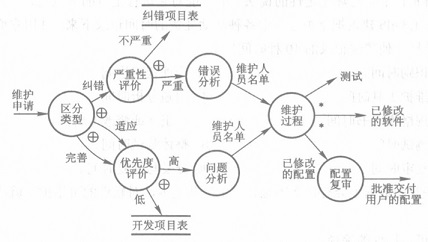

- 管理部门在接到维护申请后，首先要区分维护的类型。
  - 如果是纠错性维护，应该先估计错误的严重性。凡属严重的错误（例如关键子系统失效），需立即进行初步的分析，指定维护人员开始工作。对于不太严重的错误，可暂记入“纠错项目表”文件，定期地（例如一周或一月）安排维护。
  - 如果是适应性或完善性维护申请，则应在与用户充分协商的基础上确定轻重缓急。除个别特别紧迫、列入高优先级的项目需要立刻开始外，其余的申请都可以看成新的软件开发项目，记入“开发项目表”等待统筹安排。

上图，“维护过程”只用了一个圆框来表示。实际上，它包含了修改软件设计、设计复审、代码修改、单元测试、综合测试、直到确认测试等全部维护工作。从本质上说，维护工作可以看作开发工作的一个缩影；凡是开发时期用到的方法与文档，维护时期都使用。

2. **维护申请单和软件修改报告单**

这是维护时期新增加的两个文档，分别用于维护开始之前和结束以后。

维护申请单（maintenance request form，MRF）又称修改（change）申请单或软件问题报告单（software problem report，SPR），通常由申请维护的用户填写。纠错性维护的申请单应完整地说明导致错误发生的环境，包括输入数据、输出数据清单和其他有关的材料；适应性或完善性维护，则仅需提出一个简要的需求说明。

软件修改报告单（software change report，SCR）用于记录在维护时期对软件所作的每一次修改，其内容包括问题来源、错误类型、修改内容、资源（成本）耗用以及批准修改的负责人等。修改报告由直接进行修改和负责文档管理的人员共同填写。

3. **维护的副作用**

对于大型软件，即使一个小小的修改，也可能引入新错误。当修改范围少于10条语句时，一次成功的概率约为50%，若修改范围涉及50条语句，一次成功的概率将降为20%左右。如果对修改的部分不作严格的测试，几乎不可避免会引入新的错误。

因修改可能产生的副作用可归结为以下3类：

- 修改编码的副作用。错误较多地产生在对变量标识符、语句标号或子程序进行修改或删除的时候。修改逻辑运算符，修改打开或关闭文件的语句，也容易引入错误。当修改涉及代码的主要部分，或者为了改进程序性能而对代码进行修改时，尤其要警惕引入新的错误和问题。
- 修改数据的副作用。在做如下修改时容易引入错误：重新定义记录和文件的格式，重新定义局部或全局常数，改变子程序形式参数的顺序，改变数组或其他高级数据结构的大小，修改全局数据的相关内容等。在设计文档中对数据结构作完整的描述，建立各个模块对各数据的交叉引用表，都将有助于减少这一类副作用。
- 修改文档的副作用。文档与程序是软件的组成部分，任何对程序的修改，都应该及时反映到有关的文档上。如果只改程序而未修改有关文档（包括分发给用户的使用指南等手册），必将在今后的使用和维护中造成混乱。

## （四）软件维护的管理

维护活动是开发活动的一个缩影，维护也要同时做好技术与管理两方面的工作。这里仅就维护时期的一些管理工作进行简要的说明。

1. **维护的机构与人员**

维护是软件开发单位的责任，开发单位根据本身规模大小，可指定一名髙级管理人员担任维护管理员，或者建立由高级管理人员和专业人员组成的修改控制组（change control board，CCB），管理本单位开发的软件的维护工作。管理的内容，应包括对申请的审查与批准，维护活动的计划与安排，人力和资源的分配，批准并向用户分发维护的结果（例如软件的新版本），以及对维护工作进行评价与分析等。

具体的维护工作，可以由原开发小组承担，也可以指定专门的维护小组进行。

2. **维护管理文档**

除了移用开发时期的文档外，有几种文档是专供维护时期使用的，如上节所述的维护申请单和软件修改报告单，这里再介绍几种常用的文档。

维护日志。主要包括：

- 维护前程序的情况。例如程序的名称，语句或指令条数，所用的语言，安装启用日期，启用以来运行的次数和其中运行失效的次数等。
- 维护中对程序修改的情况。例如修改的级别，增加和删除的源语句数，修改日期与修改人，每一项改动耗费的人-时数等。
- 其他的重要数据，如维护申请单的编号，维护的类型，维护起止日期，耗用的总人-时数，维护完成后产生的净收益等。

维护日志在每次维护完成后填写，它是软件配置的组成部分，也可以存入配置管理数据库，供需要时査询。维护日志可以用前一文档核对以往有没有接到过类似的申请。

维护申请摘要报告和维护趋势图。

- 前者是一种定期报告，可以每周或每月统计一次。其内容包括上次报告以来己经处理了的、正在处理的和正在处理项目新接到的维护申请项数及其处理情况，以及新申请中特别紧迫的问题。
- 后者则是在前者基础上绘制而成，是一种不定期的报告图，图中显示了在统计的时期内每月收到的新维护申请以及正在处理的申请项数。

维护申请摘要报告可以显示维护的工作量及其变化趋势，如果把维护按纠错、适应和完善等不同种类分别统计，还可以从纠错性维护次数的变化中，看出软件在维护后的质量是提髙还是下降。

3. **维护费用的估算**

维护的工作量可以参照开发工作量来计算，可估计在一个时期内可能要修改或增加的源代码指令数，与原有的指令总数比较，得出一个活动比（activity ratio）
$$
ACT=\left(修改的指令数+增加的指令数\right)/指令总数
$$
然后，就可从开发时期耗费的人-月数估算出维护所需的人-月数，即
$$
MM_{维护}=ACT\times MM_{开发}
$$
考虑到开发时期对软件可靠性的重视程度以及采用现代软件开发方法的多少，可以再加上一个工作量调节因子（effort adjustment factor，EAF），于是上式又变成
$$
MM_{维护}=EAF\times ACT\times MM_{开发}
$$
另一种观点认为，开发时期没有采用结构化的方法与文档，就会增加被维护软件的复杂度；维护人员是否熟悉所维护的软件，也会直接影响维护的工作量。这二者加在一起，实际上决定了维护人员用于理解被维护软件所需要的工作量。因此以下列公式可作为估算维护工作量的模型：
$$
M=P+K^{(c-d)}
$$

- M，表示维护所需总工作量；
- P，表示生产性工作量，包括问题分析、修改设计与编码、回归测试等；
- K，表示经验常数；
- c，表示因未采用结构化的方法与文档而增加的软件复杂度；
- d，表示维护人员对软件的熟悉程度。

由上述模型可见，等式右边的第二项可以看作维护人员消化被维护软件的资料所花费的工作量，如果软件开发方法陈旧，原开发人员又不能参加维护，则该项因素将指数地增加，从而使维护费用大大上升。

## （五）软件配置管理

缺乏软件开发管理，会导致种种问题的出现，使得最终开发出来的软件产品的质量难以保证，应用难以稳定。

软件配置管理（software configuration management，SCM）有多种定义，例如：

- 对软件开发组所建立的软件的修改进行标识、组织和控制的艺术，其目标是减少错误和提髙生产力。
- 配置管理能够系统地处理变更，从而使得软件系统可以随时保持其完整性，故配置管理也可称为“变更控制”，用来评估提出的变更请求，跟踪变更，并保存系统在不同时间点上的状态。

由此可见，SCM是一套规范、高效的软件开发基础结构；作为整个软件过程的软件质量保证（SQA）活动之一，它也可应用于整个软件过程的保护性活动。

1. **配置管理的功能**

SCM应具备以下主要功能：系统地管理软件系统中的多重版本；全面记载系统开发的历史过程，包括为什么修改，谁作了修改，修改了什么；管理和追踪开发过程中危害软件质量以及影响开发周期的缺陷和变化。它还能对开发过程进行有效的管理和控制，可完整、明确地记载开发过程中的历史变更，形成规范化的文档；保证日后的维护和升级，保护积累代码资源，提高软件重用率。

2. **软件配置项**

软件配置项（software configuration item，SCI）的一个比较简单的定义：软件过程的输出信息可以分为3个主要类别：是计算机程序（源代码和可执行程序）、描述计算机程序的文档（针对技术开发者和用户）、数据（包含在程序内部或外部），这些项包含了所有在软件过程中产生的信息，总称为软件配置项。软件配置项的识别是配置管理活动的基础，也是制定配置管理计划的重要内容。

软件配置项分类的软件开发过程，是一个不断变化的过程，为了在不严重阻碍合理变化的情况下来控制变化，软件配置管理引入了基线（baseline）这一概念。IEEE对基线给出了如下的定义：“已经正式通过复审批准的某规约或产品，它因此可作为进一步开发的基础，并且只能通过正式的变更控制过程变化”。根据这个定义，可以在软件的开发流程中把所有需加以控制的配置项分为基线配置项和非基线配置项两类，例如，基线配置项可能包括所有的设计文档和源程序等；非基线配置项可能包括项目的各类计划和报告等。

配置管理贯穿于整个生存周期，在运行和维护时期，其任务尤为繁重。为了方便对多种产品和多个版本进行跟踪和控制，常常借助于自动的配置管理工具。

3. **配置管理工具**

第一类常用的工具是配置管理数据库。它存储关于软件结构的信息，产品的当前版本号及其状态，以及关于每次改版和维护的简单历史记录。数据库能够回答管理人员的种种问题，例如，每个产品有哪些版本，每版有什么差别，各种版本都有哪些文档，己分发给哪些用户，以及有关产品维护历史、纠正错误的数量等。

另一类工具称为版本控制库（version control library）。它可以是上述数据库的一个组成部分，也可以单独存在；它与数据库的差别是，后者是对所有软件产品进行宏观管理的工具，而版本控制库则着眼于单个产品，以文件的形式记录每一产品每种版本的源代码、目的代码、数据文件及其支持文档。每一文件均记有版本号、启用日期和程序员姓名等标识信息。管理人员根据需要，可以对任何文件进行建立、检索、编辑、编译（或汇编）等操作。

## （六）软件再工程

随着一次次软件的纠错或完善，会产生一些不可预测的问题，软件的稳定性和可维护性就越来越差。所谓软件再工程（software reengineering），就是将新技术和新工具应用于老的软件的一种较“彻底”的预防性维护。

一般的软件维护是局部的，以完成纠错或适应需求变化为目的；而软件再工程则是运用逆向工程（reverse engineering）、重构（restructure）等技术，在充分理解原有软件的基础上，进行分解、综合，并重新构建软件，用以提高软件的可理解性、可维护性、可复用性或演化性（evolvability）。

1. **软件再工程过程模型**

一个软件再工程过程模型如图所示。

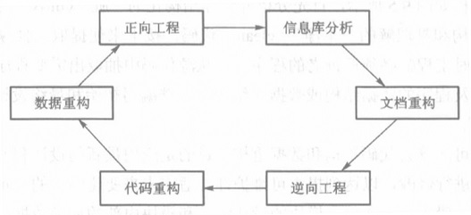

信息库中保存了由软件公司维护的所有应用软件的基本信息，包括应用软件的设计、开发及维护方面的数据，例如最初构建时间、以往维护情况、访问的数据库、接口情况、文档数量与质量、对象与关系和代码复杂性等。在确定对一个软件实施再工程之前，首先要收集上述这些数据，然后根据业务重要程度、寿命、当前可维护情况等对应用软件进行分析。

文档重构是重新构建原本缺乏文档的应用系统的文档。根据应用系统的重要性和复杂性，可以选择对文档全部重构、部分重构或维持现状。

逆向工程是一个恢复原设计的过程。通过分析现存的程序，从中抽取出数据、体系结构、和过程的设计信息。

代码重构是在保持系统完整的体系结构基础上，对应用系统中难于理解、测试和维护的模块重新进行编码，同时更新文档。

数据重构是重新构建系统的数据结构。数据重构是一个全范围的再工程活动，它会导致软件体系架构和代码的改变。

正向工程也称革新或改造，它根据现存软件的设计信息，改变或重构现存系统，以达到改善其整体质量的目的。

2. **逆向工程**

软件的逆向工程是指从源代码出发，重新恢复设计文档和需求规格说明书。一些CASE工具可以帮助实现逆向工程，它们或使源代码能以更清晰的方式显示，或直接从源代码中产生流程图或结构图之类的图表。

在理想状态下，逆向工程应该能导出多种不同层次的抽象，包括：低层的抽象，过程的设计表示；稍髙层次的抽象，程序和数据结构信息；相对高层的抽象，数据和控制流模型；高层抽象，实体-关系模型等。

逆向工程过程如图所示。

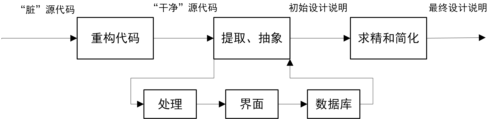

首先分析并将非结构化的“脏”（dirty）源代码重构为结构化的程序设计结构和易理解的“干净”（clean）代码；接下来便提取、抽象，这是逆向工程的核心活动，此时工程师必须评价老的程序，并从源代码中抽取出需要程序执行的处理、程序的用户界面以及程序的数据结构或数据库结构，相继编写初始和最终设计说明文档。

3. **软件重构**

软件重构又分为代码重构和数据重构，目的是应用最新的设计和实现技术对老系统的源代码和数据进行修改，以达到提髙可维护性、适应未来变化的目的。重构不改变系统的整体体系结构，一般仅局限在单个模块的设计细节和模块内部的局部数据结构。如果超出模块的边界并涉及软件的体系结构，这时的重构就变成正向工程了。

# 软件复用

软件复用目的是使软件开发在质量、生产效率和成本上得到改善甚至大幅度的优化。

## （一）软件复用的基本概念

软件复用就是将已有的软件成分用于构造新的软件系统。被复用的软件成分称为可复用构件，无论是对它原封不动地使用还是作适当的修改后再使用，只要是用它来构造新软件的，都可以看作复用。但如果在一个系统中多次使用一个相同的软件成分，则称为软件共享而不称作复用；对一个软件进行修改，使之能运行于新的软、硬件平台则称为软件移植而不称作复用。

### 1. 软件复用的定义

软件复用定义：在构造新的软件系统的过程中，对已存在的软件人工制品的使用技术。这个定义实际上包含两个方面的内容，一是制造软件构件的技术，二是使用软件构件的技术。引申为“开发伴随复用，开发为了复用”，精辟地概括了软件复用与软件开发的相互关系。

所谓制造软件构件的技术，是指独立于单个软件系统开发的、可服务于整个应用领域的构件生产技术；使用软件构件的技术有时也称为基于构件的软件开发（component based software development，CBSD），是指在软件系统开发中使用已有软件构件的方法和技术。

前者属于领域工程（domain engineering）的范畴，后者属于软件工程的范畴，二者共同组成基于构件的软件工程（component based software engineering，CBSE）。下图显示了CBSE的一种过程模型。

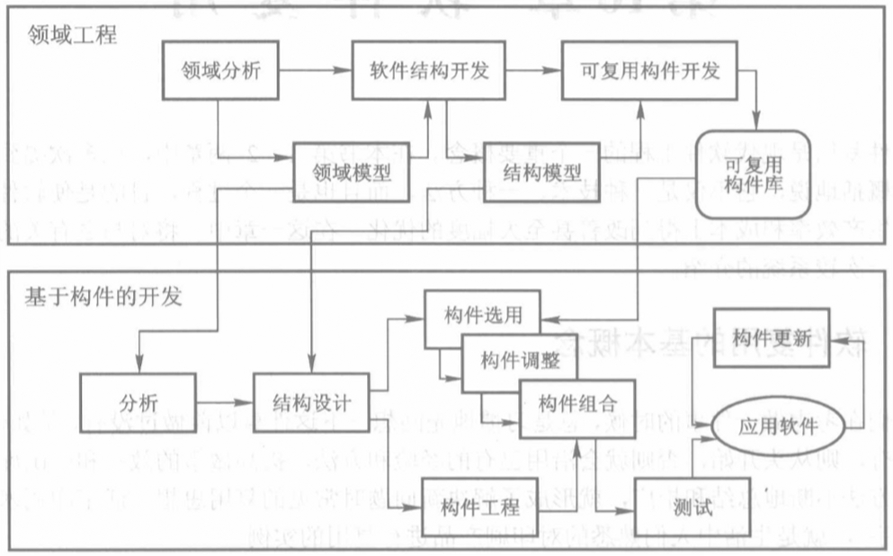

### 2. 软件复用的措施

一般认为，要在企业内部充分地实现软件复用，应优先采取以下一些措施：

- 在充分认识软件复用的重要性的基础上，尽快建立支持软件复用的基础设施，包括可复用构件库、用于创建复用构件的工具（例如一个制造可复用构件的辅助设计系统）等。
- 建立相应的培训计划，帮助软件工程师和管理人员理解和应用软件复用，在企业内部形成一个使用软件复用技术的环境。
- 采用更先进的、可以促进软件复用的软件开发方法，如面向对象的开发方法。
- 采取相应的激励措施。目前很多企业仍沿用传统的计算工作量的方法（如计算代码行），复用后工作量反而减少了，因此要采用相应的激励措施，鼓励软件工程师使用软件复用技术。

### 3. 软件复用的粒度

可供复用的软件制品有源代码、体系结构、需求模型和规格说明、各种设计、用户界面、数据、测试用例、用户文档和技术文档、项目计划、成本估计等。按照复用粒度的大小，这些软件制品可从小到大分为以下4类。

1. **源代码复用**

源代码（例如子程序）复用是指对构件库中用高级语言编写的源代码构件的复用，它是最常见，也是粒度最小的复用，仅能带来较小的生产率收益和可靠性收益。

实际上源代码构件本身就是为复用而开发的，存放在可供访问的构件库中，使用者通过对构件库的检索找到适用的构件，并设置参数值使之具有新的适应性，即可通过调用过程来调用构件。

这类复用的特点是：一方面，构件经过充分测试，因此具有较高的可靠性，使用者只需设置参数而无须介入构件内部，降低了复用的难度；另一方面，正因为构件是为复用而开发的，因此其通用性、抽象性成为在具体使用时必须面对的问题。

2. **软件体系结构复用**

对已有的软件体系结构复用，既支持高层次，也可支持低层次的复用。要求存放体系结构的库能提供有效的检索，使用者通过良好定义的接口进行集成。

这类复用的特点是：一方面，可复用较大粒度的软件制品，其修改具有局部性；另一方面，因为难以抽象出简明的描述，存放体系结构的库往往不易管理。

3. **应用程序生成器**

应用程序生成器用于对整个软件系统的设计的复用，包括整个软件体系结构、相应的子系统、特定的数据结构和算法。通常，从高层的领域特定的需求规约自动生成一个完整的可执行系统，生成器根据输入的规约填充原来不具备的细节。一般仅针对一些成熟的领域。

这类复用的特点是：一方面，自动化程度高，能获取某个特定领域的标准，以黑盒形式输出结果（应用程序）；另一方面，特定的应用程序生成器不易构造。

4. **领域特定的软件体系结构的复用**

这类复用是指对特定领域中存在的一个公共体系结构及其构件的复用。要求对领域有透彻的理解才能进行领域建模；库是针对特定领域的；领域模型、基准体系结构和库都随着领域的发展而不断发展。基准体系结构用体系结构描述语言来描述，根据相关领域特定的刻面（faceted）集合，从库中选择基准体系结构和构件，并通过良好定义的接口进行集成。

这类复用的特点是：一方面，其复用程度髙，对可复用构件的组合提供一个通用框架；另一方面，前期投资很大。

## （二）领域工程

定义新构件，首先要在应用领域的模型中找出有共性、可通用的部分，要根据这个领域的知识和应用模型，抽取出最合理的构件定义。这里的领域，通常指一组具有相似或相近软件需求的应用系统所覆盖的区域。

多个应用系统之间的功能交集，为软件复用提供了机会；交集的面积越大，可复用的功能就越多，由最多应用系统形成的交集，就是最优复用。所谓领域工程，就是通过领域分析找出最优复用，把它们设计和构造为可复用构件，进而建立大规模的软件构件仓库的过程。

### 1. 横向复用和纵向复用

按复用活动所应用的领域范围，复用可分为横向复用和纵向复用两种。横向复用是指复用不同应用领域中的软件元素，例如数据结构、分类算法、人机界面构件等，标准函数库就是一种典型的原始横向复用机制。纵向复用是指在一类具有较多公共性的应用领域之间，对软件构件进行复用。由于在两个截然不同的应用领域之间实施软件复用非常困难，故纵向复用广受瞩目，并成为软件复用技术的焦点。

下面以纵向复用的领域工程为例，重点说明它所包括的以下几方面的主要活动：

1. 实施领域分析，它是领域工程的核心。根据应用领域的特征及相似性，可预测软件构件的可复用性，发现并描述可复用实体，进而建立相关的模型和需求规约。
2. 开发软件构件。一旦确认了软件构件的复用价值，即可进行构件的开发并对具有复用价值的构件进行抽象化、一般化和参数化，以便它们能适应新的、类似的应用领域。
3. 建立软件构件库。将软件构件及其文档分类归并，形成相关的分类检索机制，成为可供后续项目使用的可复用资源。

下图简明地显示了纵向复用领域工程主要活动的内容及其与软件开发的关系。

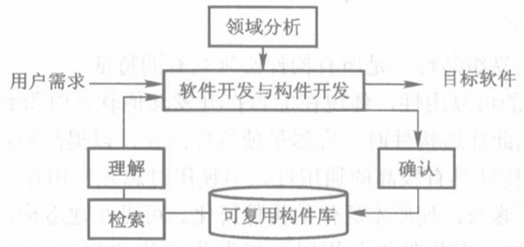

### 2. 实施领域分析

领域分析是在特定应用领域寻找最优复用的过程，它以公共对象、类、子集合和框架等形式进行标识，然后对它们进行分析和规约。这个阶段的主要目标是获得领域模型（domain model），领域模型描述的需求为领域需求，根据领域需求，领域工程师寻找领域的共性，进而确定软件的可复用构件。

下图显示了怎样从与领域相关的知识，通过领域分析来获得领域的分析模型。一般领域分析可成以下几个步骤：

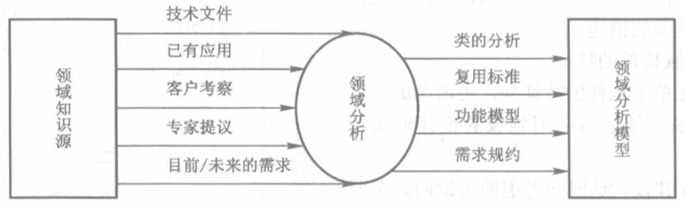

1. 选择特定的领域。
2. 抽取具有最优复用的功能。
3. 标识该功能。
4. 建立领域分析模型。
5. 定义需求规约，得出由需求规约构件和若干个连接子配置构成的领域模型。

### 3. 开发可复用构建

为使构件能具有较高的可复用性，在建造构件的时候应遵循以下的原则与方法。

1. **单个构件的特征**

通用性、可变性和易组装性，是所有构件必须具有的特征。

**通用性**。构件的可复用性，体现在能否在开发其他软件时得到使用,使用率越高，说明可复用度越高。因此建造构件时，应尽量使构件泛化，以提高构件的通用性。

**可变性**。尽管构件具有较高的通用性，但使用时总是应用在一个具体的开发环境中的，其某些部分可能要修改，使原本泛化的构件特化；在建造构件时，应该提供构件的特化和调整机制。

例如，在构件被复用时可能发生变化的相应位置上，可以标识变化点（variation point），同时为变化点附加对应的变体（variant）；每个变化点与变体可与相应的文档关联，让文档解释如何使用它以及如何选择变体。这样当该构件被复用时，即可根据不同的应用指定不同的变体，使抽象变得具体，以适应特定应用的需要。

**易组装性**。构件通常存放在构件库中，当开发一个软件时，首先从构件库中检索到若干合适的构件，经过特化再进行组装。无论是同构件（即具有相同软、硬件运行平台）的组装，还是异构件（即具有不同软、硬件运行平台）的组装，这些构件都应具有良好的封装性和良好定义的接口，构件之间应具有松散的耦合度，同时还应提供便于组装的机制。

下图显示的基于面向对象技术的复用（reuse based on objected-oriented technology，REBOOT）构件模型，对可复用构件的一般特征作了较全面的描述。

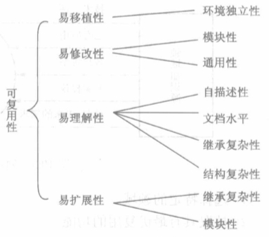

2. **领域构件的特征**

除满足单个构件的特征外，还需考虑应用领域的特征，使之与应用领域的设计框架相适应，这时应考虑的关键问题主要包括：

**标准数据**。通过对应用领域的研究，标识出标准的全局数据结构（如文件结构和完整的数据库），使所有设计的构件都可以用这些标准数据结构来刻画。

**标准接口协议**。建立3个层次的接口协议，即构件内接口、构件外接口、和人机接口。

**程序模板**。成形的结构模型，可以用作新程序的体系结构设计模板。

一旦建立了应用领域的标准数据、标准接口协议和程序模板，设计者就有了一个可以在其中进行领域设计的框架。符合这个框架设计出来的新构件，以后在该领域的复用中将获得更高的复用概率。

3. **几种流行的典型构件技术**

为方便构件之间的集成和装配，必须有一个统一的标准。经过几年的发展，已经提出了多种构件的模型及规范，形成了一些较有影响的构件技术，其中有微软公司的COM/OLE、对象管理组织（OMG）的跨平台的开放标准CORBA以及OpenDoc等。这些技术的流行为构件提供了实现标准，也为构件的集成和组装提供了很好的技术支持。

- COM（Component Object Model）是Microsoft开发的一个构件对象模型，它提供了对在单个应用中使用不同厂商生产的对象的规约。OLE(Object Linking and Embedding）是COM的一部分，由于OLE已成为微软操作系统的一部分，因此目前应用最为广泛。
  - 最早的组件连接技术OLE1.0是Microsoft公司于1990年11月在COMDEX展览会上推出的，它给出了软件构件的接口标准。任何人都可以按此标准独立地开发组件和增值组件（指在组件上添加一些功能构成的新组件），或由若干组件组建集成软件。
  - 在这种软件开发方法中，应用系统的开发人员可在组件市场上购买所需的大部分组件，因而可以把主要精力放在应用系统本身的研究上。
- CORBA（Common Object Request Broker Architecture）是由对象管理组织于1991年发布的一种基于分布对象技术的公共对象请求代理结构，其目的是在分布式环境下，建立一个基于对象技术的体系结构和一组规范，实现应用的集成，使基于对象的软件组件在分布异构环境中可以复用、移植和互操作。
  - CORBA是一种集成技术，而不是编程技术。它提供了对各种功能模块进行构件化处理，并将它们捆绑在一起的黏合剂。一个对象请求代理提供一系列服务，它们使可复用构件能够和其他构件通信，而不管它们在系统中的位置。
  - 当用CORBA标准建立构件时，这些构件在某一系统内的集成就可以得到保证。加上基于CORBA规范的应用屏蔽了平台语言和厂商的信息，使得对象在异构环境中也能透明地通信。
  - 对于CORBA定义的通用对象服务和公共设施，用户还可以结合其特殊需求来构造应用对象服务，以提供企业应用级的中间件服务系统。
- OpenDoc（开放式文档接口）是1995年3月由IBM、Apple和Novell等公司组成的联盟推出的一个关于复合文档和构件软件的标准。该标准定义了为使用不同开发者提供的构件之间能够相互操作而必须实现的服务、控制基础设施和体系结构。由于OpenDoc的编程接口比OLE小，因此OpenDoc的应用程序能与OLE兼容。

### 4. 建立可复用构件库

一个可复用构件库中存放着成千上万的可复用构件，要想方便地选择和使用该库中的可复用构件，要求对构件库有严密的管理、有效的分类和科学的描述。目前最常用的有3种分类模式。

**枚举分类**（enumerate classification）通过定义一个层次结构来描述构件，在该层次中定义软件构件的类以及不同层次的子类。枚举分类的优点在于易理解和使用，这是因为对每个层次中都进行了详细的定义。但它的缺点也在于此，它要求在进行领域分析时，对每个层次都给予足够的信息，导致了成本的提高。

**刻面分类**（faceted classification）对领域进行分析后，可标识出一组基本的描述特征，这些特征就称为刻面（意为呈现于用户面前的一个方面）。刻面可以描述构件的功能、被操作的数据、构件应用的语境等各种特征，并根据其重要性区分优先次序并被联系到构件。通常一个构件的刻面描述被限定不超过7或8个刻面。

每个刻面可含有一个或多个值，这些值一般是描述性关键词，通过关键词可以很容易地查找到所需的构件。刻面描述具有较大的灵活性，因为可以随时增加新的刻面值，同枚举分类相比，更易于扩展和进行适应性修改。

**属性-值分类**（attribute-value classification）为领域中的所有构件定义一组属性，然后赋给这组属性一组值。通过查询相应属性的值，找出所需构件。属性-值分类与刻面分类具有相似处，但也有不同：

1. 属性-值分类对可使用的属性数量没有限制，而刻面分类被限定不超过7或8个刻面。
2. 属性-值分类中的属性没有优先级，而刻面可以区分优先级。
3. 属性-值分类不具有同义词功能，而刻面分类可以查找相关的技术同义词。

构件库不仅要选择适当的分类方法，还需有方便的环境支撑。一个良好的可使用复用构件的环境，通常应包括以下这些内容：存放描述构件的分类信息的数据库、该数据库的管理系统、允许用户查找构件的检索系统、可以自动将构件加入新系统中的CASE工具。

## （三）基于构件的软件开发

应运而生的CBSD（Component based software development）彻底改变了软件的生产方式，从根本上提高了软件生产的效率和质量，提高了开发大型软件系统的成功率。

### 1. 构件集成模型

构件集成模型构造应用软件系统的流程如图所示，这是一个针对复用的过程模型，从中可以看到如何利用软件构件迭代地进行产品的开发与发布。

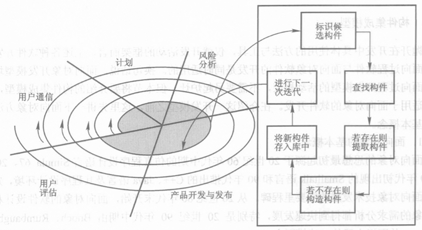

在CBSD开发中，可首先通过相应的査询工具，在构件库中按照匹配原理查找满足自己需求的构件（这是以使用者对被复用对象的理解为基础的），如果找到，则将其复合组装到新的应用程序中，此过程可能要进行适应性修改。下图显示了把库中的构件集成到一个应用系统中的过程。

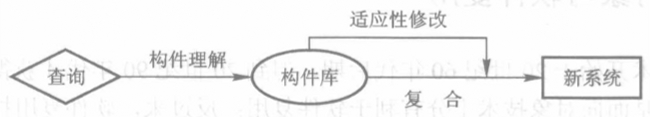

### 2. 应用系统工程

在CBSD中，通过复用构件系统开发单个应用系统的构件工程，称为应用系统工程（application system engineering，ASE）。ASE过程的实质是从一个或多个构件系统中选择构件进行特化，最后把构件装配成应用系统。以下是ASE过程的基本步骤。

1. 获取需求。由客户开始，通过复用用例构件构建应用系统的用例模型。主要从客户和最终用户那里收集输入，还可以从业务模型和系统模型中收集输入。评价每个用例的重要性和成本。
2. 分析。把用例模型作为输入来组装和特化设计构件。
3. 设计应用系统。把分析模型作为输入来组装和特化设计构件。
4. 实现应用系统。把设计模型作为输入来组装和特化实现构件。
5. 测试应用系统。组装和特化测试构件，然后测试应用系统。
6. 应用系统打包。应用系统打包，以便提供给制造商、安装者或最终用户使用。

一个支持复用的软件开发过程包括如下活动：检查领域模型和可复用构件，收集和分析最终用户的需求，设计并实现需要附加的构件，对所提供的可复用构件进行必要的修改，建造和测试整个应用软件等。

还需指出，CBSD的实施不仅需要技术的支持，还需要有机构的保证。在以往的软件开发机构中，通常以项目为中心进行管理，项目经理都把注意力集中在自己负责的单个项目上，很少有人考虑建造可共享的可复用构件，每个项目都从头做起，因而造成资源的极大浪费。所以在具体实施软件复用时，还需重组软件开发组织的结构，并对软件开发过程进行调整。

## （四）面向对象与软件复用

面向对象技术十分有利于软件复用，软件复用技术也对面向对象软件的开发提供了有力支持，二者相辅相成，互相促进。

### 1. OO方法对软件复用的支持

运用OOA定义的对象类，就具有可复用构件的许多特征。以下从8个方面，说明OO方法对软件复用的支持。

1. **OOA模型**。OOA建立的系统模型分为基本模型和补充模型，基本模型只表示最重要的系统建模信息，而细节的信息则在详细说明中给出。这种表示方法，使OOA的基本模型体现了更高的抽象，更容易作为可复用的系统构架。当这种构架在不同的应用系统中复用时，往往可通过不同的详细说明体现系统之间的差异，因此对系统构件的改动较少。
2. **OOA与OOD的分工**。OOA只注重与问题域及系统责任有关的信息，OOD则需考虑与实现条件有关的因素。这种分工使OOA模型独立于具体的实现条件，从而使分析结果可以在问题空间及系统责任相同而实现条件互异的多个系统中复用，并为从同一领域的多个系统的分析模型中提炼领域模型创造了有利条件。
3. **对象的表示**。所有的对象都用类作为其抽象描述。对象的一切信息，包括对象的属性、行为及其对外关系等，都是通过类/对象来表示的。类作为一种可复用构件，在应用于不同系统时，不会出现因该类对象实例不同而使系统模型有所不同的情况。
4. **一般-特殊结构**。面向对象方法引入了对一般-特殊结构中多态性的表示法，从而增强了类的可复用性。通过对多态性的表示，使一个类可以在需求相似但不完全相同的系统中被复用。
5. **整体-部分结构**。把部分类作为可复用构件在整个类中使用，其原理与在特殊类中使用一般类是一致的，但在某些情况下，对问题空间的映射比通过继承实现复用显得更为自然。此外，还可通过整体-部分结构来支持领域复用的策略，即从整体对象中分离出一组可在领域范围内复用的属性与服务，定义为部分对象，使之成为领域复用构件。
6. **实例连接**。建议用简单的二元关系表示各种复杂关系和多元关系。这一策略使构成系统的基本成分（类/对象）以及它们之间的关系在表示形式和实现技术上都可以做到规范和一致，而这种规范性和一致性对于可复用构件的组织、管理和使用，都是很有益的。
7. **类描述模板**。类描述模板作为OOA详细说明的主要成分，对于对象之间关系的描述注意使用者与被使用者的区别，仅在使用者一端给出类之间关系的描述信息，这说明可复用构件之间的依赖关系不是对等的。因此，在继承、聚集、实例连接及消息连接等关系的使用者一端描述这些关系，有利于这些关系信息和由它们指出的被依赖成分的同时复用。而在被使用者一端不描述这些关系，避免了因复用场合的不同所引起的修改。

8. **用例**。由于用例是对用户需求的一种规范化描述，因此它比普通形式的需求文档具有更强的可复用性。每个用例是对一个角色使用系统某项功能时与系统进行交互活动所做的描述，它具有完整性和一定的独立性，因此很适于作为可复用构件。

### 2. 复用技术对OO方法的支持

复用技术对OO方法的支持，可以从以下5个方面来说明。

1. **类库**

类库是实现对象类复用的基本条件，许多基于各种面向对象语言的编程类库，有力地支持了源程序级的软件复用；但要在更髙的级别上实现软件复用，仅有编程类库是不够的。实现OOA结果和OOD结果的复用，必须有分析类库和设计类库的支持。

为更好地支持多个级别的软件复用，可以在OOA类库、OOD类库和OOP类库之间建立各个类在不同开发阶段的对应与演化关系；即建立一种线索，表明每个OOA的类对应着哪个（或哪些）OOD类，以及每个OOD类对应着各种OO编程语言类库中的哪个（或哪些）OOP类。

类库只能存储和管理以类为单位的可复用构件，不能保存其他形式的构件；不过它可以更多地保持类构件之间的结构与连接关系。

2. **构件库**

构件库中的可复用构件，既可以是类，也可以是其他系统单位；其组织方式，可以不考虑对象类特有的各种关系，只按一般的构件描述、分类及检索方法进行组织。

在面向对象的软件开发中，可以提炼比类/对象粒度更大的可复用构件，例如把某些结构或某些主题作为可复用构件；也可以提炼其他形式的构件，例如用例图或交互图。

在这些构件库中，构件的形式及内容比类库更丰富，可为面向对象的软件开发提供更强大的支持。

3. **构架库**

如果在某个应用领域中已经运用OOA技术建立过一个或几个系统的OOA模型，则每个OOA模型都应该保存起来，为该领域中新系统的开发提供参考。

当一个领域已有多个OOA模型时，便可以通过进一步抽象而产生一个可复用的软件构架。形成这种可复用软件构架的更正规的途径是开展领域分析。通过正规的领域分析获得的软件构架将更准确地反映一个领域中各个应用系统的共性，它在OO开发中具有很强的可复用价值。

4. **工具**

一些支持复用的软件工具，包括类库或构件/构架库的管理、维护与浏览工具、构件提取与描述工具以及构件检索工具等。

这些工具对OOA/OOD过程也具有很强的支持功能，例如，从类库或构件/构架库中寻找可复用构件；对构件进行修改，并加入当前的系统模型；把当前系统开发中新定义的类（或其他构件）提交到类库（或构件库）等等。

5. **OOA过程**

在复用技术支持下的OOA过程，可以按两种策略进行组织。第一种策略是，基本保持某种OOA方法所建议的OOA过程原貌，在此基础上对其中的各个活动引入复用技术的支持；另一种策略是重新组织OOA过程。

第一种策略是在原有的OOA过程基础上增加复用技术的支持，应补充说明的一点是，复用技术支持下的OOA过程应增加一个提交新构件的活动。即在一个具体应用系统的开发中，如果定义了一些有希望被其他系统复用的构件，则应该把它提交到可复用构件库中。

第二种策略的前提是，在对一个系统进行面向对象的分析之前，已经用面向对象方法对该系统所属的领域进行过领域分析，得到了一个用面向对象方法表示的领域构架和一批类构件，并且具有构件/构架库、类库及相应工具的支持。在这种条件下，重新考虑OOA过程中各个活动的内容及活动之间的关系，力求以组装的方式产生OOA模型，将使OOA过程更为合理。

### 3. 基于构件软件开发的现状与问题

对于CBSD而言，对象技术并不是必需的，同时仅仅依靠对象技术也不能实现CBSD。就对象技术本身而言，并不能全面地表述CBSD所需的抽象概念，而且即使脱离对象技术，CBSD也完全可以实现。具体地说，CBSD将导致使用对象技术的系统设计方法、项目管理方法和组织形式发生实质性的变革；但如果将构件看作是一个可替换单元时，单纯的对象技术就不够了。

这是因为，构件的各种定义中都或多或少地强调了构件的一个特性，即对上下文的依赖性，但是对象技术却根本不支持构件的这种特性，这不利于进行设计层的抽象，特别是在试图使用已有的构件进行集成时，经常会遇到麻烦。

作为第三代软件工程的核心，软件复用现在面临着各方面的困难。无论是技术问题还是非技术问题，都影响到软件复用的广泛实施。具体而言，大粒度的可复用软件制品其抽象一定是复杂的，为了使用这些制品，软件开发者必须提前熟悉这些抽象，并且花时间去研究和理解它。例如，数学概念库的开发者要熟悉数学库的使用及抽象数据类型模型；语义的开发者要熟悉栈和队列的使用；某个特定应用领域的开发者要熟悉所使用领域特有的应用生成程序和领域语言等。

另外，软件产品是一种精神产品，它的产生几乎完全是人脑思维的结果。它的价值几乎完全在于其中所凝结的思想，其物质载体的制造过程与价值含量都是微不足道的。物质产品的生产只受到人类制造能力的限制，现有的一切物质产品的复杂性都没有超过这种限度。而软件却没有这种限制，只要人的大脑能想到的问题，都可能要求软件去解决。由于人脑所能思考的问题的复杂性远超出了人类能制造的物质产品的复杂性，因而使软件的复用更为困难。

# 软件工程管理

技术和管理，是软件生产中不可缺少的两个方面。对技术而言，管理意味着决策和支持。只有对生产过程进行科学的管理，做到技术落实、组织落实和费用落实，才能达到提高生产率、改善产品质量的目的。失败软件中，因管理不善造成失败的项目占总失败项目的半数以上。

## （一）管理的目的与内容

管理的目的是为了按照预定的时间和费用，成功地完成软件的计划、开发和维护任务。软件管理主要体现在软件的项目管理中，包括对于费用、质量、人员、进度等4个方面的管理。

在开发软件项目前，首先需制定“项目实施计划”，以便按照计划的内容组织与实施软件的工程化生产。项目管理的最终目标，就是要以合理的费用和进度，圆满完成计划所规定的软件项目。它是费用、质量、人员和进度等管理在一个项目上的综合体现。

1. **费用管理**

目的是对软件开发进行成本核算，使软件生产按照商品生产的经济规律办事。其主要任务是：以简单实用和科学的方法估算出软件的开发费用，作为签订开发合同的根据；管理开发费用的有效使用，用经济手段来保证产品如期按质完成。

2. **质量管理**

目的在于保证软件产品（包括最终程序和文档）的质量。为了贯彻全面质量控制（TQC）的原则，每个项目都要制定“质量保证计划”，并由专设的质量保证小组负责贯彻，确保在各个阶段的开发和维护工作全都按软件工程的规范进行。鉴于质量管理的重要性，第在之后将详细讨论。

配置管理是质量管理的重要组成部分，包括对于程序、文档和数据的各种版本所进行的管理，以保证资料的完整性与一致性。对于重要的和大型的软件，需要制定单独的“配置管理计划”，并由专设的人员进行管理。

3. **项目管理**

除经费和质量外，项目的进度和人员也是项目管理的重要内容。为了按时完成进度，项目经理和下属的子项负责人应制定详细的工作计划，用网络图描述各部分工作进度的相互关系。对各个开发阶段所需的人力资源，也要分类做出估算，写入项目实施计划。

此外，在项目计划的实施过程中，项目经理或开发组长应定期填写“项目进展（月/季）报表”，并在需要时对进度进行适当的调整；开发结束后，还应写出“项目开发总结”。报表和总结的内容请参阅有关的规范手册。

## （二）软件估算模型

数据是一切管理工作的基础。对一个软件开发项目进行管理的唯一有效方法，就是对开发过程中发生的一切进行监控与度量，不进行度量的事物是控制不住的。

估算在软件度量中占有重要地位。一般地说，在软件开发之后可进行度量，但在软件开发之前只能进行估算，它需要管理工作者的经验和勇气。

### 1. 资源估算模型

资源模型（resource model）可用来估算软件在开发中花费的资源，如开发时间、开发人数以及用人-月或人-年计算的工作量等。大多数资源模型是根据过去的经验，通过大量的统计和分析推导出来的，它们揭示了在一定条件下资源花费和软件规模之间的内在关系。

人-月是工作量E的计算单位，它表示了整个项目所有人工作时间的积累；如3个人工作前2个月，5个人工作后1个月，则总工作量就是3×2+5×1=11人-月。但需要注意的是，它只是一个工作量的单位，并不能通过它来简单的计算工作时间，如8人-月并不是说8个人工作一个月就可以完成的；而应考虑各种因素和经济的一般规律。

但是，估算资源花费涉及许多可变的因素。以开发工作量为例，它与给定的开发时间、开发人员的能力、产品的规模和复杂度、要求达到的可靠性等级以及开发的环境和工具等因素都有直接的关系。很难找出一种适用于各类应用领域与开发环境的资源模型。下面将介绍几种较典型的资源模型。

1. **静态单变量资源模型**

该模型在计算软件开发的资源花费时，只需设置被开发软件的一种参数，故称为单变量型。它的一般形式是：
$$
资源=c_1\times(估计的软件特征)^{c_2}
$$

- 资源可以是开发工作量E（单位为人-月）、开发时间T（单位为月）或开发人数P（单位为人）等。
- 估计的软件特征可以是源程序长度L（单位为千行）或软件的开发工作量E。
- c~1~和c~2~是依赖于开发环境和软件应用领域的两个经验常数。

从大量的的统计中（1973~1977）导出了以下的一组参数方程：
$$
E=5.1L^{0.91} \\
T=4.1L^{0.36} \\
T=2.47E^{0.35} \\
P=0.54E^{0.6} \\
文档长度=49L^{1.01}
$$

- 这组方程在计算E、T、P等开发所需的资源时，使用L作为软件的估计特征。
- 由L计算开发时间、工作量或文档页数，再根据算出的工作量E来计算开发时间与所需人数。

这类模型简单易懂，常数c~1~与c~2~可以从历史数据导出，但如没有适用于本单位情况的经验常数，就不能直接搬用。

2. **Putnam资源模型**

Putnam模型是一种多变量资源模型，可以用下面的方程式来表示：
$$
L=cK^{1/3}T^{4/3} \Longleftrightarrow K=L^3/(c^3T^4)
$$

- 其中L与T仍分别代表源程序长度（单位为行）和开发时间（单位为年）。
- K表示全生存周期（含维护在内）所需要的工作量（单位为人-年）。对大型软件而言，其大小约为开发工作量E的2.5倍，即K=4E。
- c是一个与开发环境有关的常数。对优良、好与不好的3种环境，c的典型值可分别取12500、10000、6500。

一般认为，规模在10万行以上的软件，用这个模型是适当的。

Putnam模型特点，是在同一个模型中给出了K（或E）、L和T三者之间的关系；它揭示了E与T之间的关系，即开发工作量E与开发时间T的4次方成反比，这表明，开发时间的微小变化，会引起开发工作量相当大的变化。

压缩软件项目的开发时间，意味着显著增加项目的开发工作量。不过应该注意的是，任何软件的开发时间都有一个最佳值，在最佳值附近增加或缩短开发时间，都只会使工作量增大。

Putnam模型有时也称为资源调度模型（resource deployment model）或动态多变量资源模型。

### 2. COCOMO模型

构造性成本模型（constructive cost model，COCOMO）以静态单变量模型为基础，但在下列两个方面作了较大的改进：

按照软件的应用领域和复杂程度，将它们分为组织（organic）、半独立（semidetached）和嵌入（embed）三种类型，每类分别使用一组不同的模型方程。如下表所示，由上向下，程序的复杂度逐步提高，E和T的计算值也随之增大。

| 软件类别 |                    模型方程                     |                           适用范围                           |
| :------: | :---------------------------------------------: | :----------------------------------------------------------: |
|  组织型  | E=3.2L1.05 T=2.5E0.38 |    高级语言应用程序，如科学计算、数据处理、企业管理程序等    |
| 半独立型 | E=3.0L1.12 T=2.5E0.35 |            大多数实用程序，如编辑程序、链接程序等            |
|  嵌入型  | E=2.8L1.20 T=2.5E0.32 | 与硬件关系的系统程序，如操作系统、数据库管理系统、实时处理与控制程序等 |

在模型中增加一个工作量调节因子（effort adjustment factor，EAF），调节因子反映各种有关因素对软件开发的影响，这些因素可归结为4类、15种因子，如表所示。

|    属性    |                           调节因子                           |                          调节值范围                          |
| :--------: | :----------------------------------------------------------: | :----------------------------------------------------------: |
|  产品属性  |        要求的可靠性等级 数据库规模 产品复杂度        |           0.75\~1.40 0.94\~1.16 0.70\~1.65           |
| 计算机属性 | 对程序执行时间的约束 对程序占用存储容量的约束 开发环境的变动 开发环境的响应时间 |   1.00\~1.66 1.00\~1.56 0.87\~1.30 0.87\~1.15    |
|  人员属性  | 分析员水平 程序员水平 对应用领域的熟悉程度 对开发环境的熟悉程度 对所用语言的熟悉程度 | 1.46\~0.71 1.42\~0.70 1.29\~0.82 1.21\~0.90 1.14\~0.95 |
|  项目属性  |  开发方法的现代化 软件工具的数/质量 完成时间的限制   |           1.24\~0.82 1.24\~0.83 1.23\~1.10           |

每种因子的标称调节值为1，可根据实际情况在一定范围内上下浮动，模型中使用的调节因子值，就是这15种因子的值的乘积，可以写作
$$
EAF=\prod_{i=1}^{15}F_i \qquad (i=1,2,...,15)
$$
最终的结果是将初步的计算结果乘以调节因子得到的。

## （三）软件成本估计

成本估计是软件费用管理的核心，也是软件工程管理中最困难、最易出错的问题之一。前述介绍的资源模型，仅是估计成本的一种手段。成本估计方法有多种分类，这里介绍主要的三种。

### 1. 自顶向下成本估计

这类方法着眼于软件的整体，根据被开发项目的整体特性，首先估算出总的开发成本，然后在项目内部进行成本分配。因这类估计通常仅由少数上层（技术与管理）人员参加，所以属于“专家判断”的性质。这些专家依靠从前的经验，把将要开发的软件与过去开发过的软件进行类比，借以估计新的开发所需要的工作量和成本。

自顶向下估计的缺点是，对开发中某些局部的问题或特殊困难容易低估，甚至没有考虑。如果所开发的软件缺乏可以借鉴的经验，在估计时就可能出现较大的误差。

当参加估计的专家人数较多时，可采用特尔斐（Delphi）法来汇集他们的意见。首先用各自填表代替相互讨论，这样既避免了对立意见的直接交锋，又可保持各专家独立发表意见；其次对个别专家的不同估计，协调人应单独与之讨论，并请他说明理由。

### 2. 由底向上成本估计

由底向上估计是从一个个任务单元开始，具体做法是，先将开发任务分解为许多子任务，子任务又分成子子任务，直到每一任务单元的内容都足够明确为止，然后把各个任务单元的成本估计出来，汇合成项目的总成本。由于任务单元的成本可交给各该任务的开发人员去估计，得出的结果常比较实际。

缺点是，由于具体工作人员往往只注意到自己范围内的工作，对综合测试、质量管理和项目管理等涉及全局的花费可能估计不足，甚至完全忽视。因此，就会有可能使成本估计偏低。

利用系统的分类活动结构图（work breakdown structure，WBS）可有效地避免在估计中遗漏任务。它既可用来表示一个项目的产品，又能表示项目的开发过程，它们把一个项目开发任务的各项工作全都在图中表示出来，在估计成本时可以一览无遗。

### 3. 算法模型估计

算法模型就是资源模型，由于任何资源模型都是根据历史数据导出的，所以比较客观，计算结果的重复性也好（即不论什么时候使用模型，都能得出同样的结果）。像COCOMO这样带有调节因子的模型，还能够灵敏地反映因开发条件改变而引起的成本变化，从而能够定量分析各种因素对于成本的影响。

模型估计的关键，是要选好适用的模型，选择跟实际情况符合的各种系数和指数，不能简单搬用别人的模型。COCOMO模型适应面较宽，但其调节因子取值时带有主观成分，其分寸不易掌握好。

模型估计法常与自顶向下估计或由底向上估计结合使用。以COCOMO模型为例，使用自顶向下方法时，可以用COCOM0模型来计算整项目的成本；如果使用由底向上方法，又可用这一模型来计算各个任务单元的成本。

### 4. 分析与讨论

没有一种方法能够在各个方面都优于其他的方法，一种方法的优点往往正是另一种方法的缺点。模型法不仅适用的模型难找，还偏重于过去（指历史数据）和共性（统计平均值），忽略了将来（新技术与新开发环境的影响）和个性（开发中的特定条件）。

所以主张几种方法同时使用，然后将所得的结果对照比较。在多数情况下，这种估计和比较要反复多次，才能取得合理的结果。

成本估计的实质，是对源程序长度或开发工作量的估计。在不同开发阶段对程序长度进行追踪估计，通过连续的估计减小对程序的长度的估算误差。

通过估计工作量来计算成本，是又一种常用的成本估计法。需要指出，不同的任务，成本率也各不相同；一般的说，分析与设计任务的成本率将高于编码和测试，计算成本时需分别计算。花费在项目计划与管理上的工作量，也应把这一部分加入成本中。

成本估计也可以利用工具进行，但由于成本估计在很大程度上依赖于开发单位的条件，所以商品化的成本计算工具还不多见，多数工具仅供开发单位自己使用。

## （四）人员的分配与组织

在实际工作中，各个开发阶段需要的人力并不相同。一般的说，计划与分析阶段只需要很少的人，概要设计参加的人略多一些，详细设计的人员又多一些。到了编码和测试阶段，参加的人数达到最高峰。在运行初期，需要较多的人参加维护，但很快就可以减少下来，只需保留很少的维护人员就可满足需要。

如何按照实际需要来确定各阶段所需的人力，下面将介绍一些有关的指导原则。

### 1. Rayleigh-Norden曲线

下图显示了Rayleigh-Norden曲线的典型形状，横坐标为距开发起点的时间，纵坐标为在不同时间点需要的人力。

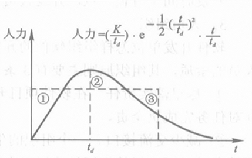

- t~d~位于曲线的峰点，在t~d~之前，开发所需的人力逐渐上升，直到峰值t~d~以后，单位时间所需的人力渐趋下降。

图中的t~d~大致相当于软件开发完成的时间。换句话说，t~d~的左方大致相当于软件的计划与开发时期，而其右方相当于运行和维护时期。曲线下方的面积，就是整个生存周期所需的工作量。

对于大型的软件，t~d~左右两侧的面积比约为4:6，即计划与开发所需的工作量约占生存周期总工作量的40%，而维护工作量将占60%左右。

图中用虚线画出的矩形，显示了平均使用人力所造成的问题。开始阶段人力过剩，造成浪费（图中①），到开发后期需要人力时，又显得人手不足（图中②），以后再来补偿，己为时过晚了（图中③）。

### 2. 两条重要的定律

**人员-时间权衡定律**（people-time trade-off law）。Putnam模型指出，开发工作量与开发时间的4次方成反比，Putnam将这一结论称为软件开发的权衡定律，即
$$
E=常数/(T或t_d)^4
$$
开发一个大、中型软件，一般需要1\~3年的时间。这不仅是因为这些软件具有较大的规模（通常为5000\~100000行），而且其内部的各项任务有先后，一个任务末完，另一个任务就不能开始。如果缩短开发时间，势必增加单位时间内需要的开发人员，而人员的增加，意味着有更多的时间将用于相互通信，因而减少了直接用于软件生产的时间。

**Brooks定律**。向一个己经延迟的项目追加开发人员，可能使它完成得更晚。从另一个角度说明了“时间与人员不能互换”这一原则。当开发人员以算术级数增长时，人员之间的通信将以几何级数增长，从而可能导致得不偿失的结果。

开发时间宁可长一点，开发人员宁可少一点，这是上述两条定律给我们的启示。

### 3. 人员组织

软件开发单位怎样组织软件的开发工作，取决于许多因素，根据软件项目的特点及参与人员的素质，其组织原则主要有三条。

1. 尽早落实责任。在软件项目开始组织时，尽早指定专人负责，赋予他相应的权利，并对任务完成负全责。
2. 减少交流接口。一个组织的生产率随完成任务中通信路径数目的增加而降低。有合理的人员分工、好的组织结构以及有效的通信，才有可能提高生产率。
3. 责权均衡。软件经理人员承担的责任应与赋予他的权力相当。

一般情况下，可采取以下的层次型组织结构，即软件经理-项目经理-开发小组。软件经理负责管理整个单位的开发工作。每一开发项目设一位项目经理，每一项目经理又管理若干开发小组。对于大型的、有数十人以上参加的项目，在项目经理与开发小组之间还可以添加一至几个层次，以保证管理的有效性。

这里介绍两种不同的开发小组形式。

**民主开发小组**。有观点认为，软件开发是一种合作的事业，最理想的形式是组成无我小组（egoless team），每人把小组开发的程序看成“我们的”程序，而不是“我的”程序。组内人人平等，一切问题均由集体决定，甚至组长也轮流担任。

优点是，便于集思广益，取长补短；但责任不清，而且每件事都要讨论，效率不高。可以让小组的组长由上级指定，当组内发生意见分歧时，由组长作最后决定。民主开发小组的人数，通常为5\~7人。

**主程序员小组**（chief-programmer team）。特点是强调“一元化”领导，每一组员的工作由主程序员分配，一切重大的问题由主程序员决定。

主程序员除了领导2\~5名程序员外，还领导一名文档员（负责文档和程序管理）、一名后援程序员（主要负责质量保证，平时作为主程序员的助手，需要时代替主程序员工作），从而形成一个集技术和管理于一身的开发小组。

优点是，每个组员仅对主程序员负责，省却了组员之间的通信，提高了效率。但它的效果好坏，在很大程度上取决于主程序员的技术和管理水平，当开发小组内只有一个高级程序员，其余均为初、中级程序员时，可以采用这种方式。

## （五）项目进度安排

进度安排是项目管理的一个重要内容。这里简要介绍两种安排进度计划的方法，计划评审技术和Gantt图法。这些方法都是制定工程计划进度常用的技术，在其他工程领域中早有应用。

### 1. 计划评审技术

计划评审技术（Program Evaluation and Review Technique，PERT），有时也称为工程网络技术。

**建立PERT图**（又称网络图）。这是是第一步，图中的每一圆圈，都代表一项开发活动，圈内的数字表示完成这一活动所需的时间，箭头代表活动发生的先后顺序。

经验表明，采取从后向前建立PERT图的方法，常常比较容易。也就是说，首先画出终点，然后逐步前推，画出每个活动，直至项目的起点。

**找出关键路径**（critical path）。从起点到终点，可能有多条路径。其中耗时最长的路径就是关键路径，因为它决定了完成整个工程所需要的时间。

寻找关键路径是从项目起点开始的，先从起点到终点，在每个活动框的上方标出该项活动的起止时间。标出最迟开始时间，把每一活动的最迟起止时间均标在该活动的下方。

**使用PERT图**，可以进行下列工作：

1. 确保关键路径上的各项活动按时完成。因为在该路径上的任何活动如有延期，整个项目将随之延期。
2. 通过缩短关键路径上某活动的时间，达到缩短项目开发时间的目的。
3. 对于不处在关键路径上的活动，可根据需要或者调整其起止时间，或者延缓活动的进度。

### 2. Gantt图

Gantt图是安排软件进度计划的又一有用工具。在图的左方列出项目的开发活动，上方列出了日历时间。在每一活动的开始时间和结束时间各画一个小三角形，当活动已经开始或结束的时候，就把小三角形涂黑。

Gantt图简单、易用，也容易修改，同时因带有日历时间，用它来检查开发活动的完成情况，比PERT图更加直观、方便。不足之处是，不能显示各项活动之间的依赖关系。例如某项活动延期，它是否影响项目完成时间，单靠Gantt图则无法判断出来。

一般说来，对简单的软件项目宜使用Gantt图。但对于内部任务的依赖关系复杂的项目，应使用PERT图及关键路径来安排进度。如果这两种工具结合使用，便可以相互取长补短，更好地安排进度。

# 软件质量管理

## （一）从质量保证到质量认证

质量保证（quality assurance）与质量认证（quality certification）是组成软件现代质量管理的两个重要方面。区别在于：前者着眼于每一个软件，保证提供给用户的产品都达到规定的质量水平；后者则更加注重软件企业的整体资质，目的在于全面考察企业的质量体系（quality system），判断它是否具备设计、开发和生产符合质量要求的软件产品的能力。

与生产其他产品的企业一样，软件企业的质量管理也经历了三个阶段。

**质量检验阶段**（quality inspection）。这是早期常见的一种做法，属于粗放式质量管理的初级形式，其方法是在生产线的末端逐一检验产品，遇见不合格产品即进行修理或报废。在软件开发中，它大致相当于对程序的测试与纠错。这种事后检验的方式，往往无助于质量的改进。

**全面质量管理阶段**（total quality control，TQC）。为克服上述方法的缺陷，把质量管理活动从单纯的事后检验向前、后延伸到生产的全过程，于是全面质量管理便应运而生。这里的所谓全面，包含了全过程控制和企业全员参加两层含义。其基本思想是：

- 产品质量形成于生产全过程。质量是制造出来的，不是检验出来的。
- 应重视建立质量体系，该体系应包括适当的管理与技术作业程序，以及由这些程序所组成的结构。
- 包括质量管理在内的任何管理工作，都应该按照PDCA（Plan-Do-Check-Action）循环所建议的顺序来实施。

把以上思想应用于软件的质量管理，便形成了软件的质量保证活动，详见下述。

**质量认证阶段**。质量认证又称合格认证（conformity certification），把对于个别产品的质量保证扩展到对于整个企业质量体系的认证。1987年，国际标准化组织公布了ISO9000质量管理标准，从此质量认证迅速流行。软件质量认证也开始在软件工业界受到广泛地关注。

与质量保证相比，质量认证不仅范围更广（从仅对产品到包容产品与服务），而且具有第三方开展的活动的性质。它尤其强调：质量管理必须坚持进行质量改进；应该使企业具有持续提供合格产品的能力。如，质量管理的核心是预防，而不是消极的补救；只有把不断研究与改进质量管理当作各级生产人员的责任，才能使确保顾客满意的宗旨真正实现。

自20世纪90年代以来，先后出现了针对软件开发的能力成熟度模型（SEICMM）和SPICE信息技术-软件过程评估等标准。

## （二）质量保证

按照IEEE1983年公布的《软件工程标准词汇》，质量保证被定义为：为了充分保证项目或产品符合规定技术需求而进行的一系列必要的有计划的活动。

质量保证包含一系列的活动，其目的是使所开发的软件达到规定的质量标准。以下简介这两个方面的内容。

### 1. 软件的质量属性

软件的质量标准，可以用一组有关的属性来表示。在我国国家标准《软件产品评价、质量特性及使用指南》（GB/T 16260—1996）中，把有关软件质量的属性归纳为6项，即功能性、可靠性、易用性、效率、可维护性和可移植性。其中功能性是指程序能够满足软件需求规格说明书（SRS）中各项功能需求的能力；效率包括在线系统的响应时间或完成程序规定功能所需的时间，以及程序对存储空间或外部设备的占用量等资源方面的因素。

这6项用通俗的语言来描述就是：功能正确，运行可靠，使用方便，效率很高，容易维护，容易移植。这些属性概括了通常对软件质量的最基本的要求。

### 2. 质量保证的活动内容

为了达到上述要求，质量保证是复审、开发方法、配置控制与程序测试的综合应用。简单地说，软件的开发方法应该符合规定的软件开发规范；计划和开发时期各个阶段的工作都要进行复审；每个阶段产生的文档都必须严格管理，以确保文档和程序的完整性与一致性；作为最后的一道防线，还要坚持对程序进行不同层次的测试。

所有以上的各项活动内容，都需写入软件项目的“质量保证计划”，并由质量保证小组监督实施。由此可见，质量保证既是技术活动，也是管理活动。

鉴于上述活动大都已在前面分散讲述，这里仅就几个重点问题作简略的补充。

1. **验证与确认**（verification and validation，V&V）

这是两个不同的概念。前者是为了确定开发时期中某一阶段的产品是否达到了前一阶段对它的需求，后者则是在整个开发结束时对所开发的软件能否满足软件需求的总评价。

换句话说，前者仅要求两个相邻阶段间的一致性，后者则要求在整个开发时期内的一致性。验证：我们制造产品的步骤正确吗？（Are we building the product right?）确认：我们制造的是正确的产品吗？（Are we building the right product?）

具体地说，验证将包含开发时期各个阶段进行的复审、（人工）复查与测试活动；确认则主要指测试阶段的确认测试和验收时的系统测试等活动。两者结合起来，就构成质量保证的中心内容。

在之前曾提到测试阶段使用的两种文档，测试计划和测试报告。在实际执行中，常常把上述的计划和报告扩充为关于验收与确认的计划和报告，用以代替范围较小的测试文档。

2. **开发时期的配置管理**

对配置的控制从计划时期开始，一直延续到生存周期结束、软件停止使用后才终止。

前已指出，软件配置包括生存周期中各个阶段产生的文档和程序，这些文档或程序是随着软件的开发进程逐步产生的，所以也称为阶段产品。诸如软件的项目计划、需求说明、测试计划、设计文档和源裎序，都属于阶段产品的范围。

配置管理的中心思想，就是在软件开发的进程中，开发者有权对本阶段的阶段产品进行更改，但一旦阶段产品通过了复审，就应将它交给配置管理人员去控制，任何人（包括编制这一文档的人员）需要对它更改时，都要经过正式的批准手续。

在软件工程的术语中，各个阶段产品的复审时间均称为基线（baseline），基线之前更改自由，基线之后严格管理。正是这种对软件配置的连续控制与跟踪，保证了软件配置的完整性与一致性。

## （三）软件可靠性

### 1. 可靠性的定义和分级

软件可靠性是在给定的时间内，程序按照规定的条件成功地运行的概率。

假设R(t)代表在时间[0\~t]之间的软件可靠性，P{E}代表事件E的概率，则软件可靠性可以表示为
$$
R(t)=P\{在时间[0,t]内按规定条件运行成功\}
$$
可靠性与软件内部的故障密切相关，如果软件在交付使用时有遗留错误，则当程序的初始条件与输入值在运行中出现某种组合，使执行路径恰好通过包含遗留错误的路径时，就会使程序在运行中失效。当残留错误的数量为一定时，程序的运行时间越长，则发生失效的机会越多，可靠性也随之下降。

为简化问题，假定软件的故障率是不随时间变化的常量，则根据经典的可靠性理论，R(t)可以表示为时间与故障率的指数函数，即
$$
R(t)=e^{-\lambda}t
$$

- t是程序运行时间，λ是故障率，即单位时间内程序运行失败的次数。λ—定时，运行时间越长，R(t)越小。

注意软件可靠性与计算机系统可靠性的差别，系统的可靠性，是软件、硬件和操作人员的操作这三种可靠性的综合反映。用式子表示，可以写作
$$
R_{SYS}=R_SR_HR_{OP}=e^{-(\lambda_S+\lambda_H+\lambda_{OP})}t
$$

- R~SYS~为系统的可靠性，R~S~、R~H~、R~OP~依次表示软件、硬件和操作的可靠性。为了满足系统的可靠性，R~S~、R~H~、R~OP~都必须具有比及R~SYS~更高的指标。

另一种衡量可靠性的方法，是直接计算系统的平均无故障时间（MTTF），在故障率为常量的情况下，MTTF可以看作故障率的倒数，即
$$
MTTF=1/\lambda
$$
于是，
$$
\lambda_{SYS}=\lambda_S+\lambda_H+\lambda_{OP} \\
MTTF_{SYS}=1/(1/MTTF_S+1/MTTF_H+1/MTTF_{OP})
$$
不同的软件，对可靠性的要求也不相同。有些软件发生故障后，仅给工作带来轻微的不便，或虽有损失，也容易恢复；另一些软件一旦发生故障，有可能造成重大经济损失，甚至危及人的生命。一种分类方法将软件可靠性分为5级，如下表所示。在计划时期，可以参考分级，确定所开发软件的可靠性等级。

| 分级 |     故障的后果     | 开发工作量比例因子 |
| :--: | :----------------: | :----------------: |
| 甚低 |    工作略有不便    |        0.75        |
|  低  | 有损失，但容易弥补 |        0.88        |
| 正常 |  弥补损失比较困难  |        1.00        |
|  高  |   重大的经济损失   |        1.15        |
| 甚高 |    危及人的生命    |        1.40        |

要想获得高的可靠性，需要在各个开发阶段，尤其是软件测试上下工夫。提高可靠性总是以降低生产率为代价的。

### 2. 可靠性模型

可靠性模型可分为宏观和微观两大类。后者是建立在对程序语句和控制结构详细分析的基础之上的，在开发时期很难建立；前者则忽略程序在结构方面的细节，主要从程序中残留错误的角度来建立模型，并且用统计方法确定模型中的常数。

虽然许多宏观模型经过实际数据的检验，但是从实用的角度看，它们还很不成熟，微观模型的研究，也遇到了很多困难。以下仅简要介绍几种宏观模型，详细可查阅相关资料。

1. **正比于遗留故障数的宏观模型**

前已指出，程序的故障率与遗留错误的数量成正比，所以根据程序中遗留错误的多少，就可以预测程序可靠性。假设：
$$
\begin{align}
\tau&=程序的调试（debugging）时间 \\
E_T&=调试前错误的总数 \\
E_C(\tau)&=在时间0\sim\tau期间纠正的错误数 \\
E_r(\tau)&=在时间\tau时遗留的错误量 \\
I_T&=程序的长度或指令总数
\end{align}
$$

则可有
$$
E_r(\tau)=E_T-E_C(\tau)
$$
用I~T~除等式两边，可得到错误的规格化值，即
$$
\varepsilon_r(\tau)=E_r(\tau)/I_T=E_T/I_T-E_C(\tau)/I_T=\varepsilon(\tau)-\varepsilon_C(\tau)
$$
由于软件的故障率与遗留错误的数量成正比，故有
$$
\lambda=K\cdot\varepsilon_r(\tau)=K\cdot(E_T/I_T-\varepsilon_C(\tau))
$$

- 式中的K为比例常数，可以从实验求得。

根据经典的可靠性理论，就可得到下式所示的正比于遗留故障数的模型（bug-proportional model）：
$$
R(t)=e^{-\lambda}t=e^{-K\cdot(E_T/I_T-\varepsilon_C(\tau))}t
$$

2. **平均无故障时间模型**（MTTF模型）

已知当故障率为独立于时间的常量时，代入上述中λ的值，可得
$$
MTTF=1/\lambda=1/[K\cdot(E_T/I_T-\varepsilon_C(\tau))]
$$
为简化讨论，又设在时间0\~τ期间的纠错率为常数，且等于ρ~0~，则
$$
\varepsilon_C(\tau)=\rho_0\tau
$$
代入上式，可得
$$
MTTF=1/[K\cdot(E_T/I_T-\rho_0\tau)]=1/[\beta(1-\alpha\tau)] \\
其中，\beta=KE_T/I_T,\alpha=\rho_0I_T/E_T
$$

- 该式表明了MTTF与测试时间τ、纠错率ρ~0~之间的关系，也即MTTF模型。下图是这一模型绘制的曲线。

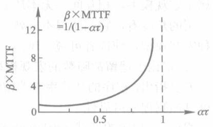

随着调试时间τ的增加，MTTF与程序的可靠性均不断提高。但是，当ατ<0.5时，MTTF的改善是缓慢的；当ατ>0.75时，MTTF的值明显上升。这一结论告诉我们，如果有必要显著改善程序的可靠性，只需把调试时间延长到ατ接近于1的区域，就可以达到目的。

还需指出，上式是假定纠错率为常量时导出的，在实际调试中，纠错率并非常量，故上图的曲线形状也有所变化；但MTTF在最后一个区段急剧上升的趋势，是不会改变的。

3. **错误植入模型**（error seeding）

这类模型的中心思想，是通过估计残留错误的数量，来确定程序的可靠性。具体的做法是，测试之前先在程序中植入一批人为的错误，在测试过程中分别统计出由测试小组发现的原有错误和植入错误，然后由下列算式计算原有的错误。假设
$$
\begin{align}
N&=程序中原来残留的错误数 \\
S&=新植入程序的错误数 \\
n&=测试中发现的原有错误数 \\
s&=测试中发现的植入错误数
\end{align}
$$
如果调试中对两类错误具有同样的发现能力，则有
$$
N/n=S/s,\ 或\ N=nS/s
$$
上述模型的问题是，很难做到对原有错误和植入错误具有相等的发现能力，很难确定植入错误的数量，即需要植入多少错误才算合适。

一种改进的方法是，安排两名测试员同时对一个程序进行独立的测试。假定
$$
\begin{align}
B_0&=程序中原有的残留错误数 \\
B_1&=1号测试员在某一时间内发现的错误数 \\
B_2&=2号测试员在同一时间内发现的错误数 \\
B_C&=两名测试员共同发现的错误数
\end{align}
$$
则仿照上述公式，可以得到
$$
B_0=B_1B_2/B_C
$$
如果从头至尾都用两套人马参加测试，势必增加开发的成本。因此可以起初由两人同时测试，且每隔一定时间估算一次B~0~，这样重复估算数次以后，一般就能得到较为满意的估计结果。此时，2号测试员就可以停止测试，由1号测试员单独完成其余的测试工作。

### 3. 软件容错技术

容错性是软件可靠性的子属性之一。软件开发首先要避免错误，尽量采用无差错（error-free）的过程与方法，另外，当软件在运行中一旦出现错误，便将它的影响限制到可容许的范围之内，这就是容错（fault tolerance）。所有高可靠、高稳定的软件都非常重视采用容错技术。

#### (1) 容错软件

所谓容错软件，就是具有抗故障功能的软件。根据其处理错误方法的不同，可区分为以下三种情况：

- 屏蔽错误。把软件的错误屏蔽掉，使之不致产生危害。
- 修复错误。能在一定程度上使软件从错误状态恢复到正常状态。
- 减少影响。能在一定程度上使软件完成预定的功能。

#### (2) 冗余技术

冗余（redundancy）技术是实现容错软件的主要手段，常用的冗余技术有结构冗余、时间冗余、信息冗余等多种，分述如下。

1. **结构冗余**

结构冗余又包括静态冗余、动态冗余、混合冗余等不同形式。

下图是采用三模静态冗余结构的表决系统。

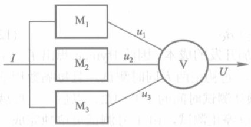

图中M~1~、M~2~、M~3~分别代表由3个小组开发的具有相同功能的模块，其输出连接到表决器V（可用软件或硬件组成）的输入端，表决器的输出为
$$
U=(u_1\land u_2)\lor(u_2\land u_3)\lor(u_3\land u_1)
$$
由上式可知，3个模块中无论哪一个出错，都能被表决器屏蔽，使系统不经切换就实现容错。

下图采用的是动态冗余结构。

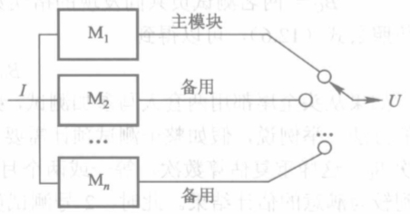

与静态冗余结构相似，该系统也由多个具有相同功能的模块构成；不同的是，这些模块可以同时运行（热备份系统），也可以依次运行（冷备份系统），而且任何时刻只有一个模块的输出可连接到系统的输出。仅当当前的模块运行出错时，其余的模块才能经过开关切换顶替出错的模块进行输出。

动态冗余结构的优点是，除非所有的模块全部出错，系统总能从错误状态恢复到正常状态，但模块的切换需要一定时间。如果把多个模块中的一部分连接为表决器，另一部分模块作为表决器的备份，还可得到兼有静态冗余和动态冗余两种结构之长的混合冗余结构。

2. **时间冗余**

结构冗余利用多余的结构换取可靠性的提高，时间冗余则是以多花的时间为代价，来消除瞬时错误所带来的影响。其中心思想是设置一个错误检测程序，当它检测到程序运行出错时，能发出一个错误恢复请求信号，使程序返回重新执行。

3. **信息冗余**

用于检测和纠正信息在传输或运算中发生的错误，常用的方法有奇偶码、循环码等误差校正码。其中心思想是利用附加的冗余信息来校正可能出现的错误，其代价是增加系统的计算量和附加信息占用信道的时间。

综上可见，无论采用哪种冗余技术，都是以额外的资源消耗换取系统的正常运行，这是实现容错软件的需要，与由于设计不当而造成的资源浪费显然不同。

#### (3) 容错软件的设计

一般的说，设计一个容错软件需经历以下步骤：

1. 通过常规设计获得系统的非容错结构。
2. 分析在系统运行中可能出现的软、硬件错误，确定容错的范围。
3. 确定采用的冗余技术，并评估其容错效果。
4. 修改设计，直至获得满意的结果。

需要说明的几点是：

- 强调容错软件中的各个冗余分支应由不同的开发小组独立进行设计。这些独立设计的分支除功能与结构要求一致外，编码与测试方法各不相同，潜在的错误也不会相同；因而在同样的输入条件下，引发相同错误的可能性也相对较小，从而可达到提高系统可靠性的目的。
- 要选择好冗余单元。在通常情况下，硬件可选择功能级的部件为冗余单元，软件可以功能模块作为冗余单元。
- 冗余单元较小的系统，其可靠性一般较大。如下图(a)所示结构的可靠性高于(b)所示的结构。

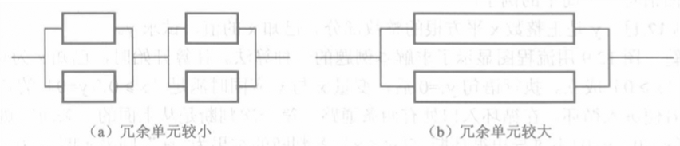

## （四）程序正确性

测试只能说明程序有错，不能够证明程序不存在错误。程序正确性证明的基本思想，就是要通过数学的方法，证明程序具有某些需要的性质。

通过许多人多年的努力，现己提出了一些有用的方法与技术，其中包括输入-输出断言法、最弱前置条件法、结构归纳法等较常用的方法。下面以输入-输出断言法为例，简单说明程序正确性证明的基本概念与步骤。

输入-输出断言法是在Floyd提出的归纳断言法的基础上，加上Hoare公理化概念形成的，故有时也称为公理化归纳断言法（axio-matic inductive assertion）。它的基本做法是，在源程序的入口、出口和中间各点分别设置断言，为了证明在两个相邻点之间的程序段是正确的，只需证明在这一程序段执行后，能够使在它之前的断言变成其后一点的断言就可以了。

## （五）CMM软件能力成熟度模型

软件过程能力成熟度模型（capacity maturity model，CMM），用于评估软件供应商的开发能力。目前己经发展到能力成熟度模型集成（capability maturity model integration，CMMI）阶段，CMMI框架包括软件能力成熟度模型、系统工程能力成熟度模型、软件采购能力成熟度模型、继承产品和过程开发等。

### 1. CMM的基本概念

1. **软件过程**

软件过程包括一个软件企业（或软件项目开发小组）在计划、开发和维护一个软件时所执行的一系列活动，包括工程技术活动和工程管理活动。

通常用软件过程能力来描述软件企业遵循其软件过程能够实现的预期结果；用软件过程性能表示软件企业遵循其软件过程能够得到的实际结果。通过制度、标准和机构，一个软件开发企业可以将其软件过程规范化和具体化，从而不断提高软件过程的能力。

软件过程成熟度用于表达一个特定的软件过程被明确和有效地定义、管理、测量和控制的程度；可将软件过程的能力成熟度分成不同的等级，每个等级包括一组过程目标。等级越高，表示该软件机构的软件过程成熟度越高，其软件过程能力也越高。软件过程成熟度高的软件企业，对其管理和工程的方法、实践和规程等均有明确的定义，不会因为人员的变化而随之发生变化。

2. **关键过程域**

所谓过程域，是指互相关联的若干软件实践活动和有关基础设施的一个集合。为确保不同等级的软件过程能力成熟度分别达到各自的目标，特别要注意对于实现该等级目标起关键性作用的过程域，即关键过程域（key process area，KPA）；对实施关键过程域起关键作用的措施、活动、规程以及相关基础设施，可称为关键实践（key practice）。关键过程域的目标，就是通过它所包含的关键实践的实施来达到的。

3. **CMM模型**

CMM模型是用来确定一个软件过程的成熟程度以及指明如何提高过程成熟度的参考模型。它描述了软件过程从无序到有序、从特殊到一般、从定性管理到定量管理，直至最终达到动态优化的成熟过程，给出了不同成熟等级的基本特征和改进软件过程应遵循的原则与采取的行动。

### 2. 软件能力成熟度等级

CMM模型把成熟度等级分成5级，共包括18个关键过程域、52个过程目标、316种关键实践，从而为软件企业的过程能力提供了一个阶梯式的进化框架。每达到成熟度框架的一个等级，就建立起软件过程的一组相应成分，使软件机构的软件过程能力有一定程度的增长。下表显示了CMM的基本内容。

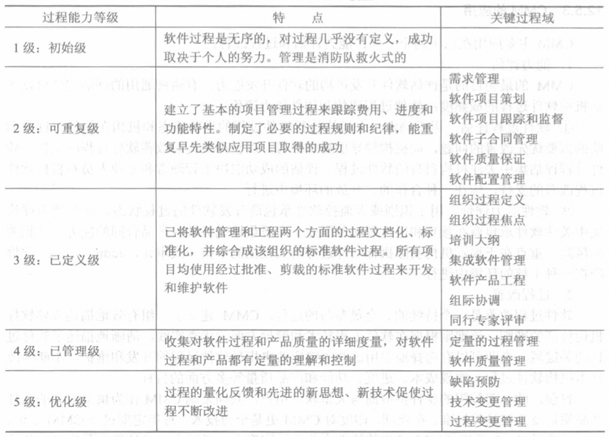

由表可知，软件过程成熟度5个等级的特点可以概括为：

1. 初始级（initial）。对软件过程缺乏明确的定义，质量管理处于消防式的、要等出了问题再处理的状态。
2. 可重复级（repeatable）。本级主要解决质量管理体系从无到有的问题，重点是建立一套基本制度，使软件项目的基本管理可以重复实施。
3. 已定义级（defined）。本级反映了质量管理从特殊到一般并进一步实现标准化和文档化的过程，可把质量管理再提高一个层次。
4. 已管理级（managed）。本级反映了质量管理从定性管理提升到定量管理的过程，并通过定量控制，使质量管理的结果达到可以预测。
5. 优化级（optimizing）。优化级是一个从静态管理到动态管理的过程，通过开发技术和过程的不断更新，使质量管理体系持续改进和提高。

上述的5个等级定义了一个有序的尺度，用来测量软件机构的成熟度和评价其过程能力。每一个成熟度等级均为过程的继续改进提供一个基础，5个等级各有不同的行为特征及其关键过程域。

### 3. CMM的应用

CMM主要应用在以下两个方面：能力评估和过程改善。

1. **能力评估**

CMM的最初目的是评估软件开发机构的软件开发能力，有两种通用的评估方法可以评估机构软件过程的成熟度：软件过程评估和软件能力评价。

**软件过程评估**。软件过程评估集中关注机构自身的软件过程。用于确定一个机构执行软件过程的当前状态和机构在软件过程中面临的需要优先改善的问题，向机构领导层提供报告，以获得机构对改善软件过程的支持。评估的成功取决于管理者和专业人员对机构软件过程改善的支持，应在一种合作的、开放的环境中进行。

**软件能力评价**。用于识别或者监控软件承包商开发软件的过程状态。软件能力评价集中关注软件承包商在预算和进度要求范围内，高质量地完成软件产品合同的能力以及相关的风险，重点在于揭示机构实际执行软件过程的文档化的审核（或审计，audit）记录。评价应在一种审核的环境中进行。

2. **过程改善软件过程**

改善是一个持续的、全员参与的过程。CMM建立了一组有效地描述成熟软件机构特征的准则，该准则根据在软件工程技术和管理方面的优秀实践，清晰地描述了软件过程的关键域。企业可以有选择地引用这些关键实践来指导软件过程的开发和维护，不断地改善本机构软件过程，实现成本、进度、功能和产品质量等多方面的目标。

### 4. CMM评估的实施

CMM评估要遵循SEI的CAF（CMM assessment framework）规范，由CMU/SEI授权的主任评估师（lead assessor）领导一个评审小组进行。评估过程包括员工培训（企业的高层领导也要参加）、问卷调查和统计、文档审查、数据分析以及与企业的高层领导进行讨论等。评估结束时应撰写评估报告，由主任评估师签字后生效。

目前使用的CMM评估方法主要有两种，一种称为CBA-SCE（CMM-based appraisal for software capability estimation），主要用于CMM对机构的软件能力进行评估，由机构外部的评估小组对该机构的软件能力实施评估。另一种称为CBA-IPI（CMM-based appraisal for internal process improvement）主要用于CMM对内部的过程改进实施评估，由机构内部和外部人员联合组成评估小组，针对软件机构本身进行评估。评估的结果归机构所有，以引导机构不断改进质量。

上述两种评估均由CMU/SEI授权的主任评估师领导，根据CMM模型来进行，都要审查正在使用和将来使用的文件/文档，并对不同的机构员工进行采访。两种评估的结果应该是一致的，评估结果的所有资料都应呈报给CMU/SEI。

### 5. 软件过程评估的SPICE国际标准

软件过程评估（software process assessment，SPA）标准，试用报告ISO/IEC TR 15504 SPICE（software process improvement and capability determination）等国际标准。

SPA提供了一个软件过程评估的框架，它可以用于软件的设计、管理、监督、控制以及提高对软件开发、升级和支持的能力。下图显示了SPA所包含的9个组成部分。

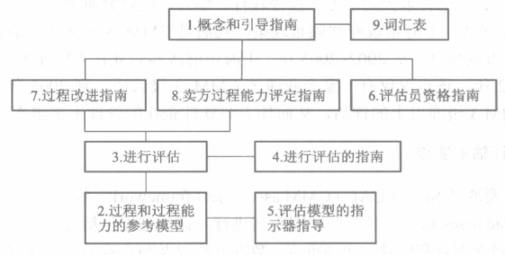

随着网络应用的普及，软件市场的需求日新月异，而CMM/SPICE方法需要严格的纪律和大量的文档，使得软件人员常常觉得负担过重，难以适应快节奏的软件开发要求。为了满足市场竞争的需要，一批新的开发过程与方法又应运而生，其中比较引人注意的有极值程序设计（extreme programming，XP）、SCRUM软件开发过程、自适应软件开发（adaptive software development，ASD）等；它们被统称为轻载（lightweight）方法。

而前述的CMM/SPICE方法和下面即将介绍的ISO 9000标准则称为重载（heavy weight）方法。

## （六）ISO 9000国际标准

ISO 9000国际标准由5个相关的标准组成：质量术语标准（ISO 8402—1994）、质量保证标准（ISO 9001等）、质量管理标准（ISO 9004-1等）、质量管理和质量保证标准的选用和实施指南（ISO 9000-3等）、支持性技术标准（ISO 10005等）。

这些标准适用于各种行业的不同工业活动，其中为质量保证而制定的ISO 9001标准最适合于用作软件开发的标准。针对软件这一特殊行业，ISO随后又公布了ISO 9000-3，作为将ISO 9001运用于软件的实施指南。

### 1. ISO 9001和ISO 9000-3

ISO 9000标准将供需双方称为卖方和买方，提供产品或服务的一方是卖方，购买者或消费者是买方。标准规定了对卖方的质量要求和质量管理办法，如果卖方认真按照标准的要求组织生产，经过权威机构的审核并取得认证，就会赢得买方的信任；买方凭认证情况在市场上选购产品，也就不必担心质量检验问题了。

ISO 9001包括了设计、开发、生产、安装和服务等活动的质量保证模式，于1994年由国际标准化组织公布；与之相对应的国家标准是GB/T 19001—1994。该标准中规定了质量体系的20个方面的质量要求，覆盖了全部设计和开发活动。如果软件产品开发机构能够达到这些要求，表明它具备了质量保证能力。

ISO 9000-3的全称为“质量管理和质量保证标准：第三部分——ISO 9001—1994在计算机软件开发、供应、安装和维护中的使用指南”。它从软件的角度，对ISO 9001的内容给出了具体的解释和说明，例如结合ISO 9001中的20个质量要素，ISO 9000-3逐一作出了针对软件产品开发的解释。

虽然ISO 9001标准和CMM都是质量标准，但CMM的要求与ISO 9001标准不尽相同。有些ISO 9001的要素可以在CMM中找到完全对应的部分，另外一些要素则仅有比较分散的对应。两者有很多相似之处，最大的相似在于两者都强调“该说的要说到，说到的要做到”；对于每一个重要的过程应形成文件，包括指导书和说明，并检查交货的质量水平。

此外，CMM强调持续改进，ISO 9001的1994版标准说明的则主要是“合格质量体系的最低可接受水平”，不过ISO 9001的2000版标准也增加了持续改进的内容。

### 2. ISO 9000标准对软件企业的重要性

ISO 9000质量标准最初是针对一般制造企业的，但迅速崛起的软件企业及其产品却总是不能真正满足用户的需求，因而软件开发机构同样需要建立并实施ISO 9000质量标准。软件是不可见的复杂的逻辑实体，其需求很难精确把握，加上其开发活动大多由手工完成，因而软件产品或多或少存在一定的质量缺陷。解决这一问题的手段有两个：技术手段和管理手段。

技术手段有两个方面，一是改进测试方法、提高测试效率，更有效地发现和排除软件开发过程中发生的各种差错，提高软件质量；二是改进开发过程，使各种差错不会或很少引入软件的开发过程。但是实践证明，从技术上解决软件质量问题的效果并不明显。

管理手段就是加强软件开发过程中的质量管理。通过质量管理相对地净化环境，使得更少的差错或缺陷进入开发过程，从而减轻查错和排错的工作量，提高软件质量，这就是ISO 9000质量管理和质量保证标准的基本思想。它吸取了许多国家多年积累的管理经验，把与企业质量相关的问题集中到管理职责、质量体系、合同评审、设计控制、采购、检验、交付、培训及服务等20个要素中，要求明确，具有很好的可操作性。企业遵照这些要求，就可结合自己的具体特点建立质量保证体系，贯彻实施这些质量要求，做到凡事有章可循，凡事有据可查，凡事有人负责，凡事有人监督，从而获得较好的质量管理效果。

### 3. 在软件企业中实施ISO 9000标准

软件企业按照ISO 9000标准建立质量保证体系，进行质量体系认证，有一系列的工作要做。一般的说，推行ISO 9000有如下5个必不可少的过程：知识准备一立法一宣传一执行一监督、改进。将上述过程进一步细化，便可得出软件企业推行ISO 9000所需的详细步骤，以下列出的是一组典型的步骤。

1. 识别原有的质量体系，找出缺陷。
2. 任命管理者代表，组建在本企业推行ISO 9000的机构。
3. 制定目标及激励措施。
4. 对各级人员进行必要的管理意识和质量意识训练，特别是ISO 9001标准知识培训。
5. 编写质量体系文件（立法）。
6. 广泛宣传质量体系文件，正式发布、培训和试运行。
7. 训练内审人员。
8. 进行若干次内部质量体系审核。
9. 在内审的基础上对管理者进行评审。
10. 完善和改进企业的质量管理体系。
11. 申请认证。

需要指出，企业实施ISO 9000标准绝不是一件容易的工作，必须在原有的质量体系基础上，投入必要的人力、物力和财力，不断改进和优化质量管理，才能真正达到目标。既要避免干干停停，有始无终；也不必重起炉灶，把原来行之有效的质量管理制度完全推翻。

## （七）软件度量

软件度量是质量管理的一种重要手段，在ISO 9000-3标准中，已明确指出了软件度量的重要性。虽然它目前还在发展之中，但已经受到越来越多的软件企业的重视。

可划分为软件项目度量与软件过程度量两大类。前者为战术性的活动，目的在于改进软件产品的质量；后者为战略性的活动，目的在于改进企业的软件开发过程，提高整个过程的质量。

### 1. 项目度量

项目度量的基本度量如下表。

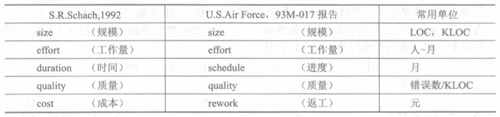

1. **项目度量的内容**

在上表中，以代码行（lines of code，LOC）表示的软件规模是最基本的度量。它直接关系到软件的成本、开发工作量和完成时间。软件质量也是一项重要的基本度量，通常以每千行代码中存在的错误数来衡量。

软件的规模、成本和工作量通常应分阶段进行度量。把估算值与项目结束后的实际统计值比较，就可以知道估算方法的可信度；把实际统计值与工业界开发同类软件的平均值作比较，将帮助管理人员衡量本单位的技术与管理水平，找出本单位在软件开发中存在的问题，以及解决问题的策略。

在前面介绍的项目度量中，所有的基本度量都是以代码行为基础的。缺点是：依赖于程序设计语言；特别对于使用4GL等非过程化语言编码的紧凑的小程序，会产生不利的度量数据，与其他语言编码的软件缺乏可比性；在开发早期（分析或设计阶段）估算出来的LOC，其偏差可能较大等。

于是，一种新的、面向功能（function-oriented）的项目度量方式便应运而生，并将上述的基于LOC的度量称为面向规模（size-oriented）的项目度量。

2. **面向功能的项目度量**

功能度量方式中心思想是，任何软件都包含若干种功能，每种功能又包含具有不同复杂度的若干个功能点（function points）。因此，软件的规模也可用功能点数量的多少来表示，以代替原来常用的LOC表示法。

下表是建议的功能点加权计算表，表中把功能点划分为5种类型，依次为用户输入、用户输出、用户查询、主文件处理和外部界面。每类功能点按照其复杂程度可区分为简单、平均及复杂3种等级。

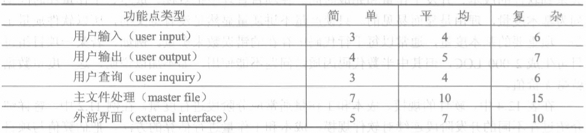

在一般情况下，$FP=\Sigma\Sigma C_{ij}W_{ij}$，其中C表示加权系数（weighting coefficient），W表示功能点个数，i代表功能点类型，j代表复杂度等级。

通过上式计算出来的FP值虽然使用了加权系数，仍不能适应各种不同软件千差万别的情况，为了使度量的结果更加准确，进一步提出用技术复杂性因子（technical complexity factor，TCF）对FP~0~进行调节的方法，即
$$
FP=FP_0\times TCF \\
TCF=0.65+0.01\times\Sigma F_i
$$
其中F~i~代表了包括处理能力、响应时间、有无数据通信、是否支持分布式处理等在内的14种技术因素，每种因素按对于开发难度的影响赋予0（代表没有影响）到5（代表很大影响）的一个数值。

当根据上式计算出FP的最终值后，就可像面向LOC的方法一样，计算出项目软件的其他属性，例如，每个功能点的错误数，每个功能点的成本，每人-月可以完成的功能点数量等。

面向功能度量的结果往往较面向规模度量的结果更加准确。但无论加权系数还是技术复杂性因子的确定，都是与度量者经验有关的主观行为，可能导致度量的误差。

### 2. 过程度量

过程度量是对整个企业中全体项目组开发能力的衡量。把对于项目组中个人的度量组合起来，可形成对项目的度量；把所有项目组的项目度量组合起来，就形成了对整个企业的过程度量。

因此，过程度量实际上是向企业高层管理者提供的有关企业软件开发质量的状态信息，这些信息涉及企业产品、过程和资源在不同开发阶段的状态。把这些动态的、连续追踪的状态信息与软件开发前的计划数据相比，就可帮助管理者发现问题，找出改进过程的依据。

- 软件企业的髙层领导应该重视收集项目度量的测量数据，及时综合企业最新的过程度量数据。
- 同一企业的所有项目组，在项目度量中应采用相同的规格化手段（如面向规模或面向功能），使不同项目组的测度数据具有可比性。
- 过程度量的目的是为了改进企业的过程，二者应紧密结合。如CMM中，把软件成熟度的5个等级中的第四级称为已管理级，强调达到该级的软件企业，对软件产品和过程都应设置定量的质量目标，对所有项目的重要软件过程活动，都要测量其生产率和质量，足见CMM对过程度量是十分重视的。
- 除了项目度量与过程度量外，对产品的质量也可以进行度量，称为产品度量。限于篇幅，此处不再详细说明，可查阅相关资料。

# 软件工程环境

软件工程环境是软件工程学的组成部分，也是实现软件生产工程化的重要基础。在软件开发中，无论技术活动与管理活动，都离不开环境（包括工具）的支持。计算机辅助软件工程（computer-aided software engineering，CASE）、集成项目支持环境（IPSE）等课题，始终都受到人们的关注，一大批实用的环境应运而生。

这些环境建立于现代软件开发的基础上，反过来又促进了现代方法的推广与流行，不仅提高了软件的生产率，而且逐渐影响和改变着软件的生产方式。

## （一）什么是软件工程环境

“环境”一词，对不同的用户往往具有不同的含义。对于不从事软件开发的最终用户（end-user）来说，环境就是他运行程序所使用的计算机，即由硬件和操作系统所组成的虚拟机。这类用户对环境的要求，主要是运行可靠、操作容易，便于掌握和使用。

对于开发者来说，环境是他们进行开发活动的重要支撑。在软件工程时代，开发者要求环境支持他们按照软件工程的方法，全面完成生存周期中的各项任务，通常把这种开发环境称为软件工程环境，而把前一类环境称为运行环境或工作环境。

具体而言，软件工程环境是指支持软件产品开发、维护和管理的软件系统，它在统一的集成机制下由一系列软件工具组成，这些工具对与软件开发相关的过程、活动和任务提供全面的支持，从而大大提高软件产品的生产效率和软件产品的质量，降低软件开发、维护和管理的成本。这类环境通常都有一套包括数据集成、控制集成和界面集成的集成机制，让各个工具使用统一的规范存取环境信息仓库，采用统一的用户界面，同时为各个工具或开发活动之间的通信、切换、调度和协同工作提供支持。

这里主要讨论开发环境，下面先介绍开发环境的特点。

### 1. 软件开发环境的特点

一台宿主机，一个编译（或汇编）程序，加上编辑、连接、装入等少量实用程序，就构成了早期软件开发的环境，从这个意义上讲，在软件工程方法出现以前就有了环境。只不过早期环境的软、硬件资源都很有限，软件生产效率和开发质量都比较低罢了。

随着软件工程方法的流行，人们研制了大量软件工具，用来支持软件开发中的各种方法与技术。从少量零散的工具到配套成龙的工具箱，不仅意味着功能的扩大（从支持个别阶段到支持整个生存周期，从只支持开发技术到全面支持技术与管理），也反映了集成化程度的增加。

1. **友好和统一的用户界面**

现代的开发环境常采用以下的技术来改善用户接口的友好性。

- 具有弹出（pull-out，亦称下拉，pull-down）功能的多级菜单。这种菜单将环境的各种功能组织成命令树的形式。无论是选择当前菜单的功能，还是弹出下级菜单或返回上级菜单，都只需简单的键盘操作即可实现。具有高分辨率图形显示器的环境，还可用图标（icon）和鼠标器（mouse）补充传统的菜单技术，进一步减少击键的次数。
- 屏幕提示和在线帮助（on-line help）技术。前者用于告知用户当前可选择的操作或需要注意的事项，后者则根据用户的请求，提供即时的在线帮助。
- 采用多窗口（multi-windows）技术。除常用的显示菜单/图标的窗口外，还可以按照用户的选择，在屏幕上随时开辟多种窗口（如编辑窗口、执行窗口、对话窗口或其他窗口）以便用户在同一时间内监控或处理多个不同的任务。
- 采用向导（wizard）技术。将完成某组动作的步骤组合起来，用户执行这组动作时，只要从一个入口进入后，按提示进行简单的“上一步”、“下一步”操作即可。

菜单、帮助（含提示）、多窗口和向导，也被称作用户界面的4大友好技术，它们不仅适用于软件开发环境，也适用于其他的应用软件。除友好性以外，开发环境还十分重视用户界面的一致性（unification）。

2. **集成化的软件工具**

集成化就是一体化。采用集成化工具的最终目的，就是实现开发活动之间的全自动切换，不再需要用户的干预。集成化工具的使用要求在同一开发阶段或不同阶段的有关工具之间实现完全的自动切换。

工具的集成化主要包括数据集成、界面集成、控制集成和过程、平台等其他方面的集成。

- 数据集成。所有的工具统一建立在公共的文件库或信息库之上。每一运行中的工具从库获得必要的信息，又随时将结果放回库中，用库内的数据作为相互通信的媒介实现各个工具之间的数据交换。
- 界面集成。各工具使用统一或一致的用户界面，采用公共的交互方式。这种集成又可分为三个层次：窗口系统集成、命令集成和交互集成。
  - 窗口系统集成指工具采用同一种窗口管理系统，各窗口有相同的外观和操作命令；
  - 命令集成指工具对相似的功能采用相似的命令；
  - 交互集成指工具对相同的功能采用同样的交互方式，即同样的动作可以达到同样的效果。
- 控制集成。能支持环境中的一个工具控制另一个工具，如启动、中止某个工具，或调用某个工具的特定服务。
- 过程集成。这类环境了解软件过程中各个活动的时序、约束等，能主动地调度这些活动，保持它们合适的顺序。
- 平台集成。指工具运行在相同的硬件/操作系统下。

### 2. 理想环境的模型

R.N.Charette将软件开发环境抽象为一个模型，并把开发环境定义为“生产一个软件系统所需要的过程（process）、方法（methods）与自动化（automation）”。他认为，开发环境模型应由上述的3个层次由底向上地构成，并将“理想的”开发环境描述为“全程由充分自动化了的方法所支持的完整的过程模型（process model）”。

Charette在他的环境模型中并没有包括硬件，这是为了强调软件在环境组成中的特殊地位。相同的硬件，使用不同的操作系统、环境信息仓库和工具集，可能构成相差悬殊的不同的环境。这也说明，在选择环境的软、硬件配置时，尤其要重视软件的配置。

### 3. CASE环境

早期用CASE一词来描述软件环境，现已成为一切现代化软件开发环境的总称。CASE环境、CASE工具乃至集成CASE（integrated CASE，I-CASE）几乎都成了软件工程环境的代名词。

除了CASE外，文献上对软件工程环境还有过许多不同的称呼，如软件开发环境（software development environment，SDE）、程序设计支持环境（programming support environment，PSE）、软件支持环境（software support environment，S2E）、集成化项目支持（integrated project support environment，IPSE）等。

CASE环境的总目的，是通过一组集成化的工具，帮助软件开发人员实现各项活动的全部自动化，帮助保证在软件产品的整个生存周期中的质量，借以提高开发和维护的质量和生产率。下面将进一步介绍CASE环境的组成与结构。

## （二）CASE环境的组成与结构

如前所述，这里的CASE环境是一个总称，也代表了IPSE和I-CASE环境。

### 1. CASE的组成构件

CASE环境的构件（building blocks）归纳为6种成分，如图所示。

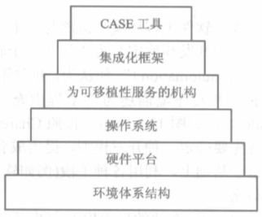

这6种成分又可区分为3个层次。由硬件平台和操作系统体系结构，是CASE环境的基础（底层）。集成化框架（integration framework）由一组专用程序组成，用于建立单个工具之间的通信，建立环境信息仓库，以及向用户（指软件开发者）提供外观和感觉一致的界面，它们将CASE工具集成在一起，构成环境的顶层。余下的一层是服务于可移植性的机构，它介于集成化工具与基础软、硬件之间，使集成后的工具无须作重大的修改即可与环境的软、硬件平台相适应。

下面仅就CASE工具和环境信息仓库作简要说明。

1. **CASE工具**

所谓CASE工具，泛指用于辅助软件开发、运行、维护、管理、支持等过程中的活动的软件。

大多数工具仅限于支持软件生存周期过程中的某些特定的活动。可支持软件开发、维护和管理等过程中各种活动的软件工具有很多，例如，支持需求分析活动的需求分析工具，支持分析设计建模的建模工具，支持测试活动的测试工具，支持维护过程的维护工具等；也有支持软件开发方法的软件工具，如支持结构化方法的结构化工具、支持面向对象方法的面向对象工具、支持原型开发方法的原型工具等；还有应用类的工具，如用户界面工具、多媒体开发工具、数据库应用工具等。

CASE环境中的工具集，应该包括支持软件开发自动化的各种工具，而且工具集是可扩充的，一种新的工具出现后，应该可以很容易地集成到工具集中。

CASE工具种类繁多，很难有一种统一的分类方法，一个工具往往对软件生存周期中的某个（些）活动提供支持，所以有的学者按软件过程的活动将其划分为以下3类：支持软件开发过程的工具，包括需求分析工具、软件设计工具、编码工具、测试工具和纠错工具等；支持软件维护的工具，包括版本控制工具、文档分析工具、开发信息库工具、逆向工程工具和再工程工具等；支持软件管理过程和支持过程的工具，主要包括项目管理工具、配置管理工具和软件评价工具等。

2. **环境信息仓库**

工具的集成化，需要有环境信息仓库（CASE repository）的支持。环境信息仓库向所有的工具提供统一的公共数据。对于大型的开发项目，环境信息仓库常常要存放项目的大量文档，不仅信息量大，而且在工具切换时要频繁地进行信息交换。环境信息仓库处于核心层内，可以说是核心层的核心。没有有效的环境信息仓库，就没有CASE环境。

环境信息仓库具有类似数据库管理系统的功能：

- 数据完整性。包括确认信息仓库的数据项，保证相关对象间的一致性，以及当对两个对象修改时，也要对其相关对象进行某些修改，并自动完成“关联式”修改等功能。
- 信息共享。提供在多个开发者和多个工具间共享信息的机制，管理和控制对数据及加锁/未锁对象的多用户访问，以使得修改不会被相互间不经意地覆盖。
- 数据-工具集成。建立可以被I-CASE环境中所有工具访问的数据模型，控制对数据的访问，以及完成合适的配置管理功能。
- 数据-数据集成。数据库管理系统建立数据对象间的关系，使得可以完成其他功能。
- 文档标准化。在数据库中对象的定义直接导致了创建软件工程文档的标准方法。

### 2. CASE的一般结构

集成CASE环境的优势，在于使软件项目的模型、程序、文档和数据信息平滑地从一个工具传递到另一个工具，从一个软件工程阶段平滑过渡到下一个阶段。为此，前面介绍的组成CASE环境的各构件，在集成CASE环境中必须有机地结合在一起，以构成层次式的环境体系结构。

1. **CASE集成框架的典型结构**

下图显示了CASE集成框架的层次结构模型。

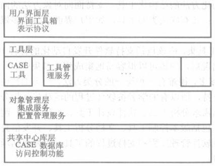

其层次具有一定的代表性。它把前面提到的构件分成4个层次，从上到下分别是：用户界面层、工具层、对象管理层和共享中心库层。

最上层的是用户界面层，它包括标准的界面工具箱和公共的表示协议。界面工具箱包含人机界面管理软件和显示对象库，它们为集成环境显示风格一致的用户界面提供了必要的界面元素和工具。表示协议提供一组界面约定，包括一致的屏幕布局约定、菜单名和组织、图符、对象名、键盘和鼠标的使用等。

工具层除了CASE工具本身外还包括一组工具管理服务。工具管理服务（TMS）负责管理工具的执行中多任务操作，包括同步和通信、协调从中心库和对象管理系统到工具的信息流以及收集关于工具使用的度量等。

对象管理层（OML）完成集成服务和配置管理功能。框架体系结构层的软件提供了CASE工具集成的机制。每个软件工具被插入到对象管理层，并通过一组工具和中心库耦合在一起。OML的配置管理服务用于标识配置对象，完成版本控制，并提供对变化控制、审计以及状况说明和报告的支持。

最底层的是共享中心库层，它使得对象管理层能够与CASE数据库交互并完成对CASE数据库的访问控制。

2. **CASE结构的一个例子**

为有一个形象的概念，现给出一个CASE结构示例，它由核心层、基本层、应用层3级组成，如图所示。

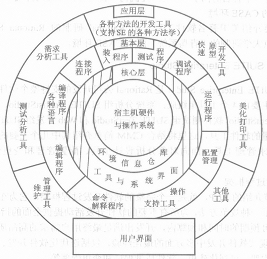

最里面的一级是核心层。它包括由宿主机和操作系统构成的虚拟机，环境信息仓库（或文件库）及其支持软件（如数据库管理系统或文件管理系统），以及从工具到系统（含数据库）的接口。环境信息仓库是这个核心层的核心。它既要存放项目的各种开发文档与管理文档，又要承担各种工具之间的信息交换。对于大型的开发项目，它不仅信息量大，而且信息传送频繁。所以怎样实现环境数据库，并对它进行有效的管理，是多年来环境研究的中心课题，至今仍为许多单位研究的重点。

第二级是基本层。它包括软件开发所需要的最小限度的工具，所以又称为最小支持环境。这些工具除包括常用的编译、编辑、调试、连接/装配、配置管理等实用程序外，通常还包括命令解释程序和支持用户操作的一些工具，例如菜单生成系统、图形系统和多窗口系统等。不同单位研制的环境，其基本层的内容略有差别，但大同小异。

第三级为应用层。包括支持生存周期内各个阶段活动的工具，以及支持不同的系统开发方法学的工具。这一层的内容比较灵活，可根据开发者的需要增删。随着IPSE的升级换代，这一层还将越来越多地增添一些带智能性的工具，如自动测试工具、应用生成系统等。

还需指出，现代的软件开发环境可能使用分布式系统作为宿主机，此时的环境信息仓库也应采用分布式数据库。此外，不少环境采用某种语言作为它的基本语言，这种基本语言既用来支持开发目标系统的软件，也常用来描述环境所配置的工具。

# 软件工程高级课题

自1968年软件工程一词提出40年以来，软件编程范型（programming paradigm）已从过程式编程范型、面向对象编程范型，发展到基于构件技术的编程范型。与此相对应，软件工程也从早期的结构化分析与设计，跨越第二代的面向对象分析与设计，现正向着基于软件复用的第三代软件工程阔步前进。

40年来，广大软件工程师在精英学者的带动下，开辟了软件工程的许多研究课题。在今天仍热门的髙级课题中，有些是新课题，例如随着网络的普及而兴起的Web工程；有些则是由老课题推陈出新，例如基于软件体系结构的软件开发、形式化的软件开发等。作为结尾，这里将对这些课题作简单的介绍与展望。

## （一）Web工程

近年来，随着Internet和Intranet/Extranet的迅猛发展，基于Web的系统与应用(Web-based systems and applications，WebApp）越来越引起人们的关注。Web工程不但来自计算机科学、信息系统和软件工程，也来自其他学科，而且代表了信息技术进化的方向。

计算机科学概括了硬件和软件，尤其关注可靠和优化的系统性能；信息系统则来自数据处理，它主要关注企业级的信息；而软件工程则通常关注大规模的、基于团队的项目。Web工程是一个快速增长的领域，需要使用更加前沿的方法，而不是仅仅应用以前存在的方法和已被证明了的开发实践。

Web工程的定义：使用合理的、科学的工程和管理原则，用严密的和系统的方法，来开发、发布和维护基于Web的系统的学科。

在1990—1995年间，Web网站仅包含一组不多的超文本静态网页，主要使用文本及少量的图形。随着网络技术的发展，HTML通过一些开发工具（如XML和Java），其功能得到了发展，从而使Web工程师在提供信息的同时也能提供计算功能。今天，通过一些复杂的计算工具，WebApp不仅可以向最终用户提供单独的计算功能，而且也集成了企业数据库和商业应用。

### 1. Web工程与软件工程

尽管Web工程也包含程序设计和软件开发，且采用了一些软件工程的原理，但Web工程不同于软件工程，基于Web的系统开发与传统的软件开发也存在很多差异。Web工程与传统的软件工程的区别，主要体现在以下方面：

- WebApp（至少目前是这样）强调信息的含量，无论静态网页或动态网页，都是面向文档的；传统软件工程则强调系统功能的完善，除了系统帮助仍是文档外，其余的页面几乎都用于实现数据交互，是面向功能的。
- WebApp关注视觉和感觉，强调感官舒服，通过与多媒体相结合，在界面中达到色彩搭配、动画飞扬；传统的软件界面则奉行“简单为美”的原则。
- 多数WebApp是数据驱动的，一个WebApp的主要功能是让终端用户使用超媒体来表示文本、图形、音频和视频内容，有些还用来访问那些本不属于Web环境下的数据库中的信息（如电子商务或财务应用）；而传统的软件开发多是功能驱动的或过程驱动的。
- WebApp能够适应具有不同技术和能力的用户。通过复杂的人机接口、用户界面和信息递交，实现用户形式的多样化。而传统的软件系统的用户群体则通常圈定在某个范围之内，并根据这个群体定制用户界面和人机接口。
- WebApp必须在短期内开发完成。一个完全的Web站点的开发时间可能只有几天或几周，所以，Web工程很难应用传统软件工程中使用的形式化方法和测试技术。
- 与传统的软件开发相比，Web工程要求艺术、技术和科学在更大范围内相互结合。所以开发Web系统的人员不仅类型众多，需要的技能、知识也更加广泛。

下面从多方面阐述基于Web的系统开发特点，包括Web开发团队的结构、Web工程过程的特点、Web分析、WebApp设计以及Web测试等。

### 2. Web开发团队

开发大型基于Web的系统，需要一个具有不同技能、知识和能力的人组成的团队。通常把参加开发WebApp的人员分为7类，即Web决策人员、内容提供人员、Web开发人员、Web发布人员、Web支持人员、Web管理人员和最终用户等。其结构如图所示。

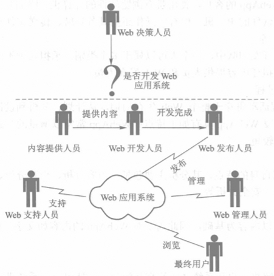

- Web决策人员，一般是指能对开发WebApp起决策作用的领导层人物。
- Web内容提供人员，可以是开发组织内部人员，也可以是外部人员或最终用户。在有些WebApp的开发中，最终用户就是内容提供人员。在一般的网站系统中，内容提供人员还可以是网站维护和支持人员、普通的网站浏览人员和稿件作者。
- Web开发人员，包括系统分析员、程序设计员、界面设计与美工人员、测试人员等技术人员。
- Web发布人员，职责是将系统内容传输到一个Web站点上。要求他们在数据库交互、HTML操作、B/S功能性、服务器端的应用、CGI及多媒体应用等方面具备相应的能力。
- Web支持人员，经过适当培训后，Web支持人员应能从事一些技术支持工作，包括更新与维护Web系统。此外，他们还需懂一些站点发布、数据库操作知识和存取数据的方法。为了控制站点不会超量操作，Web支持人员还需要作Web访问统计。当然他们也可以与Web开发人员或管理员一起完成这个任务。
- Web管理员，又称站长，负责Web网络的管理，涉及Web软件和硬件操作技能、网络和通信技能以及与Web性能有关的知识。其技术工作一般包括记录文件版本、数据库操作、安全和存取权限以及通过CGI程序或类似的扩展程序对服务端进行操作。
- 最终用户，是WebApp的客户，使用带有浏览软件的计算机（终端）。虽然一般的最终用户只需会操作带有软件的PC机，但有些操作还需具备导航、传送文件和使用复杂搜索引擎（searching engine）等。

顺便说明，在开发团队中，一个人可以属于多个类别，承担几种不同的工作。例如，最终用户也可以同时担任内容提供人员和Web发布人员。

### 3. Web工程过程

Web工程过程活动贯穿于整个Web生存周期，从计划、分析到设计、发布、不断的精化和升级系统。开发WebApp具有如下特点：WebApp常常以增量的方式开发；需求经常发生变化；开发期限较。

### 4. Web分析

Web工程根据自身的特点，其分析主要包括：内容分析、交互分析、功能分析、配置分析和导航关系分析、安全分析等。

- 内容分析，因为WebApp以内容为基础，因此需要对WebApp的内容如文字、图形、图像、音频、视频等进行分析。
- 交互分析，主要解决用户和系统之间的交互问题，包括用户与系统进行交互的方式，用户界面布局、内容、导航链接、实施交互机制及WebApp的整体美观度等。
- 功能分析，与交互分析类似，功能分析主要涉及Web工程操作。用户可见的功能包括任何可以直接由用户操作的功能。例如，一个购物Web站点可能要完成许多购物功能（如商品浏览或商品交易），从最终用户的角度来看，这些功能是可操作、可使用的。
- 配置分析，主要对工程所涉及的环境和基础设施进行详细的描述。Web工程必须设计支持服务器和客户端的环境，要能安装在Internet或局域网中。如果整个Web工程还涉及数据库，还需要指明数据库的类型。客户端则是一个浏览器，由于目前存在多种不同标准的浏览器，因此需要考虑与客户端的兼容性。
- 导航关系分析，因为WebApp中的每个页面可能都要与其他页面进行链接，导致链接的复杂化。导航关系分析主要考虑各个页面之间的关系。可以通过对用户的分析和对页面单元的分析来进行。
- 安全分析。
  - Web站点安全。Internet不对机密信息和敏感信息提供保护，所以必须自我保护。一个Web站点，只要与Internet相连，就可以被所有人访问，除非安装某些形式的保护。作为Web站点的管理人员，应努力保护站点的信息资源、用户以及客户。Web的交互性也正是它的致命弱点。Web中各种受欢迎的功能，例如聊天室、电子商业和自动邮件回复等，都可能受到是黑客和入侵者的攻击。
  - Web站点风险。总的来说，风险分为两类：一是机密信息被窃取，二是数据和软、硬件系统被破坏。这两类风险的危害都是不可低估的。上述两类风险细分为以下3类：
    - Web服务器的信息被破译，最终导致闯入者进入服务器。
    - Web上的文件被未经授权的个人访问，损害了文件的隐私性、机密性和完整性。
    - 当远程用户向服务器传输信息时，交易被截获。

### 5. Web设计

Web的设计包括它的外观和感观，而且也要考虑Web中的所有元素包括观众信息、意图和目标描述、域信息和页面的规范等。下面将从几个方面来阐述Web设计方法和特点。

1. **设计原则和目标**

Web的设计坚持以用户为中心来开发，也就是说，开发过程是一个以用户的要求、兴趣、特征、能力、知识和技术为中心的过程。该规划过程应该产生一个好的观众信息集合。

在整个设计过程中要注意以下的原则和目标：

- 设计要尽可能简单。Web设计是为用户服务的，达到用户的需求是Web最优先的考虑。
- 布局要尽可能美观。互联网上存在大量的信息，如果不能使布局吸引观众，那么这个Web设计毫无疑问是失败的设计。
- 整体要尽可能保持一致，即生成一个一致的、令人愉快的、有效的Web的界面。Web设计的目标应该是给用户一个有关它的界面的印象，这些界面反映了一个共同结构和一致的视觉线索。

2. **界面设计**

Web工程中界面在用户心目中具有非常重要的地位。界面是Web应用系统给人的第一印象，因此，用户界面要易使用、易操作、直观、一致。此外，界面还要求有助于用户浏览。界面设计应考虑浏览者当前的位置，当前可进行的操作，以及当前可导航的目标。

3. **设计方法**

由于没有一个开发WebApp的定式，所以开发者可以在多种方法中进行选择。没有一个方法适用于所有的情况，因此在设计同一个Web的时候甚至可以考虑改变方法。整个Web应该包括哪些信息，可能一时难以确定，因此，可以考虑采用自顶向下的设计方法。

4. **设计中的问题**

尽管有些技术能够有助于保证Web界面的一致性，但有些问题会影响Web的设计，例如，缺乏导航和信息线索，信息组织和结构过于复杂，结构页面不均匀，存在链接错误页面等。这些问题是Web设计人员应该注意的。

5. **设计人员的检查**

设计一个Web，主要目的就是满足用户的需要。所以一个设计者应努力遵循以用户为中心的原则和目标来开展Web设计工作。Web的设计人员应该掌握用户对网站信息空间、组织和线索的体验，并使用相应技术来为信息打包和设计链接，以便满足用户需求。Web的设计过程应该包含设计的技巧和解决问题的经验，设计者要努力去改进Web的设计，以便更好地满足用户的需要。

### 6. Web测试

在Web工程过程中，Web测试、确认和验收是一项重要而富有挑战性的工作。WebApp的测试与传统的软件测试不同，不但需要检查和验证是否按照设计的要求运行，而且还要评价系统在不同用户浏览器上的显示是否合适。重要的是，还要从最终用户的角度进行安全性和可用性测试。Web测试主要包括：

- 内容测试。检查内容的正确性、一致性、无歧义等问题。
- 功能测试。查找不符合用户需求的错误。
- 结构测试。确保其结构是符合WebApp的内容和功能的，确保它是可扩展的，支持新的内容或功能。
- 导航测试。确保所有的导航用法和意义都被实现，以便发现导航错误（如空链接、错误链接等）。
- 易用性测试。确保每个不同的用户群能被WebApp界面支持，能学会并运用所有需要的导航用法和意义。
- 性能测试。在不同操作条件、配置和负载下进行，确保系统能响应用户的交互操作，在可接受的性能下降的条件下处理极端的负载量。
- 兼容性测试。在客户机和服务器上设定不同的配置条件下执行WebApp。目的是找出那些只在特定配置下会出现的错误。
- 协同工作测试。确保WebApp能很好地与其他的应用程序和数据库交互。
- 安全性测试。评估潜在的易攻击性，任何一个成功的入侵都认为是安全方面的失败。

## （二）基于体系结构的软件开发

体系结构的英文architecture含义就是建筑。早期的结构化程序以语句组成模块，通过模块的聚集和嵌套，形成层层调用的程序，这就是体系结构。但那个时代的程序规模不大，通过强调结构化程序设计，并注意模块的耦合性，就可以得到相对良好的结构，所以并未特别强调体系结构。

抽象数据类型和面向对象技术的出现，使体系结构的研究开始受到重视。封装的模式、强大的类库，大大促进了对象/构件的复用。虽然软件项目的规模更大，开发速度更快，仍可能开发出相对可靠和易于修改的软件，适应了业界对软件日益增长的需求。

早期的“算法+数据结构”的程序开发模式，正在被“构件+体系结构”模式所取代。基于构件和体系结构的软件开发方法，被认为是解决软件危机、实现深层次软件复用的有效途径，从而成为近代软件工程研究的重点。

### 1. 应用软件的体系结构

一般的说，软件的体系结构可以从以下4个角度来分析与考察：程序的、业务的、技术的和信息的。任何软件的体系结构，都可以看成上述4种体系结构的总和。

1. **程序的体系结构**

软件离不开程序，一个软件通常包含许多模块和对象。拿应用程序来说，它从头到尾，可能包括处理输入数据所需的用户界面程序，处理数据的加工/计算或以数据管理为主要业务的主程序与子程序，以及处理输出数据的打印或报表程序，等等。这些模块/对象既各有分工，又互相合作，通过相互之间的调用/通信，即形成应用程序的体系结构。

2. **业务的体系结构**

采用应用程序的目的，总是为了完成某项业务。以支持超市日常营业的POS（point of sales）系统为例，每个超市一般设有若干收银台。当售货员将顾客所购商品输入系统后，收银台随即计算货款，打印收款单据。超市办公室的软件则统计每个收银台当天售出的商品与货款，一方面要在售货员下班时与之进行核对；另一方面可将当日售得现金送交银行，结算账目。门市经理和总经理办公室的程序，则需及时汇总各方面的信息，供领导了解和查询。这样，从经理到售货员，从超市后勤到银行，所有与本程序相关的单位与个人，共同组成一个业务的体系结构。

3. **技术的体系结构**

从技术的角度看，应用程序还存在一个技术体系结构。例如，从收银台到办公室通常用局域网连接；从超市门市到总部可采用广域网连接；各点之间既可采用对等通信技术，也可采用C/S技术；用户界面可以采用简单的图形用户界面，也可使用最新的办公系统。不言而喻，应用程序的模块/对象设计，与上述的技术体系结构将密切相关。

4. **信息的体系结构**

最后，从信息/数据流动的角度考察，还存在一个信息的体系结构。例如，这一应用程序有哪些输入数据和输出数据？哪些是共享数据？哪些是临时数据？在数据的存储、更新、删除和使用中，需要遵循哪些规则？信息体系结构的差异，例如是采用一般数据文件还是采用数据库，往往会直接影响应用程序的功能。

综上可见，确定软件的体系结构，在现代软件开发中具有重要的意义。

通常情况下，根据用户的业务流程，应首先构造一个业务的体系结构，它大致相当于传统软件开发中按照用户的功能需求来确定软件的解决方案。与此同时，应考虑采用什么样的技术和信息体系结构，并通过修改达到圆满的效果。

把上述这些加上软件交付时间和开发经费约束，就可以获得解决方案所需的完整的体系结构。下一步，就是怎样按照既定的体系结构，组织人员来开发应用程序了。

### 2. 编程范型对体系结构的影响

随着编程范型从第一代演变到第三代，体系结构对软件的开发日益显得重要。

传统的软件工程使用过程式编程语言进行结构化编程，结构化程序本身采用强耦合的模块结构。如前所述，这时的程序、数据、体系结构自然天成，所以当时并未太多强调“体系结构”一词。

第二代编程范型采用面向对象技术。对象被定义为数据与操作相对孤立的封装体，可以独立完成一些比较小的功能，从而为软件复用打开了方便之门。在软件开发中有强大的类库支持，就可以在它的基础上实现许多具有独立功能的构件与模式。

随着第三代编程范型的出现，基于构件的技术和互联网支持的Web服务被大量应用，就更加重视体系结构了。构件把接口的功能从对象中分离出来后，即使用接口来表示构件能够“做什么”，构件体只回答“怎样做”。可见此时的体系结构，只需抓住需要软件“做什么”就足够了。

### 3. 编程范型对复用粒度的影响

随着编程范型的演变，软件复用的粒度（grainality）也随之不断增大，从模块/对象，到构件、子系统，一直到某个领域。打个简单的比喻，在结构化程序设计时代，人们以砖、瓦、灰、沙、石来预制梁、柱、屋面板等，盖的是平房和小楼；而在面向对象时代，人们使用的是整面墙、整间房、一层楼梯等预制件，直接盖高楼大厦。

于是，下列问题就自然地提到了软件开发者的面前：怎样搭配构件才合理？体系结构怎样能保证构造容易？如果更改了重要构件，怎样保证整个高楼不会倒塌？进而言之，每种应用领域（例如医院、工厂、机关、旅馆）需要什么样的构件？什么样的构件骨架（例如适用、美观、强度与造价合理等）建造出来的建筑（或体系结构）更能满足用户的需求？

### 4. 软件体系结构技术仍在发展

综上可见，“体系结构”一词早已有之，并不是什么新概念。但它从不自觉地被运用，发展到今天成为人们关注的焦点，反映了业界对软件本质问题认识的深化。

从理论上说，体系结构可以看成是集合{构件，连接件，约束}。开始，人们试图用形式化的体系结构描述语言（architecture description language，ADL）来准确地描述它，也获得过一些成果。但由于各个侧面相互影响，难以量化表达，效果并不显著。

另一方面，在实践研究上却取得了比较丰硕的成果。总结历来的软件技术，人们发现有不少惯用的模式，可作为体系结构的基础。例如管道、过滤器和桥，由谁设计都差不多。如果总结出来，便可把它用作预制件，即使不做成预制件，也可以像数据结构中的队、栈、表、图、树那样做成模板，照着编写程序，就可以开发出良好的体系结构来。

1995年，E.Gamma等总结出以UML表示的23种最基本的模式，后来B.Douglass又总结了54种实时设计模式。模式是对象/构件组成的功能元件，也称轻量级体系结构，可以和面向对象的程序直接对应，以便程序开发人员去构造信息的、技术的和业务的体系结构。后来又有人研究粒度更大的模式，其大小相当于子系统，从而形成了由体系结构、样式、模式、构件/对象所构成的4级元结构。正是由于体系结构的上述实践研究与应用领域密切相关，才推动了领域工程、领域理论的研究不断向前发展。

软件工程学的宗旨，就是将最科学、最本质的理念，总结为软件工程的方法学、规范、乃至行业标准，使开发人员可用较小的代价做出高质量的软件。从这个意义上说，软件体系结构技术的发展正方兴未艾，还远远没有结束。

## （三）面向方面的软件开发

随着软件设计的进一步深入，人们逐渐发现对象的抽象并不能完全解决问题。在软件系统的设计过程中，人们首先关注的往往是与系统业务相关的模块，比如银行系统中账户的存取模块、库存管理系统中的货物购置和入库模块，然后会考虑分布在多个核心模块中的公共行为，比如日志记录、安全性、缓存和权限控制等。人们把前者称为核心关注点，后者称为横切关注点。

面向对象的编程技术（OOP）可以很好地完成对核心关注点的设计与开发，而对横切关注点却有些力不从心。其原因在于，横切关注点会跨越多个模块，是多维的，而OOP的设计方法却是一维的，把多维的需求映射到一维上，便产生了许多需要探讨的问题。

### 1. 面向方面编程

面向方面编程（aspect-oriented programming，AOP）是对软件工程的一种革新性思考，主要用来解决横切关注点问题。

AOP为开发者提供了一种描述横切关注点的方法，人们可以通过它单独实现横切模块。此外，AOP提供了一种机制，使得核心模块和横切模块能够融合在一起，从而构造出最后的实际系统。AOP用一种边界清晰的方式把横切关注点模块化，产生一个更容易设计、实现和维护的系统架构。

与常规的软件开发技术不同的是，常规技术会将这些不同的关注点实现于多个类中，而面向方面编程将使它们局部化。这里简单介绍AOP中的一些基本概念。

1. **关注点**（concern）

关注点也就是要考察或解决的问题。比如在一个电子商务系统中，订单的处理、用户的验证和用户日志记录等都属于关注点。核心关注点，是指一个系统中的核心功能，也就是一个系统中跟特定业务需求联系最紧密的商业逻辑。

除了核心关注点以外，还有一种关注点，它们分散在各个模块中解决同样的问题，这种跨越多个模块的关注点称为横切关注点或交叉关注点（crosscutting concerns）。在一个电子商业系统中，用户验证、日志管理、事务处理、数据缓存都属于交叉关注点。

2. **方面**（aspect）

方面是一个抽象的概念，从软件的角度来说是指在应用程序不同模块中的某一个领域或方面。从程序抽象的角度来说，可以对照OOP中的类来理解。OOP中的类（class）是实现世界模板的一个抽象，它包括方法、属性、实现的接口、继承等。而AOP中的方面是实现世界领域问题的抽象，包括属性和方法等。

从抽象意义上讲，方面是对软件系统构件的性能和语法产生一定影响的一些属性；从设计上讲是横切系统的一些软件系统级关注点；从实现上讲，是一种程序设计单元，它支持将横切系统的关注点封装在单独的模块单位中，是AOP将横切关注点局部化和模块化的实现机制。

3. **连接点**（join point）

连接点也就是运用程序执行过程中需要插入方面模块的某一点。连接点主要强调的是一个具体的“点”的概念。这个点可以是一个方法、属性、构造函数、类静态初始化模块，甚至一条语句。

4. **织入**（weaving）

织入是指把解决横切问题的方面模块，与系统中的其他核心模块通过一定策略或规则组合在一起的过程。编译器织入是一种常用的织入方法，这种方法使用专门的编译器来编译包括方面模块在内的整个应用程序，在编译的过程中实现织入，这种织入是功能最强大的。

编译器织入的AOP实现一般都是基于语言扩展的方式，即通过对标准语言进行一些简单的扩展，加入一些专用于处理AOP模块的关键字，定义一套语言规范，通过这套语言规范来开发方面模块，使用自己的编译器来生成目标代码或中间代码。

### 2. AOP语言规范

从抽象的角度看来，一种AOP语言要说明下面两个方面：

- 关注点的实现。把每个需求映射为代码，然后，编译器把它翻译成可执行代码，由于关注点的实现以指定过程的形式出现，可以使用传统语言如C、C++、Java等。
- 织入规则规范。如何把独立实现的关注点组合起来形成最终系统，需要建立一种语言来指定组合不同的实现单元以形成最终系统的规则，这种指定织入规则的语言可以是实现语言的扩展，也可以是一种完全不同的语言。

AOP设计的具体步骤如下：

1. 对需求规约进行方面（Aspect）分解。
   - 确定哪些功能是组件必须实现的，即提取核心关注点。
   - 哪些功能可以以方面的形式动态加入到系统组件中去，即提取系统级的横切关注点。
2. 对标识出的方面分别通过程序机制实现。
   - 构造系统的组件。利用组件语言实现系统的组件。对于OOP语言，这些组件可以是类；对于过程化程序设计语言，这些组件可以是各种函数和API。
   - 构造系统的方面。利用一种或多种AOP语言实现方面，且AOP语言必须提供声明方面的机制。
3. 用方面编织器将所有的单元编排重组在一起，形成最终的可运行系统。
   - 为组件语言和AOP语言构造相应的语法树；依据方面中的连接点定义对语法树进行联结；在连接的语法树上生成中间文件或目标代码。
   - AOP语言必须提供将方面代码和基础代码织入的机制。
   - AOP语言必须提供生成可运行系统的实现机制。

### 3. AOP与OOP比较

OOP是AOP的技术基础，AOP是对OOP的继承和发展，它们之间区别如下。

**可扩展性**。可扩展性是指软件系统在需求更改时程序的易修改能力。由于切面模块根本不知道横切关注点，所以很容易通过建立新的切面加入新的功能。另外，如果系统中加入新的模块，已有的方面自动横切进来，使系统易于扩展，因此：

- OOP主要通过提供继承和重载机制来提高软件的可扩展性。
- AOP通过扩展方面或增加方面，系统相关的各个部分都随之产生变化。

**可重用性**。可重用性指某个应用系统中的元素被应用到其他应用系统的能力。AOP把每个切面实现为独立的模块，模块之间是松散耦合的。举例来说，可以用另外一个独立的日志写入器方面（替换当前的）把日志写入数据库，以满足不同的日志写入要求。因此：

- OOP以类机制作为一种抽象的数据类型，提供了比过程化更好的重用性。
- OOP的重用性对非特定于系统的功能模块有很好的支持，如堆栈的操作和窗口机制的实现。
- 对于不能封装成类的元素，如异常处理等，很难实现重用。
- AOP使不能封装成类的元素的重用成为可能。

总的来说，松散耦合的实现意味着更好的代码重用性。

**易理解性和易维护性**。

- 代码集中，易于理解，从而解决了由于OOP跨模块造成的代码混乱和代码分散问题。
- AOP用最小的耦合来处理每个关注点，即使是横切关注点也是模块化的，这样实现的系统，其代码的冗余小，模块化的实现使系统容易理解和维护。

### 4. 面向方面软件开发

面向方面软件开发（aspect-oriented software development，AOSD）使用AOP方法，在整个软件生存周期中提供系统化标识、模块化以及横切关注点，为功能需求、非功能需求和平台特性等创造了更好的模块性，便于开发出更易于理解的系统，也更易于配置和扩展，以满足和解决更广泛的需求。

面向方面软件开发可以将需要出现多次的公用代码集中到一处实现，从而大大减少代码的冗余度和耦合度，增强可读性。由于代码修改的后期成本大大减少，设计师再也不必陷入设计不足或者过度设计的两难境地，即使后期出现了额外的需求，也可以将它封装在方面中独立实现。

AOSD包括3个清晰的开发步骤：

1. 方面分解。分解需求并提取出横切关注点和一般关注点。这一步把核心模块级关注点和系统级的横切关注点分离开来。
2. 关注点实现。各自独立地实现这些关注点。
3. 方面的重新组合。在这一步，方面集成器通过创建一个模块单元——方面来指定重组的规则。重组过程（也称织入或结合）则使用这些信息来构建最终系统。

## （四）形式化的软件开发

软件自动化技术是提高软件生产率的根本途径之一，形式化方法是软件自动化的根本前提。详细请查阅相关资料。