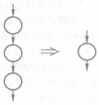

[toc]

# 需求工程与需求分析

## （一）软件需求工程

### 1. 软件需求的定义

软件需求主要指一个软件系统必须遵循的条件或具备的能力。这里的条件或能力从两个方面来理解：一是用户解决问题或达到目标所需的条件或能力，即系统的外部行为；二是系统为了满足合同、规范或其他规定文档所需具有的条件或能力，即系统的内部特性。

软件需求一般包括3个不同的层次：业务需求、用户需求和功能需求。

1. 业务需求，这是客户或市场对软件的高层次目标要求。通过对企业目前的业务进行评估，包括对业务流程建模、改进等方面，归结出业务需求。具体说，就是从业务的角度分析项目成功的预期效果。在确定业务需求前，还应该在各类业务相关人员范围内达成一致。
2. 用户需求，即从用户使用角度来描述软件产品必须完成的任务。通常在用例模型文档中描述这个层次的需求，同时，从用户需求还可以引申出软件的质量属性，例如软件可持续正常工作的时间等。重心是确定软件系统为用户提供的功能以及软件与环境的交互。
3. 功能需求，它定义软件开发人员必须实现的软件功能，以及为了有效实现这些功能而必须达到的非功能要求、约束条件等，从而使用户能完成他们的任务，满足业务需求。功能需求依赖于用户需求，是用户需求在系统上的具体反映。

下图显示了这3个需求层次之间的关系。

### 2. 软件需求的特性

要描述一个软件，必须从功能、非功能和质量等多个方面来进行。由此可见，软件需求包括以下6个特性：功能性、可用性、可靠性、性能、可支持性、设计约束。

1. **功能性**需求是软件最重要的需求，也是最直观、用户最关心的软件需求，它又可分为普通功能和全局性功能。普通功能泛指软件完成的一个功能或提供的一个服务，例如订单查询等功能；全局性功能是适用于软件所有应用场景的功能，如出错处理等。
2. **可用性**泛指能使最终用户方便使用软件的相关需求，例如，系统使用者所需的培训时间，是否符合一些常见的可用性标准，如Windows界面风格等。提髙可用性、关注用户体验是软件获得成功的重要因素。
3. **可靠性**包括与系统可靠性相关的各种指标，主要有正常运行率、平均无故障时间、平均修复时间、精确度、最高错误或缺陷率。
4. **性能**记录与系统性能相关的各种指标，其中包括对事务的响应时间，包括平均响应时间和最长响应时间；吞吐量，如每秒处理的事务数；容量，如系统可以容纳的客户或事务数；降级模式，当系统以某种形式降级使用时可接受的运行模式；资源利用情况，内存、磁盘、通信等。
5. **可支持性**定义所有与系统的可支持性或可维护性相关的需求，其中包括编码标准、命名约定、类库以及如何对系统进行维护操作和相应的维护实用工具等。
6. **设计约束**代表已经批准并必须遵循的设计决定，其中包括软件开发流程、开发工具、系统构架、编程语言、第三方构件库、运行平台和数据库系统等。

### 3. 需求工程

所谓软件需求工程，是一门应用有效的技术和方法、合适的工具和符号，来确定、管理和描述目标系统及其外部行为特征的学科。它通过合适的工具和记号，系统地描述待开发系统及其行为特征和相关约束，形成需求文档，并能对不断变化的需求演进给予支持。

它把系统需求分解成若干子系统和任务，再把这些子系统或任务分配给软件，并通过一系列重复的分析、设计、比较研究、原型开发等过程，把这些系统需求转换成软件的需求描述和性能参数。

需求工程是软件工程的一个子领域，贯穿于软件整个生存周期的始终。

## （二）需求分析

需求分析与需求工程不同，它通常指软件开发的第一项活动，该项活动的目的主要是为待开发的软件系统进行需求定义与分析，并建立一个需求模型（requirement model）。

### 1. 需求分析的步骤

软件需求分析一般包括如下的4个步骤：需求获取、需求建模、需求描述（即编写SRS）和需求验证。

1. **需求获取**通常从分析当前系统包含的数据开始。可以从不同类用户处收集所期望的软件系统功能、用户与系统间的交互和对话方式等。在获取功能需求之后，再考虑对质量的要求。如果客户的要求和己有的产品存在某些相似之处，还需考虑可否复用一些己有的软件组件。
2. **需求建模**，需求分析的主要任务是建立需求模型。常用的图形化模型包括用例图、数据流图、实体联系图、控制流图和状态转换图等。除需求模型外，有些软件还需要绘制系统关联图、创建用户接口原型、确定需求优先级别等。
3. **需求描述**即编写软件需求规格说明书（SRS），必须用统一格式的文档进行描述。在编写SRS时应该，指明需求的来源（例如来自客户要求或是某项更髙层的系统需求），或业务规范、政府法规、标准或其他外部来源等；为每项需求注上标号，以便进行跟踪，记录需求的变更，并为需求状态及其变更活动建立度量。
4. **需求验证**，由分析员提供的SRS可能出现需求不清、不一致等问题。以需求规格说明书为依据编写测试计划时，也可能发现说明中的二义性。这些问题都必须通过验证来改善，确保需求规格说明书可作为软件设计和最终系统验收的依据。

这4步周而复始，实际上组成了一个迭代的过程，直到所编写的SRS真正符合用户的需求为止。

### 2. 需求获取的常用方法

为了获取正确的需求信息，系统分析员常采用例如建立联合分析小组、用户访谈和问题分析与确认等的常用需求获取方法和技术。

1. 立联合分析小组，分析员往往对用户的业务和术语不熟悉，用户也不熟悉计算机的处理过程，因而需要由领域专家来沟通。因此，建立一个由用户、系统分析员和领域专家组成的联合分析小组，可极大地方便系统开发人员和用户之间的沟通，对需求获取非常有利。小组的人员中，用户方的业务人员应是系统开发的主体。
2. 用户访谈，用户访谈的对象既包括高层用户，也包括直接用户。根据用户使用该软件的功能、频率、优先级或熟练程度等方面的差异，可将用户分成若干类，对每类用户采用现场参观、个别座谈或小组会议等不同形式，了解他们对现行系统的评价和对新系统功能的期望。
3. 问题分析与确认，不要期望用户在一两次交谈中就会对目标软件的需求阐述清楚，也不能限制用户在回答问题时自由发挥。每次访谈后要及时整理，去掉错误的、无关的信息，留下和整理有用的内容，以便在下次与用户见面时进行确认。同时，准备下一次访谈时需要进一步了解的更细节的问题。如此循环。

### 3. 用快速原型法获取需求

作为开发人员和用户的交流手段，快速原型可以获取两个层面上的需求。第一层为联机屏幕，用于确定屏幕及报表的版式和内容，屏幕活动的顺序，以及屏幕排版的方法。第二层用于模拟系统的外部特征，包括引用数据库的交互作用及数据操作，执行系统关键操作等。

快速原型法一般可按照以下的步骤进行。利用各种分析技术和方法，生成一个简化的需求规格说明书；对需求规格说明书进行必要的检查和修改后，确定原型的软件结构、用户界面和数据结构等；在现有的工具和环境的帮助下快速生成可运行的软件原型并进行测试和改进；将原型提交给用户评估并征求用户的修改意见；重复上述过程，直到原型得到用户的认可。

为了快速开发出系统原型，必须充分利用快速开发技术或软件复用技术。但如果演示原型系统需要手工编写数千行甚至数万行代码，那显然代价太大，就没有现实意义了。第四代开发技术（4GT）是快速原型法的常用技术，它利用第四代语言或开发工具，如数据库查询和报表语言、程序和应用软件生成器以及其他高级的非过程语言等，可使软件工程师快速地生成可执行代码。

## （三）需求模型

建立分析模型是需求分析的首要任务。

### 1. 需求模型概述

需求建模的方法，占主导地位的有结构化分析建模和面向对象分析建模两种。

结构化需求模型主要由3部分组成：包括数据流图和加工规格说明的功能模型；主要由数据字典和E-R图等组成的数据模型；由状态转换图、控制流图和控制规格说明等组成的行为模型。详细请看《传统软件工程》。

面向对象需求模型由3个部分组成：用例模型、补充规约和术语表，其中用例模型又包括用例图和用例规约。

用例图（use case diagram）主要用于显示软件系统的功能，它包括用例和参与者两方面的内容。先确定系统外部的参与者，针对每个参与者确定系统的用例，其实质就是看各个参与者需要系统提供什么样的功能服务。用例图下方的用例规约则是对软件系统中每个功能的具体描述。

补充规约用于对全局性功能和可靠性、性能等非功能性需求进行文字性描述；术语表用于描述与系统需求相关的术语的定义。

在实际应用中，描述软件需求时应该灵活运用各种方法，以发挥各自的长处。

### 2. 面向对象的需求建模

基于用例的面向对象需求建模方法，包括画用例图、写用例规约、描述补充规约、编写术语表等4步。

#### (1) 画用例图

用例模型主要包括用例图和用例规约。其中用例图主要描述系统的外在功能，用于确定系统中所包含的参与者和用例，以及两者之间的对应关系。在画用例图的过程中一般包括以下步骤：

1. **找出参与者**

参与者泛指所有存在于系统外部并与系统进行交互的人、硬件或其他系统。通俗地讲，参与者主要是待开发系统的使用者。

2. **根据参与者确定同每个参与者相关的用例**

找到参与者之后，就可以根据参与者来确定系统的用例。主要是考察各参与者需要系统提供什么样的服务，或者说参与者是如何使用系统的。对于用例描述的详细程度（即用例的大小）问题，通常的规则是，用例应该典型地描绘系统功能中某个从开始到结束的过程，并且给参与者提供某些信息。

3. **绘制和检查用例图**

用例和参与者确定后，就可以据此画出用例图，用例图绘制完后，为了避免差错，还需对画好的用例图进行以下的检查：每个用例至少应该涉及一个参与者，参与者需与用例相关联，统一的命名约定和风格。不同的人员对于同一用例模型的理解应完全一致，等等。

还应指出，对于同一个系统，不同的人可能有不同的抽象结果，因而得到不同的用例模型。如果可能，应在多个用例模型方案中选择一种最佳（或较佳）的结果，一个好的用例模型，应该容易被与软件相关的各类人员所理解。

#### (2) 写用例规约

用例规约则用来描述每一个用例的功能，一个用例对应一个用例规约，用来描述用例的细节。

1. **用例规约文档的内容**

用例规约文档一般包含以下内容：

- 简要说明（brief description），简要介绍该用例的作用和目的。
  - 主要用文本方式表述，为了清晰地描述事件流，也可以用UML图（状态图、活动图或时序图）来辅助说明，或者在用例中粘贴用户界面和流程的图形化显示方式。活动图有助于描述复杂的决策流程，状态转换图有助于描述与状态相关的系统行为，时序图适合于描述基于时间顺序的消息传递，等等。
- 事件流（flow of event），包括基本流和备选流，表示出所有可能的活动及流程。
  - 基本流，指该用例最正常的一种场景。在基本流中，系统执行一系列活动来响应参与者提出的服务请求。一般用以下格式来描述基本流：
    - 每个步骤都需要用数字编号，以清楚地标明步骤的先后顺序。
    - 每个步骤的主要内容用一句简短的标题来概括，使阅读者可通过浏览标题快速地了解用例的主要步骤。在用例建模的早期，只需要描述到事件流步骤标题这一层，以免过早地陷入用例描述的细节。
    - 当整个用例模型基本稳定之后，再针对每个步骤详细描述参与者和系统之间的交互。通常采用双向（roundtrip）描述法来保证描述的完整性，即每个步骤都从正反两方面来描述：参与者向系统提交了什么信息，系统对此信息有什么样的响应。
    - 在描述参与者和系统之间的信息交换时，建议指出传递的具体信息。还可利用术语表，使用例的复杂性保持在可控范围内，不至于陷入过多的细节。
  - 备选流用于描述用例执行过程中的异常或偶尔发生的情况，它和基本流组合起来，能够覆盖该用例所有可能发生的场景。备选流一般应包括以下几个要素：
    - 起点，该备选流从事件流的哪一步开始。
    - 条件，在什么条件下会触发该备选流。
    - 动作，系统在该备选流下会采取哪些动作。
    - 恢复，该备选流结束之后，该用例应如何继续执行。
    - 备选流的描述格式可与基本流一致，即需要编号并以标题概述其内容，编号前可加一字母前缀A（alternative），以示与基本流相区别。
- 特殊需求（special requirement），描述与该用例相关的非功能性需求和设计约束。
  - 通常是非功能性需求，它为一个用例所专有，但不适合在用例的事件流文本中进行说明。特殊需求包括且不限于法律或法规方面的需求、应用程序标准和所构建系统的质量属性（包括可用性、可靠性、性能、支持性需求等）。此外，其他一些设计约束，如操作系统及环境和兼容性需求、开发工具等，也可以在此部分记录。
  - 需要注意的是，这里记录的是专属于该用例的特殊需求，对于一些全局的非功能性需求和设计约束，它们并不是该用例所专有的，应把它们记录在补充规约中。
- 前置条件（pre-condition）和后置条件（post-condition）。前置条件是执行用例之前必须存在的系统状态，后置条件是用例执行完毕后系统可能处于的一组状态。

2. **用例模型的检查**

为了发现用例模型的错漏，可以从以下几个方面来进行检查：

- 功能需求的完备性，现有的用例模型是否完整地描述了系统功能，这也是判断用例建模工作是否结束的标志。
- 模型是否易于理解，用例模型最大的优点就在于它应该易于被与软件相关的各类人员所理解，因而用例建模最主要的指导原则就是它的可理解性。用例的粒度、个数以及模型元素之间的关系复杂程度都应该由该指导原则决定。
- 是否存在不一致性，系统的用例模型是由多个系统分析员协同完成的，模型本身也是由多个文档所组成的，所以要特别注意不同文档之间是否存在前后矛盾或冲突的地方，避免在模型内部产生不一致性。
- 避免二义性语义，不同的人对于同一需求的理解应该是一致的。在用例规约的描述中，应该避免定义含义模糊的需求，即无二义性。

#### (3) 描述补充规约

补充规约用于记录在用例模型中不易表述的系统需求，如整个系统的特殊需求，包括非功能性需求和设计约束。如目标、范围、参考、功能、可行性、可靠性、性能、可支持性、安全性、设计约束等。

#### (4) 编写术语表

术语表主要用于定义软件开发项目特定的术语，它有助于开发人员对项目中所用的术语有统一的理解并能正确地使用，它也是后续阶段中进行对象抽象的基础。

#### (5) 调整用例模型

在一般的用例图中，只表述参与者和用例之间的关系，即它们之间的关联。除此之外，还可以描述参与者与参与者之间的泛化（generalization）关系，用例和用例之间的包含(include)、扩展(extend)和泛化关系。

利用这些关系来调整己有的用例模型，把一些公共的信息抽取出来进行重用，可使用例模型更易于维护。但是在应用中要小心选用这些关系，一般来说这些关系都会增加用例和关系的个数，从而增加用例模型的复杂度，而且一般都是在用例模型完成之后才对用例模型进行调整，所以在用例建模的初期不必急于抽象用例之间的关系。

用例模型建成之后，可以对用例模型进行检查，看是否可以进一步简化用例模型、提高重用程度、增加模型的可维护性。主要可以从以下方面进行检查：

- 用例之间是否相互独立？如果两个用例总是以同样的顺序被激活，可能需要将它们合并为一个用例。
- 多个用例之间是否有非常相似的行为或事件流？如果有，可以考虑将它们合并为一个用例。
- 用例事件流的一部分是否已被构建为另一个用例？如果是，可以让该用例包含另一用例。
- 是否应该将一个用例的事件流插入另一个用例的事件流中？如果是，利用与另一个用例的扩展关系来建立此模型。

## （四）软件需求描述

软件需求规格说明书简称SRS，是软件开发人员在分析阶段需要完成的用于描述需求的文档。主要包括引言、信息描述、功能描述、行为描述、质量保证、接口描述和其他描述等内容。其中信息描述、功能描述和行为描述是SRS的主体描述部分，了可用文字描述外，也可以附上各种图形模型，如用例图、E-R图、DFD和CFD等。

引言主要叙述在问题定义阶段确定的关于软件的目标与范围，简要介绍系统背景、概貌、软件项目约束和参考资料等。

信息描述给出对软件所含信息的详细描述，包括信息的内容、关系、数据流向、控制流向和结构等。根据系统所选用的不同分析方法（结构化分析或面向对象分析），可以用前面介绍的工具描述软件涉及的数据的定义和系统的信息逻辑模型。

功能描述是对软件功能需求的说明，包括系统功能划分、每个功能的处理说明、限制和控制描述等。对软件性能的需求，包括软件的处理速度、响应时间和安全限制等内容，通常也在此叙述。

行为描述包括对系统状态变化以及事件和动作的叙述，据此可以检查外部事件和软件内部的控制特征。

质量保证阐明在软件交付使用前需要进行的功能测试和性能测试，并且规定源程序和文档应该遵守的各种标准。此部分说明文字用于检查所交付的软件是否达到了SRS的规定。这可能是SRS中最重要的内容，但在实际工作中却容易被忽略，值得引起注意。

接口描述包括系统的用户界面、硬件接口、软件接口和通信接口等的说明。

其他描述阐述系统设计和实现上的限制，系统的假设和依赖等其他需要说明的内容。

## （五）需求管理

在定义需求的时候总伴有许多可变因素，因此需求应该具有弹性的结构，使之能适应可能的变更，一旦其中有某些需求发生变化，就能确定它可能带来的影响，进而制定出相应的策略。

### 1. 需求管理的内容

需求管理包含5个特定实践，简介如下：

1. 获得对需求的理解。在初步整理需求的基础上，项目小组和用户代表通过初步的分析讨论，对当前项目的需求达成共识，并在需求列表中作相应记录。
2. 获取需求承诺。通过项目参与者的书面承诺，建立各方或各项工作的基准。
3. 管理需求变更。维护变更历史，为调整与控制提供数据。
4. 在需求变更后维护对需求的双向可追溯性。从软件可维护性的角度提出管理要求。
5. 标识项目工作（包括计划和产品）与需求的不一致性。若发现不一致性，即启动纠正措施。

上述5个特定实践，可归结为以下3项活动：

- 需求确认，特定实践中的1、2项。由开发方和客户共同对主要需求文档“软件需求规格说明书”进行评审，双方达成共识后作出书面承诺，使需求文档具有商业合同效力，承诺书将附在“软件需求规格说明书”后，一同存档保存。即两个重要的工作为需求评审和需求承诺。
- 需求跟踪，特定实践中的4、5项，即维护对需求的双向可追溯性和标识项目工作与需求的不一致性。建立与维护“需求-设计-编程-测试”之间的一致性，确保所有工作成果都符合用户需求。可采用需求大纲中的需求跟踪矩阵，对每个需求追踪到实现该需求的设计、编码以及测试案例，从而验证该软件产品是否实现了所有需求，是否对所有需求进行过测试。
- 需求变更，特定实践中的3项，下分一节专门陈述。

### 2. 需求变更控制

需求变更要进行控制，严格防止因失控而导致项目混乱，出现重大的风险。需求变更总是不可避免的，有些是为了修正缺陷，有些属于增强功能。

对项目开发小组而言，变更需求通常意味着要调整资源、重新分配任务，并修改前期的工作成果，有时要付出较大的代价，推迟工期。需求变更必须遵守利大于弊的原则，并做到：为避免出现失控等风险，对纳入基线以前的需求文档，可通过正常的check-in和check-out进行更改。而纳入基线以后的需求文档，更需按照预定的变更控制规程，确保快速、顺利和有序地进行变更。

需求变更的流程通常按变更申请、审批、更改、重新确认的流程进行，下文将具体介绍这一流程。

1. **变更申请**

此时的状态为“请求变更”。首先由申请人提交需求变更申请书，其内容应该包括：

- 变更源类型。指引起变更的原因类型，可分为需求变更、设计变更、代码优化、用户文档优化和计划变更等。
- 变更优先级。依据变更的重要性、紧迫性和对关键业务的影响程度，以及对系统安全性和稳定性的影响程度，可分为critical、high、middle、low等级别。
- 变更标志。分为新增、修改和删除。
- 变更影响分析。包括变更影响的工作产品和负责人，对工作量和进度的影响，发生风险的可能性与影响程度，以及需要回测的范围。
- 可能影响的工作产品。包括项目计划、需求文档、概要设计文档、详细设计文档、源代码和程序、测试计划和测试案例以及用户文档。

上述申请书应由项目经理进行评估，评估该需求变更在技术上是否可行。对工期、成本、质量的影响，首先评估单个模块工期的影响，即实现该需求变更需要的成本和工作量，然后评估实现该需求变更对整体工期工作量和成本的影响。

2. **变更审批**

按照影响的大小由不同的负责人审批。

- 对影响小的变更，由项目经理直接审批。
- 对影响大的变更，提交软件变更控制委员会（Software Change Control Board，SCCB）审批。
- 项目SCCB仍无法决定的变更，再提交高层SCCB决定。

所谓影响大的变更一般包括下列情况：

- 变更影响的模块数超过10个或超过50%，或者可能影响软件系统的框架。
- 变更会影响对客户的承诺。
- 变更会带来“高”或者“高中”程度的风险。

如果审批请求未通过，则该变更请求结束。

3. **变更修改**

如果需求变更己审批通过，应指定相关的责任人对产品进行修改，并指定人员对更改后的产品进行审核。还应在产品列表中记录具体修改的产品名称、修改描述和是否完成修改的状态。包括：

- 应及时更新相应的需求大纲和需求分析说明。
- 如果影响项目计划的内容，修改项目计划，以反映需求的变更。
- 如果影响到概要设计文档、详细设计文档、源代码和程序、测试计划和测试案例或者用户文档，它们也需要被及时更新。
- 如果影响到测试，还需要进行回归测试。
- 如果对文档进行修改，需在修改历史表格中注明修改人、修改时间以及修改原因。
- 如果对原文件修改过大，必要时项目经理可以重新组织工作产品的评审。
- 如果对代码进行修改，需要导出编译申请表，通知编译和测试。

4. **变更关闭**

如果修改后不需要进行测试，则当所有产品全部修改完成时，由最后完成修改的人关闭该变更。如果变更修改后提交测试，则由测试人员负责该变更是否最后关闭：

- 如果测试未通过，则返回修改者继续修改。
- 如果所有工作产品全部修改完成，并且测试通过，关闭该变更。

5. **需求变更的数据项**

为了确切记录需求变化，还需登记如下所示的变更数据列表。

|   数据项名称   |                             定义                             |
| :------------: | :----------------------------------------------------------: |
|  项目名称和ID  |                    变更所在项目的名称和ID                    |
|    变更阶段    | 需求阶段、设计阶段、编码、测试和验收阶段；不同阶段的需求变更请求对整个项目开发的影响也不同 |
|   变更优先级   |                     每个变更的相对重要性                     |
|    变更标志    |                          变更的状态                          |
|    变更原因    |                  描述简单描述提出变更的原因                  |
|  变更内容描述  |                   对变更的内容进行简单描述                   |
| 相关的变更请求 |       是否有相关的变更请求，如果有，指定相关的变更请求       |
| 变更的状态信息 | 包括变更请求人、变更批准人、当前负责人、变更关闭人、请求日期、审批日期、期望解决日期以及关闭日期 |
|  变更影响分析  |            基于受影响工作产品对变更的影响进行分析            |
|  变更处理信息  |      所影响的工作产品列表以及各工作产品对变更的处理状态      |

### 3. 需求管理工具

在软件规模很小的时候，采用文档文件的方式来存储软件需求规格说明书和其他文档；软件规模庞大，这时传统的基于文档文件存储需求的方式显露出它的局限性。需求管理的任务越来越繁重，迫切需要研制需求管理工具来自动化地管理需求，提高工作效率。IBMRational Requisite Pro、Telelogic DOORSreg和Borland CaliberRM等都是目前比较流行的需求管理工具，可以帮助开发团队有效地管理软件需求。

# 面向对象分析

## （一）软件分析概述

从软件使用者的角度出发，即软件需求；从软件开发者的角度出发，即软件分析。

### 1. 面向对象软件分析

在建立的分析模型中，普遍采用图形和自然语言相结合的表达法，并使用多种图形描述工具，面向对象分析（object-oriented analysis，OOA）的重要表达工具之一就是UML。

首先要理解用户的需求，明确所开发的软件系统的职责，形成文件并规范地加以表述。然后进行分析，提取类和对象，并结合分析进行建模。其基本步骤是：标识类，定义属性和方法；刻画类的层次；表示对象以及对象与对象之间的关系；为对象的行为建模。这些步骤可反复进行，直至完成建模。

处于OOA模型核心的是以用例模型为主体的需求模型。进一步抽取和定义OOA模型的3种子模型：

- 类/对象模型，描述系统所涉及的全部类和对象，每一个类/对象都可通过属性、操作和协作者来进一步描述。
- 对象-关系模型，描述对象之间的静态关系，同时定义了系统中对象间所有重要的消息路径，它也可以具体到对象的属性、操作和协作者。
- 对象-行为模型，描述了系统的动态行为，即在特定的状态下对象间如何协作来响应外界的事件。

分析模型系由一组子模型组成，每一子模型都使用图形或符号来表示。从本质上说，分析模型是一种概念模型（conceptual model），这类模型都具有下述的一般内容和特点：

1. 全面覆盖软件的功能需求。分析模型是在需求模型的基础上建立起来的，同时也是软件设计的基础，任何一个功能需求的遗漏，都会影响软件设计的质量。
2. 分析模型与软件的实现无关。这也是称它为概念模型的由来，它通常忽略了与实现相关的细节，仅在理想化的状态下考虑问题的解决方案。
3. 分析模型的表述方法与所采用的分析技术有关。不同的分析方法，通常使用不同的分析工具来表示所建立的分析模型。

### 2. 面向对象分析模型

软件工程领域有众多的OOA方法，现简介如下。

五层次模型，最典型的是Coad和Yourdon的OAA方法。它采用一个五层次的OOA模型，通过下列的步骤来建立各层模型。

1. 建立类/对象层。定义类和属性，简单地讲，在这个层次将分析与待开发软件对应的各个现实世界的实体，并从中抽象出类和对象。
2. 建立属性层。定义属性，为类/对象层中抽取出来的各个类和对象设计静态属性和它们之间的关系。
3. 建立服务层。定义对象和类的动态属性以及对象之间的消息通信。
4. 建立结构层。定义对象和类之间的层次结构关系，常见的关系有包含关系、继承关系和关联关系。
5. 建立主题层。定义若干个主题，把有关的对象分别划归不同的主题，每个主题构成一个子系统。

大多数OOA方法具有下列的共同特征，类和类层次的表示；建立对象-关系模型；建立对象-行为模型。在基于面向对象技术的总前提下，这些方法通常具有相似的建模步骤，其内容大致如下：需求理解；定义类和对象；标识对象的属性和操作；标识类的结构和层次；建立对象-关系模型；建立对象-行为模型；评审OOA模型。

面向对象分析（OOA）是一种从问题空间中通过提取类和对象来进行分析的方法，用于建立一个与具体实现无关的面向对象分析模型；面向对象设计（OOD）则从问题空间转移到解空间，在分析模型的基础上考虑实现细节，形成面向对象的设计模型；而面向对象编程（OOP）则用于将设计模型转换成实现模型，可获得源代码和相应的可执行代码。位于最后环节的面向对象测试（OOT）则通过运行可执行代码来检测程序存在的问题。综上可见，面向对象开发的全过程其实是OOA、OOD、OOP、OOT的迭代过程。

## （二）面向对象分析建模

用例模型是面向对象分析最常采用的一种模型。从用例开始的分析（用例分析），在这一阶段定义的类称为分析类，其目的是为后续的设计活动提供必要的铺垫，无须确定详细的属性和操作。步骤一般是：

首先回顾需求阶段产生的用例规约，补充必要的详细信息（从内部角度观察系统响应的说明）；然后研究用例的事件流，将用例的职责分配给若干分析类；基于这些职责分配以及分析类之间的协作，开始为分析类间的关系建模。分析了用例以后，需要察看所确定的类，确保它们被详尽地描述，并确保分析模型各个部分之间的一致。

### 1. 识别与确定分析类

从以文字说明的软件需求过渡到以图形来描述的分析模型，这是一个过程。查找一组备选的分析类，通常是这个过程的第一步。

通常分析类被划分为3种类型：边界类、控制类和实体类，可分别用标记<\<boundary\>>、<\<control\>>、<\<entiy\>>来表示。它们依次代表系统与外部环境之间交互的边界，系统在运行中的控制逻辑，系统要存储和维护的信息。

1. **边界类**

边界类提供了对参与者或外部系统交互协议的接口，边界类将系统和外界的变化隔离开，使外界环境的变化不会直接影响系统内部元素。一个系统可能有多种边界类：用户界面类，用于和系统用户进行通信。系统接口类，用于和其他软件系统进行通信。设备接口类，为硬件设备（如传感器）提供接口。

边界类对系统中依赖于环境的那些部分进行建模。实体类和控制类对与系统外部环境无关的那部分进行建模。因此，如果更改GUI或通信协议，将只更改边界类，对实体类和控制类毫无影响。

2. **控制类**

控制类用于封装一个或几个用例所特有的流程控制行为，通过它可建立系统的动态行为模型。它有效地分离了边界类对象和实体类对象，使系统更能承受边界的变更，使实体类对象在用例和系统中具有更高的可复用性。

边界类和实体类之间并非始终需要一个控制类，只有当用例的事件流比较复杂并具有可以独立于系统的接口（边界类）或者存储信息（实体类）的动态行为时，才需要控制类。如事务管理器、资源协调器、错误处理器等都可以作为控制类。

控制类所提供的行为具有以下特点：独立于环境，不随环境的变更而变更；确定用例中的控制逻辑（事件顺序）和事务；在实体类的内部结构或行为发生变更时，也不会变更；使用或规定若干实体类的内容，协调这些实体类的行为；可能按不同的流程或方式执行（事件流具有多种状态）。

3. **实体类**

实体类用于对必须存储的信息和相关的行为建模，其主要职责是存储和管理系统中的信息。它通常具有持久性，即它们的属性和关系需要长期保存，有时甚至在系统整个生存周期都存在。实体类对象（实体类的实例）用于保存和更新一些对象的有关信息。

一个实体类对象通常不是某个用例所特有的，有时一个实体类对象甚至不专用于一个系统，其属性和关系的值通常来自于参与者。实体类对象是独立于外部环境的。

4. **查找分析类**

查找分析类通常以每一个用例作为一个研究对象。

为每对参与者/用例确定一个边界类。

为每个用例设置一个控制类，随着分析的逐步深入，一个控制类有可能分解为多个控制类或与其他控制类合并，这时每个控制类将负责控制对相关用例所描述的功能实现的处理流程。

确定相关的各个实体（包括属性与方法）。在当前的用例模型中，实体信息可以定义成类，或定义成类的属性。

确定了以上3种分析类，把它们加入分析模型后，就可以为系统建立对象-行为模型、对象-关系模型了。

### 2. 建立对象-行为模型

根据在需求分析中确定的用例规约中的事件流，可以绘制用例的动态图（动态模型，即对象-行为模型），包括时序图和协作图。

**时序图**按时间顺序描述系统元素之间的交互。每个用例都是由参与者触发的，按照放置顺序，时序图中有触发这个用例的参与者、边界类对象、控制类对象、实体类对象。**协作图**按照时间和空间的顺序描述系统元素之间的交互及相互关系，它与时序图的语义相同。

**为分析类分配职责**。动态图将用例要求的行为分派到分析类，即确定消息和职责的对应关系。分析类对象这时可区分为消息的发出者和接收者；接收者通过承担相应的职责，作为对发出者的回应。

一个分析类的实例在事件序列中接收的消息集合，就是该分析类应承担的职责的依据。对每一条消息，检查接收它的类，若职责尚不存在，则创建一个新的职责以便提供需要的行为。职责通常沿用消息的名称，它还不是类的操作，故习惯上用"//"作为前缀。

在后续开发中，分析类将逐步演变为具体的设计元素，其职责也将逐步演变为设计元素的行为，即设计类的操作和子系统接口的行为。

有些类涉及的用例行为比较复杂，且分散到不同的事件序列中，这时就需要为这个类创建一个**状态图**，专门针对一个类的状态变化，研究该类的动态行为。

### 3. 建立对象-关系模型

用例模型的对象-关系模型（静态模型）主要涉及分析类的属性、分析类的关联、分析类图、分析类的合并等内容。

**分析类的属性**即分析类本身具有的信息，类可以用属性来存储信息。属性名称应当是一个名词，类型是简单的数据类型。用例分析阶段，分析类是粗略的，因而其属性也是相对粗略的，目的仅在于在逻辑上支撑分析类所承担的职责。

**分析类的关联**即分析类具有指向其他分析类的关联，通过这种关联能够找到其他分析类。协作图中对象之间的链接是关联的动态表现，表明两个类的对象需要互相交流；可以据此确定类之间的关联关系。

**分析类图**用于表现分析类及其关系，其中描述某个用例的参与的分析类的图称为参与类图（view of participating classes，VOPC）。从逻辑上说，每个用例可对应一张完整的参与类图；在具体实践中，一个用例可以绘制多张参与类图，用每张图展示不同的侧重点。

**分析类的合并**。每个分析类都代表一个明确定义的概念，具有不重叠的职责。一个类可以参与任何数量的用例，因此就整个系统而言，需要合并分析类，把具有相似行为的类合并为一个。每当更新了一个类，就要更新或补充用例规约，必要时还要更新原始的需求。

# 面向对象设计

面向对象设计（OOD）方法在基于抽象、信息隐蔽、功能独立、模块化等概念基础上进行，将数据和操作封装在一起，共同完成信息和处理的双重模块化。

## （一）软件设计概述

同软件分析一样，软件设计也有两种主流设计方法：以结构化程序设计为基础的结构化软件设计，和由面向对象方法导出的面向对象软件设计。

### 1. 软件设计的概念

设计的目标，是细化解决方案的可视化设计模型，确保设计模型最终能平滑地过渡到程序代码；关键是构造（在实施细节的基础上）解决问题的全部方案，包括软件如何实现、如何适应特定的实施环境等。

通过多年实践，软件设计已形成了一系列基本概念，成为各种设计方法的基础，这里将作简单介绍。

1. **模块与构件**

模块（module）是一个拥有明确定义的输入、输出、和特性的程序实体。如果模块的所有输入都是实现功能必不可少的（没有不必要的输入），每个输出都是模块执行某一功能的结果（没有直接无意义的输出），即成为定义明确的模块。

如汇编语言中的子程序，FORTRAN语言中的辅程序，Pascal语言中的过程，Java语言中的类都是模块的实例。在软件工程时代，模块化仍是大型软件设计的基本策略（strategy）。

2. **抽象与细化**

软件工程是一种层次化的技术，抽象也是分层次的，抽象层次（级）越低，细节越多。软件设计就是在不同抽象级别考虑和处理问题的过程；由高抽象到低抽象转换，要进行过程抽象和数据抽象，即细化（refinement），细化的实质就是分解。

过程抽象是把完成一个特定功能的动作序列抽象为一个过程名和参数表，然后通过指定过程名和实际参数调用此过程；数据抽象把一个数据对象的定义抽象为一个数据类型名，用此类型名可定义多个具有相同性质的数据对象。在抽象数据类型的定义中还可以加入一组操作的定义，用以确定在此类数据对象上可以进行的操作。

3. **信息隐藏**

信息隐藏（information hiding），指的是模块内部的数据与过程，应对无需了解这些数据与过程的模块隐藏起来；只有为了完成软件的总体功能而必须在模块间交换的信息，才允许在模块间进行传递。目的是提高模块独立性，当修改或维护模块时，减少将一个模块的错误扩散到其他模块中去的机会。

这一思想，在软件开发中先后出现了数据封装、抽象数据类型等设计方法，在OOD中发展为具有继承特性的类和对象。

4. **软件复用**

复用己成为软件开发，尤其是软件设计中的一项重要活动，上升为软件设计中的又一基本策略。

### 2. 软件设计的任务

软件设计的任务，是把分析阶段产生的分析模型转换为用适当手段表示的软件设计模型，一般包括体系结构设计、接口设计、数据设计、过程设计等内容。

体系结构设计定义软件主要组成部件之间的关系；接口设计描述软件内部、软件和接口系统之间以及软件与人之间是如何通信的（包括数据流和控制流）；数据设计将分析阶段创建的信息模型转变成实现软件所需的数据结构；过程设计将软件体系结构的组成部件转变成对软件组件的过程性描述。

传统设计任务通常分两个阶段：第一个阶段是概要设计，包括结构设计和接口设计，并编写概要设计文档；第二阶段是详细设计，需确定各个软件部件的数据结构和操作，产生描述各软件部件的详细设计文档。每个阶段完成的文档，都必须经过复审。

### 3. 模块化设计

模块化设计（modular design）目的是按照规定的原则把大型软件划分为众多较小的、相对独立但相互关联的模块。

将一个复杂问题适当分解，其总复杂度和总工作量将减小而降低模块成本；但过度分解则会因模块之间联系增多而增加接口成本。每个软件都存在一个最小成本区。

模块独立性（module independence）概括了划分模块是否合理的标准，即高内聚低耦合。模块本身的内聚（cohesion）指模块内部各个成分之间的联系，也称为块内联系或模块强度；模块之间的耦合（coupling）指一个模块与其他模块间的联系，所以又称为块间联系。

#### (1) 内聚

内聚是从功能的角度对模块内部聚合能力的量度，按由弱到强的顺序，示意如下。

1. 偶然性模块，块内各组成成分在功能上是互不相关的，内部成分的组合纯属偶然，称为偶然性内聚。如几个模块都执行“读A写B”等相同操作，为避免重复书写，把这些操作汇成一个模块，供有关的模块调用。
2. 逻辑性模块，通常由若干个逻辑功能相似的成分组成。如无论计算平均分和还是最高分，都要有读入、计算、输出等步骤。实际只有计算这一步需要不同的方法，而输入输出两步都是相同的；把读入输出，和计算平均分、最高分这两种逻辑上相似的功能放在一个模块中，可省去程序中的重复部分。其主要缺点是，执行中要从模块外引入用作判断的开关量，这会增大块间耦合。
3. 时间性模块，这类模块所包含的成分，是由相同的执行时间而联结在一起的。如一个初始化模块可能包含“为变量赋初值”、“打开某个文件”等为正式处理作准备的功能。由于要求它们在同一时间内执行，故称为时间性内聚。
4. 过程性模块，当一个模块中包含的一组任务必须按照某一特定的次序执行时，就称为过程性模块。把全部任务均纳入一个模块，便得到一个过程性模块。
5. 通信性模块，其内部的各个成分都使用同一种输入数据，或者产生同一个输出数据。它们靠公用数据而联系在一起，故称为通信性内聚。
6. 顺序性模块，这类模块中的各组成部分是顺序执行的。通常，上个处理框的输出就是下个处理框的输入。
7. 功能性模块，其所有的成分结合在一起，用于完成一个单一的功能。将每一处理框编制成一个模块，则产生的模块都是功能性模块。这是块内联系最强的一类模块，内聚高、与其他模块的联系少。

一个模块，一个功能。这已成为模块化设计的一条准则。当然，其他的高内聚、中内聚模块也是允许使用；低内聚模块因块内各成分的联系松散，可维护性和可重用性都比较差，在设计中应尽可能避免使用。

#### (2) 耦合

耦合是对软件的块间联系的度量，按由弱到强的顺序，示意如下。

弱耦合包括非直接耦合、数据耦合、特征耦合，其示例图如下。

1. 模块1、模块2为同级模块，相互之间没有信息传递，属于非直接耦合。

2. 模块3、模块4都是模块1的下属模块。模块1调用它们时，可通过参数表与它们交换数据。如果交换的都是简单变量，便构成数据耦合（如模块1、3之间）。
3. 如果交换的是数据结构，便构成特征耦合（如模块1、4之间）。在这种情况下，不仅在模块间传递的数据量要增加，而且当作为参数的数据结构或其格式发生变化时，相关模块都要作相应的更改。特征耦合会使本来无关的模块变为有关，耦合强度显然比数据耦合要高。
4. 控制耦合是中等强度的耦合。此时在模块间传递的信息不是一般的数据，而是用作控制信号的开关值或标志量（flag）。当调用这一模块（如上述逻辑性模块）时，调用者模块必须先把一个控制信号传递给它，以便选择所需的操作。因此，控制模块必须知道被控模块的内部逻辑，从而增强了模块间的相互依赖。
5. 较强耦合包括外部耦合和公共耦合两类。若允许一组模块访问同一个全局变量，可称它们为外部耦合。
6. 若允许一组模块访问同一个全局性的数据结构，则称之为公共耦合。
7. 如果一个模块可以直接调用另一模块中的数据，或者允许一个模块直接转移到另一模块中去，就称它们间的耦合为内容耦合。

耦合越弱，则表明模块的独立性越强。但实际工作中，中等甚至较强的耦合不可能也不必完全禁用。如FORTRAN语言中的COMMON区可以令访问它的模块间发生公共耦合，当然不应滥用；但当在一组模块之间存在较多的公用数据时，使用COMMON区往往又使编程比较方便。所以问题不在于禁止使用它们，而是要了解各种耦合的特点与不足，以便在需要使用它们时能预见到可能产生的问题。

至于最强类的内容耦合，由于会给维护工作带来很大的困难，故应该尽量不用。

## （二）面向对象设计建模

面向对象分析确定了问题领域的类/对象以及它们的关系和行为，而面向对象设计它考虑“如何实现”的问题，完成不同层次的模块设计。因此，它要说明为实现需求必须引入的类、对象以及它们之间的关联，描述对象间传递消息、对象行为如何实现，还要从提高设计质量和效率等方面考虑如何改进类结构和可复用类库中的类。

### 1. 面向对象设计模型

面向对象设计模型可以看成一个金字塔的形状，自底到上由系统架构层、类和对象层、消息层、责任层等4个层次组成。

- 系统架构层，描述了整个系统的总体结构，使所设计的软件能够满足客户定义的需求，并实现支持客户需求的技术基础设施；通过考虑整体用户需求（由用例模型表示）、与外部可观察到的事件和状态（对象-行为模型）导出。
- 类和对象层，包含类层次关系，使得系统能够以通用的方式创建并不断逼近特殊需求，该层同时包含了每个对象的设计表示；可由类/对象模型以及属性、操作和协作者的描述映射得来。
- 消息层，描述对象间的消息模型，它建立了系统的外部和内部接口，包含使得每个对象能够和其协作者通信的细节；可由对象-关系模型导出。
- 责任层，包含针对每个对象的所有属性和操作的数据结构和算法的设计；可利用类/对象模型以及属性、操作和协作者导出。

需要指出，上述4个层次，都是针对特定的应用或产品而言，实际上，任何应用或产品总是从属于某个领域的。所以在应用设计的同时还需考虑该应用所在领域的基础设施（infrastructure），即可想象设计模型下方还存在一个称为领域对象（domain object）的层次，作为整个金字塔的基础，该层次可以在人机交互界面、任务管理、数据管理等方面对本领域的应用或产品提供支持。

### 2. 面向对象设计的任务

如前述，设计阶段主要任务是体系结构设计、接口设计、数据设计、过程设计。OOD可分为两个层次：系统架构设计和系统元素设计，分别由系统架构师（system architect）和软件设计师（software designer）完成。这里简要介绍这两个层次的设计任务。

**系统架构设计**包含关于软件系统组织的许多重要决定。软件系统架构是指系统主要组成元素的组织或结构，以及其他全局性决策，组成元素之间通过接口进行交互。例如，从不同抽象层次上选择组成系统的结构元素并确定它们的接口，指导开发组织的架构风格等。具体地包括以下6方面的活动：

1. 系统高层结构设计。一个软件的设计模型通常是分层组织的，系统架构师需要根据软件需求模型和分析模型，套用软件架构模式来设计软件系统的高层组织结构。
2. 确定设计元素。主要包括识别和确定设计类和子系统，将设计类组织到相应的包中，为子系统设计接口，确定复用机会等。
3. 确定任务管理策略。对于规模较大的复杂软件系统，考虑解决由于多用户、并发执行任务等可能引起的冲突或运行性能等问题的策略。
4. 实现分布式机制。当一个软件的不同组成构件位于不同服务器上时，选择支持远程通信的构件，给出如何实现这些构件之间通信的统一方案。
5. 设计数据存储方案。根据实际数据库管理系统的类型，选择数据库访问的支持构件，设计类/对象数据的存储、读取、删除、修改等操作的方法。
6. 人机界面设计。考虑人机界面的统一要求和规范，确定实现的技术基础和工具等。

系统架构设计是针对整个系统的，其设计结果将影响整个系统，软件设计人员在设计系统中的每个设计元素以及它们之间的交互时都必须遵循系统架构设计文档。

**系统元素设计**是对每一个设计元素进行详细的设计。系统元素包括组成系统的类、子系统、接口、包等。主要包括以下设计内容：

1. 类/对象设计。类是组成系统的最基本单位，类/对象设计在分析类的基础上对每个设计类的属性及其类型、操作及其算法、接收及发送的消息等进行详细设计。
2. 子系统设计。设计和确定子系统以及每个子系统内部组织（包含设计元素以及它们之间的关系）、子系统对应的接口、子系统之间的关联等。
3. 包设计。设计包，将逻辑上相关的设计元素组织在一起。

面向对象设计的过程是循环渐进的，从需求和实现两个角度对设计模型进行逐步完善。通过对设计结果的复审，并伴随着附加的软件分析活动，使设计模型既与软件需求分析模型相一致，也为软件实现提供基础。

### 3. 模式的应用

为利用已取得成功的设计结果和经验，提倡在OOD中应用设计模式（pattern），既可减少工作量，也可提高设计的质量。

模式是解决某一类问题的方法论，也是对通用问题的通用解决方案。其目的是把解决某类问题的方法总结、归纳到理论高度，供其他人员在解决类似问题时参考或直接套用。每个模式都描述了一个在某个特定环境中不断出现的问题，然后描述该问题解决方案的核心。通过这种方式，就可以无数次地使用那些己有的解决方案，无须再重复相同的工作。

软件领域模式据抽象级别而言，可以分为架构模式、设计模式、习惯用法3种。

1. 架构模式。表示软件系统的基本结构组织方案。它提供了一组预定义的子系统，指定它们的职责，并且包括用于组织其间关系的指导规则。比较常见的架构模式有层次架构模式、MVC架构模式等。不同的架构模式可能同时适用于一个拟建系统的设计，但各有特色和针对性，在应用场合上并不互相排斥。
2. 设计模式。提供对面向对象的具体设计问题的解决方案，使设计的结果具有更良好的可扩展性和重用性。GoF在《DesignPattern》一书中介绍了23个常用的模式。
3. 习惯用法（idiom）。是指针对具体程序设计语言的使用模式，主要涉及如何用特定方法来解决程序代码编写过程中所遇到的问题，如何编写更优的程序代码等。Java、C++等程序设计语言都有相应的习惯用法。

## （三）系统架构设计

系统架构设计是整个软件的基础，其设计质量是一个软件开发成功与否的关键。好的系统架构设计既可以提高软件开发质量和开发效率，也可以延长软件寿命。

### 1. 系统高层结构设计

系统高层结构为后续设计提供一个公共的基础框架，用以承载逐步演进和累加的设计内容。

设计系统高层结构时，可以选用架构模式作为模板。常用的架构模式有层次架构（layers)、模型-视图-控制架构（model-view-control，MVC）、管道与过滤器架构（pipes and filters）、黑板架构（black board）等。层次架构是经常选用的架构模式，这里以层次架构为例具体介绍，其他架构模式可仿此进行。

层次架构的基本原则是将系统划分成不同层次，越靠下的层次，内容越具有一般性，与软件需求中特定应用逻辑的关系越松散。结合实际情况，决定适宜的层数以及层次界定的内涵。以下给出一种针对中型或大型软件的典型的分层方法，包括4个层次（由特殊到一般）：

1. 应用子系统层。包括应用程序特有的服务。功能是组成所开发应用的独特应用子系统。
2. 业务专用层。包括在一些应用程序中使用的业务专用构件。功能是提供该应用所属业务类型专用的一些可复用子系统。
3. 中间件层。包括各种复用构件，例如GUI构建器、与数据库管理系统的接口、独立于平台的操作系统服务、以及诸如电子表格程序、图表编辑器等OLE构件。功能是提供实用程序的子系统，为异构环境中分布式对象计算提供独立于平台的服务等。
4. 系统软件层。它包括操作系统、数据库、与特定硬件的接口等构件。功能是构成实际基础设施的软件、如操作系统、与特定硬件的接口、设备驱动程序等。

前期重点是对问题本身的分析，只需相对明确地界定层次架构的较高层，即应用子系统层和业务专用层，它们将承载与应用逻辑密切相关的要素。前期的层次界定，可在后续设计中可验证和调整。因为较低层次的界定往往有赖于较高层次对较低层次的具体服务要求。

在初步确立较髙层次之后，即可以建立一张反映层次之间的依赖关系的类图。每个层用带有`<<Layer>>`标记的模型元素包来表示，层与层之间用虚线箭头连接，表示调用关系。

### 2. 确定设计元素

对分析类的交互进行分析，以确定设计模型元素。主要工作是确定设计类、子系统、以及子系统接口，并找出可能复用的元素。

#### (1) 映射分析类到设计元素

一个分析类可以映射为一个设计类或者多个设计类的简单组合。如果一个分析类很简单，并已代表单一独立的逻辑抽象，就可将其直接映射到设计类。通常在分析类中，与主动参与者连接的边界类、控制类、一般的实体类可以被映射为设计类。

如果分析类的职责比较复杂，其行为很难由单个设计类或者设计类的简单组合承担，也可以将其映射为子系统接口。在后续设计活动中，特定的子系统将在相应子系统接口的封装下实现相应的行为，从子系统的外部看，它和一个设计类在概念上是一样的。通常被动参与者对应的边界类被映射为子系统接口。

#### (2) 确定子系统

子系统是一种特殊的包，它具有统一的接口，承担特定职责；接口提供了一个封装层，将内部实现细节隔离开来，外部看不到子系统的内部设计，只能用接口来访问子系统；从而更改子系统的内部设计，不会影响外部依赖关系。子系统这一概念用于将它和普通包区分开来：普通包是无语义的模型元素容器，而子系统则表示具有与类相似的（行为）特征的包的特定用法。

将系统分为若干个子系统，不仅可以独立开发、配置、或交付它们，也可以在一组分布式计算结点上独立部署它们，还可以在不破坏系统其他部分的情况下独立地进行更改；此外，子系统还可以将系统分为若干单元，以提供对关键资源的安全保护，并且可以在设计时代表现有产品或外部系统。

是否将一组协作的分析类创建为子系统，这取决于该协作是否紧密，是否代表相对独立的功能，以及是否可由单独的设计团队来独立开发。且划分成几个子系统需要根据实际情况确定，以下是确定子系统的一些指导性参考原则：

- 对象协作原则。如果某个协作中的各个类仅在相互之间进行交互，并且可生成一组定义明确的结果，就应将该协作的类封装在一个子系统中。
- 可选性原则。如果特定的对象协作代表可选行为，则应将其封装在一个子系统中。
- 用户界面原则。如果用户界面独立于系统中的实体类（即二者都可以且将独立地变更），则应创建横向集成的子系统：将相关的用户界面边界类归入一个子系统，而将相关的实体类归入另一个子系统。如果用户界面和它所显示的实体类紧密耦合（即一方的变更会触发另一方的变更），则应创建纵向集成的子系统：将相关的边界类和实体类装入同一个子系统中。
- 参与者原则。将两个不同参与者使用的功能分离到不同的子系统，因为每个参与者可能会独立变更自己对系统的需求。
- 耦合和内聚原则。将耦合度较高的类组织成一个子系统，沿着弱耦合的界线将类分开到不同的系统。在某些情况下，可以将类分成更小的类，使其具有内聚度更高的职责，从而完全消除弱耦合。
- 分布原则。如果必须在不同的结点上执行同一个子系统行为，则需要将该子系统分成更小的子系统。确定必须存在于每个结点上的功能，并创建一个新的子系统，使其拥有该功能，然后相应地在该子系统内分布职责和相关元素。

#### (3) 定义子系统接口

子系统是对一组承担职责的设计元素的统称，子系统接口明确定义这些职责，但不约束职责的实现者及实现方式。接口定义通常要充分考虑和复用己经存在的设计内容，在完整的基础上力求简单。

子系统接口只有逻辑上的意义，没有物理意义，它说明子系统的使用者和子系统服务的提供者之间共同认可的约定。通常按照以下步骤来确定子系统接口：

1. 为子系统确定一个备选接口集。将子系统职责按相关性和耦合度分组，这些组定义了子系统的初始接口集，同时为每个职责定义一个操作（包括参数和返回值）。
2. 寻找接口之间的相似点。从备选接口集中，寻找相似的名称、职责、操作。若几个接口存在相同的操作，则重新分解接口的要素，并抽取共同的操作来组成一个新接口。同时，注意检查现有的接口，尽可能复用这些接口。
3. 定义接口依赖关系。每个接口操作的参数与返回值都有其各自的特定类型，如果参数是实现某一特定接口的对象，则应定义该接口与它所依赖的接口之间的依赖关系。接口依赖关系定义了设计模型中各元素间的主要依赖关系。
4. 将接口映射到子系统。接口一旦确定，就应创建子系统与它所实现的接口之间的实现关联关系。从子系统到接口的实现表明，子系统内部存在一个或多个实现接口操作的元素。随后当设计子系统时，将会改进这些子系统到接口的实现，并由子系统设计人员来指定子系统中实现接口操作的具体元素。
5. 定义接口所指定的行为。如果必须按某种特定顺序来调用接口操作（例如，必须先打开数据库连接，然后才能使用数据库），则可以用活动图或状态图来表示。

定义子系统接口时，首先命名和描述接口，通常在相应类的名称前加上前缀`I-`，或将类加上`<<interface>>`标记来表述子系统接口，并用简明的文字描述它在系统中的作用。

然后，定义子系统的行为，即操作集合，取代笼统的职责（通常用`//`作为前缀）。操作命名要反映出操作内容（名称、返回值含义及类型、参数名称及类型、关键算法等），而且必须考虑程序设计的统一约定。

### 3. 任务管理策略

为实现应用软件对多用户、多任务的支持，即满足并行处理的需求，任务管理是在软件设计阶段必须考虑的内容。在OOA模型中，对象-行为模型可能包含并发事件的信息。对于不是并发活动的对象（或子系统），不需要并发处理，就可以在同一个处理器硬件上实现。而某些事件可能同步作用于多个对象（或子系统），则必须考虑同步措施。

面对并行需求，主要有以下3种解决方案：

- 多处理器方案。将并发子系统分配到不同的处理器。
- 操作系统方案。将并发子系统分配到相同的处理器并由操作系统提供同步控制。
- 应用程序方案。应用软件负责在适当的时间从一个代码分支切换到另一个代码分支。

在进行系统架构设计时，架构师必须考虑有哪些并行需求，采用哪种技术来解决的问题。下面介绍两种实现并行需求的技术：引进任务管理部件以及基于进程和线程的控制。

#### (1) 引进任务管理部件

任务管理部件，是在多用户、多任务或多线程操作系统上开发应用程序的需要，而且在描述目标软件系统中各子系统间的通信和协同时，通过任务的概念能简化某些应用的设计和编码。

可采用如下设计管理并发任务对象的策略：

1. 确定任务的特征。通常是从理解任务如何被激活开始的。事件驱动任务和时钟驱动任务是最常见的两类任务，均由中断激活，但是前者来自外部的中断源（如某个传感器），后者来自系统时钟。
2. 定义一个协调者任务和与之关联的对象。
3. 集成其他任务和协调者。

具体而言，任务管理部件的设计一般遵循如下的步骤与策略：

1. 识别由事件驱动和时间驱动的任务。
   - 事件驱动的任务通常完成通信工作，如与设备、屏幕上的窗口、其他任务或处理器通信。这类任务通常的工作流程为：任务处于睡眠状态，等待事件；一旦接到事件触发的中断就唤醒该任务，接收数据并执行相应的操作；该任务重新回到睡眠状态。
   - 时间驱动的任务是指按一定时间周期激活的任务。如PLC计数器每隔一段固定的时间将数据传输到工控机，大屏幕每隔20秒读取实时数据并显示出来等都是时间驱动的任务。
2. 识别关键性任务、任务优先级、任务管理类。
   - 关键性任务是指对整个系统成败起重要作用的任务，这些处理要求有较高的可靠性。
   - 任务优先级能根据需要调节实时处理的优先级次序，保证紧急事件能在限定的时间内得到处理。
   - 任务管理类是为了实现而引入的专门用于管理和协调其他任务的任务。当任务达到3个或以上时，应增加一个任务管理类。
3. 定义任务。说明任务的名称、描述任务功能、优先级任务与其他任务的协同方式、以及任务的通信方式（如采用终端输入、邮箱、缓冲区或信号量等）。
4. 必要时要在OOD中扩充有关任务的类及对象，调整原有的语法成分，以适应任务定义的要求。如某个外部服务涉及多个任务时，分离此服务并重新命名，使每个服务对应一个任务；对包含任务协同、任务通信的外部服务，应在外部服务的规格说明中扩充协同和通信的协议描述。

#### (2) 基于进程和线程的控制

当操作系统提供多任务时，常见的并行单位为进程，并且目前大多数操作系统都提供进程的轻量级代替物，即线程（进程和线程的概念请参阅《进程线程管理》）。通常要为每一个线程分配一个需执行的动作流程。

1. **进程和线程建模**

为系统所需的每个独立控制流创建进程或线程，可以使用主动类来建模。主动类是指拥有自己的执行线程且能发起控制活动的类，主动类能与其他主动类并行地执行。分别用`<<process>>`和`<<thread>>`来标识进程和线程。应用程序中如果只有一个进程，无须对它的进程建模；对于多进程或线程的应用，为进程或线程建模显得很重要。

对进程建模可采用类图或构件图。进程间的通信是依赖关系，独立的进程间用依赖关系联系；如果有线程，则用组合关系来表示，因为线程在进程外无法存在。

2. **确定进程的生存周期**

每个进程或线程都必须进行创建和销毁。对于单进程的架构，进程在应用程序开始时创建，在应用程序结束时销毁。在多进程架构中，通常新进程（或线程）是在应用程序开始时，从操作系统创建的初始进程中产生或派生而来，这些进程必须显式销毁。

由设计人员确定和记录进程创建与进程销毁的事件序列，以及创建和删除的机制。

3. **在进程间分配模型元素**

定义了运行在实现环境中的进程后，要确定在进程内应该执行的进程类和子系统，进程为类或子系统提供了一个执行环境。指定类或子系统的实例至少在一个进程内执行，很多情况下，这些实例有可能存在于多个不同的进程中。

### 4. 分布式实现机制

所谓分布式应用是指应用程序的不同部件被安装在多个通过网络连接的计算机上，系统运行时不同计算机上的应用部件相互协作，提供应用服务。随着网络的普及，目前大部分应用系统都有分布式的需求。

例如，C/S系统被描述为客户端-服务器体系结构，即存在专门的网络处理器结点，分别称为客户机和服务器。客户机是服务器提供的服务的使用者，而服务器通常同时向数台客户机提供服务，所提供的服务有数据库服务、安全性服务、打印服务等。此外，还有三层体系结构、胖客户机体系结构、胖服务器体系结构、点对点体系结构、多层体系结构等，都是常用的分布式体系结构。

为了实现应用的分布式结构，系统架构师需要完成以下工作：确定网络拓扑配置，将设计元素分配到网络结点，设计分布处理机制。

#### (1) 确定网络拓扑配置

网络的拓扑结构、网络上处理器与设备的性能和特征将决定系统能够具备的分布性质与分布程度。定义网络配置时应获取如下信息：

- 网络的物理布局（包括位置）。
- 网络的结点及结点的配置与性能。
- 网络中的各网段带宽。
- 网络中的冗余路径（容错能力）。
- 结点的分类。例如，终端用户使用的工作站结点，提供处理的服务器结点，用于开发与测试的特殊配置以及其他专用处理器等。

#### (2) 将系统元素分配到结点

在确定将哪些元素映射到哪些结点时，需要考虑以下因素：

- 结点容量（指内存量和处理能力）。
- 通信介质带宽（总线、LAN、WAN）。
- 硬件与通信链路的可用性、重选路由。
- 对冗余与容错能力的要求。
- 响应时间要求。
- 吞吐量要求。

基于使跨网络通信量最小化的目的，将元素分配给结点。大量交互的元素分配到相同的结点中，而交互频率较低的元素则可驻留在不同的结点中；在两个或更多结点上分布进程必须同时考虑进程间通信模式。若未仔细考虑进程和结点边界，进程间通信工作负载有可能抵消由于工作负载分布带来的所有好处。

#### (3) 设计分布处理机制

实现分布在不同网络结点上的应用逻辑之间的交互，需要底层类库的支持。这就要考虑是在Microsoft.NET平台上还是Java平台上实现。下面介绍的方法是基于Java类库来实现分布处理的。

基于Java的分布处理是通过远程方法调用（remote method invocation，RMI）来实现的。基于RMI的应用程序由Java对象构成，这些对象可以实现与对方的实际位置无关的相互调用，即一个Java对象可调用另一个远程结点上的Java对象的方法，整个过程和调用同一台计算机上的某个Java对象的方法一样。采用RMI实现分布处理机制的步骤如下：

1. **引入可直接利用的类库**

实现分布处理机制，需要使用java.io和java.rmi包中的类，将该包中相关的类加入层次架构中的中间件层，架构师必须熟悉这些用来支撑分布处理机制的类。参与实现分布处理机制的类主要包括以下内容：

- `Naming`，用于寻找分布在异地的对象，每一“地点”有一个此类的实例。
- `Serializable`，一个Java接口，异地之间作为参数传送的对象必须实现这个Java接口。
- `Remote`，一个Java接口，被分布到异地的对象的类必须（直接或间接）实现这个Java接口。对于实现Remote接口类，环境会建立相应的remote stub（存根）和remote skeleton（骨架），存根是远程对象在客户端的代理，它将RMI调用传递给服务器端的骨架（skeleton），后者负责将该调用传递给实际的远程方法。
- `UnicastRemoteObject`，支撑创建和导出被分布到异地的对象。

2. **建立一些带有`<<role>>`标识的类，代表实际设计元素**

- `<<role>>SampleDistributedClass`，这个类代表需要被远程访问的设计元素，简称分布类。
- `<<role>>SampleDistributedClassClient`，这个类代表访问分布类的设计元素，简称分布类的客户。
- `<<role>>SamplePassedData`，在异地消息传送中，这个类代表那些被作为参数传递的对象所对应的设计元素，可能不止一个。
- `<<interface>>ISampleDistributedClass`，是一个Java的接口，代表被分布到异地的分布类在本地的“代言人”。

3. **描述分布机制的静态结构**

基于RMI的分布处理机制的静态结构如图下图所示。

### 5. 数据存储设计

对于实例数据需要持久保存的类，需要设计一种统一的存储、读取和修改数据的方法。这里描述一种典型的基于Java实现的数据存储机制，实现将类实例数据存储到关系数据库系统（RDBMS）中。

1. **引入相关类库**

用JDBC实现持久性机制，需要使用java.sql包中的类，将java.sql包中的相关类加入中间件层。参与实现持久性机制的类主要包括以下内容：

- `DriverManager`，用于建立数据库连接。
- `Connection`，用于保持与数据库之间的连接。
- `Statement`，用于直接和数据库进行交互。
- `ResultSet`，用于记录SQL查询返回的结果。

打开数据库连接之后，用Connection创建SQL语句，通过Statement与数据库进行交互。

2. **构造一些具有`<<role>>`标识的类，代表实际设计元素**

主要包括：

- `<<role>>PersistentClass`，这个类代表需要持久保存的设计元素。
- `<<role>>PersistentClient`，这个类代表在持久性相关协作中的交互者所对应的设计元素。
- `<<role>>PersistentClassList`，这个类用于返回一组作为数据库查询结果的PersistentClass的对象。
- `<<role>>DBClass`，在JDBC中使用DBClass来读写持久性数据，DBClass负责利用DriverManager类访问数据库。DBClass负责创建PersistentClass的实例，它了解OO与RDBMS之间的映射，能够代理系统与RDBMS进行交互，每个PersistentClass有一个相应的DBClass负责其持久性事宜。

3. **描述持久存储机制的静态结构**

如下图所示。

4. **描述机制的典型应用场景**

典型的数据库操作就是增、删、查、改，可以分别列出相应的时序图。初始化必须在访问任何持久类之前进行，如初始化与数据库的连接，DBClass必须通过提供数据库的位置（参数url）、用户（参数user）和口令（参数pass）调用DriverManager的getConnection()操作，建立数据库连接。

### 6. 人机交互设计

系统设计阶段需根据用例模型中用户和系统的交互情况，来考虑人机交互。一般需求和分析阶段确定人机交互的属性和外部服务；设计阶段则给出有关人机交互的所有系统成分，包括用户如何操作系统（菜单）、系统如何响应命令、系统显示信息与报表的格式等。

1. **根据用户特点设计不同界面**

不同类型的用户要求亦不相同，一般可按技术熟练程度、工作性质、访问权限对用户进行分类；各类用户的工作流程与习惯也不相同，尽量照顾到所有用户的合理要求，并优先满足特权用户的需要。

通常在设计一个新命令系统时，应参考优秀的商品软件，尽量遵循用户界面的一般原则和规范，先根据用户分析结果确定初步的命令系统，然后优化。命令系统的方式可以是若干菜单，也可以是一组按钮。优化命令系统要注意的是：

- 首先应考虑命令的顺序，常用的命令居先，命令的顺序应与用户工作习惯保持一致。
- 其次，要根据外部服务之间的聚集关系组织相应的命令，使总体功能对应父命令，部分功能对应子命令。
- 然后，应充分考虑人类记忆的局限性（即所谓“7±2”原则或“3x3”原则），最好把命令系统组织为一棵两层的三叉树。
- 最后还应尽可能减少完成一个操作所需的鼠标动作（如拖曳和击键等），并为熟练用户提供操作的捷径。

2. **增加用户界面专用的类与对象**

用户界面专用类的设计通常与所选用的图形用户界面有关。目前流行的Windows、Macintosh、X Window、Motif等GUI，通常都依赖于具体的平台，在字形、字体、字号、坐标系和事件处理等方面有些差异。

为此，首先需利用类结构图来描述各窗口及其分量的关系；其次，需为每个窗口类定义菜单条、下拉式菜单、弹出式菜单，同时定义所必需的操作，完成菜单创建、高亮度显示所选菜单项及其对应动作等功能，以及将要在窗口内显示的所有信息。必要时还需增设诸如画图标、在窗口中快速选项、选字体和剪贴等专用类。最后，还要为每个类定义控制子类对象的方法。

3. **利用快速原型演示，来改进界面设计**

为人机交互部分构造原型，是界面设计的基本技术之一。如有可能，应为用户演示界面原型，让他们直观感受界面的设计，并评判系统是否功能齐全，是否方便好用。

## （四）系统元素设计

系统元素设计的重点在于如何实现相关的类、关联、属性、操作，定义实现时所需的对象的算法与数据结构。

### 1. 子系统设计

子系统设计主要针对子系统内部所包含的设计元素及其交互。子系统设计的具体步骤包括：将子系统行为分配给子系统元素、描述子系统元素、和说明子系统依赖关系。

1. **将子系统行为分配给子系统元素**

子系统的外部行为是通过它所实现的接口来定义的，而接口则由子系统所包含的设计元素（即设计类或子系统）上的操作来实现。

可用时序图描述子系统设计元素的协作关系，对每个接口操作，都可以画一个或者多个相应的子系统交互时序图，这些图显示了哪些类实现此接口，需要在内部进行什么操作以提供子系统的功能，以及哪个类从子系统发出消息。即子系统交互图用于说明子系统的行为是如何通过子系统元素间的交互来实现的。

对于每个接口操作，确定在当前子系统中执行该操作所需要的类/子系统，如果现有类/子系统无法提供所要求的行为，则需要创建新的类/子系统。

将访问子系统的对象发出的消息传给为子系统定义的子系统代理`<<subsystem proxy>>`类，消息对应于接口的操作，接着子系统的代理类转发消息，执行与其他子系统设计元素的调用操作。

2. **描述子系统元素**

可以创建一个或者多个类图来表示子系统包含的元素以及它们的关系，也可以用状态图来表现子系统可能出现的状态及其变迁。

3. **说明子系统的依赖关系**

当子系统包含的某个元素使用了另一个子系统中的某个元素行为时，就在它们所属的子系统间创建了依赖关系。如果一个子系统的模型元素引用了另一个子系统的模型元素，则就不能轻易移去该模型元素或者将该模型元素的行为重新分配给其他元素。

创建依赖关系时，还要确保子系统和接口之间没有循环的依赖关系，子系统不能既实现一个接口而又依赖于该接口。

### 2. 分包设计

分包的目的是使设计元素更有秩序，呈现出更明显的高内聚、低耦合特征。实践中，不同的包允许个人或团队相对独立地展开后续的设计和实现工作。包之间的松散耦合通常会使大型或复杂系统的开发变得更为容易。

#### (1) 分包的原则

可以参照下面的原则将设计元素划分到不同的包。

**将边界类打包**，在将边界类分发给各个包时，可以应用两种不同的策略。

- 如果系统接口可能被替换，或者可能会发生较大的更改，就应将接口与设计模型的其他部分隔离开。
- 如果接口不易被替换或更改，则应对系统服务进行分包，将边界类和功能相关的实体类及控制类放置在一起。这样，如果特定的实体类或控制类发生变化，就很容易看出哪些边界类受到影响。

对于在功能上与任何实体类或控制类都不相关的必选边界类，应将它们和属于同一接口的边界类一起放置在单独的包中。

**将功能相关的类打包**，功能上相关的类通常放在一个包内。在判断两个类是否在功能上相关时，可以应用以下几项实用标准（按重要性递减顺序排列）：

1. 如果一个类的行为和（或）结构的变化使得另一个类也必须相应地变化，这两个类就在功能上相关，它们属于同一个包。
2. 从某个类开始（例如一个实体类），检查从系统中将该类删除所带来的影响，这就可以查明一个类与另一个类是否在功能上相关。
3. 如果两个对象进行大量的消息交互，或者以其他复杂的方式互相通信，那么这两个对象就在功能上相关。
4. 如果某个边界类的功能是显示一个特定的实体类，那么它就在功能上与该实体类相关。
5. 如果两个类与同一个参与者进行交互，或受到对同一个参与者更改的影响，那么这两个类就在功能上相关。
6. 如果两个类之间存在某些关系（关联关系、聚集关系等），那么这两个类就在功能上相关。
7. 一个类与创建其实例的类在功能上相关。

反过来，两个类之间的相关性越弱，意味着它们之间的耦合越松散，往往不宜放在同一个包中。与不同参与者相关的两个类不应放在同一个包中；可选类和必选类不应放在同一个包中。

#### (2) 描述包之间的依赖关系

包依赖关系显示了对某些类的修改如何波及系统的其他部分。通常在一个高层次的视图上显示包依赖关系，而省略单个的类。这种图可以在高层次的视图上度量系统的复杂度，对一次系统修改的工作量做出正确的估算。

注意要杜绝包之间相互依赖对方的现象，即依赖循环。

#### (3) 包之间的耦合关系

包之间的耦合表现为依赖关系，确定和调整包之间的依赖关系时，可以遵循以下的一般原则：

- 消除包之间的互相依赖关系，即循环依赖。
- 复用价值较高的包，不要依赖复用价值较低的包。在层次架构中，较低层中的包不应依赖于较高层中的包；包应只依赖于同一层及下一层中的包。
- 依赖关系不应跨层。跨越层次的依赖关系只有在迫不得己的情况下才能使用。
- 不要让包直接依赖子系统中的设计元素，而是依赖相应的子系统接口。

### 3. 类/对象设计

子系统、包、协作关系等设计元素，仅仅说明了类的组合方式或协同操作方式。类/对象设计才是设计工作的核心。它主要考虑：如何实现分析模型中的边界类、实体类和控制类？在解决类设计中的实现问题时如何应用设计模式？系统架构中的全局性决定如何在类设计中体现？

类设计的步骤包括：创建初始设计类、定义操作、定义方法、定义状态、定义属性、定义依赖关系、定义关联关系、定义泛化关系、解决用例冲突、处理非功能性需求等。

#### (1) 创建初始设计类

根据不同的分析类类型（边界类、实体类、控制类），可以采用不同的策略来创建初始设计类。

**设计边界类**。基于分析阶段的分析类，根据实现平台和技术，需要创建额外的类来支持实际的GUI和外部的系统交互。用户界面边界类的设计要遵循系统架构中关于人机交互界面的决定，还要依赖可用的界面开发工具。

一般情况下，代表到其他系统的接口的边界类被建模为子系统，因为它们往往有复杂的内部行为；如果接口行为简单，则可以选择一种或多种设计类来表示这一接口，即对每一协议、接口或API都采用一个单一的设计类，并说明有关使用标准以及有关信息的特殊需求。

**设计实体类**。分析阶段中的实体类代表系统中的信息单元，实体对象通常是被动的和持久性的。对于在分析中确定的实体类，出于性能的考虑，可能要强制重组某些实体类。

- 上图的FatClass类，属性privateAttr不具有持久性，CommonlyUsedAttr1和CommonlyUsedAttr2属性使用频率很高，其余两个属性使用频率相对较低。
- 对于常用属性，当需要时必须能立即返回其属性值；而对于不常用的属性，只有用户需要时才取回它们。
- 所以可以将这个类看作两个实际持久性数据类的代理。当第一次需要数据时便从数据库中取出FatClassDataHelper；只有当请求较少使用的属性时，才从数据库中取出FatClassLazyDataHelper。

**设计控制类**。如果控制类仅仅是从边界类到实体类的通路，则可以省略它。只有当控制类封装了重要的控制流程行为，或它们封装的行为可能发生变更，或行为必须分布到多个进程/处理器，或它们封装的行为需要事务管理时，才真正需要将控制类转变为设计类。

因此，设计控制类时至少需要考虑以下问题：

- 复杂性。边界类和/或实体类可以处理简单的控制或协调行为。然而，随着应用程序的复杂程度不断增加，也将暴露这种方法的明显缺点，可采用控制类来提供与协调事件流有关的行为。
- 变更的可能性。如果事件流更改的可能性较小，那么增加专门的控制类就没有必要。
- 分布和性能。应用程序需要在不同结点或不同处理器上运行的需求会要求设计模型元素专用性，这种专用性一般是通过添加控制对象，并将边界类行为与实体类行为分布到控制类上来实现的。这样，边界类就提供纯粹的UI服务，实体类提供纯粹的数据服务，而控制类提供其余服务。
- 事务管理。管理事务是典型的协调活动，如果没有处理事务管理的框架，则需要一个或多个事务管理器类用于交互作用，以确保事务的完整性。

#### (2) 定义操作

对于每个确定的设计类，要确定它的所有操作。具体方法如下：

首先，研究每个分析类的职责，为每项职责创建一个操作，将职责的说明作为操作的初始说明；研究类所参与的用例的行为，查看用例中如何使用该类的操作，在此基础上改进操作及其说明、返回类型和参数；研究用例的特殊需求，确保类的操作覆盖用例的行为，没有遗漏隐含需求。

其次，用例中通常无法提供足以确定类的所有操作的有关信息，因此还要增加一些典型的操作。例如，初始化类的实例，验证类的两个实例是否等同，创建类的实例的副本等。

1. 命名和说明操作。对于每项操作，应该定义下列内容：
   - 操作名。操作名应该简短，并隐含进行操作所得到的结果。
   - 返回类型。返回类型是操作返回对象的类。
   - 简短说明。可以为操作提供简单的说明，一般从操作用户的角度来编写操作说明。
   - 参数。使用简明、易懂的参数名称，确定参数的类，为参数提供简介。参数个数少可以使操作更易于理解，进而找到类似操作的可能性也大。需要时可以将具有很多参数的操作拆分为若干个操作。
   - 参数的简短说明应该包括：参数是通过值传递，还是通过引用传递；参数的可选性及其默认值；参数的有效范围等。

2. 定义操作可见性，体现了OO基本原则中的封装性。对每项操作，需要确定操作的可见性：
   - 公有。除了类本身以外，操作对其他模型元素也是可见的。可用`+`表示。
   - 保护。操作只对类本身、它的子类是可见的。可用`#`表示。
   - 私有。操作只对类本身是可见的。可用`-`表示。
   - 设计实践中，尽可能选择限定性强但仍可完成操作目标的可见性。为此需要查看交互图，确定每条消息是来自对象外（要求公有的可见性），还是来自子类（要求保护的可见性），或者来自类本身（要求私有的可见性）。
3. 定义操作的作用域，包括实例作用域和类作用域。
   - 实例作用域的操作是对类的实例执行的操作，即对象方法。
   - 如果一个操作适合于类的所有实例，它就是类作用域的操作，即类方法。可在操作名下加下划线表示类方法，如<u>`+getInstance():SampleClass`</u>。

#### (3) 定义方法

方法是对操作的实现，说明了实现操作的具体方式，由具体的程序设计语言完成。其内容通常会涉及操作的参数、类的属性及关系在方法中的使用。如果方法的内容需要采用特定的算法，应给出相应的文字或图示进行说明。

#### (4) 定义状态

某些操作行为依赖于接收方对象的状态。若一个类有一些重要的动态行为，具有多种状态，就可以创建状态图。确定一个类是否具有重要的动态行为，可以通过以下两种方法：

- 检查类的属性。考虑一个类的实例在属性值不同时如何表现，通常对象的行为表现不同，则其状态也不同。
- 检查类的关联。检查关联重数中带0的关联（该关联是可选的），判断关联存在和不存在时类的实例是否表现相同；如果不同，则可能有多种状态。

每个状态转换事件都与操作关联，根据对象的状态，操作可能有不同的行为，转换事件描述这种情况在何时发生。操作方法的描述应该根据特定状态的信息进行更新，表明操作对不同状态应该做什么。

#### (5) 定义属性

在方法的定义和状态的确定中，确定了类执行其操作所需的属性。属性可存储信息，也可表示状态。在分析阶段，一般只需指明属性名；在设计阶段，对于每种属性，需要定义以下内容：

- 属性名。通常是名词，遵循实现语言和项目的命名约定。
- 属性类型。它应该是实现语言支持的基本数据类型。
- 属性默认值或初始值。创建类的实例时，用于初始化新建的对象。
- 属性的可见性。其可用值为公有、保护、私有。

检查以确保所有属性都是必需的，过多属性将会严重影响系统性能和存储需求。

#### (6) 定义依赖关系

在软件分析时，假定所有关系都是结构化关系，即用关联关系、或聚集关系、或组合关系来表述两个类的对象之间存在连接。在设计阶段，需要进一步确认对象间究竟需要何种类型的连接，从而明确类之间的关系。

类A的对象a与类B的对象b通信，a能够向b发送消息的必要条件是a能够引用b，其概念在协作图中表现为a到b的连接。在面向对象软件系统中，a可以通过4种方式引用b，对应于从a到b的4种类型的连接可见度。

1. 全局（global），b是可以在全局范围内直接引用的对象。
2. 参数（parameter），b作为a的某一项操作的参数或返回值。
3. 局部（local），b在a的某一操作中充当临时变量。
4. 域（field），b作为a的数据成员。

前3种类型连接可见度具有暂时性，即b和a之间的连接仅在执行某个操作的过程中被建立，执行完后连接关系解除；在静态结构中，这3种类型的连接被建模为类A对类B的依赖关系。最后一种类型的连接可见度具有稳定性和永久性；在静态结构中这种连接被建模为类A到类B的关联关系及其强化形式。

#### (7) 定义关联关系

关联关系是一种结构化的关系，其内容将作为类定义的组成部分。

1. **聚合还是组合**

关联可分为聚集或组合。如果两个类之间存在整体与部分(is a part of)的关系，就可以确定为聚合（aggregation）关系。但如果整体与部分有强烈的拥有关系且有相同的生存周期，当部分独立存在时，就会不完整或没有意义，则二者可确定为组合（composition）关系。

选择聚合或组合仅是为了更明确，对分析建模工作的成败并无决定性的作用，但不同的选择会决定怎样设计对象的创建和删除。

2. **属性还是组合**

类的特征就是类所了解的东西，可以将特征建模成一个类（利用组合关系），也可以建模成该类的属性集。应以所表示概念之间的耦合度为依据，如概念之间联系很紧密，就应使用属性；如果概念易于独立进行变更，则应使用组合关系。

此外还可以从以下方面考察特征来决定是否使用类或组合关系。特征是否需要独立的身份，以便被大量的对象所引用？是否有大量的类需要有相同的特征？特征是否具有复杂的结构和它们自己的特征、行为或关系？

3. **关联的方向**

关联关系是有访问方向的。如果存在双向关联，则需考察某一方向存在的必要性，因为两类之间单方向关联比双向的关系弱。

4. **关联类**

复杂的关联可以用类（关联类）来表示。它也具有类的特征（属性、操作、关联关系等）。用一条从关联关系线引出的虚线连接到关联类。其中类符号包含此关联关系的属性、操作和关联关系，这些属性、操作和关联关系
适用于原始关联关系本身。关联关系中的每个链接都有指定的特征，关联类最常见的用途是协调多对多关系。

5. **确定重数**

对于重数大于1的情形，通常需要进一步设计包容器类，比较常见的诸如集合、链表、堆栈、队列等。如果重数的最小取值为0，意味着与关联关系相应的链接有不存在的可能，通常需要建立判断链接是否存在的操作。

#### (8) 定义泛化关系

与依赖或关联关系不同，类之间的泛化关系并不能通过渐进的分析和设计活动而得出。

设计模型的内容增多之后，属于同一概念范畴的类（子类）之间会存在相似的行为与结构，可以将它们的共同部分抽取出来并定义成新的类（父类），在子类和父类之间定义泛化关系。

很多时候，已有的设计类可以直接作为父类，用于简化相关子类的定义。

#### (9) 处理非功能性需求

设计类应该加以改进，以便处理公共的非功能性需求。设计类时，需要考虑的通用设计指南和规则如下：如何利用现有产品和构件？如何适应编程语言？如何分布对象？如何达到可以接受的性能？如何达到特定的安全性级别？如何处理错误？

# 编码与测试

## （一）编码概述

软件开发的最终目标，是产生能在计算机上执行的程序。分析阶段和设计阶段产生的模型和文档，都不能在计算机上执行。只有到了编码（coding）阶段，才产生可执行的代码（executable codes），编码阶段也称为实现（implementation）阶段。

### 1. 编码的目的

使用选定的程序设计语言，把设计模型翻译为用该语言书写的源程序（或源代码），源程序经过编译等环节，再转换成可执行代码。程序员应熟悉所选程序设计语言的功能和程序开发环境，且尤其要仔细阅读设计文档，彻底理解设计模型，弄清要编码的模块的外部接口与内部过程。

设计是编码的前导，编码中出现的问题，许多是由设计的缺陷引起的，程序的质量首先取决于设计的质量。除此之外，在编码阶段也应坚持简明清晰、高质量的原则，竭力避免繁杂、晦涩。

源程序，应正确可靠、简明清晰，且有较髙的效率；但应知道的是，清晰和效率常有矛盾，它们通常是此消彼长的。对于大多数模块，编码时应该把简明、清晰放在第一位，如果个别模块要求特别高的效率，就应把具体要求告诉程序员，以便作特殊的处理。

为此，程序员不仅要养成良好的编码风格，而且要十分熟悉所使用的语言，以便得心应手、恰到好处地运用语言的特点，为提高程序的清晰性和效率服务。

顺便指出，在测试阶段也需编写一些测试程序，但这部分代码用过就可以废弃，不需要在程序质量上多费工夫。在快速原型化开发中产生的原型代码，也有一部分或全部都是用过就废弃的代码。

### 2. 编码的风格

调编码风格（coding style），又称程序设计风格。当多个程序员合作编写一个大的程序时，尤其需要强调良好的和一致的风格，以利于相互通信，减少因不协调而引起的问题。

应在清晰的前提下追求效率，这里有几条指导原则，来说明程序正确性、清晰度和效率之间的关系。

- Make it right before you make it faster.（先求正确后求快）
- Make it clear before you make it faster.（先求清楚后求快）
- Keep it right when you make it faster.（求快不忘保持程序正确）
- Keep it simple to make it faster.（保持程序简单以求快）
- Write clearly——don't sacrifice clarity for "effectency".（书写清楚，不要为所谓的“效率”牺牲清楚）

下面从控制结构、代码文档化、输入输出等3个方面，简述编码风格的要求。

**使用标准的控制结构**。同设计阶段一样，编码要继续遵循模块逻辑中单入口、单出口这一主要原则，确保源程序清晰可读。大多数现代语言（如Java、C/C++、Pascal等）提供了比基本结构更多的控制结构。

**实现源程序的文档化**。软件=程序+文档。为提高程序的可维护性，源代码也需文档化(code documentation），有些文献称之为内部文档编制（internal documentation）。源代码文档化主要包括：

- 有意义的变量名称。在程序中采用有意义的名称，虽然长一点，但意义自明，从而提髙了程序的可读性。
- 适当的注释。源程序的注释，通常用于每一程序单元开始处、重要的程序段或难懂的程序段之前。
  - 在每个模块或子程序开始处，常有一段类似于序言（prologue）的注释，用于说明模块的名称、用途、变量含义、调用模块名、和被什么模块调用、以及程序员姓名、编译日期与修改日期等。
  - 嵌在源代码内部的注释，经常应放在重要的程序段或每一控制结构开始的地方，难懂的程序段也应加上注释。
  - 修改程序时，注释也应随之修改，以保持注释和代码的一致性。
- 统一标准的书写格式。如：用分层缩进显示嵌套结构的层次；在注释段的周围加上边框；在注释段与程序段以及不同程序段之间插入空行；每行只写一条语句；表达式适当使用空格或圆括号等作分隔符；等等。

**满足用户友好的输入输出风格**。绝大多数都是人机交互系统，要尽量做到对用户友好（user friendly）。以下是在输入输出方面应遵守的若干指导原则。

- 让程序对输入数据进行有效检验，防止对程序的有意和无意的破坏。
- 输入格式力求简单、一致，并尽可能采用自由格式输入。
- 使用数据结束或文件结束标志来终止输入，不要让用户自己来计算输入的项数或记录数。
- 向用户显示“请输入”等提示信息，同时说明允许的选择范围和边界值。
- 对多个相关输入项的组合进行检査，删除（拒绝接受）似是而非的输入值。

- 标志所有的输出数据，加以必要的说明。
- 输出，使所有报表、报告具有良好的格式。

对于具有大量人机交互的系统，尤其要注意良好的输入输出风格。

- 当用户使用程序时，能对用户做到“在线”帮助。
- 对可能产生重大后果的请求，给出醒目的提示，待用户再次确认后再执行。
- 使程序具有“防狼”（bullet proof）功能，不致因用户的偶然错误使程序发生非正常的中断。
- 区别对待不同类的用户（如专业人员与非专业人员，领导干部与一般工作人员），使程序的输入要求和输出形式适应用户的习惯与水平。
- 发生错误时，能迅速恢复正常。

## （二）编码语言与编码工具

### 1. 编码语言的发展

按软件工程的观点，计算机语言发展至今已经历了四代、三个阶段（机器语言、高级语言、甚高级语言）。

面向机器语言包括第一代机器语言和第二代汇编语言。

从FORTRAN、Pascal到C语言，大多数常用的第三代语言都是面向过程的；随着面向对象程序设计的推广，一批著名的常用语言扩展了面向对象的功能，出现了C++、Object Pascal、Ada95等面向对象的第三代语言；以及全新的面向对象高级语言，如Java、Eiffel等。

从根本上说，上述的仍都是过程化语言（procedural programming）。即编码的时候，要详细描述问题求解的过程，告诉计算机每一步应该怎样做（着重算法的描述，一次仅处理一个记录或数据元素，不支持对大量共享数据的处理）。为把程序员从繁重的编码中解放出来，还需寻求进一步提髙编码效率的新语言（以对集合的处理代替对于单个记录或元素的处理，能支持对大型数据库进行高效处理的机制），这就是甚高级语言（VHLL）或第四代语言（4GL）产生的背景。

4GL迄今没有统一定义，一种意见认为，3GL是过程化的语言，目的在于高效地实现各种算法；4GL则是非过程化的语言，目的在于直接实现各类应用系统。根据G.M.Nijssen教授的观点，4GL应具有以下特征：

- 它应该具有很强的数据管理能力，能对数据库进行有效的存取、査询和其他有关操作。
- 能提供一组高效的、非过程化的命令，组成语言的基本语句。编程时只需用这些命令说明“做什么”，不必描述实现的细节。
- 能满足多功能、一体化的要求。必须有控制逻辑、数据库操作、生成与处理报表图形表格、以及实现数据运算和分析统计功能的各种语句，共同构成一个一体化的语言，以适应多种应用开发的需要。

有人把IBM公司的SQL关系数据查询语言称为最早的4GL语言，因为它们具有较强的数据操作功能，采用髙度非过程的命令式语句，既可在交互环境下独立运行，又可嵌入宿主语言中使用。但就语言本身来说，尚缺乏对屏幕表格、图形生成以及分析统计等功能的有力支持，还不是一体化的、能直接支持应用开发的4GL语言。

有些文献把UNIX系统的Shell语言也归入甚高级语言，因为它所特有的命令组合、管道线、输入输出定向等功能，实现对库程序的拼接与重构。从支持快速的应用开发或原型软件开发来说，它与4GL有共同特点，但它并不具备上述的4GL主要的特征。

补充，在高级语言的应用中，人工智能也占有一席地位。最早的人工智能语言可追溯到20世纪50年代的IPL语言，随后出现的LISP（50年代后期）和PROLOG（70年代前期）等语言，都具有很高的知名度。有人称PROLOG为第五代语言，但它主要是为新一代人工智能计算机设计的，故不属于本软件工程的讨论范围。

### 2. 常用的编程语言

从软件工程的角度，可将高级语言分为基础语言、结构化语言和面向对象语言3大类。

基础语言有较长的历史，流传甚广，有大量已开发软件，仍拥有广大用户；如FORTRAN、COBOL、BASIC、ALGOL等。结构化语言，是在结构化程序设计影响下出现的，如Pascal、C、Ada等语言。面向对象语言如C++、Java、C#等。

### 3. 编码语言的选择

程序设计语言不是引起软件问题（software problems）的原因，也不能用它来解决软件问题。但是，由于语言在一切软件活动中所处的中心地位，它们能使现存的问题变得较易解决，或者更加严重。

要确定求解问题对编码的要求，并按轻重次序列出，用来衡量可选择的语言，尝使用以下几项作为评价标准：

1. 应用领域，各种语言都有自己的适用领域。在科学计算领域，FORTRAN仍占优势，虽然Pascal与BASIC也常常使用。在事务处理方面，COBOL与BASIC可能是合理的选择。Ada语言或汇编语言适用于实时应用；C语言或汇编语言适用于系统软件开发。如果开发的软件中含有大量数据操作，则采用SQL、FoxPro等数据库语言往往更为适宜。
2. 算法与计算复杂性。FORTRAN、True BASIC及各种现代语言，都能支持较复杂的计算与算法。但COBOL与大多数据库语言，只能支持简单的运算。
3. 数据结构的复杂性。C、C#、C++和Java语言都支持数组、记录（在C语言中称为结构）与带指针的动态数据结构，适用于系统程序开发和需要复杂数据结构的应用程序开发。BASIC、FORTRAN等语言只能提供简单的数组。
4. 效率的考虑。有些实时应用要求系统具有快速的响应速度，此时可酌情选用汇编或Ada语言。程序执行时间一大部分是耗费在一小部分代码上，为提高效率，只需将这部分代码改用汇编语言，其余代码仍可使用高级语言。

### 4. 编码工具

有很多快速开发的编码工具，流行较广的有Eclipse、NetBeans、Visual Studio、Delphi、PowerBuilder等；它们一般都限定于某些特定的应用领域（如数据库应用、网络开发），或支持某种编程特色（如可视化编程）。一些高级的模型工具同时也拥有编码环境，如IBM的RAD（Rational Application Developer）等，可以直接将设计模型转换为源代码。

## （三）测试的基本概念

软件测试（software testing）是动态查找程序代码中的各类错误和问题的过程。

### 1. 目的与任务

程序测试是为了发现错误而执行程序的过程；目的，发现程序的错误；任务，通过在计算机上执行程序，暴露程序中潜在的错误。每一次测试都要准备好若干必要的测试数据，与被测程序一起送入计算机执行。发现错误后要进行纠错（debugging）；目的，定位和纠正错误；任务，消除软件故障，保证程序的可靠运行。

通常把一次程序执行需要的测试数据，称为一个测试用例（test case）；每一个测试用例产生一个相应的测试结果，如果它与期望结果不相符合，便说明程序中存在错误，需要通过纠错来改正。纠错时有一种常用的软件工具Debugger，通常被译为调试程序，而不译为纠错程序。

### 2. 测试的特性

1. 挑剔性。测试是为了证明程序有错，而不是证明程序无错。只有抱着证明程序有错的目的去测试，才能把程序中潜在的大部分错误找出来。

2. 复杂性。设计测试用例是一项需要细致和高度技巧的工作，需要考虑各种可能的情况，对被测程序进行多方面的考核。切忌挂一漏万，把原本复杂的问题想得过于简单。
3. 不彻底性。程序测试只能证明错误的存在，不能证明错误不存在。所谓彻底测试，就是让被测程序在一切可能的输入情况下全部执行一遍；通常称这种测试为穷举测试（exhaustive testing）。在实际中，穷举测试要么根本无法实现，要么工作量太大导致在实践上行不通。
4. 经济性。穷举测试行不通，故实际总是选择一些典型的、有代表性的测试用例，进行有限的测试；通常把这种测试称为选择测试（selective testing）。为降低测试成本（一般占整个开发成本的三分之一），选择测试用例时要遵守经济性原则：根据程序的重要性和一旦发生故障将造成的损失来确定它的可靠性等级，不要随意提高等级，从而增加测试的成本；要认真研究测试策略，以便能使用尽可能少的测试用例，发现尽可能多的程序错误。

### 3. 测试的种类

因为程序中往往存在不同性质的错误，可能更适于某种测试方式，如下。

### 4. 测试文档

为保证测试质量，软件测试必须完成规定的文档，主要应包括测试计划和测试报告两方面的内容。

测试计划的主体是测试内容说明。它包括测试项目的名称，各项测试的目的、步骤和进度，以及测试用例的设计等。测试报告的主体是测试结果，它包括测试项目名称，实测结果与期望结果的比较，发现的问题，以及测试达到的效果等。

一个程序所需的测试用例可以定义为：测试用例={测试数据+期望结果}。其中的{}表示重复。它表明，测试一个程序要使用多个测试用例，而每一个测试用例都应包括一组测试数据和一个相应的期望结果。同样，测试结果={测试数据+期望结果+实际结果}。

测试所要求的完善程度还与程序的可靠性等级有关，可靠性要求高的程序，终止测试的标准也应定得高一些，当然开发成本将相应地增加。

### 5. 软件测试过程

测试过程和项目开发过程完全平行并有机地交互，一开始就要制定测试计划并的实施，配合开发计划，写出测试报告并及时归档，将测出问题纳入项目的风险和进度分析中，以调整下一步的开发和测试活动。

随着软件测试工具的大量使用，

在需求分析和定义需求时，测试可以辅助判定需求的可行性，辅助需求演进；在分析设计阶段也要测试部分关键的软件构件的计算逻辑或接口，才能决定是否采用该软件构件；详细设计时对设计实现的关键算法、重要接口先进行临时编码并测试，待验证后纳入设计。

## （四）黑盒测试与白盒测试

### 1. 黑盒测试

黑盒测试根据被测试程序功能来进行测试，故也称为功能测试。用黑盒测试设计测试用例的常用技术如下。

**等价分类法**（equivalence partitioning），把输入数据的可能值划分为若干等价类，使每类中的任何一个测试用例，都能代表同一等价类中的其他测试用例。

如果从某一等价类中任选一个测试用例，未能发现程序的错误，就可以合理地认为使用该类中的其他测试用例也不会发现程序的错误。这样，就可以进行有针对性的等价类测试，有可能用少量有代表性的例子来代替大量内容相似的测试，借以实现测试的经济性。

划分等价类不仅要考虑代表有效输入值的有效等价类，还需考虑代表无效输入值的无效等价类；每一无效等价类至少要用一个测试用例，不然就可能漏掉某一类错误，但允许若干有效等价类合用同一个测试用例，以便进一步减少测试的次数。

**边界值分析法**（boundary value analysis），就是要把测试的重点放在各个等价类的边界上，选取刚好等于、刚刚大于和刚刚小于边界值的数据为测试数据，并据此设计出相应的测试用例；使得被测程序能在边界值及其附近运行，从而更有效地暴露程序中隐藏的错误。

因为对于一些数组容量、循环次数以及输入数据与输出数据的边界值附近，程序出错的概率往往较大。

- 等价分类法的测试数据是在各个等价类允许的值域内任意选取的，而边界值分析的测试数据必须在边界值附近选取。
- 一般的说，边界值分析法设计的测试用例比等价分类法的代表性更广，发现错误的能力也更强。但是对边界的分析与确定比较复杂，要求测试人员具有更多的经验和创造性。
- 在通常更复杂的情况下，除了考察输入值边界外，还需要考察输出值和其他可能存在的边界。

**错误猜测法**（error guessing），就是猜测程序在哪些地方容易出错，针对可能的薄弱环节来设计测试用例。它比前两种方法更多地依靠测试人员的直觉与经验，故一般都先用前两种方法设计测试用例，然后用猜错法补充一些例子作为辅助的手段。

因果图法（cause-effect graph）是一种简化的逻辑图。当被测程序具有多种输入条件，而输出又依赖于输入的各种组合时，可用因果图直观地表明输入条件和输出动作之间的因果关系，用来针对与程序功能有关的组合，来设计测试用例。

### 2. 白盒测试

白盒测试以程序的结构为依据，所以又称为结构测试。早期白盒测聚焦于流程图的各个判定框，使用不同的逻辑覆盖标准来表达对程序进行测试的详尽程度（逻辑覆盖测试，logic coverage testing）；随测试技术发展，人们越来越重视对程序执行路径的考察，并且用程序图代替流程图来设计测试用例（路径测试，path testing）。

#### (1) 逻辑覆盖测试法

逻辑覆盖测试法通过流程图来设计测试用例，它考察的重点是图中的判定框（菱形框）。按照对被测程序所作测试的有效程度，逻辑覆盖测试可由弱到强分为5种覆盖标准：语句覆盖、判定覆盖、条件覆盖、判定/条件覆盖、条件组合覆盖，如下表。

- 语句覆盖发现错误的能力最弱，一般不单独采用。
- 判定覆盖把判定看成一个整体，如果一个判定含有一个以上的条件（称其为复合条件），可能出现判定中有些条件得到测试，另一些条件却被忽略，从而掩盖程序的错误。
- 条件覆盖要求对每一条件进行单独的检查，一般说来它的查错能力比判定覆盖更强，但也并不尽然。当一个判定只含一个条件时，判定覆盖也就是条件覆盖。
- 把判定覆盖和条件覆盖的要求汇集于一身，就是判定/条件覆盖，它弥补了单独判定覆盖和条件覆盖的不足。
- 条件组合覆盖发现错误的能力最强，凡满足条件组合覆盖的测试数据，也必然满足其余4种覆盖标准。

#### (2) 路径测试法

除各个判定部分，程序的执行路径也是一个测试的重点。

1. **程序图**

程序图（program graph）实际上是一种简化的流程图。流程图中各种不同形状的框，在程序图中都被简化为用圆圈表示的结点，程序图保留了控制流的全部轨迹，舍弃了各框的细节。画面简洁，路径清楚，用它来验证各种测试数据对程序执行路径的覆盖情况，比流程图更加方便。

下图显示了分别用流程图和程序图来表示的基本控制结构。

这里还需要说明，顺序执行的多个结点，在程序图中可以合并画成一个结点，如下图。

含有复合条件的判定框，应先将其分解成几个简单条件判定框，然后再画程序图，如下图。

程序图所关心的是程序中的判定框，而不是顺序执行部分的细节，这与“安排与验证程序的路径测试，考察与改进程序的结构复杂性”是一致的。

2. **路径测试的特征**

路径测试就是对程序图中每一条可能的程序执行路径至少测试一次。如果程序中含有循环（在程序图中表现为环），则每个循环至少执行一次。路径测试具有以下特征：

满足结构测试的最低要求。语句覆盖加判定覆盖应是对白盒测试的最低要求，同时满足这两种标准的覆盖称为完全覆盖（complete coverage）；而路径测试的要求，本身就包含语句和判定覆盖（在程序图上分别称为点覆盖与边覆盖），满足了路径覆盖，就必然满足完全覆盖，也即满足了白盒测试的最低要求。

有利于安排循环测试。从程序的执行路径而不是单纯从判定的角度来测试程序，有利于对程序的循环结构进行更有效的测试。一般对单循环结构的路径测试可包括：

- 零次循环，即不执行循环体，直接从循环入口跳到出口。
- 一次循环，循环体仅执行一次，主要检查在循环初始化中可能存在的错误。
- 典型次数的循环。
- 最大值次循环，如果循环次数存在最大值，应按此最大值进行循环，需要时还可增加比最大值次数少一次或多一次的循环测试。

对于多重嵌套循环，因情况复杂多样，测试路径也应随程序的实际需要来选择。一般的说，可以对某一指定的循环层遍历单循环测试，而在其他各循环层取最小或典型次数进行循环测试。所有循环层均取最大循环次数的嵌套循环测试一般应尽量避免，以免过多地增加测试执行时间。

3. **选择测试路径的原则**

- 选择具有功能含义的路径。
- 尽量用短路径代替长路径。
- 从上一条测试路径到下一条测试路径，应尽量减少变动的部分（包括变动的边和结点）。
- 由简入繁，如果可能，应先考虑不含循环的测试路径，然后补充对循环的测试。
- 除非不得已（如为了要覆盖某条边），不要选取没有明显功能含义的复杂路径。

## （五）多模块程序测试策略

实际应用程序大都是多模块程序，它要比单模块小程序复杂得多，这种复杂性的主要表现是测试的层次性。

### 1. 测试的层次性

按照软件工程的观点，多模块程序的测试共包括4个层次，如下图所示。

下图表明了层次测试的信息流程。

1. 单元测试，应该在编码阶段完成，它一般以模块或子程序为单位，故又称模块测试（module testing）。
2. 集成测试，是一个逐步组装的过程。它从一个单元开始，逐一地添加新的单元，边添边测边纠错，直至最终将所有单元集成为一个系统，所以也称为集成测试。
3. 确认测试，是对整个程序的测试，用于确认组装完毕的程序确能满足用户的全部需求。
4. 系统测试在验收阶段进行。目的是检査当被测程序安装到系统上以后，与系统的其他软、硬件能否协调工作，并完成说明书规定的任务。

测试阶段应完成集成测试与确认测试两个层次的测试。这一阶段的任务，是把通过了单元测试的模块逐步组装起来，通过测试与纠错，最终得到一个满足需求的目标软件。确认测试和系统测试都是对整个程序的测试，二者都属于高级测试。

以上说的是大层次，有些层次内部还包含一些小层次，如单元测试就包括编译、静态分析和动态测试等3个层次。

### 2. 单元测试

单元测试是层次测试的第一步，也是整个测试的基础。多模块程序的测试从单元开始，至少有以下好处：减少测试的复杂性；易于确定错误的位置（不超过一个模块）；多个单元可以并行测试，缩短测试周期。单元测试的人员可以是编码者或者单元设计者。

目的：通过对象模块的静态分析与动态测试，使其代码达到模块说明书的需求。任务：

- 对模块代码进行编译，发现并纠正其语法错误。
- 进行静态分析，验证模块结构及其内部调用序列是否正确。
- 确定模块的测试策略，并据此设计一组测试用例和必要的测试软件。
- 用选定的测试用例对模块进行测试，直至满足测试终止标准为止。
- 重点放在模块内部的重要执行路径、出错处理路径和局部数据结构，也要重视模块的对外接口。
- 编制单元测试报告。

按照上述单元测试的任务，单元测试的实施步骤可以简述为：编译、静态分析器检查、代码评审、动态测试。在大型程序的测试中，使用静态分析器辅助可节省许多人力。动态测试重点是发现功能性错误，根据实际情况可采用白盒测试或黑盒测试方法。

代码评审在编译之后、动态测试之前进行。目的是发现程序在结构、功能与编码风格方面存在的问题和错误，且由于是人工检测，错误发现的同时确定了位置。评审有两类组织形式：

- 办公桌检查（desk check），由编程序者自己审査自己的代码，仅适用于规模很小的程序。
- 以小组会的方式进行，又可分走查（walk through）和代码会审（code inspection），适用于各种规模的程序，具体此处不再赘述，可参阅有关资料。

在多模块程序中，每一模块都可能调用其他模块或者被其他模块所调用；所以在单元测试时，需要为被测模块编制若干测试软件，给它的上级模块或下级模块做替身；代替上级模块的称为测试驱动模块（test driver），代替下级模块的称为测试桩模块（test stub）。替身模块应是真实模块的简化，仅需模拟与被测模块直接相关的一部分功能，它们在全部层次测试结束后即完成了历史使命，一般不移交给用户。

### 3. 集成测试

通过单元测试的模块，要按照一定的策略组装为完整的程序；每次增加一个模块，在组装过程中进行的测试称为集成测试或组装测试。为保证测试质量，集成测试应由独立于开发人员的测试小组负责实施。

目的：将经过单元测试的模块逐步组装成具有良好一致性的完整的程序。任务：

- 制定集成测试实施策略。根据程序的结构，可以选择自顶向下、或由底向上、或二者混合两头逼近等策略。
- 确定集成测试的实施步骤，设计测试用例。选择应有利于揭露在接口关系、访问全局性数据（包括公用文件与数据结构）、模块调用序列和出错处理等方面存在的隐患。
- 逐一添加，每并入一个模块，进行新的测试项目，还需重复先前已经进行过的测试（即回归测试，regression testing）。回归测试可防止因软件组装改变而出现的不可预料错误，它通常是原来已经进行过的测试的一个子集；当在软件维护中修改了某些模块后，也需要进行回归测试。

集成测试的策略，可以分为自顶向下、由底向上、以及从两头逼近的混合方式等3种。

- 自顶向下测试，从顶模块开始，沿被测程序的结构图逐步向下测试。按照移动路线的差异，又可分为先广后深实施步骤、和先深后广实施步骤。
  - 优点：能较早显示整个程序的轮廓与概貌。
  - 缺点：当测试上层模块时因使用桩模块较多，很难模拟出真实模块的全部功能，使部分测试内容被迫推迟，只能等换上真实模块后再补充测试。在低层次上的替身模块多，也会增加设计测试用例的困难。
  - 除关键模块及少数与之相关的模块外，对其余模块尤其是上层模块仍采取自顶向下的测试方法，以便尽早地显示程序的总体轮廓。
- 由底向上测试，从下层模块中找一个没有下级模块的模块，由下向上地逐步添加新模块，组成程序中的一个子系统或模块群（cluster）；从另一子系统或模块群中选出另一个无下级模块的模块，仿照前一步组成又一个子系统；重复上一步，直至得出所有的子系统，把它们组装为完整的程序。
  - 优点：从下层模块开始，设计测试用例比较容易。可以使具有重要功能的模块早些与有关的模块相连，以便及早暴露可能存在的问题。
  - 缺点：在测试的早期不能显示出程序的轮廓。
  - 对关键模块采取由底向上测试，就可能把IO模块提前组装进程序，使设计测试用例变得较为容易。
- 混合方式测试（sandwich testing），采取上述两种方式的结合，对上层模块采取自顶向下测试；对关键模块或子系统采取由底向上测试。这种方法可兼有自顶向下和由底向上的优点，应用较广。

以上3种测试策略都是从一个模块开始，测一次添一个模块，统称为渐增式（incremental）测试。

### 4. 确认测试

1. **有效性测试（黑盒测试）和配置复审**

在继集成测试之后，确认测试目的在于确认组装完毕的程序是否满足软件需求规格说明书（SRS）的要求。典型的确认测试通常包括有效性测试（黑盒测试）和配置复审（confinguration review）等内容。在SRS中一般都有标题为“有效性标准”的一节，其中的内容就是确认测试的依据。配置复审则用于查明程序的文档是否配齐，以及文档内容的一致性。

确认测试是由软件开发单位组织实施的最后一项开发活动，测试结束后，软件就会交付验收，因此十分重视这项工作。同集成测试一样，确认测试也应由独立的测试小组负责实施。

2. **验收测试（acceptance testing）**

如果软件是给一个客户开发的，需要进行一系列的验收测试来保证满足客户所有的需求。验收测试主要由用户而不是开发者来进行，可能为几个星期或者几个月，因而可发现随时间的积累而产生的错误。

3. **α与β测试**

如果软件是为很多用户开发的，让每个用户都进行正式的验收测试是不切实际的，这时可以使用α测试与β测试，来发现那些通常只有最终用户才能发现的错误。

- α测试是在一个受控的环境下，由用户在开发者的指导下进行的测试，由开发者负责记录错误和使用中出现的问题。
- β测试是由最终用户在自己的场所进行的，开发者通常不会在场，也不能控制应用的环境。所有在β测试中遇到的（真正的或是想象中的）问题均由用户记录，并定期把它们报告给开发者，开发者在接到测试的问题报告之后，对系统进行最后的修改，然后就开始准备向所有的用户发布最终的软件产品。

### 5. 系统测试

系统测试是在更大范围内进行的测试，除被测程序外，系统还可能包括硬件和原有的其他软件。测试的目的，是检査把确认测试合格的软件安装到系统中以后，能否与系统的其余部分协调运行，并且实现SRS的要求。

系统测试是验收工作的一部分，应由用户单位组织实施。软件开发单位应该为系统测试创造良好的条件，负责回答和解决测试中可能发现的一切质量问题。

### 6. 终止测试的标准

测试过少，程序的遗留错误较多；但过量的测试，也会不必要地增大软件成本。这里介绍两种实用的测试终止标准（test completion criteria）及其方法。

规定测试策略和应达目标。进行白盒测试时一般可规定以完全覆盖为标准，即语句覆盖率和判定覆盖率必须分别达到100%，满足这些条件就可终止测试。黑盒测试时，可结合程序的实际情况选择一或数种方法（例如边值法或等价分类法）来设计测试用例，当把所有测试用例全部用完后测试便可终止。

规定至少要査出的错误数量。如果积累有丰富的测试经验，可以把查出预定数量的错误作为某类应用程序的测试终止标准。例如，被测程序是约有10000行的管理信息系统，据以往经验，1W行的程序约有300个设计错误及200个代码和结构错误；若预定目标是消除95%的设计错误和98%的编码与结构错误，则可规定查出285个设计错误和196个编码与结构错误后就可终止测试。

## （六）面向对象系统的测试

随着OO技术走向成熟，复用软件不断增加，但仍需要重新仔细地测试。例如，OO软件中的类/对象在OOA阶段就开始定义，若某类多定义了无关属性，该属性又多定义了操作，则在OOD与随后的OOP中均将导致多余的代码，从而增加测试的工作量。

OO软件是基于类/对象的，传统软件则基于模块。这一差异，对软件的测试策略与测试用例设计均带来不小的改变，也将增加测试的复杂性。

### 1. OO软件的测试策略

总括来说，OO软件测试和传统软件测试一样，也是从单元测试开始，经集成测试，最后进入确认与系统测试；但是在具体做法上，OO软件的测试策略与传统测试策略有许多不同，现分述如下。

1. **OO软件的单元测试**

对OO软件的类测试，等价于传统软件的单元测试。区别在于，在传统的单元测试中，单元指的是程序的函数、过程或完成某一特定功能的程序块；而对于OO软件而言，单元是封装的类和对象，即不是孤立地测试单个操作，而是全面地测试类和对象所封装的属性和操纵这些属性的操作的整体。

具体地说，在OO单元测试中不仅要发现类的所有操作中存在的问题，还要考察一个类与其他的类协同工作时可能出现的错误。OO编程的特性，使得对成员函数的测试不完全等同于传统的函数或过程测试；尤其是继承特性和多态特性，使子类继承或重载的父类成员函数出现了传统测试中未遇到的问题。

2. **OO软件的集成测**

试传统的集成测试是采用自顶向下或由底向上或二者混合的两头逼近策略，通过用渐增方式集成功能模块进行的测试。但OO程序没有明显的层次的控制结构，相互调用的功能也分散在不同类中，类通过消息相互作用来申请或提供服务，所以渐增式的集成测试方法不再适用。此外，面向对象程序具有动态特性，程序的控制流往往无法确定，因此只能进行基于黑盒方法的集成测试。

OO集成测试主要关注系统的结构和内部的相互作用，以便发现仅当各类相互作用时才会产生的错误。有两种OO软件的集成测试策略：

- 基于线程的测试（thread-based testing），用于集成系统中对一个输入或事件作出回应的一组类，有多少个线程就对应多少个类组，每个线程被集成并分别测试。
- 基于使用的测试（use-based testing)，从相对独立的类开始构造系统，然后集成并测试调用该独立类的类，一直持续到构造出完整的系统。

进行集成测试时，以类关系图或者实体关系图为参考，确定不需要被重复测试的部分，从而优化测试用例，减少测试工作量，使得测试能够达到一定的覆盖标准。

测试所要达到的覆盖标准可以是：达到类所有的服务要求或对所提供的服务达到一定覆盖率；依据类间传递的消息，达到对所有执行线程的一定覆盖率；达到类的所有状态的一定覆盖率等。同时也可以考虑使用现有的一些测试工具来获得程序代码执行的覆盖率。

3. **OO软件的确认测试与系统测试**

OO软件的确认测试与系统测试忽略类连接的细节，主要采用传统的黑盒法对OOA阶段的用例所描述的用户交互进行测试。同时，OOA阶段的对象-行为模型、事件流图等都可以用于导出OO系统测试的测试用例。

系统测试应尽量搭建与用户实际使用环境相同的测试平台，保证被测系统的完整性，对临时不具备的系统设备部件，也应采取相应的手段进行模拟。系统测试时，应该参考OOA分析的结果，对应描述的对象、属性和各种服务，检测软件是否能够完全再现问题空间。

### 2. OO软件测试用例设计

OO软件测试用例的设计至今没有统一、成熟的方法，但有关的研究一直在进行，并取得了成果。方法要点：

- 每个测试用例都要有一个唯一的标识，并与被测试的一个或几个类关联。
- 每个测试用例都要陈述测试的目的。
- 每个测试用例要有相应的测试步骤，包括被测对象的特定状态、所使用的消息和操作、可能产生的错误、测试需要的外部环境等。

与传统的测试用例设计不同，OO测试更多地关注根据测试类的状态来设计合适的操作序列。

1. **OO概念对测试用例设计的影响**

OO测试用例设计的目标是类，类的属性和操作是被封装的，而测试需要了解对象的详细状态；同时，测试还要检查数据成员是否满足数据封装的要求，基本原则是数据成员是否能被外界直接调用。更直观地说，当改变数据成员的结构时，是否影响了类的对外接口，是否会导致相应外界必须改动。例如，有时强制的类型转换会破坏数据的封装特性。

继承也给测试用例的设计带来了麻烦，事实上，并没有因继承而减少对子类的测试，相反使测试过程更加复杂化。如果子类和父类的环境不同，则父类的测试用例对子类没有价值，子类必须设计新的测试用例集。

在设计面向对象的测试用例时需要注意以下两点：

- 继承的成员函数需要测试。对父类测试过的成员函数，根据具体情况仍然需要在子类中重新测试。若存在以下情况则要对成员函数重新测试：一是继承的成员函数在子类中做了改动；二是成员函数调用了改动过的成员函数的部分。即使子类完全不改地继承了父类的成员函数，但由于这时成员函数被应用于子类的私有属性和操作环境内，该环境与定义它的父类的环境有所不同，因而同样有必要对它进行有限的测试。
- 子类的测试用例可以参照父类。

2. **类测试用例设计**

白盒测试方法可用于类定义的操作的测试，黑盒测试对OO系统同样适用。一般而言，具体设计测试用例，可参考下列步骤：

1. 先选定检测的类，参考OOD分析结果，仔细分出类的状态和相应的行为，类或成员函数间传递的消息，输入或输出的界定等。
2. 确定覆盖标准。
3. 利用结构关系图确定待测类的所有关联。
4. 根据程序中类的对象构造测试用例，确认使用什么输入激发类的状态，使用类的服务和期望产生什么行为等。

值得注意，设计测试用例时，不但要设计确认类功能满足的输入，还应设计一些被禁止的用例，确认类是否会产生不合法的行为，如发送与类状态不相适应的消息，要求不相适应的服务等。

下面介绍两种常用的类测试用例设计方法。

基于故障的测试用例设计，通过对OOA/OOD模型的分析，找出可能存在的故障，并以此故障设计测试用例，可测出这些可能的故障是否存在；尤其要注意以函数返回值作为条件判断和字符串操作等情况。当然这个方法多依赖于测试人员的经验。

基于用例的测试用例设计，关心用户做什么而不是软件做什么，它通过用例捕获用户必须完成什么任务，并以此为依据设计所涉及的各个类的测试用例。

3. **类间测试**

从OO软件集成测试开始，测试用例的设计就要考虑类间的协作；通常可以从OOA的对象-关系模型和对象-行为模型中导出类间测试用例。