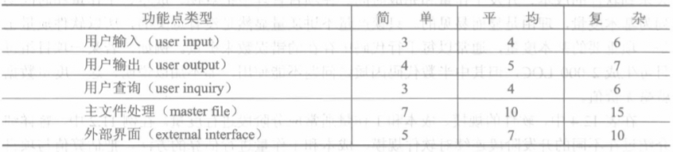

# 软件生命周期与软件过程

## （一）软件生命周期

一个软件从开始立项起，到废弃不用止，统称为软件的生存周期（life cycle），一般被划分为计划、开发与运行3个时期。

软件生存周期的主要活动有：需求分析、软件分析、软件设计、编码、软件测试、运行维护。比较大型的软件在开始开发前，还需要进行一次可行性研究。

软件过程可理解为围绕软件开发所进行的一系列活动。

## （二）传统软件过程

### 1. 瀑布模型

瀑布开发模型是一种基于软件生存周期的线性开发模型，它与软件生存周期的特点是一致的。顺序性，只有等前一阶段的工作完成之后，后一阶段的工作才能开始。依赖性，前一阶段的输出文档是后一阶段的输入文档。

推迟实现的观点，所谓推迟实现，就是把待开发软件的逻辑设计与物理实现清楚地区别开来，即在需求分析和软件设计阶段只考虑系统的逻辑模型，等到编码阶段再来完成程序清单。保证质量的观点，每一阶段必须完成规定的文档；每一阶段都要对完成的文档进行复审。

存在的问题。只有当做出准确的需求分析时，才能够得到预期的结果。但遗憾是，未使用或接触过，想要对一个软件产品提出确切的需求，这几乎是不可能的。因此提出了”快速原型模式“。

### 2. 快速原型模型

先建立一个能够反映用户主要需求的原型，让用户实际看一下未来系统的概貌，以便判断哪些功能是符合需要的，哪些方面还需要改进。然后将原型反复改进，直至建立完全符合用户要求的新系统。

方法，原型系统只包括未来系统的主要功能及系统的重要接口，它不包括系统的细节，例如异常处理、对非有效输入的反应等，对系统的性能需求如硬件运行速度等也可推迟考虑。开发原型时应尽量使用能缩短开发周期的语言和工具。

## （三）软件演化模型

非线性的开发模型，复杂软件开始采用渐增式或迭代式的开发方法。演化模型（evolutionary model）遵循迭代的思想方法，使所开发的软件在迭代中逐步达到完善。常见的演化模型有增量模型与螺旋模型两种，一般适用于大型软件的开发。

### 1. 增量模型

增量模型（incremental model）是瀑布模型的顺序特征与快速原型法的迭代特征相结合的产物。把软件看作一系列相互联系的增量（increments），在开发过程的各次迭代中，每次完成其中的一个增量。其中任一个增量的开发流程均可按瀑布模型或快速原型法完成；一般情况下第一个增量通常是软件的核心部分。

### 2. 螺旋模型

螺旋模型（spiral model）是一种典型的迭代模型。每轮螺旋均包含计划、风险分析、建立原型、用户评审4种活动，周而复始，直到实现最终产品。

### 3. 构件集成模型

抛开在开发中具体使用的方法与工具，仅就开发活动的框架而言，上述各种软件开发模型对面向过程软件与面向对象软件的开发是同时适用的，面向对象开发模型均可借用面向过程开发模型的活动框架，不需要另起炉灶。而本节将要介绍的构件集成模型，则主要适用于面向对象的软件开发。

经过适当设计和实现的类，在某个领域中具有一定的通用性，可以在不同的计算机软件系统中复用，也可称为构件（component）。构件库为基于构件的软件开发模型提供了技术基础。

把相关的数据和方法封装成一个类，构件库如果存在就复用；如果不存在，则实现它并把它加到构件库中。即可得到待开发软件的第一个迭代，然后进入下一轮螺旋周期，继续进行构件集成的迭代。

## （四）形式化方法模型

软件开发方法可区分为形式化方法与非形式化方法两大分支。前者以形式化的程序变换技术为主要研究内容，多流行于学术界；后者旨在用工程方法生产出质量高、易维护的软件产品，多流行于工业界。

### 1. 转换模型

转换模型（transformational model）采用严格的数学方法来表示软件需求规格说明书，然后进行一系列自动或半自动的程序变换，最终将需求规格说明书转换为计算机系统能够接受的目标程序系统，并进行系统测试。

转换模型的常用技术实施转换模型的常用技术，目前主要有基于模型的需求规格说明书及其变换技术、基于代数结构的需求规格说明书及其变换技术、基于时序逻辑的需求规格说明书和验证技术以及基于可视形式化的技术等。但要得到一个形式化需求规格说明书，目前还有比较大的难度。

### 2. 净室模型

净室模型（cleanroom model）是一种形式化的增量开发模型。其基本思想是力求在分析和设计阶段就消除错误，确保正确，然后在无缺陷或洁净的状态下实现软件的制作。

净室开发把软件看成一系列的增量，每个增量是一个用形式化方式表示的盒（Box）。当需求收集结束后，就用盒结构来表示分析和设计模型，这种盒是在某个特定的抽象层次上对系统（或系统的某些方面）的一次封装。将形式化的盒结构设计转换为适当的程序设计语言表示的源代码，对增量进行集成。

## （五）统一过程和敏捷过程

### 1. 统一过程

统一过程描述了软件开发中各个环节应该做什么、怎么做、什么时候做以及为什么要做，描述了一组以某种顺序完成的活动，其结果是一组有关系统的文档，例如模型和其他一些描述，以及对最初问题的解决方案等。

统一过程在一个二维空间中描述软件开发活动，水平轴代表时间，将一个软件生存周期分为4个阶段（phase），即初始、细化、构造、迁移。每个阶段又可以分为一个或多个迭代（iteration），迭代是一个完整的开发循环，都会经历需求、分析、设计、实现等活动，它的结果是产品的一个可执行版本，是正在开发的最终产品的一个子集，从一个迭代到下一个迭代，不断递增成长，直到最后成为最终系统。

### 2. 敏捷过程

敏捷开发（agile development）是一种以人为核心、以迭代方式循序渐进开发的方法，其软件开发的过程称为敏捷过程。

在这一过程中，软件项目的构建被切分成多个子项目，各个子项目的成果都经过测试，具备集成和可运行的特征。简言之，就是把一个大项目分为多个相互联系但也可独立运行的小项目，并分别完成，在此过程中软件一直处于可用状态。

还需指出，敏捷开发是一个持续地应用原则、模式以及实践来改进软件的结构和可读性的过程，而不是一个事件。它致力于保证系统设计在任何时间都尽可能简单、整洁及富有表现力。下面介绍的极限编程就是敏捷过程的一种方法。

### 3. 极限编程

极限编程（extreme programming，XP）建议采用循环迭代的开发方法，它将复杂的开发过程分解为一个个相对比较简单的小周期；通过积极的交流、反馈以及其他一系列的方法，使开发人员和客户都可以非常清楚开发进度、变化、待解决的问题和潜在的困难等，并根据实际情况及时地调整开发过程。

## （六）软件可行性研究

可行性研究（feasibility study）的目的，是弄清待开发的项目是不是可能实现和值得进行，通常由系统分析员完成，并需写出可行性论证报告。可行性论证其实是在高层次上进行的一次大大简化了的需求分析与设计，但它的目的不是去解决用户提出的问题，仅是确定这项开发是否值得进行，分析它存在哪些风险。

研究的内容对研究中可能提出的任何一种解决方案，都要从经济可行性、技术可行性、运行可行性、法律可行性等方面来研究其可行性。研究的步骤可为，对当前系统进行调查和研究、导出新系统的解决方案结束、提出推荐的方案、编写可行性论证报告。

风险识别从宏观上说，风险可区分为项目风险、技术风险和商业风险。将可能发生的风险区分为若干子类，常见的风险子类：产品规模风险、商业影响风险、与客户相关的风险、过程风险、技术风险、开发环境风险、人员结构和经验风险。

风险预测风险预测（riskforecast）又称为风险估计（riskestimation），一般包括两个方面的内容：风险发生的可能性，建立风险可能性尺度（如极罕见、罕见、普通、可能或极可能等）；风险发生后所产生的后果（如灾难性的、严重的、轻微的、可忽略的等）。

风险的驾驭与监控主要要靠管理者的经验来实施。风险驾驭与监控首先应该建立风险缓解、监控和管理计划，记录风险分析的全部工作，并且作为整个项目计划的一部分为项目管理人员所使用。这些驾驭风险的措施会增加项目成本，称之为风险成本，在考虑风险成本之后，再决定是否采用上述策略。

软件计划涉及实施项目的各个环节，计划的合理性和准确性往往关系着项目的成败。针对不同的工作目标，软件计划可分为以下7种主要类型：项目实施计划（通常包括软件目标、功能、进度、资源和费用等多个方面）、质量保证计划、软件测试计划、文档编制计划、用户培训计划、综合支持计划、软件分发计划。

项目实施计划是一种管理文档，供软件开发单位使用。在开发过程中，开发单位的管理人员根据这一计划安排和检查开发工作，并可根据项目的进展情况定期进行必要的调整。实施计划一般不应写得太长、太复杂。只需把项目目标、开发周期以及所需资源和资金等写清楚即可。

# 结构化分析与设计

本章重点介绍基于瀑布模型的结构化分析与设计，将相关的技术（例如模块设计）集中在一章中，并精简了一些过时的技术。

## （一）概述

### 1. 结构化分析与设计的由来

结构化分析与设计最初是由结构化程序设计扩展而来的。结构化分析技术（structured analysis，SA）、结构化设计技术（structured design，SD）合称为结构化分析与设计方法，它是第一代软件工程时期最有代表性的应用系统开发方法。

### 2. SA与SD的流程

系统开发从需求分析开始，首先建立系统的需求模型；接着通过SD方法提供的映射规则，把分析模型转化为初始设计模型；然后再优化为系统的最终设计模型。

结构化分析SA有两项基本任务，即建立系统分析模型（analysis model），可用分层DFD图；编写软件需求规格说明书（software requirements specification，SRS）二者都是分析阶段必须完成的文档。

- SA模型包含描述软件需求的一组模型，通常有功能模型、数据模型、行为模型3种模型，分别表示待开发系统的功能需求、数据需求、行为需求。
- SRS是分析阶段编写的、以文字为主的文档（应该具有准确性、防止二义性、直观易改）。建议SRS文档的主要内容包括引言、信息描述、功能描述、行为描述、质量保证、接口描述以及其他需求等。
- 抽象与分解，是结构化分析的主要指导思想。当需要获得系统的细节时，就应该移向低层次的抽象，抽象的层次愈低，呈现的细节也会愈多。

结构化设计SD分为总体设计和详细设计。

- SD阶段把分析模型中的DFD图转换为最终SC图，在之后详细设计中，还需用适当的工具对各个模块采用的算法和数据结构进行足够细致的描述。
- 结构化设计产生的SC图一般需分为两步完成，即首先通过映射获得初始SC图；然后通过优化获得最终SC图。然后详细设计完成模块说明。
- 分解和细化，历来是重要的软件设计策略。细化是与抽象相反而又互补的一对概念。细化的实质就是分解，程序设计是一个渐进的过程，逐步细化就是自顶向下设计。

### 3. SA模型的组成与描述

1. 通过对现实环境的调查研究，获取当前系统的具体模型。把用户目前使用的系统称为当前系统。
2. 分析需求，建立系统分析模型，包括当前系统模型和目标系统模型。把用计算机实现的系统称为目标系统。
   1. 去掉上述模型中的非本质因素，提炼出当前系统的逻辑模型。
   2. 分析当前系统与目标系统的差别，建立目标系统的逻辑模型。目标系统是一个基于计算机的系统，一般说来，它的功能应该比当前的现行系统更强，不必也不应该完全模拟现行的系统。
3. 整理综合需求，编写系统需求规格说明书。
4. 验证需求，完善和补充对目标系统的描述。
   1. 通过目标系统的人机界面，和用户一起确认目标系统功能，主要是区分哪些功能交给计算机去做，哪些功能由人工完成。
   2. 复审需求规格说明书，补充迄今尚未考虑过的细节，例如确定系统的响应时间、增加出错处理等。

经过以上的修正和补充，即可得到改进后的目标系统逻辑模型。至此销售系统的分析模型即告完成，它主要用图形符号来表达，在SA中称为DFD图。

对于SA模型的组成，数据字典（datadictionary，DD）处于模型的核心，它是系统涉及的各种数据对象的总和。从DD出发可构建3种图：

- 实体联系图（entity-relation diagram，E-R图）用于描述数据对象间的关系。
- 数据流图（data flow diagram，DFD）主要作用是指明系统中的数据是如何流动和变换的。在DFD中出现的每个功能，可在加工规格说明（process specification，PSPEC）中进行描述，它们一起构成软件的功能模型。
- 状态变换图（status transform diagram，STD）用于表明系统的各种状态以及状态间的变换。关于软件控制方面的附加信息，还可用控制规格说明（control specification，CSPEC）来描述。

### 4. SD模型的组成与描述

SD模型是由SA模型映射而来的。SA模型的数据字典可转换为待开发系统的数据设计，数据流图可转换为体系结构设计与接口设计，加工规格说明可转换为模块内部的详细过程设计等等。

由下向上包含了数据设计、体系结构设计、接口设计与过程设计。体系结构设计是用来确定软件结构的，其描述工具为结构图（structure chart，SC），过程设计主要指模块内部的详细设计。

在SC图中，用矩形框来表示模块，带箭头的连线表示模块间的调用，并在调用线的两旁标出传入和传出模块的数据流。SC图允许使用的6种模块

- 传入、传出和变换模块用来组成变换结构中的各个相应部分。
- 源模块是不调用其他模块的传入模块，只用于传入部分的始端。
- 漏模块是不调用其他模块的传出模块，仅用于传出部分的末端。
- 控制模块是只调用其他模块，不受其他模块调用的模块。例如变换型结构的顶层模块，事务型结构的事务中心等，均属于这一类。

## （二）结构化系统分析

结构化分析的基本步骤是：自顶向下对系统进行功能分解，画出分层DFD图；由后向前定义系统的数据和加工，编制DD和PSPEC；最终写出SRS。

### 1. 画分层数据流图

从系统的基本功能模型（把整个系统看成一个加工）开始，逐层地对系统进行分解。每分解一次，系统的加工数量就增加一些，加工的功能也更具体一些。继续重复这种分解，直到所有的加工都足够简单为止。通常把这种不需再分解的加工称为基本加工，把上述逐步分解称为自顶向下、逐步细化（top-down stepwise refinement），最终为待开发的系统画出一组分层的数据流图，以代替一张含有系统全部加工的包罗万象的总数据流图。

分层DFD具有下列优点：

- 便于实现。采用逐步细化的扩展方法，可避免一次引入过多细节，有利于控制问题的复杂度。
- 便于使用。用一组图代替一张总图，使用户中的不同业务人员可各自选择与本身有关的图形，不必阅读全图。

### 2. 确定数据定义与加工策略

最低一层DFD图已包含了系统的全部数据和加工，一般应从数据的终点开始分析，因为终点的数据代表系统的输出，其要求是明确的，由这里开始，沿着DFD图一步步向数据源点回溯，较易看清楚数据流中每一个数据项的变化。继续回溯，得出加工策略和各个有关数据的定义。分析结束后，应为DFD的每个数据逐一写出定义，每个基本加工逐个进行加工规格说明，并汇编成数据字典。

分层DFD图产生了系统的全部数据和加工，通过对这些数据和加工的定义，常常会发现一些新问题，从而进行新的调查和思考，并可能导致对DFD的修改。画DFD，定义加工和数据，再画，再定义，如此循环，直至产生一个为用户和分析员一致同意的SRS文档。

### 3. 需求分析的复审

需求分析的文档完成后，应由用户和系统分析员共同进行复审，并吸收设计人员参加。复审的重点，是DFD、DD和加工规格说明等文档的完整性、易改性和易读性，尽量多地发现文档中存在的矛盾、冗余与遗漏。

## （三）结构化系统设计

### 1. SD概述

面向数据流设计。以SD方法为主要代表，数据流是考虑一切问题的出发点。在与之配套的SA方法中，通常用数据流图来表示软件的逻辑模型；在设计阶段，又按照数据流图的不同类型（变换型或事务型）将它们转换为相应的软件结构。SD方法把注意力集中在模块的合理划分上，其目标是得出软件的体系结构图。

从分析模型导出设计模型。设计是把用户的需求准确地转换为软件产品或系统的唯一方法，无论是传统的设计或面向对象的设计，都要从分析阶段得到的分析模型导出软件的设计模型。其中不少系统设计方法都提供了将分析描述直接转换为设计描述的映射（mapping）规则，使软件设计变得更加容易。

设计模型从底到上，数据设计可以由数据字典、实体联系图、数据流图导出；体系结构设计与接口设计可以由数据流图导出；过程设计可根据加工规格说明、控制规格说明、状态转换图来定义等等。

### 2. SD的步骤：从DFD图到SC图

从SA获得的DFD中，所有系统可归结为变换型结构和事务型结构两种类型。

- 变换型结构由传入路径、变换中心和传出路径3部分组成。
- 事务型结构由至少一条接受路径、一个事务中心与若干条动作路径组成。当外部信息沿着接受路径进入系统后，经过事务中心获得某一个特定值，就能据此启动某一条动作路径的操作。

为了有效地实现从DFD图到SC图的映射，结构化设计规定了下列4个步骤：

1. 复审DFD图，必要时可再次进行修改或细化。
2. 鉴别DFD图所表示的软件系统的结构特征，确定它所代表的软件结构是属于变换型还是事务型。
3. 按照SD方法规定的一组规则，把DFD图映射为初始SC图。变换型DFD图经过变换映射变为初始SC图，事务型DFD图经过事务映射变为初始SC图。
4. 按照优化设计的指导原则改进初始SC图，获得最终SC图。

### 3. 变换映射

变换映射主要步骤包括：

1. 在DFD图上区分传入、传出和变换中心3个部分，划分DFD图的边界。
2. 完成一级分解，建立初始SC图的框架。
3. 完成二级分解，细化分解SC图的各个分支。

实际上数据流在传入的过程中，也可能经历数据的变换。可以在中间模块B下增添个变换模块，如A to B，并在模块名称前加上Read、Get等字样。这一改变的实质是，除了处于物理输入端的源模块以外，让每一传入模块都调用两个下属模块，包括一个传入模块和一个变换模块。仿照与传入分支相似的分解方法，可得到传出分支的两种模块分解图。变换中心分支的情况繁简迥异，但建立初始的SC图时，仍可以采取一对一映射的简单转换方法。

### 4. 事务映射

事务映射主要步骤包括：

1. 在DFD图上确定事务中心、接受部分（包括接受路径）和发送部分（包括全部动作路径），划分边界。
2. 画出SC图框架，把DFD图的3个部分分别映射为事务控制模块、接受模块和动作发送模块。如果第一层的模块比较简单，也可以并入顶层。
3. 分解和细化接受分支和发送分支，完成初始的SC图。因为接受分支一般具有变换特性，可以按变换映射对它进行分解。重点是对动作（即发送）分支进行分解，典型结构分为4层，从顶到下依次为：
   1. 处理层P，相当于初始SC图的发送模块。
   2. 事务层T，每一动作路径可映射为一个事务模块。
   3. 操作层A、细节层D。在事务层以下可以再分解出操作层（actions层）及细节层（details层）。由于同一系统中的事务往往含有部分相同的操作，各操作又可能具有部分相同的细节，这两层的模块常能为它们的上层模块所共享，被多个上级模块调用。

### 5. 优化初始SC图的指导规则

1. **对模块划分的原则**

一般来说，模块的总行数应控制在10\~100行的范围内，最好为30\~60行，能容纳在一张打印纸内。过长的模块往往是分解不充分的表现，会增加阅读理解的难度；但小模块太多也会使块间联系变得复杂，增大系统在模块调用时传递信息所花费的开销。

在改进SC图时，有些模块在图上的位置可能要上升、下降或左右移动，从而变更模块调用关系。模块位置应否变更，应视对计算机处理是否方便而定，不必拘泥于它与DFD图上对应的加工是否位置一致。

2. **高扇入、低扇出的原则**

扇入（fan-in）、扇出（fan-out）是从电子学借用过来的词，在SC图中可用于显示模块的调用关系。

扇入高则上级模块多，能够增加模块的利用率；扇出低则表示下级模块少，可以减少模块调用和控制的复杂度。通常扇出数以3\~4为宜，最好不超过5\~7。如扇出过大，软件结构将呈煎饼形（pancaking），煎饼形一般是不可取的，因为它常常是高扇出的结果，此时可用增加中间层的方法使扇出减小。

设计良好的软件通常具有瓮形（oval-shaped）结构，两头小，中间大，这类软件在下部收拢，表明它在低层模块中使用了较多高扇入的共享模块。

## （四）模块设计

传统软件工程将软件设计分成两步走：总体（或结构）设计，用最终SC图表示；模块设计，用逐步细化的方法来实现。模块设计用于对系统中的每个模块给出足够详细的逻辑描述，故亦称详细设计。

### 1. 目的与任务

详细设计的目的，是为SC图中的每个模块确定采用的算法和块内数据结构，用选定的表达工具给出清晰的描述。表达工具必须具有描述过程细节的能力，而且能在编码阶段直接将它翻译为用程序设计语言书写的源程序。

这一阶段的主要任务，是编写软件的模块设计说明书。设计人员应：

1. 为每个模块确定采用的算法。选择某种适当的工具表达算法的过程，写出模块的详细过程性描述。
2. 确定每一模块使用的数据结构。
3. 确定模块接口的细节，包括对系统外部的接口和用户界面，对系统内部其他模块的接口，以及关于模块输入数据、输出数据及局部数据的全部细节。

### 2. 模块设计的原则与方法

在大多数情况下，应该遵守“清晰第一，效率第二”的设计风格。

任何程序的逻辑均可用顺序、选择和循环（DO-WHILE）3种控制结构或它们的组合来实现，每个控制结构只应有一个入口和一个出口的。补充说明：为了方便使用或者提髙程序效率，大多数软件开发项目还允许在详细设计中补充使用DO-UNTIL和DO-CASE两种控制结构。在许多情况下，当程序执行到满足某种条件时，需要立即从循环中转移出来。

逐步细化的实现方法，设计步骤归结为：

1. 由粗到细地对程序进行逐步的细化。每一步可选择其中的一条至数条，将它（们）分解成更多或更详细的程序步骤。
2. 在细化程序的过程时，同时对数据的描述进行细化。即过程和数据结构的细化要并行地进行，在适当的时候交叉穿插。
3. 每一步细化均使用相同的结构化语言，最后一步一般直接用伪代码来描述，以便编码时直接翻译为源程序。

逐步细化设计受到许多人的赞同，并不是偶然的。

它的主要优点是：

- 每一步只优先处理当前最需要细化的部分，其余部分则推迟到适当的时机再考虑。先后有序，主次分明，可避免全面开花，顾此失彼。
- 易于验证程序正确性，比形式化的程序正确性证明更易被非专业人员接受，因而也更加实用。用逐步细化方法设计的程序，由于相邻步之间变化甚小，不难验证它们的内容是否等效。所以这一方法的实质，是要求在每一步细化中确保实现前一步的要求，不要等程序写完后再来验证。

用结构化保证程序的清晰、易读，用逐步细化实现程序的正确、可靠，由此很自然地得出如下结论：模块的逻辑设计必须用结构程序设计的原理来指导。

常用的表达工具有流程图（flow diagram、N-S图、伪代码（pseudo code）、PDL语言等。

# 需求工程与需求分析

## （一）软件需求工程

### 1. 软件需求的定义

软件需求主要指一个软件系统必须遵循的条件或具备的能力。这里的条件或能力从两个方面来理解：一是用户解决问题或达到目标所需的条件或能力，即系统的外部行为；二是系统为了满足合同、规范或其他规定文档所需具有的条件或能力，即系统的内部特性。

软件需求一般包括3个不同的层次：业务需求、用户需求和功能需求。

1. 业务需求，这是客户或市场对软件的高层次目标要求。通过对企业目前的业务进行评估，包括对业务流程建模、改进等方面，归结出业务需求。具体说，就是从业务的角度分析项目成功的预期效果。在确定业务需求前，还应该在各类业务相关人员范围内达成一致。
2. 用户需求，即从用户使用角度来描述软件产品必须完成的任务。通常在用例模型文档中描述这个层次的需求，同时，从用户需求还可以引申出软件的质量属性，例如软件可持续正常工作的时间等。重心是确定软件系统为用户提供的功能以及软件与环境的交互。
3. 功能需求，它定义软件开发人员必须实现的软件功能，以及为了有效实现这些功能而必须达到的非功能要求、约束条件等，从而使用户能完成他们的任务，满足业务需求。功能需求依赖于用户需求，是用户需求在系统上的具体反映。

下图显示了这3个需求层次之间的关系。

### 2. 软件需求的特性

要描述一个软件，必须从功能、非功能和质量等多个方面来进行。由此可见，软件需求包括以下6个特性：功能性、可用性、可靠性、性能、可支持性、设计约束。

1. **功能性**需求是软件最重要的需求，也是最直观、用户最关心的软件需求，它又可分为普通功能和全局性功能。普通功能泛指软件完成的一个功能或提供的一个服务，例如订单查询等功能；全局性功能是适用于软件所有应用场景的功能，如出错处理等。
2. **可用性**泛指能使最终用户方便使用软件的相关需求，例如，系统使用者所需的培训时间，是否符合一些常见的可用性标准，如Windows界面风格等。提髙可用性、关注用户体验是软件获得成功的重要因素。
3. **可靠性**包括与系统可靠性相关的各种指标，主要有正常运行率、平均无故障时间、平均修复时间、精确度、最高错误或缺陷率。
4. **性能**记录与系统性能相关的各种指标，其中包括对事务的响应时间，包括平均响应时间和最长响应时间；吞吐量，如每秒处理的事务数；容量，如系统可以容纳的客户或事务数；降级模式，当系统以某种形式降级使用时可接受的运行模式；资源利用情况，内存、磁盘、通信等。
5. **可支持性**定义所有与系统的可支持性或可维护性相关的需求，其中包括编码标准、命名约定、类库以及如何对系统进行维护操作和相应的维护实用工具等。
6. **设计约束**代表已经批准并必须遵循的设计决定，其中包括软件开发流程、开发工具、系统构架、编程语言、第三方构件库、运行平台和数据库系统等。

### 3. 需求工程

所谓软件需求工程，是一门应用有效的技术和方法、合适的工具和符号，来确定、管理和描述目标系统及其外部行为特征的学科。它通过合适的工具和记号，系统地描述待开发系统及其行为特征和相关约束，形成需求文档，并能对不断变化的需求演进给予支持。

它把系统需求分解成若干子系统和任务，再把这些子系统或任务分配给软件，并通过一系列重复的分析、设计、比较研究、原型开发等过程，把这些系统需求转换成软件的需求描述和性能参数。

需求工程是软件工程的一个子领域，贯穿于软件整个生存周期的始终。

## （二）需求分析

需求分析与需求工程不同，它通常指软件开发的第一项活动，该项活动的目的主要是为待开发的软件系统进行需求定义与分析，并建立一个需求模型（requirement model）。

### 1. 需求分析的步骤

软件需求分析一般包括如下的4个步骤：需求获取、需求建模、需求描述（即编写SRS）和需求验证。

1. **需求获取**通常从分析当前系统包含的数据开始。可以从不同类用户处收集所期望的软件系统功能、用户与系统间的交互和对话方式等。在获取功能需求之后，再考虑对质量的要求。如果客户的要求和己有的产品存在某些相似之处，还需考虑可否复用一些己有的软件组件。
2. **需求建模**，需求分析的主要任务是建立需求模型。常用的图形化模型包括用例图、数据流图、实体联系图、控制流图和状态转换图等。除需求模型外，有些软件还需要绘制系统关联图、创建用户接口原型、确定需求优先级别等。
3. **需求描述**即编写软件需求规格说明书（SRS），必须用统一格式的文档进行描述。在编写SRS时应该，指明需求的来源（例如来自客户要求或是某项更髙层的系统需求），或业务规范、政府法规、标准或其他外部来源等；为每项需求注上标号，以便进行跟踪，记录需求的变更，并为需求状态及其变更活动建立度量。
4. **需求验证**，由分析员提供的SRS可能出现需求不清、不一致等问题。以需求规格说明书为依据编写测试计划时，也可能发现说明中的二义性。这些问题都必须通过验证来改善，确保需求规格说明书可作为软件设计和最终系统验收的依据。

这4步周而复始，实际上组成了一个迭代的过程，直到所编写的SRS真正符合用户的需求为止。

### 2. 需求获取的常用方法

为了获取正确的需求信息，系统分析员常采用例如建立联合分析小组、用户访谈和问题分析与确认等的常用需求获取方法和技术。

1. 立联合分析小组，分析员往往对用户的业务和术语不熟悉，用户也不熟悉计算机的处理过程，因而需要由领域专家来沟通。因此，建立一个由用户、系统分析员和领域专家组成的联合分析小组，可极大地方便系统开发人员和用户之间的沟通，对需求获取非常有利。小组的人员中，用户方的业务人员应是系统开发的主体。
2. 用户访谈，用户访谈的对象既包括高层用户，也包括直接用户。根据用户使用该软件的功能、频率、优先级或熟练程度等方面的差异，可将用户分成若干类，对每类用户采用现场参观、个别座谈或小组会议等不同形式，了解他们对现行系统的评价和对新系统功能的期望。
3. 问题分析与确认，不要期望用户在一两次交谈中就会对目标软件的需求阐述清楚，也不能限制用户在回答问题时自由发挥。每次访谈后要及时整理，去掉错误的、无关的信息，留下和整理有用的内容，以便在下次与用户见面时进行确认。同时，准备下一次访谈时需要进一步了解的更细节的问题。如此循环。

### 3. 用快速原型法获取需求

作为开发人员和用户的交流手段，快速原型可以获取两个层面上的需求。第一层为联机屏幕，用于确定屏幕及报表的版式和内容，屏幕活动的顺序，以及屏幕排版的方法。第二层用于模拟系统的外部特征，包括引用数据库的交互作用及数据操作，执行系统关键操作等。

快速原型法一般可按照以下的步骤进行。利用各种分析技术和方法，生成一个简化的需求规格说明书；对需求规格说明书进行必要的检查和修改后，确定原型的软件结构、用户界面和数据结构等；在现有的工具和环境的帮助下快速生成可运行的软件原型并进行测试和改进；将原型提交给用户评估并征求用户的修改意见；重复上述过程，直到原型得到用户的认可。

为了快速开发出系统原型，必须充分利用快速开发技术或软件复用技术。但如果演示原型系统需要手工编写数千行甚至数万行代码，那显然代价太大，就没有现实意义了。第四代开发技术（4GT）是快速原型法的常用技术，它利用第四代语言或开发工具，如数据库查询和报表语言、程序和应用软件生成器以及其他高级的非过程语言等，可使软件工程师快速地生成可执行代码。

## （三）需求模型

建立分析模型是需求分析的首要任务。

### 1. 需求模型概述

需求建模的方法，占主导地位的有结构化分析建模和面向对象分析建模两种。

结构化需求模型主要由3部分组成：包括数据流图和加工规格说明的功能模型；主要由数据字典和E-R图等组成的数据模型；由状态转换图、控制流图和控制规格说明等组成的行为模型。详细请看《传统软件工程》。

面向对象需求模型由3个部分组成：用例模型、补充规约和术语表，其中用例模型又包括用例图和用例规约。

用例图（use case diagram）主要用于显示软件系统的功能，它包括用例和参与者两方面的内容。先确定系统外部的参与者，针对每个参与者确定系统的用例，其实质就是看各个参与者需要系统提供什么样的功能服务。用例图下方的用例规约则是对软件系统中每个功能的具体描述。

补充规约用于对全局性功能和可靠性、性能等非功能性需求进行文字性描述；术语表用于描述与系统需求相关的术语的定义。

在实际应用中，描述软件需求时应该灵活运用各种方法，以发挥各自的长处。

### 2. 面向对象的需求建模

基于用例的面向对象需求建模方法，包括画用例图、写用例规约、描述补充规约、编写术语表等4步。

#### (1) 画用例图

用例模型主要包括用例图和用例规约。其中用例图主要描述系统的外在功能，用于确定系统中所包含的参与者和用例，以及两者之间的对应关系。在画用例图的过程中一般包括以下步骤：

1、**找出参与者**

参与者泛指所有存在于系统外部并与系统进行交互的人、硬件或其他系统。通俗地讲，参与者主要是待开发系统的使用者。

2、**根据参与者确定同每个参与者相关的用例**

找到参与者之后，就可以根据参与者来确定系统的用例。主要是考察各参与者需要系统提供什么样的服务，或者说参与者是如何使用系统的。对于用例描述的详细程度（即用例的大小）问题，通常的规则是，用例应该典型地描绘系统功能中某个从开始到结束的过程，并且给参与者提供某些信息。

3、**绘制和检查用例图**

用例和参与者确定后，就可以据此画出用例图，用例图绘制完后，为了避免差错，还需对画好的用例图进行以下的检查：每个用例至少应该涉及一个参与者，参与者需与用例相关联，统一的命名约定和风格。不同的人员对于同一用例模型的理解应完全一致，等等。

还应指出，对于同一个系统，不同的人可能有不同的抽象结果，因而得到不同的用例模型。如果可能，应在多个用例模型方案中选择一种最佳（或较佳）的结果，一个好的用例模型，应该容易被与软件相关的各类人员所理解。

#### (2) 写用例规约

用例规约则用来描述每一个用例的功能，一个用例对应一个用例规约，用来描述用例的细节。

1、**用例规约文档的内容**

用例规约文档一般包含以下内容：

- 简要说明（brief description），简要介绍该用例的作用和目的。
  - 主要用文本方式表述，为了清晰地描述事件流，也可以用UML图（状态图、活动图或时序图）来辅助说明，或者在用例中粘贴用户界面和流程的图形化显示方式。活动图有助于描述复杂的决策流程，状态转换图有助于描述与状态相关的系统行为，时序图适合于描述基于时间顺序的消息传递，等等。
- 事件流（flow of event），包括基本流和备选流，表示出所有可能的活动及流程。
  - 基本流，指该用例最正常的一种场景。在基本流中，系统执行一系列活动来响应参与者提出的服务请求。一般用以下格式来描述基本流：
    - 每个步骤都需要用数字编号，以清楚地标明步骤的先后顺序。
    - 每个步骤的主要内容用一句简短的标题来概括，使阅读者可通过浏览标题快速地了解用例的主要步骤。在用例建模的早期，只需要描述到事件流步骤标题这一层，以免过早地陷入用例描述的细节。
    - 当整个用例模型基本稳定之后，再针对每个步骤详细描述参与者和系统之间的交互。通常采用双向（roundtrip）描述法来保证描述的完整性，即每个步骤都从正反两方面来描述：参与者向系统提交了什么信息，系统对此信息有什么样的响应。
    - 在描述参与者和系统之间的信息交换时，建议指出传递的具体信息。还可利用术语表，使用例的复杂性保持在可控范围内，不至于陷入过多的细节。
  - 备选流用于描述用例执行过程中的异常或偶尔发生的情况，它和基本流组合起来，能够覆盖该用例所有可能发生的场景。备选流一般应包括以下几个要素：
    - 起点，该备选流从事件流的哪一步开始。
    - 条件，在什么条件下会触发该备选流。
    - 动作，系统在该备选流下会采取哪些动作。
    - 恢复，该备选流结束之后，该用例应如何继续执行。
    - 备选流的描述格式可与基本流一致，即需要编号并以标题概述其内容，编号前可加一字母前缀A（alternative），以示与基本流相区别。
- 特殊需求（special requirement），描述与该用例相关的非功能性需求和设计约束。
  - 通常是非功能性需求，它为一个用例所专有，但不适合在用例的事件流文本中进行说明。特殊需求包括且不限于法律或法规方面的需求、应用程序标准和所构建系统的质量属性（包括可用性、可靠性、性能、支持性需求等）。此外，其他一些设计约束，如操作系统及环境和兼容性需求、开发工具等，也可以在此部分记录。
  - 需要注意的是，这里记录的是专属于该用例的特殊需求，对于一些全局的非功能性需求和设计约束，它们并不是该用例所专有的，应把它们记录在补充规约中。
- 前置条件（pre-condition）和后置条件（post-condition）。前置条件是执行用例之前必须存在的系统状态，后置条件是用例执行完毕后系统可能处于的一组状态。

2、**用例模型的检查**

为了发现用例模型的错漏，可以从以下几个方面来进行检查：

- 功能需求的完备性，现有的用例模型是否完整地描述了系统功能，这也是判断用例建模工作是否结束的标志。
- 模型是否易于理解，用例模型最大的优点就在于它应该易于被与软件相关的各类人员所理解，因而用例建模最主要的指导原则就是它的可理解性。用例的粒度、个数以及模型元素之间的关系复杂程度都应该由该指导原则决定。
- 是否存在不一致性，系统的用例模型是由多个系统分析员协同完成的，模型本身也是由多个文档所组成的，所以要特别注意不同文档之间是否存在前后矛盾或冲突的地方，避免在模型内部产生不一致性。
- 避免二义性语义，不同的人对于同一需求的理解应该是一致的。在用例规约的描述中，应该避免定义含义模糊的需求，即无二义性。

#### (3) 描述补充规约

补充规约用于记录在用例模型中不易表述的系统需求，如整个系统的特殊需求，包括非功能性需求和设计约束。如目标、范围、参考、功能、可行性、可靠性、性能、可支持性、安全性、设计约束等。

#### (4) 编写术语表

术语表主要用于定义软件开发项目特定的术语，它有助于开发人员对项目中所用的术语有统一的理解并能正确地使用，它也是后续阶段中进行对象抽象的基础。

#### (5) 调整用例模型

在一般的用例图中，只表述参与者和用例之间的关系，即它们之间的关联。除此之外，还可以描述参与者与参与者之间的泛化（generalization）关系，用例和用例之间的包含(include)、扩展(extend)和泛化关系。

利用这些关系来调整己有的用例模型，把一些公共的信息抽取出来进行重用，可使用例模型更易于维护。但是在应用中要小心选用这些关系，一般来说这些关系都会增加用例和关系的个数，从而增加用例模型的复杂度，而且一般都是在用例模型完成之后才对用例模型进行调整，所以在用例建模的初期不必急于抽象用例之间的关系。

用例模型建成之后，可以对用例模型进行检查，看是否可以进一步简化用例模型、提高重用程度、增加模型的可维护性。主要可以从以下方面进行检查：

- 用例之间是否相互独立？如果两个用例总是以同样的顺序被激活，可能需要将它们合并为一个用例。
- 多个用例之间是否有非常相似的行为或事件流？如果有，可以考虑将它们合并为一个用例。
- 用例事件流的一部分是否已被构建为另一个用例？如果是，可以让该用例包含另一用例。
- 是否应该将一个用例的事件流插入另一个用例的事件流中？如果是，利用与另一个用例的扩展关系来建立此模型。

## （四）软件需求描述

软件需求规格说明书简称SRS，是软件开发人员在分析阶段需要完成的用于描述需求的文档。主要包括引言、信息描述、功能描述、行为描述、质量保证、接口描述和其他描述等内容。其中信息描述、功能描述和行为描述是SRS的主体描述部分，了可用文字描述外，也可以附上各种图形模型，如用例图、E-R图、DFD和CFD等。

引言主要叙述在问题定义阶段确定的关于软件的目标与范围，简要介绍系统背景、概貌、软件项目约束和参考资料等。

信息描述给出对软件所含信息的详细描述，包括信息的内容、关系、数据流向、控制流向和结构等。根据系统所选用的不同分析方法（结构化分析或面向对象分析），可以用前面介绍的工具描述软件涉及的数据的定义和系统的信息逻辑模型。

功能描述是对软件功能需求的说明，包括系统功能划分、每个功能的处理说明、限制和控制描述等。对软件性能的需求，包括软件的处理速度、响应时间和安全限制等内容，通常也在此叙述。

行为描述包括对系统状态变化以及事件和动作的叙述，据此可以检查外部事件和软件内部的控制特征。

质量保证阐明在软件交付使用前需要进行的功能测试和性能测试，并且规定源程序和文档应该遵守的各种标准。此部分说明文字用于检查所交付的软件是否达到了SRS的规定。这可能是SRS中最重要的内容，但在实际工作中却容易被忽略，值得引起注意。

接口描述包括系统的用户界面、硬件接口、软件接口和通信接口等的说明。

其他描述阐述系统设计和实现上的限制，系统的假设和依赖等其他需要说明的内容。

## （五）需求管理

在定义需求的时候总伴有许多可变因素，因此需求应该具有弹性的结构，使之能适应可能的变更，一旦其中有某些需求发生变化，就能确定它可能带来的影响，进而制定出相应的策略。

### 1. 需求管理的内容

需求管理包含5个特定实践，简介如下：

1. 获得对需求的理解。在初步整理需求的基础上，项目小组和用户代表通过初步的分析讨论，对当前项目的需求达成共识，并在需求列表中作相应记录。
2. 获取需求承诺。通过项目参与者的书面承诺，建立各方或各项工作的基准。
3. 管理需求变更。维护变更历史，为调整与控制提供数据。
4. 在需求变更后维护对需求的双向可追溯性。从软件可维护性的角度提出管理要求。
5. 标识项目工作（包括计划和产品）与需求的不一致性。若发现不一致性，即启动纠正措施。

上述5个特定实践，可归结为以下3项活动：

- 需求确认，特定实践中的1、2项。由开发方和客户共同对主要需求文档“软件需求规格说明书”进行评审，双方达成共识后作出书面承诺，使需求文档具有商业合同效力，承诺书将附在“软件需求规格说明书”后，一同存档保存。即两个重要的工作为需求评审和需求承诺。
- 需求跟踪，特定实践中的4、5项，即维护对需求的双向可追溯性和标识项目工作与需求的不一致性。建立与维护“需求-设计-编程-测试”之间的一致性，确保所有工作成果都符合用户需求。可采用需求大纲中的需求跟踪矩阵，对每个需求追踪到实现该需求的设计、编码以及测试案例，从而验证该软件产品是否实现了所有需求，是否对所有需求进行过测试。
- 需求变更，特定实践中的3项，下分一节专门陈述。

### 2. 需求变更控制

需求变更要进行控制，严格防止因失控而导致项目混乱，出现重大的风险。需求变更总是不可避免的，有些是为了修正缺陷，有些属于增强功能。

对项目开发小组而言，变更需求通常意味着要调整资源、重新分配任务，并修改前期的工作成果，有时要付出较大的代价，推迟工期。需求变更必须遵守利大于弊的原则，并做到：为避免出现失控等风险，对纳入基线以前的需求文档，可通过正常的check-in和check-out进行更改。而纳入基线以后的需求文档，更需按照预定的变更控制规程，确保快速、顺利和有序地进行变更。

需求变更的流程通常按变更申请、审批、更改、重新确认的流程进行，下文将具体介绍这一流程。

1、**变更申请**

此时的状态为“请求变更”。首先由申请人提交需求变更申请书，其内容应该包括：

- 变更源类型。指引起变更的原因类型，可分为需求变更、设计变更、代码优化、用户文档优化和计划变更等。
- 变更优先级。依据变更的重要性、紧迫性和对关键业务的影响程度，以及对系统安全性和稳定性的影响程度，可分为critical、high、middle、low等级别。
- 变更标志。分为新增、修改和删除。
- 变更影响分析。包括变更影响的工作产品和负责人，对工作量和进度的影响，发生风险的可能性与影响程度，以及需要回测的范围。
- 可能影响的工作产品。包括项目计划、需求文档、概要设计文档、详细设计文档、源代码和程序、测试计划和测试案例以及用户文档。

上述申请书应由项目经理进行评估，评估该需求变更在技术上是否可行。对工期、成本、质量的影响，首先评估单个模块工期的影响，即实现该需求变更需要的成本和工作量，然后评估实现该需求变更对整体工期工作量和成本的影响。

2、**变更审批**

按照影响的大小由不同的负责人审批。

- 对影响小的变更，由项目经理直接审批。
- 对影响大的变更，提交软件变更控制委员会（Software Change Control Board，SCCB）审批。
- 项目SCCB仍无法决定的变更，再提交高层SCCB决定。

所谓影响大的变更一般包括下列情况：

- 变更影响的模块数超过10个或超过50%，或者可能影响软件系统的框架。
- 变更会影响对客户的承诺。
- 变更会带来“高”或者“高中”程度的风险。

如果审批请求未通过，则该变更请求结束。

3、**变更修改**

如果需求变更己审批通过，应指定相关的责任人对产品进行修改，并指定人员对更改后的产品进行审核。还应在产品列表中记录具体修改的产品名称、修改描述和是否完成修改的状态。包括：

- 应及时更新相应的需求大纲和需求分析说明。
- 如果影响项目计划的内容，修改项目计划，以反映需求的变更。
- 如果影响到概要设计文档、详细设计文档、源代码和程序、测试计划和测试案例或者用户文档，它们也需要被及时更新。
- 如果影响到测试，还需要进行回归测试。
- 如果对文档进行修改，需在修改历史表格中注明修改人、修改时间以及修改原因。
- 如果对原文件修改过大，必要时项目经理可以重新组织工作产品的评审。
- 如果对代码进行修改，需要导出编译申请表，通知编译和测试。

4、**变更关闭**

如果修改后不需要进行测试，则当所有产品全部修改完成时，由最后完成修改的人关闭该变更。如果变更修改后提交测试，则由测试人员负责该变更是否最后关闭：

- 如果测试未通过，则返回修改者继续修改。
- 如果所有工作产品全部修改完成，并且测试通过，关闭该变更。

5、**需求变更的数据项**

为了确切记录需求变化，还需登记如下所示的变更数据列表。

|   数据项名称   |                             定义                             |
| :------------: | :----------------------------------------------------------: |
|  项目名称和ID  |                    变更所在项目的名称和ID                    |
|    变更阶段    | 需求阶段、设计阶段、编码、测试和验收阶段；不同阶段的需求变更请求对整个项目开发的影响也不同 |
|   变更优先级   |                     每个变更的相对重要性                     |
|    变更标志    |                          变更的状态                          |
|    变更原因    |                  描述简单描述提出变更的原因                  |
|  变更内容描述  |                   对变更的内容进行简单描述                   |
| 相关的变更请求 |       是否有相关的变更请求，如果有，指定相关的变更请求       |
| 变更的状态信息 | 包括变更请求人、变更批准人、当前负责人、变更关闭人、请求日期、审批日期、期望解决日期以及关闭日期 |
|  变更影响分析  |            基于受影响工作产品对变更的影响进行分析            |
|  变更处理信息  |      所影响的工作产品列表以及各工作产品对变更的处理状态      |

### 3. 需求管理工具

在软件规模很小的时候，采用文档文件的方式来存储软件需求规格说明书和其他文档；软件规模庞大，这时传统的基于文档文件存储需求的方式显露出它的局限性。需求管理的任务越来越繁重，迫切需要研制需求管理工具来自动化地管理需求，提高工作效率。IBMRational Requisite Pro、Telelogic DOORSreg和Borland CaliberRM等都是目前比较流行的需求管理工具，可以帮助开发团队有效地管理软件需求。

# 面向对象分析

## （一）软件分析概述

从软件使用者的角度出发，即软件需求；从软件开发者的角度出发，即软件分析。

### 1. 面向对象软件分析

在建立的分析模型中，普遍采用图形和自然语言相结合的表达法，并使用多种图形描述工具，面向对象分析（object-oriented analysis，OOA）的重要表达工具之一就是UML。

首先要理解用户的需求，明确所开发的软件系统的职责，形成文件并规范地加以表述。然后进行分析，提取类和对象，并结合分析进行建模。其基本步骤是：标识类，定义属性和方法；刻画类的层次；表示对象以及对象与对象之间的关系；为对象的行为建模。这些步骤可反复进行，直至完成建模。

处于OOA模型核心的是以用例模型为主体的需求模型。进一步抽取和定义OOA模型的3种子模型：

- 类/对象模型，描述系统所涉及的全部类和对象，每一个类/对象都可通过属性、操作和协作者来进一步描述。
- 对象-关系模型，描述对象之间的静态关系，同时定义了系统中对象间所有重要的消息路径，它也可以具体到对象的属性、操作和协作者。
- 对象-行为模型，描述了系统的动态行为，即在特定的状态下对象间如何协作来响应外界的事件。

分析模型系由一组子模型组成，每一子模型都使用图形或符号来表示。从本质上说，分析模型是一种概念模型（conceptual model），这类模型都具有下述的一般内容和特点：

1. 全面覆盖软件的功能需求。分析模型是在需求模型的基础上建立起来的，同时也是软件设计的基础，任何一个功能需求的遗漏，都会影响软件设计的质量。
2. 分析模型与软件的实现无关。这也是称它为概念模型的由来，它通常忽略了与实现相关的细节，仅在理想化的状态下考虑问题的解决方案。
3. 分析模型的表述方法与所采用的分析技术有关。不同的分析方法，通常使用不同的分析工具来表示所建立的分析模型。

### 2. 面向对象分析模型

软件工程领域有众多的OOA方法，现简介如下。

五层次模型，最典型的是Coad和Yourdon的OAA方法。它采用一个五层次的OOA模型，通过下列的步骤来建立各层模型。

1. 建立类/对象层。定义类和属性，简单地讲，在这个层次将分析与待开发软件对应的各个现实世界的实体，并从中抽象出类和对象。
2. 建立属性层。定义属性，为类/对象层中抽取出来的各个类和对象设计静态属性和它们之间的关系。
3. 建立服务层。定义对象和类的动态属性以及对象之间的消息通信。
4. 建立结构层。定义对象和类之间的层次结构关系，常见的关系有包含关系、继承关系和关联关系。
5. 建立主题层。定义若干个主题，把有关的对象分别划归不同的主题，每个主题构成一个子系统。

大多数OOA方法具有下列的共同特征，类和类层次的表示；建立对象-关系模型；建立对象-行为模型。在基于面向对象技术的总前提下，这些方法通常具有相似的建模步骤，其内容大致如下：需求理解；定义类和对象；标识对象的属性和操作；标识类的结构和层次；建立对象-关系模型；建立对象-行为模型；评审OOA模型。

面向对象分析（OOA）是一种从问题空间中通过提取类和对象来进行分析的方法，用于建立一个与具体实现无关的面向对象分析模型；面向对象设计（OOD）则从问题空间转移到解空间，在分析模型的基础上考虑实现细节，形成面向对象的设计模型；而面向对象编程（OOP）则用于将设计模型转换成实现模型，可获得源代码和相应的可执行代码。位于最后环节的面向对象测试（OOT）则通过运行可执行代码来检测程序存在的问题。综上可见，面向对象开发的全过程其实是OOA、OOD、OOP、OOT的迭代过程。

## （二）面向对象分析建模

用例模型是面向对象分析最常采用的一种模型。从用例开始的分析（用例分析），在这一阶段定义的类称为分析类，其目的是为后续的设计活动提供必要的铺垫，无须确定详细的属性和操作。步骤一般是：

首先回顾需求阶段产生的用例规约，补充必要的详细信息（从内部角度观察系统响应的说明）；然后研究用例的事件流，将用例的职责分配给若干分析类；基于这些职责分配以及分析类之间的协作，开始为分析类间的关系建模。分析了用例以后，需要察看所确定的类，确保它们被详尽地描述，并确保分析模型各个部分之间的一致。

### 1. 识别与确定分析类

从以文字说明的软件需求过渡到以图形来描述的分析模型，这是一个过程。查找一组备选的分析类，通常是这个过程的第一步。

通常分析类被划分为3种类型：边界类、控制类和实体类，可分别用标记<\<boundary\>>、<\<control\>>、<\<entiy\>>来表示。它们依次代表系统与外部环境之间交互的边界，系统在运行中的控制逻辑，系统要存储和维护的信息。

1、**边界类**

边界类提供了对参与者或外部系统交互协议的接口，边界类将系统和外界的变化隔离开，使外界环境的变化不会直接影响系统内部元素。一个系统可能有多种边界类：用户界面类，用于和系统用户进行通信。系统接口类，用于和其他软件系统进行通信。设备接口类，为硬件设备（如传感器）提供接口。

边界类对系统中依赖于环境的那些部分进行建模。实体类和控制类对与系统外部环境无关的那部分进行建模。因此，如果更改GUI或通信协议，将只更改边界类，对实体类和控制类毫无影响。

2、**控制类**

控制类用于封装一个或几个用例所特有的流程控制行为，通过它可建立系统的动态行为模型。它有效地分离了边界类对象和实体类对象，使系统更能承受边界的变更，使实体类对象在用例和系统中具有更高的可复用性。

边界类和实体类之间并非始终需要一个控制类，只有当用例的事件流比较复杂并具有可以独立于系统的接口（边界类）或者存储信息（实体类）的动态行为时，才需要控制类。如事务管理器、资源协调器、错误处理器等都可以作为控制类。

控制类所提供的行为具有以下特点：独立于环境，不随环境的变更而变更；确定用例中的控制逻辑（事件顺序）和事务；在实体类的内部结构或行为发生变更时，也不会变更；使用或规定若干实体类的内容，协调这些实体类的行为；可能按不同的流程或方式执行（事件流具有多种状态）。

3、**实体类**

实体类用于对必须存储的信息和相关的行为建模，其主要职责是存储和管理系统中的信息。它通常具有持久性，即它们的属性和关系需要长期保存，有时甚至在系统整个生存周期都存在。实体类对象（实体类的实例）用于保存和更新一些对象的有关信息。

一个实体类对象通常不是某个用例所特有的，有时一个实体类对象甚至不专用于一个系统，其属性和关系的值通常来自于参与者。实体类对象是独立于外部环境的。

4、**查找分析类**

查找分析类通常以每一个用例作为一个研究对象。

为每对参与者/用例确定一个边界类。

为每个用例设置一个控制类，随着分析的逐步深入，一个控制类有可能分解为多个控制类或与其他控制类合并，这时每个控制类将负责控制对相关用例所描述的功能实现的处理流程。

确定相关的各个实体（包括属性与方法）。在当前的用例模型中，实体信息可以定义成类，或定义成类的属性。

确定了以上3种分析类，把它们加入分析模型后，就可以为系统建立对象-行为模型、对象-关系模型了。

### 2. 建立对象-行为模型

根据在需求分析中确定的用例规约中的事件流，可以绘制用例的动态图（动态模型，即对象-行为模型），包括时序图和协作图。

**时序图**按时间顺序描述系统元素之间的交互。每个用例都是由参与者触发的，按照放置顺序，时序图中有触发这个用例的参与者、边界类对象、控制类对象、实体类对象。**协作图**按照时间和空间的顺序描述系统元素之间的交互及相互关系，它与时序图的语义相同。

**为分析类分配职责**。动态图将用例要求的行为分派到分析类，即确定消息和职责的对应关系。分析类对象这时可区分为消息的发出者和接收者；接收者通过承担相应的职责，作为对发出者的回应。

一个分析类的实例在事件序列中接收的消息集合，就是该分析类应承担的职责的依据。对每一条消息，检查接收它的类，若职责尚不存在，则创建一个新的职责以便提供需要的行为。职责通常沿用消息的名称，它还不是类的操作，故习惯上用"//"作为前缀。

在后续开发中，分析类将逐步演变为具体的设计元素，其职责也将逐步演变为设计元素的行为，即设计类的操作和子系统接口的行为。

有些类涉及的用例行为比较复杂，且分散到不同的事件序列中，这时就需要为这个类创建一个**状态图**，专门针对一个类的状态变化，研究该类的动态行为。

### 3. 建立对象-关系模型

用例模型的对象-关系模型（静态模型）主要涉及分析类的属性、分析类的关联、分析类图、分析类的合并等内容。

**分析类的属性**即分析类本身具有的信息，类可以用属性来存储信息。属性名称应当是一个名词，类型是简单的数据类型。用例分析阶段，分析类是粗略的，因而其属性也是相对粗略的，目的仅在于在逻辑上支撑分析类所承担的职责。

**分析类的关联**即分析类具有指向其他分析类的关联，通过这种关联能够找到其他分析类。协作图中对象之间的链接是关联的动态表现，表明两个类的对象需要互相交流；可以据此确定类之间的关联关系。

**分析类图**用于表现分析类及其关系，其中描述某个用例的参与的分析类的图称为参与类图（view of participating classes，VOPC）。从逻辑上说，每个用例可对应一张完整的参与类图；在具体实践中，一个用例可以绘制多张参与类图，用每张图展示不同的侧重点。

**分析类的合并**。每个分析类都代表一个明确定义的概念，具有不重叠的职责。一个类可以参与任何数量的用例，因此就整个系统而言，需要合并分析类，把具有相似行为的类合并为一个。每当更新了一个类，就要更新或补充用例规约，必要时还要更新原始的需求。

# 面向对象设计

面向对象设计（OOD）方法在基于抽象、信息隐蔽、功能独立、模块化等概念基础上进行，将数据和操作封装在一起，共同完成信息和处理的双重模块化。

## （一）软件设计概述

同软件分析一样，软件设计也有两种主流设计方法：以结构化程序设计为基础的结构化软件设计，和由面向对象方法导出的面向对象软件设计。

### 1. 软件设计的概念

设计的目标，是细化解决方案的可视化设计模型，确保设计模型最终能平滑地过渡到程序代码；关键是构造（在实施细节的基础上）解决问题的全部方案，包括软件如何实现、如何适应特定的实施环境等。

通过多年实践，软件设计已形成了一系列基本概念，成为各种设计方法的基础，这里将作简单介绍。

1、**模块与构件**

模块（module）是一个拥有明确定义的输入、输出、和特性的程序实体。如果模块的所有输入都是实现功能必不可少的（没有不必要的输入），每个输出都是模块执行某一功能的结果（没有直接无意义的输出），即成为定义明确的模块。

如汇编语言中的子程序，FORTRAN语言中的辅程序，Pascal语言中的过程，Java语言中的类都是模块的实例。在软件工程时代，模块化仍是大型软件设计的基本策略（strategy）。

2、**抽象与细化**

软件工程是一种层次化的技术，抽象也是分层次的，抽象层次（级）越低，细节越多。软件设计就是在不同抽象级别考虑和处理问题的过程；由高抽象到低抽象转换，要进行过程抽象和数据抽象，即细化（refinement），细化的实质就是分解。

过程抽象是把完成一个特定功能的动作序列抽象为一个过程名和参数表，然后通过指定过程名和实际参数调用此过程；数据抽象把一个数据对象的定义抽象为一个数据类型名，用此类型名可定义多个具有相同性质的数据对象。在抽象数据类型的定义中还可以加入一组操作的定义，用以确定在此类数据对象上可以进行的操作。

3、**信息隐藏**

信息隐藏（information hiding），指的是模块内部的数据与过程，应对无需了解这些数据与过程的模块隐藏起来；只有为了完成软件的总体功能而必须在模块间交换的信息，才允许在模块间进行传递。目的是提高模块独立性，当修改或维护模块时，减少将一个模块的错误扩散到其他模块中去的机会。

这一思想，在软件开发中先后出现了数据封装、抽象数据类型等设计方法，在OOD中发展为具有继承特性的类和对象。

4、**软件复用**

复用己成为软件开发，尤其是软件设计中的一项重要活动，上升为软件设计中的又一基本策略。

### 2. 软件设计的任务

软件设计的任务，是把分析阶段产生的分析模型转换为用适当手段表示的软件设计模型，一般包括体系结构设计、接口设计、数据设计、过程设计等内容。

体系结构设计定义软件主要组成部件之间的关系；接口设计描述软件内部、软件和接口系统之间以及软件与人之间是如何通信的（包括数据流和控制流）；数据设计将分析阶段创建的信息模型转变成实现软件所需的数据结构；过程设计将软件体系结构的组成部件转变成对软件组件的过程性描述。

传统设计任务通常分两个阶段：第一个阶段是概要设计，包括结构设计和接口设计，并编写概要设计文档；第二阶段是详细设计，需确定各个软件部件的数据结构和操作，产生描述各软件部件的详细设计文档。每个阶段完成的文档，都必须经过复审。

### 3. 模块化设计

模块化设计（modular design）目的是按照规定的原则把大型软件划分为众多较小的、相对独立但相互关联的模块。

将一个复杂问题适当分解，其总复杂度和总工作量将减小而降低模块成本；但过度分解则会因模块之间联系增多而增加接口成本。每个软件都存在一个最小成本区。

模块独立性（module independence）概括了划分模块是否合理的标准，即高内聚低耦合。模块本身的内聚（cohesion）指模块内部各个成分之间的联系，也称为块内联系或模块强度；模块之间的耦合（coupling）指一个模块与其他模块间的联系，所以又称为块间联系。

#### (1) 内聚

内聚是从功能的角度对模块内部聚合能力的量度，按由弱到强的顺序，示意如下。

1. 偶然性模块，块内各组成成分在功能上是互不相关的，内部成分的组合纯属偶然，称为偶然性内聚。如几个模块都执行“读A写B”等相同操作，为避免重复书写，把这些操作汇成一个模块，供有关的模块调用。
2. 逻辑性模块，通常由若干个逻辑功能相似的成分组成。如无论计算平均分和还是最高分，都要有读入、计算、输出等步骤。实际只有计算这一步需要不同的方法，而输入输出两步都是相同的；把读入输出，和计算平均分、最高分这两种逻辑上相似的功能放在一个模块中，可省去程序中的重复部分。其主要缺点是，执行中要从模块外引入用作判断的开关量，这会增大块间耦合。
3. 时间性模块，这类模块所包含的成分，是由相同的执行时间而联结在一起的。如一个初始化模块可能包含“为变量赋初值”、“打开某个文件”等为正式处理作准备的功能。由于要求它们在同一时间内执行，故称为时间性内聚。
4. 过程性模块，当一个模块中包含的一组任务必须按照某一特定的次序执行时，就称为过程性模块。把全部任务均纳入一个模块，便得到一个过程性模块。
5. 通信性模块，其内部的各个成分都使用同一种输入数据，或者产生同一个输出数据。它们靠公用数据而联系在一起，故称为通信性内聚。
6. 顺序性模块，这类模块中的各组成部分是顺序执行的。通常，上个处理框的输出就是下个处理框的输入。
7. 功能性模块，其所有的成分结合在一起，用于完成一个单一的功能。将每一处理框编制成一个模块，则产生的模块都是功能性模块。这是块内联系最强的一类模块，内聚高、与其他模块的联系少。

一个模块，一个功能。这已成为模块化设计的一条准则。当然，其他的高内聚、中内聚模块也是允许使用；低内聚模块因块内各成分的联系松散，可维护性和可重用性都比较差，在设计中应尽可能避免使用。

#### (2) 耦合

耦合是对软件的块间联系的度量，按由弱到强的顺序，示意如下。

弱耦合包括非直接耦合、数据耦合、特征耦合，其示例图如下。

1. 模块1、模块2为同级模块，相互之间没有信息传递，属于非直接耦合。

2. 模块3、模块4都是模块1的下属模块。模块1调用它们时，可通过参数表与它们交换数据。如果交换的都是简单变量，便构成数据耦合（如模块1、3之间）。
3. 如果交换的是数据结构，便构成特征耦合（如模块1、4之间）。在这种情况下，不仅在模块间传递的数据量要增加，而且当作为参数的数据结构或其格式发生变化时，相关模块都要作相应的更改。特征耦合会使本来无关的模块变为有关，耦合强度显然比数据耦合要高。
4. 控制耦合是中等强度的耦合。此时在模块间传递的信息不是一般的数据，而是用作控制信号的开关值或标志量（flag）。当调用这一模块（如上述逻辑性模块）时，调用者模块必须先把一个控制信号传递给它，以便选择所需的操作。因此，控制模块必须知道被控模块的内部逻辑，从而增强了模块间的相互依赖。
5. 较强耦合包括外部耦合和公共耦合两类。若允许一组模块访问同一个全局变量，可称它们为外部耦合。
6. 若允许一组模块访问同一个全局性的数据结构，则称之为公共耦合。
7. 如果一个模块可以直接调用另一模块中的数据，或者允许一个模块直接转移到另一模块中去，就称它们间的耦合为内容耦合。

耦合越弱，则表明模块的独立性越强。但实际工作中，中等甚至较强的耦合不可能也不必完全禁用。如FORTRAN语言中的COMMON区可以令访问它的模块间发生公共耦合，当然不应滥用；但当在一组模块之间存在较多的公用数据时，使用COMMON区往往又使编程比较方便。所以问题不在于禁止使用它们，而是要了解各种耦合的特点与不足，以便在需要使用它们时能预见到可能产生的问题。

至于最强类的内容耦合，由于会给维护工作带来很大的困难，故应该尽量不用。

## （二）面向对象设计建模

面向对象分析确定了问题领域的类/对象以及它们的关系和行为，而面向对象设计它考虑“如何实现”的问题，完成不同层次的模块设计。因此，它要说明为实现需求必须引入的类、对象以及它们之间的关联，描述对象间传递消息、对象行为如何实现，还要从提高设计质量和效率等方面考虑如何改进类结构和可复用类库中的类。

### 1. 面向对象设计模型

面向对象设计模型可以看成一个金字塔的形状，自底到上由系统架构层、类和对象层、消息层、责任层等4个层次组成。

- 系统架构层，描述了整个系统的总体结构，使所设计的软件能够满足客户定义的需求，并实现支持客户需求的技术基础设施；通过考虑整体用户需求（由用例模型表示）、与外部可观察到的事件和状态（对象-行为模型）导出。
- 类和对象层，包含类层次关系，使得系统能够以通用的方式创建并不断逼近特殊需求，该层同时包含了每个对象的设计表示；可由类/对象模型以及属性、操作和协作者的描述映射得来。
- 消息层，描述对象间的消息模型，它建立了系统的外部和内部接口，包含使得每个对象能够和其协作者通信的细节；可由对象-关系模型导出。
- 责任层，包含针对每个对象的所有属性和操作的数据结构和算法的设计；可利用类/对象模型以及属性、操作和协作者导出。

需要指出，上述4个层次，都是针对特定的应用或产品而言，实际上，任何应用或产品总是从属于某个领域的。所以在应用设计的同时还需考虑该应用所在领域的基础设施（infrastructure），即可想象设计模型下方还存在一个称为领域对象（domain object）的层次，作为整个金字塔的基础，该层次可以在人机交互界面、任务管理、数据管理等方面对本领域的应用或产品提供支持。

### 2. 面向对象设计的任务

如前述，设计阶段主要任务是体系结构设计、接口设计、数据设计、过程设计。OOD可分为两个层次：系统架构设计和系统元素设计，分别由系统架构师（system architect）和软件设计师（software designer）完成。这里简要介绍这两个层次的设计任务。

**系统架构设计**包含关于软件系统组织的许多重要决定。软件系统架构是指系统主要组成元素的组织或结构，以及其他全局性决策，组成元素之间通过接口进行交互。例如，从不同抽象层次上选择组成系统的结构元素并确定它们的接口，指导开发组织的架构风格等。具体地包括以下6方面的活动：

1. 系统高层结构设计。一个软件的设计模型通常是分层组织的，系统架构师需要根据软件需求模型和分析模型，套用软件架构模式来设计软件系统的高层组织结构。
2. 确定设计元素。主要包括识别和确定设计类和子系统，将设计类组织到相应的包中，为子系统设计接口，确定复用机会等。
3. 确定任务管理策略。对于规模较大的复杂软件系统，考虑解决由于多用户、并发执行任务等可能引起的冲突或运行性能等问题的策略。
4. 实现分布式机制。当一个软件的不同组成构件位于不同服务器上时，选择支持远程通信的构件，给出如何实现这些构件之间通信的统一方案。
5. 设计数据存储方案。根据实际数据库管理系统的类型，选择数据库访问的支持构件，设计类/对象数据的存储、读取、删除、修改等操作的方法。
6. 人机界面设计。考虑人机界面的统一要求和规范，确定实现的技术基础和工具等。

系统架构设计是针对整个系统的，其设计结果将影响整个系统，软件设计人员在设计系统中的每个设计元素以及它们之间的交互时都必须遵循系统架构设计文档。

**系统元素设计**是对每一个设计元素进行详细的设计。系统元素包括组成系统的类、子系统、接口、包等。主要包括以下设计内容：

1. 类/对象设计。类是组成系统的最基本单位，类/对象设计在分析类的基础上对每个设计类的属性及其类型、操作及其算法、接收及发送的消息等进行详细设计。
2. 子系统设计。设计和确定子系统以及每个子系统内部组织（包含设计元素以及它们之间的关系）、子系统对应的接口、子系统之间的关联等。
3. 包设计。设计包，将逻辑上相关的设计元素组织在一起。

面向对象设计的过程是循环渐进的，从需求和实现两个角度对设计模型进行逐步完善。通过对设计结果的复审，并伴随着附加的软件分析活动，使设计模型既与软件需求分析模型相一致，也为软件实现提供基础。

### 3. 模式的应用

为利用已取得成功的设计结果和经验，提倡在OOD中应用设计模式（pattern），既可减少工作量，也可提高设计的质量。

模式是解决某一类问题的方法论，也是对通用问题的通用解决方案。其目的是把解决某类问题的方法总结、归纳到理论高度，供其他人员在解决类似问题时参考或直接套用。每个模式都描述了一个在某个特定环境中不断出现的问题，然后描述该问题解决方案的核心。通过这种方式，就可以无数次地使用那些己有的解决方案，无须再重复相同的工作。

软件领域模式据抽象级别而言，可以分为架构模式、设计模式、习惯用法3种。

1. 架构模式。表示软件系统的基本结构组织方案。它提供了一组预定义的子系统，指定它们的职责，并且包括用于组织其间关系的指导规则。比较常见的架构模式有层次架构模式、MVC架构模式等。不同的架构模式可能同时适用于一个拟建系统的设计，但各有特色和针对性，在应用场合上并不互相排斥。
2. 设计模式。提供对面向对象的具体设计问题的解决方案，使设计的结果具有更良好的可扩展性和重用性。GoF在《DesignPattern》一书中介绍了23个常用的模式。
3. 习惯用法（idiom）。是指针对具体程序设计语言的使用模式，主要涉及如何用特定方法来解决程序代码编写过程中所遇到的问题，如何编写更优的程序代码等。Java、C++等程序设计语言都有相应的习惯用法。

## （三）系统架构设计

系统架构设计是整个软件的基础，其设计质量是一个软件开发成功与否的关键。好的系统架构设计既可以提高软件开发质量和开发效率，也可以延长软件寿命。

### 1. 系统高层结构设计

系统高层结构为后续设计提供一个公共的基础框架，用以承载逐步演进和累加的设计内容。

设计系统高层结构时，可以选用架构模式作为模板。常用的架构模式有层次架构（layers)、模型-视图-控制架构（model-view-control，MVC）、管道与过滤器架构（pipes and filters）、黑板架构（black board）等。层次架构是经常选用的架构模式，这里以层次架构为例具体介绍，其他架构模式可仿此进行。

层次架构的基本原则是将系统划分成不同层次，越靠下的层次，内容越具有一般性，与软件需求中特定应用逻辑的关系越松散。结合实际情况，决定适宜的层数以及层次界定的内涵。以下给出一种针对中型或大型软件的典型的分层方法，包括4个层次（由特殊到一般）：

1. 应用子系统层。包括应用程序特有的服务。功能是组成所开发应用的独特应用子系统。
2. 业务专用层。包括在一些应用程序中使用的业务专用构件。功能是提供该应用所属业务类型专用的一些可复用子系统。
3. 中间件层。包括各种复用构件，例如GUI构建器、与数据库管理系统的接口、独立于平台的操作系统服务、以及诸如电子表格程序、图表编辑器等OLE构件。功能是提供实用程序的子系统，为异构环境中分布式对象计算提供独立于平台的服务等。
4. 系统软件层。它包括操作系统、数据库、与特定硬件的接口等构件。功能是构成实际基础设施的软件、如操作系统、与特定硬件的接口、设备驱动程序等。

前期重点是对问题本身的分析，只需相对明确地界定层次架构的较高层，即应用子系统层和业务专用层，它们将承载与应用逻辑密切相关的要素。前期的层次界定，可在后续设计中可验证和调整。因为较低层次的界定往往有赖于较高层次对较低层次的具体服务要求。

在初步确立较髙层次之后，即可以建立一张反映层次之间的依赖关系的类图。每个层用带有`<<Layer>>`标记的模型元素包来表示，层与层之间用虚线箭头连接，表示调用关系。

### 2. 确定设计元素

对分析类的交互进行分析，以确定设计模型元素。主要工作是确定设计类、子系统、以及子系统接口，并找出可能复用的元素。

#### (1) 映射分析类到设计元素

一个分析类可以映射为一个设计类或者多个设计类的简单组合。如果一个分析类很简单，并已代表单一独立的逻辑抽象，就可将其直接映射到设计类。通常在分析类中，与主动参与者连接的边界类、控制类、一般的实体类可以被映射为设计类。

如果分析类的职责比较复杂，其行为很难由单个设计类或者设计类的简单组合承担，也可以将其映射为子系统接口。在后续设计活动中，特定的子系统将在相应子系统接口的封装下实现相应的行为，从子系统的外部看，它和一个设计类在概念上是一样的。通常被动参与者对应的边界类被映射为子系统接口。

#### (2) 确定子系统

子系统是一种特殊的包，它具有统一的接口，承担特定职责；接口提供了一个封装层，将内部实现细节隔离开来，外部看不到子系统的内部设计，只能用接口来访问子系统；从而更改子系统的内部设计，不会影响外部依赖关系。子系统这一概念用于将它和普通包区分开来：普通包是无语义的模型元素容器，而子系统则表示具有与类相似的（行为）特征的包的特定用法。

将系统分为若干个子系统，不仅可以独立开发、配置、或交付它们，也可以在一组分布式计算结点上独立部署它们，还可以在不破坏系统其他部分的情况下独立地进行更改；此外，子系统还可以将系统分为若干单元，以提供对关键资源的安全保护，并且可以在设计时代表现有产品或外部系统。

是否将一组协作的分析类创建为子系统，这取决于该协作是否紧密，是否代表相对独立的功能，以及是否可由单独的设计团队来独立开发。且划分成几个子系统需要根据实际情况确定，以下是确定子系统的一些指导性参考原则：

- 对象协作原则。如果某个协作中的各个类仅在相互之间进行交互，并且可生成一组定义明确的结果，就应将该协作的类封装在一个子系统中。
- 可选性原则。如果特定的对象协作代表可选行为，则应将其封装在一个子系统中。
- 用户界面原则。如果用户界面独立于系统中的实体类（即二者都可以且将独立地变更），则应创建横向集成的子系统：将相关的用户界面边界类归入一个子系统，而将相关的实体类归入另一个子系统。如果用户界面和它所显示的实体类紧密耦合（即一方的变更会触发另一方的变更），则应创建纵向集成的子系统：将相关的边界类和实体类装入同一个子系统中。
- 参与者原则。将两个不同参与者使用的功能分离到不同的子系统，因为每个参与者可能会独立变更自己对系统的需求。
- 耦合和内聚原则。将耦合度较高的类组织成一个子系统，沿着弱耦合的界线将类分开到不同的系统。在某些情况下，可以将类分成更小的类，使其具有内聚度更高的职责，从而完全消除弱耦合。
- 分布原则。如果必须在不同的结点上执行同一个子系统行为，则需要将该子系统分成更小的子系统。确定必须存在于每个结点上的功能，并创建一个新的子系统，使其拥有该功能，然后相应地在该子系统内分布职责和相关元素。

#### (3) 定义子系统接口

子系统是对一组承担职责的设计元素的统称，子系统接口明确定义这些职责，但不约束职责的实现者及实现方式。接口定义通常要充分考虑和复用己经存在的设计内容，在完整的基础上力求简单。

子系统接口只有逻辑上的意义，没有物理意义，它说明子系统的使用者和子系统服务的提供者之间共同认可的约定。通常按照以下步骤来确定子系统接口：

1. 为子系统确定一个备选接口集。将子系统职责按相关性和耦合度分组，这些组定义了子系统的初始接口集，同时为每个职责定义一个操作（包括参数和返回值）。
2. 寻找接口之间的相似点。从备选接口集中，寻找相似的名称、职责、操作。若几个接口存在相同的操作，则重新分解接口的要素，并抽取共同的操作来组成一个新接口。同时，注意检查现有的接口，尽可能复用这些接口。
3. 定义接口依赖关系。每个接口操作的参数与返回值都有其各自的特定类型，如果参数是实现某一特定接口的对象，则应定义该接口与它所依赖的接口之间的依赖关系。接口依赖关系定义了设计模型中各元素间的主要依赖关系。
4. 将接口映射到子系统。接口一旦确定，就应创建子系统与它所实现的接口之间的实现关联关系。从子系统到接口的实现表明，子系统内部存在一个或多个实现接口操作的元素。随后当设计子系统时，将会改进这些子系统到接口的实现，并由子系统设计人员来指定子系统中实现接口操作的具体元素。
5. 定义接口所指定的行为。如果必须按某种特定顺序来调用接口操作（例如，必须先打开数据库连接，然后才能使用数据库），则可以用活动图或状态图来表示。

定义子系统接口时，首先命名和描述接口，通常在相应类的名称前加上前缀`I-`，或将类加上`<<interface>>`标记来表述子系统接口，并用简明的文字描述它在系统中的作用。

然后，定义子系统的行为，即操作集合，取代笼统的职责（通常用`//`作为前缀）。操作命名要反映出操作内容（名称、返回值含义及类型、参数名称及类型、关键算法等），而且必须考虑程序设计的统一约定。

### 3. 任务管理策略

为实现应用软件对多用户、多任务的支持，即满足并行处理的需求，任务管理是在软件设计阶段必须考虑的内容。在OOA模型中，对象-行为模型可能包含并发事件的信息。对于不是并发活动的对象（或子系统），不需要并发处理，就可以在同一个处理器硬件上实现。而某些事件可能同步作用于多个对象（或子系统），则必须考虑同步措施。

面对并行需求，主要有以下3种解决方案：

- 多处理器方案。将并发子系统分配到不同的处理器。
- 操作系统方案。将并发子系统分配到相同的处理器并由操作系统提供同步控制。
- 应用程序方案。应用软件负责在适当的时间从一个代码分支切换到另一个代码分支。

在进行系统架构设计时，架构师必须考虑有哪些并行需求，采用哪种技术来解决的问题。下面介绍两种实现并行需求的技术：引进任务管理部件以及基于进程和线程的控制。

#### (1) 引进任务管理部件

任务管理部件，是在多用户、多任务或多线程操作系统上开发应用程序的需要，而且在描述目标软件系统中各子系统间的通信和协同时，通过任务的概念能简化某些应用的设计和编码。

可采用如下设计管理并发任务对象的策略：

1. 确定任务的特征。通常是从理解任务如何被激活开始的。事件驱动任务和时钟驱动任务是最常见的两类任务，均由中断激活，但是前者来自外部的中断源（如某个传感器），后者来自系统时钟。
2. 定义一个协调者任务和与之关联的对象。
3. 集成其他任务和协调者。

具体而言，任务管理部件的设计一般遵循如下的步骤与策略：

1. 识别由事件驱动和时间驱动的任务。
   - 事件驱动的任务通常完成通信工作，如与设备、屏幕上的窗口、其他任务或处理器通信。这类任务通常的工作流程为：任务处于睡眠状态，等待事件；一旦接到事件触发的中断就唤醒该任务，接收数据并执行相应的操作；该任务重新回到睡眠状态。
   - 时间驱动的任务是指按一定时间周期激活的任务。如PLC计数器每隔一段固定的时间将数据传输到工控机，大屏幕每隔20秒读取实时数据并显示出来等都是时间驱动的任务。
2. 识别关键性任务、任务优先级、任务管理类。
   - 关键性任务是指对整个系统成败起重要作用的任务，这些处理要求有较高的可靠性。
   - 任务优先级能根据需要调节实时处理的优先级次序，保证紧急事件能在限定的时间内得到处理。
   - 任务管理类是为了实现而引入的专门用于管理和协调其他任务的任务。当任务达到3个或以上时，应增加一个任务管理类。
3. 定义任务。说明任务的名称、描述任务功能、优先级任务与其他任务的协同方式、以及任务的通信方式（如采用终端输入、邮箱、缓冲区或信号量等）。
4. 必要时要在OOD中扩充有关任务的类及对象，调整原有的语法成分，以适应任务定义的要求。如某个外部服务涉及多个任务时，分离此服务并重新命名，使每个服务对应一个任务；对包含任务协同、任务通信的外部服务，应在外部服务的规格说明中扩充协同和通信的协议描述。

#### (2) 基于进程和线程的控制

当操作系统提供多任务时，常见的并行单位为进程，并且目前大多数操作系统都提供进程的轻量级代替物，即线程（进程和线程的概念请参阅《进程线程管理》）。通常要为每一个线程分配一个需执行的动作流程。

1、**进程和线程建模**

为系统所需的每个独立控制流创建进程或线程，可以使用主动类来建模。主动类是指拥有自己的执行线程且能发起控制活动的类，主动类能与其他主动类并行地执行。分别用`<<process>>`和`<<thread>>`来标识进程和线程。应用程序中如果只有一个进程，无须对它的进程建模；对于多进程或线程的应用，为进程或线程建模显得很重要。

对进程建模可采用类图或构件图。进程间的通信是依赖关系，独立的进程间用依赖关系联系；如果有线程，则用组合关系来表示，因为线程在进程外无法存在。

2、**确定进程的生存周期**

每个进程或线程都必须进行创建和销毁。对于单进程的架构，进程在应用程序开始时创建，在应用程序结束时销毁。在多进程架构中，通常新进程（或线程）是在应用程序开始时，从操作系统创建的初始进程中产生或派生而来，这些进程必须显式销毁。

由设计人员确定和记录进程创建与进程销毁的事件序列，以及创建和删除的机制。

3、**在进程间分配模型元素**

定义了运行在实现环境中的进程后，要确定在进程内应该执行的进程类和子系统，进程为类或子系统提供了一个执行环境。指定类或子系统的实例至少在一个进程内执行，很多情况下，这些实例有可能存在于多个不同的进程中。

### 4. 分布式实现机制

所谓分布式应用是指应用程序的不同部件被安装在多个通过网络连接的计算机上，系统运行时不同计算机上的应用部件相互协作，提供应用服务。随着网络的普及，目前大部分应用系统都有分布式的需求。

例如，C/S系统被描述为客户端-服务器体系结构，即存在专门的网络处理器结点，分别称为客户机和服务器。客户机是服务器提供的服务的使用者，而服务器通常同时向数台客户机提供服务，所提供的服务有数据库服务、安全性服务、打印服务等。此外，还有三层体系结构、胖客户机体系结构、胖服务器体系结构、点对点体系结构、多层体系结构等，都是常用的分布式体系结构。

为了实现应用的分布式结构，系统架构师需要完成以下工作：确定网络拓扑配置，将设计元素分配到网络结点，设计分布处理机制。

#### (1) 确定网络拓扑配置

网络的拓扑结构、网络上处理器与设备的性能和特征将决定系统能够具备的分布性质与分布程度。定义网络配置时应获取如下信息：

- 网络的物理布局（包括位置）。
- 网络的结点及结点的配置与性能。
- 网络中的各网段带宽。
- 网络中的冗余路径（容错能力）。
- 结点的分类。例如，终端用户使用的工作站结点，提供处理的服务器结点，用于开发与测试的特殊配置以及其他专用处理器等。

#### (2) 将系统元素分配到结点

在确定将哪些元素映射到哪些结点时，需要考虑以下因素：

- 结点容量（指内存量和处理能力）。
- 通信介质带宽（总线、LAN、WAN）。
- 硬件与通信链路的可用性、重选路由。
- 对冗余与容错能力的要求。
- 响应时间要求。
- 吞吐量要求。

基于使跨网络通信量最小化的目的，将元素分配给结点。大量交互的元素分配到相同的结点中，而交互频率较低的元素则可驻留在不同的结点中；在两个或更多结点上分布进程必须同时考虑进程间通信模式。若未仔细考虑进程和结点边界，进程间通信工作负载有可能抵消由于工作负载分布带来的所有好处。

#### (3) 设计分布处理机制

实现分布在不同网络结点上的应用逻辑之间的交互，需要底层类库的支持。这就要考虑是在Microsoft.NET平台上还是Java平台上实现。下面介绍的方法是基于Java类库来实现分布处理的。

基于Java的分布处理是通过远程方法调用（remote method invocation，RMI）来实现的。基于RMI的应用程序由Java对象构成，这些对象可以实现与对方的实际位置无关的相互调用，即一个Java对象可调用另一个远程结点上的Java对象的方法，整个过程和调用同一台计算机上的某个Java对象的方法一样。采用RMI实现分布处理机制的步骤如下：

1、**引入可直接利用的类库**

实现分布处理机制，需要使用java.io和java.rmi包中的类，将该包中相关的类加入层次架构中的中间件层，架构师必须熟悉这些用来支撑分布处理机制的类。参与实现分布处理机制的类主要包括以下内容：

- `Naming`，用于寻找分布在异地的对象，每一“地点”有一个此类的实例。
- `Serializable`，一个Java接口，异地之间作为参数传送的对象必须实现这个Java接口。
- `Remote`，一个Java接口，被分布到异地的对象的类必须（直接或间接）实现这个Java接口。对于实现Remote接口类，环境会建立相应的remote stub（存根）和remote skeleton（骨架），存根是远程对象在客户端的代理，它将RMI调用传递给服务器端的骨架（skeleton），后者负责将该调用传递给实际的远程方法。
- `UnicastRemoteObject`，支撑创建和导出被分布到异地的对象。

2、**建立一些带有`<<role>>`标识的类，代表实际设计元素**

- `<<role>>SampleDistributedClass`，这个类代表需要被远程访问的设计元素，简称分布类。
- `<<role>>SampleDistributedClassClient`，这个类代表访问分布类的设计元素，简称分布类的客户。
- `<<role>>SamplePassedData`，在异地消息传送中，这个类代表那些被作为参数传递的对象所对应的设计元素，可能不止一个。
- `<<interface>>ISampleDistributedClass`，是一个Java的接口，代表被分布到异地的分布类在本地的“代言人”。

3、**描述分布机制的静态结构**

基于RMI的分布处理机制的静态结构如图下图所示。

### 5. 数据存储设计

对于实例数据需要持久保存的类，需要设计一种统一的存储、读取和修改数据的方法。这里描述一种典型的基于Java实现的数据存储机制，实现将类实例数据存储到关系数据库系统（RDBMS）中。

1、**引入相关类库**

用JDBC实现持久性机制，需要使用java.sql包中的类，将java.sql包中的相关类加入中间件层。参与实现持久性机制的类主要包括以下内容：

- `DriverManager`，用于建立数据库连接。
- `Connection`，用于保持与数据库之间的连接。
- `Statement`，用于直接和数据库进行交互。
- `ResultSet`，用于记录SQL查询返回的结果。

打开数据库连接之后，用Connection创建SQL语句，通过Statement与数据库进行交互。

2、**构造一些具有`<<role>>`标识的类，代表实际设计元素**

主要包括：

- `<<role>>PersistentClass`，这个类代表需要持久保存的设计元素。
- `<<role>>PersistentClient`，这个类代表在持久性相关协作中的交互者所对应的设计元素。
- `<<role>>PersistentClassList`，这个类用于返回一组作为数据库查询结果的PersistentClass的对象。
- `<<role>>DBClass`，在JDBC中使用DBClass来读写持久性数据，DBClass负责利用DriverManager类访问数据库。DBClass负责创建PersistentClass的实例，它了解OO与RDBMS之间的映射，能够代理系统与RDBMS进行交互，每个PersistentClass有一个相应的DBClass负责其持久性事宜。

3、**描述持久存储机制的静态结构**

如下图所示。

4、**描述机制的典型应用场景**

典型的数据库操作就是增、删、查、改，可以分别列出相应的时序图。初始化必须在访问任何持久类之前进行，如初始化与数据库的连接，DBClass必须通过提供数据库的位置（参数url）、用户（参数user）和口令（参数pass）调用DriverManager的getConnection()操作，建立数据库连接。

### 6. 人机交互设计

系统设计阶段需根据用例模型中用户和系统的交互情况，来考虑人机交互。一般需求和分析阶段确定人机交互的属性和外部服务；设计阶段则给出有关人机交互的所有系统成分，包括用户如何操作系统（菜单）、系统如何响应命令、系统显示信息与报表的格式等。

1、**根据用户特点设计不同界面**

不同类型的用户要求亦不相同，一般可按技术熟练程度、工作性质、访问权限对用户进行分类；各类用户的工作流程与习惯也不相同，尽量照顾到所有用户的合理要求，并优先满足特权用户的需要。

通常在设计一个新命令系统时，应参考优秀的商品软件，尽量遵循用户界面的一般原则和规范，先根据用户分析结果确定初步的命令系统，然后优化。命令系统的方式可以是若干菜单，也可以是一组按钮。优化命令系统要注意的是：

- 首先应考虑命令的顺序，常用的命令居先，命令的顺序应与用户工作习惯保持一致。
- 其次，要根据外部服务之间的聚集关系组织相应的命令，使总体功能对应父命令，部分功能对应子命令。
- 然后，应充分考虑人类记忆的局限性（即所谓“7±2”原则或“3x3”原则），最好把命令系统组织为一棵两层的三叉树。
- 最后还应尽可能减少完成一个操作所需的鼠标动作（如拖曳和击键等），并为熟练用户提供操作的捷径。

2、**增加用户界面专用的类与对象**

用户界面专用类的设计通常与所选用的图形用户界面有关。目前流行的Windows、Macintosh、X Window、Motif等GUI，通常都依赖于具体的平台，在字形、字体、字号、坐标系和事件处理等方面有些差异。

为此，首先需利用类结构图来描述各窗口及其分量的关系；其次，需为每个窗口类定义菜单条、下拉式菜单、弹出式菜单，同时定义所必需的操作，完成菜单创建、高亮度显示所选菜单项及其对应动作等功能，以及将要在窗口内显示的所有信息。必要时还需增设诸如画图标、在窗口中快速选项、选字体和剪贴等专用类。最后，还要为每个类定义控制子类对象的方法。

3、**利用快速原型演示，来改进界面设计**

为人机交互部分构造原型，是界面设计的基本技术之一。如有可能，应为用户演示界面原型，让他们直观感受界面的设计，并评判系统是否功能齐全，是否方便好用。

## （四）系统元素设计

系统元素设计的重点在于如何实现相关的类、关联、属性、操作，定义实现时所需的对象的算法与数据结构。

### 1. 子系统设计

子系统设计主要针对子系统内部所包含的设计元素及其交互。子系统设计的具体步骤包括：将子系统行为分配给子系统元素、描述子系统元素、和说明子系统依赖关系。

1、**将子系统行为分配给子系统元素**

子系统的外部行为是通过它所实现的接口来定义的，而接口则由子系统所包含的设计元素（即设计类或子系统）上的操作来实现。

可用时序图描述子系统设计元素的协作关系，对每个接口操作，都可以画一个或者多个相应的子系统交互时序图，这些图显示了哪些类实现此接口，需要在内部进行什么操作以提供子系统的功能，以及哪个类从子系统发出消息。即子系统交互图用于说明子系统的行为是如何通过子系统元素间的交互来实现的。

对于每个接口操作，确定在当前子系统中执行该操作所需要的类/子系统，如果现有类/子系统无法提供所要求的行为，则需要创建新的类/子系统。

将访问子系统的对象发出的消息传给为子系统定义的子系统代理`<<subsystem proxy>>`类，消息对应于接口的操作，接着子系统的代理类转发消息，执行与其他子系统设计元素的调用操作。

2、**描述子系统元素**

可以创建一个或者多个类图来表示子系统包含的元素以及它们的关系，也可以用状态图来表现子系统可能出现的状态及其变迁。

3、**说明子系统的依赖关系**

当子系统包含的某个元素使用了另一个子系统中的某个元素行为时，就在它们所属的子系统间创建了依赖关系。如果一个子系统的模型元素引用了另一个子系统的模型元素，则就不能轻易移去该模型元素或者将该模型元素的行为重新分配给其他元素。

创建依赖关系时，还要确保子系统和接口之间没有循环的依赖关系，子系统不能既实现一个接口而又依赖于该接口。

### 2. 分包设计

分包的目的是使设计元素更有秩序，呈现出更明显的高内聚、低耦合特征。实践中，不同的包允许个人或团队相对独立地展开后续的设计和实现工作。包之间的松散耦合通常会使大型或复杂系统的开发变得更为容易。

#### (1) 分包的原则

可以参照下面的原则将设计元素划分到不同的包。

**将边界类打包**，在将边界类分发给各个包时，可以应用两种不同的策略。

- 如果系统接口可能被替换，或者可能会发生较大的更改，就应将接口与设计模型的其他部分隔离开。
- 如果接口不易被替换或更改，则应对系统服务进行分包，将边界类和功能相关的实体类及控制类放置在一起。这样，如果特定的实体类或控制类发生变化，就很容易看出哪些边界类受到影响。

对于在功能上与任何实体类或控制类都不相关的必选边界类，应将它们和属于同一接口的边界类一起放置在单独的包中。

**将功能相关的类打包**，功能上相关的类通常放在一个包内。在判断两个类是否在功能上相关时，可以应用以下几项实用标准（按重要性递减顺序排列）：

1. 如果一个类的行为和（或）结构的变化使得另一个类也必须相应地变化，这两个类就在功能上相关，它们属于同一个包。
2. 从某个类开始（例如一个实体类），检查从系统中将该类删除所带来的影响，这就可以查明一个类与另一个类是否在功能上相关。
3. 如果两个对象进行大量的消息交互，或者以其他复杂的方式互相通信，那么这两个对象就在功能上相关。
4. 如果某个边界类的功能是显示一个特定的实体类，那么它就在功能上与该实体类相关。
5. 如果两个类与同一个参与者进行交互，或受到对同一个参与者更改的影响，那么这两个类就在功能上相关。
6. 如果两个类之间存在某些关系（关联关系、聚集关系等），那么这两个类就在功能上相关。
7. 一个类与创建其实例的类在功能上相关。

反过来，两个类之间的相关性越弱，意味着它们之间的耦合越松散，往往不宜放在同一个包中。与不同参与者相关的两个类不应放在同一个包中；可选类和必选类不应放在同一个包中。

#### (2) 描述包之间的依赖关系

包依赖关系显示了对某些类的修改如何波及系统的其他部分。通常在一个高层次的视图上显示包依赖关系，而省略单个的类。这种图可以在高层次的视图上度量系统的复杂度，对一次系统修改的工作量做出正确的估算。

注意要杜绝包之间相互依赖对方的现象，即依赖循环。

#### (3) 包之间的耦合关系

包之间的耦合表现为依赖关系，确定和调整包之间的依赖关系时，可以遵循以下的一般原则：

- 消除包之间的互相依赖关系，即循环依赖。
- 复用价值较高的包，不要依赖复用价值较低的包。在层次架构中，较低层中的包不应依赖于较高层中的包；包应只依赖于同一层及下一层中的包。
- 依赖关系不应跨层。跨越层次的依赖关系只有在迫不得己的情况下才能使用。
- 不要让包直接依赖子系统中的设计元素，而是依赖相应的子系统接口。

### 3. 类/对象设计

子系统、包、协作关系等设计元素，仅仅说明了类的组合方式或协同操作方式。类/对象设计才是设计工作的核心。它主要考虑：如何实现分析模型中的边界类、实体类和控制类？在解决类设计中的实现问题时如何应用设计模式？系统架构中的全局性决定如何在类设计中体现？

类设计的步骤包括：创建初始设计类、定义操作、定义方法、定义状态、定义属性、定义依赖关系、定义关联关系、定义泛化关系、解决用例冲突、处理非功能性需求等。

#### (1) 创建初始设计类

根据不同的分析类类型（边界类、实体类、控制类），可以采用不同的策略来创建初始设计类。

**设计边界类**。基于分析阶段的分析类，根据实现平台和技术，需要创建额外的类来支持实际的GUI和外部的系统交互。用户界面边界类的设计要遵循系统架构中关于人机交互界面的决定，还要依赖可用的界面开发工具。

一般情况下，代表到其他系统的接口的边界类被建模为子系统，因为它们往往有复杂的内部行为；如果接口行为简单，则可以选择一种或多种设计类来表示这一接口，即对每一协议、接口或API都采用一个单一的设计类，并说明有关使用标准以及有关信息的特殊需求。

**设计实体类**。分析阶段中的实体类代表系统中的信息单元，实体对象通常是被动的和持久性的。对于在分析中确定的实体类，出于性能的考虑，可能要强制重组某些实体类。

- 上图的FatClass类，属性privateAttr不具有持久性，CommonlyUsedAttr1和CommonlyUsedAttr2属性使用频率很高，其余两个属性使用频率相对较低。
- 对于常用属性，当需要时必须能立即返回其属性值；而对于不常用的属性，只有用户需要时才取回它们。
- 所以可以将这个类看作两个实际持久性数据类的代理。当第一次需要数据时便从数据库中取出FatClassDataHelper；只有当请求较少使用的属性时，才从数据库中取出FatClassLazyDataHelper。

**设计控制类**。如果控制类仅仅是从边界类到实体类的通路，则可以省略它。只有当控制类封装了重要的控制流程行为，或它们封装的行为可能发生变更，或行为必须分布到多个进程/处理器，或它们封装的行为需要事务管理时，才真正需要将控制类转变为设计类。

因此，设计控制类时至少需要考虑以下问题：

- 复杂性。边界类和/或实体类可以处理简单的控制或协调行为。然而，随着应用程序的复杂程度不断增加，也将暴露这种方法的明显缺点，可采用控制类来提供与协调事件流有关的行为。
- 变更的可能性。如果事件流更改的可能性较小，那么增加专门的控制类就没有必要。
- 分布和性能。应用程序需要在不同结点或不同处理器上运行的需求会要求设计模型元素专用性，这种专用性一般是通过添加控制对象，并将边界类行为与实体类行为分布到控制类上来实现的。这样，边界类就提供纯粹的UI服务，实体类提供纯粹的数据服务，而控制类提供其余服务。
- 事务管理。管理事务是典型的协调活动，如果没有处理事务管理的框架，则需要一个或多个事务管理器类用于交互作用，以确保事务的完整性。

#### (2) 定义操作

对于每个确定的设计类，要确定它的所有操作。具体方法如下：

首先，研究每个分析类的职责，为每项职责创建一个操作，将职责的说明作为操作的初始说明；研究类所参与的用例的行为，查看用例中如何使用该类的操作，在此基础上改进操作及其说明、返回类型和参数；研究用例的特殊需求，确保类的操作覆盖用例的行为，没有遗漏隐含需求。

其次，用例中通常无法提供足以确定类的所有操作的有关信息，因此还要增加一些典型的操作。例如，初始化类的实例，验证类的两个实例是否等同，创建类的实例的副本等。

1. 命名和说明操作。对于每项操作，应该定义下列内容：
   - 操作名。操作名应该简短，并隐含进行操作所得到的结果。
   - 返回类型。返回类型是操作返回对象的类。
   - 简短说明。可以为操作提供简单的说明，一般从操作用户的角度来编写操作说明。
   - 参数。使用简明、易懂的参数名称，确定参数的类，为参数提供简介。参数个数少可以使操作更易于理解，进而找到类似操作的可能性也大。需要时可以将具有很多参数的操作拆分为若干个操作。
   - 参数的简短说明应该包括：参数是通过值传递，还是通过引用传递；参数的可选性及其默认值；参数的有效范围等。

2. 定义操作可见性，体现了OO基本原则中的封装性。对每项操作，需要确定操作的可见性：
   - 公有。除了类本身以外，操作对其他模型元素也是可见的。可用`+`表示。
   - 保护。操作只对类本身、它的子类是可见的。可用`#`表示。
   - 私有。操作只对类本身是可见的。可用`-`表示。
   - 设计实践中，尽可能选择限定性强但仍可完成操作目标的可见性。为此需要查看交互图，确定每条消息是来自对象外（要求公有的可见性），还是来自子类（要求保护的可见性），或者来自类本身（要求私有的可见性）。
3. 定义操作的作用域，包括实例作用域和类作用域。
   - 实例作用域的操作是对类的实例执行的操作，即对象方法。
   - 如果一个操作适合于类的所有实例，它就是类作用域的操作，即类方法。可在操作名下加下划线表示类方法，如<u>`+getInstance():SampleClass`</u>。

#### (3) 定义方法

方法是对操作的实现，说明了实现操作的具体方式，由具体的程序设计语言完成。其内容通常会涉及操作的参数、类的属性及关系在方法中的使用。如果方法的内容需要采用特定的算法，应给出相应的文字或图示进行说明。

#### (4) 定义状态

某些操作行为依赖于接收方对象的状态。若一个类有一些重要的动态行为，具有多种状态，就可以创建状态图。确定一个类是否具有重要的动态行为，可以通过以下两种方法：

- 检查类的属性。考虑一个类的实例在属性值不同时如何表现，通常对象的行为表现不同，则其状态也不同。
- 检查类的关联。检查关联重数中带0的关联（该关联是可选的），判断关联存在和不存在时类的实例是否表现相同；如果不同，则可能有多种状态。

每个状态转换事件都与操作关联，根据对象的状态，操作可能有不同的行为，转换事件描述这种情况在何时发生。操作方法的描述应该根据特定状态的信息进行更新，表明操作对不同状态应该做什么。

#### (5) 定义属性

在方法的定义和状态的确定中，确定了类执行其操作所需的属性。属性可存储信息，也可表示状态。在分析阶段，一般只需指明属性名；在设计阶段，对于每种属性，需要定义以下内容：

- 属性名。通常是名词，遵循实现语言和项目的命名约定。
- 属性类型。它应该是实现语言支持的基本数据类型。
- 属性默认值或初始值。创建类的实例时，用于初始化新建的对象。
- 属性的可见性。其可用值为公有、保护、私有。

检查以确保所有属性都是必需的，过多属性将会严重影响系统性能和存储需求。

#### (6) 定义依赖关系

在软件分析时，假定所有关系都是结构化关系，即用关联关系、或聚集关系、或组合关系来表述两个类的对象之间存在连接。在设计阶段，需要进一步确认对象间究竟需要何种类型的连接，从而明确类之间的关系。

类A的对象a与类B的对象b通信，a能够向b发送消息的必要条件是a能够引用b，其概念在协作图中表现为a到b的连接。在面向对象软件系统中，a可以通过4种方式引用b，对应于从a到b的4种类型的连接可见度。

1. 全局（global），b是可以在全局范围内直接引用的对象。
2. 参数（parameter），b作为a的某一项操作的参数或返回值。
3. 局部（local），b在a的某一操作中充当临时变量。
4. 域（field），b作为a的数据成员。

前3种类型连接可见度具有暂时性，即b和a之间的连接仅在执行某个操作的过程中被建立，执行完后连接关系解除；在静态结构中，这3种类型的连接被建模为类A对类B的依赖关系。最后一种类型的连接可见度具有稳定性和永久性；在静态结构中这种连接被建模为类A到类B的关联关系及其强化形式。

#### (7) 定义关联关系

关联关系是一种结构化的关系，其内容将作为类定义的组成部分。

1、**聚合还是组合**

关联可分为聚集或组合。如果两个类之间存在整体与部分(is a part of)的关系，就可以确定为聚合（aggregation）关系。但如果整体与部分有强烈的拥有关系且有相同的生存周期，当部分独立存在时，就会不完整或没有意义，则二者可确定为组合（composition）关系。

选择聚合或组合仅是为了更明确，对分析建模工作的成败并无决定性的作用，但不同的选择会决定怎样设计对象的创建和删除。

2、**属性还是组合**

类的特征就是类所了解的东西，可以将特征建模成一个类（利用组合关系），也可以建模成该类的属性集。应以所表示概念之间的耦合度为依据，如概念之间联系很紧密，就应使用属性；如果概念易于独立进行变更，则应使用组合关系。

此外还可以从以下方面考察特征来决定是否使用类或组合关系。特征是否需要独立的身份，以便被大量的对象所引用？是否有大量的类需要有相同的特征？特征是否具有复杂的结构和它们自己的特征、行为或关系？

3、**关联的方向**

关联关系是有访问方向的。如果存在双向关联，则需考察某一方向存在的必要性，因为两类之间单方向关联比双向的关系弱。

4、**关联类**

复杂的关联可以用类（关联类）来表示。它也具有类的特征（属性、操作、关联关系等）。用一条从关联关系线引出的虚线连接到关联类。其中类符号包含此关联关系的属性、操作和关联关系，这些属性、操作和关联关系
适用于原始关联关系本身。关联关系中的每个链接都有指定的特征，关联类最常见的用途是协调多对多关系。

5、**确定重数**

对于重数大于1的情形，通常需要进一步设计包容器类，比较常见的诸如集合、链表、堆栈、队列等。如果重数的最小取值为0，意味着与关联关系相应的链接有不存在的可能，通常需要建立判断链接是否存在的操作。

#### (8) 定义泛化关系

与依赖或关联关系不同，类之间的泛化关系并不能通过渐进的分析和设计活动而得出。

设计模型的内容增多之后，属于同一概念范畴的类（子类）之间会存在相似的行为与结构，可以将它们的共同部分抽取出来并定义成新的类（父类），在子类和父类之间定义泛化关系。

很多时候，已有的设计类可以直接作为父类，用于简化相关子类的定义。

#### (9) 处理非功能性需求

设计类应该加以改进，以便处理公共的非功能性需求。设计类时，需要考虑的通用设计指南和规则如下：如何利用现有产品和构件？如何适应编程语言？如何分布对象？如何达到可以接受的性能？如何达到特定的安全性级别？如何处理错误？

# 编码与测试

## （一）编码概述

软件开发的最终目标，是产生能在计算机上执行的程序。分析阶段和设计阶段产生的模型和文档，都不能在计算机上执行。只有到了编码（coding）阶段，才产生可执行的代码（executable codes），编码阶段也称为实现（implementation）阶段。

### 1. 编码的目的

使用选定的程序设计语言，把设计模型翻译为用该语言书写的源程序（或源代码），源程序经过编译等环节，再转换成可执行代码。程序员应熟悉所选程序设计语言的功能和程序开发环境，且尤其要仔细阅读设计文档，彻底理解设计模型，弄清要编码的模块的外部接口与内部过程。

设计是编码的前导，编码中出现的问题，许多是由设计的缺陷引起的，程序的质量首先取决于设计的质量。除此之外，在编码阶段也应坚持简明清晰、高质量的原则，竭力避免繁杂、晦涩。

源程序，应正确可靠、简明清晰，且有较髙的效率；但应知道的是，清晰和效率常有矛盾，它们通常是此消彼长的。对于大多数模块，编码时应该把简明、清晰放在第一位，如果个别模块要求特别高的效率，就应把具体要求告诉程序员，以便作特殊的处理。

为此，程序员不仅要养成良好的编码风格，而且要十分熟悉所使用的语言，以便得心应手、恰到好处地运用语言的特点，为提高程序的清晰性和效率服务。

顺便指出，在测试阶段也需编写一些测试程序，但这部分代码用过就可以废弃，不需要在程序质量上多费工夫。在快速原型化开发中产生的原型代码，也有一部分或全部都是用过就废弃的代码。

### 2. 编码的风格

调编码风格（coding style），又称程序设计风格。当多个程序员合作编写一个大的程序时，尤其需要强调良好的和一致的风格，以利于相互通信，减少因不协调而引起的问题。

应在清晰的前提下追求效率，这里有几条指导原则，来说明程序正确性、清晰度和效率之间的关系。

- Make it right before you make it faster.（先求正确后求快）
- Make it clear before you make it faster.（先求清楚后求快）
- Keep it right when you make it faster.（求快不忘保持程序正确）
- Keep it simple to make it faster.（保持程序简单以求快）
- Write clearly——don't sacrifice clarity for "effectency".（书写清楚，不要为所谓的“效率”牺牲清楚）

下面从控制结构、代码文档化、输入输出等3个方面，简述编码风格的要求。

**使用标准的控制结构**。同设计阶段一样，编码要继续遵循模块逻辑中单入口、单出口这一主要原则，确保源程序清晰可读。大多数现代语言（如Java、C/C++、Pascal等）提供了比基本结构更多的控制结构。

**实现源程序的文档化**。软件=程序+文档。为提高程序的可维护性，源代码也需文档化(code documentation），有些文献称之为内部文档编制（internal documentation）。源代码文档化主要包括：

- 有意义的变量名称。在程序中采用有意义的名称，虽然长一点，但意义自明，从而提髙了程序的可读性。
- 适当的注释。源程序的注释，通常用于每一程序单元开始处、重要的程序段或难懂的程序段之前。
  - 在每个模块或子程序开始处，常有一段类似于序言（prologue）的注释，用于说明模块的名称、用途、变量含义、调用模块名、和被什么模块调用、以及程序员姓名、编译日期与修改日期等。
  - 嵌在源代码内部的注释，经常应放在重要的程序段或每一控制结构开始的地方，难懂的程序段也应加上注释。
  - 修改程序时，注释也应随之修改，以保持注释和代码的一致性。
- 统一标准的书写格式。如：用分层缩进显示嵌套结构的层次；在注释段的周围加上边框；在注释段与程序段以及不同程序段之间插入空行；每行只写一条语句；表达式适当使用空格或圆括号等作分隔符；等等。

**满足用户友好的输入输出风格**。绝大多数都是人机交互系统，要尽量做到对用户友好（user friendly）。以下是在输入输出方面应遵守的若干指导原则。

- 让程序对输入数据进行有效检验，防止对程序的有意和无意的破坏。
- 输入格式力求简单、一致，并尽可能采用自由格式输入。
- 使用数据结束或文件结束标志来终止输入，不要让用户自己来计算输入的项数或记录数。
- 向用户显示“请输入”等提示信息，同时说明允许的选择范围和边界值。
- 对多个相关输入项的组合进行检査，删除（拒绝接受）似是而非的输入值。

- 标志所有的输出数据，加以必要的说明。
- 输出，使所有报表、报告具有良好的格式。

对于具有大量人机交互的系统，尤其要注意良好的输入输出风格。

- 当用户使用程序时，能对用户做到“在线”帮助。
- 对可能产生重大后果的请求，给出醒目的提示，待用户再次确认后再执行。
- 使程序具有“防狼”（bullet proof）功能，不致因用户的偶然错误使程序发生非正常的中断。
- 区别对待不同类的用户（如专业人员与非专业人员，领导干部与一般工作人员），使程序的输入要求和输出形式适应用户的习惯与水平。
- 发生错误时，能迅速恢复正常。

## （二）编码语言与编码工具

### 1. 编码语言的发展

按软件工程的观点，计算机语言发展至今已经历了四代、三个阶段（机器语言、高级语言、甚高级语言）。

面向机器语言包括第一代机器语言和第二代汇编语言。

从FORTRAN、Pascal到C语言，大多数常用的第三代语言都是面向过程的；随着面向对象程序设计的推广，一批著名的常用语言扩展了面向对象的功能，出现了C++、Object Pascal、Ada95等面向对象的第三代语言；以及全新的面向对象高级语言，如Java、Eiffel等。

从根本上说，上述的仍都是过程化语言（procedural programming）。即编码的时候，要详细描述问题求解的过程，告诉计算机每一步应该怎样做（着重算法的描述，一次仅处理一个记录或数据元素，不支持对大量共享数据的处理）。为把程序员从繁重的编码中解放出来，还需寻求进一步提髙编码效率的新语言（以对集合的处理代替对于单个记录或元素的处理，能支持对大型数据库进行高效处理的机制），这就是甚高级语言（VHLL）或第四代语言（4GL）产生的背景。

4GL迄今没有统一定义，一种意见认为，3GL是过程化的语言，目的在于高效地实现各种算法；4GL则是非过程化的语言，目的在于直接实现各类应用系统。根据G.M.Nijssen教授的观点，4GL应具有以下特征：

- 它应该具有很强的数据管理能力，能对数据库进行有效的存取、査询和其他有关操作。
- 能提供一组高效的、非过程化的命令，组成语言的基本语句。编程时只需用这些命令说明“做什么”，不必描述实现的细节。
- 能满足多功能、一体化的要求。必须有控制逻辑、数据库操作、生成与处理报表图形表格、以及实现数据运算和分析统计功能的各种语句，共同构成一个一体化的语言，以适应多种应用开发的需要。

有人把IBM公司的SQL关系数据查询语言称为最早的4GL语言，因为它们具有较强的数据操作功能，采用髙度非过程的命令式语句，既可在交互环境下独立运行，又可嵌入宿主语言中使用。但就语言本身来说，尚缺乏对屏幕表格、图形生成以及分析统计等功能的有力支持，还不是一体化的、能直接支持应用开发的4GL语言。

有些文献把UNIX系统的Shell语言也归入甚高级语言，因为它所特有的命令组合、管道线、输入输出定向等功能，实现对库程序的拼接与重构。从支持快速的应用开发或原型软件开发来说，它与4GL有共同特点，但它并不具备上述的4GL主要的特征。

补充，在高级语言的应用中，人工智能也占有一席地位。最早的人工智能语言可追溯到20世纪50年代的IPL语言，随后出现的LISP（50年代后期）和PROLOG（70年代前期）等语言，都具有很高的知名度。有人称PROLOG为第五代语言，但它主要是为新一代人工智能计算机设计的，故不属于本软件工程的讨论范围。

### 2. 常用的编程语言

从软件工程的角度，可将高级语言分为基础语言、结构化语言和面向对象语言3大类。

基础语言有较长的历史，流传甚广，有大量已开发软件，仍拥有广大用户；如FORTRAN、COBOL、BASIC、ALGOL等。结构化语言，是在结构化程序设计影响下出现的，如Pascal、C、Ada等语言。面向对象语言如C++、Java、C#等。

### 3. 编码语言的选择

程序设计语言不是引起软件问题（software problems）的原因，也不能用它来解决软件问题。但是，由于语言在一切软件活动中所处的中心地位，它们能使现存的问题变得较易解决，或者更加严重。

要确定求解问题对编码的要求，并按轻重次序列出，用来衡量可选择的语言，尝使用以下几项作为评价标准：

1. 应用领域，各种语言都有自己的适用领域。在科学计算领域，FORTRAN仍占优势，虽然Pascal与BASIC也常常使用。在事务处理方面，COBOL与BASIC可能是合理的选择。Ada语言或汇编语言适用于实时应用；C语言或汇编语言适用于系统软件开发。如果开发的软件中含有大量数据操作，则采用SQL、FoxPro等数据库语言往往更为适宜。
2. 算法与计算复杂性。FORTRAN、True BASIC及各种现代语言，都能支持较复杂的计算与算法。但COBOL与大多数据库语言，只能支持简单的运算。
3. 数据结构的复杂性。C、C#、C++和Java语言都支持数组、记录（在C语言中称为结构）与带指针的动态数据结构，适用于系统程序开发和需要复杂数据结构的应用程序开发。BASIC、FORTRAN等语言只能提供简单的数组。
4. 效率的考虑。有些实时应用要求系统具有快速的响应速度，此时可酌情选用汇编或Ada语言。程序执行时间一大部分是耗费在一小部分代码上，为提高效率，只需将这部分代码改用汇编语言，其余代码仍可使用高级语言。

### 4. 编码工具

有很多快速开发的编码工具，流行较广的有Eclipse、NetBeans、Visual Studio、Delphi、PowerBuilder等；它们一般都限定于某些特定的应用领域（如数据库应用、网络开发），或支持某种编程特色（如可视化编程）。一些高级的模型工具同时也拥有编码环境，如IBM的RAD（Rational Application Developer）等，可以直接将设计模型转换为源代码。

## （三）测试的基本概念

软件测试（software testing）是动态查找程序代码中的各类错误和问题的过程。

### 1. 目的与任务

程序测试是为了发现错误而执行程序的过程；目的，发现程序的错误；任务，通过在计算机上执行程序，暴露程序中潜在的错误。每一次测试都要准备好若干必要的测试数据，与被测程序一起送入计算机执行。发现错误后要进行纠错（debugging）；目的，定位和纠正错误；任务，消除软件故障，保证程序的可靠运行。

通常把一次程序执行需要的测试数据，称为一个测试用例（test case）；每一个测试用例产生一个相应的测试结果，如果它与期望结果不相符合，便说明程序中存在错误，需要通过纠错来改正。纠错时有一种常用的软件工具Debugger，通常被译为调试程序，而不译为纠错程序。

### 2. 测试的特性

1. 挑剔性。测试是为了证明程序有错，而不是证明程序无错。只有抱着证明程序有错的目的去测试，才能把程序中潜在的大部分错误找出来。

2. 复杂性。设计测试用例是一项需要细致和高度技巧的工作，需要考虑各种可能的情况，对被测程序进行多方面的考核。切忌挂一漏万，把原本复杂的问题想得过于简单。
3. 不彻底性。程序测试只能证明错误的存在，不能证明错误不存在。所谓彻底测试，就是让被测程序在一切可能的输入情况下全部执行一遍；通常称这种测试为穷举测试（exhaustive testing）。在实际中，穷举测试要么根本无法实现，要么工作量太大导致在实践上行不通。
4. 经济性。穷举测试行不通，故实际总是选择一些典型的、有代表性的测试用例，进行有限的测试；通常把这种测试称为选择测试（selective testing）。为降低测试成本（一般占整个开发成本的三分之一），选择测试用例时要遵守经济性原则：根据程序的重要性和一旦发生故障将造成的损失来确定它的可靠性等级，不要随意提高等级，从而增加测试的成本；要认真研究测试策略，以便能使用尽可能少的测试用例，发现尽可能多的程序错误。

### 3. 测试的种类

因为程序中往往存在不同性质的错误，可能更适于某种测试方式，如下。

### 4. 测试文档

为保证测试质量，软件测试必须完成规定的文档，主要应包括测试计划和测试报告两方面的内容。

测试计划的主体是测试内容说明。它包括测试项目的名称，各项测试的目的、步骤和进度，以及测试用例的设计等。测试报告的主体是测试结果，它包括测试项目名称，实测结果与期望结果的比较，发现的问题，以及测试达到的效果等。

一个程序所需的测试用例可以定义为：测试用例={测试数据+期望结果}。其中的{}表示重复。它表明，测试一个程序要使用多个测试用例，而每一个测试用例都应包括一组测试数据和一个相应的期望结果。同样，测试结果={测试数据+期望结果+实际结果}。

测试所要求的完善程度还与程序的可靠性等级有关，可靠性要求高的程序，终止测试的标准也应定得高一些，当然开发成本将相应地增加。

### 5. 软件测试过程

测试过程和项目开发过程完全平行并有机地交互，一开始就要制定测试计划并的实施，配合开发计划，写出测试报告并及时归档，将测出问题纳入项目的风险和进度分析中，以调整下一步的开发和测试活动。

随着软件测试工具的大量使用，

在需求分析和定义需求时，测试可以辅助判定需求的可行性，辅助需求演进；在分析设计阶段也要测试部分关键的软件构件的计算逻辑或接口，才能决定是否采用该软件构件；详细设计时对设计实现的关键算法、重要接口先进行临时编码并测试，待验证后纳入设计。

## （四）黑盒测试与白盒测试

### 1. 黑盒测试

黑盒测试根据被测试程序功能来进行测试，故也称为功能测试。用黑盒测试设计测试用例的常用技术如下。

**等价分类法**（equivalence partitioning），把输入数据的可能值划分为若干等价类，使每类中的任何一个测试用例，都能代表同一等价类中的其他测试用例。

如果从某一等价类中任选一个测试用例，未能发现程序的错误，就可以合理地认为使用该类中的其他测试用例也不会发现程序的错误。这样，就可以进行有针对性的等价类测试，有可能用少量有代表性的例子来代替大量内容相似的测试，借以实现测试的经济性。

划分等价类不仅要考虑代表有效输入值的有效等价类，还需考虑代表无效输入值的无效等价类；每一无效等价类至少要用一个测试用例，不然就可能漏掉某一类错误，但允许若干有效等价类合用同一个测试用例，以便进一步减少测试的次数。

**边界值分析法**（boundary value analysis），就是要把测试的重点放在各个等价类的边界上，选取刚好等于、刚刚大于和刚刚小于边界值的数据为测试数据，并据此设计出相应的测试用例；使得被测程序能在边界值及其附近运行，从而更有效地暴露程序中隐藏的错误。

因为对于一些数组容量、循环次数以及输入数据与输出数据的边界值附近，程序出错的概率往往较大。

- 等价分类法的测试数据是在各个等价类允许的值域内任意选取的，而边界值分析的测试数据必须在边界值附近选取。
- 一般的说，边界值分析法设计的测试用例比等价分类法的代表性更广，发现错误的能力也更强。但是对边界的分析与确定比较复杂，要求测试人员具有更多的经验和创造性。
- 在通常更复杂的情况下，除了考察输入值边界外，还需要考察输出值和其他可能存在的边界。

**错误猜测法**（error guessing），就是猜测程序在哪些地方容易出错，针对可能的薄弱环节来设计测试用例。它比前两种方法更多地依靠测试人员的直觉与经验，故一般都先用前两种方法设计测试用例，然后用猜错法补充一些例子作为辅助的手段。

因果图法（cause-effect graph）是一种简化的逻辑图。当被测程序具有多种输入条件，而输出又依赖于输入的各种组合时，可用因果图直观地表明输入条件和输出动作之间的因果关系，用来针对与程序功能有关的组合，来设计测试用例。

### 2. 白盒测试

白盒测试以程序的结构为依据，所以又称为结构测试。早期白盒测聚焦于流程图的各个判定框，使用不同的逻辑覆盖标准来表达对程序进行测试的详尽程度（逻辑覆盖测试，logic coverage testing）；随测试技术发展，人们越来越重视对程序执行路径的考察，并且用程序图代替流程图来设计测试用例（路径测试，path testing）。

#### (1) 逻辑覆盖测试法

逻辑覆盖测试法通过流程图来设计测试用例，它考察的重点是图中的判定框（菱形框）。按照对被测程序所作测试的有效程度，逻辑覆盖测试可由弱到强分为5种覆盖标准：语句覆盖、判定覆盖、条件覆盖、判定/条件覆盖、条件组合覆盖，如下表。

- 语句覆盖发现错误的能力最弱，一般不单独采用。
- 判定覆盖把判定看成一个整体，如果一个判定含有一个以上的条件（称其为复合条件），可能出现判定中有些条件得到测试，另一些条件却被忽略，从而掩盖程序的错误。
- 条件覆盖要求对每一条件进行单独的检查，一般说来它的查错能力比判定覆盖更强，但也并不尽然。当一个判定只含一个条件时，判定覆盖也就是条件覆盖。
- 把判定覆盖和条件覆盖的要求汇集于一身，就是判定/条件覆盖，它弥补了单独判定覆盖和条件覆盖的不足。
- 条件组合覆盖发现错误的能力最强，凡满足条件组合覆盖的测试数据，也必然满足其余4种覆盖标准。

#### (2) 路径测试法

除各个判定部分，程序的执行路径也是一个测试的重点。

1、**程序图**

程序图（program graph）实际上是一种简化的流程图。流程图中各种不同形状的框，在程序图中都被简化为用圆圈表示的结点，程序图保留了控制流的全部轨迹，舍弃了各框的细节。画面简洁，路径清楚，用它来验证各种测试数据对程序执行路径的覆盖情况，比流程图更加方便。

下图显示了分别用流程图和程序图来表示的基本控制结构。

这里还需要说明，顺序执行的多个结点，在程序图中可以合并画成一个结点，如下图。

含有复合条件的判定框，应先将其分解成几个简单条件判定框，然后再画程序图，如下图。

程序图所关心的是程序中的判定框，而不是顺序执行部分的细节，这与“安排与验证程序的路径测试，考察与改进程序的结构复杂性”是一致的。

2、**路径测试的特征**

路径测试就是对程序图中每一条可能的程序执行路径至少测试一次。如果程序中含有循环（在程序图中表现为环），则每个循环至少执行一次。路径测试具有以下特征：

满足结构测试的最低要求。语句覆盖加判定覆盖应是对白盒测试的最低要求，同时满足这两种标准的覆盖称为完全覆盖（complete coverage）；而路径测试的要求，本身就包含语句和判定覆盖（在程序图上分别称为点覆盖与边覆盖），满足了路径覆盖，就必然满足完全覆盖，也即满足了白盒测试的最低要求。

有利于安排循环测试。从程序的执行路径而不是单纯从判定的角度来测试程序，有利于对程序的循环结构进行更有效的测试。一般对单循环结构的路径测试可包括：

- 零次循环，即不执行循环体，直接从循环入口跳到出口。
- 一次循环，循环体仅执行一次，主要检查在循环初始化中可能存在的错误。
- 典型次数的循环。
- 最大值次循环，如果循环次数存在最大值，应按此最大值进行循环，需要时还可增加比最大值次数少一次或多一次的循环测试。

对于多重嵌套循环，因情况复杂多样，测试路径也应随程序的实际需要来选择。一般的说，可以对某一指定的循环层遍历单循环测试，而在其他各循环层取最小或典型次数进行循环测试。所有循环层均取最大循环次数的嵌套循环测试一般应尽量避免，以免过多地增加测试执行时间。

3、**选择测试路径的原则**

- 选择具有功能含义的路径。
- 尽量用短路径代替长路径。
- 从上一条测试路径到下一条测试路径，应尽量减少变动的部分（包括变动的边和结点）。
- 由简入繁，如果可能，应先考虑不含循环的测试路径，然后补充对循环的测试。
- 除非不得已（如为了要覆盖某条边），不要选取没有明显功能含义的复杂路径。

## （五）多模块程序测试策略

实际应用程序大都是多模块程序，它要比单模块小程序复杂得多，这种复杂性的主要表现是测试的层次性。

### 1. 测试的层次性

按照软件工程的观点，多模块程序的测试共包括4个层次，如下图所示。

下图表明了层次测试的信息流程。

1. 单元测试，应该在编码阶段完成，它一般以模块或子程序为单位，故又称模块测试（module testing）。
2. 集成测试，是一个逐步组装的过程。它从一个单元开始，逐一地添加新的单元，边添边测边纠错，直至最终将所有单元集成为一个系统，所以也称为集成测试。
3. 确认测试，是对整个程序的测试，用于确认组装完毕的程序确能满足用户的全部需求。
4. 系统测试在验收阶段进行。目的是检査当被测程序安装到系统上以后，与系统的其他软、硬件能否协调工作，并完成说明书规定的任务。

测试阶段应完成集成测试与确认测试两个层次的测试。这一阶段的任务，是把通过了单元测试的模块逐步组装起来，通过测试与纠错，最终得到一个满足需求的目标软件。确认测试和系统测试都是对整个程序的测试，二者都属于高级测试。

以上说的是大层次，有些层次内部还包含一些小层次，如单元测试就包括编译、静态分析和动态测试等3个层次。

### 2. 单元测试

单元测试是层次测试的第一步，也是整个测试的基础。多模块程序的测试从单元开始，至少有以下好处：减少测试的复杂性；易于确定错误的位置（不超过一个模块）；多个单元可以并行测试，缩短测试周期。单元测试的人员可以是编码者或者单元设计者。

目的：通过对象模块的静态分析与动态测试，使其代码达到模块说明书的需求。任务：

- 对模块代码进行编译，发现并纠正其语法错误。
- 进行静态分析，验证模块结构及其内部调用序列是否正确。
- 确定模块的测试策略，并据此设计一组测试用例和必要的测试软件。
- 用选定的测试用例对模块进行测试，直至满足测试终止标准为止。
- 重点放在模块内部的重要执行路径、出错处理路径和局部数据结构，也要重视模块的对外接口。
- 编制单元测试报告。

按照上述单元测试的任务，单元测试的实施步骤可以简述为：编译、静态分析器检查、代码评审、动态测试。在大型程序的测试中，使用静态分析器辅助可节省许多人力。动态测试重点是发现功能性错误，根据实际情况可采用白盒测试或黑盒测试方法。

代码评审在编译之后、动态测试之前进行。目的是发现程序在结构、功能与编码风格方面存在的问题和错误，且由于是人工检测，错误发现的同时确定了位置。评审有两类组织形式：

- 办公桌检查（desk check），由编程序者自己审査自己的代码，仅适用于规模很小的程序。
- 以小组会的方式进行，又可分走查（walk through）和代码会审（code inspection），适用于各种规模的程序，具体此处不再赘述，可参阅有关资料。

在多模块程序中，每一模块都可能调用其他模块或者被其他模块所调用；所以在单元测试时，需要为被测模块编制若干测试软件，给它的上级模块或下级模块做替身；代替上级模块的称为测试驱动模块（test driver），代替下级模块的称为测试桩模块（test stub）。替身模块应是真实模块的简化，仅需模拟与被测模块直接相关的一部分功能，它们在全部层次测试结束后即完成了历史使命，一般不移交给用户。

### 3. 集成测试

通过单元测试的模块，要按照一定的策略组装为完整的程序；每次增加一个模块，在组装过程中进行的测试称为集成测试或组装测试。为保证测试质量，集成测试应由独立于开发人员的测试小组负责实施。

目的：将经过单元测试的模块逐步组装成具有良好一致性的完整的程序。任务：

- 制定集成测试实施策略。根据程序的结构，可以选择自顶向下、或由底向上、或二者混合两头逼近等策略。
- 确定集成测试的实施步骤，设计测试用例。选择应有利于揭露在接口关系、访问全局性数据（包括公用文件与数据结构）、模块调用序列和出错处理等方面存在的隐患。
- 逐一添加，每并入一个模块，进行新的测试项目，还需重复先前已经进行过的测试（即回归测试，regression testing）。回归测试可防止因软件组装改变而出现的不可预料错误，它通常是原来已经进行过的测试的一个子集；当在软件维护中修改了某些模块后，也需要进行回归测试。

集成测试的策略，可以分为自顶向下、由底向上、以及从两头逼近的混合方式等3种。

- 自顶向下测试，从顶模块开始，沿被测程序的结构图逐步向下测试。按照移动路线的差异，又可分为先广后深实施步骤、和先深后广实施步骤。
  - 优点：能较早显示整个程序的轮廓与概貌。
  - 缺点：当测试上层模块时因使用桩模块较多，很难模拟出真实模块的全部功能，使部分测试内容被迫推迟，只能等换上真实模块后再补充测试。在低层次上的替身模块多，也会增加设计测试用例的困难。
  - 除关键模块及少数与之相关的模块外，对其余模块尤其是上层模块仍采取自顶向下的测试方法，以便尽早地显示程序的总体轮廓。
- 由底向上测试，从下层模块中找一个没有下级模块的模块，由下向上地逐步添加新模块，组成程序中的一个子系统或模块群（cluster）；从另一子系统或模块群中选出另一个无下级模块的模块，仿照前一步组成又一个子系统；重复上一步，直至得出所有的子系统，把它们组装为完整的程序。
  - 优点：从下层模块开始，设计测试用例比较容易。可以使具有重要功能的模块早些与有关的模块相连，以便及早暴露可能存在的问题。
  - 缺点：在测试的早期不能显示出程序的轮廓。
  - 对关键模块采取由底向上测试，就可能把IO模块提前组装进程序，使设计测试用例变得较为容易。
- 混合方式测试（sandwich testing），采取上述两种方式的结合，对上层模块采取自顶向下测试；对关键模块或子系统采取由底向上测试。这种方法可兼有自顶向下和由底向上的优点，应用较广。

以上3种测试策略都是从一个模块开始，测一次添一个模块，统称为渐增式（incremental）测试。

### 4. 确认测试

1、**有效性测试（黑盒测试）和配置复审**

在继集成测试之后，确认测试目的在于确认组装完毕的程序是否满足软件需求规格说明书（SRS）的要求。典型的确认测试通常包括有效性测试（黑盒测试）和配置复审（confinguration review）等内容。在SRS中一般都有标题为“有效性标准”的一节，其中的内容就是确认测试的依据。配置复审则用于查明程序的文档是否配齐，以及文档内容的一致性。

确认测试是由软件开发单位组织实施的最后一项开发活动，测试结束后，软件就会交付验收，因此十分重视这项工作。同集成测试一样，确认测试也应由独立的测试小组负责实施。

2、**验收测试（acceptance testing）**

如果软件是给一个客户开发的，需要进行一系列的验收测试来保证满足客户所有的需求。验收测试主要由用户而不是开发者来进行，可能为几个星期或者几个月，因而可发现随时间的积累而产生的错误。

3、**α与β测试**

如果软件是为很多用户开发的，让每个用户都进行正式的验收测试是不切实际的，这时可以使用α测试与β测试，来发现那些通常只有最终用户才能发现的错误。

- α测试是在一个受控的环境下，由用户在开发者的指导下进行的测试，由开发者负责记录错误和使用中出现的问题。
- β测试是由最终用户在自己的场所进行的，开发者通常不会在场，也不能控制应用的环境。所有在β测试中遇到的（真正的或是想象中的）问题均由用户记录，并定期把它们报告给开发者，开发者在接到测试的问题报告之后，对系统进行最后的修改，然后就开始准备向所有的用户发布最终的软件产品。

### 5. 系统测试

系统测试是在更大范围内进行的测试，除被测程序外，系统还可能包括硬件和原有的其他软件。测试的目的，是检査把确认测试合格的软件安装到系统中以后，能否与系统的其余部分协调运行，并且实现SRS的要求。

系统测试是验收工作的一部分，应由用户单位组织实施。软件开发单位应该为系统测试创造良好的条件，负责回答和解决测试中可能发现的一切质量问题。

### 6. 终止测试的标准

测试过少，程序的遗留错误较多；但过量的测试，也会不必要地增大软件成本。这里介绍两种实用的测试终止标准（test completion criteria）及其方法。

规定测试策略和应达目标。进行白盒测试时一般可规定以完全覆盖为标准，即语句覆盖率和判定覆盖率必须分别达到100%，满足这些条件就可终止测试。黑盒测试时，可结合程序的实际情况选择一或数种方法（例如边值法或等价分类法）来设计测试用例，当把所有测试用例全部用完后测试便可终止。

规定至少要査出的错误数量。如果积累有丰富的测试经验，可以把查出预定数量的错误作为某类应用程序的测试终止标准。例如，被测程序是约有10000行的管理信息系统，据以往经验，1W行的程序约有300个设计错误及200个代码和结构错误；若预定目标是消除95%的设计错误和98%的编码与结构错误，则可规定查出285个设计错误和196个编码与结构错误后就可终止测试。

## （六）面向对象系统的测试

随着OO技术走向成熟，复用软件不断增加，但仍需要重新仔细地测试。例如，OO软件中的类/对象在OOA阶段就开始定义，若某类多定义了无关属性，该属性又多定义了操作，则在OOD与随后的OOP中均将导致多余的代码，从而增加测试的工作量。

OO软件是基于类/对象的，传统软件则基于模块。这一差异，对软件的测试策略与测试用例设计均带来不小的改变，也将增加测试的复杂性。

### 1. OO软件的测试策略

总括来说，OO软件测试和传统软件测试一样，也是从单元测试开始，经集成测试，最后进入确认与系统测试；但是在具体做法上，OO软件的测试策略与传统测试策略有许多不同，现分述如下。

1、**OO软件的单元测试**

对OO软件的类测试，等价于传统软件的单元测试。区别在于，在传统的单元测试中，单元指的是程序的函数、过程或完成某一特定功能的程序块；而对于OO软件而言，单元是封装的类和对象，即不是孤立地测试单个操作，而是全面地测试类和对象所封装的属性和操纵这些属性的操作的整体。

具体地说，在OO单元测试中不仅要发现类的所有操作中存在的问题，还要考察一个类与其他的类协同工作时可能出现的错误。OO编程的特性，使得对成员函数的测试不完全等同于传统的函数或过程测试；尤其是继承特性和多态特性，使子类继承或重载的父类成员函数出现了传统测试中未遇到的问题。

2、**OO软件的集成测**

试传统的集成测试是采用自顶向下或由底向上或二者混合的两头逼近策略，通过用渐增方式集成功能模块进行的测试。但OO程序没有明显的层次的控制结构，相互调用的功能也分散在不同类中，类通过消息相互作用来申请或提供服务，所以渐增式的集成测试方法不再适用。此外，面向对象程序具有动态特性，程序的控制流往往无法确定，因此只能进行基于黑盒方法的集成测试。

OO集成测试主要关注系统的结构和内部的相互作用，以便发现仅当各类相互作用时才会产生的错误。有两种OO软件的集成测试策略：

- 基于线程的测试（thread-based testing），用于集成系统中对一个输入或事件作出回应的一组类，有多少个线程就对应多少个类组，每个线程被集成并分别测试。
- 基于使用的测试（use-based testing)，从相对独立的类开始构造系统，然后集成并测试调用该独立类的类，一直持续到构造出完整的系统。

进行集成测试时，以类关系图或者实体关系图为参考，确定不需要被重复测试的部分，从而优化测试用例，减少测试工作量，使得测试能够达到一定的覆盖标准。

测试所要达到的覆盖标准可以是：达到类所有的服务要求或对所提供的服务达到一定覆盖率；依据类间传递的消息，达到对所有执行线程的一定覆盖率；达到类的所有状态的一定覆盖率等。同时也可以考虑使用现有的一些测试工具来获得程序代码执行的覆盖率。

3、**OO软件的确认测试与系统测试**

OO软件的确认测试与系统测试忽略类连接的细节，主要采用传统的黑盒法对OOA阶段的用例所描述的用户交互进行测试。同时，OOA阶段的对象-行为模型、事件流图等都可以用于导出OO系统测试的测试用例。

系统测试应尽量搭建与用户实际使用环境相同的测试平台，保证被测系统的完整性，对临时不具备的系统设备部件，也应采取相应的手段进行模拟。系统测试时，应该参考OOA分析的结果，对应描述的对象、属性和各种服务，检测软件是否能够完全再现问题空间。

### 2. OO软件测试用例设计

OO软件测试用例的设计至今没有统一、成熟的方法，但有关的研究一直在进行，并取得了成果。方法要点：

- 每个测试用例都要有一个唯一的标识，并与被测试的一个或几个类关联。
- 每个测试用例都要陈述测试的目的。
- 每个测试用例要有相应的测试步骤，包括被测对象的特定状态、所使用的消息和操作、可能产生的错误、测试需要的外部环境等。

与传统的测试用例设计不同，OO测试更多地关注根据测试类的状态来设计合适的操作序列。

1、**OO概念对测试用例设计的影响**

OO测试用例设计的目标是类，类的属性和操作是被封装的，而测试需要了解对象的详细状态；同时，测试还要检查数据成员是否满足数据封装的要求，基本原则是数据成员是否能被外界直接调用。更直观地说，当改变数据成员的结构时，是否影响了类的对外接口，是否会导致相应外界必须改动。例如，有时强制的类型转换会破坏数据的封装特性。

继承也给测试用例的设计带来了麻烦，事实上，并没有因继承而减少对子类的测试，相反使测试过程更加复杂化。如果子类和父类的环境不同，则父类的测试用例对子类没有价值，子类必须设计新的测试用例集。

在设计面向对象的测试用例时需要注意以下两点：

- 继承的成员函数需要测试。对父类测试过的成员函数，根据具体情况仍然需要在子类中重新测试。若存在以下情况则要对成员函数重新测试：一是继承的成员函数在子类中做了改动；二是成员函数调用了改动过的成员函数的部分。即使子类完全不改地继承了父类的成员函数，但由于这时成员函数被应用于子类的私有属性和操作环境内，该环境与定义它的父类的环境有所不同，因而同样有必要对它进行有限的测试。
- 子类的测试用例可以参照父类。

2、**类测试用例设计**

白盒测试方法可用于类定义的操作的测试，黑盒测试对OO系统同样适用。一般而言，具体设计测试用例，可参考下列步骤：

1. 先选定检测的类，参考OOD分析结果，仔细分出类的状态和相应的行为，类或成员函数间传递的消息，输入或输出的界定等。
2. 确定覆盖标准。
3. 利用结构关系图确定待测类的所有关联。
4. 根据程序中类的对象构造测试用例，确认使用什么输入激发类的状态，使用类的服务和期望产生什么行为等。

值得注意，设计测试用例时，不但要设计确认类功能满足的输入，还应设计一些被禁止的用例，确认类是否会产生不合法的行为，如发送与类状态不相适应的消息，要求不相适应的服务等。

下面介绍两种常用的类测试用例设计方法。

基于故障的测试用例设计，通过对OOA/OOD模型的分析，找出可能存在的故障，并以此故障设计测试用例，可测出这些可能的故障是否存在；尤其要注意以函数返回值作为条件判断和字符串操作等情况。当然这个方法多依赖于测试人员的经验。

基于用例的测试用例设计，关心用户做什么而不是软件做什么，它通过用例捕获用户必须完成什么任务，并以此为依据设计所涉及的各个类的测试用例。

3、**类间测试**

从OO软件集成测试开始，测试用例的设计就要考虑类间的协作；通常可以从OOA的对象-关系模型和对象-行为模型中导出类间测试用例。

# 软件维护

软件产品交付用户后，就进入生存周期的最后一个时期，即运行时期了。大、中型软件产品的开发周期一般为1\~3年，运行周期则可达5\~10年；在这期间，除了要改正软件中的残留错误外，还可能多次更新软件的版本，以改善运行环境（包括硬件与软件的改进）和提升产品性能等需要。这些活动都属于维护工作的范畴。

维护是生存周期中花钱最多、延续时间最长的活动。典型情况是，软件维护费与开发费用的比例为2:1，一些大型软件的维护费用，甚至达到当时开发费用的40~50倍。

## （一）软件维护的种类

软件维护的最终目的，是满足用户对已开发产品的性能与运行环境不断提高的需要，进而延长软件的寿命。软件维护是指软件系统交付使用以后，为了改正或满足新的需要而修改软件的过程。

按照每次进行维护的具体目标，可分为以下3类。

1、**完善性维护（perfective maintenance）**

无论是应用软件或系统软件，都要在使用期间不断改善和加强产品的功能与性能，以满足用户日益增长的需要。在整个维护工作量中，完善性维护约占50%~60%，居于第一位。

2、**适应性维护（adaptive maintenance）**

这是使软件适应运行环境的改变而进行的一类维护。包括：因硬件或支撑软件改变（如操作系统改版、增加数据库或者通信协议等）引起的变化，将软件移植到新的机型上运行，软件使用对象的较小变更等。这类维护大约占整个维护的25%。

3、**纠错性维护（corrective maintenance）**

这类维护的目的在于纠正在开发期间未能发现的遗留错误。由于软件测试的不彻底性，任何大型软件交付使用后，都会继续发现潜藏的错误。对它们进行诊断和改正，就称为纠错性维护，这类维护约占总维护量的20%。

除上述3类外，还有一种称为预防性维护（preventive maintenance），其直接目的是改善软件的可维护性，减少今后对它们维护时所需要的工作量。

预防性维护的重要对象是早期开发的软件，即还能使用数年、目前虽能运行但不久就需作重大修改或改进的软件，这类软件有一部分仍在使用，但开发方法陈旧，文档也不齐全。选择其中符合上述条件的软件作预防性维护，对它们的全部或部分程序重新设计、编码和调试，在经济上常常是合算的。

## （二）软件可维护性

1、**可维护性的定义**

所谓可维护性（maintainability）是衡量维护容易程度的一种软件属性。定性地说，可维护性取决于软件的可理解性、可修改性、与可测试性，三者一起构成为软件的质量属性。

可理解性（understandability）。多数情况下，维护者并非软件的开发者，读懂别人写的程序是困难的，如果仅有程序而无文档，则难度更大。例如第四代开发工具和高级语言书写的程序，比汇编语程序的可理解性就好。

可修改性（modifiability）。正如纠错时可能引入新错误一样，维护时也可能把程序和文档改错。一般的说，可修改性好的程序，在维护时出错的概率也小；例如模块的独立性愈高，软件开发时采用的技术愈先进（面向对象技术和复用技术），则维护中出错的机会也就越少。

可测试性（testability）。可测试性代表一个软件容易被测试的程度。源程序良好的可理解性、齐全的测试文档（包括开发时期用过的测试用例与结果），都能提高程序的可测试性。

也可以对维护过程中各种活动耗费的时间记录下来，并用它们来间接度量软件的可维护性，如下：问题识别时间、管理延迟进间、收集维护工具时间、问题分析时间、修改规格说明书时间、改正（或修改）时间、局部测试时间、整体测试时间、维护复审时间、分发与恢复时间。

2、**提高可维护性的途径**

提高软件的可维护性，最根本的是使每个开发人员懂得维护的重要性，在开发阶段就以减少今后的维护工作量为努力的目标。与提高软件可维护性关系较大的两个开发活动是，提供完整和一致的文档，和采用现代化的开发方法。

文档可以帮助维护人员读懂程序，方便被维护软件的测试。一般的说，每一个交付使用的软件都应配置一个测试用例文件，来记录综合测试和确认测试的测试用例与测试结果；当软件在维护中被修改以后，应增加一些测试用例来检验被修改的代码，同时把原有的测试用例全部重测一遍，以检查在修改中是否产生意外的副作用。

使用现代化的开发方法，尽可能采用面向对象技术和复用技术等现代化方法，且对数据量比较大的应用软件，利用数据库技术来管理软件中的数据，以减少对报表软件的维护工作量。

还应指出，不仅在开发时期要尽量提高软件的可维护性，在维护时期更要保持程序的可维护性，使之不受损害或破坏。维护人员需知，正如你要维护别人开发的软件一样，很可能还有别人要维护你维护过的软件。

## （三）软件维护的实施

1、**软件维护的工作流程图**

下图概括了一项维护申请从提出到实现的基本过程。

- 管理部门在接到维护申请后，首先要区分维护的类型。
  - 如果是纠错性维护，应该先估计错误的严重性。凡属严重的错误（例如关键子系统失效），需立即进行初步的分析，指定维护人员开始工作。对于不太严重的错误，可暂记入“纠错项目表”文件，定期地（例如一周或一月）安排维护。
  - 如果是适应性或完善性维护申请，则应在与用户充分协商的基础上确定轻重缓急。除个别特别紧迫、列入高优先级的项目需要立刻开始外，其余的申请都可以看成新的软件开发项目，记入“开发项目表”等待统筹安排。

上图，“维护过程”只用了一个圆框来表示。实际上，它包含了修改软件设计、设计复审、代码修改、单元测试、综合测试、直到确认测试等全部维护工作。从本质上说，维护工作可以看作开发工作的一个缩影；凡是开发时期用到的方法与文档，维护时期都使用。

2、**维护申请单和软件修改报告单**

这是维护时期新增加的两个文档，分别用于维护开始之前和结束以后。

维护申请单（maintenance request form，MRF）又称修改（change）申请单或软件问题报告单（software problem report，SPR），通常由申请维护的用户填写。纠错性维护的申请单应完整地说明导致错误发生的环境，包括输入数据、输出数据清单和其他有关的材料；适应性或完善性维护，则仅需提出一个简要的需求说明。

软件修改报告单（software change report，SCR）用于记录在维护时期对软件所作的每一次修改，其内容包括问题来源、错误类型、修改内容、资源（成本）耗用以及批准修改的负责人等。修改报告由直接进行修改和负责文档管理的人员共同填写。

3、**维护的副作用**

对于大型软件，即使一个小小的修改，也可能引入新错误。当修改范围少于10条语句时，一次成功的概率约为50%，若修改范围涉及50条语句，一次成功的概率将降为20%左右。如果对修改的部分不作严格的测试，几乎不可避免会引入新的错误。

因修改可能产生的副作用可归结为以下3类：

- 修改编码的副作用。错误较多地产生在对变量标识符、语句标号或子程序进行修改或删除的时候。修改逻辑运算符，修改打开或关闭文件的语句，也容易引入错误。当修改涉及代码的主要部分，或者为了改进程序性能而对代码进行修改时，尤其要警惕引入新的错误和问题。
- 修改数据的副作用。在做如下修改时容易引入错误：重新定义记录和文件的格式，重新定义局部或全局常数，改变子程序形式参数的顺序，改变数组或其他高级数据结构的大小，修改全局数据的相关内容等。在设计文档中对数据结构作完整的描述，建立各个模块对各数据的交叉引用表，都将有助于减少这一类副作用。
- 修改文档的副作用。文档与程序是软件的组成部分，任何对程序的修改，都应该及时反映到有关的文档上。如果只改程序而未修改有关文档（包括分发给用户的使用指南等手册），必将在今后的使用和维护中造成混乱。

## （四）软件维护的管理

维护活动是开发活动的一个缩影，维护也要同时做好技术与管理两方面的工作。这里仅就维护时期的一些管理工作进行简要的说明。

1、**维护的机构与人员**

维护是软件开发单位的责任，开发单位根据本身规模大小，可指定一名髙级管理人员担任维护管理员，或者建立由高级管理人员和专业人员组成的修改控制组（change control board，CCB），管理本单位开发的软件的维护工作。管理的内容，应包括对申请的审查与批准，维护活动的计划与安排，人力和资源的分配，批准并向用户分发维护的结果（例如软件的新版本），以及对维护工作进行评价与分析等。

具体的维护工作，可以由原开发小组承担，也可以指定专门的维护小组进行。

2、**维护管理文档**

除了移用开发时期的文档外，有几种文档是专供维护时期使用的，如上节所述的维护申请单和软件修改报告单，这里再介绍几种常用的文档。

维护日志。主要包括：

- 维护前程序的情况。例如程序的名称，语句或指令条数，所用的语言，安装启用日期，启用以来运行的次数和其中运行失效的次数等。
- 维护中对程序修改的情况。例如修改的级别，增加和删除的源语句数，修改日期与修改人，每一项改动耗费的人-时数等。
- 其他的重要数据，如维护申请单的编号，维护的类型，维护起止日期，耗用的总人-时数，维护完成后产生的净收益等。

维护日志在每次维护完成后填写，它是软件配置的组成部分，也可以存入配置管理数据库，供需要时査询。维护日志可以用前一文档核对以往有没有接到过类似的申请。

维护申请摘要报告和维护趋势图。

- 前者是一种定期报告，可以每周或每月统计一次。其内容包括上次报告以来己经处理了的、正在处理的和正在处理项目新接到的维护申请项数及其处理情况，以及新申请中特别紧迫的问题。
- 后者则是在前者基础上绘制而成，是一种不定期的报告图，图中显示了在统计的时期内每月收到的新维护申请以及正在处理的申请项数。

维护申请摘要报告可以显示维护的工作量及其变化趋势，如果把维护按纠错、适应和完善等不同种类分别统计，还可以从纠错性维护次数的变化中，看出软件在维护后的质量是提髙还是下降。

3、**维护费用的估算**

维护的工作量可以参照开发工作量来计算，可估计在一个时期内可能要修改或增加的源代码指令数，与原有的指令总数比较，得出一个活动比（activity ratio）
$$
ACT=\left(修改的指令数+增加的指令数\right)/指令总数
$$
然后，就可从开发时期耗费的人-月数估算出维护所需的人-月数，即
$$
MM_{维护}=ACT\times MM_{开发}
$$
考虑到开发时期对软件可靠性的重视程度以及采用现代软件开发方法的多少，可以再加上一个工作量调节因子（effort adjustment factor，EAF），于是上式又变成
$$
MM_{维护}=EAF\times ACT\times MM_{开发}
$$
另一种观点认为，开发时期没有采用结构化的方法与文档，就会增加被维护软件的复杂度；维护人员是否熟悉所维护的软件，也会直接影响维护的工作量。这二者加在一起，实际上决定了维护人员用于理解被维护软件所需要的工作量。因此以下列公式可作为估算维护工作量的模型：
$$
M=P+K^{(c-d)}
$$

- M，表示维护所需总工作量；
- P，表示生产性工作量，包括问题分析、修改设计与编码、回归测试等；
- K，表示经验常数；
- c，表示因未采用结构化的方法与文档而增加的软件复杂度；
- d，表示维护人员对软件的熟悉程度。

由上述模型可见，等式右边的第二项可以看作维护人员消化被维护软件的资料所花费的工作量，如果软件开发方法陈旧，原开发人员又不能参加维护，则该项因素将指数地增加，从而使维护费用大大上升。

## （五）软件配置管理

缺乏软件开发管理，会导致种种问题的出现，使得最终开发出来的软件产品的质量难以保证，应用难以稳定。

软件配置管理（software configuration management，SCM）有多种定义，例如：

- 对软件开发组所建立的软件的修改进行标识、组织和控制的艺术，其目标是减少错误和提髙生产力。
- 配置管理能够系统地处理变更，从而使得软件系统可以随时保持其完整性，故配置管理也可称为“变更控制”，用来评估提出的变更请求，跟踪变更，并保存系统在不同时间点上的状态。

由此可见，SCM是一套规范、高效的软件开发基础结构；作为整个软件过程的软件质量保证（SQA）活动之一，它也可应用于整个软件过程的保护性活动。

1、**配置管理的功能**

SCM应具备以下主要功能：系统地管理软件系统中的多重版本；全面记载系统开发的历史过程，包括为什么修改，谁作了修改，修改了什么；管理和追踪开发过程中危害软件质量以及影响开发周期的缺陷和变化。它还能对开发过程进行有效的管理和控制，可完整、明确地记载开发过程中的历史变更，形成规范化的文档；保证日后的维护和升级，保护积累代码资源，提高软件重用率。

2、**软件配置项**

软件配置项（software configuration item，SCI）的一个比较简单的定义：软件过程的输出信息可以分为3个主要类别：是计算机程序（源代码和可执行程序）、描述计算机程序的文档（针对技术开发者和用户）、数据（包含在程序内部或外部），这些项包含了所有在软件过程中产生的信息，总称为软件配置项。软件配置项的识别是配置管理活动的基础，也是制定配置管理计划的重要内容。

软件配置项分类的软件开发过程，是一个不断变化的过程，为了在不严重阻碍合理变化的情况下来控制变化，软件配置管理引入了基线（baseline）这一概念。IEEE对基线给出了如下的定义：“已经正式通过复审批准的某规约或产品，它因此可作为进一步开发的基础，并且只能通过正式的变更控制过程变化”。根据这个定义，可以在软件的开发流程中把所有需加以控制的配置项分为基线配置项和非基线配置项两类，例如，基线配置项可能包括所有的设计文档和源程序等；非基线配置项可能包括项目的各类计划和报告等。

配置管理贯穿于整个生存周期，在运行和维护时期，其任务尤为繁重。为了方便对多种产品和多个版本进行跟踪和控制，常常借助于自动的配置管理工具。

3、**配置管理工具**

第一类常用的工具是配置管理数据库。它存储关于软件结构的信息，产品的当前版本号及其状态，以及关于每次改版和维护的简单历史记录。数据库能够回答管理人员的种种问题，例如，每个产品有哪些版本，每版有什么差别，各种版本都有哪些文档，己分发给哪些用户，以及有关产品维护历史、纠正错误的数量等。

另一类工具称为版本控制库（version control library）。它可以是上述数据库的一个组成部分，也可以单独存在；它与数据库的差别是，后者是对所有软件产品进行宏观管理的工具，而版本控制库则着眼于单个产品，以文件的形式记录每一产品每种版本的源代码、目的代码、数据文件及其支持文档。每一文件均记有版本号、启用日期和程序员姓名等标识信息。管理人员根据需要，可以对任何文件进行建立、检索、编辑、编译（或汇编）等操作。

## （六）软件再工程

随着一次次软件的纠错或完善，会产生一些不可预测的问题，软件的稳定性和可维护性就越来越差。所谓软件再工程（software reengineering），就是将新技术和新工具应用于老的软件的一种较“彻底”的预防性维护。

一般的软件维护是局部的，以完成纠错或适应需求变化为目的；而软件再工程则是运用逆向工程（reverse engineering）、重构（restructure）等技术，在充分理解原有软件的基础上，进行分解、综合，并重新构建软件，用以提高软件的可理解性、可维护性、可复用性或演化性（evolvability）。

1、**软件再工程过程模型**

一个软件再工程过程模型如图所示。

信息库中保存了由软件公司维护的所有应用软件的基本信息，包括应用软件的设计、开发及维护方面的数据，例如最初构建时间、以往维护情况、访问的数据库、接口情况、文档数量与质量、对象与关系和代码复杂性等。在确定对一个软件实施再工程之前，首先要收集上述这些数据，然后根据业务重要程度、寿命、当前可维护情况等对应用软件进行分析。

文档重构是重新构建原本缺乏文档的应用系统的文档。根据应用系统的重要性和复杂性，可以选择对文档全部重构、部分重构或维持现状。

逆向工程是一个恢复原设计的过程。通过分析现存的程序，从中抽取出数据、体系结构、和过程的设计信息。

代码重构是在保持系统完整的体系结构基础上，对应用系统中难于理解、测试和维护的模块重新进行编码，同时更新文档。

数据重构是重新构建系统的数据结构。数据重构是一个全范围的再工程活动，它会导致软件体系架构和代码的改变。

正向工程也称革新或改造，它根据现存软件的设计信息，改变或重构现存系统，以达到改善其整体质量的目的。

2、**逆向工程**

软件的逆向工程是指从源代码出发，重新恢复设计文档和需求规格说明书。一些CASE工具可以帮助实现逆向工程，它们或使源代码能以更清晰的方式显示，或直接从源代码中产生流程图或结构图之类的图表。

在理想状态下，逆向工程应该能导出多种不同层次的抽象，包括：低层的抽象，过程的设计表示；稍髙层次的抽象，程序和数据结构信息；相对高层的抽象，数据和控制流模型；高层抽象，实体-关系模型等。

逆向工程过程如图所示。

首先分析并将非结构化的“脏”（dirty）源代码重构为结构化的程序设计结构和易理解的“干净”（clean）代码；接下来便提取、抽象，这是逆向工程的核心活动，此时工程师必须评价老的程序，并从源代码中抽取出需要程序执行的处理、程序的用户界面以及程序的数据结构或数据库结构，相继编写初始和最终设计说明文档。

3、**软件重构**

软件重构又分为代码重构和数据重构，目的是应用最新的设计和实现技术对老系统的源代码和数据进行修改，以达到提髙可维护性、适应未来变化的目的。重构不改变系统的整体体系结构，一般仅局限在单个模块的设计细节和模块内部的局部数据结构。如果超出模块的边界并涉及软件的体系结构，这时的重构就变成正向工程了。

# 软件复用

软件复用目的是使软件开发在质量、生产效率和成本上得到改善甚至大幅度的优化。

## （一）软件复用的基本概念

软件复用就是将已有的软件成分用于构造新的软件系统。被复用的软件成分称为可复用构件，无论是对它原封不动地使用还是作适当的修改后再使用，只要是用它来构造新软件的，都可以看作复用。但如果在一个系统中多次使用一个相同的软件成分，则称为软件共享而不称作复用；对一个软件进行修改，使之能运行于新的软、硬件平台则称为软件移植而不称作复用。

### 1. 软件复用的定义

软件复用定义：在构造新的软件系统的过程中，对已存在的软件人工制品的使用技术。这个定义实际上包含两个方面的内容，一是制造软件构件的技术，二是使用软件构件的技术。引申为“开发伴随复用，开发为了复用”，精辟地概括了软件复用与软件开发的相互关系。

所谓制造软件构件的技术，是指独立于单个软件系统开发的、可服务于整个应用领域的构件生产技术；使用软件构件的技术有时也称为基于构件的软件开发（component based software development，CBSD），是指在软件系统开发中使用已有软件构件的方法和技术。

前者属于领域工程（domain engineering）的范畴，后者属于软件工程的范畴，二者共同组成基于构件的软件工程（component based software engineering，CBSE）。下图显示了CBSE的一种过程模型。

### 2. 软件复用的措施

一般认为，要在企业内部充分地实现软件复用，应优先采取以下一些措施：

- 在充分认识软件复用的重要性的基础上，尽快建立支持软件复用的基础设施，包括可复用构件库、用于创建复用构件的工具（例如一个制造可复用构件的辅助设计系统）等。
- 建立相应的培训计划，帮助软件工程师和管理人员理解和应用软件复用，在企业内部形成一个使用软件复用技术的环境。
- 采用更先进的、可以促进软件复用的软件开发方法，如面向对象的开发方法。
- 采取相应的激励措施。目前很多企业仍沿用传统的计算工作量的方法（如计算代码行），复用后工作量反而减少了，因此要采用相应的激励措施，鼓励软件工程师使用软件复用技术。

### 3. 软件复用的粒度

可供复用的软件制品有源代码、体系结构、需求模型和规格说明、各种设计、用户界面、数据、测试用例、用户文档和技术文档、项目计划、成本估计等。按照复用粒度的大小，这些软件制品可从小到大分为以下4类。

1、**源代码复用**

源代码（例如子程序）复用是指对构件库中用高级语言编写的源代码构件的复用，它是最常见，也是粒度最小的复用，仅能带来较小的生产率收益和可靠性收益。

实际上源代码构件本身就是为复用而开发的，存放在可供访问的构件库中，使用者通过对构件库的检索找到适用的构件，并设置参数值使之具有新的适应性，即可通过调用过程来调用构件。

这类复用的特点是：一方面，构件经过充分测试，因此具有较高的可靠性，使用者只需设置参数而无须介入构件内部，降低了复用的难度；另一方面，正因为构件是为复用而开发的，因此其通用性、抽象性成为在具体使用时必须面对的问题。

2、**软件体系结构复用**

对已有的软件体系结构复用，既支持高层次，也可支持低层次的复用。要求存放体系结构的库能提供有效的检索，使用者通过良好定义的接口进行集成。

这类复用的特点是：一方面，可复用较大粒度的软件制品，其修改具有局部性；另一方面，因为难以抽象出简明的描述，存放体系结构的库往往不易管理。

3、**应用程序生成器**

应用程序生成器用于对整个软件系统的设计的复用，包括整个软件体系结构、相应的子系统、特定的数据结构和算法。通常，从高层的领域特定的需求规约自动生成一个完整的可执行系统，生成器根据输入的规约填充原来不具备的细节。一般仅针对一些成熟的领域。

这类复用的特点是：一方面，自动化程度高，能获取某个特定领域的标准，以黑盒形式输出结果（应用程序）；另一方面，特定的应用程序生成器不易构造。

4、**领域特定的软件体系结构的复用**

这类复用是指对特定领域中存在的一个公共体系结构及其构件的复用。要求对领域有透彻的理解才能进行领域建模；库是针对特定领域的；领域模型、基准体系结构和库都随着领域的发展而不断发展。基准体系结构用体系结构描述语言来描述，根据相关领域特定的刻面（faceted）集合，从库中选择基准体系结构和构件，并通过良好定义的接口进行集成。

这类复用的特点是：一方面，其复用程度髙，对可复用构件的组合提供一个通用框架；另一方面，前期投资很大。

## （二）领域工程

定义新构件，首先要在应用领域的模型中找出有共性、可通用的部分，要根据这个领域的知识和应用模型，抽取出最合理的构件定义。这里的领域，通常指一组具有相似或相近软件需求的应用系统所覆盖的区域。

多个应用系统之间的功能交集，为软件复用提供了机会；交集的面积越大，可复用的功能就越多，由最多应用系统形成的交集，就是最优复用。所谓领域工程，就是通过领域分析找出最优复用，把它们设计和构造为可复用构件，进而建立大规模的软件构件仓库的过程。

### 1. 横向复用和纵向复用

按复用活动所应用的领域范围，复用可分为横向复用和纵向复用两种。横向复用是指复用不同应用领域中的软件元素，例如数据结构、分类算法、人机界面构件等，标准函数库就是一种典型的原始横向复用机制。纵向复用是指在一类具有较多公共性的应用领域之间，对软件构件进行复用。由于在两个截然不同的应用领域之间实施软件复用非常困难，故纵向复用广受瞩目，并成为软件复用技术的焦点。

下面以纵向复用的领域工程为例，重点说明它所包括的以下几方面的主要活动：

1. 实施领域分析，它是领域工程的核心。根据应用领域的特征及相似性，可预测软件构件的可复用性，发现并描述可复用实体，进而建立相关的模型和需求规约。
2. 开发软件构件。一旦确认了软件构件的复用价值，即可进行构件的开发并对具有复用价值的构件进行抽象化、一般化和参数化，以便它们能适应新的、类似的应用领域。
3. 建立软件构件库。将软件构件及其文档分类归并，形成相关的分类检索机制，成为可供后续项目使用的可复用资源。

下图简明地显示了纵向复用领域工程主要活动的内容及其与软件开发的关系。

### 2. 实施领域分析

领域分析是在特定应用领域寻找最优复用的过程，它以公共对象、类、子集合和框架等形式进行标识，然后对它们进行分析和规约。这个阶段的主要目标是获得领域模型（domain model），领域模型描述的需求为领域需求，根据领域需求，领域工程师寻找领域的共性，进而确定软件的可复用构件。

下图显示了怎样从与领域相关的知识，通过领域分析来获得领域的分析模型。一般领域分析可成以下几个步骤：

1. 选择特定的领域。
2. 抽取具有最优复用的功能。
3. 标识该功能。
4. 建立领域分析模型。
5. 定义需求规约，得出由需求规约构件和若干个连接子配置构成的领域模型。

### 3. 开发可复用构建

为使构件能具有较高的可复用性，在建造构件的时候应遵循以下的原则与方法。

1、**单个构件的特征**

通用性、可变性和易组装性，是所有构件必须具有的特征。

**通用性**。构件的可复用性，体现在能否在开发其他软件时得到使用,使用率越高，说明可复用度越高。因此建造构件时，应尽量使构件泛化，以提高构件的通用性。

**可变性**。尽管构件具有较高的通用性，但使用时总是应用在一个具体的开发环境中的，其某些部分可能要修改，使原本泛化的构件特化；在建造构件时，应该提供构件的特化和调整机制。

例如，在构件被复用时可能发生变化的相应位置上，可以标识变化点（variation point），同时为变化点附加对应的变体（variant）；每个变化点与变体可与相应的文档关联，让文档解释如何使用它以及如何选择变体。这样当该构件被复用时，即可根据不同的应用指定不同的变体，使抽象变得具体，以适应特定应用的需要。

**易组装性**。构件通常存放在构件库中，当开发一个软件时，首先从构件库中检索到若干合适的构件，经过特化再进行组装。无论是同构件（即具有相同软、硬件运行平台）的组装，还是异构件（即具有不同软、硬件运行平台）的组装，这些构件都应具有良好的封装性和良好定义的接口，构件之间应具有松散的耦合度，同时还应提供便于组装的机制。

下图显示的基于面向对象技术的复用（reuse based on objected-oriented technology，REBOOT）构件模型，对可复用构件的一般特征作了较全面的描述。

2、**领域构件的特征**

除满足单个构件的特征外，还需考虑应用领域的特征，使之与应用领域的设计框架相适应，这时应考虑的关键问题主要包括：

**标准数据**。通过对应用领域的研究，标识出标准的全局数据结构（如文件结构和完整的数据库），使所有设计的构件都可以用这些标准数据结构来刻画。

**标准接口协议**。建立3个层次的接口协议，即构件内接口、构件外接口、和人机接口。

**程序模板**。成形的结构模型，可以用作新程序的体系结构设计模板。

一旦建立了应用领域的标准数据、标准接口协议和程序模板，设计者就有了一个可以在其中进行领域设计的框架。符合这个框架设计出来的新构件，以后在该领域的复用中将获得更高的复用概率。

3、**几种流行的典型构件技术**

为方便构件之间的集成和装配，必须有一个统一的标准。经过几年的发展，已经提出了多种构件的模型及规范，形成了一些较有影响的构件技术，其中有微软公司的COM/OLE、对象管理组织（OMG）的跨平台的开放标准CORBA以及OpenDoc等。这些技术的流行为构件提供了实现标准，也为构件的集成和组装提供了很好的技术支持。

- COM（Component Object Model）是Microsoft开发的一个构件对象模型，它提供了对在单个应用中使用不同厂商生产的对象的规约。OLE(Object Linking and Embedding）是COM的一部分，由于OLE已成为微软操作系统的一部分，因此目前应用最为广泛。
  - 最早的组件连接技术OLE1.0是Microsoft公司于1990年11月在COMDEX展览会上推出的，它给出了软件构件的接口标准。任何人都可以按此标准独立地开发组件和增值组件（指在组件上添加一些功能构成的新组件），或由若干组件组建集成软件。
  - 在这种软件开发方法中，应用系统的开发人员可在组件市场上购买所需的大部分组件，因而可以把主要精力放在应用系统本身的研究上。
- CORBA（Common Object Request Broker Architecture）是由对象管理组织于1991年发布的一种基于分布对象技术的公共对象请求代理结构，其目的是在分布式环境下，建立一个基于对象技术的体系结构和一组规范，实现应用的集成，使基于对象的软件组件在分布异构环境中可以复用、移植和互操作。
  - CORBA是一种集成技术，而不是编程技术。它提供了对各种功能模块进行构件化处理，并将它们捆绑在一起的黏合剂。一个对象请求代理提供一系列服务，它们使可复用构件能够和其他构件通信，而不管它们在系统中的位置。
  - 当用CORBA标准建立构件时，这些构件在某一系统内的集成就可以得到保证。加上基于CORBA规范的应用屏蔽了平台语言和厂商的信息，使得对象在异构环境中也能透明地通信。
  - 对于CORBA定义的通用对象服务和公共设施，用户还可以结合其特殊需求来构造应用对象服务，以提供企业应用级的中间件服务系统。
- OpenDoc（开放式文档接口）是1995年3月由IBM、Apple和Novell等公司组成的联盟推出的一个关于复合文档和构件软件的标准。该标准定义了为使用不同开发者提供的构件之间能够相互操作而必须实现的服务、控制基础设施和体系结构。由于OpenDoc的编程接口比OLE小，因此OpenDoc的应用程序能与OLE兼容。

### 4. 建立可复用构件库

一个可复用构件库中存放着成千上万的可复用构件，要想方便地选择和使用该库中的可复用构件，要求对构件库有严密的管理、有效的分类和科学的描述。目前最常用的有3种分类模式。

**枚举分类**（enumerate classification）通过定义一个层次结构来描述构件，在该层次中定义软件构件的类以及不同层次的子类。枚举分类的优点在于易理解和使用，这是因为对每个层次中都进行了详细的定义。但它的缺点也在于此，它要求在进行领域分析时，对每个层次都给予足够的信息，导致了成本的提高。

**刻面分类**（faceted classification）对领域进行分析后，可标识出一组基本的描述特征，这些特征就称为刻面（意为呈现于用户面前的一个方面）。刻面可以描述构件的功能、被操作的数据、构件应用的语境等各种特征，并根据其重要性区分优先次序并被联系到构件。通常一个构件的刻面描述被限定不超过7或8个刻面。

每个刻面可含有一个或多个值，这些值一般是描述性关键词，通过关键词可以很容易地查找到所需的构件。刻面描述具有较大的灵活性，因为可以随时增加新的刻面值，同枚举分类相比，更易于扩展和进行适应性修改。

**属性-值分类**（attribute-value classification）为领域中的所有构件定义一组属性，然后赋给这组属性一组值。通过查询相应属性的值，找出所需构件。属性-值分类与刻面分类具有相似处，但也有不同：

1. 属性-值分类对可使用的属性数量没有限制，而刻面分类被限定不超过7或8个刻面。
2. 属性-值分类中的属性没有优先级，而刻面可以区分优先级。
3. 属性-值分类不具有同义词功能，而刻面分类可以查找相关的技术同义词。

构件库不仅要选择适当的分类方法，还需有方便的环境支撑。一个良好的可使用复用构件的环境，通常应包括以下这些内容：存放描述构件的分类信息的数据库、该数据库的管理系统、允许用户查找构件的检索系统、可以自动将构件加入新系统中的CASE工具。

## （三）基于构件的软件开发

应运而生的CBSD（Component based software development）彻底改变了软件的生产方式，从根本上提高了软件生产的效率和质量，提高了开发大型软件系统的成功率。

### 1. 构件集成模型

构件集成模型构造应用软件系统的流程如图所示，这是一个针对复用的过程模型，从中可以看到如何利用软件构件迭代地进行产品的开发与发布。

在CBSD开发中，可首先通过相应的査询工具，在构件库中按照匹配原理查找满足自己需求的构件（这是以使用者对被复用对象的理解为基础的），如果找到，则将其复合组装到新的应用程序中，此过程可能要进行适应性修改。下图显示了把库中的构件集成到一个应用系统中的过程。

### 2. 应用系统工程

在CBSD中，通过复用构件系统开发单个应用系统的构件工程，称为应用系统工程（application system engineering，ASE）。ASE过程的实质是从一个或多个构件系统中选择构件进行特化，最后把构件装配成应用系统。以下是ASE过程的基本步骤。

1. 获取需求。由客户开始，通过复用用例构件构建应用系统的用例模型。主要从客户和最终用户那里收集输入，还可以从业务模型和系统模型中收集输入。评价每个用例的重要性和成本。
2. 分析。把用例模型作为输入来组装和特化设计构件。
3. 设计应用系统。把分析模型作为输入来组装和特化设计构件。
4. 实现应用系统。把设计模型作为输入来组装和特化实现构件。
5. 测试应用系统。组装和特化测试构件，然后测试应用系统。
6. 应用系统打包。应用系统打包，以便提供给制造商、安装者或最终用户使用。

一个支持复用的软件开发过程包括如下活动：检查领域模型和可复用构件，收集和分析最终用户的需求，设计并实现需要附加的构件，对所提供的可复用构件进行必要的修改，建造和测试整个应用软件等。

还需指出，CBSD的实施不仅需要技术的支持，还需要有机构的保证。在以往的软件开发机构中，通常以项目为中心进行管理，项目经理都把注意力集中在自己负责的单个项目上，很少有人考虑建造可共享的可复用构件，每个项目都从头做起，因而造成资源的极大浪费。所以在具体实施软件复用时，还需重组软件开发组织的结构，并对软件开发过程进行调整。

## （四）面向对象与软件复用

面向对象技术十分有利于软件复用，软件复用技术也对面向对象软件的开发提供了有力支持，二者相辅相成，互相促进。

### 1. OO方法对软件复用的支持

运用OOA定义的对象类，就具有可复用构件的许多特征。以下从8个方面，说明OO方法对软件复用的支持。

1. **OOA模型**。OOA建立的系统模型分为基本模型和补充模型，基本模型只表示最重要的系统建模信息，而细节的信息则在详细说明中给出。这种表示方法，使OOA的基本模型体现了更高的抽象，更容易作为可复用的系统构架。当这种构架在不同的应用系统中复用时，往往可通过不同的详细说明体现系统之间的差异，因此对系统构件的改动较少。
2. **OOA与OOD的分工**。OOA只注重与问题域及系统责任有关的信息，OOD则需考虑与实现条件有关的因素。这种分工使OOA模型独立于具体的实现条件，从而使分析结果可以在问题空间及系统责任相同而实现条件互异的多个系统中复用，并为从同一领域的多个系统的分析模型中提炼领域模型创造了有利条件。
3. **对象的表示**。所有的对象都用类作为其抽象描述。对象的一切信息，包括对象的属性、行为及其对外关系等，都是通过类/对象来表示的。类作为一种可复用构件，在应用于不同系统时，不会出现因该类对象实例不同而使系统模型有所不同的情况。
4. **一般-特殊结构**。面向对象方法引入了对一般-特殊结构中多态性的表示法，从而增强了类的可复用性。通过对多态性的表示，使一个类可以在需求相似但不完全相同的系统中被复用。
5. **整体-部分结构**。把部分类作为可复用构件在整个类中使用，其原理与在特殊类中使用一般类是一致的，但在某些情况下，对问题空间的映射比通过继承实现复用显得更为自然。此外，还可通过整体-部分结构来支持领域复用的策略，即从整体对象中分离出一组可在领域范围内复用的属性与服务，定义为部分对象，使之成为领域复用构件。
6. **实例连接**。建议用简单的二元关系表示各种复杂关系和多元关系。这一策略使构成系统的基本成分（类/对象）以及它们之间的关系在表示形式和实现技术上都可以做到规范和一致，而这种规范性和一致性对于可复用构件的组织、管理和使用，都是很有益的。
7. **类描述模板**。类描述模板作为OOA详细说明的主要成分，对于对象之间关系的描述注意使用者与被使用者的区别，仅在使用者一端给出类之间关系的描述信息，这说明可复用构件之间的依赖关系不是对等的。因此，在继承、聚集、实例连接及消息连接等关系的使用者一端描述这些关系，有利于这些关系信息和由它们指出的被依赖成分的同时复用。而在被使用者一端不描述这些关系，避免了因复用场合的不同所引起的修改。

8. **用例**。由于用例是对用户需求的一种规范化描述，因此它比普通形式的需求文档具有更强的可复用性。每个用例是对一个角色使用系统某项功能时与系统进行交互活动所做的描述，它具有完整性和一定的独立性，因此很适于作为可复用构件。

### 2. 复用技术对OO方法的支持

复用技术对OO方法的支持，可以从以下5个方面来说明。

1、**类库**

类库是实现对象类复用的基本条件，许多基于各种面向对象语言的编程类库，有力地支持了源程序级的软件复用；但要在更髙的级别上实现软件复用，仅有编程类库是不够的。实现OOA结果和OOD结果的复用，必须有分析类库和设计类库的支持。

为更好地支持多个级别的软件复用，可以在OOA类库、OOD类库和OOP类库之间建立各个类在不同开发阶段的对应与演化关系；即建立一种线索，表明每个OOA的类对应着哪个（或哪些）OOD类，以及每个OOD类对应着各种OO编程语言类库中的哪个（或哪些）OOP类。

类库只能存储和管理以类为单位的可复用构件，不能保存其他形式的构件；不过它可以更多地保持类构件之间的结构与连接关系。

2、**构件库**

构件库中的可复用构件，既可以是类，也可以是其他系统单位；其组织方式，可以不考虑对象类特有的各种关系，只按一般的构件描述、分类及检索方法进行组织。

在面向对象的软件开发中，可以提炼比类/对象粒度更大的可复用构件，例如把某些结构或某些主题作为可复用构件；也可以提炼其他形式的构件，例如用例图或交互图。

在这些构件库中，构件的形式及内容比类库更丰富，可为面向对象的软件开发提供更强大的支持。

3、**构架库**

如果在某个应用领域中已经运用OOA技术建立过一个或几个系统的OOA模型，则每个OOA模型都应该保存起来，为该领域中新系统的开发提供参考。

当一个领域已有多个OOA模型时，便可以通过进一步抽象而产生一个可复用的软件构架。形成这种可复用软件构架的更正规的途径是开展领域分析。通过正规的领域分析获得的软件构架将更准确地反映一个领域中各个应用系统的共性，它在OO开发中具有很强的可复用价值。

4、**工具**

一些支持复用的软件工具，包括类库或构件/构架库的管理、维护与浏览工具、构件提取与描述工具以及构件检索工具等。

这些工具对OOA/OOD过程也具有很强的支持功能，例如，从类库或构件/构架库中寻找可复用构件；对构件进行修改，并加入当前的系统模型；把当前系统开发中新定义的类（或其他构件）提交到类库（或构件库）等等。

5、**OOA过程**

在复用技术支持下的OOA过程，可以按两种策略进行组织。第一种策略是，基本保持某种OOA方法所建议的OOA过程原貌，在此基础上对其中的各个活动引入复用技术的支持；另一种策略是重新组织OOA过程。

第一种策略是在原有的OOA过程基础上增加复用技术的支持，应补充说明的一点是，复用技术支持下的OOA过程应增加一个提交新构件的活动。即在一个具体应用系统的开发中，如果定义了一些有希望被其他系统复用的构件，则应该把它提交到可复用构件库中。

第二种策略的前提是，在对一个系统进行面向对象的分析之前，已经用面向对象方法对该系统所属的领域进行过领域分析，得到了一个用面向对象方法表示的领域构架和一批类构件，并且具有构件/构架库、类库及相应工具的支持。在这种条件下，重新考虑OOA过程中各个活动的内容及活动之间的关系，力求以组装的方式产生OOA模型，将使OOA过程更为合理。

### 3. 基于构件软件开发的现状与问题

对于CBSD而言，对象技术并不是必需的，同时仅仅依靠对象技术也不能实现CBSD。就对象技术本身而言，并不能全面地表述CBSD所需的抽象概念，而且即使脱离对象技术，CBSD也完全可以实现。具体地说，CBSD将导致使用对象技术的系统设计方法、项目管理方法和组织形式发生实质性的变革；但如果将构件看作是一个可替换单元时，单纯的对象技术就不够了。

这是因为，构件的各种定义中都或多或少地强调了构件的一个特性，即对上下文的依赖性，但是对象技术却根本不支持构件的这种特性，这不利于进行设计层的抽象，特别是在试图使用已有的构件进行集成时，经常会遇到麻烦。

作为第三代软件工程的核心，软件复用现在面临着各方面的困难。无论是技术问题还是非技术问题，都影响到软件复用的广泛实施。具体而言，大粒度的可复用软件制品其抽象一定是复杂的，为了使用这些制品，软件开发者必须提前熟悉这些抽象，并且花时间去研究和理解它。例如，数学概念库的开发者要熟悉数学库的使用及抽象数据类型模型；语义的开发者要熟悉栈和队列的使用；某个特定应用领域的开发者要熟悉所使用领域特有的应用生成程序和领域语言等。

另外，软件产品是一种精神产品，它的产生几乎完全是人脑思维的结果。它的价值几乎完全在于其中所凝结的思想，其物质载体的制造过程与价值含量都是微不足道的。物质产品的生产只受到人类制造能力的限制，现有的一切物质产品的复杂性都没有超过这种限度。而软件却没有这种限制，只要人的大脑能想到的问题，都可能要求软件去解决。由于人脑所能思考的问题的复杂性远超出了人类能制造的物质产品的复杂性，因而使软件的复用更为困难。

# 软件工程管理

技术和管理，是软件生产中不可缺少的两个方面。对技术而言，管理意味着决策和支持。只有对生产过程进行科学的管理，做到技术落实、组织落实和费用落实，才能达到提高生产率、改善产品质量的目的。失败软件中，因管理不善造成失败的项目占总失败项目的半数以上。

## （一）管理的目的与内容

管理的目的是为了按照预定的时间和费用，成功地完成软件的计划、开发和维护任务。软件管理主要体现在软件的项目管理中，包括对于费用、质量、人员、进度等4个方面的管理。

在开发软件项目前，首先需制定“项目实施计划”，以便按照计划的内容组织与实施软件的工程化生产。项目管理的最终目标，就是要以合理的费用和进度，圆满完成计划所规定的软件项目。它是费用、质量、人员和进度等管理在一个项目上的综合体现。

1、**费用管理**

目的是对软件开发进行成本核算，使软件生产按照商品生产的经济规律办事。其主要任务是：以简单实用和科学的方法估算出软件的开发费用，作为签订开发合同的根据；管理开发费用的有效使用，用经济手段来保证产品如期按质完成。

2、**质量管理**

目的在于保证软件产品（包括最终程序和文档）的质量。为了贯彻全面质量控制（TQC）的原则，每个项目都要制定“质量保证计划”，并由专设的质量保证小组负责贯彻，确保在各个阶段的开发和维护工作全都按软件工程的规范进行。鉴于质量管理的重要性，第在之后将详细讨论。

配置管理是质量管理的重要组成部分，包括对于程序、文档和数据的各种版本所进行的管理，以保证资料的完整性与一致性。对于重要的和大型的软件，需要制定单独的“配置管理计划”，并由专设的人员进行管理。

3、**项目管理**

除经费和质量外，项目的进度和人员也是项目管理的重要内容。为了按时完成进度，项目经理和下属的子项负责人应制定详细的工作计划，用网络图描述各部分工作进度的相互关系。对各个开发阶段所需的人力资源，也要分类做出估算，写入项目实施计划。

此外，在项目计划的实施过程中，项目经理或开发组长应定期填写“项目进展（月/季）报表”，并在需要时对进度进行适当的调整；开发结束后，还应写出“项目开发总结”。报表和总结的内容请参阅有关的规范手册。

## （二）软件估算模型

数据是一切管理工作的基础。对一个软件开发项目进行管理的唯一有效方法，就是对开发过程中发生的一切进行监控与度量，不进行度量的事物是控制不住的。

估算在软件度量中占有重要地位。一般地说，在软件开发之后可进行度量，但在软件开发之前只能进行估算，它需要管理工作者的经验和勇气。

### 1. 资源估算模型

资源模型（resource model）可用来估算软件在开发中花费的资源，如开发时间、开发人数以及用人-月或人-年计算的工作量等。大多数资源模型是根据过去的经验，通过大量的统计和分析推导出来的，它们揭示了在一定条件下资源花费和软件规模之间的内在关系。

人-月是工作量E的计算单位，它表示了整个项目所有人工作时间的积累；如3个人工作前2个月，5个人工作后1个月，则总工作量就是3×2+5×1=11人-月。但需要注意的是，它只是一个工作量的单位，并不能通过它来简单的计算工作时间，如8人-月并不是说8个人工作一个月就可以完成的；而应考虑各种因素和经济的一般规律。

但是，估算资源花费涉及许多可变的因素。以开发工作量为例，它与给定的开发时间、开发人员的能力、产品的规模和复杂度、要求达到的可靠性等级以及开发的环境和工具等因素都有直接的关系。很难找出一种适用于各类应用领域与开发环境的资源模型。下面将介绍几种较典型的资源模型。

1、**静态单变量资源模型**

该模型在计算软件开发的资源花费时，只需设置被开发软件的一种参数，故称为单变量型。它的一般形式是：
$$
资源=c_1\times(估计的软件特征)^{c_2}
$$

- 资源可以是开发工作量E（单位为人-月）、开发时间T（单位为月）或开发人数P（单位为人）等。
- 估计的软件特征可以是源程序长度L（单位为千行）或软件的开发工作量E。
- c~1~和c~2~是依赖于开发环境和软件应用领域的两个经验常数。

从大量的的统计中（1973~1977）导出了以下的一组参数方程：
$$
E=5.1L^{0.91} \\
T=4.1L^{0.36} \\
T=2.47E^{0.35} \\
P=0.54E^{0.6} \\
文档长度=49L^{1.01}
$$

- 这组方程在计算E、T、P等开发所需的资源时，使用L作为软件的估计特征。
- 由L计算开发时间、工作量或文档页数，再根据算出的工作量E来计算开发时间与所需人数。

这类模型简单易懂，常数c~1~与c~2~可以从历史数据导出，但如没有适用于本单位情况的经验常数，就不能直接搬用。

2、**Putnam资源模型**

Putnam模型是一种多变量资源模型，可以用下面的方程式来表示：
$$
L=cK^{1/3}T^{4/3} \Longleftrightarrow K=L^3/(c^3T^4)
$$

- 其中L与T仍分别代表源程序长度（单位为行）和开发时间（单位为年）。
- K表示全生存周期（含维护在内）所需要的工作量（单位为人-年）。对大型软件而言，其大小约为开发工作量E的2.5倍，即K=4E。
- c是一个与开发环境有关的常数。对优良、好与不好的3种环境，c的典型值可分别取12500、10000、6500。

一般认为，规模在10万行以上的软件，用这个模型是适当的。

Putnam模型特点，是在同一个模型中给出了K（或E）、L和T三者之间的关系；它揭示了E与T之间的关系，即开发工作量E与开发时间T的4次方成反比，这表明，开发时间的微小变化，会引起开发工作量相当大的变化。

压缩软件项目的开发时间，意味着显著增加项目的开发工作量。不过应该注意的是，任何软件的开发时间都有一个最佳值，在最佳值附近增加或缩短开发时间，都只会使工作量增大。

Putnam模型有时也称为资源调度模型（resource deployment model）或动态多变量资源模型。

### 2. COCOMO模型

构造性成本模型（constructive cost model，COCOMO）以静态单变量模型为基础，但在下列两个方面作了较大的改进：

按照软件的应用领域和复杂程度，将它们分为组织（organic）、半独立（semidetached）和嵌入（embed）三种类型，每类分别使用一组不同的模型方程。如下表所示，由上向下，程序的复杂度逐步提高，E和T的计算值也随之增大。

| 软件类别 |                    模型方程                     |                           适用范围                           |
| :------: | :---------------------------------------------: | :----------------------------------------------------------: |
|  组织型  | E=3.2L1.05 T=2.5E0.38 |    高级语言应用程序，如科学计算、数据处理、企业管理程序等    |
| 半独立型 | E=3.0L1.12 T=2.5E0.35 |            大多数实用程序，如编辑程序、链接程序等            |
|  嵌入型  | E=2.8L1.20 T=2.5E0.32 | 与硬件关系的系统程序，如操作系统、数据库管理系统、实时处理与控制程序等 |

在模型中增加一个工作量调节因子（effort adjustment factor，EAF），调节因子反映各种有关因素对软件开发的影响，这些因素可归结为4类、15种因子，如表所示。

|    属性    |                           调节因子                           |                          调节值范围                          |
| :--------: | :----------------------------------------------------------: | :----------------------------------------------------------: |
|  产品属性  |        要求的可靠性等级 数据库规模 产品复杂度        |           0.75\~1.40 0.94\~1.16 0.70\~1.65           |
| 计算机属性 | 对程序执行时间的约束 对程序占用存储容量的约束 开发环境的变动 开发环境的响应时间 |   1.00\~1.66 1.00\~1.56 0.87\~1.30 0.87\~1.15    |
|  人员属性  | 分析员水平 程序员水平 对应用领域的熟悉程度 对开发环境的熟悉程度 对所用语言的熟悉程度 | 1.46\~0.71 1.42\~0.70 1.29\~0.82 1.21\~0.90 1.14\~0.95 |
|  项目属性  |  开发方法的现代化 软件工具的数/质量 完成时间的限制   |           1.24\~0.82 1.24\~0.83 1.23\~1.10           |

每种因子的标称调节值为1，可根据实际情况在一定范围内上下浮动，模型中使用的调节因子值，就是这15种因子的值的乘积，可以写作
$$
EAF=\prod_{i=1}^{15}F_i \qquad (i=1,2,...,15)
$$
最终的结果是将初步的计算结果乘以调节因子得到的。

## （三）软件成本估计

成本估计是软件费用管理的核心，也是软件工程管理中最困难、最易出错的问题之一。前述介绍的资源模型，仅是估计成本的一种手段。成本估计方法有多种分类，这里介绍主要的三种。

### 1. 自顶向下成本估计

这类方法着眼于软件的整体，根据被开发项目的整体特性，首先估算出总的开发成本，然后在项目内部进行成本分配。因这类估计通常仅由少数上层（技术与管理）人员参加，所以属于“专家判断”的性质。这些专家依靠从前的经验，把将要开发的软件与过去开发过的软件进行类比，借以估计新的开发所需要的工作量和成本。

自顶向下估计的缺点是，对开发中某些局部的问题或特殊困难容易低估，甚至没有考虑。如果所开发的软件缺乏可以借鉴的经验，在估计时就可能出现较大的误差。

当参加估计的专家人数较多时，可采用特尔斐（Delphi）法来汇集他们的意见。首先用各自填表代替相互讨论，这样既避免了对立意见的直接交锋，又可保持各专家独立发表意见；其次对个别专家的不同估计，协调人应单独与之讨论，并请他说明理由。

### 2. 由底向上成本估计

由底向上估计是从一个个任务单元开始，具体做法是，先将开发任务分解为许多子任务，子任务又分成子子任务，直到每一任务单元的内容都足够明确为止，然后把各个任务单元的成本估计出来，汇合成项目的总成本。由于任务单元的成本可交给各该任务的开发人员去估计，得出的结果常比较实际。

缺点是，由于具体工作人员往往只注意到自己范围内的工作，对综合测试、质量管理和项目管理等涉及全局的花费可能估计不足，甚至完全忽视。因此，就会有可能使成本估计偏低。

利用系统的分类活动结构图（work breakdown structure，WBS）可有效地避免在估计中遗漏任务。它既可用来表示一个项目的产品，又能表示项目的开发过程，它们把一个项目开发任务的各项工作全都在图中表示出来，在估计成本时可以一览无遗。

### 3. 算法模型估计

算法模型就是资源模型，由于任何资源模型都是根据历史数据导出的，所以比较客观，计算结果的重复性也好（即不论什么时候使用模型，都能得出同样的结果）。像COCOMO这样带有调节因子的模型，还能够灵敏地反映因开发条件改变而引起的成本变化，从而能够定量分析各种因素对于成本的影响。

模型估计的关键，是要选好适用的模型，选择跟实际情况符合的各种系数和指数，不能简单搬用别人的模型。COCOMO模型适应面较宽，但其调节因子取值时带有主观成分，其分寸不易掌握好。

模型估计法常与自顶向下估计或由底向上估计结合使用。以COCOMO模型为例，使用自顶向下方法时，可以用COCOM0模型来计算整项目的成本；如果使用由底向上方法，又可用这一模型来计算各个任务单元的成本。

### 4. 分析与讨论

没有一种方法能够在各个方面都优于其他的方法，一种方法的优点往往正是另一种方法的缺点。模型法不仅适用的模型难找，还偏重于过去（指历史数据）和共性（统计平均值），忽略了将来（新技术与新开发环境的影响）和个性（开发中的特定条件）。

所以主张几种方法同时使用，然后将所得的结果对照比较。在多数情况下，这种估计和比较要反复多次，才能取得合理的结果。

成本估计的实质，是对源程序长度或开发工作量的估计。在不同开发阶段对程序长度进行追踪估计，通过连续的估计减小对程序的长度的估算误差。

通过估计工作量来计算成本，是又一种常用的成本估计法。需要指出，不同的任务，成本率也各不相同；一般的说，分析与设计任务的成本率将高于编码和测试，计算成本时需分别计算。花费在项目计划与管理上的工作量，也应把这一部分加入成本中。

成本估计也可以利用工具进行，但由于成本估计在很大程度上依赖于开发单位的条件，所以商品化的成本计算工具还不多见，多数工具仅供开发单位自己使用。

## （四）人员的分配与组织

在实际工作中，各个开发阶段需要的人力并不相同。一般的说，计划与分析阶段只需要很少的人，概要设计参加的人略多一些，详细设计的人员又多一些。到了编码和测试阶段，参加的人数达到最高峰。在运行初期，需要较多的人参加维护，但很快就可以减少下来，只需保留很少的维护人员就可满足需要。

如何按照实际需要来确定各阶段所需的人力，下面将介绍一些有关的指导原则。

### 1. Rayleigh-Norden曲线

下图显示了Rayleigh-Norden曲线的典型形状，横坐标为距开发起点的时间，纵坐标为在不同时间点需要的人力。

- t~d~位于曲线的峰点，在t~d~之前，开发所需的人力逐渐上升，直到峰值t~d~以后，单位时间所需的人力渐趋下降。

图中的t~d~大致相当于软件开发完成的时间。换句话说，t~d~的左方大致相当于软件的计划与开发时期，而其右方相当于运行和维护时期。曲线下方的面积，就是整个生存周期所需的工作量。

对于大型的软件，t~d~左右两侧的面积比约为4:6，即计划与开发所需的工作量约占生存周期总工作量的40%，而维护工作量将占60%左右。

图中用虚线画出的矩形，显示了平均使用人力所造成的问题。开始阶段人力过剩，造成浪费（图中①），到开发后期需要人力时，又显得人手不足（图中②），以后再来补偿，己为时过晚了（图中③）。

### 2. 两条重要的定律

**人员-时间权衡定律**（people-time trade-off law）。Putnam模型指出，开发工作量与开发时间的4次方成反比，Putnam将这一结论称为软件开发的权衡定律，即
$$
E=常数/(T或t_d)^4
$$
开发一个大、中型软件，一般需要1\~3年的时间。这不仅是因为这些软件具有较大的规模（通常为5000\~100000行），而且其内部的各项任务有先后，一个任务末完，另一个任务就不能开始。如果缩短开发时间，势必增加单位时间内需要的开发人员，而人员的增加，意味着有更多的时间将用于相互通信，因而减少了直接用于软件生产的时间。

**Brooks定律**。向一个己经延迟的项目追加开发人员，可能使它完成得更晚。从另一个角度说明了“时间与人员不能互换”这一原则。当开发人员以算术级数增长时，人员之间的通信将以几何级数增长，从而可能导致得不偿失的结果。

开发时间宁可长一点，开发人员宁可少一点，这是上述两条定律给我们的启示。

### 3. 人员组织

软件开发单位怎样组织软件的开发工作，取决于许多因素，根据软件项目的特点及参与人员的素质，其组织原则主要有三条。

1. 尽早落实责任。在软件项目开始组织时，尽早指定专人负责，赋予他相应的权利，并对任务完成负全责。
2. 减少交流接口。一个组织的生产率随完成任务中通信路径数目的增加而降低。有合理的人员分工、好的组织结构以及有效的通信，才有可能提高生产率。
3. 责权均衡。软件经理人员承担的责任应与赋予他的权力相当。

一般情况下，可采取以下的层次型组织结构，即软件经理-项目经理-开发小组。软件经理负责管理整个单位的开发工作。每一开发项目设一位项目经理，每一项目经理又管理若干开发小组。对于大型的、有数十人以上参加的项目，在项目经理与开发小组之间还可以添加一至几个层次，以保证管理的有效性。

这里介绍两种不同的开发小组形式。

**民主开发小组**。有观点认为，软件开发是一种合作的事业，最理想的形式是组成无我小组（egoless team），每人把小组开发的程序看成“我们的”程序，而不是“我的”程序。组内人人平等，一切问题均由集体决定，甚至组长也轮流担任。

优点是，便于集思广益，取长补短；但责任不清，而且每件事都要讨论，效率不高。可以让小组的组长由上级指定，当组内发生意见分歧时，由组长作最后决定。民主开发小组的人数，通常为5\~7人。

**主程序员小组**（chief-programmer team）。特点是强调“一元化”领导，每一组员的工作由主程序员分配，一切重大的问题由主程序员决定。

主程序员除了领导2\~5名程序员外，还领导一名文档员（负责文档和程序管理）、一名后援程序员（主要负责质量保证，平时作为主程序员的助手，需要时代替主程序员工作），从而形成一个集技术和管理于一身的开发小组。

优点是，每个组员仅对主程序员负责，省却了组员之间的通信，提高了效率。但它的效果好坏，在很大程度上取决于主程序员的技术和管理水平，当开发小组内只有一个高级程序员，其余均为初、中级程序员时，可以采用这种方式。

## （五）项目进度安排

进度安排是项目管理的一个重要内容。这里简要介绍两种安排进度计划的方法，计划评审技术和Gantt图法。这些方法都是制定工程计划进度常用的技术，在其他工程领域中早有应用。

### 1. 计划评审技术

计划评审技术（Program Evaluation and Review Technique，PERT），有时也称为工程网络技术。

**建立PERT图**（又称网络图）。这是是第一步，图中的每一圆圈，都代表一项开发活动，圈内的数字表示完成这一活动所需的时间，箭头代表活动发生的先后顺序。

经验表明，采取从后向前建立PERT图的方法，常常比较容易。也就是说，首先画出终点，然后逐步前推，画出每个活动，直至项目的起点。

**找出关键路径**（critical path）。从起点到终点，可能有多条路径。其中耗时最长的路径就是关键路径，因为它决定了完成整个工程所需要的时间。

寻找关键路径是从项目起点开始的，先从起点到终点，在每个活动框的上方标出该项活动的起止时间。标出最迟开始时间，把每一活动的最迟起止时间均标在该活动的下方。

**使用PERT图**，可以进行下列工作：

1. 确保关键路径上的各项活动按时完成。因为在该路径上的任何活动如有延期，整个项目将随之延期。
2. 通过缩短关键路径上某活动的时间，达到缩短项目开发时间的目的。
3. 对于不处在关键路径上的活动，可根据需要或者调整其起止时间，或者延缓活动的进度。

### 2. Gantt图

Gantt图是安排软件进度计划的又一有用工具。在图的左方列出项目的开发活动，上方列出了日历时间。在每一活动的开始时间和结束时间各画一个小三角形，当活动已经开始或结束的时候，就把小三角形涂黑。

Gantt图简单、易用，也容易修改，同时因带有日历时间，用它来检查开发活动的完成情况，比PERT图更加直观、方便。不足之处是，不能显示各项活动之间的依赖关系。例如某项活动延期，它是否影响项目完成时间，单靠Gantt图则无法判断出来。

一般说来，对简单的软件项目宜使用Gantt图。但对于内部任务的依赖关系复杂的项目，应使用PERT图及关键路径来安排进度。如果这两种工具结合使用，便可以相互取长补短，更好地安排进度。

# 软件质量管理

## （一）从质量保证到质量认证

质量保证（quality assurance）与质量认证（quality certification）是组成软件现代质量管理的两个重要方面。区别在于：前者着眼于每一个软件，保证提供给用户的产品都达到规定的质量水平；后者则更加注重软件企业的整体资质，目的在于全面考察企业的质量体系（quality system），判断它是否具备设计、开发和生产符合质量要求的软件产品的能力。

与生产其他产品的企业一样，软件企业的质量管理也经历了三个阶段。

**质量检验阶段**（quality inspection）。这是早期常见的一种做法，属于粗放式质量管理的初级形式，其方法是在生产线的末端逐一检验产品，遇见不合格产品即进行修理或报废。在软件开发中，它大致相当于对程序的测试与纠错。这种事后检验的方式，往往无助于质量的改进。

**全面质量管理阶段**（total quality control，TQC）。为克服上述方法的缺陷，把质量管理活动从单纯的事后检验向前、后延伸到生产的全过程，于是全面质量管理便应运而生。这里的所谓全面，包含了全过程控制和企业全员参加两层含义。其基本思想是：

- 产品质量形成于生产全过程。质量是制造出来的，不是检验出来的。
- 应重视建立质量体系，该体系应包括适当的管理与技术作业程序，以及由这些程序所组成的结构。
- 包括质量管理在内的任何管理工作，都应该按照PDCA（Plan-Do-Check-Action）循环所建议的顺序来实施。

把以上思想应用于软件的质量管理，便形成了软件的质量保证活动，详见下述。

**质量认证阶段**。质量认证又称合格认证（conformity certification），把对于个别产品的质量保证扩展到对于整个企业质量体系的认证。1987年，国际标准化组织公布了ISO9000质量管理标准，从此质量认证迅速流行。软件质量认证也开始在软件工业界受到广泛地关注。

与质量保证相比，质量认证不仅范围更广（从仅对产品到包容产品与服务），而且具有第三方开展的活动的性质。它尤其强调：质量管理必须坚持进行质量改进；应该使企业具有持续提供合格产品的能力。如，质量管理的核心是预防，而不是消极的补救；只有把不断研究与改进质量管理当作各级生产人员的责任，才能使确保顾客满意的宗旨真正实现。

自20世纪90年代以来，先后出现了针对软件开发的能力成熟度模型（SEICMM）和SPICE信息技术-软件过程评估等标准。

## （二）质量保证

按照IEEE1983年公布的《软件工程标准词汇》，质量保证被定义为：为了充分保证项目或产品符合规定技术需求而进行的一系列必要的有计划的活动。

质量保证包含一系列的活动，其目的是使所开发的软件达到规定的质量标准。以下简介这两个方面的内容。

### 1. 软件的质量属性

软件的质量标准，可以用一组有关的属性来表示。在我国国家标准《软件产品评价、质量特性及使用指南》（GB/T 16260—1996）中，把有关软件质量的属性归纳为6项，即功能性、可靠性、易用性、效率、可维护性和可移植性。其中功能性是指程序能够满足软件需求规格说明书（SRS）中各项功能需求的能力；效率包括在线系统的响应时间或完成程序规定功能所需的时间，以及程序对存储空间或外部设备的占用量等资源方面的因素。

这6项用通俗的语言来描述就是：功能正确，运行可靠，使用方便，效率很高，容易维护，容易移植。这些属性概括了通常对软件质量的最基本的要求。

### 2. 质量保证的活动内容

为了达到上述要求，质量保证是复审、开发方法、配置控制与程序测试的综合应用。简单地说，软件的开发方法应该符合规定的软件开发规范；计划和开发时期各个阶段的工作都要进行复审；每个阶段产生的文档都必须严格管理，以确保文档和程序的完整性与一致性；作为最后的一道防线，还要坚持对程序进行不同层次的测试。

所有以上的各项活动内容，都需写入软件项目的“质量保证计划”，并由质量保证小组监督实施。由此可见，质量保证既是技术活动，也是管理活动。

鉴于上述活动大都已在前面分散讲述，这里仅就几个重点问题作简略的补充。

1、**验证与确认**（verification and validation，V&V）

这是两个不同的概念。前者是为了确定开发时期中某一阶段的产品是否达到了前一阶段对它的需求，后者则是在整个开发结束时对所开发的软件能否满足软件需求的总评价。

换句话说，前者仅要求两个相邻阶段间的一致性，后者则要求在整个开发时期内的一致性。验证：我们制造产品的步骤正确吗？（Are we building the product right?）确认：我们制造的是正确的产品吗？（Are we building the right product?）

具体地说，验证将包含开发时期各个阶段进行的复审、（人工）复查与测试活动；确认则主要指测试阶段的确认测试和验收时的系统测试等活动。两者结合起来，就构成质量保证的中心内容。

在之前曾提到测试阶段使用的两种文档，测试计划和测试报告。在实际执行中，常常把上述的计划和报告扩充为关于验收与确认的计划和报告，用以代替范围较小的测试文档。

2、**开发时期的配置管理**

对配置的控制从计划时期开始，一直延续到生存周期结束、软件停止使用后才终止。

前已指出，软件配置包括生存周期中各个阶段产生的文档和程序，这些文档或程序是随着软件的开发进程逐步产生的，所以也称为阶段产品。诸如软件的项目计划、需求说明、测试计划、设计文档和源裎序，都属于阶段产品的范围。

配置管理的中心思想，就是在软件开发的进程中，开发者有权对本阶段的阶段产品进行更改，但一旦阶段产品通过了复审，就应将它交给配置管理人员去控制，任何人（包括编制这一文档的人员）需要对它更改时，都要经过正式的批准手续。

在软件工程的术语中，各个阶段产品的复审时间均称为基线（baseline），基线之前更改自由，基线之后严格管理。正是这种对软件配置的连续控制与跟踪，保证了软件配置的完整性与一致性。

## （三）软件可靠性

### 1. 可靠性的定义和分级

软件可靠性是在给定的时间内，程序按照规定的条件成功地运行的概率。

假设R(t)代表在时间[0\~t]之间的软件可靠性，P{E}代表事件E的概率，则软件可靠性可以表示为
$$
R(t)=P\{在时间[0,t]内按规定条件运行成功\}
$$
可靠性与软件内部的故障密切相关，如果软件在交付使用时有遗留错误，则当程序的初始条件与输入值在运行中出现某种组合，使执行路径恰好通过包含遗留错误的路径时，就会使程序在运行中失效。当残留错误的数量为一定时，程序的运行时间越长，则发生失效的机会越多，可靠性也随之下降。

为简化问题，假定软件的故障率是不随时间变化的常量，则根据经典的可靠性理论，R(t)可以表示为时间与故障率的指数函数，即
$$
R(t)=e^{-\lambda}t
$$

- t是程序运行时间，λ是故障率，即单位时间内程序运行失败的次数。λ—定时，运行时间越长，R(t)越小。

注意软件可靠性与计算机系统可靠性的差别，系统的可靠性，是软件、硬件和操作人员的操作这三种可靠性的综合反映。用式子表示，可以写作
$$
R_{SYS}=R_SR_HR_{OP}=e^{-(\lambda_S+\lambda_H+\lambda_{OP})}t
$$

- R~SYS~为系统的可靠性，R~S~、R~H~、R~OP~依次表示软件、硬件和操作的可靠性。为了满足系统的可靠性，R~S~、R~H~、R~OP~都必须具有比及R~SYS~更高的指标。

另一种衡量可靠性的方法，是直接计算系统的平均无故障时间（MTTF），在故障率为常量的情况下，MTTF可以看作故障率的倒数，即
$$
MTTF=1/\lambda
$$
于是，
$$
\lambda_{SYS}=\lambda_S+\lambda_H+\lambda_{OP} \\
MTTF_{SYS}=1/(1/MTTF_S+1/MTTF_H+1/MTTF_{OP})
$$
不同的软件，对可靠性的要求也不相同。有些软件发生故障后，仅给工作带来轻微的不便，或虽有损失，也容易恢复；另一些软件一旦发生故障，有可能造成重大经济损失，甚至危及人的生命。一种分类方法将软件可靠性分为5级，如下表所示。在计划时期，可以参考分级，确定所开发软件的可靠性等级。

| 分级 |     故障的后果     | 开发工作量比例因子 |
| :--: | :----------------: | :----------------: |
| 甚低 |    工作略有不便    |        0.75        |
|  低  | 有损失，但容易弥补 |        0.88        |
| 正常 |  弥补损失比较困难  |        1.00        |
|  高  |   重大的经济损失   |        1.15        |
| 甚高 |    危及人的生命    |        1.40        |

要想获得高的可靠性，需要在各个开发阶段，尤其是软件测试上下工夫。提高可靠性总是以降低生产率为代价的。

### 2. 可靠性模型

可靠性模型可分为宏观和微观两大类。后者是建立在对程序语句和控制结构详细分析的基础之上的，在开发时期很难建立；前者则忽略程序在结构方面的细节，主要从程序中残留错误的角度来建立模型，并且用统计方法确定模型中的常数。

虽然许多宏观模型经过实际数据的检验，但是从实用的角度看，它们还很不成熟，微观模型的研究，也遇到了很多困难。以下仅简要介绍几种宏观模型，详细可查阅相关资料。

1、**正比于遗留故障数的宏观模型**

前已指出，程序的故障率与遗留错误的数量成正比，所以根据程序中遗留错误的多少，就可以预测程序可靠性。假设：
$$
\begin{align}
\tau&=程序的调试（debugging）时间 \\
E_T&=调试前错误的总数 \\
E_C(\tau)&=在时间0\sim\tau期间纠正的错误数 \\
E_r(\tau)&=在时间\tau时遗留的错误量 \\
I_T&=程序的长度或指令总数
\end{align}
$$

则可有
$$
E_r(\tau)=E_T-E_C(\tau)
$$
用I~T~除等式两边，可得到错误的规格化值，即
$$
\varepsilon_r(\tau)=E_r(\tau)/I_T=E_T/I_T-E_C(\tau)/I_T=\varepsilon(\tau)-\varepsilon_C(\tau)
$$
由于软件的故障率与遗留错误的数量成正比，故有
$$
\lambda=K\cdot\varepsilon_r(\tau)=K\cdot(E_T/I_T-\varepsilon_C(\tau))
$$

- 式中的K为比例常数，可以从实验求得。

根据经典的可靠性理论，就可得到下式所示的正比于遗留故障数的模型（bug-proportional model）：
$$
R(t)=e^{-\lambda}t=e^{-K\cdot(E_T/I_T-\varepsilon_C(\tau))}t
$$

2、**平均无故障时间模型**（MTTF模型）

已知当故障率为独立于时间的常量时，代入上述中λ的值，可得
$$
MTTF=1/\lambda=1/[K\cdot(E_T/I_T-\varepsilon_C(\tau))]
$$
为简化讨论，又设在时间0\~τ期间的纠错率为常数，且等于ρ~0~，则
$$
\varepsilon_C(\tau)=\rho_0\tau
$$
代入上式，可得
$$
MTTF=1/[K\cdot(E_T/I_T-\rho_0\tau)]=1/[\beta(1-\alpha\tau)] \\
其中，\beta=KE_T/I_T,\alpha=\rho_0I_T/E_T
$$

- 该式表明了MTTF与测试时间τ、纠错率ρ~0~之间的关系，也即MTTF模型。下图是这一模型绘制的曲线。

随着调试时间τ的增加，MTTF与程序的可靠性均不断提高。但是，当ατ<0.5时，MTTF的改善是缓慢的；当ατ>0.75时，MTTF的值明显上升。这一结论告诉我们，如果有必要显著改善程序的可靠性，只需把调试时间延长到ατ接近于1的区域，就可以达到目的。

还需指出，上式是假定纠错率为常量时导出的，在实际调试中，纠错率并非常量，故上图的曲线形状也有所变化；但MTTF在最后一个区段急剧上升的趋势，是不会改变的。

3、**错误植入模型**（error seeding）

这类模型的中心思想，是通过估计残留错误的数量，来确定程序的可靠性。具体的做法是，测试之前先在程序中植入一批人为的错误，在测试过程中分别统计出由测试小组发现的原有错误和植入错误，然后由下列算式计算原有的错误。假设
$$
\begin{align}
N&=程序中原来残留的错误数 \\
S&=新植入程序的错误数 \\
n&=测试中发现的原有错误数 \\
s&=测试中发现的植入错误数
\end{align}
$$
如果调试中对两类错误具有同样的发现能力，则有
$$
N/n=S/s,\ 或\ N=nS/s
$$
上述模型的问题是，很难做到对原有错误和植入错误具有相等的发现能力，很难确定植入错误的数量，即需要植入多少错误才算合适。

一种改进的方法是，安排两名测试员同时对一个程序进行独立的测试。假定
$$
\begin{align}
B_0&=程序中原有的残留错误数 \\
B_1&=1号测试员在某一时间内发现的错误数 \\
B_2&=2号测试员在同一时间内发现的错误数 \\
B_C&=两名测试员共同发现的错误数
\end{align}
$$
则仿照上述公式，可以得到
$$
B_0=B_1B_2/B_C
$$
如果从头至尾都用两套人马参加测试，势必增加开发的成本。因此可以起初由两人同时测试，且每隔一定时间估算一次B~0~，这样重复估算数次以后，一般就能得到较为满意的估计结果。此时，2号测试员就可以停止测试，由1号测试员单独完成其余的测试工作。

### 3. 软件容错技术

容错性是软件可靠性的子属性之一。软件开发首先要避免错误，尽量采用无差错（error-free）的过程与方法，另外，当软件在运行中一旦出现错误，便将它的影响限制到可容许的范围之内，这就是容错（fault tolerance）。所有高可靠、高稳定的软件都非常重视采用容错技术。

#### (1) 容错软件

所谓容错软件，就是具有抗故障功能的软件。根据其处理错误方法的不同，可区分为以下三种情况：

- 屏蔽错误。把软件的错误屏蔽掉，使之不致产生危害。
- 修复错误。能在一定程度上使软件从错误状态恢复到正常状态。
- 减少影响。能在一定程度上使软件完成预定的功能。

#### (2) 冗余技术

冗余（redundancy）技术是实现容错软件的主要手段，常用的冗余技术有结构冗余、时间冗余、信息冗余等多种，分述如下。

1、**结构冗余**

结构冗余又包括静态冗余、动态冗余、混合冗余等不同形式。

下图是采用三模静态冗余结构的表决系统。

图中M~1~、M~2~、M~3~分别代表由3个小组开发的具有相同功能的模块，其输出连接到表决器V（可用软件或硬件组成）的输入端，表决器的输出为
$$
U=(u_1\land u_2)\lor(u_2\land u_3)\lor(u_3\land u_1)
$$
由上式可知，3个模块中无论哪一个出错，都能被表决器屏蔽，使系统不经切换就实现容错。

下图采用的是动态冗余结构。

与静态冗余结构相似，该系统也由多个具有相同功能的模块构成；不同的是，这些模块可以同时运行（热备份系统），也可以依次运行（冷备份系统），而且任何时刻只有一个模块的输出可连接到系统的输出。仅当当前的模块运行出错时，其余的模块才能经过开关切换顶替出错的模块进行输出。

动态冗余结构的优点是，除非所有的模块全部出错，系统总能从错误状态恢复到正常状态，但模块的切换需要一定时间。如果把多个模块中的一部分连接为表决器，另一部分模块作为表决器的备份，还可得到兼有静态冗余和动态冗余两种结构之长的混合冗余结构。

2、**时间冗余**

结构冗余利用多余的结构换取可靠性的提高，时间冗余则是以多花的时间为代价，来消除瞬时错误所带来的影响。其中心思想是设置一个错误检测程序，当它检测到程序运行出错时，能发出一个错误恢复请求信号，使程序返回重新执行。

3、**信息冗余**

用于检测和纠正信息在传输或运算中发生的错误，常用的方法有奇偶码、循环码等误差校正码。其中心思想是利用附加的冗余信息来校正可能出现的错误，其代价是增加系统的计算量和附加信息占用信道的时间。

综上可见，无论采用哪种冗余技术，都是以额外的资源消耗换取系统的正常运行，这是实现容错软件的需要，与由于设计不当而造成的资源浪费显然不同。

#### (3) 容错软件的设计

一般的说，设计一个容错软件需经历以下步骤：

1. 通过常规设计获得系统的非容错结构。
2. 分析在系统运行中可能出现的软、硬件错误，确定容错的范围。
3. 确定采用的冗余技术，并评估其容错效果。
4. 修改设计，直至获得满意的结果。

需要说明的几点是：

- 强调容错软件中的各个冗余分支应由不同的开发小组独立进行设计。这些独立设计的分支除功能与结构要求一致外，编码与测试方法各不相同，潜在的错误也不会相同；因而在同样的输入条件下，引发相同错误的可能性也相对较小，从而可达到提高系统可靠性的目的。
- 要选择好冗余单元。在通常情况下，硬件可选择功能级的部件为冗余单元，软件可以功能模块作为冗余单元。
- 冗余单元较小的系统，其可靠性一般较大。如下图(a)所示结构的可靠性高于(b)所示的结构。

## （四）程序正确性

测试只能说明程序有错，不能够证明程序不存在错误。程序正确性证明的基本思想，就是要通过数学的方法，证明程序具有某些需要的性质。

通过许多人多年的努力，现己提出了一些有用的方法与技术，其中包括输入-输出断言法、最弱前置条件法、结构归纳法等较常用的方法。下面以输入-输出断言法为例，简单说明程序正确性证明的基本概念与步骤。

输入-输出断言法是在Floyd提出的归纳断言法的基础上，加上Hoare公理化概念形成的，故有时也称为公理化归纳断言法（axio-matic inductive assertion）。它的基本做法是，在源程序的入口、出口和中间各点分别设置断言，为了证明在两个相邻点之间的程序段是正确的，只需证明在这一程序段执行后，能够使在它之前的断言变成其后一点的断言就可以了。

## （五）CMM软件能力成熟度模型

软件过程能力成熟度模型（capacity maturity model，CMM），用于评估软件供应商的开发能力。目前己经发展到能力成熟度模型集成（capability maturity model integration，CMMI）阶段，CMMI框架包括软件能力成熟度模型、系统工程能力成熟度模型、软件采购能力成熟度模型、继承产品和过程开发等。

### 1. CMM的基本概念

1、**软件过程**

软件过程包括一个软件企业（或软件项目开发小组）在计划、开发和维护一个软件时所执行的一系列活动，包括工程技术活动和工程管理活动。

通常用软件过程能力来描述软件企业遵循其软件过程能够实现的预期结果；用软件过程性能表示软件企业遵循其软件过程能够得到的实际结果。通过制度、标准和机构，一个软件开发企业可以将其软件过程规范化和具体化，从而不断提高软件过程的能力。

软件过程成熟度用于表达一个特定的软件过程被明确和有效地定义、管理、测量和控制的程度；可将软件过程的能力成熟度分成不同的等级，每个等级包括一组过程目标。等级越高，表示该软件机构的软件过程成熟度越高，其软件过程能力也越高。软件过程成熟度高的软件企业，对其管理和工程的方法、实践和规程等均有明确的定义，不会因为人员的变化而随之发生变化。

2、**关键过程域**

所谓过程域，是指互相关联的若干软件实践活动和有关基础设施的一个集合。为确保不同等级的软件过程能力成熟度分别达到各自的目标，特别要注意对于实现该等级目标起关键性作用的过程域，即关键过程域（key process area，KPA）；对实施关键过程域起关键作用的措施、活动、规程以及相关基础设施，可称为关键实践（key practice）。关键过程域的目标，就是通过它所包含的关键实践的实施来达到的。

3、**CMM模型**

CMM模型是用来确定一个软件过程的成熟程度以及指明如何提高过程成熟度的参考模型。它描述了软件过程从无序到有序、从特殊到一般、从定性管理到定量管理，直至最终达到动态优化的成熟过程，给出了不同成熟等级的基本特征和改进软件过程应遵循的原则与采取的行动。

### 2. 软件能力成熟度等级

CMM模型把成熟度等级分成5级，共包括18个关键过程域、52个过程目标、316种关键实践，从而为软件企业的过程能力提供了一个阶梯式的进化框架。每达到成熟度框架的一个等级，就建立起软件过程的一组相应成分，使软件机构的软件过程能力有一定程度的增长。下表显示了CMM的基本内容。

由表可知，软件过程成熟度5个等级的特点可以概括为：

1. 初始级（initial）。对软件过程缺乏明确的定义，质量管理处于消防式的、要等出了问题再处理的状态。
2. 可重复级（repeatable）。本级主要解决质量管理体系从无到有的问题，重点是建立一套基本制度，使软件项目的基本管理可以重复实施。
3. 已定义级（defined）。本级反映了质量管理从特殊到一般并进一步实现标准化和文档化的过程，可把质量管理再提高一个层次。
4. 已管理级（managed）。本级反映了质量管理从定性管理提升到定量管理的过程，并通过定量控制，使质量管理的结果达到可以预测。
5. 优化级（optimizing）。优化级是一个从静态管理到动态管理的过程，通过开发技术和过程的不断更新，使质量管理体系持续改进和提高。

上述的5个等级定义了一个有序的尺度，用来测量软件机构的成熟度和评价其过程能力。每一个成熟度等级均为过程的继续改进提供一个基础，5个等级各有不同的行为特征及其关键过程域。

### 3. CMM的应用

CMM主要应用在以下两个方面：能力评估和过程改善。

1、**能力评估**

CMM的最初目的是评估软件开发机构的软件开发能力，有两种通用的评估方法可以评估机构软件过程的成熟度：软件过程评估和软件能力评价。

**软件过程评估**。软件过程评估集中关注机构自身的软件过程。用于确定一个机构执行软件过程的当前状态和机构在软件过程中面临的需要优先改善的问题，向机构领导层提供报告，以获得机构对改善软件过程的支持。评估的成功取决于管理者和专业人员对机构软件过程改善的支持，应在一种合作的、开放的环境中进行。

**软件能力评价**。用于识别或者监控软件承包商开发软件的过程状态。软件能力评价集中关注软件承包商在预算和进度要求范围内，高质量地完成软件产品合同的能力以及相关的风险，重点在于揭示机构实际执行软件过程的文档化的审核（或审计，audit）记录。评价应在一种审核的环境中进行。

2、**过程改善软件过程**

改善是一个持续的、全员参与的过程。CMM建立了一组有效地描述成熟软件机构特征的准则，该准则根据在软件工程技术和管理方面的优秀实践，清晰地描述了软件过程的关键域。企业可以有选择地引用这些关键实践来指导软件过程的开发和维护，不断地改善本机构软件过程，实现成本、进度、功能和产品质量等多方面的目标。

### 4. CMM评估的实施

CMM评估要遵循SEI的CAF（CMM assessment framework）规范，由CMU/SEI授权的主任评估师（lead assessor）领导一个评审小组进行。评估过程包括员工培训（企业的高层领导也要参加）、问卷调查和统计、文档审查、数据分析以及与企业的高层领导进行讨论等。评估结束时应撰写评估报告，由主任评估师签字后生效。

目前使用的CMM评估方法主要有两种，一种称为CBA-SCE（CMM-based appraisal for software capability estimation），主要用于CMM对机构的软件能力进行评估，由机构外部的评估小组对该机构的软件能力实施评估。另一种称为CBA-IPI（CMM-based appraisal for internal process improvement）主要用于CMM对内部的过程改进实施评估，由机构内部和外部人员联合组成评估小组，针对软件机构本身进行评估。评估的结果归机构所有，以引导机构不断改进质量。

上述两种评估均由CMU/SEI授权的主任评估师领导，根据CMM模型来进行，都要审查正在使用和将来使用的文件/文档，并对不同的机构员工进行采访。两种评估的结果应该是一致的，评估结果的所有资料都应呈报给CMU/SEI。

### 5. 软件过程评估的SPICE国际标准

软件过程评估（software process assessment，SPA）标准，试用报告ISO/IEC TR 15504 SPICE（software process improvement and capability determination）等国际标准。

SPA提供了一个软件过程评估的框架，它可以用于软件的设计、管理、监督、控制以及提高对软件开发、升级和支持的能力。下图显示了SPA所包含的9个组成部分。

随着网络应用的普及，软件市场的需求日新月异，而CMM/SPICE方法需要严格的纪律和大量的文档，使得软件人员常常觉得负担过重，难以适应快节奏的软件开发要求。为了满足市场竞争的需要，一批新的开发过程与方法又应运而生，其中比较引人注意的有极值程序设计（extreme programming，XP）、SCRUM软件开发过程、自适应软件开发（adaptive software development，ASD）等；它们被统称为轻载（lightweight）方法。

而前述的CMM/SPICE方法和下面即将介绍的ISO 9000标准则称为重载（heavy weight）方法。

## （六）ISO 9000国际标准

ISO 9000国际标准由5个相关的标准组成：质量术语标准（ISO 8402—1994）、质量保证标准（ISO 9001等）、质量管理标准（ISO 9004-1等）、质量管理和质量保证标准的选用和实施指南（ISO 9000-3等）、支持性技术标准（ISO 10005等）。

这些标准适用于各种行业的不同工业活动，其中为质量保证而制定的ISO 9001标准最适合于用作软件开发的标准。针对软件这一特殊行业，ISO随后又公布了ISO 9000-3，作为将ISO 9001运用于软件的实施指南。

### 1. ISO 9001和ISO 9000-3

ISO 9000标准将供需双方称为卖方和买方，提供产品或服务的一方是卖方，购买者或消费者是买方。标准规定了对卖方的质量要求和质量管理办法，如果卖方认真按照标准的要求组织生产，经过权威机构的审核并取得认证，就会赢得买方的信任；买方凭认证情况在市场上选购产品，也就不必担心质量检验问题了。

ISO 9001包括了设计、开发、生产、安装和服务等活动的质量保证模式，于1994年由国际标准化组织公布；与之相对应的国家标准是GB/T 19001—1994。该标准中规定了质量体系的20个方面的质量要求，覆盖了全部设计和开发活动。如果软件产品开发机构能够达到这些要求，表明它具备了质量保证能力。

ISO 9000-3的全称为“质量管理和质量保证标准：第三部分——ISO 9001—1994在计算机软件开发、供应、安装和维护中的使用指南”。它从软件的角度，对ISO 9001的内容给出了具体的解释和说明，例如结合ISO 9001中的20个质量要素，ISO 9000-3逐一作出了针对软件产品开发的解释。

虽然ISO 9001标准和CMM都是质量标准，但CMM的要求与ISO 9001标准不尽相同。有些ISO 9001的要素可以在CMM中找到完全对应的部分，另外一些要素则仅有比较分散的对应。两者有很多相似之处，最大的相似在于两者都强调“该说的要说到，说到的要做到”；对于每一个重要的过程应形成文件，包括指导书和说明，并检查交货的质量水平。

此外，CMM强调持续改进，ISO 9001的1994版标准说明的则主要是“合格质量体系的最低可接受水平”，不过ISO 9001的2000版标准也增加了持续改进的内容。

### 2. ISO 9000标准对软件企业的重要性

ISO 9000质量标准最初是针对一般制造企业的，但迅速崛起的软件企业及其产品却总是不能真正满足用户的需求，因而软件开发机构同样需要建立并实施ISO 9000质量标准。软件是不可见的复杂的逻辑实体，其需求很难精确把握，加上其开发活动大多由手工完成，因而软件产品或多或少存在一定的质量缺陷。解决这一问题的手段有两个：技术手段和管理手段。

技术手段有两个方面，一是改进测试方法、提高测试效率，更有效地发现和排除软件开发过程中发生的各种差错，提高软件质量；二是改进开发过程，使各种差错不会或很少引入软件的开发过程。但是实践证明，从技术上解决软件质量问题的效果并不明显。

管理手段就是加强软件开发过程中的质量管理。通过质量管理相对地净化环境，使得更少的差错或缺陷进入开发过程，从而减轻查错和排错的工作量，提高软件质量，这就是ISO 9000质量管理和质量保证标准的基本思想。它吸取了许多国家多年积累的管理经验，把与企业质量相关的问题集中到管理职责、质量体系、合同评审、设计控制、采购、检验、交付、培训及服务等20个要素中，要求明确，具有很好的可操作性。企业遵照这些要求，就可结合自己的具体特点建立质量保证体系，贯彻实施这些质量要求，做到凡事有章可循，凡事有据可查，凡事有人负责，凡事有人监督，从而获得较好的质量管理效果。

### 3. 在软件企业中实施ISO 9000标准

软件企业按照ISO 9000标准建立质量保证体系，进行质量体系认证，有一系列的工作要做。一般的说，推行ISO 9000有如下5个必不可少的过程：知识准备一立法一宣传一执行一监督、改进。将上述过程进一步细化，便可得出软件企业推行ISO 9000所需的详细步骤，以下列出的是一组典型的步骤。

1. 识别原有的质量体系，找出缺陷。
2. 任命管理者代表，组建在本企业推行ISO 9000的机构。
3. 制定目标及激励措施。
4. 对各级人员进行必要的管理意识和质量意识训练，特别是ISO 9001标准知识培训。
5. 编写质量体系文件（立法）。
6. 广泛宣传质量体系文件，正式发布、培训和试运行。
7. 训练内审人员。
8. 进行若干次内部质量体系审核。
9. 在内审的基础上对管理者进行评审。
10. 完善和改进企业的质量管理体系。
11. 申请认证。

需要指出，企业实施ISO 9000标准绝不是一件容易的工作，必须在原有的质量体系基础上，投入必要的人力、物力和财力，不断改进和优化质量管理，才能真正达到目标。既要避免干干停停，有始无终；也不必重起炉灶，把原来行之有效的质量管理制度完全推翻。

## （七）软件度量

软件度量是质量管理的一种重要手段，在ISO 9000-3标准中，已明确指出了软件度量的重要性。虽然它目前还在发展之中，但已经受到越来越多的软件企业的重视。

可划分为软件项目度量与软件过程度量两大类。前者为战术性的活动，目的在于改进软件产品的质量；后者为战略性的活动，目的在于改进企业的软件开发过程，提高整个过程的质量。

### 1. 项目度量

项目度量的基本度量如下表。

1、**项目度量的内容**

在上表中，以代码行（lines of code，LOC）表示的软件规模是最基本的度量。它直接关系到软件的成本、开发工作量和完成时间。软件质量也是一项重要的基本度量，通常以每千行代码中存在的错误数来衡量。

软件的规模、成本和工作量通常应分阶段进行度量。把估算值与项目结束后的实际统计值比较，就可以知道估算方法的可信度；把实际统计值与工业界开发同类软件的平均值作比较，将帮助管理人员衡量本单位的技术与管理水平，找出本单位在软件开发中存在的问题，以及解决问题的策略。

在前面介绍的项目度量中，所有的基本度量都是以代码行为基础的。缺点是：依赖于程序设计语言；特别对于使用4GL等非过程化语言编码的紧凑的小程序，会产生不利的度量数据，与其他语言编码的软件缺乏可比性；在开发早期（分析或设计阶段）估算出来的LOC，其偏差可能较大等。

于是，一种新的、面向功能（function-oriented）的项目度量方式便应运而生，并将上述的基于LOC的度量称为面向规模（size-oriented）的项目度量。

2、**面向功能的项目度量**

功能度量方式中心思想是，任何软件都包含若干种功能，每种功能又包含具有不同复杂度的若干个功能点（function points）。因此，软件的规模也可用功能点数量的多少来表示，以代替原来常用的LOC表示法。

下表是建议的功能点加权计算表，表中把功能点划分为5种类型，依次为用户输入、用户输出、用户查询、主文件处理和外部界面。每类功能点按照其复杂程度可区分为简单、平均及复杂3种等级。

在一般情况下，$FP=\Sigma\Sigma C_{ij}W_{ij}$，其中C表示加权系数（weighting coefficient），W表示功能点个数，i代表功能点类型，j代表复杂度等级。

通过上式计算出来的FP值虽然使用了加权系数，仍不能适应各种不同软件千差万别的情况，为了使度量的结果更加准确，进一步提出用技术复杂性因子（technical complexity factor，TCF）对FP~0~进行调节的方法，即
$$
FP=FP_0\times TCF \\
TCF=0.65+0.01\times\Sigma F_i
$$
其中F~i~代表了包括处理能力、响应时间、有无数据通信、是否支持分布式处理等在内的14种技术因素，每种因素按对于开发难度的影响赋予0（代表没有影响）到5（代表很大影响）的一个数值。

当根据上式计算出FP的最终值后，就可像面向LOC的方法一样，计算出项目软件的其他属性，例如，每个功能点的错误数，每个功能点的成本，每人-月可以完成的功能点数量等。

面向功能度量的结果往往较面向规模度量的结果更加准确。但无论加权系数还是技术复杂性因子的确定，都是与度量者经验有关的主观行为，可能导致度量的误差。

### 2. 过程度量

过程度量是对整个企业中全体项目组开发能力的衡量。把对于项目组中个人的度量组合起来，可形成对项目的度量；把所有项目组的项目度量组合起来，就形成了对整个企业的过程度量。

因此，过程度量实际上是向企业高层管理者提供的有关企业软件开发质量的状态信息，这些信息涉及企业产品、过程和资源在不同开发阶段的状态。把这些动态的、连续追踪的状态信息与软件开发前的计划数据相比，就可帮助管理者发现问题，找出改进过程的依据。

- 软件企业的髙层领导应该重视收集项目度量的测量数据，及时综合企业最新的过程度量数据。
- 同一企业的所有项目组，在项目度量中应采用相同的规格化手段（如面向规模或面向功能），使不同项目组的测度数据具有可比性。
- 过程度量的目的是为了改进企业的过程，二者应紧密结合。如CMM中，把软件成熟度的5个等级中的第四级称为已管理级，强调达到该级的软件企业，对软件产品和过程都应设置定量的质量目标，对所有项目的重要软件过程活动，都要测量其生产率和质量，足见CMM对过程度量是十分重视的。
- 除了项目度量与过程度量外，对产品的质量也可以进行度量，称为产品度量。限于篇幅，此处不再详细说明，可查阅相关资料。

# 软件工程环境

软件工程环境是软件工程学的组成部分，也是实现软件生产工程化的重要基础。在软件开发中，无论技术活动与管理活动，都离不开环境（包括工具）的支持。计算机辅助软件工程（computer-aided software engineering，CASE）、集成项目支持环境（IPSE）等课题，始终都受到人们的关注，一大批实用的环境应运而生。

这些环境建立于现代软件开发的基础上，反过来又促进了现代方法的推广与流行，不仅提高了软件的生产率，而且逐渐影响和改变着软件的生产方式。

## （一）什么是软件工程环境

“环境”一词，对不同的用户往往具有不同的含义。对于不从事软件开发的最终用户（end-user）来说，环境就是他运行程序所使用的计算机，即由硬件和操作系统所组成的虚拟机。这类用户对环境的要求，主要是运行可靠、操作容易，便于掌握和使用。

对于开发者来说，环境是他们进行开发活动的重要支撑。在软件工程时代，开发者要求环境支持他们按照软件工程的方法，全面完成生存周期中的各项任务，通常把这种开发环境称为软件工程环境，而把前一类环境称为运行环境或工作环境。

具体而言，软件工程环境是指支持软件产品开发、维护和管理的软件系统，它在统一的集成机制下由一系列软件工具组成，这些工具对与软件开发相关的过程、活动和任务提供全面的支持，从而大大提高软件产品的生产效率和软件产品的质量，降低软件开发、维护和管理的成本。这类环境通常都有一套包括数据集成、控制集成和界面集成的集成机制，让各个工具使用统一的规范存取环境信息仓库，采用统一的用户界面，同时为各个工具或开发活动之间的通信、切换、调度和协同工作提供支持。

这里主要讨论开发环境，下面先介绍开发环境的特点。

### 1. 软件开发环境的特点

一台宿主机，一个编译（或汇编）程序，加上编辑、连接、装入等少量实用程序，就构成了早期软件开发的环境，从这个意义上讲，在软件工程方法出现以前就有了环境。只不过早期环境的软、硬件资源都很有限，软件生产效率和开发质量都比较低罢了。

随着软件工程方法的流行，人们研制了大量软件工具，用来支持软件开发中的各种方法与技术。从少量零散的工具到配套成龙的工具箱，不仅意味着功能的扩大（从支持个别阶段到支持整个生存周期，从只支持开发技术到全面支持技术与管理），也反映了集成化程度的增加。

1、**友好和统一的用户界面**

现代的开发环境常采用以下的技术来改善用户接口的友好性。

- 具有弹出（pull-out，亦称下拉，pull-down）功能的多级菜单。这种菜单将环境的各种功能组织成命令树的形式。无论是选择当前菜单的功能，还是弹出下级菜单或返回上级菜单，都只需简单的键盘操作即可实现。具有高分辨率图形显示器的环境，还可用图标（icon）和鼠标器（mouse）补充传统的菜单技术，进一步减少击键的次数。
- 屏幕提示和在线帮助（on-line help）技术。前者用于告知用户当前可选择的操作或需要注意的事项，后者则根据用户的请求，提供即时的在线帮助。
- 采用多窗口（multi-windows）技术。除常用的显示菜单/图标的窗口外，还可以按照用户的选择，在屏幕上随时开辟多种窗口（如编辑窗口、执行窗口、对话窗口或其他窗口）以便用户在同一时间内监控或处理多个不同的任务。
- 采用向导（wizard）技术。将完成某组动作的步骤组合起来，用户执行这组动作时，只要从一个入口进入后，按提示进行简单的“上一步”、“下一步”操作即可。

菜单、帮助（含提示）、多窗口和向导，也被称作用户界面的4大友好技术，它们不仅适用于软件开发环境，也适用于其他的应用软件。除友好性以外，开发环境还十分重视用户界面的一致性（unification）。

2、**集成化的软件工具**

集成化就是一体化。采用集成化工具的最终目的，就是实现开发活动之间的全自动切换，不再需要用户的干预。集成化工具的使用要求在同一开发阶段或不同阶段的有关工具之间实现完全的自动切换。

工具的集成化主要包括数据集成、界面集成、控制集成和过程、平台等其他方面的集成。

- 数据集成。所有的工具统一建立在公共的文件库或信息库之上。每一运行中的工具从库获得必要的信息，又随时将结果放回库中，用库内的数据作为相互通信的媒介实现各个工具之间的数据交换。
- 界面集成。各工具使用统一或一致的用户界面，采用公共的交互方式。这种集成又可分为三个层次：窗口系统集成、命令集成和交互集成。
  - 窗口系统集成指工具采用同一种窗口管理系统，各窗口有相同的外观和操作命令；
  - 命令集成指工具对相似的功能采用相似的命令；
  - 交互集成指工具对相同的功能采用同样的交互方式，即同样的动作可以达到同样的效果。
- 控制集成。能支持环境中的一个工具控制另一个工具，如启动、中止某个工具，或调用某个工具的特定服务。
- 过程集成。这类环境了解软件过程中各个活动的时序、约束等，能主动地调度这些活动，保持它们合适的顺序。
- 平台集成。指工具运行在相同的硬件/操作系统下。

### 2. 理想环境的模型

R.N.Charette将软件开发环境抽象为一个模型，并把开发环境定义为“生产一个软件系统所需要的过程（process）、方法（methods）与自动化（automation）”。他认为，开发环境模型应由上述的3个层次由底向上地构成，并将“理想的”开发环境描述为“全程由充分自动化了的方法所支持的完整的过程模型（process model）”。

Charette在他的环境模型中并没有包括硬件，这是为了强调软件在环境组成中的特殊地位。相同的硬件，使用不同的操作系统、环境信息仓库和工具集，可能构成相差悬殊的不同的环境。这也说明，在选择环境的软、硬件配置时，尤其要重视软件的配置。

### 3. CASE环境

早期用CASE一词来描述软件环境，现已成为一切现代化软件开发环境的总称。CASE环境、CASE工具乃至集成CASE（integrated CASE，I-CASE）几乎都成了软件工程环境的代名词。

除了CASE外，文献上对软件工程环境还有过许多不同的称呼，如软件开发环境（software development environment，SDE）、程序设计支持环境（programming support environment，PSE）、软件支持环境（software support environment，S2E）、集成化项目支持（integrated project support environment，IPSE）等。

CASE环境的总目的，是通过一组集成化的工具，帮助软件开发人员实现各项活动的全部自动化，帮助保证在软件产品的整个生存周期中的质量，借以提高开发和维护的质量和生产率。下面将进一步介绍CASE环境的组成与结构。

## （二）CASE环境的组成与结构

如前所述，这里的CASE环境是一个总称，也代表了IPSE和I-CASE环境。

### 1. CASE的组成构件

CASE环境的构件（building blocks）归纳为6种成分，如图所示。

这6种成分又可区分为3个层次。由硬件平台和操作系统体系结构，是CASE环境的基础（底层）。集成化框架（integration framework）由一组专用程序组成，用于建立单个工具之间的通信，建立环境信息仓库，以及向用户（指软件开发者）提供外观和感觉一致的界面，它们将CASE工具集成在一起，构成环境的顶层。余下的一层是服务于可移植性的机构，它介于集成化工具与基础软、硬件之间，使集成后的工具无须作重大的修改即可与环境的软、硬件平台相适应。

下面仅就CASE工具和环境信息仓库作简要说明。

1、**CASE工具**

所谓CASE工具，泛指用于辅助软件开发、运行、维护、管理、支持等过程中的活动的软件。

大多数工具仅限于支持软件生存周期过程中的某些特定的活动。可支持软件开发、维护和管理等过程中各种活动的软件工具有很多，例如，支持需求分析活动的需求分析工具，支持分析设计建模的建模工具，支持测试活动的测试工具，支持维护过程的维护工具等；也有支持软件开发方法的软件工具，如支持结构化方法的结构化工具、支持面向对象方法的面向对象工具、支持原型开发方法的原型工具等；还有应用类的工具，如用户界面工具、多媒体开发工具、数据库应用工具等。

CASE环境中的工具集，应该包括支持软件开发自动化的各种工具，而且工具集是可扩充的，一种新的工具出现后，应该可以很容易地集成到工具集中。

CASE工具种类繁多，很难有一种统一的分类方法，一个工具往往对软件生存周期中的某个（些）活动提供支持，所以有的学者按软件过程的活动将其划分为以下3类：支持软件开发过程的工具，包括需求分析工具、软件设计工具、编码工具、测试工具和纠错工具等；支持软件维护的工具，包括版本控制工具、文档分析工具、开发信息库工具、逆向工程工具和再工程工具等；支持软件管理过程和支持过程的工具，主要包括项目管理工具、配置管理工具和软件评价工具等。

2、**环境信息仓库**

工具的集成化，需要有环境信息仓库（CASE repository）的支持。环境信息仓库向所有的工具提供统一的公共数据。对于大型的开发项目，环境信息仓库常常要存放项目的大量文档，不仅信息量大，而且在工具切换时要频繁地进行信息交换。环境信息仓库处于核心层内，可以说是核心层的核心。没有有效的环境信息仓库，就没有CASE环境。

环境信息仓库具有类似数据库管理系统的功能：

- 数据完整性。包括确认信息仓库的数据项，保证相关对象间的一致性，以及当对两个对象修改时，也要对其相关对象进行某些修改，并自动完成“关联式”修改等功能。
- 信息共享。提供在多个开发者和多个工具间共享信息的机制，管理和控制对数据及加锁/未锁对象的多用户访问，以使得修改不会被相互间不经意地覆盖。
- 数据-工具集成。建立可以被I-CASE环境中所有工具访问的数据模型，控制对数据的访问，以及完成合适的配置管理功能。
- 数据-数据集成。数据库管理系统建立数据对象间的关系，使得可以完成其他功能。
- 文档标准化。在数据库中对象的定义直接导致了创建软件工程文档的标准方法。

### 2. CASE的一般结构

集成CASE环境的优势，在于使软件项目的模型、程序、文档和数据信息平滑地从一个工具传递到另一个工具，从一个软件工程阶段平滑过渡到下一个阶段。为此，前面介绍的组成CASE环境的各构件，在集成CASE环境中必须有机地结合在一起，以构成层次式的环境体系结构。

1、**CASE集成框架的典型结构**

下图显示了CASE集成框架的层次结构模型。

其层次具有一定的代表性。它把前面提到的构件分成4个层次，从上到下分别是：用户界面层、工具层、对象管理层和共享中心库层。

最上层的是用户界面层，它包括标准的界面工具箱和公共的表示协议。界面工具箱包含人机界面管理软件和显示对象库，它们为集成环境显示风格一致的用户界面提供了必要的界面元素和工具。表示协议提供一组界面约定，包括一致的屏幕布局约定、菜单名和组织、图符、对象名、键盘和鼠标的使用等。

工具层除了CASE工具本身外还包括一组工具管理服务。工具管理服务（TMS）负责管理工具的执行中多任务操作，包括同步和通信、协调从中心库和对象管理系统到工具的信息流以及收集关于工具使用的度量等。

对象管理层（OML）完成集成服务和配置管理功能。框架体系结构层的软件提供了CASE工具集成的机制。每个软件工具被插入到对象管理层，并通过一组工具和中心库耦合在一起。OML的配置管理服务用于标识配置对象，完成版本控制，并提供对变化控制、审计以及状况说明和报告的支持。

最底层的是共享中心库层，它使得对象管理层能够与CASE数据库交互并完成对CASE数据库的访问控制。

2、**CASE结构的一个例子**

为有一个形象的概念，现给出一个CASE结构示例，它由核心层、基本层、应用层3级组成，如图所示。

最里面的一级是核心层。它包括由宿主机和操作系统构成的虚拟机，环境信息仓库（或文件库）及其支持软件（如数据库管理系统或文件管理系统），以及从工具到系统（含数据库）的接口。环境信息仓库是这个核心层的核心。它既要存放项目的各种开发文档与管理文档，又要承担各种工具之间的信息交换。对于大型的开发项目，它不仅信息量大，而且信息传送频繁。所以怎样实现环境数据库，并对它进行有效的管理，是多年来环境研究的中心课题，至今仍为许多单位研究的重点。

第二级是基本层。它包括软件开发所需要的最小限度的工具，所以又称为最小支持环境。这些工具除包括常用的编译、编辑、调试、连接/装配、配置管理等实用程序外，通常还包括命令解释程序和支持用户操作的一些工具，例如菜单生成系统、图形系统和多窗口系统等。不同单位研制的环境，其基本层的内容略有差别，但大同小异。

第三级为应用层。包括支持生存周期内各个阶段活动的工具，以及支持不同的系统开发方法学的工具。这一层的内容比较灵活，可根据开发者的需要增删。随着IPSE的升级换代，这一层还将越来越多地增添一些带智能性的工具，如自动测试工具、应用生成系统等。

还需指出，现代的软件开发环境可能使用分布式系统作为宿主机，此时的环境信息仓库也应采用分布式数据库。此外，不少环境采用某种语言作为它的基本语言，这种基本语言既用来支持开发目标系统的软件，也常用来描述环境所配置的工具。

# 软件工程高级课题

自1968年软件工程一词提出40年以来，软件编程范型（programming paradigm）已从过程式编程范型、面向对象编程范型，发展到基于构件技术的编程范型。与此相对应，软件工程也从早期的结构化分析与设计，跨越第二代的面向对象分析与设计，现正向着基于软件复用的第三代软件工程阔步前进。

40年来，广大软件工程师在精英学者的带动下，开辟了软件工程的许多研究课题。在今天仍热门的髙级课题中，有些是新课题，例如随着网络的普及而兴起的Web工程；有些则是由老课题推陈出新，例如基于软件体系结构的软件开发、形式化的软件开发等。作为结尾，这里将对这些课题作简单的介绍与展望。

## （一）Web工程

近年来，随着Internet和Intranet/Extranet的迅猛发展，基于Web的系统与应用(Web-based systems and applications，WebApp）越来越引起人们的关注。Web工程不但来自计算机科学、信息系统和软件工程，也来自其他学科，而且代表了信息技术进化的方向。

计算机科学概括了硬件和软件，尤其关注可靠和优化的系统性能；信息系统则来自数据处理，它主要关注企业级的信息；而软件工程则通常关注大规模的、基于团队的项目。Web工程是一个快速增长的领域，需要使用更加前沿的方法，而不是仅仅应用以前存在的方法和已被证明了的开发实践。

Web工程的定义：使用合理的、科学的工程和管理原则，用严密的和系统的方法，来开发、发布和维护基于Web的系统的学科。

在1990—1995年间，Web网站仅包含一组不多的超文本静态网页，主要使用文本及少量的图形。随着网络技术的发展，HTML通过一些开发工具（如XML和Java），其功能得到了发展，从而使Web工程师在提供信息的同时也能提供计算功能。今天，通过一些复杂的计算工具，WebApp不仅可以向最终用户提供单独的计算功能，而且也集成了企业数据库和商业应用。

### 1. Web工程与软件工程

尽管Web工程也包含程序设计和软件开发，且采用了一些软件工程的原理，但Web工程不同于软件工程，基于Web的系统开发与传统的软件开发也存在很多差异。Web工程与传统的软件工程的区别，主要体现在以下方面：

- WebApp（至少目前是这样）强调信息的含量，无论静态网页或动态网页，都是面向文档的；传统软件工程则强调系统功能的完善，除了系统帮助仍是文档外，其余的页面几乎都用于实现数据交互，是面向功能的。
- WebApp关注视觉和感觉，强调感官舒服，通过与多媒体相结合，在界面中达到色彩搭配、动画飞扬；传统的软件界面则奉行“简单为美”的原则。
- 多数WebApp是数据驱动的，一个WebApp的主要功能是让终端用户使用超媒体来表示文本、图形、音频和视频内容，有些还用来访问那些本不属于Web环境下的数据库中的信息（如电子商务或财务应用）；而传统的软件开发多是功能驱动的或过程驱动的。
- WebApp能够适应具有不同技术和能力的用户。通过复杂的人机接口、用户界面和信息递交，实现用户形式的多样化。而传统的软件系统的用户群体则通常圈定在某个范围之内，并根据这个群体定制用户界面和人机接口。
- WebApp必须在短期内开发完成。一个完全的Web站点的开发时间可能只有几天或几周，所以，Web工程很难应用传统软件工程中使用的形式化方法和测试技术。
- 与传统的软件开发相比，Web工程要求艺术、技术和科学在更大范围内相互结合。所以开发Web系统的人员不仅类型众多，需要的技能、知识也更加广泛。

下面从多方面阐述基于Web的系统开发特点，包括Web开发团队的结构、Web工程过程的特点、Web分析、WebApp设计以及Web测试等。

### 2. Web开发团队

开发大型基于Web的系统，需要一个具有不同技能、知识和能力的人组成的团队。通常把参加开发WebApp的人员分为7类，即Web决策人员、内容提供人员、Web开发人员、Web发布人员、Web支持人员、Web管理人员和最终用户等。其结构如图所示。

- Web决策人员，一般是指能对开发WebApp起决策作用的领导层人物。
- Web内容提供人员，可以是开发组织内部人员，也可以是外部人员或最终用户。在有些WebApp的开发中，最终用户就是内容提供人员。在一般的网站系统中，内容提供人员还可以是网站维护和支持人员、普通的网站浏览人员和稿件作者。
- Web开发人员，包括系统分析员、程序设计员、界面设计与美工人员、测试人员等技术人员。
- Web发布人员，职责是将系统内容传输到一个Web站点上。要求他们在数据库交互、HTML操作、B/S功能性、服务器端的应用、CGI及多媒体应用等方面具备相应的能力。
- Web支持人员，经过适当培训后，Web支持人员应能从事一些技术支持工作，包括更新与维护Web系统。此外，他们还需懂一些站点发布、数据库操作知识和存取数据的方法。为了控制站点不会超量操作，Web支持人员还需要作Web访问统计。当然他们也可以与Web开发人员或管理员一起完成这个任务。
- Web管理员，又称站长，负责Web网络的管理，涉及Web软件和硬件操作技能、网络和通信技能以及与Web性能有关的知识。其技术工作一般包括记录文件版本、数据库操作、安全和存取权限以及通过CGI程序或类似的扩展程序对服务端进行操作。
- 最终用户，是WebApp的客户，使用带有浏览软件的计算机（终端）。虽然一般的最终用户只需会操作带有软件的PC机，但有些操作还需具备导航、传送文件和使用复杂搜索引擎（searching engine）等。

顺便说明，在开发团队中，一个人可以属于多个类别，承担几种不同的工作。例如，最终用户也可以同时担任内容提供人员和Web发布人员。

### 3. Web工程过程

Web工程过程活动贯穿于整个Web生存周期，从计划、分析到设计、发布、不断的精化和升级系统。开发WebApp具有如下特点：WebApp常常以增量的方式开发；需求经常发生变化；开发期限较。

### 4. Web分析

Web工程根据自身的特点，其分析主要包括：内容分析、交互分析、功能分析、配置分析和导航关系分析、安全分析等。

- 内容分析，因为WebApp以内容为基础，因此需要对WebApp的内容如文字、图形、图像、音频、视频等进行分析。
- 交互分析，主要解决用户和系统之间的交互问题，包括用户与系统进行交互的方式，用户界面布局、内容、导航链接、实施交互机制及WebApp的整体美观度等。
- 功能分析，与交互分析类似，功能分析主要涉及Web工程操作。用户可见的功能包括任何可以直接由用户操作的功能。例如，一个购物Web站点可能要完成许多购物功能（如商品浏览或商品交易），从最终用户的角度来看，这些功能是可操作、可使用的。
- 配置分析，主要对工程所涉及的环境和基础设施进行详细的描述。Web工程必须设计支持服务器和客户端的环境，要能安装在Internet或局域网中。如果整个Web工程还涉及数据库，还需要指明数据库的类型。客户端则是一个浏览器，由于目前存在多种不同标准的浏览器，因此需要考虑与客户端的兼容性。
- 导航关系分析，因为WebApp中的每个页面可能都要与其他页面进行链接，导致链接的复杂化。导航关系分析主要考虑各个页面之间的关系。可以通过对用户的分析和对页面单元的分析来进行。
- 安全分析。
  - Web站点安全。Internet不对机密信息和敏感信息提供保护，所以必须自我保护。一个Web站点，只要与Internet相连，就可以被所有人访问，除非安装某些形式的保护。作为Web站点的管理人员，应努力保护站点的信息资源、用户以及客户。Web的交互性也正是它的致命弱点。Web中各种受欢迎的功能，例如聊天室、电子商业和自动邮件回复等，都可能受到是黑客和入侵者的攻击。
  - Web站点风险。总的来说，风险分为两类：一是机密信息被窃取，二是数据和软、硬件系统被破坏。这两类风险的危害都是不可低估的。上述两类风险细分为以下3类：
    - Web服务器的信息被破译，最终导致闯入者进入服务器。
    - Web上的文件被未经授权的个人访问，损害了文件的隐私性、机密性和完整性。
    - 当远程用户向服务器传输信息时，交易被截获。

### 5. Web设计

Web的设计包括它的外观和感观，而且也要考虑Web中的所有元素包括观众信息、意图和目标描述、域信息和页面的规范等。下面将从几个方面来阐述Web设计方法和特点。

1、**设计原则和目标**

Web的设计坚持以用户为中心来开发，也就是说，开发过程是一个以用户的要求、兴趣、特征、能力、知识和技术为中心的过程。该规划过程应该产生一个好的观众信息集合。

在整个设计过程中要注意以下的原则和目标：

- 设计要尽可能简单。Web设计是为用户服务的，达到用户的需求是Web最优先的考虑。
- 布局要尽可能美观。互联网上存在大量的信息，如果不能使布局吸引观众，那么这个Web设计毫无疑问是失败的设计。
- 整体要尽可能保持一致，即生成一个一致的、令人愉快的、有效的Web的界面。Web设计的目标应该是给用户一个有关它的界面的印象，这些界面反映了一个共同结构和一致的视觉线索。

2、**界面设计**

Web工程中界面在用户心目中具有非常重要的地位。界面是Web应用系统给人的第一印象，因此，用户界面要易使用、易操作、直观、一致。此外，界面还要求有助于用户浏览。界面设计应考虑浏览者当前的位置，当前可进行的操作，以及当前可导航的目标。

3、**设计方法**

由于没有一个开发WebApp的定式，所以开发者可以在多种方法中进行选择。没有一个方法适用于所有的情况，因此在设计同一个Web的时候甚至可以考虑改变方法。整个Web应该包括哪些信息，可能一时难以确定，因此，可以考虑采用自顶向下的设计方法。

4、**设计中的问题**

尽管有些技术能够有助于保证Web界面的一致性，但有些问题会影响Web的设计，例如，缺乏导航和信息线索，信息组织和结构过于复杂，结构页面不均匀，存在链接错误页面等。这些问题是Web设计人员应该注意的。

5、**设计人员的检查**

设计一个Web，主要目的就是满足用户的需要。所以一个设计者应努力遵循以用户为中心的原则和目标来开展Web设计工作。Web的设计人员应该掌握用户对网站信息空间、组织和线索的体验，并使用相应技术来为信息打包和设计链接，以便满足用户需求。Web的设计过程应该包含设计的技巧和解决问题的经验，设计者要努力去改进Web的设计，以便更好地满足用户的需要。

### 6. Web测试

在Web工程过程中，Web测试、确认和验收是一项重要而富有挑战性的工作。WebApp的测试与传统的软件测试不同，不但需要检查和验证是否按照设计的要求运行，而且还要评价系统在不同用户浏览器上的显示是否合适。重要的是，还要从最终用户的角度进行安全性和可用性测试。Web测试主要包括：

- 内容测试。检查内容的正确性、一致性、无歧义等问题。
- 功能测试。查找不符合用户需求的错误。
- 结构测试。确保其结构是符合WebApp的内容和功能的，确保它是可扩展的，支持新的内容或功能。
- 导航测试。确保所有的导航用法和意义都被实现，以便发现导航错误（如空链接、错误链接等）。
- 易用性测试。确保每个不同的用户群能被WebApp界面支持，能学会并运用所有需要的导航用法和意义。
- 性能测试。在不同操作条件、配置和负载下进行，确保系统能响应用户的交互操作，在可接受的性能下降的条件下处理极端的负载量。
- 兼容性测试。在客户机和服务器上设定不同的配置条件下执行WebApp。目的是找出那些只在特定配置下会出现的错误。
- 协同工作测试。确保WebApp能很好地与其他的应用程序和数据库交互。
- 安全性测试。评估潜在的易攻击性，任何一个成功的入侵都认为是安全方面的失败。

## （二）基于体系结构的软件开发

体系结构的英文architecture含义就是建筑。早期的结构化程序以语句组成模块，通过模块的聚集和嵌套，形成层层调用的程序，这就是体系结构。但那个时代的程序规模不大，通过强调结构化程序设计，并注意模块的耦合性，就可以得到相对良好的结构，所以并未特别强调体系结构。

抽象数据类型和面向对象技术的出现，使体系结构的研究开始受到重视。封装的模式、强大的类库，大大促进了对象/构件的复用。虽然软件项目的规模更大，开发速度更快，仍可能开发出相对可靠和易于修改的软件，适应了业界对软件日益增长的需求。

早期的“算法+数据结构”的程序开发模式，正在被“构件+体系结构”模式所取代。基于构件和体系结构的软件开发方法，被认为是解决软件危机、实现深层次软件复用的有效途径，从而成为近代软件工程研究的重点。

### 1. 应用软件的体系结构

一般的说，软件的体系结构可以从以下4个角度来分析与考察：程序的、业务的、技术的和信息的。任何软件的体系结构，都可以看成上述4种体系结构的总和。

1、**程序的体系结构**

软件离不开程序，一个软件通常包含许多模块和对象。拿应用程序来说，它从头到尾，可能包括处理输入数据所需的用户界面程序，处理数据的加工/计算或以数据管理为主要业务的主程序与子程序，以及处理输出数据的打印或报表程序，等等。这些模块/对象既各有分工，又互相合作，通过相互之间的调用/通信，即形成应用程序的体系结构。

2、**业务的体系结构**

采用应用程序的目的，总是为了完成某项业务。以支持超市日常营业的POS（point of sales）系统为例，每个超市一般设有若干收银台。当售货员将顾客所购商品输入系统后，收银台随即计算货款，打印收款单据。超市办公室的软件则统计每个收银台当天售出的商品与货款，一方面要在售货员下班时与之进行核对；另一方面可将当日售得现金送交银行，结算账目。门市经理和总经理办公室的程序，则需及时汇总各方面的信息，供领导了解和查询。这样，从经理到售货员，从超市后勤到银行，所有与本程序相关的单位与个人，共同组成一个业务的体系结构。

3、**技术的体系结构**

从技术的角度看，应用程序还存在一个技术体系结构。例如，从收银台到办公室通常用局域网连接；从超市门市到总部可采用广域网连接；各点之间既可采用对等通信技术，也可采用C/S技术；用户界面可以采用简单的图形用户界面，也可使用最新的办公系统。不言而喻，应用程序的模块/对象设计，与上述的技术体系结构将密切相关。

4、**信息的体系结构**

最后，从信息/数据流动的角度考察，还存在一个信息的体系结构。例如，这一应用程序有哪些输入数据和输出数据？哪些是共享数据？哪些是临时数据？在数据的存储、更新、删除和使用中，需要遵循哪些规则？信息体系结构的差异，例如是采用一般数据文件还是采用数据库，往往会直接影响应用程序的功能。

综上可见，确定软件的体系结构，在现代软件开发中具有重要的意义。

通常情况下，根据用户的业务流程，应首先构造一个业务的体系结构，它大致相当于传统软件开发中按照用户的功能需求来确定软件的解决方案。与此同时，应考虑采用什么样的技术和信息体系结构，并通过修改达到圆满的效果。

把上述这些加上软件交付时间和开发经费约束，就可以获得解决方案所需的完整的体系结构。下一步，就是怎样按照既定的体系结构，组织人员来开发应用程序了。

### 2. 编程范型对体系结构的影响

随着编程范型从第一代演变到第三代，体系结构对软件的开发日益显得重要。

传统的软件工程使用过程式编程语言进行结构化编程，结构化程序本身采用强耦合的模块结构。如前所述，这时的程序、数据、体系结构自然天成，所以当时并未太多强调“体系结构”一词。

第二代编程范型采用面向对象技术。对象被定义为数据与操作相对孤立的封装体，可以独立完成一些比较小的功能，从而为软件复用打开了方便之门。在软件开发中有强大的类库支持，就可以在它的基础上实现许多具有独立功能的构件与模式。

随着第三代编程范型的出现，基于构件的技术和互联网支持的Web服务被大量应用，就更加重视体系结构了。构件把接口的功能从对象中分离出来后，即使用接口来表示构件能够“做什么”，构件体只回答“怎样做”。可见此时的体系结构，只需抓住需要软件“做什么”就足够了。

### 3. 编程范型对复用粒度的影响

随着编程范型的演变，软件复用的粒度（grainality）也随之不断增大，从模块/对象，到构件、子系统，一直到某个领域。打个简单的比喻，在结构化程序设计时代，人们以砖、瓦、灰、沙、石来预制梁、柱、屋面板等，盖的是平房和小楼；而在面向对象时代，人们使用的是整面墙、整间房、一层楼梯等预制件，直接盖高楼大厦。

于是，下列问题就自然地提到了软件开发者的面前：怎样搭配构件才合理？体系结构怎样能保证构造容易？如果更改了重要构件，怎样保证整个高楼不会倒塌？进而言之，每种应用领域（例如医院、工厂、机关、旅馆）需要什么样的构件？什么样的构件骨架（例如适用、美观、强度与造价合理等）建造出来的建筑（或体系结构）更能满足用户的需求？

### 4. 软件体系结构技术仍在发展

综上可见，“体系结构”一词早已有之，并不是什么新概念。但它从不自觉地被运用，发展到今天成为人们关注的焦点，反映了业界对软件本质问题认识的深化。

从理论上说，体系结构可以看成是集合{构件，连接件，约束}。开始，人们试图用形式化的体系结构描述语言（architecture description language，ADL）来准确地描述它，也获得过一些成果。但由于各个侧面相互影响，难以量化表达，效果并不显著。

另一方面，在实践研究上却取得了比较丰硕的成果。总结历来的软件技术，人们发现有不少惯用的模式，可作为体系结构的基础。例如管道、过滤器和桥，由谁设计都差不多。如果总结出来，便可把它用作预制件，即使不做成预制件，也可以像数据结构中的队、栈、表、图、树那样做成模板，照着编写程序，就可以开发出良好的体系结构来。

1995年，E.Gamma等总结出以UML表示的23种最基本的模式，后来B.Douglass又总结了54种实时设计模式。模式是对象/构件组成的功能元件，也称轻量级体系结构，可以和面向对象的程序直接对应，以便程序开发人员去构造信息的、技术的和业务的体系结构。后来又有人研究粒度更大的模式，其大小相当于子系统，从而形成了由体系结构、样式、模式、构件/对象所构成的4级元结构。正是由于体系结构的上述实践研究与应用领域密切相关，才推动了领域工程、领域理论的研究不断向前发展。

软件工程学的宗旨，就是将最科学、最本质的理念，总结为软件工程的方法学、规范、乃至行业标准，使开发人员可用较小的代价做出高质量的软件。从这个意义上说，软件体系结构技术的发展正方兴未艾，还远远没有结束。

## （三）面向方面的软件开发

随着软件设计的进一步深入，人们逐渐发现对象的抽象并不能完全解决问题。在软件系统的设计过程中，人们首先关注的往往是与系统业务相关的模块，比如银行系统中账户的存取模块、库存管理系统中的货物购置和入库模块，然后会考虑分布在多个核心模块中的公共行为，比如日志记录、安全性、缓存和权限控制等。人们把前者称为核心关注点，后者称为横切关注点。

面向对象的编程技术（OOP）可以很好地完成对核心关注点的设计与开发，而对横切关注点却有些力不从心。其原因在于，横切关注点会跨越多个模块，是多维的，而OOP的设计方法却是一维的，把多维的需求映射到一维上，便产生了许多需要探讨的问题。

### 1. 面向方面编程

面向方面编程（aspect-oriented programming，AOP）是对软件工程的一种革新性思考，主要用来解决横切关注点问题。

AOP为开发者提供了一种描述横切关注点的方法，人们可以通过它单独实现横切模块。此外，AOP提供了一种机制，使得核心模块和横切模块能够融合在一起，从而构造出最后的实际系统。AOP用一种边界清晰的方式把横切关注点模块化，产生一个更容易设计、实现和维护的系统架构。

与常规的软件开发技术不同的是，常规技术会将这些不同的关注点实现于多个类中，而面向方面编程将使它们局部化。这里简单介绍AOP中的一些基本概念。

1、**关注点**（concern）

关注点也就是要考察或解决的问题。比如在一个电子商务系统中，订单的处理、用户的验证和用户日志记录等都属于关注点。核心关注点，是指一个系统中的核心功能，也就是一个系统中跟特定业务需求联系最紧密的商业逻辑。

除了核心关注点以外，还有一种关注点，它们分散在各个模块中解决同样的问题，这种跨越多个模块的关注点称为横切关注点或交叉关注点（crosscutting concerns）。在一个电子商业系统中，用户验证、日志管理、事务处理、数据缓存都属于交叉关注点。

2、**方面**（aspect）

方面是一个抽象的概念，从软件的角度来说是指在应用程序不同模块中的某一个领域或方面。从程序抽象的角度来说，可以对照OOP中的类来理解。OOP中的类（class）是实现世界模板的一个抽象，它包括方法、属性、实现的接口、继承等。而AOP中的方面是实现世界领域问题的抽象，包括属性和方法等。

从抽象意义上讲，方面是对软件系统构件的性能和语法产生一定影响的一些属性；从设计上讲是横切系统的一些软件系统级关注点；从实现上讲，是一种程序设计单元，它支持将横切系统的关注点封装在单独的模块单位中，是AOP将横切关注点局部化和模块化的实现机制。

3、**连接点**（join point）

连接点也就是运用程序执行过程中需要插入方面模块的某一点。连接点主要强调的是一个具体的“点”的概念。这个点可以是一个方法、属性、构造函数、类静态初始化模块，甚至一条语句。

4、**织入**（weaving）

织入是指把解决横切问题的方面模块，与系统中的其他核心模块通过一定策略或规则组合在一起的过程。编译器织入是一种常用的织入方法，这种方法使用专门的编译器来编译包括方面模块在内的整个应用程序，在编译的过程中实现织入，这种织入是功能最强大的。

编译器织入的AOP实现一般都是基于语言扩展的方式，即通过对标准语言进行一些简单的扩展，加入一些专用于处理AOP模块的关键字，定义一套语言规范，通过这套语言规范来开发方面模块，使用自己的编译器来生成目标代码或中间代码。

### 2. AOP语言规范

从抽象的角度看来，一种AOP语言要说明下面两个方面：

- 关注点的实现。把每个需求映射为代码，然后，编译器把它翻译成可执行代码，由于关注点的实现以指定过程的形式出现，可以使用传统语言如C、C++、Java等。
- 织入规则规范。如何把独立实现的关注点组合起来形成最终系统，需要建立一种语言来指定组合不同的实现单元以形成最终系统的规则，这种指定织入规则的语言可以是实现语言的扩展，也可以是一种完全不同的语言。

AOP设计的具体步骤如下：

1. 对需求规约进行方面（Aspect）分解。
   - 确定哪些功能是组件必须实现的，即提取核心关注点。
   - 哪些功能可以以方面的形式动态加入到系统组件中去，即提取系统级的横切关注点。
2. 对标识出的方面分别通过程序机制实现。
   - 构造系统的组件。利用组件语言实现系统的组件。对于OOP语言，这些组件可以是类；对于过程化程序设计语言，这些组件可以是各种函数和API。
   - 构造系统的方面。利用一种或多种AOP语言实现方面，且AOP语言必须提供声明方面的机制。
3. 用方面编织器将所有的单元编排重组在一起，形成最终的可运行系统。
   - 为组件语言和AOP语言构造相应的语法树；依据方面中的连接点定义对语法树进行联结；在连接的语法树上生成中间文件或目标代码。
   - AOP语言必须提供将方面代码和基础代码织入的机制。
   - AOP语言必须提供生成可运行系统的实现机制。

### 3. AOP与OOP比较

OOP是AOP的技术基础，AOP是对OOP的继承和发展，它们之间区别如下。

**可扩展性**。可扩展性是指软件系统在需求更改时程序的易修改能力。由于切面模块根本不知道横切关注点，所以很容易通过建立新的切面加入新的功能。另外，如果系统中加入新的模块，已有的方面自动横切进来，使系统易于扩展，因此：

- OOP主要通过提供继承和重载机制来提高软件的可扩展性。
- AOP通过扩展方面或增加方面，系统相关的各个部分都随之产生变化。

**可重用性**。可重用性指某个应用系统中的元素被应用到其他应用系统的能力。AOP把每个切面实现为独立的模块，模块之间是松散耦合的。举例来说，可以用另外一个独立的日志写入器方面（替换当前的）把日志写入数据库，以满足不同的日志写入要求。因此：

- OOP以类机制作为一种抽象的数据类型，提供了比过程化更好的重用性。
- OOP的重用性对非特定于系统的功能模块有很好的支持，如堆栈的操作和窗口机制的实现。
- 对于不能封装成类的元素，如异常处理等，很难实现重用。
- AOP使不能封装成类的元素的重用成为可能。

总的来说，松散耦合的实现意味着更好的代码重用性。

**易理解性和易维护性**。

- 代码集中，易于理解，从而解决了由于OOP跨模块造成的代码混乱和代码分散问题。
- AOP用最小的耦合来处理每个关注点，即使是横切关注点也是模块化的，这样实现的系统，其代码的冗余小，模块化的实现使系统容易理解和维护。

### 4. 面向方面软件开发

面向方面软件开发（aspect-oriented software development，AOSD）使用AOP方法，在整个软件生存周期中提供系统化标识、模块化以及横切关注点，为功能需求、非功能需求和平台特性等创造了更好的模块性，便于开发出更易于理解的系统，也更易于配置和扩展，以满足和解决更广泛的需求。

面向方面软件开发可以将需要出现多次的公用代码集中到一处实现，从而大大减少代码的冗余度和耦合度，增强可读性。由于代码修改的后期成本大大减少，设计师再也不必陷入设计不足或者过度设计的两难境地，即使后期出现了额外的需求，也可以将它封装在方面中独立实现。

AOSD包括3个清晰的开发步骤：

1. 方面分解。分解需求并提取出横切关注点和一般关注点。这一步把核心模块级关注点和系统级的横切关注点分离开来。
2. 关注点实现。各自独立地实现这些关注点。
3. 方面的重新组合。在这一步，方面集成器通过创建一个模块单元——方面来指定重组的规则。重组过程（也称织入或结合）则使用这些信息来构建最终系统。

## （四）形式化的软件开发

软件自动化技术是提高软件生产率的根本途径之一，形式化方法是软件自动化的根本前提。详细请查阅相关资料。